# B-树如何使查询更快

本文翻译自,部分内容翻译可能不准确，请以原文为准。

B树是一种有助于搜索大量数据的结构，B-树发明于 40 多年前发，现在仍然被大多数现代数据库使用。尽管出现了较新的索引结构，比如 LSM 树，但B-树在处理大多数数据库查询时依然非常高效。

阅读这篇文章后，您将了解 B-树 如何组织数据以及它如何执行搜索查询。

## 背景

为了理解B-树，让我们首先关注二叉搜索树 （BST）。

这里可能会有疑问，B-树和二叉搜索树难道不是一样的吗？

这里的“B”代表的是什么呢？

据[wikipedia.org](https://en.wikipedia.org/wiki/B-tree)里的内容，B-树的发明者爱德华·麦克雷特（Edward M. McCreight）曾经说过：

> the more you think about what the B in B-trees means, the better you understand B-trees.”
“你越是思考B树中的B意味着什么，你就越能理解B树。”

我们常常将B-树与BST混淆在一起，实际上他们并不完全相同。但是从BST出发，有助于我们理解B-树。让我们从一个简单的 BST 示例开始：

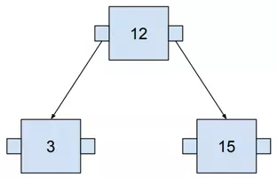

较大的数字总是在右边，较小的数字在左边。随着我们节点的增多，这种规则结构会更加清晰。

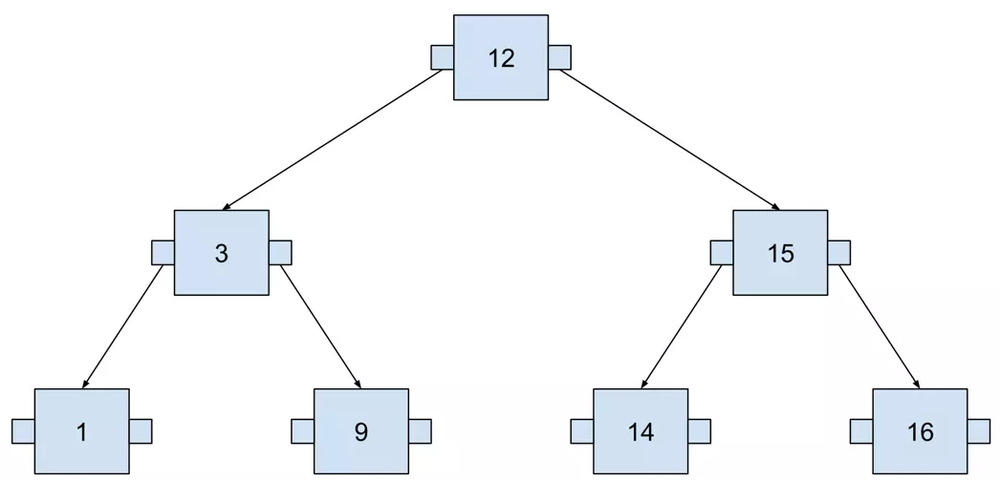

这棵树包含七个数字，我们最多需要访问三个节点才能找到任何数字。以下示例可视化了搜索 14，这里使用 SQL 来定义查询，以便将此树视为实际的数据库索引。

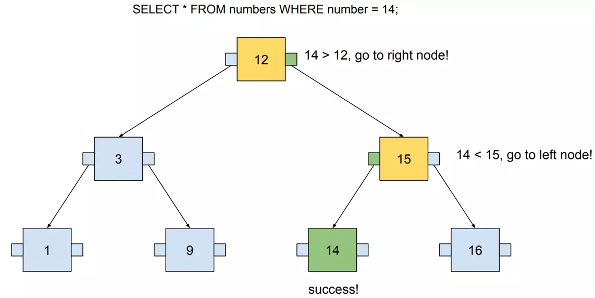

## 硬件

从理论上讲，使用二叉搜索树来运行我们的查询看起来性能不错，它的时间复杂度（搜索时）与 B 树相同，都是O(logn)。但在实现过程中，数据结构需要在实际硬件上工作，使用该数据结构构建的索引必须存储在计算机上的某个位置。

计算机有三个可以存储数据的位置：

- CPU缓存
- RAM（内存）
- 磁盘（存储）

缓存完全由 CPU 管理，缓存相对较小，通常为几兆字节。索引可能包含千兆字节的数据，因此索引不适合放在缓存里。

数据库大量使用内存 （RAM），内存有如下优点：

- 确保快速随机访问
- 它的大小可能非常大

当然内存也有一些缺点，电源关闭后数据将会丢失，与磁盘相比，价格比较昂贵。

内存的缺点就是磁盘的优点，磁盘比较便宜，掉电后数据也不会丢失。但是磁盘的访问速度相对较慢，尤其需要注意顺序读取和随机读取，只要在某些条件下磁盘读取速度较快，后面会详细解释这一点。

## 随机和顺序访问

内存可以视为一个大可以存放数据的大数组，根据数组下标对内存数据进行访问。

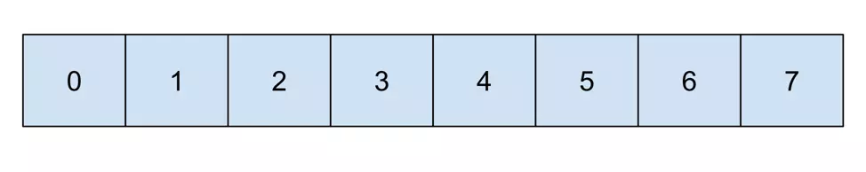

假设我们要访问下标为1，4,6的数据，我们需要随机访问。

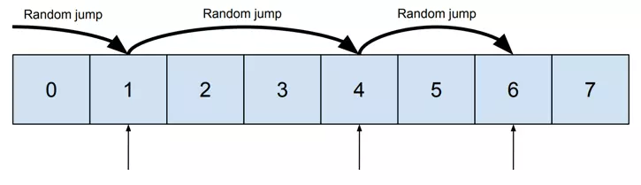

如果我们要将1,4,6的数据与3，4,5的数据进行比较，则我们可以顺序访问。

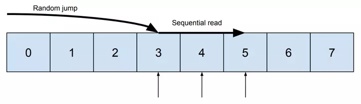

“随机读取”和“顺序读取”之间的区别是由硬盘驱动器来决定的。磁盘一般由磁头和圆盘组成。

“随机读取”需要将磁头移动到磁盘上的给定位置，而“顺序读取”只需要旋转磁盘，允许磁头读取连续值。读取数据量较大（MB以上）时，这两种访问类型之间的差异是巨大的，使用“顺序读取”可显著缩短获取数据所需的时间。

Adam Jacobs在[Acm Queue](https://queue.acm.org/detail.cfm?id=1563874)上发表的文章“The Pathologies of Big Data”中研究了随机访问和顺序访问之间的速度差异。它揭示了一些令人震惊的事实：

- HDD 上的顺序访问可能比随机访问快数十万倍
- 从磁盘按顺序读取可能比从内存中随机读取更快

现在谁还在使用机械硬盘呢？都考虑SSD了吧！但这项研究表明，完全按顺序读取 HDD 可能比 SSD 更快。但是，请注意，这篇文章是 2009 年的文章，SSD 在过去十年中得到了显着发展，因此这些结果可能已经过时。

总而言之，最关键的是我们要尽可能地选择顺序访问。在下一段中，我将解释如何将其应用于我们的索引结构。

## 优化树以实现顺序访问

二叉搜索树可以用和[堆](https://en.wikipedia.org/wiki/Binary_heap)相同的方式在内存中表示：

- 父节点位置为 i
- 左节点位置是 2i
- 右节点位置是 2i+1

以下是根据示例计算这些位置的方式（父节点从 1 开始）：

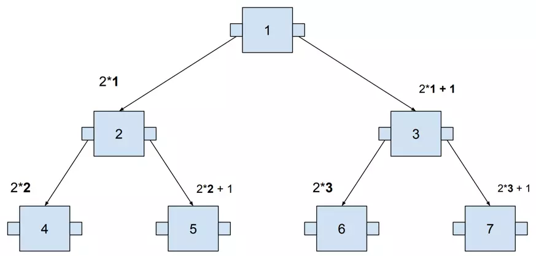

根据计算出的位置，将节点与内存对齐：

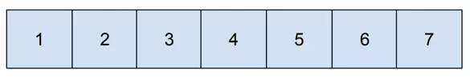

让我们回到之前的可视化查询，

它在内存级里是这个样子的：

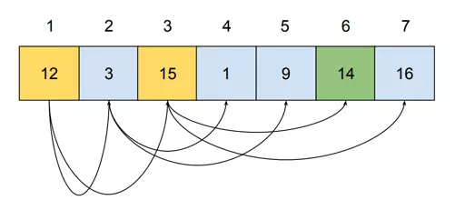

执行查询时，需要访问内存地址 1、3 和 6，访问三个节点非常快。但随着我们存储的数据越来越多，树会变得越来越高。存储超过 100 万个值需要高度至少20的树。这意味着必须从内存中不同位置读取 20 个值，这将会导致完全随机的访问！

## 页面

当一棵树长得很高时，随机访问会导致越来越多的延迟。减少这个问题的解决方案很简单：在宽度而不是高度上扩展数。这可以通过将多个值打包到单个节点中来实现。（深度访问还是广度访问的问题）

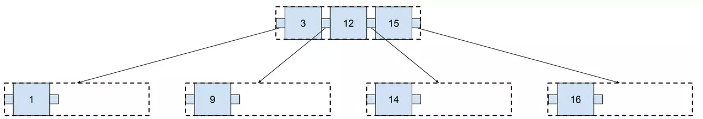

这种存储方式带来了如下好处：

- 这棵树较浅（两层而不是三层）
- 它仍然有很大的空间来容纳新的价值，而不需要进一步增长

对此类索引执行的查询如下所示：

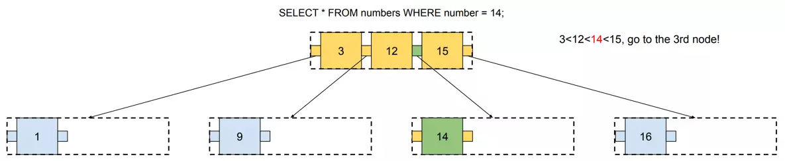

请注意，每次访问节点时，我们都需要加载节点的所有值。在此示例中，我们需要加载 4 个值（如果树已满，则为 6 个值）才能到达我们正在寻找的值。下面，我们来看看这颗查询树在内存中的可视化效果：

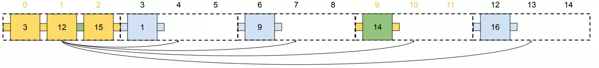

与前面的示例（树的高度增长）相比，此搜索速度应该更快。我们只需要随机访问两次（跳转到单元格 0 和 9），然后按顺序读取其余值。

随着我们数据库的增长，这个解决方案的效果越来越好。如果要存储 100 万个值，则需要：

- 有 20 层（高度20）的二叉搜索树
- 有 10 层（高度10）的 3 值节点树

来自单个节点的值构成一个页面，在上面的示例中，每个页面（节点）由三个值组成。页面是放置在彼此相邻的磁盘上的一组值，因此数据库可以通过一次顺序读取一次读取整个页面。

那么在实际的数据库中，页面是如何实现的呢？[Postgres页面](https://www.postgresql.org/docs/current/storage-toast.html#:~:text=PostgreSQL%20uses%20a%20fixed%20page,tuples%20to%20span%20multiple%20pages.) 大小为 8kB。假设 20% 用于元数据，因此还剩 6kB，需要一半的页面来存储指向节点子节点的指针，因此它为我们提供了 3kB 的值。BIGINT 大小为 8 个字节，因此我们可以在单个页面中存储 ~375（3*1024/8） 个值。

假设数据库中一些相当大的表有 10 亿行，我们需要在 Postgres 树中存储多少个级别来存储它们？根据上面的计算，如果我们创建一个可单个节点包含375 个值的树，存储 10 亿个值时树只有4层（高度4）。二叉搜索树需要 30 层（高度30）才能处理如此数量的数据。

总而言之，在树的单个节点中放置多个值有助于我们降低其高度，从而利用顺序存取的好处。此外，B-树不仅可以在高度上增长，还可以在宽度上增长（通过使用更大的页面）。

## 平衡

数据库中有两种类型的操作：写入和读取。在上一节中，我们解决了从 B-树中读取数据的问题。尽管如此，写作也是一个至关重要的部分。在将数据写入数据库时，B-树需要不断更新新值。

树的形状取决于添加到树中的值的顺序，它在二叉树中很容易看到。如果值以不正确的顺序相加，我们可能会获得具有不同深度的树。

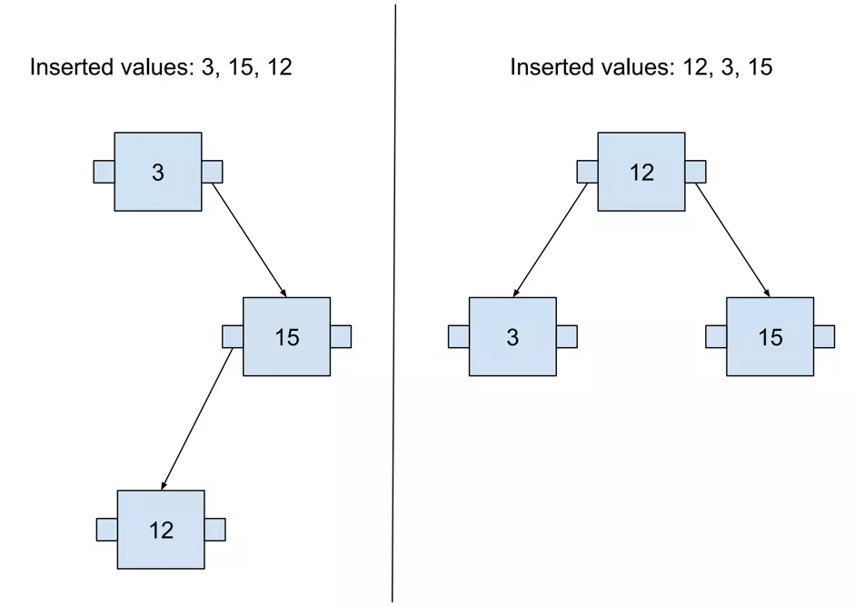

当树在不同的节点上具有不同的深度时，称为不平衡树。基本上有两种方法可以将这样的树恢复到平衡状态:

- 只需按正确的顺序添加值即可从头开始重建它。
- 随着新值的添加，始终保持平衡。

B-树实现选择第二个选项。使树始终保持平衡的功能称为自平衡。

## 自平衡算法示例

构建 B-树只需创建一个节点并添加新值即可开始，直到其中没有可用空间。

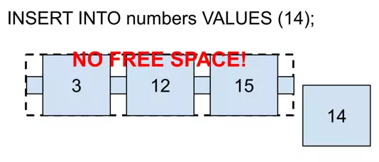

如果对应页面上没有空间了，则需要分叉。要执行分叉，需要选择“分叉点”。在这种情况下，它将是 12，因为它位于中间。“分叉点”是将移动到上层页面的值。

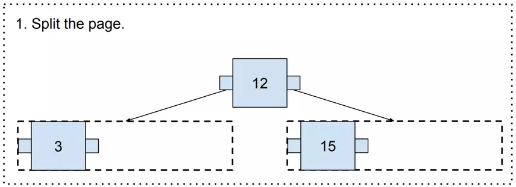

现在，出现了一种有趣的场景——“分叉点”没有上页。在这种情况下，需要生成一个新的页面（“分叉点”将成为新的根页面！）

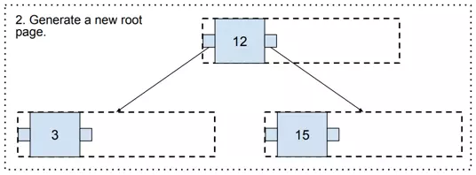

最后，这三个中有一些可用空间，因此可以添加值 14。

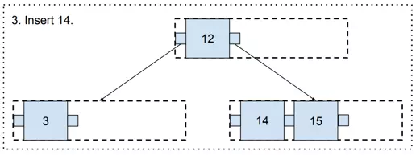

按照这个算法，我们可以不断地向 B 树添加新的值，并且它会一直保持平衡！

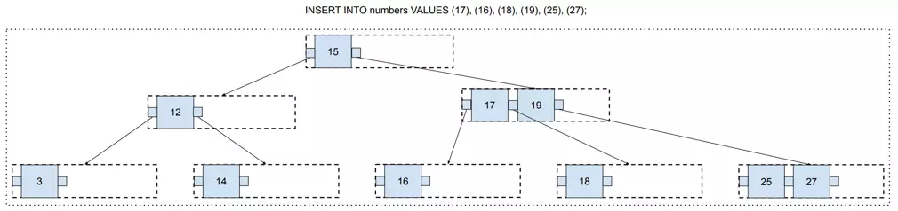

在这一点上，您可能有一个合理的担忧，即有很多可用空间没有机会被填充。例如，值 14、15 和 16 位于不同的页面上，因此这些页面将永远只有一个值和两个可用空间。

这是由拆分位置选择引起的。我们总是在中间拆分页面。但是每次我们进行拆分时，我们都可以选择我们想要的任何拆分位置。

Postgres 有一个算法，每次执行拆分时都会运行！它的实现可以在 Postgres 源代码的 [_bt_findsplitloc（）](https://github.com/postgres/postgres/blob/54ccfd65868c013a8c6906bc894bc5ea3640740a/src/backend/access/nbtree/nbtsplitloc.c#L87) 函数中找到。它的目标是尽可能少地留出可用空间。

## 总结

在本文中，您了解了 B-树的工作原理。总而言之，它可以简单地描述为具有两个变化的二叉搜索树：

- 每个节点可以包含多个值
- 使用自平衡算法插入新值