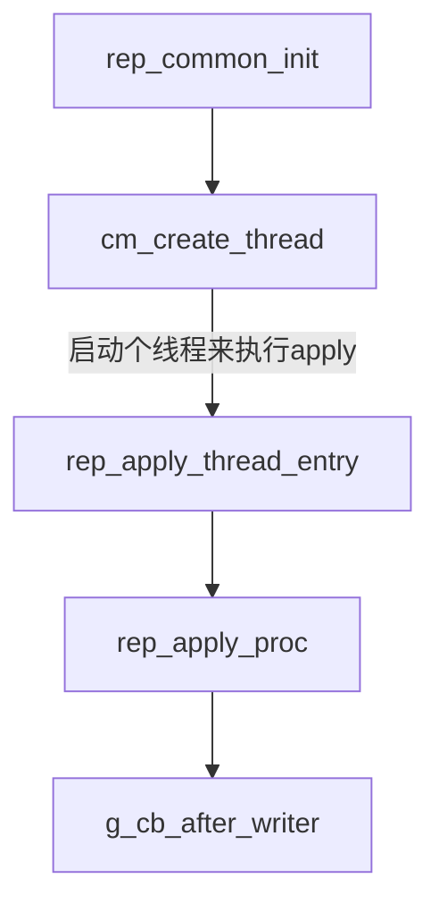
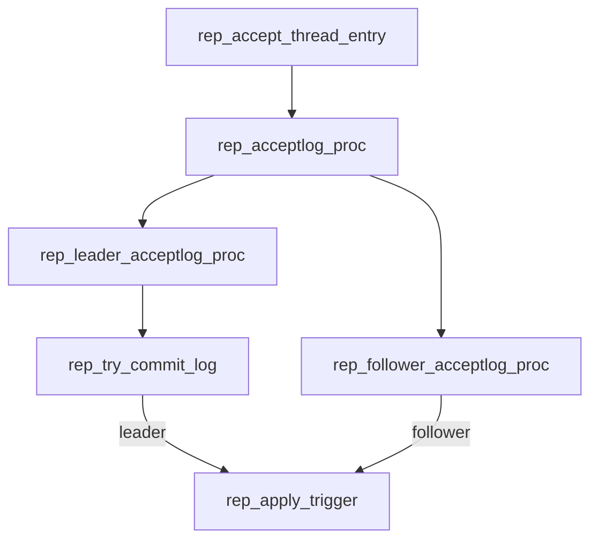
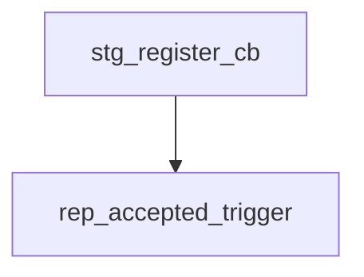
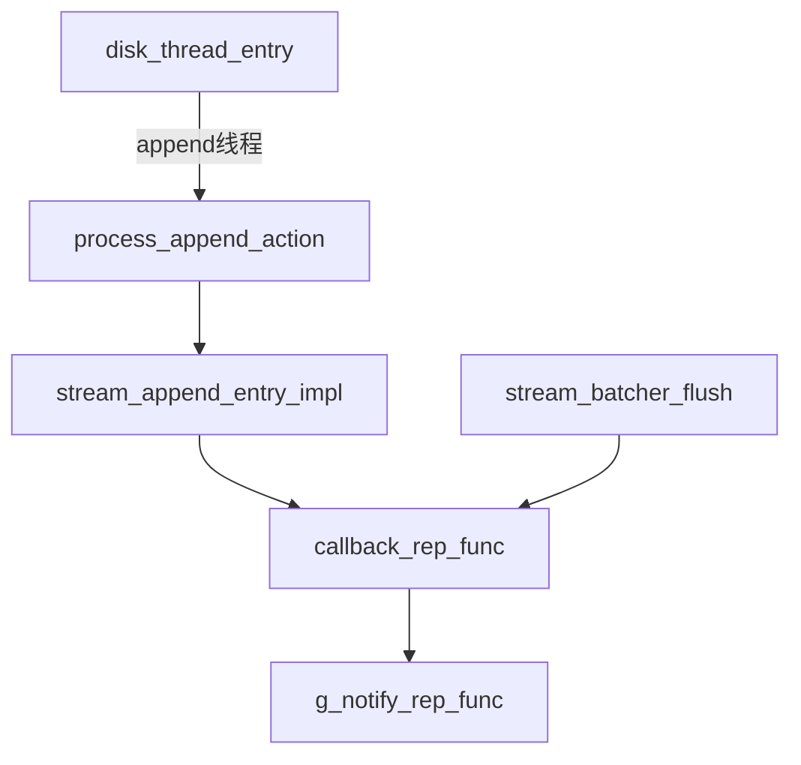

# dcf写入机制

## 写入

dcf提供如下两个写入接口：

- ***dcf_write***
  
  ```c
  int dcf_write(unsigned int stream_id, const char* buffer, unsigned int length, unsigned long long key, unsigned long long *index);
  ```
  
  仅在leader节点调用。

- ***dcf_universal_write***
  
  ```c
  int dcf_universal_write(unsigned int stream_id, const char* buffer, unsigned int length, unsigned long long key, unsigned long long *index);
  ```
  
  可以在任意节点调用。

## 确认

- ***dcf_register_after_writer***
  
  用于注册leader节点写入成功回调函数。
  
  ```c
  int dcf_register_after_writer(usr_cb_after_writer_t cb_func)
  {
      return rep_register_after_writer(ENTRY_TYPE_LOG, cb_func);
  }
  ```
  
  最终将回调函数注册到全局变量
  
  ```c
  int rep_register_after_writer(entry_type_t type, usr_cb_after_writer_t cb_func)
  {
      g_cb_after_writer[type] = cb_func;
      return CM_SUCCESS;
  }
  ```
  
  调用流程如下：



  线程在等待条件变量释放，并执行apply。

```c
// 先查出有多少条流
if (md_get_stream_list(streams, &stream_count) != CM_SUCCESS) {
        LOG_DEBUG_ERR("[REP]md_get_stream_list failed");
        return;
    }
while (!thread->closed) { // 若线程没有关闭则循环等待
        if (!exists_log) { // 首先判断是否存在日志，不存在就休眠等待唤醒
            (void)cm_event_timedwait(&g_apply_cond, CM_SLEEP_500_FIXED);
        }
        LOG_TRACE(g_rep_tracekey, "apply_thread work");
        exists_log = CM_FALSE;
        for (uint32 i = 0; i < stream_count; i++) { // 遍历每一条流
            uint32 stream_id = streams[i];
            bool8 stream_exists_log = CM_FALSE;
            LOG_TIME_BEGIN(rep_apply_proc);
            // 执行apply
            if (rep_apply_proc(stream_id, &stream_exists_log) != CM_SUCCESS) {
                LOG_DEBUG_ERR_EX("[REP]rep_apply_proc failed.");
            }
            LOG_TIME_END(rep_apply_proc);

            exists_log = (exists_log || stream_exists_log);
        }
    }
```

  其中等待的条件变量为，在如下的地方唤醒。

```c
void rep_apply_trigger()
{
  LOG_DEBUG_INF("[REP]rep_apply_trigger");
  LOG_TRACE(g_rep_tracekey, "common:rep_apply_trigger.");
  cm_event_notify(&g_apply_cond);
}
```

  rep_apply_trigger的调用栈如下;



经过上面调用流程可以看到，apply线程是由accept线程唤醒的。accept线程与apply线程类似，同样是等待条件变量将线程唤醒。

```c
if (md_get_stream_list(streams, &stream_count) != CM_SUCCESS) {
        LOG_DEBUG_ERR("[REP]md_get_stream_list failed");
        return;
    }

    while (!thread->closed) {
        if (!exists_log) {
            LOG_TRACE(g_rep_tracekey, "accept_thread wait.");
            (void)cm_event_timedwait(&g_accept_cond, CM_SLEEP_500_FIXED);
        }
        LOG_TRACE(g_rep_tracekey, "accept_thread work.");

        exists_log = CM_FALSE;
        for (uint32 i = 0; i < stream_count; i++) {
            uint32 stream_id = streams[i];
            date_t now = g_timer()->now;
            exists_log = (exists_log || g_common_state[stream_id].accept_log);
            if (g_common_state[stream_id].accept_log ||
                now - g_common_state[stream_id].last_accept_time > CM_DEFAULT_HB_INTERVAL*MICROSECS_PER_MILLISEC) {
                LOG_TRACE(g_rep_tracekey, "accept_thread do work.");
                g_common_state[stream_id].accept_log = CM_FALSE;
                g_common_state[stream_id].last_accept_time = now;
                if (rep_acceptlog_proc(stream_id) != CM_SUCCESS) {
                    LOG_DEBUG_ERR("[REP]rep_acceptlog_proc failed.");
                }
            } else {
                LOG_TRACE(g_rep_tracekey, "accept_thread no work.");
            }
        }
    }
```

accept线程等待的条件变量为g_accept_cond，其唤醒流程如下：

```c
void rep_set_accept_flag(uint32 stream_id)
{
    LOG_DEBUG_INF("rep_set_accept_flag.");
    g_common_state[stream_id].accept_log = CM_TRUE;
    cm_event_notify(&g_accept_cond);
}
```

rep_set_accept_flag调用堆栈如下：



可以看已看到accept线程的唤醒是通过注册回调函数来触发的。

```c
    if (stg_register_cb(ENTRY_TYPE_LOG, rep_accepted_trigger) != CM_SUCCESS) {
        LOG_DEBUG_ERR("[REP]rep register stg callback failed");
        return CM_ERROR;
    }
```

```c
status_t stg_register_cb(entry_type_t type, void *func)
{
    switch (type) {
        case ENTRY_TYPE_CONF:
            g_write_conf_func = (write_conf_func_t)func;
            break;
        case ENTRY_TYPE_LOG:
            g_notify_rep_func = (notify_rep_func_t)func;
            break;
        default:
            LOG_RUN_ERR("[STG]Register callback failed");
            return CM_ERROR;
    }
    return CM_SUCCESS;
}
```

可以看到回调函数最终被注册到了g_notify_rep_func。



可以看到其中一个回调函数是由append线程触发的，

dd

- ***dcf_register_consensus_notify***
  
  用于注册follower节点写入数据成功的回调函数。
