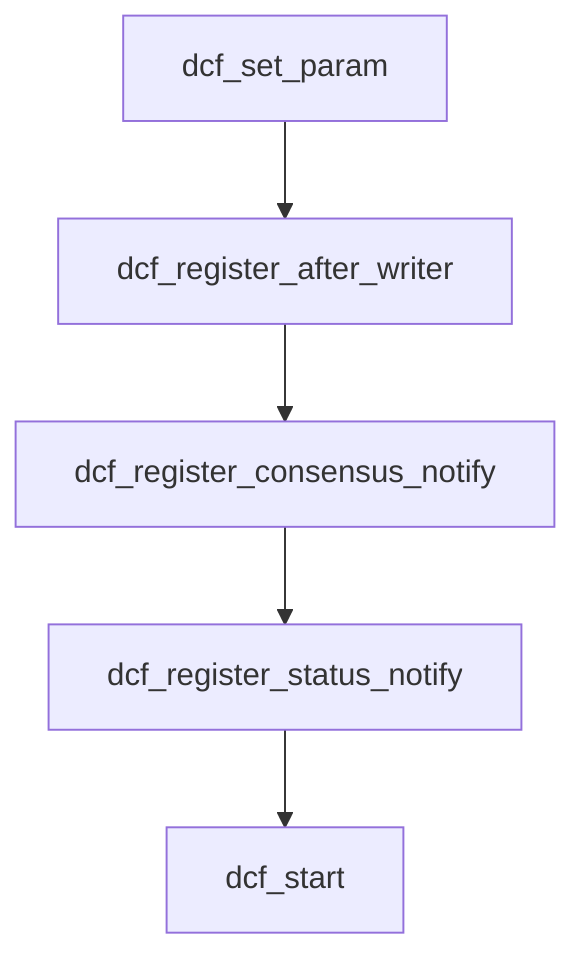
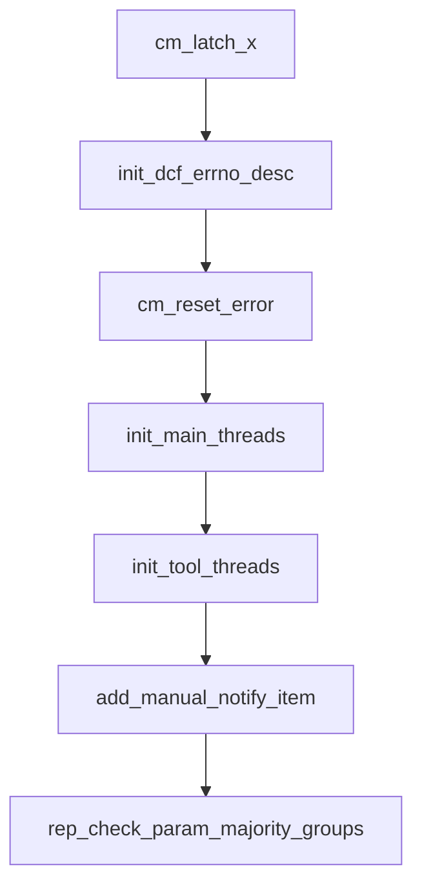
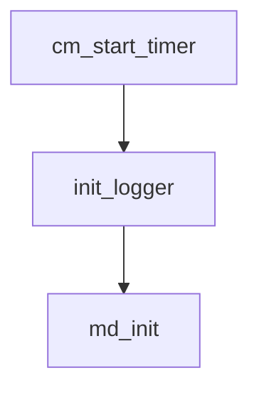

# openguass dcf源码阅读

## 启动流程

- main

```mermaid
graph TB
dcf_set_param-->dcf_register_after_writer-->dcf_register_consensus_notify-->dcf_register_status_notify-->dcf_start
```

- dcf_start
  

```mermaid
graph TB
cm_latch_x-->init_dcf_errno_desc-->cm_reset_error-->init_main_threads-->init_tool_threads-->add_manual_notify_item-->rep_check_param_majority_groups
```

- init_main_threads
  

```mermaid
graph TB
cm_start_timer-->init_logger-->md_init
```