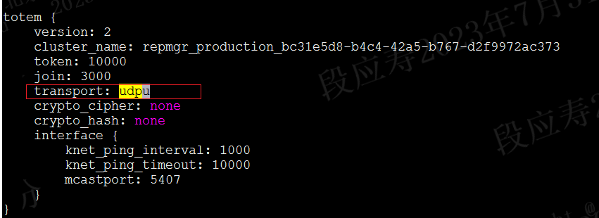
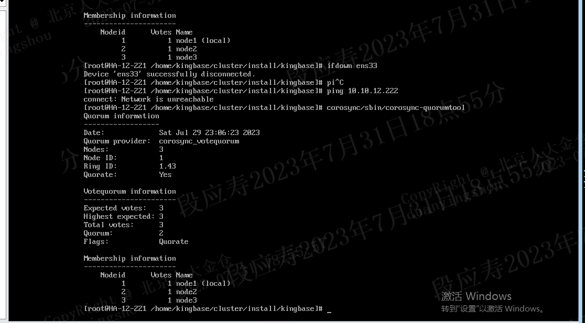

# corosync down网卡仍处于多数派问题分析

## 问题现象

corosync三节点集群，未启用vote_quorum，没有qdevice进程。使用ifdown停掉网卡后，节点仍处于quorate状态。

corosync使用的通信方式为udpu。

使用如下命令down掉网卡，格一段时间后查看节点的quorate状态，发现仍处于quorate。实际上网络不通应处于非quorate状态。

当前的同城双中心集群数据库fence依赖于corosync的quorate状态，只有当corosync处于非quorate状态超过20秒时才会停止数据库。
当down掉网卡时，实际网络不通，但因为仍处于quorate状态未停止数据库。但本中心已无法和observer及其他中心通信，因为会触发observer执行跨中心切换，将主库切换到另一个中心。当重新up网卡，网路恢复，此时生成中心的主库未停止，灾备中心也有了新主库，导致出现脑裂双主。

## 问题原因

在down掉网卡时，节点的quorate状态应改变为非quorate。

这个问题是corosync的已知问题，社区在这个补丁里对这个问题进行了修复，https://github.com/corosync/corosync/pull/685，我们的corosync没合入这个补丁。但这个补丁里提到udpu会存在这个问题，knet方式不会，补丁里的修复解决方式也不是最完美的，建议使用knet。

## 问题解决

这个问题是corosync的已知问题，社区在这个补丁里对这个问题进行了修复，https://github.com/corosync/corosync/pull/685，我们的corosync没合入这个补丁。但这个补丁里提到udpu会存在这个问题，knet方式不会，补丁里的修复解决方式也不是最完美的，建议使用knet。

### 对于开发来说

1. 合入社区相关补丁代码；
2. 详细分析udpu和knet的通信方式的区别，并输出分析文档，给出选择那种通信方式；
3. 对比我们当前的corosync代码与corosync社区的代码，有哪些bug是我们未合入的，并分析是否需要合入；
4. 后续持续跟踪corosync社区的代码，并及时跟进更新；

### 对于测试来说

应模拟测试多种故障场景，尤其是网络故障，不能光以关机重启或者chaos-blade工具模拟，应按照实际的使用场景来模拟测试。

在原有关机、重启，chaos-blade工具模拟网络故障外，还应增加如下测试场景：

1. 开防火墙；
2. 停网卡服务；
3. ifdown网卡；
4. 拔网线；