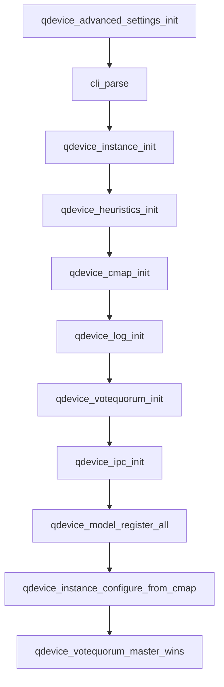
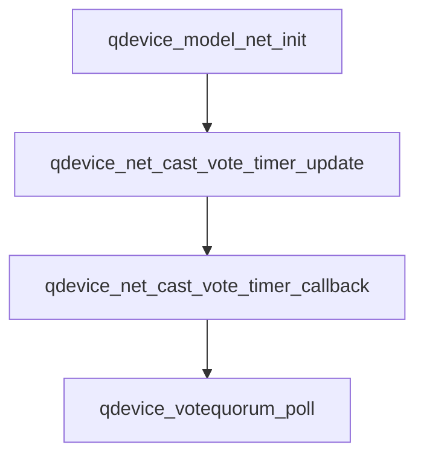

# corosync-qnetd投票机制

corosync-qnetd是corosync的第三方仲裁机制，当corosync出现网络分区时，集群内部无法选择出quorate一方时，就会借助corosync-qnetd来进行辅助投票。

- corosync-qnetd作为服务端，会根据各分区连接到qnetd的客户端数目，完成启发式算法的客户端数目等信息来对各分区节点进行投票
- corosync-qdevice作为客户端会连接到qnetd，同时在本地会执行一组启发式命令，并将启发式命令执行结果发送到qnetd
- corosync-qnetd根据ring id来区分不同的分区

## corosync-qdevice





### qdevice重要API

>
>
>votequorum_qdevice_register 用于注册一个新的仲裁设备。 仲裁设备是向小型集群添加投票的外部方式。 仲裁设备实际上是集群中的一个伪节点，它根据一些外部设备（通常是共享磁盘分区或网络路由器）提供投票。
>此调用会创建设备，但不会将其标记为活动的。 必须调用 votequorum_qdevice_poll 才能将选票包含在法定人数计算中。
>name 是包含仲裁设备信息名称的字符串。 它是简单的由 votequorum 存储，用于 corosync-quorumtool 的显示，最多可以是 254 个字符。
>仲裁设备贡献的票数对于 votequorum 是已知的，它是在 cmap quorum.device.votes 中设置的，而不是由设备设置的。
>请注意，仲裁设备子系统（未作为 votequorum 的一部分提供）负责让所有节点了解仲裁设备状态。

```c
#include <corosync/votequorum.h>
int votequorum_qdevice_register(votequorum_handle_t handle, const char * name);
```

>
>
>votequorum_qdevice_poll 由仲裁设备子系统（未作为 votequorum 的一部分提供）调用，以告知投票系统仲裁设备是否存在/活动。 如果 cast_vote 为 1，则设备的投票包含在仲裁计算中，否则不包含。 当前的 ring_id 必须设置（votequorum_notification_fn 回调被调用时获取）否则轮询被忽略。 应定期调用此例程，以确保设备状态始终为 votequorum 所知。 如果在（默认）10 秒（或同步阶段为 30 秒）内未调用 votequorum_qdevice_poll，则该设备将被视为已死，并将其投票从集群中删除。 这不会取消注册设备。 默认轮询时间可以通过为正常操作设置 cmap 变量 quorum.device.timeout 或为同步阶段设置 quorum.device.sync_timeout 来更改。

```c
#include <corosync/votequorum.h>
int votequorum_qdevice_poll(votequorum_handle_t handle, const char * name, unsigned int cast_vote, votequorum_ring_id_t ring_id);
```

## vote_quorum

>
>
>每次投票配置即将改变（例如节点加入或离开集群）时，都会调用votequorum_nodelist_notification_fn_t回调。 回调函数由以下类型定义描述：
>
>```c
>typedef void (*votequorum_nodelist_notification_fn_t) (
>        votequorum_handle_t handle,
>        uint64_t context,
>        uint32_t node_list_entries,
>        uint32_t node_list[]
>        );
>```
>
>当前的 ring_id（votequorum_quorum_notification_fn_t获取）必须传递给 votequorum_qdevice_poll 以使 qdevice 投票有效。
>
>每次仲裁状态改变（例如节点加入或离开集群）时，都会调用votequorum_quorum_notification_fn_t回调。 回调函数由以下类型定义描述：
>
>```c
>typedef void (*votequorum_quorum_notification_fn_t) (
>        votequorum_handle_t handle,
>        uint64_t context,
>        uint32_t quorate,
>        uint32_t node_list_entries,
>        votequorum_node_t node_list[]
>        );
>```
>
>

