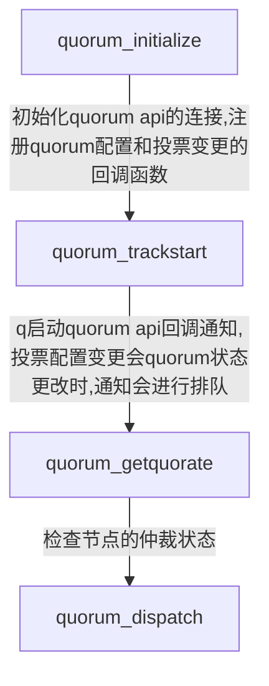
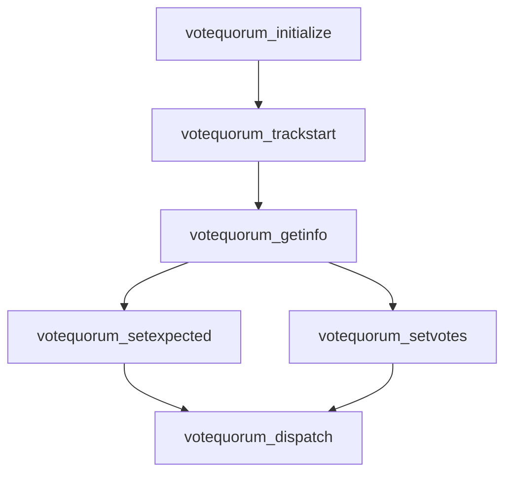

# corosync使用

## 编译

### 依赖

[corosync](https://github.com/corosync/corosync.git)编译依赖[libqb](https://github.com/ClusterLabs/libqb)和[kronosnet](https://github.com/kronosnet/kronosnet/)。

- 系统库依赖

```shell
 sudo apt-get install libgcrypt20-dev libzstd-dev liblzo2-dev liblzma-dev libbz2-dev libsctp-dev doxygen libnl-3-dev libnl-route-3-dev
```

- 编译libqb
  
  ```shell
  git clone https://github.com/ClusterLabs/libqb.git
  cd libqb
  ./autogen.sh
  ./configure
  make -j 32
  sudo make install
  ```

- 编译kronosnet
  
  ```shell
  git clone https://github.com/kronosnet/kronosnet.git
  cd kronosnet
  ./autogen.sh
  ./configure
  make -j 32
  sudo make install
  ```

- 编译corosync
  
  ```shell
  git clone https://github.com/corosync/corosync.git
  cd kronosnet
  ./autogen.sh
  ./configure
  make -j 32
  sudo make install
  ```

## 使用

### 配置

#### totem协议配置

- op协议相关
  
  - token_retransmit
    
    - Processor在转发完token后，在多长时间内没有收到token或消息后，将引发token重传。
    - 默认值：238ms
    - 如果设置了下面的token值，本值由程序自动计算
  
  - token
    
    - Processor在多长时间内没有收到token（中间包含token重传）后，将触发token丢失事件（将激活MembershipProtocol，进入Gather状态）。
    - 默认值：1000ms
  
  - hold
    
    - 在Ring不怎么繁忙时，RingRepresentative在转发token前，休息多长时间。
    
    - 默认值：180ms
    
    - 本值通常由程序根据地其他选项自动计算。
  
  - token_retransmits_before_loss_const
    
    - Token最大重传次数
    
    - 默认值：重传4次
    
    - 若设置本值，token_retransmit和hold的值，由程序根据地本值和token值计算。
  
  - fail_recv_const
    
    - 在多少次token循环中，没有收到任何消息（本该收到消息：token.seq>my_aru），超过这个次数将激活Membership 
      Protocol，进入Gather状态。
    
    - 默认值：2500次

- mp协议相关
  
  - join
    
    - Processor在发送JoinMsg后，在多长时间内没有收到其他成员的JoinMsg，将引发JoinMsg重传。
    
    - 默认值：50ms
  
  - send_join
    
    - 当Processor数量比较大时（>30），某个节点的加入/离开，可能造成各节点瞬间同时发出JoinMsg，造成网络拥塞。通过设置此值，程序发送JoinMsg前，将随机等待[0,send_join]区间内的某个时长。
    - 默认值：0ms
  
  - consensus
    
    - Processor从进入Gather状态起，在多长时间内必须使（my_proc_set-my_fail_set）集合的成员达到consensus（被标记为true）。否则清除已被标记为true的成员，重发JoinMsg。
    
    - 若设置此值，必须>=1.2*token。
    
    - 若未设置此值，程序将按1.2*token值处理。

- rp协议相关
  
  - rrp_mode
    
    ReplicationStyle，可能的值：none, active, passive
  
  - rrp_token_expired_timeout
    
    在多长时间内，没有从任意一个冗余网络中收到token，则把ProblemCounter增1。认值：47ms。
  
  - rrp_problem_count_timeout
    
    在多长时间内，如果某个网络没被标记为faulty，则把ProblemCounter减1。默认值：2000ms。
  
  - rrp_problem_count_threshold
    
    当ProblemCounter达到某个值后，则把某个网络标记为faulty，默认值：10

- 流量控制配置
  
  - window_size
    
    在一次token的循环中，整个集群可以广播的最大的消息数
  
  - max_messages
    
    节点在拿到token后，可以广播的最大消息数。

### 运行

### 消息写入流程

> 当客户端向本地 corosync发起写请求时,corosync需要等待令牌,当拿到令牌后,才能向其它corosync节点广播消息，各节点持久化完成后会以单播的方式告诉发起节点持久化结果，发起节点判断如果大于1/2的节点完成,向客户端返回写成功。令牌环中节点只要有异常,就会重新生成新的环, leader就会重新选。

### testquorum



### testvotequorum1



## FAQ

1. 如何修改corosync监听端口
   
   ```shell
   totem {
       version: 2
       secauth: off
       crypto_cipher: none
       crypto_hash: none
       threads: 0
       clear_node_high_bit: no
       rrp_mode: none
       transport: udp
       token: 1000
       interface {
           ringnumber: 0
           ttl: 45
           mcastport: 5406
       }
   }
   ```
   
   修改后执行结果如下：
   
   ```shell
   ha@ha-virtual-machine:~$ netstat -anp | grep udp
   (Not all processes could be identified, non-owned process info
    will not be shown, you would have to be root to see it all.)
   udp        0      0 0.0.0.0:51896           0.0.0.0:*                           -
   udp        0      0 127.0.0.53:53           0.0.0.0:*                           -
   udp        0      0 0.0.0.0:5353            0.0.0.0:*                           -
   udp        0   2304 192.168.145.130:5405    0.0.0.0:*                           -
   udp        0      0 0.0.0.0:631             0.0.0.0:*                           -
   udp6       0      0 :::41918                :::*                                -
   udp6       0      0 :::5353                 :::*                                -
   ha@ha-virtual-machine:~$ sudo /etc/init.d/corosync stop
   ha@ha-virtual-machine:~$ sudo vim /etc/corosync/corosync.conf
   ha@ha-virtual-machine:~$ sudo /etc/init.d/corosync start
   Starting corosync (via systemctl): corosync.service.
   ha@ha-virtual-machine:~$ netstat -anp | grep udp
   (Not all processes could be identified, non-owned process info
    will not be shown, you would have to be root to see it all.)
   udp        0      0 0.0.0.0:51896           0.0.0.0:*                           -
   udp        0      0 127.0.0.53:53           0.0.0.0:*                           -
   udp        0      0 0.0.0.0:5353            0.0.0.0:*                           -
   udp        0   2304 192.168.145.130:5406    0.0.0.0:*                           -
   udp        0      0 0.0.0.0:631             0.0.0.0:*                           -
   udp6       0      0 :::41918                :::*                                -
   udp6       0      0 :::5353                 :::*                                -
   ha@ha-virtual-machine:~$
   ```

2. 各节点持久化完成后会以单播的方式告诉发起节点持久化结果，所以这个时候其实不管客户端有没有返回成功，本地都已经更新了，那就出现了个节点状态不一致的情况？所以读的时候读的是更新前的？新的会回滚掉？

3. 节点如何绑定多个分组

4. cpg_dispatch是不是阻塞的
   
   是阻塞的，其内部执行逻辑是一个死循环。

5. corosync内部重传机制

6. corosync挂死如何处理

7. 不需要quorum的写接口是什么

8. 应用层回调的触发场景和条件是什么

# reference

1. https://www.cnblogs.com/yuzhaoxin/p/4911679.html
