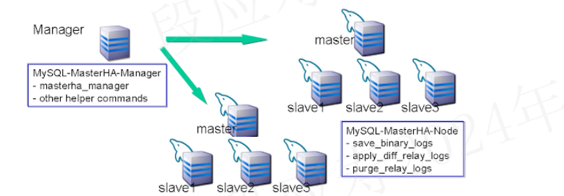
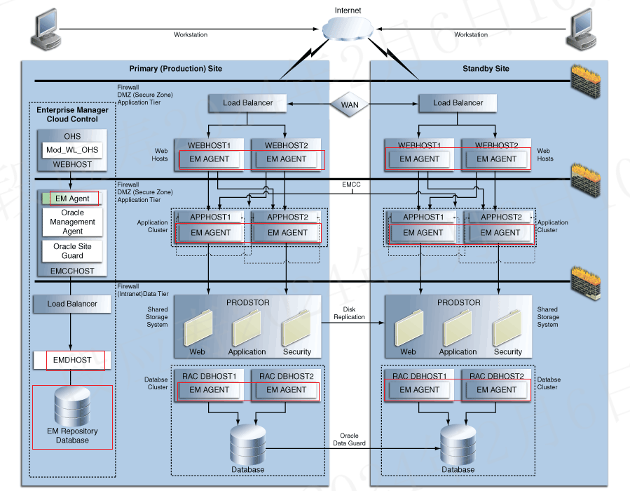
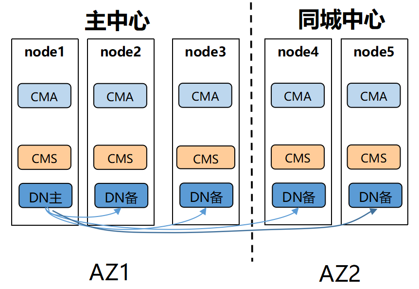
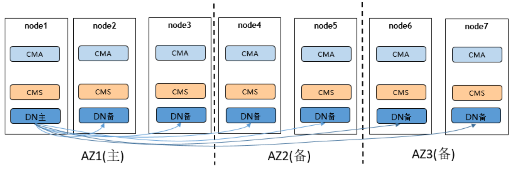
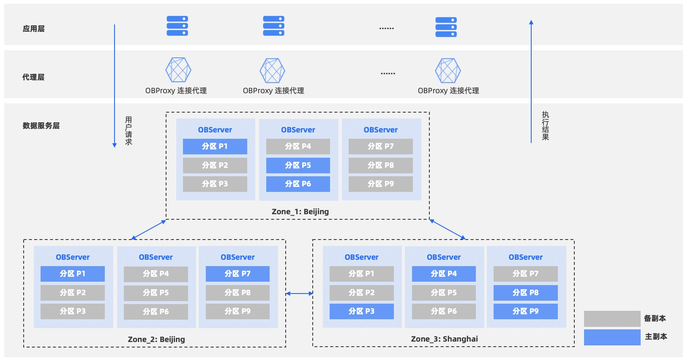

# ha元信息常见存储方式

|ha产品|高可用架构|元信息存储方式|
|------|-------|--------------|
|mysql mha|mha manager+mha node|第三方存储（zookeeper）|
|oracle site guard|EMAGENT+EMHOST|第三方存储（oracle数据）|
|openguass|dcf|节点自己存储（分布式存储dcf）|
|oceanbase|paxos|节点自己存储（分布式存储paxos）|

## mysql mha

[源码地址](https://github.com/yoshinorim/mha4mysql-manager)

mysql MHA(Master High Availability)是mysql高可用一套相对成熟的解决方案。MHA 由 MHA 管理器和 MHA 节点组成。

- MHA Manager 是包含监控 MySQL 主站、控制主站故障转移等功能的管理器程序。

MHA Manager 可以单独部署在一台独立的机器上，管理多个 master-slave 集群；也可以部署在一台 slave 节点上。
MHA Manager 会定时探测集群中的 master 节点。当 master 出现故障时，
它可以自动将最新数据的 slave提升为新的 master， 然后将所有其他的 slave 重新指向新的 master。整个故障转移过程对应用程序完全透明。

- MHA node包含解析 MySQL 二进制/中继日志、识别中继日志位置、将中继日志应用于其他从站、将事件应用于目标从站等功能的故障转移程序脚本，MHA 节点在每个 MySQL 服务器上运行。

mha node和数据库运行在一起，作为mha的代理，负责监控数据库，并且连接MHA manager注册并上报信息。
当 MHA 管理器执行故障转移时，MHA 管理器通过 SSH 连接 MHA node，并在需要时执行 MHA 节点命令。

在标准的方案中，mha manager是一个节点，当mha manager故障后，将无法进行自动故障转移。（即mha存在单点问题）

mha的架构大致如下，每个数据库节点上的mha node未在图中体现：

### 结论

- 在不考虑mha manager单点问题的场景下，mysql mha不需要持久化存储元信息，通过mha node主动向mha manager注册和上报数据库状态信息来进行数据库故障转移。
- 在考虑mha manager单点问题的场景下，一般引入zookeeper来保存mha manager节点的信息，以及通过zookeeper来判断那个mha manager提供服务。并在当前服务的mha manager故障时，切换到另一个mha manager.

### reference

1. https://github.com/yoshinorim/mha4mysql-manager/wiki/Architecture
2. https://github.com/yoshinorim/mha4mysql-manager/wiki/Advantages
3. https://github.com/yoshinorim/mha4mysql-manager/wiki
4. https://www.cnblogs.com/keme/p/9707755.html

## oracle site guard

Oracle Site Guard 是一种灾难恢复解决方案，使管理员能够自动执行完整的站点切换或故障转移。
Oracle site Guard故障转移主要依赖于EMAGENT和和EMHOST通信。
- EMAGENT和数据库运行在同一个节点上，会定期向EMHOST上报数据库状态信息，同时也会接收来自EMHOST的相关命令。
- EMHOST一般运行在单独的节点上，负责对多个服务进行高可用管理。

EMHOST和EMAGENT是一套通用的机制，通过在部署服务的节点上部署EMAGENT，就可以实现该服务的高可用机制，由EMHOST统一管理。因而EMHOST可以实现多种服务的高可用，而不局限于数据库。

EMHOST会将元数据保存到oracle数据库中，这个数据库被称为EM Repository Database。通常EMDB只是一个节点，因而会存在单点问题。

oracle site Guard的详细架构如下图所示：

 

### 结论

- 在不考虑EMHOST单点问题的场景下，EMHOST将数据保存在EMDB数据库中。

### reference

1. https://docs.oracle.com/cd/E24628_01/server.121/e52894/concepts.htm#GUARD126
2. https://www.oracle.com/a/tech/docs/siteguard-app-dr-pca.pdf

## OpenGauss 多地高可用架构

openguass同城双中心的架构图如下：

openguass两地三中心的机构如下：

从上面的架构图可以看出，openguass的集群架构是完全对等的架构，不存在proxy和manager。每个节点上的CMS就负责了节点之间的通信和集群状态维护。

### 结论

openguass集群元信息采用分布式方式保存，每个节点都会保存一份元数据。

### reference

1.https://docs-opengauss.osinfra.cn/zh/docs/5.0.0/docs/TechnicalWhitePaper/%E9%83%A8%E7%BD%B2%E6%96%B9%E6%A1%88.html
2.https://docs-opengauss.osinfra.cn/zh/docs/5.0.0/docs/AboutopenGauss/DCF.html

## OceanBase 两地三中心

oceanbase的高可用架构如下：

因为oceanbase本身采用shared-nothing来实现分布式数据库，每个节点都是对等的，因而其数据库元信息也是保存在每个节点上的。

### 两地两中心主备库

用户希望达到地域级容灾，但是每个地域只有一个机房时，可以采用主备库架构，选择一个地域作为主地域，部署主集群，另一个地域部署备集群。当备地域不可用时，不影响主地域的业务服务；当主地域不可用时，备集群可以激活为新主集群继续提供服务，这种情况下可能会丢失业务数据。

更进一步，用户可以利用两地两中心实现双活，部署两套主备库，两个地域互为主备。这样可以更加高效利用资源，并且达到更高的容灾能力。

### 三地三中心五副本

为了支持地区级无损容灾，通过 Paxos 协议的原理可以证明，至少需要 3 个地区。OceanBase 数据库采用的是两地三中心的变种方案：三地三中心五副本。该方案包含三个城市，每个城市一个机房，前两个城市的机房各有两个副本，第三个城市的机房只有一个副本。和两地三中心的不同点在于，每次执行事务至少需要同步到两个城市，需要业务容忍异地复制的延时。

### 三地五中心五副本

和三地三中心五副本类似，不同点在于，三地五中心会把每个副本部署到不同的机房，进一步强化机房容灾能力。

### 结论

oceanbase集群元信息采用分布式方式保存，每个节点都会保存一份元数据。

### reference

1. https://www.oceanbase.com/docs/community-observer-cn-0000000000161661
2. http://www.oceanbase.wiki/concept/data-reliability-and-high-availability/high-availability-architecture/overview-of-high-availability-architecture