# 中移动数据库停库问题分析解决

| 编写人 | 编写内容     | 编写时间       |
| --- | -------- | ---------- |
| 段应寿 | 初稿       | 2023-06-03 |
| 段应寿 | 补充完善解决方案 | 2023-06-07 |

## 问题描述

同城双中心，主中心数据库停库，且未触发中心间切换。

## 问题分析

### 主中心停库原因

#### 主库停库分析

查看主库68的kbha.log，可以看到主库在2023-06-03 05:19:20失去了多数派。

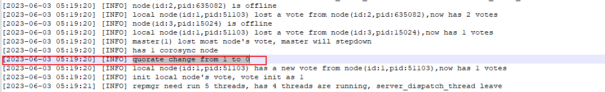

少数派持续了一分多钟后，在2023-06-03 05:20:03重新进入多数派,这中间相差**43秒**。

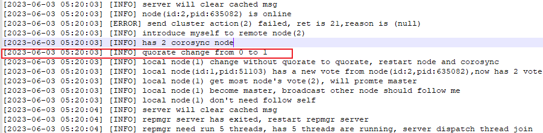

在这个过程中，数据库因为处于少数派超时导致数据库停库,可以看到从少数派到停库经过的时间为**21秒**。

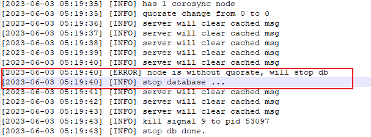

根据repmgr.conf中的配置，

```shell
reconnect_attempts=5
reconnect_interval=6
```

则数据库处于少数派的时间超过**5*6-10=20秒时**，就会停止数据库。

#### 备库停库原因分析

查看备库78的kbha.log，与主库类似，在2023-06-03 05:19:32从多数派变为少数派，与**主库相差12秒。**

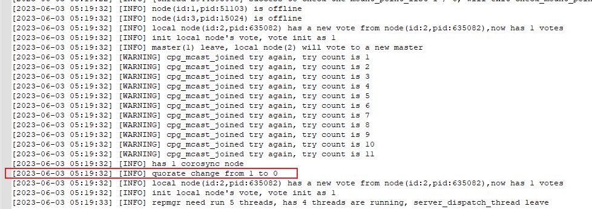

少数派持续了一分多钟后，在2023-06-03 05:20:03重新进入多数派,这中间相差**31秒**。可以看到备库与主库在同一时间重新进入多数派。

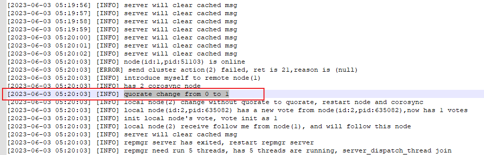

与主库一样，在这个过程中，数据库因为处于少数派超时导致数据库停库,可以看到从少数派到停库经过的时间为**21秒**。

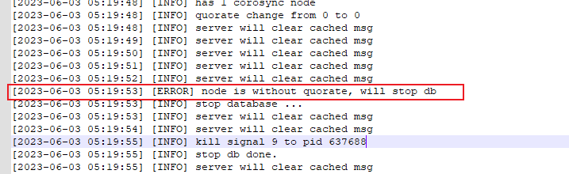

<font color="red">综上所述，主中心数据库停库的原因为corosync进入少数派超时。即corosync由于网络波动等因素导致进入少数派后，未在预期的20秒内恢复。</font>

#### corosync进入少数派原因分析

经过上层应用日志分析，停库原因为corosync进入少数派，分析corosync日志。主库68上的corosync从05:19:20.764开始有节点离开并进入少数派，在05:20:03.692恢复，与上层应用时间相符。

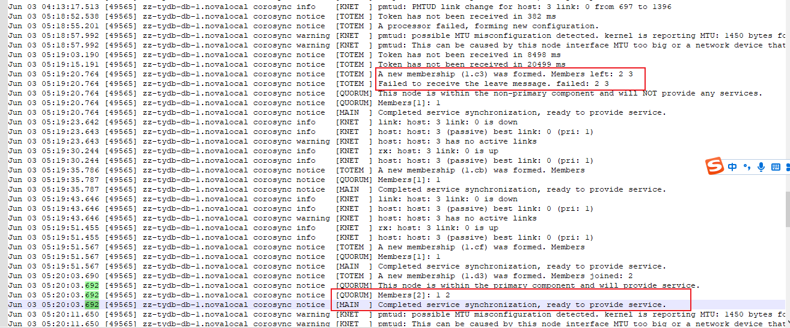

但后续又出现token超时，且在恢复过程中，token出现多次超时，直到恢复。

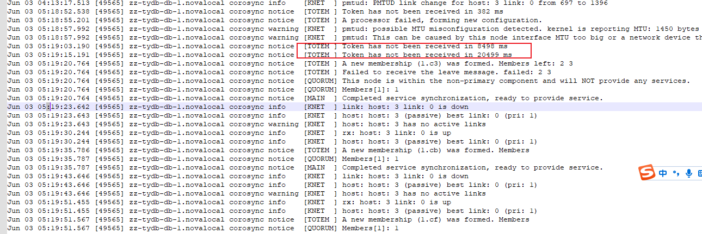

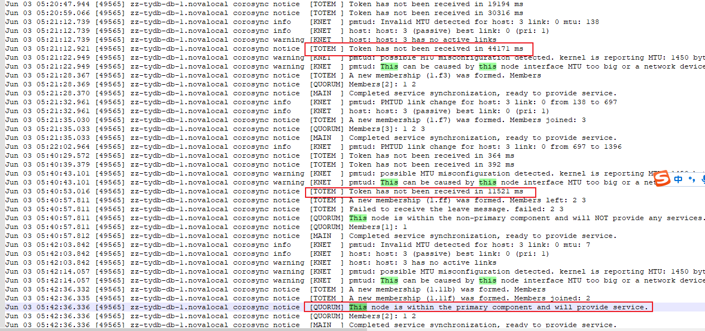

<font color="red">综上所述，在06-03 05:19到06-03 05:42这段时间内，网络出现波动，导致corosync在这个过程中进入少数派。</font>

### 备中心未切换原因

查看备中心伪主库hamgr.log日志，分析如下：

生产中心因为少数派导致kbha无法提供服务，observer在生产中心恢复之前无法连接到kbha，但在触发observer跨中心切换时，生产中心corosync恢复多数派，kbha正常提供服务，observer查询到节点信息，未触发中心间切换。

observer在2023-06-03 05:17:01时无法查询节点信息，在2023-06-03 05:19:39时恢复，此时observer又重新连接上生产中心的kbha。

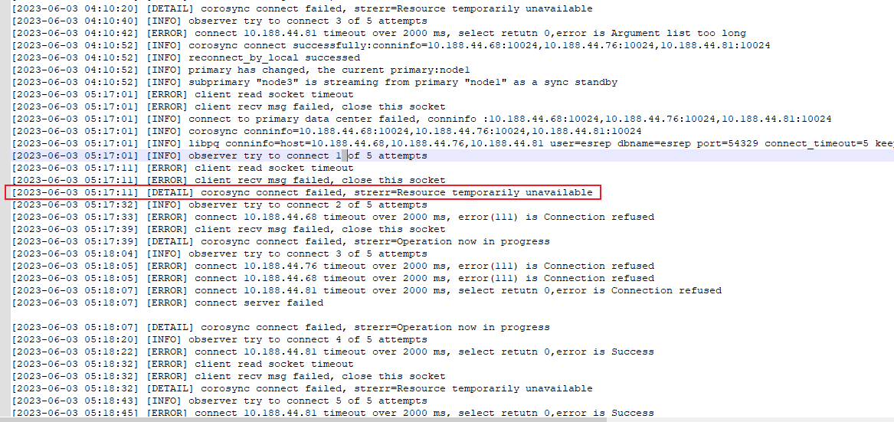

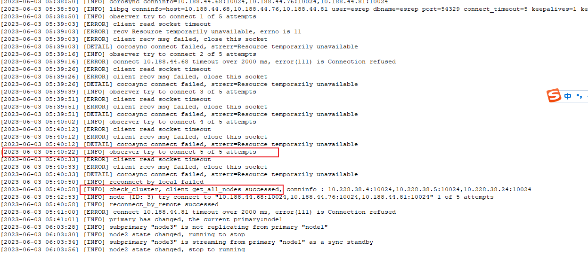

observer在连接上生成中心的kbha服务后，其超时重传机制将会重置，将会重新开始计算超时。

<font color="red">observer未触发跨中心切换是因为生产中心的kbha服务在切换时间之前恢复。</font>

## 问题结论

<font color="red">1.网络波动导致corosync进入少数派，其恢复时间超过了数据库停库允许的少数派时间，导致数据库停库。</font>

<font color="red">2.生产中心corosync的故障恢复时间小于observer的跨中心切换时间，导致未进行跨中心切换。</font>

## 问题解决

1. 主要原因为corosync受网络波动影响进入少数派时间超过允许的故障时间（当前为20秒）建议调整配置参数增大允许的corosync网络波动时间；

<font color="red">按当前配置参数，允许的corosync网络波动为20秒，拟将允许的corosync网络波动调高，调整为50秒。</font>

当前允许的corosync的网络波动时间的配置参数为：

```shell
reconnect_attempts=5
reconnect_interval=6
```

后续建议修改为：

```shell
reconnect_attempts=6
reconnect_interval=10
```

<font color="red">调整允许的corosync网络波动时间不需要更新补丁，仅需修改各节点的repmgr.conf文件中的配置，并重启kbha和repmgrd进程。但需要出操作文档。</font>

2. observer未触发跨中心切换的原因为当前处理逻辑中，若observer在生产中心故障后，在跨中心切换时间内重新连上corosync后不会进行跨中心切换，需要用户介入，手动启动生产中心的数据库；后续会增加配置开关，允许用户配置是否开启该功能：若observer在生产中心故障后，即使在跨中心切换时间内重新连上corosync，也会自动进行跨中心切换。

<font color="red">增加observer配置开关，有用户决定是否开启中心数据库全部停止时自动进行中心间切换。增加该逻辑需要更新补丁进行升级，会涉及到更新二进制、停库等操作。</font>

<font color="red">当前中移动版本为ps002，这段时间新版本为PS006，修复了自测的一些bug，拟在2023年6月24日左右与中心数据库全部停止时自动进行中心间切换补丁一起升级。届时除需要提供补丁包外，还需要提供补丁升级文档和升级步骤。</font>

## 调整允许的corosync网络波动时间操作步骤

待补充完善。