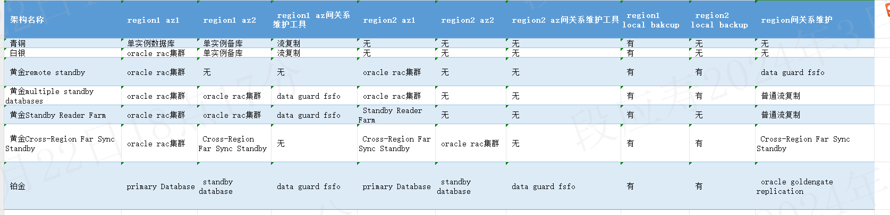
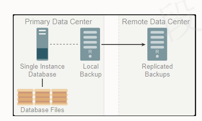
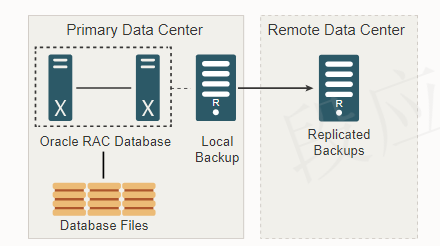
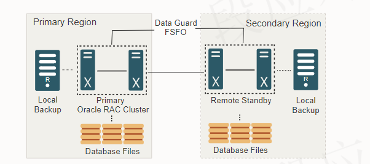
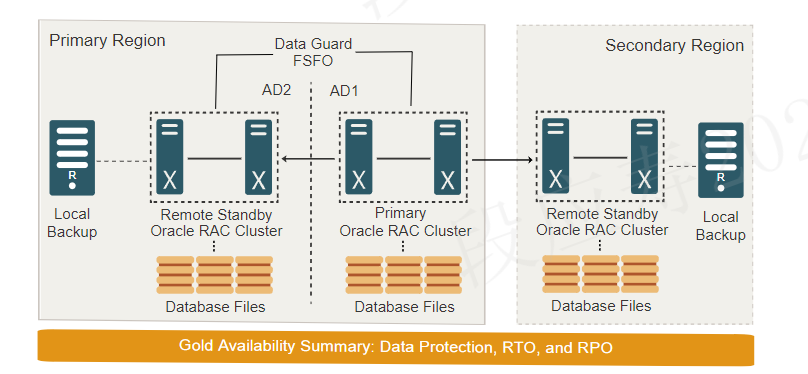
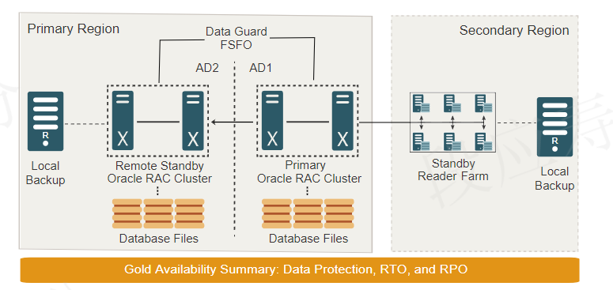
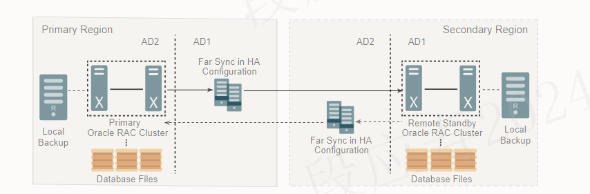
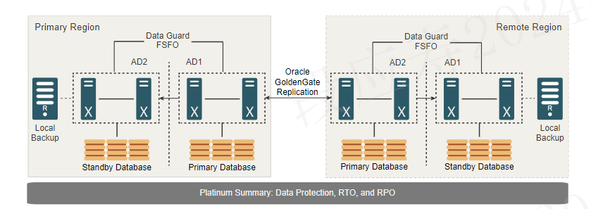

# oracle maa架构详解

oracle maa架构分为青铜、白银、黄金、铂金四个级别，其中黄金又有四种实现方式。这里按照az（可用区，一般是同一个机房，组成一个数据库集群）、region（区域，一般是不同的城市，可能会有多个可用区）、rto、rpo来进行统计，其统计结果如下（从现有架构图中来看，oracle最多有4个可用区，未考虑data guard是否需要单独部署在一个可用区）：

| 架构名称                            | region1 az1      | region1 az2                   | region1 az间关系维护工具 | region2 az1                   | region2 az2      | region2 az间关系维护工具 | region1 local bakcup | region2 local backup | region间关系维护                   |
| ------------------------------- | ---------------- | ----------------------------- | ----------------- | ----------------------------- | ---------------- | ----------------- | -------------------- | -------------------- | ----------------------------- |
| 青铜                              | 单实例数据库           | 单实例备库                         | 流复制               | 无                             | 无                | 无                 | 有                    | 无                    | 无                             |
| 白银                              | oracle rac集群     | 单实例备库                         | 流复制               | 无                             | 无                | 无                 | 有                    | 无                    | 无                             |
| 黄金remote standby                | oracle rac集群     | 无                             | 无                 | oracle rac集群                  | 无                | 无                 | 有                    | 有                    | data guard fsfo               |
| 黄金multiple standby databases    | oracle rac集群     | oracle rac集群                  | data guard fsfo   | oracle rac集群                  | 无                | 无                 | 有                    | 有                    | 普通流复制                         |
| 黄金Standby Reader Farm           | oracle rac集群     | oracle rac集群                  | data guard fsfo   | Standby Reader Farm           | 无                | 无                 | 有                    | 无                    | 普通流复制                         |
| 黄金Cross-Region Far Sync Standby | oracle rac集群     | Cross-Region Far Sync Standby | 无                 | Cross-Region Far Sync Standby | oracle rac集群     | 无                 | 有                    | 有                    | Cross-Region Far Sync Standby |
| 铂金                              | primary Database | standby database              | data guard fsfo   | primary Database              | standby database | data guard fsfo   | 有                    | 有                    | oracle goldengate replication |

上面的表格可能有所缺失，可以查看下图：

## 青铜

Oracle MAA Bronze 参考体系结构以尽可能低的成本提供基本的数据库服务。接受降低的高可用性和数据保护级别，以换取降低的成本和实施复杂性。此体系结构可能适用于用于测试、开发以及不太重要的生产应用程序和数据库的数据库。其架构如下所示：

青铜架构在同一个可用区内，采用主备的方式进行连接，同时本地有一份备份。其高可用能力如下：

|计划外停机|RTO|RPO|
|---------|-------|----|
|可恢复的节点或实例故障| 分钟到小时|0|
|站点故障|数小时到数天 |自上次备份以来的 RPO 或使用恢复一体机时的 RPO 接近于零|

|计划内维护|RTO|RPO|
|---------|-------|---|
|软件/硬件更新|分钟到小时|0|
|主要数据库升级|分钟到小时|0|

实现 MAA 青铜级服务需要如下功能：

- Oracle Recovery Manager (RMAN) 用于执行 Oracle 数据库的定期备份。

RMAN 在备份和恢复操作期间提供数据验证，并提供高级功能，如块恢复、表级恢复、模式级恢复以及多租户 PDB 和 CDB 备份和恢复，这是第三方实用程序所没有的。如果发生不可恢复的中断，则 RPO 等于自上次进行数据库和归档备份以来生成的数据。

- Automatic Storage Management (ASM) 

自动存储管理 （ASM） 是 Oracle 集成的文件系统和卷管理器，包括智能数据感知软件镜像，可防止磁盘故障和某些损坏

- Oracle Restart 

在硬件或软件故障后或数据库主机重新启动时自动重新启动数据库、侦听器和其他 Oracle 组件。

- Oracle Corruption Protection 

可检查物理损坏和逻辑块内损坏。可以检测内存中损坏并防止将其写入磁盘，并且在许多情况下可以自动修复。

## 白银

MAA Silver 参考体系结构专为无法等待冷重启或从备份还原的数据库而设计，以防出现不可恢复的数据库实例或服务器故障。此体系结构可能适用于业务关键型的生产应用程序，并且需要减少本地故障和最常见的计划内维护活动的停机时间。其架构如下所示：

白银架构基于青铜架构，只是把主库所在的位置换为了rac集群。其高可用能力有所增强，

|计划外停机|RTO|RPO|
|---------|-------|----|
|可恢复的节点或实例故障| 秒级|0|
|站点故障|数小时到数天 |自上次备份以来的 RPO 或使用恢复一体机时的 RPO 接近于零|

|计划内维护|RTO|RPO|
|---------|-------|---|
|软件/硬件更新|分钟到小时|0|
|主要数据库升级|分钟到小时|0|

## 黄金

黄金高可用架构又分成4类：

- 远程备库（remote standby）
- 多个备库（multiple standby databases）
- 备库农场（standby reader farm）
- 跨区域远同步备库（Cross-Region Far Sync Standby）

其高可用能力如下：

|计划外停机|RTO|RPO|
|---------|-------|----|
|可恢复的节点或实例故障| 秒级|0|
|站点故障|几秒到 2 分钟 |0或者秒级|

|计划内维护|RTO|RPO|
|---------|-------|---|
|软件/硬件更新|0|0|
|主要数据库升级|少于30秒|0|

### remote standby

远程备用模式包括使用 Oracle Active Data Guard 消除单点故障的生产数据库（备用数据库）的远程同步副本。活动备用数据库提供针对计划外停机的高级保护，并减少计划内维护活动（如数据库升级）的停机时间。最值得注意的属性是，在发生数据库、集群或站点故障等灾难时，备用数据库可提供较低的 RTO（恢复时间）和 RPO（数据丢失可能性）。其架构如下所示：

与白银架构相比，remote standby在两个region里面，主region与白银架构的主库架构相同，采用oracle rac集群，同时还有一份本region的物理备份。除了主region外，还有一个远程region，这两个region一般处于不同的城市。远程region采用的是普通的oracle数据库节点，一般有两个节点，同时还有一份本region的物理备份。

白银架构remote standby官方推荐使用Oracle Active Data Guard，不推荐使用第三方流复制（功能会有所缺失）。

### multiple standby databases

黄金多个备库的架构如下：

黄金多个备库在黄金远程备库的基础了多了一个可用区，在主region除了原有oracle rac集群外，还增加了一个可用区，用于存放备库集群，且使用data guard负责主库与备库之间的故障切换和数据复制，主region有一份本region内的物理备份。而对于远程region来说，则只有一个备库集群和本region的物理备份，该备库集群与主库所在集群相连，但未使用data guard。

### Standby Reader Farm

黄金备库农场的架构如下：

与黄金多个备库架构相比，备库农场则主要是在远程region上有所区别，远程region的备库集群数据库节点更多。

### Cross-Region Far Sync Standby

跨区域远程同步备库架构如下：

可以看到跨区域远程同步备库架构的可用区从之前的3个增加到了4个，每个region两个可用区。并且每个region的数据库所在可用区均使用oracle rac集群架构，而非数据库可用区都是 far sync in ha configuration，再加上每个region都有一个本region的物理备份。

## 铂金

铂金架构能为中断和计划内维护活动提供零停机时间，而这些都是 Gold 架构无法实现的。铂金架构基于黄金架构构建，添加了 Oracle GoldenGate 复制功能，可消除迁移、应用升级和数据库升级的停机时间。每个 Oracle GoldenGate 数据库都受备用数据库保护，以便在数据库、集群或站点发生故障时实现零数据丢失。其架构如下所示：

铂金架构共有两个region，每个region两个可用区，一共四个可用区。并且两个region的价格相同，均为使用data guard连接的两个oracle数据库集群（一般是两个节点）。region之间采用Oracle goldengate replication来维护两个region之间的数据同步。

铂金的高可用能力如下：

|计划外停机|RTO|RPO|
|---------|-------|----|
|可恢复的节点或实例故障| 0或秒级|0|
|站点故障|0 |0|

|计划内维护|RTO|RPO|
|---------|-------|---|
|软件/硬件更新|0|0|
|主要数据库升级|0|0|

# reference

1. https://docs.oracle.com/en/database/oracle/oracle-database/19/haiad/