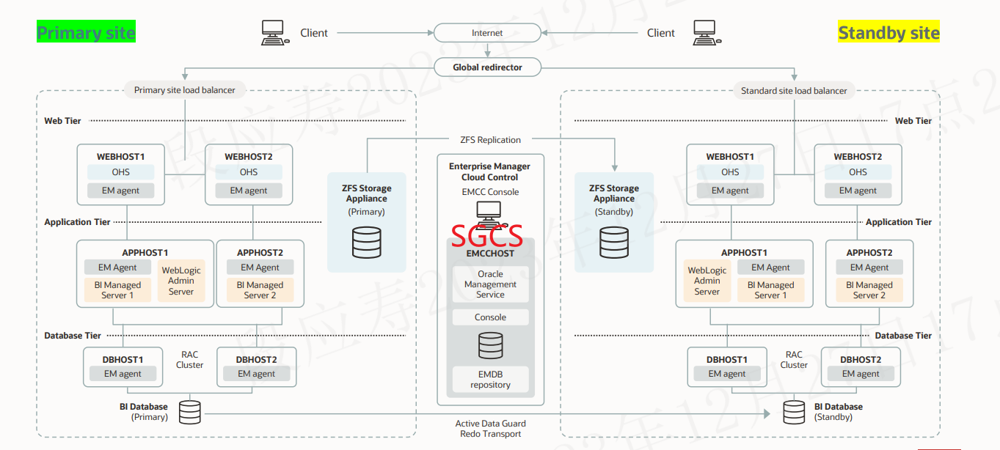

# oracle_site_guard详解

## oracle site guard是什么

Oracle Site Guard 是一个数据保护解决方案，用于实现数据中心级别的灾难恢复和故障转移。它可以保护 Oracle 数据库、应用服务器、中间件以及整个操作系统。

oracle site guard是运行在服务器上的一组服务，SGCS服务一般被集成到EMCC中，其位置如下：

这组服务包含以下基础服务：

- Site Guard 配置服务 (SGCS)
SGCS 是 Oracle Site Guard 的核心服务，负责管理所有 Site Guard 组件的配置和状态。

- Site Guard 代理服务 (SGAS)
SGAS 是安装在每个受保护实例上的代理服务，负责将数据更改复制到备用实例。

- Site Guard 复制服务 (SGRS)
SGRS 是安装在主实例和备用实例上的服务，负责在主实例和备用实例之间复制数据更改。

- Site Guard 日志传输服务 (SGLS)
SGLS 是安装在主实例和备用实例上的服务，负责将重做日志从主实例传输到备用实例。

- Site Guard 故障转移服务 (SGFS)
SGFS 是安装在主实例和备用实例上的服务，负责在主实例发生故障时将业务自动切换到备用实例。

在一个高可用系统中，Oracle site guard是一系列服务组件的集合，当作服务端在运行，称为SGCS，负责存储配置数据以及与客户端（site guard代理，这里的客户端就是要保护的服务所在的设备）通信。

Oracle Site Guard 可以管理多套集群，包括：

- Oracle RAC 集群： Oracle Site Guard 可以保护 Oracle RAC 集群，并确保在任何节点发生故障时，业务都能继续正常运行。
- 非 RAC 集群： Oracle Site Guard 也可以保护非 RAC 集群，包括单实例数据库和非 RAC 集群数据库。
- 混合集群： Oracle Site Guard 还可以保护混合集群，包括 RAC 集群和非 RAC 集群。

Oracle Site Guard 可以通过以下方式管理多套集群：

- 使用不同的 Site Guard 实例： 对于不同的集群，可以使用不同的 Site Guard 实例来管理。这样可以隔离不同的集群，并确保每个集群的数据都受到保护。
- 使用同一个 Site Guard 实例： 对于不同的集群，也可以使用同一个 Site Guard 实例来管理。这样可以简化管理，并减少管理开销。

## oracle site guard如何保存数据

Oracle site guard的数据保存在oracle数据库中，默认情况下，SGCS 使用本地 Oracle 数据库来存储其数据。但是，也可以将 SGCS 配置为使用远程 Oracle 数据库来存储其数据，底层文件系统一般采用ZFS来保存数据。

如果使用本地 Oracle 数据库来存储 SGCS 数据，则 SGCS 数据库将与 SGCS 实例安装在同一台机器上。如果使用远程 Oracle 数据库来存储 SGCS 数据，则 SGCS 数据库可以安装在另一台机器上。

SGCS 数据库存储以下数据：

- Site Guard 组件的配置信息，包括主实例、备用实例、代理实例和 SGCS 实例的配置信息。
- Site Guard 系统的状态信息，包括主实例的状态、备用实例的状态、代理实例的状态和 SGCS 实例的状态。
- Site Guard 系统的日志信息，包括 SGCS 日志、代理日志和实例日志。

SGCS 数据库对于 Site Guard 系统的正常运行至关重要。如果 SGCS 数据库发生故障，则整个 Site Guard 系统都会受到影响。

因此，需要对 SGCS 数据库进行备份和恢复。Oracle Site Guard 提供了内置的备份和恢复功能，可以帮助用户备份和恢复 SGCS 数据库。

需要注意的是，SGCS 数据库是 Oracle Site Guard 系统的核心组件，对系统安全至关重要。因此，需要对 SGCS 数据库进行严格的访问控制和安全防护。
