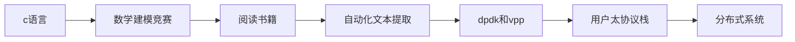

# 编程之路

关于growdu本人。

计算机之路：

## 初到世间

1995年出生于人口分界线的另一端——腾冲，那是一个比春城更加“四季如春”的城市。

2000年因为没有小伙伴一起去上学，哭了“三天三夜”终于逃过一劫，那一年最终还是没能成功上学。

2001年再也找不到任何理由，而且还多了两个可爱的小女孩一起结伴去上学，然后就高高兴兴的去了，这一去就“一发不可收拾”了。

意外地发现，我竟然很有读书的天赋，老师问的问题我都能很快的听懂并给出答案。至今让我记忆尤深的是，我漂亮姐姐对我说的一句话。那一年，她六年级，我一年级，我们教室隔得很远。姐姐毕业时，拉着我拍了一张我们两的合照。那一天傍晚晚霞把天空铺得很满很满，姐姐的脸红彤彤的很好看，她摸着我的头笑着说，“在我们教室里都能听到你回答问题的声音，我们好多同学都知道你，和我说你弟弟好厉害啊！”

那一天我傻傻的笑，笑得很开心，跟吃了蜜一样。许多年以后我才明白，就是在那一刻，内心里多了一样很重要的东西。如今那样东西也一直在激励着我前进，现在我把它称作自信。

六年的小学时光就这样在玩玩闹闹中过去了，记忆中上学好像挺简单的，就是大声回答问题就好了，不犯大的错误老师也不会吼你。

云南蘑菇真的很多，2006年山上找了两斤鸡枞，卖了20块钱，买了游戏机和忍者神龟的游戏卡，那是第一次接触虚拟世界，至今仍然觉得很神奇。

2011年第一次听说仙剑奇侠传三，但只用学习机循环了无数遍主题曲和背景音乐，后来才知道那也是用计算机编程写出来的单机游戏。

而在这一年，不出意外的初中毕业了，也不出意外的考的还不错，考上了腾冲市第一中学。唯一遗憾的是数学写错了一个负号，考了118分，与满分失之交臂。不过值得安慰的是，物理考了满分。

## 叛逆的少年

2012年第一次玩地下城与勇士，打开了第一个潘多拉的魔盒。

2013年第一次玩英雄联盟，打开了第二个潘多拉的魔盒。

固执且自信的人不希望别人干预自己的人生，哪怕是错的也要走出自己的一条路，而且谁说的玩电脑的就不能干出一番事业，当然沉迷游戏的除外。

不出意外的这次出了意外，高中马马虎虎，勉勉强强的混了个211，带着不甘和某一种倔强，跨越千里，一个人背着行囊远走他乡。

那一年，买了一张站票，站了两天两夜共计37个小时到了安徽的一个城市，至今仍然想不到，那时候拯救我的竟然是15块钱买的一张折叠的椅子———那是我当时心中最执着的柔软。

至少我坚持了下来，没被压垮。

发哥曾经说过，“我不是要证明什么，我只是要告诉别人，我失去的东西一定要亲手拿回来。”
彼时我的心情跟发哥一样，“我不是想要奢求什么，我只是想要告诉别人，玩电脑也能干出一番事业。”

2014年炎热的夏天上了第一季c语言编程课，听老师吹牛说用C语言写了个航天器的控制系统，莫名觉得很厉害。虽然回想过来老师肯定在吹牛，要当时我们学校也有这实力，中国的航天事业少说比现在快二十年。

## 执着的少年

2015年发现没有任何画图天赋，彻底放弃机械，开始自学计算机。

也就是在那一刻我觉醒了，也明白了，那些别人给你的所谓的建议，所谓的捷径，有时候反而是限制你的桎梏。知道自己适合做什么的永远只有自己，也只有自己想做的才有无限的动力。

也就是在那一年，我打开了另一个潘多拉的魔盒，我听着linus的故事，读者《黑客与画家》，看着《黑客帝国》，彻底陷入了计算机世界里。

也就是那一年，穿梭于图书馆之间，一年读完了3近300多本书，华章和图灵的书基本被我翻了个遍。那一年，我被评选为“工大图书王”，那个证书我至今仍保留着，那是穿越多年时空再次对我的认可。当时还上了校园广播电台，他们请我去喝茶，我第一次在公众场合吹牛皮————现在想想还有点脸红。

2015年第一次用上linux，笔记本上装了ubuntu、win7、win8、winxp、win10、kali，开始找到了计算机世界里那种满足而简单的快乐。就是一台小小的电脑，就可以构造出一个神奇的世界。

我有了一台电脑=我有了一个神奇的世界=我有无限的创造力。

2016年参加数学建模比赛，在里面负责编程，了解到很多高大上的算法：神经网络、遗传算法、退火算法、弗洛伊德算法、狄杰斯特拉算法等等，虽然最后只获得了全国赛二等奖，校赛二等奖。

而且另外我没想到的是，神经网络竟然在2024年彻底引爆了一场AI革命，很遗憾没能和神经网络算法一起成长。

这一刻开始发现，好像有什么不一样了，就像一切又回到正轨了，慢慢都变好了。

2017年大概又看完了300多本计算机相关的书籍，我不知道为什么没评上图书王了，难道有人比我更猛，还是那个活动举报一届就夭折了。

我还挺喜欢那个活动的。

2018年c语言二级考了61分，脸有点红，这也算是黑历史了，不过那个时候确实挺菜的。

考试的天赋早就被地下城和lol窃取了。

## 曾经的我

2018年拿了几个offer，同时华为面试通过等审批等到如今还没有审批通过，那个华为技术官的微信我到现在还没删，我很想问问他为什么要把我当鱼一样养在池子里。后来想想，学校确实不具备什么竞争力，履历也确实一般。

不过每次提到华为的时候，我还是忍不住打开微信去看看那个人的动态，虽然啥也看不到。

2018年，去金融数据公司做自动化数据爬取，那时爬虫那么火，就差那么一点我就去干爬虫了。

以我的尿性，去搞爬虫，最后估计得去蹲号子。

2020年，去华为云做用户态协议栈，那是我真正的接触技术，至少是我以为的技术。我不再用别人的框架，不再拖拖拽拽画界面，不再只会增删改查。很多之前只知表象的东西，慢慢深入了解了他的原理。

使用dpdk将内核旁路了，自己写了一套tcp/ip协议栈来和内核协议栈交互，性能超出内核栈许多倍。

那个时候才真正懂了什么是性能优化，知道了底层原来有这么多黑科技：tlb miss、dma、无锁队列、用户态和内核态、系统调用。

我们会在每一个环节加上时间戳，分析每一层协议的时间损耗，分析每一个中间设备是否有问题。

每一次抓包，都会使网络赤裸裸的呈现在我面前，从来没有一刻网络技术是那么真实。

每一次追踪一条流，看到重传，或者看到duplication ack，或者看到 zero window，都像抓住犯罪分子的帽子叔叔一样兴奋。

甚至还有一种框架，利用分支预测、批量包处理技术，指令预取能够进一步提升协议栈的性能，当开始基于vpp做一些性能调优的时候，才发现原来一个高性能的软件和框架，真的是把计算机底层技术的原理利用得淋漓尽致。

也就是在那一刻开始，我知道了有一种东西————技术自信。

我默默的回去又点开了那个18年华为技术官的微信，无数次想输入点什么问问他，最后又放下手机，写了几行代码。

这应该就是成长吧。

## 如今的我

2022年，我还是离开了那个令我成长的地方，去追寻更多的提升，一脚踏进了国产数据库的大潮里直到今天。

凭借之前积累的网络基础，一入职就手搓了一套基于raft的分布式元信息系统。

基础组件有了后，上层方案架构很快就衍生出了多种架构，同城双中心、两地三中心、多地多中心。

看着手底下的项目越来越多，看着越来越多的客户开始了解两地三中心架构，并开始试点，甚至是直接上核心系统。

那个时候，心里真的衍生了一种叫做“技术成就感”的东西。虽然在做对外的技术分享时，心里还是紧张的要死（属于隔着屏幕公开吹牛）。

2022年，不出意外的，获得了“太极股份最佳新员工”，进入个人与公司的正向反馈之中。

三年跟了30多个项目，从客户宣讲、需求沟通、开发、打包测试到交付，到现在都很难想象这么多流程环节由我一人推动，而且那个时候效率出奇的高。（感谢组长和组内的技术专家，他们真的是最坚实的后盾，有问题他们是真上啊！）

而且不可思议的是，在这三年中我还做了许多的提升效率的工具。

2023年产品管理部反馈内部文档资料太多（用svn管理），查找起来很不方便。我忘记我是从哪里听到这个信息的了，但当时就是很自信的说，这个我来整，我在行。其实最主要的是我也受够了查文档的那种痛苦和折磨。

于是花了几个周末，我用es和es-ui做了一个svn文档查询系统，专门供大家查询文档使用，至今仍在稳定运行，受到大家一致好评。相关的设计思路在我的github上有，项目名称叫做oh-my-search。

同样是2023年，组长说公司想要做一个虚拟化的编译平台，统一大家的编译环境。我一听，这个我也熟悉啊，我一想到一个刚毕业的大学生，刚到公司就要开始被复杂的编译环境所折磨，我就觉得这个事情很有意义。万一新人直接就被劝退了呢，因为我就是这样过来的。

于是又花了几个周末的时间，使用docker和docker-compose，构建了一套基于容器镜像的虚拟化编译平台。我给容器集成了基本的编译环境，独立IP、使用mac-vlan打穿到容器外部的网络，使用vue+go+gin+postgres搭建一套容器管理系统。

就这样所有人都可以用同一套编译系统，不用关注于具体的依赖，甚至他们都不知道这其实是一个容器。

这一套系统目前还在稳定的运行中，并且每一个入职的新人都会获得一个这样的账户和环境。

那是又一次，我把自己做的“产品”向那么多的人推广（吹牛皮）。

相关的代码我在github上有一个简单的版本（没有用户管理系统，仅用于个人使用），项目名称叫做oh-my-code。

2023年，不出意外的，获得了“太极股份年度杰出青年”。

2024年，无数的人反馈官网手册难用，包括我也是一样，在这之前我从来不用官网手册。因为痛苦，所以想要改变，所以愿意改变。那是一个安静的晚上，手机突然响了（我给组长设置了特别关注），打开就一句话，“调研一下文档手册框架”。

一如2022年那个炎热的夏天，组长的两个字“入会”开启了两地三中心的时代，这次开启新文档手册的时代。

我开始调研，出对比报告，然后选型，写demo，写迁移脚本，然后有了一本新的手册了，组长开始出对比报告然后去说服领导。

我开始写文档框架的手册，编写规范，并开始培训。再一次的，我把我做的“产品”像大家推广（又开始吹牛了）。

不管怎么说，至少现在官网手册是我想看的样子了，有需要的话我会去查阅官网手册了。

不出意外的就要出意外了，2024年年底被提名了“优秀员工”，但非常遗憾，与这项荣誉失之交臂。

2025年，手册已经如火如荼的开始具体到模块修改中，而我自从培训完后就再没管过这个事情。

那天文档的小姐姐找到我，“转pdf遇到了问题”。到现在才完全明白，“转pdf”是释放了怎样一个妖魔鬼怪，目录树、表格线、链接、选项卡、表格自适应宽度、长表这些没有一个显示好的，而且当前并没有一个转pdf的工具能直接使用。

最后基于sphinx开放了一套转换系统，基于它的插件机制写了很多插件来处理这些特殊语法，那是我最痛苦的一段时间，看latex的tex语法都快看吐了。但至少最后看到pdf手册，我觉得还挺好看的，这样也就值了。

新手册应该很快就会开放给客户使用吧，但是“一个鸡蛋很漂亮，谁又会去关注那只会下蛋的母鸡呢？”，当年钱老就是这样回复想认识他的外国人的。

未来会怎么样，我不太清楚，只是希望，那些过去赋予我的技术激情和技术坚持，不要被这个充满诱惑的时间所窃取。

精神富有远远比物质富有重要的多。

对技术的追求不应该随着时间推移而终止。

