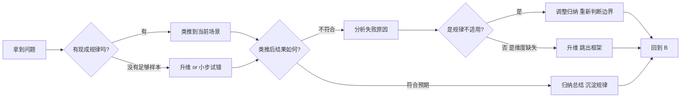

# 提升思维的方式

> 这一篇是我反复思考后整理的笔记——把过去几年一些零散的、模模糊糊的经验总结成了四个动作：升维、归纳、类推、试错。
> 写出来不是为了证明自己懂，而是想让下次再卡住的时候，自己能有个清晰的入口。

## 写在前面

我经常卡住。

不是那种连续几个小时写不出代码的卡住，而是那种——明明很努力、走了很多路，回头一看，发现还是在原地打转的卡住。

那时候最痛苦的不是「我不会」，而是「我不知道我哪里不会」。你看，问题卡在哪儿都不知道，谈何解决呢。

后来慢慢地，我才发现，所谓「卡住」，往往不是因为信息不够、不是不够努力，而是**思考的方式本身就有问题**。就像你拿着一把钥匙去开锁，但你手里那把钥匙本身的齿形就拧不对，多用力都白搭。

所以这几年我一直在想，到底有哪些思维方式是真正「能把人拔出来」的工具。

想了想，大概有四种：升维、归纳、类推、试错。

它们不是孤立的招式，更像是一组工具箱。在不同的处境下，你会自然地掏出不同的那一个。但如果你从来没有意识到它们的存在，你就永远只会用一种方式思考——那种方式一旦走不通，你就彻底卡死了。

所以今天，想把它们一个一个拆开讲清楚。

---

## 一、升维：跳出你当前的维度

升维是最猛的一招，因为它做的不是把事情做得更好，而是**把问题变大**。

举个最简单的例子。

小时候我们学的是平面几何，只有 x 和 y 两个轴，所有的点都只能在一个平面上画出来。然后某一天，有人告诉你，把笔从纸上抬起来，往 z 方向走一步——你会发现，原本在二维平面里怎么也连不上的两个点，在三维空间里用一条直线就能连起来。

这就是升维。

求导和微积分的关系，在我看来是同一个故事的不同章节。

求导是在「每个瞬间」上做切线，得到的是**这一秒**的状态。它能解决「在这一秒是什么」的问题，但解决不了「从这一秒到下一秒累计发生了什么」的问题。

积分恰恰相反，它不关心某一秒的状态，它关心的是**这一段过程积累起来是什么样**。所以求导和积分是一对相反的过程，一个把时间拉细，一个把时间变厚。

为什么要先学求导再学积分？因为积分实际上是「无数个求导结果的累加」。如果你没有在微观维度上把每个瞬间看清楚，你就根本没有办法在宏观维度上把整个过程算明白。

这两者，就是「维度」和「维度之上的维度」的关系。

### 升维在工程中的样子

升维在工程里到处都是，只是我们平时不叫它这个名字。

**数据库里的索引**，本质上就是升维。我们在一个没有索引的表上查一行数据要扫全表，时间复杂度是 O(n)；建一个 B+ 树索引后，相当于把这个一维的线性存储升到了多维结构里，查询变成了 O(log n)。数据量越大，这种升维带来的收益越夸张。

**缓存**也是升维。我们重复造轮子去算一件事，第二次算的时候，直接从「一个更快的维度」拿出来结果。这相当于在你的思考路径上，新增了一个比原有维度快的维度。

**抽象和分层**更是升维。操作系统把硬件升到了系统调用，应用层把系统调用升到了 API，框架把 API 升到了组件。把所有这些层次打开看，本质上都是「在原来的维度上又叠加了一层维度」，让你能站在更高处看到更低处看不懂的关系。

### 我们什么时候需要升维

通常来说，当你发现——

* 一个问题反复出现，但你每次都是用类似的笨办法去处理它；
* 你尝试了 N 种方案都失败，而且失败的方式看起来都很像；
* 你发现有一类限制条件像天花板一样，把你所有的努力都挡在了外面；

——那往往就说明，**你现在的维度不够了**。

这个时候唯一正确的动作，不是更努力，而是停下来问自己：

> 「我现在思考这个问题，所依赖的维度，到底有几个？」

把那些被默认接受的前提拿出来看看——把它们假设的合理性一个一个质问一下。很多时候，所谓的前提条件，其实只是限制条件。它看起来是真理，其实只是过去某个特定情境下的一种方便。

把限制放宽，把维度加上来，再看一次——问题大概率会换一个样子。

我自己在做两地三中心方案的时候，最开始一直困在「主备切换」的框架里，怎么想都觉得很别扭。直到后来跳出那个框架，问自己：「为什么是主备？为什么不能两边都收流量？」——问题瞬间从「主备切换怎么做到不丢数据」变成了「两个机房怎么共同服务」，整个方案的形态都不一样了。

那是一个典型的升维瞬间。

---

## 二、归纳：从特殊走到一般

归纳是做这件事——**重复做某一类事情，然后总结规律**。

它是所有学科的根基。科学家做千百次实验总结一个定理，工程师踩无数个坑总结一条最佳实践，连厨师做菜都是「多炒几次同一道菜，直到感觉到盐该放多少、火该多大」。

归纳的本质，是**从特殊的样本里抽取共同的模式**。

### 归纳为什么是基础

因为归纳给了我们「规律」这种东西。

人类的大脑，是个对规律极度敏感的机器。一旦你给它一组数据，它会本能地去想「这些数据背后是不是有规律」——哪怕根本没有规律，它也会强行给出一个（这就是错觉的来源）。

而对规律敏感的代价，必须配上能发现真实规律的能力——这就是归纳的价值。

比如，你写 C 语言写了几年，遇到过的 bug 几百个。如果你每次都只把每个 bug 当作孤例去解决，那你几年后还是不会写 C。但如果你在解决每一个 bug 的时候，都多问自己一句「这个 bug 反映了哪一类问题」——比如，「是不是我对指针生命周期理解错了」、「是不是我对位运算的优先级记错了」、「是不是我对内存对齐的规则理解偏了」——慢慢地，你脑子里就会有一张「C 语言坑位地图」。

下次再遇到新 bug，你看一眼现象，就能大致归类到某个坑里去。

这就是把特殊的经验归纳成了**一般的规则**。

### 归纳的三个陷阱

归纳虽然有用，但有三个非常隐蔽的陷阱，必须时刻提防。

**第一，样本太少就归纳。**

你遇到一次 MySQL 慢查询，归结出「MySQL 不适合做高并发」。但其实，那次慢查询也许只是因为索引没建好。你基于一个样本得出的归纳，注定是有偏的。

> 永远记住：**归纳的可信度，跟样本量正相关，跟样本的多样性正相关**。只看过白天鹅就归纳出「天鹅都是白的」，遇到一只黑天鹅就会崩溃。

**第二，把巧合当规律。**

你连续三次面试都挂在第一轮上，于是归纳出「我面试能力不行」。但说不定只是那家公司当周不开第二面。这种归纳里，情绪成分远大于事实成分。

**第三，对规律的过度拟合。**

你在公司见过了十种架构，于是归纳出「只有这十种架构是合理的」。可真实世界里的架构远不止这十种。当你归纳得太死，你就再也看不见新形态了。

> 所以归纳做完后，**一定要保留对自己的归纳本身的怀疑**。这是科学精神，也是工程上做架构 review 的意义——因为 review 的人，能从外部挑出你归纳里的盲区。

### 归纳和记忆的关系

归纳的产物是规律，但规律如果不存下来，等于没归纳。

很多人觉得「我做过所以我知道」。但实际上，做过不等于记得，记得不等于用得上。

所以归纳做完，必须做两件事：

1. **写下来**——把规律显式地落到文档、笔记里；
2. **找场景反复用**——只有被用过的规律，才会真正沉淀在你的认知里。

否则，你只是「经历过」，并没有「学到」。

---

## 三、类推：从一般走到特殊

类推和归纳是反着来的。

归纳是从「很多个具体的事」里去抽「一般规律」；类推是「拿到一般规律后，把它套到新的具体场景里去」。

如果说归纳是「总结」，类推就是「应用」。

### 类推的美妙之处

类推是个杠杆。

你花了三年归纳出「分布式系统设计的关键是多数派」这个规律。然后你每碰到一个新的分布式问题，比如 raft、比如 paxos、比如 zookeeper 的 zab 协议，你都能用「它们都是在用多数派解决一致性问题」这个一般规律瞬间定位到关键点。

这就省了你对每一个协议从头学一遍的时间。

我刚入行那几年，开会听到「分布式一致性」「多数派」「quorum」这些词的时候，每个都觉得很陌生，像是新东西。后来发现它们都在讲同一件事——**在不确定的环境下，怎么让一群机器对同一个值达成一致**。一旦归纳出了这条主线，所有协议就只是这条主线在不同地方的变体。

### 类推的风险

类推最大的风险，是**套错了**。

你归纳出了一条规律，但它只在某一类情境下成立。你把它套到一个看起来相似、但其实本质不同的新场景里，那就会出大问题。

比如——

* 把单机系统的性能调优经验直接套到分布式系统，结果踩了一堆分布式特有的坑；
* 把互联网公司的方法论直接套到传统行业的项目，结果水土不服；
* 把一种数据库的特性当成了所有数据库的通性，结果换个库立刻翻车；
* 把一个前辈在某个公司的成功路径当成自己也可以照抄的捷径，结果方向根本不对。

这些，都是「一般规律套到不对的特殊场景」造成的失败。

**类推的前提，是你对那个一般规律适用的边界有清晰的认知**。

毛泽东在《矛盾论》里讲过一句话，大意是：共性寓于个性之中。意思是「规律存在于具体事物里，但它能脱离具体事物独立存在」，只有当你的新场景的「个性」没有越出那个规律的「共性」范围，类推才有效。

实操中有一个很简单的方法：**类推之前，先问自己——「这一次和上一次最本质的相似点到底是什么？」** 如果你能用一个短句把它说清楚，那大概率可以推；如果你说不出来，那大概率不能推。

### 类推是放大的归纳

所以归纳和类推，其实是同一件事的两面——

* 归纳是从 N 个具体到 1 个一般；
* 类推是从 1 个一般到 N 个具体。

理想状态下，你的归纳越多，类推就越猛；你的类推越多，遇到新场景时上手就越快。

但这两件事的中间，还差了一个非常关键的东西——**对边界的判断**。这个判断，不是归纳能给你的，也不是类推能给你的。**它是经验给你的**。所以你看，真正厉害的人，类推看起来很神，其实背后是无数次经验+无数次归纳+无数次对边界的校准。

---

## 四、试错：在没有地图的地方硬走

试错是最不稳定的，但也是最不能少的。

因为前三种思维——升维、归纳、类推——它们有一个共同的前提：**你已经有了一些规律可以调用**。

但人生里大量的时刻，是你手里一张地图都没有的。

* 你第一次到一个新公司，不知道该怎么融入团队；
* 你第一次做一个新产品，不知道用户到底想要什么；
* 你第一次进入一个新领域，连基本概念都凑不齐；
* 你遇到一个完全未知的 bug，没有任何过去的经验可以参考。

在这些情境下，**升维没有可升的维度**（因为你不熟悉），**归纳没有样本**（因为这是第一次），**类推没有可以比照的旧规律**。

那剩下唯一能做的，就是试错。

### 试错的核心是反馈

试错不是乱撞。试错的核心是**建立反馈环**。

每次尝试后，你都要问自己：「我刚才做的这件事，结果告诉我什么？」——哪怕结果是「这个方向错了」，那也是一个非常珍贵的反馈。

我自己的习惯是，每次尝试一个新东西，都会尽量在最小代价下做一次实验。一次实验得到的反馈虽然不完美，但比坐那想三天都管用。

举几个具体的——

* **控制变量**：系统调优时，一次只改一个参数，看它影响什么；
* **情绪调度**：卡住的时候先放下，去打球、跑步、洗个澡，让大脑做无意识的串联（很多灵感都是这样冒出来的）；
* **求助别人**：把自己的问题说给一个不在这个领域的朋友听，往往他问的几个「傻问题」反而能让你突然看清关键；
* **最小可行**：写一个最小可行的 demo，先验证想法能不能跑通，再谈架构；
* **复盘**：每次尝试后，写下「我做了什么、效果如何、下次怎么改」，让下一次站在这一次的基础上开始。

这些方法都不是什么新鲜事，但它们合在一起，构成了一个完整的反馈环。

### 试错的风险控制

试错最大的风险是**沉没成本**——你试了一个方向，发现错了，但不舍得丢掉，继续投入。

我见过太多次这种情况了。有人花三个月做了一个功能，最后发现用户根本不用；有人学一门技术学了一年，最后发现行业根本不流行了。沉没成本本身不是问题，问题是**让它绑架了未来的决策**。

所以试错之前，必须给自己定一个**退出标准**。

> 「如果 X 天后，或者 X 个尝试后，这个方向还没有看到明显进展，那就停下来。」

退出标准越清晰，试错就越安全。

我自己在做项目的时候，会把一个里程碑内的所有动作都列出来，再标出每个动作的「止损线」。当动作到达止损线还没产出，我就会主动停。这就是反脆弱的核心——**让你在小失败中存活、在大失败中不死的关键，是提前设计好「我能承受多大的失败」**。

### 试错和归纳的关系

试错完成之后，必须立刻做归纳。

否则，你就是用生命的长度换取了经验，却没有把这些经验转化为智慧。

很多人看起来「活了很久」，但其实活了一辈子也只是同一个人重复了几十年。每次试错都从头来，每次踩同样的坑，每次都用同样的努力去解决早就被别人解决过的问题。

> **试错 + 归纳** 才是一次完整的成长。只试错不归纳，是浪费生命；只归纳不试错，是纸上谈兵。

---

## 五、四种方式之间的关系

到这里你应该看出来，这四种思维方式并不是孤立的，它们是一个**循环**。

简单概括：

* **类推**——手里有规律时的首选，最快。
* **归纳**——每次思考和动作结束后，必须做的沉淀。
* **升维**——在所有方法都不奏效时的「兜底大招」。
* **试错**——在没有地图时唯一可走的路，但必须设计反馈环和退出标准。

一个人成熟的标志，不是会用其中一种方式，而是**在正确的时间掏出正确的那一种**。

* 新手拿到问题就试错——因为他还不会用类推；
* 老手拿到问题先问「这是不是个老问题」——因为可以用类推直接秒掉；
* 大佬拿到问题先问「我这是在哪个维度上想」——因为他知道升维能让问题的复杂度骤降；
* 真正的高手拿到问题，会下意识地把四种方式混着用——类推不动就升维，升维完还不清就试错，试错完一定归纳。

这就是所谓的「无招胜有招」。

---

## 六、我自己最常犯的错误

写到最后，我也坦白一下我在每一种方式上踩过的坑。

**升维上踩的坑**：升维升过头了。

有时候我面对一个很简单的问题，本能地开始想「这背后还有什么维度」。结果一个本来十分钟能解决的小问题，被我升维升到哲学层面，半个月没结论。

升维是杀招，但**用多了会变得无病呻吟**。平常的小问题老老实实类推和归纳就行。

**归纳上踩的坑**：基于情绪归纳。

工作被领导批评了，就归纳出「领导不重视我」；一个方案上线出 bug，就归纳出「这个方向根本是错的」。这些归纳带着情绪，时效性强、偏差大，过几天情绪过了自己都觉得好笑。

每次强烈情绪下做的归纳，我都会标记成「待验证」，过几天回头看。

**类推上踩的坑**：边界没看清。

之前做互联网项目积累了一些经验，到了传统行业觉得全都用得上。结果发现传统行业里很多看起来「落后」的做法，背后都是有道理的——那些道理，跟互联网那一套根本不是一套逻辑。

> 类推之前，必须先冷静地界定「这一次和上一次到底哪里是本质相似的」。

**试错上踩的坑**：沉没成本失控。

曾经为了证明自己没选错，硬着头皮在一个方向上撑了半年。结果半年后，那个项目还是没起色，我才承认「当初的判断就是有问题」。这半年浪费掉的时间和精力，比项目本身还让人心疼。

现在的我会更狠——如果止损线到了，立刻停。承认自己错了，不丢人。

---

## 七、最后一点想法

写到这里，我突然意识到——

这四种方式，与其说是「提升思维的方式」，不如说是**「对待世界的态度」**。

* **升维**告诉我：「你看到的不是全部，再高一维，一定有别样的世界。」
* **归纳**告诉我：「所有看似不同的事，背后一定有相同的规律。」
* **类推**告诉我：「找准本质的相似，你就可以把一片森林压缩成一根针。」
* **试错**告诉我：「即使手里什么都没有，迈出第一步永远不晚。」

人这一辈子，会遇到无数次卡住。

卡住不是问题，**卡住的方式才是问题**。

有的人卡住后，会下意识地用同一种方式挣扎——这是最伤人的，因为挣扎本身就是消耗。

有的人卡住后，会抬头看看，自己是不是只在某个维度上反复打转；会停下来想想，自己过去是不是漏掉了什么规律；会去类比一下，类似的事别人是怎么干的；如果都没有，那就小步试错，并用反馈告诉自己下一步该怎么走。

**四种方式都用得动的人，不会真的卡死。**

希望几年后回头看这篇文章，我还能为今天写下的这些感到自豪，也希望我还能继续写出更好的。
