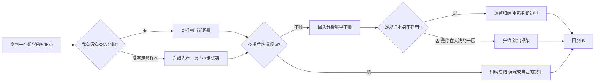

# 提升思维的方式

> 这一篇是我这几年反复琢磨出来的笔记——把过去那些零零散散的、不成文的体会，总结成四个动作：升维、归纳、类推、试错。
> 写出来不是要证明自己懂了，而是为了下次再卡住的时候，自己能有一个清晰的入口。

## 写在前面

我学东西，挺慢的。

不是那种"我没天赋"的慢，而是那种——明明每天都花了不少时间，回头一看，发现自己其实还在原地打转的慢。

那种时刻最让人难受的不是"我不会"，而是"我不知道我哪里不会"。问题卡在哪儿都讲不清楚，谈何去补呢。

后来我才慢慢意识到，所谓"学得很慢"，往往不是因为时间不够、不够努力，而是**学东西的方式本身就有问题**。就像你拿着一把钥匙去开锁，但你手里那把钥匙的齿形本来就拧错了，再用力也白搭。

所以这几年我一直在想，到底有哪些学东西的方式，是真正能把人"拔出来"的。

想了想，大概有四种：**升维、归纳、类推、试错**。

它们不是孤立的招式，更像是一组工具箱。在不同的处境下，你会自然地掏出不同的那一个。但如果你从来没有意识到它们存在，你就永远只会用一种方式去学——那一种方式一旦走不通，你就彻底停滞了。

所以今天，想把它们一个一个讲清楚。

---

## 一、升维：跳出你正在学的那一层

升维是这四种方式里最猛的一招。

先解释一下什么叫"维"。

我们小时候都学过平面几何，画的图都是纸上的，一条线、一个圆、一个三角形，所有的点都贴在同一个平面里。然后有一天，数学老师告诉你：把纸折起来，让那张纸在 z 方向鼓起来一点点——你突然发现，原本在平面上怎么也连不上的两个点，在三维里用一条直线就串起来了。

这就是升维。

求导和微积分的关系，在我看来是同一个故事的不同章节。

求导是在"每个瞬间"上做切线，得到的是**这一秒**的状态。它能回答"在这一秒是什么"，但回答不了"从这一秒到下一秒累计发生了什么"。

积分恰恰相反，它不关心某一秒，它关心的是**这一段过程积累起来是什么样**。所以求导和积分是一对相反的过程：一个把时间拉细，一个把时间拉厚。

为什么要先学求导再学积分？因为积分实际上是"无数个求导结果的累加"。如果你没有在微观上把每一个瞬间看清楚，你就根本没有办法在宏观上把整段过程算明白。

这两者之间的关系，就是"一层"和"层之上的那一层"的关系。

### 学习里到处都是升维

升维在学习里到处都是，只是我们平时不这么叫它。

**学英语这件事**就是最典型的例子。

第一层是"背单词"。一个一个字母拼着背，背得快忘得也快，今天记住了 `abandon`，明天就又被 `abandon` 了。

第二层是"词根词缀"。你发现 `ab-` 是"离开"，`-andon` 大致和"接受/放弃"有关，背完一组词根后，一长串陌生单词都能大致猜出意思，记忆量一下子少了一半。

第三层是"词源 + 文化"。你发现有些词是从拉丁文的某个故事演化来的，背后有神话、有历史、有约定俗成。知道了这一层，你不再背单词了——你在**看一个故事的脉络**。

三层都是在"学英语"，但它们的"维度"完全不同。从第一层升到第三层，记忆量是数量级地下降，理解力却是数量级地提升。

**学数学也是**。

第一层：硬背公式。

第二层：把公式拆开来，知道每一项在说什么、为什么这里会有这一项。

第三层：知道这个公式是从一个什么样的实际场景里被发明的，它在解决什么样的真实问题。

到第三层的时候，你甚至能**反推**这个公式——因为你已经理解了它被发明出来的动机。这就是从"学公式"升维到"学思维"。

**学乐器、学写作、学开车**——只要是稍微复杂一点的技能，几乎都有这个三层结构：动作→规律→背后的节奏。

我们什么时候需要升维？通常来说，是下面这几种情况——

* 一个知识点反复出，但又反复忘，每次都是从零学起；
* 一个问题反复错，每次错的姿势还很像；
* 你发现有一类限制条件像天花板一样，把你所有的努力都挡在外面；
* 你越学越觉得"知道得越多，不知道得越多"，但又说不清自己卡在哪儿。

——那往往就说明，你现在所站的"层"不够了。

这个时候唯一正确的动作，不是更努力，而是停下来问自己一句话：

> 「我现在学的这个东西，所依赖的是哪一层？我是不是只站在第一层里打转？」

把那些被默认接受的前提拿出来看看——把它们假设的合理性一个一个质问一下。很多时候，"这个就是要硬背"、"这个就是没道理的"这种话，只是因为你还没看到第二层。

把层升上去，再看一次——同样的问题大概率会换一个样子。

升维这件事，最怕的不是"没想到要升"，而是"升得太刻意，结果升到了空中"。

我以前学写作的时候，有一段时间特别痴迷于"我这句话是不是缺少哲学高度"，结果一篇八百字的读书笔记写了一周还没写完。其实那篇笔记只需要把事实讲清楚就够了，硬升到哲学层，就是给自己找罪受。

**升维是杀招，但用多了会变得无病呻吟**。平时的小问题，老老实实类推和归纳就行。

---

## 二、归纳：从一个个具体里抽出共同的规律

归纳是做这件事——**重复去做某一类事，然后总结共同点**。

它是所有学科的根基。科学家做千百次实验总结一个定理，作家写几百篇散文后形成自己的文风，连厨师做菜都是"多炒几次同一道菜，直到感觉到盐该放多少、火该多大"。

归纳的本质，是**从一堆特殊的样本里抽出共同的模式**。

### 归纳为什么是基础

因为归纳给了我们"规律"这种东西。

人类的大脑，是个对规律极度敏感的机器。一旦你给它一组数据，它会本能地去想"这些数据背后是不是有规律"——哪怕根本没有规律，它也会强行给出一个（这就是错觉的来源）。

而对规律敏感这件事，必须配上能发现真实规律的能力——这就是归纳的价值。

举一个很日常的例子。

你有没有发现，有些字你写多了之后，看见就知道对不对？比如"茂盛"的"茂"，那个草字头和下面的"戊"，你不用翻字典看一眼就知道对不对。

这就是归纳的结果。你可能写过这个字一百次，每次写得不一样，但你的大脑在后台默默做了一件事：它从这一百次里抽出了这个字最稳定的结构，把不稳定的部分（你某次写得特别草、某次写得特别工整）都给过滤掉了。

留下的，是你对这个字的"归纳模型"。

很多人觉得"我做过所以我知道"。但实际上，做过不等于归纳，记得不等于用得上。

我高中物理曾经考过几次不及格。最开始我每次考砸都只反思"这一题我哪里错了"。后来换了方法，每个错题我都多问一句："这题我到底是哪一类错的？是概念不清楚？还是公式记岔？还是真的就是计算错？"

这样记了一本错题本后，第二个月我突然发现，不及格的次数明显少了。

不是因为时间花得更多，而是因为我从错题里**抽出共同的模式**之后，同一类错题出现的频率指数级下降。

这就是把特殊的错题归纳成了一般的规则。

### 归纳的三个陷阱

归纳虽然有用，但有三个非常隐蔽的陷阱，必须时刻提防。

**第一，样本太少就归纳。**

你遇到一次考试失利，归结出"我不擅长考试"。但其实，那一次可能只是因为你前一天睡得太晚，或者那场考试恰好出了你不太熟练的题型。

你遇到一次失败的演讲，归结出"我不敢当众讲话"。但其实，那次失败可能只是因为讲稿没准备好。

你基于一个样本得出的归纳，注定是有偏的。

> 永远记住：**归纳的可信度，跟样本量正相关，跟样本的多样性正相关**。只见过白天鹅就归纳出"天鹅都是白的"，遇到一只黑天鹅就会崩溃。

**第二，把巧合当规律。**

你连续三次起床都迟到，于是归纳出"我这个人起不来"。但说不定只是那三天你恰好重感冒。

孩子考砸三次，你就归纳出"这孩子不是读书的料"。但说不定只是课程最近对他有些难。

这种归纳里，情绪成分远大于事实成分。

**第三，对规律的过度拟合。**

你老师在高三讲了十种典型题型，于是你归纳出"高考数学就只有这十种"。但真实的高考题型远不止这十种。当你归纳得太死，你就再也看不见新形态了。

你见过十种分手方式，于是归纳出"爱情就是这么回事"。但其实每段感情都是独一无二的，过度归纳会让你在新的关系里也变得麻木。

> 所以归纳做完后，**一定要保留对自己的归纳本身的怀疑**。这是科学精神，也是成年人该有的自我反省。

### 归纳和记忆的关系

归纳的产物是规律，但规律如果不存下来，等于没归纳。

所以归纳做完，必须做两件事：

1. **写下来**——把规律显式地落到笔记里。可以是一本错题本，可以是一张表格，也可以是简单的几句话——但一定要让它从"我做过所以模糊记得"变成"我能一眼看到"；
2. **找场景反复用**——只有被用过的规律，才会真正沉淀在你的认知里。否则，你只是"经历过"，并没有"学到"。

我自己的体会是，**没有落到纸上的归纳，都是没有完成的归纳**。

---

## 三、类推：从一个一般规律套到一个新的具体场景

类推和归纳是反着来的。

归纳是从"很多个具体的事"里去抽"一个一般规律"；类推是"拿到一个一般规律后，把它套到一个新的具体场景里去"。

如果说归纳是"总结"，类推就是"应用"。

### 类推的美妙之处

类推是个杠杆。

你花了两个月总结出"陌生知识点要先抓主结构"这个规律。然后你每碰到一个新的领域——比如读一篇论文、学一门新的编程语言、接触一种新的乐器——你都能用"先抓主结构"这个一般规律瞬间上手。

这就省了你每样东西都从零摸索的时间。

举个例子。

我刚开始接触经济学的时候，看那些曲线和模型也觉得头大。但后来我发现，所有经济学模型都在讲同一件事——**在某种资源有限的情况下，人们会怎么选择**。一旦归纳出了这条主线，每一种新的模型都只是这条主线在不同场景下的具体化。

就像你读一本书，如果有人提前告诉你"这本书主要讲的就是 A 和 B 之间的对抗"，那你后面遇到再复杂的剧情都能瞬间理顺——因为你有了那根主轴。

类推最爽的地方，是它会让你觉得"所有的新领域都是相通的"。

事实上也确实如此。任何学科一旦进入深水区，你都会发现它在讲同一件事——只是换了一身衣服。所以真正学得多的人，最后都会"融会贯通"——而那件事的底层，就是类推。

### 类推的风险

类推最大的风险，是**套错了**。

你归纳出了一条规律，但它只在某一类情境下成立。你把它套到一个看起来相似、但其实本质不同的新场景里，那就会出大问题。

比如——

* 看到某位名人在传记里讲"早起+冥想+日记"改变了他，你也照着做，结果发现你的工作节奏根本不允许；
* 把外国教育理念里"鼓励式教育"那一套直接搬到你家那个数学已经明显落后的孩子身上，结果反而让他更没方向；
* 听了一个前辈讲"我靠 XX 方法进了大厂"，你就把那个方法当成万灵丹，结果你的天赋和兴趣完全不在那条路径上。

这些，都是"把一个一般规律套到了不对的具体场景"造成的失败。

**类推的前提，是你对那个一般规律适用的边界有清晰的认知**。

毛泽东在《矛盾论》里讲过一句话，大意是：共性寓于个性之中。意思是"规律藏在具体事物里，但它能脱离具体事物独立存在"，只有当你的新场景的"个性"没有越出那个规律的"共性"范围，类推才有效。

实操中有一个很简单的方法：

> **类推之前，先问自己一句话——「这一次和上一次最本质的相似点到底是什么？」**

如果你能用一句话把它说清楚，那大概率可以推；如果你说不出来，或者说了两段还没说清楚，那大概率不能推。

### 类推是放大的归纳

所以归纳和类推，其实是同一件事的两面——

* 归纳是从 N 个具体到 1 个一般；
* 类推是从 1 个一般到 N 个具体。

理想状态下，你的归纳越多，类推就越猛；你的类推越多，遇到新场景时上手就越快。

但这两件事的中间，还差了一个非常关键的东西——**对边界的判断**。

这个判断，不是归纳能给你的，也不是类推能给你的。**它是经验给你的**。

所以你看，真正擅长学习的人，类推看起来很神——其实背后是无数次经验 + 无数次归纳 + 无数次对边界的校准。

---

## 四、试错：在没有地图的地方硬走

试错是最不稳定的，但也是最不能少的。

因为前三种方式——升维、归纳、类推——它们有一个共同的前提：**你已经有了一些规律可以调用**。

但人生里大量的时刻，是你手里一张地图都没有的。

* 你第一次离开家乡去外地工作，不知道该和同事怎么相处；
* 你第一次做一个演讲，不知道台下的人到底想听什么；
* 你第一次接触一门你完全不熟悉的学问（比如哲学、生理学、天文学），连基本概念都凑不齐；
* 你读到一本看不懂的书，没有人能给你讲解。

在这些情境下，**升维没有可升的维度**（因为你不熟悉），**归纳没有样本**（因为这是第一次），**类推没有可以比照的旧规律**。

那剩下唯一能做的，就是试错。

### 试错的核心是反馈

试错不是乱撞。试错的核心是**建立反馈环**。

每次尝试后，你都要问自己一句话："我刚才做的这件事，结果告诉我什么？"——哪怕结果是"这个方向错了"，那也是一个非常珍贵的反馈。

我自己的习惯是，每次学一个新东西，都会尽量在最小代价下做一次实验。一次实验得到的反馈虽然不完美，但比坐那想三天都管用。

举几个具体的——

* **挑简单的章节先入门**：先读最薄那一章 / 最通俗的那本书入门；
* **最小可行**：先写个最简陋的 demo、先说个最简单的版本、先做出一个粗糙但能用的东西——先把"我有过一次"的反馈拿到手；
* **复盘**：每次尝试后，写下"我做了什么 / 效果如何 / 下次怎么改"，让下一次站在这一次的基础上开始；
* **换环境**：卡住的时候去做点别的——打球、散步、洗个澡，让大脑做无意识的串联。很多灵感都是这么冒出来的；
* **问别人**：把自己的问题说给一个不在这个领域的朋友听。往往他问的几个"傻问题"反而能让你突然看清关键。

这些方法都不是什么新鲜事，但它们合在一起，构成了一个完整的反馈环。

### 试错的风险控制

试错最大的风险是**沉没成本**——你试了一个方向，发现错了，但不舍得丢掉，继续投入。

我见过太多次这种情况了。有人读某本经典读了一年半，到最后发现自己其实根本不喜欢那本书的方向；有人练某种乐器练了两年，发现自己实在没那种乐感；有人考研一年，发现自己其实更想直接工作。

沉没成本本身不是问题，问题是**让它绑架了未来的决策**。

所以试错之前，必须给自己定一个**退出标准**。

> "如果 X 周后，或者 X 个尝试后，这个方向还没有看到明显进展，那就停下来。"

退出标准越清晰，试错就越安全。

我自己在做项目的时候，会把一个里程碑内的所有动作都列出来，再标出每个动作的"止损线"。当动作到达止损线还没产出，我就会主动停。

这就是反脆弱的核心——**让你在小失败中存活、在大失败中不死的关键，是提前设计好"我能承受多大的失败"**。

### 试错和归纳的关系

试错完成之后，必须立刻做归纳。

否则，你就是用生命的长度换取了经验，却没有把这些经验转化为智慧。

很多人看起来"活了很久"，但其实活了一辈子也只是同一个人重复了几十年。每次试错都从头来，每次踩同样的坑，每次都用同样的努力去解决早就被别人解决过的问题。

> **试错 + 归纳** 才是一次完整的成长。只试错不归纳，是浪费生命；只归纳不试错，是纸上谈兵。

---

## 五、四种方式是怎么协作的

到这里你应该看出来，这四种方式并不是孤立的，它们是一个**循环**。

简单概括——

* **类推**——手里有规律时最常用的姿势，最快。
* **归纳**——每次思考和动作结束后，必须做的沉淀。
* **升维**——在所有方式都不奏效时的"兜底大招"。
* **试错**——在没有地图时唯一能走的路，但必须设计反馈环和退出标准。

一个人"会学东西"的标志，不是会用其中一种方式，而是**在正确的时间掏出正确的那一种**。

* 新手拿到新知识就试错——因为他还不会用类推；
* 老手拿到新知识先问"这是不是个老问题"——因为可以用类推直接秒掉；
* 大佬拿到新知识先问"我这是在哪一层上想"——因为他知道升维能让问题的复杂度骤降；
* 真正的高手拿到新知识，会下意识地把四种方式混着用——类推不动就升维，升维完还不清就试错，试错完一定归纳。

这就是所谓的"无招胜有招"——你脑子里没有套路，但每一步都正好合适。

---

## 六、我自己在每种方式上踩过的坑

写到最后，我也坦白一下我在每一种方式上踩过的坑。这些都是我亲身经历过的、有时候至今还在犯的。

**升维上踩的坑**：升维升过头了。

有时候我面对一个很简单的问题，本能地开始想"这背后还有什么层次"。结果一个本来十分钟能弄懂的小知识点，被我升维升到哲学层面，半个月没结论。

升维是杀招，但**用多了会变得无病呻吟**。平常的小问题老老实实类推和归纳就行。

**归纳上踩的坑**：基于情绪归纳。

考试考砸了，就归纳出"我不擅长考试"；写了一篇读书笔记反响一般，就归纳出"我写不好文章"；一次演讲搞砸了，就归纳出"我这个人是内向的、注定讲不好"。

这些归纳带着情绪，时效性强、偏差大，过几天情绪过了自己都觉得好笑。

每次强烈情绪下做的归纳，我都会在心里标记成"待验证"，过几天回头看。

**类推上踩的坑**：边界没看清。

之前读了一本讲高效能人士习惯的书，觉得书里那套方法全都对，就照搬到自己的日程里。结果发现那些方法是给每天朝九晚五的人设计的，而我那段时间的工作节奏完全不是那样——硬搬了一个月，发现自己比原来还累。

> 类推之前，必须先冷静地界定"这一次和上一次到底哪里是本质相似的"。

**试错上踩的坑**：沉没成本失控。

曾经在某个方向上硬撑了大半年——总觉得自己再坚持一下就能做出来。结果半年后，那个事还是没什么起色，我才承认"当初的判断就是有问题"。这半年浪费掉的时间和精力，比事情本身还让人心疼。

现在的我会更狠——如果止损线到了，立刻停。承认自己错了，不丢人。

---

## 七、最后一点想法

写到这里，我突然意识到——

这四种方式，与其说是"学东西的方式"，不如说是**"对待世界的方式"**。

* **升维**告诉我："你看到的不一定是全部，再往上走一层，一定有别样的世界。"
* **归纳**告诉我："所有看似不同的事，背后一定有相同的规律。"
* **类推**告诉我："找准本质的相似，你就可以把一片森林压缩成一根针。"
* **试错**告诉我："即使手里什么都没有，迈出第一步永远不晚。"

人这一辈子，会遇到无数次"卡住"。

卡住不是问题，**卡住的方式才是问题**。

有的人卡住后，会下意识地用同一种方式挣扎——这是最伤人的，因为挣扎本身就是消耗。

有的人卡住后，会抬头看看，自己是不是只在某一层里反复打转；会停下来想想，自己过去是不是漏掉了什么规律；会去类比一下，类似的事别人是怎么学的；如果都没有，那就小步试错，并用反馈告诉自己下一步该怎么走。

**四种方式都用得动的人，不会真的卡死。**

希望几年后回头看这篇文章，我还能为今天写下的这些感到自豪，也希望我还能继续写得更好。
