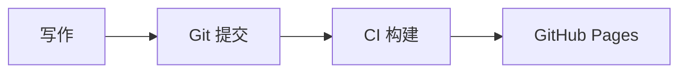

# 博客搭建指南

本文档记录了个人技术博客的完整搭建过程，包括技术选型、目录结构、写作流程、CI/CD 构建管线和功能配置。后续只需要在 `docs/` 目录下提交 Markdown 文档即可自动发布。

## 技术选型

| 组件 | 选型 | 说明 |
|------|------|------|
| 静态站点生成器 | Hexo 7.x | 快速、插件丰富、生态成熟 |
| 主题 | hexo-theme-matery | Material Design 风格，支持分类、标签、搜索、评论 |
| 代码高亮 | Prism.js | 替换 Hexo 默认高亮，支持更多语言 |
| 图表渲染 | Mermaid.js | 支持 flowchart、sequence diagram 等 |
| 评论系统 | Gitalk | 基于 GitHub Issues，无需额外服务 |
| 部署平台 | GitHub Pages | 免费、稳定、自动部署 |
| CI/CD | GitHub Actions | 自动构建、创建评论 Issue、部署 |

## 目录结构

```
blog/
├── docs/                    # 所有博客文档（写作区）
│   ├── blog/                # 博客搭建分类
│   │   ├── _index.md        # 分类名称映射
│   │   └── 博客搭建指南.md   # 本文
│   ├── db/                  # 数据库分类
│   ├── cluster/             # 集群分类
│   ├── base/                # 编程基础分类
│   └── ...                  # 更多分类
├── tools/
│   ├── sync-hexo.py         # 将 docs/ 转换为 Hexo source/_posts/
│   ├── patch-theme.py       # 修补 matery 主题（菜单、高亮、评论）
│   └── init-gitalk-issues.js# 批量创建 Gitalk Issue
├── _config.yml              # Hexo 主配置
├── _config.matery.yml       # matery 主题配置覆盖
├── package.json             # Hexo 依赖
└── .github/workflows/
    └── hexo.yml             # CI/CD 工作流
```
## 写作流程

新增一篇文章只需要三步：

1. 在 `docs/` 下对应的分类目录中创建 Markdown 文件：

```
docs/db/我的新文章.md
```
2. 文件内容以 `# 标题` 开头（第一个 H1 会作为文章标题）：

```markdown
# 我的新文章

这里是正文内容，支持标准 Markdown 语法。
```
3. 提交并推送：

```bash
git add docs/db/我的新文章.md
git commit -m "新增：我的新文章"
git push
```
CI 会自动完成构建和部署，无需任何手动操作。

## 分类规则

- 文章的分类由其所在的一级目录决定（如 `docs/db/` → 分类「数据库深入」）
- 每个分类目录下的 `_index.md` 定义了目录名到中文显示名的映射
- 如果目录没有 `_index.md`，则直接使用目录名作为分类名
- 新建分类只需创建目录并添加 `_index.md`：

```markdown
---
title: "分类中文名"
---

# 分类中文名
```
## 图片

- 图片放在文章同目录或子目录中，用相对路径引用
- `sync-hexo.py` 会自动将图片复制到 `source/images/` 并重写路径
- 支持页面捆绑（page bundle）：文章可以是目录形式 `docs/db/文章名/index.md`，图片放在同目录

### 日期

- 文章日期从 Git 提交历史中自动提取（取最早的提交时间）
- 无需手动填写日期

## CI/CD 构建流程

GitHub Actions 在每次推送到 `master` 分支时自动触发，流程如下：

```
checkout → npm install → 克隆 matery 主题 → patch-theme.py
→ sync-hexo.py → hexo generate → init-gitalk-issues.js → 部署到 GitHub Pages
```
### 各步骤说明

- **patch-theme.py**：修补主题配置
  - 移除主题默认菜单（使用 `_config.matery.yml` 的菜单）
  - 注入 Prism.js CSS 和 Mermaid.js
  - 注入 Gitalk 评论区到文章页面（在正文下方、上下篇导航上方）

- **sync-hexo.py**：内容转换
  - 扫描 `docs/` 下所有 Markdown 文件
  - 提取标题（第一个 H1）、日期（Git 历史）、分类（目录结构）
  - 生成 Hexo front matter 并输出到 `source/_posts/`
  - 复制图片到 `source/images/` 并重写路径
  - 生成分类和标签的索引页

- **hexo generate**：生成静态 HTML

- **init-gitalk-issues.js**：批量创建评论 Issue
  - 扫描生成的 HTML，提取每篇文章的 Gitalk ID
  - 通过 GitHub API 检查并创建缺失的 Issue
  - 后续推送只创建新增文章的 Issue

## 关键配置文件

### _config.yml（Hexo 主配置）

- `url: https://growdu.github.io/blog` - 站点 URL
- `root: /blog/` - 子路径
- `permalink: :year/:month/:day/:title/` - 文章永久链接格式
- `per_page: 20` - 每页文章数
- `syntax_highlighter: prismjs` - 代码高亮器

### _config.matery.yml（主题配置覆盖）

- `menu` - 导航菜单（首页、归档、分类、标签）
- `search` - 本地搜索
- `recommend` - 首页推荐文章
- `gitalk` - 评论系统配置
- `socialLink` - 社交链接（GitHub、邮箱、QQ）

## 功能特性

### 代码高亮

使用 Prism.js 的 Tomorrow 主题，支持自动加载语言组件。代码块样式为深色背景、圆角边框。

### Mermaid 图表

支持 Mermaid 语法，在代码块中使用 `mermaid` 语言标识：

````

````

### 评论系统

使用 Gitalk，基于 GitHub Issues 实现：

- 每篇文章对应一个 GitHub Issue
- Issue 在 CI 构建时自动创建（`init-gitalk-issues.js`）
- 访客登录 GitHub 后即可评论
- 评论数据存储在仓库的 Issues 中

Gitalk 配置在 `_config.matery.yml` 中：

```yaml
gitalk:
  enable: true
  clientID: "你的OAuth App Client ID"
  clientSecret: "你的OAuth App Client Secret"
  repo: blog
  owner: growdu
```
OAuth App 创建步骤：
1. 访问 `https://github.com/settings/applications/new`
2. Homepage URL 填 `https://growdu.github.io/blog/`
3. Callback URL 填 `https://growdu.github.io/blog/`
4. 复制 Client ID 和 Client Secret 填入配置

### 社交链接

在 `_config.matery.yml` 的 `socialLink` 中配置：

```yaml
socialLink:
  github:
    link: https://github.com/growdu
    name: GitHub
    icon: fab fa-github
  email:
    link: mailto:growdu@gmail.com
    name: Email
    icon: fas fa-envelope
  qq:
    link: http://wpa.qq.com/msgrd?v=3&uin=2689304284&site=qq&menu=yes
    name: QQ
    icon: fab fa-qq
```
### 首页推荐文章

在 `tools/sync-hexo.py` 的 `FEATURED_POSTS` 字典中配置，key 为相对于 `docs/` 的文件路径，value 为优先级（越大越靠前）：

```python
FEATURED_POSTS = {
    '00-intro.md': 100,
    'blog/博客搭建指南.md': 95,
    # ...
}
```
## 常见问题

### 新增文章后多久能看到？

推送后 CI 约需 2-3 分钟完成构建和部署。部署完成后立即可以在 `https://growdu.github.io/blog/` 看到。

### 文章没有出现在分类中？

确认文件放在 `docs/` 的一级子目录下，且目录有 `_index.md` 定义分类名。

### 评论区显示「未找到相关的 Issues」？

正常情况下 CI 会自动创建 Issue。如果仍然出现，检查 CI 日志中 `Initialize Gitalk issues` 步骤是否成功。

### 如何修改导航菜单？

编辑 `_config.matery.yml` 的 `menu` 部分，修改后提交推送即可。

### 如何更换主题颜色或样式？

主题样式通过 `tools/patch-theme.py` 在 CI 中动态注入。如需修改代码高亮样式、Mermaid 配置等，编辑该脚本。
