# newbing使用教程

| 修改人          | 修改内容 | 修改时间       |
| ------------ | ---- | ---------- |
| duanyingshou | 文档初稿 | 2023-05-23 |
|              |      |            |
|              |      |            |

使用newbing需要能访问google，因而在配置之前请先将代理配置好。

## 1. 下载

点击[这里](https://c2rsetup.edog.officeapps.live.com/c2r/downloadEdge.aspx?platform=Default&source=EdgeInsiderPage&Channel=Dev&language=zh-cn)下载edge dev。

下载完成后，点击安装。

## 2. 配置

edge安装完成后，默认搜索引擎为bing，且在国内访问时，会默认跳转到cn.bing，而cn.bing无法使用newbing。因而需要对edge的设置进行更改。

### 3. 修改默认搜索引擎

如下图所示，在edge中点击设置进入设置界面。

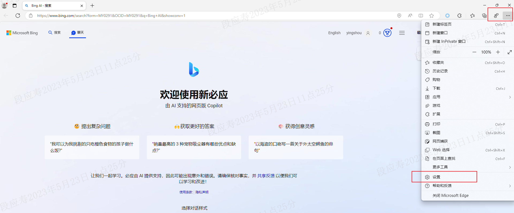

进入设置界面后如下图所示，找到地址栏和搜索点击进入

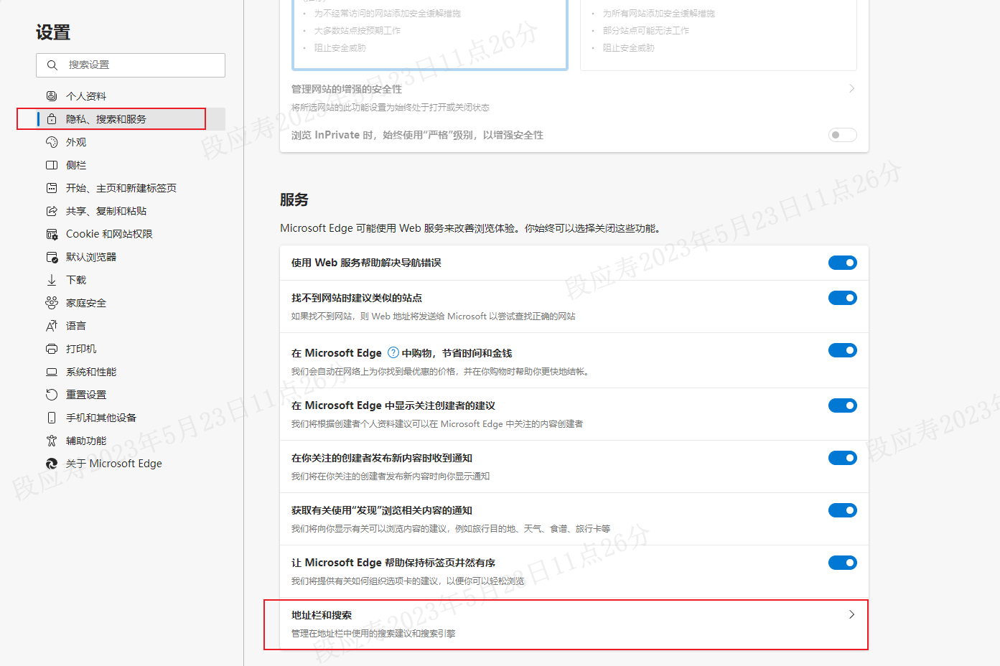

如下图所示将默认搜索引擎修改为google。

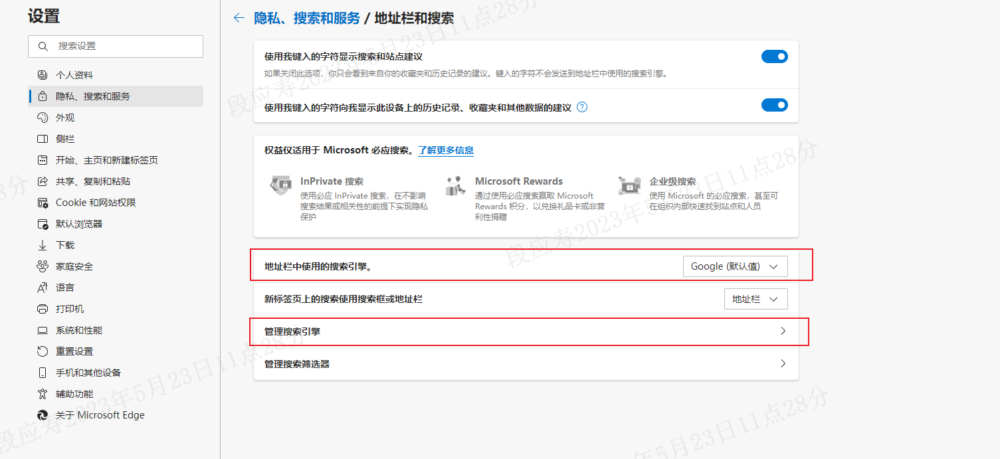

点击管理搜索引擎如下图所示可以将bing搜索引擎删除,这里我的已经删除。

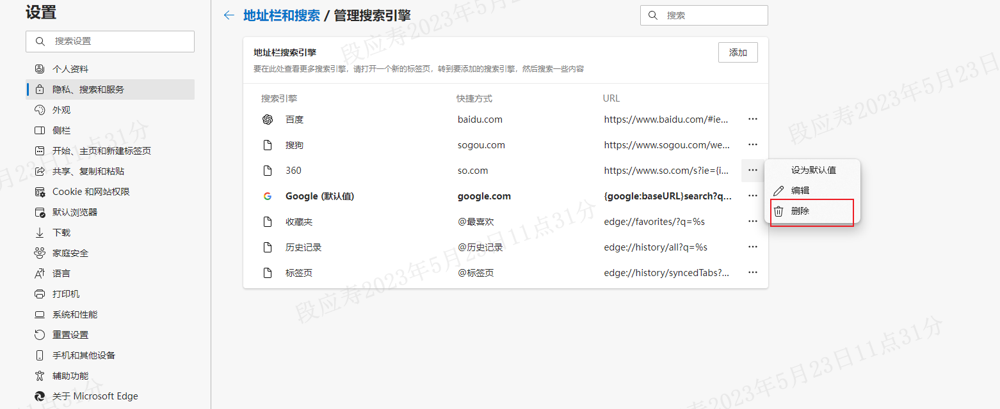

### 4. 清除浏览器cookie

切换搜索引擎后还需要清楚浏览器cookie，不然还会跳转到cn.bing。

如下图所示，新进入cookie界面：

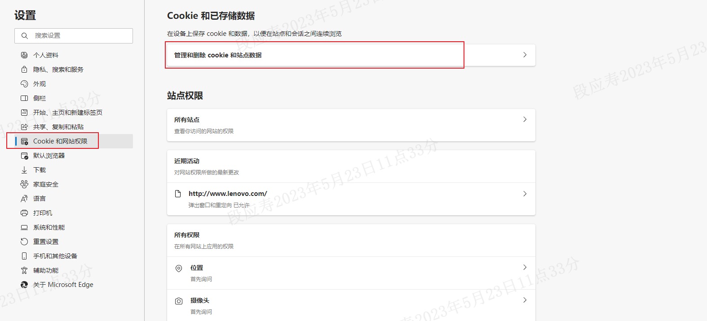

点击查看所有cookie，如下图所示：

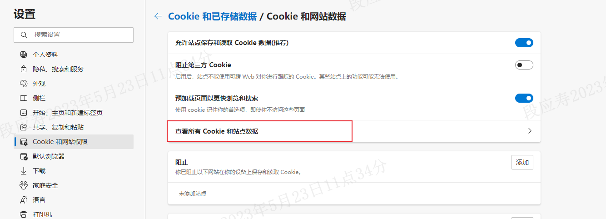

使用bing搜索，将bing有关的cookie全部删除。

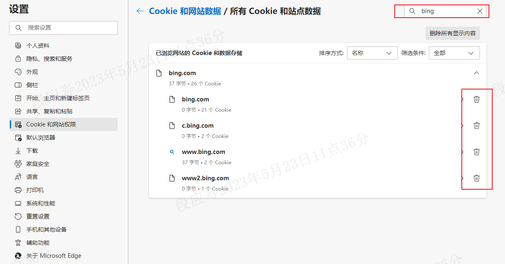

当然如果你是刚安装的edge，直接点击全部删除即可。

### 5. 访问如下网址使用newbing

点击[Bing AI - 搜索](https://www.bing.com/search?form=MY0291&OCID=MY0291&q=Bing+AI&showconv=1)访问，结果如下图所示。

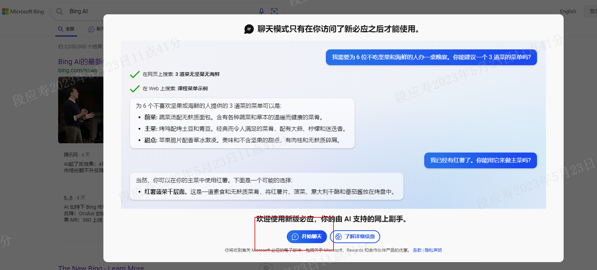

若之前还没有登录过，则需要点击开始聊天登录微软账户。若没有账户的话按照提示步骤创建一个即可。**在登录后记得选择保持登录状态**。

登录成功后界面如下：

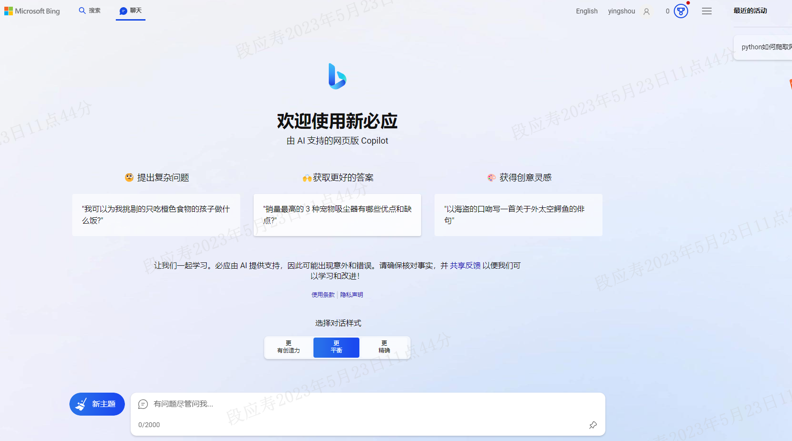

此时可以使用newbing进行交互,实例结果如下：

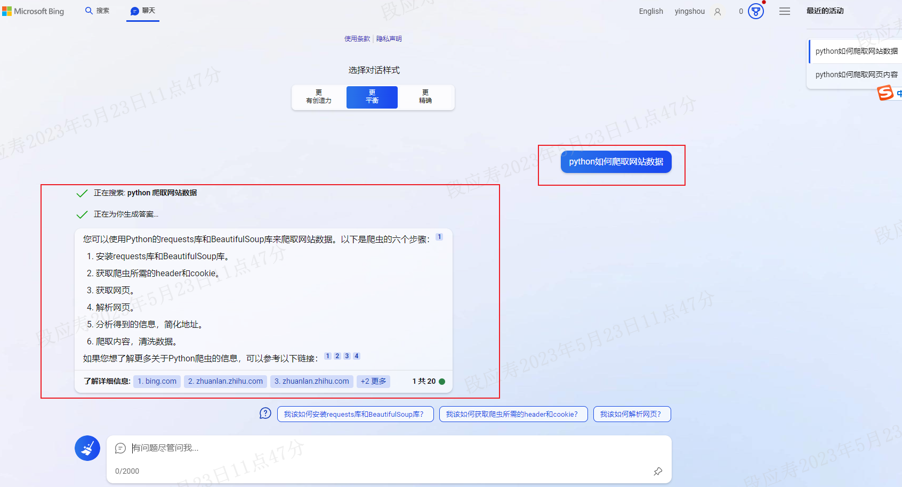

可以将newbing的网址添加到首页，这样每次打开edge的时候就可以直接进入newbing的界面，如下图所示，将https://www.bing.com/search?form=MY0291&OCID=MY0291&q=Bing+AI&showconv=1 添加到启动页面里。

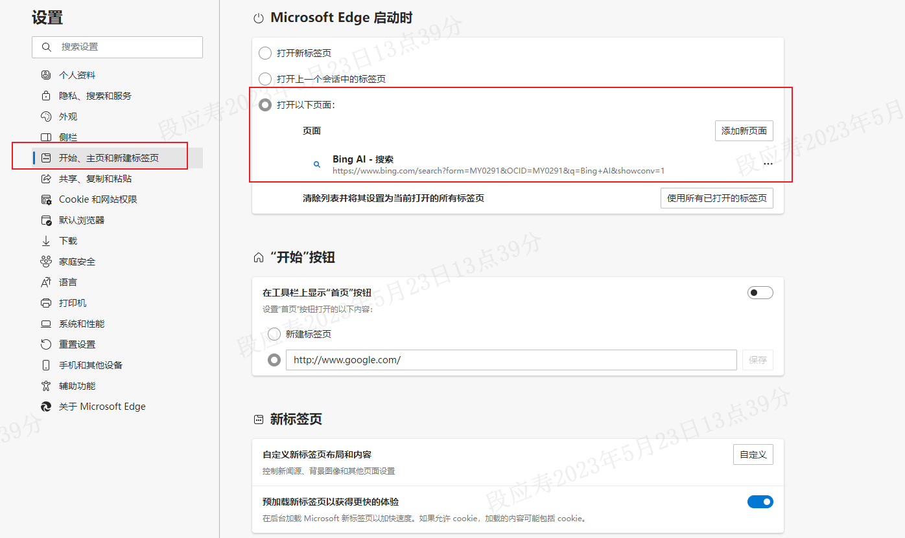

需要特别注意的是访问谷歌需要代理，因而在配置前请先将代理配置好。
