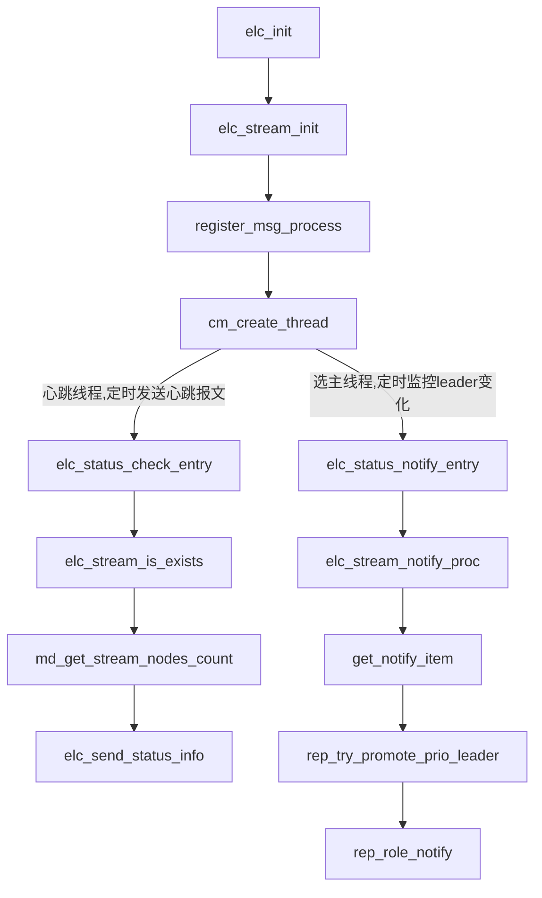
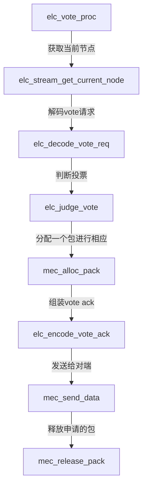
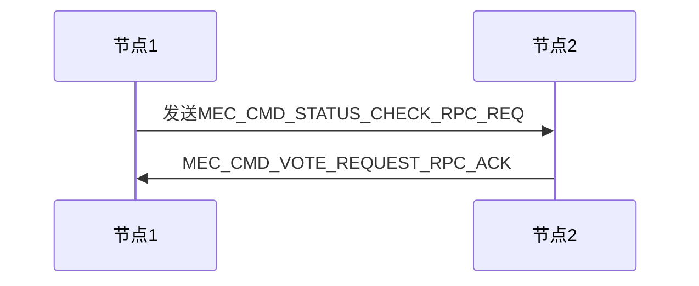

# dcf投票系统详解

## 节点类型

```c
typedef enum en_dcf_role {
    DCF_ROLE_UNKNOWN = 0,
    DCF_ROLE_LEADER, 
    DCF_ROLE_FOLLOWER,
    DCF_ROLE_LOGGER,
    DCF_ROLE_PASSIVE,
    DCF_ROLE_PRE_CANDIDATE,
    DCF_ROLE_CANDIDATE,
    DCF_ROLE_CEIL,
} dcf_role_t;
```

## 投票模式

```c
typedef enum en_param_run_mode {
    ELECTION_AUTO,
    ELECTION_MANUAL,
    ELECTION_DISABLE,
    ELECTION_CEIL,
} param_run_mode_t;
```

## 投票初始化



## 消息处理函数

```c
    register_msg_process(MEC_CMD_VOTE_REQUEST_RPC_REQ, elc_vote_proc, PRIV_HIGH);
    register_msg_process(MEC_CMD_VOTE_REQUEST_RPC_ACK, elc_vote_ack_proc, PRIV_HIGH);
    register_msg_process(MEC_CMD_PROMOTE_LEADER_RPC_REQ, elc_promote_proc, PRIV_HIGH);
    register_msg_process(MEC_CMD_STATUS_CHECK_RPC_REQ, elc_status_check_req_proc, PRIV_HIGH);
    register_msg_process(MEC_CMD_STATUS_CHECK_RPC_ACK, elc_status_check_ack_proc, PRIV_HIGH);
```

- `MEC_CMD_VOTE_REQUEST_RPC_REQ`



- `MEC_CMD_VOTE_REQUEST_RPC_ACK`
- `MEC_CMD_PROMOTE_LEADER_RPC_REQ`
- `MEC_CMD_STATUS_CHECK_RPC_REQ`
- `MEC_CMD_STATUS_CHECK_RPC_REQ`
- `MEC_CMD_STATUS_CHECK_RPC_ACK`

## 消息流程


