# 一文读懂openguass dcf网络模块

| 编写人 | 编写内容 | 编写时间       |
| --- | ---- | ---------- |
| growdu | 初稿   | 2023-02-23 |
|     |      |            |
|     |      |            |

[TOC]

## 0. mec概要

通信模块主要是基于MEC实现（Message Exchange Component），提供整个DCF组件实例间通信能力，以及异步事件处理框架。主要功能有：可扩展的多种通信协议，单播、广播、环回的发送接口，消息异步处理的框架，支持多channel机制和多优先级队列，支持压缩和批量发送等mec主要通过channel来进行通信，节点之间可能存在多个channel通道。

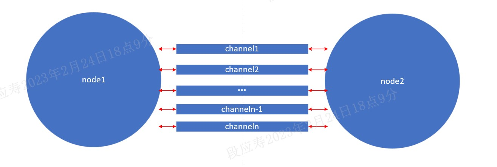

channel通过队列进行消息的收发，消息收发支持批量收发。channel内部采用pipe通信，pipe又分为高优先级和低优先级。每一个pipe内部有两条tcp链路，一条链路专门用于发送，一条链路专门用于接收。

消息收发流程如下图所示（此处队列只画出了一个，实际有多个队列，默认16个）：

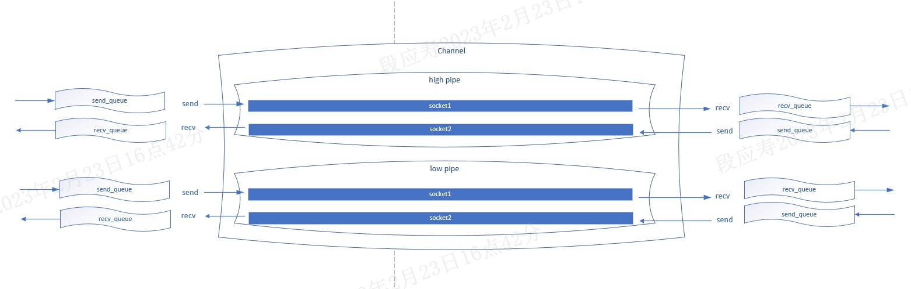

mec消息处理采用多线程加队列来实现，队列的访问采用锁加信号量来避免多线程冲突，mq和agent均采用这种模式来实现。

mec网络通信采用epoll I/O多路复用来实现，并使用[reactor模型](https://blog.csdn.net/u013256816/article/details/115388239)来实现服务端监听机制。其架构与下图（图片来自https://blog.csdn.net/u013256816/article/details/115388239）类似，采用主从reactor多线程模型只不过在mec中将mainreactor称作listener（acceptor）。

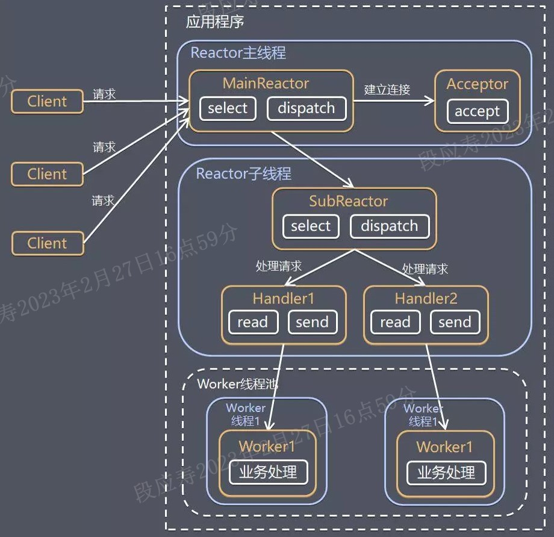

mec使用tcp监听链路来接收消息，消息接收采用reactor模型实现，最终交给agent来执行。实际流程与上图的reactor主从模型类似，消息接收执行流程如下：

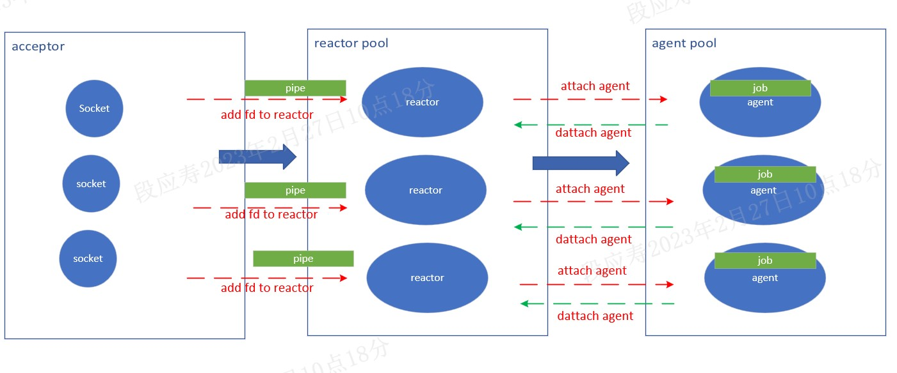

mec的消息处理主要依靠如下四个组件来完成，而channel主要是用来传输，因而在下图中未体现。

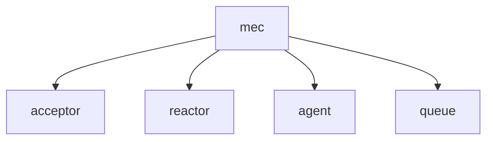
```mermaid
graph TB
mec-->acceptor
mec-->reactor
mec-->agent
mec-->queue
```

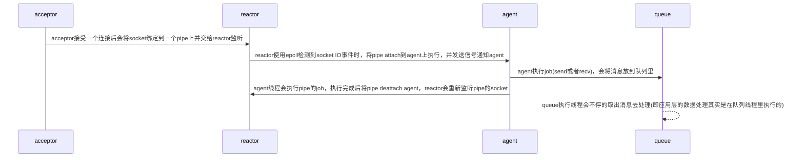
```mermaid
sequenceDiagram
acceptor->>reactor: acceptor接受一个连接后会将socket绑定到一个pipe上并交给reactor监听
reactor->>agent: reactor使用epoll检测到socket IO事件时，将pipe attach到agent上执行，并发送信号通知agent
agent->>queue: agent执行job(send或者recv)，会将消息放到队列里
agent->>reactor: agent线程会执行pipe的job，执行完成后将pipe deattach agent，reactor会重新监听pipe的socket
queue-->>queue: queue执行线程会不停的取出消息去处理(即应用层的数据处理其实是在队列线程里执行的)
```

mec重点由五大组件组成，分别是：

- listener（acceptor）
  
  listener负责监听和接受客户端的连接，充当epoll多路复用reactor模型中的acceptor角色。

- reactor
  
  负责监听acceptor建立好连接后添加过来的socket，当有事件到来时会将对应的socket绑定到agent运行。

- agent
  
  agent是一个线程池，负责执行channel中pipe的job。

- queue
  
  队列用于存放接收和发送的消息。

- channel
  
  channel是实际的通信通道，其内部由pipe来进行通信，pipe分为高优先级pipe和低优先级pipe。pipe在socket层面又分为发送pipe和接收pipe。节点之间就是通过channel来进行收发包，发送时通过发送pipe发送，接收时通过接收pipe来接收。

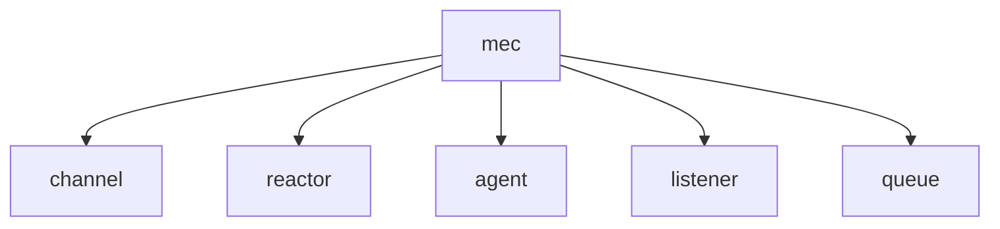
```mermaid
graph TB
mec-->channel
mec-->reactor
mec-->agent
mec-->listener
mec-->queue
```

mec运行初始化流程如下：

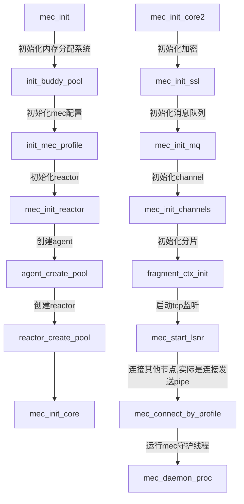
```mermaid
graph TB
mec_init-->|初始化内存分配系统|init_buddy_pool-->|初始化mec配置|init_mec_profile-->|初始化reactor|mec_init_reactor-->|创建agent|agent_create_pool-->|创建reactor|reactor_create_pool-->mec_init_core
mec_init_core2-->|初始化加密|mec_init_ssl-->|初始化消息队列|mec_init_mq-->|初始化channel|mec_init_channels-->|初始化分片|fragment_ctx_init-->|启动tcp监听|mec_start_lsnr-->|连接其他节点,实际是连接发送pipe|mec_connect_by_profile-->|运行mec守护线程|mec_daemon_proc
```

mec模块的网络通信采用epoll I/O多路复用的reactor模型，同时结合线程池和代理池来实现。reactor负责消息的通知，分为高优先级reactor和低优先级reactor。内部通信采用channel的概念，channel内部采用pipe来进行连接通信。每一个代理运行在一个线程上，每一个pipe会附着到一个代理上运行。acceptor接受新的连接后，会创建channel，并将channel添加到reactor池中，reactor负责监听I/O事件的到来。

每一个acceptor接受到新的客户端连接请求后，接受连接并初始化pipe，同时将pipe添加到reactor中。reactor会监听每个pipe是否有事件到来，有事件到来时，reactor会把pipe附着到一个agent上运行。

每一个节点都有一个全局的静态mec_instance_t，用于保存mec相关的信息。

```c
static mec_instance_t *g_mec = NULL;
/// @brief 消息交换实例
typedef struct st_mec_instance {
    mec_profile_t      profile; ///< mec主要信息
    mq_context_t       send_mq; ///< 发送队列
    mq_context_t       recv_mq; ///< 接收队列
    mec_context_t      mec_ctx; ///< mec上下文
    fragment_ctx_t     fragment_ctx; ///< 分片上下文
    thread_t           daemon_thread;///< 守护线程id
    reactor_pool_t     reactor_pool[PRIV_CEIL]; ///< epoll反应堆数组
    agent_pool_t       agent_pool[PRIV_CEIL]; ///< 代理池
    ssl_ctx_t         *ssl_acceptor_fd; ///< ssl接受器
    ssl_ctx_t         *ssl_connector_fd;///< ssl连接器
} mec_instance_t;
```

## 1. compress

压缩模块主要是对传输数据进行压缩，以及对接收到的数据进行解压缩，以提高网络传输数量。当前支持zstd压缩和lz4压缩。

## 2. mec

mec是Message Exchange Component消息交换组件的简称。主要通过mec.h对外提供使用接口。

### 2.1 agent

agent实际上是线程池模式，利用互斥锁和信号量加队列来实现。一旦有新的pipe到来的时候，就会唤醒一个线程去执行。如果没有空闲的agent，就会新创建一个agent。也就是说，agent是动态创建的，只有agent处理不过来时，才会创建新的agent。

所有新加入的pipe会先加入到队列里，每个线程去队列里取出一个pipe来处理。

agent与reactor对应，也分为高优先级agent和低优先级agent，并与reactor相对应。

#### 2.1.1 初始化agent

初始化agent主要是初始化互斥锁和信号量。

```c
    evnt->status = CM_FALSE;
    if (pthread_condattr_init(&evnt->attr) != 0) {
        (void)pthread_cond_destroy(&evnt->cond);
        return CM_ERROR;
    }

    if (pthread_mutex_init(&evnt->lock, 0) != 0) { /// 初始化锁
        (void)pthread_cond_destroy(&evnt->cond);
        return CM_ERROR;
    }

    if (pthread_condattr_setclock(&evnt->attr, CLOCK_MONOTONIC) != 0) {
        (void)pthread_cond_destroy(&evnt->cond);
        return CM_ERROR;
    }

    if (pthread_cond_init(&evnt->cond, &evnt->attr) != 0) { /// 初始化信号量
        (void)pthread_cond_destroy(&evnt->cond);
        return CM_ERROR;
    }
```

#### 2.1.2 agent执行

当reactor监听到有pipe就绪时，会将该pipe附着到agent上执行。

- 已有空闲agent

此时先看idle_agents是否有空闲的agent，有的话直接出队一个agent，并把pipe绑定到这个agent上执行，设置pipe是发送还是接收，激活pipe。

- 没有空闲agent

如果之前还没有创建过agent或者没有空闲的agent，就需要新建一个agent。

创建一个agent也是创建一个线程，这个线程会不停的空转或者执行pipe。创建时会用cm_event_init初始化锁和信号量，然后会在线程中用cm_event_timedwait等待信号量唤醒agent线程。

在创建pipe的时候会初始化send_mode和recv_mode的job，当线程被唤醒就会执行对应的job。

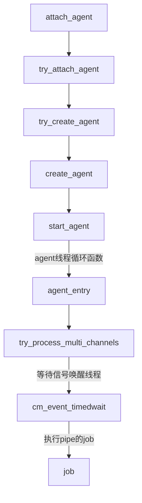
```mermaid
graph TB
attach_agent-->try_attach_agent-->try_create_agent-->create_agent-->start_agent-->|agent线程循环函数|agent_entry-->try_process_multi_channels-->|等待信号唤醒线程|cm_event_timedwait-->|执行pipe的job|job
```

当调用attach_agent时，就意味着有一个pipe要放到agent里来运行。若在attach_agent成功后，同时调用cm_event_notify，则会发送信号给agent线程，表示有任务可以执行，此时会唤醒线程并执行pipe的job。

在网络模块中有两个地方会将pipe attach到agent，分别是客户端在connect成功后和reactor接收到事件之后。

- 客户端connect成功
  
  ```c
  if (attach_agent(pipe, get_mec_agent(pipe->priv), SEND_MODE, &agent) != CM_SUCCESS) {
          LOG_RUN_ERR("[MEC]attached agent failed inst [%u], channel id [%u], priv [%d]",
                      MEC_INSTANCE_ID(pipe->channel->id), MEC_CHANNEL_ID(pipe->channel->id), pipe->priv);
          cm_thread_unlock(&pipe->send_lock);
          return CM_ERROR;
   }
  ```
  
  此时是将SEND_MODE模式的pipe attach到agent上执行，attach到agent成功后调用cm_event_notify通知agent有任务可以处理。此时流程进入agent_entry的循环里并执行加入的pipe，
  
  ```c
  pipe->attach[agent->mode].job((void *)pipe, &is_continue);
  ```
  
  agent收到信号后就会执行job，这里加入的pipe的mode是SEND_MODE，pipe的job在创建channel时赋值，SEND_MODE对应的job是mec_proc_send_pipe。
  
  此时对应的是客户端行为，在连接时客户端是主动发送消息的一方。

- reactor接收到事件
  
  ```c
  status_t status = attach_agent(pipe, reactor->agent_pool, RECV_MODE, &agent);
  ```
  
  当acceptor在建立好tcp连接并初始化好pipe后就会将pipe交给reactor进行处理，reactor会适用epoll_wait监听pipe的socket是否有事件到来。当有socket准备就绪时，就将其对应的pipe attach到agent上去执行，此时的mode为RECV_MODE。
  
  agent收到信号后就会执行job，这里加入的pipe的mode是RECV_MODE，pipe的job在创建channel时赋值，RECV_MODE对应的job是mec_proc_recv_pipe。

### 2.2 channel

节点之间通过channel来通信，两个节点之间可以存在多个channel，channel个数可以通过配置参数配置。

channel是对pipe的封装，每个channel有它自己的id标识。

一个channel有两个pipe，一个高优先级，一个低优先级。

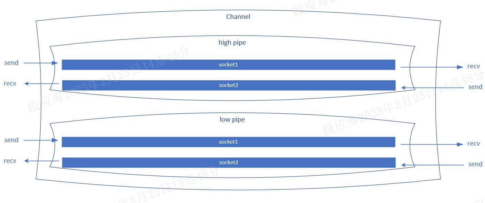

```c
/// @brief channel
typedef struct st_mec_channel {
    uint32        id; ///< id
    atomic32_t    serial_no;
    mec_pipe_t    pipe[PRIV_CEIL]; ///< pipe数组，高优先级和低优先级
} mec_channel_t;
```

创建channel时会根据实际的实例个数（节点个数）创建。

channel存放在mec上下文里，用一个二维数组来存放。其中一维是nodeid，二维是channel索引。比如三个节点的集群，若每个节点之间有三个channel，则有9个channel（实际使用的没有那么多，自己不会连自己的channel），因为在分布式集群中，各节点互相之间都需要通信。

```c
typedef struct st_mec_context {
    mec_lsnr_t        lsnr;
    mec_channel_t   **channels; ///< channel二维数组，一维是node_id,二维是channel索引
    bool8             is_connect[CM_MAX_NODE_COUNT][MEC_MAX_CHANNEL_NUM]; ///< 表示二维数组channels的每个channel是否连接过
    mec_cb_t          cb_processer[MEC_CMD_CEIL];
    shutdown_phase_t  phase;
} mec_context_t;
```

#### 2.2.1 初始化channel

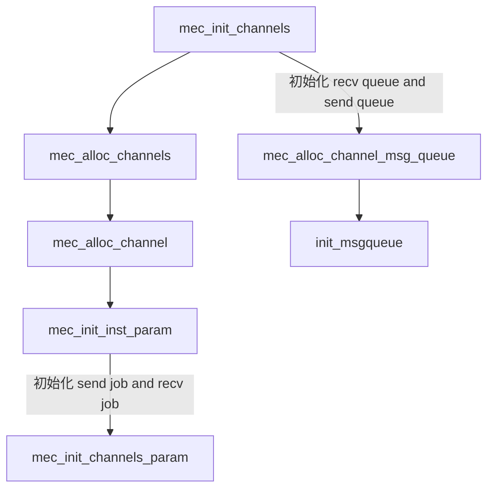
```mermaid
graph TB
mec_init_channels-->mec_alloc_channels-->mec_alloc_channel-->mec_init_inst_param-->|初始化 send job and recv job|mec_init_channels_param
mec_init_channels-->|初始化 recv queue and send queue|mec_alloc_channel_msg_queue-->init_msgqueue
```

每个channel有两个pipe，每个pipe又有两个job，一个发送job，一个接收job，在初始化channel时注册，这个job就是具体的执行函数。最后会通过reactor分配到agent线程上去具体执行。

```c
void mec_init_channels_param(mec_channel_t *channel, const mec_profile_t *profile)
{
    for (uint32 k = 0; k < PRIV_CEIL; k++) {
        mec_pipe_t *pipe = &channel->pipe[k];
        cm_init_thread_lock(&pipe->send_lock);
        cm_init_thread_lock(&pipe->recv_lock);
        cm_init_thread_lock(&pipe->recv_epoll_lock);
        pipe->priv = k;
        pipe->channel = channel;
        pipe->attach[SEND_MODE].job = mec_proc_send_pipe;
        pipe->attach[RECV_MODE].job = mec_proc_recv_pipe;
        pipe->send_pipe.connect_timeout = profile->connect_timeout;
        pipe->send_pipe.socket_timeout = profile->socket_timeout;
        pipe->recv_pipe.connect_timeout = profile->connect_timeout;
        pipe->recv_pipe.socket_timeout = profile->socket_timeout;
        pipe->send_pipe.l_onoff = 1;
        pipe->send_pipe.l_linger = 1;
        pipe->try_connet_count = 0;
        pipe->send_need_close = CM_FALSE;
        pipe->recv_need_close = CM_FALSE;
    }
}
```

- mec_proc_send_pipe

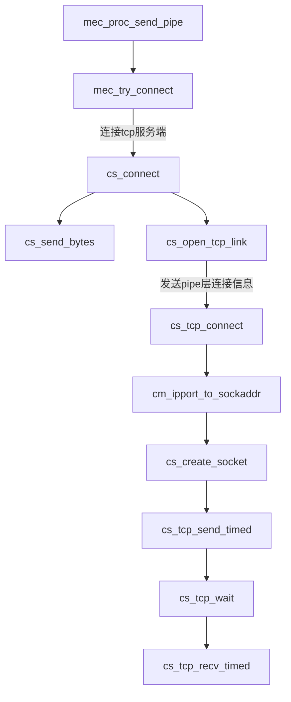
```mermaid
graph TB
mec_proc_send_pipe-->mec_try_connect-->|连接tcp服务端|cs_connect-->cs_send_bytes
cs_connect-->cs_open_tcp_link-->|发送pipe层连接信息|cs_tcp_connect-->cm_ipport_to_sockaddr-->cs_create_socket-->cs_tcp_send_timed-->cs_tcp_wait-->cs_tcp_recv_timed
```

- mec_proc_recv_pipe

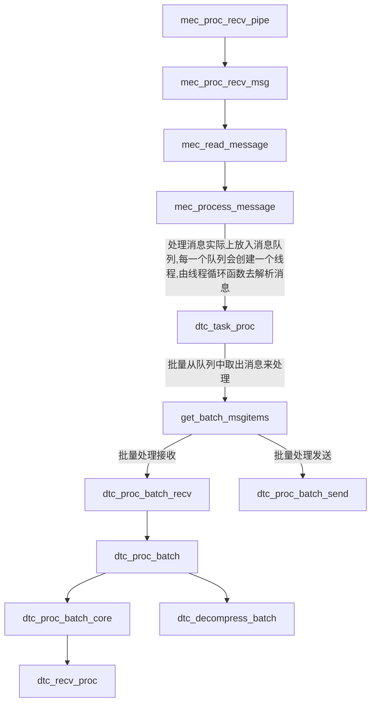
```mermaid
graph TB
mec_proc_recv_pipe-->mec_proc_recv_msg-->mec_read_message-->mec_process_message-->|处理消息实际上放入消息队列,每一个队列会创建一个线程,由线程循环函数去解析消息|dtc_task_proc-->|批量从队列中取出消息来处理|get_batch_msgitems-->|批量处理接收|dtc_proc_batch_recv-->dtc_proc_batch-->dtc_proc_batch_core-->dtc_recv_proc
dtc_proc_batch-->dtc_decompress_batch
get_batch_msgitems-->|批量处理发送|dtc_proc_batch_send
```

  服务端启动监听的流程如下：

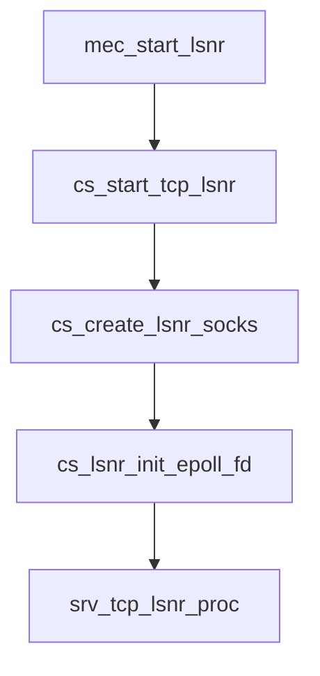
```mermaid
graph TB
mec_start_lsnr-->cs_start_tcp_lsnr-->cs_create_lsnr_socks-->cs_lsnr_init_epoll_fd-->srv_tcp_lsnr_proc
```

初始化channel完成后，还需要初始化mq接收上下文和mq发送上下文中的channel_private_queue，这是一个二维数组，是消息队列的具体存放地址。一维是节点id，二维是channel对应的消息队列。假设有三个节点，每个节点配置的channel个数是4，那么就有3\*4=12个消息队列，对应3\*4的二维数组。

#### 2.2.2 连接channel

在创建完listener（acceptor）后主线程会进行channel的connect操作。

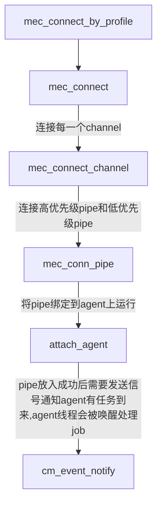
```mermaid
graph TB
mec_connect_by_profile-->mec_connect-->|连接每一个channel|mec_connect_channel-->|连接高优先级pipe和低优先级pipe|mec_conn_pipe-->|将pipe绑定到agent上运行|attach_agent-->|pipe放入成功后需要发送信号通知agent有任务到来,agent线程会被唤醒处理job|cm_event_notify
```

此时会将所有的channel连接，具体来说是pipe连接，channel的连接其实就是channel两个pipe（高低优先级）的连接。通过这个步骤，就将pipe放入到agent里，此时socket也还没有到reactor里，且此时的pipe是发送类型，表明需要主动发送消息，最终消息流程转移到了mec_proc_send_pipe。

### 2.3 api

api模块提供了mec对外的全部接口，其对应的头文件为mec.h，其他模块需要使用mec模块的功能和接口只需要引入mec.h头文件即可。

api模块定义了mec消息结构和消息类型，mec消息分为消息头和消息体，消息头主要是存放节点相关信息和控制信息，消息体存放应用层数据。

消息头结构如下：

```c
/// @brief 消息交换头部
typedef struct st_mec_message_head {
    uint8      cmd;       ///< 消息请求类型
    uint8      flags;     ///< 状态标志
    uint16     batch_size; ///< 批量消息条数
    uint32     src_inst;  ///< 来源id（源节点id）
    uint32     dst_inst;  ///< 目的节点id
    uint32     stream_id;   ///< 流id（channel id）
    uint32     size;     ///< 消息长度
    uint32     serial_no; ///< channel序列号
    uint32     frag_no;   ///< 分片序列号
    uint32     version;   ///< 协议版本
    uint64     time1;
    uint64     time2;
    uint64     time3;
} mec_message_head_t;
```

消息体结构如下：

```c
/// @brief 消息体
typedef struct st_mec_message {
    mec_message_head_t *head; ///< 消息头指针
    char               *buffer; ///< 消息
    uint32              buf_size; ///< 消息大小
    uint32              aclt_size;
    uint32              offset;   // for reading
    uint32              options;  // options
} mec_message_t;
```

消息头中cmd的类型有如下几种：

```c
/// @brief 交换消息命令
typedef enum en_mec_command {
    // normal cmd:
    MEC_CMD_CONNECT                = 0, ///< 连接请求
    MEC_CMD_HEALTH_CHECK_HIGH      = 1,
    MEC_CMD_HEALTH_CHECK_LOW       = 2,
    MEC_CMD_APPEND_LOG_RPC_REQ     = 3, ///< 日志添加请求
    MEC_CMD_APPEND_LOG_RPC_ACK     = 4, ///< 日志添加确认
    MEC_CMD_VOTE_REQUEST_RPC_REQ   = 5, ///< 投票请求
    MEC_CMD_VOTE_REQUEST_RPC_ACK   = 6, ///< 投票确认
    MEC_CMD_GET_COMMIT_INDEX_REQ   = 7, ///< 索引提交请求
    MEC_CMD_GET_COMMIT_INDEX_ACK   = 8, ///< 索引提交确认
    MEC_CMD_PROMOTE_LEADER_RPC_REQ = 9, ///< 升主请求
    MEC_CMD_BLOCK_NODE_RPC_REQ     = 10, 
    MEC_CMD_BLOCK_NODE_RPC_ACK     = 11,
    MEC_CMD_SEND_COMMON_MSG        = 12, ///< 发送通用消息
    MEC_CMD_CHANGE_MEMBER_RPC_REQ  = 13, ///< 成员变更请求
    MEC_CMD_UNIVERSAL_WRITE_REQ    = 14, ///< 通用写入请求
    MEC_CMD_UNIVERSAL_WRITE_ACK    = 15, ///< 通用写入确认
    MEC_CMD_STATUS_CHECK_RPC_REQ   = 16, ///< 状态检查请求
    MEC_CMD_STATUS_CHECK_RPC_ACK   = 17, ///< 状态检查确认

    MEC_CMD_NORMAL_CEIL, ///< 在这个枚举前添加新的请求，在后面添加测试请求，比这个枚举值大仅用于测试

    // test cmd:
    MEC_CMD_TEST_REQ  = MEC_CMD_NORMAL_CEIL + 1, ///< 测试请求
    MEC_CMD_TEST_ACK  = MEC_CMD_NORMAL_CEIL + 2, ///< 测试确认
    MEC_CMD_TEST1_REQ = MEC_CMD_NORMAL_CEIL + 3,
    MEC_CMD_TEST1_ACK = MEC_CMD_NORMAL_CEIL + 4,
    MEC_CMD_BRD_TEST  = MEC_CMD_NORMAL_CEIL + 5,

    MEC_CMD_CEIL,
} mec_command_t;
```

mec对外提供的接口主要分为以下几类：

- 初始化mec和释放mec资源
  
  ```c
  /// @brief 初始化mec
  /// @return 
  status_t mec_init();
  
  /// @brief 释放mec相关资源
  void     mec_deinit();
  ```
  
  这两个接口主要是主线程创建的时候调用和主线程退出前调用。

- 消息处理函数注册和注销接口
  
  ```c
  /// @brief 注册消息处理函数,将消息注册到mec上下文的回调里，当收到相关请求类型的数据时，会调用proc函数进行处理
  /// @param cmd 处理函数对应的消息类型
  /// @param proc 消息类型对应的处理函数
  /// @param priv 消息的优先级(高优先级或者低优先级)
  void register_msg_process(mec_command_t cmd, msg_proc_t proc, msg_priv_t priv)
  {
      mec_context_t *mec_ctx = get_mec_ctx();
      if (cmd >= MEC_CMD_CEIL) {
          return;
      }
      mec_ctx->cb_processer[cmd].priv = priv;
      mec_ctx->cb_processer[cmd].proc = proc;
  }
  ```
  
  消息处理函数也可以注销，注销后可重新进行注册。
  
  ```c
  /// @brief 注销cmd类型的消息处理函数
  /// @param cmd 消息类型
  void unregister_msg_process(mec_command_t cmd)
  {
      mec_context_t *mec_ctx = get_mec_ctx();
      mec_ctx->cb_processer[cmd].proc = NULL;
      mec_ctx->cb_processer[cmd].priv = PRIV_CEIL;
  }
  ```

- 消息发送和接收消息接口
  
  消息发送一般是多个接口结合使用，一般流程为：
  
  1. 先申请一个pack，对应的接口为；
     
     ```c
     /// @brief 分配一个消息，在广播场景中，dst_inst 必须是 CM_INVALID_NODE_ID
     /// @param pack 消息指针
     /// @param cmd 消息类型
     /// @param src_inst 消息发出方
     /// @param dst_inst 消息接收方
     /// @param stream_id 流id
     /// @return 
     status_t mec_alloc_pack(mec_message_t *pack, mec_command_t cmd, uint32 src_inst, uint32 dst_inst, uint32 stream_id);
     ```
  
  2. 往pack里put数据，对应的接口根据数据类型的不同分为如下几个，支持的数据类型有int64、int32、int16、double、bin；
     
     ```c
     /// @brief 往消息里添加int64类型的数据
     /// @param pack 消息
     /// @param value 数据值
     /// @return 
     status_t mec_put_int64(mec_message_t *pack, uint64 value);
     /// @brief 往消息里添加int32类型的数据
     /// @param pack 消息
     /// @param value 数据值
     /// @return 
     status_t mec_put_int32(mec_message_t *pack, uint32 value);
     /// @brief 往消息里添加int16类型的数据
     /// @param pack 消息
     /// @param value 数据值
     /// @return 
     status_t mec_put_int16(mec_message_t *pack, uint16 value);
     /// @brief 往消息里添加double类型的数据
     /// @param pack 消息
     /// @param value 数据值
     /// @return 
     status_t mec_put_double(mec_message_t *pack, double value);
     /// @brief 往消息里添加字节数据
     /// @param pack 消息
     /// @param size 添加的数据长度
     /// @param buffer 数据地址
     /// @return 
     status_t mec_put_bin(mec_message_t *pack, uint32 size, const void *buffer);
     ```
  
  3. 将消息发出去，对应的接口为mec_send_data；
     
     ```c
     /// @brief 通过mec发送消息
     /// @param pack 
     /// @return 
     status_t mec_send_data(mec_message_t *pack);
     ```
     
     消息发送除了调用mec_send_data发送数据到单个节点外，还可以使用广播接口将数据发送到所有节点。
     
     ```c
     /// @brief 通过mec广播一条消息
     /// @param stream_id 流id
     /// @param inst_bits 
     /// @param pack 消息
     /// @param success_bits 
     void mec_broadcast(uint32 stream_id, uint64 inst_bits[INSTS_BIT_SZ], mec_message_t *pack,
         uint64 success_bits[INSTS_BIT_SZ]);
     ```
  
  4. 发送成功后，释放申请的包
     
     ```c
     /// @brief 释放消息的资源
     /// @param pack 
     void mec_release_pack(mec_message_t *pack);
     ```
  
  比如发送一个MEC_CMD_BLOCK_NODE_RPC_REQ请求的流程如下：
  
  ```c
  status_t block_node_req(uint32 stream_id, uint32 node_id, uint32 block_time_ms)
  {
      mec_message_t pack;
      uint32 src_node = md_get_cur_node(); ///< 获取本节点的id
      ///< 申请一个包
      CM_RETURN_IFERR(mec_alloc_pack(&pack, MEC_CMD_BLOCK_NODE_RPC_REQ, src_node, node_id, stream_id));
      if (mec_put_int32(&pack, block_time_ms) != CM_SUCCESS) { ///< 往包里put数据
          mec_release_pack(&pack);
          LOG_DEBUG_ERR("block node req, encode fail.");
          return CM_ERROR;
      }
      LOG_DEBUG_INF("send blockreq: stream=%u,src=%u,dst=%u,block_time=%u.", stream_id, src_node, node_id, block_time_ms);
      status_t ret = mec_send_data(&pack);///< 发送数据
      mec_release_pack(&pack); ///< 释放包
      return ret;
  }
  ```
  
  消息接收一般是在cmd注册的proc里面，当mec接收到消息，并根据消息类型将消息交给注册的proc处理时，就可以调用消息读取接口读取数据。读取数据也根据数据类型分为几类，支持的数据类型有int64、int32、int16、double、bin。
  
  ```c
  /// @brief 从消息中读取int64类型的数据
  /// @param pack 消息
  /// @param value 读取出来的值
  /// @return 
  status_t mec_get_int64(mec_message_t *pack, int64 *value);
  /// @brief 从消息中读取int32类型的数据
  /// @param pack 消息
  /// @param value 读取出来的值
  /// @return 
  status_t mec_get_int32(mec_message_t *pack, int32 *value);
  
  /// @brief 注册加密回调函数
  /// @param cb_func 加密回调函数
  /// @return 
  status_t mec_register_decrypt_pwd(usr_cb_decrypt_pwd_t cb_func);
  
  /* need keep 4-byte align by the caller */
  /// @brief 从消息中读取int16类型的数据
  /// @param pack 消息
  /// @param value 读取出来的值
  /// @return 
  status_t mec_get_int16(mec_message_t *pack, int16 *value);
  
  /// @brief 从消息中读取double类型的数据
  /// @param pack 消息
  /// @param value 读取出来的值
  /// @return 
  status_t mec_get_double(mec_message_t *pack, double *value);
  
  /// @brief 从消息中读取指定长度字节的数据
  /// @param pack 消息
  /// @param size 读取字节长度
  /// @param buffer 数据存放地址
  /// @return 
  status_t mec_get_bin(mec_message_t *pack, uint32 *size, void **buffer);
  ```
  
  比如接收MEC_CMD_BLOCK_NODE_RPC_REQ的消息读取方式如下：
  
  ```c
  tatus_t block_node_req_proc(mec_message_t *pack)
  {
      uint32 stream_id = pack->head->stream_id;
      uint32 src_node_id = pack->head->src_inst;
      LOG_DEBUG_INF("recv blockreq: stream_id=%u, node_id=%u", stream_id, src_node_id);
  
      uint32 block_time_ms;
      CM_RETURN_IFERR(mec_get_int32(pack, (int32*)&block_time_ms));///< 读取int32数据
  
      block_ack_t ack = SUCCESS_ACK;
      if (elc_get_node_role(stream_id) != DCF_ROLE_LEADER
          || set_node_status(stream_id, NODE_BLOCKED, block_time_ms) != CM_SUCCESS) {
          ack = ERROR_ACK;
      }
      CM_RETURN_IFERR(block_node_ack(stream_id, src_node_id, ack));
  
      if (ack == ERROR_ACK) {
          return CM_SUCCESS;
      }
  
      LOG_DEBUG_INF("set node blocked, block_time_ms=%u.", block_time_ms);
      cm_event_notify(&g_node_status[stream_id].block.event);
      return CM_SUCCESS;
  }
  ```

- 申请消息内存和释放消息接口
  
  这两个接口一般在发包前调用消息申请接口，发包结束后调用消息释放接口。
  
  ```c
  /// @brief 释放消息的资源
  /// @param pack 
  void mec_release_pack(mec_message_t *pack);
  /// @brief 分配一个消息，在广播场景中，dst_inst 必须是 CM_INVALID_NODE_ID
  /// @param pack 消息指针
  /// @param cmd 消息类型
  /// @param src_inst 消息发出方
  /// @param dst_inst 消息接收方
  /// @param stream_id 流id
  /// @return 
  status_t mec_alloc_pack(mec_message_t *pack, mec_command_t cmd, uint32 src_inst, uint32 dst_inst, uint32 stream_id);
  ```

- 其他接口

mec对外提供的完整接口如下：

```c
/// @brief 消息交换头部
typedef struct st_mec_message_head {
    uint8      cmd;       // command
    uint8      flags;
    uint16     batch_size; // batch size
    uint32     src_inst;  // from instance
    uint32     dst_inst;  // to instance
    uint32     stream_id;   // stream id
    uint32     size;
    uint32     serial_no;
    uint32     frag_no;
    uint32     version;
    uint64     time1;
    uint64     time2;
    uint64     time3;
} mec_message_head_t;

/// @brief 消息体
typedef struct st_mec_message {
    mec_message_head_t *head;
    char               *buffer;
    uint32              buf_size;
    uint32              aclt_size;
    uint32              offset;   // for reading
    uint32              options;  // options
} mec_message_t;

/// @brief 交换消息命令
typedef enum en_mec_command {
    // normal cmd:
    MEC_CMD_CONNECT                = 0, ///< 连接请求
    MEC_CMD_HEALTH_CHECK_HIGH      = 1,
    MEC_CMD_HEALTH_CHECK_LOW       = 2,
    MEC_CMD_APPEND_LOG_RPC_REQ     = 3, ///< 日志添加请求
    MEC_CMD_APPEND_LOG_RPC_ACK     = 4, ///< 日志添加确认
    MEC_CMD_VOTE_REQUEST_RPC_REQ   = 5, ///< 投票请求
    MEC_CMD_VOTE_REQUEST_RPC_ACK   = 6, ///< 投票确认
    MEC_CMD_GET_COMMIT_INDEX_REQ   = 7, ///< 索引提交请求
    MEC_CMD_GET_COMMIT_INDEX_ACK   = 8, ///< 索引提交确认
    MEC_CMD_PROMOTE_LEADER_RPC_REQ = 9, ///< 升主请求
    MEC_CMD_BLOCK_NODE_RPC_REQ     = 10, 
    MEC_CMD_BLOCK_NODE_RPC_ACK     = 11,
    MEC_CMD_SEND_COMMON_MSG        = 12, ///< 发送通用消息
    MEC_CMD_CHANGE_MEMBER_RPC_REQ  = 13, ///< 成员变更请求
    MEC_CMD_UNIVERSAL_WRITE_REQ    = 14, ///< 通用写入请求
    MEC_CMD_UNIVERSAL_WRITE_ACK    = 15, ///< 通用写入确认
    MEC_CMD_STATUS_CHECK_RPC_REQ   = 16, ///< 状态检查请求
    MEC_CMD_STATUS_CHECK_RPC_ACK   = 17, ///< 状态检查确认

    MEC_CMD_NORMAL_CEIL, // please add normal cmd before this

    // test cmd:
    MEC_CMD_TEST_REQ  = MEC_CMD_NORMAL_CEIL + 1, ///< 测试请求
    MEC_CMD_TEST_ACK  = MEC_CMD_NORMAL_CEIL + 2, ///< 测试确认
    MEC_CMD_TEST1_REQ = MEC_CMD_NORMAL_CEIL + 3,
    MEC_CMD_TEST1_ACK = MEC_CMD_NORMAL_CEIL + 4,
    MEC_CMD_BRD_TEST  = MEC_CMD_NORMAL_CEIL + 5,

    MEC_CMD_CEIL,
} mec_command_t;

/// @brief 交换消息数据类型
typedef enum en_mec_type {
    TYPE_INT64, ///< 64位整数
    TYPE_INT32, ///< 32位整数
    TYPE_INT16, ///< 16位整数
    TYPE_DOUBLE, ///< 双精度浮点数
    TYPE_BINARY, ///< 二进制数据
} mec_type_t;

/// @brief 消息优先级
typedef enum en_msg_priv {
    PRIV_HIGH = 0, ///< 高优先级消息 high priority message
    PRIV_LOW  = 1, ///< 低优先级消息 low priority message
    PRIV_CEIL,
} msg_priv_t;

/// @brief 消息处理函数
typedef status_t(*msg_proc_t)(mec_message_t *pack);

/// @brief 注册消息处理函数
/// @param cmd 处理函数对应的消息类型
/// @param proc 消息类型对应的处理函数
/// @param priv 消息的优先级
void register_msg_process(mec_command_t cmd, msg_proc_t proc, msg_priv_t priv);

/// @brief 注销cmd类型的消息处理函数
/// @param cmd 消息类型
void unregister_msg_process(mec_command_t cmd);


#define INST_STEP (sizeof(uint64) * 8)
#define INSTS_BIT_SZ ((CM_MAX_NODE_COUNT - 1) / INST_STEP + 1)

#define MEC_SET_BRD_INST(bits, id) CM_BIT_SET((bits)[(id) / INST_STEP], CM_GET_MASK((id) % INST_STEP))
#define MEC_RESET_BRD_INST(bits, id) CM_BIT_RESET((bits)[(id) / INST_STEP], CM_GET_MASK((id) % INST_STEP))
#define MEC_IS_INST_SEND(bits, id) CM_BIT_TEST((bits)[(id) / INST_STEP], CM_GET_MASK((id) % INST_STEP))
#define MEC_INST_SENT_SUCCESS(bits, id) ((bits)[(id) / INST_STEP] |= ((uint64)0x1 << ((id) % INST_STEP)))


/// @brief 分配一个消息，在广播场景中，dst_inst 必须是 CM_INVALID_NODE_ID
/// @param pack 消息指针
/// @param cmd 消息类型
/// @param src_inst 消息发出方
/// @param dst_inst 消息接收方
/// @param stream_id 流id
/// @return 
status_t mec_alloc_pack(mec_message_t *pack, mec_command_t cmd, uint32 src_inst, uint32 dst_inst, uint32 stream_id);

/// @brief 初始化mec
/// @return 
status_t mec_init();

/// @brief 释放mec相关资源
void     mec_deinit();

/// @brief 通过mec发送消息
/// @param pack 
/// @return 
status_t mec_send_data(mec_message_t *pack);
/* pack memory released by mec_broadcast itself, invoker no need to care */

/// @brief 通过mec广播一条消息
/// @param stream_id 流id
/// @param inst_bits 
/// @param pack 消息
/// @param success_bits 
void mec_broadcast(uint32 stream_id, uint64 inst_bits[INSTS_BIT_SZ], mec_message_t *pack,
    uint64 success_bits[INSTS_BIT_SZ]);

/// @brief 释放消息的资源
/// @param pack 
void mec_release_pack(mec_message_t *pack);

/// @brief 往消息里添加int64类型的数据
/// @param pack 消息
/// @param value 数据值
/// @return 
status_t mec_put_int64(mec_message_t *pack, uint64 value);
/// @brief 往消息里添加int32类型的数据
/// @param pack 消息
/// @param value 数据值
/// @return 
status_t mec_put_int32(mec_message_t *pack, uint32 value);
/// @brief 往消息里添加int16类型的数据
/// @param pack 消息
/// @param value 数据值
/// @return 
status_t mec_put_int16(mec_message_t *pack, uint16 value);
/// @brief 往消息里添加double类型的数据
/// @param pack 消息
/// @param value 数据值
/// @return 
status_t mec_put_double(mec_message_t *pack, double value);
/// @brief 往消息里添加字节数据
/// @param pack 消息
/// @param size 添加的数据长度
/// @param buffer 数据地址
/// @return 
status_t mec_put_bin(mec_message_t *pack, uint32 size, const void *buffer);

/// @brief 从消息中读取int64类型的数据
/// @param pack 消息
/// @param value 读取出来的值
/// @return 
status_t mec_get_int64(mec_message_t *pack, int64 *value);
/// @brief 从消息中读取int32类型的数据
/// @param pack 消息
/// @param value 读取出来的值
/// @return 
status_t mec_get_int32(mec_message_t *pack, int32 *value);

/// @brief 注册加密回调函数
/// @param cb_func 加密回调函数
/// @return 
status_t mec_register_decrypt_pwd(usr_cb_decrypt_pwd_t cb_func);

/* need keep 4-byte align by the caller */
/// @brief 从消息中读取int16类型的数据
/// @param pack 消息
/// @param value 读取出来的值
/// @return 
status_t mec_get_int16(mec_message_t *pack, int16 *value);

/// @brief 从消息中读取double类型的数据
/// @param pack 消息
/// @param value 读取出来的值
/// @return 
status_t mec_get_double(mec_message_t *pack, double *value);

/// @brief 从消息中读取指定长度字节的数据
/// @param pack 消息
/// @param size 读取字节长度
/// @param buffer 数据存放地址
/// @return 
status_t mec_get_bin(mec_message_t *pack, uint32 *size, void **buffer);

/// @brief 获取发送队列长度
/// @param priv 
/// @return 
uint32 mec_get_send_que_count(msg_priv_t priv);
/// @brief 获取接收队列长度
/// @param priv 
/// @return 
uint32 mec_get_recv_que_count(msg_priv_t priv);
/// @brief 获取发送内存的容量
/// @param priv 
/// @return 
int64 mec_get_send_mem_capacity(msg_priv_t priv);
/// @brief 获取接收内存的容量
/// @param priv 消息优先级
/// @return 
int64 mec_get_recv_mem_capacity(msg_priv_t priv);
/// @brief 检查所有的连接是否ok
/// @return 
bool32 mec_check_all_connect();
/// @brief 检查消息交换是否就绪
/// @param stream_id 流id
/// @param dst_inst 目的节点
/// @param priv 消息优先级
/// @return 
bool32 mec_is_ready(uint32 stream_id, uint32 dst_inst, msg_priv_t priv);
/// @brief 获取对端的消息交换模块版本
/// @param stream_id 流id
/// @param dst_inst 目的节点
/// @param peer_version 对端版本
/// @return 
status_t mec_get_peer_version(uint32 stream_id, uint32 dst_inst, uint32 *peer_version);

/// @brief 获取接收消息中的版本号
/// @param pack 
/// @return 
static inline uint32 mec_get_recv_pack_version(const mec_message_t *pack)
{
    return pack->head->version;
}

uint32 mec_get_write_pos(const mec_message_t *pack);
void mec_modify_int64(mec_message_t *pack, uint32 pos, uint64 value);
```

### 2.4 func

是一些主要函数的实现，此处不做展开。

### 2.5 queue

队列分为两类，一类是send_mq，另一类是recv_mq，称为发送上下文和接收上下文。队列上下文保存在全局的mec_instance_t中。

队列的数据结构如下：

```c
/// @brief 消息队列上下文
typedef struct st_mq_context_t {
    thread_t tasks[MEC_DEFALT_THREAD_NUM + 1]; ///< 线程id数组
    task_arg_t  work_thread_idx[MEC_DEFALT_THREAD_NUM + 1]; ///< 线程对应的任务参数
    // msg queue for session background task, multiple queue to reduce contention
    dtc_msgqueue_t   queue[DTC_MSG_QUEUE_NUM + 1]; ///< 队列数组
    dtc_msgitem_pool_t  pool; ///< dtc消息队列池
    dtc_msgqueue_t  **channel_private_queue;
    mec_profile_t    *profile; ///< mec主要信息
    void *mec_ctx; ///< mec 上下文
    void *fragment_ctx; ///< 分片上下文
    spinlock_t      private_pool_init_lock; ///< 自旋锁
    uint32          private_msg_pool_extent[PRIV_CEIL];
    message_pool_t *private_pool[CM_MAX_NODE_COUNT][PRIV_CEIL]; ///< 私有消息池，对应高低优先级
    message_pool_t msg_pool[PRIV_CEIL]; ///< 消息池
} mq_context_t;
```

message_pool_t利用指针数组来存储数据，其结构如下：

```c
/// @brief 消息池
typedef struct st_message_pool {
    spinlock_t        lock;
    uint32            msg_len;  ///< 消息长度
    char             *extents[MSG_POOL_MAX_EXTENTS]; ///< extent（buffer）数组
    volatile uint32   capacity; ///< 容量
    uint32            count;    ///< 大小
    uint32            ext_cnt;  ///< ext现有个数
    uint32            free_first; ///< 第一个空闲ext索引
    volatile uint32   free_count; ///< 空闲个数
    volatile bool32   extending;  ///< 正在extend
    uint32            msg_pool_extent; ///< ext个数
    cm_event_t        event;
} message_pool_t;
```

其中实际数据存储在extents数组内，数组内的每一个指针又指向一段内存，每一段内存都申请了msg_pool_extent个item。

extents数组中的内存是按需申请分配的，当extent个数不够时，又会重新申请一段内存，每申请一次ext_cnt都会增加1，直到ext_cnt个数达到MSG_POOL_MAX_EXTENTS，或者说直到capacity达到最大值ext_cnt*msg_pool_extent。

实际的消息存放在msg_item_t里，而message_pool_t里的extents数组的每一个元素其实是msg_pool_extent个msg_item_t。

```c
/// @brief 消息
typedef struct st_msg_item {
    message_pool_t *pool; ///< 所属的pool
    uint32          id;  ///< id，用来索引
    uint32          next; ///< 下一个item的索引
    char            buffer[0]; ///< 存放实际的数据
} msg_item_t;
```

dtc_msgitem_pool_t是消息队列池，与消息池不同，其结构如下

```c
/// @brief 消息队列池
typedef struct st_dtc_msgitem_pool {
    spinlock_t       lock; ///< 自旋锁
    dtc_msgitem_t   *buffer[MAX_POOL_BUFFER_COUNT]; ///< 消息数组
    uint16           buf_idx; ///< buf索引
    uint16           hwm;
    dtc_msgqueue_t  free_list; ///< 缓存队列
} dtc_msgitem_pool_t;
```

#### 2.5.1 初始化

需要初始化发送队列上下文和接收队列上下文。

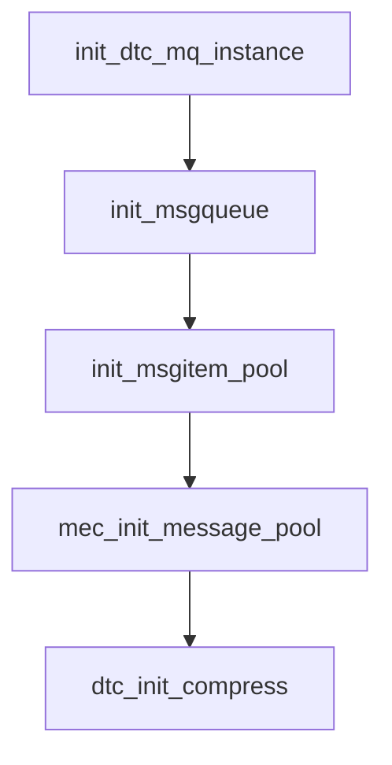
```mermaid
graph TB
init_dtc_mq_instance-->init_msgqueue-->init_msgitem_pool-->mec_init_message_pool-->dtc_init_compress
```

#### 2.5.2 运行

当上层应用主动发送消息时，消息会放到发送队列里。当agent执行pipe的recv job时，消息会放到接收队列里。

每一个队列有一个执行线程，在初次将消息放到队列里时会查看队列对应的执行线程是否启动，没有启动的话将会启动队列线程。队列线程的执行函数是dtc_task_proc。队列线程的执行和agent线程执行方式类似，也是采用对队列加锁，信号量通知的方式来实现。

在队列执行线程中，又跟队列是接收队列还是发送队列，分别交由不同的处理函数进行处理。

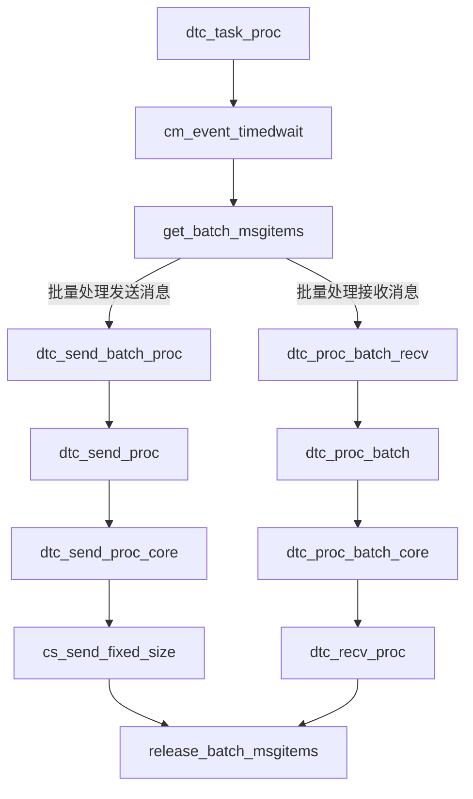
```mermaid
graph TB
dtc_task_proc-->cm_event_timedwait-->get_batch_msgitems-->|批量处理发送消息|dtc_send_batch_proc-->dtc_send_proc-->dtc_send_proc_core-->cs_send_fixed_size-->release_batch_msgitems
get_batch_msgitems-->|批量处理接收消息|dtc_proc_batch_recv-->dtc_proc_batch-->dtc_proc_batch_core-->dtc_recv_proc-->release_batch_msgitems
```

##### 2.5.1.1 接收消息入队

接收消息入队是在pipe的recv job中入队的。具体函数为mec_proc_recv_msg。

```c
mq_context_t *mq_ctx = get_recv_mq_ctx(); ///< 先找到接收队列上下文
message_pool_t *pool = &mq_ctx->msg_pool[pipe->priv]; ///< 根据pipe的优先级取出对应的消息池，后面会从消息池分配消息
```

先从priavte_pool里分配消息，

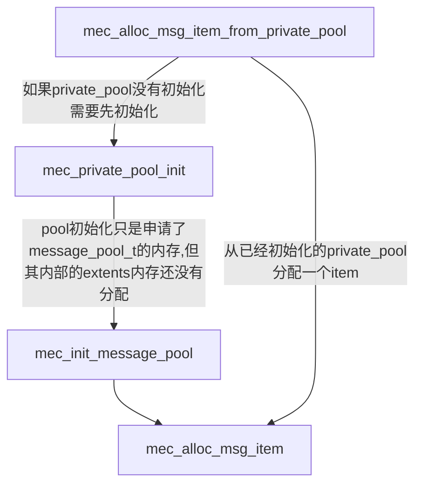
```mermaid
graph TB
mec_alloc_msg_item_from_private_pool-->|如果private_pool没有初始化需要先初始化|mec_private_pool_init-->|pool初始化只是申请了message_pool_t的内存,但其内部的extents内存还没有分配|mec_init_message_pool-->mec_alloc_msg_item
mec_alloc_msg_item_from_private_pool-->|从已经初始化的private_pool分配一个item|mec_alloc_msg_item
```

mec_alloc_msg_item逻辑比较复杂，下面是具体的流程：

```c
#define MSG_ITEM_SIZE(pool)                \
    ((pool)->msg_len + sizeof(msg_item_t)) \ ///< 每一个pool里的消息长度是相同的，分配的item是item长度加上消息长度

status_t mec_alloc_msg_item(message_pool_t *pool, msg_item_t **item)
{
    *item = NULL; ///< 这个是外部传进来的二级指针，申请的内存赋值给它
    for (;;) {
        cm_spin_lock(&pool->lock, NULL);
        if (pool->free_first != CM_INVALID_ID32) { ///< pool初始化free_first为CM_INVALID_ID32，这里表示pool初始状态
            GET_FROM_FREE_LST(pool, *item); ///< 有空闲的直接从pool的空闲列表里申请
            cm_spin_unlock(&pool->lock);
            return CM_SUCCESS;
        }
        if (pool->count < pool->capacity) { ///< pool还没有满从pool里直接申请
            ALLOC_FROM_POOL(pool, *item);
            cm_spin_unlock(&pool->lock);
            return CM_SUCCESS;
        }
        if (pool->extending) { ///< pool正在扩展需要休眠一下等待扩展完
            cm_spin_unlock(&pool->lock);
            cm_sleep(CM_SLEEP_1_FIXED);
            continue;
        }
        pool->extending = CM_TRUE; ///< 扩展开始
        cm_spin_unlock(&pool->lock);
        if (pool->capacity >= MSG_POOL_MAX_EXTENTS * pool->msg_pool_extent) { /// pool的容量已经超过了最大扩展，扩展结束，返回成功
            pool->extending = CM_FALSE;
            return CM_SUCCESS;
        }
        size_t alloc_size = MSG_ITEM_SIZE(pool) * pool->msg_pool_extent; ///< 分配扩展个数
        pool->extents[pool->ext_cnt] = malloc(alloc_size); ///< 最终分配的内存在extents数组里，
                                                           ///< 每一个extent就是item+msg数组，数组大小为pool->msg_pool_extent
        if (pool->extents[pool->ext_cnt] == NULL) { ///< 如果内存分配失败，返回失败
            pool->extending = CM_FALSE;
            CM_THROW_ERROR(ERR_ALLOC_MEMORY, alloc_size, "message items");
            return CM_ERROR;
        }
        pool->capacity += pool->msg_pool_extent; ///< pool的容量增加
        ++pool->ext_cnt;///< 扩展extent
        CM_MFENCE;
        pool->extending = CM_FALSE;///< 扩展结束
        LOG_DEBUG_INF("[MEC]alloc message item with pool extend, alloc_size:%zu ext_cnt:%u msg_pool_extent:%u "
            "capacity:%u", alloc_size, pool->ext_cnt, pool->msg_pool_extent, pool->capacity);
    }
    return CM_SUCCESS;
}
```

item分配成功后，会把pack attach到item的数据内存buff上,此时pack引用了buff。

```c
MEC_MESSAGE_ATTACH(&pack, get_mec_profile(), pipe->priv, item->buffer);
```

然后调用mec_read_message将数据读到pack里，再通过mec_process_message将pack放入队列。

```c
status_t mec_process_message(const mec_pipe_t *pipe, mec_message_t *msg) ///< msg就是上面从网络IO里读取出的pack
{
    dtc_msgqueue_t *my_queue = NULL;
    mq_context_t *mq_ctx = get_recv_mq_ctx(); ///< 获取发送队列上下文
    ///< 根据收到的消息头里的stream_id找到channel id
    uint32 channel_id = MEC_STREAM_TO_CHANNEL_ID(msg->head->stream_id, get_mec_profile()->channel_num); 
    ///< 根据channel id和来源节点id找到对应的私有队列
    my_queue = &mq_ctx->channel_private_queue[msg->head->src_inst][channel_id];
    ///< 从私有队列里分配一个dtc_msgitem_t（一个携带消息的双向链表节点）
    dtc_msgitem_t *msgitem = mec_alloc_msgitem(mq_ctx, my_queue);
    if (msgitem == NULL) {
        LOG_DEBUG_ERR("[MEC]alloc message item failed, error code %d.", cm_get_os_error());
        return CM_ERROR;
    }
    ///< dtc_msgitem_t的消息指针指向msg的buffer
    msgitem->msg = msg->buffer;
    uint32 index = 0; ///< 默认放入的队列是0
    if (pipe->priv == PRIV_LOW) { ///< 如果是低优先级，则队列索引为1
        index = 1; // avoid concurrent attacks without affecting performance.
    }
    CM_MFENCE;
    put_msgitem(&mq_ctx->queue[index], msgitem); ///< 将消息放入队列里（此时消息指针在两个地方，一个是private_queue,另一个是queue）

    if (!mq_ctx->work_thread_idx[index].is_start) {
        cm_spin_lock(&mq_ctx->work_thread_idx[index].lock, NULL);
        if (!mq_ctx->work_thread_idx[index].is_start) {
            if (cm_event_init(&mq_ctx->work_thread_idx[index].event) != CM_SUCCESS) {
                LOG_RUN_ERR("[MEC]create thread %u event failed, error code %d.", index, cm_get_os_error());
                cm_spin_unlock(&mq_ctx->work_thread_idx[index].lock);
                return CM_ERROR;
            }
            if (cm_create_thread(dtc_task_proc, 0, (void *)&mq_ctx->work_thread_idx[index],
                                 &mq_ctx->tasks[index]) != CM_SUCCESS) {
                LOG_RUN_ERR("[MEC]create work thread %u failed.", index);
                cm_spin_unlock(&mq_ctx->work_thread_idx[index].lock);
                return CM_ERROR;
            }
            mq_ctx->work_thread_idx[index].is_start = CM_TRUE;
        }
        cm_spin_unlock(&mq_ctx->work_thread_idx[index].lock);
    }
    cm_event_notify(&mq_ctx->work_thread_idx[index].event); ///< 通知队列线程有新消息到来
    return CM_SUCCESS;
}
```

##### 2.5.1.2 发送消息入队

#### 2.5.3 队列批处理

批量接收在队列线程的处理函数中，接收时需要先找到对应的队列，

```c
uint32 queue_idx = arg->index % (DTC_MSG_QUEUE_NUM + 1); ///< 队列的索引根据放入时的索引对队列个数加1取余，实际取出的还是创建队列线程时对应的队列，避免取出非法索引队列
get_batch_msgitems(queue, &batch_queue, mq_ctx->profile->batch_size);
```

批量取出的逻辑如下：

1. 首先上层可以配置批量处理的消息数量；
2. 然后会比较批处理数量和队列消息数量的大小，若队列消息数量较多，则取出批处理数量的消息，若队列消息数量不足，则将队列消息全部取出；
3. 队列采用双向链表实现，并且记录下了队列的头尾指针，批量出队主要就是更新头尾指针，以及头尾指针的双向指针；
4. 最终出队的数据也是一个队列；

```c
/// @brief 批量消息出队
/// @param queue 消息队列
/// @param batch 消息出队存放地址
/// @param batch_size 出队消息数量
void get_batch_msgitems(dtc_msgqueue_t *queue, dtc_msgqueue_t *batch, uint32 batch_size)
{
    if (queue->count == 0) {
        return;
    }

    cm_spin_lock(&queue->lock, NULL); // 访问前先加锁
    if (queue->count == 0) {
        cm_spin_unlock(&queue->lock);
        return;
    }
    uint32 size = MIN(batch_size, queue->count); // 取出队数和队列实际数量的小值出队
    batch->first = queue->first; // 将队头指针赋给bacth的队头
    for (uint32 loop = 0; loop < size - 1; loop++) {
        CM_ASSERT(queue->first->msg != NULL);
        queue->first = queue->first->next;
    } // 将队头指针往后移size个位置

    batch->last = queue->first; // 此时队头指针已经达到要出队的位置，将队头赋值给batch的队尾
    queue->first = queue->first->next; // 再讲队头往后移一个位置，因为之前的队头要出队
    if (queue->first != NULL) {  // 若队头不为null，此时队头前应该没有数据，设置队头的prev为null
        queue->first->prev = NULL;
    }
    batch->last->next = NULL; // batch所有数据已取出，此时队尾后面应该没有数据，设置队尾的next为null
    batch->count = size; // batch的大小为size

    queue->count -= size; // 更新原队列大小
    if (queue->count == 0) { // 若队列为空，重置队头队尾
        queue->last = NULL;
        queue->first = NULL;
    }

    cm_spin_unlock(&queue->lock);
    return;
}
```

批量取出的消息只是队列的指针，并没有解析具体的消息。具体处理函数为dtc_proc_batch_recv，

```c
    dtc_msgitem_t *msg_item = batch_queue->first; ///< 从链表头节点开始进行处理
    mec_message_head_t *head = NULL;
    while (msg_item != NULL) { ///< 循环处理每一个节点
        head = (mec_message_head_t *)msg_item->msg; ///< 将数据指针转换为消息指针
        if (dtc_proc_batch(arg, head) != CM_SUCCESS) {
            return;
        }
        mec_release_message_buf(msg_item->msg); ///< 每处理完一个链表节点，都将其buf释放掉
        msg_item->msg = NULL;
        msg_item = msg_item->next;
    }
```

mec_message_head_t消息头中携带了批量数据的个数，先查看消息是否是多条。

```c
    int32 batch_size = head->batch_size; ///< 取出消息总条数
    uint32 remain_size = (uint32)(head->size - sizeof(mec_message_head_t)); ///< 剩余消息条数
    CM_ASSERT(batch_size > 1); ///< 批处理消息至少2条

    msg_priv_t head_priv = CS_PRIV_LOW(head->flags) ? PRIV_LOW : PRIV_HIGH; ///< 消息的优先级
    mec_message_head_t *temp_head = head + 1; ///< 下一条消息
    while (batch_size > 0) { ///< 遍历消息直到消息处理完
        CM_ASSERT(!CS_COMPRESS(temp_head->flags));
        msg_priv_t cur_priv = CS_PRIV_LOW(temp_head->flags) ? PRIV_LOW : PRIV_HIGH; ///< 获取当前消息的优先级
        if (cur_priv != head_priv || remain_size < temp_head->size ///< 剩余消息大小应大于当前节点消息大小
            || remain_size < (uint32)sizeof(mec_message_head_t)) { ///< 当前消息的优先级应该与头节点相同
            ///< 剩余消息应大于mec_message_head_t长度
            LOG_DEBUG_ERR("[MEC]batchc err: cur_priv %u, head_priv %u, cur_size %u, remain_size %u, src %u",
                cur_priv, head_priv, temp_head->size, remain_size, head->src_inst);
            return CM_ERROR;
        }
        dtc_recv_proc(mec_ctx, fragment_ctx, temp_head);
        temp_head = (mec_message_head_t *)((char *)temp_head + temp_head->size); ///< 移动指针
        batch_size--;
        remain_size -= temp_head->size;
    }
```

每次处理消息需要根据控制消息查看是否需要合并包，

```c
    mec_message_t pack;
    ///< 检查来源节点和流是否存在
    if (md_check_stream_node_exist(head->stream_id, head->src_inst) != CM_SUCCESS) {
        LOG_DEBUG_ERR("[MEC]eachhead: invalid stream_id %u or src_inst %u", head->stream_id, head->src_inst);
        return;
    }
    ///< 检查消息是否发往本节点
    if (SECUREC_UNLIKELY(head->dst_inst != md_get_cur_node())) {
        LOG_DEBUG_ERR("[MEC]eachhead: dst_inst %u is not me.", head->dst_inst);
        return;
    }
    ///< 检查消息cmd是否合法
    if (SECUREC_UNLIKELY(head->cmd >= MEC_CMD_CEIL)) {
        LOG_DEBUG_ERR("[MEC]invalid mec command %u", head->cmd);
        return;
    }
    ///< 获取对应cmd的process函数进行处理
    msg_proc_t proc = mec_ctx->cb_processer[head->cmd].proc;
    if (SECUREC_UNLIKELY(proc == NULL)) {
        LOG_DEBUG_ERR("[MEC]no message handling function is registered for message type %u", head->cmd);
        return;
    }
    head->time2 = g_timer()->now;
    g_mec_perf_stat.recv_count++;
    g_mec_perf_stat.recv_delay += head->time2 - head->time1;
    stat_record(RECV_DELAY, head->time2 - head->time1);
    ///< 根据消息头的控制位区分是否还有更多消息
    if (CS_MORE_DATA(head->flags)) {
        dtc_proc_more_data(fragment_ctx, head); ///< 处理分片
    } else if (CS_END_DATA(head->flags)) { ///< 处理最后一个包
        dtc_proc_end_data(mec_ctx, proc, fragment_ctx, head); ///< 分片结束，合包
    } else {
        MEC_MESSAGE_ATTACH2(&pack, (char *)head);
        mec_init_get(&pack);
        ///< 处理消息
        if (proc(&pack) != CM_SUCCESS) {
            int32 code = 0;
            const char *message = NULL;
            cm_get_error(&code, &message);
            LOG_DEBUG_WAR("[MEC]proc message failed,src[%d],dst[%d],cmd[%u],stream id[%u],err code %d, err msg %s",
                head->src_inst, head->dst_inst, head->cmd, head->stream_id, code, code == 0 ? "N/A" : message);
        }
    }
```

处理分片时，分片使用hash来保存，使用节点id，流id和序列号来计算hash。

```c
    fragment_key_t key;
    FILL_FRAGMENT_KEY(head, key); ///< 初始化key
    uint32 hash_key = cm_hash_bytes((const uint8 *)&key, sizeof(fragment_key_t), FRAGMENT_BUCKETS); ///< 计算hash值
    fragment_bucket_t *bucket = &fragment_ctx->buckets[hash_key];
    fragment_ctrl_t *ctrl = NULL;
    uint32 del_sn;

    ctrl = find_fragment_ctrl(bucket, &key);
    if (head->frag_no == 0) { ///< 如果是第一个报文直接插入分片里
        if (insert_fragment_pack(head, bucket) != CM_SUCCESS) {
            LOG_DEBUG_WAR("[MEC]first_frag insert fail. src inst[%d], frag_no[%u], serial no[%u], batch size[%u], "
                          "err code %d, err msg %s",
                          head->src_inst, head->frag_no, head->serial_no, head->batch_size,
                          cm_get_error_code(), cm_get_errormsg(cm_get_error_code()));
            return;
        }
    } else { ///< 不是第一个报文则需要进行合包
        if (concat_fragment_pack(ctrl, head) != CM_SUCCESS) {
            LOG_DEBUG_WAR("[MEC]non_first_frag concat fail. src inst[%d], frag_no[%u], serial no[%u], batch size[%u], "
                          "err code %d, err msg %s",
                          head->src_inst, head->frag_no, head->serial_no, head->batch_size,
                          cm_get_error_code(), cm_get_errormsg(cm_get_error_code()));
            goto error;
        }
        cm_spin_unlock(&ctrl->lock);
    }
```

### 2.6 reactor

mec总共有两个reactor，一个是高优先级，一个是低优先级。与之相对应，agent也有两个，高优先级和低优先级。

每一个reactor是一个线程，负责监听channel的pipe是否有事件到来。可以通过MEC_REACTOR_THREAD_NUM来配置reactor线程个数。

reactor线程与agent线程不同，reactor线程是一开始就全部创建好了，不会按需创建，reactor线程也不是线程池的模式，每个reactor线程就是明确做一件事，监听socket是否有事件就绪并交给agent去处理。

每一个channel有两个pipe，一个高优先级，一个低优先级。

```c
/// @brief 
typedef struct st_reactor {
    uint32 id;
    thread_t thread; ///< reactor 线程id
    int epollfd;     ///< epoll id
    atomic32_t channel_count; ///< 通道数
    uint32 avg_oagents;
    reactor_status_t status; ///< 状态
    agent_pool_t  *agent_pool; ///< 代理池
} reactor_t;
```

reactor初始化时，创建一个reactor就是创建一个线程，每一个线程执行的是一个循环，用epoll_wait监听是否有socket准备就绪。

```c
    while (!thread->closed) {
        reactor_handle_events(reactor); 
        if (reactor->status == REACTOR_STATUS_PAUSING) {
            reactor->status = REACTOR_STATUS_PAUSED;
        }
    }

    nfds = epoll_wait(reactor->epollfd, events, EV_WAIT_NUM, EV_WAIT_TIMEOUT);
    if (nfds == -1) {
        if (errno != EINTR) {
            LOG_RUN_ERR("[MEC]Failed to wait for connection request, OS error:%d", cm_get_os_error());
        }
        return;
    }
    if (nfds == 0) {
        return;
    }

    for (loop = 0; loop < nfds; ++loop) {
        /*处理就绪的socket */
    }
```

每就绪一个socket，这里其实就是pipe，就会将其放到一个agent里去执行。

#### 2.6.1 添加pipe

acceptor每接收到一个客户端的连接，就会创建一个pipe，并将这个pipe添加到一个reactor的监听列表里。

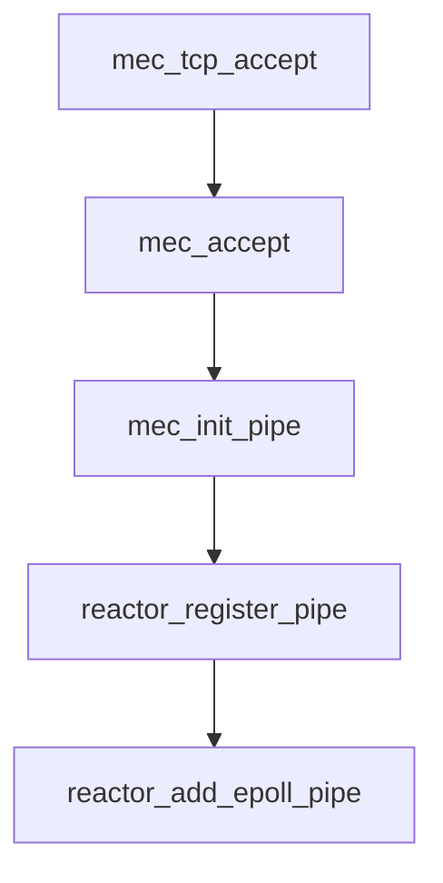
```mermaid
graph TB
mec_tcp_accept-->mec_accept-->mec_init_pipe-->reactor_register_pipe-->reactor_add_epoll_pipe
```

#### 2.6.2 执行pipe

reactor线程会监听添加进来的pipe，并把有事件到来的取出附着到agent中运行。附着到agent后，reactor会调用cm_event_notify向agent发送信号量，激活一个agent线程来处理pipe的job。

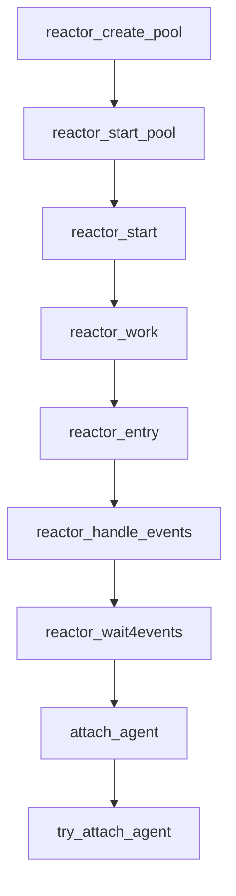
```mermaid
graph TB
reactor_create_pool-->reactor_start_pool-->reactor_start-->reactor_work-->reactor_entry-->reactor_handle_events-->reactor_wait4events-->attach_agent-->try_attach_agent
```

## 3. protocol

协议层主要包含tcp和ssl的相关收发包实现以及服务端监听实现。

实际收发包函数

```c
typedef struct st_vio {
    recv_func_t vio_recv;
    send_func_t vio_send;
    wait_func_t vio_wait;
    recv_timed_func_t vio_recv_timed;
    send_timed_func_t vio_send_timed;
} vio_t;


static const vio_t g_vio_list[] = {
    { NULL, NULL, NULL, NULL, NULL },

    // TCP io functions
    { (recv_func_t)cs_tcp_recv, (send_func_t)cs_tcp_send, (wait_func_t)cs_tcp_wait,
      (recv_timed_func_t)cs_tcp_recv_timed, (send_timed_func_t)cs_tcp_send_timed },

    // SSL io functions
    { (recv_func_t)cs_ssl_recv, (send_func_t)cs_ssl_send, (wait_func_t)cs_ssl_wait,
      (recv_timed_func_t)cs_ssl_recv_timed, (send_timed_func_t)cs_ssl_send_timed },
};
```

### 3.1 listener

listener主要负责监听socket并accept，accept包括系统调用accept(即tcp三次握手)，又包含应用层accept（pipe连接）。

#### 3.1.1 系统调用accept

mec采用reactor模式实现，listener主要是实现acceptor的功能，负责监听socket，并接受客户端的连接。接受连接后创建pipe，并将其添加到reactor中，由reactor负责后续的读写事件监听。listener实际上也是一个epoll_wait的循环，但其只提供监听接受连接的功能，即accept系统调用。

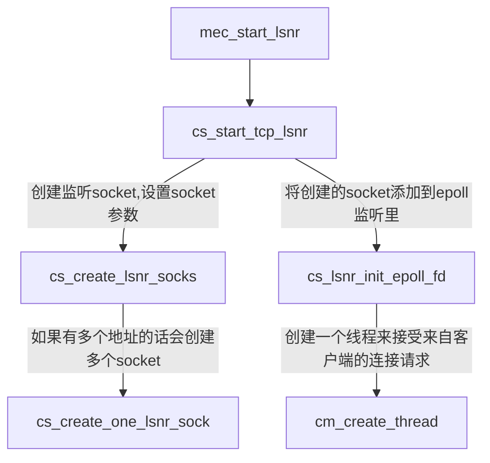
```mermaid
graph TB
mec_start_lsnr-->cs_start_tcp_lsnr-->|创建监听socket,设置socket参数|cs_create_lsnr_socks-->|如果有多个地址的话会创建多个socket|cs_create_one_lsnr_sock
cs_start_tcp_lsnr-->|将创建的socket添加到epoll监听里|cs_lsnr_init_epoll_fd-->|创建一个线程来接受来自客户端的连接请求|cm_create_thread
```

创建完socket后会启动一个线程来处理客户端的连接请求，处理函数为srv_tcp_lsnr_proc。该函数是一个epoll_wait的循环，会监听对应的socket事件并进行处理。

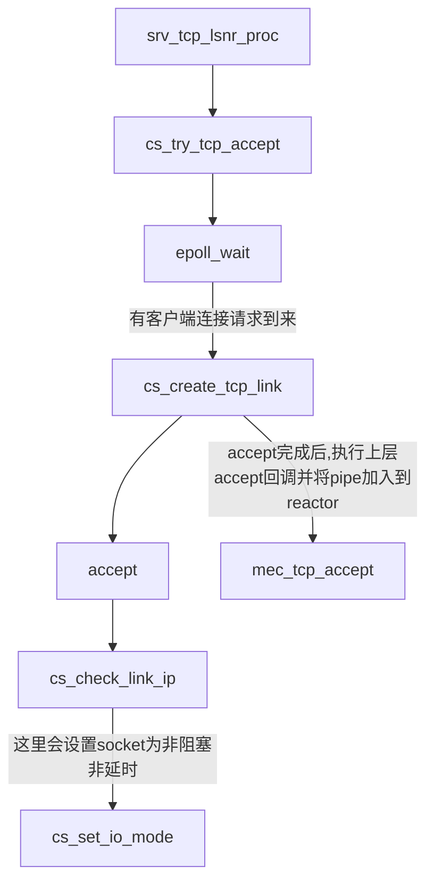
```mermaid
graph TB
srv_tcp_lsnr_proc-->cs_try_tcp_accept-->epoll_wait-->|有客户端连接请求到来|cs_create_tcp_link-->accept-->cs_check_link_ip-->|这里会设置socket为非阻塞非延时|cs_set_io_mode
cs_create_tcp_link-->|accept完成后,执行上层accept回调并将pipe加入到reactor|mec_tcp_accept
```

创建监听后，accept完成后会将mec_tcp_accept保存在tcp_lsnr_t的action里，会在创建pipe时调用。在acceptor的执行线程里完成accept后，会执行action并将pipe放入reactor中。

#### 3.1.2 应用层accept

tcp连接建立后，客户端（主动建连接的一方）会立即发送proto_code，acceptor需要校验协议码是否正确，确认协议码后需要发送link_ready_ack_t回复对端连接准备就绪。

客户端收到link_ready_ack_t后，接着会发送mec_message_head_t，发送连接请求。

acceptor端收到mec_message_head_t，会校验连接消息。

需要注意的是此时的消息收发处理还没有转交到reactor处理。

mec_message_head_t消息里会携带src_inst和stream_id，分别表示来源实例id和流id，对应到本端其实就是节点id和channel id，根据这两个参数就可以唯一确定一个channel。

并跟据mec_message_head_t消息里的flags确定是高优先级pipe还是低优先级，然后找到pipe，最终需要把pipe交给reactor去处理。

```c
channel = &mec_ctx->channels[head.src_inst][head.stream_id]; ///< 找到一个channel
msg_priv_t priv = CS_PRIV_LOW(head.flags) ? PRIV_LOW : PRIV_HIGH; ///< 根据flags确定是高优先级pipe还是低优先级
mec_pipe_t *mec_pipe = &channel->pipe[priv]; ///< 找到pipe
```

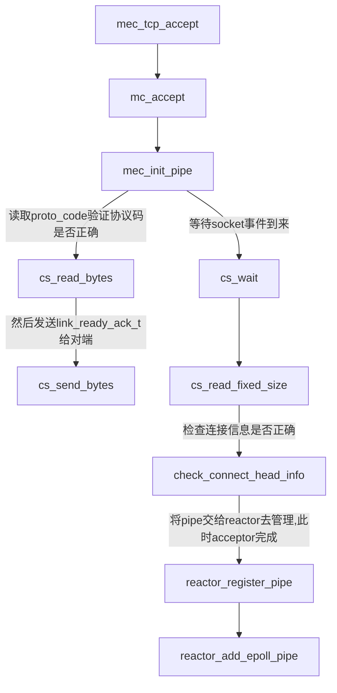
```mermaid
graph TB
mec_tcp_accept-->mc_accept-->mec_init_pipe-->|读取proto_code验证协议码是否正确|cs_read_bytes-->|然后发送link_ready_ack_t给对端|cs_send_bytes
mec_init_pipe-->|等待socket事件到来|cs_wait-->cs_read_fixed_size-->|检查连接信息是否正确|check_connect_head_info-->|将pipe交给reactor去管理,此时acceptor完成|reactor_register_pipe-->reactor_add_epoll_pipe
```

### 3.2 packet

packet主要是实现了大小端转换。

### 3.3 ssl

ssl主要是使用openssl加密tcp通信数据。

### 3.4 pipe

集群节点之间实际是通过channel通信，而channel又是通过pipe来通信，这里的pipe指的是mec_pipe_t。在集群中两个节点之间实际是有两条通信链路的，每个节点都是既作为客户端，也作为服务端。

pipe是channel具体的通信单元，也是通信的最小模块，实际各个实例（节点）之间就是通过pipe来通信。pipe的job（行为）主要分为两类，SEND_MODE和RECV_MODE。

pipe在其内部又划分为两类，send_pipe和recv_pipe，send_pipe用于客户端，用于主动连接，recv_pipe用于服务端，用于接受客户端的请求。

```c
/// @brief mec管道
typedef struct st_mec_pipe {
    thread_lock_t send_lock; ///< 发送锁
    thread_lock_t recv_lock; ///< 接收锁
    thread_lock_t recv_epoll_lock;
    struct {
        volatile uint16 is_reg : 1; ///< 是否注册
        volatile uint16 recv_pipe_active : 1; ///< 接收pipe是否激活
        volatile uint16 send_pipe_active : 1; ///< 发送pipe是否激活
        uint16 priv : 1;
        volatile uint16 try_connet_count : 12;
    };
    cs_pipe_t          send_pipe; ///< 发送连接通道
    cs_pipe_t          recv_pipe; ///< 接收连接通道
    atomic32_t         send_need_close;
    atomic32_t         recv_need_close;
    struct st_reactor *reactor;
    struct st_mec_channel *channel;
    attach_info_t      attach[MODE_END]; ///< pipe的job（send、recv），agent线程的执行函数信息
} mec_pipe_t;
```

#### 3.4.1 pipe的连接

##### 3.4.1.1 客户端

pipe是建立在tcp上层的应用协议，在tcp建立成功后，还需要建立pipe的连接，最终是在pipe的发送job函数mec_proc_send_pipe中完成。

pipe的send_pipe连接大致分为三步：

1. 首先建立tcp连接，tcp connect成功后，发送protocol code；
   
   协议码是一个魔数，主要是为了与其他通信协议做区分，防止网络数据的干扰。

2. 对端收到协议码后会回复link_ready_ack，等待对端回复link_ready_ack，对端的响应了会包含大小端、版本号；

3. 收到对端回复link_ready_ack后确认双方tcp链路正常后，需要发送pipe的connect信息，发送mec_message_head_t，主要是发送本地channel信息；发送完pipe的connect请求后，本端的send_pipe激活就完成了。
   
   ```c
   #define FILL_CONNECT_HEAD(head, profile, channel, pipe)                     \
       do {                                                                    \
           (head).cmd = MEC_CMD_CONNECT;                                       \ ///< 命令类型
           (head).src_inst = (profile)->inst_id;                               \ ///< 实例（节点）id
           (head).stream_id = MEC_CHANNEL_ID((channel)->id);                   \ ///< channel id
           (head).size = sizeof(mec_message_head_t);                           \ ///< 消息长度
           (head).flags = ((pipe)->priv == PRIV_HIGH ? 0 : CS_FLAG_PRIV_LOW);  \ ///< pipe类型
           (head).serial_no = cm_atomic32_inc(&(channel)->serial_no);          \ ///< channel序列号
           if (CS_DIFFERENT_ENDIAN((pipe)->send_pipe.options)) {               \ ///< 大小端转换
               (head).src_inst = cs_reverse_uint32((head).src_inst);           \
               (head).stream_id = cs_reverse_uint32((head).stream_id);         \
               (head).size = cs_reverse_uint32((head).size);                   \
               (head).serial_no = cs_reverse_uint32((head).serial_no);         \
           }                                                                   \
       } while (0)
   ```

在mec初始化时，主线程会连接所有的channel，也就是会连接pipe。此时会将所有pipe都attach到agent上，并将pipe类型设置为SEND_MODE，attach成功后调用cm_event_notify通知agent执行pipe的job。此时会执行mec_proc_send_pipe。

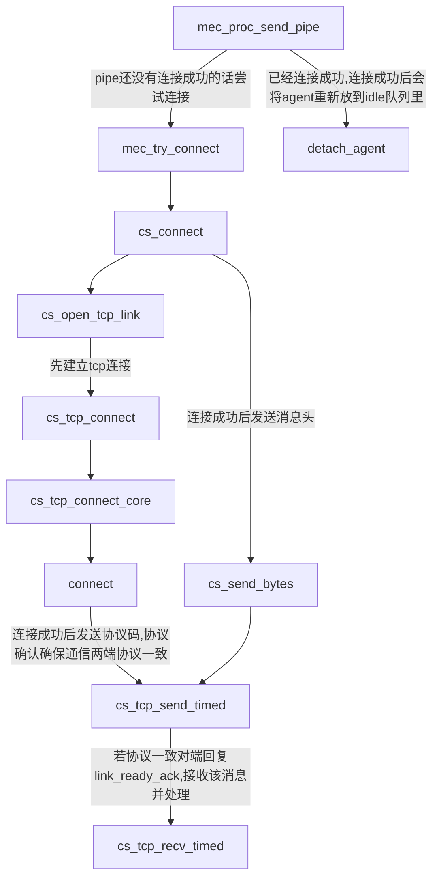
```mermaid
graph TB
mec_proc_send_pipe-->|pipe还没有连接成功的话尝试连接|mec_try_connect-->cs_connect-->cs_open_tcp_link-->|先建立tcp连接|cs_tcp_connect-->cs_tcp_connect_core-->connect-->|连接成功后发送协议码,协议确认确保通信两端协议一致|cs_tcp_send_timed-->|若协议一致对端回复link_ready_ack,接收该消息并处理|cs_tcp_recv_timed
cs_connect-->|连接成功后发送消息头|cs_send_bytes-->cs_tcp_send_timed
mec_proc_send_pipe-->|已经连接成功,连接成功后会将agent重新放到idle队列里|detach_agent
```

##### 3.4.1.2 服务端

服务端的连接请参考listener。

#### 3.4.2 pipe的执行

在socket层面来说，pipe共有两个socket，一个用于发送，一个用于接收。每两个节点之间建立pipe时，都需要建立两个socket。比如节点1和节点2，对于节点1来说，节点1会主动连接节点2，建立socket1，用于发送。同时节点2也会主动连接节点1，建立socket2，用于接收。即在pipe层面建立的socket的数据收发都是单向的，一个socket仅用于发，另外一个socket仅用于收。

每一个pipe都会有两个job，一个发送job，一个接收job，这讲个job对应socket的收发行为。对于发送job来说，其socket连接是主动建立的，且socket只用于发送，发送也是主动建立的，因而不需要监听，即不需要将发送socket加入到reactor里，只需要每次发送前检查链路是否连接，未连接的话需要建立连接。

而对于接收job来说，在acceptor建立tcp连接后，就需要把创建的socket添加到reactor里，由reactor负责监听，但有事件到来后（收包），将pipe附着到agent上运行，此时执行的就是pipe的接收job。

##### 3.4.2.1 发送

对于发送来说，主要就是进行send_pipe的连接。连接请查看3.4.1pipe的连接。

##### 3.4.2.2 接收

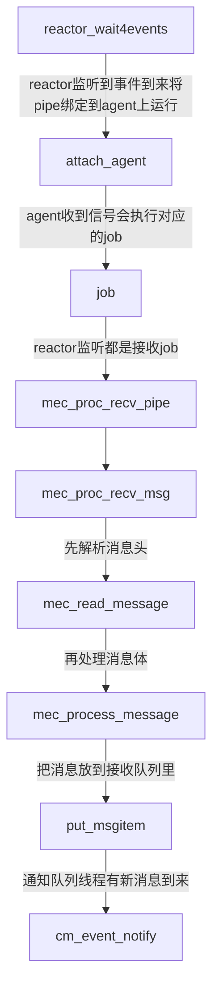
```mermaid
graph TB
reactor_wait4events-->|reactor监听到事件到来将pipe绑定到agent上运行|attach_agent-->|agent收到信号会执行对应的job|job-->|reactor监听都是接收job|mec_proc_recv_pipe-->mec_proc_recv_msg-->|先解析消息头|mec_read_message-->|再处理消息体|mec_process_message-->|把消息放到接收队列里|put_msgitem-->|通知队列线程有新消息到来|cm_event_notify
```

pipe的接收job并不负责实际消息的处理，而是将消息放到消息队列里面，由队列线程进行处理。

### 3.5 tcp

tcp模块实现了tcp的收发包，创建socket，配置socket等功能。最终的收发包出入口都在本模块里。

## 4. 数据收发

在整个mec模块中，数据收发都是通过队列来进行的，发送时会将数据发送到队列里，等累积一定消息后批量进行发送；接收消息时，接收到的消息也是先放入消息队列中。

### 4.1 消息

```c
/// @brief 消息交换头部
typedef struct st_mec_message_head {
    uint8      cmd;       ///< 消息请求类型
    uint8      flags;     ///< 状态标志
    uint16     batch_size; ///< 批量消息条数
    uint32     src_inst;  ///< 来源id（源节点id）
    uint32     dst_inst;  ///< 目的节点id
    uint32     stream_id;   ///< 流id（channel id）
    uint32     size;     ///< 消息长度
    uint32     serial_no; ///< channel序列号
    uint32     frag_no;   ///< 分片序列号
    uint32     version;   ///< 协议版本
    uint64     time1;
    uint64     time2;
    uint64     time3;
} mec_message_head_t;
```

flags的bit位用于存放消息的控制信息，

```c
#define CS_FLAG_NONE                 0x0000  ///< 没有控制信息
#define CS_FLAG_MORE_DATA            0x0001  ///< 需要接收更多消息
#define CS_FLAG_END_DATA             0x0002  ///< 最后一条消息
#define CS_FLAG_PEER_CLOSED          0x0004  ///< 对端关闭
#define CS_FLAG_COMPRESS             0x0008  ///< 压缩标志
#define CS_FLAG_PRIV_LOW             0x0010  ///< 低优先级消息
#define CS_FLAG_BATCH                0x0020  ///< 批量发送消息
```

消息也有自己的消息池，消息池又分为private pool和msg_pool。

### 4.2 数据发送

数据发送就是把数据放入对应channel的发送队列中，等待队列线程进行批量发送。

放入私有队列

```c
 my_queue = &mq_ctx->channel_private_queue[head->dst_inst][channel_id]; ///< 根据目的节点id和channel id找到队列
```

放入queue，如果是低优先级根据目的实例id和channel id来计算hash；如果是高优先级放在第一个队列里。

```c
    uint32 index = 0;
    if (CS_PRIV_LOW(head->flags)) {
        index = cm_hash_uint32((head->dst_inst & 0xFFFFFF) | (channel_id << 24), DTC_MSG_QUEUE_NUM) + 1;
    }
```

每一个队列对应一个消息处理线程，若队列线程没有启动的话还需要启动队列线程。

将消息放入队列后，需要发送信号通知队列线程有新任务到来。

```mermaid
graph TB
mec_send_data-->mec_put_msg_queue-->mec_alloc_msgitem-->alloc_msgitems-->put_msgitem-->cm_event_notify
put_msgitem-->cm_event_init-->cm_create_thread-->dtc_task_proc
mec_send_data-->|如果channel没有连接需要先连接|mec_scale_out-->mec_connect_channel
```

### 4.3 数据接收

数据接收请参考3.4.2pipe的执行。数据接收处理实际是在pipe的接收job中执行的，具体的执行函数是mec_proc_recv_pipe。

消息处理流程大致如下：

```mermaid
graph TB
mec_proc_recv_msg-->|先读出一条消息|mec_read_message-->|再将消息放入队列|mec_process_message
```

1. 先读取消息头，获取消息体长度；
2. 再根据消息体长度读取消息体；
3. 将消息放入队列；

将消息放入队列时，需要先找到队列的索引。

```c
    mq_context_t *mq_ctx = get_recv_mq_ctx(); ///< 获取了发送队列上下文
    uint32 index = 0; ///< 默认放入的是索引为0的队列
    if (pipe->priv == PRIV_LOW) { ///< 如果队列是低优先级，默认放入的是索引为1的队列
        index = 1; // avoid concurrent attacks without affecting performance.
    }
    CM_MFENCE;
    put_msgitem(&mq_ctx->queue[index], msgitem); ///< 放入队列
```

消息放入队列后，就由队列线程来处理。

## 5. FAQ

### 5.1 代码层面如何区分channel中高低优先级？

从一开始，mec初始化完成后，就已经创建好了高优先级的reactor、agent以及低优先级的reactor、agent，对于每一个channel，也都创建好了高优先级的pipe和低优先级的pipe。也就是说通道从一开始就建立好了，看上层的消息期望使用哪个通道来发送消息。

#### 5.4.1 消息的优先级

channel的优先级与消息的优先级有关，消息的优先级在注册消息处理函数时候就确定了。

```c
/// @brief 注册消息处理函数,将消息注册到mec上下文的回调里，当收到相关请求类型的数据时，会调用proc函数进行处理
/// @param cmd 处理函数对应的消息类型
/// @param proc 消息类型对应的处理函数
/// @param priv 消息的优先级(高优先级或者低优先级)
void register_msg_process(mec_command_t cmd, msg_proc_t proc, msg_priv_t priv)
{
    mec_context_t *mec_ctx = get_mec_ctx();
    if (cmd >= MEC_CMD_CEIL) {
        return;
    }
    mec_ctx->cb_processer[cmd].priv = priv;
    mec_ctx->cb_processer[cmd].proc = proc;
}
```

<font color="red">高优先级的消息和低优先级的消息差别在分配包填充控制信息时，高优先级的消息是不进行压缩传输的，而低优先级的消息若设置了压缩则会压缩进行传输。</font>

```c
    msg_priv_t priv = mec_ctx->cb_processer[cmd].priv; ///< 获取cmd类型消息的优先级
    if (get_mec_profile()->algorithm != COMPRESS_NONE && priv) { 
        head->flags |= CS_FLAG_COMPRESS; ///< 低优先级消息配置压缩算法后需要设置压缩标志
    }
```

<font color="red">根据消息优先级的不同，其放入队列的位置也不同。高优先级消息放入索引为0的队列，低优先级消息放入索引非0的其他队列。</font>

```c
    uint32 index = 0;
    if (CS_PRIV_LOW(head->flags)) {
        index = cm_hash_uint32((head->dst_inst & 0xFFFFFF) | (channel_id << 24), DTC_MSG_QUEUE_NUM) + 1;
    }
    put_msgitem(&mq_ctx->queue[index], msgitem); 
```

<font color="red">DTC_MSG_QUEUE_NUM的值是16，也就是说，高优先级队列只有一个，就是第一个，低优先级队列有15个。这样的话，高优先级消息就不会和低优先级消息竞争。</font>

根据消息优先级的不同，消息的buf大小也不一样。

```c
uint32 buf_size = (priv == PRIV_LOW) ? MEC_ACTL_MSG_BUFFER_SIZE(get_mec_profile()) : MEC_PRIV_MESSAGE_BUFFER_SIZE;
```

#### 5.1.1 接收

<font color="red">接收时消息携带的消息头中包含的stream_id和src_inst可以确定一个channel，消息头中flags包含了消息是高优先级还是低优先级。</font>

```c
channel = &mec_ctx->channels[head.src_inst][head.stream_id];
msg_priv_t priv = CS_PRIV_LOW(head.flags) ? PRIV_LOW : PRIV_HIGH;
mec_pipe_t *mec_pipe = &channel->pipe[priv];
```

根据消息的优先级，会将pipe放到不同等级的reactor里。

```c
    if (reactor_register_pipe(mec_pipe, get_mec_reactor(priv)) != CM_SUCCESS) {
        LOG_RUN_ERR("[MEC]register channel %u priv %u to reactor failed.", channel->id, priv);
        return CM_ERROR;
    }
```

#### 5.1.2 发送

<font color="red">发送时消息携带的消息头中包含的stream_id和dst_inst可以确定一个channel，消息头中flags包含了消息是高优先级还是低优先级。</font>

在发送时，首先根据stream_id和dst_inst确定channel，确定方式为stream_id对channel个数取余数。

```c
#define MEC_STREAM_TO_CHANNEL_ID(stream_id, channel_num) (uint8)((stream_id) % (channel_num))
uint32 channel_id = MEC_STREAM_TO_CHANNEL_ID(head->stream_id, profile->channel_num);
mec_channel_t *channel = &mec_ctx->channels[head->dst_inst][channel_id];///< 取出channel
```

确定channel后，根据应用设定的包的优先级选取对应的pipe，判断对应的pipe是否已经连接激活，未连接激活直接返回错误，本次发送失败。

```c
        msg_priv_t priv = CS_PRIV_LOW(head->flags) ? PRIV_LOW : PRIV_HIGH;
        if (!channel->pipe[priv].send_pipe_active) {
            LOG_DEBUG_ERR("[MEC]data send_pipe to dst_inst[%u] priv[%u] is not ready.", head->dst_inst, priv);
            return CM_ERROR;
        }
```

### 5.2 五大组件的关系图？

### 5.3 收发pipe是否都需要激活

收发pipe必须要激活才能进行正常接收发送数据。

若只激活send pipe则只可以发送数据，不可以接收数据。

若只激活recv pipe则只可以接收数据，不可以发送数据。

### 5.4 网络超时时间如何设置

超时时间参数如下，在初始化channel的时候初始化，

```c
        pipe->send_pipe.connect_timeout = profile->connect_timeout; ///< 发送pipe连接超时时间
        pipe->send_pipe.socket_timeout = profile->socket_timeout;   ///< 发送pipe socket接收发送超时时间
        pipe->recv_pipe.connect_timeout = profile->connect_timeout; ///< 接收pipe连接超时时间
        pipe->recv_pipe.socket_timeout = profile->socket_timeout; ///< 接收pipe socket接收发送超时时间
        pipe->send_pipe.l_onoff = 1; ///< 0=off, 1=on(开关)
        pipe->send_pipe.l_linger = 1; ///< 延时时间
```

> 在默认情况下,当调用close关闭socke的使用，close会立即返回。但是，如果send buffer中还有数据，系统会试着先把send buffer中的数据发送出去，然后close才返回。SO_LINGER选项则是用来修改这种默认操作的。
> 
> 1. 当l_onoff被设置为0的时候
>    
>    将会关闭SO_LINGER选项，即TCP或则SCTP保持默认操作：close立即返回，底层会将未发送完的数据发送完成后再释放资源，也就是优雅的退出。
> 
> 2. l_onoff值非0，l_linger = 0
>    当调用close的时候，TCP连接会立即断开。send buffer中未被发送的数据将被丢弃，并向对方发送一个RST信息。值得注意的是，由于这种方式，是非正常的4中握手方式结束TCP链接，所以，TCP连接将不会进入TIME_WAIT状态。这样就可以解决过多的的TIME_WAIT导致资源不足的问题，但是这样会导致新建立的可能和就连接的数据造成混乱。
> 
> 3. 设置 l_onoff 为非0，l_linger为非0
>    
>    当套接口关闭时内核将拖延一段时间（由l_linger决定）。如果套接口缓冲区中仍残留数据，进程将处于睡眠状态，直 到（a）所有数据发送完且被对方确认，之后进行正常的终止序列（描述字访问计数为0）或（b）延迟时间到。此种情况下，应用程序检查close的返回值是非常重要的，如果在数据发送完并被确认前时间到，close将返回EWOULDBLOCK错误且套接口发送缓冲区中的任何数据都丢失。close的成功返回仅告诉我们发送的数据（和FIN）已由对方TCP确认，它并不能告诉我们对方应用进程是否已读了数据。如果套接口设为非阻塞的，它将不等待close完成。

#### 5.4.1 客户端（主动发起连接）

1. 设置接收发送缓冲区
   
   ```c
   /// 默认接收发送缓冲区均未64M
   (void)setsockopt(sock, SOL_SOCKET, SO_SNDBUF, (char *)&send_size, sizeof(uint32));
   (void)setsockopt(sock, SOL_SOCKET, SO_RCVBUF, (char *)&recv_size, sizeof(uint32));
   ```

2. 设置连接超时时间
   
   ```c
   ///< 超时时间为 profile->connect_timeout
   (void)setsockopt(sock, SOL_SOCKET, SO_SNDTIMEO, (char *)&tv, sizeof(tv));
   (void)setsockopt(sock, SOL_SOCKET, SO_RCVTIMEO, (char *)&tv, sizeof(tv));
   ```
   
   设置号超时时间后，会尝试connect，若connect失败了，则会会计算一个超时结束时间用poll（linux）或select（windows）重新尝试连接。
   
   ```c
      ret = connect(link->sock, SOCKADDR(&link->remote), link->remote.salen);
      if (ret < 0) { // 若connect失败，则会计算一个超时结束时间用poll或select重新尝试连接
          if (sock_attr->connect_timeout < 0) {
              end_time = -1;
          } else {
              end_time = cm_current_time() + sock_attr->connect_timeout / (int32)MILLISECS_PER_SECOND;
          }
          error_no = cm_get_os_error();
          if (cs_tcp_connect_wait(link, error_no, end_time) == CM_SUCCESS) {
              ret = 0;
          }
      }
   ```
   
   使用poll或者select设置超时时间来进行连接。
   
   ```c
   #ifndef WIN32
      return poll(fds, nfds, timeout); ///< timeout时间内还没有事件发生将返回
   #else
      fd_set wfds;
      fd_set rfds;
      fd_set efds;
      struct pollfd *pfds = fds;
      struct timeval tv, *tvptr = NULL;
   
      FD_ZERO(&rfds);
      FD_ZERO(&wfds);
      FD_ZERO(&efds);
      if (timeout >= 0) {
          tv.tv_sec = timeout / CM_TIME_THOUSAND_UN;
          tv.tv_usec = (timeout % CM_TIME_THOUSAND_UN) * CM_TIME_THOUSAND_UN;
          tvptr = &tv;
      }
   
      cs_tcp_poll_set_fd(pfds, nfds, &wfds, &rfds, &efds);
   
      return (int32)select((int)(pfds->fd + 1), &rfds, &wfds, &efds, tvptr);///< timeout时间内还没有事件发生将返回
   #endif
   ```

3. 连接成功后，会重设socket的超时时间，将超时时间设置为0。
   
   ```c
      struct timeval tv = { 0, 0 };
      (void)setsockopt(sock, SOL_SOCKET, SO_SNDTIMEO, (char *)&tv, sizeof(tv));
      (void)setsockopt(sock, SOL_SOCKET, SO_RCVTIMEO, (char *)&tv, sizeof(tv));
   ```

4. 设置io模式，设置IO为非阻塞IO，配置TCP_NODELAY
   
   ```c
   void cs_set_io_mode(socket_t sock, bool32 nonblock, bool32 nodelay)
   {
      tcp_option_t option;
      option = nonblock ? 1 : 0;
      (void)cs_ioctl_socket(sock, FIONBIO, &option);
   
      option = nodelay ? 1 : 0;
      (void)setsockopt(sock, IPPROTO_TCP, TCP_NODELAY, (char *)&option, sizeof(option));
   }
   ```

> TCP_NODELAY选项是用来控制是否开启Nagle算法，该算法是为了提高较慢的广域网传输效率，减小小分组的报文个数。
> 
> 要求一个TCP连接上最多只能有一个未被确认的小分组，在该小分组的确认到来之前，不能发送其他小分组。

5. 设置keepalive参数，默认keepalive配置为idle120s，interval为5s，keepalive次数为3次。也就是链路之间最长120+5*3=135秒内没有数据交互就会关闭连接。
   
   ```c
       tcp_option_t option;
       option = 1;
   
       (void)setsockopt(sock, SOL_SOCKET, SO_KEEPALIVE, (void *)&option, sizeof(int32));
       (void)setsockopt(sock, SOL_TCP, TCP_KEEPIDLE, (void *)&idle, sizeof(int32));
       (void)setsockopt(sock, SOL_TCP, TCP_KEEPINTVL, (void *)&interval, sizeof(int32));
       (void)setsockopt(sock, SOL_TCP, TCP_KEEPCNT, (void *)&count, sizeof(int32));
   ```

6. 设置SO_LINGER，设置关闭TCP连接时的行为，设置关闭连接时等待发送缓存区的数据被发送出去的时间，当前配置为1秒。
   
   ```c
       struct linger so_linger;
       so_linger.l_onoff = l_onoff;
       so_linger.l_linger = l_linger;
       (void)setsockopt(sock, SOL_SOCKET, SO_LINGER, (char *)&so_linger, sizeof(struct linger));
   ```

#### 5.4.2 服务端（接受连接的一方）

与客户端设置类似，服务端在接收到一个客户端请求并创建socket后，会对socket设置IO模式，buffer大小，keepalive，SO_LINGER，这些配置与客户端设置方式一致。

#### 5.4.3 消息收发超时

在每次消息接收时，都会设置超时时间来进行接收，超时机制是利用poll来设置，即每一次读取都会调用poll等待直到数据到来或者超时返回。

```c
/// @brief 等待tcp套接字事件成功或者超时
/// @param link tcp连接信息
/// @param wait_for 等待事件类型，读或写
/// @param timeout 超时时间
/// @param ready 是否准备好
/// @return 
status_t cs_tcp_wait(tcp_link_t *link, uint32 wait_for, int32 timeout, bool32 *ready)
```

在读取消息时，若消息还没有全部读完，会循环读取，每次读取都会设置超时时间,读取数据的默认超时时间为50ms。然后会累积读取超时时间，如果时间累积到socket_timeout则会认为读取超时。

```c
     while (remain_size > 0) {
        if (cs_wait(pipe, CS_WAIT_FOR_READ, CM_POLL_WAIT, &ready) != CM_SUCCESS) { ///< 每次读取都带超时时间去读
            return CM_ERROR;
        }

        if (!ready) { /// 会累积超时时间
            wait_interval += CM_POLL_WAIT;
            if (wait_interval >= pipe->socket_timeout) {///< 当时间累积超过socket_timeout出错返回
                CM_THROW_ERROR(ERR_TCP_TIMEOUT, "recv data");
                return CM_ERROR;
            }
            continue;
        }

        if (VIO_RECV(pipe, read_buf, remain_size, &read_size, &wait_event) != CM_SUCCESS) {
            return CM_ERROR;
        }

        read_buf    += read_size;
        remain_size -= read_size;
    }
```

### 5.5 批处理的消息逻辑，怎么确定一次处理多少条消息

请查看队列章节2.5.3 队列批处理。

### 5.6 发送失败后的诊断

对于应用层来说，将消息放入队列就是成功，只有返回值标识是否成功。返回成功也并不表示消息一定发送出去了。

应用层是通过应用层消息的确认来判断消息实际是否发送成功。

暂时不提供发送失败的诊断信息，若开启了debug日志级别，会有日志打印。

### 5.7 网络消息干扰，如何识别非本节点消息

在收到消息后会校验消息头部，会检查stream_id是否合法，src_inst是否合法以及来源节点id和目的节点id是否正确。

```c
    if (md_check_stream_node_exist(head->stream_id, head->src_inst) != CM_SUCCESS 
        || head->src_inst == cur_node || head->dst_inst != cur_node) {
        LOG_DEBUG_ERR("[MEC]rcvhead: invalid stream_id %u or src_inst %u or dst_inst %u, cur=%u",
            head->stream_id, head->src_inst, head->dst_inst, cur_node);
        return CM_ERROR;
    }

    if (SECUREC_UNLIKELY(head->cmd >= MEC_CMD_CEIL)) {
        LOG_DEBUG_ERR("[MEC]rcvhead:invalid msg command %u", head->cmd);
        return CM_ERROR;
    }
    if (SECUREC_UNLIKELY(mec_ctx->cb_processer[head->cmd].proc == NULL)) {
        LOG_DEBUG_ERR("[MEC]rcvhead:no message handling function registered for message type %u", head->cmd);
        return CM_ERROR;
    }
```

### 5.8 agent执行job结束的标志，接收多少数据结束

agent执行job时，若是发送job，将一条消息发送结束后，job结束。

若是接收job，先接收消息头，再接收消息体，一条消息接收结束后，job结束。

## reference

1. https://blog.csdn.net/qq_38537501/article/details/118310363
