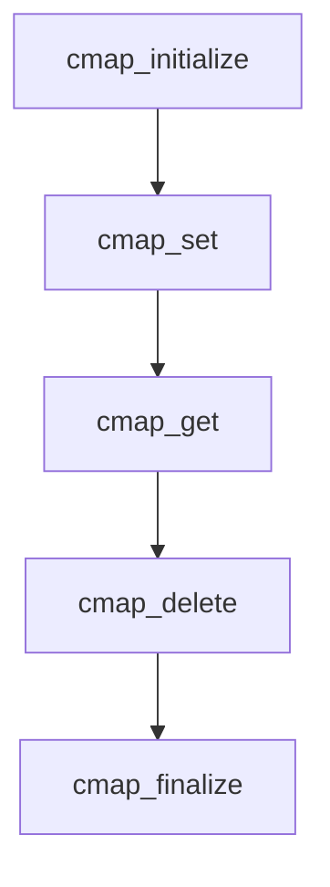

# corosync-cmap使用指南

cmap是corosync的内存key/value存储。cmap提供了如下功能：

1. 创建key
2. 修改已经存在的key
3. 移除key
4. 根据前缀迭代key
5. 跟踪key的改变

## cmap api

cmap的value支持如下几种类型：

```shell
CMAP_VALUETYPE_INT8 - 8-bit signed integer

CMAP_VALUETYPE_UINT8 - 8-bit unsigned integer

CMAP_VALUETYPE_INT16 - 16-bit signed integer

CMAP_VALUETYPE_UINT16 - 16-bit unsigned integer

CMAP_VALUETYPE_INT32 - 32-bit signed integer

CMAP_VALUETYPE_UINT32 - 32-bit unsigned integer

CMAP_VALUETYPE_INT64 - 64-bit signed integer

CMAP_VALUETYPE_UINT64 - 64-bit unsigned integer

CMAP_VALUETYPE_FLOAT - Float value

CMAP_VALUETYPE_DOUBLE - Double value

CMAP_VALUETYPE_STRING - C-style string

CMAP_VALUETYPE_BINARY - Binary data, byte with zero value has no special meaning
```


- cmap_initialize

  ```c
  cs_error_t cmap_initialize (cmap_handle_t *handle );
  ```

  初始化一个cmap句柄，后面使用该句柄进行key的插入修改删除和跟踪。

- cmap_set

  ```c
  cs_error_t cmap_set (cmap_handle_t handle,  // 初始化时生成的句柄
                       const char *key_name,  // 要添加的key名称
                       const void *value,     // key对应的值
                       size_t value_len,      // 值的长度
                       cmap_value_types_t type); // 值的类型
  ```

  也可以使用指定值类型的接口：

  ```c
  cs_error_t cmap_set_int8(cmap_handle_t handle, const char *key_name, int8_t value);
  
  cs_error_t cmap_set_uint8(cmap_handle_t handle, const char *key_name, uint8_t value);
  
  cs_error_t cmap_set_int16(cmap_handle_t handle, const char *key_name, int16_t value);
  
  cs_error_t cmap_set_uint16(cmap_handle_t handle, const char *key_name, uint16_t value);
  
  cs_error_t cmap_set_int32(cmap_handle_t handle, const char *key_name, int32_t value);
  
  cs_error_t cmap_set_uint32(cmap_handle_t handle, const char *key_name, uint32_t value);
  
  cs_error_t cmap_set_int64(cmap_handle_t handle, const char *key_name, int64_t value);
  
  cs_error_t cmap_set_uint64(cmap_handle_t handle, const char *key_name, uint64_t value);
  
  cs_error_t cmap_set_float(cmap_handle_t handle, const char *key_name, float value);
  
  cs_error_t cmap_set_double(cmap_handle_t handle, const char *key_name, double value);
  
  cs_error_t cmap_set_string(cmap_handle_t handle, const char *key_name, const char *value);
  ```

- cmap_get

  cmap_get用于读取key对应的值，接口与cmap_set相似：

  ```c
  cs_error_t cmap_get (cmap_handle_t handle,  // cmap句柄
                       const char *key_name, // 要查看的key
                       void *value,          // key对应的值会存到value
                       size_t *value_len,    // value的长度会存到这里
                       cmap_value_types_t *type); // value的类型会存到这里
  ```

  同样的，若知道value的明确类型，则可以使用指定类型的接口：

  ```c
  cs_error_t cmap_get_int8 (cmap_handle_t handle, const char *key_name, int8_t *i8);
  
  cs_error_t cmap_get_uint8 (cmap_handle_t handle, const char *key_name, uint8_t *u8);
  
  cs_error_t cmap_get_int16 (cmap_handle_t handle, const char *key_name, int16_t *i16);
  
  cs_error_t cmap_get_uint16 (cmap_handle_t handle, const char *key_name, uint16_t *u16);
  
  cs_error_t cmap_get_int32 (cmap_handle_t handle, const char *key_name, int32_t *i32);
  
  cs_error_t cmap_get_uint32 (cmap_handle_t handle, const char *key_name, uint32_t *u32);
  
  cs_error_t cmap_get_int64 (cmap_handle_t handle, const char *key_name, int64_t *i64);
  
  cs_error_t cmap_get_uint64 (cmap_handle_t handle, const char *key_name, uint64_t *u64);
  
  cs_error_t cmap_get_float (cmap_handle_t handle, const char *key_name, float *flt);
  
  cs_error_t cmap_get_double (cmap_handle_t handle, const char *key_name, double *dbl);
  
  cs_error_t cmap_get_string (cmap_handle_t handle, const char *key_name, char **str);
  ```

  

- cmap_delete

  ```c
  cs_error_t cmap_delete(cmap_handle_t handle, const char *key_name);
  ```

  删除某个可以。

- cmap_track_add

  ```c
  cs_error_t cmap_track_add (cmap_handle_t handle, // cmap句柄
                             const char *key_name, // key名
                             int32_t track_type,   // track的类型
                             cmap_notify_fn_t notify_fn, // value变更时的回调函数
                             void *user_data,   // 回调时传递的数据
                             cmap_track_handle_t *cmap_track_handle // 用于调度分发的track句柄
                            );
  
  ```

  添加对某个key的value的变化跟踪，当value改变时会触发notify_fn回调。需在进程中循环调用cmap_dispatch。

- cmap_finalize

  ```c
  cs_error_t cmap_finalize (cmap_handle_t handle);
  ```

  释放cmap句柄。

cmap的大致使用流程如下：



