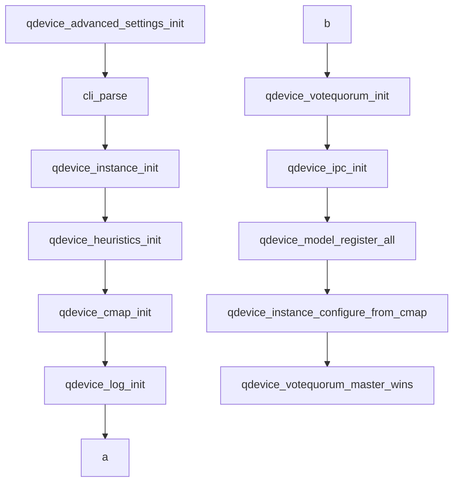
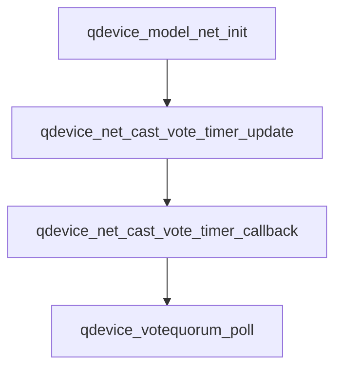
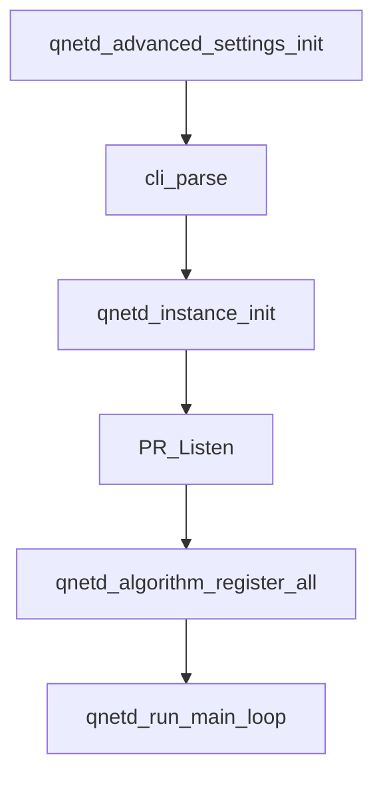
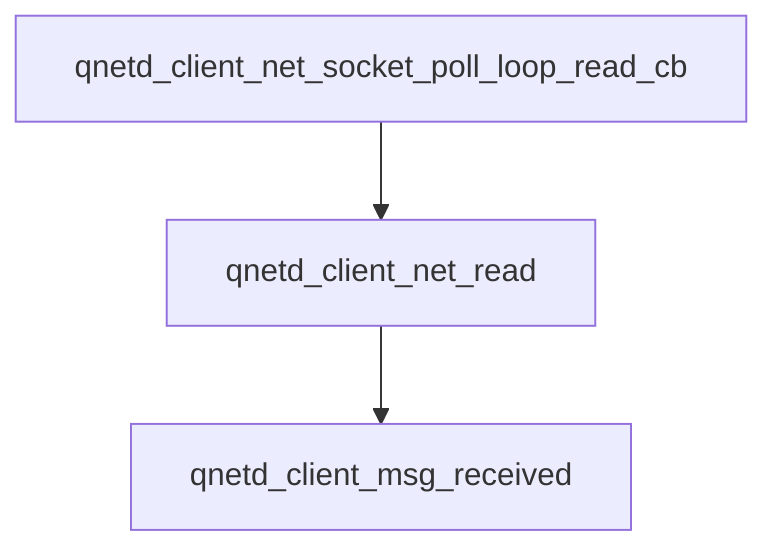

# corosync-qnetd投票机制

| 修改人 | 修改内容 | 修改时间   |
| ------ | -------- | ---------- |
| growdu | 新建文档 | 2023-03-14 |
|        |          |            |
|        |          |            |


corosync-qnetd是corosync的第三方仲裁机制，当corosync出现网络分区时，集群内部无法选择出quorate一方时，就会借助corosync-qnetd来进行辅助投票。

- corosync-qnetd作为服务端，会根据各分区连接到qnetd的客户端数目，完成启发式算法的客户端数目等信息来对各分区节点进行投票
- corosync-qdevice作为客户端会连接到qnetd，同时在本地会执行一组启发式命令，并将启发式命令执行结果发送到qnetd
- corosync-qnetd根据ring id来区分不同的分区

## votequorum

corosync本身提供了votequorum模块和与其配套的接口，支持用户自定义投票规则，实现第三方投票仲裁。corosync-qdevice就是corosync官方实现的一套第三方投票仲裁机制。

>
>
>每次投票配置即将改变（例如节点加入或离开集群）时，都会调用votequorum_nodelist_notification_fn_t回调。 回调函数由以下类型定义描述：
>
>```c
>typedef void (*votequorum_nodelist_notification_fn_t) (
>   votequorum_handle_t handle,
>   uint64_t context,
>   uint32_t node_list_entries,
>   uint32_t node_list[]
>   );
>```
>
>当前的 ring_id（votequorum_quorum_notification_fn_t获取）必须传递给 votequorum_qdevice_poll 以使 qdevice 投票有效。
>
>每次仲裁状态改变（例如节点加入或离开集群）时，都会调用votequorum_quorum_notification_fn_t回调。 回调函数由以下类型定义描述：
>
>```c
>typedef void (*votequorum_quorum_notification_fn_t) (
>   votequorum_handle_t handle,
>   uint64_t context,
>   uint32_t quorate,
>   uint32_t node_list_entries,
>   votequorum_node_t node_list[]
>   );
>```
>
>

## corosync-qdevice

### qdevice主流程




> qdevice_heuristics_init会fork出一个进程在本机来执行启发式命令，当所有启发式命令均执行成功后，会将结果发送给qnetd，帮助qnetd进行投票决策。

### qdevice投票处理

>qdevice通过net模块和qnetd通信，并根据qnetd返回的投票结果，来通知本机器节点是否能获得qnetd的投票。



qdevice获取到qnet的投票后会进行如下处理逻辑：

```c
	switch (instance->cast_vote_timer_vote) {
	case TLV_VOTE_ACK: // 获取到了qnetd的投票
		case_processed = 1;
		cast_vote = 1;
		break;
	case TLV_VOTE_NACK: // 没有获取到qnetd的投票
		case_processed = 1;
		cast_vote = 0;
		break;
	case TLV_VOTE_ASK_LATER:
	case TLV_VOTE_WAIT_FOR_REPLY:
	case TLV_VOTE_NO_CHANGE:
	case TLV_VOTE_UNDEFINED:
		/*
		 * Shouldn't happen
		 */
		break;
	/*
	 * Default is not defined intentionally. Compiler shows warning when
	 * new tlv_vote is added.
	 */
	}
	if (!case_processed) { // 如果没有获取正确的投票结果，直接返回
		log(LOG_CRIT, "qdevice_net_timer_cast_vote: Unhandled cast_vote_timer_vote %u",
		    instance->cast_vote_timer_vote);
		exit(EXIT_FAILURE);
	}
	// 将投票信息传到corosync，如果cast_vote为1，则会把qdevice的vote计算在内，否则不会包含qdevice的vote
	if (qdevice_votequorum_poll(instance->qdevice_instance_ptr, cast_vote) != 0) { 
		instance->disconnect_reason = QDEVICE_NET_DISCONNECT_REASON_CANT_SCHEDULE_VOTING_TIMER;
		instance->schedule_disconnect = 1;
		instance->cast_vote_timer = NULL;
		return (0);
	}
```

### qdevice重要API

>votequorum_qdevice_register 用于注册一个新的仲裁设备。 仲裁设备是向小型集群添加投票的外部方式。 仲裁设备实际上是集群中的一个伪节点，它根据一些外部设备（通常是共享磁盘分区或网络路由器）提供投票。
>此调用会创建设备，但不会将其标记为活动的。 必须调用 votequorum_qdevice_poll 才能将选票包含在法定人数计算中。
>name 是包含仲裁设备信息名称的字符串。 它是简单的由 votequorum 存储，用于 corosync-quorumtool 的显示，最多可以是 254 个字符。
>仲裁设备贡献的票数对于 votequorum 是已知的，它是在 cmap quorum.device.votes 中设置的，而不是由设备设置的。
>请注意，仲裁设备子系统（未作为 votequorum 的一部分提供）负责让所有节点了解仲裁设备状态。

```c
#include <corosync/votequorum.h>
int votequorum_qdevice_register(votequorum_handle_t handle, const char * name);
```

>votequorum_qdevice_poll 由仲裁设备子系统（未作为 votequorum 的一部分提供）调用，以告知投票系统仲裁设备是否存在/活动。 如果 cast_vote 为 1，则设备的投票包含在仲裁计算中，否则不包含。 当前的 ring_id 必须设置（votequorum_notification_fn 回调被调用时获取）否则轮询被忽略。 应定期调用此例程，以确保设备状态始终为 votequorum 所知。 如果在（默认）10 秒（或同步阶段为 30 秒）内未调用 votequorum_qdevice_poll，则该设备将被视为已死，并将其投票从集群中删除。 这不会取消注册设备。 默认轮询时间可以通过为正常操作设置 cmap 变量 quorum.device.timeout 或为同步阶段设置 quorum.device.sync_timeout 来更改。

```c
#include <corosync/votequorum.h>
int votequorum_qdevice_poll(votequorum_handle_t handle, const char * name, unsigned int cast_vote, votequorum_ring_id_t ring_id);
```

## corosync-qnetd

### 主流程



### 接收消息



- 处理投票请求信息

  ```mermaid
  graph TB
  qnetd_client_msg_received_ask_for_vote-->qnetd_algorithm_ask_for_vote_received-->ask_for_vote_received-->qnetd_algo_lms_ask_for_vote_received-->do_lms_algorithm-->msg_create_ask_for_vote_reply
  ```

  ### 消息
  
  - 消息类型
  
  ```c
  enum msg_type {
  	MSG_TYPE_PREINIT = 0,
  	MSG_TYPE_PREINIT_REPLY = 1,
  	MSG_TYPE_STARTTLS = 2,
  	MSG_TYPE_INIT = 3,
  	MSG_TYPE_INIT_REPLY = 4,
  	MSG_TYPE_SERVER_ERROR = 5,
  	MSG_TYPE_SET_OPTION = 6,
  	MSG_TYPE_SET_OPTION_REPLY = 7,
  	MSG_TYPE_ECHO_REQUEST = 8,
  	MSG_TYPE_ECHO_REPLY = 9,
  	MSG_TYPE_NODE_LIST = 10,
  	MSG_TYPE_NODE_LIST_REPLY = 11,
  	MSG_TYPE_ASK_FOR_VOTE = 12,
  	MSG_TYPE_ASK_FOR_VOTE_REPLY = 13,
  	MSG_TYPE_VOTE_INFO = 14,
  	MSG_TYPE_VOTE_INFO_REPLY = 15,
  	MSG_TYPE_HEURISTICS_CHANGE = 16,
  	MSG_TYPE_HEURISTICS_CHANGE_REPLY = 17,
  };
  ```
  
  - 消息格式
  
  ```c
  struct msg_decoded {
  	enum msg_type type;
  	uint8_t seq_number_set;
  	uint32_t seq_number;	/* Only valid if seq_number_set != 0 */
  	size_t cluster_name_len;
  	/* Valid only if != NULL. Trailing \0 is added but not counted in cluster_name_len */
  	char *cluster_name;
  	uint8_t tls_supported_set;
  	enum tlv_tls_supported tls_supported;	/* Valid only if tls_supported_set != 0. */
  	uint8_t tls_client_cert_required_set;
  	uint8_t tls_client_cert_required;	/* Valid only if tls_client_cert_required_set != 0 */
  	size_t no_supported_messages;
  	enum msg_type *supported_messages;	/* Valid only if != NULL */
  	size_t no_supported_options;
  	enum tlv_opt_type *supported_options;	/* Valid only if != NULL */
  	uint8_t reply_error_code_set;
  	enum tlv_reply_error_code reply_error_code;	/* Valid only if reply_error_code_set != 0 */
  	uint8_t server_maximum_request_size_set;
  	/* Valid only if server_maximum_request_size_set != 0 */
  	size_t server_maximum_request_size;
  	uint8_t server_maximum_reply_size_set;
  	size_t server_maximum_reply_size;	/* Valid only if server_maximum_reply_size_set != 0 */
  	uint8_t node_id_set;
  	uint32_t node_id;
  	size_t no_supported_decision_algorithms;
  	/* Valid only if != NULL */
  	enum tlv_decision_algorithm_type *supported_decision_algorithms;
  	uint8_t decision_algorithm_set;
  	/* Valid only if decision_algorithm_set != 0 */
  	enum tlv_decision_algorithm_type decision_algorithm;
  	uint8_t heartbeat_interval_set;
  	uint32_t heartbeat_interval;	/* Valid only if heartbeat_interval_set != 0 */
  	uint8_t ring_id_set;
  	struct tlv_ring_id ring_id;	/* Valid only if ring_id_set != 0 */
  	uint8_t config_version_set;
  	uint64_t config_version;	/* Valid only if config_version_set != 0 */
  	uint32_t data_center_id;	/* Valid only if != 0 */
  	enum tlv_node_state node_state;	/* Valid only if != TLV_NODE_STATE_NOT_SET */
  	struct node_list nodes;		/* Valid only if node_list_is_empty(nodes) != 0 */
  	uint8_t node_list_type_set;
  	enum tlv_node_list_type node_list_type;	/* Valid only if node_list_type_set != 0 */
  	uint8_t vote_set;
  	enum tlv_vote vote;	/* Valid only if vote_set != 0 */
  	uint8_t quorate_set;
  	enum tlv_quorate quorate;	/* Valid only if quorate_set != 0 */
  	uint8_t tie_breaker_set;
  	struct tlv_tie_breaker tie_breaker;
  	enum tlv_heuristics heuristics;	/* Always valid but can be TLV_HEURISTICS_UNDEFINED */
  	enum tlv_keep_active_partition_tie_breaker keep_active_partition_tie_breaker;
  	uint8_t keep_active_partition_tie_breaker_set;
  };
  ```
  
  ### lms算法执行流程
  
  ```mermaid
  graph TB
  do_lms_algorithm-->|将ring id加入缓存里|qnetd_algo_all_ring_ids_match-->|创建分区并计算分数,启发算法通过分数加1,节点个数增加分数加1,同时返回分区个数|qnetd_algo_create_partitions-->qnetd_algo_dump_partitions
  ```
  
  ```c
  int
  qnetd_algo_create_partitions(struct qnetd_client *client, partitions_list_t *partitions_list, const struct tlv_ring_id *ring_id)
  {
   	struct qnetd_client *other_client;
  	int num_partitions = 0; // 计算分区数量
  
  	TAILQ_FOREACH(other_client, &client->cluster->client_list, cluster_entries) {
  		struct qnetd_algo_partition *partition;
  
  		if (other_client->last_ring_id.seq == 0){
  			continue; /* not initialised yet */
  		}
  		partition = qnetd_algo_find_partition(partitions_list, &other_client->last_ring_id);
  		if (!partition) { /// 找不到已经存在的分区，重新分配一个分区
  			partition = malloc(sizeof(struct qnetd_algo_partition));
  			if (!partition) {
  				return (-1);
  			}
  			partition->num_nodes = 0;
  			partition->score = 0;
  			memcpy(&partition->ring_id, &other_client->last_ring_id, sizeof(*ring_id));
  			num_partitions++;
  			TAILQ_INSERT_TAIL(partitions_list, partition, entries);
  		}
  		partition->num_nodes++; ///< 分区节点个数加1
  
  		/*
  		 * Score is computer similar way as in the ffsplit algorithm
  		 */
  		partition->score++; /// 分数加1
  		if (other_client->last_heuristics == TLV_HEURISTICS_PASS) {/// 如果启发算法通过了，分数加1
  			partition->score++;
  		} else if (other_client->last_heuristics == TLV_HEURISTICS_FAIL) { ///< 如果启发算法没有通过，分数减1
  			partition->score--;
  		}
  
  	}
  
  	return (num_partitions);
  }
  ```
  
  

1. qnet收到某个节点MSG_TYPE_ASK_FOR_VOTE消息后，会计算该节点是否能获取到投票；
2. 当配置lms时，会根据lms算法计算投票；
   1. 会根据节点的ring_id(由node_id和seq组成)插入节点信息并创建分区插入节点；
   2. 每个分区都会有它的分数，分区中每插入一个节点分数加1，启发算法通过分数加1，启发算法执行失败分数减1；
   3. 如果只有一个分区，那么该分区内的所有节点都会获得投票；
   4. 如果有多个分区，则会选出得分最高的那个分区，该分区内的所有节点都会获得投票；
   5. 如果有多个分区的分数相同，则会比较分区的节点个数，分区节点个数多的会获得投票；
   6. 如果多个分区的节点个数也相同，则会选择id最小的那个分区，该分区内的节点都会获得投票；
3. qnet计算完投票后会将投票结果通过网络发送给发起MSG_TYPE_ASK_FOR_VOTE请求的节点；

- 对于两节点集群来说，若集群只有一个分区，则所有节点都会获得投票，不论启发算法是否执行成功；
- 对于两节点集群来说，若节点a和节点b相互隔离，且节点a执行启发算法成功，节点b执行启发算法失败，则节点a所在的分区得2分（0+1+1），节点b所在的分区得0分（0+1-1），得分高的节点a所在的分区将获得投票；
- 对于两节点集群来说，若节点a和节点b相互隔离，且节点a和节点b均执行启发算法成功，则节点a所在的分区得2分（0+1+1），节点b所在的分区得2分（0+1+1），此时比较节点个数，两个分区节点个数均为1，需要进一步比较节点a和节点b的node_id，node_id小的将获得投票；

