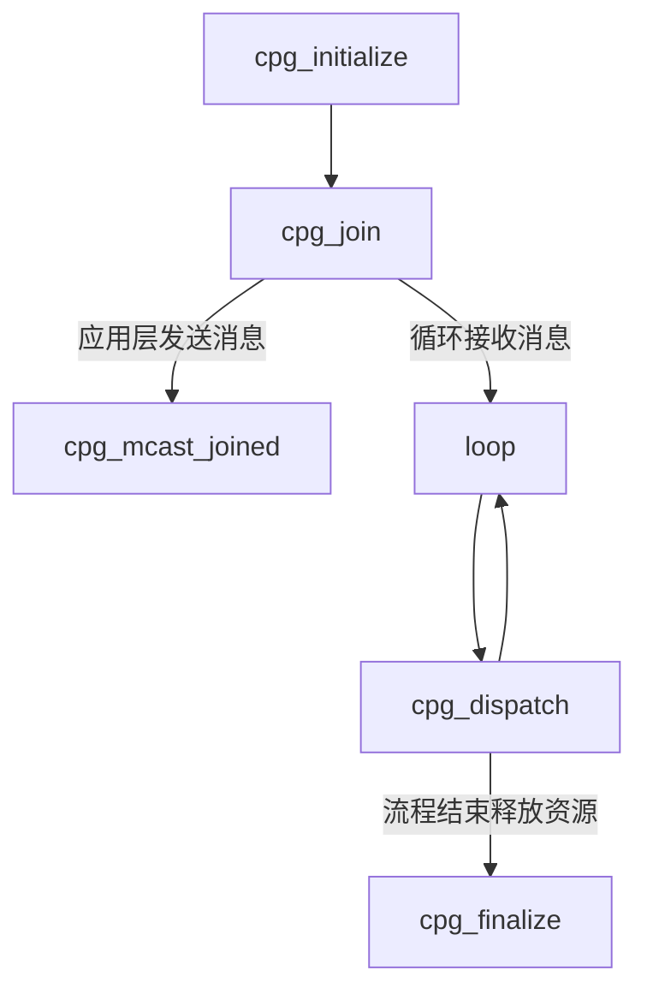
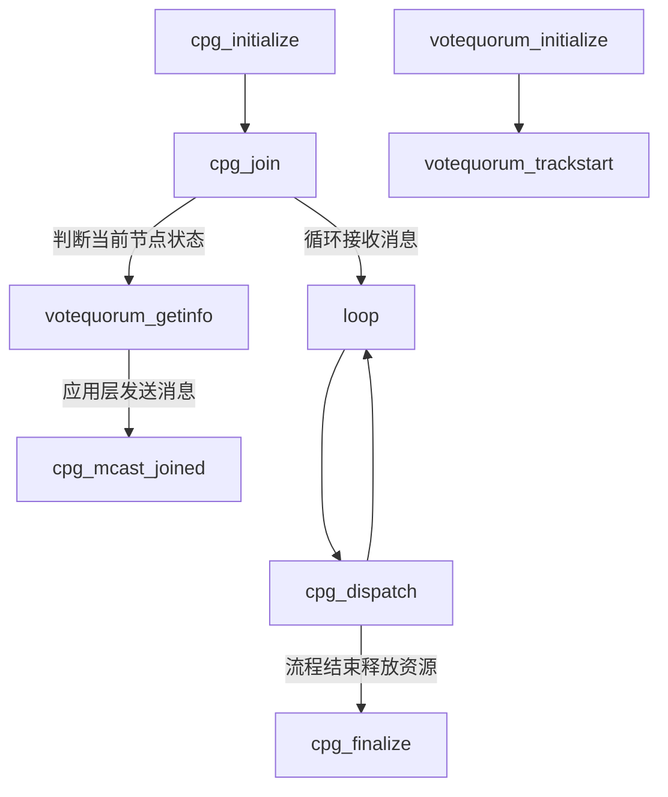

# corosync编程指南

## 安装corosync

[corosync](https://github.com/corosync/corosync.git)编译依赖[libqb](https://github.com/ClusterLabs/libqb)和[kronosnet](https://github.com/kronosnet/kronosnet/)。基于ubuntu20.04编译。

- 系统库依赖

```shell
 sudo apt-get install libgcrypt20-dev libzstd-dev liblzo2-dev liblzma-dev libbz2-dev libsctp-dev doxygen libnl-3-dev libnl-route-3-dev
```

- 编译libqb

  ```shell
  git clone https://github.com/ClusterLabs/libqb.git
  cd libqb
  ./autogen.sh
  ./configure
  make -j 32
  sudo make install
  ```

- 编译kronosnet

  ```shell
  git clone https://github.com/kronosnet/kronosnet.git
  cd kronosnet
  ./autogen.sh
  ./configure
  make -j 32
  sudo make install
  ```

- 编译corosync

  ```shell
  git clone https://github.com/corosync/corosync.git
  cd kronosnet
  ./autogen.sh
  ./configure
  make -j 32
  sudo make install
  ```

## corosync分布式应用开发接口

### 基于cpg的消息发送

corosync实现了基于totem协议的一致性分布式算法，提供了分布式通信接口，我们可以基于相关的API接口开发分布式应用。

corosync提供了基于分组的通信机制，在同一个分组内的进程节点会收到分组内各节点的的消息以及配置变更通知，包括节点加入和移除。其主要接口如下：（要查看相关函数接口使用说明可以使用man + 函数名的方式来查看）

- `cpg_initialize`

  ```c
  #include <corosync/cpg.h>
  
  int cpg_initialize(cpg_handle_t *handle, cpg_callbacks_t *callbacks);
  ```

  该函数用于初始化一个cpg组成员的handle，后面的操作都需要使用handle来标识；同时注册应用层的组成员变更回调和消息回调。

  ```c
  typedef void (*cpg_deliver_fn_t) (
          cpg_handle_t handle,
          const struct cpg_name *group_name,
          uint32_t nodeid,
          uint32_t pid,
          const void *msg,
          size_t msg_len);
  
  typedef void (*cpg_confchg_fn_t) (
          cpg_handle_t handle,
          const struct cpg_name *group_name,
          const struct cpg_address *member_list, size_t member_list_entries,
          const struct cpg_address *left_list, size_t left_list_entries,
          const struct cpg_address *joined_list, size_t joined_list_entries);
  ```

  当分组内有成员变更时，如成员join或者leave时，会调用cpg_confchg_fn_t，应用层需实现这个函数。

  当收到组内节点发送的消息时，会调用cpg_deliver_fn_t，应用层需实现这个函数，对收到的数据进行处理。

  <font color="red">当cpg_deliver_fn_t被调用时，corosync并不保证本条信息已经被所有组内节点确认；但corosync底层实现可以保证本条消息之前的所有消息都已被组内所有节点确认收到。</font>当本条消息之前的消息还没有被组内所有节点确认时，corosync会缓存此消息，直到组内成员均确认本条消息前的消息已被接收。

  <font color="red">进程调用cpg_mcast_joined发送消息时，本进程也会触发回调cpg_deliver_fn收到本进程发出的消息。</font>

  代码样例如下：

  ```c
  tatic void cpg_deliver_fn (
          cpg_handle_t handle,
          const struct cpg_name *group_name,
          uint32_t nodeid,
          uint32_t pid,
          void *m,
          size_t msg_len)
  {
  }
  
  static void cpg_confchg_fn (
          cpg_handle_t handle,
          const struct cpg_name *group_name,
          const struct cpg_address *member_list, size_t member_list_entries,
          const struct cpg_address *left_list, size_t left_list_entries,
          const struct cpg_address *joined_list, size_t joined_list_entries)
  {
  }
  
  static cpg_callbacks_t callbacks = {
  	cpg_deliver_fn,
  	cpg_confchg_fn
  };
  
  int result = cpg_initialize (&handle, &callbacks);
  ```

- `cpg_model_initialize`

  ```c
  #include <corosync/cpg.h>
  
  cs_error_t cpg_model_initialize(cpg_handle_t *handle, cpg_model_t model, cpg_model_data_t *model_data, void *context);
  ```

  cpg_model_initialize是cpg_initialize的新版本，cpg_initialize接口已过期。cpg_model_initialize增加了cpg_totem_confchg_fn_t回调。

  ```c
  typedef void (*cpg_deliver_fn_t) (
          cpg_handle_t handle,
          const struct cpg_name *group_name,
          uint32_t nodeid,
          uint32_t pid,
          const void *msg,
          size_t msg_len);
  
  typedef void (*cpg_confchg_fn_t) (
          cpg_handle_t handle,
          const struct cpg_name *group_name,
          const struct cpg_address *member_list, size_t member_list_entries,
          const struct cpg_address *left_list, size_t left_list_entries,
          const struct cpg_address *joined_list, size_t joined_list_entries);
  
  typedef void (*cpg_totem_confchg_fn_t) (
          cpg_handle_t handle,
          struct cpg_ring_id ring_id,
          uint32_t member_list_entries,
          const uint32_t *member_list);
  
  typedef struct {
          cpg_model_t model;
          cpg_deliver_fn_t cpg_deliver_fn;
          cpg_confchg_fn_t cpg_confchg_fn;
          cpg_totem_confchg_fn_t cpg_totem_confchg_fn;
  unsigned int flags;
  } cpg_model_v1_data_t;
  ```

  

- `cpg_join`

  ```c
  #include <corosync/cpg.h>
  
  int cpg_join(cpg_handle_t handle, struct cpg_name *group);
  ```

  该函数在cpg_initialize之后执行，cpg初始化完成后，会获取到一个handle，通过该handle和cpg_name将该进程加入到某个进程组内。这样当该进程组内有节点发送消息或者节点变更时就会收到消息。一般该函数用于将本进程加入到某个特定的进程组里，订阅进程组内的消息。

  在corosync中，corosync是一个服务，可以基于corosync服务创建多个应用进程，还可以把应用进程加入到不同的分组里进行分组隔离。进程可以订阅本进程组的消息和配置变更，并对其进行处理，也可以向同进程组内广播消息。

- `cpg_mcast_joined`

  ```c
  #include <sys/uio.h> 
  #include <corosync/cpg.h>
  
  int cpg_mcast_joined(cpg_handle_t handle, cpg_guarantee_t guarantee, struct iovec *iovec, int iov_len);
  ```

  该函数在cpg分组初始化完成并加入到某个进程组后可以调用，一般用于广播消息到进程组的其他节点。

- `cpg_dispatch`

  ```c
  #include <corosync/cpg.h>
  
  /**
   * @brief  Dispatch messages and configuration changes
   * @param handle
   * @param dispatch_types
   * @return
   */
  cs_error_t cpg_dispatch (
  	cpg_handle_t handle,
  	cs_dispatch_flags_t dispatch_types);
  ```

  该函数用于接收进程组内的消息和配置更改。

- `cpg_finalize`

  ```c
  #include <corosync/cpg.h>
  
  int cpg_finalize(cpg_handle_t handle);
  ```

  该函数用于释放cpg相关资源。

综合来看，基于corosync服务的cpg分组的分布式应用开发大致流程如下：



### 基于quorum的投票机制

分布式集群需要处理的一个最主要问题就是“脑裂”，corosync通过quorum机制解决“脑裂的问题”，并且提供了一套接口对quorum进行配置和获取quorum信息。对于每一个corosync服务来说，其quorum都有两种状态：

1. with quorate

   with quorate表示得到了大多数节点的投票，表明这个节点可以对外提供服务。

2. without quorate

   without quorate表示没有得到了大多数节点的投票，表明这个节点无法对外提供服务。

- `votequorum_initialize`

  ```c
  #include <corosync/votequorum.h>
  
  int votequorum_initialize(votequorum_handle_t *handle, votequorum_callbacks_t *callbacks);
  ```

  该函数用于初始化与基于quorum的投票系统的接口。并注册投票配置更改的回调votequorum_notification_fn_t，节点变更的回调votequorum_nodelist_notify_fn以及期望票数变更的回调votequorum_expectedvotes_notify_fn。当投票配置或节点变更时会触发相应的回调，通过实行对应的回调函数，可以获取当前集群的各个节点信息已经quorum信息。

  ```c
  /**
   * @brief The votequorum_quorum_notification_fn_t callback
   */
  typedef void (*votequorum_quorum_notification_fn_t) (
  	votequorum_handle_t handle,
  	uint64_t context,
  	uint32_t quorate,
  	uint32_t node_list_entries,
  	votequorum_node_t node_list[]);
  
  typedef void (*votequorum_nodelist_notification_fn_t) (
  	votequorum_handle_t handle,
  	uint64_t context,
  	votequorum_ring_id_t ring_id,
  	uint32_t node_list_entries,
  	uint32_t node_list[]);
  
  /**
   * @brief The votequorum_expectedvotes_notification_fn_t callback
   */
  typedef void (*votequorum_expectedvotes_notification_fn_t) (
  	votequorum_handle_t handle,
  	uint64_t context,
  	uint32_t expected_votes);
  ```

- `votequorum_trackstart`

  ```c
  cs_error_t votequorum_trackstart (
  	votequorum_handle_t handle,
  	uint64_t context,
  	unsigned int flags);
  ```

  该函数用于启动votequorum接口。

- `votequorum_getinfo`

  ```c
  cs_error_t votequorum_getinfo (
  	votequorum_handle_t handle,
  	unsigned int nodeid,
  	struct votequorum_info *info);
  ```

  该函数用于获取votequorum的相关信息以及节点信息,相关信息通过struct votequorum_info返回。

  <font color="red">我们可以通过调用该函数判断当前节点的quorate状态，进而判断当前节点是否能够提供服务。当节点状态为without quorate，表面节点已不在多数派集群中，应用层不应该再发送消息。</font>

  ```c
  /**
   * @brief The votequorum_info struct
   */
  struct votequorum_info {
  	unsigned int node_id;
  	unsigned int node_state;
  	unsigned int node_votes;
  	unsigned int node_expected_votes;
  	unsigned int highest_expected;
  	unsigned int total_votes; // 节点所在集群获得的总投票数
  	unsigned int quorum; // 节点所在集群获得的quorum
  	unsigned int flags; // 是否是quorate，1为是，表面是否属于多数派里的节点
  	unsigned int qdevice_votes;
  	char qdevice_name[VOTEQUORUM_QDEVICE_MAX_NAME_LEN];
  };
  ```

- `votequorum_setexpected`

  ```c
  cs_error_t votequorum_setexpected (
  	votequorum_handle_t handle,
  	unsigned int expected_votes);
  ```

  该函数用于更改集群中的预期投票**。**预期投票用于计算法定人数，通常应该是所有预期节点加入时将存在的投票总数。法定人数通常是这个的一半（四舍五入）。

- `votequorum_setvotes`

  ```c
  cs_error_t votequorum_setvotes (
  	votequorum_handle_t handle,
  	unsigned int nodeid,
  	unsigned int votes);
  ```

  该函数用于更改节点拥有的投票数。

- `votequorum_dispatch`

  ```c
  cs_error_t votequorum_dispatch (
  	votequorum_handle_t handle,
  	cs_dispatch_flags_t dispatch_types);
  ```

  该函数用于调度配置更改。

基于corosync开发分布式应用时，需要处理两个方面的问题：

1. 消息发送；
2. 脑裂；

其中消息发送通过cpg机制解决，但基于cpg分组的消息发送底层不会去区分节点是否属于多数派集群，因而当发生脑裂时，若本节点corosync服务未挂死，将不会影响应用层的消息发送。

<font color="red">当集群发生脑裂时，应用层在发送消息前应先判断当前节点的状态，若当前节点已经不在多数派集群中，当前节点将不能发送任何数据，也无法接收任何数据。**这个判断应该由应用层判断。**</font>即应用层在调用cpg_mcast_joined发送消息前，先调用votequorum_getinfo获取节点状态，再决定是否能发送数据。或者当注册votequorum_callbacks_t的回调被调用时，需判断当前节点的状态。<font color="red">总之，应用层需感知本节点的quorate状态。</font>

进而，基于corosync服务的分布式应用开发大体流程如下：



## corosync分布式应用实现

基于corosync的分布式应用实现时需考虑以下几个问题：

1. 应用层需处理当前节点的quorate状态，并根据相应的quorate进行相关的动作；若当进入without quorate状态时，是否需要触发切换操作，是否涉及选主操作；
2. 应用层需根据具体业务实现相应的消息通信和持久化机制，corosync仅保证消息一定会发送到集群的大多数节点；

## FAQ

1. 如何修改corosync监听端口

   ```shell
   totem {
   	version: 2
   	secauth: off
   	crypto_cipher: none
   	crypto_hash: none
   	threads: 0
   	clear_node_high_bit: no
   	rrp_mode: none
   	transport: udp
   	token: 1000
   	interface {
   		ringnumber: 0
   		ttl: 45
   		mcastport: 5406
   	}
   }
   ```

   修改后执行结果如下：

   ```shell
   ha@ha-virtual-machine:~$ netstat -anp | grep udp
   (Not all processes could be identified, non-owned process info
    will not be shown, you would have to be root to see it all.)
   udp        0      0 0.0.0.0:51896           0.0.0.0:*                           -
   udp        0      0 127.0.0.53:53           0.0.0.0:*                           -
   udp        0      0 0.0.0.0:5353            0.0.0.0:*                           -
   udp        0   2304 192.168.145.130:5405    0.0.0.0:*                           -
   udp        0      0 0.0.0.0:631             0.0.0.0:*                           -
   udp6       0      0 :::41918                :::*                                -
   udp6       0      0 :::5353                 :::*                                -
   ha@ha-virtual-machine:~$ sudo /etc/init.d/corosync stop
   ha@ha-virtual-machine:~$ sudo vim /etc/corosync/corosync.conf
   ha@ha-virtual-machine:~$ sudo /etc/init.d/corosync start
   Starting corosync (via systemctl): corosync.service.
   ha@ha-virtual-machine:~$ netstat -anp | grep udp
   (Not all processes could be identified, non-owned process info
    will not be shown, you would have to be root to see it all.)
   udp        0      0 0.0.0.0:51896           0.0.0.0:*                           -
   udp        0      0 127.0.0.53:53           0.0.0.0:*                           -
   udp        0      0 0.0.0.0:5353            0.0.0.0:*                           -
   udp        0   2304 192.168.145.130:5406    0.0.0.0:*                           -
   udp        0      0 0.0.0.0:631             0.0.0.0:*                           -
   udp6       0      0 :::41918                :::*                                -
   udp6       0      0 :::5353                 :::*                                -
   ha@ha-virtual-machine:~$
   ```

2. 各节点持久化完成后会以单播的方式告诉发起节点持久化结果，所以这个时候其实不管客户端有没有返回成功，本地都已经更新了，那就出现了个节点状态不一致的情况？所以读的时候读的是更新前的？新的会回滚掉？

   持久化需要在cpg_deliver_fn_t回调中实现文件写入操作，即收到消息后进行文件写入。由于corosync服务能保证本条消息之前的所有消息都已被各节点接收，即corosync只保证消息送达应用层，不保证消息送到应用层后一定写入成功。因而需要考虑文件写入失败的情况，针对这种情况可以考虑两种方案：

   1. 通过本进程重写来保证写成功；由写入进程本身保证文件写入成功，需要写入进程维护一段缓冲区，保存收到的消息内容，写入成功的消息才能移除，写入失败的需要进行重试；
   2. 通过确认机制，应用层重传来保证写入成功；

3. 节点如何绑定多个分组

   此处的节点对应一台机器，或者说对应一个corosync服务。一个节点可以有多个进程，每个进程可以加入到一个分组。

4. cpg_dispatch是不是阻塞的

   cpg_dispatch支持四种类型的调度方式。

   ```c
   typedef enum {
   	CS_DISPATCH_ONE = 1, // 调度至少一个回调，阻塞直到回调被调度
   	CS_DISPATCH_ALL = 2, // 调度所有等待的回调而不阻塞等待任何回调
   	CS_DISPATCH_BLOCKING = 3, // 调度所有回调，无限期阻塞。这用于创建线程的方式。
   	CS_DISPATCH_ONE_NONBLOCKING = 4 // 最多发送一个回调。如果没有挂起的回调，则返回 CS_ERR_TRY_AGAIN。
   } cs_dispatch_flags_t;
   ```

   cpg_dispatch是否阻塞，与传入的cs_dispatch_flags_t类型有关，CS_DISPATCH_ALL和CS_DISPATCH_ONE_NONBLOCKING为非阻塞方式，CS_DISPATCH_ONE和CS_DISPATCH_BLOCKING为阻塞方式。

5. corosync内部重传机制

   corosync内部基于totem协议通过读取令牌环信息进行重传。令牌环中会携带消息的seq，若seq小于当前节点的最大seq，则当前节点会广播中间相差的seq数据进行重传。

6. corosync挂死如何处理

   上层应用需要使用corosync进行通信，当corosync挂死，应用程序无法发送数据，基于该corosync的所有上层应用均无法提供服务。需重启corosync。

7. 不需要quorum的写接口是什么

   基于cpg的消息都是不需要quorum的接口，不管底层节点的quorate状态。因而当节点主动发送消息时需判断其quorate状态。

8. 应用层回调的触发场景和条件是什么

   当收到消息或者配置变更时会触发对应的回调。

# reference

1. https://linux.die.net/man/3/cpg_model_initialize