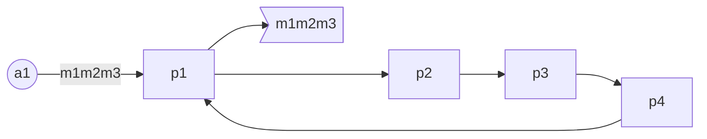
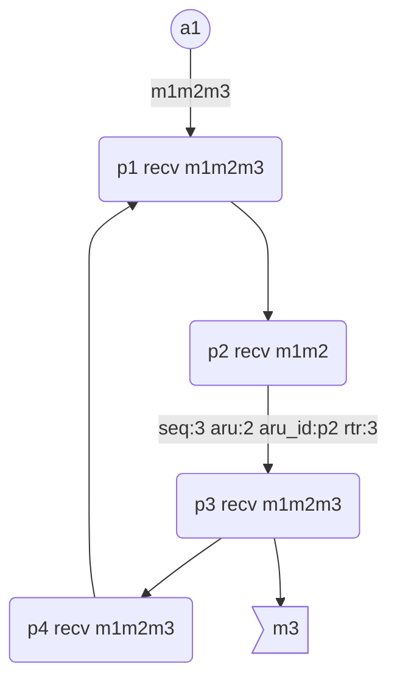
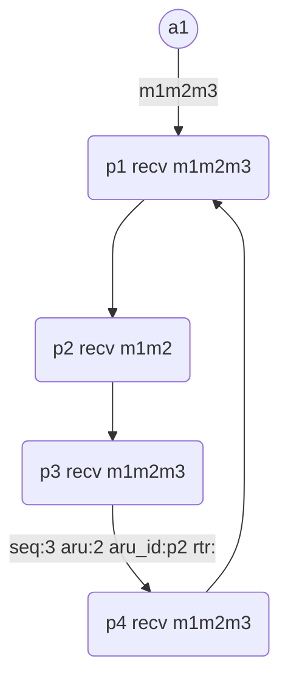
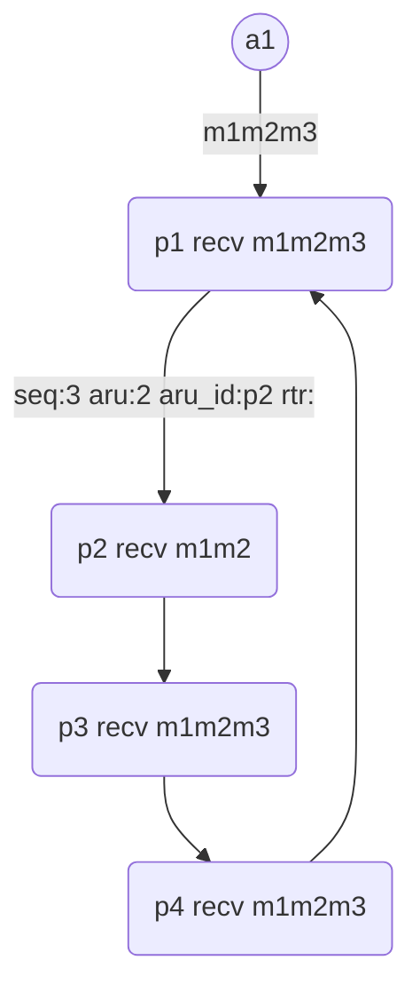

# totem协议详解

## 基本概念

### SRP: The Totem Single-Ring Ordering and Membership Protocol

- 基于以太网的组通信协议，节点间组成单环结构
- 所有数据都采用UDP广播(message)、单播(token)
- 消息的可靠性和有序性，基于token-passing实现
-  每个节点都接收到同样的消息序列，故可容忍消息丢失、节点崩溃

SRP有四种状态：

- Operational

  这个阶段是集群组建完成正常工作的状态，这个状态一个节点发送的消息其它节点都会全部有序提交给上层

- Gather

  这个阶段用于每个节点向外界广播自己的存在并收集其它节点的存在

- commit

   这个阶段会产生一个代表节点，该节点向其它所有节点收集信息，并将收集的信息传递给其它所有节点，用于后续阶段

- recovery

  这个阶段用于新旧集群交替时，旧集群成员用新集群传递旧集群的消息，使旧集群成员达到所有节点消息全部有序提交到上层

SRP细分为三个子协议：

- The Totem Ordering Protocol（OP）

  - 确保消息从Single-Ring中传播，到最终传递给Application时，满足Agreed Order或SafeOrder。

  - 工作在Operational状态
  - 确保消息从Single-Ring中传播，到最终传递给Application时，满足Agreed Order或SafeOrder。
  - 由Application在发送消息时，指定采用Agreed还是Safe方式。
  - 通过token，以“丢手绢”的方式，实现消息的有序传递。

- The Membership Protocol（MP）

  - 当有新的Processor加入或旧的Processor离开时，自动形成新的Single-Ring。
  - 工作在Gather、Commit状态

- The Recovery Protocol（RP）

  - 从Old Ring过渡到New Ring的过程中，恢复属于（残缺的）Old Ring的消息（使它们满足Agreed或SafeOrder）。
  - 工作在Gather、Commit状态

  recovery实现步骤如下：

  1. 与同属于相同的Old Ring的其它Processors交换消息（这个过程，与OP协议类似，不再详述），同一个New Ring中，可能有多个Old Ring并存；
  2. 把在本Processor的`Old Configuration`下，满足`Agreed`或Safe Order的消息直接delivery给`Application（message.seq<=high_ring_delivered）`；
  3. 向Application传递第一个ConfingChangeMsg，即Transitional Configuration。内含在New Ring中与本Processor同属于一个OldRing的成员列表。
  4. 把在本Processor的Transitional Configuration下，满足Agreed或Safe Order的消息delivery给Application（注意与Step2的区别）。

#### RRP: The Totem Redundant Ring Protocol

- 基于SRP，RRP嵌入于SRP的网络层（相当于修改了SRP的recv/send函数）
- 通过使用冗余网络把多个节点连接起来，可容忍网络的损坏

### 术语概念

- Processor

  节点，组通信成员，它需要实现SRP/RRP协议，并对外提供组通信接口，例如corosync，它提供组通信服务（叫CPG）。

- Application

  使用组通信服务的应用程序，它调用Processor提供的组通信接口。例如sheepdog就是调用corosync提供的CPG接口。

- Broadcast

  One Processor => all Processors

- Transmit/Forwardtoken

  OneProcessor => next Processor

- Delivery

  OneProcessor => associatedApplication

- Causal Order

  - 消息的传播是可靠的，即每一个结点都能收到该消息
  - 所有消息都有先后次序，不存在并发的情况
  - Processor将消息传送给Application时，严格按照消息的先后次序传送

- Agreed Order

  - 满足Causal Order
  - Processor在传送某个消息给Application时，必须确保该消息之前的所有消息都已经传送完毕，确保消息不会丢失

- Safe Order

  - 满足Agreed Order
  - Processor在传送某个消息给Application时，必须确保该消息之前的所有消息都已经被所有Processor接收

## 消息传播

如上图：

1. a1请求p1依次广播m1m2m3,这些消息暂存在p1的消息队列中；
2. 假设p1已拿到token，p1依次向集群依次广播：m1，m2，m3；
3. p1广播的消息也会保存在它自己的接收队列中；

如上图：

1. p2只收到m2m3,p3和p4收到m1m2m3；
2. p1把token传递给p2，token中记录了max seq:3;
3. p2通过比较token中的seq发现自己没有收到m3；

1. p2把token传递给p3，更新token的aru（all received up to）为2，在token的重传请求列表rtr中记录未收到的seq：3；
2. p3收到token后，向集群广播M3，清楚rtr后，将token传给p4；

1. p2收到p3的广播信息m3，其他节点忽略广播消息；
2. p4收到p3传过来的token，没做任何事情，把token传给p1；

1. p1收到p4传过来的token，没做任何事情，将token传给p2；
2. p2发现token中aru_id是自己，并且知道自己已经收到m3，p2更新token中的aru为3，至此p2知道所有的集群都收到了m3m2m1；
3. p2把更新后的token传给p3；

# reference

1. https://www.cnblogs.com/yuzhaoxin/p/4911679.html
1. https://its201.com/article/zancijun1666/83512038