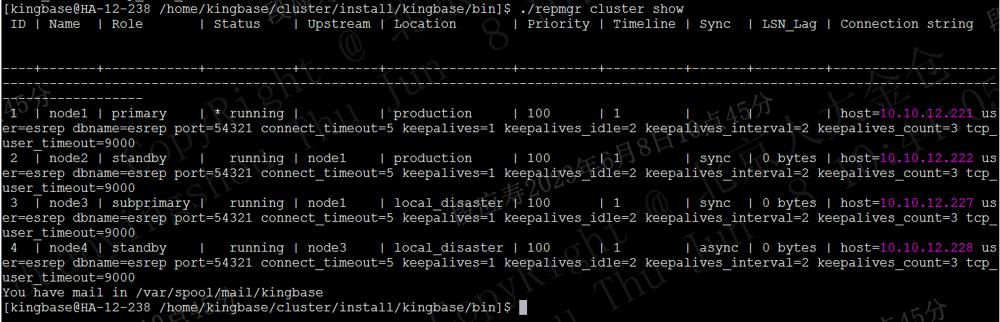
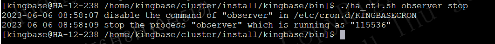
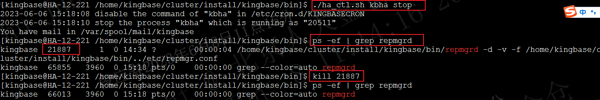
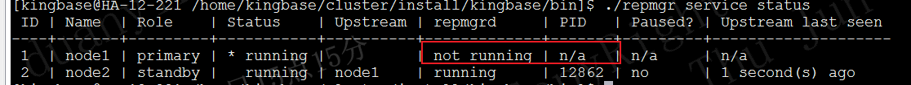
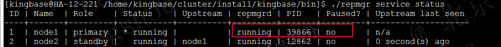
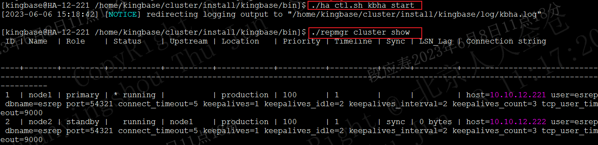
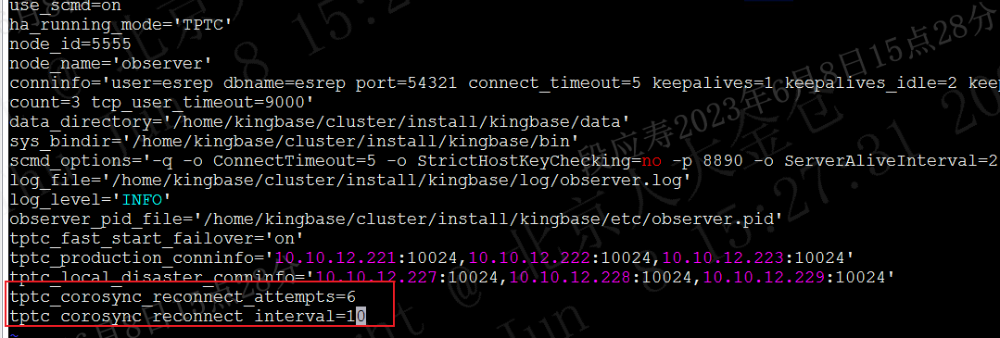
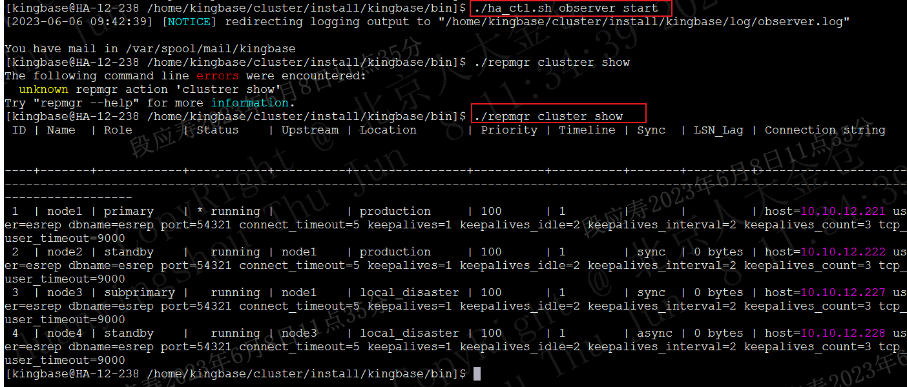

# <center>调整允许的corosync网络波动时间操作步骤</center>

| 编写人 | 编写内容     | 编写时间       |
| --- | -------- | ---------- |
| 段应寿 | 初稿       | 2023-06-08 |

调整允许的corosync网络波动时间仅需修改repmgr.conf配置文件，重启kbha和repmgrd进程，无需停止数据库，也不影响上层业务运行。按如下步骤修改配置并重启服务，经过本次修改重启后，允许的网络波动时间将从20秒增加到50秒。

## 停止observer，防止修改配置过程中触发跨中心切换

1. 在observer节点查看集群状态是否正常，保证集群状态正常的情况下进行后续操作；

在observer节点使用如下命令查看集群状态：

```shell
./repmgr cluster show
```


如上图所示，可以看到生产中心和灾备中心的信息均能查询到，其各节点状态均正常，此时可以进行后续步骤。


2. 停止observer；

使用如下命令停止observer，防止重启高可用服务时进行跨中心切换。

```shell
./ha_ctl.sh observer stop
```



## 修改生产中心配置，并重启kbha服务和repmgrd服务


### 在第一个节点上执行如下步骤

1. 登录机器节点修改配置文件，具体为修改etc/repmgr.conf文件；

将repmgr.conf文件中的如下内容：

```shell
reconnect_attempts=5
reconnect_interval=6
```

替换为

```shell
reconnect_attempts=6
reconnect_interval=10
```

```shell
vim etc/repmgr.conf
```


2. 停止kbha服务

使用如下命令停止kbha服务：

```shell
./ha_ctl.sh kbha stop
```
kbha 服务成功停止后，使用如下命令找到repmgrd的进程id，使用kill结束repmgrd进程。

```shell
ps -ef | grep repmgrd
kill pid
```
注意：非数据库节点没有repmgrd进程，则不需要结束repmgrd进程，仅重启kbha即可。



repmgrd停止后，使用如下命令确认repmgrd服务已停止。

```shell
./repmgr service status
```


3. 重启kbha服务

执行如下命令重启kbha。

```shell
./ha_ctl.sh kbha start
```
repmgrd进程无需手动重启，kbha会自动启动repmgrd进程。

使用如下命令确认repmgrd进程已启动，待repmgrd进程启动后再进行后续步骤。

```shell
./repmgr service status
```


如上图所示repmgrd状态为running，且有有效的pid时，表面repmgrd已正常启动。


kbha和repmgrd重启成功后，查看本中心集群状态，确保集群状态正常，且查询无警告或报错，再进行后续步骤。

```shell
./repmgr cluster show
```


### 对中心内的其他节点按顺序重复以上步骤

每个节点都需要修改配置并重启kbha服务，且其操作步骤与第一个节点操作步骤相同。

<font color="red">若集群查询有告警或报错，可以在重启后等待几秒，待集群内部状态稳定后再进行后续操作。</font>

## 修改灾备中心配置，并重启kbha服务和repmgrd服务

依次登录灾备中心的各个节点，执行和生产中心相同的步骤修改配置并重启kbha和repmgrd。

## 重启observer

待生产中心和灾备中心配置均修改完成后，修改observer配置并重启。

编辑repmgr.conf文件，修改如下配置参数：

```shell
tptc_corosync_reconnect_attempts=5
tptc_corosync_reconnect_interval=6
```
修改为：

```shell
tptc_corosync_reconnect_attempts=6
tptc_corosync_reconnect_interval=10
```



配置修改完成后，使用如下命令重启observer。

```shell
./ha_ctl.sh observer start
```



能正常查询到各中心集群信息，且各节点正常，则本次配置修改完成。