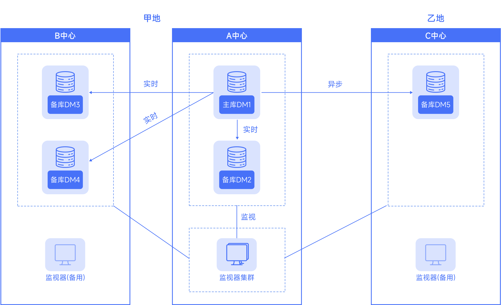
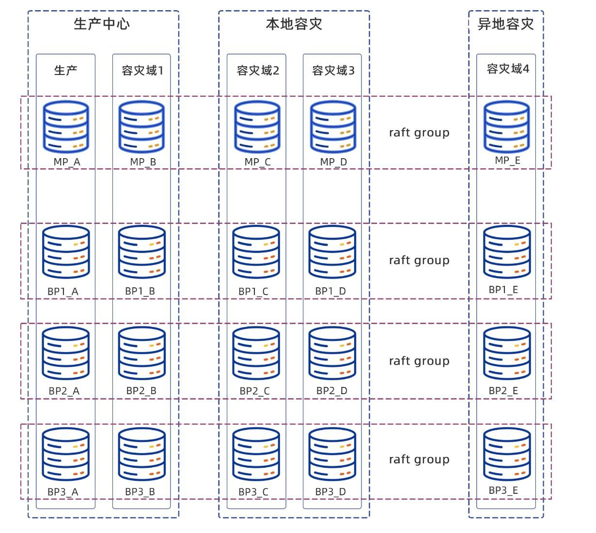
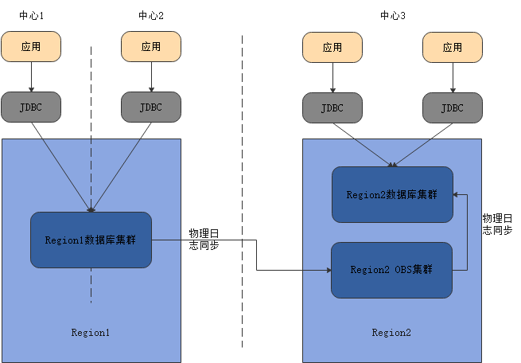
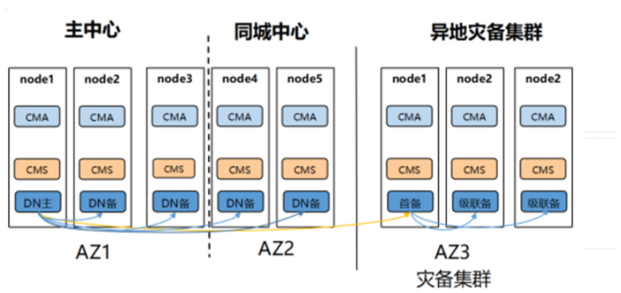
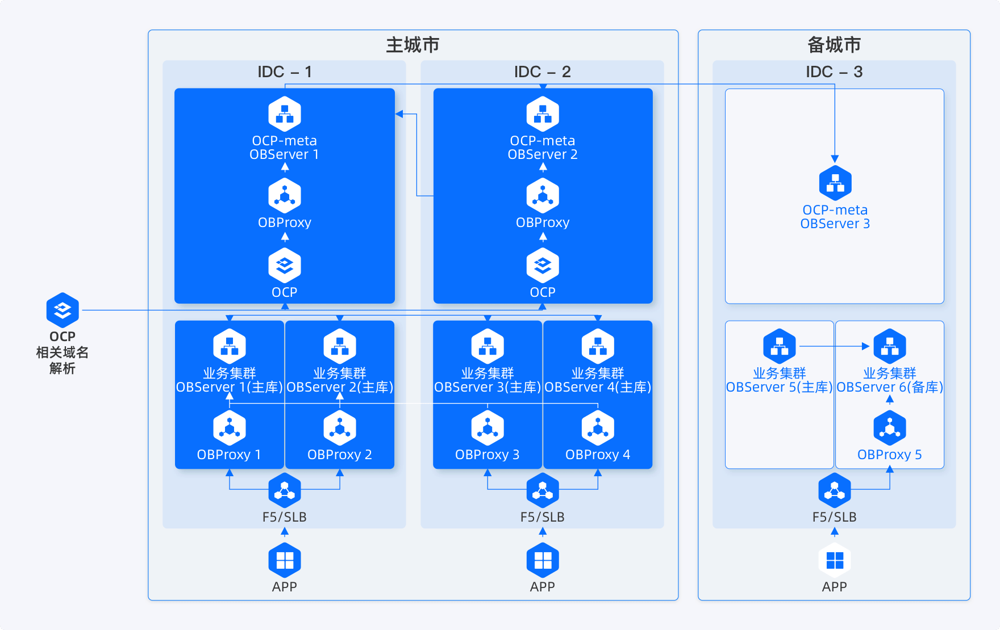
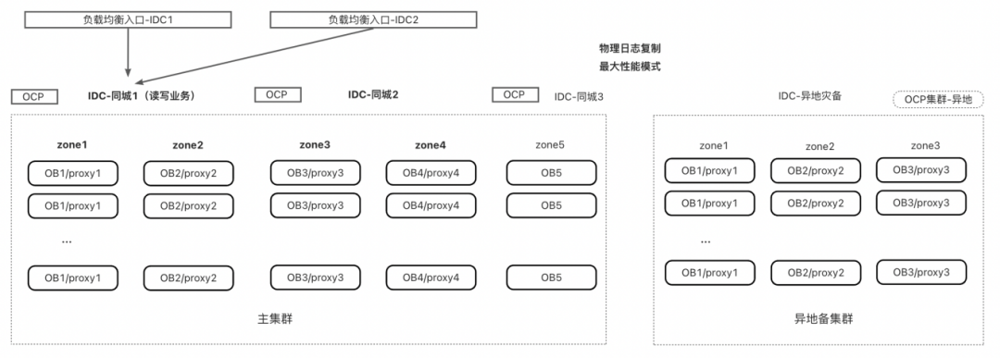

# 多地多中心方案调研

## 基本概念

"两地三中心"指代的是一种可以满足监管要求的容灾架构。两地是指同城、异地，三中心是指生产中心、同城容灾中心、异地容灾中心。同城双中心加异地灾备中心即“两地三中心”，这一方案兼具高可用性和灾难备份的能力。

多地多中心是指指企业或系统在多个地理位置（城市/区域）部署多个数据中心，每个数据中心都具备独立运行和服务的能力，同时整个系统还能实现协同工作、数据同步、高可用性。它是“两地三中心”的进一步扩展，适用于更大规模、更高可靠性要求的分布式系统场景。

- 多地
  - 指的是数据中心分布在不同的地理区域，如：北京、上海、深圳
  - 目的是提升抗灾能力，防止单一地区自然灾害或事故造成系统整体瘫痪。

- 多中心
  - 每个数据中心都可提供完整或部分服务

> 多地多中心 = 地理冗余 + 服务冗余 + 高可用性 + 数据一致性保障.

常见的多地多中心方案有三地三中心、三地五中心，当然有一些特殊的金融行业场景也会需要三地四中心。

### 三地三中心

三地三中心和两地三中心部署是很相似的，不过把三个机房分布在了三个城市，这样任何一个城市故障，都不会丢数据。

### 三地四中心

三地四中心是在两地三中心的基础上，再增加一个异地中心，这个中心往往仅用来同步数据，不参与切换。作为最后的数据容灾，在其他中心均无法恢复的时候临时启用。

### 三地五中心

三地五中心相比于三地三中心, 需要五个机房，把每个副本部署到不同的机房，进一步强化机房容灾能力。

### 多地多中心的实现方式

多地多中心一般有两种实现方式：

- 大集群方式

大集群方式是指所有节点都属于同一个分布式集群，采用分布式协议和多数派原则来进行服务。

中心间也采用分布式多数派的原则进行服务，这中方式意味着中心间天生支持自动恢复和自动fence。

大集群方式又根据是否支持动态跳转多数派分为两种：

    1. 固定多数派（如5节点最多支持故障2个节点，当第3个节点故障时，剩余节点将无法提供服务），比如达梦。
    2. 动态多数派 （如5节点支持故障2个节点故障后仍能提供服务，且在故障两个节点提供服务后，节点个数动态调整为3，支持继续故障一个节点仍能提供服务），比如oceanbase；

大集群的方式随着中心的增加，中心间的数据同步成本会增加。

- 小集群方式

小集群方式主要是指每个中心都是一个独立的集群，各个中心之间只是简单的主备关系，而不是分布式多数派的方式。
因而小集群的方式需要考虑实现中心间的多数派服务规则，以及需要补充实现中心间的自动fence和自动恢复功能。如金仓、opengauss流复制容灾。

下面针对各个厂商的多中心方案进行分析说明。

## 达梦

达梦共有三种架构的两地三中心方案：

- 基于主备集群
- 基于分布式集群
- 基于共享存储

### 基于主备集群技术的两地三中心解决方案

该方案能力如下：

1. 容灾能力达到《银行业信息系统灾难恢复管理规范》要求6级，RTO和RPO完全满足一类金融信息系统要求，生产中心内`RPO=0，RTO<10S`，同城灾备中心间`RPO=0、RTO<30s`，异地灾备中心`RPO=1~60s、RTO<60s`。

| 场景 | 故障处理 | RPO | RTO | 故障恢复 |
| --- | --- | --- | --- | --- |
| 生产中心主库故障 | 自动切换 | 0 | `<10s` | 归档连续：自动恢复，归档不连续：手动 |
| 生产中心备库故障 | 不切换 | 0 | ≈0s | 归档连续：自动恢复，归档不连续：手动 |
| 同城容灾备库故障 | 不切换 | 0 | \=0s | 归档连续：自动恢复，归档不连续：手动 |
| 异地容灾备库故障 | 不切换 | 0 | \=0s | 归档连续：自动恢复，归档不连续：手动 |
| 生产中心整体故障 | 手动切换 | 0 | `<30s` | 归档连续：自动恢复，归档不连续：手动 |
| 同城容灾中心故障 | 不切换 | 0 |` <15s` | 归档连续：自动恢复，归档不连续：手动 |
| 异地容灾中心故障 | 不切换， | 0 | \=0s | 归档连续：自动恢复，归档不连续：手动 |
| 生产中心和同城容灾中心同时故障 | 手动切换 | 1~60s | `<60s` | 手动 |
| 同城灾备切换 | 手动切换 | 0 | `<30s` | 手动 |
| 异地灾备切换 | 手动切换 | 0 | `重启耗时<4min；切换耗时<60s；整体耗时<5min` | 手动 |

可以看到该种方案下，不支持中心间自动切换，且仅支持主库故障后的中心内自动切换。

### 达梦分布式集群两地三中心解决方案

达梦的两地三中心是一个完整的分布式集群，中心间通过raft协议进行数据同步。

而且达梦的两地三中心内的所有节点就是一个raft group。

其架构如下：

一般是5节点集群，生产2个节点，同城两个节点，异地一个节点，组成一个大的raft集群。

#### 关键技术

1. 并行线程管理
2. 计算与存储分离
3. RAFT归档
4. 动态增删节点
5. 分布式事务一致性
6. 自动选举主库
7. 自动故障处理
8.  多副本影子库
9. 指定副本参与日志提交

#### 网络要求

##### 同城

容灾网络距离：< 100km ，裸光纤连接。
传输延迟：< 1ms （单向）。
网络真实带宽：大于业务的峰值写 IO 带宽。

##### 异地

容灾网络距离：无限制。
传输延迟：< 50ms （单向）。
网络真实带宽：大于业务的平均写 IO 带宽。

#### 硬件资源

1. cpu：最低16核
2. 内存： 最低64g
3. 磁盘： 最低1024g
4. 网卡： 最低千兆，建议万兆

#### RTO

1. 中心内`RPO=0，RTO<30s`;
2. 同城`RPO=0，RTO<60`;
3.` RPO<1分钟，RTO<10分钟`；

### 案例

暂未找到对外公布的有关达梦两地三中心的实际案例。

## opengauss

opengauss两地三中心架构分成两种：

- 两地三中心（分布式集群）
- 两地三中心流复制容灾（主备集群，异地中心级联复制）

### 两地三中心

两地三中心架构如下：

其主要特点如下所示：

- 组网特点： 两地三中心，每个AZ都保证至少有一个同步备，同时地点和中心数的增加，集群的可靠性能够达到最高
- 优势： 具备异地容灾能力，并且能够保证异地容灾数据不丢失，RPO=0，可靠性最强
- 劣势：异地距离较远，若在异地中心配置了同步备，可能会影响性能,成本较高
- 适用性： 适用于核心重要业务系统

### 两地三中心流容灾架构

opengauss两地三中心架构如下：

实际节点结构如下：

其功能如下：

- 灾备数据库实例升主允许丢失一定的数据，`RPO<=10`秒 ；灾备数据库实例处于normal态，灾备升主`RTO<=10`分钟，数据库实例处于degraded状态等叠加故障场景下，执行灾备数据库实例升主RTO一般在20分钟以内。

- 演练特性：计划内主备数据库实例倒换，无数据丢失`RPO=0，RTO<=20`分钟(包含主数据库实例降为灾备实例，灾备数据库实例升主两个流程)。

### 案例

1. [民生银行项目](https://www.hikunpeng.com/developer/techArticles/20240227-1)

无详细能力指标数据，仅有使用信息。

2. [中国移动在线营销服务中心](https://opengauss.org/zh/userPractice/carrier/chinamobileonline/)

无详细能力指标数据，仅有使用信息。

3. [中移动金融科技有限公司](https://opengauss.org/zh/userPractice/carrier/yidong2/)

无详细能力指标数据，仅有使用信息。

## oceanbase

### 三地五中心五副本

oecanbase典型的方案就是三地五中心五副本。5个副本是一个分布式的大集群。

其方案架构如下：

该架构特点如下：

- 三个城市，组成一个 5 副本的集群。
- 任何一个 IDC 或者城市的故障，依然构成多数派，可以确保 RPO=0。
- 由于 3 份以上副本才能构成多数派，但每个城市最多只有 2 份副本，为降低时延，城市 1 和城市 2 应该离得较近，以降低同步 Redo-Log 的时延。
- 为降低成本，城市 3 可以只部署日志型副本（只有日志）。

其RPO、RTO能力如下：

- RPO： 同城切换不丢数据，如果采用三地部署，可以做到异地切换不丢数据
- RTO： 不管是同城还是异地，只要是不丢数据的切换，都可以做到一分钟内完成。丢数据的切换也可以在数分钟之内完成。
- 多活：把不同Partition的leader分到不同的机房，可以实现双活或多活。
- 运维: 数据同步是数据库内置的功能，不依赖于数据库之外的设施，运维方便。

### oceanbase案例

1. 中国工商银行两地三中心城市级容灾

解决方案：搭建跨“两地三中心”的分布式集群，以“五副本 +主备”模式进行部署。

方案亮点：金融行业容灾标准5 级容灾，硬件成本大幅降低，服务器资源利用率75%

解决问题：实现数据库同城双活、异地 RPO=0。机房级容灾达到 `RPO=0，RTO<30s`， 即故障发生后，从IT系统宕机导致业务停顿到系统恢复至可以支持各部门的运作时间，少于30秒。 达到金融行业 5 级容灾标准，满足 7x24 小时服务要求。

2. 深圳农商银行

解决方案：两地三中心+仲裁站点 

   - 主集群：同城双机房和仲裁站点形成“2+2+1”五副本部署；

   - 备集群：异地同机房“1+1+1”三副本部署；备集群异步拉取主集群的物理日志，同时，开启日志压缩以节约异地带宽；

解决方案能力：
    - 机房内单节点故障`RPO=0，RTO<30S`，机房内切换；

    - 同城机房级别`RPO=0，RTO<30S`；

    - `异地(failover) RPO>0，RTO 分钟级`；

    - `异地(switchover) RPO=0，RTO 分钟级`

## 总结

两地三中心和多地多中心主要是根据金融行业的监管要求来制定，商业银行数据中心监管指引明确规定了商业银行数据中心的要求。

> 第七条 总资产规模一千亿元人民币以上且跨省设立分支机构的法人商业银行，及省级农村信用联合社应设立异地模式灾备中心，重要信息系统灾难恢复能力应达到《信息安全技术信息系统灾难恢复规范》中定义的灾难恢复等级第5级（含）以上；其他法人商业银行应设立同城模式灾备中心并实现数据异地备份，重要信息系统灾难恢复能力应达到《信息安全技术信息系统灾难恢复规范》中定义的灾难恢复等级第4级（含）以上。

最高等级为6级，监管里最高要求四级：

- 第四级不要求有远程备份，也不要求实时备份。(RPO数小时到一天，RTO数小时到两天)
- 第五级要求有远程备份和实时备份。(RPO小于30分钟，RTO数分钟到两天)
- 第六级要求数据零丢失，灾难自动切换(RPO = 0, RTO数分钟)

可以看到对于多地多中心方案来说，主要是以下几个方面：

1. 对于异地中心或者除了同城灾备中心之外，仅仅要求可以部署就行，不要求自动切换（不要求RTO和RPO为0）；
2. 对于RPO和RTO来说，应该优先保证RPO=0，而对于RTO来说，则可以在几分钟内；
3. 对于异地中心来说，不要求同步，也不要求自动切换；

而从opengauss和oceanbase的相关方案文档和介绍中来看，除了本身架构实现上本身属于分布式集群，并未着重强调跨中心的自动切换，尤其是自动切换到异地中心。自动切换一般仅要求切换到同城灾备中心。

# reference

1. https://eco.dameng.com/community/article/d756b06e7475a96b444518b34c5f7483
2. https://www.oceanbase.com/docs/enterprise-oceanbase-database-cn-10000000000354617
3. https://docs.opengauss.org/zh/docs/3.1.0/docs/Description/%E4%BC%81%E4%B8%9A%E7%BA%A7%E5%A2%9E%E5%BC%BA%E7%89%B9%E6%80%A7.html
4. https://open.oceanbase.com/blog/10900385
5. https://eco.dameng.com/community/article/baa090ec349573c29f4fe2d03bcadb90