# 选数据库的时候，我们究竟在选什么 —— 当基础能力都满足时，哪些维度让数据库"脱颖而出"

| 编写人 | 编写内容 | 编写时间 |
| --- | --- | --- |
| growdu | 初稿，从选型决策视角梳理数据库差异化的真正维度；轻源码、重架构 | 2026-09-01 |

> 本文是「PostgreSQL 系列」的视角篇 · 二。配套源码版本：PostgreSQL 18 dev（`~/cwork/postgresql`）。同系列前文：
>
> - [当我们在说"数据库"的时候，我们到底在说什么 —— 从用户的视角拆解 PostgreSQL 的能力与接口](./postgresql-user-capabilities/index.html)
> - [PostgreSQL 事务：一次 BEGIN 与 COMMIT 背后的双层世界](./postgresql-transaction-lifecycle/index.html)
> - [PostgreSQL MVCC：从一行 UPDATE 到 5 个 HeapTuple 的演化](./postgresql-mvcc/index.html)
> - [PostgreSQL 内存管理：从 shared_buffers 到内存上下文](./postgresql-memory-management/index.html)
> - [PostgreSQL 分区表：从一行 `PARTITION BY` 到路由热路径](./postgresql-partition-handling/index.html)

上一篇我们列了 PG 给你的 5 + 7 + 8 张清单——能存能取、能查能改、能事务能复制能扩展。但这其实是**所有数据库都能给到你的"地板能力"**。MySQL 能、Oracle 能、SQL Server 能、MongoDB 能（某种程度）、甚至 SQLite 都能。

那么问题来了——

> 当所有数据库都能做"基础动作"时，**为什么有的数据库就能脱颖而出，被百万人选择？**

答案藏在"地板之上"的 7 个维度里。本文的目的就是把这 7 个维度**讲透**——让你在下一次选型时，能问出正确的问题，而不是被销售演示里的"TPS 百万 / 毫秒延迟 / 千亿行"忽悠。

---

## 一、先想清楚：选数据库到底在选什么

### 1.1 一次真实选型会踩的坑

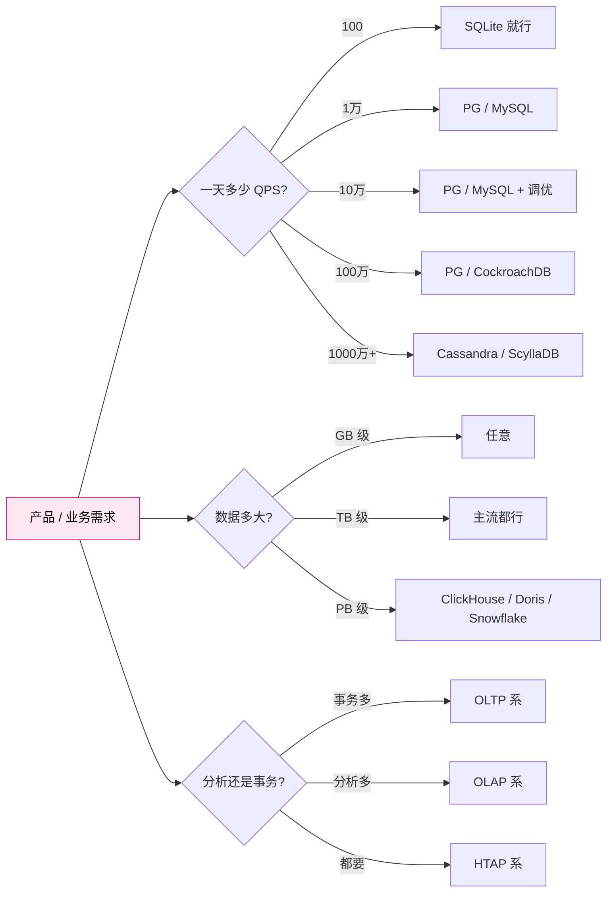
```mermaid
flowchart LR
  P[产品 / 业务需求]:::p --> Q1{一天多少 QPS?}
  Q1 -->|100| A1[SQLite 就行]
  Q1 -->|1万| A2[PG / MySQL]
  Q1 -->|10万| A3[PG / MySQL + 调优]
  Q1 -->|100万| A4[PG / CockroachDB]
  Q1 -->|1000万+| A5[Cassandra / ScyllaDB]

  P --> Q2{数据多大?}
  Q2 -->|GB 级| B1[任意]
  Q2 -->|TB 级| B2[主流都行]
  Q2 -->|PB 级| B3[ClickHouse / Doris / Snowflake]

  P --> Q3{分析还是事务?}
  Q3 -->|事务多| C1[OLTP 系]
  Q3 -->|分析多| C2[OLAP 系]
  Q3 -->|都要| C3[HTAP 系]

  classDef p fill:#fce7f3,stroke:#be185d,color:#000
```

**这是大多数人选型的真实过程**：先问"多大数据 / 多高 QPS"，再问"分析还是事务"。但这种问法**漏掉了真正决定长期走向的 7 个维度**。下面一一展开。

### 1.2 一个反直觉的事实：基础能力不是差异点

让我列一组"所有数据库都能给"的能力清单：

| 基础能力 | SQLite | MySQL | PG | Oracle | SQL Server | MongoDB | ClickHouse |
| --- | --- | --- | --- | --- | --- | --- | --- |
| DDL / DML / DQL | ✅ | ✅ | ✅ | ✅ | ✅ | ✅（MQL） | ✅ |
| 事务 | ✅ | ✅ | ✅ | ✅ | ✅ | ✅（4.0+） | ❌ |
| 索引 | ✅ | ✅ | ✅ | ✅ | ✅ | ✅ | ✅ |
| 复制 | ❌ | ✅ | ✅ | ✅ | ✅ | ✅ | ✅ |
| 备份 | 文件拷贝 | mysqldump | pg_dump | RMAN | SSMS | mongodump | clickhouse-backup |
| 权限 | ✅ | ✅ | ✅ | ✅ | ✅ | ✅ | ✅ |

你会发现：**任何一个进入"主流"的数据库，都把这 9 项做到 80 分以上**。差异不在这些"标配"上，而在**它们怎么做、做到什么代价**。

---

## 二、维度 1：架构模型 —— 单节点 vs 分布式

**这是最最最重要的维度**，但很多人忽略它。

### 2.1 三种基本架构

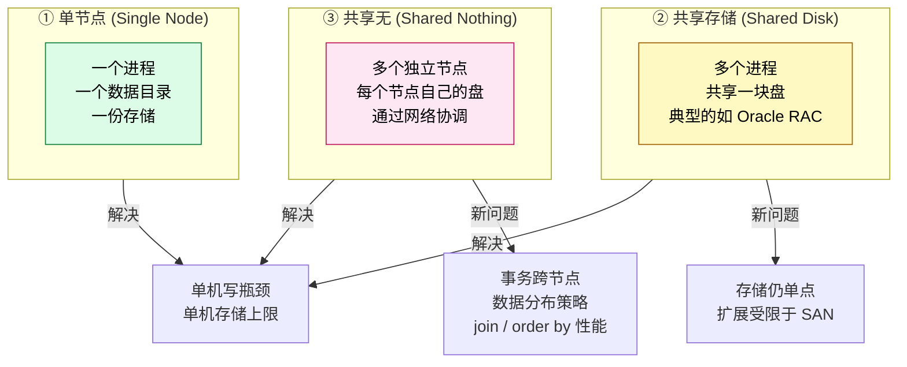
```mermaid
flowchart TB
  subgraph SN["① 单节点 (Single Node)"]
    SN1[一个进程<br/>一个数据目录<br/>一份存储]:::sn
  end

  subgraph SD["② 共享存储 (Shared Disk)"]
    SD1[多个进程<br/>共享一块盘<br/>典型的如 Oracle RAC]:::sd
  end

  subgraph SND["③ 共享无 (Shared Nothing)"]
    SND1[多个独立节点<br/>每个节点自己的盘<br/>通过网络协调]:::snd
  end

  SN -->|解决| R1[单机写瓶颈<br/>单机存储上限]
  SD -->|解决| R1
  SND -->|解决| R1

  SD -->|新问题| Q1[存储仍单点<br/>扩展受限于 SAN]
  SND -->|新问题| Q2[事务跨节点<br/>数据分布策略<br/>join / order by 性能]

  classDef sn fill:#dcfce7,stroke:#15803d,color:#000
  classDef sd fill:#fef9c3,stroke:#a16207,color:#000
  classDef snd fill:#fce7f3,stroke:#be185d,color:#000
```

**三种架构的取舍**：

| 架构 | 代表 | 优势 | 代价 |
| --- | --- | --- | --- |
| 单节点 | SQLite, MySQL, PG, Oracle, SQL Server | 强一致、事务简单、性能可预测 | 写扩展上限 ~ 几万 TPS，存储上限 ~ 单机磁盘 |
| 共享存储 | Oracle RAC, TiDB（早期）, Aurora | 多读多写、事务保留 | 存储仍单点，依赖 SAN，价格贵 |
| 共享无 | CockroachDB, Cassandra, MongoDB sharded, ClickHouse cluster | 横向扩展到 PB 级 | 跨节点事务慢、join 性能差、运维复杂 |

### 2.2 单节点数据库的"实际上限"

单节点 PG / MySQL 在生产环境能扛多少？粗略数据：

| 维度 | 现实上限 |
| --- | --- |
| 单实例写 QPS | 1 ~ 5 万（看表结构） |
| 单实例读 QPS | 5 ~ 50 万（取决于缓存） |
| 单库数据量 | 10 TB（生产推荐上限，物理上限是 PG 自己 32 TB / 单表） |
| 单表行数 | 50 亿（推荐上限，超过要分区） |
| 单实例连接数 | 1000（PG）/ 几万（MySQL，但线程模型不同） |

**超出这些上限，就是分布式数据库的领域**——而分布式带来的复杂度不是线性增长，是指数。

### 2.3 分布式数据库的两条技术路线

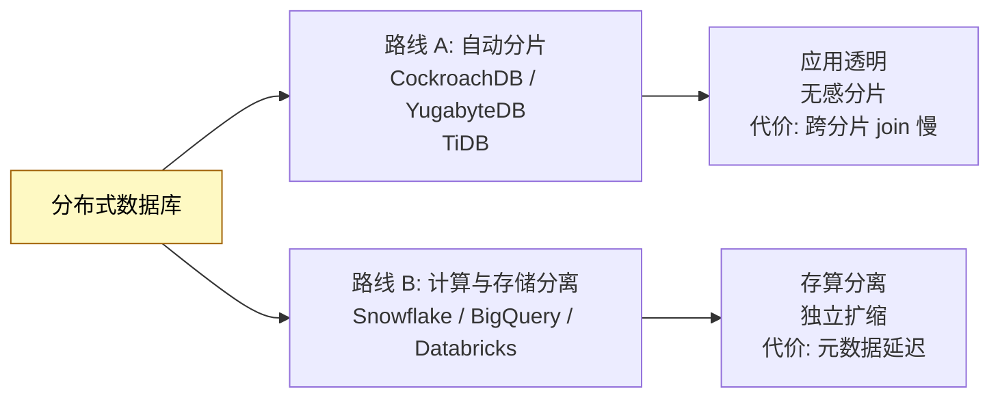
```mermaid
flowchart LR
  D[分布式数据库]:::d
  D --> P1[路线 A: 自动分片<br/>CockroachDB / YugabyteDB<br/>TiDB]
  D --> P2[路线 B: 计算与存储分离<br/>Snowflake / BigQuery / Databricks]

  P1 --> R1[应用透明<br/>无感分片<br/>代价: 跨分片 join 慢]
  P2 --> R2[存算分离<br/>独立扩缩<br/>代价: 元数据延迟]

  classDef d fill:#fef9c3,stroke:#a16207,color:#000
```

**路线 A** ——"看起来像 PG / MySQL 的分布式版本"：

- **代表**：CockroachDB（PG 协议）、TiDB（MySQL 协议）、YugabyteDB
- **优势**：应用代码几乎不用改，迁移成本低
- **代价**：跨分片 join 性能差（O(N²) 数据交换）、事务延迟高、运维模型与传统 DBA 不一致

**路线 B** ——"云数仓路线"：

- **代表**：Snowflake、BigQuery、Databricks SQL、Redshift
- **优势**：存算分离、各自扩展、PB 级分析秒级响应
- **代价**：写延迟较高（秒级）、不擅长 OLTP、按扫描字节收费

**PG 用户最常问的"什么时候该上 CockroachDB / TiDB"**：答案是**写 QPS 已经超过单 PG 实例的 50%（约 5 万）+ 数据量已经超过单 PG 实例的 80%（约 8 TB）+ 业务上明确不需要大量跨表 join**。否则，单 PG + 读写分离 + 分区表仍然是更划算的选择。

---

## 三、维度 2：存储引擎 —— 行存 vs 列存、BTree vs LSM

**存储引擎**决定了数据库的 I/O 模型，是 OLTP vs OLAP 分化的最底层原因。

### 3.1 行存 vs 列存的本质

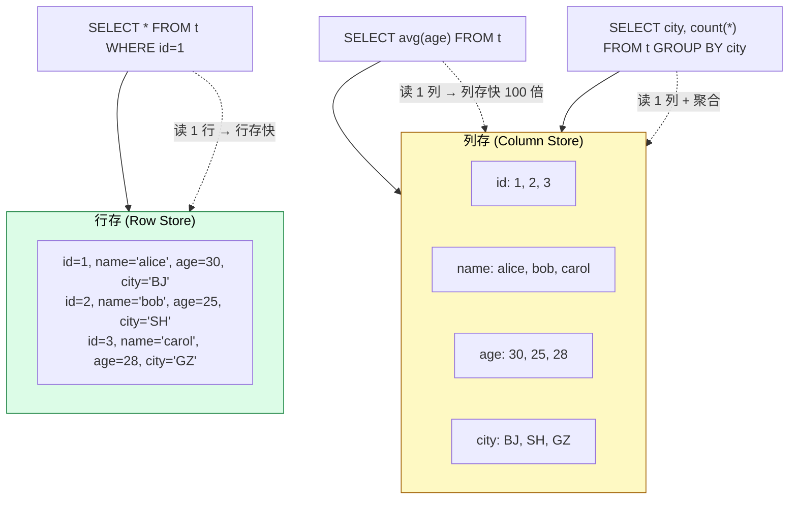
```mermaid
flowchart TB
  subgraph ROW["行存 (Row Store)"]
    R["id=1, name='alice', age=30, city='BJ'<br/>id=2, name='bob', age=25, city='SH'<br/>id=3, name='carol', age=28, city='GZ'"]
  end

  subgraph COL["列存 (Column Store)"]
    C1["id: 1, 2, 3"]
    C2["name: alice, bob, carol"]
    C3["age: 30, 25, 28"]
    C4["city: BJ, SH, GZ"]
  end

  Q1[SELECT * FROM t WHERE id=1] --> ROW
  Q1 -. "读 1 行 → 行存快" .-> ROW
  Q2["SELECT avg(age) FROM t"] --> COL
  Q2 -. "读 1 列 → 列存快 100 倍" .-> COL
  Q3["SELECT city, count(*) FROM t GROUP BY city"] --> COL
  Q3 -. "读 1 列 + 聚合" .-> COL

  classDef row fill:#dcfce7,stroke:#15803d,color:#000
  classDef col fill:#fef9c3,stroke:#a16207,color:#000
  class ROW row
  class COL col
```

**行存 vs 列存的真实数据**：

| 场景 | 行存 (PG / MySQL) | 列存 (ClickHouse / Snowflake) |
| --- | --- | --- |
| `SELECT * FROM t WHERE id=1` | 1 次 page read | 多次 column read，再 join |
| `SELECT avg(amount) FROM orders WHERE date BETWEEN ... AND ...` | 扫整表（即使只读 1 列） | 只读 amount 列，**快 100~1000 倍** |
| `INSERT INTO t VALUES (...)` | 1 次 page write | 多个 column store 各 write 1 次 |
| 单行 UPDATE | 原地改 | 多列文件都要改，慢 |

**结论**：**OLTP 选行存、OLAP 选列存**。想要一个数据库通吃？HTAP（见 §五）。

### 3.2 索引结构：BTree vs LSM

| 引擎 | 典型数据库 | 写入路径 | 读路径 | 优势 | 代价 |
| --- | --- | --- | --- | --- | --- |
| BTree | PG, MySQL, Oracle, SQL Server | 原地改 page | 单页二分查找 | 读快、范围扫描好 | 写放大、随机 I/O |
| LSM | Cassandra, ScyllaDB, RocksDB (TiKV) | 写内存 + 周期性 merge | 查多层 + merge | 写快、顺序 I/O | 读放大、压缩抖动 |
| Column | ClickHouse, DuckDB | 每个列独立文件 | 只读相关列 | 扫快、压缩比高 | 写较慢 |
| Heap | MongoDB | 文档整体 append | 索引 + 文档指针 | 灵活 schema | 没有强 schema 约束 |

**PG 用的是 BTree**（默认索引）—— 这意味着：

- ✅ PG 擅长**读多写少**的场景
- ⚠️ PG 不擅长**超高写入**场景（每秒几十万 INSERT 走 BTree 会卡）
- ❌ 想要**列存**做 OLAP，PG 得装 `citus_columnar` 插件或外接 ClickHouse

### 3.3 一句话总结存储引擎

> **存储引擎决定了数据库的"肌肉类型"**：BTree 像马拉松选手（持久稳定）、LSM 像短跑运动员（爆发强但抖动）、Column 像举重选手（一次性扛很多）。**没有最好，只有最合适**。

---

## 四、维度 3：一致性模型 —— 强一致 vs 最终一致

**CAP 三角**告诉你：**一致性 (C)、可用性 (A)、分区容忍 (P) 只能三选二**。

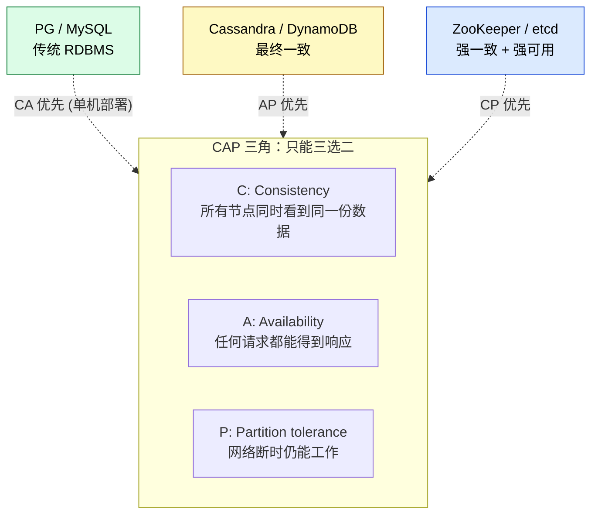
```mermaid
flowchart TB
  subgraph CAP["CAP 三角：只能三选二"]
    C["C: Consistency<br/>所有节点同时看到同一份数据"]
    A["A: Availability<br/>任何请求都能得到响应"]
    P["P: Partition tolerance<br/>网络断时仍能工作"]
  end

  PG[PG / MySQL<br/>传统 RDBMS]:::cp
  CD[Cassandra / DynamoDB<br/>最终一致]:::ap
  ZK[ZooKeeper / etcd<br/>强一致 + 强可用]:::ca

  PG -. "CA 优先 (单机部署)" .-> CAP
  CD -. "AP 优先" .-> CAP
  ZK -. "CP 优先" .-> CAP

  classDef cp fill:#dcfce7,stroke:#15803d,color:#000
  classDef ap fill:#fef9c3,stroke:#a16207,color:#000
  classDef ca fill:#dbeafe,stroke:#1d4ed8,color:#000
```

### 4.1 现实里数据库的一致性档位

| 档位 | 含义 | 代表 | 适用 |
| --- | --- | --- | --- |
| 严格可序列化 (Strict Serializable) | 等同单节点执行 | PG, MySQL (单节点), Oracle, Spanner | 金融、订单 |
| 可序列化 (Serializable) | 并发结果等同某顺序执行 | PG (`SERIALIZABLE`), CockroachDB | 抢票、库存 |
| 可重复读 (Repeatable Read) | 单事务内一致快照 | PG 默认, MySQL InnoDB 默认 | 大多数 OLTP |
| 读已提交 (Read Committed) | 读只看已 commit | PG / MySQL 默认 | 通用 OLTP |
| 快照隔离 (Snapshot Isolation) | 同可重复读 | 同上 | 同上 |
| 最终一致 (Eventually Consistent) | 异步复制后终会一致 | Cassandra, DynamoDB, MongoDB（默认） | 社交 feed、日志聚合 |

### 4.2 "一致性的真实代价"

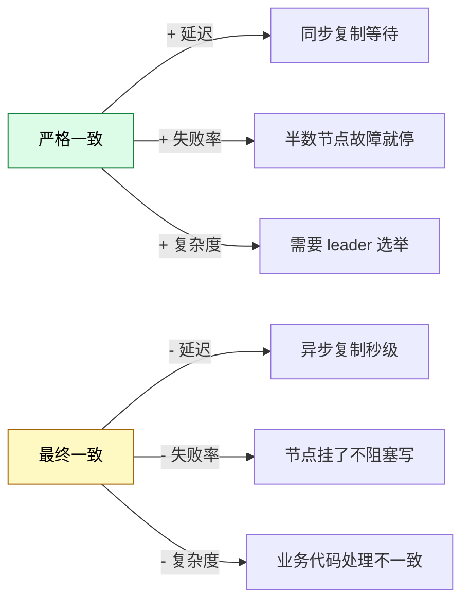
```mermaid
flowchart LR
  SC[严格一致]:::strict -->|+ 延迟| Q1[同步复制等待]
  SC -->|+ 失败率| Q2[半数节点故障就停]
  SC -->|+ 复杂度| Q3[需要 leader 选举]

  EC[最终一致]:::event -->|- 延迟| R1[异步复制秒级]
  EC -->|- 失败率| R2[节点挂了不阻塞写]
  EC -->|- 复杂度| R3[业务代码处理不一致]

  classDef strict fill:#dcfce7,stroke:#15803d,color:#000
  classDef event fill:#fef9c3,stroke:#a16207,color:#000
```

**一个朴素但关键的问题**：你的业务能不能容忍"看到旧数据 5 秒"？

- **能** → 最终一致的 Cassandra / MongoDB 没问题，省事省钱
- **不能** → 必须 PG / MySQL / CockroachDB（同步复制）

很多公司花大价钱上 CockroachDB / TiDB，结果发现业务根本用不到强一致——这是用大炮打蚊子。

### 4.3 真实案例：一致性错配的代价

**案例 A**：某电商公司在 MongoDB 上做订单系统，5% 的订单出现重复扣款——因为 MongoDB 4.0 之前不支持跨文档事务。

**案例 B**：某社交 App 在 Cassandra 上做点赞数统计，每天有几万条点赞丢失——最终一致性的代价。

**案例 C**：某金融机构用 Redis 做账户余额主存储，系统宕机后丢了几百万元数据——内存数据库不能保证持久性。

**反向案例**：某互联网公司用 PG 做消息推送记录，一年几亿条，从来没问题——因为业务可以容忍秒级延迟。

### 4.4 如何选择一致性级别

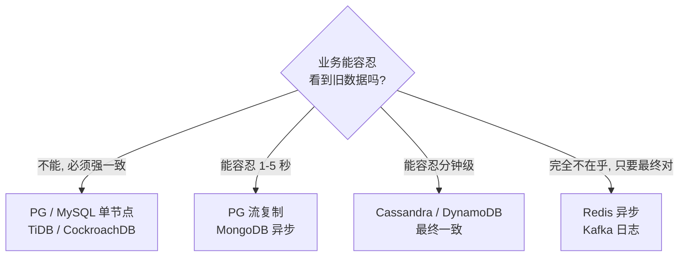
```mermaid
flowchart TB
  Q{业务能容忍<br/>看到旧数据吗?}
  Q -->|不能, 必须强一致| A1[PG / MySQL 单节点<br/>TiDB / CockroachDB]
  Q -->|能容忍 1-5 秒| A2[PG 流复制<br/>MongoDB 异步]
  Q -->|能容忍分钟级| A3[Cassandra / DynamoDB<br/>最终一致]
  Q -->|完全不在乎, 只要最终对| A4[Redis 异步<br/>Kafka 日志]
```

**一个经验法则**：金融、订单、库存 = 强一致；社交 feed、日志聚合、点赞 = 最终一致；中间地带（用户资料、订单查询）= PG 流复制同步半秒延迟。

"。

---

## 五、维度 4：优化目标 —— OLTP vs OLAP vs HTAP

**这一维度决定了数据库"是谁的菜"**——业务系统、数据分析系统、还是两者都要。

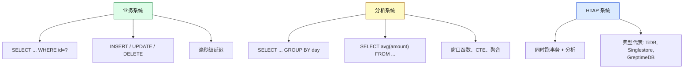
```mermaid
flowchart TB
  T[业务系统]:::oltp
  T --> Q1["SELECT ... WHERE id=?"]
  T --> Q2["INSERT / UPDATE / DELETE"]
  T --> Q3[毫秒级延迟]

  A[分析系统]:::olap
  A --> Q4["SELECT ... GROUP BY day"]
  A --> Q5["SELECT avg(amount) FROM ..."]
  A --> Q6["窗口函数、CTE、聚合"]

  H[HTAP 系统]:::htap
  H --> Q7[同时跑事务 + 分析]
  H --> Q8["典型代表: TiDB, Singlestore,<br/>GreptimeDB"]

  classDef oltp fill:#dcfce7,stroke:#15803d,color:#000
  classDef olap fill:#fef9c3,stroke:#a16207,color:#000
  classDef htap fill:#dbeafe,stroke:#1d4ed8,color:#000
```

**真实数据：OLTP vs OLAP 的差异**：

| 指标 | OLTP (PG) | OLAP (ClickHouse) |
| --- | --- | --- |
| 单行 INSERT 延迟 | 0.5 ms | 10-50 ms |
| 1 亿行扫描（10 列只读 1 列） | 30 s | 0.3 s |
| 单实例最大 QPS | 5 万 写 / 50 万 读 | 1000+ 简单查询并发 |
| 单实例最大数据量 | 10 TB | 100+ PB |
| 索引数量 | 每表 5~10 个合理 | 越少越好（数据大，索引贵） |
| 压缩比 | ~2x | ~10x |

**HTAP 的本质**：把 OLTP 和 OLAP 跑在**同一份数据**上，**避免 ETL 链路**。但代价是：

- 同时承担两种 workload，资源争抢严重
- 通常 OLTP 性能不如纯 OLTP DB
- OLAP 性能不如纯 OLAP DB

**我的建议**：99% 的场景下**不要选 HTAP**。OLTP 数据 → ETL → OLAP 数仓更划算。HTAP 只在"实时报表 + 强一致"才有意义。

---

## 六、维度 5：生态、工具链、人才市场

**这是被严重低估的维度**——技术参数都差不多时，生态决定一切。

### 6.1 6 个数据库的"生态版图"

| 数据库 | 主流客户端 | 监控工具 | 备份工具 | DBA 招聘 | 学习曲线 |
| --- | --- | --- | --- | --- | --- |
| PostgreSQL | libpq / pgjdbc / psycopg / pgx | pgwatch2 / Datadog / 自带 pg_stat | pg_basebackup / pgbackrest / WAL-G | 中 | 中等 |
| MySQL | mysql client / connector/J | Percona / Datadog | mysqldump / xtrabackup / mysqlbinlog | 高 | 低 |
| Oracle | sqlplus / OCI / JDBC | OEM / CloudWatch | RMAN | 高 | 陡 |
| SQL Server | ssms / OLE DB | SQL Server Mgmt Studio | SSMS 备份 / AlwaysOn | 中（特定语言栈） | 中 |
| MongoDB | mongo shell / driver | Cloud Manager / Atlas | mongodump / Ops Manager | 高 | 低 |
| ClickHouse | HTTP / native | 自带 + 第三方 | clickhouse-backup | 中 | 中 |

### 6.2 生态的 4 个隐性指标

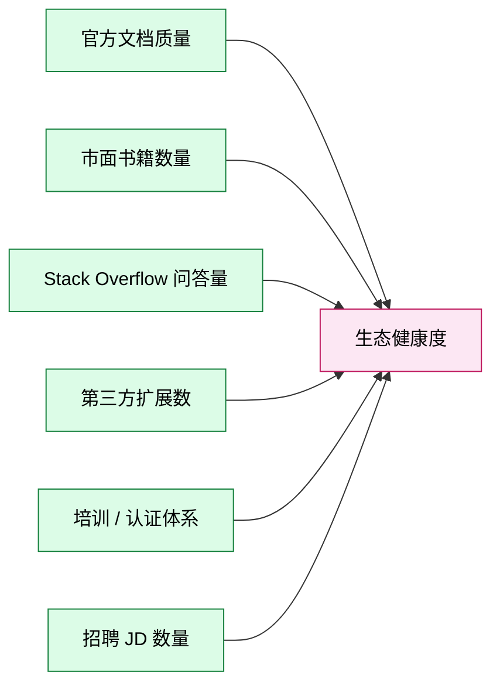
```mermaid
flowchart LR
  ECO[生态健康度]:::eco

  DOC[官方文档质量]:::ind --> ECO
  BOOK[市面书籍数量]:::ind --> ECO
  STK[Stack Overflow 问答量]:::ind --> ECO
  EXT[第三方扩展数]:::ind --> ECO
  TRN[培训 / 认证体系]:::ind --> ECO
  JOB[招聘 JD 数量]:::ind --> ECO

  classDef eco fill:#fce7f3,stroke:#be185d,color:#000
  classDef ind fill:#dcfce7,stroke:#15803d,color:#000
```

**为什么生态比性能重要**：

- 招不到 DBA → 性能再好也跑不起来
- 出问题搜不到答案 → 凌晨 3 点你独自 debug
- 升级路径不清晰 → 几年后被锁死
- 工具链不全 → 备份、监控、迁移全靠自己写

**PG 在生态上的现状**：

- ✅ 开源、协议友好（BSD）、社区活跃
- ✅ 文档质量顶级
- ✅ Stack Overflow 排名前 5
- ⚠️ DBA 招聘比 MySQL 难
- ✅ 扩展生态最丰富（PostGIS、pgvector、TimescaleDB、Citus...）

---

## 七、维度 6：商业模型与许可证

**这一维度决定了 3 年后你还在不在用这个数据库**。

### 7.1 主流数据库的许可证

| 数据库 | 许可证 | 商业公司 | 修改 + 商用风险 |
| --- | --- | --- | --- |
| PostgreSQL | PostgreSQL License (BSD-like) | 多个公司 / 社区 | 低 |
| MySQL (社区版) | GPL v2 | Oracle | 中（dual license） |
| MariaDB | GPL v2 | MariaDB Corp | 低 |
| MongoDB Community | SSPL (改用) | MongoDB Inc | **高**（禁止云厂商转售） |
| Cassandra | Apache 2.0 | 社区 / DataStax | 低 |
| ClickHouse | Apache 2.0 | ClickHouse Inc | 低 |
| Redis | 改用 SSPL + RSAL | Redis Inc | **高**（2024 起） |
| Oracle Database | 商业专属 | Oracle | 极高（年费） |
| SQL Server | 商业专属 | Microsoft | 高 |
| Snowflake | SaaS | Snowflake | N/A |
| TiDB | Apache 2.0 + 商业 | PingCAP | 低 |
| CockroachDB | BSL (改) → Apache 2.0 | Cockroach Labs | 中 |
| DuckDB | MIT | DuckDB Labs | 低 |

### 7.2 许可证的"长期影响"

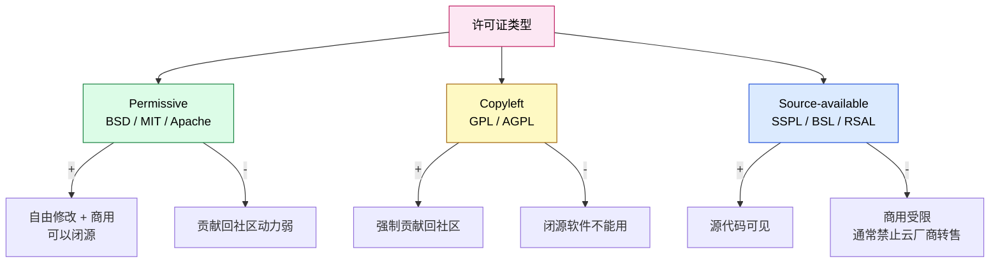
```mermaid
flowchart TB
  L[许可证类型]:::lic

  L --> P[Permissive<br/>BSD / MIT / Apache]:::permissive
  L --> C[Copyleft<br/>GPL / AGPL]:::copyleft
  L --> S[Source-available<br/>SSPL / BSL / RSAL]:::source

  P -->|+| P1[自由修改 + 商用<br/>可以闭源]
  P -->|-| P2[贡献回社区动力弱]

  C -->|+| C1[强制贡献回社区]
  C -->|-| C2[闭源软件不能用]

  S -->|+| S1[源代码可见]
  S -->|-| S2[商用受限<br/>通常禁止云厂商转售]

  classDef lic fill:#fce7f3,stroke:#be185d,color:#000
  classDef permissive fill:#dcfce7,stroke:#15803d,color:#000
  classDef copyleft fill:#fef9c3,stroke:#a16207,color:#000
  classDef source fill:#dbeafe,stroke:#1d4ed8,color:#000
```

**MongoDB 在 2018、Redis 在 2024 把许可证改成 SSPL**——核心动机是阻止 AWS / 阿里云 / 腾讯云等"白嫖"自家开源软件。这对企业用户意味着：**用 SSPL 数据库部署 SaaS 服务 = 违法**。

**3 个具体场景**：

| 场景 | 风险 |
| --- | --- |
| 自己公司内部用 PG / MySQL / MongoDB / Redis | 无风险（除了 SSPL 限制 SaaS） |
| 卖数据库服务 / 用数据库做云产品 | SSPL 不能用 |
| 把数据库代码嵌入自家闭源产品 | GPL / AGPL 不能用 |

---

## 八、维度 7：运维成本

**DBA 招不到 / 不会用 = 数据库等于没有**。这一维度直接决定 TCO（总拥有成本）。

### 8.1 运维成本的 6 个组成

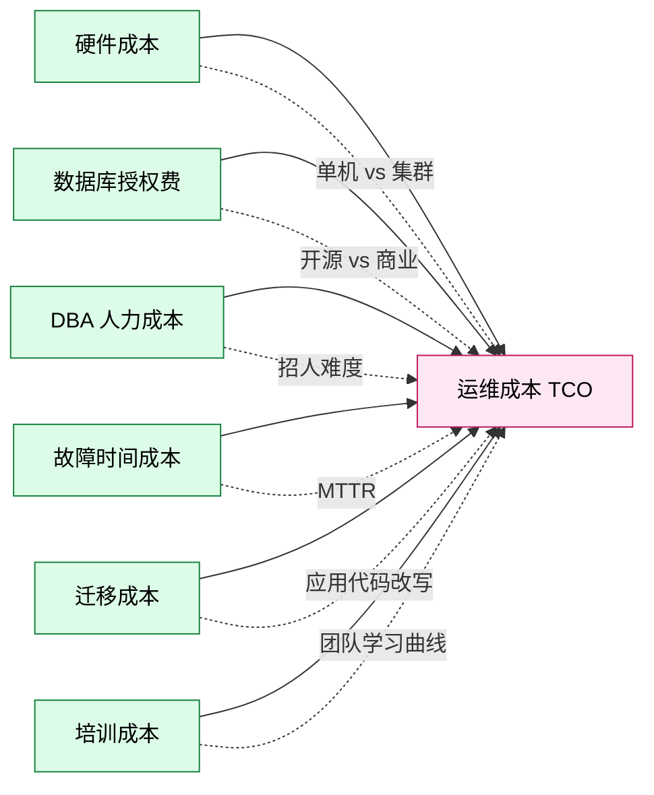
```mermaid
flowchart LR
  OP[运维成本 TCO]:::op

  OP1[硬件成本]:::comp --> OP
  OP2[数据库授权费]:::comp --> OP
  OP3[DBA 人力成本]:::comp --> OP
  OP4[故障时间成本]:::comp --> OP
  OP5[迁移成本]:::comp --> OP
  OP6[培训成本]:::comp --> OP

  OP1 -. 单机 vs 集群 .-> OP
  OP2 -. 开源 vs 商业 .-> OP
  OP3 -. 招人难度 .-> OP
  OP4 -. MTTR .-> OP
  OP5 -. 应用代码改写 .-> OP
  OP6 -. 团队学习曲线 .-> OP

  classDef op fill:#fce7f3,stroke:#be185d,color:#000
  classDef comp fill:#dcfce7,stroke:#15803d,color:#000
```

### 8.2 各数据库的运维成本对比（粗略）

| 维度 | PG | MySQL | Oracle | Cassandra | ClickHouse |
| --- | --- | --- | --- | --- | --- |
| 单实例运维复杂度 | 中 | 低 | 高 | 高 | 中 |
| 集群运维复杂度 | 中（PG 主从 / Citus） | 低（主从 / MGR） | 极高（RAC） | 高 | 中（replicated + sharded） |
| 升级复杂度 | 中（pg_upgrade） | 中（mysql_upgrade） | 高 | 中 | 中 |
| 故障诊断工具 | 多 | 多 | 商业工具 | 自带 | 自带 |
| DBA 招聘 | 中 | 高 | 高 | 低 | 低 |

**Oracle 的 TCO 真相**：年授权费 + 年支持费 = 数据库本身费用的 2~3 倍。一个 100 万的 Oracle 部署，5 年 TCO 约 500 万。**PG 的 TCO 基本只有硬件 + DBA 工资。

### 8.3 5 个被忽视的软成本

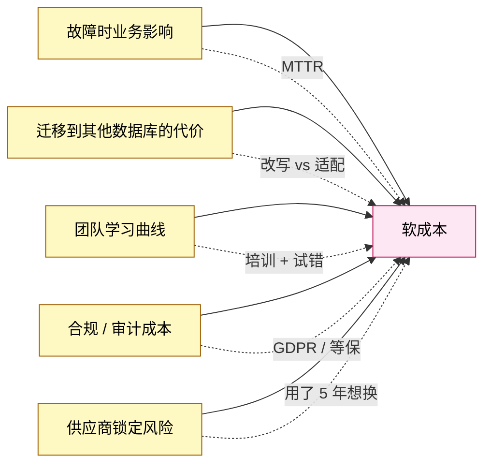
```mermaid
flowchart LR
  SC[软成本]:::sc

  S1[故障时业务影响]:::soft --> SC
  S2[迁移到其他数据库的代价]:::soft --> SC
  S3[团队学习曲线]:::soft --> SC
  S4[合规 / 审计成本]:::soft --> SC
  S5[供应商锁定风险]:::soft --> SC

  S1 -. MTTR .-> SC
  S2 -. 改写 vs 适配 .-> SC
  S3 -. 培训 + 试错 .-> SC
  S4 -. GDPR / 等保 .-> SC
  S5 -. 用了 5 年想换 .-> SC

  classDef sc fill:#fce7f3,stroke:#be185d,color:#000
  classDef soft fill:#fef9c3,stroke:#a16207,color:#000
```

**5 个软成本的具体数字**（基于行业经验）：

| 软成本 | 估算 |
| --- | --- |
| 故障时业务影响 | MTTR 每多 1 小时 = 损失 X 万（按业务计） |
| 数据库迁移 | 100 万源代码 → 改写 200 万 + 3 个月测试 |
| 团队学习曲线 | 新数据库 6 个月适应期 |
| 合规审计 | 商业 DB 自带工具，开源 DB 需自己搭 |
| 供应商锁定 | 用了 5 年想换，开源 PG / MySQL 比 Oracle 容易 10 倍 |

**结论**：选数据库时只算硬件 + 授权是新人思维。把 DBA、迁移、停机、合规都算上才是真正的 TCO。

**。

---

## 九、把 7 个维度串起来：选型决策树

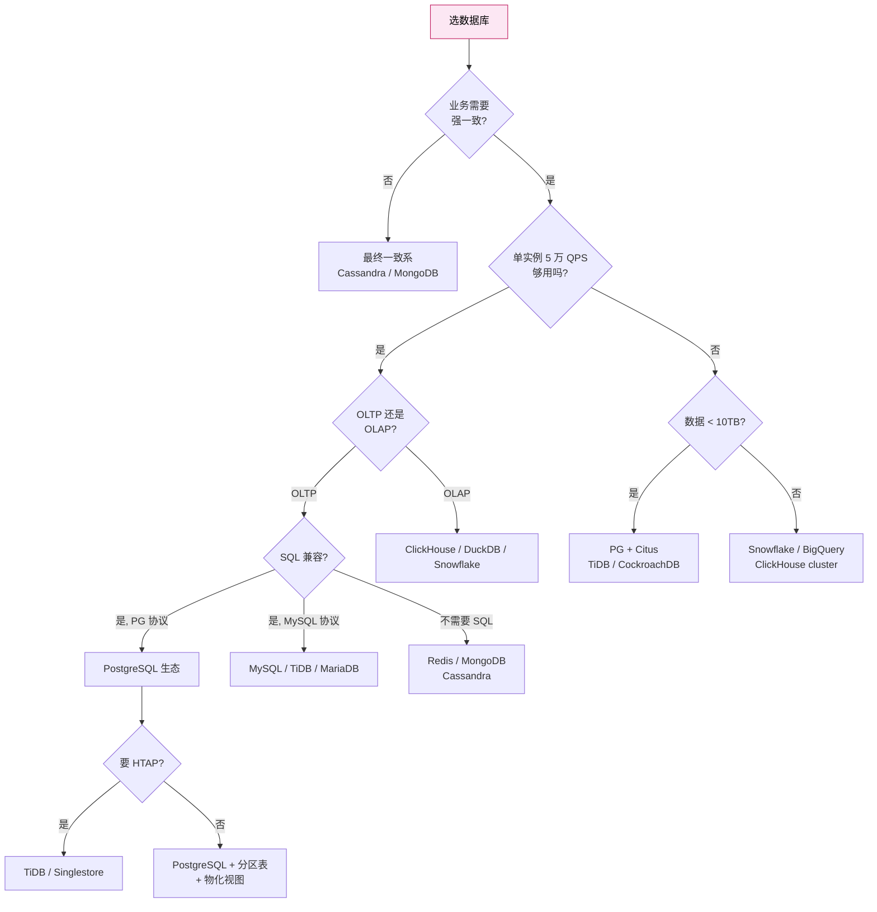
```mermaid
flowchart TB
  S[选数据库]:::start
  S --> Q1{业务需要<br/>强一致?}
  Q1 -->|否| BASE[最终一致系<br/>Cassandra / MongoDB]
  Q1 -->|是| Q2{单实例 5 万 QPS<br/>够用吗?}
  Q2 -->|是| Q3{OLTP 还是<br/>OLAP?}
  Q2 -->|否| Q4{数据 < 10TB?}
  Q3 -->|OLTP| Q5{SQL 兼容?}
  Q3 -->|OLAP| OLAP[ClickHouse / DuckDB / Snowflake]
  Q4 -->|是| SHARD[PG + Citus<br/>TiDB / CockroachDB]
  Q4 -->|否| PB[Snowflake / BigQuery<br/>ClickHouse cluster]
  Q5 -->|是, PG 协议| PG[PostgreSQL 生态]
  Q5 -->|是, MySQL 协议| MY[MySQL / TiDB / MariaDB]
  Q5 -->|不需要 SQL| NOSQL[Redis / MongoDB<br/>Cassandra]
  PG --> Q6{要 HTAP?}
  Q6 -->|是| HTAP[TiDB / Singlestore]
  Q6 -->|否| PGF[PostgreSQL + 分区表<br/>+ 物化视图]

  classDef start fill:#fce7f3,stroke:#be185d,color:#000
```

---

## 十、6 个常见数据库的"灵魂对比"

把市面上最常被选到的 6 个数据库按"差异化定位"对比：

| 数据库 | 一句话定位 | 擅长 | 不擅长 | 谁该选 |
| --- | --- | --- | --- | --- |
| **PostgreSQL** | "最强的开源 RDBMS" | 复杂 SQL、扩展生态、JSON/全文/向量 | 单机写扩展上限、超大规模分析 | 90% 业务的默认选项 |
| **MySQL** | "Web 时代的事实标准" | 简单 SQL、读多写少、主从复制 | 复杂查询、分析、JSON | 读多写少的 OLTP |
| **Oracle** | "商业 RDBMS 的天花板" | 强一致、性能极致、运维工具 | 价格、生态封闭 | 大型国企、金融、政府 |
| **SQL Server** | ".NET 时代的标配" | Windows 集成、BI 集成、SSRS | Linux / 跨云、成本 | .NET 生态企业 |
| **MongoDB** | "最流行的文档数据库" | 灵活 schema、快速迭代 | 强事务、跨文档 join | 快速变化的业务模型 |
| **ClickHouse** | "OLAP 之王" | 列存分析、PB 级扫描 | 事务、点查 | 日志、报表、ad-hoc 分析 |

### 10.1 PostgreSQL vs MySQL：永恒之争

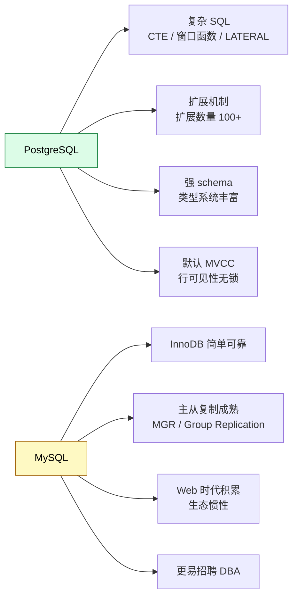
```mermaid
flowchart LR
  PG[PostgreSQL]:::pg --> P1[复杂 SQL<br/>CTE / 窗口函数 / LATERAL]
  PG --> P2[扩展机制<br/>扩展数量 100+]
  PG --> P3[强 schema<br/>类型系统丰富]
  PG --> P4[默认 MVCC<br/>行可见性无锁]

  MY[MySQL]:::my --> M1[InnoDB 简单可靠]
  MY --> M2[主从复制成熟<br/>MGR / Group Replication]
  MY --> M3[Web 时代积累<br/>生态惯性]
  MY --> M4[更易招聘 DBA]

  classDef pg fill:#dcfce7,stroke:#15803d,color:#000
  classDef my fill:#fef9c3,stroke:#a16207,color:#000
```

**选择规则**：

- 复杂业务逻辑、报表、JSON、向量 → **PG**
- 读多写少、Web 后端、DBA 资源少 → **MySQL**
- 不确定 → **PG**（能力上 PG 包含 MySQL 的子集）

---

## 十一、为什么"分布式"是真正的分水岭

**绝大多数选型失败，都不是因为"功能不行"，而是因为"低估了分布式的代价"**。

### 11.1 分布式带来的 5 个真实问题

| 问题 | 单节点 PG 不会遇到 | 分布式一定要解决 |
| --- | --- | --- |
| 跨节点 JOIN | 0 | 重写为多次单节点 + 应用层合并 |
| 跨节点事务 | 0 | 2PC / Percolator / Saga |
| 全局二级索引 | 自带 | 自己实现一致性同步 |
| 节点故障 | 0（重启就行） | leader 选举、副本切换 |
| 容量再平衡 | 0 | shard rebalance + 一致性维护 |

### 11.2 分布式数据库的"不可承受之轻"

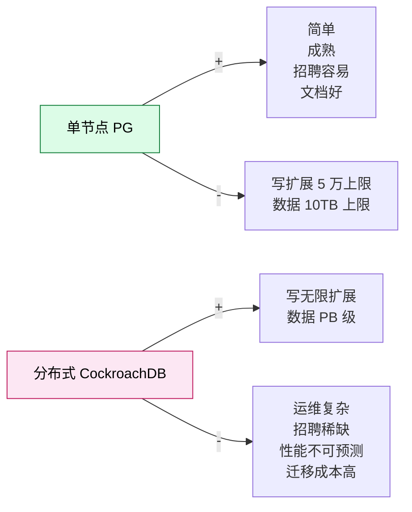
```mermaid
flowchart LR
  SI[单节点 PG]:::si
  DI[分布式 CockroachDB]:::di

  SI -->|+| SI1["简单<br/>成熟<br/>招聘容易<br/>文档好"]
  SI -->|-| SI2["写扩展 5 万上限<br/>数据 10TB 上限"]

  DI -->|+| DI1["写无限扩展<br/>数据 PB 级"]
  DI -->|-| DI2["运维复杂<br/>招聘稀缺<br/>性能不可预测<br/>迁移成本高"]

  classDef si fill:#dcfce7,stroke:#15803d,color:#000
  classDef di fill:#fce7f3,stroke:#be185d,color:#000
```

**我的建议**：**先用单节点 PG 走到单实例极限，再考虑分布式**。大多数公司永远不会到那个极限。

### 11.3 分布式的伪命题：很多场景根本不需要

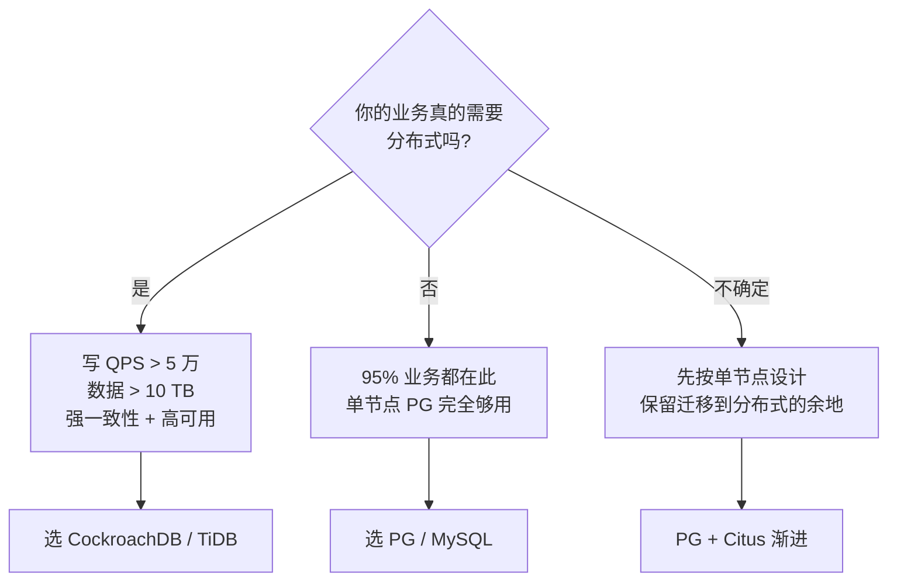
```mermaid
flowchart TB
  Q{你的业务真的需要<br/>分布式吗?}
  Q -->|是| A1[写 QPS > 5 万<br/>数据 > 10 TB<br/>强一致性 + 高可用]
  Q -->|否| A2[95% 业务都在此<br/>单节点 PG 完全够用]
  Q -->|不确定| A3[先按单节点设计<br/>保留迁移到分布式的余地]

  A1 --> D[选 CockroachDB / TiDB]
  A2 --> S[选 PG / MySQL]
  A3 --> P[PG + Citus 渐进]
```

**为什么 95% 的公司不需要分布式**：

- 真实写 QPS > 5 万的业务，国内只有 0.1% 的公司
- 数据 > 10 TB 的公司，99% 都是日志/事件，该用 ClickHouse 而不是分布式 RDBMS
- 强一致 + 高可用 + 大数据 = 成本极高（看看各家分布式 DB 的 license fee）

**Citus 渐进式扩展**：PG 官方扩展，把单节点 PG 变成 shared-nothing 集群，无须换数据库：

```sql
-- 在 PG 上装 Citus
CREATE EXTENSION citus;

-- 把表变成分布式
SELECT create_distributed_table('orders', 'customer_id');

-- 应用代码基本不改
SELECT count(*) FROM orders WHERE customer_id = 1;  -- 路由到对应节点
```

Citus 是单节点 PG → 分布式 PG 的最平滑路径。

---

## 十一·五、为什么 PostgreSQL 是全能型中等生的代表

| 维度 | PG 评分 | 行业领先者 |
| --- | --- | --- |
| 单节点 OLTP 性能 | 80 | Oracle 100（闭源硬件优化）/ MySQL 85（极简单查询快） |
| 复杂 SQL | 95 | Oracle 95（持平） |
| JSON / 文档 | 90 | MongoDB 95 |
| 全文搜索 | 85 | Elasticsearch 95 |
| 时序 | 80 | InfluxDB 95 |
| 地理信息 | 95 | PostGIS（PG 插件，行业第一） |
| 向量检索 | 80 | Milvus / Pinecone 95 |
| 列存 OLAP | 40 | ClickHouse 95 |
| 分布式扩展 | 70 | CockroachDB 85 |
| 生态完整度 | 85 | MySQL 90 |
| DBA 人才 | 70 | MySQL 95 |
| 开源 / 协议友好 | 100 | 不适用 |

**PG 是 6 个维度 80 分 + 2 个维度 90 分 + 4 个维度 70 分的数据库**——没有任何一项是绝对第一，但没有一项严重短板。这就是全能型中等生的本质。

**反例**：Oracle 在单节点性能、商业支持 95+ 分，但生态封闭 / 协议不友好 / TCO 高 —— 30 分短板。Cassandra 在分布式 / 写扩展 95 分，但事务 / 一致性 30 分 —— 也是短板。

**全能型数据库的优势**：技术栈统一。一个 PG 可以覆盖 80% 的业务（OLTP + JSON + 时序 + 全文 + 向量），剩下的 20% 用专用 OLAP（ClickHouse）+ 专用搜索（ES）+ 专用缓存（Redis）补足。这才是 5 个数据库搞定一切的真相，不是一个数据库搞定一切。

---


## 十二、为什么"OLAP 加速器"成为新热点

过去 5 年数据库领域最大的趋势：**专门做 OLAP 的列存数据库爆发**。代表：ClickHouse、DuckDB、Snowflake、Databricks。

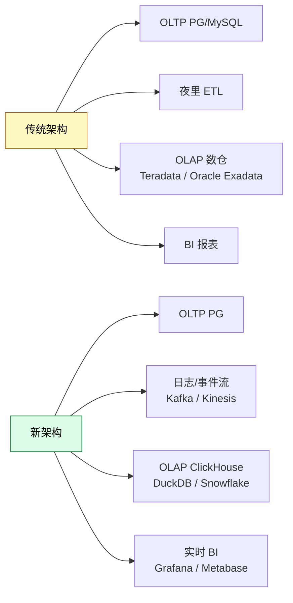
```mermaid
flowchart LR
  T[传统架构]:::old
  T --> A1[OLTP PG/MySQL]
  T --> A2[夜里 ETL]
  T --> A3[OLAP 数仓<br/>Teradata / Oracle Exadata]
  T --> A4[BI 报表]

  N[新架构]:::new
  N --> B1[OLTP PG]
  N --> B2[日志/事件流<br/>Kafka / Kinesis]
  N --> B3[OLAP ClickHouse<br/>DuckDB / Snowflake]
  N --> B4[实时 BI<br/>Grafana / Metabase]

  classDef old fill:#fef9c3,stroke:#a16207,color:#000
  classDef new fill:#dcfce7,stroke:#15803d,color:#000
```

**为什么 OLAP 数据库崛起**：

- 物联网 / 移动 App 让日志量暴增 100 倍
- 业务方要求"实时报表"（分钟级延迟），传统 ETL 太慢
- 列存压缩比高（10x），存储成本降 90%
- 算力成本降 90%，扫描 PB 数据不再是奢侈品

**ClickHouse / DuckDB / Snowflake 的差异**：

| 数据库 | 定位 | 优势 | 适用 |
| --- | --- | --- | --- |
| ClickHouse | 分布式列存 OLAP | 实时写入、高并发查询 | 日志、用户行为分析 |
| DuckDB | 嵌入式 OLAP | 单文件、SQL 完整、零运维 | 本地数据分析、数据科学 |
| Snowflake | 云数仓 SaaS | 存算分离、按需付费 | 企业 BI、ad-hoc 查询 |
| StarRocks / Doris | PG 协议的实时数仓 | PG 兼容、毫秒级延迟 | 实时大屏、用户画像 |

**PG 用户怎么接 OLAP**：

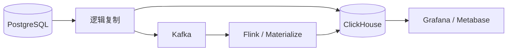
```mermaid
flowchart LR
  PG[(PostgreSQL)]:::pg --> CDC[逻辑复制]
  CDC --> CH[(ClickHouse)]
  CDC --> MQ[Kafka]
  MQ --> FLINK[Flink / Materialize]
  FLINK --> CH
  CH --> BI[Grafana / Metabase]
```

**两条常见路径**：

1. **PG → 逻辑复制 → ClickHouse**：5 分钟配置，立即查询
2. **PG → Kafka → Flink → ClickHouse**：复杂 ETL 场景

---

## 十二·五、近 5 年数据库领域 5 个明显的趋势

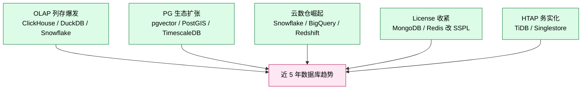
```mermaid
flowchart TB
  T[近 5 年数据库趋势]:::t

  T1[OLAP 列存爆发<br/>ClickHouse / DuckDB / Snowflake]:::trend --> T
  T2[PG 生态扩张<br/>pgvector / PostGIS / TimescaleDB]:::trend --> T
  T3[云数仓崛起<br/>Snowflake / BigQuery / Redshift]:::trend --> T
  T4[License 收紧<br/>MongoDB / Redis 改 SSPL]:::trend --> T
  T5[HTAP 务实化<br/>TiDB / Singlestore]:::trend --> T

  classDef t fill:#fce7f3,stroke:#be185d,color:#000
  classDef trend fill:#dcfce7,stroke:#15803d,color:#000
```

### 趋势 1：OLAP 列存爆发

**代表**：ClickHouse（2016 开源，2024 估值 $6B）、DuckDB（2019 开源，嵌入式 OLAP 之王）、Snowflake（市值峰值 $250B）。

**驱动因素**：

- 物联网 + 移动 App 产生 PB 级日志
- 业务方要实时报表，传统 ETL 跟不上
- 列存压缩比高 10x，存储成本降 90%

### 趋势 2：PG 生态扩张

**代表**：pgvector（向量检索）、PostGIS（地理信息）、TimescaleDB（时序）、Citus（分布式）。

**驱动因素**：PG 的扩展机制最友好——一个 SQL + 一个 Makefile 就能造一个新数据库。

**具体数字**：

- pgvector 在 GitHub 12k+ stars
- PostGIS 是开源地理信息事实标准
- TimescaleDB 把 PG 变成时序 DB（比 InfluxDB 强 SQL 兼容性）
- Citus 把 PG 变成分布式

### 趋势 3：云数仓崛起

**代表**：Snowflake、BigQuery、Databricks SQL、Redshift、阿里云 MaxCompute。

**核心特征**：存算分离、SaaS 化、按扫描字节付费。

**对传统数仓的冲击**：Teradata、Oracle Exadata、IBM Netezza 市场份额快速下滑。

### 趋势 4：License 收紧

**事件**：

- MongoDB 2018：从 AGPL 改 SSPL
- Redis 2024：从 BSD 改 SSPL + RSAL
- CockroachDB：从 BSL 改 Apache 2.0（反向操作）

**对用户的影响**：用 SSPL 数据库做 SaaS = 违法。

### 趋势 5：HTAP 务实化

**代表**：TiDB（PingCAP）、Singlestore（前 MemSQL）。

**真实用户**：相对 OLTP + OLAP 双 DB，HTAP 用户少得多。但在"实时大屏 + 强一致"场景有真实需求。

---

## 十三、回到选型：5 步走框架

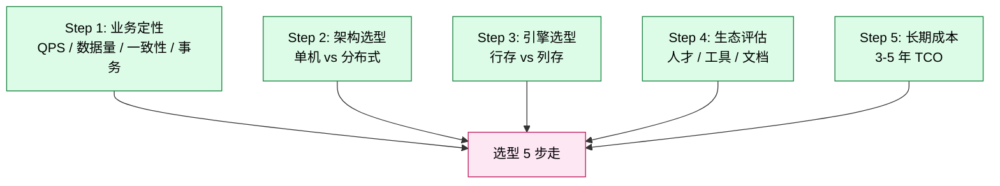
```mermaid
flowchart TB
  S[选型 5 步走]:::start

  S1[Step 1: 业务定性<br/>QPS / 数据量 / 一致性 / 事务]:::step --> S
  S2[Step 2: 架构选型<br/>单机 vs 分布式]:::step --> S
  S3[Step 3: 引擎选型<br/>行存 vs 列存]:::step --> S
  S4[Step 4: 生态评估<br/>人才 / 工具 / 文档]:::step --> S
  S5[Step 5: 长期成本<br/>3-5 年 TCO]:::step --> S

  classDef start fill:#fce7f3,stroke:#be185d,color:#000
  classDef step fill:#dcfce7,stroke:#15803d,color:#000
```

### 13.1 Step 1 —— 业务定性

回答 4 个问题：

1. **QPS 量级**：100？1 万？10 万？100 万？
2. **数据量级**：GB？TB？PB？
3. **一致性需求**：强一致？最终一致？
4. **事务复杂度**：简单 CRUD？复杂业务逻辑？

### 13.2 Step 2 —— 架构选型

| 量级 | 推荐架构 |
| --- | --- |
| 100 QPS / 1 GB | SQLite / 嵌入式 |
| 1 万 QPS / 100 GB | PG / MySQL 单实例 |
| 5 万 QPS / 1 TB | PG + 调优 / MySQL + 分库分表 |
| 10 万 QPS / 10 TB | PG + 读写分离 / TiDB / CockroachDB |
| 100 万 QPS / 100 TB | 分布式 DB + 分库分表 |
| 1000 万 QPS / PB | Cassandra + 专用架构 |

### 13.3 Step 3 —— 引擎选型

| 业务类型 | 推荐 |
| --- | --- |
| 通用 OLTP | PG / MySQL |
| 复杂 SQL 报表 | PG / Snowflake / BigQuery |
| 海量日志分析 | ClickHouse / Elasticsearch |
| 时序数据 | TimescaleDB / InfluxDB / TDengine |
| 文档存储 | MongoDB / FerretDB (PG 协议) |
| 缓存 | Redis / DragonflyDB |
| 向量检索 | pgvector / Milvus / Qdrant |

### 13.4 Step 4 —— 生态评估

5 个体检指标：

1. **DBA 招聘 JD 数量**：决定未来 3 年运维难度
2. **Stack Overflow 问答数**：决定凌晨 3 点能否搜到答案
3. **第三方工具支持**：决定备份 / 监控 / 迁移能否省力
4. **官方文档质量**：决定新人上手速度
5. **社区活跃度**：决定 3 年后还在不在维护

### 13.5 Step 5 —— 长期 TCO

3 年 TCO = 硬件 + 授权 + DBA × 3 + 故障 × 估时 + 迁移代价

| 维度 | 开源 PG | 商业 Oracle |
| --- | --- | --- |
| 硬件 | 50 万 | 50 万 |
| 授权 | 0 | 200 万 |
| DBA × 3 年 | 90 万（× 3 年） | 180 万（更稀缺） |
| 故障处理 | 中 | 低（OEM 工具） |
| 迁移成本 | 0（已经是目标） | 500 万（迁出去） |
| **总计** | **140 万** | **930 万** |

---

## 十四、3 个真实选型案例

### 14.1 案例 1：电商 OLTP

**业务**：日 1 亿订单，单库数据 5 TB，复杂促销逻辑。

**错选**：ClickHouse（不能做事务）
**错选**：MongoDB（事务弱）
**错选**：Oracle（成本）
**正确**：**PG + 分区表 + 读写分离 + Redis**。

```mermaid
flowchart LR
  APP[应用]:::app --> PG_M[(PG 主<br/>写)]
  APP --> PG_S1[(PG 从<br/>读)]
  APP --> PG_S2[(PG 从<br/>读)]
  PG_M -->|逻辑复制| PG_S1
  PG_M -->|逻辑复制| PG_S2
  APP --> REDIS[(Redis<br/>缓存/队列)]
```

### 14.2 案例 2：用户行为分析

**业务**：日 100 亿事件，查询"过去 7 天每个城市每小时的点击量"。

**错选**：PG（聚合太慢）
**正确**：**ClickHouse + Kafka**。

```mermaid
flowchart LR
  APP[应用/SDK]:::app --> KAFKA[(Kafka)]
  KAFKA --> CH[(ClickHouse<br/>Replicated)]
  CH --> BI[Grafana / Superset]
```

### 14.3 案例 3：AI 应用向量检索

**业务**：1000 万文档，向量相似度查询，要求 PG 兼容。

**错选**：Milvus（增加新数据库）
**正确**：**PG + pgvector 扩展**——一个 DB 两用。

```sql
CREATE EXTENSION pgvector;
CREATE TABLE docs (
  id bigserial PRIMARY KEY,
  embedding vector(1536)
);
CREATE INDEX docs_hnsw ON docs USING hnsw (embedding vector_cosine_ops);

-- 查询
SELECT id FROM docs ORDER BY embedding <=> $1 LIMIT 10;
```

---

## 十四·五、3 个真实的选型失败案例

### 失败案例 1：用分布式数据库解决单节点问题

某 SaaS 公司，业务 QPS 1 万（单 PG 完全够），但 CTO 听说分布式是趋势，就上了 CockroachDB。3 个月后：

- 应用代码改写 50%
- DBA 不熟悉 CockroachDB，故障排查靠官方文档
- 性能反而比单 PG 慢 30%
- License fee 是 PG 的 5 倍

**教训**：分布式是工具，不是潮流。

### 失败案例 2：用 OLTP 数据库做 OLAP

某零售公司，用 Oracle 做 BI 报表。每天扫 100 GB 数据：

- 报表查询跑 30 分钟
- 阻塞线上交易
- 月底报表出来慢 1 天

**正确做法**：Oracle 做 OLTP + ClickHouse 做 OLAP，ETL 用 `pg_dump` 或 `kafka`。

### 失败案例 3：用 MongoDB 做订单系统

某电商公司，初期业务快，flexible schema 吸引 CTO 用 MongoDB。3 个月后：

- 跨文档事务不支持
- 订单重复扣款率 2%
- 库存超卖
- 最后花 6 个月迁回 MySQL

**教训**：文档数据库不是 RDBMS 的替代品，是补充品。

---

## 十五、回到标题：选数据库到底在选什么

```mermaid
flowchart TB
  C[选数据库 = 选 7 个维度]:::title

  C --> D1[1. 架构模型<br/>单机 vs 分布式]:::dim
  C --> D2[2. 存储引擎<br/>行存 vs 列存]:::dim
  C --> D3[3. 一致性模型<br/>强 vs 最终]:::dim
  C --> D4[4. 优化目标<br/>OLTP vs OLAP vs HTAP]:::dim
  C --> D5[5. 生态<br/>人才 / 工具 / 文档]:::dim
  C --> D6[6. 许可证<br/>开源 vs 商业]:::dim
  C --> D7[7. 运维成本<br/>TCO / MTTR]:::dim

  classDef title fill:#fce7f3,stroke:#be185d,color:#000
  classDef dim fill:#dcfce7,stroke:#15803d,color:#000
```

**回答标题**：选数据库时，**选的不是"最快"或"最大"，而是"最匹配你的 7 个维度权衡"的那个**。

> **数据库没有银弹，只有最合适的权衡**。

回到开头那个朴素问题："为什么有的数据库能脱颖而出？"

答案是：

> **不是因为它"性能最强"或"功能最多"，而是因为它对某个特定场景的 7 个维度权衡，做出了最契合那个场景的选择**。

PostgreSQL 脱颖而出，是因为它在"功能完整 + 单机性能 + 强一致 + 开源 + 生态 + 扩展性" 这 6 个维度同时打 80 分——成为"全能型中等生"。

ClickHouse 脱颖而出，是因为它在"列存 OLAP + 实时写入 + 分布式" 这 3 个维度打 95 分——成为"OLAP 之王"。

Snowflake 脱颖而出，是因为它把"云数仓 + 存算分离 + 按需付费" 这 3 个维度组合到一个新形态——创造了"云数仓"品类。

**它们都选了不同的 7 维度组合，所以都成功了**。

---

PostgreSQL 脱颖而出

### 它们都选了不同的 7 维度组合，所以都成功了

```mermaid
flowchart TB
  A[PG: 6 个维度 80 分 + 2 个 90 分]:::pg --> R1[全能型中等生<br/>80% 业务默认选项]
  B[ClickHouse: 3 个维度 95 分]:::ch --> R2[OLAP 之王<br/>日志分析首选]
  C[Snowflake: 3 个维度新组合]:::sn --> R3[云数仓品类<br/>按需付费]
  D[Redis: 1 个维度 99 分]:::rd --> R4[内存缓存之王<br/>K-V 场景事实标准]

  classDef pg fill:#dcfce7,stroke:#15803d,color:#000
  classDef ch fill:#fef9c3,stroke:#a16207,color:#000
  classDef sn fill:#dbeafe,stroke:#1d4ed8,color:#000
  classDef rd fill:#fce7f3,stroke:#be185d,color:#000
```

---

## 十六、给读者的 3 个忠告

### 16.1 不要相信"TPS 百万"

任何数据库厂商给你看 "TPS 百万" 的 demo，都在**理想条件**下：

- 单行简单 INSERT
- 内存全装得下
- 无并发争抢
- 无持久化

**真实场景下打 1 折都算好的**。要问的是"在我的业务场景下，TPS 是多少"——做 POC 实测，别看 demo。

### 16.2 不要低估运维成本

**真实故事**：某创业公司选型时只看性能，上了 Cassandra。3 年后：

- 业务量没增长，但运维成本涨 3 倍
- DBA 全跑了（招不到新 DBA）
- 不得不花 200 万迁回 PG

**教训**：性能再好，DBA 招不到 = 数据库等于没有。

### 16.3 不要把"未来扩展性"当现在问题

**真实故事**：某公司当前数据 1 GB，但 CTO 说"我们要考虑未来 1 PB"，就上了 CockroachDB。3 年后：

- 业务还在 1 GB
- CockroachDB License fee 每年 50 万
- 单 PG 完全够用

**教训**：**先解决今天的问题，3 年后再解决 3 年后的问题**。数据库迁移比想象中容易——只要数据能用 pg_dump / mysqldump 出来。

---

## 十七、最后的最后：选数据库 = 选一种工程哲学

```mermaid
flowchart TB
  P[PostgreSQL]:::pg --> PHI[工程哲学:<br/>开放、扩展、用户自治]
  M[MySQL]:::my --> PHI2[工程哲学:<br/>简单、可靠、广泛使用]
  O[Oracle]:::or --> PHI3[工程哲学:<br/>极致、企业级、商业闭环]
  CH[ClickHouse]:::ch --> PHI4[工程哲学:<br/>单一目标做到极致]
  SN[Snowflake]:::sn --> PHI5[工程哲学:<br/>云原生、按需付费]

  PHI --> META[没有最好, 只有最合适]
  PHI2 --> META
  PHI3 --> META
  PHI4 --> META
  PHI5 --> META

  META --> YOU[你选哪个?]

  classDef pg fill:#dcfce7,stroke:#15803d,color:#000
  classDef my fill:#fef9c3,stroke:#a16207,color:#000
  classDef or fill:#fce7f3,stroke:#be185d,color:#000
  classDef ch fill:#dbeafe,stroke:#1d4ed8,color:#000
  classDef sn fill:#fef9c3,stroke:#a16207,color:#000
```

**每个数据库背后都是一种工程哲学**：

- PostgreSQL：开放、扩展、用户自治
- MySQL：简单、可靠、广泛使用
- Oracle：极致、企业级、商业闭环
- ClickHouse：单一目标做到极致
- Snowflake：云原生、按需付费

**你选的不是技术，是哲学**。

所以——回到标题问题——**选数据库到底在选什么**？

> **选的是一种你认为值得长期投入的工程哲学**。

5 年后你还在用哪个数据库，取决于 5 年前你信了哪种哲学。

---

## 十六、参考资料

### 同系列前文

- [当我们在说"数据库"的时候，我们到底在说什么 —— 从用户的视角拆解 PostgreSQL 的能力与接口](./postgresql-user-capabilities/index.html)
- [PostgreSQL 事务：一次 BEGIN 与 COMMIT 背后的双层世界](./postgresql-transaction-lifecycle/index.html)
- [PostgreSQL MVCC：从一行 UPDATE 到 5 个 HeapTuple 的演化](./postgresql-mvcc/index.html)
- [PostgreSQL 内存管理：从 shared_buffers 到内存上下文](./postgresql-memory-management/index.html)
- [PostgreSQL 分区表：从一行 `PARTITION BY` 到路由热路径](./postgresql-partition-handling/index.html)
- [PostgreSQL 逻辑复制表的生命周期：从 `pg_replication_slots` 到 `pg_subscription_rel`](./postgresql-logical-replication-tables-lifecycle/index.html)

### 推荐阅读

- **CAP 定理**：Eric Brewer, "Towards Robust Distributed Systems", 2000
- **分布式数据库**：Daniel Abadi, "The End of Architectural Era", 2007（HStore/C-Store 论文）
- **列存数据库**：Mike Stonebraker et al., "C-Store: A Column-oriented DBMS", 2005
- **HTAP**：TiDB / Singlestore 官方文档
- **许可证对比**：MariaDB Foundation / OSI / SSPL 官网

### 选型参考链接（截至 2026）

- DB-Engines Ranking: https://db-engines.com/en/ranking
- ClickHouse 官方文档：https://clickhouse.com/docs
- CockroachDB 文档：https://www.cockroachlabs.com/docs
- TiDB 文档：https://docs.pingcap.com
