# 为什么要对数据库进行细分：从 RDBMS 到 12 类专用数据库的全景图

| 编写人 | 编写内容 | 编写时间 |
| --- | --- | --- |
| growdu | 初稿，数据库细分全景：12 类专用数据库 + 各自代表 + 选型决策 | 2026-09-02 |

> 本文是「PostgreSQL 系列」的视角篇 · 三。配套源码版本：PostgreSQL 18 dev（`~/cwork/postgresql`）。同系列前文：
>
> - [当我们在说"数据库"的时候，我们到底在说什么 —— 从用户的视角拆解 PostgreSQL 的能力与接口](./postgresql-user-capabilities/index.html)
> - [选数据库的时候，我们究竟在选什么 —— 当基础能力都满足时，哪些维度让数据库"脱颖而出"](./database-selection-dimensions/index.html)

上一篇我们说：**所有数据库都能给"基础能力"——CRUD、事务、索引、复制**。那为什么我们还需要时序数据库、图数据库、文档数据库、向量数据库这一大堆"专用数据库"？

答案藏在一个朴素的观察里：

> **所有数据库都"能做"基础能力，但不是所有数据库都"做得好"特定场景**。

本文系统梳理当下 12 类数据库全景图：每一类为什么存在、典型代表是谁、什么场景该选、什么场景不该选。看完全文，你会有一张完整的"数据库地图"——未来遇到任何业务场景，都能在这张图上快速定位。

---

## 一、先想清楚：为什么数据库要细分

### 1.1 "一个数据库搞定一切"的失败史

```mermaid
flowchart LR
  1960[1960s: 层次 / 网状 DB<br/>IDS, IMS]:::old
  1970[1970s: 关系模型<br/>System R, Ingres]:::relational
  1980[1980s: 商业 RDBMS<br/>Oracle, DB2, SQL Server]:::relational
  1990[1990s: 对象 RDBMS<br/>失败]:::fail
  2000[2000s: 互联网催生<br/>MySQL, Memcached, Lucene]:::emerging
  2010[2010s: NoSQL 大爆发<br/>MongoDB, Cassandra, Redis]:::emerging
  2020[2020s: 专用化与 AI<br/>ClickHouse, DuckDB, pgvector]:::emerging

  1960 --> 1970 --> 1980 --> 1990 --> 2000 --> 2010 --> 2020

  classDef old fill:#fce7f3,stroke:#be185d,color:#000
  classDef relational fill:#dcfce7,stroke:#15803d,color:#000
  classDef fail fill:#fef9c3,stroke:#a16207,color:#000
  classDef emerging fill:#dbeafe,stroke:#1d4ed8,color:#000
```

1990 年代，**对象关系型数据库**（Object-Relational DB）曾经是"主流"——把面向对象和关系模型合二为一。但**全部失败了**（Oracle Objects、IBM DB2 UDB、Informix Universal Server...）。原因是：

- 对象模型 + 关系模型两套范式互相干扰
- 性能比纯 RDBMS 差，比纯 OODB 也差
- 用户不会同时写两套

**教训**：**所有"统一一切"的尝试都失败了**。真正成功的是**专用化**：每个数据库把一类问题做到极致。

### 1.2 细分的 3 个根本原因

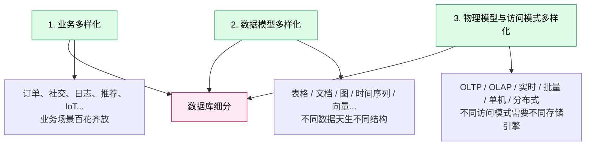

#### 原因 1：业务多样化

每个业务有自己的"灵魂数据结构"：

| 业务 | 灵魂数据结构 | 错选后果 |
| --- | --- | --- |
| 订单 | 关系强、有外键、需要事务 | 用 MongoDB → 跨文档事务丢失，订单重复扣款 |
| 社交 | 图结构（人-关系-人） | 用 RDBMS → 多表 join 慢到不可用 |
| 设备监控 | 时间序列 | 用 RDBMS → 索引膨胀，写入卡死 |
| 日志全文搜索 | 反向索引 + 分词 | 用 RDBMS → `LIKE '%xx%'` 全表扫 |
| 推荐系统 | 向量相似度 | 用 RDBMS → 1 亿向量两两算距离要算几年 |

#### 原因 2：数据模型多样化

**关系模型不是唯一真理**——它只是被关系代数（Edgar Codd, 1970）建立得很好的一种模型。但其他模型在特定场景下更自然：

| 模型 | 优势 | 弱项 |
| --- | --- | --- |
| 关系 (Table) | 强 schema、事务、SQL | 半结构化数据不灵活 |
| 文档 (JSON) | 灵活 schema | 跨文档事务弱 |
| 图 (Node/Edge) | 关系遍历快 | 大规模聚合弱 |
| 时间序列 (Time-stamped) | 高频写入、压缩 | 通用查询弱 |
| 向量 (Embedding) | 相似度检索 | 通用业务查询弱 |
| 键值 (Key-Value) | 极致简单、内存级延迟 | 不能 range scan |

#### 原因 3：物理模型与访问模式多样化

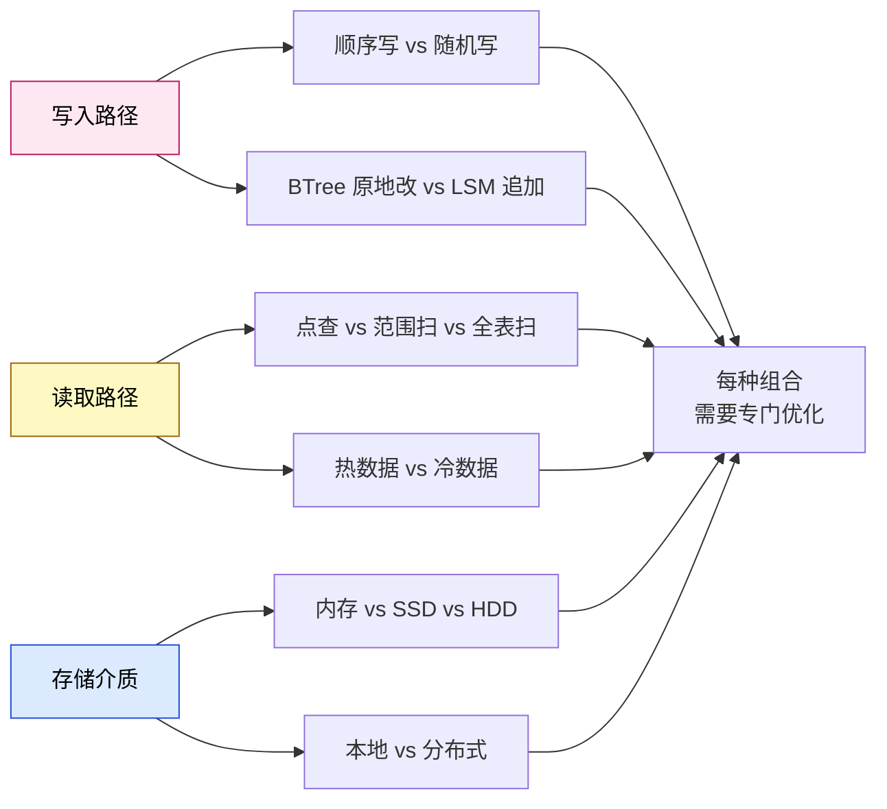

**反例**：PG 用 BTree 索引 + Heap 文件 + 行存 = OLTP 通杀。但**拿这个组合去跑 OLAP / 时序 / 向量检索，都不是最优**——所以出现专用数据库。

---

## 二、12 类数据库全景图

数据库类型到底有多少种？按数据模型 + 物理模型划分，目前有 12 大类：

```mermaid
flowchart TB
  DB[数据库全景 12 类]:::title

  DB1["1. RDBMS 关系型<br/>PG / MySQL / Oracle / SQL Server"]:::cat
  DB2["2. 时序 TSDB<br/>InfluxDB / TimescaleDB / TDengine / Prometheus"]:::cat
  DB3["3. 图数据库 Graph<br/>Neo4j / TigerGraph / JanusGraph / Memgraph"]:::cat
  DB4["4. 文档 Document<br/>MongoDB / Couchbase / FerretDB"]:::cat
  DB5["5. 键值 KV<br/>Redis / DynamoDB / etcd / LevelDB"]:::cat
  DB6["6. 列存 Column<br/>ClickHouse / DuckDB / Apache Druid"]:::cat
  DB7["7. 搜索引擎 Search<br/>Elasticsearch / OpenSearch / Meilisearch"]:::cat
  DB8["8. 向量 Vector<br/>Milvus / Qdrant / Weaviate / pgvector"]:::cat
  DB9["9. 嵌入式 Embedded<br/>SQLite / DuckDB / LevelDB / RocksDB"]:::cat
  DB10["10. 多模 Multi-model<br/>ArangoDB / CosmosDB / SurrealDB"]:::cat
  DB11["11. 地理 GIS<br/>PostGIS / MongoDB Geo / Neo4j Spatial"]:::cat
  DB12["12. 数据仓库 Data Warehouse<br/>Snowflake / BigQuery / Redshift / Doris"]:::cat

  DB --- DB1 & DB2 & DB3 & DB4 & DB5 & DB6 & DB7 & DB8 & DB9 & DB10 & DB11 & DB12

  classDef title fill:#fce7f3,stroke:#be185d,color:#000
  classDef cat fill:#dcfce7,stroke:#15803d,color:#000
```

下面**逐类详解**——为什么存在、典型代表、什么场景该选。

---

## 三、RDBMS：关系型数据库 —— 一切的基础

### 3.1 为什么存在

1970 年 Edgar Codd 提出关系模型，奠定了 SQL/ACID/事务三大基石。**这是数据库的"母语"**——所有其他数据库在某种程度上都在和 RDBMS 兼容或竞争。

### 3.2 典型代表

| 数据库 | 起源 | 优势 | 适用 |
| --- | --- | --- | --- |
| PostgreSQL | 1986 UCB | 功能最全、扩展最强、SQL 标准 | 90% 业务的默认选项 |
| MySQL | 1995 Sweden | 简单可靠、Web 生态成熟 | 读多写少 OLTP |
| Oracle | 1977 IBM→Larry Ellison | 极致性能、商业支持 | 大型金融、政府 |
| SQL Server | 1989 Microsoft | Windows 集成、BI 一体 | .NET 企业 |
| MariaDB | 2009 MySQL fork | MySQL 兼容 + 新特性 | MySQL 用户替代 |
| TiDB / CockroachDB | 2015/2015 | 分布式 SQL | 超大规模 OLTP |

### 3.3 核心能力

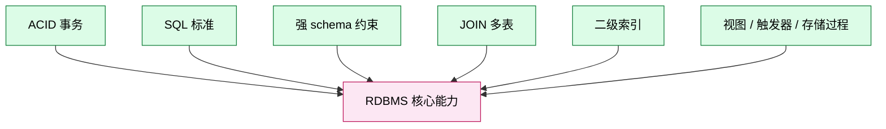

### 3.4 何时该选

- **强事务需求**：订单、库存、金融
- **复杂业务逻辑**：多表关联、嵌套查询
- **强数据一致性**：不能容忍脏读 / 幻读
- **标准 SQL 兼容**：BI 工具、ORM 友好

### 3.5 何时不该选

- **TB 级分析扫描**（选列存）
- **图遍历**（选图数据库）
- **时序高频写入**（选 TSDB）
- **灵活 schema**（选文档数据库）

---

## 四、TSDB：时序数据库 —— 设备监控与指标的世界

### 4.1 为什么存在

**时序数据**有独特的特征：

- 每条数据都有**时间戳**
- 写入是**追加为主**，很少更新
- 查询通常是"某段时间范围内某指标"
- 数据**冷热分明**：最新数据查询多，老数据几乎不查
- 数据量极大：单设备 1 Hz 采样 = 31M 行 / 年

RDBMS 应对这些特征**非常糟糕**：

- BTree 索引膨胀（每条数据一个索引项）
- 写入吞吐受限
- 旧数据清理靠 DELETE，锁表 + 碎片

**TSDB 的针对性优化**：

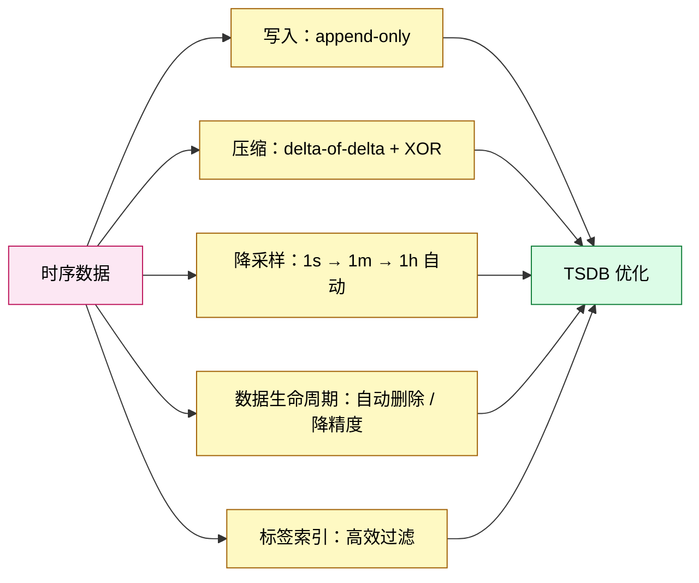

### 4.2 典型代表

| 数据库 | 起源 | 优势 | 适用 |
| --- | --- | --- | --- |
| InfluxDB | 2013 InfluxData | TSDB 标杆，类 SQL 语法 | 通用监控 |
| TimescaleDB | 2017 Timescale | **PG 扩展，SQL 兼容** | 想用 PG 又要 TSDB 性能 |
| TDengine | 2019 涛思 | 国人开发、极致压缩 | 国产化场景 |
| Prometheus | 2012 CNCF | 监控领域事实标准 | K8s / 微服务监控 |
| OpenTSDB | 2010 StumbleUpon | 基于 HBase | 大规模时序 |
| QuestDB | 2014 QuestDB | 高吞吐 SQL | 金融时序 |

### 4.3 TimescaleDB 与 InfluxDB 的对比

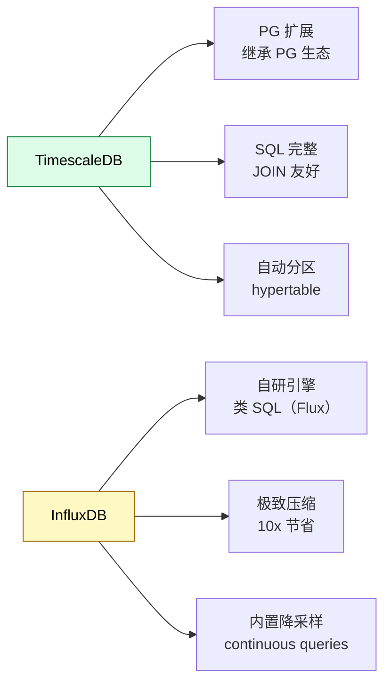

**选择规则**：

- 团队熟 PG、需要 JOIN → **TimescaleDB**
- 数据量极大、纯时序 → **InfluxDB / TDengine**
- K8s 监控 → **Prometheus**

### 4.4 何时该选

- 设备 / 服务器监控
- 金融行情、K 线
- IoT 传感器数据
- 应用指标（APM）

### 4.5 何时不该选

- 数据之间**强关联**（应该用 RDBMS）
- 业务**事务**复杂（应该用 RDBMS）
- 数据**非时间序列**（用错了）

---

## 五、Graph：图数据库 —— 关系的世界

### 5.1 为什么存在

**图数据**无处不在：

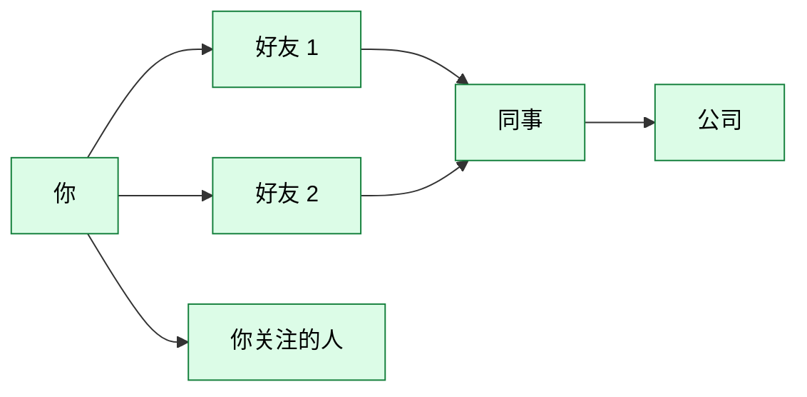

**6 度分隔理论**：地球上任何两个人，最多通过 6 个人就能联系上。这种**关系链查询**用 RDBMS 是噩梦：

```sql
-- "你好友的好友关注的人" 在 PG 里要 5-6 层 JOIN
WITH RECURSIVE ...
```

每跳一次都是 N² 数据量。社交网络几跳就崩。

**图数据库的核心**：**遍历**（traversal）操作复杂度只跟邻居数相关，**不跟全图规模相关**。

### 5.2 典型代表

| 数据库 | 起源 | 优势 | 适用 |
| --- | --- | --- | --- |
| Neo4j | 2007 Neo4j Inc | **图数据库标杆**，Cypher 查询语言 | 通用图查询 |
| TigerGraph | 2012 TigerGraph | 极致性能，企业级 | 超大规模图分析 |
| JanusGraph | 2017 Linux Foundation | 兼容 TinkerPop，开源 | 大数据图 |
| Memgraph | 2017 Memgraph | 内存级速度，Neo4j 兼容 | 实时图 |
| NebulaGraph | 2019 字节跳动 | 国产、PB 级 | 大规模图 |
| Amazon Neptune | 2018 AWS | 云原生、托管 | AWS 生态 |

### 5.3 图数据库的两大模型

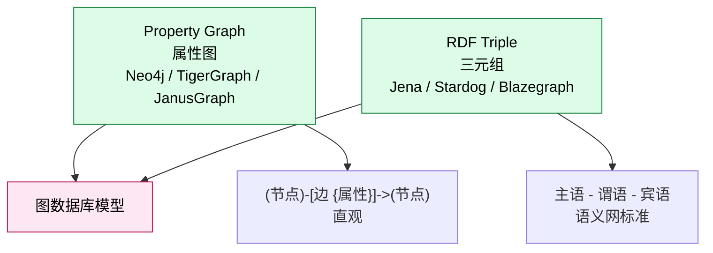

**属性图更适合 90% 业务图场景**。RDF 更适合知识图谱、语义搜索。

### 5.4 何时该选

- 社交网络、好友推荐
- 知识图谱、实体关系
- 欺诈检测（识别循环转账）
- 供应链关系
- 网络安全（攻击路径分析）

### 5.5 何时不该选

- 简单 CRUD（用 RDBMS）
- 数据是表格形状（用 RDBMS）
- 主要是聚合统计（用 OLAP）

---

## 六、Document：文档数据库 —— 灵活 schema 的世界

### 6.1 为什么存在

**业务需求变化快**，schema 经常改：

```json
{
  "user_id": 12345,
  "name": "Alice",
  "email": "alice@example.com",
  "preferences": {
    "theme": "dark",
    "language": "zh-CN",
    "notifications": {
      "email": true,
      "sms": false,
      "push": true
    }
  },
  "tags": ["vip", "early-adopter"],
  "login_history": [
    {"ip": "1.2.3.4", "ts": "2026-08-15T10:30:00Z"},
    {"ip": "5.6.7.8", "ts": "2026-08-16T14:20:00Z"}
  ]
}
```

这种**嵌套、半结构化数据**用 RDBMS 要么塞 JSON 字段（查询难）、要么拆 5 张表（应用代码复杂）。

**文档数据库**就是为这种数据而生——一个 JSON 文档就是一行。

### 6.2 典型代表

| 数据库 | 起源 | 优势 | 适用 |
| --- | --- | --- | --- |
| MongoDB | 2009 MongoDB Inc | 文档数据库标杆、生态最成熟 | 通用文档存储 |
| Couchbase | 2011 Couchbase | 内存级性能、SQL 兼容 | 实时查询 + 缓存 |
| FerretDB | 2022 FerretDB | **PG 协议**，跑 PG 上面 | 想用 PG 但要 MongoDB 灵活 |
| RavenDB | 2010 Hibernating Rhinos | .NET 生态 | .NET 企业 |
| Amazon DocumentDB | 2019 AWS | MongoDB 兼容、托管 | AWS 用户 |

### 6.3 文档数据库的两大误区

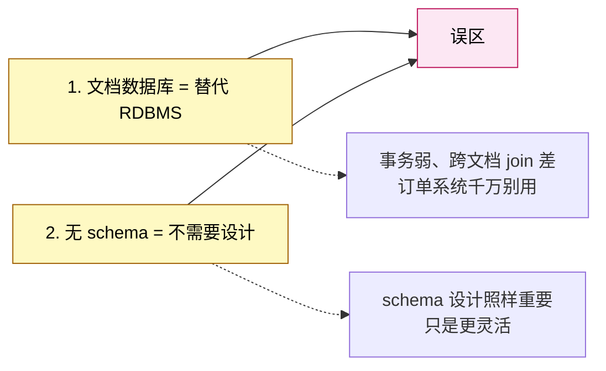

### 6.4 何时该选

- 半结构化数据（用户资料、产品目录、内容管理）
- schema 经常变化（创业初期）
- 文档级事务够用（不需要跨文档）
- 团队熟悉 JSON / JS

### 6.5 何时不该选

- **强事务、跨文档**（订单、金融）→ RDBMS
- **复杂聚合**（BI 报表）→ OLAP
- **图关系** → 图数据库

---

## 七、KV：键值数据库 —— 极简的极致

### 7.1 为什么存在

**键值（Key-Value）**是最简单、最快的数据模型：

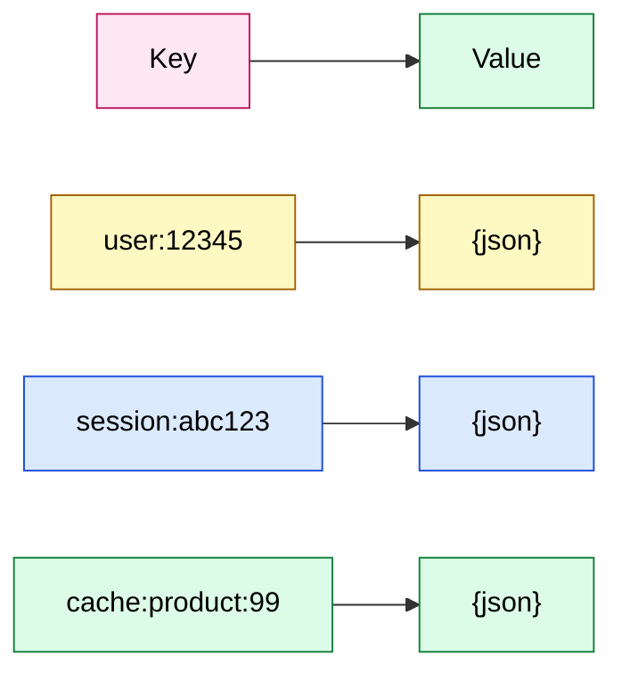

**复杂度只有 3 个操作**：`GET` / `SET` / `DEL`。其他都是花活。

### 7.2 典型代表

| 数据库 | 起源 | 优势 | 适用 |
| --- | --- | --- | --- |
| Redis | 2009 Salvatore Sanfilippo | **缓存之王**，丰富数据结构 | 缓存、队列、限流 |
| Memcached | 2003 LiveJournal | 极致简单、稳定 | 纯缓存 |
| DynamoDB | 2012 AWS | 云原生、自动扩缩 | AWS 用户 KV |
| etcd | 2013 CoreOS | **K8s 事实标准**，强一致 | 服务发现、配置中心 |
| LevelDB | 2011 Google | 嵌入式、轻量 | 嵌入式 KV |
| RocksDB | 2013 Facebook | LevelDB 升级版，LSM 引擎 | 嵌入式 KV 引擎 |
| TiKV | 2016 PingCAP | **分布式 KV**，Raft 一致性 | 分布式系统底座 |

### 7.3 Redis 的数据结构不只是 KV

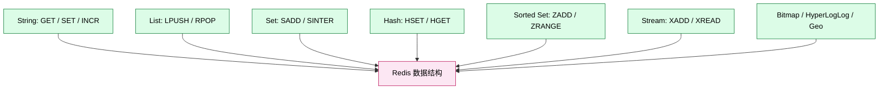

**Redis 是"KV 外壳，多结构内核"**——表面是 KV，实质是多结构内存数据库。

### 7.4 何时该选

- **缓存**（任何 RDBMS 都该有一个 Redis 配合）
- **会话存储**（session）
- **消息队列**（list / stream）
- **限流 / 计数器**（INCR）
- **分布式锁**（SET NX）
- **配置中心**（etcd）

### 7.5 何时不该选

- **需要事务** → RDBMS
- **需要范围查询**（KV 不擅长）→ RDBMS / 时序
- **需要持久化**（Redis 是内存的）→ RDBMS（虽然 Redis 也支持 RDB / AOF）

---

## 八、Column：列存数据库 —— 扫描的极致

### 8.1 为什么存在

RDBMS 用行存（Row Store）：每行的所有列存在一起。适合 OLTP（取整行）。

但 **OLAP 经常只关心少数几列**——"过去 7 天所有订单的金额总和" 只关心 `amount` 一列。

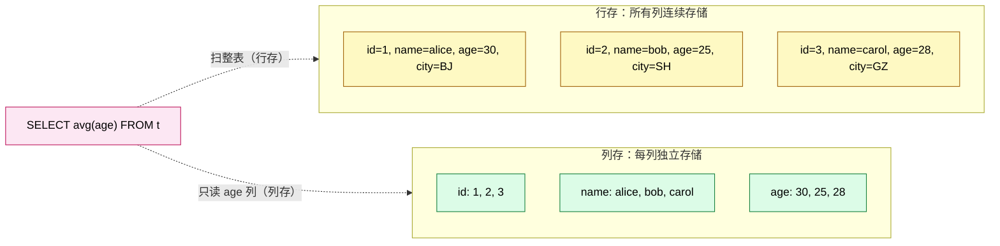

**真实性能差异**：扫描 1 亿行 10 列但只读 1 列，列存比行存**快 100-1000 倍**。

### 8.2 典型代表

| 数据库 | 起源 | 优势 | 适用 |
| --- | --- | --- | --- |
| ClickHouse | 2016 Yandex | **OLAP 之王**，极致压缩比 | 日志、用户行为、ad-hoc |
| DuckDB | 2019 CWI | **嵌入式 OLAP**，单文件 | 数据科学、本地分析 |
| Apache Druid | 2011 Metamarkets | 实时 OLAP | 实时大屏 |
| StarRocks | 2020 DorisDB fork | PG 协议、毫秒级延迟 | 实时数仓 |
| Apache Doris | 2017 百度 | PG/MySQL 协议 | 大数据 OLAP |
| MonetDB | 1992 CWI | 列存学术派 | 研究 |

### 8.3 列存的 4 个核心优化

| 优化 | 原理 | 收益 |
| --- | --- | --- |
| 向量化执行 | CPU SIMD 一次算一批值 | 5-10x |
| 压缩 | 同列数据相似，压缩比高 | 10x 节省 + 缓存友好 |
| 预聚合 | 物化视图 / rollup table | 减少扫描 |
| 索引稀疏化 | 跳数索引（min/max） | 跳过无关块 |

### 8.4 何时该选

- 日志分析（Kafka → ClickHouse）
- 用户行为分析
- 报表 BI
- 实时大屏（分钟级数据更新）
- 数据科学本地分析（DuckDB）

### 8.5 何时不该选

- **点查 / 单行 UPDATE** → RDBMS
- **强事务** → RDBMS
- **小数据量**（GB 级） → RDBMS 完全够

---

## 九、Search Engine：搜索引擎 —— 全文检索的极致

### 9.1 为什么存在

**全文搜索**有独特的需求：

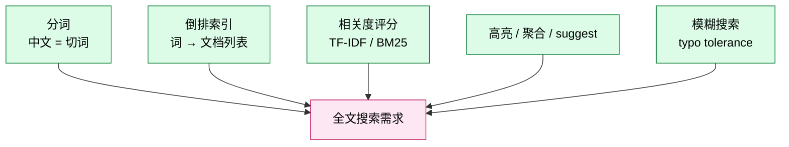

RDBMS 全文搜索很弱（MySQL FULLTEXT、PG `to_tsvector`），搜索引擎**专为这些场景设计**。

### 9.2 典型代表

| 数据库 | 起源 | 优势 | 适用 |
| --- | --- | --- | --- |
| Elasticsearch | 2010 Shay Banon | **搜索引擎事实标准** | 全文搜索、日志分析 |
| OpenSearch | 2021 AWS（ES fork） | ES 兼容、AWS 托管 | AWS 用户 |
| Meilisearch | 2018 Meilisearch | 极简、毫秒级 | 应用内搜索 |
| Typesense | 2018 Typesense | typo-tolerant、即时搜索 | 电商搜索 |
| Apache Solr | 2004 Apache | 老牌、企业级 | 大型搜索 |
| Manticore Search | 2017 | ES 兼容、轻量 | ES 替代 |

### 9.3 ES 为什么会成为"日志分析"的事实标准


**ELK / EFK 栈**（Elasticsearch + Logstash/Filebeat + Kibana）几乎是云原生日志的事实标准——因为：

- ES 写入快（近实时索引）
- 全文搜索 + 聚合查询都强
- Kibana 可视化开箱即用

### 9.4 何时该选

- 应用内搜索（电商、内容）
- 日志聚合分析
- 监控系统（Prometheus + ES）
- 任何需要全文检索 + 模糊搜索

### 9.5 何时不该选

- **结构化数据 + 强事务** → RDBMS
- **TB 级离线分析** → 列存 OLAP
- **极简场景**（搜几百条记录）→ PG 全文检索够用

---

## 十、Vector：向量数据库 —— AI 时代的入场券

### 10.1 为什么存在

**AI / 大模型时代**的特征：

- 文本 / 图片 / 视频都被编码成**高维向量**（512 / 1024 / 1536 维）
- 查询不是"精确匹配"，而是"**找最相似的 K 个**"（KNN）

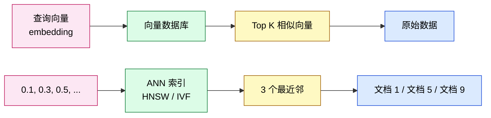

**RDBMS 不能做 KNN**：100 万向量两两算距离 = 10^12 次浮点运算，CPU 跑几年。

**向量数据库的解法**：**HNSW**（Hierarchical Navigable Small World）图索引，把搜索从 O(N) 降到 O(log N)。

### 10.2 典型代表

| 数据库 | 起源 | 优势 | 适用 |
| --- | --- | --- | --- |
| Milvus | 2019 Zilliz | **向量库标杆**，PB 级 | 大规模向量 |
| Qdrant | 2021 Qdrant | Rust 实现、高性能 | 中等规模向量 |
| Weaviate | 2019 SeMI | 模块化、混合搜索 | AI 应用 |
| Pinecone | 2019 Pinecone | 云原生 SaaS | 不想自建 |
| Chroma | 2023 Chroma | 轻量、Python 友好 | 原型开发 |
| pgvector | 2023 PG 扩展 | **PG 原生**，无需新 DB | 小到中等规模 |

### 10.3 pgvector 与 Milvus 的对比

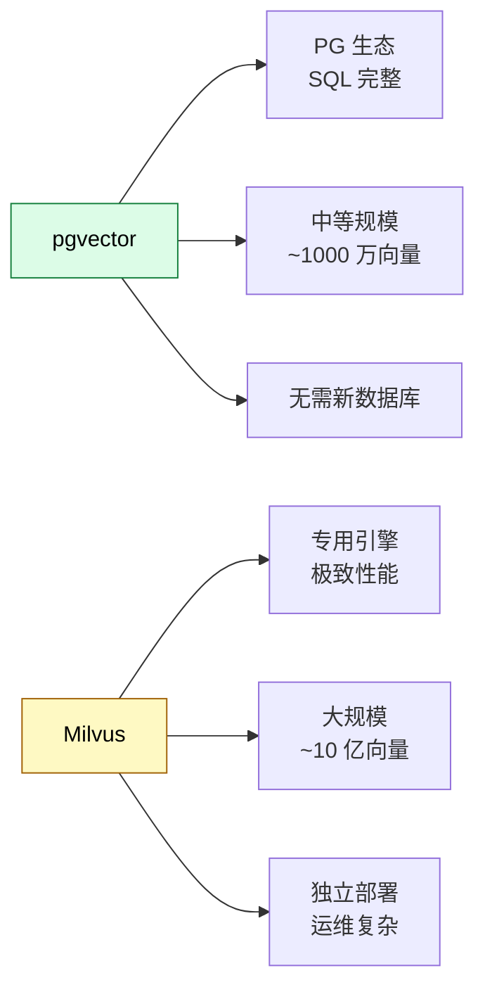

**选择规则**：

- 数据规模 < 1000 万向量 → **pgvector**（与 PG 一起用，省事）
- 数据规模 > 1 亿向量 → **Milvus / Qdrant**
- 想 SaaS → **Pinecone**

### 10.4 何时该选

- RAG（检索增强生成）
- 图像检索
- 推荐系统
- 语义搜索
- 重复图片检测

### 10.5 何时不该选

- **传统精确查询**（按 ID / 状态）→ RDBMS
- **全表扫描** → 列存 OLAP
- **数据规模太小**（几千条） → 直接遍历

---

## 十一、Embedded：嵌入式数据库 —— 装进 App 的数据库

### 11.1 为什么存在

**不是每个应用都需要"数据库服务器"**：

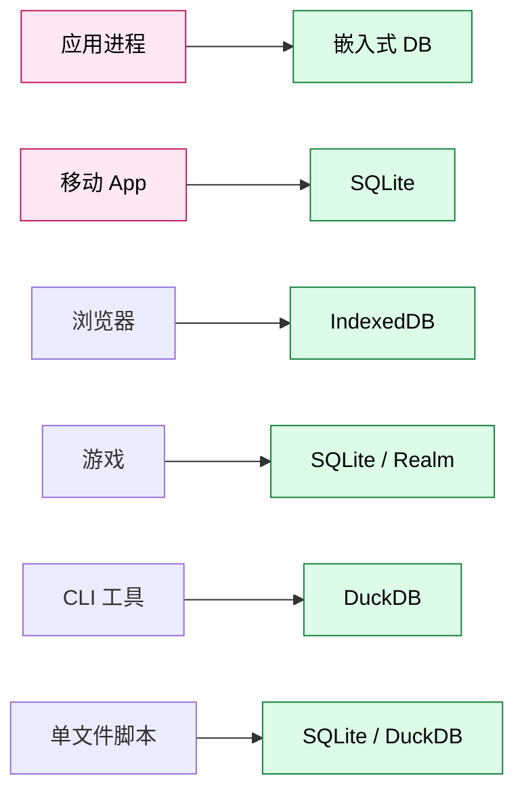

### 11.2 典型代表

| 数据库 | 起源 | 优势 | 适用 |
| --- | --- | --- | --- |
| SQLite | 2000 D. Richard Hipp | **嵌入式之王**，单文件 | 移动 App、桌面 App |
| DuckDB | 2019 CWI | 嵌入式 OLAP | 数据科学、单文件分析 |
| LevelDB | 2011 Google | K/V，嵌入式 | 嵌入式 KV |
| RocksDB | 2013 Facebook | LevelDB 升级版 | 高性能嵌入式 |
| Realm | 2014 MongoDB Inc | 移动端文档数据库 | 移动 App |
| BoltDB | 2013 Ben Johnson | Go 原生 KV | Go 嵌入式 KV |
| LMDB | 2011 Symas | 极致轻量、mmap | 嵌入式场景 |

### 11.3 SQLite 的"统治力"

**SQLite 是部署量最大的数据库**——超过所有其他数据库之和：

- Android / iOS 系统自带
- 浏览器、操作系统内置
- 几乎所有桌面 App
- 单文件零配置，10 MB 内存就能跑

### 11.4 何时该选

- 移动 App（必选 SQLite）
- 桌面应用、本地工具
- 嵌入式设备
- 单文件数据分析（DuckDB）
- 测试环境替代真 PG

### 11.5 何时不该选

- **多客户端**（嵌入式 = 单进程）→ 真正的服务器 DB
- **高并发写**（SQLite 写是串行）→ RDBMS
- **TB 级数据** → 服务器 DB

---

## 十二、Multi-model：多模数据库 —— 一个 DB 多接口

### 12.1 为什么存在

**现实业务往往有多种数据**：

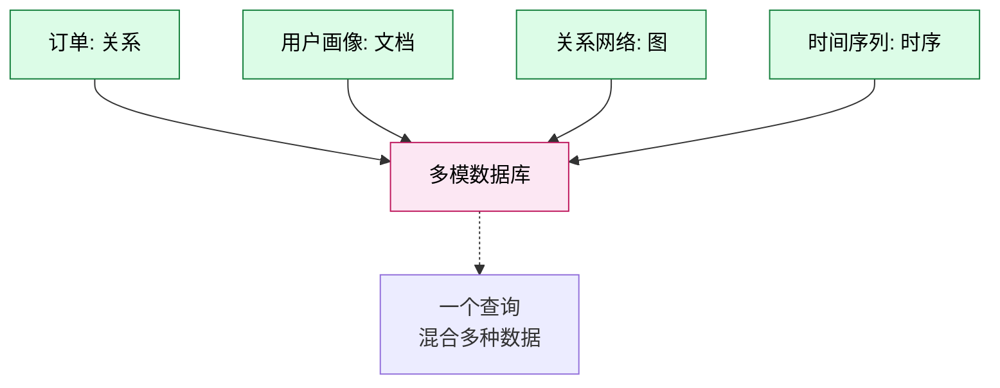

**多模数据库**想"一个 DB 处理所有"——文档 + 图 + KV + 关系。

### 12.2 典型代表

| 数据库 | 起源 | 优势 | 适用 |
| --- | --- | --- | --- |
| ArangoDB | 2015 ArangoDB Inc | 多模 + 强一致 | 通用多模 |
| SurrealDB | 2022 SurrealDB | 新一代多模 + SQL | AI / 实时应用 |
| CosmosDB | 2017 Microsoft | **Azure 原生**，全球分布 | Azure 用户 |
| FaunaDB | 2017 Fauna | 强一致 + 全球分布 | Serverless |
| OrientDB | 2010 (被 ArangoDB 收购) | 多模 + 图 | 历史项目 |

### 12.3 多模的"诱惑 vs 现实"

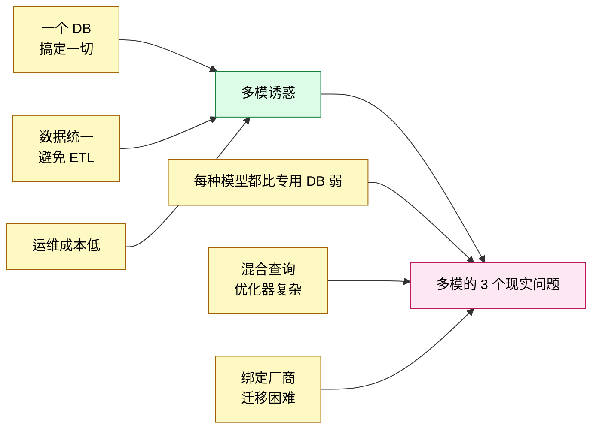

### 12.4 何时该选

- 业务数据**真的多模**（且不想维护多套 DB）
- 用 **Azure / Fauna 等托管服务**（运维省心）
- 中等规模（性能要求不极致）

### 12.5 何时不该选

- 单一数据模型为主（用专用 DB）
- **极致性能**（专用 DB 永远更快）
- 想**避免厂商锁定**（开源 PG + 专用 DB 更好）

---

## 十三、GIS：地理信息数据库 —— 地图与位置的世界

### 13.1 为什么存在

**地理数据**有自己的特点：

```mermaid
flowchart TB
  G[地理数据]:::g

  G1[点 / 线 / 多边形]:::f --> G
  G2[球面距离<br/>不是欧氏距离]:::f --> G
  G3[空间索引<br/>RTree / QuadTree]:::f --> G
  G4[坐标系转换<br/>WGS84 / GCJ-02 / BD-09]:::f --> G

  classDef g fill:#fce7f3,stroke:#be185d,color:#000
  classDef f fill:#dcfce7,stroke:#15803d,color:#000
```

### 13.2 典型代表

| 数据库 | 起源 | 优势 | 适用 |
| --- | --- | --- | --- |
| PostGIS | 2001 Refractions | **PG 上的 GIS 之王**，开源事实标准 | 通用 GIS |
| MongoDB Geo | 2010 | 文档数据库 + 地理 | 简单 LBS |
| Neo4j Spatial | 2014 Neo4j | 图数据库 + 地理 | 路径规划 |
| Oracle Spatial | 2000 Oracle | 商业级 GIS | 大型企业 |
| SQL Server Spatial | 2008 MS | Windows 集成 GIS | .NET 企业 |
| CartoDB | 2012 Carto | 可视化 GIS 云服务 | 业务地图 |

### 13.3 PostGIS 为什么是事实标准

```mermaid
flowchart LR
  P[PostGIS]:::pg

  P1["PG 的 600+ 函数"]:::f --> P
  P2["OGC 标准"]:::f --> P
  P3["Raster / Vector / Topology"]:::f --> P
  P4["pgrouting 路径规划"]:::f --> P
  P5["丰富生态<br/>QGIS / Mapbox / GDAL"]:::f --> P

  classDef pg fill:#dcfce7,stroke:#15803d,color:#000
  classDef f fill:#fef9c3,stroke:#a16207,color:#000
```

### 13.4 何时该选

- LBS 应用（外卖、地图、导航）
- 物流调度、配送路径
- 物联网设备位置
- 城市规划、交通分析

### 13.5 何时不该选

- 简单"省市区"字典（用普通表）
- 海量 GPS 轨迹 + 时序特征（用 TSDB）

---

## 十四、Data Warehouse：数据仓库 —— 决策的底层

### 14.1 为什么存在

**数据仓库**和 OLTP 是两种完全不同的存在：

| 维度 | OLTP | Data Warehouse |
| --- | --- | --- |
| 目标 | 支撑业务运行 | 支撑管理决策 |
| 数据 | 当前的、详细的 | 历史的、聚合的 |
| 用户 | 应用 / 用户 | 分析师 / 高管 |
| 查询 | 简单、点查 | 复杂、聚合 |
| 数据量 | GB ~ TB | TB ~ PB |

```mermaid
flowchart LR
  SRC[业务系统 OLTP]:::src --> ETL[ETL 抽取]:::etl
  ETL --> WH[(数据仓库)]:::wh
  WH --> BI[BI 工具]:::bi
  WH --> DS[数据科学]:::ds
  WH --> AI[AI 训练]:::ai

  classDef src fill:#fce7f3,stroke:#be185d,color:#000
  classDef etl fill:#fef9c3,stroke:#a16207,color:#000
  classDef wh fill:#dcfce7,stroke:#15803d,color:#000
  classDef bi fill:#dbeafe,stroke:#1d4ed8,color:#000
  classDef ds fill:#dbeafe,stroke:#1d4ed8,color:#000
  classDef ai fill:#dbeafe,stroke:#1d4ed8,color:#000
```

### 14.2 典型代表

| 数据库 | 起源 | 优势 | 适用 |
| --- | --- | --- | --- |
| Snowflake | 2012 Snowflake | **云数仓标杆**，存算分离 | 企业云数仓 |
| BigQuery | 2010 Google | 无服务器、按查询字节付费 | GCP 生态 |
| Redshift | 2012 AWS | AWS 原生、便宜 | AWS 用户 |
| Databricks SQL | 2013 Databricks | 湖仓一体 | 大数据 + AI |
| ClickHouse Cloud | 2024 ClickHouse Inc | 极致 OLAP | 实时分析 |
| Apache Doris | 2017 百度 | PB 级实时 | 国产实时数仓 |
| StarRocks | 2020 DorisDB fork | 实时数仓 | 国产替代 |
| Teradata | 1979 Teradata | 老牌数仓 | 大型国企 |

### 14.3 云数仓的 3 个创新

```mermaid
flowchart TB
  I[云数仓创新]:::i

  I1[1. 存算分离<br/>独立扩]:::sub --> I
  I2[2. 按需付费<br/>按扫描字节]:::sub --> I
  I3[3. 多云部署<br/>数据共享]:::sub --> I

  I1 -.-> B1[存储便宜、算力贵<br/>分工独立扩]
  I2 -.-> B2[无需预留资源<br/>空闲 0 成本]
  I3 -.-> B3[Snowflake 数据共享<br/>不复制数据]

  classDef i fill:#fce7f3,stroke:#be185d,color:#000
  classDef sub fill:#dcfce7,stroke:#15803d,color:#000
```

### 14.4 何时该选

- **企业级 BI 报表**（高管驾驶舱）
- **历史数据分析**（> 1 年）
- **跨业务数据整合**（财务 + 销售 + 运营）
- **大模型训练数据准备**

### 14.5 何时不该选

- **实时 OLTP**（用 RDBMS）
- **小数据量**（用 RDBMS / DuckDB）
- **强烈定制 ETL**（自己写 pipeline）

---

## 十五、12 类数据库横向对比矩阵

把所有维度放在一张表里：

| 类别 | 数据模型 | 主要查询 | 强项 | 弱项 | 代表 | 何时选 |
| --- | --- | --- | --- | --- | --- | --- |
| **RDBMS** | 表 + 行 | SQL | 事务、JOIN、成熟 | PB 扩展、特殊查询 | PG / MySQL | 90% 业务默认 |
| **TSDB** | 时间戳 + 标签 | 范围 + 标签过滤 | 高频写入、压缩 | 通用查询弱 | InfluxDB / TimescaleDB | 监控、IoT |
| **Graph** | 节点 + 边 | 遍历 | 关系查询 | 聚合、大规模 | Neo4j / TigerGraph | 社交、知识图谱 |
| **Document** | JSON 文档 | 文档查询 | 灵活 schema | 跨文档事务 | MongoDB | 半结构化 |
| **KV** | Key-Value | GET / SET | 极致简单、快 | 范围查询弱 | Redis / etcd | 缓存、配置 |
| **Column** | 列存 | 聚合、扫描 | 大数据量分析 | 点查、UPDATE | ClickHouse / DuckDB | BI、报表 |
| **Search** | 反向索引 | 全文 / 模糊 | 搜索 + 聚合 | 写入弱 | ES / Meilisearch | 全文、日志 |
| **Vector** | 高维向量 | KNN / 相似度 | AI 时代必备 | 通用查询弱 | Milvus / pgvector | RAG、推荐 |
| **Embedded** | 各种 | 本地 | 零部署、嵌入 | 单进程 | SQLite / DuckDB | 移动 App |
| **Multi-model** | 多种 | 多种 | 一个 DB 多用 | 每种弱 | ArangoDB / CosmosDB | 不想多套 DB |
| **GIS** | 几何 | 空间查询 | 距离、包含 | 通用查询弱 | PostGIS | 地图、LBS |
| **Data Warehouse** | 各种 | SQL + 大规模 | 历史分析、PB 级 | 实时写入弱 | Snowflake / BigQuery | BI、决策 |

---

## 十六、选型决策树：从业务到数据库

```mermaid
flowchart TB
  Q[业务需求]:::q

  Q --> Q1{数据是<br/>表格?}
  Q --> Q2{数据是<br/>图?}
  Q --> Q3{数据是<br/>时间序列?}
  Q --> Q4{数据是<br/>文档?}
  Q --> Q5{数据是<br/>高维向量?}
  Q --> Q6{数据是<br/>键值对?}

  Q1 -->|是, 强事务| A1["RDBMS<br/>PG / MySQL"]
  Q1 -->|是, 大数据量| A2["列存<br/>ClickHouse"]

  Q2 -->|是| A3["Graph DB<br/>Neo4j"]

  Q3 -->|是| A4["TSDB<br/>InfluxDB"]

  Q4 -->|是| A5["Document<br/>MongoDB"]

  Q5 -->|是, 大规模| A6["Vector<br/>Milvus"]
  Q5 -->|是, 小规模| A61["pgvector"]

  Q6 -->|是| A7["KV<br/>Redis / etcd"]

  Q -.->|"需要全文搜?"| B1["Search<br/>ES"]
  Q -.->|"需要嵌入 App?"| B2["Embedded<br/>SQLite"]
  Q -.->|"GIS / 地图?"| B3["PostGIS"]
  Q -.->|"PB 级 BI?"| B4["Data Warehouse<br/>Snowflake"]

  classDef q fill:#fce7f3,stroke:#be185d,color:#000
```

---

## 十七、3 个真实场景的数据库组合

### 17.1 场景 1：电商 SaaS

```mermaid
flowchart LR
  APP[应用]:::app --> PG[(PostgreSQL<br/>订单 / 用户)]:::pg
  APP --> REDIS[(Redis<br/>缓存 / 队列)]:::redis
  APP --> CH[(ClickHouse<br/>BI 报表)]:::ch
  APP --> ES[(Elasticsearch<br/>商品搜索)]:::es
  PG -.->|逻辑复制| CH
  PG -.->|CDC| ES
```

**5 个数据库，每个专攻一个领域**。这是真实生产架构。

### 17.2 场景 2：AI 应用（RAG）

```mermaid
flowchart LR
  USER[用户问题]:::user --> EMB[Embedding 模型]:::emb
  EMB --> V[(Milvus<br/>向量检索)]:::v
  V --> TOP[Top K 文档]:::top
  TOP --> LLM[LLM<br/>GPT-4 / Claude]:::llm
  LLM --> ANSWER[回答]:::ans

  USER -.->|元数据| PG[(PostgreSQL<br/>用户 / 文档元数据)]:::pg

  classDef user fill:#fce7f3,stroke:#be185d,color:#000
```

**Milvus + PG** 是 RAG 标配——向量检索 + 元数据管理。

### 17.3 场景 3：物联网监控

```mermaid
flowchart LR
  DEV[百万设备]:::dev --> MQTT[MQTT broker]:::mqtt
  MQTT --> TS[(TDengine<br/>时序数据)]:::ts
  TS --> GRAF[Grafana 仪表盘]:::g
  TS --> ALERT[告警系统]:::alert
```

**TDengine 单 DB 搞定**——专为 IoT 设计。

---

## 十八、12 类数据库的"哲学图谱"

```mermaid
flowchart TB
  P[12 类数据库的工程哲学]:::p

  P1[RDBMS: 通用 + 强一致]:::ph --> P
  P2[TSDB: 时间维度极致]:::ph --> P
  P3[Graph: 关系维度极致]:::ph --> P
  P4[Document: 灵活性极致]:::ph --> P
  P5[KV: 简单极致]:::ph --> P
  P6[Column: 扫描极致]:::ph --> P
  P7[Search: 检索极致]:::ph --> P
  P8[Vector: 相似度极致]:::ph --> P
  P9[Embedded: 嵌入极致]:::ph --> P
  P10[Multi-model: 通用极致]:::ph --> P
  P11[GIS: 空间极致]:::ph --> P
  P12[DW: 历史极致]:::ph --> P

  P --> META[没有最好<br/>只有最合适]

  classDef p fill:#fce7f3,stroke:#be185d,color:#000
  classDef ph fill:#dcfce7,stroke:#15803d,color:#000
  classDef meta fill:#fef9c3,stroke:#a16207,color:#000
```

**每类数据库背后都是一种工程哲学**：

- **RDBMS**：通用 + 强一致 = 业务流程的中流砥柱
- **TSDB**：时间维度做到极致 = 让监控/IoT 便宜 100x
- **Graph**：关系维度做到极致 = 让社交/推荐跑得起来
- **Column**：扫描维度做到极致 = 让 PB 级分析分钟出结果
- **Vector**：相似度做到极致 = 打开 AI 应用的大门

---

## 十九、回到标题：为什么要对数据库进行细分

```mermaid
flowchart TB
  T[数据库细分的本质]:::t

  T1[业务多样化]:::r --> T
  T2[数据模型多样化]:::r --> T
  T3[物理模型多样化]:::r --> T

  T --> A["不存在万能数据库<br/>存在专业化的工具"]

  A --> B[12 类数据库<br/>每类优化一种场景]

  B --> C[业务架构:<br/>5 个数据库搞定一切<br/>而非 1 个数据库搞定一切]

  C --> D[5 数据库选型框架<br/>OLTP / OLAP / 缓存<br/>搜索 / 专用]

  classDef t fill:#fce7f3,stroke:#be185d,color:#000
  classDef r fill:#dcfce7,stroke:#15803d,color:#000
```

**回答标题**：数据库细分是**必然**——因为：

1. **业务多样化** → 没有一种数据库能满足所有场景
2. **数据模型多样化** → 不同数据有不同灵魂结构
3. **物理模型多样化** → 不同访问模式需要不同存储引擎

**未来 5 年趋势**：

- **AI 时代**会催生更多专用数据库（向量、图、RAG）
- **多模融合**会继续（pgvector、PostGIS 都是 PG 在扩张边界）
- **云原生**会重新定义"专用"（Snowflake、Pinecone 都是托管服务）

---

## 二十、3 条经验法则

### 20.1 法则 1：先 PG + Redis，看性能瓶颈再加专用

**80% 的业务**：

```mermaid
flowchart LR
  APP[应用] --> PG[(PG)]:::pg
  APP --> REDIS[(Redis)]:::redis
```

**再加专用 DB 的信号**：

| 信号 | 加什么 |
| --- | --- |
| 日志搜索慢 | Elasticsearch |
| BI 报表慢 | ClickHouse |
| 设备数据写入慢 | InfluxDB / TDengine |
| 推荐召回慢 | Milvus / pgvector |
| 知识图谱查询 | Neo4j |

### 20.2 法则 2：避免数据库"宗教战争"

```mermaid
flowchart LR
  M[数据库宗教战]:::m
  PG[PG 派]:::p
  MY[MySQL 派]:::q
  MO[MongoDB 派]:::r
  RE[Redis 派]:::s

  M --> PG & MY & MO & RE
  PG -.-> D[真实业务需求]:::d
  MY -.-> D
  MO -.-> D
  RE -.-> D

  classDef m fill:#fce7f3,stroke:#be185d,color:#000
  classDef p fill:#dcfce7,stroke:#15803d,color:#000
  classDef q fill:#fef9c3,stroke:#a16207,color:#000
  classDef r fill:#dbeafe,stroke:#1d4ed8,color:#000
  classDef s fill:#fef9c3,stroke:#a16207,color:#000
  classDef d fill:#dcfce7,stroke:#15803d,color:#000
```

**正解**：用业务需求反推技术选型，不是反过来。

### 20.3 法则 3：组合胜于万能

**5 数据库搞定一切** > 1 数据库搞定一切。

```mermaid
flowchart TB
  ONE["1 数据库搞定一切<br/>(不可能)"]:::bad
  MULTI["5 数据库搞定一切<br/>(真实生产)"]:::good

  ONE -.失败.- X[烂架构]
  MULTI --> Y[好架构]

  classDef bad fill:#fce7f3,stroke:#be185d,color:#000
  classDef good fill:#dcfce7,stroke:#15803d,color:#000
```

---

## 二十一、参考资料

### 同系列前文

- [当我们在说"数据库"的时候，我们到底在说什么 —— 从用户的视角拆解 PostgreSQL 的能力与接口](./postgresql-user-capabilities/index.html)
- [选数据库的时候，我们究竟在选什么 —— 当基础能力都满足时，哪些维度让数据库"脱颖而出"](./database-selection-dimensions/index.html)

### 推荐阅读

- **DB-Engines Ranking**：https://db-engines.com/en/ranking（数据库流行度排行）
- **"One Size Fits All" 论文**：Stonebraker et al., 2005（数据库细分的经典论证）
- **"The End of an Architectural Era"**：Stonebraker et al., 2007（行存 vs 列存）
- **PostgreSQL 生态**：https://www.postgresql.org/docs/

### 各类型代表数据库官方资源

- **RDBMS**：postgresql.org / mysql.com
- **TSDB**：docs.influxdata.com / docs.timescale.com
- **Graph**：neo4j.com / nebula-graph.io
- **Document**：mongodb.com / ferretdb.com
- **KV**：redis.io / etcd.io
- **Column**：clickhouse.com / duckdb.org
- **Search**：elastic.co / opensearch.org
- **Vector**：milvus.io / github.com/pgvector/pgvector
- **Embedded**：sqlite.org / duckdb.org
- **Multi-model**：arangodb.com / surrealDB.com
- **GIS**：postgis.net
- **Data Warehouse**：snowflake.com / cloud.google.com/bigquery
