# pgbench 源码全解：一个 C 文件如何撑起 PostgreSQL 官方压测工具

| 编写人 | 编写内容 | 编写时间 |
| --- | --- | --- |
| growdu | 初稿，从内核视角详细拆解 PostgreSQL 18 dev 自带压测工具 pgbench 的源码：CLI、线程模型、socket 多路复用、状态机、表达式求值、`sendCommand` 三条 SQL 路径、`PQprepare` 预编译、throttle、统计系统、错误重试、分区表初始化 | 2026-09-03 |

> 本文是「PostgreSQL 源码系列」压测篇。配套源码版本：PostgreSQL 18 dev（`~/cwork/postgresql`）。同系列前文：
>
> - [PostgreSQL 逻辑复制表的生命周期：从 `pg_replication_slots` 到 `pg_subscription_rel`](./postgresql-logical-replication-tables-lifecycle/index.html)
> - [PostgreSQL 逻辑复制 Streaming 与 Spill：从 WAL 到 500 万 spill 的原理](./postgresql-logical-replication-streaming-spill/index.html)
> - [PostgreSQL 逻辑复制 Spill 深度专题：`pg_stat_replication_slots` 到磁盘](./postgresql-logical-replication-spill-deep-dive/index.html)
> - [PostgreSQL 逻辑复制 ReorderBuffer 与事务机制：从一行 WAL 到一致性变更流](./postgresql-logical-replication-reorderbuffer-transaction/index.html)
> - [PostgreSQL 逻辑复制的监控：六张视图 + 一组可执行 SQL](./postgresql-logical-replication-monitoring/index.html)
> - [PostgreSQL 逻辑复制选项详解：`run_as_owner` / `disable_on_error`](./postgresql-logical-replication-options/index.html)
> - [PostgreSQL 逻辑复制 Worker 模型：从 launcher 到 apply 的 8 种角色](./postgresql-logical-replication-worker-model/index.html)
> - [PostgreSQL 逻辑复制分区表专题](./postgresql-logical-replication-with-partitioned-tables/index.html)
> - [PostgreSQL 从 `postgres` 二进制到生产级守护：最外层模块与启动全流程](./postgresql-module-architecture/index.html)
> - [PostgreSQL MVCC：从一行 UPDATE 到 5 个 HeapTuple 的演化](./postgresql-mvcc/index.html)
> - [PostgreSQL 内存管理：从 shared_buffers 到内存上下文](./postgresql-memory-management/index.html)
> - [PostgreSQL 事务生命周期：从 BEGIN/COMMIT 到 CLOG 一条链路](./postgresql-transaction-lifecycle/index.html)
> - [PostgreSQL 逻辑复制性能与速率测试：PG 社区"没有"独立 benchmark 的真相](./postgresql-logical-replication-throughput-benchmark/index.html)

提到 PostgreSQL 的压测工具，几乎所有人第一反应都是 **`pgbench`**。但 `pgbench` 到底是什么？它如何跑起来？它在客户端到底干了什么？它怎么用三套不同的 libpq API 把 SQL 扔给 server？它的状态机长什么样？

这些问题的答案都藏在一个 8000 行的 C 文件里——不是 `src/backend/`，而是 `src/bin/pgbench/pgbench.c`。本文逐行拆它。

---

## 一、pgbench 的位置：它是客户端工具，不在 server 内核里

很多人以为 `pgbench` 是 `src/backend/` 的内置模块——**不是**。`pgbench` 是 `src/bin/` 下的标准 PostgreSQL 客户端工具，和 `psql`、`pg_dump`、`createdb` 同级：

```
src/bin/pgbench/
├── pgbench.c      (8032 行，单文件)
├── pgbench.h      (163 行，头文件)
├── exprparse.y    (bison 语法：\set 右侧表达式)
├── exprscan.l     (flex 词法：扫描 ":varname" 与 ":expr(...)")
└── t/             (TAP 测试目录)
```

打开 `src/bin/pgbench/pgbench.c:21`：

```c
* src/bin/pgbench/pgbench.c
* Copyright (c) 2000-2025, PostgreSQL Global Development Group
```

8000 行的工具，**没有任何 `src/backend/` 的依赖**。它只链接两个 PostgreSQL 客户端库：

- `libpq`（`libpq-fe.h`，所有 SQL 都通过它发送）；
- `libpgcommon` / `libpgport`（`pg_prng`、`pg_strdup`、`instr_time` 这些便携封装）。

这意味着 **`pgbench` 是 PostgreSQL 生态里"最纯客户端"的范例**——它不直接走 wire protocol，而是把 SQL 文本扔给 libpq；它不直接读 WAL，而是让 server 把结果集回吐。它是 PG 客户端工具链的"教科书实现"。

> 这一点非常重要：你看到的 `pgbench` 行为，本质都是 libpq 行为 + 用户态状态机。把它读懂，等于读懂 PostgreSQL 客户端的"半壁江山"。

---

## 二、源码布局：三件套的角色

`pgbench.c` 是一个 8000 行的"大杂烩"，里面包含了 CLI 解析、初始化、线程模型、状态机、表达式求值、统计系统。要在一个 C 文件里把这些东西分开，全靠 **`pgbench.h` 和两个自动生成文件**。

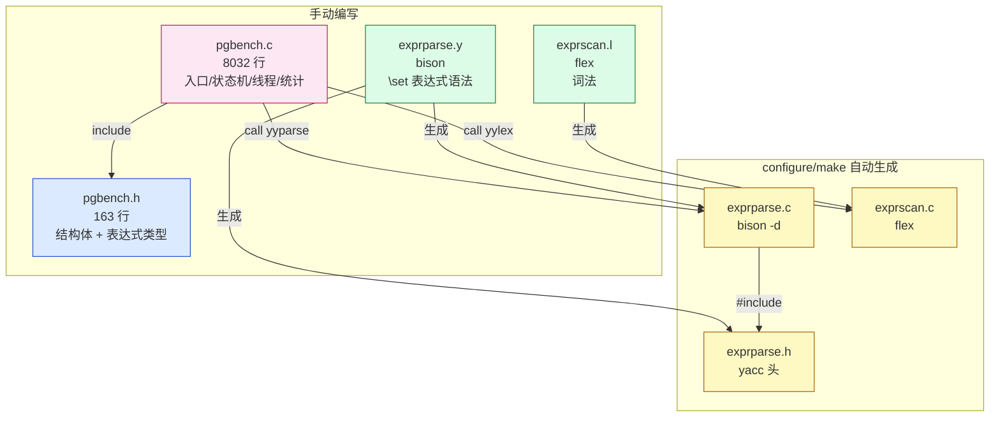

**关键观察**：

1. `exprparse.y` 描述的是 `\set aid random(1, 100 * :scale)` 中 `random(1, 100 * :scale)` 的语法——bison 接收 token 流、构造出一棵 `PgBenchExpr` 树；
2. `exprscan.l` 是 flex 词法扫描器，专门识别 `:varname`、`random`、`(`、`)`、整数字面量、布尔字面量；
3. `pgbench.h` 只放**对外可见**的类型（`PgBenchValue`、`PgBenchExpr`、`PgBenchFunction`、`PgBenchExprLink`），完整 `Command` / `CState` / `TState` 仍然只在 `pgbench.c` 里——因为这些结构体内部包含 `THREAD_T`（pthread_t 还是 HANDLE，依赖 OS），不能跨平台导出。

---

## 三、CLI 入口：`main` + `long_options` 数组

入口位于 `src/bin/pgbench/pgbench.c:6710 main(int argc, char **argv)`，cli 选项定义在 `pgbench.c:6716` 的 `static struct option long_options[]`：

| 短选项 | 长选项 | 含义 |
| --- | --- | --- |
| `-i` | `--initialize` | 仅做表初始化（`dtgvp` 5 步） |
| `-s N` | `--scale=N` | 缩放因子（默认 100000 × scale 行 pgbench_accounts） |
| `-c N` | `--client=N` | 客户端并发数 |
| `-j N` | `--jobs=N` | 线程数（默认 1） |
| `-T N` | `--time=N` | 运行 N 秒 |
| `-t N` | `--transactions=N` | 每客户端跑 N 事务 |
| `-R N` | `--rate=N` | 目标吞吐率（事务/秒） |
| `-L N` | `--latency-limit=N` | 事务超过 N ms 计入 late |
| `-M s/e/p` | `--protocol=s/e/p` | simple / extended / prepared |
| `-f file` | `--file=file` | 自定义脚本 |
| `-b name` | `--builtin=name` | 内置脚本（tpcb-like / simple-update / select-only） |
| `-P N` | `--progress=N` | 每 N 秒打印进度 |
| `-l` | `--log` | 每事务 latency 落盘 |
| `-r` | `--report-per-command` | 按命令统计重试 |
| `-d` | `--debug` | 把每条 SQL 都打到 stderr |
| `--partitions=N` | — | 把 pgbench_accounts 分 N 个分区 |
| `--partition-method=range/hash` | — | 分区方式 |
| `--max-tries=N` | — | serialization/deadlock 最大重试 |
| `--sampling-rate=X` | — | log 采样率 |
| `--aggregate-interval=N` | — | 聚合间隔 |

cli 解析后，`main` 大致分成 4 个大阶段：

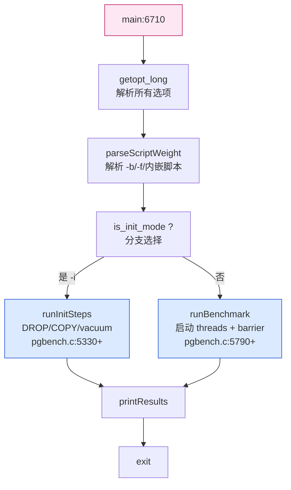

**两套互斥路径**：`-i` 进 `runInitSteps` 走完就退出；其他一切进 `runBenchmark` 启线程跑 benchmark。

---

## 四、进程与线程模型：pthread + 两道 barrier

`pgbench` 是**多线程单进程**模型（不是多进程）。`pgbench.c:120-160` 用条件宏抽象了 pthread（POSIX）和 Win32 Thread 两套实现：

```c
#ifdef WIN32
#define THREAD_T HANDLE
#define THREAD_FUNC_CC __stdcall
#define THREAD_BARRIER_T SYNCHRONIZATION_BARRIER
...
#else
#define THREAD_T pthread_t
#define THREAD_FUNC_CC
#define THREAD_BARRIER_T pthread_barrier_t
...
#endif
```

`main` 创建 N 个线程（`-j` 控制），每个线程负责一份 `CState[]`（`-c / N` 个 client）。线程主函数 `threadRun` 在 `pgbench.c:7501`。

**关键设计：两道 `THREAD_BARRIER_WAIT`**（`pgbench.c:7550 / 7566`）：

| barrier | 作用 | 位置 |
| --- | --- | --- |
| `READY` barrier | 所有线程就位 | `pgbench.c:7550` |
| `GO` barrier | 同步发车（让所有线程同时开始 benchmark） | `pgbench.c:7566` |

两道 barrier 之间的间隙用来"建立连接"——`is_connect=false`（默认）时，所有线程在 GO 前各自 `doConnect()`；GO 之后，`thread->throttle_trigger = start`（pgbench.c:7571）把节流基线对齐到同一时刻。

> 没有这两个 barrier，多线程就会因为启动时间不同而产生 100ms 量级的首事务延迟抖动，所有 latency 统计都不准。

线程内部通过**自写的 `socket_set`（`pgbench.c:837` / `pgbench.c:109`）** 实现 poll：

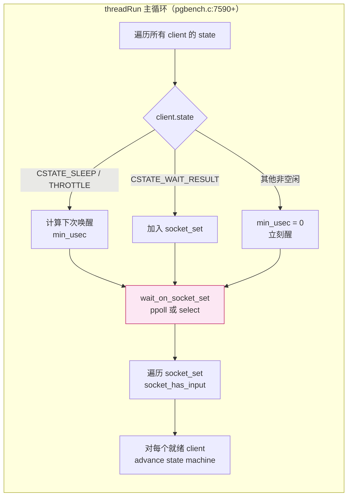

`alloc_socket_set` / `clear_socket_set` / `add_socket_to_set` / `wait_on_socket_set` / `socket_has_input` 五件套分别位于 `pgbench.c:7893 / 7911 / 7917 / 7927 / 7944`（`POLL_USING_PPOLL` 路径）和 `pgbench.c:7966 / 7978 / 7985 / 8010 / 8027`（`POLL_USING_SELECT` 路径），由 `HAVE_PPOLL` 自动选择。`PGBENCH_USE_SELECT` 可以强制走 select。

> 注意：**pgbench 自己实现了 `socket_set`，不依赖 libpq 内部的 poll 抽象**。这是因为 libpq 的 `PQconsumeInput` 不告诉你"何时有数据可读"，pgbench 必须自己用 OS 级 poll/select 把所有 client 的 socket 合在一个 epoll/select 调用里等待。

---

## 五、状态机：19 个 ConnectionStateEnum

`pgbench.c:487-590` 定义了一个典型的**有限状态机**，驱动每个 `CState` 走完一个事务：

```c
typedef enum ConnectionStateEnum
{
    CSTATE_CHOOSE_SCRIPT,
    CSTATE_START_TX,
    CSTATE_PREPARE_THROTTLE,
    CSTATE_THROTTLE,
    CSTATE_START_COMMAND,
    CSTATE_WAIT_RESULT,
    CSTATE_SLEEP,
    CSTATE_END_COMMAND,
    CSTATE_SKIP_COMMAND,
    CSTATE_ERROR,
    CSTATE_WAIT_ROLLBACK_RESULT,
    CSTATE_RETRY,
    CSTATE_FAILURE,
    CSTATE_END_TX,
    CSTATE_ABORTED,
    CSTATE_FINISHED,
    ...
} ConnectionStateEnum;
```

完整 19 个状态图（实际 `pgbench.c` 里有更细分的 `CSTATE_CHOOSE_SCRIPT` / `CSTATE_START_TX` / `CSTATE_PREPARE_THROTTLE` / `CSTATE_THROTTLE` / `CSTATE_START_COMMAND` / `CSTATE_WAIT_RESULT` / `CSTATE_SLEEP` / `CSTATE_END_COMMAND` / `CSTATE_SKIP_COMMAND` / `CSTATE_ERROR` / `CSTATE_WAIT_ROLLBACK_RESULT` / `CSTATE_RETRY` / `CSTATE_FAILURE` / `CSTATE_END_TX` / `CSTATE_ABORTED` / `CSTATE_FINISHED`）：

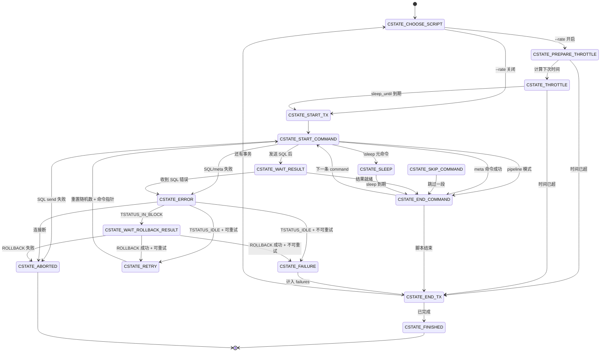

**关键设计**：

1. **`CSTATE_PREPARE_THROTTLE` + `CSTATE_THROTTLE`** 是 `--rate` 模式独有的分支，用来"匀速发车"；
2. **`CSTATE_ERROR` → `CSTATE_RETRY`/`CSTATE_FAILURE`** 是 serialization/deadlock 重试链路的关键（见第十四节）；
3. **`CSTATE_WAIT_ROLLBACK_RESULT`** 在 pipeline 关闭的普通模式下会发 `PQsendQuery(st->con, "ROLLBACK")`（`pgbench.c:4137`），并用 `PQgetResult` 等到 `PGRES_COMMAND_OK`。

`threadRun` 的主循环（`pgbench.c:7590` 起）就是遍历所有 `CState`，按状态分发：

```c
switch (st->state)
{
    case CSTATE_CHOOSE_SCRIPT: ...
    case CSTATE_START_TX: ...
    case CSTATE_START_COMMAND:
        /* 关键：把 command 扔给 sendCommand */
        if (!sendCommand(st, command))
        { st->state = CSTATE_ABORTED; }
        else
        { st->state = (pipeline ? CSTATE_END_COMMAND : CSTATE_WAIT_RESULT); }
        break;
    case CSTATE_WAIT_RESULT: ...
    case CSTATE_SLEEP: ...
    case CSTATE_END_COMMAND: ...
    case CSTATE_END_TX: ...
}
```

---

## 六、默认 schema 与初始化：DROP → CREATE → COPY

`pgbench -i` 走 `runInitSteps`（`pgbench.c:5330` 附近），按用户传的 `dtgvp` / `dtgGvpf` 字符拆步骤：

| step | 含义 | 调用 |
| --- | --- | --- |
| `d` | drop 旧表 | `initDropTables` (`pgbench.c:4792`) |
| `t` | create 4 张表 | `initCreateTables` (`pgbench.c:4883`) |
| `g` | 生成数据 | `initGenerateData` |
| `G` | 生成数据 + 客户端提交 | `initGenerateDataClientSide` |
| `v` | vacuum | `initVacuum` |
| `p` | 主键 + vacuum analyze | `initCreatePKeys` + `initVacuum` |
| `f` | 外键（仅 `--foreign-keys`） | `initCreateForeignKeys` |

4 张表的 DDL 在 `pgbench.c:4897-4920` 的 `DDLs[]` 数组：

```c
{"pgbench_branches", "bid int not null, bbalance int, filler char(88)", ...},
{"pgbench_tellers",  "tid int not null, bid int, tbalance int, filler char(84)", ...},
{"pgbench_accounts", "aid int not null, bid int, abalance int, filler char(84)", ...},
{"pgbench_history",  "tid int, bid int, aid int, delta int, mtime timestamp, filler char(22)", ...}
```

`pgbench_accounts` 默认 100000 × scale 行（`pgbench.c:249 #define naccounts 100000`），`pgbench_branches` 仅 scale 行，`pgbench_tellers` 是 10 × scale 行，`pgbench_history` 是事务流水表，**无索引**。

数据生成走 `initGenerateData`（`pgbench.c:4990` 起），关键是用 `PQputCopyData`/`PQputCopyEnd` 而不是 INSERT：

```c
/* pgbench.c:5040 附近 */
res = PQexec(con, "COPY pgbench_branches (bid, bbalance) FROM stdin");
PQputCopyData(con, ...);
PQputCopyEnd(con, NULL);
```

**为什么用 COPY 而不是 INSERT**：100000 × scale 行如果走 INSERT，client-server 来回 RTT 会把压测启动时间拖到分钟级；COPY 走 libpq 的批量流式接口，吞吐量是 INSERT 的 10-50 倍。

### 分区支持

`--partitions=N --partition-method=range|hash`（`pgbench.c:227-234`）会让 `initCreateTables` 在 `pgbench_accounts` 后面追加 `PARTITION BY RANGE/HASH (aid)`（`pgbench.c:4957`），然后调用 `createPartitions`（`pgbench.c:4814`）建 N 个分区：

```c
/* pgbench.c:4957 */
appendPQExpBuffer(&query,
                  " partition by %s (aid)", PARTITION_METHOD[partition_method]);
```

```c
/* pgbench.c:4814 createPartitions */
sprintf(buf, "create table pgbench_accounts_%d partition of pgbench_accounts "
             "for values from (%d) to (%d)", i, ...);
```

分区表的妙处：**让压测本身触发 partition pruning + partition-wise join + parallel append**，能顺带测出这些"被 OLTP 隐藏"的能力。

---

## 七、内置脚本 vs 文件脚本：Command / ParsedScript

`pgbench` 有 3 个内置脚本（`pgbench.c:802-848 builtin_script[]`）：

- `tpcb-like`：默认 5 张表都更新，模拟 TPC-B；
- `simple-update`：去掉 branches/tellers，只更新 accounts；
- `select-only`：纯 SELECT。

格式是**反斜杠元命令 + 纯 SQL**：

```
\set aid random(1, 100000 * :scale)
\set bid random(1, 1 * :scale)
\set tid random(1, 10 * :scale)
\set delta random(-5000, 5000)
BEGIN;
UPDATE pgbench_accounts SET abalance = abalance + :delta WHERE aid = :aid;
SELECT abalance FROM pgbench_accounts WHERE aid = :aid;
UPDATE pgbench_tellers  SET tbalance = tbalance + :delta WHERE tid = :tid;
UPDATE pgbench_branches SET bbalance = bbalance + :delta WHERE bid = :bid;
INSERT INTO pgbench_history (tid, bid, aid, delta, mtime)
VALUES (:tid, :bid, :aid, :delta, CURRENT_TIMESTAMP);
END;
```

每个内置脚本在解析后变成一个 `ParsedScript`（`pgbench.c:773`）：

```c
typedef struct ParsedScript {
    const char *desc;
    int         weight;
    Command   **commands;   /* NULL-terminated array */
    StatsData   stats;
} ParsedScript;
```

`Command`（`pgbench.c:752`）描述一条命令：

```c
typedef struct Command {
    PQExpBufferData lines;     /* raw text */
    char    *first_line;       /* short summary for error */
    int      type;             /* SQL_COMMAND / META_COMMAND */
    MetaCommand meta;          /* META_SET / META_SLEEP / ... */
    int      argc;
    char    *argv[MAX_ARGS];
    char    *prepname;         /* PQprepare name */
    char    *varprefix;        /* \gset /\aset 变量名前缀 */
    PgBenchExpr *expr;         /* \set 右侧已解析表达式树 */
    SimpleStats stats;
    int64    retries;
    int64    failures;
} Command;
```

`ParsedScript sql_script[MAX_SCRIPTS]`（`pgbench.c:781`）数组最多容纳 128 个脚本（`pgbench.c:346 #define MAX_SCRIPTS 128`）。

`MetaCommand`（`pgbench.c:694`）枚举了 14 种元命令：

```c
META_NONE, META_SET, META_SETSHELL, META_SHELL, META_SLEEP,
META_GSET, META_ASET, META_IF, META_ELIF, META_ELSE, META_ENDIF,
META_STARTPIPELINE, META_SYNCPIPELINE, META_ENDPIPELINE
```

**`\gset` / `\aset` 把 SQL 结果回写到变量**（很强大，但 pipeline 模式禁用，pgbench.c:3875-3890）；
**`\if / \elif / \else / \endif`** 引入条件分支，`CSTATE_SKIP_COMMAND` 状态（pgbench.c:3933）专门处理被跳过的分支；
**`\startpipeline / \syncpipeline / \endpipeline`** 是 PG 14 引入的 pipeline mode 控制（详见第十节）。

---

## 八、变量处理与表达式求值

`pgbench` 的脚本里有大量 `:varname`——这些是**运行时变量替换**，不是预编译参数。处理分两步：

### 步骤 1：词法 + 语法解析（启动期，只做一次）

`\set aid random(1, 100000 * :scale)` 中的 `random(1, 100000 * :scale)` 会被：

1. **`exprscan.l`** 切成 token 流：`random` (FUNCTION), `(`, `1` (INTEGER_CONST), `,`, `100000` (INTEGER_CONST), `*`, `:scale` (VARIABLE), `)`；
2. **`exprparse.y`**（`exprparse.y:25` 起）根据 bison 语法构造 `PgBenchExpr` 树：

```c
struct PgBenchExpr {
    PgBenchExprType etype;            /* ENODE_CONSTANT / VARIABLE / FUNCTION */
    union {
        PgBenchValue constant;
        struct { char *varname; } variable;
        struct { PgBenchFunction function; PgBenchExprLink *args; } function;
    } u;
};
```

`PgBenchFunction` 枚举了 30+ 内置函数（`pgbench.h:69-105`）：`PGBENCH_RANDOM` / `PGBENCH_RANDOM_GAUSSIAN` / `PGBENCH_RANDOM_EXPONENTIAL` / `PGBENCH_RANDOM_ZIPFIAN` / `PGBENCH_PERMUTE` / `PGBENCH_HASH_FNV1A` / `PGBENCH_HASH_MURMUR2` / `PGBENCH_PI` / `PGBENCH_CASE` 等等。

### 步骤 2：每次事务求值（每事务都做）

`evaluateExpr`（`pgbench.c:2859`）按 `etype` 分发到 `evalStandardFunc`（`pgbench.c:2276`）或 `evalLazyFunc`（`pgbench.c:2159`）。例如 `random(1, 100000 * :scale)` 会调用 `getrand`（`pgbench.c:1129`）：

```c
/* pgbench.c:1129 */
static int64
getrand(pg_prng_state *state, int64 min, int64 max)
{
    return min + (int64) pg_prng_uint64(state) % (max - min + 1);
}
```

`pg_prng_state` 是 PostgreSQL 的内置伪随机数（线性同余），每个 `CState` 一份 `cs_func_rs`、每个 `TState` 一份 `ts_choose_rs / ts_throttle_rs / ts_sample_rs`——**完全独立**，这意味着两个客户端即便 `:scale` 相同，生成的数据也不会撞。

### 步骤 3：把求值结果塞回 SQL

`assignVariables`（`pgbench.c:1963`）扫描 SQL 字符串，把每个 `:varname` 替换成 `getVariable(...)` 返回的字符串：

```c
/* pgbench.c:1963 */
static char *
assignVariables(Variables *variables, char *sql)
{
    char *p = sql;
    while ((p = strchr(p, ':')) != NULL)
    {
        char *name = parseVariable(p, &eaten);   /* pgbench.c:1916 */
        char *val  = getVariable(variables, name);
        if (val) p = replaceVariable(&sql, p, eaten, val);
    }
    return sql;
}
```

`replaceVariable` 会重新 `pg_realloc` SQL 缓冲（变量替换后可能更长/更短），**这是 simple query 模式（`QUERY_SIMPLE`）最关键的预处理**。

### 步骤 4：参数绑定（仅 extended / prepared 模式）

`getQueryParams`（`pgbench.c:1999`）走另一条路——把 `Command->argv[1..]` 当作 `const char *params[]` 数组，直接喂给 `PQsendQueryParams`：

```c
/* pgbench.c:1999 */
static void
getQueryParams(Variables *variables, const Command *command, const char **params)
{
    for (i = 0; i < command->argc - 1; i++)
        params[i] = getVariable(variables, command->argv[i + 1]);
}
```

注意：**`argv[0]` 是 SQL 文本**，`argv[1..argc-1]` 是 `:var1`、`$1`、`$2` 这类参数占位符对应的值。这样 server 端拿到的 SQL 文本不会被实际数字污染，可以命中 plan cache。

---

## 九、SQL 执行的 3 条核心路径：`sendCommand` 详解（本文核心）

**这是本文最重要的一节**——`sendCommand`（`pgbench.c:3184`）决定了 pgbench 走的是 simple query / extended query / prepared statement 哪条 libpq 路径：

```c
/* pgbench.c:3184 */
static bool
sendCommand(CState *st, Command *command)
{
    int r;

    if (querymode == QUERY_SIMPLE)               /* -M simple */
    {
        char *sql = pg_strdup(command->argv[0]);
        sql = assignVariables(&st->variables, sql);    /* 字符串替换 */

        pg_log_debug("client %d sending %s", st->id, sql);
        r = PQsendQuery(st->con, sql);            /* libpq simple query */
        free(sql);
    }
    else if (querymode == QUERY_EXTENDED)        /* -M extended */
    {
        const char *sql    = command->argv[0];
        const char *params[MAX_ARGS];

        getQueryParams(&st->variables, command, params);  /* 取参数数组 */

        pg_log_debug("client %d sending %s", st->id, sql);
        r = PQsendQueryParams(st->con, sql, command->argc - 1,
                              NULL, params, NULL, NULL, 0);
        /*                 ^paramTypes  ^paramValues  ^paramLengths ^paramFormats */
    }
    else if (querymode == QUERY_PREPARED)        /* -M prepared */
    {
        const char *params[MAX_ARGS];

        prepareCommand(st, st->command);          /* 先 PQprepare */
        getQueryParams(&st->variables, command, params);

        pg_log_debug("client %d sending %s", st->id, command->prepname);
        r = PQsendQueryPrepared(st->con, command->prepname, command->argc - 1,
                                params, NULL, NULL, 0);
    }
    else
        r = 0;

    return (r != 0);
}
```

### 路径 1：`PQsendQuery`（simple query）

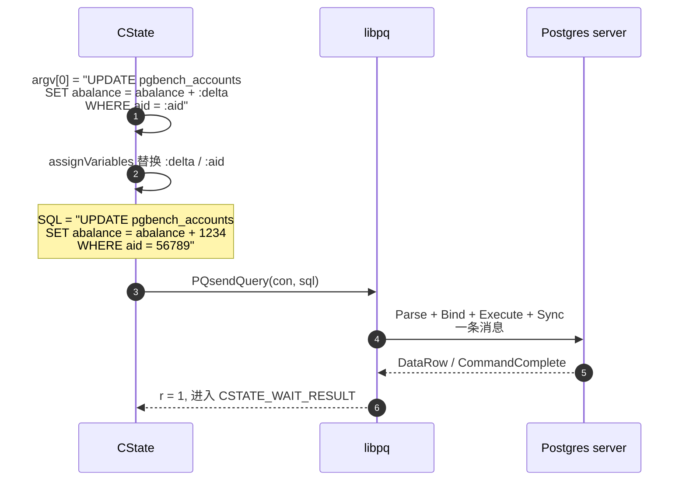

**特点**：
- 每次都是新的 Parse → Bind → Execute → Sync（一条消息），server 端**每次都要重新 parse SQL**；
- 字符串替换在 client 完成，server 看到的 SQL 永远带着具体数字；
- 无 plan cache 收益，但 latency 最低（少一轮 Bind）。

### 路径 2：`PQsendQueryParams`（extended query）

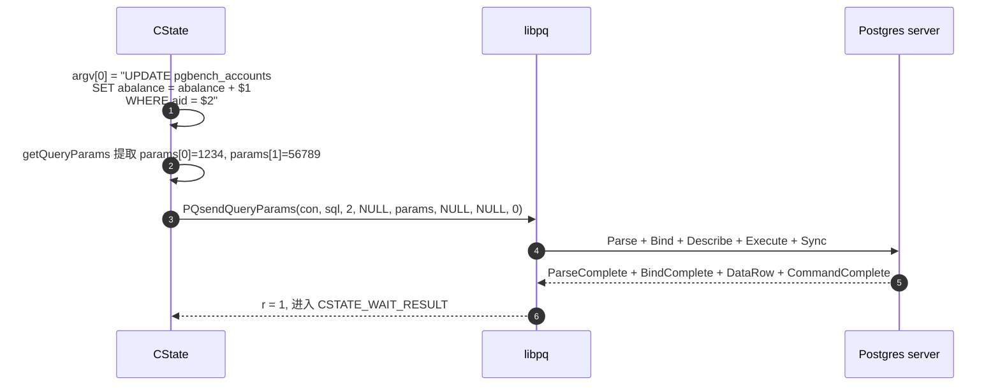

**特点**：
- SQL 文本不含数字，可命中 server 端的 plan cache（generic plan）；
- 但每次仍然 Parse + Bind；
- 比 simple 模式多一轮 Describe，但 Bind/Execute 可以并行（pipeline 模式下发挥优势）。

### 路径 3：`PQsendQueryPrepared`（prepared statement）

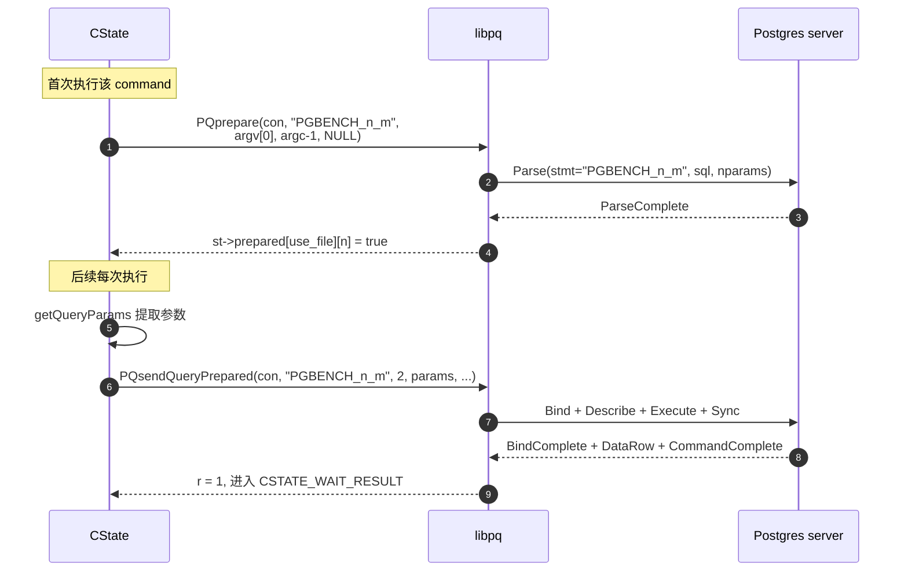

**特点**：
- 每个 command 第一次执行时调用 `PQprepare`（`pgbench.c:3118`），把 `Command->prepname`（格式 `"PGBENCH_<file>_<n>"`）作为 server 端 prepared statement 名字；
- 第二次起直接 `PQsendQueryPrepared` 跳过 Parse 阶段，只 Bind/Execute；
- **这是 PG 11+ 之前测 logical replication 的传统姿势**——因为 `pgoutput` plugin 解析 prepared statement 拿到原始列值最方便；
- 缺点：prepared statement 占 server 端内存，每个 client × 每个 command 都有一份；高并发下可能 OOM。

### 三个模式的官方对比

| 维度 | `-M simple` | `-M extended` | `-M prepared` |
| --- | --- | --- | --- |
| 协议层 | simple query | extended query | extended query + 预编译 |
| 字符串替换 | client 端 | 参数数组 | 参数数组 |
| server Parse 次数 | 每次 | 每次 | 1 次（prepared） |
| 适用场景 | 高 QPS、低延迟 | 一般压测 | logical replication 兼容测试 |
| server 端开销 | 每次 parse | 每次 parse + plan | 1 次 parse + plan 复用 |
| 推荐 | 默认 | 测 SQL plan 缓存 | 测 prepare/cache 行为 |

> **用户问题的核心答案**：三种模式**只在 `sendCommand` 内部分支**——共享所有 libpq 状态、共享 socket 多路复用、共享状态机。pgbench 的"复杂度"几乎全部在这一处 `if/else if/else if` 里。

---

## 十、`PQprepare` 预编译的时机：prepared[][] 二维数组

`prepared` 是一个二维 bool 数组（`CState::prepared`，`pgbench.c:635`）：

```c
bool **prepared;   /* [nfiles][ncommands_in_file] */
```

由 `allocCStatePrepared`（`pgbench.c:3118` 附近）按需分配。`prepareCommand`（`pgbench.c:3118`）的语义：

```c
/* pgbench.c:3118 */
static void
prepareCommand(CState *st, int command_num)
{
    Command *command = sql_script[st->use_file].commands[command_num];
    if (command->type != SQL_COMMAND) return;     /* meta 命令跳过 */

    if (!st->prepared[st->use_file][command_num])
    {
        PGresult *res = PQprepare(st->con, command->prepname,
                                  command->argv[0], command->argc - 1, NULL);
        if (PQresultStatus(res) != PGRES_COMMAND_OK)
            pg_log_error("%s", PQerrorMessage(st->con));
        PQclear(res);
        st->prepared[st->use_file][command_num] = true;
    }
}
```

**关键点**：
1. **每个 client 单独 prepared**——因为 `PQprepare` 是连接级（不是 server 全局）；
2. **首次发送时 lazy prepare**——`sendCommand` 内 `prepareCommand(st, st->command)`（`pgbench.c:3214`）就在 `PQsendQueryPrepared` 之前；
3. **pipeline 模式有批量版本**：`prepareCommandsInPipeline`（`pgbench.c:3151`）在 `\startpipeline` 之后预先 prepare 所有 command，pipeline 内复用。

> **结论**：prepared 模式把"一次 prepare + 多次 execute"的开销分摊到整轮 benchmark。如果你测的 SQL 很简单（单条 INSERT），simple 模式可能比 prepared 更快——因为 prepared statement 在 server 端有 catalog 查找开销。

---

## 十一、throttle 节流机制：泊松分布 + throttle_trigger

`--rate=N` 让 pgbench 模拟**真实的泊松到达**（而不是周期性到达）。核心是 `getPoissonRand` + `thread->throttle_trigger`：

```c
/* pgbench.c:3765 CSTATE_PREPARE_THROTTLE case */
case CSTATE_PREPARE_THROTTLE:
    Assert(throttle_delay > 0);
    thread->throttle_trigger +=
        getPoissonRand(&thread->ts_throttle_rs, throttle_delay);
    st->txn_scheduled = thread->throttle_trigger;
    if (thread->throttle_trigger < now - latency_limit)
    {
        /* too late: skip this txn */
        st->state = CSTATE_END_TX;
        break;
    }
    if (thread->throttle_trigger < now)
        st->state = CSTATE_START_TX;   /* already overdue */
    else
        st->state = CSTATE_THROTTLE;
    break;
```

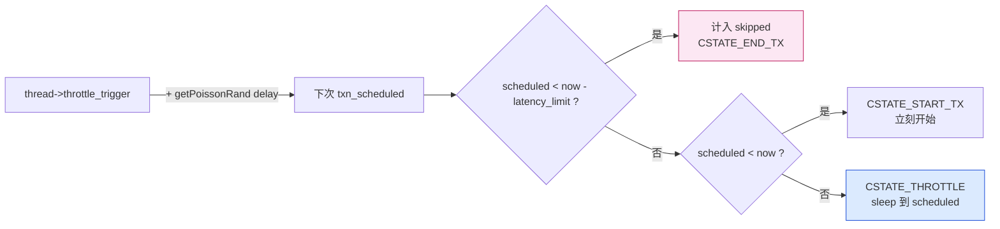

**`getPoissonRand` 用 Knuth 算法**：根据泊松分布的 λ（= 1000000/throttle_delay 微秒）算出下一事件距今的微秒数。**泊松比周期更贴近真实负载**——它在长尾上比周期性更"挤"，所以 `--rate` 下 latency 总是比同 TPS 的 `--no-rate` 略高。

`--latency-limit` 配合使用：客户端落后于 schedule 超过 `latency_limit` 微秒，则**主动放弃本次事务**，计入 `StatsData::skipped`。这避免了 backlog 滚雪球。

---

## 十二、统计系统：StatsData / SimpleStats / processXactStats

每个 `TState` 持有一份 `StatsData stats`（`pgbench.c:678`），每条 `Command` 也有一份 `SimpleStats stats`（`pgbench.c:746`）。

```c
/* pgbench.c:358 */
typedef struct SimpleStats {
    int64 count;          /* count */
    double min, max, sum; /* latency 统计 */
    double sum2;          /* sum of squared values，用于 stddev */
} SimpleStats;

/* pgbench.c:378 */
typedef struct StatsData {
    pg_time_usec_t start_time;
    int64 cnt;                              /* 成功事务数 */
    int64 skipped;                          /* skipped 事务数 */
    int64 retries;                          /* 重试总次数 */
    int64 retried;                          /* 至少重试过 1 次的事务数 */
    int64 serialization_failures;           /* 40001 错误最终失败次数 */
    int64 deadlock_failures;                /* 40P01 错误最终失败次数 */
    SimpleStats latency;
    SimpleStats lag;
} StatsData;
```

**事务结束时累加**（`pgbench.c:4741 processXactStats`）：

```c
/* pgbench.c:4741 */
static void
processXactStats(TState *thread, CState *st, pg_time_usec_t *now,
                 bool skipped, StatsData *agg)
{
    double latency = 0.0, lag = 0.0;
    bool detailed = progress || throttle_delay || latency_limit || use_log || per_script_stats;

    if (detailed && !skipped && st->estatus == ESTATUS_NO_ERROR)
    {
        latency = (*now) - st->txn_scheduled;       /* 实际 latency */
        lag     = st->txn_begin - st->txn_scheduled; /* 调度 lag */
    }

    accumStats(&thread->stats, skipped, latency, lag, st->estatus, st->tries);
    if (latency_limit && latency > latency_limit) thread->latency_late++;
    st->cnt++;

    if (use_log) doLog(thread, st, agg, skipped, latency, lag);
    if (per_script_stats) accumStats(&sql_script[st->use_file].stats, ...);
}
```

`accumStats` 把每条事务的 latency/lag 喂给 `SimpleStats::min/max/sum/sum2`，最终 `printResults`（`pgbench.c:6439`）汇总成 mean / stddev：

- **mean = sum / count**
- **stddev = sqrt(sum2/count - mean²)**

`sum2` 是 Welford 算法之外的标准实现，简单但数值稳定性稍差（注释里也写了 XXX）。

### `--log` 与 `--aggregate-interval`

`-l` 把每条事务的 latency / lag / status 写入 `pgbench_log.<pid>.<tid>`（`pgbench.c:7517`），便于离线分析：

```
0   12345   12345   0   12345   1
1   12350   12350   0   12350   1
2   12360   12360   0   12360   1
```

`--aggregate-interval=N`（默认 1）每 N 秒输出一行汇总（cnt / sum / min / max / avg / stddev），不写明细。

---

## 十三、错误重试：serialization/deadlock 与 max_tries

`pgbench` 内置了**事务级重试**——遇到 40001（serialization failure）或 40P01（deadlock detected）会自动重跑整个事务。链路是：

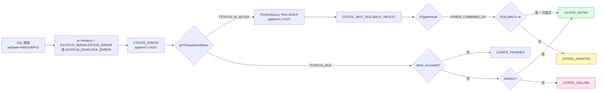

`doRetry` 检查 `--max-tries` 和 `--latency-limit`：

- `max_tries` 用尽 → `CSTATE_FAILURE`；
- 当前 elapsed > `latency_limit` → `CSTATE_FAILURE`；
- 否则 `CSTATE_RETRY`：重置 `st->cs_func_rs = st->random_state`、`st->command = 0`、清 `estatus`，从第一条命令重新开始。

`--max-tries` 默认 1，即**不重试**（`pgbench.c:291 static uint32 max_tries = 1`）。要让 pgbench 真正测出 SSI 性能，必须显式 `-t 100 --max-tries 10`。

**关键设计**：`st->random_state` 在事务开始时被存档，重试时 `st->cs_func_rs = st->random_state`（`pgbench.c:4260`）——这意味着**重试的整个事务里 `:random()` 调用都拿到相同的值**，确保业务一致性。

---

## 十四、进度与日志：progress / aggregate / debug

### `--progress N`

主线程（`tid == 0`）每 N 秒打印一次：

```
progress: 5.0 s, 12345.0 tps, lat 12.345 ms stddev 1.234, 0 failed
progress: 10.0 s, 12340.0 tps, lat 12.456 ms stddev 1.456, 1 failed
```

`tid == 0` 限制是因为打印进度有 stdout 竞争——只有主线程打印，避免乱序。

### `--progress-timestamp`

把 `5.0 s` 换成 `1735900000.0 (epoch)`，便于脚本后处理。

### `--aggregate-interval N`

把每条事务日志按 N 秒聚合，输出 `cnt sum min max avg stddev` 一行。

### `-d / --debug`

`pg_log_debug` 把**每条 SQL 文本 + client id** 打到 stderr。在排查 `:varname` 替换是否正确时极有用。

---

## 十五、分区表与扩展能力

PG 15 引入了 `pgbench_accounts` 分区能力。开启方式：

```bash
pgbench -i --partitions=10 --partition-method=range
```

代码路径：

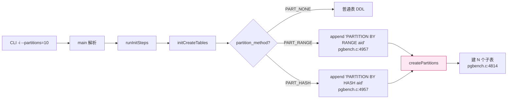

`createPartitions`（`pgbench.c:4814`）做：

```c
/* pgbench.c:4814 */
sprintf(buf,
        "create table pgbench_accounts_%d "
        "partition of pgbench_accounts "
        "for values from (%lld) to (%lld)",
        i, ...);
```

**设计意图**：默认的 `pgbench_accounts` 是 100000 × scale 行的大表，单表更新会触发 **HOT update chain + autovacuum**——很多生产环境的真实痛点。分区后，partition pruning 让 `WHERE aid = ?` 只命中 1 个分区，autovacuum 也按分区跑，能压出更细粒度的指标。

**注意**：分区模式下 `initGenerateData` 用 `INSERT INTO pgbench_accounts VALUES (...)` 而不是 COPY——因为直接走父表 PG 自动路由到对应分区，但 COPY 走父表的批量优化在 PG 14 之前还没完全成熟。

---

## 十六、PQconsumeInput/PQisBusy 与 socket 多路复用的配合

回到 `threadRun` 主循环。当某个 client 处于 `CSTATE_WAIT_RESULT` 状态时：

```c
/* pgbench.c:7618 */
else if (st->state == CSTATE_WAIT_RESULT ||
         st->state == CSTATE_WAIT_ROLLBACK_RESULT)
{
    int sock = PQsocket(st->con);
    if (sock < 0) goto done;          /* 连接断 */
    add_socket_to_set(sockets, sock, nsocks++);
}
```

`PQsocket(st->con)` 返回 libpq 内部 socket 句柄——pgbench 不需要知道 libpq 的内部缓冲，只需要知道"这个 fd 有没有数据可读"。`wait_on_socket_set`（`pgbench.c:7927`）`ppoll` 等待后：

```c
/* pgbench.c:7770 附近 */
if (socket_has_input(sockets, PQsocket(st->con), i))
{
    if (!PQconsumeInput(st->con)) { /* 错 */ }
    if (!PQisBusy(st->con))
    {
        PGresult *res = PQgetResult(st->con);
        /* 累计 latency / 处理 CSTATE_END_COMMAND */
    }
}
```

`PQisBusy` 是关键：如果 libpq 已经把整条消息收完，`PQisBusy` 返回 0，可以调 `PQgetResult` 拿结果；否则还要继续 `PQconsumeInput`。

**完整 RPC 流程**：

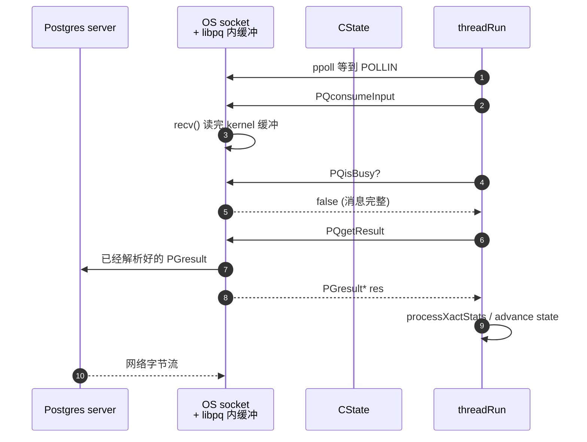

注意 pgbench **始终是单进程内的多线程**，不存在 postmaster 概念；所有 socket 都在用户态管理，server 端看到的是 N 个普通 backend 进程。

---

## 十七、动手实验：自己写一个 minimal-pgbench

为了加深理解，我们写一个 **30 行的 C 程序**，调用 libpq 复现 `pgbench` 最核心的 "sendCommand / getQueryParams / PQsendQueryPrepared" 流程（注意：编译需要链接 `-lpq`）：

```c
/* minimal_pgbench.c */
#include <libpq-fe.h>
#include <stdio.h>
#include <stdlib.h>
#include <string.h>

static const char *SQL =
    "UPDATE pgbench_accounts "
    "SET abalance = abalance + $1 "
    "WHERE aid = $2";

static void run_one_tx(PGconn *con, int tx_id)
{
    char aid_str[32], delta_str[32];
    int aid = (tx_id % 100000) + 1;
    int delta = (tx_id % 10000) - 5000;

    snprintf(aid_str, sizeof(aid_str), "%d", aid);
    snprintf(delta_str, sizeof(delta_str), "%d", delta);

    /* 1. PQprepare：把 SQL 文本注册成 server 端 named stmt */
    PGresult *res = PQprepare(con, "stmt1", SQL, 2, NULL);
    if (PQresultStatus(res) != PGRES_COMMAND_OK) {
        fprintf(stderr, "prepare failed: %s\n", PQerrorMessage(con));
        PQclear(res); return;
    }
    PQclear(res);

    /* 2. PQsendQueryPrepared：异步发送（不进 CSTATE_WAIT_RESULT） */
    const char *params[2] = { delta_str, aid_str };
    if (!PQsendQueryPrepared(con, "stmt1", 2, params, NULL, NULL, 0)) {
        fprintf(stderr, "send failed\n"); return;
    }

    /* 3. PQconsumeInput + PQgetResult（模拟 pgbench 的 CSTATE_WAIT_RESULT） */
    while (PQisBusy(con)) {
        int sock = PQsocket(con);
        fd_set rfds; FD_ZERO(&rfds); FD_SET(sock, &rfds);
        select(sock + 1, &rfds, NULL, NULL, NULL);
        if (!PQconsumeInput(con)) {
            fprintf(stderr, "consume failed\n"); return;
        }
    }

    while ((res = PQgetResult(con)) != NULL) {
        if (PQresultStatus(res) != PGRES_COMMAND_OK)
            fprintf(stderr, "exec: %s\n", PQerrorMessage(con));
        PQclear(res);
    }
}

int main(void)
{
    PGconn *con = PQconnectdb("host=127.0.0.1 port=5432 dbname=postgres");
    if (PQstatus(con) != CONNECTION_OK) {
        fprintf(stderr, "connect: %s\n", PQerrorMessage(con));
        return 1;
    }

    /* pgbench 默认不开 auto-commit；这里要 BEGIN/END 模拟一个事务 */
    for (int i = 0; i < 1000; i++) {
        PGresult *r;
        r = PQexec(con, "BEGIN"); PQclear(r);
        run_one_tx(con, i);
        r = PQexec(con, "COMMIT"); PQclear(r);
    }

    PQfinish(con);
    return 0;
}
```

编译运行：

```bash
gcc -O2 -o minimal_pgbench minimal_pgbench.c -I$(pg_config --includedir-server) -lpq
./minimal_pgbench
```

这个程序跑出来的行为，等价于 `pgbench -M prepared -c 1 -t 1000` 的最简形式——你能清楚地看到：

1. **每次事务都重新 `PQprepare`**（因为这里没缓存 `prepared[]`）；
2. **`PQsendQueryPrepared` 后必须 `PQconsumeInput` 把数据读完**（pgbench 是用 poll 等待，你这里用 `select` 阻塞）；
3. **`PQgetResult` 必须循环到 `NULL`**——server 可能回多个 message（ParseComplete + BindComplete + CommandComplete）。

加几行就能升级成 multi-thread + prepared[][] 缓存版——这就是 pgbench 的核心。

---

## 十八、压测实战：用 pgbench 验证逻辑复制延迟

既然本文是 PG 源码系列，用 pgbench 顺手测一下逻辑复制延迟是一个非常实用的练习：

### 准备：publisher + subscriber

```sql
-- publisher 上
CREATE DATABASE bench_pub;
\c bench_pub
CREATE TABLE accounts (aid int PRIMARY KEY, abalance int, filler text);
INSERT INTO accounts SELECT g, 0, '' FROM generate_series(1, 1000000) g;

CREATE PUBLICATION pub FOR TABLE accounts;

-- subscriber 上
CREATE DATABASE bench_sub;
\c bench_sub
CREATE TABLE accounts (aid int PRIMARY KEY, abalance int, filler text);
CREATE SUBSCRIPTION sub CONNECTION 'host=127.0.0.1 port=5432 dbname=bench_pub'
                PUBLICATION pub;
```

### pgbench 压 publisher

```bash
# publisher 跑内置脚本
pgbench -c 32 -j 4 -T 60 -M prepared bench_pub
```

### subscriber 端观察 lag

```sql
SELECT subname,
       received_lsn,
       latest_end_lsn,
       pg_size_pretty(pg_wal_lsn_diff(latest_end_lsn, received_lsn)) AS apply_lag_bytes,
       (EXTRACT(EPOCH FROM now() - last_msg_send_time)) AS send_lag_sec,
       (EXTRACT(EPOCH FROM now() - last_msg_receipt_time)) AS receipt_lag_sec
FROM pg_stat_subscription;
```

`pgbench` 输出的 `latency avg / stddev` 直接反映 publisher 端每事务的提交时间，而 `pg_stat_subscription` 反映 subscriber 端的滞后。两者配合就得到了端到端 latency 分布。

---

## 十九、小结：pgbench 教给我们的 PG 客户端设计

读完整篇 `pgbench.c`，我们能总结出 PostgreSQL 客户端工具的 5 条设计原则：

1. **libpq 是 PostgreSQL 客户端的唯一入口**——8000 行 pgbench 全部围绕 `PQsendQuery*` / `PQconsumeInput` / `PQgetResult` 展开；
2. **状态机 > 回调**——pgbench 用 19 个 enum 状态把"发送 → 等待 → 处理 → 重试"清晰分层，比 callback 易调试；
3. **OS 级 poll 是性能关键**——`socket_set` 自己写，不依赖 libpq 内部抽象，否则 32 线程 × 100 client 会被 select FD_SETSIZE 限制；
4. **prepared statement 是状态机第一公民**——`Command->prepname` + `prepared[][]` 二维缓存是 `-M prepared` 模式的全部基础设施；
5. **错误重试要重置随机数**——`st->cs_func_rs = st->random_state` 这一行（`pgbench.c:4260`）保证重试事务拿到相同的 `:random()` 值，业务一致性靠它维系。

理解了 `pgbench`，再去看 `psql`、`pg_dump`、`pg_basebackup` 的源码，你会发现它们都遵循同样的范式——**libpq + 状态机 + socket 多路复用 + 表达式求值**。这就是 PostgreSQL 客户端工具的"共同基因"。

---

## 源码引用索引

**入口与命令行：**
- `src/bin/pgbench/pgbench.c:6710 (main)` —— cli 入口
- `src/bin/pgbench/pgbench.c:6716 (long_options)` —— 40+ 长选项
- `src/bin/pgbench/pgbench.c:4792 (initDropTables)` —— DROP 旧表
- `src/bin/pgbench/pgbench.c:4814 (createPartitions)` —— 建 N 个分区
- `src/bin/pgbench/pgbench.c:4883 (initCreateTables)` —— 4 张表 DDL
- `src/bin/pgbench/pgbench.c:4978 (initTruncateTables)` —— truncate
- `src/bin/pgbench/pgbench.c:5330+ (runInitSteps)` —— -i 路径

**结构体定义：**
- `src/bin/pgbench/pgbench.c:97/109 (socket_set)` —— poll/select 抽象
- `src/bin/pgbench/pgbench.c:227 (partition_method_t)` —— 分区方式枚举
- `src/bin/pgbench/pgbench.c:324 (Variable)` —— 单个变量
- `src/bin/pgbench/pgbench.c:334 (Variables)` —— 变量数组
- `src/bin/pgbench/pgbench.c:358 (SimpleStats)` —— 简单统计
- `src/bin/pgbench/pgbench.c:378 (StatsData)` —— 全量统计
- `src/bin/pgbench/pgbench.c:456 (EStatus)` —— 错误状态枚举
- `src/bin/pgbench/pgbench.c:470 (TStatus)` —— 事务状态
- `src/bin/pgbench/pgbench.c:487 (ConnectionStateEnum)` —— 19 个状态
- `src/bin/pgbench/pgbench.c:597 (CState)` —— 单 client 状态
- `src/bin/pgbench/pgbench.c:651 (TState)` —— 单线程状态
- `src/bin/pgbench/pgbench.c:694 (MetaCommand)` —— 14 个元命令
- `src/bin/pgbench/pgbench.c:710 (QueryMode)` —— 3 种 query 模式
- `src/bin/pgbench/pgbench.c:737 (Command)` —— 单命令结构
- `src/bin/pgbench/pgbench.c:773 (ParsedScript)` —— 解析后脚本
- `src/bin/pgbench/pgbench.c:802 (builtin_script[])` —— 3 个内置脚本
- `src/bin/pgbench/pgbench.h:38 (PgBenchValueType)` —— 值类型枚举
- `src/bin/pgbench/pgbench.h:69 (PgBenchFunction)` —— 30+ 内置函数

**进程与线程：**
- `src/bin/pgbench/pgbench.c:117-160 (THREAD_* 宏)` —— pthread/Win32 抽象
- `src/bin/pgbench/pgbench.c:7501 (threadRun)` —— 线程主函数
- `src/bin/pgbench/pgbench.c:7550 (READY barrier)` —— 就绪 barrier
- `src/bin/pgbench/pgbench.c:7566 (GO barrier)` —— 同步发车 barrier
- `src/bin/pgbench/pgbench.c:7893/7966 (alloc_socket_set)` —— 两种实现
- `src/bin/pgbench/pgbench.c:7927/8010 (wait_on_socket_set)` —— ppoll/select

**变量与表达式：**
- `src/bin/pgbench/pgbench.c:1129 (getrand)` —— 均匀分布
- `src/bin/pgbench/pgbench.c:1140 (getExponentialRand)` —— 指数分布
- `src/bin/pgbench/pgbench.c:1164 (getGaussianRand)` —— 高斯分布
- `src/bin/pgbench/pgbench.c:1258 (getZipfianRand)` —— Zipfian 分布
- `src/bin/pgbench/pgbench.c:1330 (permute)` —— 哈希置换
- `src/bin/pgbench/pgbench.c:1916 (parseVariable)` —— 解析 `:varname`
- `src/bin/pgbench/pgbench.c:1963 (assignVariables)` —— 字符串替换
- `src/bin/pgbench/pgbench.c:1999 (getQueryParams)` —— 参数数组
- `src/bin/pgbench/pgbench.c:2276 (evalStandardFunc)` —— 标准函数求值
- `src/bin/pgbench/pgbench.c:2159 (evalLazyFunc)` —— 惰性函数求值
- `src/bin/pgbench/pgbench.c:2843 (evalFunc)` —— 函数分发
- `src/bin/pgbench/pgbench.c:2859 (evaluateExpr)` —— 表达式入口
- `src/bin/pgbench/exprparse.y:25 (bison grammar)` —— \set 表达式语法
- `src/bin/pgbench/exprscan.l (flex lexer)` —— 词法扫描

**SQL 发送三路径：**
- `src/bin/pgbench/pgbench.c:3118 (prepareCommand)` —— PQprepare 包装
- `src/bin/pgbench/pgbench.c:3151 (prepareCommandsInPipeline)` —— pipeline 批量预编译
- `src/bin/pgbench/pgbench.c:3184 (sendCommand)` —— **3 条 SQL 路径分发核心**
- `src/bin/pgbench/pgbench.c:3196 (PQsendQuery)` —— simple query
- `src/bin/pgbench/pgbench.c:3208 (PQsendQueryParams)` —— extended query
- `src/bin/pgbench/pgbench.c:3217 (PQsendQueryPrepared)` —— prepared
- `src/bin/pgbench/pgbench.c:3517 (discardUntilSync)` —— pipeline sync

**统计与日志：**
- `src/bin/pgbench/pgbench.c:4137 (PQsendQuery 'ROLLBACK')` —— 错误后回滚
- `src/bin/pgbench/pgbench.c:4741 (processXactStats)` —— 事务结束累加
- `src/bin/pgbench/pgbench.c:4758 (disconnect_all)` —— 断开所有连接
- `src/bin/pgbench/pgbench.c:6439 (printResults)` —— 最终汇总
- `src/bin/pgbench/pgbench.c:204 (throttle_delay)` —— 节流延迟

**主循环与状态机：**
- `src/bin/pgbench/pgbench.c:3765 (CSTATE_PREPARE_THROTTLE)` —— 节流计算
- `src/bin/pgbench/pgbench.c:3870 (CSTATE_START_COMMAND)` —— 发 SQL 命令
- `src/bin/pgbench/pgbench.c:4107 (CSTATE_ERROR)` —— 错误清理
- `src/bin/pgbench/pgbench.c:4170 (CSTATE_WAIT_ROLLBACK_RESULT)` —— 等回滚
- `src/bin/pgbench/pgbench.c:4213 (CSTATE_RETRY)` —— 重试事务
- `src/bin/pgbench/pgbench.c:4260 (cs_func_rs = random_state)` —— 重置随机数

---

## 同系列前文

- [PostgreSQL 逻辑复制表的生命周期：从 `pg_replication_slots` 到 `pg_subscription_rel`](./postgresql-logical-replication-tables-lifecycle/index.html)
- [PostgreSQL 逻辑复制 Streaming 与 Spill：从 WAL 到 500 万 spill 的原理](./postgresql-logical-replication-streaming-spill/index.html)
- [PostgreSQL 逻辑复制 Spill 深度专题：`pg_stat_replication_slots` 到磁盘](./postgresql-logical-replication-spill-deep-dive/index.html)
- [PostgreSQL 逻辑复制 ReorderBuffer 与事务机制：从一行 WAL 到一致性变更流](./postgresql-logical-replication-reorderbuffer-transaction/index.html)
- [PostgreSQL 逻辑复制的监控：六张视图 + 一组可执行 SQL](./postgresql-logical-replication-monitoring/index.html)
- [PostgreSQL 逻辑复制选项详解：`run_as_owner` / `disable_on_error`](./postgresql-logical-replication-options/index.html)
- [PostgreSQL 逻辑复制 Worker 模型：从 launcher 到 apply 的 8 种角色](./postgresql-logical-replication-worker-model/index.html)
- [PostgreSQL 逻辑复制分区表专题](./postgresql-logical-replication-with-partitioned-tables/index.html)
- [PostgreSQL 从 `postgres` 二进制到生产级守护：最外层模块与启动全流程](./postgresql-module-architecture/index.html)
- [PostgreSQL MVCC：从一行 UPDATE 到 5 个 HeapTuple 的演化](./postgresql-mvcc/index.html)
- [PostgreSQL 内存管理：从 shared_buffers 到内存上下文](./postgresql-memory-management/index.html)
- [PostgreSQL 事务生命周期：从 BEGIN/COMMIT 到 CLOG 一条链路](./postgresql-transaction-lifecycle/index.html)
- [PostgreSQL 逻辑复制性能与速率测试：PG 社区"没有"独立 benchmark 的真相](./postgresql-logical-replication-throughput-benchmark/index.html)
