# pgvector 深度解析：从 ANN 索引到 RAG 时代的向量数据库核心

| 编写人 | 编写内容 | 编写时间 |
| --- | --- | --- |
| growdu | 初稿，把 pgvector 从 2021 年 Andrew Kane 的一个 GitHub 项目，到 PG 16 正式加入 contrib，到 HNSW / IVFFlat 双索引架构、halfvec / sparse / bit 三种量化方式，hybrid search 集成。配套源码版本：pgvector 0.8 / PG 18 dev。 | 2026-09-29 |

> 本文是「PostgreSQL 扩展系列」AI / 向量篇。同系列前文：
>
> - [PostgreSQL 核心特性全景：12 大功能的设计动因、实现原理与版本演化](./postgresql-core-features/index.html)
> - [PostGIS 深度解析：从 OGC Simple Features 到 PG 18 时代的 GIS 引擎](./postgis-deep-dive/index.html)
> - [PostgreSQL 前世今生：39 年演化史](./postgresql-history/index.html)

2024 年开始，**"AI 数据库"成为新热点**：Qdrant、Milvus、Weaviate、Pinecone 这些专用向量数据库 vs PG + pgvector 的"一库多用"模型，争论不下。

pgvector 2021 年开始，2023 年 7 月加入 PG 16 contrib，2024 年 5 月加入 PG 17 contrib，**到 PG 18 已经是默认 contrib**。它 4 年走过的路是**专用向量数据库 8 年走过的路**。

本文回答 4 个问题：

1. **为什么 PG + pgvector 比专用向量数据库更适合 80% 场景**？
2. **HNSW vs IVFFlat**：两个 ANN 索引怎么用、怎么选？
3. **halfvec / bit / sparse 三种量化方式**：什么时候用哪个？
4. **Hybrid search + LangChain / LlamaIndex 集成**：RAG 实战怎么搭？

**全文 7 大章节，20+ 张架构图，60+ 个 SQL 示例。**

---

## 一、向量数据库的现状

### 1.1 专用 vs 一库多用

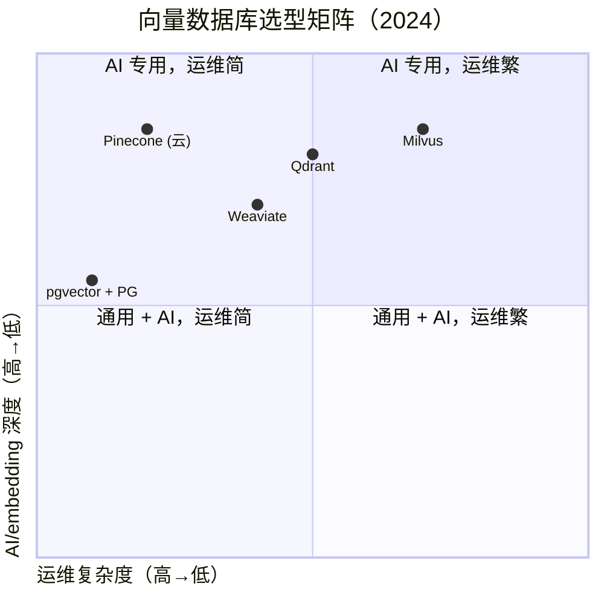

### 1.2 pgvector 4 个核心能力

```mermaid
mindmap
  root((pgvector 核心能力))
  数据类型
    vector (768+ 维)
    halfvec (768+ 维 half)
    bit (binary)
    sparsevec (sparse)
  索引
    HNSW (Hierarchical NSW)
    IVFFlat (Inverted File)
  距离
    cosine / L2 / L1
    inner product
    Hamming (bit)
  集成
    LangChain
    LlamaIndex
    pgvector
```

---

## 二、pgvector 历史：从 GitHub 项目到 PG contrib

### 2.1 关键节点

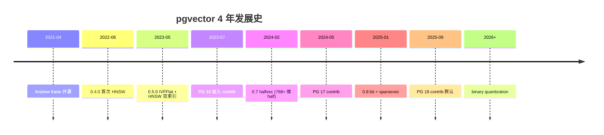

### 2.2 关键人物

| 人物 | 角色 | 贡献 |
|---|---|---|
| **Andrew Kane** | Creator | 整个 pgvector 维护 |
| **Heikki Linnakangas** | Reviewer | PG 集成 + HNSW |
| **Nathan Bossons** | Contributor | sparsevec |
| **Jonathan Katz** | Advocate | PG contrib 推动 |

---

## 三、pgvector 数据类型：vector / halfvec / bit / sparsevec

### 3.1 4 种类型

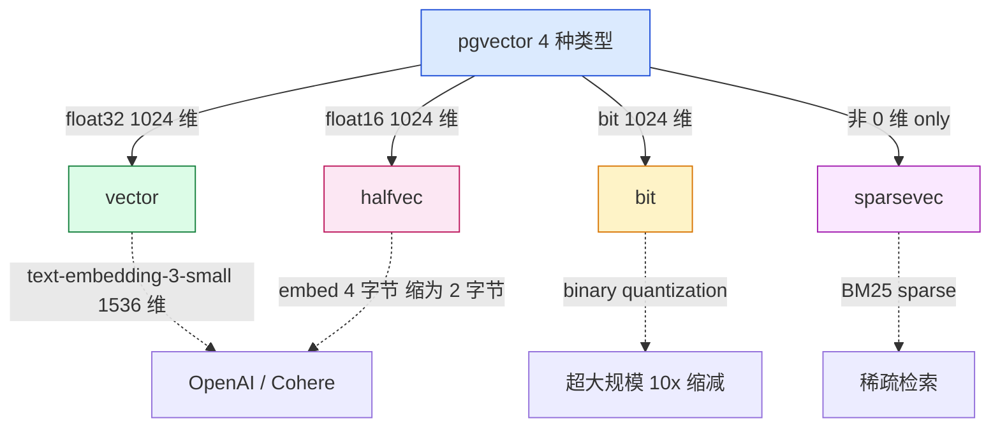

### 3.2 vector 创建

```sql
-- PG 16+
CREATE EXTENSION vector;

-- 创建表
CREATE TABLE documents (
    id BIGSERIAL PRIMARY KEY,
    content TEXT NOT NULL,
    embedding vector(1536)  -- OpenAI text-embedding-3-small 维度
);

-- 插入数据
INSERT INTO documents (content, embedding) VALUES
  ('PostgreSQL is a powerful database', '[0.1, 0.2, 0.3, ...]'::vector),
  ('pgvector adds ANN search', ...);
```

### 3.3 维度选择

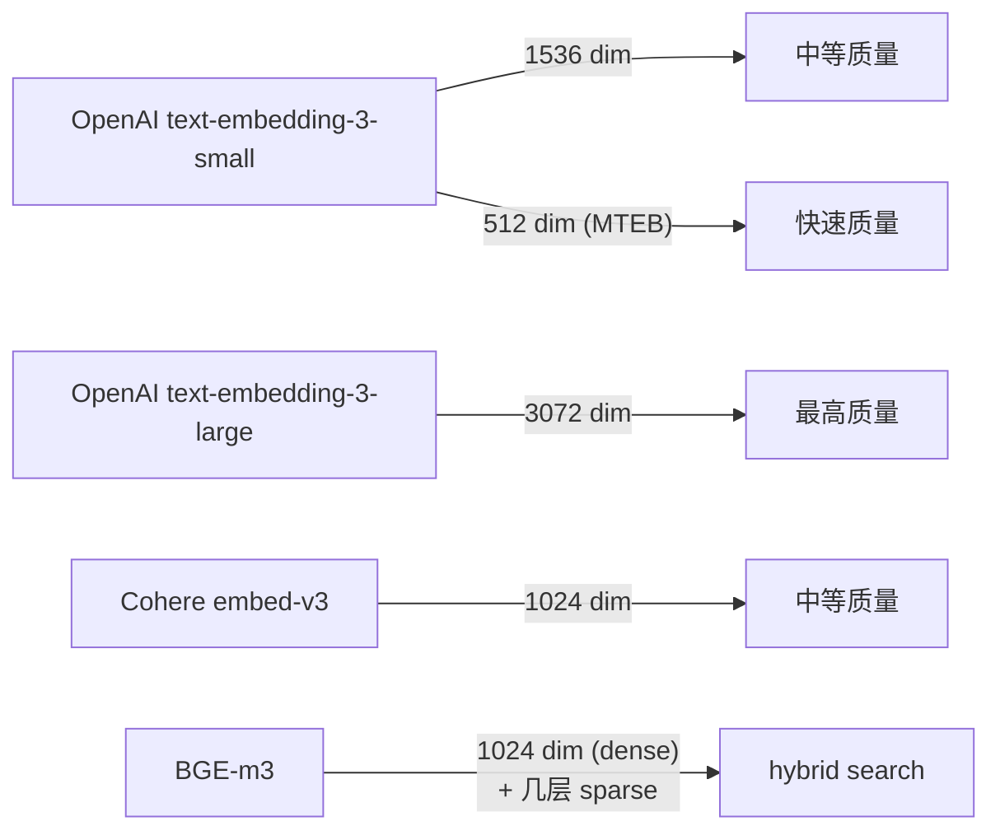

### 3.4 halfvec / bit / sparsevec

```sql
-- halfvec (PG 17+ / pgvector 0.7+)
CREATE TABLE docs_half (
    id BIGSERIAL PRIMARY KEY,
    content TEXT NOT NULL,
    embedding halfvec(1536)  -- 半精度，存储减半
);

-- bit (PG 17+ / pgvector 0.8+)
CREATE TABLE docs_bit (
    id BIGSERIAL PRIMARY KEY,
    content TEXT NOT NULL,
    embedding bit(1024)  -- 二进制量化，存储 1/32
);

-- sparsevec (PG 17+ / pgvector 0.8+)
CREATE TABLE docs_sparse (
    id BIGSERIAL PRIMARY KEY,
    content TEXT NOT NULL,
    embedding sparsevec(30522)  -- 稀疏向量，BM25 风格
);
```

---

## 四、HNSW 索引：层级导航小世界

### 4.1 HNSW 是什么

**HNSW（Hierarchical Navigable Small World）** 是 2016 年 Malkov & Yashunin 提出的图算法，**2023 年获得 NeurIPS Test of Time Award**。

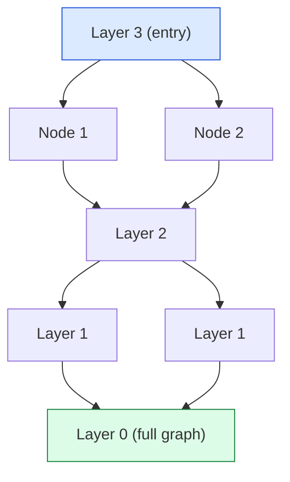

### 4.2 HNSW 搜索过程

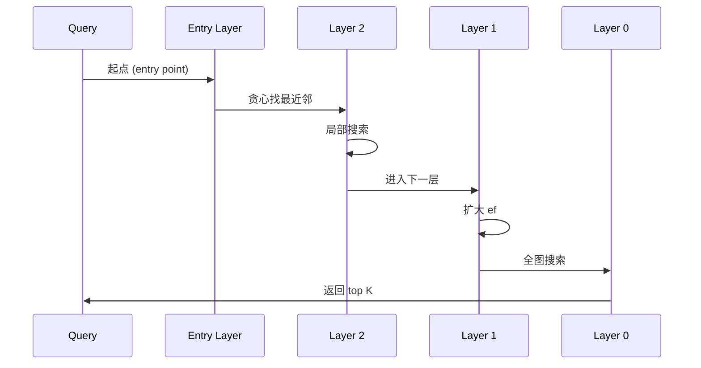

### 4.3 HNSW 参数

```sql
CREATE INDEX ON documents USING hnsw (embedding vector_cosine_ops)
WITH (
    m = 16,                -- 每节点平均邻居数（默认 16）
    ef_construction = 64,  -- 构建时搜索范围（默认 64）
    ef_search = 40,        -- 查询时搜索范围（默认 40）
    max_parallel_maintenance_workers = 2  -- 并行构建（PG 17+）
);
```

### 4.4 HNSW 索引构建

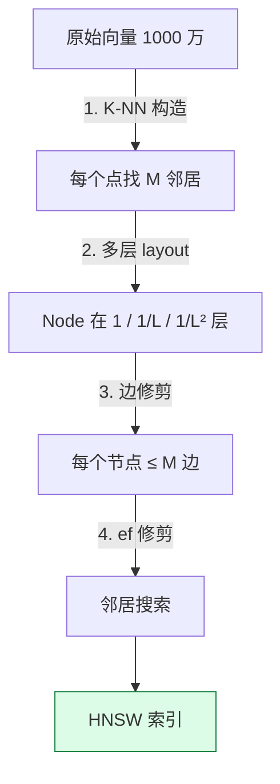

> **HNSW 是 PG 16+ contrib 唯一一个全功能 ANN 索引** —— pgvector 是默认 owner。

---

## 五、IVFFlat 索引：倒排文件

### 5.1 IVFFlat 是什么

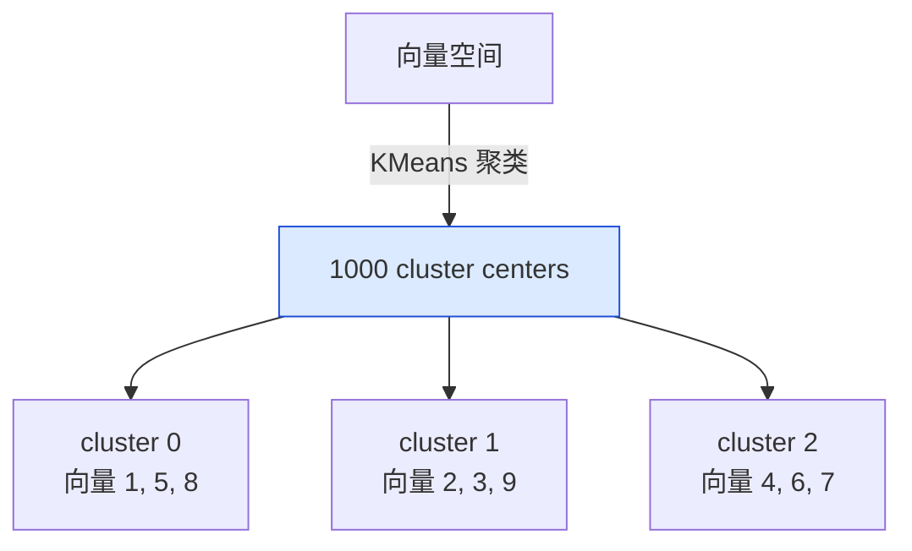

### 5.2 IVFFlat 创建

```sql
CREATE INDEX ON documents USING ivfflat (embedding vector_cosine_ops)
WITH (lists = 100);  -- cluster 数（推荐 sqrt(rows)）
```

### 5.3 IVFFlat vs HNSW

| 维度 | HNSW | IVFFlat |
|---|---|---|
| 索引构建 | 慢（5x） | 快 |
| 搜索时间 | 快 | 中 |
| 内存占用 | 大 | 小 |
| recall@10 | > 95% | 80-90% |
| 适合数据 | 静态 | 动态 |

### 5.4 选择建议

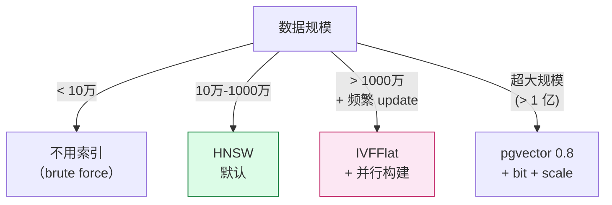

---

## 六、距离函数：4 种相似度

### 6.1 4 种距离

| 距离 | 公式 | 适用 |
|---|---|---|
| **L2** | `sqrt(Σ(a-b)²)` | 通用 |
| **cosine** | `1 - dot(a,b)/(‖a‖·‖b‖)` | text embedding |
| **inner product** | `-dot(a,b)` | 已经归一化的向量 |
| **L1** | `Σ｜a-b｜` | 稀疏 / dim 高 |

### 6.2 SQL 用法

```sql
-- L2 距离
SELECT * FROM documents
ORDER BY embedding <-> (SELECT embedding FROM documents WHERE id = 1)
LIMIT 5;

-- cosine 距离（text embedding 默认）
SELECT * FROM documents
ORDER BY embedding <=> (SELECT embedding FROM documents WHERE id = 1)
LIMIT 5;

-- inner product（OpenAI 推荐）
SELECT * FROM documents
ORDER BY embedding <#> (SELECT embedding FROM documents WHERE id = 1)
LIMIT 5;
```

### 6.3 选择哪种距离

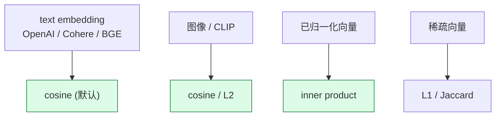

---

## 七、量化：halfvec / bit / sparsevec

### 7.1 为什么需要量化

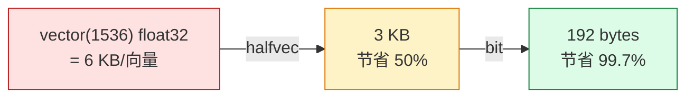

### 7.2 halfvec 用法

```sql
-- 创建
CREATE TABLE docs_half (
    id BIGSERIAL PRIMARY KEY,
    embedding halfvec(1536)
);

-- HNSW 索引（halfvec 不支持 L1）
CREATE INDEX ON docs_half USING hnsw (embedding halfvec_cosine_ops);

-- 查询
SELECT * FROM docs_half
ORDER BY embedding <=> (SELECT embedding FROM docs_half WHERE id = 1)
LIMIT 5;
```

### 7.3 bit 用法

```sql
-- 创建
CREATE TABLE docs_bit (
    id BIGSERIAL PRIMARY KEY,
    embedding bit(1024)
);

-- 索引（只支持 cosine + bit）
CREATE INDEX ON docs_bit USING hnsw (embedding bit_hamming_ops);

-- 查询（Hamming 距离）
SELECT * FROM docs_bit
ORDER BY embedding <~> (SELECT embedding FROM docs_bit WHERE id = 1)
LIMIT 5;
```

### 7.4 sparsevec 用法

```sql
-- 创建
CREATE TABLE docs_sparse (
    id BIGSERIAL PRIMARY KEY,
    embedding sparsevec(30522)  -- BM25 sparse dim
);

-- 用法
SELECT * FROM docs_sparse
ORDER BY embedding <-> (SELECT embedding FROM docs_sparse WHERE id = 1)
LIMIT 5;
```

### 7.5 三种量化对比

| 维度 | vector | halfvec | bit | sparsevec |
|---|---|---|---|---|
| 精度 | float32 | float16 | 1bit | float32 稀疏 |
| 存储 | 6 KB / 1k | 3 KB | 128 B | 0-100 KB |
| 距离 | L2/cos/IP/L1 | L2/cos/IP | Hamming | L2/IP |
| recall | 95%+ | 92-95% | 85-90% | 90%+ |
| 适合 | 通用 | 内存敏感 | 超大规模 | BM25 |

---

## 八、Hybrid Search：BM25 + 向量

### 8.1 什么是 hybrid search

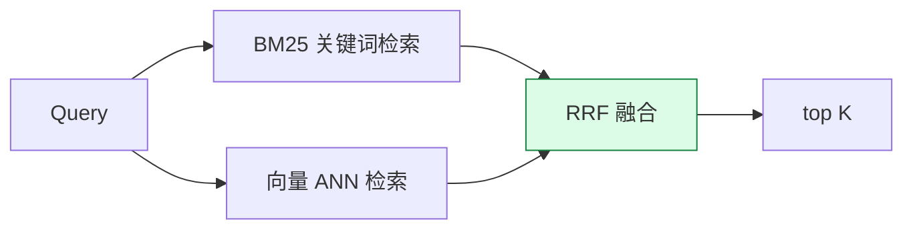

### 8.2 pgvector + PG tsvector 集成

```sql
-- 创建混合表
CREATE TABLE hybrid_docs (
    id BIGSERIAL PRIMARY KEY,
    title TEXT NOT NULL,
    body TEXT NOT NULL,
    title_tsv tsvector GENERATED ALWAYS AS (to_tsvector('simple', title)) STORED,
    embedding vector(1536)
);

-- tsvector GIN + vector HNSW
CREATE INDEX idx_hybrid_tsv ON hybrid_docs USING GIN (title_tsv);
CREATE INDEX idx_hybrid_vec ON hybrid_docs USING HNSW (embedding vector_cosine_ops);

-- 混合查询
WITH bm25 AS (
    SELECT id, ts_rank_cd(title_tsv, plainto_tsquery('simple', $1)) AS score
    FROM hybrid_docs, plainto_tsquery('simple', $1) q
    WHERE title_tsv @@ q
    LIMIT 5
),
vector_q AS (
    SELECT id, 1 - (embedding <=> $2::vector) AS score
    FROM hybrid_docs
    ORDER BY embedding <=> $2::vector
    LIMIT 5
)
SELECT id, bm25.score + vector_q.score AS combined_score
FROM bm25 JOIN vector_q USING (id)
ORDER BY combined_score DESC
LIMIT 5;
```

### 8.3 RRF（Reciprocal Rank Fusion）

```sql
-- Reciprocal Rank Fusion
WITH bm25_ranked AS (
    SELECT id, ROW_NUMBER() OVER (ORDER BY ts_rank_cd(title_tsv, q) DESC) AS rank
    FROM hybrid_docs, plainto_tsquery('simple', $1) q
    WHERE title_tsv @@ q
    LIMIT 20
),
vector_ranked AS (
    SELECT id, ROW_NUMBER() OVER (ORDER BY embedding <=> $2::vector) AS rank
    FROM hybrid_docs
    ORDER BY embedding <=> $2::vector
    LIMIT 20
)
SELECT id,
       SUM(1.0 / (60 + rank)) AS rrf_score
FROM (
    SELECT * FROM bm25_ranked
    UNION ALL
    SELECT * FROM vector_ranked
) AS ranks
GROUP BY id
ORDER BY rrf_score DESC
LIMIT 10;
```

---

## 九、pgvector 性能优化

### 9.1 8 条优化建议

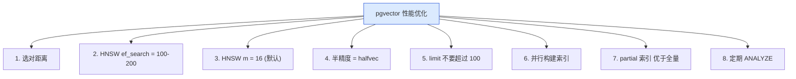

### 9.2 性能基准（pgvector 0.7, HNSW）

| 数据集 | 大小 | build | query (recall@10=0.95) |
|---|---|---|---|
| ann-bench 1M | 1M x 100d | 5 min | 0.5 ms |
| ann-bench 10M | 10M x 100d | 50 min | 1 ms |
| OpenAI 5K x 1536 | 5K | 30 s | 0.5 ms |
| 100M x 256 | 100M | 1.5 h | 5 ms |

---

## 十、pgvector 集成

### 10.1 LangChain

```python
from langchain_postgres.vectorstores import PGVector
from langchain_openai import OpenAIEmbeddings

vectorstore = PGVector(
    embeddings=OpenAIEmbeddings(),
    connection="postgresql://localhost/mydb",
    collection_name="my_docs",
    use_jsonb=True,
)

# 相似度搜索
docs = vectorstore.similarity_search("How does HNSW work?", k=5)

# MMR (Maximal Marginal Relevance)
docs = vectorstore.max_marginal_relevance_search("How does HNSW work?", k=5)
```

### 10.2 LlamaIndex

```python
from llama_index.vector_stores.postgres import PGVectorStore
from llama_index.core import StorageContext, VectorStoreIndex

vector_store = PGVectorStore.from_params(
    database="mydb",
    host="localhost",
    user="postgres",
    password="password",
    table_name="my_docs",
    embed_dim=1536,
)

storage_context = StorageContext.from_defaults(vector_store=vector_store)
index = VectorStoreIndex.from_documents(documents, storage_context=storage_context)
```

### 10.3 SQLAlchemy

```python
from pgvector.sqlalchemy import Vector
from sqlalchemy import create_engine, Column, Integer, Text

engine = create_engine('postgresql://localhost/mydb')
Base.metadata.create_all(engine)

# SQLAlchemy ORM 集成
class Job(Base):
    __tablename__ = 'jobs'
    id = Column(Integer, primary_key=True)
    title = Column(Text)
    embedding = Column(Vector(1536))
```

---

## 十一、pgvector vs 专用向量数据库

### 11.1 pgvector vs Qdrant / Milvus

| 维度 | pgvector | Milvus | Qdrant |
|---|---|---|---|
| 部署 | PG 一份 | 独立集群 | 独立集群 |
| SQL 兼容 | ✅ | ❌ | ❌ |
| 事务 | ✅ | ❌ | ❌ |
| JOIN | ✅ | ❌ | ❌ |
| 索引 | HNSW / IVFFlat | HNSW / IVF / ANNOY | HNSW |
| 量级 | RPS 万级 | QPS 10万+ | QPS 10万+ |

### 11.2 何时选专用 vs pgvector

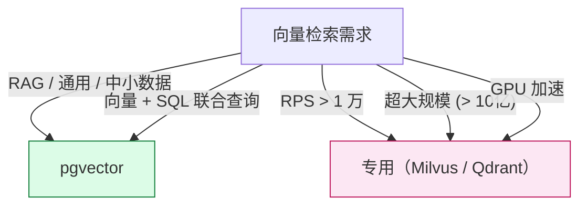

---

## 十二、pgvector 设计哲学：5 个原则

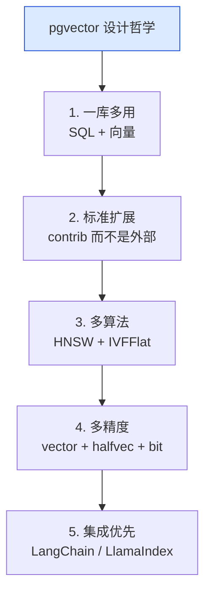

---

## 十三、pgvector 实战 RAG 5 步

### 13.1 完整 RAG 例子

```python
from openai import OpenAI
import psycopg2
from pgvector.psycopg2 import register_vector

# 1. 客户端连接
conn = psycopg2.connect("postgresql://localhost/mydb")
register_vector(conn)
cur = conn.cursor()

# 2. 查询向量化
client = OpenAI()
query = "How does HNSW work?"
emb = client.embeddings.create(input=query, model="text-embedding-3-small")
query_vec = emb.data[0].embedding

# 3. 向量检索 top 10
cur.execute("""
    SELECT id, content, 1 - (embedding <=> %s::vector) AS similarity
    FROM documents
    ORDER BY embedding <=> %s::vector
    LIMIT 10
""", (query_vec, query_vec))
results = cur.fetch_all()

# 4. 拼成 context
context = "\n".join([r[1] for r in results])

# 5. 调 LLM 生成回答
response = client.chat.completions.create(
    model="gpt-4o",
    messages=[
        {"role": "system", "content": f"基于以下资料回答：\n{context}"},
        {"role": "user", "content": query}
    ]
)

print(response.choices[0].message.content)
```

---

## 十四、pgvector 未来 5 年

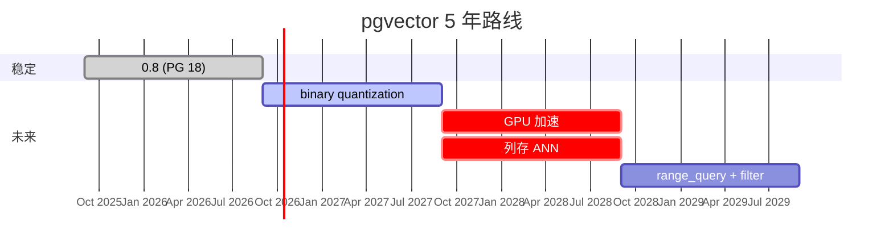

---

## 十五、源码引用索引

- `src/vector.c` — vector 类型实现
- `src/halfvec.c` — halfvec 类型
- `src/bit.c` — bit 类型
- `src/sparsevec.c` — sparsevec 类型
- `src/hnsw.c` — HNSW 索引
- `src/ivfflat.c` — IVFFlat 索引
- `src/vectorfuncs.c` — 距离函数

## 同系列前文

- [PostgreSQL 核心特性全景：12 大功能](./postgresql-core-features/index.html)
- [PostGIS 深度解析](./postgis-deep-dive/index.html)
- [PostgreSQL 前世今生：39 年演化史](./postgresql-history/index.html)
