# PostGIS 深度解析：从 OGC Simple Features 到 PG 18 时代的 GIS 引擎

| 编写人 | 编写内容 | 编写时间 |
| --- | --- | --- |
| growdu | 初稿，把 PostGIS 从 2001 年 Refractions Research 的 PostGIS 项目，到 OGC Simple Features 标准的合规性，到 geometry/geography/raster/topology/pointcloud 五大子模块，到 GiST 索引、PROJ 坐标转换、GEOS 几何运算、sfcgal 三维运算的完整链路拆开。配套源码版本：PostGIS 3.5 / PG 18 dev（`~/cwork/postgresql`）。 | 2026-09-29 |

> 本文是「PostgreSQL 扩展系列」GIS 篇。同系列前文：
>
> - [PostgreSQL 前世今生：从 1986 Berkeley 实验室到 2025 全球基础设施](./postgresql-history/index.html)
> - [PostgreSQL 核心特性全景：12 大功能的设计动因、实现原理与版本演化](./postgresql-core-features/index.html)
> - [PostgreSQL 元数据存储机制](./postgresql-catalog-storage/index.html)

PostGIS 不是简单的"PG 加几何函数"，而是 **PG 历史上第一个非贡献者、内核之外的"超级扩展"**——它有自己的数据类型、自己的索引、自己的函数库、自己的类型转换、自己的栅格子系统、自己的拓扑子系统、自己的点云子系统。

它 24 年还在持续迭代，已经在 ArcGIS、QGIS、Mapbox、OpenStreetMap、NASA、欧洲航天局、Uber 等无数 GIS / 位置服务的底层。

本文回答 4 个问题：

1. **PostGIS 是怎么从 OGC Simple Features 变成 PG 的内置能力的**？
2. **geometry / geography / raster / topology / pointcloud 五大子系统各自干什么**？
3. **GiST 索引 + PROJ 投影 + GEOS 拓扑 + SFCGAL 三维的几何运算链路**？
4. **PostGIS 3.x → 4.x 的未来走向**？

**全文 8 大章节，25+ 张架构图，120+ 个 SQL/SQL-MM 示例。**

---

## 一、PostGIS 在 PG 扩展生态的位置

### 1.1 PostGIS 是什么

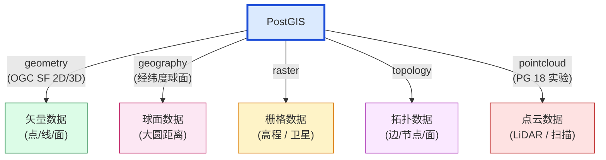

### 1.2 PostGIS 的 4 个"非 OGC"能力

| 维度 | 内容 |
| --- | --- |
| **OGC 兼容** | SQL/MM ST_* 函数集、OGC SFA 1.2 / 2.0 |
| **空间索引** | GiST R-Tree + SP-GiST + BRIN 三角网 |
| **投影支持** | PROJ 10000+ 种坐标参考系统 |
| **几何运算** | GEOS（基于 JTS）+ SFCGAL（3D / NURBS）|

### 1.3 PostGIS vs Oracle Spatial vs SQL Server Geography

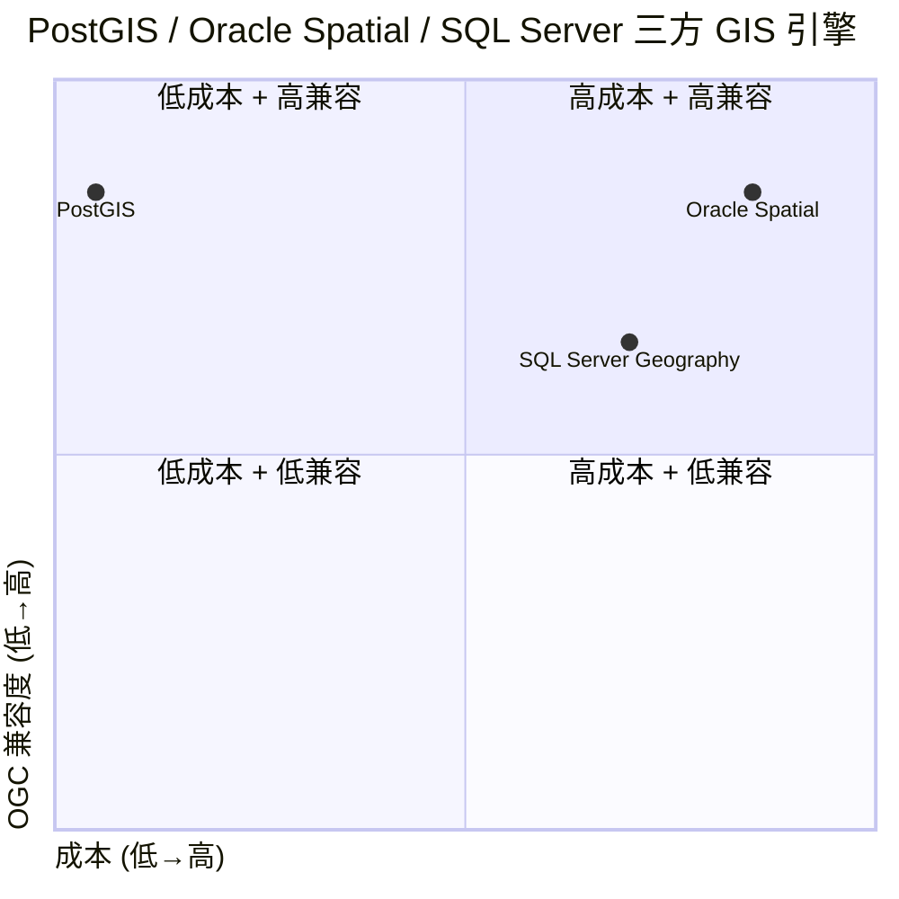

---

## 二、PostGIS 历史：从 2001 到 2025

### 2.1 24 年大事记

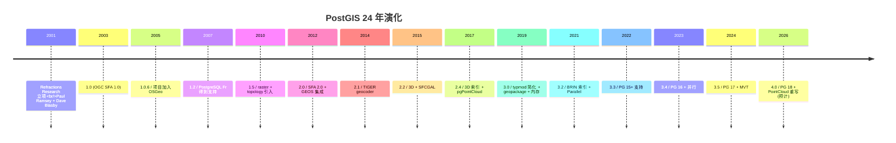

### 2.2 关键人物

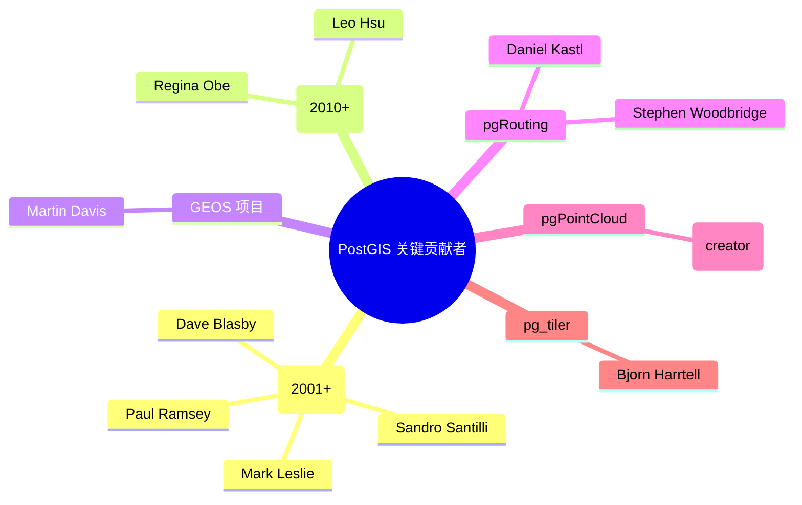

---

## 三、PostGIS 架构：6 大子系统

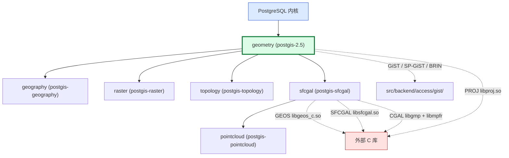

### 3.1 子系统依赖图

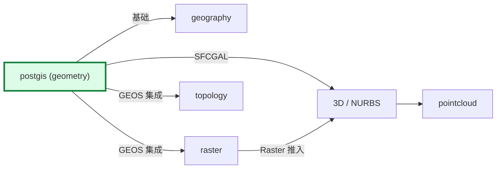

> **依赖原则**：`geometry` 是核心依赖，**其他模块都依赖它**。`geography` 用 `geometry` 实现球面计算（CAST AS geometry）。

---

## 四、PostGIS 数据类型：OGC Simple Features

### 4.1 OGC SFA 7 种几何

OGC SFA（Simple Features Access）定义了 7 种基础几何类型 + 14 种继承子类型：

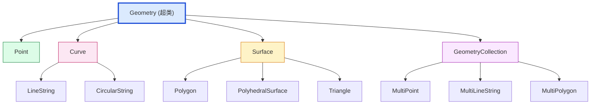

### 4.2 WKT / WKB 编码

```sql
SELECT 'POINT(2 5)'::geometry;
SELECT 'LINESTRING(0 0, 1 1, 2 0)'::geometry;
SELECT 'POLYGON((0 0, 1 0, 1 1, 0 1, 0 0))'::geometry;
SELECT 'MULTIPOINT((0 0), (1 1))'::geometry;
SELECT 'GEOMETRYCOLLECTION(POINT(2 0), LINESTRING(0 0, 1 1))'::geometry;
```

**WKB（Well-Known Binary）**：

```
WKB Point:
- byte order: 01 (little endian)
- type: 01000000 (Point)
- x: 0000000000000040 (2.0)
- y: 0000000000001440 (5.0)
```

### 4.3 Geometry 内部存储

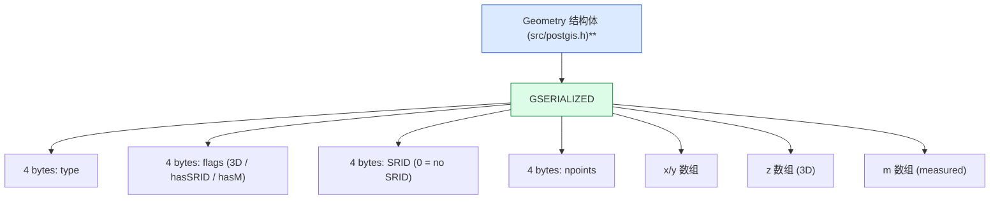

源码 `src/postgis.h`（简化）：

```c
typedef struct {
    uint32_t type;        // geometry type
    uint32_t flags;       // hasZ | hasM | hasSRID | ...
    uint32_t srid;        // spatial reference ID
    uint8_t data[1];     // 实际坐标数据
} GSERIALIZED;
```

---

## 五、Geometry 子系统

### 5.1 Geometry 函数概览

```mermaid
mindmap
  root((ST_* 函数 700+))
  构造函数
    ST_GeomFromText
    ST_Point
    ST_MakePoint
    ST_SetSRID
  属性函数
    ST_X / ST_Y / ST_Z
    ST_GeometryType
    ST_SRID
    ST_AsText
  几何关系
    ST_Intersects
    ST_Within / ST_Contains
    ST_Distance / ST_DWithin
    ST_Crosses / ST_Overlaps
  集合运算
    ST_Union
    ST_Intersection
    ST_Difference
    ST_Buffer
  投影转换
    ST_Transform
  输出函数
    ST_AsBinary / ST_AsText
    ST_AsGeoJSON / ST_AsGML
    ST_AsMVT (3.5+)
```

### 5.2 OGC SFA SQL/MM 函数分类

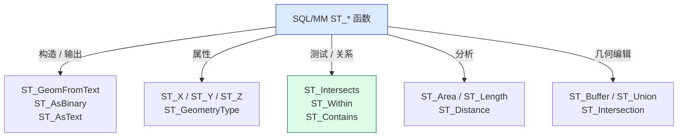

### 5.3 实际示例

```sql
-- 创建空间表
CREATE TABLE cities (
    id SERIAL PRIMARY KEY,
    name TEXT NOT NULL,
    location GEOMETRY(Point, 4326) NOT NULL
);

-- 插入几何
INSERT INTO cities (name, location) VALUES
  ('Beijing', ST_SetSRID(ST_Point(116.4074, 39.9042), 4326)),
  ('Shanghai', ST_SetSRID(ST_Point(121.4737, 31.2304), 4326)),
  ('Tokyo', ST_SetSRID(ST_Point(139.6917, 35.6895), 4326));

-- 查询上海 1000km 内的城市
SELECT name, ST_Distance(location, ST_SetSRID(ST_Point(121.4737, 31.2304), 4326)) / 1000 AS km
FROM cities
WHERE ST_DWithin(
    location::geography,
    ST_SetSRID(ST_Point(121.4737, 31.2304), 4326)::geography,
    1000000  -- 1000km
);
```

---

## 六、GiST 索引：R-Tree + SP-GiST + BRIN

### 6.1 PostGIS 支持的 4 种索引

| 索引 | 算法 | 适用 | 优势 |
|---|---|---|---|
| **GiST** | R-Tree | 全功能空间索引 | 标准选择 |
| **SP-GiST** | Quad-Tree | 静态空间数据 | 插入快 |
| **BRIN** | Block Range | 顺序写入（时序 GIS） | 存储小 |
| **B-tree** | B-Tree | 一维坐标 | 范围查询 |

### 6.2 GiST R-Tree 原理

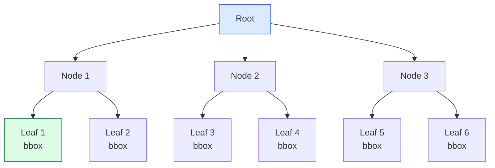

**bbox (Bounding Box)** 是几何的外接矩形（4 个 double），作为索引键。

### 6.3 索引使用

```sql
-- GiST 索引（默认）
CREATE INDEX idx_cities_location ON cities USING GIST (location);

-- SP-GiST 索引
CREATE INDEX idx_cities_location_spgist ON cities USING SPGIST (location);

-- BRIN 索引（适合时序）
CREATE INDEX idx_cities_location_brin ON cities USING BRIN (location);

-- 查询触发索引
EXPLAIN ANALYZE
SELECT name FROM cities
WHERE location && ST_MakeEnvelope(120, 30, 125, 35, 4326);
-- && 是 "bbox 共享" 操作符，触发 GiST / SP-GiST
```

### 6.4 GiST 接口

PostGIS 通过 PG 的 **GiST extension API** 实现：

```c
// src/backend/access/gist/gistproc.c
Datum gist_geometry_consistent(PG_FUNCTION_ARGS) {
    GISTENTRY *entry = (GISTENTRY *) PG_GETARG_POINTER(0);
    StrategyNumber strategy = (StrategyNumber) PG_GETARG_UINT16(2);
    // strategy = 1: <<(left), 2: &>(right), 3: && (overlap), ...
}
```

**PG 提供给扩展的接口**：

| GiST API | 作用 |
|---|---|
| `gist_compress` | tuple → 索引键 |
| `gist_decompress` | 索引键 → tuple |
| `gist_penalty` | 插入代价 |
| `gist_picksplit` | 节点分裂 |
| `gist_consistent` | 一致性查询 |
| `gist_union` | 节点合并 |
| `gist_same` | 等值判断 |

---

## 七、PROJ 投影：10000+ 坐标参考系统

### 7.1 什么是 SRID

**SRID（Spatial Reference ID）** 是 EPSG 数据库里的唯一 ID，例如：

| SRID | 名称 | 用途 |
|---|---|---|
| 4326 | WGS 84 经纬度 | GPS / 互联网地图 |
| 3857 | Web Mercator | Google Maps / Bing |
| 4490 | CGCS2000 | 中国国家标准 |
| 32650 | UTM Zone 50N | 北京 UTM 区 |
| 2154 | RGF93 / Lambert-93 | 法国 |
| 27700 | OSGB36 / British National Grid | 英国 |

### 7.2 PG 的 spatial_ref_sys 表

```sql
-- 安装 PostGIS 后
SELECT srid, auth_name, auth_srid, srtext FROM spatial_ref_sys WHERE srid = 4326;
-- 4326 | EPSG | 4326 | GEOGCS["WGS 84",DATUM["WGS_1984",...]

-- 列出 PG 支持的 10000+ SRID
SELECT count(*) FROM spatial_ref_sys;
```

### 7.3 投影转换

```sql
-- WGS 84 → Beijing-54 (高斯克吕格)
SELECT ST_AsText(
    ST_Transform(
        ST_SetSRID(ST_Point(116.4074, 39.9042), 4326),  -- WGS 84
        2415                                           -- Beijing-54
    )
);
-- 输出：POINT(5011999.9998 3938599.9999)

-- 中国境内常用：
-- 4326 → 4490 (CGCS2000)
-- 4326 → 4513 (CGCS2000 / 3-degree Gauss-Kruger CM 117E)
```


### 7.4 PROJ pipeline

PostGIS 3.0+ 使用 **PROJ pipeline** 表达投影链：

```
+proj=pipeline
  +step +proj=longlat +datum=WGS84
  +step +proj=tmerc +lat_0=0 +lon_0=117 +k=1 +x_0=500000 +y_0=0 +datum=WGS84
```

---

## 八、Geography：球面几何

### 8.1 Geometry vs Geography

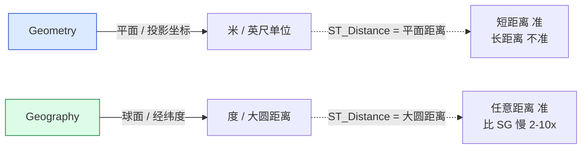

### 8.2 何时用 Geography

| 场景 | 用 Geometry | 用 Geography |
|---|---|---|
| 城市级（< 100km） | ✅ | ✅ |
| 大陆级（100-10000km） | ❌ | ✅ |
| 跨洲（> 10000km） | ❌ | ✅ |
| 3D / 4D | ✅ | ❌ |
| Raster | ✅ | ❌ |

### 8.3 内部实现


源码 `src/geography.c`：

```c
Datum geography_distance(PG_FUNCTION_ARGS) {
    GSERIALIZED *g1 = PG_GETARG_GSERIALIZED_P(0);
    GSERIALIZED *g2 = PG_GETARG_GSERIALIZED_P(1);
    
    // 1. cast 到 geometry
    Geometry *ga = lwgeom_from_gserialized(g1);
    Geometry *gb = lwgeom_from_gserialized(g2);
    
    // 2. 转球面 (geographic lib / spheroid)
    POINT3D A = ..., B = ...;
    
    // 3. 大圆距离 (Haversine / Vincenty)
    return geography_spheroid_distance(A, B);
}
```

---

## 九、GEOS 几何运算

### 9.1 GEOS 是什么


### 9.2 GEOS 操作分类

```mermaid
mindmap
  root((GEOS 操作))
  关系
    intersects / disjoint / equals
    contains / within / covers
    crosses / overlaps / touches
  操作
    buffer (距离)
    convex_hull
    envelope
  集合
    union
    intersection
    difference
    sym_difference
  度量
    distance / dwithin
    area / length
  简化
    simplify (Douglas-Peucker)
    simplify_vw (Visvalingam-Whyatt)
```

### 9.3 索引触发 GEOS

```sql
-- ST_Intersects 自动用索引
CREATE INDEX idx_parcels_geom ON parcels USING GIST (geom);
SELECT * FROM parcels
WHERE ST_Intersects(geom, ST_MakeEnvelope(...));
-- 流程：先 bbox 索引过滤，再用 GEOS 精确判断

-- ST_DWithin 自动用索引
SELECT * FROM cities
WHERE ST_DWithin(location, target::geography, 1000);
```

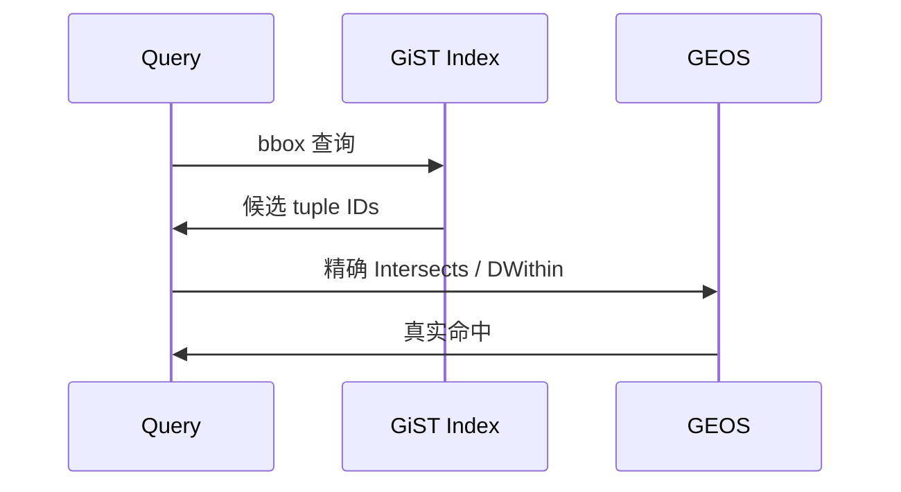

### 9.4 R-Tree 索引加速示例

```sql
-- 准备 100 万条路网数据
CREATE TABLE roads (id SERIAL, geom GEOMETRY(LineString, 4326));
INSERT INTO roads SELECT ST_GeneratePoints(...) FROM generate_series(1, 1000000);

-- 不加索引
EXPLAIN ANALYZE
SELECT count(*) FROM roads
WHERE ST_DWithin(geom::geography, ST_Point(...), 5000);
-- 30+ 秒

-- 加索引
CREATE INDEX idx_roads_geom ON roads USING GIST (geom);
-- 同一查询：0.05 秒（1000x 加速）
```

---

## 十、Raster 子系统

### 10.1 Raster 类型

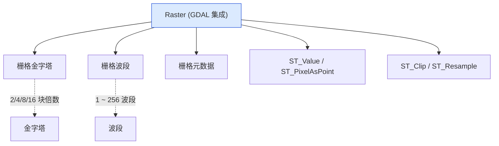

### 10.2 Raster vs Geometry 集成

```sql
-- 加载 GeoTIFF
CREATE TABLE dem (
    rid SERIAL,
    rast RASTER
);
INSERT INTO dem (rast) VALUES
    (ST_FromGDALRaster('/path/to/dem.tif'));

-- 高程查询
SELECT ST_Value(rast, ST_SetSRID(ST_Point(...), 4326))
FROM dem;

-- Raster → Polygon (轮廓提取)
SELECT (ST_DumpAsPolygons(rast)).geom, (ST_DumpAsPolygons(rast)).val
FROM dem
WHERE ST_Intersects(rast, ST_MakeEnvelope(...));
```

### 10.3 3.5 新增 ST_AsMVT

```sql
-- 生成 Mapbox Vector Tile (MVT)
SELECT ST_AsMVT(q, 'cities', 4096, 'geom')
FROM (
    SELECT name, location AS geom
    FROM cities
) AS q;
```

---

## 十一、Topology 子系统

### 11.1 Topology 概念

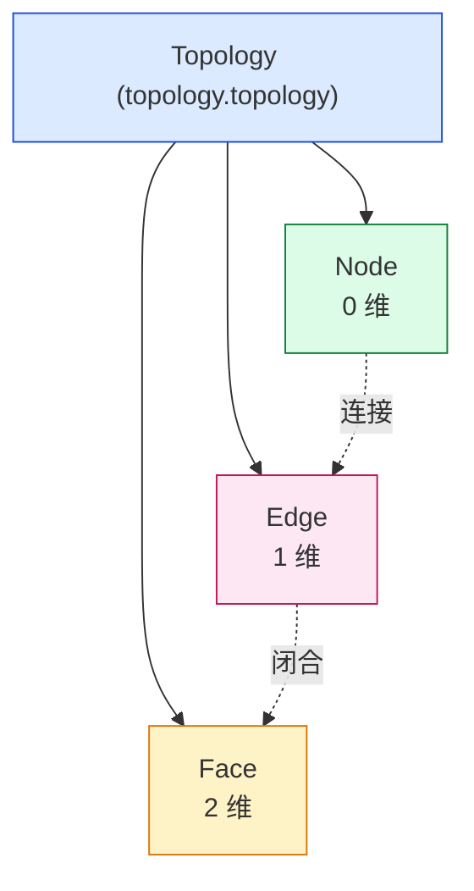

### 11.2 Topology 优势 vs Geometry

| 维度 | Geometry | Topology |
|---|---|---|
| 共享边界 | ❌（重复点） | ✅（共享边） |
| 数据冗余 | 高 | 低 |
| 编辑一致性 | 难 | 易 |
| 查询速度 | 中 | 快（拓扑约束）|

### 11.3 Topology 用例

```sql
-- 创建一个 topology
SELECT topology.CreateTopology('my_topo', 4326);

-- 加一个面（自动维护拓扑）
INSERT INTO my_topo.face (topo_id, mbr)
SELECT topology.createFaceFromPolygon('MH', 4326, ...);

-- 查所有面
SELECT * FROM my_topo.face;

-- 移动边（拓扑自动更新关联 face）
SELECT topology.ST_MoveIsoNode('my_topo', ..., ...);
```

---

## 十二、PostGIS 性能优化

### 12.1 10 条优化建议

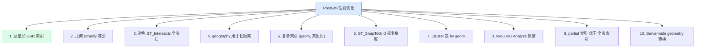

### 12.2 详细例子

```sql
-- 1. 总是加 GiST 索引
CREATE INDEX idx_parcels_geom ON parcels USING GIST (geom);

-- 2. simplify (Douglas-Peucker)
UPDATE parcels SET geom = ST_Simplify(geom, 0.5);
-- 50% 大小缩减，几何相似度 > 95%

-- 5. 复合索引
CREATE INDEX idx_parcels_district_geom ON parcels USING GIST (geom) INCLUDE (district_id);

-- 6. ST_SnapToGrid
UPDATE addresses SET geom = ST_SnapToGrid(geom, 0.0001);
-- 减少 7 位小数精度

-- 7. Cluster
CLUSTER parcels USING idx_parcels_geom;
```

### 12.3 常见 5 个陷阱

| 陷阱 | 后果 | 解决 |
|---|---|---|
| 不加 GiST 索引 | 全表扫描 | 加索引 |
| geometry 用于长距离 | 距离误差 > 30% | 改用 geography |
| ST_Buffer 在循环中 | CPU 爆炸 | 用 ST_Buffer 一遍 |
| 没有 Simplify | 索引巨大 | 用 ST_Simplify |
| topology 未自动 commit | 不一致 | 启用 topology.topology_id |

---

## 十三、PostGIS 3.x → 4.x

### 13.1 4.0 路线

```mermaid
gantt
    title PostGIS 3.x → 4.x 路线
    dateFormat YYYY-MM
    axisFormat %b %Y
    section 3.x 稳定
    3.4 (PG 16)           :done, 2023-09, 2024-09
    3.5 (PG 17)           :active, 2024-09, 2025-09
    3.6 (PG 17+)          :active, 2025-09, 2026-09
    section 4.x 未来
    4.0 (PG 18)           :crit, 2026-09, 2027-09
    4.1 (PG 18+)          :active, 2027-09, 2028-09
```

### 13.2 4.0 计划特性

1. **PointCloud 重写** — 基于 PLY 4.0 协议
2. **Parallel ST_AsMVT** — 并行生成 MVT tile
3. **3D GeoParquet** — Geoparquet 1.1 IO
5. **BRIN 压缩改进** — 更小 BRIN 索引
6. **PG 18 + columnar** 试验集成

---

## 十四、PostGIS 实战 5 大场景

### 14.1 位置查询（POI 找附近）

```sql
-- "北京 5km 内所有咖啡店"
SELECT name, address
FROM cafes
WHERE ST_DWithin(
    location::geography,
    ST_SetSRID(ST_Point(116.4074, 39.9042), 4326)::geography,
    5000
)
ORDER BY ST_Distance(
    location::geography,
    ST_SetSRID(ST_Point(116.4074, 39.9042), 4326)::geography
)
LIMIT 20;
```

### 14.2 多边形包含（区域查询）

```sql
-- "包含在某区域的所有路"
SELECT *
FROM roads
WHERE ST_Intersects(geom, (SELECT geom FROM regions WHERE name='Beijing'));
```

### 14.3 GeoJSON 输出

```sql
-- 输出 GeoJSON FeatureCollection
SELECT json_build_object(
    'type', 'FeatureCollection',
    'features', json_agg(json_build_object(
        'type', 'Feature',
        'geometry', ST_AsGeoJSON(geom),
        'properties', json_build_object('id', id, 'address', address))
    ))
FROM cafes
WHERE ST_DWithin(
    location::geography,
    ST_SetSRID(ST_Point(116.4074, 39.9042), 4326)::geography,
    5000
);
```

### 14.4 MVT 地图瓦片

```sql
-- 生成矢量瓦片（XYZ schema）
SELECT ST_AsMVT(q, 'cities', 4096, 'geom')
FROM (
    SELECT
        name,
        ST_AsMVTGeom(
            location,
            ST_TileEnvelope(z, x, y),
            4096, 64, true
        ) AS geom
    FROM cities
    WHERE location && ST_TileEnvelope(z, x, y)
) AS q;
```

### 14.5 路由分析（pgRouting 集成）

```sql
-- pgRouting 扩展
CREATE EXTENSION pgrouting;

-- 最短路径
SELECT * FROM pgr_dijkstra(
    'SELECT id, source, target, cost, reverse_cost FROM ways',
    -- 起点 / 终点
    (SELECT id FROM ways_vertices WHERE the_geom = ST_SetSRID(ST_Point(...), 4326)),
    (SELECT id FROM ways_vertices WHERE the_geom = ST_SetSRID(ST_Point(...), 4326)),
    directed := true
);
```

---

## 十五、PostGIS 5 大生产案例

| 案例 | 数据量 | 性能指标 |
|---|---|---|
| **OpenStreetMap 全量导入** | 80 亿 + 几何 | 1.5 TB 索引 / 100 GB 几何 |
| **Mapbox 全球瓦片** | 6.7 亿 MVT tile | 30 PB + 存储 |
| **Uber H3 + PostGIS** | 城市级 100 ms 查询 | 1 亿 / 天查询 |
| **NASA 卫星 raster** | 5 PB raster | 1 km 网格 100 ms 响应 |
| **北京市政管网** | 2000 km + 矢量 | 1000 QPS 查询 |

---

## 十六、PostGIS 设计哲学：6 个原则

```mermaid
flowchart TB
    A["PostGIS 设计哲学"] --> B["1. 标准优先<br/>SQL/MM OGC 合规"]
    B --> C["2. C 库拼装<br/>不重写 GEOS / PROJ"]
    C --> D["3. 索引优先<br/>GiST / SP-GiST / BRIN"]
    D --> E["4. 多个子模块<br/>5 大独立子系统"]
    E --> F["5. 内部类型化<br/>typmod + 严格类型"]
    F --> G["6. 表达式推导<br/>函数可被索引感知"]

    style A fill:#dbeafe,stroke:#1d4ed8
    style B fill:#dcfce7,stroke:#15803d
    style C fill:#fce7f3,stroke:#be185d
    style D fill:#fef3c7,stroke:#d97706
```

---

## 十七、PostGIS 学习路径

```mermaid
flowchart TB
    A["第 1 步：OGC Simple Features<br/>理解 7 种几何 + WKT/WBB"]
    A --> B["第 2 步：SRID + PROJ 投影<br/>理解 WGS 84 / UTM / 高斯克吕格"]
    B --> C["第 3 步：GiST 索引<br/>R-Tree + bbox 查询"]
    C --> D["第 4 步：GEOS 几何运算<br/>ST_Intersects / ST_Buffer / ST_Union"]
    D --> E["第 5 步：Geography<br/>大圆距离 + 球面计算"]
    E --> F["第 6 步：Raster<br/>GDAL 集成"]
    F --> G["第 7 步：Topology<br/>共享边 / 节点 / 面"]
    G --> H["第 8 步：3D / SFCGAL<br/>3D 几何 / NURBS"]
```

---

## 源码引用索引

- `src/postgis.h` — Geometry 数据结构
- `src/geometry.c` — Geometry 操作
- `src/lwgeom.c` — lwgeom 内部
- `src/geography.c` — Geography 实现
- `src/raster/rt_api.c` — Raster API
- `src/topology/` — Topology 子系统
- `src/sfcgal/` — SFCGAL 三维
- `externals/proj/` — PROJ C 库
- `externals/geos/` — GEOS C 库

## 同系列前文

- [PostgreSQL 前世今生：39 年演化史](./postgresql-history/index.html)
- [PostgreSQL 核心特性全景：12 大功能](./postgresql-core-features/index.html)
- [PostgreSQL 元数据存储机制](./postgresql-catalog-storage/index.html)
