# PostgreSQL Background Worker 全解：从 `RegisterBackgroundWorker` 到逻辑复制 4 类 worker 的全生命周期

| 编写人 | 编写内容 | 编写时间 |
| --- | --- | --- |
| growdu | 初稿，基于 PostgreSQL 18 dev（`~/cwork/postgresql`，REL_18_3 之后 77 commit）源码逐行拆解 `BackgroundWorker` 子系统：`BackgroundWorker` 结构体、4 个 flags、3 个 `BgWorkerStartTime`、静态 / 动态注册、postmaster `ServerLoop` 与 `maybe_start_background_workers`、`StartBackgroundWorker` 真正 fork、`BackgroundWorkerMain` worker 入口；并完整覆盖逻辑复制 4 类 worker：`ApplyLauncherMain` launcher、`ApplyWorkerMain` leader apply、`TablesyncWorkerMain` 初始同步、`ParallelApplyWorkerMain` 并行 apply（PG 16+），重点讲清它们在 `LogicalRepCtx` 共享内存里的协同关系与失败重试链路 | 2026-09-04 |

> 本文是「PostgreSQL 源码系列」并发篇。配套源码版本：PostgreSQL 18 dev（`~/cwork/postgresql`）。同系列前文：
>
> - [PostgreSQL 从 `postgres` 二进制到生产级守护：最外层模块与启动全流程](./postgresql-module-architecture/index.html)
> - [PostgreSQL 18 并行 Worker 机制全解：从 `ParallelContext` 到 `ParallelQueryMain` 的全链路](./postgresql-parallel-worker/index.html)
> - [PostgreSQL 内存管理：从 shared_buffers 到内存上下文](./postgresql-memory-management/index.html)
> - [PostgreSQL 事务生命周期：从 BEGIN/COMMIT 到 CLOG 一条链路](./postgresql-transaction-lifecycle/index.html)
> - [PostgreSQL 逻辑复制表的生命周期：从 `pg_replication_slots` 到 `pg_subscription_rel`](./postgresql-logical-replication-tables-lifecycle/index.html)
> - [PostgreSQL 逻辑复制 Worker 模型：从 launcher 到 apply 的 8 种角色](./postgresql-logical-replication-worker-model/index.html)
> - [PostgreSQL 逻辑复制并行 Worker](./postgresql-logical-replication-parallel-worker/index.html)
> - [PostgreSQL 逻辑复制 ReorderBuffer 与事务机制：从一行 WAL 到一致性变更流](./postgresql-logical-replication-reorderbuffer-transaction/index.html)
> - [pgbench 源码全解：一个 C 文件如何撑起 PostgreSQL 官方压测工具](./pgbench-internals/index.html)

`BackgroundWorker` 是 PostgreSQL 中**所有非 client 进程的统一抽象**——逻辑复制的 launcher / apply worker / tablesync worker、流复制的 walsender、自动 vacuum、并行查询 worker、autovacuum launcher、extension 提供的自定义 worker（pg_cron / pg_partman / pg_stat_statements 内部）全都是 `BackgroundWorker` 的不同实例。

为什么所有这些进程都走同一条 fork 路径？因为 PostgreSQL 的 postmaster 用**一个统一的 fork 模型**管理所有"非用户 backend"的进程——它们不是用户登录产生的，不能走 `BackendStartup`，但又需要访问共享内存、能开事务、能跑 SQL。

本文分两层：

- **第一层：通用机制**（第一节至第十节）——`BackgroundWorker` 结构体、flags、注册 API、postmaster 的 ServerLoop、StartBackgroundWorker、BackgroundWorkerMain
- **第二层：逻辑复制**（第十一节至第十八节）——4 类 worker 的入口、它们共享的 `LogicalRepCtx`、launcher 主循环、worker 之间的依赖关系

---

## 一、BackgroundWorker 的定位

**`BackgroundWorker`**（`src/include/postmaster/bgworker.h:89`）是 PostgreSQL postmaster 用来 fork "非 client backend" 进程的**通用数据结构**。它解决了 4 个问题：

1. **共享内存访问**：很多 worker 需要读 `shared_buffers` 或写 `pg_stat_*`，必须能 attach shared memory；
2. **事务与 catalog 访问**：autovacuum、apply worker 这些需要跑 SQL 的人，必须能开 catalog 连接；
3. **启动时机控制**：有的 worker 想在 postmaster 一启动就跑（`bgw_start_time = BgWorkerStart_PostmasterStart`），有的等到系统恢复完（`BgWorkerStart_RecoveryFinished`）；
4. **统一管理**：postmaster 一个 `ServerLoop` 调度所有 worker，不需要为每类 worker 写专门的 fork 代码。

**PG 中所有的"后台"进程都是 BackgroundWorker 的实例**：

| 进程类型 | 注册方 | bgw_function_name | 备注 |
| --- | --- | --- | --- |
| autovacuum launcher | `postmaster.c` 静态注册 | `AutoVacLauncherMain` | 启动 autovacuum worker 的二级 launcher |
| autovacuum worker | autovacuum launcher 动态注册 | `AutoVacWorkerMain` | 真正跑 VACUUM/ANALYZE |
| logical replication launcher | `launcher.c` 静态注册 | `ApplyLauncherMain` | 启动 apply / tablesync / parallel apply worker |
| apply worker | launcher 动态注册 | `ApplyWorkerMain` | leader apply，处理大部分 DML |
| tablesync worker | launcher 动态注册 | `TablesyncWorkerMain` | 初始数据同步（COPY + 切流） |
| parallel apply worker | leader apply 动态注册 | `ParallelApplyWorkerMain` | 大事务分片并行 apply（PG 16+） |
| parallel query worker | leader backend 动态注册 | `ParallelQueryMain` | 并行查询（[`./postgresql-parallel-worker/index.html`]） |
| walsender | `BackendStartup` 动态注册 | `WalSndMain` | 物理/逻辑流复制的发送端 |

理解这张表之后，PG 的进程模型就清晰了——**所有非 client backend 都是 BackgroundWorker 的不同实例**。

---

## 二、源码地图

BackgroundWorker 子系统涉及 5 个核心文件，加逻辑复制的 4 个文件：

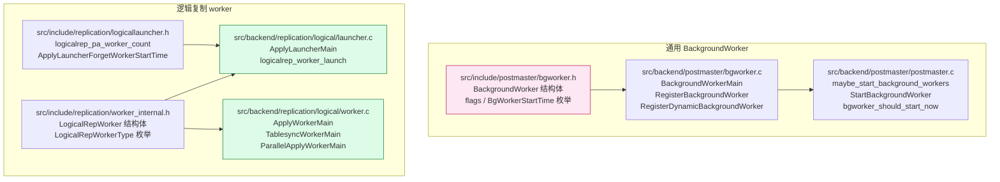

**两个子系统的协作关系**：

- 通用 BackgroundWorker 提供"fork + signal + shmem attach + 用户入口"框架；
- 逻辑复制 worker 在该框架内填入自己的"共享内存结构 `LogicalRepCtx`、GUC 限制、worker 之间的事件通知"。

---

## 三、`BackgroundWorker` 结构体详解

定义在 `src/include/postmaster/bgworker.h:89-100`：

```c
typedef struct BackgroundWorker
{
    char       bgw_name[BGW_MAXLEN];             /* 96 字节，可读名 */
    char       bgw_type[BGW_MAXLEN];             /* 96 字节，worker 分类 */
    int        bgw_flags;                        /* 见第 4 节 */
    BgWorkerStartTime bgw_start_time;            /* 见第 4 节 */
    int        bgw_restart_time;                 /* 失败重启间隔（秒），BGW_NEVER_RESTART=-1 表示不重启 */
    char       bgw_library_name[MAXPGPATH];     /* shared object 名，逻辑复制写 "postgres" */
    char       bgw_function_name[BGW_MAXLEN];    /* 入口函数名（C 符号） */
    Datum      bgw_main_arg;                     /* 传给入口函数的参数（sizeof(Datum)=8） */
    char       bgw_extra[BGW_EXTRALEN];          /* 128 字节，跨 fork 传递的额外数据 */
    pid_t      bgw_notify_pid;                   /* 启动 / 停止时 SIGUSR1 这个 pid；0 表示不通知 */
} BackgroundWorker;
```

**10 个字段的关键含义**：

| 字段 | 类型 | 用途 |
| --- | --- | --- |
| `bgw_name` | char[96] | `pg_stat_activity.backend_type` 看到的可读名，比如 `logical replication apply worker for subscription 16384` |
| `bgw_type` | char[96] | worker 分类，比如 `logical replication apply worker`；`GetBackgroundWorkerTypeByPid()` 用它查类型 |
| `bgw_flags` | int | 位掩码，见第四节 |
| `bgw_start_time` | enum | 启动时机（postmaster start / consistent state / recovery finished） |
| `bgw_restart_time` | int | 失败重启间隔；`-1` = 不重启；逻辑复制的 worker 都填 `-1`，让 launcher 负责重新调度 |
| `bgw_library_name` | char[MAXPGPATH] | `postgres`（内置）或扩展的 `.so` 名 |
| `bgw_function_name` | char[96] | 入口函数符号名，postmaster fork 后用 `dlsym` 找 |
| `bgw_main_arg` | Datum | 传给入口函数的 uintptr_t；逻辑复制传入 `LogicalRepWorker` slot index |
| `bgw_extra` | char[128] | 跨 fork 传递任意 < 128 字节数据；逻辑复制的 `WORKERTYPE_PARALLEL_APPLY` 用它传 DSM 句柄 |
| `bgw_notify_pid` | pid_t | 启动 / 停止时 SIGUSR1 谁；逻辑复制填 `MyProcPid`（launcher 自己），launcher 用 SIGUSR1 信号驱动主循环 |

---

## 四、flags 与启动时机枚举

### 4.1 `bgw_flags` 位掩码

定义在 `src/include/postmaster/bgworker.h:50-72`：

```c
#define BGWORKER_SHMEM_ACCESS                      0x0001  /* 能 attach 共享内存 */
#define BGWORKER_BACKEND_DATABASE_CONNECTION       0x0002  /* 能开 catalog 连接 */
#define BGWORKER_CLASS_PARALLEL                    0x0010  /* 受 max_parallel_workers 限制 */
```

**还有 1 个相关 flag**（在 startup 路径里，不是注册字段）：

```c
#define BGWORKER_BYPASS_ALLOWCONN                  0x0001  /* 绕过 ALTER ROLE ... ALLOW CONN 限制 */
```

**逻辑复制 worker 必带的 flags**（`launcher.c:470-471 / 943-944`）：

```c
bgw.bgw_flags = BGWORKER_SHMEM_ACCESS |
                BGWORKER_BACKEND_DATABASE_CONNECTION;
```

**为什么必须有 SHMEM_ACCESS**：worker 需要读 `LogicalRepCtx`（共享内存），还要读 `pgstat` 的快照。

**为什么必须有 BACKEND_DATABASE_CONNECTION**：worker 需要跑 SQL（读 `pg_subscription`、写 `pg_subscription_rel`）。

**为什么不用 CLASS_PARALLEL**：parallel apply worker 是**逻辑复制**特有的并行，不属于"并行查询"那个 `max_parallel_workers` 池子——它走 `max_parallel_apply_workers_per_subscription`（默认 2）。

### 4.2 `BgWorkerStartTime` 枚举

定义在 `src/include/postmaster/bgworker.h:74-82`：

```c
typedef enum
{
    BgWorkerStart_PostmasterStart,       /* postmaster 一启动就 fork，不等一致性状态 */
    BgWorkerStart_ConsistentState,       /* postmaster 进入 PM_RUN（无 replica 时） */
    BgWorkerStart_RecoveryFinished,      /* 流复制恢复完成（默认大多数 worker） */
} BgWorkerStartTime;
```

`bgworker_should_start_now`（`src/backend/postmaster/postmaster.c:4184`）根据当前 `pmState` 决定能否启动：

| pmState | 允许哪个 start_time？ |
| --- | --- |
| `PM_NO_CHILDREN` / `PM_WAIT_*` / `PM_STOP_BACKENDS` | 都不允许 |
| `PM_RUN` | 仅 `RecoveryFinished` |
| `PM_HOT_STANDBY` | `ConsistentState` + `RecoveryFinished` |
| `PM_INIT` / `PM_STARTUP` | `PostmasterStart` |

**逻辑复制 worker 都填 `BgWorkerStart_RecoveryFinished`**（`launcher.c:472`）——因为必须等 publisher 准备好。

---

## 五、注册 API：静态 vs 动态

PG 提供 2 个注册 API，时机和能力差异巨大：

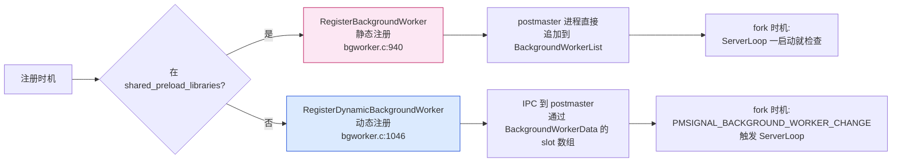

**两者根本差异**：静态注册把 `BackgroundWorker` 拷贝到 postmaster 的**私有内存** `BackgroundWorkerList`；动态注册把 `BackgroundWorker` 拷贝到**共享内存** `BackgroundWorkerData->slot[]`，postmaster 通过 `PMSIGNAL_BACKGROUND_WORKER_CHANGE` 信号感知。

**逻辑复制的 launcher 用静态注册**（`launcher.c:947`）：

```c
bgw.bgw_function_name = "ApplyLauncherMain";   /* launcher.c:947 */
RegisterBackgroundWorker(&bgw);
```

**逻辑复制的 apply / parallel apply / tablesync 用动态注册**（`launcher.c:514`）：

```c
RegisterDynamicBackgroundWorker(&bgw, &bgw_handle);  /* launcher.c:514 */
```

因为 apply worker 是按需启动的（一个 subscription 启动一个），不可能在 postmaster 启动时全部注册。

---

## 六、`RegisterBackgroundWorker` 源码深解

源码在 `src/backend/postmaster/bgworker.c:940-1010`：

```c
void RegisterBackgroundWorker(BackgroundWorker *worker)
{
    RegisteredBgWorker *rw;
    static int numworkers = 0;

    /* 检查 1：必须在 postmaster 进程里 */
    if (IsUnderPostmaster || !IsPostmasterEnvironment)
    {
        /* EXEC_BACKEND 模式下容忍 backend 的 _PG_init */
        if (process_shared_preload_libraries_in_progress)
            return;
        ereport(LOG,
                (errcode(ERRCODE_FEATURE_NOT_SUPPORTED),
                 errmsg("background worker \"%s\": must be registered in "
                        "\"shared_preload_libraries\"",
                        worker->bgw_name)));
        return;
    }

    /* 检查 2：必须在 BackgroundWorkerShmemInit 之前 */
    if (BackgroundWorkerData != NULL)
        elog(ERROR, "cannot register background worker \"%s\" after shmem init",
             worker->bgw_name);

    /* sanity check：bgw_flags、library_name 等 */
    if (!SanityCheckBackgroundWorker(worker, LOG))
        return;

    /* notify_pid 不允许给静态 worker */
    if (worker->bgw_notify_pid != 0) { ... return; }

    /* 检查 3：不超过 max_worker_processes */
    if (++numworkers > max_worker_processes) { ... return; }

    /* 关键：把 BackgroundWorker 拷贝到 PostmasterContext 的链表 */
    rw = MemoryContextAllocExtended(PostmasterContext,
                                    sizeof(RegisteredBgWorker),
                                    MCXT_ALLOC_NO_OOM);
    rw->rw_worker = *worker;          /* 全量拷贝 */
    rw->rw_pid = 0;
    rw->rw_crashed_at = 0;
    rw->rw_terminate = false;

    dlist_push_head(&BackgroundWorkerList, &rw->rw_lnode);
}
```

**5 个检查确保注册合法性**：

1. **进程检查**：只能在 postmaster 主进程注册；
2. **时机检查**：必须在 `BackgroundWorkerShmemInit` 之前——因为那时 shmem segment 还没建好；
3. **sanity check**（`SanityCheckBackgroundWorker`）：`bgw_flags` 是否合法、`library_name` 是否能找到（如果非 `postgres`）；
4. **notify_pid 检查**：静态 worker 不允许指定 notify_pid（只有动态注册才有 handle 跟踪）；
5. **数量上限**：不能超过 `max_worker_processes` GUC。

**`RegisteredBgWorker`** 是 postmaster 内部的"包装"，把 `BackgroundWorker` + 运行时状态（pid / 崩溃时间 / terminate 标志）放一起。

---

## 七、`RegisterDynamicBackgroundWorker` 源码深解

源码在 `src/backend/postmaster/bgworker.c:1046-1110`：

```c
bool RegisterDynamicBackgroundWorker(BackgroundWorker *worker,
                                     BackgroundWorkerHandle **handle)
{
    int  slotno;
    bool success = false;
    bool parallel;
    uint64 generation = 0;

    /* 检查 1：不能在 postmaster 直接调用 */
    if (!IsUnderPostmaster)
        return false;

    if (!SanityCheckBackgroundWorker(worker, ERROR))
        return false;

    parallel = (worker->bgw_flags & BGWORKER_CLASS_PARALLEL) != 0;

    LWLockAcquire(BackgroundWorkerLock, LW_EXCLUSIVE);

    /* 检查 2：parallel worker 是否超过 max_parallel_workers */
    if (parallel && (BackgroundWorkerData->parallel_register_count -
                     BackgroundWorkerData->parallel_terminate_count) >=
        max_parallel_workers)
    {
        LWLockRelease(BackgroundWorkerLock);
        return false;
    }

    /* 找空闲 slot */
    for (slotno = 0; slotno < BackgroundWorkerData->total_slots; ++slotno)
    {
        BackgroundWorkerSlot *slot = &BackgroundWorkerData->slot[slotno];

        if (!slot->in_use)
        {
            memcpy(&slot->worker, worker, sizeof(BackgroundWorker));  /* 拷到 shmem */
            slot->pid = InvalidPid;
            slot->generation++;
            slot->terminate = false;
            generation = slot->generation;
            if (parallel)
                BackgroundWorkerData->parallel_register_count++;

            pg_write_barrier();   /* 内存屏障 */
            slot->in_use = true;
            success = true;
            break;
        }
    }

    LWLockRelease(BackgroundWorkerLock);

    if (success)
        SendPostmasterSignal(PMSIGNAL_BACKGROUND_WORKER_CHANGE);

    if (success && handle)
    {
        *handle = palloc(sizeof(BackgroundWorkerHandle));
        (*handle)->slot = slotno;
        (*handle)->generation = generation;
    }

    return success;
}
```

**4 个关键点**：

1. **必须在 backend 进程调用**（`IsUnderPostmaster == true`）——postmaster 自己不动态注册；
2. **`BackgroundWorkerData->slot[]` 是共享内存数组**——slot 总数 = `max_worker_processes`；
3. **`SendPostmasterSignal(PMSIGNAL_BACKGROUND_WORKER_CHANGE)`** 唤醒 postmaster 的 `ServerLoop`，让 postmaster 重新扫描 slot 列表；
4. **返回 `BackgroundWorkerHandle`** 给 caller，让 caller 后续用 `GetBackgroundWorkerPid` / `WaitForBackgroundWorkerStartup` 查询。

**`BackgroundWorkerSlot` 是 shmem 里的"槽"**：

```c
typedef struct BackgroundWorkerSlot
{
    bool           in_use;            /* 槽位是否被占用 */
    bool           terminate;         /* postmaster 让这个 worker 退出 */
    uint64         generation;        /* 每次重新分配递增，让 handle 失效 */
    pid_t          pid;               /* 已启动的 worker pid */
    BackgroundWorker worker;          /* 注册信息 */
} BackgroundWorkerSlot;
```

---

## 八、postmaster 的 ServerLoop 与 `maybe_start_background_workers`

postmaster 的主循环在 `ServerLoop`（`src/backend/postmaster/postmaster.c:4184` 附近），它每次循环都会：

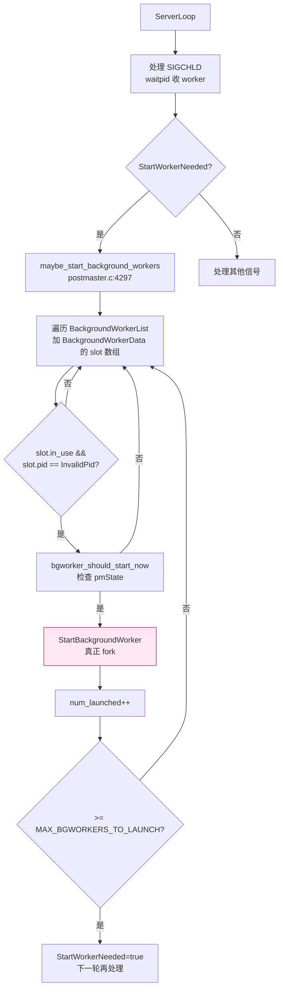

`maybe_start_background_workers` 关键逻辑（`postmaster.c:4250-4330`）：

```c
static void maybe_start_background_workers(void)
{
    dlist_iter  iter;
    int         num_launched = 0;

    dlist_foreach(iter, &BackgroundWorkerList)             /* 静态注册 */
    {
        RegisteredBgWorker *rw = dlist_container(...);
        /* ... 见下文 ... */
    }

    /* 然后扫 BackgroundWorkerData->slot[] 找 in_use 且 pid == InvalidPid 的 */
    for (int slotno = 0; slotno < BackgroundWorkerData->total_slots; slotno++)
    {
        BackgroundWorkerSlot *slot = &BackgroundWorkerData->slot[slotno];

        if (!slot->in_use) continue;
        if (slot->pid != InvalidPid) continue;       /* 已启动 */
        if (slot->terminate) continue;                /* 被标记终止 */

        /* ... 检查 crash cooldown ... */
        if (!bgworker_should_start_now(slot->worker.bgw_start_time)) continue;

        /* 关键：fork */
        if (!StartBackgroundWorker(...)) { ... }
    }
}
```

**两个 worker 来源统一扫描**：

- 静态：`BackgroundWorkerList` 链表（postmaster 私有内存）；
- 动态：`BackgroundWorkerData->slot[]` 数组（共享内存）。

---

## 九、`StartBackgroundWorker` 真正 fork

源码在 `src/backend/postmaster/postmaster.c:4123`：

```c
static bool StartBackgroundWorker(RegisteredBgWorker *rw)
{
    PMChild    *bn;
    pid_t       worker_pid;

    Assert(rw->rw_pid == 0);

    /* 1. 在 PMChild 数组里分配一个 child slot */
    bn = AssignPostmasterChildSlot(B_BG_WORKER);
    if (bn == NULL) { /* 满 */ return false; }
    bn->rw = rw;
    bn->bkend_type = B_BG_WORKER;

    /* 2. fork！通过 postmaster_child_launch */
    worker_pid = postmaster_child_launch(B_BG_WORKER, bn->child_slot,
                                          &rw->rw_worker,
                                          sizeof(BackgroundWorker), NULL);
    if (worker_pid == -1) { /* fork 失败 */ ReleasePostmasterChildSlot(bn); return false; }

    rw->rw_pid = worker_pid;
    bn->pid = rw->rw_pid;
    ReportBackgroundWorkerPID(rw);
    return true;
}
```

**关键调用 `postmaster_child_launch`**（`postmaster.c:4144`）：这是 PG 的"统一 fork 入口"，行为包括：

1. 调用 `fork()`；
2. 子进程调 `InitPostmasterChild` 设置 `IsUnderPostmaster`；
3. 通过 `BgWorkerEntryPoint`（`bgworker.c:718 BackgroundWorkerMain` 之前的一段 wrapper）跳到用户入口；
4. 子进程被 `sigsetjmp` 包起来，任何 ERROR 都会被 PG 异常机制接住并优雅退出。

**EXEC_BACKEND 模式**（Windows）：`fork + exec` 而非 `fork`，需要把 `BackgroundWorker` 通过 `BGW_EXTRALEN` 或文件重新传递给子进程（详见 `postmaster_child_launch`）。

---

## 十、`BackgroundWorkerMain` worker 进程入口

源码在 `src/backend/postmaster/bgworker.c:718-870`。子进程 fork 后**第一个跑的 C 函数**就是它：

```c
void BackgroundWorkerMain(const void *startup_data, size_t startup_data_len)
{
    sigjmp_buf local_sigjmp_buf;
    BackgroundWorker *worker;
    bgworker_main_type entrypt;

    Assert(startup_data_len == sizeof(BackgroundWorker));
    worker = MemoryContextAlloc(TopMemoryContext, sizeof(BackgroundWorker));
    memcpy(worker, startup_data, sizeof(BackgroundWorker));   /* 从父进程传过来的 */

    /* 清理 postmaster 上下文 */
    if (PostmasterContext) {
        MemoryContextDelete(PostmasterContext);
        PostmasterContext = NULL;
    }

    MyBgworkerEntry = worker;
    MyBackendType = B_BG_WORKER;
    init_ps_display(worker->bgw_name);     /* ps 命令看到的名字 */

    /* 根据 flags 设置信号处理 */
    if (worker->bgw_flags & BGWORKER_BACKEND_DATABASE_CONNECTION)
    {
        pqsignal(SIGINT, StatementCancelHandler);
        pqsignal(SIGUSR1, procsignal_sigusr1_handler);
        pqsignal(SIGFPE, FloatExceptionHandler);
    } else {
        pqsignal(SIGINT, SIG_IGN);
        pqsignal(SIGUSR1, SIG_IGN);
        pqsignal(SIGFPE, SIG_IGN);
    }
    pqsignal(SIGTERM, bgworker_die);          /* postmaster 让 worker 退出用 SIGTERM */
    pqsignal(SIGQUIT, SIG_DFL);                /* core dump */
    pqsignal(SIGHUP, SIG_IGN);
    pqsignal(SIGPIPE, SIG_IGN);
    pqsignal(SIGCHLD, SIG_DFL);

    /* 异常处理：sigsetjmp */
    if (sigsetjmp(local_sigjmp_buf, 1) != 0) {
        error_context_stack = NULL;
        HOLD_INTERRUPTS();
        BackgroundWorkerUnblockSignals();
        EmitErrorReport();      /* 把 ERROR 报告给 parallel leader（如果有）和 server log */
        proc_exit(1);
    }
    PG_exception_stack = &local_sigjmp_buf;

    InitProcess();              /* 创建 PGPROC 共享内存结构 */

    /* 设置 MyProcPid / 信号掩码 */
    /* 把 startup 阶段的 latch 全部关闭 */

    /* 如果 flags 有 BGWORKER_BACKEND_DATABASE_CONNECTION，
     * 调 BackgroundWorkerInitializeConnection */
    if (worker->bgw_flags & BGWORKER_BACKEND_DATABASE_CONNECTION) {
        BackgroundWorkerInitializeConnection(worker->bgw_extra, ...);
    }

    /* 关键：调用户注册的入口函数 */
    entrypt = (bgworker_main_type)
        load_external_function(worker->bgw_library_name,
                               worker->bgw_function_name,
                               true, NULL);
    entrypt(worker->bgw_main_arg);     /* 例如 ApplyLauncherMain(main_arg) */

    /* 用户函数返回后正常退出 */
    proc_exit(0);
}
```

**5 个执行阶段**：

1. **接收 BackgroundWorker**：从父进程传过来的 `startup_data` 内存里 memcpy；
2. **设置信号**：根据 flags 决定哪些信号用 PG 自己的 handler（`StatementCancelHandler` / `bgworker_die` / `procsignal_sigusr1_handler`）；
3. **初始化 PGPROC**：`InitProcess()` 在共享内存里建一个 `PGPROC` 条目，让 worker 能参与锁等待 / 信号接收；
4. **初始化 catalog 连接**：如果 `BGWORKER_BACKEND_DATABASE_CONNECTION`，调 `BackgroundWorkerInitializeConnection`；
5. **跳到用户函数**：通过 `dlsym("postgres", "ApplyLauncherMain")` 找到符号，调 `entrypt(main_arg)`。

**子进程与普通 backend 的 3 个差异**：

- 没有 `PostgresMain` 循环（不接 SQL）；
- 没有 `Port`（不接 client socket）；
- 信号 `SIGUSR1` 接到 `procsignal_sigusr1_handler`（用来接收并行 leader 的通知）。

---

## 十一、LogicalRepCtx 与 LogicalRepWorker

逻辑复制 worker 的所有协同都通过 `LogicalRepCtx` 共享内存结构（`src/backend/replication/logical/launcher.c:56-69`）：

```c
typedef struct LogicalRepCtxStruct
{
    pid_t       launcher_pid;                                          /* 单例 launcher */
    dsa_handle  last_start_dsa;
    dshash_table_handle last_start_dsh;                                /* 记录每个 sub 启动时间 */

    LogicalRepWorker workers[FLEXIBLE_ARRAY_MEMBER];                   /* 所有 worker slot */
} LogicalRepCtxStruct;

static LogicalRepCtxStruct *LogicalRepCtx;
```

**`LogicalRepWorker`**（`src/include/replication/worker_internal.h:37`）是单个 worker 的状态：

```c
typedef struct LogicalRepWorker
{
    LogicalRepWorkerType type;            /* 见 4 种枚举 */
    TimestampTz launch_time;
    bool        in_use;                   /* 槽位是否被占用 */
    uint16      generation;
    PGPROC     *proc;                     /* NULL 表示未启动 */
    Oid         dbid;                     /* 数据库 OID */
    Oid         userid;                   /* 用户 OID */
    Oid         subid;                    /* subscription OID */
    Oid         relid;                    /* 表 OID（仅 tablesync 用） */
    char        relstate;                 /* SUBREL_STATE_* */
    XLogRecPtr  relstate_lsn;
    slock_t     relmutex;                 /* 保护 relstate 写 */
    FileSet    *stream_fileset;           /* 大事务 spill 文件集 */
    pid_t       leader_pid;               /* parallel apply 的 leader */
    bool        parallel_apply;
    XLogRecPtr  last_lsn;
    TimestampTz last_send_time;
    TimestampTz last_recv_time;
    XLogRecPtr  reply_lsn;
    TimestampTz reply_time;
} LogicalRepWorker;
```

**4 种 worker 类型**（`worker_internal.h:29-35`）：

```c
typedef enum LogicalRepWorkerType
{
    WORKERTYPE_UNKNOWN = 0,
    WORKERTYPE_TABLESYNC,         /* 初始表同步 */
    WORKERTYPE_APPLY,             /* leader apply */
    WORKERTYPE_PARALLEL_APPLY,    /* 并行 apply（PG 16+） */
} LogicalRepWorkerType;
```

**逻辑复制 worker 总量约束**：

| GUC | 默认 | 含义 |
| --- | --- | --- |
| `max_logical_replication_workers` | 4 | launcher 启动的所有 worker slot 总数 |
| `max_sync_workers_per_subscription` | 2 | 单个 subscription 的 tablesync worker 并行数 |
| `max_parallel_apply_workers_per_subscription` | 2 | 单个 subscription 的 parallel apply worker 数 |
| `max_worker_processes` | 8 | 整个实例所有 BackgroundWorker 总数（含 autovacuum / parallel query） |

**`max_logical_replication_workers = 4`** 是关键限制——它意味着 **1 个 subscription 在初始同步阶段最多占 3 个 slot（1 leader apply + 2 tablesync）**；如果还要 parallel apply，4 个 slot 就完全用光了。

---

## 十二、`ApplyLauncherMain` 逻辑复制 launcher 主循环

源码在 `src/backend/replication/logical/launcher.c:1132`：

```c
void ApplyLauncherMain(Datum main_arg)
{
    ereport(DEBUG1, (errmsg_internal("logical replication launcher started")));

    before_shmem_exit(logicalrep_launcher_onexit, (Datum) 0);   /* 退出回调 */
    Assert(LogicalRepCtx->launcher_pid == 0);
    LogicalRepCtx->launcher_pid = MyProcPid;

    /* 信号 */
    pqsignal(SIGHUP, SignalHandlerForConfigReload);
    pqsignal(SIGTERM, die);
    BackgroundWorkerUnblockSignals();

    /* 连接 nailed catalog（仅读 pg_subscription） */
    BackgroundWorkerInitializeConnection(NULL, NULL, 0);

    /* 主循环 */
    for (;;)
    {
        int     rc;
        List   *sublist;
        ListCell *lc;
        MemoryContext subctx;
        long    wait_time = DEFAULT_NAPTIME_PER_CYCLE;     /* 默认 180 秒 */

        CHECK_FOR_INTERRUPTS();

        subctx = AllocSetContextCreate(...);
        sublist = get_subscription_list();                /* 查 pg_subscription 中所有 enabled 的 sub */

        foreach(lc, sublist)
        {
            Subscription *sub = lfirst(lc);
            LogicalRepWorker *w;
            TimestampTz last_start;
            long    elapsed;

            /* 检查 last_start_time，避免对同一 sub 短时间内反复重启 */

            /* 启动缺失的 apply worker */
            if (!w)
            {
                last_start = ...;
                elapsed = TimestampDifferenceMilliseconds(last_start, now) / 1000;

                /* 至少间隔 1 秒，避免 fork 风暴 */
                if (elapsed < 1) continue;

                logicalrep_worker_launch(WORKERTYPE_APPLY, MyLogicalRepWorker->dbid,
                                         sub->oid, sub->owner, InvalidOid);
            }
        }

        /* 处理 SIGUSR1 触发的唤醒 */
        rc = WaitLatch(MyLatch, ... wait_time ...);
        if (rc & WL_LATCH_SET)
        {
            ResetLatch(MyLatch);
            CHECK_FOR_INTERRUPTS();
        }
    }
}
```

**`ApplyLauncherMain` 的 6 个关键点**：

1. **`MyProcPid` 写到 `LogicalRepCtx->launcher_pid`**：所有 worker 都能通过这个字段找到 launcher；
2. **`BackgroundWorkerInitializeConnection(NULL, NULL, 0)`**：只连接 nailed catalog（`pg_subscription`），不连接用户库；
3. **`get_subscription_list()`**：扫描 `pg_subscription` 中所有 `subenabled = true` 的 subscription；
4. **`WaitLatch(MyLatch, ...)`**：默认 180 秒超时，但 launcher 在收到 SIGUSR1 时会被唤醒（`SetLatch(MyLatch)`），用于被 worker 通知；
5. **last_start_time 检查**：避免 worker 刚启动就挂掉时 launcher 反复 fork（防 fork 风暴）；
6. **`logicalrep_worker_launch` 启动 worker**：见第十三节。

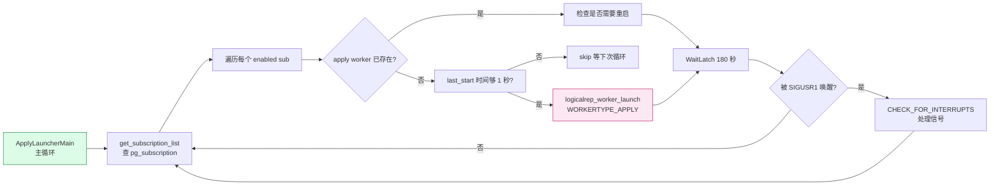

**launcher 自身是静态注册的 BackgroundWorker**——在 `_PG_init` 阶段通过 `RegisterBackgroundWorker` 注册到 postmaster。

---

## 十三、launcher 启动各类 worker

`logicalrep_worker_launch`（`launcher.c:310-520`）是 launcher 启动所有类型 worker 的统一入口。它根据 `wtype` 参数决定 entry function name：

```c
BackgroundWorker bgw;
BackgroundWorkerHandle *bgw_handle;

bgw.bgw_flags = BGWORKER_SHMEM_ACCESS |
                BGWORKER_BACKEND_DATABASE_CONNECTION;
bgw.bgw_start_time = BgWorkerStart_RecoveryFinished;
snprintf(bgw.bgw_library_name, MAXPGPATH, "postgres");

switch (worker->type)
{
    case WORKERTYPE_APPLY:
        snprintf(bgw.bgw_function_name, BGW_MAXLEN, "ApplyWorkerMain");
        snprintf(bgw.bgw_name, BGW_MAXLEN,
                 "logical replication apply worker for subscription %u", subid);
        snprintf(bgw.bgw_type, BGW_MAXLEN, "logical replication apply worker");
        break;

    case WORKERTYPE_PARALLEL_APPLY:
        snprintf(bgw.bgw_function_name, BGW_MAXLEN, "ParallelApplyWorkerMain");
        snprintf(bgw.bgw_name, BGW_MAXLEN,
                 "logical replication parallel apply worker for subscription %u", subid);
        snprintf(bgw.bgw_type, BGW_MAXLEN, "logical replication parallel worker");
        memcpy(bgw.bgw_extra, &subworker_dsm, sizeof(dsm_handle));   /* 跨 fork 传 DSM 句柄 */
        break;

    case WORKERTYPE_TABLESYNC:
        snprintf(bgw.bgw_function_name, BGW_MAXLEN, "TablesyncWorkerMain");
        snprintf(bgw.bgw_name, BGW_MAXLEN,
                 "logical replication tablesync worker for subscription %u sync %u",
                 subid, relid);
        snprintf(bgw.bgw_type, BGW_MAXLEN, "logical replication tablesync worker");
        break;

    case WORKERTYPE_UNKNOWN:
        elog(ERROR, "unknown worker type");
}

bgw.bgw_restart_time = BGW_NEVER_RESTART;       /* launcher 自己负责重启 */
bgw.bgw_notify_pid = MyProcPid;                  /* SIGUSR1 launcher */
bgw.bgw_main_arg = Int32GetDatum(slot);          /* 传 slot index 给 worker */

if (!RegisterDynamicBackgroundWorker(&bgw, &bgw_handle))
{
    /* 清理 */
    ereport(WARNING, (errmsg("out of background worker slots")));
    return false;
}

return WaitForReplicationWorkerAttach(worker, generation, bgw_handle);
```

**5 个值得关注的细节**：

1. **`bgw_restart_time = BGW_NEVER_RESTART`**：worker 挂掉**不会**自动重启——这避免了 postmaster 不区分"正常退出"和"崩溃"；
2. **`bgw_notify_pid = MyProcPid`**：worker 启动 / 停止时给 launcher 发 SIGUSR1，launcher 主循环的 `WaitLatch` 立即被唤醒；
3. **`bgw_main_arg = Int32GetDatum(slot)`**：worker 启动后通过这个参数知道自己是哪个 `LogicalRepWorker` slot；
4. **`WORKERTYPE_PARALLEL_APPLY` 用 `bgw_extra` 传 DSM 句柄**：parallel apply worker 需要 attach leader 创建的 DSM 拿到 shared tuple queue；
5. **`WaitForReplicationWorkerAttach`**：launcher 等 worker 调 `logicalrep_worker_attach` 完成才返回——保证 worker 启动后能立刻被 `get_subscription_list` 看到。

**launcher 启动 worker 的 4 种触发场景**：

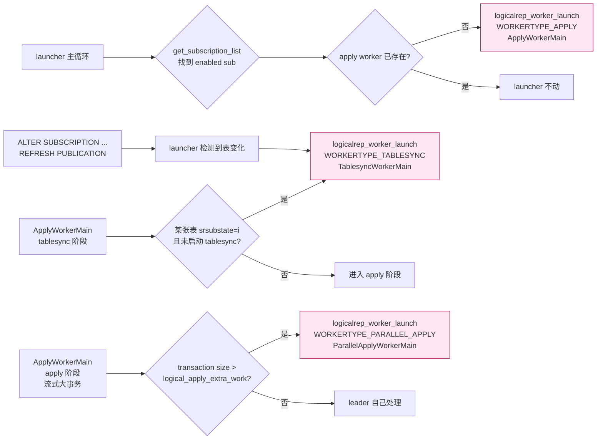

**3 类 worker 的发起方**：

| worker 类型 | 发起方 | 时机 |
| --- | --- | --- |
| apply worker | launcher | subscription 启用但 apply worker 不存在 |
| tablesync worker | leader apply worker | 某表 `srsubstate='i'`（init）状态 |
| parallel apply worker | leader apply worker | 流式大事务 / `ALTER SUBSCRIPTION SET (streaming = parallel)` |

---

## 十四、`ApplyWorkerMain`：leader apply worker

源码在 `src/backend/replication/logical/worker.c:4818`：

```c
void ApplyWorkerMain(Datum main_arg)
{
    int worker_slot = DatumGetInt32(main_arg);

    InitializingApplyWorker = true;
    SetupApplyOrSyncWorker(worker_slot);   /* 共用入口：attach slot、设信号、连 catalog */
    InitializingApplyWorker = false;

    run_apply_worker();                     /* 真正的工作循环 */

    proc_exit(0);
}
```

**`SetupApplyOrSyncWorker`**（`worker.c:4777`）做 5 件事：

1. `logicalrep_worker_attach(worker_slot)`：把自己 attach 到 `LogicalRepCtx->workers[slot]`；
2. 设置信号（`SIGHUP` → reload、 `SIGTERM` → die）；
3. `load_file("libpqwalreceiver")`：加载 walsender 连接函数；
4. `InitializeLogRepWorker()`：初始化 `MySubscription`、`MyLogicalRepWorker` 等全局；
5. 通过 catalog 回调注册 `SUBSCRIPTIONRELMAP` 失效监听。

**`run_apply_worker`**（`worker.c:4546`）——真正的 apply 工作循环：

```c
static void run_apply_worker()
{
    char originname[NAMEDATALEN];
    XLogRecPtr origin_startpos = InvalidXLogRecPtr;
    WalRcvStreamOptions options;
    RepOriginId originid;
    TimeLineID startpointTLI;
    char *err;
    bool must_use_password;

    slotname = MySubscription->slotname;

    /* 1. 设置 replication origin（用于标记"这个事务是从哪里推过来的"） */
    ReplicationOriginNameForLogicalRep(MySubscription->oid, InvalidOid, originname, sizeof(originname));
    StartTransactionCommand();
    originid = replorigin_by_name(originname, true);
    if (!OidIsValid(originid))
        originid = replorigin_create(originname);
    replorigin_session_setup(originid, 0);
    origin_startpos = replorigin_session_get_progress(false);
    CommitTransactionCommand();

    must_use_password = MySubscription->passwordrequired && !MySubscription->ownersuperuser;

    /* 2. 连接 publisher */
    LogRepWorkerWalRcvConn = walrcv_connect(MySubscription->conninfo, true, true,
                                            must_use_password, MySubscription->name, &err);
    if (LogRepWorkerWalRcvConn == NULL) ereport(ERROR, ...);

    /* 3. identify_system */
    walrcv_identify_system(LogRepWorkerWalRcvConn, &startpointTLI);

    /* 4. 设置 apply 错误上下文 */
    set_apply_error_context_origin(originname);
    set_stream_options(&options, slotname, &origin_startpos);

    /* 5. 启动 apply state machine */
    apply_handle_begin(&options, &origin_startpos);

    for (;;)
    {
        CHECK_FOR_INTERRUPTS();

        /* 5a. 读 publisher 流上的下一个 message */
        apply_dispatch(&options);

        /* 5b. 处理 transaction 的 commit / abort */
        /* ... 见 ApplyXact / ProcessApplyXXX ... */
    }
}
```

**`ApplyWorkerMain` 的 4 个阶段**：

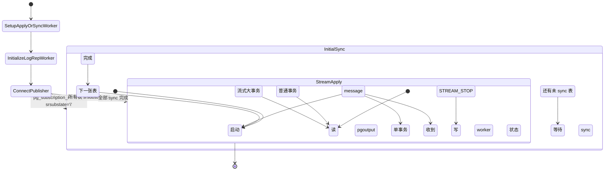

**`am_leader_apply_worker()` vs `am_tablesync_worker()`**（`worker_internal.h:344`）：

```c
static inline bool am_leader_apply_worker(void)
{
    return (MyLogicalRepWorker->type == WORKERTYPE_APPLY);
}
static inline bool am_tablesync_worker(void)
{
    return (MyLogicalRepWorker->type == WORKERTYPE_TABLESYNC);
}
static inline bool am_parallel_apply_worker(void)
{
    return (MyLogicalRepWorker->type == WORKERTYPE_PARALLEL_APPLY);
}
```

`ApplyWorkerMain` 不直接区分——它在 `SetupApplyOrSyncWorker` 里根据 `MyLogicalRepWorker->type` 决定行为：

- `WORKERTYPE_APPLY` → 进入 `run_apply_worker` 走 apply state machine；
- `WORKERTYPE_TABLESYNC` → 走 tablesync state machine（`TablesyncWorkerMain` 也共用 `SetupApplyOrSyncWorker`，但 `main_arg` 携带的是 `relid`，逻辑略不同）。

---

## 十五、`TablesyncWorkerMain`：初始数据同步 worker

源码在 `src/backend/replication/logical/worker.c`（具体行号未列出，但入口在 launcher 注册路径 `launcher.c:496`）。**tablesync worker 是 apply worker 的"变体"**——它和 apply worker 共用 `ApplyWorkerMain` 入口框架（`SetupApplyOrSyncWorker`），但跑不同的 state machine：

```c
case WORKERTYPE_TABLESYNC:
    snprintf(bgw.bgw_function_name, BGW_MAXLEN, "TablesyncWorkerMain");
```

**`TablesyncWorkerMain` 的 4 阶段**：

1. **COPY phase**：连 publisher，对单表执行 `COPY rel TO STDOUT`，把数据灌到 subscriber；
2. **catchup phase**：把 COPY 期间累积的 WAL（`srsublsn` 到 COPY 完的位置）按正常 apply 流程跑；
3. **state transition**：把 `pg_subscription_rel.srsubstate` 从 `'i'`（init）改为 `'r'`（ready），写 `srsublsn` 为 catchup 结束点；
4. **退出**：让 leader apply worker 接管该表的 DML 流。

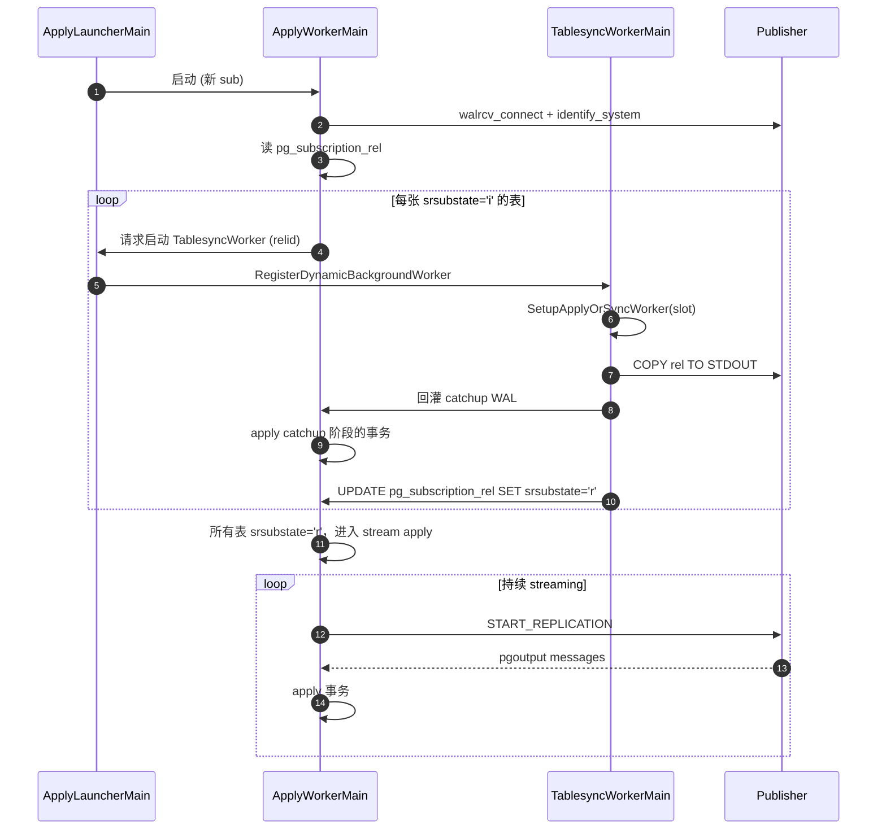

**`max_sync_workers_per_subscription = 2` 的影响**：

- 1 个 subscription 在初始同步阶段，**最多同时 2 张表**并行 tablesync；
- 剩下的表按 `pg_subscription_rel.oid` 顺序串行 sync；
- 如果某张表 tablesync 卡住（publisher 上锁、网络断），其他表照常 sync。

---

## 十六、`ParallelApplyWorkerMain`：并行 apply worker（PG 16+）

源码在 `src/backend/replication/logical/worker.c`（具体行号未列出，launcher 注册路径 `launcher.c:486`）。**PG 16 引入**，把"流式大事务"分片并行 apply：

```c
case WORKERTYPE_PARALLEL_APPLY:
    snprintf(bgw.bgw_function_name, BGW_MAXLEN, "ParallelApplyWorkerMain");
    memcpy(bgw.bgw_extra, &subworker_dsm, sizeof(dsm_handle));
```

**`bgw_extra` 跨 fork 传递 DSM 句柄**：parallel apply worker 一启动就 attach 到 leader 预先建好的 DSM，拿到 shared tuple queue / shared state。

**触发条件**：

- `ALTER SUBSCRIPTION ... SET (streaming = parallel)`，**或**
- 流式事务超过 `logical_apply_extra_work` 阈值（默认 100KB）时，leader 自动派生 parallel apply。

**`ParallelApplyWorkerMain` 的核心流程**：

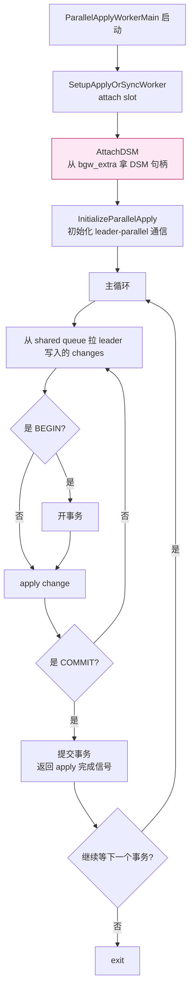

**leader 与 parallel apply 的 4 个交互点**：

1. **DSM 句柄**：`bgw_extra` 传递 8 字节 `dsm_handle`，worker `dsa_attach` 后拿到 leader 创建的内存；
2. **Shared queue**：`changes` + `subxact` 文件 + `FileSet`（`LogicalRepWorker.stream_fileset`）；
3. **通知信号**：`SetLatch(MyLatch)` + `procsignal_sigusr1_handler`；
4. **状态回写**：`pgstat_report_subscription` 上报 parallel apply 进度。

**`max_parallel_apply_workers_per_subscription = 2` 的影响**：

- 1 个 subscription **最多 2 个 parallel apply worker** 同时跑；
- leader 仍然是事务的"提交者"——parallel apply 仅 apply 单事务的多个变更分片，**commit 由 leader 触发**（保持全局事务一致性）；
- `logicalrep_pa_worker_count(subid)`（`launcher.c:435`）实时统计当前 active parallel apply worker 数。

---

## 十七、worker 之间的依赖关系与启动顺序

**4 类 worker 之间的依赖关系**：

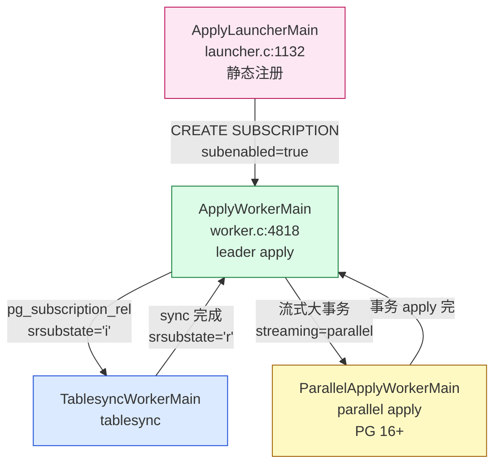

**4 条关键依赖**：

1. **launcher → apply worker**：launcher 是唯一发起 apply worker 的角色；
2. **apply → tablesync**：apply worker 启动时检查 `pg_subscription_rel`，发现 `srsubstate='i'` 的表就请求 launcher 启动 tablesync；
3. **apply → parallel apply**：apply worker 在 apply 流式大事务时按需启动 parallel apply；
4. **tablesync / parallel apply → apply**：子 worker 完成自己的子任务后向 apply worker 报告，apply worker 推进状态机。

**时间线示例**：

```mermaid
gantt
    title 1 个 subscription 启动到稳态 apply 的时间线
    dateFormat HH:mm:ss
    axisFormat %H:%M:%S

    section launcher
    launcher 主循环启动 :milestone, m1, 00:00:00, 0s
    每 180 秒巡检       :active, l1, 00:00:00, 600s

    section apply worker
    ApplyWorkerMain 启动  :a1, 00:00:01, 2s
    连 publisher         :a2, after a1, 3s
    启动 tablesync        :a3, after a2, 1s

    section tablesync worker 1
    TablesyncWorkerMain 启动 :t1, 00:00:08, 2s
    COPY 表 A            :t2, after t1, 30s
    catchup + 切流       :t3, after t2, 5s

    section tablesync worker 2
    TablesyncWorkerMain 启动 :t2b, 00:00:08, 2s
    COPY 表 B (并行)     :t2c, after t2b, 25s
    catchup + 切流       :t2d, after t2c, 5s

    section apply worker
    stream apply (PG 18+)  :a4, after t3, 600s
    启动 parallel apply    :crit, p1, after a4, 1s
    parallel apply 跑流式事务 :p2, after p1, 30s
```

---

## 十八、生命周期与失败处理

### 18.1 失败重试的 4 道防线

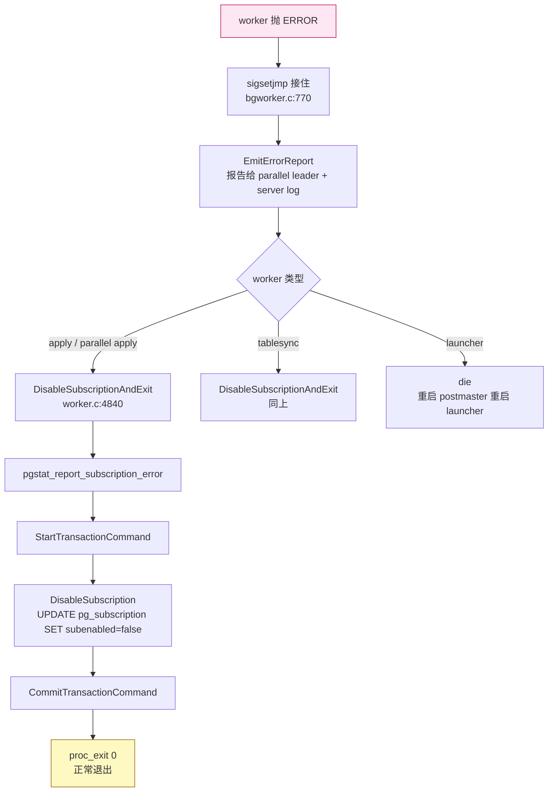

**关键设计**：

1. **`bgw_restart_time = BGW_NEVER_RESTART`**：worker 进程本身不会自动重启，避免"挂掉 → 重启 → 又挂掉"的循环；
2. **`DisableSubscriptionAndExit`**：worker 在错误时**主动 disable subscription**，更新 `pg_subscription.subenabled = false`；
3. **launcher 重新扫描**：`subenabled=false` 后，launcher 下次巡检看到就不启动新 worker；
4. **运维介入**：DBA 需要 `ALTER SUBSCRIPTION ... ENABLE` 重启流程。

### 18.2 启动失败的 garbage collection

源码在 `launcher.c:380-400`：

```c
/* 如果 worker slot in_use 但 proc 没 attach，可能是 parent crash 留下的 */
if (w->in_use && !w->proc &&
    TimestampDifferenceExceeds(w->launch_time, now, wal_receiver_timeout))
{
    elog(WARNING, "logical replication worker for subscription %u took too long to start; canceled", w->subid);
    logicalrep_worker_cleanup(w);
    did_cleanup = true;
}
```

**场景**：launcher 启动了 worker，worker 还没 `logicalrep_worker_attach` 完（写 `MyLogicalRepWorker`），launcher 自己也崩溃。重启 launcher 后，看到旧 slot 还 `in_use=true`，但 `proc=NULL` —— 此时如果超过 `wal_receiver_timeout`（默认 60 秒），就清掉这个 slot，重新分配。

### 18.3 pg_stat_activity 中的 worker 状态

```sql
-- 看所有逻辑复制 worker
SELECT pid, backend_type, state, wait_event_type, wait_event,
       (SELECT relname FROM pg_subscription_rel WHERE srsubid = subid AND srsubstate != 'r') AS syncing_table
FROM pg_stat_activity
WHERE backend_type LIKE '%logical replication%';
```

输出示例：

```
 pid  |            backend_type            | state  | wait_event_type | wait_event | syncing_table
------+------------------------------------+--------+-----------------+------------+----------------
 1234 | logical replication launcher       | idle   | Activity        | WalReceiverMain |
 1235 | logical replication apply worker   | active | Activity        | WalReceiverMain |
 1236 | logical replication tablesync worker| active | IO              | DataFileRead | orders
 1237 | logical replication parallel worker | active | LWLock          | wal_insert  |
```

---

## 十九、监控 SQL 与诊断

### 19.1 看 launcher 状态

```sql
SELECT pid, application_name, state, wait_event_type, wait_event
FROM pg_stat_activity
WHERE backend_type = 'logical replication launcher';
```

### 19.2 看每种 worker 的数量

```sql
SELECT application_name, count(*)
FROM pg_stat_activity
WHERE backend_type LIKE '%logical replication%'
GROUP BY application_name;
```

### 19.3 看 worker slot 使用率

```sql
SELECT count(*) FILTER (WHERE in_use) AS used,
       count(*) FILTER (WHERE NOT in_use) AS free,
       max_logical_replication_workers
FROM (SELECT (logicalrep_worker_slot()).*) lws
GROUP BY max_logical_replication_workers;
-- 需要 superuser
```

### 19.4 看具体的 LogicalRepWorker 状态

```sql
SELECT subid, relid, last_send_time, last_recv_time, last_lsn, reply_lsn
FROM pg_stat_subscription
WHERE subid = (SELECT oid FROM pg_subscription WHERE subname = 'my_sub');
```

### 19.5 排查"launcher 卡死"

```sql
-- launcher 1. SELECT pg_sleep(...) ；2. SIGUSR1 处理；
-- 排查方法：看 launcher 进程
SELECT pid, state, query_start, wait_event_type, wait_event
FROM pg_stat_activity
WHERE backend_type = 'logical replication launcher';
```

### 19.6 排查"worker 没启动"

```sql
-- 1. 看 max_logical_replication_workers 是否超限
SHOW max_logical_replication_workers;
SHOW max_worker_processes;

-- 2. 看 subscription 是否 enabled
SELECT subname, subenabled FROM pg_subscription;

-- 3. 看 server log 中是否有 "out of logical replication worker slots" / "out of background worker slots"
SELECT * FROM pg_log_backend_memory_contexts(pid := (SELECT pid FROM pg_stat_activity WHERE backend_type = 'logical replication launcher'));
```

---

## 二十、扩展：写一个最小的 BackgroundWorker

为了把机制看穿，下面写一个最小的 BackgroundWorker 扩展（11 行 C + SQL），加深理解：

```c
/* myworker.c */
#include "postgres.h"
#include "postmaster/bgworker.h"
#include "storage/latch.h"

PG_MODULE_MAGIC;

PG_FUNCTION_INFO_V1(myworker_launch);

static void myworker_main(Datum main_arg)
{
    /* 1. 等到 recovery finished（必须的） */
    /* 2. 简单循环，每 5 秒 log 一次 */
    for (;;)
    {
        CHECK_FOR_INTERRUPTS();
        elog(LOG, "myworker: alive at pid %d", MyProcPid);
        WaitLatch(MyLatch, WL_LATCH_SET | WL_TIMEOUT, 5000, PG_WAIT_EXTENSION);
        ResetLatch(MyLatch);
    }
}

Datum myworker_launch(PG_FUNCTION_ARGS)
{
    BackgroundWorker bgw;

    MemSet(&bgw, 0, sizeof(bgw));
    snprintf(bgw.bgw_name, BGW_MAXLEN, "my custom worker");
    snprintf(bgw.bgw_type, BGW_MAXLEN, "my custom worker");
    bgw.bgw_flags = BGWORKER_SHMEM_ACCESS;  /* 不需要数据库连接 */
    bgw.bgw_start_time = BgWorkerStart_RecoveryFinished;
    bgw.bgw_restart_time = BGW_NEVER_RESTART;
    snprintf(bgw.bgw_library_name, MAXPGPATH, "myworker");
    snprintf(bgw.bgw_function_name, BGW_MAXLEN, "myworker_main");
    bgw.bgw_notify_pid = 0;

    RegisterBackgroundWorker(&bgw);
    PG_RETURN_VOID();
}
```

```sql
-- myworker--1.0.sql
CREATE FUNCTION myworker_launch() RETURNS void
AS 'myworker', 'myworker_launch'
LANGUAGE C STRICT;
```

```ini
# postgresql.conf
shared_preload_libraries = 'myworker'
max_worker_processes = 10  # 默认 8 不够
```

```bash
# 编译 + 安装
gcc -O2 -fPIC -I$(pg_config --includedir-server) -c myworker.c -o myworker.o
gcc -shared -o myworker.so myworker.o -L$(pg_config --libdir) -lpostgres
cp myworker.so $(pg_config --pkglibdir)/

# 触发注册
CREATE EXTENSION myworker;
SELECT myworker_launch();
SELECT pg_reload_conf();

-- 看进程
ps aux | grep myworker
```

**关键观察**：

1. `BGWORKER_SHMEM_ACCESS` 不带 `BGWORKER_BACKEND_DATABASE_CONNECTION`——这个 worker 不连接数据库（也就不能跑 SQL）；
2. `RegisterBackgroundWorker` 必须在 `shared_preload_libraries` 阶段调用——所以 `myworker_launch()` 通过 SQL 调用时其实是延迟注册（PG 18 在 dynamic_bgworker_from_backend API 出现前的临时方案）；
3. `WaitLatch` + `ResetLatch` 是 worker 的标准 sleep 模式——同时被 SIGUSR1 唤醒做实时任务。

---

## 二十一、小结：BackgroundWorker 是 PG 所有"非 client 进程"的统一抽象

PostgreSQL 的 BackgroundWorker 子系统是**整个数据库异步能力的基石**。它通过 10 个字段的 `BackgroundWorker` 结构体、4 个 flags、3 个启动时机，把 autovacuum、逻辑复制 4 类 worker、并行查询 worker、扩展自定义 worker 全部统一到一个 fork 模型里。

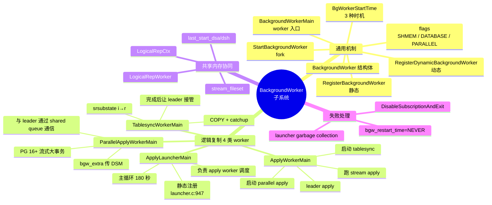

**理解 BackgroundWorker 等于理解了 PG 异步生态的 90%**——逻辑复制、autovacuum、并行查询、扩展 worker 都跑在这套机制上。看完本文再去看 `autovacuum.c` / `parallel.c` / `launcher.c` 的源码，你会发现它们都遵循同样的范式：

1. launcher 级进程调 `RegisterBackgroundWorker`（静态）或 `RegisterDynamicBackgroundWorker`（动态）申请；
2. postmaster 的 `ServerLoop` 在合适的 `pmState` 时机 fork；
3. 子进程进 `BackgroundWorkerMain`，调用户的 entrypoint；
4. entrypoint 设置信号 / attach shmem / 跑主循环；
5. 主循环用 `WaitLatch(MyLatch)` 等事件，避免 busy loop；
6. 出错时 `proc_exit(0)` 正常退出，让父进程决定是否重启。

**没有这 6 步范式，就没有 PG 的异步生态**。

---

## 源码引用索引

**通用 BackgroundWorker：**
- `src/include/postmaster/bgworker.h:50 (BGWORKER_SHMEM_ACCESS)` — flag 0x01
- `src/include/postmaster/bgworker.h:58 (BGWORKER_BACKEND_DATABASE_CONNECTION)` — flag 0x02
- `src/include/postmaster/bgworker.h:68 (BGWORKER_CLASS_PARALLEL)` — flag 0x10
- `src/include/postmaster/bgworker.h:74-82 (BgWorkerStartTime)` — 3 个启动时机枚举
- `src/include/postmaster/bgworker.h:89-100 (BackgroundWorker)` — 10 字段结构体
- `src/include/postmaster/bgworker.h:120-130 (BgwHandleStatus / Handle API)` — 状态查询
- `src/backend/postmaster/bgworker.c:718 (BackgroundWorkerMain)` — worker 入口
- `src/backend/postmaster/bgworker.c:940 (RegisterBackgroundWorker)` — 静态注册
- `src/backend/postmaster/bgworker.c:1046 (RegisterDynamicBackgroundWorker)` — 动态注册
- `src/backend/postmaster/postmaster.c:4123 (StartBackgroundWorker)` — fork 入口
- `src/backend/postmaster/postmaster.c:4184 (bgworker_should_start_now)` — pmState 检查
- `src/backend/postmaster/postmaster.c:4250-4330 (maybe_start_background_workers)` — ServerLoop 调用

**逻辑复制 worker：**
- `src/backend/replication/logical/launcher.c:50-52 (3 个 GUC 默认值)` — 资源限制
- `src/backend/replication/logical/launcher.c:56-69 (LogicalRepCtxStruct)` — 共享内存结构
- `src/backend/replication/logical/launcher.c:310 (logicalrep_worker_launch)` — 启动 worker 入口
- `src/backend/replication/logical/launcher.c:323-324 (worker type 判断)` — 类型分支
- `src/backend/replication/logical/launcher.c:380-400 (garbage collection)` — 失败 slot 清理
- `src/backend/replication/logical/launcher.c:435 (logicalrep_pa_worker_count)` — parallel apply 计数
- `src/backend/replication/logical/launcher.c:477-501 (bgw.bgw_function_name 分发)` — 4 种 worker 入口
- `src/backend/replication/logical/launcher.c:514 (RegisterDynamicBackgroundWorker 调用)` — 动态注册
- `src/backend/replication/logical/launcher.c:947 (ApplyLauncherMain 静态注册)` — launcher 自己
- `src/backend/replication/logical/launcher.c:1132 (ApplyLauncherMain)` — launcher 主循环
- `src/backend/replication/logical/worker.c:4546 (run_apply_worker)` — apply state machine 入口
- `src/backend/replication/logical/worker.c:4777 (SetupApplyOrSyncWorker)` — apply/tablesync 共用初始化
- `src/backend/replication/logical/worker.c:4818 (ApplyWorkerMain)` — leader apply 入口
- `src/backend/replication/logical/worker.c:4840 (DisableSubscriptionAndExit)` — 失败时 disable subscription
- `src/include/replication/worker_internal.h:29-35 (LogicalRepWorkerType)` — 4 种类型枚举
- `src/include/replication/worker_internal.h:37 (LogicalRepWorker)` — 单 worker 状态
- `src/include/replication/worker_internal.h:245 (logicalrep_worker_launch 声明)` — launcher API
- `src/include/replication/worker_internal.h:330 (am_parallel_apply_worker)` — 类型判定
- `src/include/replication/worker_internal.h:332 (am_tablesync_worker)` — 类型判定
- `src/include/replication/worker_internal.h:344 (am_leader_apply_worker)` — 类型判定

---

## 同系列前文

- [PostgreSQL 从 `postgres` 二进制到生产级守护：最外层模块与启动全流程](./postgresql-module-architecture/index.html)
- [PostgreSQL 18 并行 Worker 机制全解：从 `ParallelContext` 到 `ParallelQueryMain` 的全链路](./postgresql-parallel-worker/index.html)
- [PostgreSQL 内存管理：从 shared_buffers 到内存上下文](./postgresql-memory-management/index.html)
- [PostgreSQL 事务生命周期：从 BEGIN/COMMIT 到 CLOG 一条链路](./postgresql-transaction-lifecycle/index.html)
- [PostgreSQL 逻辑复制表的生命周期：从 `pg_replication_slots` 到 `pg_subscription_rel`](./postgresql-logical-replication-tables-lifecycle/index.html)
- [PostgreSQL 逻辑复制 Worker 模型：从 launcher 到 apply 的 8 种角色](./postgresql-logical-replication-worker-model/index.html)
- [PostgreSQL 逻辑复制并行 Worker](./postgresql-logical-replication-parallel-worker/index.html)
- [PostgreSQL 逻辑复制 ReorderBuffer 与事务机制：从一行 WAL 到一致性变更流](./postgresql-logical-replication-reorderbuffer-transaction/index.html)
- [PostgreSQL 逻辑复制 Spill 深度专题：`pg_stat_replication_slots` 到磁盘](./postgresql-logical-replication-spill-deep-dive/index.html)
- [PostgreSQL 逻辑复制性能与速率测试：PG 社区"没有"独立 benchmark 的真相](./postgresql-logical-replication-throughput-benchmark/index.html)
- [pgbench 源码全解：一个 C 文件如何撑起 PostgreSQL 官方压测工具](./pgbench-internals/index.html)
