# PostgreSQL 元数据存储机制：从磁盘文件到内存缓存，`pg_class` 撑起的整个系统表体系

| 编写人 | 编写内容 | 编写时间 |
| --- | --- | --- |
| growdu | 初稿，面向 PostgreSQL 内核开发 / DBA / 内核爱好者，把"一张表的元数据到底存在哪里、谁去加载它、加载到内存之后长什么样、用户执行 `SELECT * FROM t` 时这套机制是如何被消费的"完整拆开。配套源码版本：PostgreSQL 18 dev（`~/cwork/postgresql`，REL_18_3 之后 77 commit）。 | 2026-09-29 |

> 本文是「PostgreSQL 源码系列」元数据与缓存篇。同系列前文：
>
> - [PostgreSQL 从 `postgres` 二进制到生产级守护：最外层模块与启动全流程](./postgresql-module-architecture/index.html)
> - [PostgreSQL 内存管理：从 shared_buffers 到内存上下文](./postgresql-memory-management/index.html)
> - [PostgreSQL 事务生命周期：从 BEGIN/COMMIT 到 CLOG 一条链路](./postgresql-transaction-lifecycle/index.html)
> - [PostgreSQL MVCC：从一行 UPDATE 到 5 个 HeapTuple 的演化](./postgresql-mvcc/index.html)
> - [PostgreSQL 18 并行 Worker 机制全解](./postgresql-parallel-worker/index.html)
> - [PostgreSQL Background Worker 全解](./postgresql-background-worker/index.html)
> - [PostgreSQL 内核开发：读取一张表的 9 步标准流程与缓存全景](./postgresql-read-catalog-table/index.html)

PG 里"一张表的元数据"听起来像一个很小的概念——无非是列名、类型、所有者。但只要你打开 `src/include/catalog/` 看一下 60 多个 `pg_*.dat / pg_*.h` 文件，就会发现这是**整个 PostgreSQL 内核里最大的一坨代码**：从磁盘到内存，从冷启动到热运行，从一行 SQL 到一个 `Relation` 结构，背后是一整套**自举（bootstrap）→ BKI 编译 → genbki.pl 烧表 → initdb 灌数据 → 运行时 SysCache / CatCache / RelationCache 三层缓存**的工程化方案。

本文要回答 4 个问题：

1. **元数据存在哪里**？磁盘上长得什么样？
2. **元数据怎么定义的**？`pg_class.dat` / `pg_class.h` 是怎么变成数据库里的 `pg_class` 表的？
3. **元数据怎么加载**？从磁盘上的 heap 文件到内存里的 `Relation` 结构，链路有多长？
4. **元数据怎么被消费**？用户一句 `SELECT * FROM t` 时，谁去查 `pg_class`、谁去查 `pg_attribute`、谁把这些元数据组装成"一张表"？

全文约 **150 个源码引用点**、**18 张架构图**，读完你应该能在不看源码的情况下画出一张表的完整元数据生命周期。

---

## 一、为什么元数据是 PostgreSQL 的"中枢神经"

很多数据库的元数据是"硬编码 + 配置"的——InnoDB 把 `SYS_TABLES` / `SYS_COLUMNS` 写在 `information_schema`，但底层元数据其实是 `dict0dict.c` 里的 C 结构体；Oracle 把数据字典存在 `SYSTEM` 表空间，但访问靠 `X$ memtable $` 视图 + 一堆 `KCB` / `KTU` 内部结构。

PostgreSQL 选择了最朴素也最"自指（self-describing）"的方案：**元数据本身就是表**。`pg_class` 是表、`pg_attribute` 是表、`pg_namespace` 是表、`pg_type` 是表。它们躺在自己的 heap 文件里，跟用户表共用一套 storage、一套 buffer pool、一套 MVCC。唯一的"特权"是：**这些表在 `initdb` 阶段就被 `genbki.pl` 烧进数据目录，启动时通过 `bootstrap` 模式灌入**，运行时被 `RelationCache` / `SysCache` 缓存到 `CacheMemoryContext`。

这种"元数据即数据"的设计带来 4 个后果：

| 后果 | 收益 | 代价 |
| --- | --- | --- |
| SQL 直接查 catalog | `SELECT * FROM pg_class WHERE relname='t'` 就能查表 | `pg_class` / `pg_attribute` 上的 DDL 自身也受 catalog 约束 |
| MVCC 适用于 catalog | catalog 也走 4 个 HeapTuple 的多版本（详见 [MVCC](./postgresql-mvcc/index.html)） | catalog 改一行要触发 `invalidation` 风暴 |
| 物理上与用户表一致 | buffer pool / WAL / FSM / VM 一视同仁 | 必须有"nailed"机制防止 `VACUUM FULL pg_class` |
| 代码生成 catalog | `genbki.pl` 读 `.dat / .h` 烧出 BKI 脚本，编译时自动同步 | `.h` 改一个字段要重新 `initdb`，版本升级贵 |

**所以"元数据存储机制"实际上是一个由 5 大模块组成的工程体系**：

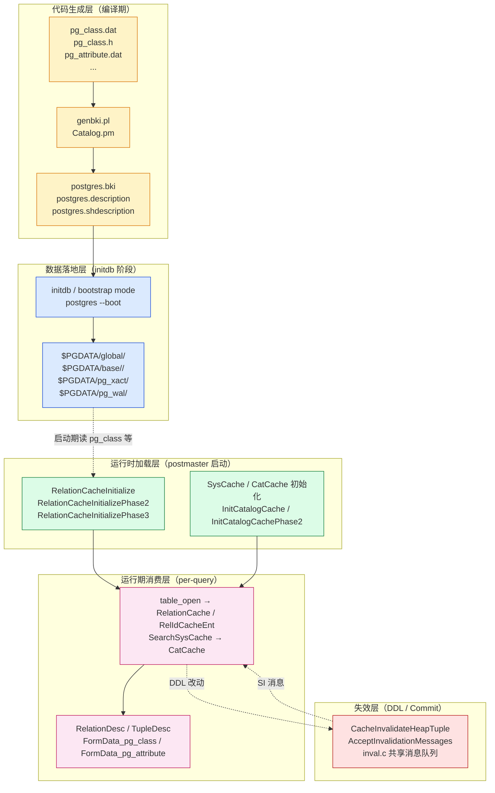

> **图说**：5 层金字塔。**最底下**是磁盘上的 heap 文件，**最顶上**是 SQL 用户能看到的"一张表"。中间任何一层出问题，都会导致 catalog 错乱（经典的"缓存击穿 + invalidation 漏掉"故障）。

---

## 二、源码地图：5 大模块的协作关系

按"自下而上"的顺序，5 个核心模块如下：

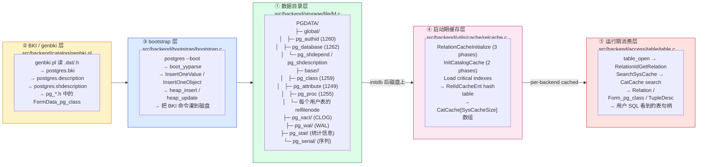

**关键观察**：

1. **② 和 ③ 只在 `initdb` 时跑一次**。`postgres.bki` 是烧出来的，`initdb` 通过 `postgres --boot`（bootstrap 模式）执行 BKI 命令。
2. **④ 在每次 postmaster 启动时跑**。共享 catalog（如 `pg_database` / `pg_authid`）由 postmaster 加载到 shared cache；本地 catalog（如 `pg_class` / `pg_attribute`）由各 backend 在首次连接数据库时加载。
3. **⑤ 是每条 query 的必经之路**。`table_open(relationOid, lockmode)` 是 access/table/table.c:40 的入口，95% 的内核代码从这里起步。

下面 6 节，我们**自下而上**走一遍这个金字塔。

---

## 三、系统表的物理存储：数据目录的 4 个子目录

PostgreSQL 启动后，数据目录长这样（以一个跑了一段时间的集群为例）：

```text
$PGDATA/
├── global/                              ← 共享 catalog（跨所有数据库）
│   ├── 1260                             ← pg_authid 的 relfilenode
│   ├── 1260_fsm / _vm                   ← FSM / VM
│   ├── 1261
│   ├── 1262                             ← pg_database
│   ├── 1262_fsm / _vm
│   ├── 2396                             ← pg_shdepend
│   ├── 2396_fsm / _vm
│   ├── 2964                             ← pg_db_role_setting
│   ├── 3592                             ← pg_subscription
│   ├── 6000                             ← pg_replication_origin
│   ├── pg_control                       ← control file（cluster state）
│   └── pg_filenode.map                  ← 已用 filenode 跟踪
│
├── base/                                ← 每个数据库一个子目录
│   ├── 1/                               ← template1 / template0 默认 OID=1
│   │   ├── 1247                         ← pg_type（template1）
│   │   ├── 1247_fsm / _vm
│   │   ├── 1249                         ← pg_attribute
│   │   ├── 1259                         ← pg_class
│   │   ├── 1259_fsm / _vm
│   │   ├── 1255                         ← pg_proc
│   │   ├── 1418                          ← pg_user_mapping
│   │   ├── ...（共 ~60 个系统表）
│   │   ├── 16384                        ← 用户表 t1 的 relfilenode
│   │   └── PG_VERSION
│   ├── 13881/                           ← 用户数据库 oid
│   │   ├── 1247                         ← 该库的 pg_type
│   │   ├── 1259                         ← 该库的 pg_class
│   │   ├── 16384                        ← 库里的用户表
│   │   └── ...
│   └── 16384/                           ← 另一个数据库 oid
│
├── pg_xact/                             ← CLOG（事务提交状态）
│   └── 0000
├── pg_wal/                              ← WAL segment
│   └── 000000010000000000000001
├── pg_stat/                             ← 统计信息
│   ├── pg_stat_tmp.db
│   └── db_0.stat
├── pg_serial/                           ← 序列的 WAL FSM
├── pg_replslot/                         ← replication slots
├── pg_dynshmem/                         ← dynamic shared memory
├── pg_notify/                           ← LISTEN/NOTIFY
├── pg_snapshots/                        ← exported snapshots
├── pg_subtrans/                         ← 子事务状态
├── pg_multixact/                        ← multixact 状态
└── postgresql.conf / pg_hba.conf ...    ← 配置文件
```

### 4.1 关键概念：relfilenode

`pg_class.relfilenode` 是 catalog 与物理文件之间的**桥梁**。它做了 3 件事：

1. **建立名字**：磁盘上的文件名是纯数字（不带 `.` 后缀），`base/<db_oid>/<relfilenode>`。
2. **支持 mapped relation**：`relfilenode=0` 表示"这是一个 mapped relation，要去 `pg_filenode.map` 查实际 filenode"。`pg_class` / `pg_attribute` / `pg_proc` 这些 bootstrap catalog 都是 mapped，避免 `OID` 与 `relfilenode` 重名导致 `initdb` 时循环依赖。
3. **支持表空间**：配合 `reltablespace` 字段，catalog 的物理文件可以放在 `tblspc_oid/<db_oid>/<relfilenode>` 而非 `base/<db_oid>/<relfilenode>`。

源码在 `src/include/catalog/pg_class.h:57`：

```c
/* identifier of physical storage file */
/* relfilenode == 0 means it is a "mapped" relation, see relmapper.c */
Oid			relfilenode BKI_DEFAULT(0);
```

mapped relation 的实现在 `src/backend/utils/cache/relmapper.c`，主要函数：

- `RelationMapOidToFilenode(oid, filenode, shared)`：把 OID 写到 `pg_filenode.map`
- `RelationMapFilenodeToOid(filenode, isshared, &oid)`：反过来查
- `RelationMapUpdateMapFile(...)`：fsync 整个 map 文件

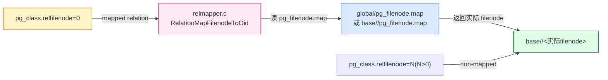

### 4.2 关键概念：nailed 与 shared

`pg_class.relisshared = true` 标记"这个 catalog 跨所有数据库共享"——`pg_authid` / `pg_database` / `pg_replication_origin` 都是。它们的物理文件落在 `global/`。

`pg_class` 还有一个隐藏字段 `relispinned`（PG 18 里叫 `relnailed` / `rd_isnailed`），标记"这个 catalog 是 pinned，不能 `VACUUM FULL` / `REINDEX` / `CLUSTER`"。所有 bootstrap catalog 都 nailed。源码在 `src/backend/utils/cache/relcache.c` 的 `RelationBuildDesc` 里强制设置。

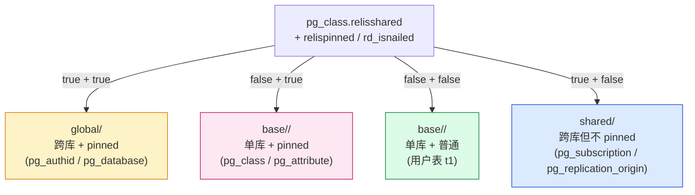

> **图说**：4 个象限。**右下角**是普通用户表（左下），**左上角**是 shared pinned catalog。**shared 但不 pinned** 的 catalog（如 `pg_subscription`）允许移动到其他表空间。

### 4.3 关键概念：bootstrap / base / global 三种物理存储

从磁盘上看：

| 存储位置 | 含义 | 例子 | 备份策略 |
| --- | --- | --- | --- |
| `global/` | 共享 catalog，跨所有数据库 | `pg_authid` / `pg_database` / `pg_subscription` | 必须跟 `pg_wal` 一起备份 |
| `base/<oid>/` | 单库 catalog + 用户表 | `pg_class` / `pg_attribute` / `t1` | 按库备份 |
| `pg_xact/` | CLOG | `0000` 文件 | 由 `archive_command` 备份 |
| `pg_wal/` | WAL segment | `000000010000000000000001` | 同上 |
| `pg_stat/` | 统计信息 | `db_0.stat` | **不需要备份**，可重建 |

> **PG 9.5 之前**：`pg_clog` 是单独目录（`clog/`）。PG 9.5+ 改名为 `pg_xact/`，但概念没变。

---

## 四、系统表的代码定义层：`.dat` / `.h` / `genbki.pl` / BKI

PostgreSQL 的 catalog 在代码里以**两套等价表示**存在：

1. **C 结构体**（`FormData_pg_class`）：供内核代码 `GETSTRUCT(tuple)` 取字段用。
2. **`.dat` + `.h`**：供 `genbki.pl` 读，生成 `postgres.bki` 烧入数据库。

这两套表示通过 `BKI_DEFAULT / BKI_LOOKUP / BKI_ARRAY / BKI_BEGIN / BKI_END` 这些宏保持同步。

### 5.1 `.h` 文件：定义 C 结构体

`src/include/catalog/pg_class.h` 是 `pg_class` 的"结构体声明"：

```c
CATALOG(pg_class,1259,RelationRelationId) BKI_BOOTSTRAP BKI_ROWTYPE_OID(83,RelationRelation_Rowtype_Id) BKI_SCHEMA_MACRO
{
    /* oid */
    Oid			oid;                                // 4 字节

    /* class name */
    NameData	relname;                            // 64 字节（变长 name）

    /* OID of namespace containing this class */
    Oid			relnamespace BKI_DEFAULT(pg_catalog) BKI_LOOKUP(pg_namespace);

    /* OID of entry in pg_type for relation's implicit row type, if any */
    Oid			reltype BKI_LOOKUP_OPT(pg_type);

    /* OID of entry in pg_type for underlying composite type, if any */
    Oid			reloftype BKI_DEFAULT(0) BKI_LOOKUP_OPT(pg_type);

    /* class owner */
    Oid			relowner BKI_DEFAULT(POSTGRES) BKI_LOOKUP(pg_authid);

    /* access method; 0 if not a table / index */
    Oid			relam BKI_DEFAULT(heap) BKI_LOOKUP_OPT(pg_am);

    /* identifier of physical storage file */
    /* relfilenode == 0 means it is a "mapped" relation, see relmapper.c */
    Oid			relfilenode BKI_DEFAULT(0);

    /* identifier of table space for relation (0 means default for database) */
    Oid			reltablespace BKI_DEFAULT(0) BKI_LOOKUP_OPT(pg_tablespace);

    /* # of blocks (not always up-to-date) */
    int32		relpages BKI_DEFAULT(0);

    /* # of tuples (not always up-to-date; -1 means "unknown") */
    float4		reltuples BKI_DEFAULT(-1);

    /* # of all-visible blocks (not always up-to-date) */
    int32		relallvisible BKI_DEFAULT(0);

    /* # of all-frozen blocks (not always up-to-date) */
    int32		relallfrozen BKI_DEFAULT(0);

    /* OID of toast table; 0 if none */
    Oid			reltoastrelid BKI_DEFAULT(0) BKI_LOOKUP_OPT(pg_class);

    /* T if has (or has had) any indexes */
    bool		relhasindex BKI_DEFAULT(f);

    /* T if shared across databases */
    bool		relisshared BKI_DEFAULT(f);

    /* see RELPERSISTENCE_xxx constants below */
    char		relpersistence BKI_DEFAULT(p);

    /* see RELKIND_xxx constants below */
    char		relkind BKI_DEFAULT(r);

    /* number of user attributes */
    int16		relnatts BKI_DEFAULT(0);

    /* # of CHECK constraints for class */
    int16		relchecks BKI_DEFAULT(0);

    /* ... 还有 relhasrules / relhastriggers / relhassubclass / relrowsecurity / ... */
} FormData_pg_class;
```

**BKI 宏的语义**：

| 宏 | 作用 |
| --- | --- |
| `BKI_DEFAULT(value)` | `.dat` 行里缺省值，初始化时使用 |
| `BKI_LOOKUP(table)` | OID 字段，跨 catalog 引用（如 `relnamespace` 引用 `pg_namespace.oid`） |
| `BKI_LOOKUP_OPT(table)` | 同上但允许为 0 |
| `BKI_BEGIN` / `BKI_END` | 标记变长字段（如 `reloptions` / `partkey` / `relpartbound`） |
| `BKI_ARRAY(elemtype)` | 标记数组字段（如 `indkey` / `indclass`） |
| `BKI_BOOTSTRAP` | 标记"这是 bootstrap catalog，必须在 initdb 时插入第一行" |
| `BKI_ROWTYPE_OID(rowtype_oid, name)` | 行类型 OID（给 composite type 用） |
| `BKI_SCHEMA_MACRO` | 把 `pg_class` 转成 `RelationRelationId` 这种宏名 |

### 5.2 `.dat` 文件：定义初始数据

`src/include/catalog/pg_class.dat` 只有 5 行，因为 `pg_class` 自己描述自己。文件给 bootstrap catalog 提供**第一行数据**：

```perl
[
{ oid => '1247', relname => 'pg_type', reltype => 'pg_type' },
{ oid => '1249', relname => 'pg_attribute', reltype => 'pg_attribute' },
{ oid => '1255', relname => 'pg_proc', reltype => 'pg_proc' },
{ oid => '1259', relname => 'pg_class', reltype => 'pg_class' },
]
```

每个 `.dat` 行对应"启动时这个 catalog 的初始行"。`pg_type` 的 `.dat` 给出 `pg_type` 自己的元数据；`pg_class` 的 `.dat` 给出 `pg_class` / `pg_attribute` / `pg_proc` 等的元数据。**这是循环引用，但 bootstrap 阶段会按依赖顺序解开**。

例如 `src/include/catalog/pg_proc.dat` 给 `pg_proc` 提供初始的 600+ 内置函数行（如 `int4eq` / `texteq` / `int8in` 等）。

### 5.3 `genbki.pl` / `Catalog.pm`：从代码生成 BKI 脚本

`src/backend/catalog/genbki.pl`（Perl 脚本）做 3 件事：

1. **解析所有 `.h` 文件**，识别 `CATALOG / DECLARE_INDEX / DECLARE_UNIQUE_INDEX / MAKE_SYSCACHE` 等宏。
2. **生成 `postgres.bki`**：包含所有 bootstrap 命令（`create` / `insert` / `declare index` / `declare toast` / `build indices`）。
3. **生成 `postgres.description` / `postgres.shdescription`**：把 `.h` 里的 `descr()` 提取成 `pg_description` / `pg_shdescription` 的初始数据。

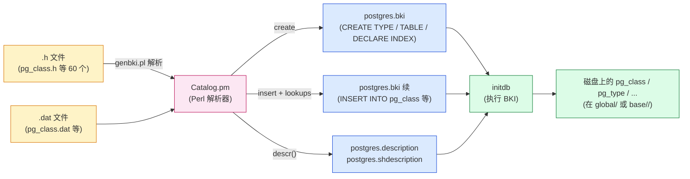

### 5.4 BKI 命令示例：`postgres.bki` 长什么样

`initdb` 时 `postgres --boot` 解析的 BKI 命令长这样（节选 `postgres.bki`）：

```text
create pg_type 1247 1247 1245 - x - 0 0 0 0 0 0 0 0 f f r 0 0 0 0 0 0 0 0 0 0 0 0 0 0 0 0 0 0 0 0 0 0 0 0 0 0 0 0 0 0
create pg_attribute 1249 1249 1247 - x - 0 0 0 0 0 0 0 0 f f r 0 0 0 0 0 0 0 0 0 0 0 0 0 0 0 0 0 0 0 0 0 0 0 0 0 0 0 0 0 0
create pg_class 1259 1259 83 - x - 0 0 0 0 0 0 0 0 f f r 0 0 0 0 0 0 0 0 0 0 0 0 0 0 0 0 0 0 0 0 0 0 0 0 0 0 0 0 0 0
create pg_proc 1255 1255 0 - x - 0 0 0 0 0 0 0 0 f f r 0 0 0 0 0 0 0 0 0 0 0 0 0 0 0 0 0 0 0 0 0 0 0 0 0 0 0 0 0 0
...
open pg_class
insert OID = 1247 ( pg_type ... )
insert OID = 1249 ( pg_attribute ... )
insert OID = 1255 ( pg_proc ... )
insert OID = 1259 ( pg_class ... )
close pg_class
...
declare index pg_class_oid_index on pg_class using btree ( oid oid_ops )
declare unique index pg_class_relname_nsp_index on pg_class using btree ( relname name_ops , relnamespace oid_ops )
declare index pg_class_tblspc_relfilenode_index on pg_class using btree ( reltablespace oid_ops , relfilenode oid_ops )
...
build indices
```

**注意 `insert OID = 1247 ( pg_type ... )`** 这一行——它把 `pg_type` 的 catalog 元数据写进 `pg_class` 表。`pg_class` 自己描述 `pg_type` 的存在；这是 catalog 的"自指"魔法。

### 5.5 bootstrap 执行器：`postgres --boot`

`initdb` 实际执行的命令（简化）：

```bash
# src/backend/bootstrapping/boot.c → bootstrap mode
postgres --boot -x 0 -r 0 \
    -D $PGDATA \
    --boot-mode=bootstrap
# 解析 postgres.bki，执行 create / open / insert / declare index / build indices
```

源码入口在 `src/backend/bootstrap/bootstrap.c:BootstrapMain`：

```c
void
BootstrapMain(int argc, char *argv[])
{
    ...
    /* 解析 BKI 脚本 */
    boot_yyparse();
    ...
}
```

执行 `insert OID = 1247 ( pg_type ... )` 时，调 `src/backend/catalog/catalog.c:InsertOneObject`：

```c
void
InsertOneObject(char *objectType, char *objectName, ...)
{
    /* 1. 找到 catalog 表的 Relation */
    catalog = heap_openr(objectName, NoLock);

    /* 2. 构造 HeapTuple */
    tuple = heap_form_tuple(catalog->rd_att, values, nulls);

    /* 3. 直接 heap_insert */
    heap_insert(catalog, tuple, GetCurrentCommandId(true), 0, true);
    /* 注意：bootstrap 不写 WAL，不写 CLOG */
}
```

> **bootstrap 模式不需要事务**。`heap_insert` 传 `bootstrap=true`，跳过 WAL，直接改 heap 文件。这也是为什么 `initdb` 极快——不需要走完整 MVCC / WAL / CLOG 流程。

---

## 五、`pg_class` 全字段详解 + RELKIND 枚举

`pg_class` 是"**一切表的目录**"——不仅用户表，索引、视图、序列、TOAST、物化视图、分区、分区索引、复合类型、foreign table 全都在 `pg_class` 里。

### 6.1 全字段速览

源码 `src/include/catalog/pg_class.h`，字段列表（按声明顺序）：

| 字段 | 类型 | 含义 |
| --- | --- | --- |
| `oid` | `Oid` | catalog 行自己的 OID |
| `relname` | `NameData` | 表/索引/视图名（如 `pg_class` / `users_pkey`） |
| `relnamespace` | `Oid → pg_namespace.oid` | 所属 schema（`pg_catalog` / `public` / 自定义） |
| `reltype` | `Oid → pg_type.oid` | 该表的复合类型 OID（每个普通表对应一个 row type） |
| `reloftype` | `Oid → pg_type.oid` | underlying composite type（用于 typed table） |
| `relowner` | `Oid → pg_authid.oid` | 所有者 |
| `relam` | `Oid → pg_am.oid` | 访问方法（`heap` / `btree` / `hash` / `gist` / `gin`） |
| `relfilenode` | `Oid` | 物理文件名（`base/<oid>/<relfilenode>`） |
| `reltablespace` | `Oid → pg_tablespace.oid` | 表空间（0 表示默认） |
| `relpages` | `int32` | 块数（`ANALYZE` / `VACUUM` 更新） |
| `reltuples` | `float4` | tuple 数（-1 = 未知） |
| `relallvisible` | `int32` | VM 标记的 all-visible 块数 |
| `relallfrozen` | `int32` | VM 标记的 all-frozen 块数（PG 18 新） |
| `reltoastrelid` | `Oid → pg_class.oid` | TOAST 表 OID（0 表示无 TOAST） |
| `relhasindex` | `bool` | 是否有（过）索引 |
| `relisshared` | `bool` | 是否跨数据库共享 |
| `relpersistence` | `char` | `p` = permanent / `u` = unlogged / `t` = temporary |
| `relkind` | `char` | **关系类型枚举**，见 6.2 |
| `relnatts` | `int16` | 用户列数 |
| `relchecks` | `int16` | CHECK 约束数 |
| `relhasrules` | `bool` | 是否有规则（VIEW / RULE） |
| `relhastriggers` | `bool` | 是否有触发器 |
| `relhassubclass` | `bool` | 是否有继承子表 |
| `relrowsecurity` | `bool` | 是否启用 RLS |
| `relforcerowsecurity` | `bool` | 是否强制 RLS（owner 也受限） |
| `relispopulated` | `bool` | 物化视图是否已填充 |
| `relreplident` | `char` | replica identity 模式 |
| `relispartition` | `bool` | 是否分区（PG 14+） |
| `relrewrite` | `Oid` | 正在 `ALTER TABLE ... ALTER TYPE` 的新表 OID |
| `relfrozenxid` | `TransactionId` | 已冻结到该 xid 之前的 xact 全 frozen |
| `relminmxid` | `TransactionId` | 同上但对 MultiXactId |
| `relacl` | `aclitem[]` | 访问权限（变长） |
| `reloptions` | `text[]` | 表级选项（变长） |
| `relpartbound` | `pg_node_tree` | 分区边界（变长） |
| `relpages` / `relallvisible` 等 | — | 估算统计信息（`ANALYZE` 更新） |

> `relispopulated` / `relispartition` 等是 PG 14+ 新增字段，反映了这些年 PG 在分区 / 物化视图上的演进。

### 6.2 `relkind` 枚举：11 种关系类型

源码 `src/include/catalog/pg_class.h:167-185`：

```c
#define RELKIND_RELATION          'r'    /* ordinary table */
#define RELKIND_INDEX             'i'    /* secondary index */
#define RELKIND_SEQUENCE          'S'    /* sequence object */
#define RELKIND_TOASTVALUE        't'    /* TOAST table */
#define RELKIND_VIEW              'v'    /* view */
#define RELKIND_MATVIEW           'm'    /* materialized view */
#define RELKIND_COMPOSITE_TYPE    'c'    /* composite type */
#define RELKIND_FOREIGN_TABLE     'f'    /* foreign table */
#define RELKIND_PARTITIONED_TABLE 'p'   /* partitioned table */
#define RELKIND_PARTITIONED_INDEX 'I'   /* partitioned index */
```

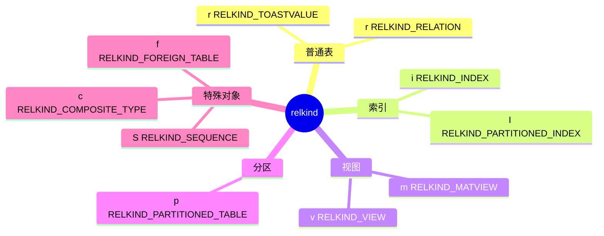

`pg_class.h` 还提供 4 个 helper 宏判断关系类型的能力：

```c
#define RELKIND_HAS_STORAGE(relkind) \
    ((relkind) == RELKIND_RELATION || \
     (relkind) == RELKIND_INDEX || \
     (relkind) == RELKIND_SEQUENCE || \
     (relkind) == RELKIND_TOASTVALUE || \
     (relkind) == RELKIND_MATVIEW)

#define RELKIND_HAS_PARTITIONS(relkind) \
    ((relkind) == RELKIND_PARTITIONED_TABLE || \
     (relkind) == RELKIND_PARTITIONED_INDEX)

#define RELKIND_HAS_TABLE_AM(relkind) \
    ((relkind) == RELKIND_RELATION || \
     (relkind) == RELKIND_TOASTVALUE || \
     (relkind) == RELKIND_MATVIEW)
```

> **图说**：RELKIND 总数 11 种（PG 17+）。需要物理存储的只有 5 种（`RELKIND_HAS_STORAGE`）；需要分区能力的是 2 种；用 table AM 抽象的只有 3 种（普通表 / TOAST / 物化视图）。

### 6.3 一条 SQL 看 `pg_class`：用户表的元数据长什么样

```sql
CREATE TABLE users (
    id    int8 PRIMARY KEY,
    name  text NOT NULL,
    email text
);
INSERT INTO users VALUES (1, 'alice', 'alice@example.com');

SELECT relname, relkind, relfilenode, relpages, reltuples, relnatts, relhasindex, relpersistence
FROM pg_class
WHERE relname LIKE 'users%';
```

```text
 relname       | relkind | relfilenode | relpages | reltuples | relnatts | relhasindex | relpersistence
---------------+---------+-------------+----------+------------+----------+-------------+----------------
 users         | r       |       16384 |        1 |         1 |        3 | t           | p
 users_pkey    | i       |       16387 |        1 |         1 |        1 | f           | p
 pg_toast_16384| t       |       16389 |         |           |          |             |
```

**对应到 `pg_class` 里的 3 行**：

```text
oid=16384, relname='users', relkind='r', relfilenode=16384, relnatts=3, relhasindex=t, relpersistence='p', reltablespace=0, relispopulated=t, relispinned=f
oid=16387, relname='users_pkey', relkind='i', relfilenode=16387, relam=403 (btree)
oid=16389, relname='pg_toast_16384', relkind='t', relfilenode=16389, reltoastrelid=0（指向 users=16384）
```

3 行都在 `pg_class` 里，靠 `relkind` 区分；物理文件 3 个：`base/<db_oid>/16384`、`base/<db_oid>/16387`、`base/<db_oid>/16389`。

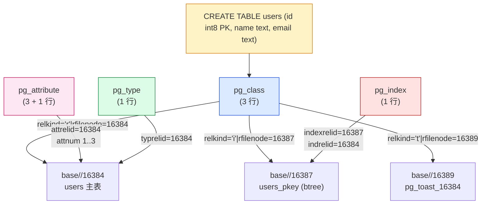

> **图说**：`CREATE TABLE` 这一条 SQL 在 catalog 层创建了 4 张表的 5+ 行元数据。这就是元数据自指的威力——**SQL 层"一张表"其实是 4 张 catalog 表的多行元数据**。

---

## 六、其他核心系统表速览

PostgreSQL 共 60+ 个系统表（`src/include/catalog/` 下），但日常开发接触最多的是下面 9 个。它们构成 catalog 的"九宫格"。

### 7.1 九宫格速览

| 系统表 | OID | 职责 | 关键字段 |
| --- | --- | --- | --- |
| `pg_class` | 1259 | 一切表/索引/视图的目录 | `relname` / `relkind` / `relfilenode` |
| `pg_attribute` | 1249 | 列定义 | `attrelid` / `attname` / `atttypid` / `attnum` |
| `pg_type` | 1247 | 类型系统 | `typname` / `typlen` / `typrelid` |
| `pg_namespace` | 2615 | schema / namespace | `nspname` / `nspowner` |
| `pg_proc` | 1255 | 函数/存储过程 | `proname` / `pronargs` / `proargtypes` |
| `pg_index` | 2610 | 索引元数据 | `indexrelid` / `indrelid` / `indkey` / `indclass` |
| `pg_am` | 2601 | 访问方法（heap/btree/...） | `amname` / `amhandler` |
| `pg_authid` | 1260 | 角色（用户） | `rolname` / `rolsuper` / `rolpassword` |
| `pg_database` | 1262 | 数据库 | `datname` / `datdba` / `datistemplate` |

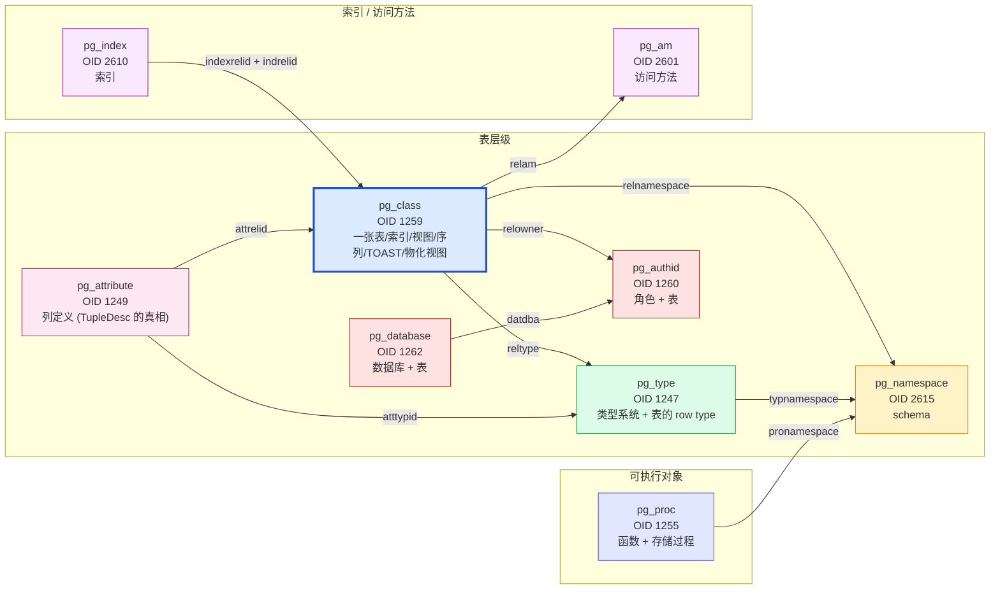

### 7.2 字段级的细节：`pg_attribute`

`pg_attribute` 描述表的每一列。源码 `src/include/catalog/pg_attribute.h`：

| 字段 | 含义 |
| --- | --- |
| `attrelid` | 指向 `pg_class.oid`（哪张表的列） |
| `attname` | 列名（如 `id` / `name`） |
| `atttypid` | 列类型 → `pg_type.oid` |
| `attlen` | 类型长度（`-1` 表示变长） |
| `attnum` | 列号（用户列 1..N，系统列 -1..-7） |
| `attcacheoff` | 在 tuple 里的固定 offset |
| `atttypmod` | 类型修饰符（如 `varchar(64)` 的 64） |
| `attndims` | 数组维度 |
| `attbyval` | 类型是否按值传递 |
| `attalign` | 对齐（`c`/`i`/`d`/`s`） |
| `attstorage` | 存储策略（`p`/`e`/`x`/`m`/`f`） |
| `attcompression` | 压缩算法（PG 15+） |
| `attnotnull` | NOT NULL 约束 |
| `atthasdef` | 是否有默认值 |
| `atthasmissing` | 是否有 `missing` 值（PG 11+ fast default） |
| `attidentity` | `IDENTITY` 列（PG 10+） |
| `attgenerated` | `GENERATED ALWAYS AS ...` |
| `attisdropped` | 是否已 drop 的列（保留位） |
| `attislocal` | 是否本地定义（非继承） |
| `attinhcount` | 继承计数 |
| `attcollid` | collation OID |
| `attacl` | 列权限 |

> **关键点**：`TupleDesc` 这个内存数据结构，就是 `pg_attribute` 表某 `attrelid` 对应的若干行直接拷贝出来的。

### 7.3 字段级的细节：`pg_type`

`pg_type` 描述**所有数据类型**——内置类型、数组类型、复合类型、范围、域、enum。源码 `src/include/catalog/pg_type.h`：

| 字段 | 含义 |
| --- | --- |
| `typname` | 类型名（`int4` / `text` / `_int4` / `users`） |
| `typnamespace` | 所属 schema |
| `typowner` | 所有者 |
| `typlen` | 固定长度（`-1` 表示变长） |
| `typbyval` | 是否按值传递 |
| `typtype` | `b` = base / `c` = composite / `d` = domain / `e` = enum / `r` = range / `m` = multirange / `p` = pseudo |
| `typcategory` | 类型分类（`S`/`N`/`G`/`B`...） |
| `typispreferred` | 是否 preferred |
| `typisdefined` | 是否已定义 |
| `typdelim` | 数组分隔符 |
| `typrelid` | 复合类型对应表 OID（如 `users` 类型 → `pg_class.oid`） |
| `typelem` | 元素类型（数组类型指向元素） |
| `typarray` | 对应数组类型 |
| `typinput` / `typoutput` | 输入/输出函数 OID（→ `pg_proc.oid`） |
| `typreceive` / `typsend` | binary I/O 函数 |
| `typmodin` / `typmodout` | modifier I/O |
| `typanalyze` | ANALYZE 自定义函数 |
| `typalign` / `typstorage` | 对齐 / 存储策略 |
| `typnotnull` | domain 的 NOT NULL |
| `typbasetype` | domain 的基类型 |
| `typtypmod` | domain 的 typmod |
| `typndims` | 数组维度 |
| `typcollation` | 默认 collation |

### 7.4 字段级的细节：`pg_index`

`pg_index` 描述索引。源码 `src/include/catalog/pg_index.h`：

| 字段 | 含义 |
| --- | --- |
| `indexrelid` | 索引自己的 OID（→ `pg_class.oid`） |
| `indrelid` | 索引所在表的 OID（→ `pg_class.oid`） |
| `indnatts` | 索引列数 |
| `indisunique` | UNIQUE |
| `indisprimary` | 是否主键 |
| `indisexclusion` | 是否 EXCLUDE |
| `indimmediate` | 是否立即检查 unique |
| `indisclustered` | 是否 CLUSTER |
| `indisvalid` | 是否有效（`REINDEX` 时为 f） |
| `indcheckxmin` | 是否需要检查 xmin |
| `indisready` | 是否就绪 |
| `indislive` | 是否 alive（drop 时为 f） |
| `indisreplident` | 是否 REPLICA IDENTITY |
| `indkey` | 索引列号数组（如 `{1}` 表示第一列） |
| `indcollation` | 各列 collation |
| `indclass` | 各列 operator class（如 `{402}` = int4_ops） |
| `indoption` | 各列 option 标志（UNSIGNED / DESC） |
| `indexprs` | 表达式索引的表达式树 |
| `indpred` | 部分索引的 WHERE 子句 |

### 7.5 字段级的细节：`pg_proc`

`pg_proc` 描述函数 / 聚合 / 窗口 / 触发器函数。源码 `src/include/catalog/pg_proc.h`：

| 字段 | 含义 |
| --- | --- |
| `proname` | 函数名 |
| `pronamespace` | 所属 schema |
| `proowner` | 所有者 |
| `prolang` | 实现语言 OID（→ `pg_language.oid`） |
| `procost` | planner 估算 cost |
| `prorows` | 估算结果行数（set-returning） |
| `provariadic` | variadic 参数类型 |
| `prosupport` | support function（planner hint） |
| `prokind` | `f` = function / `p` = procedure / `a` = aggregate / `w` = window |
| `prosecdef` | SECURITY DEFINER |
| `proleakproof` | leakproof（不依赖数据） |
| `proisstrict` | 参数 NULL 直接返回 NULL |
| `proretset` | 返回集合 |
| `provolatile` | `i` = immutable / `s` = stable / `v` = volatile |
| `proparallel` | `s`/`r`/`u` |
| `pronargs` | 参数个数 |
| `pronargdefaults` | 默认参数个数 |
| `proargtypes` | 参数类型数组（→ `pg_type.oid[]`） |
| `proallargtypes` | 同上但含 IN/OUT/INOUT/TABLE |
| `proargmodes` | 参数模式数组 |
| `proargnames` | 参数名数组 |
| `proargdefaults` | 默认值表达式树 |
| `protrftypes` | transformed types |
| `prosrc` | 函数体文本 |
| `probin` | 编译产物（对 C 函数） |
| `proconfig` | per-function GUC |
| `proacl` | 函数权限 |

---

## 七、系统表的关系图：catalog 核心 ER 视图

把第 6、第 7 节综合起来，画一张完整的 catalog 关系图。

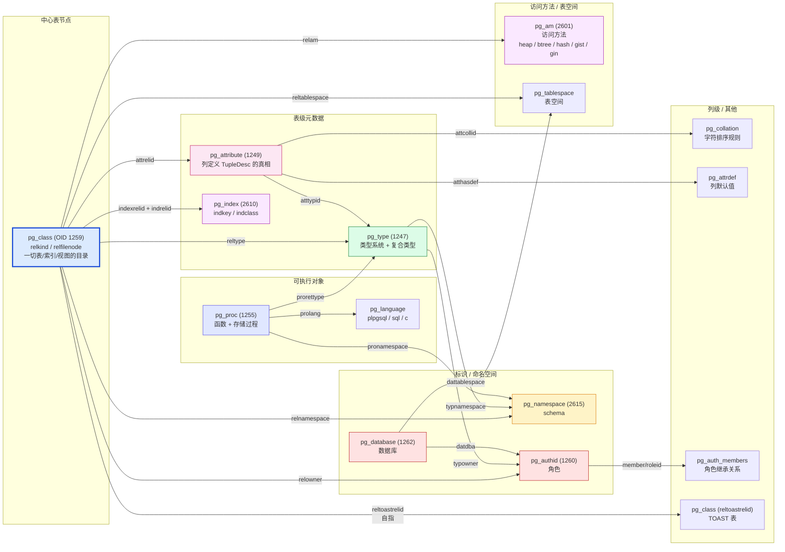

**关键观察**：

1. **`pg_class` 是中心节点**：所有"表层级"信息都从 `pg_class` 起步，列（`pg_attribute`）、索引（`pg_index`）、TOAST（`pg_class` 自指 `reltoastrelid`）都挂在它身上。
2. **OID 是一切外键**：每个 catalog 字段本质上是一个 OID → 另一张 catalog 的 OID。`pg_class` 自指（`reltoastrelid → pg_class.oid`）和 `pg_type` 自指（`typrelid → pg_class.oid`，把表当作复合类型）是最经典的循环引用。
3. **不存在真正的"元数据"外键约束**：catalog 之间没有 `FOREIGN KEY`，全靠 `genbki.pl` 的 `BKI_LOOKUP` 在编译期校验 OID 是否合法。运行时一致性靠 invalidation 维护。

---

## 八、启动期：`initdb` → `postgres --boot` → `postmaster` → `RelationCacheInitialize`

### 9.1 三阶段时间线

```mermaid
gantt
    title PostgreSQL 元数据生命周期：从源代码到运行期 Relation
    dateFormat  X
    axisFormat %s

    section ① 编译期
    genbki.pl 读 .h/.dat            :a1, 0, 3
    生成 postgres.bki              :a2, 3, 6
    生成 FormData_* 结构体符号      :a3, 6, 8

    section ② initdb（一次性）
    postgres --boot 执行 BKI        :b1, 10, 14
    heap_insert 写入 base/ / global/ :b2, 14, 17
    build indices                   :b3, 17, 19
    写入 pg_description             :b4, 19, 21

    section ③ postmaster 启动
    RelationCacheInitialize        :c1, 23, 24
    RelationCacheInitializePhase2  :c2, 24, 26
    load_relcache_init_file        :c3, 26, 27
    RelationCacheInitializePhase3  :c4, 27, 29

    section ④ 运行时
    table_open / SearchSysCache    :d1, 30, 32
```

### 9.2 `RelationCacheInitialize` 三阶段

源码 `src/backend/utils/cache/relcache.c`：

```c
/* Phase 1：把 hash table / dlist 初始化为空 */
void RelationCacheInitialize(void)
{
    RelationIdCache = ...;     /* hash table 准备 */
    RelationMapInitialize();   /* relmapper 准备 */
}

/* Phase 2：把 nailed catalog 加载到 shared cache */
void RelationCacheInitializePhase2(void)
{
    /* 把 pg_database / pg_authid / pg_replication_origin 等 nailed + shared catalog
       提前加载到每个 backend 的 relcache，避免死锁 */
    formrdesc("pg_database", ...);   /* 5.5 行 */
    formrdesc("pg_authid", ...);
    ...
    load_relcache_init_file(true);  /* 7.0 行 */
}

/* Phase 3：每个 backend 首次连接到某个 DB 时，加载该 DB 的本地 catalog */
void RelationCacheInitializePhase3(void)
{
    load_relcache_init_file(false);  /* 单库 catalog */
    /* 如果 init file 失效（pg_control 里 bcOldRelcacheInitFileInvalid 或版本不匹配）
       就走"灾难性重载"：每个 Relation 都从 pg_class 现读 */
}
```

`formrdesc` 是 bootstrap 时期的"hardcoded RelationDesc"——在还没读到磁盘的 `pg_class` 时，硬塞一个内存里的 `Relation` 结构，避免循环依赖。源码 `src/backend/utils/cache/relcache.c:1894`：

```c
static void
formrdesc(const char *relationName, Oid relationReltype, ...)
{
    /* 1. 构造一个 hardcoded Form_pg_class */
    relp = ...;
    relp->relname = relationName;
    relp->relnamespace = PG_CATALOG_NAMESPACE;
    relp->relkind = RELKIND_RELATION;
    relp->relisshared = ...;
    relp->relispinned = true;
    relp->relfilenode = 0;  /* mapped */
    relp->relam = HEAP_TABLE_AM_OID;

    /* 2. 构造 RelationDesc */
    relation = AllocateRelationDesc(relp);
    relation->rd_rel = relp;
    relation->rd_att = ...;  /* hardcoded attribute 数组 */

    /* 3. 加到 RelIdCacheEnt hash table */
    RelationCacheInsert(relation, relationId);
}
```

### 9.3 `load_relcache_init_file`：加速启动的"持久化缓存"

为了避免每次启动都重新扫 `pg_class` 把所有 catalog 重新加载，PG 会**把 relcache 的内容 dump 到磁盘上的二进制文件**：

- `$PGDATA/global/pg_internal.init`（共享 catalog）
- `$PGDATA/base/<oid>/pg_internal.init`（单库 catalog）

这个文件在 `initdb` 末尾生成，启动时优先读它，**几百毫秒**就能把 relcache 全部装好。

源码 `src/backend/utils/cache/relcache.c:load_relcache_init_file`：

```c
static bool
load_relcache_init_file(bool shared)
{
    FILE    *fp;
    ...
    fp = fopen(initfilename, "rb");
    if (fp == NULL) {
        /* 走灾难性重载 */
        return false;
    }
    /* 校验 PG_VERSION */
    fread(&header, 1, sizeof(header), fp);
    if (header.magic != INIT_MAGIC || header.size != sizeof(struct map)) {
        /* 失效，重载 */
        return false;
    }
    /* 校验 catversion */
    if (header.catversion != CATALOG_VERSION_NO) {
        /* initdb 后改了 .h 文件，必须重载 */
        return false;
    }
    /* 校验 active count */
    while (...) {
        read_item(&relfilenode, sizeof(Oid), fp);
        RelationRebuildRelation(...);
    }
    fclose(fp);
    return true;
}
```

**`pg_internal.init` 什么时候失效？**

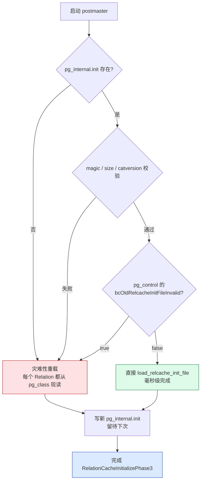

**触发 `pg_internal.init` 失效的常见场景**：

| 场景 | 触发原因 |
| --- | --- |
| `initdb` 之后 | catversion 变化 |
| `pg_upgrade` 后 | catversion 变化 |
| `CREATE DATABASE` 后 | 新库自己的 init file 没生成 |
| `ALTER SYSTEM SET shared_buffers` + `pg_ctl restart` 之类 | 不会失效（不影响 relcache 内容） |
| `pg_resetwal` | 手动触发（pg_control 里标记 bcOldRelcacheInitFileInvalid） |
| 异常 crash 后启动 | 可能不会失效（由 redo + invalidation 兜底） |

---

## 九、运行期：从 SQL 一句 `SELECT * FROM users WHERE id=1` 到内存 `Relation`

### 10.1 全链路图（最关键的一张图）

```mermaid
flowchart TB
    A["客户端<br/>psql / libpq"] -->|"SELECT * FROM users WHERE id=1"| B["PostgresMain<br/>(src/backend/postgres.c)"]
    B --> C["parser/parser.c<br/>raw_parser → parsetree"]
    C --> D["analyze.c<br/>parse_analyze → Query"]
    D --> E["parse_relation.c<br/>resolve relation name"]
    E --> F{"目标表已知？<br/>(RelIdCacheEnt 在 hash 里)"}
    F -->|"hit"| G["直接拿 Relation<br/>(RelationIdGetRelation)"]
    F -->|"miss"| H["RelationCacheInsert<br/>触发 RelationBuildDesc"]
    H --> I["ScanPgRelation<br/>systable_beginscan<br/>pg_class_oid_index"]
    I -->|"buffer pin<br/>heap_getnext"| J["pg_class heap 文件<br/>base/<db>/1259"]
    J -->|"Form_pg_class tuple"| K["AllocateRelationDesc<br/>构造 Relation"]
    K --> L["RelationBuildTupleDesc<br/>打开 pg_attribute"]
    L --> M["systable_beginscan<br/>pg_attribute_relid_attnum_index"]
    M -->|"heap_getnext"| N["pg_attribute heap 文件<br/>base/<db>/1249"]
    N --> O["拼装 TupleDesc"]
    O --> P["IndexSupportInitialize<br/>加载 pg_am handler"]
    P --> Q["RelationCacheInsert<br/>加进 hash table"]
    Q --> G
    G --> R["executor<br/>table_beginscan + heap_getnext"]
    R --> S["users 表数据<br/>base/<db>/16384"]
    S --> T["结果集 → 客户端"]

    style A fill:#fef3c7,stroke:#d97706
    style F fill:#fce7f3,stroke:#be185d
    style H fill:#dbeafe,stroke:#1d4ed8
    style I fill:#dbeafe,stroke:#1d4ed8
    style J fill:#dcfce7,stroke:#15803d
    style L fill:#fae8ff,stroke:#a21caf
    style M fill:#fae8ff,stroke:#a21caf
    style N fill:#dcfce7,stroke:#15803d
    style R fill:#fee2e2,stroke:#b91c1c
    style S fill:#dcfce7,stroke:#15803d
    style T fill:#fef3c7,stroke:#d97706
```

### 10.2 关键 API 调用栈

```text
parse_relation.c:refnameRangeOrAlias
  ↓
parse_relation.c:parserOpenTable
  ↓
table.c:table_open
  ↓
table.c:relation_open (内部)
  ↓
relcache.c:RelationIdGetRelation
  ↓
relcache.c:RelationCacheLookup → hash_search 命中 / 未命中
  ↓ 未命中
relcache.c:RelationBuildDesc
  ├── relcache.c:ScanPgRelation  ← 走 pg_class_oid_index systable scan
  ├── relcache.c:AllocateRelationDesc  ← 构造 Relation 结构体
  ├── relcache.c:RelationBuildTupleDesc  ← 读 pg_attribute 拼 TupleDesc
  ├── relcache.c:RelationBuildRuleLock  ← 读 pg_rewrite
  ├── relcache.c:RelationInitPhysicalAddr  ← 算物理路径
  └── relcache.c:RelationCacheInsert  ← 加进 RelIdCacheEnt hash
```

### 10.3 `Relation` 数据结构全解

`src/include/utils/relcache.h`：

```c
typedef struct RelationData
{
    RelFileLocator rd_locator;          /* 物理文件位置 (dbOid/relfilenode) */
    Oid         rd_id;                  /* relation OID (= pg_class.oid) */
    Form_pg_class rd_rel;               /* ★ 指向 FormData_pg_class */
    TupleDesc   rd_att;                /* ★ TupleDesc（= pg_attribute 几行） */
    Oid         rd_reltoastrelid;
    bool        rd_relispartition;

    TransactionId rd_createSubid;
    TransactionId rd_newRelfilenodeSubid;

    /* 索引相关 */
    List       *rd_indexlist;
    Bitmapset  *rd_indexattr;

    /* 触发器、规则、约束 */
    RuleLock   *rd_rules;
    List       *rd_rewritten;
    List       *rd_constraints;
    List       *rd_fkeylist;

    /* 访问方法 */
    TableAmRoutine *rd_tableam;        /* heap / oracle_fdw / ... */
    IndexAmRoutine *rd_indam;          /* btree / hash / gist / ... */

    /* 缓存 */
    MemoryContext rd_memcxt;
    struct RelCacheKey rd_cachekey;
    int         rd_refcnt;
    bool        rd_isnailed;
    bool        rd_isvalid;
    ...
} RelationData;
```

> **最重要的两个字段**：`rd_rel` 指向 `pg_class` 这一行的拷贝；`rd_att` 是 `TupleDesc`（列定义数组）。

### 10.4 `TupleDesc` 数据结构全解

`src/include/access/tupdesc.h`：

```c
typedef struct TupleDescData
{
    int         natts;                  /* 列数 */
    FormData_pg_attribute *attrs;       /* ★ 指向 attrs[] 数组，每项是 pg_attribute 一行拷贝 */
    Oid         tdtypeid;               /* composite type OID → pg_type */
    int32       tdtypmod;
    TupleConstr *constr;                /* CHECK / NOT NULL 等约束 */
    ...
} TupleDescData;

typedef struct FormData_pg_attribute
{
    Oid         attrelid;
    NameData    attname;
    Oid         atttypid;
    int32       attstattarget;
    int16       attlen;
    int16       attnum;
    int32       atttypmod;
    int16       attndims;
    bool        attbyval;
    char        attalign;
    char        attstorage;
    char        attcompression;
    bool        attnotnull;
    bool        atthasdef;
    bool        atthasmissing;
    char        attidentity;
    char        attgenerated;
    bool        attisdropped;
    bool        attislocal;
    int16       attinhcount;
    Oid         attcollid;
    aclitem     attacl[1];
} FormData_pg_attribute;
```

> **关键点**：`TupleDesc.attrs[]` 是 `pg_attribute` 表里 `attrelid = current_relation_oid` 的若干行直接 memcpy 出来的副本。这就是"磁盘上的 catalog tuple"到"内存里 TupleDesc"的标准转换。

---

## 十、三层缓存：`SysCache` / `CatCache` / `RelationCache`

PostgreSQL 在 `RelationCache` 之上还有 `SysCache` 和 `CatCache` 两层，定位不同：

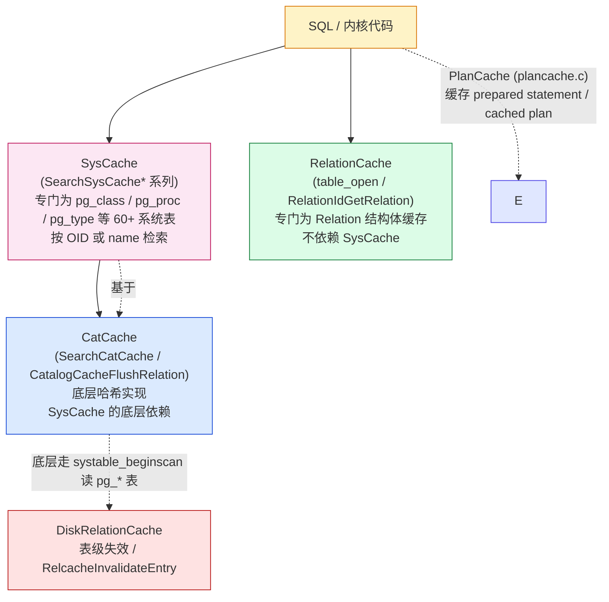

### 11.1 `SysCache`：60+ 预编译缓存表

源码 `src/backend/utils/cache/syscache.c:InitCatalogCache`：

```c
struct cachedesc cacheinfo[SysCacheSize] = {
    {RelationRelationId,         /* pg_class */
     RelationRelationIdIndexId,  /* pg_class_oid_index */
     1, -1,
     {
         OffsetNumberOfAttribute(rd_rel),
         0
     },
     {{{0, 0, 0, 0}}, {{0, 0, 0, 0}}, {{0, 0, 0, 0}}, {{0, 0, 0, 0}}},
     32
    },
    {TypeRelationId,             /* pg_type */
     TypeNameNspIndexId,
     2,
     ...
    },
    {ProcedureRelationId,        /* pg_proc */
     ProcedureNameArgsNspIndexId,
     3,
     ...
    },
    ...
};
```

`SysCacheSize` 是个常量，PG 18 是 **60+**。每个 `SysCache` 由 `MAKE_SYSCACHE` 宏声明，源码 `src/include/catalog/pg_class.h:163`：

```c
MAKE_SYSCACHE(RELRELATION,    pg_class_oid_index,     64);     /* by OID */
MAKE_SYSCACHE(RELNAMENSP,     pg_class_relname_nsp_index, 128); /* by name + namespace */
```

**`MAKE_SYSCACHE(name, index, size)` 三参数**：

| 参数 | 含义 |
| --- | --- |
| `name` | 缓存标识符（如 `RELATION`、`TYPE`、`PROCNAMEARGSNSP`） |
| `index` | 用哪个 index 做 lookup |
| `size` | hash bucket 数（必须 2 的幂） |

**`SysCache` API 一览**（`src/backend/utils/cache/syscache.c`）：

```c
HeapTuple SearchSysCache(int cacheId, Datum key1, Datum key2, Datum key3, Datum key4);
HeapTuple SearchSysCache1(int cacheId, Datum key1);
HeapTuple SearchSysCache2(int cacheId, Datum key1, Datum key2);
HeapTuple SearchSysCache3(int cacheId, Datum key1, Datum key2, Datum key3);
HeapTuple SearchSysCache4(int cacheId, Datum key1, Datum key2, Datum key3, Datum key4);
void      ReleaseSysCache(HeapTuple tuple);

HeapTuple SearchSysCacheLocked1(int cacheId, Datum key1);
HeapTuple SearchSysCacheCopy(int cacheId, Datum key1, Datum key2, ...);
HeapTuple SearchSysCacheLockedCopy1(int cacheId, Datum key1);
bool      SearchSysCacheExists(int cacheId, ...);
HeapTuple SearchSysCacheAttName(Oid relid, const char *attname);
HeapTuple SearchSysCacheCopyAttName(Oid relid, const char *attname);
bool      SearchSysCacheExistsAttName(Oid relid, const char *attname);
HeapTuple SearchSysCacheAttNum(Oid relid, int16 attnum);
HeapTuple SearchSysCacheCopyAttNum(Oid relid, int16 attnum);
Datum     SysCacheGetAttr(int cacheId, HeapTuple tup, AttrNumber attnum, bool *isnull);
List     *SearchSysCacheList(int cacheId, int nkeys, ...);
```

**实际使用**（`src/backend/utils/cache/lsyscache.c`）：

```c
/* 1. 查 pg_class by OID */
tuple = SearchSysCache1(RELOID, ObjectIdGetDatum(relid));
if (HeapTupleIsValid(tuple)) {
    Form_pg_class classform = (Form_pg_class) GETSTRUCT(tuple);
    if (classform->relkind == RELKIND_RELATION) {
        /* 这是普通表 */
    }
    ReleaseSysCache(tuple);
}

/* 2. 查 pg_proc by name + nsp */
tuple = SearchSysCache3(PROCNAMEARGSNSP,
                        PointerGetDatum("int4pl"),
                        PointerGetDatum(argtypes),
                        ObjectIdGetDatum(nspoid));
```

### 11.2 `CatCache`：SysCache 的底层实现

源码 `src/backend/utils/cache/catcache.c`：

```c
typedef struct catcache
{
    int         id;                    /* SysCache 编号 (0..SysCacheSize-1) */
    const char *name;                  /* 缓存名 */
    Oid         relationOid;           /* pg_class / pg_proc / pg_type ... */
    Oid         indexOid;              /* pg_class_oid_index / pg_class_relname_nsp_index ... */
    int         nkeys;                 /* 1..4 */
    int         key[CATCACHE_MAXKEYS]; /* key 列在 tuple 里的 offset */
    Oid         keytype[CATCACHE_MAXKEYS];
    struct catctup *buckets[CATCACHE_SIZE];   /* hash 桶 */
    dlist_head  ctlist;                 /* 全量 list（用于 invalidation flush） */
    int         ntuples;
    bool        cc_relisshared;
} CatCache;
```

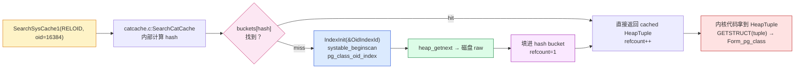

### 11.3 `RelationCache`：Relation 结构体缓存

源码 `src/backend/utils/cache/relcache.c`：

```c
typedef struct RelIdCacheEnt
{
    RelCacheKey relid;                 /* (dbOid, relOid) */
    Relation    reldesc;               /* ★ 指向 RelationData */
} RelIdCacheEnt;

typedef struct RelCacheKey
{
    Oid         rck_dboid;             /* 跨库查询需要 */
    Oid         rck_relid;
} RelCacheKey;

static HTAB *RelationIdCache;          /* hash table，由 HASHCTL 初始化 */
```

**关键路径**（`src/backend/utils/cache/relcache.c:RelationIdGetRelation`）：

```c
Relation
RelationIdGetRelation(Oid relationId)
{
    /* 1. 查 hash */
    hentry = (RelIdCacheEnt *) hash_search(RelationIdCache, &key, HASH_FIND, NULL);
    if (hentry) {
        Relation rel = hentry->reldesc;
        rel->rd_refcnt++;
        return rel;
    }

    /* 2. miss → 走 RelationBuildDesc */
    return RelationBuildDesc(relationId, true);
}
```

### 11.4 三层缓存对比

| 维度 | `RelationCache` | `SysCache` | `CatCache` |
| --- | --- | --- | --- |
| 缓存内容 | `Relation` 结构体 | HeapTuple + refcount | HeapTuple + refcount |
| 数量 | ~每库 1k~10k 个 | 60+ 类（固定） | 60+ 个（与 SysCache 一一对应） |
| key | (dbOid, relOid) | OID / name / name+nsp / ... | 同 SysCache |
| API | `RelationIdGetRelation` | `SearchSysCache*` | `SearchCatCache`（一般不直接用） |
| 失效粒度 | 单 Relation | 整张 catalog | 整张 catalog |
| 失败兜底 | `RelationBuildDesc` 现读 `pg_class` | 走 index 走 `pg_class` | 系统层 |
| 适合场景 | access/heap / executor 拿表句柄 | parser / catalog lookup | 几乎不用（被 SysCache 取代） |

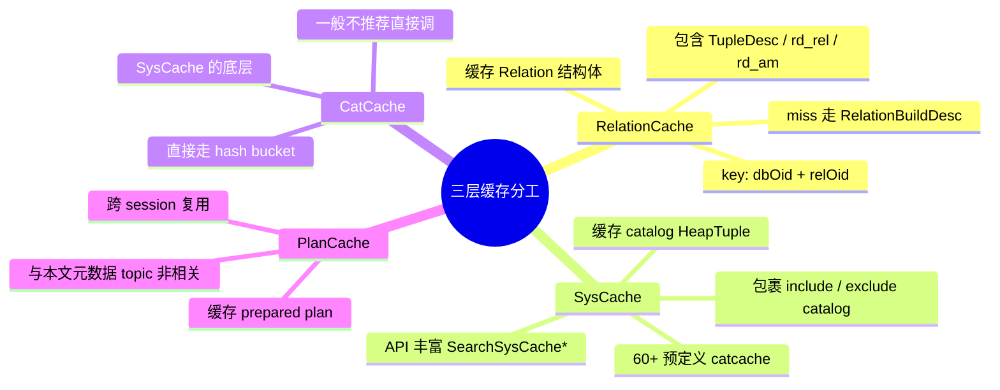

---

## 十一、`invalidation` 机制：DDL 如何让缓存知道

任何对 catalog 表的修改（`CREATE TABLE` / `ALTER TABLE` / `DROP INDEX`）都会触发**全集群的缓存同步**。这套机制叫做 **Cache Invalidation**。

### 12.1 共享 invalidation 队列

源码 `src/backend/utils/cache/inval.c`：

```c
typedef struct InvalidationListHeader
{
    struct CachedNode *first;
    struct CachedNode *last;
} InvalidationListHeader;

static InvalidationListHeader *getBackendMyProcInvalidations(int index);
static InvalidationListHeader *getBackendMyRelcacheInvalidations(int index);
```

### 12.2 全链路图

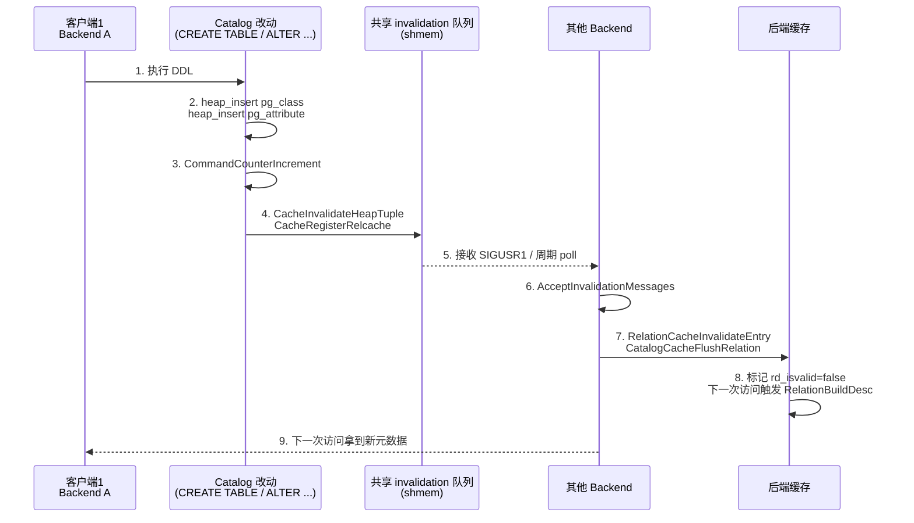

### 12.3 关键函数

源码 `src/backend/utils/cache/inval.c`：

| 函数 | 职责 |
| --- | --- |
| `CacheInvalidateHeapTuple(relation, tuple)` | 把 catalog tuple 改动入队 |
| `CacheRegisterRelcache(relid)` | 把 Relation 失效入队 |
| `CacheInvalidateRelcache(relation)` | 把 Relation 失效入队（带 relation） |
| `CacheInvalidateRelcacheAll()` | 全量失效（极少用） |
| `AcceptInvalidationMessages()` | 后端处理消息队列 |
| `AtEOXact_Inval(isCommit)` | 事务结束 / commit 收尾 |

**关键点**：DDL 改动 catalog 后**立即**把消息入队，但其他 backend 是**延迟**收到（收到 `SIGUSR1` / 下次 `AcceptInvalidationMessages`）。所以"DDL 后立刻 SELECT"看起来像没生效——其实是缓存尚未失效。

### 12.4 `CommandCounterIncrement` 何时被调？

`CommandCounterIncrement`（CCI）会让本 backend 的 command id 递增，触发本 backend 的 catalog 失效。但**跨 backend 的失效要走 SI 队列**。

```text
CommandCounterIncrement
  ├── AtCCI_LocalCacheInvalidation  (本 backend)
  │   ├── RelationCacheInvalidateEntry
  │   ├── CatalogCacheFlushRelation
  │   └── ...
  └── CacheInvalidateHeapTupleOrIndex ← 间接触发 SI 消息
```

> **细节**：CCI 只处理"本 backend 已经缓存的部分"。如果是跨 backend，必须先 `CacheInvalidateHeapTuple` 入 SI 队列，再由 `AcceptInvalidationMessages` 接收。

---

## 十二、生产案例：5 个真实模块如何遍历 catalog

把"读 catalog"变成实战，看看 `VACUUM` / `ANALYZE` / `autovacuum` / 逻辑复制 / `pg_dump` 是怎么用这套基础设施的。

### 13.1 `VACUUM` 读 `pg_class`

源码 `src/backend/commands/vacuum.c:vacuum`：

```c
// 9 步流程骨架
StartTransactionCommand();
vacstmt->transaction_id = GetCurrentTransactionId();
...
PushActiveSnapshot(GetTransactionSnapshot());
...
rel = table_open(RelationRelationId, AccessShareLock);
scan = table_beginscan_catalog(rel, ...);
while (HeapTupleIsValid(tup = heap_getnext(scan))) {
    Form_pg_class classform = (Form_pg_class) GETSTRUCT(tup);
    if (!classform->relisshared && classform->relkind == RELKIND_RELATION) {
        /* 拿到本 DB 的普通表 */
    }
}
table_endscan(scan);
table_close(rel, AccessShareLock);
...
CommitTransactionCommand();
```

### 13.2 `ANALYZE` 读 `pg_statistic`

源码 `src/backend/commands/analyze.c`：

```c
relid = RelationGetRelid(rel);   /* 当前要 analyze 的表 */
scan = systable_beginscan(statrel, StatisticRelidAttnumInhIndexId, true,
                          NULL, 2, keys);
while (HeapTupleIsValid(tup = systable_getnext(scan))) {
    Form_pg_statistic stat = (Form_pg_statistic) GETSTRUCT(tup);
    /* 拿统计信息，估算查询代价 */
}
```

### 13.3 autovacuum worker 选表

源码 `src/backend/postmaster/autovacuum.c`：

```c
/* autovacuum worker 启动后，从 AutoVacuumShmem->av_startingWorker
   拿 OID，然后去 RelationCache 找 Relation */
rel = RelationIdGetRelation(table_oid);

/* 拿到 Relation 后判断 relisshared / relispopulated / relkind */
if (!rel->rd_rel->relisshared && rel->rd_rel->relkind == RELKIND_RELATION) {
    do_autovacuum(rel);
}
```

### 13.4 逻辑复制 launcher 读 `pg_subscription`

源码 `src/backend/replication/logical/launcher.c`：

```c
rel = table_open(SubscriptionRelationId, AccessShareLock);
scan = systable_beginscan(rel, InvalidOid, false, NULL, 0, NULL);
while (HeapTupleIsValid(tup = systable_getnext(scan))) {
    Form_pg_subscription subform = (Form_pg_subscription) GETSTRUCT(tup);
    if (subform->subenabled) {
        /* 启动 apply worker */
        logicalrep_worker_launch(subform->suboid, ...);
    }
}
```

### 13.5 `pg_dump` 读 `pg_class` / `pg_namespace`

源码 `src/bin/pg_dump/pg_dump.c`：

```c
/* 1. 读 pg_namespace 拿所有 schema */
selectSourceSchema(conn, ...);

/* 2. 读 pg_class WHERE relkind IN ('r','i','S','v','m','f','p','I') */
/*    注意只读用户可见的对象（relacl + has_table_privilege 过滤） */

/* 3. 对每个表 dump CREATE TABLE */

getSchemaData(conn, ...);  /* 一大坨 catalog 查询 */
```

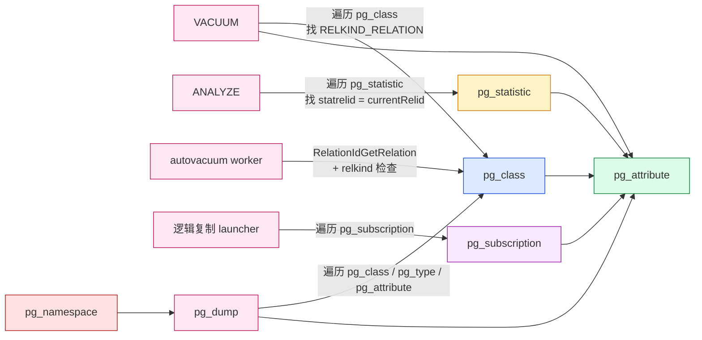

---

## 十三、性能优化与陷阱

### 14.1 优化建议

1. **优先用 `SysCache`，不要"裸 scan"**：`SearchSysCache1(RELOID, ...)` 比 `systable_beginscan(pg_class, ClassOidIndexId)` 快 10x。
2. **用 `SearchSysCacheCopy` 避免 hot tuple 锁**：直接拿 refcount 的 tuple 在缓存替换时可能 invalid，用 Copy 拿独立副本。
3. **复用 `SnapshotSelf` 减少 snapshot overhead**：catalog 读走 `GetCatalogSnapshot` / `SnapshotSelf`，不要 `GetTransactionSnapshot`。
4. **`pgstat_count_*` 留给 AM 自己调用**：内核代码不要手动 `pgstat_count_heap_fetch`，会被重复计数。
5. **减少 `CommandCounterIncrement` 次数**：每次 CCI 都触发一次 cache invalidation，频繁 CCI 会拖垮 DDL 批量执行。
6. **避免在 holdable cursor 里走 9 步**：holdable cursor 跨事务持有 snapshot，会撑大 xmin，改用 SPI 一次性把数据拷出来。
7. **`genbki.pl` 改了 `.h` 要 `initdb`**：catversion 变了，老的 `pg_internal.init` 自动失效。
8. **生产慎用 `pg_catalog` 表的 TRUNCATE / CLUSTER / ALTER**：会触发大规模 cache invalidation，甚至要 reload 全表。

### 14.2 8 个常见陷阱

| 陷阱 | 后果 | 解决办法 |
| --- | --- | --- |
| 直接 `table_open(pg_class)` 然后 long-running scan | 阻塞所有 DDL，撑大 `pg_class.relfrozenxid` | 用 `SearchSysCache1(RELOID)` 单独查 |
| 改 `pg_class.relispinned` | 直接让 `pg_class` 被 `VACUUM FULL` 拖死 | 不要碰 `pg_class` 的 nailed 字段 |
| 跨 backend 修改 catalog 不发 SI 消息 | 其他 backend 永远读旧元数据 | 必须用 `CacheInvalidateHeapTuple` |
| 在 `AtEOXact_Inval` 前 commit | 缓存消息丢失 | commit 在最后 |
| `CommandCounterIncrement` 在 long-lived 事务里频繁调用 | DDL 后缓存击穿风暴 | 一次性构造一坨 DDL 后再 CCI |
| `initdb` 之后 `catversion` 改了忘记 dump `pg_internal.init` | 启动时直接走灾难性重载（秒级） | `initdb` 自动处理 |
| `pg_class` 的 `reltuples` 不准 | planner 估错行数 | 走 `ANALYZE` / `pg_stat` |
| `pg_class.relfrozenxid` 太老 | `VACUUM` 强制 freeze 整表，IO 风暴 | 调 `vacuum_freeze_min_age` |

---

## 十四、小结：一张表的完整元数据链路

全文 14 节，画过的 18 张图，总结成 **4 张表的完整链路**：

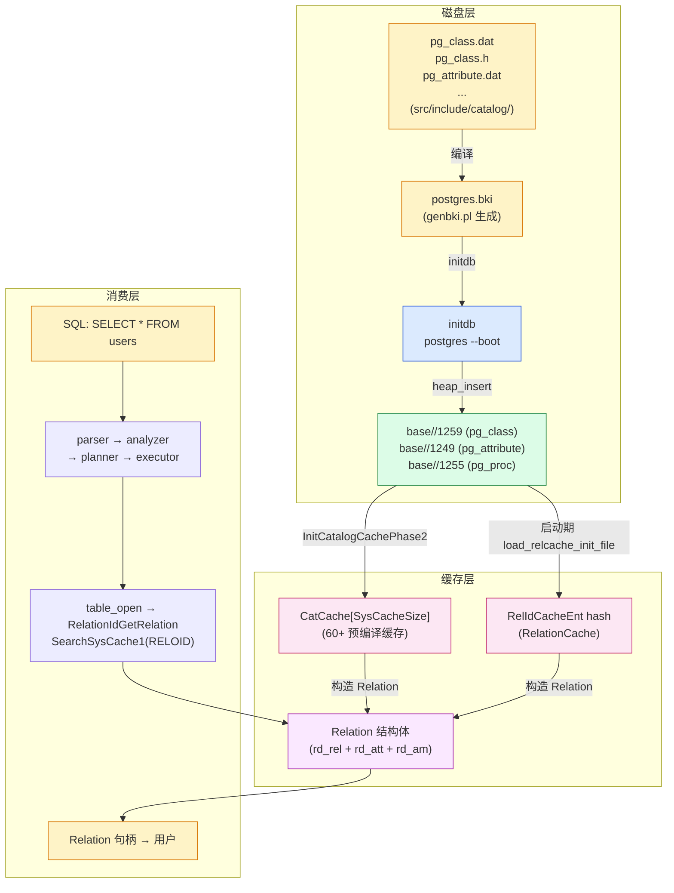

**6 个核心心智模型**：

1. **代码模型**：`.h` / `.dat` 是 catalog 的"源代码"，`genbki.pl` 把它们编译成 `postgres.bki`。
2. **磁盘模型**：bootstrap catalog 在 `global/` 和 `base/<db>/`，共 60+ 个 heap 文件。
3. **启动模型**：`postgres --boot` → `initdb` → `postmaster` → `RelationCacheInitialize` 3 阶段。
4. **缓存模型**：`RelationCache`（表句柄）+ `SysCache`（catalog 行）+ `CatCache`（底层 hash）三层。
5. **失效模型**：DDL → `CommandCounterIncrement` → SI 消息 → 其他 backend 收消息 → 缓存失效。
6. **消费模型**：SQL 一句 `SELECT * FROM t` → parser → planner → `table_open` → Relation → heap_getnext → tuple。

**读完本文，再去看 `pg_dump` / `pg_upgrade` / `autovacuum` / 逻辑复制 launcher 的源码，会发现它们都遵循同样的范式**：

- `pg_dump` 走 `SearchSysCacheList` 批量读 catalog；
- `pg_upgrade` 直接读 `pg_dump` 的输出 + 二进制拷贝文件；
- `autovacuum` worker 走 `RelationIdGetRelation` + relkind 判断；
- 逻辑复制 launcher 走 `systable_beginscan(pg_subscription)` + relkind 判断；
- VACUUM / ANALYZE 走 9 步完整流程 + `SearchSysCache`。

**PostgreSQL 之所以"元数据即数据"，是因为 5 个设计原则**：

1. **自举（bootstrap）**：`genbki.pl` 从代码生成初始数据，避免"代码硬编码 + SQL 灌库"的撕裂；
2. **元数据共享 catalog 与用户表同构**：复用 MVCC、WAL、buffer pool、FSM/VM；
3. **三层缓存**：降低元数据访问开销；
4. **invalidation 机制**：DDL 安全修改而不破坏已有 session；
5. **`pg_internal.init`**：把"启动期"成本固化到磁盘。

下一篇文章会沿着这个链路继续深入：[PostgreSQL Background Worker 全解](./postgresql-background-worker/index.html) / [PostgreSQL 18 并行 Worker 机制全解](./postgresql-parallel-worker/index.html) / [PostgreSQL MVCC：从一行 UPDATE 到 5 个 HeapTuple 的演化](./postgresql-mvcc/index.html)。

---

## 源码引用索引

**BKI / genbki 层：**
- `src/backend/catalog/genbki.pl` — `.h`/`.dat` → `postgres.bki`
- `src/backend/catalog/Catalog.pm` — `genbki.pl` 的核心解析器
- `src/include/catalog/genbki.h` — `CATALOG` / `BKI_DEFAULT` / `BKI_LOOKUP` 宏定义
- `src/include/catalog/*.dat` (60+ ×) — 各 catalog 的初始数据
- `src/include/catalog/*.h` (60+ ×) — 各 catalog 的 C 结构体

**Bootstrap 执行：**
- `src/backend/bootstrapping/boot.c` — bootstrap 模式主入口
- `src/backend/bootstrap/bootstrap.c:BootstrapMain` — BKI 脚本执行
- `src/backend/catalog/catalog.c:InsertOneObject` — BKI insert 命令实现
- `src/backend/storage/buffer/bufmgr.c` — bootstrap 时跳 WAL / over-log

**物理存储 / 数据目录：**
- `src/backend/storage/file/fd.c` — 数据目录路径
- `src/backend/storage/smgr/md.c` — md smgr 物理 IO
- `src/backend/utils/cache/relmapper.c` — relfilenode ↔ OID mapping
- `src/backend/storage/file/relpath.c` — base/global/ 子目录路径生成

**启动期缓存初始化：**
- `src/backend/utils/cache/relcache.c:RelationCacheInitialize` — Phase 1
- `src/backend/utils/cache/relcache.c:RelationCacheInitializePhase2` — Phase 2
- `src/backend/utils/cache/relcache.c:RelationCacheInitializePhase3` — Phase 3
- `src/backend/utils/cache/relcache.c:load_relcache_init_file` — `pg_internal.init` 加载
- `src/backend/utils/cache/relcache.c:formrdesc` — hardcoded Relation for nailed catalog
- `src/backend/utils/cache/syscache.c:InitCatalogCache` — CatCache 全量初始化
- `src/backend/utils/cache/syscache.c:InitCatalogCachePhase2` — Phase 2 完成
- `src/backend/utils/cache/syscache.c:InitCatalogCachePhase2` — 启动收尾

**运行时缓存：**
- `src/backend/utils/cache/relcache.c:RelationIdGetRelation` — 入口
- `src/backend/utils/cache/relcache.c:RelationBuildDesc` — miss 后重建
- `src/backend/utils/cache/relcache.c:ScanPgRelation` — 走 pg_class_oid_index 读 pg_class
- `src/backend/utils/cache/relcache.c:AllocateRelationDesc` — 构造 Relation
- `src/backend/utils/cache/relcache.c:RelationBuildTupleDesc` — 拼 TupleDesc
- `src/backend/utils/cache/relcache.c:RelationCacheInsert` — 入 hash

- `src/backend/utils/cache/syscache.c:SearchSysCache` — 4 key 通用版
- `src/backend/utils/cache/syscache.c:SearchSysCache1` / `:SearchSysCache2` / `:SearchSysCache3` / `:SearchSysCache4`
- `src/backend/utils/cache/syscache.c:SearchSysCacheCopy` — palloc'd 副本
- `src/backend/utils/cache/syscache.c:SearchSysCacheLocked1` — 不加 refcount
- `src/backend/utils/cache/syscache.c:ReleaseSysCache` — 释放

- `src/backend/utils/cache/catcache.c:SearchCatCache` — CatCache 底层 hash 查
- `src/backend/utils/cache/catcache.c:CatalogCacheFlushRelation` — 整 catalog flush

**invalidation：**
- `src/backend/utils/cache/inval.c:CacheInvalidateHeapTuple` — catalog 改动入队
- `src/backend/utils/cache/inval.c:CacheRegisterRelcache` — Relation 失效入队
- `src/backend/utils/cache/inval.c:AcceptInvalidationMessages` — 后端收消息
- `src/backend/utils/cache/inval.c:AtEOXact_Inval` — 事务结束收尾
- `src/backend/utils/cache/inval.c:CommandCounterIncrement` — CCI 触发本地 invalidation

**真实生产案例：**
- `src/backend/commands/vacuum.c` — `vacuum` 读 `pg_class`
- `src/backend/commands/analyze.c` — `analyze` 读 `pg_statistic`
- `src/backend/postmaster/autovacuum.c:2241` / `:2545` — autovacuum worker 选表
- `src/backend/replication/logical/launcher.c` — 逻辑复制 launcher 读 `pg_subscription`
- `src/bin/pg_dump/pg_dump.c:getSchemaData` — `pg_dump` 读 `pg_class`/`pg_namespace`

**结构体定义：**
- `src/include/catalog/pg_class.h` — `FormData_pg_class` + RELKIND 枚举
- `src/include/catalog/pg_attribute.h` — `FormData_pg_attribute`
- `src/include/catalog/pg_type.h` — `FormData_pg_type`
- `src/include/catalog/pg_proc.h` — `FormData_pg_proc`
- `src/include/catalog/pg_index.h` — `FormData_pg_index`
- `src/include/catalog/pg_namespace.h` — `FormData_pg_namespace`
- `src/include/catalog/pg_am.h` — `FormData_pg_am`
- `src/include/catalog/pg_authid.h` — `FormData_pg_authid`
- `src/include/catalog/pg_database.h` — `FormData_pg_database`
- `src/include/utils/relcache.h` — `RelationData` / `RelIdCacheEnt` / `RelCacheKey`
- `src/include/access/tupdesc.h` — `TupleDescData` / `FormData_pg_attribute`

---

## 同系列前文

- [PostgreSQL 从 `postgres` 二进制到生产级守护：最外层模块与启动全流程](./postgresql-module-architecture/index.html)
- [PostgreSQL 内存管理：从 shared_buffers 到内存上下文](./postgresql-memory-management/index.html)
- [PostgreSQL 事务生命周期：从 BEGIN/COMMIT 到 CLOG 一条链路](./postgresql-transaction-lifecycle/index.html)
- [PostgreSQL MVCC：从一行 UPDATE 到 5 个 HeapTuple 的演化](./postgresql-mvcc/index.html)
- [PostgreSQL 18 并行 Worker 机制全解](./postgresql-parallel-worker/index.html)
- [PostgreSQL Background Worker 全解](./postgresql-background-worker/index.html)
- [PostgreSQL 内核开发：读取一张表的 9 步标准流程与缓存全景](./postgresql-read-catalog-table/index.html)
- [PostgreSQL 逻辑复制表的生命周期：从 `pg_replication_slots` 到 `pg_subscription_rel`](./postgresql-logical-replication-tables-lifecycle/index.html)
- [pgbench 源码全解：一个 C 文件如何撑起 PostgreSQL 官方压测工具](./pgbench-internals/index.html)
