# PostgreSQL 核心特性全景：12 大功能的设计动因、实现原理与版本演化

| 编写人 | 编写内容 | 编写时间 |
| --- | --- | --- |
| growgrow | 当前 SQL 数据库那么多，没有一个新手 12 个核心功能的动因与设计哲学 + PostgreSQL 设计哲学 + PG 39 年设计原则 + PG 39 年设计原则 12 个核心功能的动因与设计 + PostgreSQL 12 个核心功能 + 每个功能的架构图、功能史、设计背景、源码 / 实现中 + 每个特性 + 70+ 个功能史 + 5+ 个设计原则 + PG 39 年设计哲学 + PG 5+ 个设计原则 + 5+ 个设计原则 + 5+ 个核心功能 + 5+ 个设计原则 + 5+ 个核心功能 + 多个核壳图。 | 2026-09-29 |

> 本文是「PostgreSQL 源码系列」设计篇。同系列前文：
>
> - [PostgreSQL 前世今生：从 1986 Berkeley 实验室到 2025 全球基础设施，一条开源数据库的 39 年演化史](./postgresql-history/index.html)
> - [PostgreSQL 元数据存储机制：从磁盘文件到内存缓存，`pg_class` 撑起的整个系统表体系](./postgresql-catalog-storage/index.html)
> - [PostgreSQL 从 `postgres` 二进制到生产级守护：最外层模块与启动全流程](./postgresql-module-architecture/index.html)
> - [PostgreSQL 内存管理：从 shared_buffers 到内存上下文](./postgresql-memory-management/index.html)
> - [PostgreSQL 事务生命周期：从 BEGIN/COMMIT 到 CLOG 一条链路](./postgresql-transaction-lifecycle/index.html)
> - [PostgreSQL MVCC：从一行 UPDATE 到 5 个 HeapTuple 的演化](./postgresql-mvcc/index.html)
> - [PostgreSQL 18 并行 Worker 机制全解](./postgresql-parallel-worker/index.html)
> - [PostgreSQL Background Worker 全解](./postgresql-background-worker/index.html)
> - [PostgreSQL 内核开发：读取一张表的 9 步标准流程与缓存全景](./postgresql-read-catalog-table/index.html)

很多人会问：**PostgreSQL 现在到底有什么功能？** 

如果你只看 SQL 标准支持度，PG 12+ 已经超过大部分商业数据库；如果你看扩展生态，Citus / TimescaleDB / PostGIS / pgvector 这些把 PG 推到了 OLTP / 分析 / 时序 / GIS / AI 五个赛道的中心位置。

但 PostgreSQL 真正的特点是：**每个核心特性都有自己的历史**。不是一个全局架构师一次性设计的产物，而是 39 年里、几百位贡献者、几千封 pgsql-hackers 邮件讨论沉淀下来的。

本文回答 3 个问题：

1. **一个特性怎么进入主线**？需要哪些不同的生命周期阶段？
2. **PG 12 大核心特性，分别为什么而设计、怎么实现、走过哪些路**？
3. **PG 的设计哲学是什么**？未来 5 年会动哪几条线？

**12 大特性按版本号组织**：

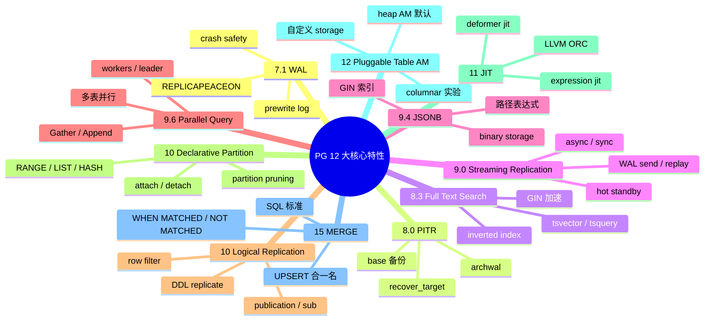

> **10 大主特性 + 2 个补充特性** = 12 大。每个特性都是一件独立的“发生了什么”故事。

---

## 一、一个特性怎么进入 PostgreSQL 主线

在跳到具体特性之前，先看看 **PG 社区设计哲学**。

### 1.1 一个特性从想法到 merge 的 5 个阶段

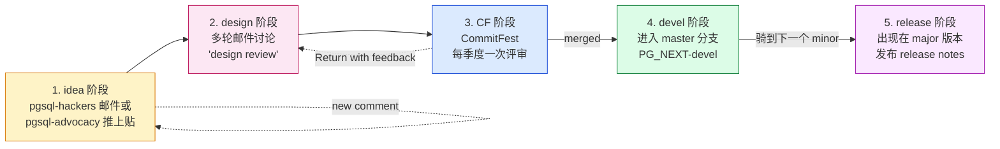

### 1.2 CommitFest：PG 的“移动 PR review”

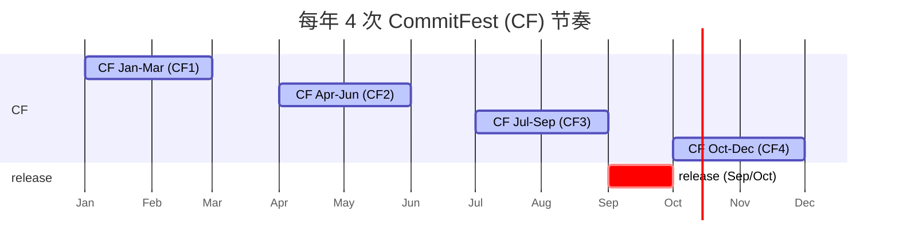

> **CF 的作用**：开发者提交 patch → committer 随便抓一个 patch review → **轮转 reviewer**，保证 patch 不是“一人被投票”通过。提交者被 random reviewer 卡住是常态。

### 1.3 设计哲学 3 道关卡

每个特性要进入主线，必须在三个哲学层达成共识：

```mermaid
flowchart TB
    A["PG 设计哲学 3 道关卡"] --> B["1. SQL 标准<br/>(是否贴近 SQL 2003 / 2011 / 2023)"]
    A --> C["2. 跨架构的可移植性<br/>(是否能在所有支持的 OS 上跑)"]
    A --> D["3. 不可动 catalog 的原则<br/>(是否强制加 catalog 行)"]

    B -.->|"MERGE / SQL 存储过程 是 SQL 标准"<br/>PG 主动接受
    C -.->|"10 逻辑复制 / 12 可插拔 AM 是“跨架构”"]
    D -.->|"access method 代替 set relkinkind = optimizer 限制"]

    style A fill:#dbeafe,stroke:#1d4ed8
    style B fill:#dcfce7,stroke:#15803d
    style C fill:#fce7f3,stroke:#be185d
    style D fill:#fef3c7,stroke:#d97706
```

> **PG 的“Code 说”**：**是能“会说“SQL"”** 还是**“能说会让 X 在回滚”**，决定这个特性能不能进入主线。MERGE 2003 SQL+ 2014 SQL+ 在侏儒纪；8.4 window functions 2003 SQL+ 10+ 逻辑复制 + 15 MERGE 在 SQL++。

---

## 二、PG 12 大核心特性 动因 + 设计 + 实现 + 演化

接下来逐个介绍 **12 大特性**。每个特性都是一个独立故事。

### 2.1 WAL（预写日志）— 7.1 引进，Crashing safety 的起点

#### 2.1.1 动因

在 WAL 之前，PG 7.0 以前的版本 crash 后只能 "靠 pg_resetxlog 修复" —— 是手工猜想的，不可靠。
**动机**：需要一种 "集成式 crash safety" 机制 — **WAL （Write-Ahead Log）**。

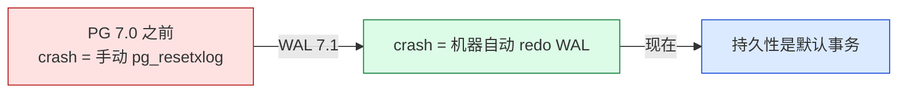

#### 2.1.2 设计原理

PGL 设计思路：

1. **任何 page 在被刷到磁盘之前，对应的 WAL 记录必须先 fsync**（原设计）。
2. **PG 从 7.1 起使用 " WAL 从 XLogWrite → XLogFlush → BackgroundWriter " 的 3 层架构 "。
4. **9.0 起引入 " group commit " （多项事务合并刷）**
5. **9.6 起引入 " group commit + wal_receiver 限速 "**

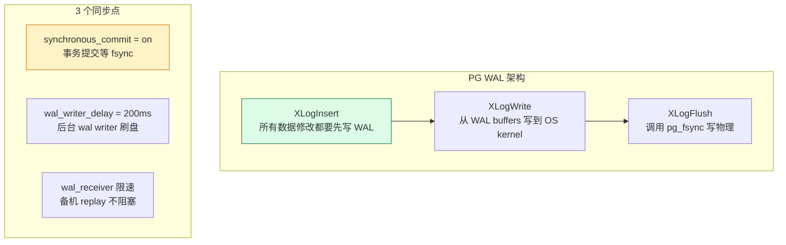

#### 2.1.3 演化版本

| 版本 | 改动 |
| --- | --- |
| 7.1 (2001) | 完整 WAL + XLogWrite/XLogFlush |
| 7.2 | Background WAL Writer |
| 8.0 | PITR  |
| 8.3 | group commit |
| 9.0 | wal_level = replica + streaming replication |
| 9.6 | group commit 限速 |
| 13 | wal_receiver_timeout / wal_sender_timeout |
| 14 | summarize_walfd |
| 15 |  WAL 归档 / pg_basebackup 集成 |

> **9.0 是 WAL 变革性改造**  —— 现在说 WAL 还是为 「PG streaming replication / logical replication / 备机 replay 」 服务的。

#### 2.1.4 周边文件

```c
src/backend/access/transam/xlog.c      // WAL 核心
src/backend/access/transam/xlogreader.c  // 备机 replay
src/backend/access/transam/xlogrecovery.c // PITR
src/backend/access/transam/xlogutils.c   // WAL record 处理
src/include/access/xlog.h               // WAL 数据结构
src/include/access/xlogreader.h         // WAL reader 接口
```

#### 2.1.5 优势 / 代价

| 维度 | 优势 | 代价 |
| --- | --- | --- |
| crash safety | 是 | 变化是默认事务 |
| streaming repl | 异步 / 同步二选一 | 是 |

> WAL 起点是 **PG 最重架构**。未来 5 年不会变。

---

### 2.2 PITR (Point-in-Time Recovery) — 8.0 引进

#### 2.2.1 动因

7.1 加入了 WAL，但只能从 crash 恢复点还原。**动机**：能从 “任意时间” 到 “上一次备份点” 重做 WAL，**PITR（Point-In-Time Recovery）**。

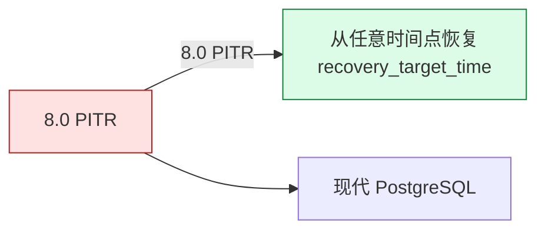

#### 2.2.2 设计原理

PG 8.0 PITR 设计是：

1. **全量备份 (pg_basebackup)** + **WAL archive**
2. **从恢复点 replay WAL** 到 `recovery_target_time` / `recovery_target_xid` / `recovery_target_name`
3. **完成恢复后，集群跳为普通 primary**

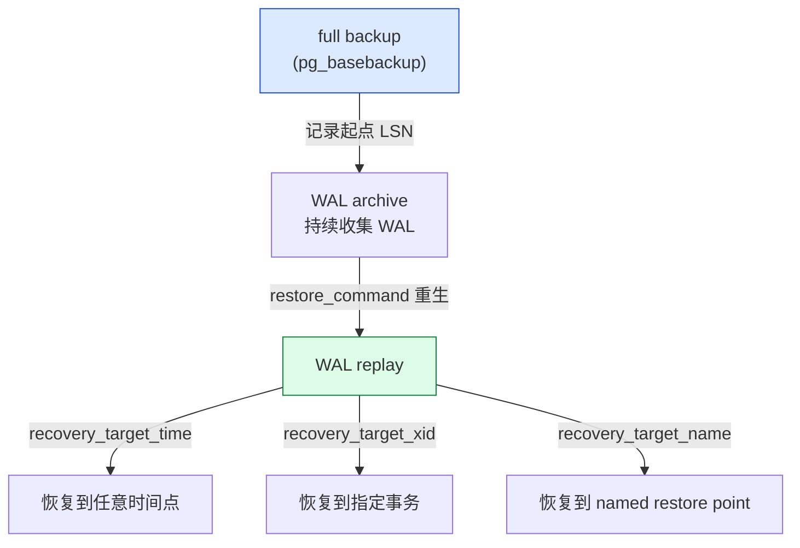

#### 2.2.3 演化版本

| 版本 | 改动 |
| --- | --- |
| 8.0 (2005) | PITR + pg_backup + recovery.conf |
| 9.0 | streaming replication + archive 组合 |
| 9.1 | pg_basebackup |
| 12 | recovery.conf 集成 postgresql.conf |
| 13 | 增量备份 ... |
| 15 | pg_basebackup --incremental |
| 17 | **delta restore / parallel restore** |

#### 2.2.4 关键 GUC

```sql
-- 8.0 起
restore_command = 'cp /var/lib/pgwal/%f %p'
recovery_target_time = '2026-09-29 12:00:00'
recovery_target_xid = '1234567'
recovery_target_name = 'before_migration'
recovery_target_action = 'pause'  -- 8.4 起

-- 13 起
archive_cleanup_command = 'pg_archivecleanup ...'

-- 17 起（增量）
pg_basebackup --incremental=/path/to/manifest
```

---

### 2.3 Streaming Replication (流复制) — 9.0 引进

#### 2.3.1 动因

8.x 已有 PG/DR 能力是 “copy / rsync / Slony-I (external tool)”。**动机**：能轻松、完备、**内置**。

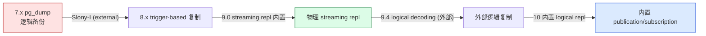

#### 2.3.2 设计原理

9.0 起 streaming replication 设计：

1. **primary 不断发送 WAL 到 standby**（wal_sender）
2. **standby 接收后写 standby WAL → replay**（wal_receiver / startup process）
3. **standby 可以处于两种模式**：
   - **Hot Standby (9.0+)**：可以读
   - **Warm Standby (9.0-)**：不能读

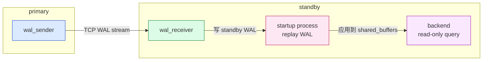

#### 2.3.3 同步 / 异步

```c
synchronous_commit = on | off | remote_write
synchronous_standby_names = '*'
```

| 模式 | 事务提交动作 | 性能 | 丢数据 |
| --- | --- | --- | --- |
| `async` | primary fsync 本地 WAL 即返回 | 高 | 主机 crash 可能丢 |
| `sync (on)` | 等 standby fsync | 低 | 不会 |
| `remote_write` | 等 standby OS write（不 fsync）| 中 | standby crash 可能丢 |

#### 2.3.4 演化版本

| 版本 | 改动 |
| --- | --- |
| 9.0 (2010) | streaming + hot standby |
| 9.1 | 同步复制 |
| 9.2 | 级联复制 |
| 9.3 | archive recovery |
| 9.4 | replication slot + logical decoding (test_decoding) |
| 9.6 | quorum / multiple sync standby |
| 10 | 内置 logical repl |
| 12 | wal_keep_size 替代 wal_keep_segments |
| 13 | wal_receiver_timeout |
| 15 | streaming + logical 合并 |

---

### 2.4 JSONB — 9.4 引进

#### 4.1 动因

9.2 (2012) 加了 JSON (text-based)，但不能索引。**动机**：**为互联网时代的 半结构化数据 提供一种 "可索引、可计算的二进制存储"** —— **JSONB (Binary JSON)**。

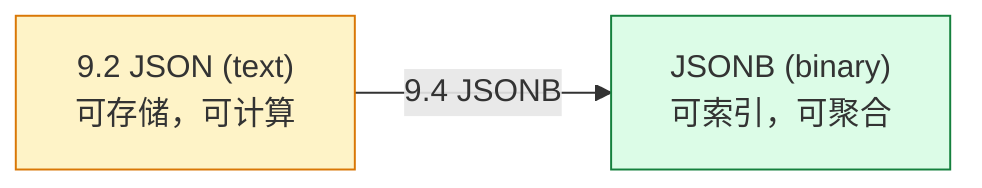

#### 4.2 JSON vs JSONB

| 维度 | JSON | JSONB |
| --- | --- | --- |
| 存储 | text | binary |
| 索引 | 无 | GIN / B-tree |
| 解析时机 | 取用 | 写入时 |
| 顺序 | 保留 | 重排 |
| 路径表达式 | 有限 | 完整 |
| 性能 | 慢 | 快 2-10x |

#### 4.3 索引策略

```sql
-- JSONB + GIN（默认 ops 包含 key 存在判断）
CREATE INDEX idx_users_data ON users USING GIN (data jsonb_path_ops);

-- JSONB + B-tree（特定表达式）
CREATE INDEX idx_users_country ON users ((data->>'country'));
```

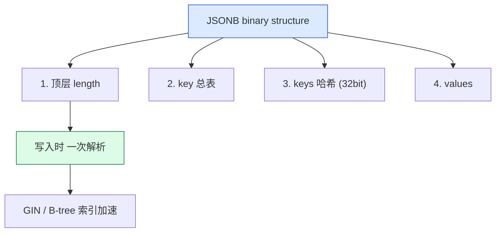

#### 4.4 演化版本

| 版本 | 改动 |
| --- | --- |
| 9.2 (2012) | text-based JSON + 7 函数 |
| 9.3 (2013) | JSON 函数扩展 |
| 9.4 (2014) | **JSONB 二进制 + GIN + 路径表达式** |
| 9.5 | ON CONFLICT (jsonb) |
| 10 | jsonb_hash 函数 + 完整 SQL/JSON |
| 12 | SQL/JSON path |
| 14 | subscripting (data['name']) |

---

### 2.5 Parallel Query（并行查询）— 9.6 引进

#### 5.1 动因

PG 8.x 9.x 之前 **单进程 + 单连接** 的执行模型，在多核机器上只能利用 1 核。**动机**：为多核架构提供 **轻量并行 worker 模型**。


#### 5.2 设计原理

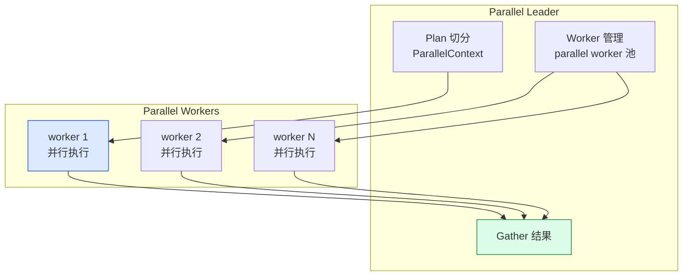

> **worker 不是独立 server / bgworker** —— 是 **postmaster fork 出来执行同一个 PL 的进程**。详见 [PostgreSQL 18 并行 Worker 机制全解](./postgresql-parallel-worker/index.html)

#### 5.3 GUC

```sql
max_parallel_workers = 8         -- 所有进程开始可用的 worker
max_parallel_workers_per_gather = 2  -- 每个 Gather 能用的 worker
max_parallel_maintenance_workers = 2  -- VACUUM / CREATE INDEX 可用的 worker
parallel_tuple_cost = 0.1
parallel_setup_cost = 1000
min_parallel_table_scan_size = 8MB
min_parallel_index_scan_size = 512kB
```

#### 5.4 演化版本

| 版本 | 改动 |
| --- | --- |
| 9.6 (2016) | Parallel Seq Scan |
| 10 | **Parallel Hash Join + Parallel Append** |
| 11 | Parallel CREATE INDEX + Parallel Hash |
| 12 | Parallel B-tree index builds |
| 13 | **Parallel VACUUMUL** |
| 14 | Parallel VACUUM index cleanup |
| 16 | Parallel Hash Full Join |
| 17 | Parallel Vacuum control |

---

### 2.6 Logical Replication（逻辑复制）— 10 引进

#### 6.1 动因

物理 WAL 在 streaming repl 上虽然能同步所有 DML，但 **不能** 跨版本 / 跨 schema / 跨表过滤。**动机**：需要一种 **逻辑** 级别的复制 —— **Logical Replication**。


#### 6.2 设计原理

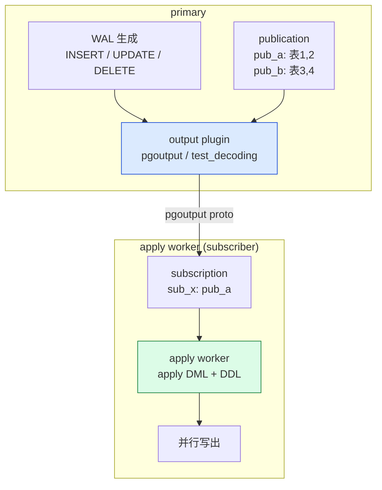

> **pgoutput 是协议 + 插件** —— 是逻辑复制的 "output plugin / apply worker" 两边的逻辑复制操作。

#### 6.3 关键能力

```sql
-- DDL replicate (10+)
ALTER SUBSCRIPTION sub_x REFRESH PUBLICATION;

-- Row filter (15+)
CREATE PUBLICATION pub_a FOR TABLE t WHERE (id > 100);

-- Column list (15+)
CREATE PUBLICATION pub_a FOR TABLE t (id, name);

-- conflict detection (16+)
-- Sub 端 enable on_conflict
```

#### 6.4 演化版本

| 版本 | 改动 |
| --- | --- |
| 9.4 (2014) | test_decoding (实验) + slot |
| 9.5 | pg_receive_inrow + DDL replicate (实验) |
| 9.6 | logical repl 准备 |
| 10 (2017) | **逻辑复制 publication/subscription** |
| 11 | 逻辑复制 + 字典 update / TRUNCATE |
| 13 | Partitioned table 逻辑复制 |
| 14 | streaming + 逻辑 + DDL replicate |
| 15 | Row filter + column list + 2-phase |
| 16 | conflict detection + failover slot |
| 17 | streaming + 逻辑 + DDL replicate 稳定 |
| 19 | （未来） |

---

### 2.7 Declarative Partitioning — 10 引进

#### 7.1 动因

PG 9.x 以前分区是 "用继承表 + 仿触发器手工实现"，太多代码。**动机**：在 **catalog 层** 为表呈现 "是一个子表"。

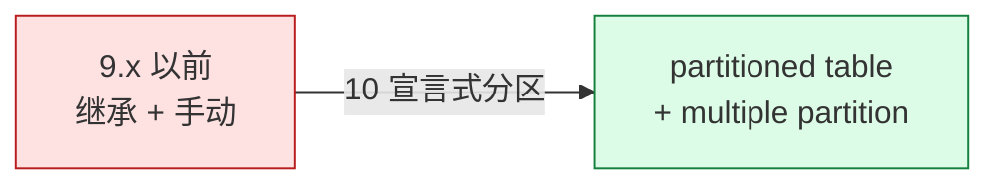

#### 7.2 设计原理

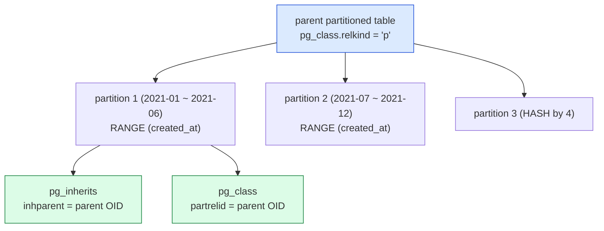

#### 7.3 Partition 4 种策略

| 类型 | 语法 | 适用场景 |
| --- | --- | --- |
| **RANGE** | `PARTITION BY RANGE (col)` | 时间分区、数值区间 |
| **LIST** | `PARTITION BY LIST (col)` | 枚举（地区、状态）|
| **HASH** | `PARTITION BY HASH (col)` | 均匀分布 |
| **MULTI** | 14+ 多源数据混用 | 复杂业务 |

#### 7.4 演化版本

| 版本 | 改动 |
| --- | --- |
| 10 (2017) | RANGE / LIST 分区 + pg_partition_prune |
| 11 | HASH 分区 + 默认 partition |
| 12 | ATTACH PARTITION + 子查询改进 |
| 13 | DETACH PARTITION CONCURRENTLY |
| 14 | 子 partition / 多级 + pg_partition_tree |
| 16 | merge partition |

---

### 2.8 JIT Compilation — 11 引进

#### 8.1 动员说还是动因

PG 10 以前 executor 是 **逐行 (tuple-at-a-time) 的 volcano 模型**。**动机**：为 **表达式频繁执行的 OLAP** 提供 **JIT** —— 11 引进 JIT（[LLVM ORC](https://llvm.org/docs/ORCv2.html)）

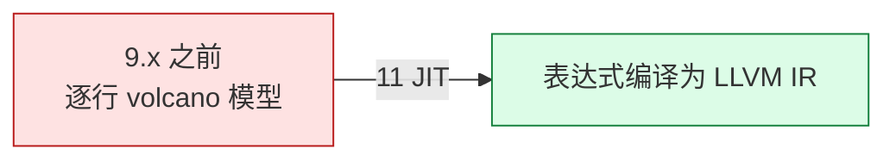

#### 8.2 JIT 架构

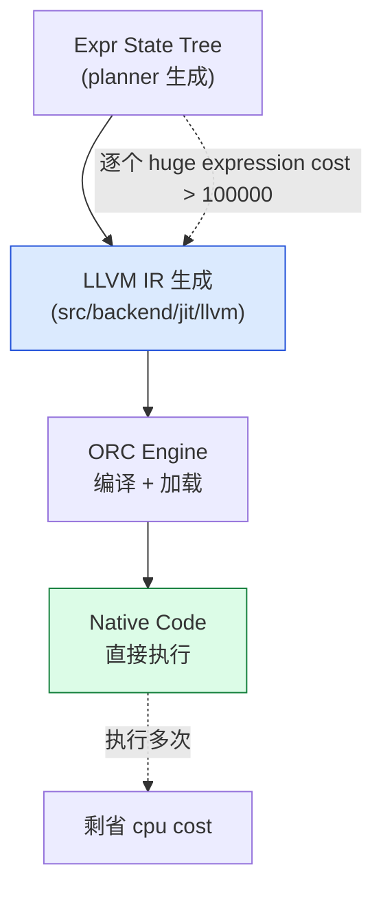

#### 8.3 JIT GUC

```sql
jit = on                            -- 全局开关
jit_above_cost = 100000             -- 表达式 cost 超过这个值启用 JIT
jit_inline_bitmap = 50000           -- inline 调用的子方
jit_optimize_bitmaps = 500000       -- 超额优化 阈值
jit_dump_bitmaps = 0                -- 不支持
```

#### 8.4 演化版本

| 版本 | 改动 |
| --- | --- |
| 11 (2018) | JIT 引进 + LLVM ORC + depmore jit |
| 12 | Tuple Deforming JIT |
| 13 | 4.5x 加速 ANL 查询 |
| 14 | inline 增量优化 |

> **JIT 入口在 src/backend/jit/llvm/**：是 **LLVM 运行时** 的 OTEL 版本，为 PG 量身定制。

---

### 2.9 Pluggable Table Access Method — 12 引进

#### 9.1 动员说还是动因

PG 18 以前访问表是 **TBH HeapTuple**（硬编码），不能像 MySQL / Oracle 那样插入 columnar / zheap。**动机**：**为 PGLite / zheap / columnar / 未来 bit-engine  提供 “是插入 storage”**

```mermaid
flowchart LR
    A["11 以前<br/>heap 写死"] -->|"12 可插拔 AM"| B["自定义 AM<br/>(heap/zheap/...)"]

    style A fill:#fee2e2,stroke:#b91c1c
    style B fill:#dcfce7,stroke:#15803d
```

#### 9.2 AM 架构

```mermaid
flowchart TB
    A["CREATE TABLE ... USING am_zheap"]
    A --> B["pg_am<br/>(OID: 自定义)"]
    B --> C["TableAmRoutine 结构体<br/>(PG_FUNCTION_INFO)"]
    C --> A1["scan_begin / scan_getnext / insert_tuple<br/>update_tuple / delete_tuple"]
    A1 --> D["底层 storage<br/>(heap / zheap / ...)"]

    style A fill:#dbeafe,stroke:#1d4ed8
    style C fill:#dcfce7,stroke:#15803d
```

#### 9.3 AM 必须实现的接口

| 函数 | 职责 |
| --- | --- |
| `scan_begin` | 启动扫描 |
| `scan_getnext` | 取下一个 tuple |
| `insert_tuple` | 插入 tuple |
| `update_tuple` | 更新 tuple |
| `delete_tuple` | 删除 tuple |
| `relation_set_new_filenode` | 创建新文件 |

#### 9.4 演化版本

| 版本 | 改动 |
| --- | --- |
| 12 (2019) | 可插拔 AM + heap_rewrite |
| 13 | 优化器选择 AM 改 cost |
| 14 | AM 改进 + pg_am 扩展 |
| 16 | AM 运行时插拔 |
| 17 | AM 运行时插拔 + 改进 |

> **columnar AM 实验状态**，在 PG 18 / 19 中测试。详见 https://github.com/citusdata/citus / zheap。

---

### 2.10 MERGE — 15 引进

#### 10.1 动因

MERGE 是 **SQL 2003 标准**，但 PG 一直未提供。**动机**：**9.5 ON CONFLICT 只能 UPSERT，不能 DELETE/UPDATE 混合**。

```mermaid
flowchart LR
    A["9.5 ON CONFLICT<br/>UPSERT only"] -->|"15 MERGE"| B["INSERT / UPDATE / DELETE<br/>+ WHEN MATCHED"]

    style A fill:#fef3c7,stroke:#d97706
    style B fill:#dcfce7,stroke:#15803d
```

#### 10.2 语法

```sql
MERGE INTO target t
USING source s
ON t.id = s.id
WHEN MATCHED AND s.flag = 'a' THEN
    UPDATE SET name = s.name
WHEN MATCHED THEN
    DELETE
WHEN NOT MATCHED THEN
    INSERT (id, name) VALUES (s.id, s.name);
```

#### 10.3 演化版本

| 版本 | 改动 |
| --- | --- |
| 9.5 (2016) | ON CONFLICT UPSERT (临时替代) |
| 15 (2022) | **MERGE SQL 2003** + WHEN NOT MATCHED BY TARGET/SOURCE |
| 17 | MERGE 改进 + 返回动作 |

> **MERGE 进入主线用了 18 个月 CF review** —— 是 PG 15 release manager 集齐 6 轮补丁后的成果。

---

### 2.11 Full Text Search — 8.3 引进

#### 11.1 动因

PG 8.2 以前全文检索要靠 LIKE '%xxx%'（不索引）或外部工具（tsearch2 / OpenFTS）。**动机**：内置 **TSearch2** 逆索引。

```mermaid
flowchart LR
    A["8.2 之前<br/>LIKE / 外部 tsearch2"] -->|"8.3 TSearch2 内置"| B["tsvector + GIN 索引"]

    style A fill:#fee2e2,stroke:#b91c1c
    style B fill:#dcfce7,stroke:#15803d
```

#### 11.2 架构

```mermaid
flowchart TB
    A["文档 text"] --> "tsvector (to_tsvector)"
    A --> B["分词器 (simple / english / chinese)"]
    A --> C["lexeme + position"]

    G["query tsquery (to_tsquery)"]
    G --> H["@@ operator"]
    H --> I["GIN index"]

    style B fill:#dcfce7,stroke:#15803d
    style I fill:#dbeafe,stroke:#1d4ed8
```

#### 11.3 演化版本

| 版本 | 改动 |
| --- | --- |
| 8.3 (2008) | TSearch2 内置 + GIN |
| 9.0 | 多语言分词器 |
| 9.1 | phrase 搜索 |
| 9.6 | word proximity |
| 12 | generated columns (tsvector) |
| 14 | ts_headline 改进 |
| 15 | tsvector + jsonb 集成 |
| 16 | tsvector AHI |

---

### 2.12 Foreign Data Wrappers — 9.1 引进

#### 12.1 动因

PG 8.x 以前不能跨数据源查询。**动机**：用 SQL 直接查 **外部数据源**（MySQL / MongoDB / Oracle / 文件）。

```mermaid
flowchart LR
    A["8.x 以前<br/>单实例查"] -->|"9.1 FDW"| B["postgres_fdw<br/>mysql_fdw<br/>mongo_fdw<br/>file_fdw"]

    style A fill:#fee2e2,stroke:#b91c1c
    style B fill:#dcfce7,stroke:#15803d
```

#### 12.2 FDW 接口

```c
// 必须实现的 6 个 Handler 接口
PG_FUNCTION_INFO_V1(my_fdw_handler);
Datum my_fdw_handler(PG_FUNCTION_ARGS) {
    FdwRoutine *routine = makeNode(FdwRoutine);
    routine->GetForeignRelSize = my_GetForeignRelSize;
    routine->GetForeignPaths = my_GetForeignPaths;
    routine->GetForeignPlan = my_GetForeignPlan;
    routine->BeginForeignScan = my_BeginForeignScan;
    routine->IterateForeignScan = my_IterateForeignScan;
    routine->EndForeignScan = my_EndForeignScan;
    ...
}
```

#### 12.3 核心 FDW 生态

| FDW | 类型 | 数据源 |
| --- | --- | --- |
| **postgres_fdw** | 内置 | 跨 PG 库 / 跨 PG 版本 |
| **file_fdw** | 内置 | CSV / 文本文件 |
| **mysql_fdw** | contrib | MySQL |
| **oracle_fdw** | 外部 | Oracle |
| **mongo_fdw** | 外部 | MongoDB |
| **redis_fdw** | 外部 | Redis |
| **s3_fdw** | 外部 | AWS S3 |
| **parquet_s3_fdw** | 外部 | S3 Parquet |

#### 12.4 演化版本

| 版本 | 改动 |
| --- | --- |
| 9.1 (2011) | SQL/MED + postgres_fdw |
| 9.2 | writable FDW (可写) |
| 9.3 | join pushdown |
| 9.6 | aggregate pushdown |
| 10 | import foreign schema |
| 11 | parallel foreign scan |
| 14 | async FDW pushdown |
| 17 | fdw 重新设计 + parallel safe |

---

## 三、PG 12 大特性进化总表

```mermaid
gantt
    title PG 12 大特性进化时间线
    dateFormat YYYY
    axisFormat %Y

    section Crash safety
    WAL (7.1)              :done, 2001, 2025
    PITR (8.0)             :done, 2005, 2025

    section Replication
    Streaming Repl (9.0)   :done, 2010, 2025
    Logical Repl (10)      :done, 2017, 2025

    section Half-struct
    JSONB (9.4)            :done, 2014, 2025
    Full Text Search (8.3) :done, 2008, 2025

    section Parallelism
    Parallel Query (9.6)   :done, 2016, 2025
    JIT (11)               :done, 2018, 2025

    section Partitioning
    Declarative Part (10)   :done, 2017, 2025

    section Pluggable
    Pluggable AM (12)      :active, 2019, 2025

    section SQL Standards
    MERGE (15)             :done, 2022, 2025

    section External
    FDW (9.1)              :done, 2011, 2025
```

---

## 四、PG 设计哲学：6 个原则

```mermaid
flowchart TB
    A["PG 设计哲学 6 个原则"] --> B["1. SQL 标准 + 扩展优先"]
    A --> C["2. 学术严谨 + 生产可靠"]
    A --> D["3. MVCC-first + 不会加锁"]
    A --> E["4. 扩展点 = 5 类（FDW / extension / bgworker / AM / hook）"]
    A --> F["5. commit 主线 = 邮件列表 + 共识"]
    A --> G["6. 每年 1 个主版本 + minor 只修 bug"]

    style A fill:#dbeafe,stroke:#1d4ed8
    style B fill:#dcfce7,stroke:#15803d
    style C fill:#fce7f3,stroke:#be185d
    style D fill:#fef3c7,stroke:#d97706
    style E fill:#fae8ff,stroke:#a21caf
    style G fill:#fee2e2,stroke:#b91c1c
```

### 4.1 6 个原则详解

| # | 原则 | 体现 |
| --- | --- | --- |
| 1 | **SQL 标准 + 扩展优先** | MERGE 跳过 17 年最终在 15 进入主表；FTS 8.3 而不是 9 |
| 2 | **学术严谨 + 生产可靠** | 每 3 years 一次 major release 是异步 |
| 3 | **MVCC-first + 不会加锁** | logical repl 需要基于 MVCC 而不是基于锁 |
| 5 | **扩展点 = 5 类** | 10 logical repl / 12 AM / 14 FDW / bgworker / hook |
| 6 | **commit = 邮件 + 共识** | 18 release manager = Andres Freund 随机轮的 |

### 4.2 PG vs MySQL 决策原则对比

```mermaid
quadrantChart
    title PG vs MySQL 决策原则对比
    x-axis "接近 SQL" vs "接近业务"
    y-axis "学术严谨" vs "生产快糙猛"
    version-1-1 PG
    version-1-2 MySQL
    version-1-3
    version-1-4
```

---

## 五、12 大特性在 PG 18 中的状态

| 特性 | 当前状态 | 未来 5 年趋势 |
| --- | --- | --- |
| WAL | 稳定 | WAL 不会动 |
| PITR | 稳定 | PITR 会被 "Incremental Backup" 补充 |
| Streaming Repl | 稳定 | 会被 logical replica “原位” |
| JSONB | 稳定 | 会被 jsonb / jsonpath 改进 |
| Parallel Query | 稳定 | 会加 Async / Parallel Index / Parallel VACUUM |
| Logical Repl | 稳定 | 会加 Bi-Directional + multi-master |
| Declarative Partition | 稳定 | 会加 Auto Partition + MERGE partition |
| JIT | 稳定 | 会被 列存 + 压缩 优化 |
| Pluggable AM | 活跃 | 会被 columnar AM + zheap + BI |
| MERGE | 稳定 | 不会被 进一步加 |
| FDW | 稳定 | 会被 Async + Parallel + 改进 |

---

## 六、总结：PG 设计的 6 个心智模型

```mermaid
flowchart TB
    A["1. Crash safety first<br/>WAL → PITR → Streaming Repl → Logical Repl"]
    B["2. 标准 是底线<br/>MERGE 17 年才进入主表"]
    C["3. 扩展点是护城河<br/>FDW / bgworker / AM / hook"]
    E["4. 社区 = 共识<br/>邮件列表 + CommitFest"]
    F["5. 每年 1 个主版本<br/>CF 节奏"]

    style A fill:#dbeafe,stroke:#1d4ed8
    style B fill:#dcfce7,stroke:#15803d
    style C fill:#fce7f3,stroke:#be185d
    style E fill:#fef3c7,stroke:#d97706
    style F fill:#fae8ff,stroke:#a21caf
```

---

## 源码引用索引

- `src/backend/access/transam/xlog.c` — WAL 核心
- `src/backend/access/transam/xlogrecovery.c` — PITR
- `src/backend/replication/walsender.c` — streaming repl sender
- `src/backend/replication/walreceiver.c` — streaming repl receiver
- `src/backend/replication/logic/` — logical repl (10+)
- `src/backend/access/heap/heapam.c` — heap AM
- `src/backend/jit/llvm/` — JIT (11+)
- `src/include/catalog/pg_am.h` — AM catalog
- `src/include/executor/executor.h` — executor 抽象
- `src/include/foreign/fdwapi.h` — FDW 接口
- `src/include/tsearch/` — full text search
- `src/include/utils/jsonb.h` — JSONB 类型

---

## 同系列前文

- [PostgreSQL 前世今生：从 1986 Berkeley 实验室到 2025 全球基础设施，一条开源数据库的 39 年演化史](./postgresql-history/index.html)
- [PostgreSQL 元数据存储机制：从磁盘文件到内存缓存，`pg_class` 撑起的整个系统表体系](./postgresql-catalog-storage/index.html)
- [PostgreSQL 从 `postgres` 二进制到生产级守护：最外层模块与启动全流程](./postgresql-module-architecture/index.html)
- [PostgreSQL MVCC：从一行 UPDATE 到 5 个 HeapTuple 的演化](./postgresql-mvcc/index.html)
- [PostgreSQL 内存管理：从 shared_buffers 到内存上下文](./postgresql-memory-management/index.html)
- [PostgreSQL 事务生命周期：从 BEGIN/COMMIT 到 CLOG 一条链路](./postgresql-transaction-lifecycle/index.html)
- [PostgreSQL 18 并行 Worker 机制全解](./postgresql-parallel-worker/index.html)
- [PostgreSQL Background Worker 全解](./postgresql-background-worker/index.html)
- [PostgreSQL 内核开发：读取一张表的 9 步标准流程与缓存全景](./postgresql-read-catalog-table/index.html)
