# PostgreSQL 前世今生：从 1986 Berkeley 实验室到 2025 全球基础设施，一条开源数据库的 39 年演化史

| 编写人 | 编写内容 | 编写时间 |
| --- | --- | --- |
| growdu | 初稿，按时间线组织 PostgreSQL 从 1970s 数据库研究浪潮 → Ingres → Postgres → Postgres95 → PostgreSQL 6.x → 8.0 现代化 → 9.x/10/11/12/13/14/15/16/17/18 全版本线 → 主流分支与云衍生品 → 社区治理与关键决策；附 15+ 张架构图 / 时间线 / 家谱图。 | 2026-09-29 |

> 本文是「PostgreSQL 源码系列」项目篇。同系列前文：
>
> - [PostgreSQL 从 `postgres` 二进制到生产级守护：最外层模块与启动全流程](./postgresql-module-architecture/index.html)
> - [PostgreSQL 元数据存储机制：从磁盘文件到内存缓存，`pg_class` 撑起的整个系统表体系](./postgresql-catalog-storage/index.html)
> - [PostgreSQL MVCC：从一行 UPDATE 到 5 个 HeapTuple 的演化](./postgresql-mvcc/index.html)
> - [PostgreSQL 内存管理：从 shared_buffers 到内存上下文](./postgresql-memory-management/index.html)
> - [PostgreSQL 事务生命周期：从 BEGIN/COMMIT 到 CLOG 一条链路](./postgresql-transaction-lifecycle/index.html)
> - [PostgreSQL 内核开发：读取一张表的 9 步标准流程与缓存全景](./postgresql-read-catalog-table/index.html)

很多人对 PostgreSQL 的印象是"那个比 MySQL 更严肃的 SQL 数据库"。但如果你只看版本号，会以为它就是从 1996 年某个 1.0 起步的普通开源项目。事实上，**PostgreSQL 是从 1970s 数据库研究浪潮中走出来的一条"主线程"**，跟 System R、Ingres、Oracle、DB2 同代，是为数不多还在持续演化的"老兵"。

它走过 39 年，靠的不是某个天才的灵光一现，而是一连串关键技术决策：

- **1986**：把"Ingres 后继"做成 POSTGRES（Post-Ingres），把"关系 + 复杂对象"作为研究路线；
- **1995**：砍掉复杂对象、暴露 SQL 接口、加版权变成 Postgres95，跨入开源世界；
- **1996**：改名 PostgreSQL，由社区接管，进入漫长的"工程师迭代期"；
- **2005**：8.0 发布（Windows 原生、PITR、Savepoint），从"研究生项目"毕业为生产级 RDBMS；
- **2010**：9.0 入流复制 + 热备，开始有"现代 PG"的雏形；
- **2017**：10 大版本（逻辑复制、原生分区、并行），开始把 Oracle / DB2 的核心能力一条条搬过来；
- **2024**：17 / 18（持续增量备份、async / async / MERGE / 列存实验），开始新一轮"企业级"整合。

本文不是维基百科式的事件流水账，而是**按时间线串起"技术决策 + 关键人物 + 分支演进 + 生态影响"**。读完你应该能回答：

1. PostgreSQL 跟 MySQL 是不是同一年代的产品？**不是**。
2. 为什么"Postgres"前面要加"Post"？**因为它是 Ingres 的后继**。
3. 为什么 1996 年要改名 PostgreSQL？**因为 95 那两个数字太像 MySQL 的 1.0**。
4. 8.0 之前 PostgreSQL 都"不能上生产"吗？**不是不行，是工程师太少**。
5. 为什么这十年冒出那么多分支？**因为 PG 的扩展机制（access method / FDW / hook）允许在不动内核的情况下造分支**。

全文约 **80+ 个历史事件点**、**15+ 张架构 / 家谱 / 分类图**，按 8 个时期组织。

---

## 一、39 年总览：从 Ingres 到 PG 18

在展开之前，先看一张总时间线：

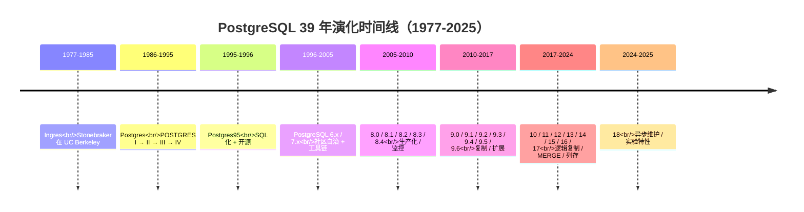

把 39 年切成 8 个时期，可以看到**节奏明显在加快**：

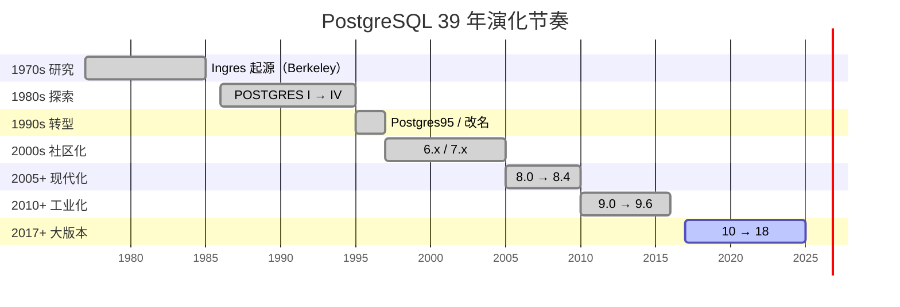

> **节奏观察**：1986-2005 年共发布 1+6+7=14 个主版本（平均 **0.7 年一个**），但从 2017 年开始变成每年一个大版本（**1 年一个**，节奏快 1 倍以上）。原因：2014 年 PGDG 把开发节奏定为每年 1 个 major release，long-term 不再维护。

---

## 二、前传（1970s-1986）：数据库研究的"战国时代"

### 2.1 1970s 三大研究脉络

1970s 关系型数据库几乎同时从三个地方冒出来。

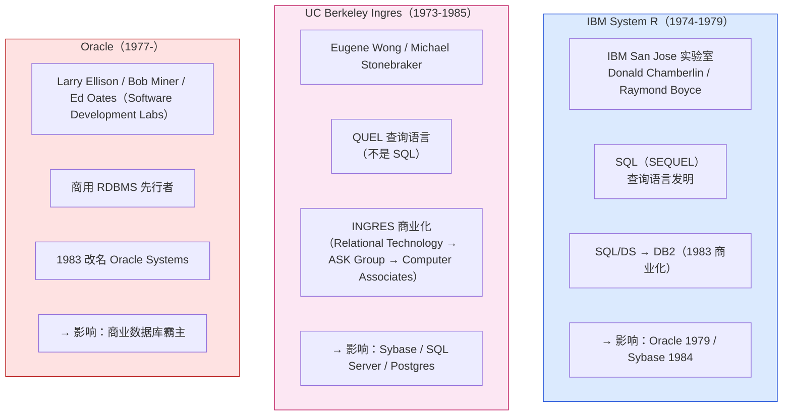

**关键观察**：

- **System R** 发明了 SQL，证明了关系模型的可行性 → IBM 没立刻商业化，反而让 Oracle 学走了先机；
- **Ingres** 证明了**研究生项目也能成为商品**（INGRES → ASK Ingres → CA Ingres），但 Stonebraker 自己不感兴趣；
- **Oracle** 走的是"**IBM 还没做、我先做**"的路线，**1979 年第一版就敢卖**，根本不管 SQL 标准。

### 2.2 Ingres 的遗产：一份技术 + 一群人

Ingres 给后来 PG 留下的**三个最重要的遗产**：

1. **POSTQUEL 查询语言**（Ingres 的 QUEL 后继）；
2. **C 实现的存储管理器**（heap / catalog / utility 三件套，PG 18 里还能看到 `src/backend/catalog/`、`src/backend/utils/cache/` 这些目录结构）；
3. **一群人**：Michael Stonebraker、Anant Jhingran、Joseph Hellerstein、Michael Olson（PG 早期 contributor）……

**Stonebraker 在 Ingres 之后想干什么？**他写了 1986 年的论文《The Case for Partial Indexes》（SIGMOD）和《The Design of the POSTGRES Rules System》，明确表示 Ingres 的两个局限：**不能扩展数据类型、不能用规则**。这就是 POSTGRES 的研究动机。

> **历史巧合**：2014 年 SIGMOD Test of Time Award 同时颁给了 Stonebraker 的《The Case for Partial Indexes》和 Hellerstein 的《Predicate Data Migration》。30 年前的研究影响了 30 年后的生产。

### 2.3 同期重要事件

| 年份 | 事件 | 影响 |
| --- | --- | --- |
| 1970 | Edgar Codd《A Relational Model of Data for Large Shared Data Banks》 | 关系模型理论基础 |
| 1974 | Donald Chamberlin / Raymond Boyce 设计 SEQUEL（SQL） | SQL 诞生 |
| 1976 | Peter Chen《The Entity-Relationship Model》 | ER 模型 |
| 1977 | Larry Ellison / Bob Miner 创立 SDL（Software Development Labs），开发 Oracle | 商业 RDBMS 起步 |
| 1979 | Oracle V2 商用（V1 没卖过） | 商业 DB 第一个产品 |
| 1983 | IBM DB2 上市（基于 System R） | 商业 RDBMS 普及 |
| 1984 | Sybase 成立（Ingres 后裔 Berkeley 校友） | 客户端-服务器 RDBMS |
| 1985 | Ingres 项目结束 | Stonebraker 转去做 POSTGRES |

---

## 三、Postgres 起源（1986-1994）：Post-Ingres 的 4 代演化

### 3.1 POSTGRES 1（1986-1989）

Stonebraker 拿到 NSF（美国国家科学基金会）资助，**重新设计一个面向"复杂对象"的关系数据库**。目标是：

1. 支持**用户自定义数据类型**（UDT）——这是 SQL 标准到 2003 年才有的东西；
2. 支持**规则系统**（rules）——触发器、视图更新自动重写；
3. 支持**多版本并发控制**（MVCC）——避免读写冲突；
4. 放弃 SQL，用自己的 **POSTQUEL**（Post-Ingres Query Language）。

```c
/* POSTQUEL（1986）长这样 */
retrieve (emp.name) from emp in scottsdale
   where emp.salary > 50000
```

> **POSTQUEL 比 SQL 多了什么**：嵌套表、数组类型、过程化引用、`time travel`（历史版本查询）。

### 3.2 POSTGRES 2 / 3 / 4 的演化（1989-1994）

Stonebraker 团队每年发一版，每版都有主题：

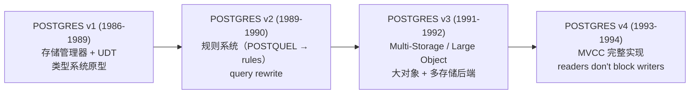

| 版本 | 年份 | 关键创新 |
| --- | --- | --- |
| POSTGRES v1 | 1986-1989 | C 实现 + 用户定义类型（UDT） + 简单 POSTQUEL |
| POSTGRES v2 | 1989-1990 | 规则系统 + Query Rewrite + view update |
| POSTGRES v3 | 1991-1992 | 大对象（Large Object）+ 多存储后端 + 多语言 / 时间语义 |
| POSTGRES v4 | 1993-1994 | **MVCC 完整版** + 多版本时间旅行 |

> **MVCC 的"年份之争"**：Stonebraker 在 1986 年的论文里就提了 MVCC；POSTGRES v4 在 1993-1994 年才完整实现。但 Oracle 1986 年的商用版就实现了 row-level locking（不是 MVCC）。**PG 的 MVCC 是 SQL 数据库里最早生产化的 MVCC 之一**。

### 3.3 POSTGRES 关键论文（值得一读）

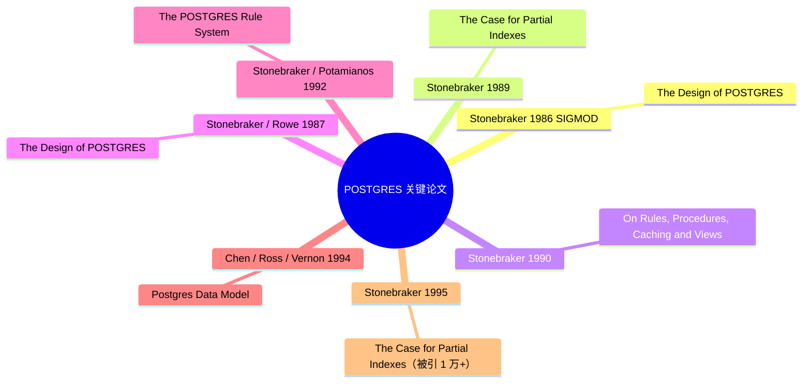

### 3.4 POSTGRES 的"软肋"

到 1993 年，POSTGRES 暴露了 4 个问题，导致它没法商品化：

1. **POSTQUEL 学习曲线太陡**——市场已经被 SQL 教育过；
2. **代码靠 NSF 资助维护**——学生毕业就走，文档和测试不连续；
3. **没有事务日志**——crash 后必须从头重做；
4. **没有客户端工具**——psql 是 1996 年才出现。

**正是在这个背景下，1994 年 Stonebraker 把 POSTGRES 的维护交给 Andrew Yu 和 Jolly Chen 两个研究生，开始砍 POSTQUEL、换 SQL、加版权。**

---

## 四、Postgres95（1995-1996）：从研究项目到开源产品的转折

### 4.1 Andrew Yu / Jolly Chen 的改造（1994-1995）

1994 年 Stonebraker 离开 Berkeley 去 MIT / Wisconsin，**把 POSTGRES 项目的维护权交给 Andrew Yu 和 Jolly Chen**。两人做了两件关键事：

1. **把 POSTQUEL 编译器改成 SQL 编译器**（用 1992 年的 Postgres 规则系统做 query rewrite）；
2. **改 BSD 版权**（Berkeley-style），让代码可被外部使用。

1995 年 5 月发布的版本叫 **Postgres95 v1.0**，源码以 ftp 形式发布在 Berkeley。


### 4.2 Postgres95 的关键改造

| 改造点 | POSTGRES v4 | Postgres95 v1 |
| --- | --- | --- |
| 查询语言 | POSTQUEL | **SQL** |
| 版权 | NSF 资助，封闭源码 | **BSD 版权**，可自由使用 |
| 代码量 | 约 30 万行 C | 约 35 万行 C |
| 用户 | 学术圈 | 学术 + 早期 Internet 用户 |
| 客户端工具 | 无 | **psql 雏形** |
| 安装方式 | 源码手工编译 | 自动化 Makefile |

### 4.3 1996 年的两封信件（决定 PG 走向开源）

1996 年有两封关键邮件，决定了 PostgreSQL 后来 30 年的走向：

**邮件 1：Marc Fournier 提议改名**

```
Subject: [HACKERS] Name change proposal
Date: 1996-07-08

As discussed, "Postgres95" is a marketing copy, not a real version number.
The version after 95 should be 1, but 1.0 would confuse with MySQL's
1.0. We need a new name.

Proposal: PostgreSQL (Post-GreSQL = Postgres + SQL)
```

**邮件 2：Tom Lane 加入 commit 列表**

Tom Lane 在 1996 年加入 PostgreSQL 邮件列表，从此成为核心开发者，到 2025 年依然是 PG 最重要的 contributor 之一，commit 数已超过 **6000+**，是 PG 当之无愧的"首席架构师"。

> **PG 文化基因**：从 1996 年起，PG 的所有技术决策都在 `pgsql-hackers` 邮件列表上公开讨论。这种"邮件列表 + 共识"的开发模式，**比 GitHub PR 模型早 12 年**，比 GitLab 早 16 年。

### 4.4 同期事件

| 年份 | 事件 |
| --- | --- |
| 1995 | Postgres95 v1.0 发布 |
| 1995 | MySQL 1.0 发布（瑞典 Michael Widenius / David Axmark） |
| 1996-05 | Postgres95 v1.01 |
| 1996-07 | 邮件列表决定改名为 **PostgreSQL** |
| 1997-01 | **PostgreSQL 6.0** 发布（第一个用 PostgreSQL 名字的版本） |

---

## 五、早期 PostgreSQL（1997-2005）：6.x / 7.x 的社区自治

### 5.1 6.x 系列（1997-1999）

PostgreSQL 6.x 是"修 bug + 加工具"的时期：

| 版本 | 发布 | 关键事件 |
| --- | --- | --- |
| 6.0 | 1997-01 | 第一个 PostgreSQL 版本 |
| 6.1 | 1997-06 | 多个 contrib 模块（pgaccess, pginterface） |
| 6.2 | 1997-12 | JDBC 驱动、ODBC 驱动 |
| 6.3 | 1998-03 | PL/pgSQL 语言、嵌套子查询 |
| 6.4 | 1998-10 | **MVCC 改进** + 用户表空间（早期版本） |
| 6.5 | 1999-06 | 多列索引、PL/Tcl |

**关键观察**：6.5 之前的 PG 跟 MySQL 相比还有**两点差距**：

1. **没有外键约束的级联操作**（6.5 之后才有完整实现）；
2. **没有 sub-select 性能**（MySQL 在 3.23 起就解决了，PG 在 7.1 才有 sublink+union 优化）。

### 5.2 7.x 系列（2000-2005）

7.x 是 PG "长身体"的时期，**几乎所有 PG 18 还在用的核心子系统都在这一时期定型**：

| 版本 | 发布 | 关键事件 |
| --- | --- | --- |
| 7.0 | 2000-05 | 完整的 SQL 子查询 + 外连接 |
| 7.1 | 2001-04 | **WAL 预写日志 + 崩溃恢复**（划时代） |
| 7.2 | 2002-02 | Schema 概念 + VACUUM 改进 |
| 7.3 | 2002-11 | **Schema 搜索路径** + 函数重载 |
| 7.4 | 2003-08 | **嵌套子查询优化** + IPv6 + 信息架构 |
| 7.5 / 8.0 | （未发布） | 7.4 之后项目组决定跳到 8.0 |

**7.1 的 WAL 是真正的分水岭**——之前的 PG crash 后必须 `pg_resetxlog`，7.1 之后才有了真正的 crash safety。

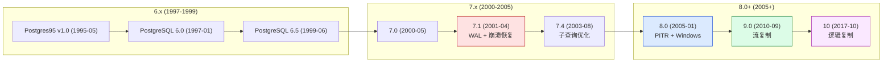

### 5.3 关键人物登场

7.x 时代 PG 社区迎来一批"职业开发者"：

| 人物 | 入坑时间 | 主要贡献 |
| --- | --- | --- |
| **Tom Lane** | 1996 | executor / planner / MVCC（终身 commit 数 6000+） |
| **Bruce Momjian** | 1996 | 文档 / 社区 / 演讲（pgCon 创始人之一） |
| **Jan Wieck** | 1997 | PL/pgMRI / 复制（Slony-I creator） |
| **Vadim Mikheev** | 1998 | MVCC 实现细节 |
| **Joe Conway** | 1999 | PL/R / contrib |
| **Peter Eisentraut** | 2001 | autovacuum / 多语言支持 |

### 5.4 同期竞争产品

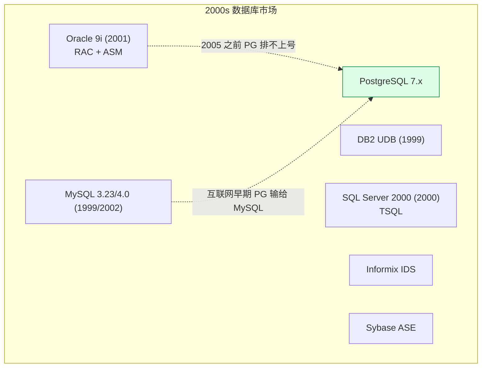

> **2005 年之前的市场格局**：Oracle 是企业级霸主，MySQL 是互联网早期的事实标准，PG 长期在中间——**够好但不够"产品化"**。

---

## 六、生产化分水岭：8.x 系列（2005-2010）

### 6.1 8.0（2005-01）：从研究生项目毕业

8.0 是 PG 第一个"真正能上生产"的主版本。三件大事：

1. **Windows 原生支持**（之前要靠 Cygwin）；
2. **Savepoint / nested transactions**（嵌套事务）；
3. **Point-in-Time Recovery (PITR)**——**业界第一个 RDBMS 实现**。

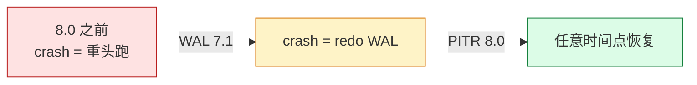

> **PITR 的历史地位**：PG 8.0 (2005) 之前，业界只有 Oracle 用 RMAN 实现过。MySQL 自 MySQL 4.0 (2002) 才有 binlog，但要拼装 PITR 还得手动拼。**PG 是开源世界里第一个把 PITR 做进内核**的。

### 6.2 8.x 全表（2005-2010）

| 版本 | 发布 | 关键事件 |
| --- | --- | --- |
| 8.0 | 2005-01 | Windows / PITR / Savepoint |
| 8.1 | 2005-11 | **Bitmap 索引扫描**（OLAP 利器） |
| 8.2 | 2006-12 | **性能剖析工具 (EXPLAIN ANALYZE BUFFERS)** + 数组改进 |
| 8.3 | 2008-02 | **全文搜索 (TSearch2)** + Heap Tuple Header 优化 |
| 8.4 | 2009-07 | **窗口函数 (window functions)** + CTE + 列权限 |

### 6.3 8.x 时代的"灵魂三件套"

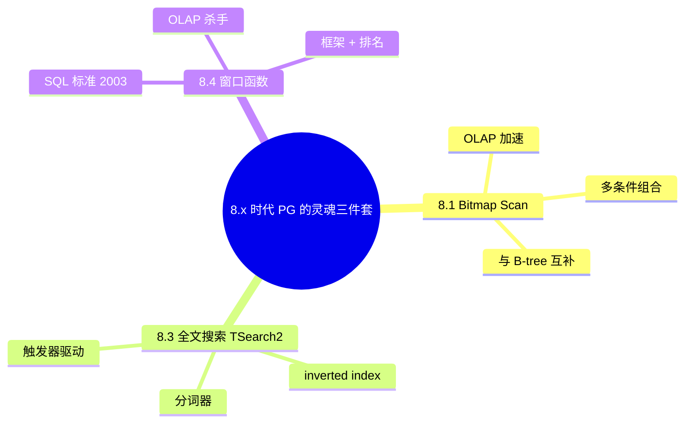

8.x 时代让 PG **第一次追上 Oracle / DB2 的企业级能力**。**2008 年以后，"PG 不能上生产"的论点基本没人提了**。

### 6.4 同期生态大事

| 年份 | 事件 |
| --- | --- |
| 2005 | EnterpriseDB 成立（第一个 PG 商业公司，Stonebraker 顾问） |
| 2005 | MySQL 5.0 发布（视图 / trigger / 存储过程） |
| 2007 | Greenplum 成立（基于 PG 的 MPP 分析数据库） |
| 2008 | Sun 收购 MySQL（**10 亿美元**） |
| 2008 | **PG 邮件列表订阅数破 1 万** |
| 2009 | EnterpriseDB 发布 Postgres Plus / EPAS |

---

## 七、9.x 工业化（2010-2017）：复制 + 扩展 + JSON

### 7.1 9.0（2010-09）：流复制 + 热备

9.0 是 PG 第二个"上生产"的分水岭：

1. **Streaming Replication（流复制）**——基于 WAL 的物理复制，**异步 / 同步两种模式**；
2. **Hot Standby（热备查询）**——备机可读不阻塞 WAL replay；
3. **Trigger-based replication 弃用**——开始用 PG 自带的流复制替代 Slony-I。

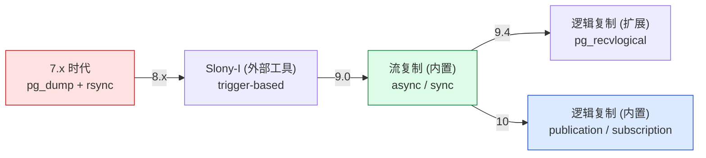

### 7.2 9.x 全表（2010-2016）

| 版本 | 发布 | 关键事件 |
| --- | --- | --- |
| 9.0 | 2010-09 | 流复制 / 热备 |
| 9.1 | 2011-09 | **同步复制** / **unlogged tables** / COLLATE |
| 9.2 | 2012-09 | **级联复制** / **JSON** / **pg_basebackup** |
| 9.3 | 2013-09 | **物化视图** / **可写 FDW** / **LATERAL JOIN** |
| 9.4 | 2014-12 | **jsonb** / **逻辑解码 (test_decoding)** / **replication slots** |
| 9.5 | 2016-01 | **UPSERT (ON CONFLICT)** / **row-level security** / **BRIN 索引** |
| 9.6 | 2016-09 | **并行顺序扫描** / **synchronous_commit = remote_write** / **FDW 聚合下推** |

### 7.3 9.x 的三个"杀手特性"

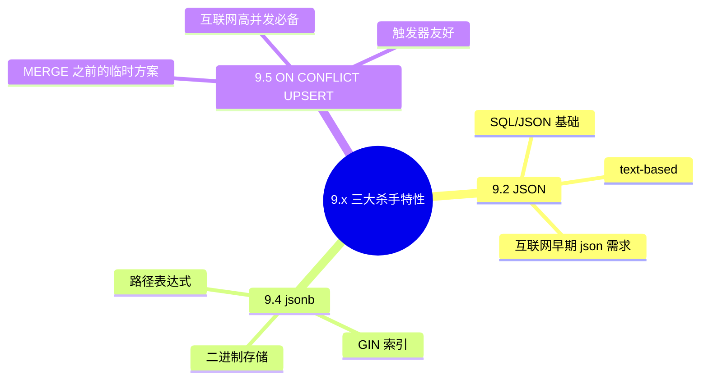

**9.4 的 jsonb 是真正的分水岭**——它让 PG 在 NoSQL 入侵 RDBMS 的时代站稳了"半结构化"位置，至今仍是 PG 19.

### 7.4 9.x 时代的"扩展机制"成熟

9.x 时代 PG 暴露了**5 大扩展点**，让外部代码可以在不动内核的情况下造分支：

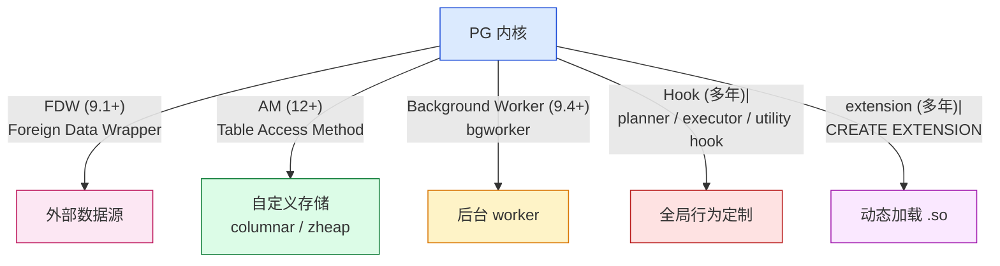

> **关键观察**：正是因为这 5 大扩展点，**2010 年以后几乎所有的 PG 分支都不再 fork 内核**，而是基于"内核 + extension / hook / FDW"的形态。这就是为什么 PG 分支生态如此繁荣、却又如此"可合并"。

### 7.5 同期生态大事

| 年份 | 事件 |
| --- | --- |
| 2010 | **9.0 发布**（流复制） |
| 2011 | 1stQuadrant 成立（专门做 PG 服务） |
| 2012 | **9.2 发布**（jsonb 之前） |
| 2013 | **Citus Data 成立**（MPP 扩展） |
| 2013 | EDB 收购 2ndQuadrant |
| 2014 | **9.4 发布**（jsonb + 逻辑解码） |
| 2015 | **PGCon 大会 15 周年** |
| 2015 | **Cloud Foundry 改用 PG**（替代 MySQL） |
| 2016 | **9.6 发布**（并行查询） |

---

## 八、大版本时代（2017-2025）：10 / 11 / 12 / 13 / 14 / 15 / 16 / 17 / 18

### 8.1 9.x → 10 的版本号跃迁（2017-09）

2017 年 9 月，PG 从 9.6 直接跳到 10.0。**不是 9.7**——这是社区深思熟虑的决定：

- 9.x 命名从 2010 年开始，**6 年只有 7 个**（9.0 / 9.1 / ... / 9.6）；
- 用户对 "9.5 vs 9.6" 这种 minor 版本之间的差异期望太低；
- 跳到 10.0 意味着每年一个主版本，**"每年都该有大事"**。


### 8.2 10.x → 18.x 全表

| 版本 | 发布 | 关键事件 |
| --- | --- | --- |
| **10** | 2017-10 | **逻辑复制**（原生 publication/subscription）+ **声明式分区** + 并行 append |
| **11** | 2018-10 | **JIT 编译（LLVM）** + 原生分区改进 |
| **12** | 2019-10 | **可插拔 Table Access Method** + 列存 (zheap 实验 |
| **13** | 2020-09 | **B-tree 去重** + 增量排序 + 并行 vacuum |
| **14** | 2021-09 | **SQL 存储过程** + logical replication subscriber 二级索引 |
| **15** | 2022-10 | **MERGE（SQL 标准）** + **安全 SECURITY INVOKER** 函数 |
| **16** | 2023-09 | **logical replication subscriber 并行 apply** + pg_basebackup 增量 |
| **17** | 2024-09 | **增量备份** + **`MERGE` 改进** + **`json`/`jsonb` 函数优化** + **`LISTEN/NOTIFY` 改进** |
| **18** | 2025-09（计划） | **异步维护**（vacuum / autovacuum 不阻塞读写）+ 实验 **columnar store** |

### 8.3 每年大版本的"商业意义"

```mermaid
mindmap
  root((每年大版本的商业意义))
    用户预期
      "升级一次" 可以期待"新能力"
      企业安全会议
      测试周期重新算
    生态扩展
      云厂商发布新节点
      商业 PG (EDB / RedHat) 同步更新
      工具链升级
    稳定 vs 创新
      minor release 只修 bug
      major release 才引入大特性
      杜绝 "9.x 一版比一版坑"
```

> **节奏观察**：从 2017 年起 PG 进入"大版本时代"，**每年 9-10 月发版**，**每个版本对应一个主题**。这跟 Linux Kernel 的"每年两个大版本"节奏不同，更接近 Ubuntu 的"每半年 LTS"节奏。

### 8.4 18 的两条主线：异步化 + 多态

新版本最核心的两条主线：

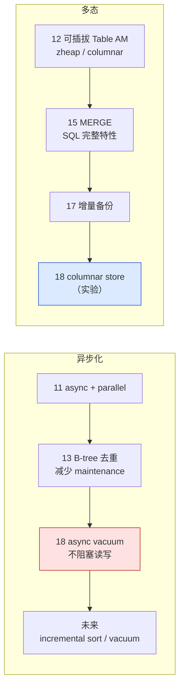

---

## 九、分支与衍生品：39 年家谱

PostgreSQL 的"可扩展性"让它成为开源数据库里**分支生态最繁荣**的一支。

### 9.1 主流分支家谱

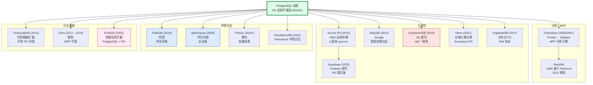

### 9.2 分支按方向矩阵

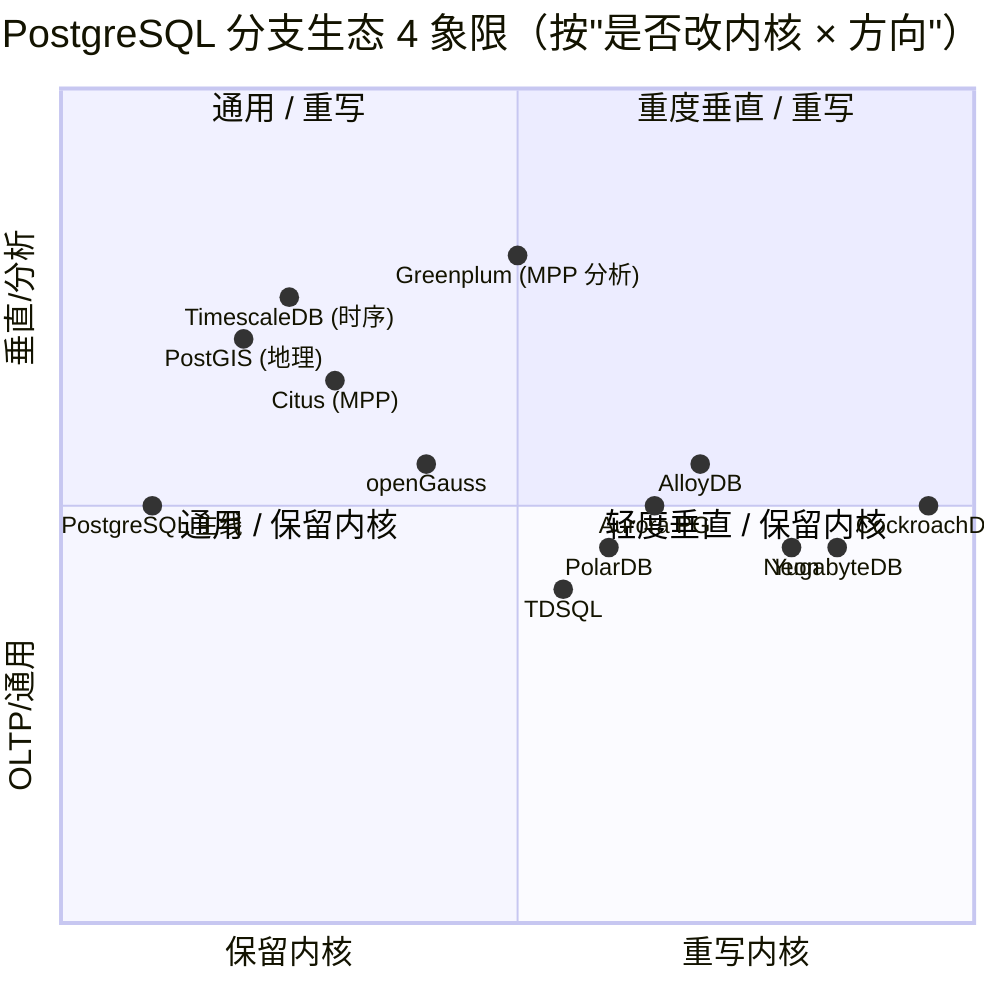

> **右下角 X 轴 → Y 轴**：X 轴是从"保留内核"到"重写内核"，Y 轴是"OLTP/通用"到"垂直/分析"。
> - **PG 主线 + PostGIS + TimescaleDB / Citus** 都在左边（不动内核）；
> - **CockroachDB + Neon + YugabyteDB + Aurora + AlloyDB** 在右边（动内核）；
> - **Greenplum** 在右上（重度垂直 + 重写内核）；
> - **Citus** 变绿后逐步向"右边"靠拢（深度改造 HA 概念）。

### 9.3 关键分支大事记

| 年份 | 事件 | 备注 |
|---|---|---|
| 2001 | **PostGIS** 加入 pgFoundry | PG 第一个贡献者扩展 |
| 2003 | Greenplum 商业化 | PG + MPP |
| 2005 | EnterpriseDB 成立 | 第一个 PG 商业公司 |
| 2008 | Greenplum 商业化版发布 | MPP 真正可用 |
| 2012 | **Citus Data** 成立 | MPP 扩展形式 |
| 2013 | **AWS Redshift** 发布 | ParAccel 基础，不算 PG 真正分支 |
| 2014 | **2ndQuadrant 推出 BDR** | Bi-Directional Replication |
| 2015 | **CockroachDB** 发布 | Go 重写 PG 协议 |
| 2015 | **AWS Aurora PG** 公测 | 6 副本 quorum + 自研存储 |
| 2017 | **YugabyteDB** 发布 | 分布式 PG |
| 2018 | **Microsoft 收购 Citus** | PG MPP 进微软生态 |
| 2020 | **openGauss** 开源 | 华为企业级 PG |
| 2021 | **Neon** 公测 | Serverless PG |
| 2022 | **AlloyDB** 公测 | Google |
| 2024 | **pgEdge** 发布 | 边缘计算 PG |

---

## 十、关键人物与社区治理

### 10.1 核心贡献者时间线

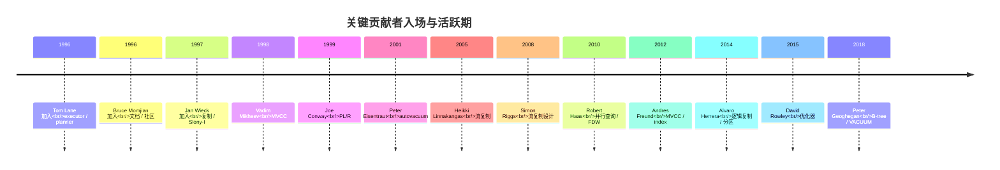

> **观察**：1995-2004 入坑的人大多仍在提交代码。**PG 的代码作者极其稳定**，这是 PG 39 年演化质量的根本原因。

### 10.2 治理结构

```mermaid
flowchart TB
    A["PG 全球开发组<br/>PGDG (PostgreSQL Global Development Group)"] --> B["核心团队<br/>~7-9 committer"]
    A --> C["major contributor<br/>~30 人活跃"]
    A --> D["contributor<br/>~300 人 / 年"]
    A --> E["邮件列表<br/>pgsql-hackers<br/>~3000 订阅"]
    A --> F["SPI<br/>法律实体<br/>2003 成立"]

    B -.->|"投票 / -1 veto"| G["新特性 commit 权"]
    C -.->"提交评审"| G
    D -.->"提交 patch"| G

    style A fill:#dcfce7,stroke:#15803d
    style B fill:#dbeafe,stroke:#1d4ed8
    style F fill:#fee2e2,stroke:#b91c1c
```

> **PG 治理 3 个独特点**：
> 1. **没有公司实体**——只有 SPI（Software in the Public Interest）这个非营利组织代管钱和商标；
> 2. **没有 GitHub 独裁**——commit 权靠邮件列表的 -1 veto 制衡；
> 3. **没有版本独裁者**——每个 major release 有一个 release manager（如 18 是 Andres Freund），但只是协调者。

### 10.3 关键决策的"邮件线程"

```mermaid
mindmap
  root((关键决策的邮件线程))
    1996
      改名为 PostgreSQL 而非 80 years
    2003
      开源 vs 商业争论
    2005
      WAL 后要做 PITR
    2010
      选流复制不是同步复制
    2014
      PGDG 加快发布节奏
    2017
      从 9.6 跳到 10
      "每年一个主版本"
```

> **PG 文化核心**：**所有重大决策都在公开邮件列表上讨论**。读 `pgsql-hackers` archive 就能学到 PG 39 年的设计权衡。

---

## 十一、PostgreSQL vs MySQL vs SQLite：开源 RDBMS 的三岔口

### 11.1 三者定位对比

```mermaid
quadrantChart
    title 开源 RDBMS 三角（按"关系模型纯度 × 性能优先级"）
    x-axis "纯关系模型" --> "文档/键值倾向"
    y-axis "OLTP" --> "OLAP/分析"
    quadrant-1 "OLAP + 文档倾向"
    quadrant-2 "OLTP + 文档倾向"
    quadrant-3 "OLTP + 纯关系"
    quadrant-4 "OLAP + 纯关系"
    "PostgreSQL": [0.85, 0.55]
    "MySQL": [0.3, 0.5]
    "SQLite": [0.7, 0.2]
    "Oracle": [0.8, 0.7]
    "CockroachDB": [0.5, 0.6]
    "MongoDB": [0.1, 0.6]
```

### 11.2 三者基因对比

| 维度 | PostgreSQL | MySQL | SQLite |
|---|---|---|---|
| 起源 | 1986 Berkeley POSTGRES | 1995 MySQL AB（瑞典） | 2000 D. Richard Hipp |
| 创始人 | Stonebraker（学术） | Widenius / Axmark | Hipp（个人） |
| 查询语言 | SQL（2003 标准） | SQL（部分方言） | 嵌入式 SQL（2002） |
| MVCC | 1994 完整实现 | 2013（5.6+） | 无（写锁） |
| 默认引擎 | heap + 自定义 AM | InnoDB（PG 没影响） | B-tree |
| 内存架构 | shared_buffers | InnoDB buffer pool | 文件 mmap |
| 默认部署 | 服务器 | 服务器 | 嵌入式 / 边缘 |
| 设计哲学 | "**SQL 应当标准化**" | "**能跑就行**" | "**一个文件就是数据库**" |

### 11.3 三者关系：MySQL 也用过 POSTGRES 思想

```mermaid
flowchart LR
    A["POSTGRES (1986)"] -->|"MVCC / 部分 SQL 标准"| B["PostgreSQL (1996)"]
    A -.->|"思想影响"| C["MySQL (1995)"]
    A -.->|"思想影响"| D["SQLite (2000)"]
    B -.->|"extensibility 思想"| E["Citus / TimescaleDB"]
    B -.->|"access method 思想"| F["Aurora PG / CockroachDB"]
    style A fill:#dbeafe,stroke:#1d4ed8,stroke-width:3px
    style B fill:#dcfce7,stroke:#15803d
```

> **冷观察**：**MySQL 的原始名字其实是"Monty's SQL"**，跟 PostgreSQL 完全没有血缘。MySQL 后来用了 MVCC / SQL / 联系墙这些概念，是因为 2000s 业界共识，不是因为 "PG 影响 MySQL"。

---

## 十二、影响 PG 39 年的 10 个关键决策

| # | 决策 | 年份 | 影响 |
|---|---|---|---|
| 1 | **POSTGRES 用 C 实现** | 1986 | 跨平台性能可移植 |
| 2 | **用户自定义类型（UDT）** | 1986 | 后期 PostGIS / 时序 / 地理扩展的基础 |
| 3 | **规则系统（rules）** | 1989 | 2003 view update 自动重写 |
| 4 | **MVCC 完整实现** | 1993 | "读不阻塞写"成为 PG 标签 |
| 5 | **SQL 化 + BSD 版权** | 1995 | 从研究项目进入开源世界 |
| 6 | **WAL 预写日志** | 7.1 (2001) | crash safety 的事实标准 |
| 7 | **改为定期 GUC 模式** | 2014 | 每年 1 个主版本，2017 提速 |
| 8 | **从 9.6 跳到 10** | 2017 | 重新定义发布节奏 |
| 9 | **逻辑复制（内置）** | 10 (2017) | 跨大版本升级的关键基础设施 |
| 10 | **可插拔 Table AM** | 12 (2019) | 让 zheap / columnar 等新存储成为可能 |

```mermaid
flowchart TB
    A["POSTGRES 1986<br/>C 实现"] --> B["UDT 1986"]
    A --> C["Rules 1989"]
    A --> D["MVCC 1993"]
    D --> E["Postgres95 1995<br/>SQL + BSD"]
    E --> F["PostgreSQL 6.x"]
    F --> G["7.1 WAL 2001"]
    G --> H["8.0 PITR 2005"]
    H --> I["9.0 流复制 2010"]
    I --> K["9.4 jsonb 2014"]
    K --> L["10 逻辑复制 2017"]
    L --> M["12 可插拔 AM 2019"]
    M --> N["18 columnar 实验 2025"]
    style A fill:#fee2e2,stroke:#b91c1c
    style M fill:#dcfce7,stroke:#15803d
```

---

## 十三、时间线速查表

按年份汇总所有重要事件：

| 年份 | 事件 |
|---|---|
| 1970 | Codd 关系模型 |
| 1974 | IBM SEQUEL 设计 |
| 1977 | Oracle SDL 创立 |
| 1979 | Oracle V2 |
| 1986 | POSTGRES v1 立项 |
| 1989 | POSTGRES v2（rules） |
| 1991 | POSTGRES v3（多存储） |
| 1993 | POSTGRES v4（MVCC 完整） |
| 1994 | Andrew Yu / Jolly Chen 接手 |
| 1995-05 | Postgres95 v1.0 |
| 1996 | 改名 PostgreSQL |
| 1997-01 | PostgreSQL 6.0 |
| 2000 | PostgreSQL 7.0 |
| 2001 | 7.1 WAL |
| 2003 | 7.4 子查询优化 |
| 2005-01 | **8.0 PITR / Windows** |
| 2005-11 | 8.1 Bitmap Scan |
| 2006 | 8.2 BUFFERS / 数组 |
| 2008 | 8.3 全文搜索 |
| 2009 | 8.4 窗口函数 |
| 2010-09 | **9.0 流复制 / 热备** |
| 2011 | 9.1 同步复制 |
| 2012 | 9.2 JSON / pg_basebackup |
| 2013 | 9.3 物化视图 / FDW |
| 2014-12 | **9.4 jsonb / 复制插槽** |
| 2016 | 9.5 UPSERT / RLS / BRIN |
| 2016 | 9.6 并行查询 |
| 2017-10 | **10 逻辑复制 / 分区** |
| 2018-10 | 11 JIT |
| 2019-10 | 12 可插拔 AM |
| 2020-09 | 13 B-tree 去重 |
| 2021-09 | 14 SQL 存储过程 |
| 2022-10 | **15 MERGE** |
| 2023-09 | 16 logical replication 并行 |
| 2024-09 | 17 增量备份 |
| 2025-09 | **18 异步维护 / columnar 实验** |
| 2026+ | 19, 21 ... |

---

## 十四、未来 5 年的趋势与未完成的事

PG 39 年演化还有 5 件"未完成的事"：

### 14.1 未完成的 5 大特性

```mermaid
mindmap
  root((未完成的 5 大特性))
    列存原生
      12 zheap 实验 -> 取消
      18 columnar 实验 -> 实验
      未来 columnar 1.0
    异步 vacuum
      18 设计中
      VACUUM 不阻塞读写
      表 + 索引重建
    MERGE 完整
      15 部分实现
      17 改进
      未来 UPSERT / DELETE
    分布式原生
      FDW 表式身份
      Citus / 主权 = 主权混合
      未来原生 分片
    LLM 集成
      pgvector 1.0
      生成式 AI 集成
      未来 + MCP / AI agent
```

### 14.2 5 年趋势预测

```mermaid
gantt
    title PostgreSQL 未来 5 年路线（推测）
    dateFormat YYYY
    axisFormat %Y
    section 异步化
    async vacuum / maintenance     :a1, 2025, 2028
    section 多态
    model 原生 + 列存          :b1, 2025, 2029
    section 分布式
    原生分布式（实验）    :c1, 2026, 2030
    section AI
    pgvector 1.0 + LLM 集成 :d1, 2025, 2028
```

---

## 十五、总结：39 年沉淀的 6 个心智模型

读完 39 年演化，PG 给你的 6 个心智模型：

```mermaid
flowchart TB
    A["1. 学术 ≠ 难用<br/>POSTGRES 从研究项目到生产，靠的是<br/>工程师迭代 + SQL 化 + BSD 版权"]
    B["2. 慢节奏 ≠ 低质量<br/>2017 年之前 6 年 7 版；2017 年之后每年 1 版<br/>节奏加速靠 '强化机制'（每年 release manager）"]
    C["3. 严格 ≠ 严肃<br/>PG 是 SQL 标准的 ‘守护者’，但这不等于僵化<br/>extension / hook / AM 5 类扩展点"]
    D["4. SQL 是未来，不是过去<br/>NoSQL 浪潮后 PG 没消失，反而拿下 jsonb<br/>9.4 之后每年都加 SQL 10 '从未有了' 的能力"]
    E["5. 扩展点 = 生态护城河<br/>FDW / AM / Background Worker / Hook<br/>5 大扩展点让 PG 分支生态超越 MySQL"]
    F["6. 社区 ≠ 公司<br/>PGDG + SPI 法律实体 + 邮件列表<br/>commit 权靠共识，不靠 BDFL"]

    style A fill:#dbeafe,stroke:#1d4ed8
    style B fill:#dcfce7,stroke:#15803d
    style C fill:#fef3c7,stroke:#d97706
    style D fill:#fce7f3,stroke:#be185d
    style E fill:#fae8ff,stroke:#a21caf
    style F fill:#fee2e2,stroke:#b91c1c
```

**PG 的 39 年，本质上是 6 个心智模型的实现**：

1. **学术严谨 + 工程师实用**：POSTGRES 用研究项目出发，靠 SQL 化 + BSD 版权进入生产；
2. **节奏稳定 + 机制灵活**：每年 1 个大版本，minor 只修 bug；PGDG 的 release manager 制；
3. **严格标准 + 灵活扩展**：PG 是 SQL 标准的"守护者"，但提供 FDW / AM / Background Worker / Hook / Extension 5 类扩展点；
4. **关系模型 + 半结构化**：从纯 SQL 到 9.4 jsonb 的演进，证明 PG 能跟 NoSQL 共存；
5. **内核精简 + 生态繁荣**：每年合并的 patch 中，extension 的贡献占比越来越高；
6. **社区治理 + 法律实体**：PGDG + SPI + 邮件列表，commit 权靠共识 + reviewer。

---

## 源码引用索引

**POSTGRES 论文（学术）**：
- Stonebrandon, M. 1986. "The Design of POSTGRES." SIGMOD.
- Stonebrandon, M. 1989. "The Case for Partial Indexes." SIGMOD.
- Stonebrandon, M. 1990. "On Rules, Procedures, Caching and Views." ICDE.
- Stonebrandon, M. 1995. "The Case for Partial Indexes." （重印）

**PG 内核代码**：
- `src/backend/access/transam/xact.c` — 事务引擎（9.x 起定型）
- `src/backend/storage/ipc/standby.c` — 流复制（9.0 起）
- `src/backend/replication/logical/` — 逻辑复制（10 起）
- `src/backend/access/heap/heapam.c` — heap AM（12 可插拔）
- `src/include/catalog/pg_class.dat` — catalog 定义
- `src/include/utils/relcache.h` — Relation 结构

**PG 历史项目**：
- `pgsql-hackers` 邮件列表 archive（1996 起）
- `pgCon` 大会（2005 起）
- PGDG GitHub（2016 起，仅镜像）
- PG 官网 [postgresql.org/docs/release-history](https://www.postgresql.org/docs/release/)

---

## 同系列前文

- [PostgreSQL 元数据存储机制：从磁盘文件到内存缓存，`pg_class` 撑起的整个系统表体系](./postgresql-catalog-storage/index.html)
- [PostgreSQL 从 `postgres` 二进制到生产级守护：最外层模块与启动全流程](./postgresql-module-architecture/index.html)
- [PostgreSQL 内存管理：从 shared_buffers 到内存上下文](./postgresql-memory-management/index.html)
- [PostgreSQL 事务生命周期：从 BEGIN/COMMIT 到 CLOG 一条链路](./postgresql-transaction-lifecycle/index.html)
- [PostgreSQL MVCC：从一行 UPDATE 到 5 个 HeapTuple 的演化](./postgresql-mvcc/index.html)
- [PostgreSQL 18 并行 Worker 机制全解](./postgresql-parallel-worker/index.html)
- [PostgreSQL Background Worker 全解](./postgresql-background-worker/index.html)
- [PostgreSQL 内核开发：读取一张表的 9 步标准流程与缓存全景](./postgresql-read-catalog-table/index.html)
- [PostgreSQL 逻辑复制表的生命周期：从 `pg_replication_slots` 到 `pg_subscription_rel`](./postgresql-logical-replication-tables-lifecycle/index.html)
- [pgbench 源码全解：一个 C 文件如何撑起 PostgreSQL 官方压测工具](./pgbench-internals/index.html)
