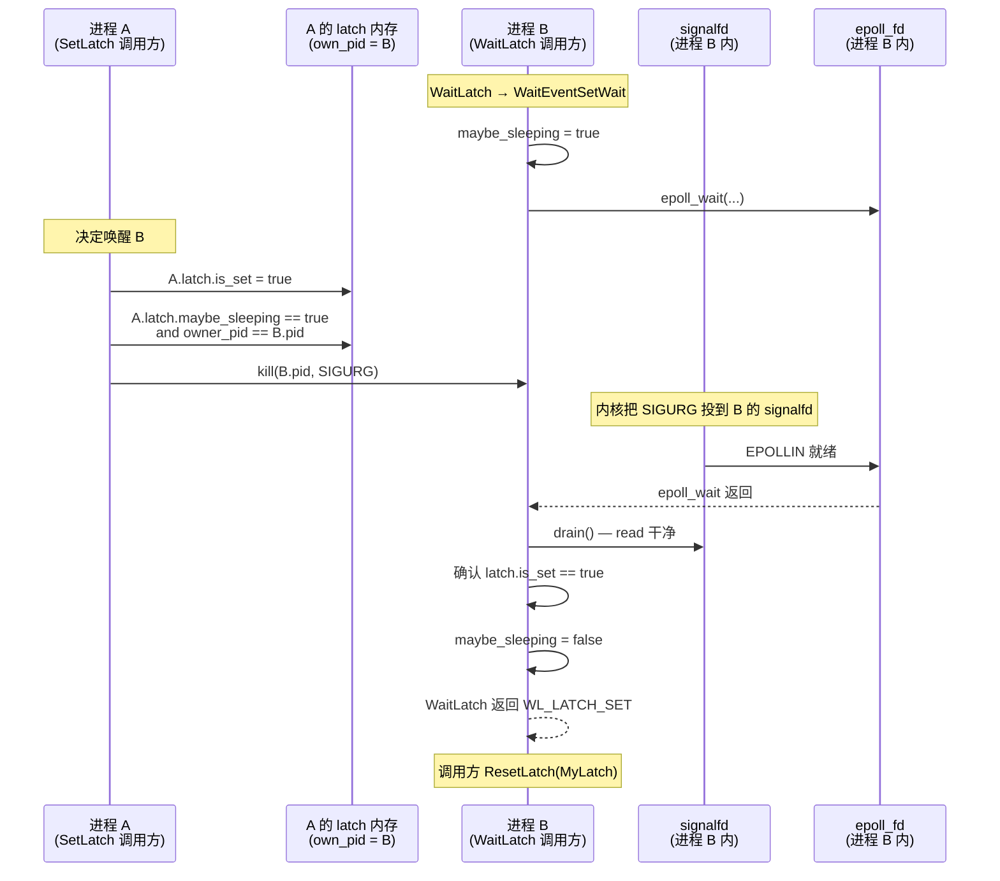
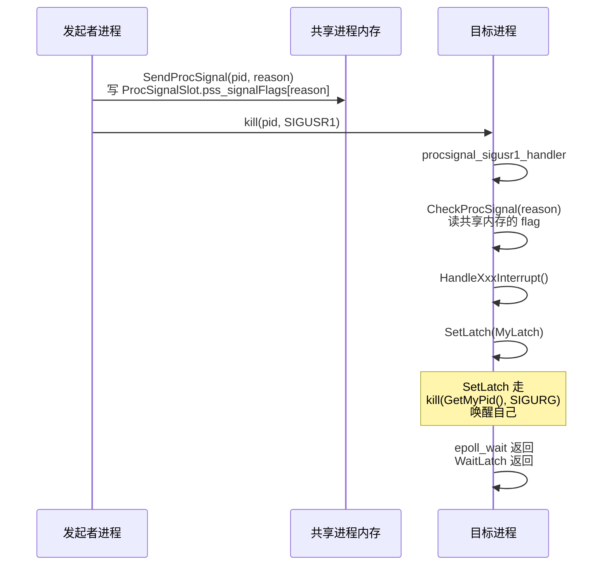
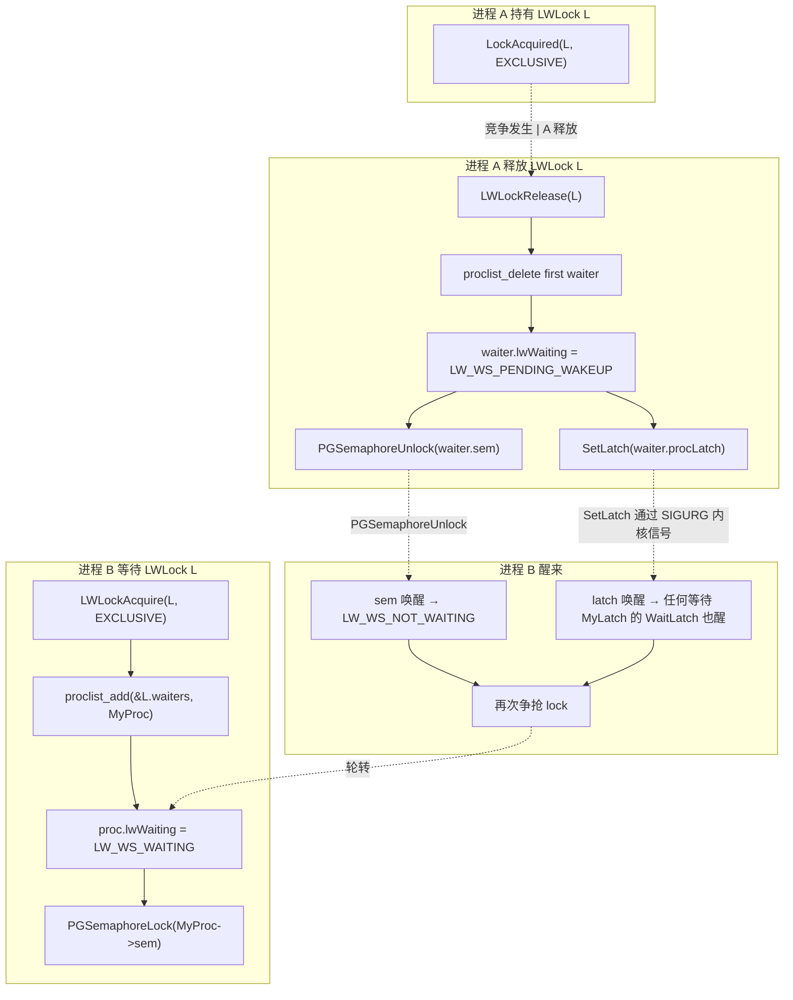

# PostgreSQL Latch 机制详解：从一行 SetLatch 到 epoll 的内核之旅

| 编写人 | 编写内容 | 编写时间 |
| --- | --- | --- |
| growdu | 初稿，结合 PostgreSQL 17 源码（~/cwork/postgresql/src/backend/storage/ipc/） | 2026-09-23 |

想象一下，PostgreSQL 里有 200 个 backend 同时挤在 `shared_buffers` 上抢同一个热点 page。某个 backend 在等 `WALFlush`，另一个在等 `LockManager`，还有一个在等客户端的下一条 SQL。它们都在睡觉，但都不能用 `sleep(1)`——一秒后醒来数据可能早被别人改完了。

它们用一种叫 **Latch** 的东西睡觉。Latch 表面上只是一行 `bool is_set`，但它背后串起了 **WaitEventSet → epoll/kqueue/self-pipe → 内核信号 → proc.latch 信号处理**这条完整的跨进程唤醒链。本文会沿着 `~/cwork/postgresql/src/backend/storage/ipc/latch.c` 和 `src/backend/storage/ipc/waiteventset.c` 把这条链拆给你看。

读完你会明白：

- 为什么 `SetLatch(&MyLatch)` 是 PG 里**唯一能从信号处理函数里安全调用**的状态同步原语。
- 为什么 `WaitEventSet` 在 epoll 平台上不用 self-pipe（用 signalfd），在 BSD 上用 kqueue + `EVFILT_SIGNAL`，在 Windows 上直接用 `HANDLE`。
- 为什么 `LWLock` 没直接用 Latch 唤醒，而是 `Latch` + `PGSemaphore` 混搭。
- 为什么 `PGPROC.procLatch` 这个 shared latch 平时是整个集群里最忙的那一行 bool。

---

## 一、为什么要造 Latch 而不是沿用 select/poll

### 1.1 老式写法的问题

在 Latch 出现之前（PG 9.0 之前），PG 用的是类似下面的写法：

```c
/* 老式睡眠写法（PG 9.0 之前） */
volatile bool got_SIGUSR1 = false;

pqsignal(SIGUSR1, handle_sigusr1);    /* 信号处理里 got_SIGUSR1 = true */

for (;;)
{
    pg_usleep(10000);                 /* 每 10ms 醒一次 */
    if (got_SIGUSR1)
    {
        got_SIGUSR1 = false;
        DoStuff();
    }
}
```

有两个典型问题：

1. **轮询浪费**：即使有人已经把 `got_SIGUSR1` 置位，你也得等下一次 `pg_usleep` 醒来才知道。
2. **丢失窗口**：信号在 `pg_usleep` 调用前到达，sleep 仍然会进入睡眠，下一次醒来才会处理。

`pselect()` 本来就是为了解决 (2) 设计的，但 PG 9.0 时它还**不够便携**（老 Solaris、HP-UX 都没实现）。

### 1.2 Latch 设计的三个目标

`src/include/storage/latch.h` 注释里写得很明确：

> A latch is a boolean variable, with operations that let processes sleep until it is set. A latch can be set from another process, or a signal handler within the same process.

三个目标：

1. **进程内**可以从信号处理函数置位（不阻塞）。
2. **跨进程**可以置位（通过内核信号投递机制）。
4. 不论 `sleep` 还是 `kill` 通知 PG，都能做到**近乎零延迟**唤醒。

---

## 二、Latch 数据结构与基本操作

### 2.1 Latch 结构体

`src/include/storage/latch.h:99`

```c
typedef struct Latch
{
    sig_atomic_t is_set;
    sig_atomic_t maybe_sleeping;
    bool         is_shared;
    int          owner_pid;
#ifdef WIN32
    HANDLE       event;
#endif
} Latch;
```

四个字段每个都"恰好够用"：

| 字段 | 类型 | 作用 |
| --- | --- | --- |
| `is_set` | `sig_atomic_t` | 是否被置位。可在信号处理函数里读写。 |
| `maybe_sleeping` | `sig_atomic_t` | 是否有进程**可能正在**睡眠。等价于"刚刚调用了 WaitLatch，尚未返回"。 |
| `is_shared` | `bool` | true = 共享内存里的 latch（`InitSharedLatch`），false = 进程本地（`InitLatch`）。 |
| `owner_pid` | `int` | 谁有权等待/复位这个 latch（`Latch` 初始为 0 即无人拥有）。 |
| `event` (Windows only) | `HANDLE` | Windows 事件对象，用于跨进程唤醒。 |

`is_set` 必须是 `sig_atomic_t`，因为信号处理函数能写它。注释里有句很扎心的话：

> we don't do any sort of locking here, meaning that we could fail to detect the error if two processes try to own the same latch at about the same time.

> `src/backend/storage/ipc/latch.c:132`

PG 用了一种非常 Unix 哲学的设计：**靠规范（先 Own 后 Wait、先 Reset 后 Check）规避竞争**，不靠锁。

### 2.2 三种初始化路径

```c
/* src/backend/storage/ipc/latch.c:67  进程本地 latch */
void InitLatch(Latch *latch)
{
    latch->is_set = false;
    latch->maybe_sleeping = false;
    latch->owner_pid = MyProcPid;
    latch->is_shared = false;
#ifdef WIN32
    latch->event = CreateEvent(NULL, TRUE, FALSE, NULL);
    ...
#endif
}

/* src/backend/storage/ipc/latch.c:107  共享内存 latch，postmaster 阶段调 */
void InitSharedLatch(Latch *latch) { ... }

/* src/backend/storage/ipc/latch.c:140  把共享 latch 关联到本进程 */
void OwnLatch(Latch *latch)
{
    Assert(latch->is_shared);
    if (latch->owner_pid != 0)
        elog(PANIC, "latch already owned by PID %d", latch->owner_pid);
    latch->owner_pid = MyProcPid;
}
```

`InitLatch` 之后 latch 就归本进程私有。`InitSharedLatch` 必须**在 fork 子进程之前**调用（Windows 上必须，Unix 上语义需要）。

### 2.3 三个基本操作

#### SetLatch

`src/backend/storage/ipc/latch.c:282`

```c
void SetLatch(Latch *latch)
{
    pg_memory_barrier();              /* ①先把本进程已写的 flag 刷到主存 */
    if (latch->is_set)
        return;                       /* ②快速路径：已经置位，啥也不做 */

    latch->is_set = true;
    pg_memory_barrier();              /* ③置位对其他进程可见 */

    if (!latch->maybe_sleeping)
        return;                       /* ④没人可能睡眠，连信号都省了 */

#ifndef WIN32
    pid_t owner_pid = latch->owner_pid;
    if (owner_pid == 0)               return;
    else if (owner_pid == MyProcPid)  WakeupMyProc();
    else                              WakeupOtherProc(owner_pid);
#else
    if (latch->event) SetEvent(latch->event);
#endif
}
```

四次内存屏障、三个分支，合起来就是 Latch 的全部"设置"语义：

- ① 防止 SetLatch 调用者在 set `is_set` 之前**先写的 flag 变量**还没刷出去。
- ② `is_set` 已为 true 时，函数立即返回。这条快速路径在生产里 99% 的调用命中，因为 `SetLatch` 经常被同一进程反复调。
- ③ `pg_memory_barrier()` 保证等待方读到 `is_set = true` 时，**调用者写在它之前的 flag 也可见**。
- ④ `maybe_sleeping == false` 时，整个 SetLatch 就退化成两条 atomic 写，连信号都不用发。

> The memory barrier has to be placed here to ensure that any flag variables possibly changed by this process have been flushed to main memory, before we check/set is_set.

> `src/backend/storage/ipc/latch.c:295`

#### WaitLatch 与 WaitLatchOrSocket

`WaitLatch` 的实现已经从 PG 9.6 开始退化成 `WaitEventSet` 之上的薄壳：

```c
/* src/backend/storage/ipc/latch.c:172 */
int WaitLatch(Latch *latch, int wakeEvents, long timeout, uint32 wait_event_info)
{
    WaitEvent event;
    Assert(!IsUnderPostmaster ||
           (wakeEvents & WL_EXIT_ON_PM_DEATH) ||
           (wakeEvents & WL_POSTMASTER_DEATH));

    /* 根据本次调用要等的 latch，动态切换 LatchWaitSet 里的 latch */
    if (!(wakeEvents & WL_LATCH_SET))
        latch = NULL;
    ModifyWaitEvent(LatchWaitSet, LatchWaitSetLatchPos, WL_LATCH_SET, latch);

    if (IsUnderPostmaster)
        ModifyWaitEvent(LatchWaitSet, LatchWaitSetPostmasterDeathPos,
                        (wakeEvents & (WL_EXIT_ON_PM_DEATH | WL_POSTMASTER_DEATH)),
                        NULL);

    if (WaitEventSetWait(LatchWaitSet,
                         (wakeEvents & WL_TIMEOUT) ? timeout : -1,
                         &event, 1, wait_event_info) == 0)
        return WL_TIMEOUT;
    else
        return event.events;
}
```

注意一个细节：`LatchWaitSet` 是**进程启动时一次性创建、永久复用**的全局事件集。它内部只有两个槽位：pos 0 是 MyLatch，pos 1 是 postmaster death。每次 `WaitLatch` 调用只是 `ModifyWaitEvent` 改一下要等的对象，**不重新分配 fd、不重新调用** `epoll_create1`。这就是注释里反复强调的"reuse WaitEventSet is more efficient"的真正原因。

---

## 三、WaitEventSet：epoll / kqueue / poll 的统一抽象

### 3.1 平台选择的编译期决策

`src/backend/storage/ipc/waiteventset.c:79`

```c
#if defined(WAIT_USE_EPOLL) || defined(WAIT_USE_POLL) || \
    defined(WAIT_USE_KQUEUE) || defined(WAIT_USE_WIN32)
/* don't overwrite manual choice */
#elif defined(HAVE_SYS_EPOLL_H)
#define WAIT_USE_EPOLL
#elif defined(HAVE_KQUEUE)
#define WAIT_USE_KQUEUE
#elif defined(HAVE_POLL)
#define WAIT_USE_POLL
#elif WIN32
#define WAIT_USE_WIN32
#endif

#if defined(WAIT_USE_POLL) || defined(WAIT_USE_EPOLL)
#if defined(WAIT_USE_SELF_PIPE) || defined(WAIT_USE_SIGNALFD)
/* don't overwrite manual choice */
#elif defined(WAIT_USE_EPOLL) && defined(HAVE_SYS_SIGNALFD_H)
#define WAIT_USE_SIGNALFD
#else
#define WAIT_USE_SELF_PIPE
#endif
#endif
```

PG 在编译时挑出**最适合当前 OS 的实现**：

| 平台 | 等待原语 | 进程内唤醒方式 |
| --- | --- | --- |
| Linux（有 epoll） | `epoll_wait` | `signalfd` 接收 SIGURG |
| Linux（无 epoll） | `poll` | self-pipe |
| BSD / macOS（有 kqueue） | `kevent` | kqueue + `EVFILT_SIGNAL` |
| 其他 Unix（有 poll） | `poll` | self-pipe |
| Windows | `WaitForMultipleObjects` | Win32 Event |

这意味着**同一份 C 代码在 Linux 上读 self-pipe，到 macOS 上读 kqueue，到 Windows 上读 HANDLE**。下文按 epoll 为主线展开，因为这是大多数生产 PG 的实际环境。

### 3.2 为什么 epoll 路径不用 self-pipe

传统做法要写一个 self-pipe（PG 9.4 之前的确这么做）：

```text
    信号处理 ──> write(selfpipe_writefd, "x", 1)
                          │
                          ▼
              poll/pollfds[SELF_PIPE] 可读 ──> 唤醒
```

epoll 路径的革命在于：**根本不需要自己建管道，直接把 SIGURG 转成 fd**。`signalfd(2)` 把"信号"这个内核概念变成了一个可以加进 epoll 的文件描述符：

`src/backend/storage/ipc/waiteventset.c:312`

```c
#ifdef WAIT_USE_SIGNALFD
sigemptyset(&signalfd_mask);
sigaddset(&signalfd_mask, SIGURG);
signal_fd = signalfd(-1, &signalfd_mask, SFD_NONBLOCK | SFD_CLOEXEC);
if (signal_fd < 0)
    elog(FATAL, "signalfd() failed");
ReserveExternalFD();
#endif
```

然后把 `signal_fd` 加进 epoll。SIGURG 一到，`epoll_wait` 立刻返回，再用 `read(signal_fd)` 把信号从 fd 里"消费"掉。

注释里说得很直白：

> The epoll() implementation overcomes the race with a different technique: it keeps SIGURG blocked and consumes from a signalfd() descriptor instead. We don't need to register a signal handler or create our own self-pipe.

> `src/backend/storage/ipc/waiteventset.c:49`

### 3.3 WaitEventSet 内部结构

`src/backend/storage/ipc/waiteventset.c:115`

```c
struct WaitEventSet
{
    ResourceOwner owner;
    int nevents;         /* 已注册事件数 */
    int nevents_space;   /* 容量 */

    WaitEvent *events;   /* 用户视角的等待项 */

    Latch *latch;        /* 当前仅对这个本 latch（一次性检查用） */
    int    latch_pos;

    bool exit_on_postmaster_death;

#if defined(WAIT_USE_EPOLL)
    int epoll_fd;
    struct epoll_event *epoll_ret_events;  /* 一次性分配的 epoll 接收缓冲 */
#elif defined(WAIT_USE_KQUEUE)
    int kqueue_fd;
    struct kevent *kqueue_ret_events;
#elif defined(WAIT_USE_POLL)
    struct pollfd *pollfds;
#elif defined(WAIT_USE_WIN32)
    HANDLE *handles;
#endif
};
```

注意 epoll 的结果数组是**WaitEventSet 本身持有**，不是调用方提供。这是为了把 epoll 接收事件的开销摊到 WaitEventSet 的生命周期里，避免每次 WaitEventSetWait 都 `palloc`/`pfree`。

### 3.4 InitializeWaitEventSupport

每个 backend 在能用任何 `WaitLatch` 之前都得调它：

`src/backend/storage/ipc/waiteventset.c:236`

```c
void InitializeWaitEventSupport(void)
{
#ifdef WAIT_USE_SELF_PIPE
    /* postmaster 创建一对 self-pipe 并持有 */
    if (selfpipe_owner_pid == 0 && !IsUnderPostmaster)
    {
        if (pipe(pipefd) < 0) elog(FATAL, "pipe() failed: %m");
        ...
        selfpipe_readfd = pipefd[0];
        selfpipe_writefd = pipefd[1];
        selfpipe_owner_pid = MyProcPid;
    }
    /* 子进程继承后要关掉 postmaster 的、自己再造一对 */
    if (IsUnderPostmaster && selfpipe_owner_pid != 0)
    {
        close(selfpipe_readfd);
        close(selfpipe_writefd);
        selfpipe_owner_pid = 0;
        ...
    }
#endif

#ifdef WAIT_USE_SIGNALFD
    sigaddset(&UnBlockSig, SIGURG);                 /* 把 SIGURG 拉出默认阻塞集 */
    sigemptyset(&signalfd_mask);
    sigaddset(&signalfd_mask, SIGURG);
    signal_fd = signalfd(-1, &signalfd_mask, SFD_NONBLOCK | SFD_CLOEXEC);
    if (signal_fd < 0) elog(FATAL, "signalfd() failed: %m");
    ReserveExternalFD();
#endif

#ifdef WAIT_USE_KQUEUE
    pqsignal(SIGURG, SIG_IGN);                       /* kqueue 自己接收 */
#endif
}
```

三件事：

1. **自建或继承 self-pipe**。postmaster 自己用一对，子进程必须**关掉继承的、再自己造一对**，否则 reset→shutdown 之后 child 还指着死 fd。
2. **创建 signalfd 并把 SIGURG 从阻塞集移除**。注意是**从 `UnBlockSig` 里加**——PG 把 SIGURG 默认是阻塞的，但当它要被 signalfd 接收时就得解除阻塞。
3. **kqueue 路径直接 `SIG_IGN`**，让 `EVFILT_SIGNAL` 内部处理。

### 3.5 CreateWaitEventSet

`src/backend/storage/ipc/waiteventset.c:357`

```c
WaitEventSet *CreateWaitEventSet(ResourceOwner resowner, int nevents)
{
    WaitEventSet *set;
    char *data;
    Size sz = 0;

    sz += MAXALIGN(sizeof(WaitEventSet));
    sz += MAXALIGN(sizeof(WaitEvent) * nevents);

#if defined(WAIT_USE_EPOLL)
    sz += MAXALIGN(sizeof(struct epoll_event) * nevents);
#elif defined(WAIT_USE_KQUEUE)
    sz += MAXALIGN(sizeof(struct kevent) * nevents);
#elif defined(WAIT_USE_POLL)
    sz += MAXALIGN(sizeof(struct pollfd) * nevents);
#elif defined(WAIT_USE_WIN32)
    sz += MAXALIGN(sizeof(HANDLE) * (nevents + 1));   /* +1 给 pgwin32_signal_event */
#endif

    data = (char *) MemoryContextAllocZero(TopMemoryContext, sz);

    set = (WaitEventSet *) data;
    data += MAXALIGN(sizeof(WaitEventSet));
    set->events = (WaitEvent *) data;
    data += MAXALIGN(sizeof(WaitEvent) * nevents);
    /* set->epoll_ret_events = (struct epoll_event *) data; ... */

    set->latch = NULL;
    set->nevents_space = nevents;
    set->exit_on_postmaster_death = false;
    /* 注册到 resowner 上，异常退出自动释放 */

#if defined(WAIT_USE_EPOLL)
    if (!AcquireExternalFD()) elog(ERROR, "AcquireExternalFD, for epoll_create1, failed");
    set->epoll_fd = epoll_create1(EPOLL_CLOEXEC);
    if (set->epoll_fd < 0) ...
#endif
    /* kqueue / win32 类似 */
}
```

几个细节值得拎出来：

- **一次 `palloc` 装下 struct + 内存 + 事件缓冲**，避免跨 `palloc` 时可能出现的对齐问题（`epoll_event` 在某些平台需要 8 字节对齐）。
- **`epoll_create1(EPOLL_CLOEXEC)`**——子进程继承时不会拿到这个 fd。
- **登记到 `ResourceOwner`**，事务/异常退出时自动 `FreeWaitEventSet`，防止 backend 异常时泄漏 fd。
- **`AcquireExternalFD()`**——PG 的 fd.c 会计数，避免超过 `max_files_per_process`。

### 3.6 AddWaitEventToSet 与 WaitEventAdjustEpoll

```c
/* src/backend/storage/ipc/waiteventset.c:586 */
int AddWaitEventToSet(WaitEventSet *set, uint32 events, pgsocket fd,
                      Latch *latch, void *user_data)
{
    ...
    if (events == WL_LATCH_SET)
    {
        set->latch = latch;
        set->latch_pos = event->pos;
#if defined(WAIT_USE_SELF_PIPE)
        event->fd = selfpipe_readfd;
#elif defined(WAIT_USE_SIGNALFD)
        event->fd = signal_fd;
#else
        event->fd = PGINVALID_SOCKET;
#ifdef WAIT_USE_EPOLL
        return event->pos;       /* 避免下面再调 WaitEventAdjustEpoll */
#endif
#endif
    }
    else if (events == WL_POSTMASTER_DEATH)
    {
#ifndef WIN32
        event->fd = postmaster_alive_fds[POSTMASTER_FD_WATCH];
#endif
    }

#if defined(WAIT_USE_EPOLL)
    WaitEventAdjustEpoll(set, event, EPOLL_CTL_ADD);
    ...
}
```

注意 epoll 路径有一个**精心构造的提前返回**：当 `WL_LATCH_SET` 在 epoll + signalfd 路径上时，`WaitEventAdjustEpoll` 在第一次调用 `CreateWaitEventSet` 时就调过了（latch 是 signal_fd，不需要再 add）。所以这里直接 `return event->pos`，避免重复 add 同一个 fd 导致 EINVAL。

`WaitEventAdjustEpoll` 把 PG 语义翻译成 epoll 事件：

```c
/* src/backend/storage/ipc/waiteventset.c:732 */
static void WaitEventAdjustEpoll(WaitEventSet *set, WaitEvent *event, int action)
{
    struct epoll_event epoll_ev;
    epoll_ev.data.ptr = event;            /* 关键：把 WaitEvent 指针塞回 epoll */
    epoll_ev.events = EPOLLERR | EPOLLHUP; /* 总等错误 */

    if (event->events == WL_LATCH_SET)
        epoll_ev.events |= EPOLLIN;
    else if (event->events == WL_POSTMASTER_DEATH)
        epoll_ev.events |= EPOLLIN;
    else
    {
        if (event->events & WL_SOCKET_READABLE)  epoll_ev.events |= EPOLLIN;
        if (event->events & WL_SOCKET_WRITEABLE) epoll_ev.events |= EPOLLOUT;
        if (event->events & WL_SOCKET_CLOSED)    epoll_ev.events |= EPOLLRDHUP;
    }
    epoll_ctl(set->epoll_fd, action, event->fd, &epoll_ev);
}
```

`data.ptr = event` 是 epoll 路径最精巧的设计：epoll_wait 一次返回 N 个事件，PG 用 `data.ptr` 把内核事件和用户 `WaitEvent` 一对一映射，**不用遍历 set->events 做 fd 反查**。对比之下 poll 路径就只能线性扫 `set->pollfds`，性能差异明显。

### 3.7 WaitEventSetWaitBlock：epoll 实现

```c
/* src/backend/storage/ipc/waiteventset.c:1180 */
static inline int WaitEventSetWaitBlock(WaitEventSet *set, int cur_timeout,
                                        WaitEvent *occurred_events, int nevents)
{
    int returned_events = 0;
    int rc;
    WaitEvent *cur_event;
    struct epoll_event *cur_epoll_event;

    rc = epoll_wait(set->epoll_fd, set->epoll_ret_events,
                    Min(nevents, set->nevents_space), cur_timeout);

    if (rc < 0)
    {
        if (errno != EINTR) { waiting = false; ereport(ERROR, ...); }
        return 0;                       /* EINTR 视为继续 */
    }
    else if (rc == 0)
        return -1;                      /* 超时 */

    for (cur_epoll_event = set->epoll_ret_events;
         cur_epoll_event < (set->epoll_ret_events + rc) && returned_events < nevents;
         cur_epoll_event++)
    {
        cur_event = (WaitEvent *) cur_epoll_event->data.ptr;
        occurred_events->pos = cur_event->pos;
        occurred_events->user_data = cur_event->user_data;
        occurred_events->events = 0;

        if (cur_event->events == WL_LATCH_SET &&
            cur_epoll_event->events & (EPOLLIN | EPOLLERR | EPOLLHUP))
        {
            drain();                                    /* 关键：把 signalfd 里的数据读完 */
            if (set->latch && set->latch->maybe_sleeping && set->latch->is_set)
            {
                occurred_events->fd = PGINVALID_SOCKET;
                occurred_events->events = WL_LATCH_SET;
                occurred_events++;
                returned_events++;
            }
        }
        ...
    }
    return returned_events;
}
```

两个关键点：

1. **`drain()` 必读 signalfd**。signalfd 是水平触发（level-triggered）——如果 `read()` 不读完，`epoll_wait` 会一直返回，造成 busy loop。drain 把 fd 内的全部数据消费掉：

   ```c
   /* src/backend/storage/ipc/waiteventset.c:1900 */
   static void drain(void)
   {
       char buf[1024];
       int rc;
       int fd = signal_fd;           /* 或 selfpipe_readfd */
       for (;;)
       {
           rc = read(fd, buf, sizeof(buf));
           if (rc < 0)
           {
               if (errno == EAGAIN || errno == EWOULDBLOCK) break;
               if (errno == EINTR) continue;
               waiting = false;
               elog(ERROR, "read() on signalfd failed: %m");
           }
           else if (rc == 0)         { waiting = false; elog(ERROR, "unexpected EOF"); }
           else if (rc < sizeof(buf)) break;
       }
   }
   ```

2. **`latch->maybe_sleeping && latch->is_set` 双重判断**。epoll 唤醒只能说明"信号到了"，不能直接说"latch 被置位了"——因为 signalfd 收到的可能是 `SetLatch` 触发，也可能只是 `SetLatch` 之前就到的无关 SIGURG。所以必须回到 latch 内存本身再确认一次。

### 3.8 唤醒链路全貌（epoll + signalfd 路径）



### 3.9 跨平台实现对比

| 维度 | epoll + signalfd | kqueue | poll + self-pipe | Windows |
| --- | --- | --- | --- | --- |
| 等待原语 | `epoll_wait` | `kevent` | `poll` | `WaitForMultipleObjects` |
| 进程内唤醒信号 | SIGURG → signalfd | SIGURG → `EVFILT_SIGNAL` | SIGURG → self-pipe byte | n/a |
| postmaster death 检测 | `postmaster_alive_fds[POSTMASTER_FD_WATCH]` | `EVFILT_PROC` + `NOTE_EXIT` | 同样 pipe | `PostmasterHandle` |
| 唤醒后是否 drain | 是（signalfd） | 否（kqueue 自动） | 是（self-pipe） | 否（Win32 Event） |
| 复杂度 | 中（signalfd + drain） | 低（内核自动） | 高（要管一对 pipe） | 低（OS 提供） |

> 注：epoll 的 drain 是 level-triggered 语义决定的，kqueue 是 edge/level 都不需要 drain（事件触发后内核自动清状态）。

### 3.10 kqueue 路径的 EVFILT_SIGNAL

`src/backend/storage/ipc/waiteventset.c:874`

```c
static inline void WaitEventAdjustKqueueAddLatch(struct kevent *k_ev, WaitEvent *event)
{
    /* For now latch can only be added, not removed. */
    k_ev->ident = SIGURG;              /* 用 SIGURG 作为事件 ident */
    k_ev->filter = EVFILT_SIGNAL;      /* 等信号 */
    k_ev->flags = EV_ADD;
    AccessWaitEvent(k_ev) = event;
}
```

注意几个 BSD 友好的细节：

- **`SIG_IGN` 掉 SIGURG**——kqueue 直接捕获 SIGURG，PG 自己不需要安装处理函数。
- **`report_postmaster_not_running`**——kqueue 上 `EVFILT_PROC` 只触发一次（注：实际是触发一次 NOTE_EXIT 事件），所以 PG 把"已经检测到 postmaster 死亡"记下来，下次直接重报（level-triggered 语义）。
- **`AccessWaitEvent` 宏**——绕开 NetBSD 上 `kevent.udata` 是 `intptr_t` 而非 `void *` 的 ABI 差异。

### 3.11 poll + self-pipe 路径

`InitializeWaitEventSupport` 里创建一对管道：

```c
/* src/backend/storage/ipc/waiteventset.c:255 */
if (pipe(selfpipe) < 0) elog(FATAL, "pipe() failed: %m");
selfpipe_readfd = selfpipe[0];
selfpipe_writefd = selfpipe[1];
selfpipe_owner_pid = MyProcPid;
```

`SendSelfPipeByte` 是关键唤醒函数：

```c
/* src/backend/storage/ipc/waiteventset.c:1810 */
static void sendSelfPipeByte(void)
{
    int rc;
    char dummy = 0;
retry:
    rc = write(selfpipe_writefd, &dummy, 1);
    if (rc < 0)
    {
        if (errno == EINTR) goto retry;
        if (errno == EAGAIN || errno == EWOULDBLOCK) return;  /* 满就足够唤醒 */
        return;                                               /* 其他错误静默吞 */
    }
}
```

信号处理里调用 `sendSelfPipeByte()`：

```c
/* src/backend/storage/ipc/waiteventset.c:1800 */
static void latch_sigurg_handler(SIGNAL_ARGS)
{
    if (waiting)
        sendSelfPipeByte();
}
```

然后 SIGURG 信号处理被加进 `pqsignal(SIGURG, latch_sigurg_handler)`。

> If the pipe is full, we don't need to retry, the data that's there already is enough to wake up WaitLatch.

> `src/backend/storage/ipc/waiteventset.c:1822`

---

## 四、PGPROC、procLatch 与 MyLatch

### 4.1 PGPROC 的关键字段

`src/include/storage/proc.h:176`

```c
struct PGPROC
{
    dlist_node links;
    dlist_head *procgloballist;
    PGSemaphore sem;            /* ONE semaphore to sleep on */
    ProcWaitStatus waitStatus;
    Latch      procLatch;       /* generic latch for process */
    TransactionId xid;
    TransactionId xmin;
    int pid;                    /* backend pid */
    int pgxactoff;
    struct {
        ProcNumber procNumber;
        LocalTransactionId lxid;
    } vxid;
    ...
    proclist_node lwWaitLink;   /* position in LW lock wait list */
    proclist_node cvWaitLink;    /* position in CV wait list */
    ...
};
```

`procLatch` 是 PG 设计的关键：每个 backend 一份**共享内存里的 latch**，**任意其他进程**都能 `SetLatch(&proc->procLatch)` 把这个 backend 唤醒。所以这个 latch 是 shared（`InitSharedLatch` 初始化）。

### 4.2 MyLatch 是什么

`MyLatch` 是一个全局指针，初始指向**进程私有**的 `LocalLatchData`，后续会被 `SwitchToSharedLatch` 切到 `&MyProc->procLatch`。

`src/backend/utils/init/miscinit.c:69`

```c
static Latch LocalLatchData;
PGDLLIMPORT struct Latch *MyLatch;
```

切换逻辑：

```c
/* src/backend/utils/init/miscinit.c:215 */
void SwitchToSharedLatch(void)
{
    Assert(MyLatch == &LocalLatchData);
    Assert(MyProc != NULL);
    MyLatch = &MyProc->procLatch;       /* 切到共享 latch */
    if (FeBeWaitSet)
        ModifyWaitEvent(FeBeWaitSet, FeBeWaitSetLatchPos, WL_LATCH_SET, MyLatch);
    SetLatch(MyLatch);                  /* 把可能错过的置位补上 */
}

void SwitchBackToLocalLatch(void)
{
    Assert(MyLatch != &LocalLatchData);
    Assert(MyProc != NULL && MyLatch == &MyProc->procLatch);
    MyLatch = &LocalLatchData;          /* 切回本地 latch */
    if (FeBeWaitSet)
        ModifyWaitEvent(FeBeWaitSet, FeBeWaitSetLatchPos, WL_LATCH_SET, MyLatch);
    SetLatch(MyLatch);
}
```

为什么要切？因为 backend 启动早期 MyProc 还没建好（PROC 还没从 free list 拿到），这时候没法用共享 latch（没人 Own 它）。所以**先用进程本地 latch**（`InitProcessLocalLatch`），拿到 PROC 之后切到共享 latch（`InitProcess` / `InitAuxiliaryProcess` 里 `OwnLatch + SwitchToSharedLatch`）。

### 4.3 SetLatch(&proc->procLatch) 的跨进程语义

`src/backend/storage/lmgr/proc.c:1728`

```c
void ProcWakeup(PGPROC *proc, ProcWaitStatus waitStatus)
{
    if (dlist_node_is_detached(&proc->links))
        return;
    ...
    proc->waitStatus = waitStatus;
    /* And awaken it */
    SetLatch(&proc->procLatch);        /* 跨进程唤醒 */
}
```

注意 `ProcWakeup` 在锁内执行：调用者必须持有 partition lock，否则 SetLatch 跟解锁的顺序乱了，proc 醒来时等不到唤醒。

### 4.4 后台 worker 与辅助进程的 init

`src/backend/storage/lmgr/proc.c:387`

```c
void InitProcess(void)
{
    ...
    /* 从空闲链表里拿一个 PGPROC */
    MyProc = dlist_container(PGPROC, links, dlist_pop_head_node(procgloballist));
    MyProcNumber = GetNumberFromPGProc(MyProc);
    ...
    /* 让当前进程拥有 procLatch，可以 Wait 在它上面 */
    OwnLatch(&MyProc->procLatch);
    SwitchToSharedLatch();

    pgstat_set_wait_event_storage(&MyProc->wait_event_info);
    PGSemaphoreReset(MyProc->sem);     /* 重要：sem 来自上一个人，要 reset */
    on_shmem_exit(ProcKill, 0);

    InitLWLockAccess();
    InitDeadLockChecking();
}
```

`InitAuxiliaryProcess` 类似（`src/backend/storage/lmgr/proc.c:615`）。区别只是辅助进程从 `AuxiliaryProcs[]` 数组里拿（pgrewind / prewinder / bgwriter 等），而 backend 从 `freeProcs` / `bgworkerFreeProcs` 等链表里拿。

### 4.5 进程如何被信号和后台事件同时唤醒

`src/backend/storage/ipc/procsignal.c:675`

```c
void procsignal_sigusr1_handler(SIGNAL_ARGS)
{
    if (CheckProcSignal(PROCSIG_CATCHUP_INTERRUPT))
        HandleCatchupInterrupt();
    if (CheckProcSignal(PROCSIG_NOTIFY_INTERRUPT))
        HandleNotifyInterrupt();
    if (CheckProcSignal(PROCSIG_PARALLEL_MESSAGE))
        HandleParallelMessageInterrupt();
    /* ... 共十几种 reason ... */
    SetLatch(MyLatch);     /* 永远最后调一次 */
}
```

`SetLatch(MyLatch)` 这一行就是**所有 PG 跨进程信号**（`SendProcSignal`、`EmitProcSignalBarrier` 等）的归一出口——它们都通过 `kill(pid, SIGUSR1)` 让目标进程进入 SIGUSR1 处理函数，然后通过 `SetLatch(MyLatch)` 唤醒。



### 4.6 SendProcSignal 的实现

`src/backend/storage/ipc/procsignal.c:285`

```c
int SendProcSignal(pid_t pid, ProcSignalReason reason, ProcNumber procNumber)
{
    volatile ProcSignalSlot *slot;

    if (procNumber != INVALID_PROC_NUMBER)
    {
        slot = &ProcSignal->psh_slot[procNumber];
        SpinLockAcquire(&slot->pss_mutex);
        if (pg_atomic_read_u32(&slot->pss_pid) == pid)
        {
            slot->pss_signalFlags[reason] = true;     /* 共享内存 flag */
            SpinLockRelease(&slot->pss_mutex);
            return kill(pid, SIGUSR1);                /* 信号 */
        }
        SpinLockRelease(&slot->pss_mutex);
    }
    else
    {
        /* 没给 procNumber 时反向扫描 */
        for (i = NumProcSignalSlots - 1; i >= 0; i--)
        {
            slot = &ProcSignal->psh_slot[i];
            if (pg_atomic_read_u32(&slot->pss_pid) == pid)
            {
                SpinLockAcquire(&slot->pss_mutex);
                if (pg_atomic_read_u32(&slot->pss_pid) == pid)
                {
                    slot->pss_signalFlags[reason] = true;
                    SpinLockRelease(&slot->pss_mutex);
                    return kill(pid, SIGUSR1);
                }
                SpinLockRelease(&slot->pss_mutex);
            }
        }
    }
    errno = ESRCH;
    return -1;
}
```

两个关键：

- **`pss_pid`** 是进程的 PID。同一 slot 可能被复用（backend 退出→另一个 backend 拿到），所以每次 set flag 之前要重新读 pid 确认。
- **`kill(pid, SIGUSR1)`** 是真正"递送"的部分。SIGUSR1 在 PG 里是 **"通用跨进程消息"**，进 `procsignal_sigusr1_handler` 后再分发到具体的 reason。

---

## 五、LWLock：Latch 上面再叠一层

### 5.1 LWLock 为什么不用纯 Latch

LWLock 是 PG 自己的"轻量锁"，支持共享/排他两种模式。它和 Latch 长得像但**目的不同**：

| 维度 | Latch | LWLock |
| --- | --- | --- |
| 用途 | 唤醒"我可能有事要处理" | 互斥访问共享数据结构 |
| 状态字段 | `is_set`（bool） | `state`（uint32，多个 flag 编码） |
| 等待机制 | 信号/latch 自己 | 信号量（`PGSemaphore`）+ Latch |
| 排队 | 否（无序、可能丢） | 是（`proclist_head waiters`） |

如果 LWLock 用纯 Latch 实现：等待进程 X 的进程 X' 没收到 `SetLatch` 时，X 释放锁时**会忘记唤醒 X'**。所以 LWLock 必须有一个**可靠的"释放者一定给我告诉你"**的机制——这就是 `PGSemaphore`。

### 5.2 LWLock 数据结构

`src/include/storage/lwlock.h:42`

```c
typedef struct LWLock
{
    uint16 tranche;
    pg_atomic_uint32 state;       /* LW_FLAG_RELEASE_OK / LW_VAL_EXCLUSIVE / etc. */
    proclist_head waiters;        /* 等这把锁的 PGPROC 列表 */
#ifdef LOCK_DEBUG
    pg_atomic_uint32 nwaiters;
    struct PGPROC *owner;
#endif
} LWLock;
```

`state` 是一个 32 位 atomic 整数，按位编码：

| bit | 含义 |
| --- | --- |
| bit 0 | 排他锁持有标记 |
| bits 1-24 | 共享锁持有计数 |
| bit 25 | `LW_FLAG_HAS_WAITERS` |
| bit 26 | `LW_FLAG_RELEASE_OK` |
| bit 27 | `LW_FLAG_NON_BLOCKING` |

### 5.3 LWLockAcquire 慢路径

`src/backend/storage/lmgr/lwlock.c:1300`

```c
for (;;)
{
    PGSemaphoreLock(proc->sem);   /* 睡在进程私有 sema 上 */
    if (proc->lwWaiting == LW_WS_NOT_WAITING)
        break;
    extraWaits++;
}
```

**注意：这里是 `PGSemaphoreLock`，不是 `WaitLatch`**！LWLock 的等待靠的是 SysV/Posix semaphore（每 PGPROC 一个），不是 latch。理由：

- **信号量是可靠的"至少一次"**——释放方 `PGSemaphoreUnlock` 会唤醒等待者，不会丢。
- **latch 是"最多一次"**——`SetLatch` 只保证 waiter **能**被唤醒一次（信号到达），但不保证 waiter 真的能"等到"。

### 5.4 LWLockRelease 如何同时唤醒 Latch 和 Sema

`src/backend/storage/lmgr/lwlock.c:1025`

```c
/* 把 waiter 从队列取出 */
proclist_delete(&lock->waiters, procNumber, lwWaitLink);

/* 设置它的 wakeup state → 这是关键，唤醒前必须设置 */
pg_atomic_write_u32(&proc->lwWaiting, LW_WS_PENDING_WAKEUP);

/* 唤醒：sema + latch 双管齐下 */
PGSemaphoreUnlock(waiter->sem);    /* 信号量保证 wait_for_var 一定能醒 */
SetLatch(&waiter->procLatch);      /* latch 让 wait 在 WaitLatch 上的也能醒 */
```

`SetLatch(&proc->procLatch)` 这一行的存在意味着：LWLockRelease 既能叫醒"在 `LWLockAcquire` 里睡在 sema 上的"，也能叫醒"在 `WaitLatch` 里睡在 latch 上的"。**同一唤醒**作用两个等待者。

### 5.5 LWLockAcquire 退出路径

```c
/* src/backend/storage/lmgr/lwlock.c:1100 */
/* 我们被 remove from waitlist 了 */
on_waitlist = MyProc->lwWaiting == LW_WS_WAITING;
if (on_waitlist)
    proclist_delete(&lock->waiters, MyProcNumber, lwWaitLink);

if (proclist_is_empty(&lock->waiters) &&
    (pg_atomic_read_u32(&lock->state) & LW_FLAG_HAS_WAITERS) != 0)
{
    pg_atomic_fetch_and_u32(&lock->state, ~LW_FLAG_HAS_WAITERS);
}

if (on_waitlist)
    MyProc->lwWaiting = LW_WS_NOT_WAITING;
else
{
    /* 别人已经 dequeue 了我们，多吃一次唤醒 */
    int extraWaits = 0;
    pg_atomic_fetch_or_u32(&lock->state, LW_FLAG_RELEASE_OK);
    for (;;)
    {
        PGSemaphoreLock(MyProc->sem);
        if (MyProc->lwWaiting == LW_WS_NOT_WAITING)
            break;
        extraWaits++;
    }
    while (extraWaits-- > 0)
        PGSemaphoreUnlock(MyProc->sem);
}
```

`LW_WS_PENDING_WAKEUP` 这条 state 的设计非常精细——释放方把 waiter 从队列取出后**先置这个状态**，再 `sem+em` + `SetLatch`；waiter 醒来后看见这个状态就知道"我已经被 dequeue 了"，避免再次把自己从队列里取出（双重 dequeue）。

### 5.6 Latch + LWLock 协作的总图



### 5.7 LWLock 不完全用 Latch 的代价

读者可能会问："既然 SetLatch 也能从信号处理里调用，那 LWLock 等 Latch 不也能用吗？"

是的——**很多 PG 代码**（如 `ConditionVariableSleep`、`WalSenderWait`）就是直接在 `WaitLatch(MyLatch, ...)` 上睡，然后用 `SetLatch(&proc->procLatch)` 唤醒。但这种用法**不能丢唤醒**：调用者必须自己保证"如果没等过 latch，就直接处理事件"（所谓 `CHECK_FOR_INTERRUPTS()` / `ProcessCatchupInterrupt()`）。

LWLock 选择**双唤醒**（sema + latch）是保守设计：保证慢路径下"我等你、你一定会来"。

---

## 六、ConditionVariable 与现代 Latch 模式

### 6.6.1 ConditionVariable 是什么

PG 在 9.0 引入 ConditionVariable（CV），专门做"等一个谓词成立"——和 Java 的 `wait/notify` 类似。CV 在内部用 `proclist` + `WaitLatch` 实现：

`src/backend/storage/lmgr/condition_variable.c:163`

```c
while (true)
{
    bool done = false;
    /* 睡在 MyLatch 上，等别人 ConditionVariableSignal/Broadcast */
    (void) WaitLatch(MyLatch, wait_events, cur_timeout, wait_event_info);
    /* Reset latch 再检查谓词 */
    ResetLatch(MyLatch);
    ...
    if (ConditionVariableCancelSleep() == true)
        return true;
    /* 谓词没成立，重新准备睡眠 */
    ...
}
```

CV 的关键：**睡在 MyLatch 上**。唤醒通过 `SetLatch(&cv_proc->procLatch)`——和 LWLock 唤醒 waiters 用的是同一招。

### 6.6.2 CV vs Latch vs LWLock 的选择

| 需求 | 用什么 |
| --- | --- |
| "睡一会儿，没人叫也照常醒" | `WaitLatch(MyLatch, WL_TIMEOUT, ms, ...)` |
| "等一个变量被改" | LWLock + `LWLockWaitForVar` |
| "等一个谓词成立" | ConditionVariable |
| "跨进程唤醒一个有 PROC 的 backend" | `SetLatch(&proc->procLatch)` |
| "跨进程但目标未必有 PROC" | `kill(pid, SIGURG)` + signalfd |
| "等客户端/客户端取消信号" | `WaitLatchOrSocket(MyLatch, ..., MyProcPort, ...)` |

---

## 七、跨进程 Latch 的完整拓扑

### 7.1 一次 INSERT 触发的 Latch 调用链

以"backend B 在等 client 消息"为例，把所有角色串起来：

```mermaid
sequenceDiagram
    participant Client as 客户端
    participant Port as B 的 Port(MyProcPort)
    participant MyLatch as B 的 MyLatch (= &MyProc->procLatch)
    participant WES as B 的 LatchWaitSet
    participant Signal as SIGURG 处理<br/>(内核)
    participant Post as postmaster

    Client->>Port: 发送 'Q' (Query)
    Note over Port: 内核把 socket 标为 readable
    - 内核把 SIGURG 投到 B 的 signalfd
    - Port->>WES: epoll_wait 返回<br/>(EPOLLIN socket + EPOLLIN signalfd)
    - WES->>WES: drain signalfd
    - WES->>MyLatch: 确认 latch.is_set
    - WES-->>B: WaitLatch 返回
    - B->>B: 处理查询
    Note over Post: postmaster 死亡场景
    - Post->>Post: 关闭 postmaster_alive_fds[POSTMASTER_FD_WATCH]
    - 内核把 read 端设为 EOF
    - WES->>WES: epoll_wait 返回 EPOLLHUP
    - WES->>Post: PostmasterIsAliveInternal() 返回 false
    - WES-->>B: WaitLatch 返回 WL_POSTMASTER_DEATH
    - B->>B: 走 exit_on_postmaster_death → proc_exit(1)
```

### 7.2 SIGUSR1 + Latch 的跨进程信号传递

```mermaid
sequenceDiagram
    participant A as 发起进程<br/>(set_locktimeout 之类)
    procSendSignal::procSendSignal as 目标进程
    procSendSignal::sig as procsignal_sigusr1_handler

    A->>A: SendProcSignal(pid, PROCSIG_X)<br/>spinlock 保护下<br/>写 pss_signalFlags[PROCSIG_X]
    A->>procSendSignal::procSendSignal: kill(pid, SIGUSR1)
    procSendSignal::procSendSignal->>procSendSignal::sig: SIGUSR1 抵达
    procSendSignal::sig->>procSendSignal::sig: CheckProcSignal(PROCSIG_X)<br/>读共享内存
    procSendSignal::sig->>procSendSignal::sig: HandleXxxInterrupt()
    procSendSignal::sig->>procSendSignal::sig: SetLatch(MyLatch)
    Note over procSendSignal::sig: SetLatch 走 SIGURG<br/>唤醒 WaitLatch
    procSendSignal::procSendSignal-->>procSendSignal::procSendSignal: 用户 WaitLatch 返回
```

注意：**SIGUSR1 是异步信号**，处理时可能任何时刻打断；**SIGURG 是同步信号**（在 `SetLatch` 里触发），PG 默认让它通过 signalfd 走，避免打断。

### 7.3 所有跨进程事件的归一

PG 里几乎所有"通知某个 backend 有事"的事件，最终都通过**两条路径之一**：

```text
    通知事件                                  唤醒路径
    ───────                                  ────────
    SendProcSignal            →  kill(pid, SIGUSR1)
    EmitProcSignalBarrier     →  kill(pid, SIGUSR1)
    ProcSendSignal            →  SetLatch(&proc->procLatch) 直接走
    ProcWakeup                →  SetLatch(&proc->procLatch) 直接走
    LWLockRelease 唤醒        →  PGSemaphoreUnlock + SetLatch
    ConditionVariableSignal   →  SetLatch(&proc->procLatch)
    PQcancel / interrupt      →  SetLatch(MyLatch) by SIGUSR1 handler
    AsyncNotify / catchup     →  SendProcSignal(PROCSIG_CATCHUP_INTERRUPT) 等
```

最终都收敛到**进程 MyLatch 的 is_set 状态**和**对应的 epoll/kqueue 唤醒**。

---

## 八、性能特征与代价

### 8.1 一次 WaitLatch 的代价

| 步骤 | 平台 | 大致开销 |
| --- | --- | --- |
| ModifyWaitEvent (memset 修改) | all | < 100ns |
| epoll_wait (无事件超时) | Linux | ~5-50μs（含 syscall） |
| epoll_wait (立即返回) | Linux | ~1-2μs |
| drain (signalfd) | Linux | ~200ns |
| 一次 SIGUSRG + signalfd 唤醒 | Linux | ~5-10μs（kernel） |
| 一次 self-pipe byte 写入 | Linux | ~1-3μs |
| 一次 WriteFile (Win32) | Windows | ~5-15μs |

跨进程唤醒（一次 `kill(pid, SIGURG)` + signalfd）大概 5-10μs，远小于 `pg_usleep` 1ms 的精度。

### 8.2 与 epoll 同名的项目对比

| 维度 | PostgreSQL Latch | Linux epoll 自用 |
| --- | --- | --- |
| 唤醒原语 | SIGURG (signalfd) | `eventfd_write` |
| 进程隔离 | `owner_pid` 字段 | 无（fd 可被 close） |
| 锁/谓词集成 | LWLock + WaitForVar | 用户自己写 |
| 跨平台抽象 | epoll/kqueue/poll/Win32 | epoll only |

PG 的 Latch 抽象**比裸 epoll 更适合数据库场景**：自带 owner 校验、自带 PM death、自带 cross-platform。

---

## 九、修改 Latch 时的代码位置速查

| 想做的事 | 文件 | 关键行 |
| --- | --- | --- |
| 加新事件类型（`WL_*`） | `src/include/storage/waiteventset.h` | 第 35-60 行附近 |
| 改 SetLatch 行为 | `src/backend/storage/ipc/latch.c` | 第 282 行 `SetLatch` |
| 改 WaitLatch | `src/backend/storage/ipc/latch.c` | 第 172 行 `WaitLatch` |
| 改 epoll 实现 | `src/backend/storage/ipc/waiteventset.c` | 第 1180 行 `WaitEventSetWaitBlock` |
| 改 kqueue 实现 | `src/backend/storage/ipc/waiteventset.c` | 第 1230 行 `WaitEventSetWaitBlock` |
| 改 poll+self-pipe 实现 | `src/backend/storage/ipc/waiteventset.c` | 第 1390 行 |
| 改 Windows 实现 | `src/backend/storage/ipc/waiteventset.c` | 第 1480 行 |
| 加新 PROC reason | `src/include/storage/procsignal.h` + `src/backend/storage/ipc/procsignal.c` | 第 60 行 `PROCSIG_*` |
| 改 procLatch 唤醒 | `src/backend/storage/lmgr/proc.c` | 第 1728 行 `ProcWakeup` |
| 加新等待事件子 | `src/backend/storage/lmgr/condition_variable.c` | 第 163 行 `ConditionVariableSleep` |

---

## 十、坑点速查表

| 现象 | 原因 | 修法 |
| --- | --- | --- |
| `epoll_ctl: EINVAL` | signalfd 加到同一个 epoll 两次 | epoll 路径加了 `return event->pos` 提前返回；保证只 add 一次 |
| `SetLatch` 在信号处理里阻塞 | 信号处理里调 SetLatch 但 owner_pid 是另一个进程，触发 `kill`，但**当前进程被这个信号阻塞** | 始终先 `save errno`，signal handler 只置 flag |
| `WaitLatch` 不返回 | latch 是另一个进程的，跨进程唤醒失败 | 检查 `InitSharedLatch` 时机是否正确 |
| LWLock 唤醒丢失 | waiter 已退出但 sem 没清 | `extraWaits` 计数补偿；释放时用 `PGSemaphoreUnlock` 而不是简单 `SetLatch` |
| `WL_SOCKET_CLOSED` 在老内核不报 | 缺 `POLLRDHUP` | `WaitEventSetCanReportClosed()` 检查支持 |
| kqueue 报 postmaster death 漏报 | `EVFILT_PROC` NOTE_EXIT 只触发一次 | `set->report_postmaster_not_running` 重报 |
| Windows 上 `WaitForMultipleObjects` 假返回 | FD_CLOSE 只触发一次 | `MSG_PEEK` 在 wait 前先 peek 一次 |
| `Maybe sleeping` 长期为 true | 异常路径未置 `maybe_sleeping = false` | 每次 `WaitLatch` 退出都设回 false（代码已经在 WaitEventSetWait 里做了） |
| 进程死锁但不在 LWLock | `ProcKill` 没跑（异常路径） | `on_shmem_exit` 注册 ProcKill |

---

## 十一、Latch 在 17 中的几个小进化

### 11.1 默认 epoll + signalfd

`src/backend/storage/ipc/waiteventset.c:79` 的宏选择保证 Linux 上**默认走 epoll + signalfd**，路径最简、唤醒最快。如果你必须复现老 self-pipe 行为，可编译期强制：

```bash
./configure ... CPPFLAGS="-DWAIT_USE_POLL -DWAIT_USE_SELF_PIPE"
```

### 11.2 WaitEventSet 与 PLT 向量化

PG 17 引入了 PLT (Pluggable Table Access Method)，部分 hook 也会通过 WaitEventSet 等待。`CreateWaitEventSet` 之后每个 backend 默认持有 1 个 LatchWaitSet + 0-N 个 `FeBeWaitSet`/子进程私有 WaitEventSet。

### 11.3 AIO worker 的 Latch 复用

`src/backend/storage/aio/method_worker.c:318`

```c
Assert(io_worker_control->workers[MyIoWorkerId].latch == MyLatch);
```

AIO worker 复用 MyLatch 作为自己的等醒 latch。这反映了 PG 设计哲学**用一个 MyLatch 应付所有"等一会儿"场景**——所有 waiter 都收敛到一行 `procLatch.is_set`。

### 11.4 logical replication 与 Latch

| 等待类型 | 实现 |
| --- | --- |
| apply worker 等新事务 | `WaitLatch(MyLatch, WL_LATCH_SET, 100ms, ...)`（`src/backend/replication/logical/worker.c`） |
| tablesync 等远端 COPY 完成 | `WaitLatch(MyLatch, WL_LATCH_SET \| WL_EXIT_ON_PM_DEATH, ...)` |
| walsender 等客户端消息 | `WaitLatchOrSocket(MyLatch, WL_SOCKET_READABLE \| ..., MyProcPort, ...)` |

这些"等"的代码，本质上都在**反复利用一个 WaitEventSet**（多数是 backend 启动时 LatchWaitSet 的扩展 `FeBeWaitSet`）：

`src/include/libpq/libpq-be-fe-helpers.h:344`

```c
rc = WaitLatchOrSocket(MyLatch, waitEvents,
                       PQsocket(conn), cur_timeout, wait_event_info);
```

### 11.5 PG 17 vs 老版本差异

| 特性 | PG ≤ 12 | PG 13 | PG 14-16 | PG 17 |
| --- | --- | --- | --- | --- |
| 自带 signalfd | ✅ | ✅ | ✅ | ✅ |
| 默认 kqueue | macOS only | macOS only | macOS only | macOS only |
| 默认 self-pipe | fall-back | fall-back | fall-back | fall-back |
| WL_SOCKET_CONNECTED 一致性 | Windows-only | Windows-only | Windows-only | Windows-only |
| WL_SOCKET_ACCEPT 一致性 | Windows-only | Windows-only | Windows-only | Windows-only |
| ResourceOwner 自动 FreeWaitEventSet | ✅ | ✅ | ✅ | ✅ |
| AIO + MyLatch | ❌ | ❌ | 部分 | ✅ |

---

## 十二、跨进程 Latch 等待的正确范式

### 12.1 推荐的循环模板

```c
for (;;)
{
    ResetLatch(MyLatch);                  /* 关键：先 Reset 再 Check */
    if (work_to_do())
        break;                            /* 或者就 done */
    WaitLatch(MyLatch, WL_LATCH_SET | WL_EXIT_ON_PM_DEATH, -1,
              PG_WAIT_TIMEOUT);
    /* 醒来后查 work_to_do()，不查就会丢事件 */
}
```

注释里特意强调：

> It's important to reset the latch *before* checking if there's work to do. Otherwise, if someone sets the latch between the check and the ResetLatch call, you will miss it and Wait will incorrectly block.

> `src/include/storage/latch.h:74`

### 12.2 反模式一：在 WaitLatch 后检查事件但不 Reset

```c
/* 错误 */
WaitLatch(MyLatch, WL_LATCH_SET, -1, ...);
if (work_to_do()) { ... }            /* 这段和 ResetLatch 之间存在窗口 */
/* 如果 work_to_do 在我们检查之前已经发生, */
/* latch 也置位, 但我们 Reset 后会让下一次 WaitLatch 进入睡眠 */
ResetLatch(MyLatch);
```

正确做法：**先 ResetLatch 再 Check work_to_do**——SetLatch 是 "Set once, fire many"，一旦置位多次也只算一次。

### 12.3 反模式二：信号处理不调 SetLatch

```c
/* 错误：信号处理里只 set flag */
static void handle_SIGUSR1(int signo)
{
    pending_event = true;
}
/* 调用方 */
while (!some_predicate())
{
    pg_usleep(10000);
    if (pending_event) { pending_event = false; process(); }
}
```

PG 注释里讲过的老问题——`pg_usleep` 在信号到达前后存在窗口。

### 12.4 反模式三：跨进程 SetLatch 一个未 Own 的 latch

```c
/* 错误 */
Latch *L = ...;                /* 别人的 latch */
SetLatch(L);                   /* 跨进程调用，但 owner_pid 是别人 */
```

PG 不阻止你跨进程 SetLatch 一个未 Own 的 latch——它会发 `kill(owner_pid, SIGURG)`。但只有 owner 能 WaitLatch；调用方只能 Set。

### 12.5 推荐的 ConditionVariable 使用

```c
/* 等一个谓词 */
ConditionVariablePrepareToSleep(&cv);
for (;;)
{
    predicate_met = check_predicate();
    if (predicate_met) break;
    WaitLatch(MyLatch, WL_LATCH_SET | WL_EXIT_ON_PM_DEATH, -1, ...);
    ResetLatch(MyLatch);
}
ConditionVariableCancelSleep();
```

PG 内部 `pgstat`、`reorderbuffer`、`shm_mq` 都用这种模板。

---

## 十三、结语：为什么 Latch 设计值得细看

PG 的 Latch 是少数**同时承担三种角色**的同步原语：

1. **进程内条件变量**——`SetLatch + WaitLatch` 走 SIGURG + signalfd。
2. **进程间信号**——`SetLatch(&proc->procLatch)` 走 `kill(pid, SIGURG)`。
3. **信号处理函数锁**——`SetLatch(MyLatch)` 在 SIGUSR1 handler 里安全调用。

围绕它建立的 WaitEventSet 抽象既统一了 epoll/kqueue/poll/Win32，也保留了**每一个平台的最优实现**（signalfd、EVFILT_SIGNAL、self-pipe、Win32 Event）。这背后是 PG 二十多年沉淀下来的设计哲学：

> 用最少的内核抽象（一个 SIGURG + 一个 boolean），撑起整个后端进程的"等醒"语义。

记住三句话，就能在源码里不迷路：

- **`SetLatch` 是唯一能从信号处理里调用的 PG 状态同步原语。**
- **`WaitEventSet` 的成本主要在创建 epoll_fd，循环复用即可。**
- **`LWLock` 是 `Latch + PGSemaphore` 的双层蛋糕**，sema 保证不丢，latch 保证同步。

---

## 参考与引用（源码版本）

- PostgreSQL 17 source：`~/cwork/postgresql/`
- 主要文件：
  - `src/include/storage/latch.h`
  - `src/include/storage/waiteventset.h`
  - `src/include/storage/proc.h`
  - `src/include/storage/lwlock.h`
  - `src/backend/storage/ipc/latch.c`
  - `src/backend/storage/ipc/waiteventset.c`
  - `src/backend/storage/ipc/procsignal.c`
  - `src/backend/storage/lmgr/lwlock.c`
  - `src/backend/storage/lmgr/proc.c`
  - `src/backend/storage/lmgr/condition_variable.c`
  - `src/backend/utils/init/miscinit.c`
  - `src/include/libpq/libpq-be-fe-helpers.h`
  - `src/include/miscadmin.h`
