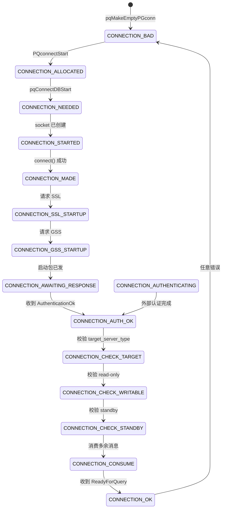
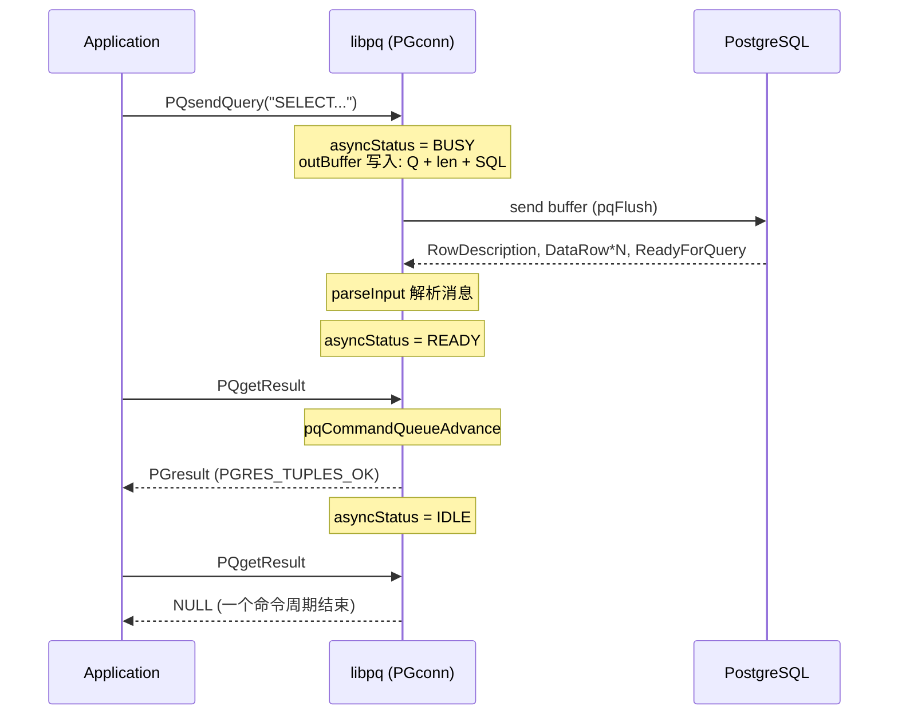
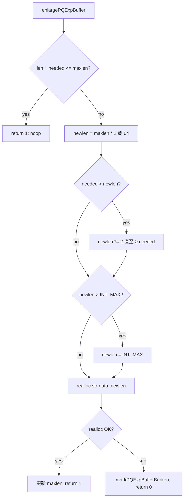
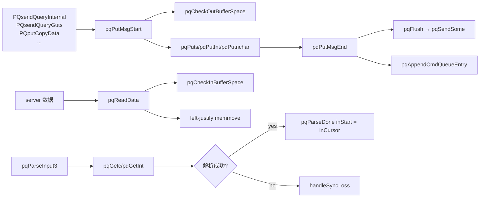
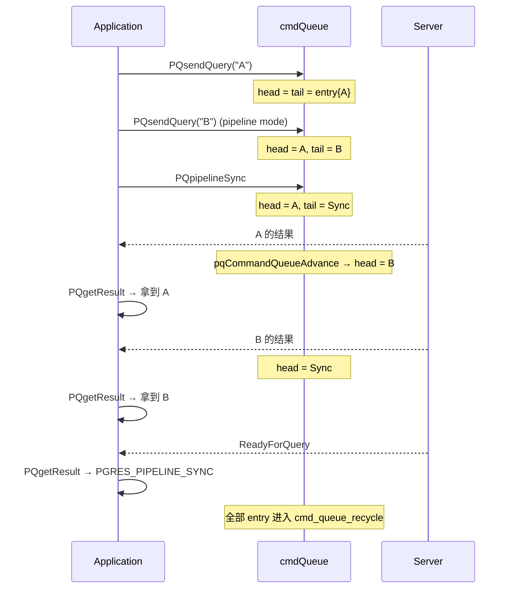
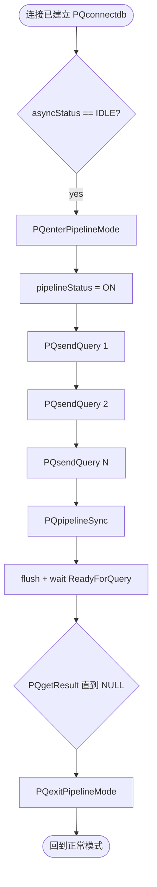
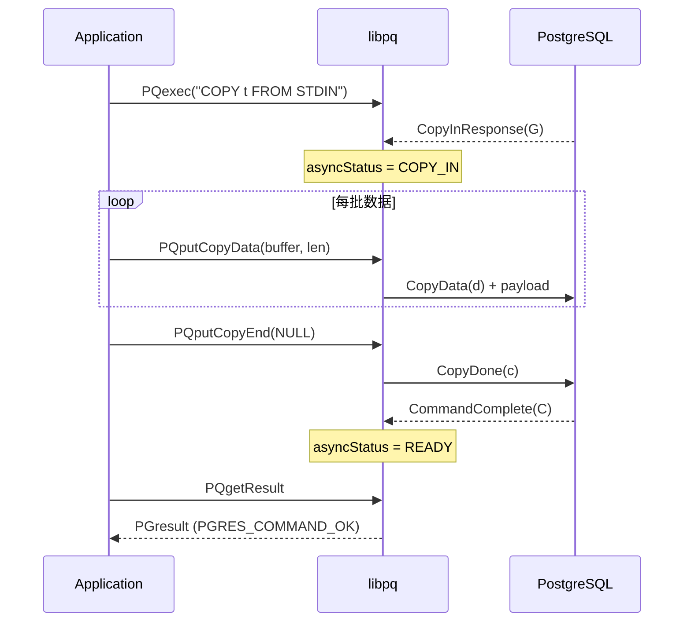
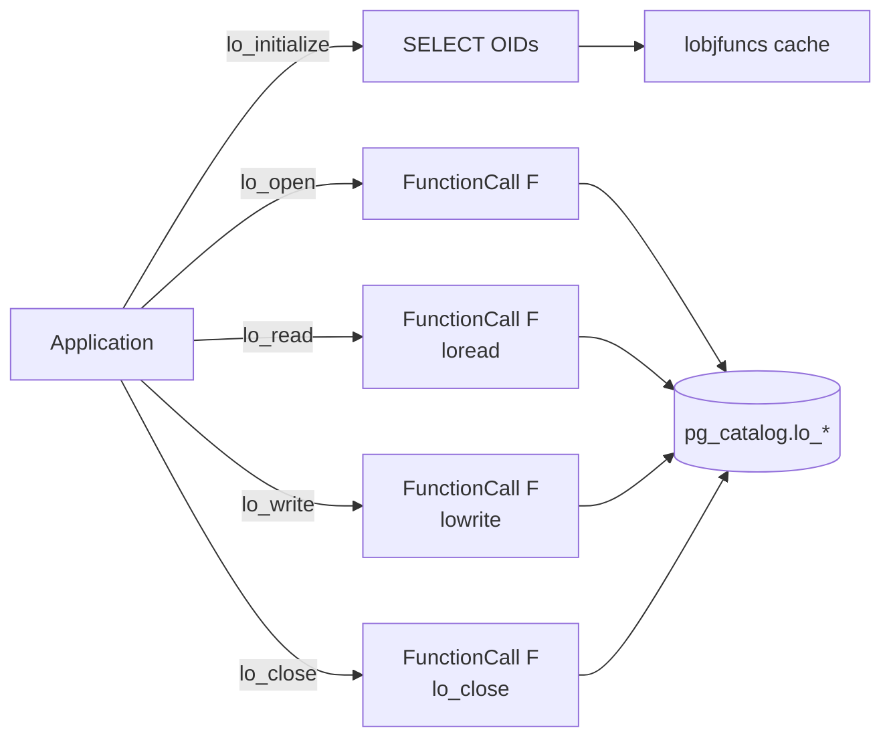
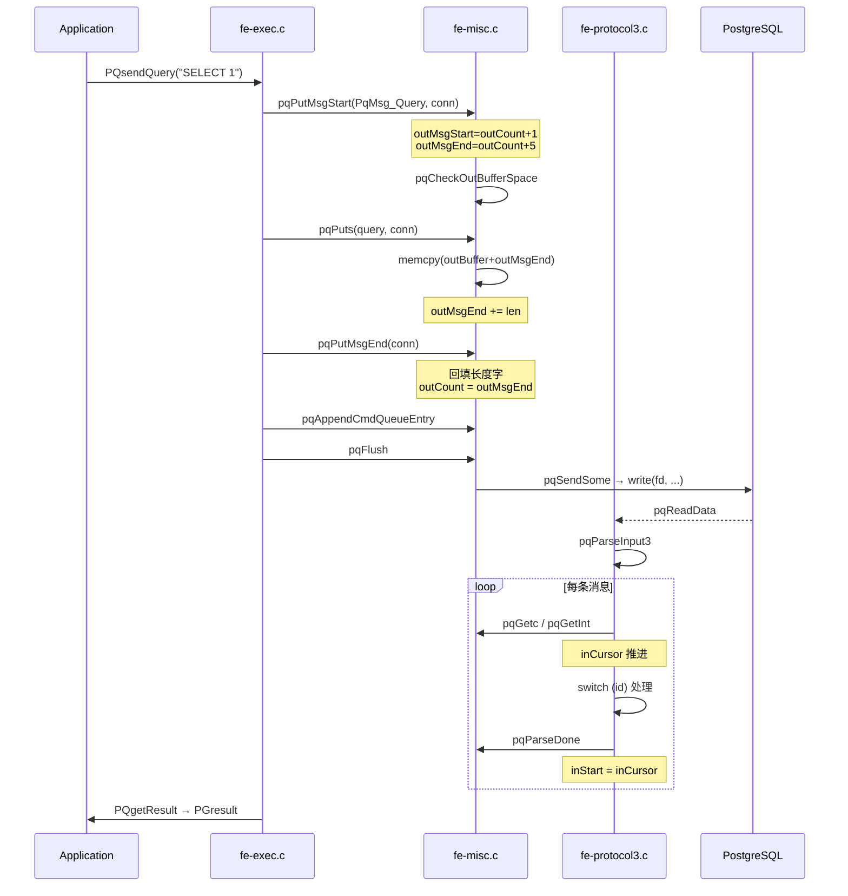

# PostgreSQL libpq 机制与缓冲区详解

|  编写人 | 编写内容 | 编写时间 |
| --- | --- | --- |
|  growdu | 初稿，结合 PostgreSQL 17 源码（src/interfaces/libpq） | 2026-09-23 |

想象你正坐在一家只能容纳一桌客人的小餐厅里。厨房只有一个炉子，但每天要接待几十位客人。老板不愿意花大钱雇十个厨师，于是发明了一套"接力"流程：客人坐下前先填一份菜单，写好之后交给厨房；厨房不是一道菜做完再接下一道，而是把今天的菜单**攒成一摞**，按"出餐顺序"一份一份炒；炒好了用小窗口递出去；客人吃完再喊下一份。整个过程里，菜单会不断被改写（客人加菜）、堆叠（多桌拼桌）、回滚（某桌取消）。**libpq 就是这个厨房**：客户端只有一个 socket，但要同时应付若干条 SQL、若干个 COPY、若干个事务，还得能保证每条消息的边界清楚、长度准确、顺序不乱。

libpq 的全部秘密藏在三个东西里：`PGconn`（那本总账）、`inBuffer` / `outBuffer`（两扇窗户）和 `PQExpBuffer`（那张能越写越大的便签纸）。本文沿着 `~/cwork/postgresql/src/interfaces/libpq/` 的源码，把这三个东西彻底拆开。

---

## 一、PGconn：libpq 的"档案柜"

`PGconn` 是 libpq 中唯一对应用暴露概念但实际不透明的 struct。它在 `~/cwork/postgresql/src/interfaces/libpq/libpq-fe.h` 里仅以 typedef 出现，**真正的字段全部隐藏在 `libpq-int.h` 里**：

```c
/* libpq-fe.h:199 */
typedef struct pg_conn PGconn;
```

应用只能拿到 `PGconn *` 指针，所有字段都通过 `PQdb`、`PQuser`、`PQstatus` 之类的访问器函数读取。这种封装让 libpq 可以在不同小版本里自由调整内部布局，**只要公开 API 不破坏就行**。

### 1.1 字段全景

`PGconn` 大约有 70 个字段，按职责可以分为六组：

| 分组 | 关键字段 | 用途 |
| --- | --- | --- |
| **连接控制** | `sock`, `laddr`, `raddr`, `pversion`, `sversion` | 套接字与协议版本 |
| **认证状态** | `auth_req_received`, `password_needed`, `gssapi_used`, `scram_client_key_binary` | 认证相关 |
| **命令队列** | `cmd_queue_head`, `cmd_queue_tail`, `cmd_queue_recycle` | pipeline / 异步追踪 |
| **接收缓冲** | `inBuffer`, `inBufSize`, `inStart`, `inCursor`, `inEnd` | 接收套接字数据 |
| **发送缓冲** | `outBuffer`, `outBufSize`, `outCount`, `outMsgStart`, `outMsgEnd` | 构造并发送消息 |
| **结果 / 错误** | `result`, `error_result`, `saved_result`, `errorMessage`, `workBuffer` | 当前 PGresult、扩展错误缓冲 |

源码片段（`libpq-int.h:567`）：

```c
/*
 * Buffer for data received from backend and not yet processed.
 *  NB: We rely on a maximum inBufSize/outBufSize of INT_MAX
 *  (and therefore an INT_MAX upper bound on the size of any
 *  and all packet contents) to avoid overflow; for example in
 *  reportErrorPosition().
 */
char       *inBuffer;          /* currently allocated buffer */
int         inBufSize;         /* allocated size of buffer */
int         inStart;           /* offset to first unconsumed data */
int         inCursor;          /* next byte to tentatively consume */
int         inEnd;             /* offset past last valid byte */

/* Buffer for data not yet sent to backend */
char       *outBuffer;         /* currently allocated buffer */
int         outBufSize;        /* allocated size of buffer */
int         outCount;          /* number of chars waiting in buffer */

/* State for constructing messages in outBuffer */
int         outMsgStart;       /* -1 means message has no length word */
int         outMsgEnd;         /* offset to msg end (so far) */
```

### 1.2 inBuffer 的三指针模型

输入缓冲里同时维护了**三个偏移**：

```text
inBuffer
 ┌─────┬───────────────┬─────────────────┬──────────┐
 │     │ ←已消费→       │ ←未消费→         │  ←空闲→  │
 └─────┴───────────────┴─────────────────┴──────────┘
       inStart         inCursor          inEnd     inBufSize
```

- **`inStart`**：已经被上层解析走的消息结尾。下次解析从此处开始。
- **`inCursor`**：当前消息解析的光标。解析时只增不减，解析成功后由 `pqParseDone` 把 `inStart` 推到 `inCursor`。
- **`inEnd`**：`recv` 进来的最新字节的下一位。`inEnd - inStart` 即"可解析的字节数"。

三指针的设计让 **"消费过的字节不必立刻清零，只需向左挤"**——这是 `pqCheckInBufferSpace` 中 `memmove` 优化的基础。

### 1.3 outBuffer 的"分段式"消息构造

输出缓冲则采用**"生长式"消息构造**：每一个消息开头预留 1 字节 type + 4 字节 length，消息体紧跟其后。`outMsgStart` 记录**当前正在构造的消息的长度字位置**，`outMsgEnd` 记录**当前已写到的位置**。多个消息可以**挤在同一个 `outBuffer` 里**，靠 `pqFlush` 一次性刷给 socket。

消息构造期和发送期解耦的好处：批量 SQL 提交（pipeline）下，可以先把所有 Query 写到 outBuffer，再一并 flush。

---

## 二、连接状态机：CONNECTION_* 的全部角色

`ConnStatusType` 在 `libpq-fe.h:81` 定义：

```c
typedef enum {
    CONNECTION_OK,
    CONNECTION_BAD,
    CONNECTION_STARTED,            /* connect() 已返回 */
    CONNECTION_MADE,               /* 等待发送 */
    CONNECTION_AWAITING_RESPONSE,  /* 等 postmaster 应答 */
    CONNECTION_AUTH_OK,            /* 收到 auth，等待 backend 启动 */
    CONNECTION_SETENV,             /* 已废弃 */
    CONNECTION_SSL_STARTUP,        /* SSL 握手 */
    CONNECTION_NEEDED,             /* 内部状态：需要 connect() */
    CONNECTION_CHECK_WRITABLE,     /* 检查会话是否只读 */
    CONNECTION_CONSUME,            /* 消费多余消息 */
    CONNECTION_GSS_STARTUP,        /* GSSAPI 协商 */
    CONNECTION_CHECK_TARGET,       /* 检查目标服务器属性 */
    CONNECTION_CHECK_STANDBY,      /* 检查是否 standby */
    CONNECTION_ALLOCATED,          /* 连接等待启动 */
    CONNECTION_AUTHENTICATING,     /* 与外部系统认证 */
} ConnStatusType;
```

这些状态只对**异步连接路径**（`PQconnectStart` + `PQconnectPoll`）有意义，同步调用 `PQconnectdb` 内部只是把状态机从头跑到尾。

### 2.1 状态机 Mermaid 图



### 2.2 关键过渡的实现位置

`fe-connect.c` 里搜索 `conn->status = CONNECTION_` 就能找到每一次过渡。几个最关键的过渡：

```text
fe-connect.c:3495   conn->status = CONNECTION_STARTED;       /* socket 已建 */
fe-connect.c:3621   conn->status = CONNECTION_MADE;          /* connect() OK */
fe-connect.c:3688   conn->status = CONNECTION_SSL_STARTUP;   /* 进入 SSL 握手 */
fe-connect.c:3747   conn->status = CONNECTION_AWAITING_RESPONSE; /* 已发 Startup 包 */
fe-connect.c:4232   conn->status = CONNECTION_AUTH_OK;       /* AuthenticationOk 收到 */
fe-connect.c:4376   conn->status = CONNECTION_CHECK_TARGET;
fe-connect.c:4412   conn->status = CONNECTION_CHECK_WRITABLE;
fe-connect.c:4470   conn->status = CONNECTION_CHECK_STANDBY;
fe-connect.c:4518   conn->status = CONNECTION_OK;             /* ReadyForQuery 收到 */
```

CONNECTION_OK 之后连接进入**正常工作态**，由 `asyncStatus` 这另一组独立的状态控制命令周期（`PGASYNC_IDLE` / `PGASYNC_BUSY` / `PGASYNC_COPY_*` 等）。


---

## 三、同步 / 异步两条入口的同一台引擎

`PQconnectdb` 看起来比 `PQconnectStart` + `PQconnectPoll` 简单很多，但底层是同一台状态机引擎：

```c
/* fe-connect.c:820 */
PGconn *
PQconnectdb(const char *conninfo)
{
    PGconn *conn = PQconnectStart(conninfo);
    if (conn != NULL)
        (void) pqConnectDBComplete(conn);
    return conn;
}
```

同步路径只是把异步状态机**强制跑完**：

```c
/* fe-connect.c:2782 */
int
pqConnectDBComplete(PGconn *conn)
{
    PostgresPollingStatusType flag = PGRES_POLLING_WRITING;
    ...
    for (;;) {
        switch (flag) {
            case PGRES_POLLING_OK:         return 1;
            case PGRES_POLLING_READING:    pqWaitTimed(1, 0, conn, end_time); break;
            case PGRES_POLLING_WRITING:    pqWaitTimed(0, 1, conn, end_time); break;
            ...
        }
        flag = PQconnectPoll(conn);   /* 推进状态机 */
    }
}
```

注意 `connect_timeout` 在这里是按 host 粒度计时的——切换到下一台 host 时会**重置超时**，这在多 IP 故障切换场景里非常关键。

### 3.1 `pqConnectDBStart` 的初始化

```c
/* fe-connect.c:2700 */
int
pqConnectDBStart(PGconn *conn)
{
    ...
    /* Ensure our buffers are empty */
    conn->inStart = conn->inCursor = conn->inEnd = 0;
    conn->outCount = 0;

    if (!conn->cancelRequest) {
        conn->whichhost = -1;
        conn->try_next_host = true;
        conn->try_next_addr = false;
    }
    conn->status = CONNECTION_NEEDED;

    /* run state machine once to kick it into PGRES_POLLING_WRITING */
    if (PQconnectPoll(conn) == PGRES_POLLING_WRITING)
        return 1;
    ...
}
```

注意 `whichhost = -1` 这条"小作弊"——`PQconnectPoll` 第一次进入时会立刻把它自增到 0 才开始工作，让代码逻辑统一。

### 3.2 `PQconnectPoll` 状态机骨架

`PQconnectPoll`（`fe-connect.c:2908`）是一个 4500 行的巨函数，但骨架很清晰：

```text
PQconnectPoll:
    1. 根据 conn->status 判断当前等待方向
       (READING 状态 → 阻塞在 select 读侧; WRITING 状态 → 阻塞在写侧)
    2. try_next_addr → 同一 host 的下一个 IP
    3. try_next_host → 整个 connhost[] 的下一台 host
    4. reset_connection_state_machine = true → 准备连接
    5. need_new_connection → pqDropConnection + pqDropServerData
    6. switch (conn->status) 进入分支:
          - NEEDED → TCP connect
          - MADE → 发 startup 包(SMSG_StartupPacket)
          - AWAITING_RESPONSE → pqReadData 读 auth 响应
          - SSL_STARTUP → SSL 握手
          - AUTH_OK → 已认证但未 ReadyForQuery
          - CHECK_TARGET / CHECK_WRITABLE / CHECK_STANDBY → 校验
          - OK → return PGRES_POLLING_OK
```

### 3.3 同步 / 异步对照表

| 同步 API | 异步 API | 内部差异 |
| --- | --- | --- |
| `PQconnectdb` | `PQconnectStart` + `PQconnectPoll` | 同步包装 `pqConnectDBComplete` 反复 poll |
| `PQexec` | `PQsendQuery` + `PQconsumeInput` + `PQgetResult` | 同步包装 `PQexecStart` + `PQexecFinish` |
| `PQfn` | `PQsendQuery` (FunctionCall) | 同步一次性完成 |
| `PQputCopyData` | 同 | 同步 / 异步都要在非阻塞下处理 EAGAIN |
| `PQpipelineSync` | `PQsendPipelineSync` | 前者立即 flush；后者只在缓冲区阈值被超过时才 push |

---

## 四、async vs sync：PGASYNC_* 状态机

`fe-exec.c` 通过 `PGASYNC_*` 状态追踪当前**命令周期**的阶段。**这是和 `ConnStatusType` 完全不同的状态机**，二者解耦：

```text
typedef enum {
    PGASYNC_IDLE,                /* 连接空闲，可发下一条命令 */
    PGASYNC_BUSY,                /* 命令已发，等响应 */
    PGASYNC_READY,               /* 一个 PGresult 已就绪，可 PQgetResult 拿走 */
    PGASYNC_READY_MORE,          /* partialResultMode 模式下还有更多行 */
    PGASYNC_COPY_IN,             /* COPY FROM 模式中 */
    PGASYNC_COPY_OUT,            /* COPY TO 模式中 */
    PGASYNC_COPY_BOTH,           /* walsender 双向 COPY */
    PGASYNC_PIPELINE_IDLE        /* pipeline 模式下，等下一个队列命令 */
} PGAsyncStatusType;
```

### 4.1 一个查询的 PGASYNC 周期



### 4.2 同步执行 PQexec 的内部

```c
/* fe-exec.c:2278 */
PGresult *
PQexec(PGconn *conn, const char *query)
{
    if (!PQexecStart(conn))
        return NULL;
    ...
    res = PQexecFinish(conn);
    ...
}
```

`PQexecStart` 内部调用 `PQsendQueryStart` 把状态切到 BUSY，然后调用 `PQsendQueryInternal` 把消息写进 outBuffer；`PQexecFinish` 反复调用 `parseInput` 直到 `asyncStatus != BUSY`，最后返回 `PQgetResult`。

### 4.3 异步模式的 API 闭环

```c
/* 1. 发起 */
PQsendQuery(conn, "SELECT 1");
/* 2. 等 socket 可读 */
select(PQsocket(conn)+1, &rd, ...);
/* 3. 把数据吸进来 */
PQconsumeInput(conn);
/* 4. 看是否还在 BUSY */
if (PQisBusy(conn)) goto step 2;
/* 5. 拿结果 */
PGresult *res = PQgetResult(conn);
/* 6. 处理; res == NULL 时本周期结束 */
```

非阻塞 + select 模型是 libpq 实现 **PG event-loop / 协程**的关键。


---

## 五、消息解析：type-byte + length + payload

每条前后端消息都遵循**固定帧格式**：

```text
┌─────┬────────────┬──────────────────────┐
│ type│  length    │  payload (length-4 B) │
│ 1B  │  4B (big)  │                      │
└─────┴────────────┴──────────────────────┘
```

`Startup` 包（首次连接时）例外——**没有 type 字节**，前 4 字节直接是长度。

### 5.1 帧格式在源码中的对应

帧格式在 `pqPutMsgStart` 中构造：

```c
/* fe-misc.c:473 */
int
pqPutMsgStart(char msg_type, PGconn *conn)
{
    int lenPos, endPos;
    /* allow room for message type byte */
    endPos = conn->outCount + (msg_type ? 1 : 0);
    /* allow room for message length */
    endPos += 4;

    if (pqCheckOutBufferSpace(endPos, conn)) return EOF;

    if (msg_type)
        conn->outBuffer[conn->outCount] = msg_type;

    conn->outMsgStart = lenPos;       /* length 字位置 */
    conn->outMsgEnd   = endPos;       /* 当前消息结尾 */
}
```

### 5.2 解析路径

解析入口 `pqParseInput3`（`fe-protocol3.c:69`）：

```c
for (;;) {
    conn->inCursor = conn->inStart;
    if (pqGetc(&id, conn)) return;       /* 读 type 字节 */
    if (pqGetInt(&msgLength, 4, conn))   /* 读 4 字节长度 */
        return;

    if (msgLength < 4) { handleSyncLoss(...); return; }
    if (msgLength > 30000 && !VALID_LONG_MESSAGE_TYPE(id)) {
        handleSyncLoss(...); return;
    }

    msgLength -= 4;
    avail = conn->inEnd - conn->inCursor;
    if (avail < msgLength) {             /* 整条还没收全 */
        pqCheckInBufferSpace(conn->inCursor + (size_t) msgLength, conn);
        return;
    }

    /* 收到一条完整消息，按 id 分发 */
    switch (id) {
        case PqMsg_CommandComplete: ...
        case PqMsg_DataRow: ...
        case PqMsg_ErrorResponse: ...
        case PqMsg_ReadyForQuery: ...
        ...
    }
}
```

`pqGetc` 和 `pqGetInt` 只动 `inCursor`，**不更新 `inStart`**——只有解析成功的消息才会被 `pqParseDone` 推进 `inStart`。这意味着**解析失败可以回滚**：把 `inCursor` 拉回 `inStart` 即可重读。

### 5.3 消息分发表

`pqParseInput3` 的 `BUSY` 分支支持的消息大致分类：

| 类别 | 消息 | 处理函数 |
| --- | --- | --- |
| 完成通知 | `CommandComplete`, `EmptyQueryResponse`, `ParseComplete`, `BindComplete`, `CloseComplete` | 切到 READY |
| 数据行 | `DataRow` | `pqRowProcessor` |
| 元数据 | `RowDescription`, `ParameterDescription` | `getRowDescriptions`, `getParamDescriptions` |
| 错误 | `ErrorResponse`, `NoticeResponse` | `pqGetErrorNotice3` |
| 通知 | `NotificationResponse` | `getNotify` |
| COPY | `CopyInResponse`, `CopyOutResponse`, `CopyBothResponse`, `CopyData`, `CopyDone` | `getCopyStart` 等 |
| 控制 | `ReadyForQuery`, `ParameterStatus`, `BackendKeyData` | `getReadyForQuery` 等 |

源码见 `fe-protocol3.c:200-485` 的 `switch (id) { ... }` 大表。

---

## 六、消息构造：pqPutMsgStart → pqPutMsgBytes → pqPutMsgEnd

写入路径比读取路径**对称**得多。三件套：

```c
pqPutMsgStart(PqMsg_Query, conn);     /* 写 type+length 占位 */
pqPuts(query, conn);                  /* 写 body */
pqPutMsgEnd(conn);                    /* 回填长度，刷缓冲 */
```

### 6.1 三件套源码

```c
/* fe-misc.c:532 */
int
pqPutMsgEnd(PGconn *conn)
{
    /* Fill in length word if needed */
    if (conn->outMsgStart >= 0) {
        uint32 msgLen = conn->outMsgEnd - conn->outMsgStart;
        msgLen = pg_hton32(msgLen);
        memcpy(conn->outBuffer + conn->outMsgStart, &msgLen, 4);
    }

    /* trace */
    if (conn->Pfdebug) ...

    /* Make message eligible to send */
    conn->outCount = conn->outMsgEnd;

    /* If appropriate, try to push out some data */
    if (conn->outCount >= 8192)
        pqSendSome(conn, toSend);
    return 0;
}
```

关键点：

1. **长度只在 `pqPutMsgEnd` 才回填**，因此中间任意 `pqPuts` / `pqPutInt` 调用都不用关心长度计算。
2. **8K 阈值触发自动 flush**——Unix pipe buffer 通常就是 8K，这样可以让一次 `write` 写完一个完整缓冲，避免 syscall 碎片。
3. 在 Unix domain socket 上还有**对齐到 8K** 的额外优化（`fe-misc.c:558`）。

### 6.2 简化的 Query 发送示例

```c
/* fe-exec.c:1444 */
static int
PQsendQueryInternal(PGconn *conn, const char *query, bool newQuery)
{
    ...
    if (!PQsendQueryStart(conn, newQuery)) return 0;

    /* construct the Query message */
    if (pqPutMsgStart(PqMsg_Query, conn) < 0 ||
        pqPuts(query, conn) < 0 ||
        pqPutMsgEnd(conn) < 0)
        return 0;
    ...
}
```

### 6.3 一帧在 outBuffer 中的样子

```text
outBuffer (outBufSize 至少 16K)
┌────┬───────────────┬───────┬───────────────┬─────────┐
│    │  [已 flush]    │ 'Q'   │   length      │ "..."   │
│    │                │  1B   │    4B         │  body   │
└────┴───────────────┴───────┴───────────────┴─────────┘
       ↑              ↑       ↑               ↑
   outStart?         outCount (outMsgStart=1+4)
                    永远等于下个消息开头
```

注意一个细节：`outBuffer` 没有 `outStart`——所有已构造的消息都假定在 outCount 之前，**真正"已发送"的部分在 `pqSendSome` 里通过 `memmove` 直接覆盖**。这是一个**单向流**的缓冲区，回收已发送字节比 inBuffer 简单。


---

## 七、PQExpBuffer：可扩展字符串缓冲

`PQExpBuffer` 是 libpq 的**轻量级 StringInfo**，**所有错误信息、动态 SQL 构造、COPY 行格式化都用它**。它和后端 `StringInfoData` 是同构的，但用 `malloc` / `realloc` 而非 `palloc`。

### 7.1 数据结构

```c
/* pqexpbuffer.h:48 */
typedef struct PQExpBufferData
{
    char       *data;
    size_t      len;
    size_t      maxlen;
} PQExpBufferData;
typedef PQExpBufferData *PQExpBuffer;
```

`len` 是**当前内容长度**（不含 `\0`），`maxlen` 是**已分配容量**（含 `\0`）。约定 `maxlen > len` 永远成立。

### 7.2 增长策略：指数 + clamp

`enlargePQExpBuffer`（`pqexpbuffer.c:165`）实现了一套**双重增长策略**：

```c
int
enlargePQExpBuffer(PQExpBuffer str, size_t needed)
{
    size_t newlen;
    char *newdata;

    if (PQExpBufferBroken(str))
        return 0;
    if (needed >= ((size_t) INT_MAX - str->len)) {
        markPQExpBufferBroken(str);
        return 0;
    }
    needed += str->len + 1;

    if (needed <= str->maxlen)
        return 1;

    /* 1. 先按 2 的幂扩容 */
    newlen = (str->maxlen > 0) ? (2 * str->maxlen) : 64;
    while (needed > newlen)
        newlen = 2 * newlen;

    /* 2. clamp 到 INT_MAX */
    if (newlen > (size_t) INT_MAX)
        newlen = (size_t) INT_MAX;

    newdata = realloc(str->data, newlen);
    ...
}
```



注意几个细节：

1. **初始容量是 `INITIAL_EXPBUFFER_SIZE = 256`**（`pqexpbuffer.h:96`）。
2. **指数增长**：每次扩容都是 2 的幂，平均摊销成本 O(1)。
3. **永远不超过 `INT_MAX`**：与 `inBufSize/outBufSize` 一致，避免 size 跨界。
4. **OOM 状态**：失败后进入 `PQExpBufferBroken` 状态，后续操作是 no-op；`data` 指向静态空串 `oom_buffer`，避免 NULL 指针解引用。

### 7.3 PGconn 的两个 PQExpBuffer

`libpq-int.h:680` 在 `PGconn` 里定义了两个**长期存在**的 `PQExpBuffer`：

```c
PQExpBufferData errorMessage;     /* 当前错误/通知缓冲 */
PQExpBufferData workBuffer;       /* 解析一条消息时的临时缓冲 */
```

- **`errorMessage`**：生命周期跨整个查询周期，每次新周期开始时由 `pqClearConnErrorState` 调用 `resetPQExpBuffer` 清空。
- **`workBuffer`**：用于解析 CommandComplete 的 command tag 等临时信息。

这两个 buffer 的共同特征是**嵌在 PGconn 里**，所以 `initPQExpBuffer` 而不是 `createPQExpBuffer`。

---

## 八、inBuffer / outBuffer 的扩容策略：双重缓冲思想

输入输出缓冲的扩容代码非常相似（`fe-misc.c:287` 和 `fe-misc.c:351`），但**输入缓冲多一步 left-justify**。

### 8.1 输出缓冲扩容

```c
/* fe-misc.c:287 */
int
pqCheckOutBufferSpace(size_t bytes_needed, PGconn *conn)
{
    int newsize = conn->outBufSize;
    if (bytes_needed <= (size_t) newsize) return 0;

    /* step 1: double until fits */
    do { newsize *= 2; } while (newsize > 0 && bytes_needed > (size_t) newsize);
    if (newsize > 0 && bytes_needed <= (size_t) newsize) {
        char *newbuf = realloc(conn->outBuffer, newsize);
        if (newbuf) {
            conn->outBuffer = newbuf;
            conn->outBufSize = newsize;
            return 0;
        }
    }

    /* step 2: step in 8K chunks */
    newsize = conn->outBufSize;
    do { newsize += 8192; } while (newsize > 0 && bytes_needed > (size_t) newsize);
    if (newsize > 0 && bytes_needed <= (size_t) newsize) {
        char *newbuf = realloc(conn->outBuffer, newsize);
        if (newbuf) { ... return 0; }
    }

    appendPQExpBufferStr(&conn->errorMessage,
                         "cannot allocate memory for output buffer\n");
    return EOF;
}
```

**先 2 倍、再 8K 步进**的两段式扩容，目的：

- 第一段尽量填够，避免反复 realloc。
- 第二段是兜底，防止 `2*newsize` 溢出 `int` 后变成负数但还满足 `bytes_needed > newsize` 的死循环。

### 8.2 输入缓冲扩容（带 left-justify）

```c
/* fe-misc.c:351 */
int
pqCheckInBufferSpace(size_t bytes_needed, PGconn *conn)
{
    ...
    /* step 0: 先左挤腾出空间! */
    bytes_needed -= conn->inStart;
    if (conn->inStart < conn->inEnd) {
        if (conn->inStart > 0) {
            memmove(conn->inBuffer, conn->inBuffer + conn->inStart,
                    conn->inEnd - conn->inStart);
            conn->inEnd   -= conn->inStart;
            conn->inCursor -= conn->inStart;
            conn->inStart = 0;
        }
    } else {
        conn->inStart = conn->inCursor = conn->inEnd = 0;
    }

    /* 再判断是否还需要 realloc */
    if (bytes_needed <= (size_t) newsize) return 0;

    /* step 1: 2 倍 */
    do { newsize *= 2; } while (...);
    ...
    /* step 2: 8K 步进 */
    ...
}
```

**先 left-justify 再决定 realloc** 是输入缓冲的精髓：`inStart` 之前的数据已经被 `pqParseDone` 推进掉，**完全丢弃**。这相当于一个**消费侧滑动窗口**，让单条大消息（DataRow 的大字段）可以一直留在缓冲里而不被反复拷贝。

### 8.3 inBuffer / outBuffer 初始大小

`pqMakeEmptyPGconn`（`fe-connect.c:4940`）创建连接时：

```c
/* fe-connect.c:5004 */
conn->inBufSize  = 16 * 1024;
conn->inBuffer   = malloc(conn->inBufSize);
conn->outBufSize = 16 * 1024;
conn->outBuffer  = malloc(conn->outBufSize);
```

注释说明：选 16K 是为了让单次 `write`/`read` 至少覆盖一个 Unix pipe buffer (8K)，减少上下文切换。

---

## 九、pqCheckInBufferSpace / pqCheckOutBufferSpace / pqAppendCmdQueueEntry

把前面三个 helper 放在一起对比，它们是 buffer 机制的**三位一体**：

| 函数 | 文件 | 行号 | 职责 |
| --- | --- | --- | --- |
| `pqCheckOutBufferSpace` | `fe-misc.c` | 287 | 保证 outBuffer 能装下指定字节；2 倍 + 8K 步进 |
| `pqCheckInBufferSpace` | `fe-misc.c` | 351 | 同上但多 left-justify；用于 DataRow 大字段 |
| `pqAppendCmdQueueEntry` | `fe-exec.c` | 1355 | 把发出去的命令挂到 cmd_queue_tail |

### 9.1 调用关系



### 9.2 OOM 时的处理

`pqCheckOutBufferSpace` / `pqCheckInBufferSpace` 在 realloc 失败时**直接往 `errorMessage` append 一条消息**并返回 EOF。调用者通常立即检查返回值、把命令标为失败。

注意：**不会抛异常、不会 abort**，只是返回 EOF。这种"软失败 + 累积错误信息"的设计贯穿整个 libpq。

---

## 十、命令队列 cmdQueue

libpq 从 v14 引入了 pipeline mode，**命令队列是 pipeline 的核心数据结构**：

```c
/* libpq-int.h:343 */
typedef struct PGcmdQueueEntry {
    PGQueryClass queryclass;     /* PGQUERY_SIMPLE / EXTENDED / SYNC / CLOSE / PREPARE */
    char *query;                 /* query 文本（用于错误信息） */
    struct PGcmdQueueEntry *next;
} PGcmdQueueEntry;

/* libpq-int.h:487 */
PGcmdQueueEntry *cmd_queue_head;
PGcmdQueueEntry *cmd_queue_tail;

/* libpq-int.h:494 */
PGcmdQueueEntry *cmd_queue_recycle;   /* 自由链表 */
```

### 10.1 队列操作三件套

```c
/* fe-exec.c:1322 */
static PGcmdQueueEntry *
pqAllocCmdQueueEntry(PGconn *conn)
{
    if (conn->cmd_queue_recycle == NULL) {
        entry = malloc(sizeof(PGcmdQueueEntry));
    } else {
        entry = conn->cmd_queue_recycle;
        conn->cmd_queue_recycle = entry->next;
    }
    entry->next = NULL;
    entry->query = NULL;
    return entry;
}

/* fe-exec.c:1355 */
static void
pqAppendCmdQueueEntry(PGconn *conn, PGcmdQueueEntry *entry)
{
    Assert(entry->next == NULL);
    if (conn->cmd_queue_head == NULL)
        conn->cmd_queue_head = entry;
    else
        conn->cmd_queue_tail->next = entry;
    conn->cmd_queue_tail = entry;
    ...
}

/* fe-exec.c:1402 */
static void
pqRecycleCmdQueueEntry(PGconn *conn, PGcmdQueueEntry *entry)
{
    ...
    entry->next = conn->cmd_queue_recycle;
    conn->cmd_queue_recycle = entry;
}
```

**回收链表**是减少 malloc/free 抖动的关键技巧：一条命令完成后不会立刻 `free`，而是挂到 `cmd_queue_recycle`；下次再分配时直接拿走。

### 10.2 命令队列的生命周期



### 10.3 单条命令的队列行为

即使不在 pipeline 模式，**每条命令也会被入队**。这是异步 / 同步统一的关键：`PQsendQueryStart` 始终会 `pqAppendCmdQueueEntry`，让 `PQgetResult` 在 `pqCommandQueueAdvance` 时知道当前是哪一条命令的结果。

源码 `fe-exec.c:3138`：

```c
void
pqCommandQueueAdvance(PGconn *conn, bool isReadyForQuery, bool gotSync)
{
    PGcmdQueueEntry *entry = conn->cmd_queue_head;
    if (entry == NULL) return;
    conn->cmd_queue_head = entry->next;
    if (conn->cmd_queue_head == NULL)
        conn->cmd_queue_tail = NULL;
    pqRecycleCmdQueueEntry(conn, entry);
    ...
}
```


---

## 十一、Pipeline 模式：一次连接跑多条 SQL

PG14 引入的 pipeline 让多个 SQL **共享一个 socket**，不需要等结果就能发下一条。`PQenterPipelineMode` 切换到 pipeline 状态（`fe-exec.c:3058`）：

```c
int
PQenterPipelineMode(PGconn *conn)
{
    if (conn->pipelineStatus != PQ_PIPELINE_OFF) return 1;
    if (conn->asyncStatus != PGASYNC_IDLE) {
        libpq_append_conn_error(conn, "cannot enter pipeline mode, connection not idle");
        return 0;
    }
    conn->pipelineStatus = PQ_PIPELINE_ON;
    return 1;
}
```

### 11.1 同步 vs 异步 Sync

```c
/* fe-exec.c:3284 */
int PQpipelineSync(PGconn *conn) { return pqPipelineSyncInternal(conn, true); }
int PQsendPipelineSync(PGconn *conn) { return pqPipelineSyncInternal(conn, false); }
```

`PQpipelineSync` 强制 flush，而 `PQsendPipelineSync` 只在缓冲超过阈值（`OUTBUFFER_THRESHOLD = 65536`，`libpq-int.h:953`）时才 flush，**进一步批量化**。

### 11.2 Pipeline abort 状态

如果某条命令返回 ErrorResponse，进入 `PQ_PIPELINE_ABORTED` 状态：

```c
/* fe-exec.c:84 */
typedef enum {
    PQ_PIPELINE_OFF,
    PQ_PIPELINE_ON,
    PQ_PIPELINE_ABORTED
} PGpipelineStatus;
```

aborted 状态下，`PQsendQuery` 不真发 SQL，而是**把所有队列命令标记为 PGRES_PIPELINE_ABORTED**，让上层直到 drain 到同步点再恢复。这避免了 server 把命令乱序执行的风险。

### 11.3 Pipeline 模式流程图



---

## 十二、单行模式与块模式：partialResMode

### 12.1 单行模式 PQsetSingleRowMode

`fe-exec.c:1964`：

```c
int
PQsetSingleRowMode(PGconn *conn)
{
    if (canChangeResultMode(conn)) {
        conn->partialResMode = true;
        conn->singleRowMode  = true;
        conn->maxChunkSize   = 1;
        return 1;
    }
    return 0;
}
```

`partialResMode = true` 时，每个 DataRow **立即产生一个 PGresult**（`PGRES_SINGLE_TUPLE`），而不等所有行凑齐再产生 `PGRES_TUPLES_OK`。这在**流式消费大结果集**时是关键：内存峰值从 `N 行 × 行宽` 降到 `1 行 × 行宽`。

### 12.2 块模式 `PQsetChunkedRowsMode` (PG17+)

```c
/* fe-exec.c:1981 */
int
PQsetChunkedRowsMode(PGconn *conn, int chunkSize)
{
    if (chunkSize > 0 && canChangeResultMode(conn)) {
        conn->partialResMode = true;
        conn->singleRowMode  = false;
        conn->maxChunkSize   = chunkSize;
        return 1;
    }
    return 0;
}
```

每 `chunkSize` 行产生一个 `PGRES_TUPLES_CHUNK` PGresult，介于 singleRowMode 和 fullResult 之间的中间方案。

`canChangeResultMode`（`fe-exec.c:1941`）的判定非常严格：必须在 BUSY 状态、head 必须是 SIMPLE / EXTENDED 命令、且当前没有 pending result。**这是因为模式信息无法在协议层传递——必须提前设置**。

### 12.3 状态对照

| 模式 | `partialResMode` | `singleRowMode` | `maxChunkSize` | 产生 PGresult 时机 |
| --- | --- | --- | --- | --- |
| 默认 | false | false | 0 | 全部行收完 |
| singleRowMode | true | true | 1 | 每行 |
| chunkedRowsMode | true | false | chunkSize | 每 chunk |

---

## 十三、COPY 协议：PQputCopyData / PQgetCopyData

COPY 是 libpq 的"原始数据流"通道，绕开普通 SQL 消息。

### 13.1 发送：PQputCopyData

```c
/* fe-exec.c:2711 */
int
PQputCopyData(PGconn *conn, const char *buffer, int nbytes)
{
    if (conn->asyncStatus != PGASYNC_COPY_IN &&
        conn->asyncStatus != PGASYNC_COPY_BOTH) {
        libpq_append_conn_error(conn, "no COPY in progress");
        return -1;
    }
    parseInput(conn);     /* 先消费 NOTIFY/NOTICE */

    if (nbytes > 0) {
        if ((conn->outBufSize - conn->outCount - 5) < nbytes) {
            if (pqFlush(conn) < 0) return -1;
            if (pqCheckOutBufferSpace(conn->outCount + 5 + (size_t) nbytes, conn))
                return pqIsnonblocking(conn) ? 0 : -1;
        }
        if (pqPutMsgStart(PqMsg_CopyData, conn) < 0 ||
            pqPutnchar(buffer, nbytes, conn) < 0 ||
            pqPutMsgEnd(conn) < 0)
            return -1;
    }
    return 1;
}
```

每行数据被包成 `CopyData` 消息（type='d'），最后 `CopyDone`（type='c'）结束。`'d'` 既作为 FE 端 CopyData 也作为 BE 端 CopyData（`protocol.h:62`）。

### 13.2 接收：PQgetCopyData

`pqGetCopyData3`（`fe-protocol3.c:1898`）从 inBuffer 取一条 CopyData：

```c
int
pqGetCopyData3(PGconn *conn, char **buffer, int async)
{
    int msgLength;
    for (;;) {
        msgLength = getCopyDataMessage(conn);
        if (msgLength < 0) return msgLength;
        if (msgLength == 0) {
            if (async) return 0;
            if (pqWait(true, false, conn) || pqReadData(conn) < 0)
                return -2;
            continue;
        }
        msgLength -= 4;
        if (msgLength > 0) {
            *buffer = malloc(msgLength + 1);
            memcpy(*buffer, &conn->inBuffer[conn->inCursor], msgLength);
            (*buffer)[msgLength] = '\0';
            pqParseDone(conn, conn->inCursor + msgLength);
            return msgLength;
        }
    }
}
```

返回码语义：

| 返回值 | 含义 |
| --- | --- |
| `> 0` | 一行数据，长度 = 返回值 |
| `0`   | 暂无数据（非阻塞模式） |
| `-1`  | COPY 结束（PG_COPY_DONE） |
| `-2`  | 错误 |

### 13.3 COPY 终止

COPY 结束后应用必须调用 `PQgetResult` 拿到最终的 CommandComplete 或 ErrorResponse。`PQendcopy`（`fe-protocol3.c:2063`）是早期的简化接口，**已经被 PQputCopyEnd/PQgetResult 取代**。

### 13.4 COPY 数据流



---

## 十四、大对象 API：fe-lobj.c

大对象接口（`fe-lobj.c`，1064 行）是 libpq 的**特殊快捷通道**——它通过 `lo_open` / `lo_close` 等函数调用后端的 `pg_catalog.lo_*` SQL 函数。

### 14.1 初始化：lo_initialize

第一次 lo_* 调用前必须 `lo_initialize`（`fe-lobj.c:843`）：执行一个 SELECT 拿到 `lo_open`, `lo_close`, `lo_creat`, ... 等函数的 OID，缓存到 `conn->lobjfuncs`：

```sql
select proname, oid from pg_catalog.pg_proc
where proname in ('lo_open','lo_close','lo_creat','lo_create',
                  'lo_unlink','lo_lseek','lo_lseek64','lo_tell','lo_tell64',
                  'lo_truncate','lo_truncate64','loread','lowrite')
  and pronamespace = (select oid from pg_catalog.pg_namespace
                      where nspname = 'pg_catalog');
```

拿到 OID 后用 `PQfn`（函数调用协议，**Fastpath 接口**）调用，而不是走普通 SQL 路径。

### 14.2 读写：lo_read / lo_write

```c
/* fe-lobj.c:245 */
int
lo_read(PGconn *conn, int fd, char *buf, size_t len)
{
    PQArgBlock *argv;
    PGresult *res;
    int retval, result_len;

    if (lo_initialize(conn) < 0) return -1;
    argv = malloc(2 * sizeof(PQArgBlock));
    argv[0].isint = 1;
    argv[0].len = 4;
    argv[0].u.integer = fd;
    argv[1].isint = 1;
    argv[1].len = 4;
    argv[1].u.integer = len;

    res = PQfn(conn, conn->lobjfuncs->fn_loread,
               &retval, &result_len, 0, argv, 2);
    ...
}
```

`PQfn` 用 `FunctionCall` 协议（type='F'）调用后端函数，后端返回 `FunctionCallResponse`（type='V'）。这是 libpq 里**少数绕过 Query 消息的快捷方式**之一。

### 14.3 大对象的 LO_BUFSIZE

`fe-lobj.c:42`：

```c
#define LO_BUFSIZE  8192
```

`lo_export` / `lo_import` 等批量接口内部循环 `LO_BUFSIZE` 大小读写，但**调用层不暴露这个常量**——应用通过返回值判断"是否还需要继续 read"。

### 14.4 大对象路径




---

## 十五、错误信息缓冲：errorMessage 的生命周期

`errorMessage` 是 PGconn 里最特殊的一个 PQExpBuffer。它的生命周期是**整个查询周期**：

### 15.1 生命周期约定（libpq-int.h:673）

```c
/*
 * Buffer for current error message.  This is cleared at the start of any
 * connection attempt or query cycle; after that, all code should append
 * messages to it, never overwrite.
 *
 * In some situations we might report an error more than once in a query
 * cycle.  If so, errorMessage accumulates text from all the errors, and
 * errorReported tracks how much we've already reported, so that the
 * individual error PGresult objects don't contain duplicative text.
 */
PQExpBufferData errorMessage;
int             errorReported;
```

### 15.2 三条规则

1. **只在周期开始时清空**（`pqClearConnErrorState`）：
   ```c
   /* libpq-int.h:917 */
   #define pqClearConnErrorState(conn) \
       (resetPQExpBuffer(&(conn)->errorMessage), \
        (conn)->errorReported = 0)
   ```
2. **周期内只 append 不覆盖**。
3. **错误可能在周期内多次发生**：`errorReported` 记录已报告的字节数，避免多个 PGresult 都拷贝同一份错误信息。

### 15.3 写入约定：libpq_append_conn_error

错误写入统一用 `libpq_append_conn_error`（`fe-misc.c:1404`）：

```c
void
libpq_append_conn_error(PGconn *conn, const char *fmt, ...)
{
    va_list args;
    va_start(args, fmt);
    appendPQExpBufferVA(&conn->errorMessage, fmt, args);
    va_end(args);
}
```

它和 `appendPQExpBuffer` 等价，但**总是 append 而非 printf**。`PQerrorMessage(conn)` 返回 `conn->errorMessage.data`。

### 15.4 错误信息的多 buffer 协作

当 libpq 解析消息出错时，会**同时**在多个地方写错误：

- `conn->errorMessage`：长期缓冲，应用通过 `PQerrorMessage` 读。
- `PGresult->errMsg`：本次结果的自带错误。
- `PGconn.workBuffer`：临时拼接。

`pqSaveErrorResult`（`fe-exec.c:808`）负责把 `errorMessage` 拷到 `PGresult`；`pqBuildErrorMessage3`（`fe-protocol3.c:1028`）根据 verbosity 选择 TERSE / DEFAULT / VERBOSE / SQLSTATE 格式。

---

## 十六、协议消息构造与 buffer 的完整故事

把前面所有内容拼起来，**一条普通 SQL 从应用到 server 的完整链路**：



### 16.1 buffer 状态变化一览

| 阶段 | outCount | inStart | inCursor | inEnd |
| --- | --- | --- | --- | --- |
| 初始 | 0 | 0 | 0 | 0 |
| 写 Query 后 | len(Q)+5 | 0 | 0 | 0 |
| flush 后 | 0 | 0 | 0 | 0 |
| recv 第一字节后 | 0 | 0 | 0 | N |
| 解析 type 字节 | 0 | 0 | 1 | N |
| 解析 length 字 | 0 | 0 | 5 | N |
| 解析 payload | 0 | 0 | 5+L | N |
| pqParseDone | 0 | 5+L | 5+L | N |
| 下一条解析 | 0 | 5+L | 5+L | N |

注意 `outCount` 在 `pqSendSome` 后通过 `memmove` 归零（**已发字节被覆盖**），但 `inStart` 不归零、只前进——下次解析从 `inStart` 开始。

---

## 十七、信号、cancel 与线程安全

### 17.1 legacy-pqsignal.c

`legacy-pqsignal.c`（63 行）是 libpq 里**仅供向后兼容**的 `pqsignal` 实现。它存在的原因是 9.3 之前 libpq 导出过这个函数，老客户端还在依赖。

```c
/* legacy-pqsignal.c:48 */
pqsigfunc
pqsignal(int signo, pqsigfunc func)
{
#ifndef WIN32
    struct sigaction act, oact;
    act.sa_handler = func;
    sigemptyset(&act.sa_mask);
    act.sa_flags = 0;
    if (signo != SIGALRM)
        act.sa_flags |= SA_RESTART;
    ...
#else
    return signal(signo, func);
#endif
}
```

**新代码绝不应该再调用 libpq 的 pqsignal**——9.3 之后应该从 libpgport 取。

### 17.2 PQcancelCreate / PGcancelConn（PG17+）

`fe-cancel.c` 提供 PG17 引入的**带状态 cancel** 接口：

```c
PGcancelConn *PQcancelCreate(PGconn *conn);
int PQcancelStart(PGcancelConn *cancelConn);
PostgresPollingStatusType PQcancelPoll(PGcancelConn *cancelConn);
ConnStatusType PQcancelStatus(const PGcancelConn *cancelConn);
void PQcancelFinish(PGcancelConn *cancelConn);
```

`PGcancelConn` 实际就是一个普通 `PGconn`，加 `cancelRequest = true` 标记走 cancel 专用路径。`PQgetCancel(PGconn)`（`fe-cancel.c:368`）返回旧版 `PGcancel` 结构（不带状态、不支持异步），**新代码建议用 PGcancelConn**。

### 17.3 线程安全

`libpq-int.h:744`：

```c
extern pgthreadlock_t pg_g_threadlock;
#define pglock_thread()   pg_g_threadlock(true)
#define pgunlock_thread() pg_g_threadlock(false)
```

`pglock_thread` / `pgunlock_thread` 是 libpq 的全局线程互斥。每个 PGconn **不是线程安全的**——必须每个线程持有独立的 PGconn，或者外部用 mutex 串行化访问。

默认 `pg_g_threadlock` 是空操作（`default_threadlock`），需要在编译时或运行时通过 `PQinitThreadLock` 安装锁钩子。

---

## 十八、扩展接口：libpq-events、Notice Hooks、PGconninfoOption

### 18.1 事件回调

`libpq-events.h` 定义了 PGEVT_REGISTER、POLLERT_CONNDESTROY 等事件：

```c
typedef enum {
    PGEVT_REGISTER,
    PGEVT_CONNRESET,
    PGEVT_CONNDESTROY,
    PGEVT_RESULTCREATE,
    PGEVT_RESULTCOPY,
    PGEVT_RESULTDESTROY
} PGEventId;
```

应用通过 `PQregisterEventProc` 注册回调，在连接/结果生命周期的关键点运行——这是 libpq 扩展生态（如 PgBouncer 兼容补丁）的基础。

### 18.2 Notice Hooks

```c
/* libpq-int.h */
PGNoticeHooks noticeHooks;   /* noticeRec / noticeProc */
```

`noticeRec` / `noticeProc` 是默认的 notice receiver / processor，应用可以通过 `PQsetNoticeReceiver` 替换为自定义回调——ORM 通常用它收集 warning。

### 18.3 conninfo 解析

`fe-connect.c` 里 `PQconninfoOptions[]`（行 200）是一个**几百行的 conninfo 关键字表**，定义了 `host`、`port`、`user`、`password`、`dbname`、`connect_timeout`、`application_name`、`target_server_type` 等 100+ 关键字的默认值、显示字符串、是否需要引号、解析器支持等。

`conninfo_parse` / `conninfo_uri_parse` 把字符串 / URI 解析为 `PQconninfoOption` 数组，再由 `conninfo_array_parse` 合并到 `PGconn` 字段。

---

## 十九、其他数据库 lib 的 buffer 设计对照

虽然本文专注 PG libpq，但 buffer 设计思想在多个数据库生态里都能找到：

| 数据库 | C/S 库 | 缓冲设计 |
| --- | --- | --- |
| PostgreSQL | libpq | inBuffer + outBuffer + PQExpBuffer |
| MySQL | libmysqlclient | net buffer + extension buffer，单一方向流 |
| Oracle | OCI | 复杂多层缓冲：OCIEnv、OCISvcCtx、OCISession 各有 buffer |
| SQL Server | ODBC | TDS 帧缓冲，4 字节 length + payload |
| MongoDB | libmongoc | OP_MSG / OP_QUERY 双缓冲 |

**PostgreSQL 的特殊之处**：把 inBuffer 和 outBuffer 完全分离、输入缓冲用三指针 left-justify、输出缓冲分段构造——这三件事一起让 pipeline / COPY / 大消息同时跑得通。这是其他数据库 lib 较少见的精细设计。

---

## 二十、修改指南 / 坑点速查

### 20.1 想给 libpq 加新功能？

| 改动 | 修改文件 | 关键点 |
| --- | --- | --- |
| 加新公开枚举 | `libpq-fe.h` | 永远 append、不重排、不重用值 |
| 加新访问器 | `libpq-fe.h` 声明 + `fe-connect.c` / `fe-exec.c` 实现 | 名字以 `PQ` 开头 |
| 加新状态 | `libpq-fe.h`（ConnStatusType / ExecStatusType / PGpipelineStatus） | 同步改 `fe-connect.c` / `fe-exec.c` 的 switch |
| 改协议消息 | `fe-protocol3.c` 解析端 + `fe-exec.c` 发送端 | 新 type 字节加 `protocol.h` |
| 改 buffer 增长策略 | `fe-misc.c: pqCheckInBufferSpace / pqCheckOutBufferSpace` | 注意 left-justify 和 INT_MAX clamp |

### 20.2 常见坑点速查

| 现象 | 原因 | 排查 |
| --- | --- | --- |
| `PQexec` 一直返回 NULL | 异步状态卡在 COPY_IN | `PQgetResult` 先消费残余结果 |
| `PQgetResult` 卡住 | asyncStatus = BUSY 但 server 已 close | 检查 `PQconsumeInput` 返回值 |
| 大结果集 OOM | 没启用 singleRowMode / chunkedMode | 在 `PQsendQuery` 之后立即 `PQsetSingleRowMode` |
| pipeline 中途出错 | 单条命令失败导致 aborted | 循环 `PQgetResult` 直到 PGRES_PIPELINE_SYNC |
| `conn->errorMessage` 累积 | 没在每个周期前 `PQreset` |
| OOM 后 buffer 静默丢消息 | PQExpBufferBroken 状态 | 检查 `PQExpBufferBroken(&buf)` |
| 多线程崩溃 | PGconn 不线程安全 | 每个线程一个连接，或外部 mutex |
| `PQcancel` 失败 | 用了旧 PGcancel 且网络不收发 pair | 改用 PGcancelConn (PG17+) |
| 长消息被 TCP 切片 | 每次 `recv` 只拿一包 | `pqReadData` 内部已有 retry-while-inEnd>32768 |

### 20.3 调试 / Trace 工具

- `PQtrace(conn, FILE *)`：打开 trace，所有收发消息写到文件。
- `PQsetTraceFlags(conn, flags)`（PG14+）：控制 trace 粒度（`PQTRACE_SUPPRESS_TIMESTAMPS` 等）。
- `PQuntrace(conn)`：停止 trace。
- `PQsetErrorVerbosity(conn, PQERRORS_VERBOSE)`：让错误带 CONTEXT、HINT、POSITION 字段。

`fe-trace.c`（`pqTraceOutputMessage` 等）实现了所有消息的可读格式化——加新消息类型时记得同步更新。

---

## 二十一、性能调优经验

1. **批量插入用 COPY**：COPY 协议比 INSERT 单条快 10x~100x。
2. **pipeline 模式减少 round-trip**：批量化 DDL、批量 update，**写 100 条单条 SQL 改 pipeline 同步提交可以快 30%**。
3. **singleRowMode 流式消费**：百万行结果集不要全装到内存。
4. **调整 buffer 初始大小**：`pqMakeEmptyPGconn` 用 16K 默认值；如果是大消息客户端，可以考虑 fork 一份 libpq 改成 64K（不推荐，更好的做法是用 COPY + COPY OUT）。
5. **避免频繁创建 PGconn**：连接建立开销 1~5ms，复用连接池是 90% 高性能 PG 应用的共同选择。

---

## 参考资料

- `~/cwork/postgresql/src/interfaces/libpq/libpq-fe.h`
- `~/cwork/postgresql/src/interfaces/libpq/libpq-int.h`
- `~/cwork/postgresql/src/interfaces/libpq/fe-connect.c`
- `~/cwork/postgresql/src/interfaces/libpq/fe-exec.c`
- `~/cwork/postgresql/src/interfaces/libpq/fe-misc.c`
- `~/cwork/postgresql/src/interfaces/libpq/fe-protocol3.c`
- `~/cwork/postgresql/src/interfaces/libpq/fe-lobj.c`
- `~/cwork/postgresql/src/interfaces/libpq/legacy-pqsignal.c`
- `~/cwork/postgresql/src/interfaces/libpq/pqexpbuffer.h`
- `~/cwork/postgresql/src/interfaces/libpq/pqexpbuffer.c`
- `~/cwork/postgresql/src/include/libpq/protocol.h`
- PostgreSQL 17 官方文档《libpq — C Library》
