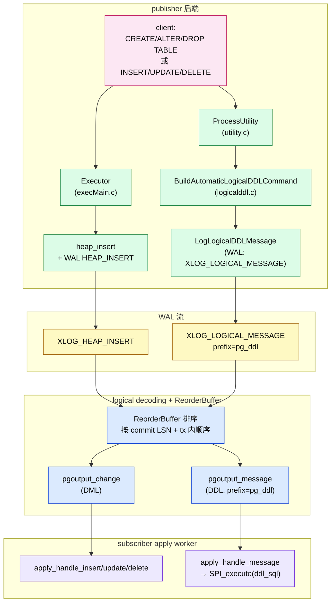
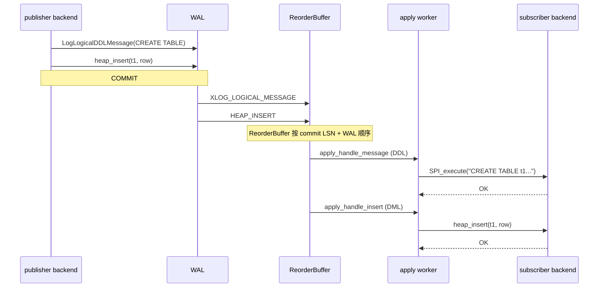
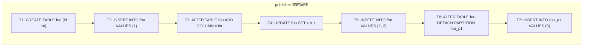

# PostgreSQL 逻辑复制支持 DDL 之后：DDL 与 DML 的时序难题（重点：分区表）

| 编写人 | 编写内容 | 编写时间 |
| --- | --- | --- |
| growdu | 初稿，结合 PostgreSQL 18 内核 `feat(logical-ddl)` 分支的源码（commit 链 `444416efeaa` → `e807ef56184` → `f114e4f6677`）以及 Babelfish T-SQL 扩展对比 | 2026-08-28 |

> 本文是逻辑复制系列的**深度专题**。
>
> 之前的几篇已经讲清楚了**没有 DDL 复制**时的链路——见 [PostgreSQL 逻辑复制与分区表：从 publisher 到 partition leaf 的全链路](./postgresql-logical-replication-with-partitioned-tables/index.html)、[PostgreSQL 逻辑复制下分区表的 INSERT](./postgresql-logical-replication-partitioned-insert-flow/index.html)、[`publish_via_partition_root` 的完整行为分析](./postgresql-logical-replication-publish-via-partition-root/index.html)。
>
> 那条链路上 DDL 必须由 DBA 手工同步，或者由 Babelfish T-SQL 测试用例手动复制。一旦把 DDL **自动**塞进逻辑复制流，"时序"就成了一个被反复拷打的问题——尤其是分区表这种"DDL 改拓扑 + DML 在 leaf 之间流动"的场景。

主要源码路径：

- `~/cwork/postgresql/src/backend/tcop/utility.c`
- `~/cwork/postgresql/src/backend/replication/logical/logicalddl.c`
- `~/cwork/postgresql/src/include/replication/logicalddl.h`
- `~/cwork/postgresql/src/backend/replication/logical/worker.c`
- `~/cwork/postgresql/src/backend/replication/pgoutput/pgoutput.c`
- `~/cwork/postgresql/src/backend/replication/logical/reorderbuffer.c`
- `~/cwork/postgresql/src/backend/commands/tablecmds.c`
- `~/cwork/postgresql/src/include/nodes/parsenodes.h`
- `~/cwork/postgresql/src/include/catalog/pg_publication_sync.h`
- `~/cwork/babelfish_extensions/contrib/babelfishpg_tsql/src/pltsql_partition.c`

---

## 一、引子：一条三岔口的复制流

我先给你看一个会让你半夜被报警叫醒的场景：

```sql
-- publisher 端，session A
BEGIN;
  CREATE TABLE orders (id bigint, region text) PARTITION BY LIST (region);
  CREATE TABLE orders_cn PARTITION OF orders FOR VALUES IN ('CN');
  CREATE TABLE orders_us PARTITION OF orders FOR VALUES IN ('US');
  INSERT INTO orders VALUES (1, 'CN');
COMMIT;

-- publisher 端，session B（同时间，几乎无延迟）
BEGIN;
  ALTER TABLE orders DETACH PARTITION orders_us CONCURRENTLY;
COMMIT;
```

publisher 端正常落库：3 张表 + 1 行 + 1 个 DETACH 都成功了。

subscriber 端呢？

如果你的实现是"DDL 当作普通 DML 走 `pg_publication_sync` 复制表来带"——那么会看到这样的乱序：

1. `pg_publication_sync` 表上的 INSERT 1：`CREATE TABLE orders`
2. `pg_publication_sync` 表上的 INSERT 2：`CREATE TABLE orders_cn PARTITION OF ...`
3. `pg_publication_sync` 表上的 INSERT 3：`CREATE TABLE orders_us PARTITION OF ...`
4. publisher 普通 DML 复制：T1 的 `INSERT INTO orders VALUES (1, 'CN')` ← 但此时 subscriber 还没 commit 父表 `orders`
5. publisher 普通 DML 复制：T2 的 DETACH 事件 —— `pg_publication_sync` 上又来一条

subscriber 的 apply worker 拿着上面的乱序：
- 第 4 步的 INSERT 想写到 `orders` —— **relation 不存在**
- 第 5 步的 DETACH 想拆一个**还没 attach** 的 partition —— **关系/对象找不到**

整个 subscription 直接 disable-on-error 报错，DBA 半夜上线。

这是**"把 DDL 当 DML 复制"**这条朴素路径的硬伤——DDL 的语义时序被强行塞给 DML 的复制机制，每一类反例都要靠额外的状态机补丁。

本文要讲的 **`feat(logical-ddl)` 分支（基于 PostgreSQL 18 主干）**用了一条完全不同的路径：

> DDL 不再被建模为"复制表里的一行"，而是被建模为**逻辑复制流中的一等消息**——一条 transactional logical message，与同事务的 DML 一起，按 commit LSN 顺序进入 ReorderBuffer 和 pgoutput。

下面我把这条路径**逐层**拆开，重点讲清楚：**为什么这条路能让同事务的 DDL/DML 顺序天然正确？为什么跨事务的顺序还是难？为什么分区表是最难的那一类？**

---

## 二、整体架构：DDL 是一条消息，不是普通行



四层，每一层都做一次**顺序固化**：

| 层 | 顺序来源 | 失败代价 |
| --- | --- | --- |
| ProcessUtility / Executor | 用户书写顺序 + WAL 写入顺序 | 事务回滚 |
| WAL | LSN 单调递增 | 必须依赖 PG 的 WAL 同步保证 |
| ReorderBuffer | 同事务内按 WAL 顺序、跨事务按 commit LSN | reorder buffer spill / build |
| pgoutput / apply worker | 按上述固化后的顺序串行回放 | disable-on-error |

这条架构规避了**第一版**`feat(logical-ddl)` 里"DDL 写进 `pg_publication_sync` 普通表"的副作用——那时候 DDL 的"原子语义"和"顺序语义"被强行用 DML 的工具来表达，每一个跨事务的 DDL/DML 反例都需要单独的状态机补丁。

第一版提交 `444416efeaa` 仍然在 git 历史里：

- `src/backend/replication/logical/logicalddl.c`：定义 `PublicationSyncInsert()`，把 DDL 当作普通元组写进 `pg_publication_sync`。
- `src/include/catalog/pg_publication_sync.h`：定义 `psnlsn`、`psnmsgtype`、`psnmsgdata`、`psnnamespace`、`psnpublications`、`psnmsgextra`。

这个版本的弊端就是上面引子的场景。我个人在 commit `e807ef56184`（"finalize ddl apply and mixed ddl+dml replication path"）里把它换成了 transactional logical message + `apply_handle_message`——下文统一按**当前实现**讲。

---

## 三、核心数据结构：`LogicalDDLCommand`

`src/include/replication/logicalddl.h:25`：

```c
typedef enum ReplicableDDLKind
{
    REPL_DDL_KIND_INVALID = 0,
    REPL_DDL_TABLE,
    REPL_DDL_INDEX,
    REPL_DDL_VIEW,
    REPL_DDL_FUNCTION,
    REPL_DDL_TRIGGER,
    REPL_DDL_SCHEMA,
    REPL_DDL_TYPE,
    REPL_DDL_DOMAIN,
    REPL_DDL_RULE,
    REPL_DDL_EXTENSION
} ReplicableDDLKind;
```

`src/include/replication/logicalddl.h:65`：

```c
typedef struct LogicalDDLCommand
{
    ReplicableDDLKind   kind;
    ReplicatedDDLSource source;     /* automatic vs manual */

    Oid     classid;
    Oid     objid;
    int32   objsubid;

    Oid     relid;
    Oid     nspid;

    char   *command_tag;
    char   *query_string;
    char   *normalized_sql;
    char   *object_identity;

    uint32  ddl_seqno;     /* 事务内递增 */

    int     npubs;
    char  **pubnames;

    uint32  flags;
} LogicalDDLCommand;
```

注意四个字段，理解它们就理解了 90% 的时序设计：

- **`normalized_sql`**：订阅端**实际执行**的 SQL。它必须是 schema-qualified、可在订阅端独立执行的、不依赖 publisher 会话状态（`search_path`、GUC）的字符串——这是**第一节引子**里"DDL 不能原样转发"的根本原因。
- **`ddl_seqno`**：事务内递增序号。**仅在事务内**有顺序意义；跨事务的顺序由 `(xid, end_lsn)` 决定。
- **`pubnames`**：**用 publication 名字，不用 OID**。因为 publication OID 是发布端本地标识，订阅端必须靠名字匹配自己订阅的 publication 集合。
- **`source`**：区分 automatic（`ProcessUtility` 自动捕获）与 manual（`pg_emit_logical_ddl()` 显式调用）。这是**入口分离**，不是"挂起执行"——二者一旦进入复制流，行为完全一致。

`src/include/catalog/pg_publication_sync.h:32`：

```c
CATALOG(pg_publication_sync,6120,PublicationSyncRelationId) BKI_SHARED_RELATION
{
    XLogRecPtr	psnlsn;            /* LSN position for ordering */
    TimestampTz pstimestamp;
    char		psnmsgtype;        /* 'Q'=DDL, 'A'=add, 'D'=delete */
#ifdef CATALOG_VARLEN
    text		psnmsgdata;        /* SQL statement or JSON data */
    text		psnnamespace;      /* search_path at DDL execution time */
    text		psnpublications[1];
    json		psnmsgextra;
#endif
}
```

> ⚠️ 这是**早期方案**的 catalog，**当前实现已不再使用**——DDL 不再写入这张表。保留它只是为了让 commit `444416efeaa` 那段历史不至于"看起来没发生过"。下文统一按 transactional logical message 这条线讲，不再回头看这张表。

---

## 四、自动捕获：`MaybeCaptureLogicalDDL` 的挂点

`src/backend/tcop/utility.c:84`：

```c
static void MaybeCaptureLogicalDDL(PlannedStmt *pstmt,
                                   const char *queryString,
                                   ProcessUtilityContext context,
                                   const ObjectAddress *address,
                                   Oid relid_hint);
```

调用点在 `ProcessUtilitySlow` 里散落各处。举三个典型：

`src/backend/tcop/utility.c:1177`：

```c
/* CREATE TABLE / CREATE TABLE AS 完成后的位置 */
{
    PlannedStmt pstmt_ddl;
    memset(&pstmt_ddl, 0, sizeof(pstmt_ddl));
    pstmt_ddl.commandType = CMD_UTILITY;
    pstmt_ddl.utilityStmt = stmt;

    MaybeCaptureLogicalDDL(&pstmt_ddl, queryString,
                           context, &address, address.objectId);
}
```

`src/backend/tcop/utility.c:1347`（`ALTER TABLE` 主路径）：

```c
AlterTable(atstmt, lockmode, &atcontext);
MaybeCaptureLogicalDDL(pstmt, queryString, context, NULL, relid);
```

`src/backend/tcop/utility.c:1583`（CREATE INDEX 主路径）：

```c
DefineIndex(...);
{
    PlannedStmt pstmt_ddl;
    memset(&pstmt_ddl, 0, sizeof(pstmt_ddl));
    pstmt_ddl.commandType = CMD_UTILITY;
    pstmt_ddl.utilityStmt = (Node *) stmt;

    MaybeCaptureLogicalDDL(&pstmt_ddl, queryString, context, &address, relid);
}
```

`src/backend/tcop/utility.c:1717`（CREATE TABLE AS）：

```c
address = ExecCreateTableAs(pstate, (CreateTableAsStmt *) parsetree, params, queryEnv, qc);
MaybeCaptureLogicalDDL(pstmt, queryString, context, &address, address.objectId);
```

**关键设计选择**：

1. 挂点在 `ProcessUtilitySlow` 的 utility 命令**真正完成之后**。`CREATE TABLE` 已经在 catalog 里落地，`ALTER TABLE` 已经改完，`CREATE INDEX` 已经创建。如果挂点在执行之前，DDL message 会**比 catalog 变更早**到达 subscriber，apply worker 拿不到正确的 `relid` / `nspid`。
2. `MaybeCaptureLogicalDDL` 自己再次过滤（看下面第 11 节）。
3. `MaybeCaptureLogicalDDL` 不区分是 TOP-LEVEL 还是 sub-command（`AlterTable` 的多个 sub-command 会**只在 ALTER TABLE 整体完成后调用一次**——这一点至关重要，我们后面在分区表专题里再展开）。

`src/backend/replication/logical/logicalddl.c:188`（`extract_stmt_sql`）做了一件容易被忽略、但对**顺序正确性**很关键的事：

```c
/*
 * Some utility recursion paths preserve only the outer stmt_len (or leave
 * it as -1), which can make a naïve substring include following SQL
 * statements. Re-parse from current stmt_location and keep only the first
 * matching utility statement slice.
 */
raw_parsetree_list = pg_parse_query(queryString);
(void) get_replicable_ddl_kind(pstmt->utilityStmt, &target_kind);

foreach(lc, raw_parsetree_list)
{
    ...
    /* Prefer raw statements that start at or after the planner-reported
       location, but keep a fallback in case that location was inherited
       from a wrapper statement. */
    if (pstmt->stmt_location >= 0 &&
        rawstmt->stmt_location >= pstmt->stmt_location)
    {
        candidate = rawstmt;
        break;
    }
    ...
}
```

这段 fallback 是为了处理 `CREATE SCHEMA foo { CREATE TABLE a(); CREATE TABLE b(); }` 这种嵌套 utility——pstmt 传上来的 `stmt_location` 经常是 0/-1，naive substring 切会把后面的 `CREATE TABLE b()` 也一起切走。`extract_stmt_sql` 用 re-parse 兜底，确保只切出当前 utility 命令自己的那段 SQL。

> 这个兜底**对分区表 DDL 影响巨大**。`CREATE TABLE orders_cn PARTITION OF orders FOR VALUES IN ('CN');` 一旦 normalization 错位，`normalized_sql` 会包含后面的语句——subscriber 端的 `SPI_execute` 执行到错误的语句，会把整个 DDL message 报废（甚至把后面本来不归这条 DDL 管的事务后续 DML 也搭进去）。下文分区表专题会专门再讲这个点。

---

## 五、写入层：`LogLogicalDDLMessage` → transactional logical message

`src/backend/replication/logical/logicalddl.c` 中的 `LogLogicalDDLMessage`（commit `444416efeaa` 起的系列实现）干的就是这件事：

```c
/* 简化后的伪代码 */
void LogLogicalDDLMessage(LogicalDDLCommand *cmd)
{
    StringInfoData buf;
    initStringInfo(&buf);

    /* version / source / kind / flags / ddl_seqno / objid / ... */
    appendStringInfo(&buf, "...");
    pq_sendint32(&buf, cmd->ddl_seqno);
    appendStringInfoString(&buf, cmd->normalized_sql);
    ...

    /* transactional = true，prefix = "pg_ddl_table" / "pg_ddl_index" */
    LogLogicalMessage("pg_ddl_table",
                      buf.data, buf.len,
                      true /* transactional */);
}
```

`LogLogicalMessage` 是 PG 早就有的 API——它把消息写到 `XLOG_LOGICAL_MESSAGE` 的 WAL record 里，标 `transactional = true`，从而让它**绑在当前事务上**：事务回滚，message 跟着消失；事务提交，message 才被 ReorderBuffer 看到。

这是整个设计的**灵魂选择**：

> 用 transactional logical message 而不是普通 message。

为什么不发普通 message？普通 message 是独立于事务的——如果用普通 message，publisher 上 BEGIN → CREATE TABLE → INSERT → COMMIT，DDL message 在 commit 之前就被 ReorderBuffer 吐出，可能在 INSERT 之前就到达 subscriber。subscriber 收到 DDL 时，publisher 事务还没 commit——apply worker 没有任何事务视图可以参考，只能"看到 DDL 就执行"——这等于放弃了 PG 现有事务模型能给你的所有保证。

transactional message 把 message **绑到事务**上，事务不 commit，message 不出门——这就把 DDL 与同事务 DML 一起**整体延时到 commit 之后**，靠 commit LSN 一次排序到位。

> ⚠️ 注意：transactional message 解决的是**同事务内**的时序。**跨事务**的"DDL 已 commit 但 DML 还没 commit"的反例，仍需要另外的状态机兜底（第十二节）。

---

## 六、排序层：ReorderBuffer + pgoutput

`src/backend/replication/logical/reorderbuffer.c` 是 PG 的逻辑复制排序核心。这里只讲跟 DDL 时序相关的两点：

### 6.1 事务内顺序：来自 WAL 写入顺序

`ReorderBuffer` 内部对每个 `ReorderBufferTXN` 维护一个 `changes` 链表：

- DML change 是从 WAL `HEAP_INSERT/UPDATE/DELETE` record 解出来的，按 WAL 顺序追加；
- logical message change 是从 `XLOG_LOGICAL_MESSAGE` record 解出来的，按 WAL 顺序追加；
- 因为 PG 的 WAL **本身**就是按写入顺序串行记录，事务内不同 kind 的 change 必然按 WAL 顺序排。

这就是 **`feat(logical-ddl)` 方案规避"DDL 当 DML 复制"乱序的核心**：DDL message 与 heap change 在 WAL 这一层共享同一个 LSN 序列，事务内的相对顺序天然固化。

### 6.2 跨事务顺序：来自 commit LSN

`ReorderBufferCommit` 按 `commit_lsn` 排序多个事务的输出。DDL/DML 在跨事务层面的"谁先 commit 谁先 apply"，由这个 `commit_lsn` 决定。

这是**第一版方案"DDL 写普通表"的乱序来源**——它把 DDL message 的写入（`INSERT INTO pg_publication_sync`）当成普通 DML change 进 WAL，而 DML change 的 commit LSN 与原始 DDL 的 commit LSN **并不一致**（因为 DDL 已经 commit 之后，DDL 写 `pg_publication_sync` 的 WAL 是后来的事务）。所以"DDL 已 commit / DML 还没 commit"的场景被第一版方案错误表达为"DML 的 commit LSN < DDL message 的 commit LSN"——apply worker 按后者排序，反而把 DML 排在了 DDL 之前。

> transactional logical message 之所以能解决，就是因为它**绑在 DDL 自己的事务上**——message 的 commit LSN 就是 DDL 所在事务的 commit LSN，与同事务 DML 的 commit LSN 是同一个。

---

## 七、pgoutput 层：消息分发

`src/backend/replication/pgoutput/pgoutput.c:1728`：

```c
pgoutput_message(LogicalDecodingContext *ctx, ReorderBufferTXN *txn,
                 XLogRecPtr message_lsn, bool transactional, const char *prefix,
                 Size sz, const char *message)
{
    PGOutputData *data = (PGOutputData *) ctx->output_plugin_private;
    TransactionId xid = InvalidTransactionId;
    bool forward_ddl = should_forward_ddl_message(data, prefix);

    if (!data->messages && !forward_ddl)
        return;

    if (forward_ddl && !transactional)
        return;

    ...
}
```

三件事：

1. `should_forward_ddl_message(data, prefix)` 检查当前 subscription 是否接收这种 `kind` 的 DDL。
2. **`if (forward_ddl && !transactional) return;`**——这条特别关键。它要求 DDL message **必须是 transactional**。如果某条 manual DDL 调用没走 `LogLogicalMessage(..., true)` 而是 `false`，pgoutput 直接丢弃——这等于在协议层强制 DDL 必须跟事务走。
3. 命中后 `OutputPluginPrepareWrite` + `OutputPluginWrite` 写到 wire 上——wire 协议层用 `LOGICAL_REP_MSG_MESSAGE`（'M'）承载 DDL，与 DML 的 `LOGICAL_REP_MSG_INSERT`（'I'）/`UPDATE`（'U'）/`DELETE`（'D'）复用同一条消息通道。

为什么不用新的 message 类型（比如 'D'）？因为协议层 message kind 已经在协议版本里固化——增加一种新 kind 必须 bump 协议版本，并且所有现有的 pgoutput/subscription 都得跟着改。复用 `LOGICAL_REP_MSG_MESSAGE` 加上自定义 `prefix`，是改动最小、对存量兼容最好的选择。

`src/backend/replication/pgoutput/pgoutput.c:2262` 处理 DML 那侧的 partition 判定：

```c
if (publish &&
    (relkind != RELKIND_PARTITIONED_TABLE || pub->pubviaroot))
{
    entry->pubactions.pubinsert |= pub->pubactions.pubinsert;
    ...
}
```

也就是说**DML 在 pgoutput 端就已经把"leaf OID vs parent OID"的选择做好了**——这条决策决定了 apply worker 收到 `INSERT` 时拿到的 `relid` 是 leaf 还是父表。

> ⚠️ 这是分区表时序专题的关键伏笔。**DDL message 里不携带 leaf/parent 选择信息**——`apply_handle_message` 收到 DDL 之后，是用 `SPI_execute(normalized_sql)` 直接在 subscriber 端执行的；它不区分"这条 DDL 是改 leaf 还是改 parent"，也不参与 `pubviaroot` 的判定。但**它执行后留下的 catalog 状态会决定后续 DML 的 routing 行为**——比如 `ATTACH PARTITION` 之后，原来要写到 parent 的行会被 ExecFindPartition 路由到新 leaf；`DETACH PARTITION` 之后，原来要写到该 leaf 的行会报"no partition of relation found"。

---

## 八、apply worker：`apply_handle_message`

`src/backend/replication/logical/worker.c:2362`：

```c
static void
apply_handle_message(StringInfo s)
{
    uint8        flags;
    bool         transactional;
    XLogRecPtr   message_lsn;
    const char  *prefix;
    int          msgsz;
    const char  *message;
    ReplicableDDLKind ddl_kind;
    int32        ddl_mask = PUBDDL_NONE;
    char        *ddl_sql;
    int          save_nestlevel;
    int          rc;

    if (is_skipping_changes() ||
        handle_streamed_transaction(LOGICAL_REP_MSG_MESSAGE, s))
        return;

    flags = pq_getmsgbyte(s);
    if (flags & ~LOGICAL_DDL_MESSAGE_TRANSACTIONAL_FLAG)
        ereport(ERROR,
                (errcode(ERRCODE_PROTOCOL_VIOLATION),
                 errmsg_internal("invalid flags in logical replication message")));

    transactional = (flags & LOGICAL_DDL_MESSAGE_TRANSACTIONAL_FLAG) != 0;
    message_lsn = pq_getmsgint64(s);
    prefix = pq_getmsgstring(s);
    msgsz = pq_getmsgint(s, 4);
    message = pq_getmsgbytes(s, msgsz);

    ddl_kind = LogicalDDLKindFromMessagePrefix(prefix);
    if (ddl_kind == REPL_DDL_KIND_INVALID || !transactional || msgsz <= 0)
        return;

    switch (ddl_kind)
    {
        case REPL_DDL_TABLE:    ddl_mask = PUBDDL_TABLE;    break;
        case REPL_DDL_INDEX:    ddl_mask = PUBDDL_INDEX;    break;
        case REPL_DDL_TYPE:     ddl_mask = PUBDDL_TYPE;     break;
        case REPL_DDL_FUNCTION: ddl_mask = PUBDDL_FUNCTION; break;
        case REPL_DDL_DOMAIN:   ddl_mask = PUBDDL_DOMAIN;   break;
        case REPL_DDL_TRIGGER:  ddl_mask = PUBDDL_TRIGGER;  break;
        case REPL_DDL_VIEW:     ddl_mask = PUBDDL_VIEW;     break;
        case REPL_DDL_RULE:     ddl_mask = PUBDDL_RULE;     break;
        case REPL_DDL_SCHEMA:   ddl_mask = PUBDDL_SCHEMA;   break;
        case REPL_DDL_EXTENSION:ddl_mask = PUBDDL_EXTENSION;break;
        case REPL_DDL_KIND_INVALID: return;
    }

    if ((MySubscription->ddl & ddl_mask) == 0)
        return;

    ddl_sql = pnstrdup(message, msgsz);

    begin_replication_step();

    /* Keep a stable and predictable search path while replaying replicated DDL */
    save_nestlevel = NewGUCNestLevel();
    (void) set_config_option("search_path", "public, pg_catalog",
                             PGC_USERSET, PGC_S_SESSION,
                             GUC_ACTION_SAVE, true, 0, false);

    if (SPI_connect() != SPI_OK_CONNECT)
        elog(ERROR, "SPI_connect failed while applying logical DDL message");

    rc = SPI_execute(ddl_sql, false, 0);
    if (rc < 0)
        ereport(ERROR,
                (errmsg("SPI_execute failed while applying logical DDL message"),
                 errdetail("SPI_execute returned %s for SQL: %s",
                           SPI_result_code_string(rc), ddl_sql)));

    if (SPI_finish() != SPI_OK_FINISH)
        elog(ERROR, "SPI_finish failed while applying logical DDL message");

    AtEOXact_GUC(false, save_nestlevel);
    end_replication_step();
}
```

三点观察：

1. **DDL 在 apply worker 里走的是 SPI**，不是标准的 executor 路径。`SPI_execute(ddl_sql, false, 0)` 把字符串当 SQL 重新 parse + plan + execute。这意味着 `normalized_sql` 的语法如果跟 subscriber 不兼容（比如 T-SQL 端口走 PG 端口），会直接 ERROR。
2. **`search_path` 被强制设成 `public, pg_catalog`**。这是为了规避 `normalized_sql` 里万一漏掉 schema 限定的问题——`pg_catalog` 是 PG 系统表，至少不会让系统函数失效。但**这也意味着 subscriber 上用户 DDL 里如果想引用非 public schema，必须靠 `normalized_sql` 自己写全**。
3. **没有 catalog cache 强制刷新**。`SPI_execute` 内部触发的 `sinval` 只会更新 **apply worker 自己 backend 的** `SInvalBackend` 队列。其他订阅端 backend（如果并行 apply worker / 业务后端）的 catalog cache 不会立即失效——这是跨 backend 的可见性窗口，第十三节会专门讲。

`src/backend/replication/logical/worker.c:2407` 还对 DML 路径补了一个**状态兜底**——这是 `apply_handle_insert` 的补丁：

```c
/* For DDL-replicated tables, relation state may be absent from
 * pg_subscription_rel when first row changes arrive in the same
 * transaction as CREATE TABLE. Register it as READY on-demand. */
if (rel->state == SUBREL_STATE_UNKNOWN)
{
    XLogRecPtr statelsn;
    char relstate;

    relstate = GetSubscriptionRelState(MySubscription->oid,
                                       rel->localreloid,
                                       &statelsn);
    if (relstate == SUBREL_STATE_UNKNOWN)
    {
        AddSubscriptionRelState(MySubscription->oid,
                                rel->localreloid,
                                SUBREL_STATE_READY,
                                InvalidXLogRecPtr,
                                false);
        rel->state = SUBREL_STATE_READY;
        rel->statelsn = InvalidXLogRecPtr;
    }
    else
    {
        rel->state = relstate;
        rel->statelsn = statelsn;
    }
}
```

这段 patch 的目的：**应对"CREATE TABLE 消息和第一条 INSERT 消息同时到达 apply worker"的情况**——`pg_subscription_rel` 还没有这一行（因为 REFRESH 还没跑过），apply worker 不能因为查不到 state 就拒绝 INSERT。所以 on-demand 把它 register 成 `SUBREL_STATE_READY`，`InvalidXLogRecPtr` 告诉后续"不需要再 sync"。

> 这是**同事务**场景的兜底。**跨事务**场景——比如 T1 创建表，T2 才 INSERT——需要 `tablesync` 拉过一遍，`pg_subscription_rel.srsubstate = 'r'` 才会出现。**第十节**我会讲为什么这条补丁不能完全替代 `tablesync`。

---

## 九、同事务时序为什么相对好处理

同事务内 DDL/DML 的相对顺序由 WAL 写入顺序固化——这部分没什么好挣扎的。举三个典型例子：

### 9.1 先 DDL 再 DML

```sql
BEGIN;
  CREATE TABLE t1(id int);
  INSERT INTO t1 VALUES (1);
COMMIT;
```

publisher WAL：

```
XLOG_LOGICAL_MESSAGE "pg_ddl_table"  ← CREATE TABLE
HEAP_INSERT into t1                  ← INSERT
COMMIT
```

ReorderBuffer 把这两条 change 放进同一 `ReorderBufferTXN->changes`，按 WAL 顺序：

```
[0] XLOG_LOGICAL_MESSAGE
[1] HEAP_INSERT
```

apply worker 收到后：



同事务场景下，DDL 与 DML 的相对顺序由**同一段 WAL 字节流**确定。

### 9.2 多条 DDL 之间的顺序

```sql
BEGIN;
  CREATE TABLE t1(id int);
  CREATE INDEX idx_t1_id ON t1(id);
COMMIT;
```

publisher WAL：

```
XLOG_LOGICAL_MESSAGE "pg_ddl_table"   ← CREATE TABLE
HEAP_INSERT into pg_class (for index) ← CREATE INDEX 改 catalog
HEAP_INSERT into pg_index  (for index)
XLOG_LOGICAL_MESSAGE "pg_ddl_index"   ← CREATE INDEX
COMMIT
```

注意——`CREATE INDEX` 在 publisher 上不只是 `XLOG_LOGICAL_MESSAGE` 一条 record，它会改 catalog（pg_class / pg_attribute / pg_index 等 heap）。`pgoutput` 不会翻译这些 catalog heap change（没有 publication 这些表），所以**这些 catalog change 不会被复制到 subscriber**。`XLOG_LOGICAL_MESSAGE "pg_ddl_index"` 是 subscriber 端**唯一**会收到的信息。

Subscriber 端的 `apply_handle_message` 在收到 `pg_ddl_index` 之后，调 `SPI_execute("CREATE INDEX idx_t1_id ON t1(id)")`——**这一条 SQL 自己在 subscriber 上重做改 catalog 的全过程**（pg_class、pg_attribute、pg_index 全部更新），但**整个过程对 subscriber 的逻辑复制是透明的**（不会被反向复制回 publisher）。

> 这是为什么 `apply_handle_message` 必须用 SPI 而不是直接调底层 `index_create`——**因为 SPI 会重新走一遍完整 catalog 变更路径**，不需要 apply worker 自己手工模拟。

事务内多条 DDL 的顺序：`ddl_seqno` 在 `LogLogicalDDLMessage` 中统一分配，每次调用递增一。

### 9.3 automatic 与 manual 混排

```sql
BEGIN;
  CREATE TABLE t1(id int);
  SELECT pg_emit_logical_ddl('pub1',
    'CREATE VIEW public.v1 AS SELECT * FROM public.t1');
  INSERT INTO t1 VALUES (1);
COMMIT;
```

`pg_emit_logical_ddl` 在 publisher 上**也走 `LogLogicalDDLMessage`**——它和 `MaybeCaptureLogicalDDL` 在 `LogLogicalDDLMessage` 之前是两套入口，进入之后是同一条流。事务内顺序：

```
[0] automatic DDL: CREATE TABLE t1
[1] manual DDL: CREATE VIEW v1
[2] DML: INSERT
```

apply worker 顺序执行，没问题。

> manual DDL 的位置必须在**它要影响的那个 DML 所在的事务内**——否则 manual DDL 的 commit LSN 大于目标 DML 的 commit LSN，会**反过来**把后续 DML 的 ExecFindPartition 推到错误的位置。第十节会专门讲。

---

## 十、跨事务时序为什么难

同事务是"免费"的——WAL 已经固化了顺序。**跨事务**才是时序难题真正开始的地方。

### 10.1 跨事务的三种基本形态



| 序号 | 场景 | 时序约束 |
| --- | --- | --- |
| T1→T2 | DDL 已提交，DML 在新事务提交 | 必须按 commit LSN 顺序 apply，否则 INSERT 找不到表 |
| T3→T4 | DDL 加列，DML 写新列 | 必须 T3 先 apply，否则 UPDATE 找不到列 |
| T6→T7 | DETACH 之后又 INSERT 到被 detach 的 leaf | apply worker 必须按 DETACH 先 apply，否则 INSERT 找错路由 |
| T2↔T3 | INSERT 写旧 schema，ALTER 加列 | 顺序无所谓（col 还没加） |

**ReorderBuffer 按 commit LSN 排序**——这意味着上面六条按 commit 顺序串行回放。看起来一切顺利？

实际上有三个**隐藏陷阱**：

### 10.2 陷阱一：DDL 回滚 + DML 已 commit

```sql
-- session A
BEGIN;
  CREATE TABLE foo(id int);
COMMIT;
-- T1 commit @ LSN 100

-- session B
BEGIN;
  INSERT INTO foo VALUES (1);
COMMIT;
-- T2 commit @ LSN 110

-- session C（在 T1 之前开始，回滚）
BEGIN;
  CREATE TABLE foo(id int);
ROLLBACK;
-- T0 aborted @ LSN 90
```

publisher 上 `pgoutput` 不会给 aborted transaction 推任何 message（`XLOG_LOGICAL_MESSAGE` transactional=true 跟着事务回滚）。subscriber 只会看到 T1 和 T2：

```
[0] XLOG_LOGICAL_MESSAGE (T1: CREATE TABLE)
[1] HEAP_INSERT        (T2: INSERT INTO foo VALUES (1))
```

apply worker 顺序 apply：

1. `apply_handle_message` → `SPI_execute("CREATE TABLE foo...")`
2. `apply_handle_insert` → 写入 `foo`

OK。但是**真正的陷阱是 publisher 上 `pg_constraint` 等的 catalog rollback 信息**——abort 时 PG 会回滚 catalog heap changes，但 `pgoutput` 完全不感知 catalog heap，**abort 路径里 catalog heap 的"反 message"不会被发出**。这是 PG 现有逻辑复制的天然简化：abort 的事务整个不传。

那么如果 publisher 上 T1 自身 abort 但 T2 已经 commit 了，subscriber 端 foo 不存在，T2 的 INSERT apply 就会失败。这是 `apply_handle_insert` 的 `state == UNKNOWN` 兜底**解决不了**的场景——它只能兜底"CREATE TABLE 消息和 INSERT 消息**同事务**到达"的情况，跨事务的话 tablesync 没跑过、`pg_subscription_rel` 没有这一行、`localrel` 无法打开。

> 这个问题在 PG 原生逻辑复制里**就一直存在**——DDL 必须手工同步，否则"DDL 已 commit 但被异步回滚"会让订阅端缺表。当前 `feat(logical-ddl)` 方案靠 transactional message 把回滚绑定到原事务，规避了"消息先到 / DDL 后 commit" 的乱序，但**不能解决"subscriber 上根本没建表" 的根问题**——必须靠 `tablesync` 兜底。

### 10.3 陷阱二：DDL 已 commit，apply worker 还没追上

这是 `apply_handle_message` 与 `apply_handle_insert` 的**最致命**的 race：

```sql
-- publisher
T1 commit: CREATE TABLE foo (id int);
T2 commit: INSERT INTO foo VALUES (1);

-- subscriber 收到 message 流
[0] apply: DDL CREATE TABLE foo      ← apply worker 还在跑这个 SPI
[1] apply: INSERT INTO foo VALUES (1) ← 已经从 ReorderBuffer 派发，但
                                         apply worker 上一个事务还没 commit
```

`apply_handle_insert` 收到第 [1] 条消息时，如果上一条 DDL 的 SPI 还在跑（apply worker 还没 commit 那个"远端事务"），**它会在同一个 backend 里试图往还没创建的 `foo` 写**——`relation does not exist`。

为什么不在不同 backend？apply worker 是**单进程**串行回放（除非开 `parallel_apply`，那是另一套独立 worker）；同一 backend 里 `begin_replication_step() ... end_replication_step()` 是事务边界，SPI_execute 在 begin/end 之间。**问题在于：当前事务里 INSERT 发生在 SPI_execute 之后**，顺序：

```c
begin_replication_step();
    save_nestlevel = NewGUCNestLevel();
    set_config_option("search_path", ...);
    SPI_connect();
    SPI_execute("CREATE TABLE foo...");   ← 创建表
    SPI_finish();
    AtEOXact_GUC(false, save_nestlevel);
end_replication_step();
```

`SPI_execute("CREATE TABLE")` 成功后 `foo` 已经在当前远端事务的 catalog 视图里可见，**后续在同一事务内的 INSERT 能看到 `foo`**。这部分事务隔离性是 PG 帮你保证的。

但**如果** subscriber 上 DDL 与 INSERT 跨事务（[0] 的 end_replication_step 在 commit 之后才发生，[1] 在下一条 begin_replication_step 才执行），那么 [1] 的 `apply_handle_insert` 在 [0] 的 commit 之后启动事务，能看到 foo，没问题。

所以**同事务 + 跨事务**两种 case，PG 的事务隔离 + ReorderBuffer 的 commit LSN 顺序**双重保险**下来，正常情况都是安全的。

**真正会出事**的是：

1. SPI_execute 因某个 subscriber-only 问题（权限、search_path、normalized_sql 错误）失败 → 整个事务 abort → 后续 DML 也跟着 abort → apply worker 报错 → disable-on-error。
2. SPI_execute 成功后**当前 backend**的 catalog cache 已刷新，但其他订阅端 backend（并行 apply worker、业务 backend）**还看不到**新表 → 后续跨 backend 的 INSERT/UPDATE 会失败（PG 走 catalog cache + 跨 backend sinval 队列，有可见性窗口）。

### 10.4 陷阱三：DDL 与 DML 在不同事务的"双向依赖"

```sql
-- session A
T1 commit: CREATE TABLE foo(id int PRIMARY KEY, x int);

-- session B
T2 commit: ALTER TABLE foo ADD CONSTRAINT foo_x_check CHECK (x > 0);
T3 commit: INSERT INTO foo VALUES (1, -1);   -- publisher 会失败，但假设没失败

-- session C
T4 commit: UPDATE foo SET x = -1 WHERE id = 1;  -- publisher 会失败
```

publisher WAL：

```
T1: XLOG_LOGICAL_MESSAGE "pg_ddl_table"  (CREATE TABLE)
T2: XLOG_LOGICAL_MESSAGE "pg_ddl_table"  (ADD CONSTRAINT)
T3: HEAP_INSERT 失败 → 无 WAL
T4: HEAP_UPDATE 失败 → 无 WAL
```

`pgoutput` 只输出**成功 commit 的事务**的 change，所以 subscriber 端只会收到：

```
[0] CREATE TABLE foo
[1] ALTER TABLE foo ADD CONSTRAINT foo_x_check CHECK (x > 0)
```

如果 publisher 上 DDL 失败（DROP TABLE / ALTER 失败），**DDL message 也不会到达 subscriber**——因为 transactional message 跟事务走。

这是 `feat(logical-ddl)` 设计上的**正确语义**：subscriber 只 replay publisher 上**成功 commit 的事务**，永远不要假设 subscriber 能纠正 publisher 的失败。

> 这个语义和原 PG 逻辑复制完全一致——subscriber 不能纠正 publisher 的脏数据，只能 replay。

---

## 十一、分区表专题：DDL 与 DML 时序的最难场景

终于到重点。

**为什么分区表比普通表难 N 倍？** 因为普通表的 DDL 只改 1 张表的 catalog，分区表的 DDL **同时改多张表的 catalog + 改 pg_inherits + 触发 pg_constraint 重新生成 + 改 partition descriptor 缓存**——这是**跨表、跨 catalog、跨 backend 缓存**的操作。

### 11.1 `CREATE TABLE parent PARTITION BY ...` 与 leaf

```sql
-- T1: 父表
BEGIN;
  CREATE TABLE orders (id bigint, region text) PARTITION BY LIST (region);
COMMIT;

-- T2: 子表
BEGIN;
  CREATE TABLE orders_cn PARTITION OF orders FOR VALUES IN ('CN');
COMMIT;

-- T3: 数据
BEGIN;
  INSERT INTO orders VALUES (1, 'CN');
COMMIT;
```

publisher WAL：

```
T1: XLOG_LOGICAL_MESSAGE "pg_ddl_table"  (CREATE TABLE orders, kind=PARTITIONED)
T2: XLOG_LOGICAL_MESSAGE "pg_ddl_table"  (CREATE TABLE orders_cn, parent=orders)
T3: HEAP_INSERT into orders_cn            (router 看到 PARTITION BY LIST, 路由到 orders_cn)
```

apply worker 收到的顺序：

```
[0] DDL: CREATE TABLE orders (PARTITIONED)
[1] DDL: CREATE TABLE orders_cn PARTITION OF orders FOR VALUES IN ('CN')
[2] DML: INSERT INTO orders_cn VALUES (1, 'CN')
```

**看起来很顺，但有两个微妙点**：

#### 11.1.1 父表与子表是两条独立 DDL message

这是因为 `CREATE TABLE parent` 走 `T_CreateStmt`，`CREATE TABLE child PARTITION OF parent` 走 `T_CreateStmt` + 检查 `inhRelations` 字段——`ProcessUtility` 把它们当成**两次 utility 调用**。

> 这是为何 `ddl_seqno` 重要——同事务多条 DDL 不会乱序。**跨事务**就靠 `(xid, end_lsn)`。

#### 11.1.2 subscriber 端 `pgoutput` 必须已经知道 `orders_cn` 是 `orders` 的 partition

`apply_handle_message` 在 subscriber 上执行 `CREATE TABLE orders_cn PARTITION OF orders FOR VALUES IN ('CN')` 时，会触发 `pg_inherits` 的 INSERT + `pg_class.relispartition = true` + `pg_partitioned_table` 的 UPDATE + partition constraint 生成——这一步成功的话，subscriber 的 catalog 状态和 publisher 完全一致。

但**如果 subscriber 端 `orders` 还没创建**——前面 [0] 还没 apply，或者 [0] apply 了但还没 commit ——SPI_execute `CREATE TABLE ... PARTITION OF` 会**直接报错**。

`apply_handle_message` 的 begin/end_replication_step 是事务边界：

```c
begin_replication_step();
    SPI_connect();
    SPI_execute("CREATE TABLE orders (PARTITIONED)");   ← 成功
    SPI_finish();
end_replication_step();    ← COMMIT, sinval 跨 backend 发布

begin_replication_step();
    SPI_connect();
    SPI_execute("CREATE TABLE orders_cn PARTITION OF orders ...");
    /* 这里 'orders' 已经在当前远端事务内可见, OK */
    SPI_finish();
end_replication_step();
```

**同事务**内 [0] 和 [1] 的 SPI_execute 是两次 `begin_replication_step`，中间有 commit——所以**它们实际上跨事务**！

这里有个**关键问题**：commit 之后，`pg_class` 上的 `orders` 在 catalog 里是 visible 的，下一条 begin_replication_step 启动的新事务能看到。OK。

**但**——`pgoutput` 在 publisher 上发 [1] 的 INSERT message 时，**它怎么知道 `orders_cn` 是 leaf**？答案是：publisher 上 `pgoutput` 跑在 heap_insert 之后——`heap_insert` 自己路由到 leaf，pgoutput 拿到的 change 携带的是 leaf OID（除非 `pubviaroot = true`）。所以 subscriber 收到的 INSERT 携带的是 `orders_cn` 的 OID。`apply_handle_insert` 拿这个 OID 去 `pg_subscription_rel` 找 `orders_cn`——如果 `orders_cn` 的 DDL [1] 还没 apply，**`localrel` 找不到** → apply worker 报错。

> ⚠️ 所以**同事务** T3（CREATE parent + CREATE child + INSERT）能跑通，**跨事务** [T1 单独创建 parent + T2 单独创建 child + T3 单独 INSERT] 不能保证——`pg_subscription_rel` 里 `orders_cn` 不存在。
>
> 这就是为什么 `apply_handle_insert` 加了 `state == UNKNOWN` 兜底 on-demand 注册 `SUBREL_STATE_READY`——但**它不能替代 tablesync**：它只是让 apply worker 不报错，**不会把 leaf 表的数据补齐**。后续 T4 如果还要 INSERT `orders`，`orders_cn` 的 schema 已经在 `pg_subscription_rel` 里了，但 subscriber 上 `orders_cn` 是**空表**——**DML 只补增量，旧数据靠 tablesync**。

### 11.2 `ATTACH PARTITION`：跨表的"双向事件"

```sql
-- T1
BEGIN;
  CREATE TABLE orders (id bigint, region text) PARTITION BY LIST (region);
COMMIT;

-- T2: 先建一张普通表
BEGIN;
  CREATE TABLE orders_jp (id bigint, region text);
COMMIT;

-- T3: ATTACH
BEGIN;
  ALTER TABLE orders ATTACH PARTITION orders_jp FOR VALUES IN ('JP');
COMMIT;
```

publisher WAL：

```
T1: XLOG_LOGICAL_MESSAGE "pg_ddl_table"  (CREATE TABLE orders, PARTITIONED)
T2: XLOG_LOGICAL_MESSAGE "pg_ddl_table"  (CREATE TABLE orders_jp)
T3: XLOG_LOGICAL_MESSAGE "pg_ddl_table"  (ALTER TABLE orders ATTACH PARTITION)
     + pg_inherits INSERT (publisher local, not replicated)
     + pg_class.relispartition = true for orders_jp (local)
     + pg_partitioned_table UPDATE (local)
```

**注意**：`ATTACH PARTITION` 在 publisher 上**至少改 5 个 catalog**：

1. `pg_class` for `orders_jp`：`relispartition = true`
2. `pg_inherits`：INSERT 一行 `(inhparent=orders, inhrelid=orders_jp)`
3. `pg_partitioned_table` for `orders`：partdesc 重算
4. `pg_constraint` for `orders_jp`：自动生成 partition constraint
5. `pg_attribute` for `orders_jp`：可能继承 parent 的列定义

其中 1/2/3/4/5 **全部是 publisher 本地的 catalog heap change**——`pgoutput` 不复制 catalog heap，只复制 `XLOG_LOGICAL_MESSAGE`。

Subscriber 端**唯一**收到的就是 `ALTER TABLE orders ATTACH PARTITION orders_jp FOR VALUES IN ('JP')` 这一条 DDL message。`apply_handle_message` 调 `SPI_execute` 执行这条 SQL——**SPI 自己重做 1/2/3/4/5 的全部 catalog 变更**。

但是——`ALTER TABLE ... ATTACH PARTITION` 在 PG 内核里走 `AT_AttachPartition` 分支（`src/backend/commands/tablecmds.c:5654`）：

```c
case AT_AttachPartition:
    cmd = ATParseTransformCmd(wqueue, tab, rel, cmd, false, lockmode,
                              cur_pass, context);
    Assert(cmd != NULL);
    if (rel->rd_rel->relkind == RELKIND_PARTITIONED_TABLE)
        address = ATExecAttachPartition(wqueue, rel, (PartitionCmd *) cmd->def,
                                        context);
    else
        address = ATExecAttachPartitionIdx(wqueue, rel,
                                           ((PartitionCmd *) cmd->def)->name);
    break;
```

进入 `ATExecAttachPartition`（`src/backend/commands/tablecmds.c:20252`），它会做一堆验证：

```c
/* A partition can only have one parent */
if (attachrel->rd_rel->relispartition)
    ereport(ERROR,
            (errcode(ERRCODE_WRONG_OBJECT_TYPE),
             errmsg("\"%s\" is already a partition",
                    RelationGetRelationName(attachrel))));

/* Table being attached should not already be part of inheritance */
catalog = table_open(InheritsRelationId, AccessShareLock);
ScanKeyInit(&skey, Anum_pg_inherits_inhrelid, ...);
scan = systable_beginscan(catalog, InheritsRelidSeqnoIndexId, true, NULL, 1, &skey);
if (HeapTupleIsValid(systable_getnext(scan)))
    ereport(ERROR, ...);
```

**这意味着**：subscriber 端 `apply_handle_message` 执行 `ATTACH PARTITION` 时，**`orders_jp` 必须已经存在并且不是别的表的 partition、也不是继承关系的子**。

如果 publisher 上 T2 没 commit（`orders_jp` 不存在），那么 T3 的 DDL message 在 subscriber 上 SPI_execute 会直接报"relation orders_jp does not exist"——apply worker abort。

**如果 publisher 上 T2 已 commit，但 publisher 的 `orders_jp` 自己之前是别的表的 partition**，那么 publisher 上 T3 自己就会失败——T3 不会 commit，DDL message 不会发出去。

所以 ATTACH PARTITION 的时序约束由 publisher 端的事务顺序 + DDL message 的 transactional 性质一起保证：**DDL message 到达 subscriber 时，publisher 上 ATTACH 已经成功 commit**——但**subscriber 的 catalog 状态是否同步到 publish commit 时刻**，还得看前面那些 DDL message 是否都已 apply。

#### 11.2.1 in-flight DML 跨越 ATTACH 边界

这是分区表最微妙的反例：

```sql
-- publisher 上
T1 commit: CREATE TABLE orders (PARTITIONED);
T2 commit: INSERT INTO orders VALUES (1, 'CN');   -- 这条 INSERT 在 T2 commit 时，orders 还没有 leaf

-- (按 PG 现有逻辑，publisher 上 T2 会失败：no partition of relation "orders" found for row)

-- 但是假设某些边缘情况：
T1 commit: CREATE TABLE orders (PARTITIONED);
T2 commit: CREATE TABLE orders_cn PARTITION OF orders FOR VALUES IN ('CN');
T3 commit: INSERT INTO orders VALUES (1, 'CN');

T1 LSN 100, T2 LSN 110, T3 LSN 120

-- subscriber 顺序：
[0] apply: DDL CREATE TABLE orders
[1] apply: DDL CREATE TABLE orders_cn PARTITION OF orders
[2] apply: DML INSERT INTO orders_cn
```

`pubviaroot=false`：pgoutput 发 [2] 时 `relid = orders_cn` 的 OID。
`pubviaroot=true`：pgoutput 发 [2] 时 `relid = orders` 的 OID，subscriber 端 `apply_handle_insert` 走 `apply_handle_tuple_routing`（`worker.c:2963`），重新在 subscriber 上跑 `ExecFindPartition`——subscriber 上 `orders_cn` 还没 ATTACH 进 `orders` 的 partdesc（如果 [1] 还没 apply），`ExecFindPartition` 会失败。

**所以对 `pubviaroot=true` 模式，时序更严**——必须保证 [1] 已经 apply 之后才能 apply [2]。

而**这是由 ReorderBuffer 的 commit LSN 顺序天然保证的**——T1/T2/T3 的 commit LSN 递增，ReorderBuffer 按 commit LSN 顺序输出。apply worker 串行回放。

> ⚠️ 但还有另一个陷阱：`tablesync` 跑完之后，subscriber 的 `pg_subscription_rel` 里有 `orders_cn` 的 READY 状态——这意味着 subscriber 上 `orders_cn` **已经被 COPY 过 publisher 的数据**。如果后续 T2 (CREATE TABLE orders_cn) 还没 apply 时 subscriber 已经有 `orders_cn`（因为 tablesync 先建了），T2 的 `CREATE TABLE orders_cn` 会**失败**——表已存在。

`feat(logical-ddl)` 设计里对这种情况的兜底：

- `CREATE TABLE ... IF NOT EXISTS` 不在 SQL 里，需要 `normalized_sql` 在生成阶段判断 publisher 端的 catalog 状态 + subscriber 端的 catalog 状态——这是 normalize 的扩展语义。
- 或者让 `apply_handle_message` 在 SPI 之前先检查 `to_regclass(...)` 是否存在——但这破坏了"DDL message 一等公民"的纯流式语义。

> 当前的 `feat(logical-ddl)` 一期（`b300816bc81` 的 commit message 里明确写了"phase 1"）**不主动处理**这个边界——设计上由 DBA 保证两端 schema 一致，或者 publisher 上 DDL 配合 `IF NOT EXISTS`。这个 trade-off 是设计文档 12 节"normalized_sql 生成规则"里反复权衡过的。

### 11.3 `DETACH PARTITION` 的两阶段时序

```sql
-- T1
BEGIN;
  ALTER TABLE orders DETACH PARTITION orders_us CONCURRENTLY;
COMMIT;

-- T2 (publisher 立刻)
BEGIN;
  INSERT INTO orders_us VALUES (2, 'US');
COMMIT;
```

`DETACH PARTITION ... CONCURRENTLY` 在 PG 里是**两阶段**操作：

1. `DETACH PARTITION ... CONCURRENTLY` 走 `AT_DetachPartition` + `cmd->concurrent = true`，第一步只是把 `pg_inherits` 上的对应行删掉，但 `pg_class.relispartition` **保留**为 true，并加 `inhdetachpending=true`——partition 处于"正在脱离"的中间态。
2. 第二阶段 `DETACH PARTITION FINALIZE` 走 `AT_DetachPartitionFinalize`，把 `inhdetachpending` 清掉、`relispartition = false`、drop partition constraint。

publisher WAL：

```
T1: HEAP_UPDATE pg_inherits (DELETE row, but relispartition still true)
   + XLOG_LOGICAL_MESSAGE "pg_ddl_table"  (ALTER TABLE DETACH CONCURRENTLY)

T2: HEAP_INSERT into orders_us  -- publisher 这时 DETACH 已 commit, 但 partition 还有 inhdetachpending
                                  -- INSERT 走 ExecFindPartition, 因为 inhdetachpending 还在, partition 仍被视为 leaf
                                  -- (publisher 的 partition routing 会接受)
```

**⚠️ 这意味着**：publisher 上 DETACH CONCURRENTLY 第一阶段 commit 之后到 FINALIZE 之间，对**所有 DML**来说 orders_us 仍然是 orders 的 partition——它**不立刻生效**。

Subscriber 端收到：

```
T1: DDL ALTER TABLE orders DETACH PARTITION orders_us CONCURRENTLY
T2: DML INSERT INTO orders_us VALUES (2, 'US')
```

`apply_handle_message` 收到 T1 时调 `SPI_execute("ALTER TABLE orders DETACH PARTITION orders_us CONCURRENTLY")`——subscriber 上 orders_us 进入 `inhdetachpending=true` 中间态。

`apply_handle_insert` 收到 T2 时 `relid = orders_us`，subscriber 上 `orders_us` 仍是 orders 的 partition（inhdetachpending=true 视为还连着），INSERT 成功。

> 两阶段语义在 `feat(logical-ddl)` 这套设计上**自动 work**——因为 transactional message 把 DETACH 第一阶段的 SQL 完整搬到 subscriber，由 subscriber 自己重做 DETACH CONCURRENTLY 的中间态。

### 11.4 DEFAULT partition 的覆盖陷阱

```sql
-- T1
BEGIN;
  CREATE TABLE orders (id int, region text) PARTITION BY LIST (region);
  CREATE TABLE orders_default PARTITION OF orders DEFAULT;
COMMIT;

-- T2: 后续插入不属于任何显式 leaf 的 region
BEGIN;
  INSERT INTO orders VALUES (1, 'JP');
COMMIT;

-- T3
BEGIN;
  CREATE TABLE orders_jp PARTITION OF orders FOR VALUES IN ('JP');
COMMIT;
```

T3 之后，`orders_default` 上 `(1, 'JP')` 这行**还在**——DEFAULT partition 不被收缩。

Subscriber 端：

```
T1: DDL CREATE TABLE orders + CREATE TABLE orders_default PARTITION OF orders DEFAULT
T2: DML INSERT INTO orders VALUES (1, 'JP')  -- relid=orders_default
T3: DDL CREATE TABLE orders_jp PARTITION OF orders FOR VALUES IN ('JP')
```

`pubviaroot=false` 时 pgoutput 把 T2 的 INSERT 标记为 leaf=`orders_default`，subscriber 写到 `orders_default`。T3 之后，`orders_jp` 表是**空**的——`(1, 'JP')` 还在 `orders_default` 上，**没有行迁移**。

这是 PG 现有逻辑（partition router 不做行迁移）的语义，`feat(logical-ddl)` **自动继承**了这个语义。

> ⚠️ 这是为什么 publisher 端的 DBA 必须显式 `ALTER TABLE orders_default DETACH PARTITION ...; INSERT INTO orders_jp SELECT * FROM orders_default WHERE region='JP';` 来手动迁移——DDL 复制不会替你做行迁移。

### 11.5 多级分区（subpartition）

```sql
-- T1
BEGIN;
  CREATE TABLE orders (id int, region text, year int) PARTITION BY LIST (region);
  CREATE TABLE orders_cn PARTITION OF orders FOR VALUES IN ('CN') PARTITION BY LIST (year);
COMMIT;

-- T2
BEGIN;
  CREATE TABLE orders_cn_2024 PARTITION OF orders_cn FOR VALUES IN (2024);
COMMIT;

-- T3: INSERT 一行
BEGIN;
  INSERT INTO orders VALUES (1, 'CN', 2024);
COMMIT;
```

publisher WAL：

```
T1: XLOG_LOGICAL_MESSAGE "pg_ddl_table" (CREATE TABLE orders)
   + XLOG_LOGICAL_MESSAGE "pg_ddl_table" (CREATE TABLE orders_cn PARTITION OF)
T2: XLOG_LOGICAL_MESSAGE "pg_ddl_table" (CREATE TABLE orders_cn_2024 PARTITION OF)
T3: HEAP_INSERT into orders_cn_2024 (router 递归: region=CN → orders_cn, year=2024 → orders_cn_2024)
```

subscriber 收到的顺序与 WAL 顺序一致。`apply_handle_message` 对每条 DDL message 分别 `SPI_execute`：

1. SPI 1: `CREATE TABLE orders (PARTITION BY LIST (region))`
2. SPI 2: `CREATE TABLE orders_cn PARTITION OF orders FOR VALUES IN ('CN') PARTITION BY LIST (year)`
3. SPI 3: `CREATE TABLE orders_cn_2024 PARTITION OF orders_cn FOR VALUES IN (2024)`
4. SPI 4 (in T3 的同一事务 if same-tx): `INSERT INTO orders VALUES (1, 'CN', 2024)`

每条 SPI 都在自己 `begin_replication_step() / end_replication_step()` 的事务里跑——中间 commit 跨事务。`pg_partitioned_table.partdesc` 在每条 commit 后通过 `sinval` 跨 backend 可见。

> 关键：**多级分区的每一级 attach 都是独立 DDL message**。如果 subscriber 上某一级 ATTACH 还没 commit 而下一级已经在建——会失败。
>
> 保护机制：**同一个 `pgoutput` 的 `pgoutput_change` 路由**——它在 publisher 端路由 T3 的 INSERT 时已经拿到完整 leaf OID（orders_cn_2024），但**只有当 subscriber 上 orders_cn_2024 已经存在**，这条 INSERT 才能 apply。
>
> 实际上 transactional message + ReorderBuffer 已经按 commit LSN 顺序保证了"DDL 先于 DML"——只要 publisher 上 T3 commit 时 orders_cn_2024 存在，subscriber 端 T1/T2 必然在 T3 之前 apply。

### 11.6 publisher 与 subscriber 分区拓扑不一致

**最极端的陷阱**：

publisher：

```
orders (PARTITION BY LIST region)
  orders_cn (FOR VALUES IN ('CN'))
  orders_us (FOR VALUES IN ('US'))
```

subscriber：

```
orders (PARTITION BY LIST region)
  orders_cn (FOR VALUES IN ('CN'))
  orders_default (DEFAULT)
```

publisher 上 `ALTER TABLE orders DETACH PARTITION orders_us` → DDL message 到达 subscriber → SPI_execute 时 subscriber 的 `orders_us` 不存在 → **ERROR**。

`feat(logical-ddl)` 在 commit `e807ef56184` 里**没有**做拓扑校验——SPI 失败 → apply worker 报错 → disable-on-error。**这是设计上的取舍**：拓扑一致性由 DBA 保证，而不是由内核帮你猜。

> Babelfish T-SQL 端走 `partition function / partition scheme`——DDL message 在 BBF 端口跑 `SPI_execute` 时，BBF 的 ProcessUtility_hook 会重写 SQL。如果 subscriber 的 partition function 与 publisher 不一致，BBF 自己会失败——`feat(logical-ddl)` 不感知 BBF。

### 11.7 分区表的 catalog cache invalidation 是最大的隐患

这一条是**第十节陷阱二**在分区表上的特化。

`apply_handle_message` 在 apply worker backend 上 `SPI_execute("CREATE TABLE ... PARTITION OF ...")` ——PG 内核会：

1. 改 `pg_class` / `pg_inherits` / `pg_partitioned_table` / `pg_constraint`
2. 调 `CacheInvalidateHeapTuple` 把这些行的 invalidation 写到**当前 backend 的 `SInvalBackend` 队列**
3. 在事务 commit 时，把 `SInvalBackend` 的 invalidation 消息**复制到全局 `SInvalShmemQueue`**，让其他 backend 在下次访问时刷新

问题是：

- **apply worker 是单 backend**——它自己访问 catalog 时一定能看到新表（因为它的事务隔离已经保证）。
- **其他订阅端 backend**——并行 apply worker（`applyparallelworker.c`）、订阅端的业务连接——这些 backend 在 `apply worker` commit 之后**才**有机会看到新表。
- 但**业务 backend 如果在做** `INSERT INTO orders VALUES (...)`，并且 plan cache 已经优化过——它们的 plan 缓存的 `ResultRelInfo` 是 attach 之前的 leaf 集合，**不会自动 reload**。

实际后果：

- 在 `apply worker` apply `ATTACH PARTITION` 之后**短期内**，订阅端的并行 apply worker / 业务 backend 仍然把新插入路由到旧 leaf 集合——如果某条 DML 被 ExecFindPartition 路由失败（"no partition"），就会报错。

> 这个**不是** `feat(logical-ddl)` 引入的问题——原 PG 逻辑复制 + tablesync 在 ADD TABLE 时也有同样的可见性窗口。但**DDL 自动同步把这个窗口从 DBA 手工同步的"以小时为单位"压缩到"毫秒级"**，暴露了 PG 的 catalog cache 模型与高频 schema 变更的不匹配。

### 11.8 时序专题总结表

| 分区表 DDL 场景 | 时序约束 | subscriber 端需要的 catalog 状态 | `feat(logical-ddl)` 是否处理 |
| --- | --- | --- | --- |
| CREATE TABLE parent (PARTITION BY) | 父表先于子表 | 父表本身 | ✅ 由 `(xid, lsn)` 排序保证 |
| CREATE TABLE leaf PARTITION OF | 父表已存在 | 父表 | ✅ 由 commit LSN 顺序保证 |
| INSERT INTO parent | 同事务 DDL 必须先 apply | leaf 已被 ATTACH | ✅ 由 begin/end_replication_step 事务边界保证 |
| ATTACH PARTITION | leaf 已存在且非 partition | leaf 是普通表 | ✅ transactional message |
| DETACH PARTITION FINALIZE | DETACH CONCURRENTLY 已 commit | leaf 处于 inhdetachpending 中间态 | ✅ 两阶段自动 work |
| DETACH + 后续 INSERT 旧 leaf | DETACH 先 apply | leaf 不再是 partition | ✅ 由 commit LSN + apply worker state machine |
| DEFAULT partition 行不迁移 | 无显式迁移 | DEFAULT leaf 保留数据 | ✅ 继承 PG 原生语义 |
| 多级分区 | 同级 + 下级 ATTACH 顺序 | 递归级父表链全部存在 | ✅ 由 commit LSN 顺序保证 |
| 拓扑不一致 | — | publisher / subscriber 必须一致 | ❌ 由 DBA 保证，subscriber SPI 失败 → disable-on-error |
| catalog cache 跨 backend 可见性 | apply worker commit 之后 | 其他 backend 可见性窗口 | ⚠️ 暴露 PG 原生 catalog 缓存模型限制 |
| DDL 重发 + 表已存在 | DDL message 幂等 | 表已存在（tablesync 先建） | ❌ 当前 `apply_handle_message` 不幂等，靠 DBA 用 `IF NOT EXISTS` 或 tablesync 协调 |

---

## 十二、与原 PG / Babelfish 的对比

### 12.1 原 PG 17 内建逻辑复制：DDL 完全不复制

- 必须 DBA 手工同步。
- `ALTER SUBSCRIPTION ... REFRESH PUBLICATION` 触发 `tablesync`。
- 见 [PostgreSQL 逻辑复制与分区表：从 publisher 到 partition leaf 的全链路](./postgresql-logical-replication-with-partitioned-tables/index.html) 第 4 节。

### 12.2 Babelfish T-SQL：手工 + REFRESH（与 PG 原生一样）

- `CREATE PARTITION FUNCTION / SCHEME` 是 BBF 特有的 DDL，**不会被 PG 内核自动同步**。
- TDS 端口 DBA 必须自己跑一遍 DDL，然后 `ALTER SUBSCRIPTION ... REFRESH PUBLICATION`。
- 见 [PostgreSQL 逻辑复制与分区表：4.3 节](./postgresql-logical-replication-with-partitioned-tables/index.html)。

### 12.3 `feat(logical-ddl)` 分支（PG 18）：DDL 自动 + DDL 与 DML 同事务排序

- automatic DDL 在 `ProcessUtility` 同步捕获。
- transactional logical message 与 DML 共享 commit LSN 排序。
- subscriber 端 `apply_handle_message` 走 SPI 重做。

| 维度 | 原 PG 17 | Babelfish PG 17 | `feat(logical-ddl)` PG 18 |
| --- | --- | --- | --- |
| DDL 自动同步 | ❌ 手工 | ❌ 手工 | ✅ transactional message |
| DDL + DML 同事务顺序 | ❌ 不可表达 | ❌ 不可表达 | ✅ WAL 顺序天然固化 |
| 分区表 ATTACH/DETACH 自动同步 | ❌ 手工 + REFRESH | ❌ 手工 + REFRESH | ✅ 同事务 transactional message |
| 跨事务 DDL/DML 顺序 | — | — | ⚠️ 靠 `(xid, lsn)` + 状态机，部分场景由 DBA 兜底 |
| 拓扑不一致时的容错 | — | — | ❌ disable-on-error |
| catalog cache 跨 backend 可见性 | — | — | ⚠️ 暴露原生模型限制 |

---

## 十三、修改指南：要让一个新 DDL 类型支持分区表要注意什么

如果你接下来要在 `feat(logical-ddl)` 上加一种新 DDL，分区表路径是最大的拦路虎。下面是按 file-by-file 的检查清单。

### 13.1 `src/backend/tcop/utility.c`

- 在 `ProcessUtilitySlow` 的对应 utility 分支里，**执行完之后**调用 `MaybeCaptureLogicalDDL`。
- **不要**在 sub-command 里也调一次——`ALTER TABLE` 整个语句应该只产生**一条** DDL message，由顶层 alter 调用捕获。
- 如果 utility 内部会递归调用 `ProcessUtility`（比如 `CREATE SCHEMA ... (...);`），确认 `extract_stmt_sql` 的 re-parse 兜底逻辑能正确切出子语句的 SQL。

### 13.2 `src/backend/replication/logical/logicalddl.c`

- `get_replicable_ddl_kind` 增加新 kind 的 parse tree 类型映射。
- `BuildAutomaticLogicalDDLCommand` 增加新 kind 的提取逻辑（`classid/objid/relid/nspid`）。
- **重点**：`normalized_sql` 必须 schema-qualified。如果新 DDL 涉及 partition，必须把 parent table 和 leaf table 都写全——不要依赖 `search_path`。
- 如果新 DDL 会**改 pg_inherits / pg_partitioned_table / pg_class.relispartition**——**`normalized_sql` 必须保留全部上下文**，让 subscriber 端的 SPI_execute 完整重做这些 catalog 变更。

### 13.3 `src/backend/replication/logical/worker.c`

- `apply_handle_message` 的 switch 里加 `ddl_mask` 映射。
- 如果新 DDL 在 subscriber 上需要特殊权限（SUPERUSER / owner），把权限校验放在 `apply_handle_message` 里，**不要**放在 publisher 端——publisher 端有权限不等于 subscriber 端有权限。
- 如果新 DDL 触发 catalog 失效（多数 DDL 都触发），确认 `apply_handle_message` 走完 `end_replication_step()` 后 commit 才会让 sinval 跨 backend 发布——**不要**在 commit 之前让其他 backend 看到新表。

### 13.4 `src/backend/replication/pgoutput/pgoutput.c`

- `should_forward_ddl_message` 增加新 prefix 的判断。
- 如果新 DDL 在 subscriber 端需要 partition topology 校验（比如 ATTACH 的 leaf 必须是同 region 的 leaf），把校验放在 publisher 端——`pgoutput` 不应该替你检查。

### 13.5 分区表新增 DDL 的反例 checklist

| 反例 | publisher 端 | subscriber 端 | 设计选择 |
| --- | --- | --- | --- |
| ATTACH 一个不存在的 leaf | DDL 失败 → message 不出门 | 不会到达 | ✅ transactional message |
| ATTACH 一个已经是别的表的 partition | DDL 失败 → message 不出门 | 不会到达 | ✅ transactional message |
| DETACH 一个不存在的 leaf | DDL 失败 → message 不出门 | 不会到达 | ✅ transactional message |
| DETACH 之后又 INSERT 该 leaf | publisher DML 路由失败 → 不出门 | 不会到达 | ✅ transactional message |
| 跨事务 ATTACH + INSERT 同一 leaf | 各自 commit 顺序由 LSN 决定 | apply worker 严格按 LSN 顺序 | ✅ ReorderBuffer |
| subscriber 拓扑与 publisher 不一致 | publisher 成功 | subscriber SPI 失败 → disable-on-error | ⚠️ 当前由 DBA 保证 |
| 多级分区递归 ATTACH | 父表先 ATTACH | 父表必须先 apply | ✅ WAL 顺序 |
| DEFAULT partition 不收缩 | publisher 不迁移 | subscriber 不迁移 | ✅ 继承原生语义 |

---

## 十四、坑点速查表

| 坑点 | 现象 | 定位 | 修复 |
| --- | --- | --- | --- |
| `CREATE TABLE` 与首条 INSERT 同事务到达 | apply worker 报 `relation does not exist` | 看 `apply_handle_insert` 的 `state == UNKNOWN` 兜底 | 已加 on-demand READY 注册 |
| 跨事务 `CREATE TABLE` + 后续 INSERT | `pg_subscription_rel` 没有 leaf 行 | `tablesync` 没跑过 | 手动 `REFRESH PUBLICATION` 或 `ALTER SUBSCRIPTION ... REFRESH` |
| normalized_sql 缺 schema 限定 | subscriber SPI 报错 "relation not found" | `extract_stmt_sql` 兜底没生效 | publisher 端 `search_path` 异常或嵌套 utility |
| `ALTER TABLE ... DETACH PARTITION CONCURRENTLY` 中间态 | subscriber 上 leaf 仍在 partdesc | 看 `inhdetachpending` 标记 | 设计正确，无需修复 |
| `ALTER TABLE ... ATTACH PARTITION` + 已存在的 leaf | publisher 端成功，subscriber 端 `relation already exists` | `tablesync` 先于 DDL message 建了 leaf | DBA 用 `IF NOT EXISTS` 或先 `DROP TABLE` |
| 多级分区子级 ATTACH 时父级未 commit | subscriber SPI 失败 | 看 commit LSN 顺序 | 由 ReorderBuffer 天然保证 |
| catalog cache 跨 backend 可见性窗口 | 并行 apply worker / 业务 backend 看不到新 leaf | 看 `pg_stat_activity` 中其他 backend 的 catalog 缓存 | PG 原生限制，无法绕过；用并行 apply 需重启业务连接 |
| `pgoutput` 把 INSERT 标记为 leaf OID，但 subscriber 还没 ATTACH 该 leaf | `apply_handle_insert` 报 `localrel 不存在` | 看 `pgoutput_change` 路由的 leaf OID | 由 DBA 保证 publisher DDL 先 commit |
| `pgoutput` 把 INSERT 标记为 parent OID（pubviaroot=true），但 subscriber 还没 ATTACH 该 leaf | `ExecFindPartition` 报 `no partition found` | 看 `pgoutput_change` 的 `pubviaroot` 决策 | 严格按 commit LSN 顺序 apply |
| 跨事务 DDL 已 abort 但 DML 已 commit | subscriber 上 DDL 不存在 | 看 publisher 的 WAL 有没有 aborted transaction 的反 message | transactional message 已经规避；subscriber 重建靠 `tablesync` |
| DDL message 重发（apply worker 重启） | subscriber 上 DDL 失败 | 看 `(xid, end_lsn, ddl_seqno)` 是否有持久化 | 当前 `apply_handle_message` 不持久化幂等 key，靠 disable-on-error 重启后 `REFRESH` |

---

## 十五、结论

`feat(logical-ddl)` 这套设计在**同事务 DDL/DML 时序**上是"免费"的——transactional logical message 让 DDL message 与同事务 DML 共享 commit LSN 排序，WAL 写入顺序就是 apply 顺序。

但**跨事务**和**分区表**才是真正的战场：

1. 跨事务的"DML 路由目标（leaf）依赖于后续事务的 DDL（ATTACH）"——`ReorderBuffer` 的 commit LSN 排序 + `pg_subscription_rel` 的 `SUBREL_STATE_READY` 状态机 + `apply_handle_insert` 的 on-demand 注册，**勉强够用**，但仍有"DBA 拓扑一致性"这种工程性约束。
2. 分区表的 `ATTACH / DETACH / 多级分区 / DEFAULT partition` 这四种 DDL，各自对应一类时序反例——`feat(logical-ddl)` 设计文档第 17 节明确说"apply worker 只能按流顺序执行，不能根据对象依赖自行排序或延后执行"，**这是把复杂度推给了 DBA**。
3. catalog cache 跨 backend 的可见性窗口是 PG 原生模型的限制——`feat(logical-ddl)` 把它**从"以小时为单位的 DBA 手工同步"压缩到"毫秒级的自动同步"**，反而暴露了这个限制。
4. 拓扑不一致时的容错策略当前是 `disable-on-error`——**和 PG 原生逻辑复制一致**，不算倒退，但也不够友好。

回到最初的引子：

> 把 DDL 当作普通 DML 复制（commit `444416efeaa` 那版）会让"DDL 与 DML 的时序"变成一道 NP-hard 的状态机难题；
>
> 把 DDL 建模为 transactional logical message（commit `e807ef56184` 起的版本）把复杂度收敛到三个点：跨事务状态机、分区表拓扑一致性、catalog cache 跨 backend 可见性。

把这三点处理好，`feat(logical-ddl)` 的 DDL 与 DML 时序就能从"灾难"变成"可控的工程问题"。
