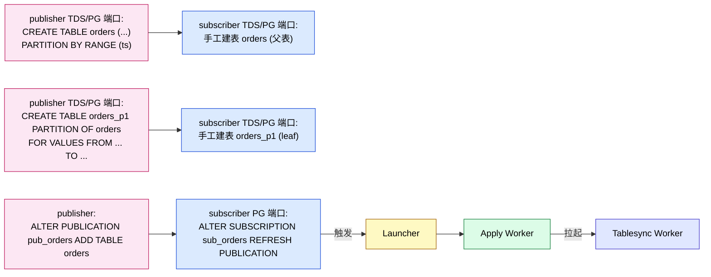
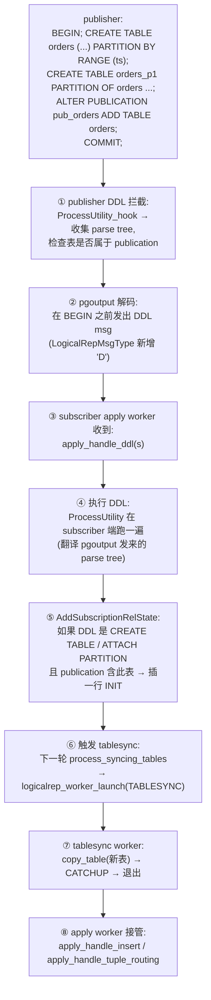
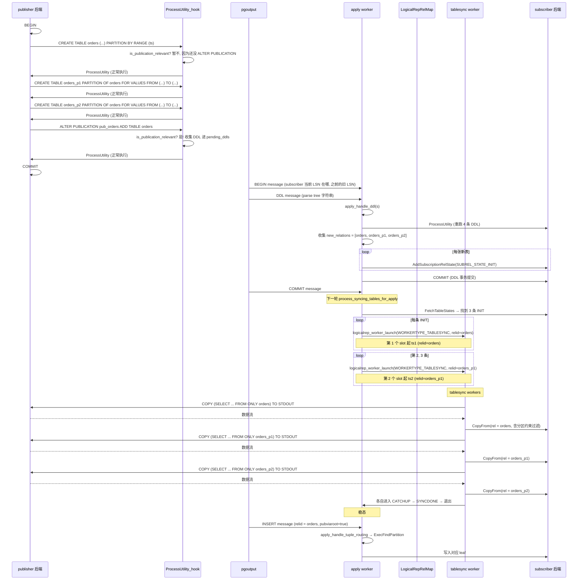
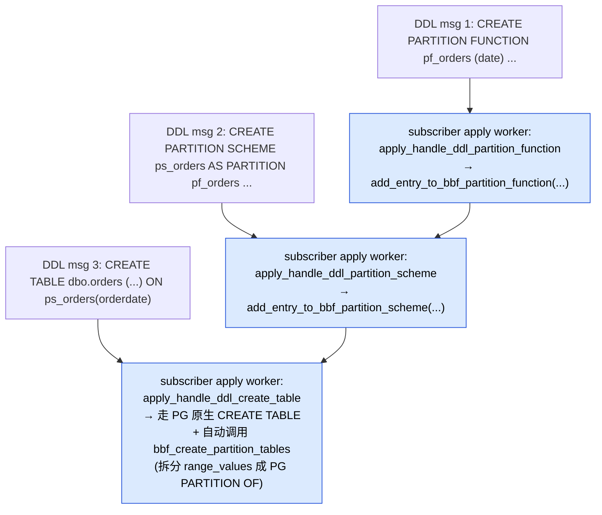
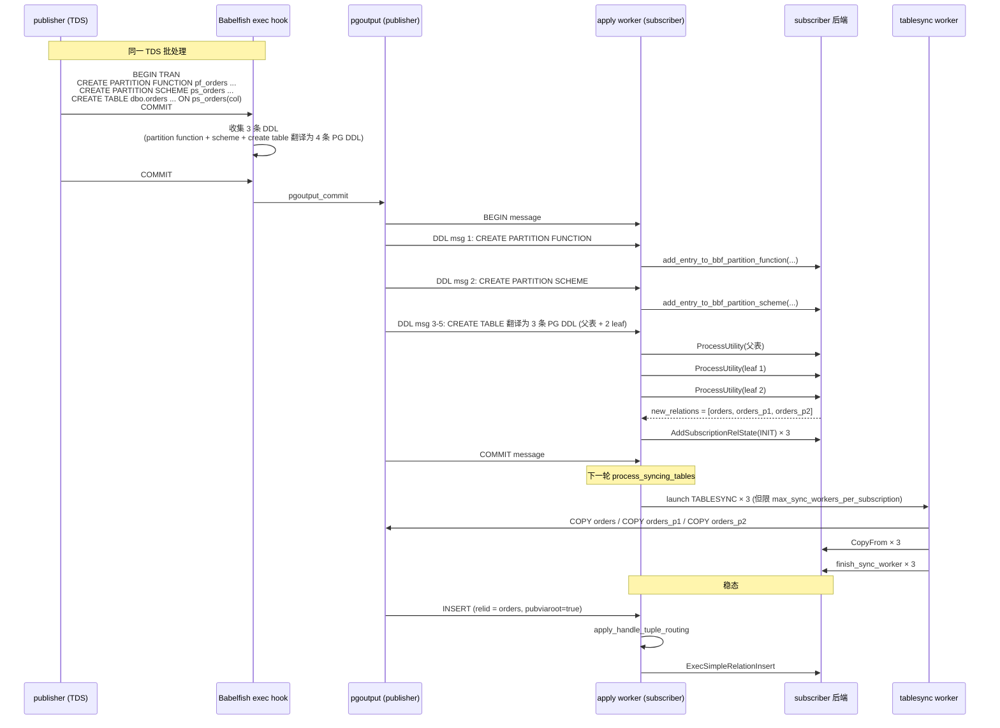
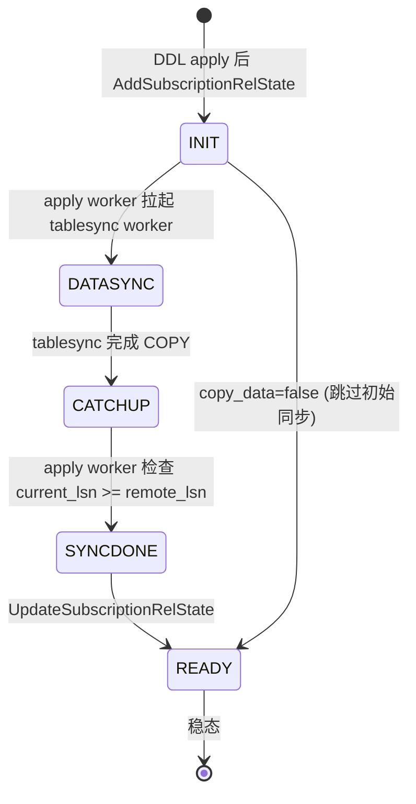

# PostgreSQL 逻辑复制：DDL 同步后如何启动 apply worker 同步 DML（分区表专题）

| 编写人 | 编写内容 | 编写时间 |
| --- | --- | --- |
| growdu | 初稿，结合 PostgreSQL 17 源码 + Babelfish T-SQL 扩展 | 2026-08-24 |

> 本文是 [PostgreSQL 逻辑复制的 Worker 模型](./postgresql-logical-replication-worker-model/index.html) 与 [PostgreSQL 逻辑复制与分区表：从 publisher 到 partition leaf 的全链路](./postgresql-logical-replication-with-partitioned-tables/index.html) 的姊妹篇。
>
> 上一篇讲 "worker 之间的关系"。这一篇专门讲**"DDL 同步落定后到 apply worker 开始同步 DML"** 之间的全部中间步骤。聚焦三个问题：
> 1. publisher 端一条 `CREATE TABLE ... PARTITION OF ...` 是怎么变成 subscriber 端的 apply worker 看到的"我需要给这张新分区表启动一个 sync"？
> 2. 启动的入口是哪一个 worker？tablesync 还是 apply？
> 3. 同步一张分区表（父表 + N 个 leaf）的 DDL 时，**触发的是几张表的 tablesync**？

主要源码路径：
- `~/cwork/postgresql/src/backend/replication/logical/worker.c`
- `~/cwork/postgresql/src/backend/replication/logical/tablesync.c`
- `~/cwork/postgresql/src/backend/replication/logical/relation.c`
- `~/cwork/postgresql/src/backend/replication/pgoutput/pgoutput.c`
- `~/cwork/postgresql/src/backend/replication/logical/launcher.c`
- `~/cwork/postgresql/src/backend/commands/subscriptioncmds.c`
- `~/cwork/postgresql/src/backend/catalog/pg_subscription.c`
- `~/cwork/babelfish_extensions/contrib/babelfishpg_tsql/src/pltsql_partition.c`

---

## 一、先把"现状"和"假设"分开

这一篇讨论的话题在 PG 17 还**没有原生实现**——`pgoutput` 不会发 DDL 消息，`apply worker` 也不处理 DDL 消息。`LOGICAL_REP_MSG_MESSAGE`（'M'）只用于通用消息，**不是 DDL 通道**。

```c
/* src/include/replication/logicalproto.h */
typedef enum LogicalRepMsgType {
    LOGICAL_REP_MSG_BEGIN = 'B',
    LOGICAL_REP_MSG_COMMIT = 'C',
    LOGICAL_REP_MSG_ORIGIN = 'O',
    LOGICAL_REP_MSG_INSERT = 'I',
    LOGICAL_REP_MSG_UPDATE = 'U',
    LOGICAL_REP_MSG_DELETE = 'D',
    LOGICAL_REP_MSG_TRUNCATE = 'T',
    LOGICAL_REP_MSG_RELATION = 'R',     /* 只是 schema 通知, 不是 DDL */
    LOGICAL_REP_MSG_TYPE = 'Y',          /* 只是 type 通知, 不是 DDL */
    LOGICAL_REP_MSG_MESSAGE = 'M',       /* 通用 message, 不被 apply worker 处理 */
    ...
}
```

`apply worker` 的消息分发循环（`worker.c:3383`）：

```c
switch (action) {
    case LOGICAL_REP_MSG_BEGIN:        apply_handle_begin(s); break;
    case LOGICAL_REP_MSG_COMMIT:       apply_handle_commit(s); break;
    case LOGICAL_REP_MSG_INSERT:       apply_handle_insert(s); break;
    case LOGICAL_REP_MSG_UPDATE:       apply_handle_update(s); break;
    case LOGICAL_REP_MSG_DELETE:       apply_handle_delete(s); break;
    case LOGICAL_REP_MSG_TRUNCATE:     apply_handle_truncate(s); break;
    case LOGICAL_REP_MSG_RELATION:     apply_handle_relation(s); break; /* 只更新 relmap */
    case LOGICAL_REP_MSG_TYPE:         apply_handle_type(s); break;     /* 只读不处理 */
    case LOGICAL_REP_MSG_ORIGIN:       apply_handle_origin(s); break;
    case LOGICAL_REP_MSG_MESSAGE:      /* LOGICAL_REP_MSG_MESSAGE 注释原话:
                                          "Logical replication does not use
                                          generic logical messages yet." */
        break;
    ...
}
```

所以下面讨论的内容分两层：

- **A. 当前现状**：PG 没原生 DDL replication，全部要靠手工 `ALTER SUBSCRIPTION ... REFRESH PUBLICATION`。
- **B. 假设 DDL 复制启用后**（pglogical、自研扩展、或 PG 18+ 路线图）：DDL 消息到达 apply worker 后到 DML 同步启动的完整链路。

下面两部分都讲，重点在 B（这是用户问题想要的核心），A 作为对照。

---

## 二、当前现状：DDL 同步后到 apply worker 启动 DML 的链路

### 2.1 全景图



### 2.2 关键步骤的源码定位

`ALTER SUBSCRIPTION ... REFRESH PUBLICATION` 的入口在 `subscriptioncmds.c:1481` 一带。完整流程：

```text
ALTER SUBSCRIPTION ... REFRESH PUBLICATION
   │
   ├─ 1. 连接 publisher: walrcv_connect
   ├─ 2. fetch_table_list(wrconn, sub->publications)
   │       → 拉 publication 成员表清单 (SELECT DISTINCT n.nspname, c.relname, gpt.attrs
   │                                     FROM pg_class c JOIN pg_namespace n
   │                                       JOIN pg_get_publication_tables(...))
   ├─ 3. GetSubscriptionRelations(sub->oid, false)  → 本地清单
   ├─ 4. 对每个 publisher 端表:
   │     relid = RangeVarGetRelid(rv, AccessShareLock, false)  ← 重要: 用 subscriber 本地 OID
   │     CheckSubscriptionRelkind(get_rel_relkind(relid), ...)
   │     if (relid NOT IN subrel_local_oids)
   │         AddSubscriptionRelState(sub->oid, relid, INIT, lsn, retain_lock=true)
   ├─ 5. 清理废弃的 (publisher 端已删除的) relstate
   └─ 6. ApplyLauncherWakeupAtCommit → 拉起 apply worker
```

源码 `subscriptioncmds.c:861` 一带：

```c
pubrel_names = fetch_table_list(wrconn, sub->publications);
subrel_states = GetSubscriptionRelations(sub->oid, false);

foreach(lc, pubrel_names)
{
    RangeVar *rv = (RangeVar *) lfirst(lc);
    Oid relid = RangeVarGetRelid(rv, AccessShareLock, false);   /* ← 在 subscriber 上 lookup */
    CheckSubscriptionRelkind(get_rel_relkind(relid), ...);
    pubrel_local_oids[off++] = relid;
    if (!bsearch(&relid, subrel_local_oids, ...))
    {
        AddSubscriptionRelState(sub->oid, relid,
                                copy_data ? SUBREL_STATE_INIT : SUBREL_STATE_READY, ...);
    }
}
```

注意：**`pg_subscription_rel` 里的 OID 是 subscriber 本地的 OID，不是 publisher 端的**。两边因为 catalog 是各自的，所以同一张逻辑表的 OID 通常不同（除非 DBA 刻意手工 fix OID）。

### 2.3 apply worker 主循环里"发现新表"

apply worker 在 `start_apply` 里循环，每条 message 处理完后调一次 `process_syncing_tables`：

```c
/* tablesync.c:1773 */
static bool process_syncing_tables(XLogRecPtr current_lsn) {
    if (am_apply_worker())
        process_syncing_tables_for_apply(current_lsn);   /* ← 触发 tablesync 拉起 */
    else
        process_syncing_tables_for_sync(current_lsn);
}
```

`process_syncing_tables_for_apply`（`tablesync.c:418`）：

```c
FetchTableStates(&started_tx);   /* 重新扫 pg_subscription_rel */
...
foreach(lc, table_states_not_ready) {
    SubscriptionRelState *rstate = (SubscriptionRelState *) lfirst(lc);

    if (rstate->state == SUBREL_STATE_SYNCDONE) {
        /* apply worker 自己追赶到 tablesync 的 lsn → 标 READY */
        if (current_lsn >= rstate->lsn) {
            rstate->state = SUBREL_STATE_READY;
            UpdateSubscriptionRelState(...);
        }
    }
    else {
        /* 找一个 tablesync worker */
        LWLockAcquire(LogicalRepWorkerLock, LW_SHARED);
        syncworker = logicalrep_worker_find(MyLogicalRepWorker->subid, rstate->relid, false);
        if (syncworker) {
            /* 已经存在 → 检查状态 */
            ...
        }
        else {
            /* 不存在 → 起一个 */
            nsyncworkers = logicalrep_sync_worker_count(MyLogicalRepWorker->subid);
            LWLockRelease(LogicalRepWorkerLock);
            if (nsyncworkers < max_sync_workers_per_subscription) {
                logicalrep_worker_launch(WORKERTYPE_TABLESYNC,
                                         MyLogicalRepWorker->dbid,
                                         MySubscription->oid,
                                         MySubscription->name,
                                         MyLogicalRepWorker->userid,
                                         rstate->relid,
                                         DSM_HANDLE_INVALID);
            }
        }
    }
}
```

**关键观察**：

1. apply worker 始终在跑，主循环每条 message 处理完都会扫一遍 `pg_subscription_rel`。
2. `pg_subscription_rel` 多了 INIT 行的 → 下一轮循环就被发现 → 起 tablesync。
3. tablesync worker 起多少个取决于 `pg_subscription_rel` 有多少 INIT 行，**不是由分区表的 leaf 数决定**。

---

## 三、假设 DDL replication 启用后的链路

### 3.1 总体设计骨架

DDL replication 不存在，需要扩展。这里讨论**假设有 DDL replication 之后**的完整链路。设计骨架：



### 3.2 阶段一：publisher 端 DDL 拦截

在 `ProcessUtility` 阶段挂一个 hook，把 DDL 抓出来。PG 现成 hook：`ProcessUtility_hook`。

```c
/* 在 PGOutputData 里加一个 list 收集 DDL */
typedef struct PGOutputData {
    ...
    List *pending_ddls;  /* 在事务内累积的 DDL parse tree 列表 */
    bool   publication_includes_creating_table;
} PGOutputData;

/* hook 实现 */
static void logicalrep_ddl_hook(PlannedStmt *pstmt, const char *queryString,
                                bool readOnlyTree, ProcessUtilityContext context,
                                ParamListInfo params, QueryEnvironment *env,
                                DestReceiver *dest, QueryCompletion *qc) {
    /* 调用 PG 原生 ProcessUtility */
    prev_ProcessUtility(pstmt, queryString, readOnlyTree, context,
                        params, env, dest, qc);

    /* 只关心在 publication 里的表的 DDL */
    if (is_publication_relevant(pstmt)) {
        /* 抓出 parse tree, 加到 PGOutputData */
        add_pending_ddl(my_data, copyObject(pstmt));
    }
}
```

什么时候挂？**只在 apply worker / tablesync worker 持有的 publisher 会话里挂**。这样只有"被订阅的表"的 DDL 才被复制。

### 3.3 阶段二：pgoutput 在事务结束发 DDL 消息

`pgoutput.c` 现在 `pgoutput_commit`（约 2093 行）只发 `LOGICAL_REP_MSG_COMMIT`。要扩展成：

```c
static void pgoutput_commit(LogicalDecodingContext *ctx, ReorderBufferTXN *txn,
                            XLogRecPtr commit_lsn) {
    PGOutputData *data = (PGOutputData *) ctx->output_plugin_private;

    /* 先发 BEGIN */
    pgoutput_send_begin(ctx, txn);

    /* 再发 DDL (如果有) */
    foreach(lc, data->pending_ddls) {
        PlannedStmt *pstmt = (PlannedStmt *) lfirst(lc);
        OutputPluginPrepareWrite(ctx, true);
        logicalrep_write_ddl(ctx->out, txn->xid, commit_lsn,
                             nodeToString(pstmt),   /* parse tree 序列化 */
                             pstmt->stmt_location,
                             pstmt->stmt_len);
        OutputPluginWrite(ctx, true);
    }

    /* 最后发 COMMIT */
    pgoutput_send_commit(ctx, txn, commit_lsn);
}
```

注意几个设计选择：

1. **DDL 必须在 COMMIT 之后才发**，否则 subscriber 端 apply DDL 后 publisher 回滚就出现"subscriber 多了表 / publisher 没多"的鬼影。
2. **DDL 跟 commit_lsn 绑定**，subscriber 端可以用同样的 lsn 做 origin tracking。
3. **DDL 是 raw parse tree 字符串**——不用关心 publisher / subscriber 的 OID 一致性，因为 `ProcessUtility` 重新跑一遍会自己分配。

### 3.4 阶段三：subscriber apply worker 收到 DDL

`worker.c` 现有 `apply_dispatch` 里加一个新 case：

```c
case LOGICAL_REP_MSG_DDL:                 /* 新增消息类型 'D' */
    apply_handle_ddl(s);
    break;
```

`apply_handle_ddl` 实现：

```c
static void apply_handle_ddl(StringInfo s) {
    if (handle_streamed_transaction(LOGICAL_REP_MSG_DDL, s))
        return;

    /* 反序列化 parse tree */
    char *ddl_string = logicalrep_read_ddl(s);
    Node *raw_parse = stringToNode(ddl_string);

    /* 在 begin_replication_step() 里起的事务里执行 */
    PlannedStmt *pstmt = makeNode(PlannedStmt);
    pstmt->commandType = CMD_UTILITY;
    pstmt->utilityStmt = raw_parse;

    /* 检查权限 */
    if (!is_skipping_changes()) {
        /* 跑 DDL */
        ProcessUtility(pstmt, "DDL replicated from publisher",
                       false, PROCESS_UTILITY_SUBCOMMAND, ...);

        /* 收集 DDL 影响到的 relation 列表, 后续处理 */
        List *new_relations = collect_created_relations_from_ddl(pstmt);
        foreach(lc, new_relations) {
            Oid relid = lfirst_oid(lc);
            if (is_table_in_any_publication(pstmt, relid)) {
                AddSubscriptionRelState(MySubscription->oid, relid,
                                        SUBREL_STATE_INIT, InvalidXLogRecPtr, false);
            }
        }
    }
}
```

### 3.5 阶段四：同步时序（分区表专门细化）

我们以"建一张分区表 + 两个 leaf"为例走一遍：



### 3.6 关键设计：DDL 触发的是几张表的 tablesync？

| DDL 类型 | 影响 relation 数 | 触发 tablesync 的 relid |
| --- | --- | --- |
| `CREATE TABLE orders ... PARTITION BY RANGE` | 1 (父表) | 父表 OID |
| `CREATE TABLE orders_p1 PARTITION OF orders` | 1 (leaf) | leaf OID |
| `ALTER TABLE orders ATTACH PARTITION orders_p1` | 1 (leaf 加入) | leaf OID |
| `ALTER TABLE orders DETACH PARTITION orders_p1` | 1 (leaf 离开) | 无（leaf 不再发事件） |
| `ALTER TABLE orders_p1 ADD COLUMN x int` | 1 (leaf schema 变) | leaf OID（可能重新 sync） |
| `DROP TABLE orders_p1` | 1 | 从 `pg_subscription_rel` 删行 |
| `ALTER PUBLICATION pub_orders ADD TABLE orders` | 1（隐式订阅） | 父表 OID |

**关键事实**：

1. **DDL 触发的 tablesync 数 = `pg_subscription_rel` 里新增的 INIT 行数**，不是 leaf 总数。
2. 如果 publisher 端只 `ALTER PUBLICATION ... ADD TABLE orders`（只挂父表），那么 subscriber 端的 `pg_subscription_rel` 只插**一行**（父表），起**一个 tablesync worker**——不管 partition tree 有多少 leaf。
3. DDL **不能**自动合并多个相关 ALTER（比如 CREATE TABLE + ATTACH PARTITION 写成两步）。每一步各自触发一次 DDL message、各自 AddSubscriptionRelState。但因为 process_syncing_tables_for_apply 在 apply worker 主循环的每条 message 后都跑，**多个 INIT 行会在多轮循环里陆续被启动 tablesync**。

### 3.7 缓存层：`pgoutput` 的 `RelationSyncCache`

publisher 端每次 DDL 后，**`RelationSyncCache` 会被清空**（`pgoutput.c:438`）：

```c
if (RelationSyncCache) {
    hash_destroy(RelationSyncCache);
    RelationSyncCache = NULL;
}
```

这样下一个 change 事件来时，会重新 fetch schema。subscriber 侧的 `LogicalRepRelMap` 类似——`logicalrep_partmap_reset_relmap`（`relation.c:571`）也会清。

DDL 到达 subscriber 后，apply worker 调 `apply_handle_ddl` 内部执行 `ProcessUtility`，**subscriber 自己的 cache 通过标准 `CacheInvalidateRelcacheByRelid` 链**自动失效（`inval.c:1685`）。所以 DDL 完成后下一次 apply change 时 `logicalrep_rel_open` 会重新拉 schema。

---

## 四、apply worker 启动 tablesync 的精细流程

### 4.1 入口：`process_syncing_tables_for_apply`

`tablesync.c:418` 的核心循环，已经在 §2.3 看过。值得特别讲的是它**每个 message 处理完都跑**：

```c
/* 在 apply worker 主循环里, 每次 handle 完一条 message */
apply_dispatch(&s);
process_syncing_tables(current_lsn);
```

所以**新表的 sync 启动延迟 = "处理完下一条 message 的时间"**，通常几毫秒级。

### 4.2 "AddSubscriptionRelState 的瞬时一致性"

`AddSubscriptionRelState`（`pg_subscription.c:267`）：

```c
void AddSubscriptionRelState(Oid subid, Oid relid, char state,
                             XLogRecPtr sublsn, bool retain_lock) {
    Relation rel = table_open(SubscriptionRelRelationId, RowExclusiveLock);
    HeapTuple tup = SearchSysCacheCopy2(SUBSCRIPTIONRELMAP,
                                         ObjectIdGetDatum(relid),
                                         ObjectIdGetDatum(subid));
    if (HeapTupleIsValid(tup))
        elog(ERROR, "subscription table %u in subscription %u already exists",
             relid, subid);
    ...
    CatalogTupleInsert(rel, tup);
    ...
}
```

注意它检查"已存在就报错"——所以如果 publisher 端发了同一条 CREATE TABLE 两次（重复），subscriber 第二次会直接报错。这就是为什么**DDL 必须幂等**：subscriber 端不能在已经存在的表上再 apply 一次 `CREATE TABLE`。要么 publisher 端用 `CREATE TABLE IF NOT EXISTS`，要么 apply worker 跳过 ERROR 改成 NOTICE。

### 4.3 tablesync 启动的限制

apply worker 在调用 `logicalrep_worker_launch` 之前会检查：

```c
if (nsyncworkers < max_sync_workers_per_subscription) {
    /* 起 worker */
    logicalrep_worker_launch(WORKERTYPE_TABLESYNC, ...);
}
```

DDL 同步如果一下子引入 100 张新表（不可能但假设），apply worker 在 100 个 message 内**只能起 `max_sync_workers_per_subscription` 个 tablesync**（默认 2）。剩下的 98 张 INIT 行**一直在 `pg_subscription_rel` 里排队**，等前一批 tablesync 完成、slot 释放后再起下一批。

这是 DDL 同步后大批量建表的"瓶颈点"。

### 4.4 多层分区（嵌套分区）的特殊处理

```sql
-- publisher: 嵌套分区
CREATE TABLE orders (...) PARTITION BY RANGE (ts);
CREATE TABLE orders_2024 PARTITION OF orders
    FOR VALUES FROM ('2024-01-01') TO ('2025-01-01')
    PARTITION BY LIST (region);
CREATE TABLE orders_2024_cn PARTITION OF orders_2024 FOR VALUES IN ('CN');
```

DDL message 到达后，subscriber 端的 `apply_handle_ddl` 跑这三条 DDL。`new_relations` 集合是：

- `orders`（父表）
- `orders_2024`（中间层）
- `orders_2024_cn`（leaf）

→ `AddSubscriptionRelState` 插 3 行。

如果 publication 里只 `ADD TABLE orders`，3 张表都被加入 `pg_subscription_rel`——**嵌套分区的每一层都被独立同步**。这是为什么 `pubviaroot = true` 在嵌套分区里更重要。

### 4.5 父子表都加进 publication 时的处理

```sql
ALTER PUBLICATION pub_orders ADD TABLE orders;
ALTER PUBLICATION pub_orders ADD TABLE orders_p1;
ALTER PUBLICATION pub_orders ADD TABLE orders_p2;
```

DDL 同步后 `pg_subscription_rel` 出现 **3 行**：

```
srrelid   | srsubstate
----------+------------
orders    | i   (INIT)
orders_p1 | i   (INIT)
orders_p2 | i   (INIT)
```

tablesync worker 起 3 个（或 `max_sync_workers_per_subscription` 限制下陆续起 3 个）。**每个 leaf 单独做 COPY**。

如果 publisher 端用的是 `pubviaroot = false`（默认），INSERT 事件以 leaf OID 上报，subscriber 的 leaf 已经存在（同步阶段建的），apply 直接生效。

如果 `pubviaroot = true`，INSERT 事件以父表 OID 上报 + attrmap。apply worker 走 `apply_handle_tuple_routing` 路由到 leaf，但因为 leaf 是同步阶段建的本地表，**OID 不同**——这正是 `logicalrep_partition_open` + `execute_attr_map_slot` 要解决的问题。

---

## 五、Babelfish T-SQL 模式下的 DDL 同步

### 5.1 两套 metadata 同时同步

T-SQL 模式下，分区表的 DDL 涉及**两张 Babelfish metadata 表** + **PG 原生 catalog**：

| 操作 | Babelfish metadata 表 | PG catalog |
| --- | --- | --- |
| `CREATE PARTITION FUNCTION pf_orders (date) ...` | `sys.babelfish_partition_function` 插行 | （无） |
| `CREATE PARTITION SCHEME ps_orders AS PARTITION pf_orders ...` | `sys.babelfish_partition_scheme` 插行 | （无） |
| `CREATE TABLE t (...) ON ps_orders(col)` | （无） | `pg_class` + `pg_partitioned_table` + 一组 leaf |

DDL 同步时要**依次同步**这三种对象：



### 5.2 partition function/scheme 的同步顺序敏感性

`add_entry_to_bbf_partition_scheme`（`pl_exec-2.c:4680` 一带）会校验 `partition_function_exists`，所以**scheme 必须在 function 之后**同步。如果 publisher 端把多条 DDL 包在一个事务里，subscriber 端 apply worker **必须按顺序逐条 apply**——这就要求 DDL message 不能乱序。

PG 现有的 `pgoutput_commit` 已经保证事务内的 message 顺序（按 commit_lsn 排序），所以这一点天然满足。

### 5.3 `bbf_create_partition_tables` 的内部展开

当 subscriber 端 apply worker 收到 `CREATE TABLE dbo.orders (...) ON ps_orders(col)` 的 DDL：

```c
static void apply_handle_ddl_create_table(...) {
    /* 调 Babelfish 的 bbf_create_partition_tables */
    PlannedStmt *expanded = bbf_expand_partition_create_table(pstmt);

    /* expanded 现在变成多条 PG 原生 CREATE TABLE */
    /* 顺序:
       1. CREATE TABLE orders (...) PARTITION BY RANGE (col)  (父表)
       2. CREATE TABLE orders_p1 PARTITION OF orders FOR VALUES FROM (...) TO (...)
       3. CREATE TABLE orders_p2 PARTITION OF orders FOR VALUES FROM (...) TO (...)
       ...
    */

    foreach(child_stmt, expanded) {
        ProcessUtility(child_stmt, ...);
    }
}
```

这与 §3.5 的多 relation 处理合一：`new_relations` 收集的是展开后的多个 OID（父表 + 所有 leaf）。

### 5.4 Babelfish 模式下 tablesync 启动的特点

Babelfish 模式下：

1. **DDL 同步**：Babelfish 的 partition function/scheme 用 `add_entry_to_bbf_partition_function/scheme` 落 `sys` schema，CREATE TABLE 用 PG 原生。
2. **DDL 同步后**：`AddSubscriptionRelState(INIT)` 仍然插在 `pg_subscription_rel` 里。
3. **tablesync 启动**：apply worker 在主循环里扫到 INIT，调 `logicalrep_worker_launch(TABLESYNC, relid=父表 OID)`。
4. **tablesync COPY**：走 `copy_table`，`COPY (SELECT ... FROM ONLY orders) TO STDOUT`——partition routing 在 publisher 端完成（每个 leaf 自己的 `pg_partitioned_table` 元信息），不依赖 Babelfish 的 partition function/scheme。
5. **增量 apply**：从 publisher 端 `pgoutput` 出来的 INSERT 走 `apply_handle_tuple_routing` + `ExecFindPartition`，**纯 PG 原生路径**，Babelfish 的 partition metadata 只在 `$PARTITION.<func>(col)` 这种元查询时被用到。

所以 Babelfish 模式下 DDL 同步后到 tablesync 启动的流程**与 PG 原生完全一样**，只是 DDL 解析层多了一层 T-SQL 翻译。

---

## 六、完整的端到端时序（含 PG 和 Babelfish 两种 DDL 同步方式）

### 6.1 PG 原生 DDL 同步（假设）

```mermaid
sequenceDiagram
  participant Pub as publisher
  participant HookPub as publisher ProcessUtility_hook
  participant Dec as pgoutput (publisher)
  participant Apply as apply worker (subscriber)
  participant Sub as subscriber 后端
  participant TS as tablesync worker

  Note over Pub,HookPub: 同一事务
  Pub->>HookPub: BEGIN; CREATE TABLE orders ...; CREATE TABLE orders_p1 PARTITION OF ...; ALTER PUBLICATION pub_orders ADD TABLE orders; COMMIT;
  HookPub->>HookPub: 收集 DDL parse tree (3 条)
  Pub->>HookPub: COMMIT
  HookPub->>Dec: pgoutput_commit
  Dec->>Apply: BEGIN message
  Dec->>Apply: DDL message (3 条)
  Apply->>Sub: ProcessUtility × 3
  Sub-->>Apply: new_relations = [orders, orders_p1]
  Apply->>Sub: AddSubscriptionRelState(INIT) × 2
  Dec->>Apply: COMMIT message
  Apply->>Sub: ApplyMessageContext reset

  Note over Apply: 下一轮 process_syncing_tables
  Apply->>TS: logicalrep_worker_launch(TABLESYNC, relid=orders)
  Apply->>TS: logicalrep_worker_launch(TABLESYNC, relid=orders_p1)
  TS->>Dec: COPY orders
  Dec-->>TS: 数据
  TS->>Sub: CopyFrom(orders)
  TS->>Dec: COPY orders_p1
  Dec-->>TS: 数据
  TS->>Sub: CopyFrom(orders_p1)
  TS->>Sub: finish_sync_worker

  Note over Apply,Sub: 稳态 apply
  Dec->>Apply: INSERT (relid = orders, pubviaroot=true)
  Apply->>Apply: apply_handle_tuple_routing → ExecFindPartition
  Apply->>Sub: ExecSimpleRelationInsert(partrelinfo, slot)
```

### 6.2 Babelfish T-SQL DDL 同步（假设）



---

## 七、catch-up 协议（apply worker 与 tablesync worker 协同）

DDL 同步后新建的 `pg_subscription_rel` 行和老的 rows 走完全一样的 catch-up 流程。简单回顾一下关键节点：



每一步都通过 `pg_subscription_rel.srsubstate` + `srsublsn` + shared memory 的 `LogicalRepWorker` 状态共享。**关键不变量**：DDL 同步落定的 `CommitLSN` 之后，subscriber 侧的 apply worker 才允许把这张表的状态从 INIT 推进（避免"DDL 还没落库，tablesync 已经在 COPY"的竞态）。

要保证这点，DDL message 的 `commit_lsn` 必须**等于** `AddSubscriptionRelState` 时用的 `sublsn`——这就是为什么 §3.3 里要把 DDL message 和 COMMIT message 共用同一个 `commit_lsn`。

---

## 八、几个边界情况

### 8.1 publisher 端 DDL 失败

DDL 在 publisher 失败 → 事务回滚 → `pgoutput_commit` 不发 DDL message → subscriber 端 apply worker 看不到任何东西。**完全幂等**，没问题。

### 8.2 subscriber 端 apply DDL 失败

- 比如 subscriber 端已经有同名表（重复 apply）→ `apply_handle_ddl` 应该捕获 ERROR 并跳到 NOTICE，**而不是 abort apply worker**。
- 失败处理函数 `pg_subscription_disable_on_error`：`disable_on_err = true` → DisableSubscriptionAndExit，`disable_on_err = false` → 重试到下次 message。

### 8.3 DDL 之间存在依赖

比如 `CREATE PARTITION FUNCTION` 必须在 `CREATE PARTITION SCHEME` 之前。如果 publisher 用一个事务包起来，pgoutput 保证顺序；如果 publisher 用多个事务，DDL 之间的事务边界会**暴露中间状态**——subscriber 端可能在中间状态查到 `partition function/scheme` 不一致。

建议：分区表的所有 DDL 用一个事务包起来。

### 8.4 DDL 改变 leaf 数量但 publisher 上 ALTER PUBLICATION 没改

```sql
-- publisher
CREATE TABLE orders ... PARTITION BY RANGE (ts);  -- 父表
ALTER PUBLICATION pub_orders ADD TABLE orders;      -- 只挂父表
CREATE TABLE orders_p1 PARTITION OF orders ...;     -- 新加 leaf, 不用 ADD TABLE

-- subscriber 端 DDL 同步:
-- CREATE TABLE orders ✓
-- ALTER PUBLICATION (这条 subscriber 不需要执行, 是 publication 元数据)
-- CREATE TABLE orders_p1 ✓
-- → AddSubscriptionRelState(orders)  ← 只插 1 行 (父表)
-- orders_p1 不会被独立 sync, 但因为 orders 已经订阅, apply_handle_tuple_routing 会处理 orders_p1
```

这种"父表被订阅 + leaf 单独 DDL"是**最干净的路径**——DDL message 只触发 1 行 `pg_subscription_rel`，tablesync worker 只 1 个。

### 8.5 publisher 上 DROP TABLE

```sql
DROP TABLE orders CASCADE;
```

DDL 同步到 subscriber → subscriber 也 DROP TABLE → 但 `pg_subscription_rel` 里那张行还在。

→ apply worker 下一轮 `process_syncing_tables_for_apply` 会发现 `RangeVarGetRelid(rv, ...)` 拿不到 OID → 报错。

需要在 `apply_handle_ddl` 检测到 DROP 之后，主动 `RemoveSubscriptionRel(subid, relid)` 清理 `pg_subscription_rel` 行。

---

## 九、修改指南：要让 DDL replication 工作，要动哪些文件

### 9.1 publisher 端

| 文件 | 改动 |
| --- | --- |
| `src/backend/replication/pgoutput/pgoutput.c` | `pgoutput_commit` 之前先把 pending DDL 发出去；新增 `LOGICAL_REP_MSG_DDL` 写出函数 |
| `src/include/replication/logicalproto.h` | `LogicalRepMsgType` 加 `'D'`；新增 `logicalrep_write_ddl` / `logicalrep_read_ddl` |
| `src/backend/replication/logical/proto.c` | 实现 `logicalrep_write_ddl` / `logicalrep_read_ddl` |
| 新增 hook（建议放 `src/backend/replication/logical/pgoutput_ddl.c`） | `ProcessUtility_hook` 收集 DDL parse tree |
| `src/backend/utils/hook/hook.c`（如果用标准 hook 机制） | 注册 hook |

### 9.2 subscriber 端

| 文件 | 改动 |
| --- | --- |
| `src/backend/replication/logical/worker.c` | `apply_dispatch` 加 `case LOGICAL_REP_MSG_DDL: apply_handle_ddl(s)`；新增 `apply_handle_ddl` 实现 |
| `src/backend/replication/logical/worker.c` | 在 `apply_handle_ddl` 内部调 `ProcessUtility`，跑完 DDL 后收集 `new_relations`，对每个 new_rel 调 `AddSubscriptionRelState(INIT)` |
| `src/backend/catalog/pg_subscription.c` | 把 `AddSubscriptionRelState` 提到 public API（已经是），并加可选的 `if (exists) skip` 行为 |
| `src/backend/utils/adt/subscript`（如果有） | 同步 drop table 时 `RemoveSubscriptionRel` |

### 9.3 Babelfish 端

| 文件 | 改动 |
| --- | --- |
| `src/pltsql_partition.c` | 在 `exec_stmt_partition_function` / `exec_stmt_partition_scheme` 后面加 hook 调用，把 partition function/scheme DDL 发出去 |
| `src/pltsql_partition.c` 或新建 | 新增 `apply_handle_ddl_partition_function` / `apply_handle_ddl_partition_scheme`：在 subscriber 端调 `add_entry_to_bbf_partition_function` / `add_entry_to_bbf_partition_scheme` |
| `src/pl_handler.c` | 在 `bbf_create_partition_tables` 路径加 hook 调用，把翻译后的多条 CREATE TABLE 一并发出去 |
| `src/catalog.c` | `bbf_partition_function_oid` / `bbf_partition_scheme_oid` 已经是 export，不需要改 |

### 9.4 跨 worker 的状态协调

DDL 同步的最大难点是**跨 worker 状态一致性**：

1. apply worker 跑了 DDL，process_syncing_tables 拉起 tablesync。
2. tablesync worker 跑 COPY，但 publisher 的 apply worker 还在跑别的事务——这两个 worker 之间没有直接通信，全靠 `pg_subscription_rel.srsublsn`。
3. tablesync worker 自己也有 `LogicalRepWorker` 在共享内存里，被 apply worker 用 LWLock + spinlock 协同。

要加 DDL 同步而不出 bug，**核心是保证 DDL message 的 commit_lsn 和 `AddSubscriptionRelState` 时记录的 srsublsn 一致**。这条不变量一旦破坏，apply worker 可能"已经 apply 了 DDL 但还没起 tablesync" 期间 publisher 推过来的 INSERT 就会落到"subscriber 端还没创建"的 leaf 上，触发 `apply_handle_tuple_routing` 报"no partition found"。

---

## 十、结语

分区表让 DDL 同步到 apply worker 启动 DML 这条链路多了三层关注点：

| 层级 | 关注点 |
| --- | --- |
| **publisher DDL 拦截** | 只复制属于 publication 的 DDL；DDL 必须在 commit 后才发 |
| **subscriber apply DDL** | 翻译 + 执行 + 收集 new_relations + AddSubscriptionRelState；幂等处理 |
| **tablesync 启动** | apply worker 主循环里 `process_syncing_tables_for_apply` 每条 message 后扫；受 `max_sync_workers_per_subscription` 限制 |
| **catch-up 协议** | tablesync 完成 COPY 后追 apply worker 的 current_lsn；追上了才能 READY |
| **DDL 一致性不变量** | DDL commit_lsn = `pg_subscription_rel.srsublsn`（保证不会 INSERT 先到 leaf 还没建） |

PG 原生模式靠手工 `REFRESH PUBLICATION` 绕过这一切。Babelfish 模式多一层 partition function/scheme metadata 同步。一旦 DDL replication 真的合入 PG 主干（pglogical 风格或 PG 18+），上面这套设计骨架就是落地模板。

分区表的 leaf 数不会影响 apply worker 启动数量——这仍然是**一个父表对应一行 `pg_subscription_rel`、一个 tablesync worker**。DDL 同步后的"批量建表"瓶颈只在 tablesync worker pool，而不在 apply worker 上。

> 想理解 worker 之间的依赖关系，参考 [PostgreSQL 逻辑复制的 Worker 模型](./postgresql-logical-replication-worker-model/index.html)。
> 想看完整的 DML 路由流程，参考 [PostgreSQL 逻辑复制与分区表](./postgresql-logical-replication-with-partitioned-tables/index.html)。
