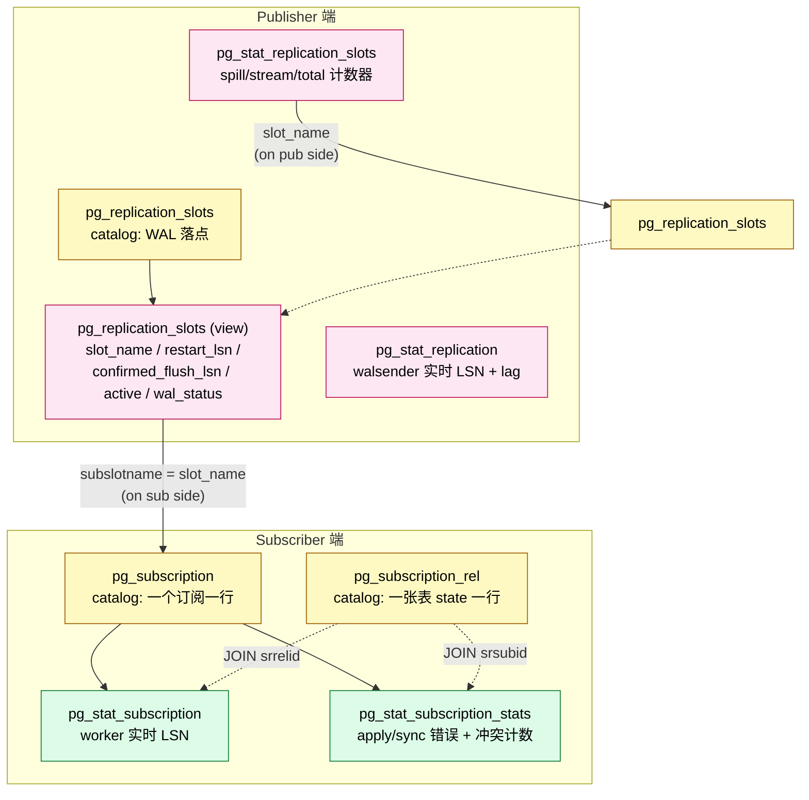
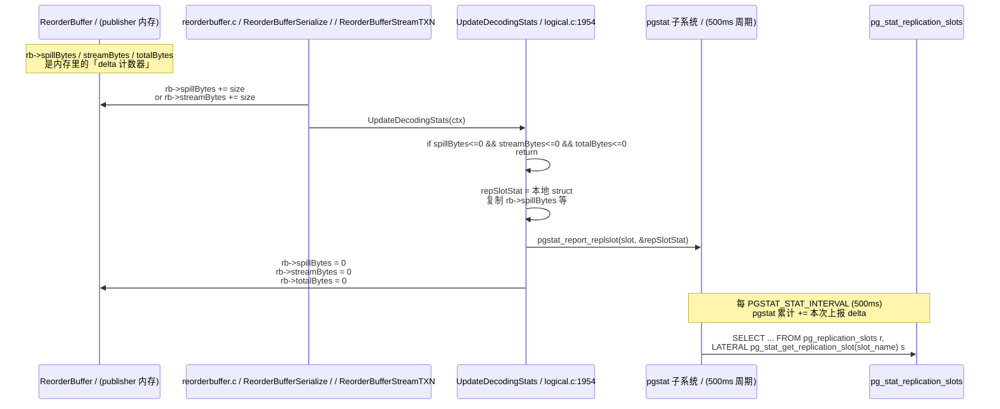
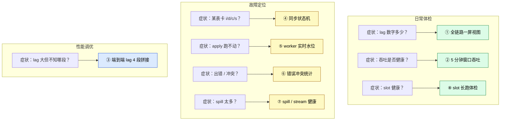
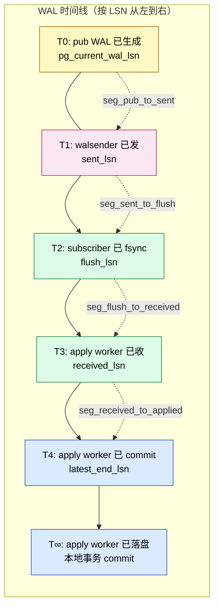
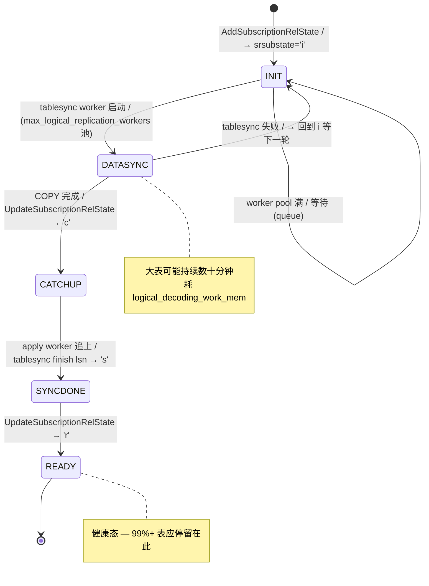
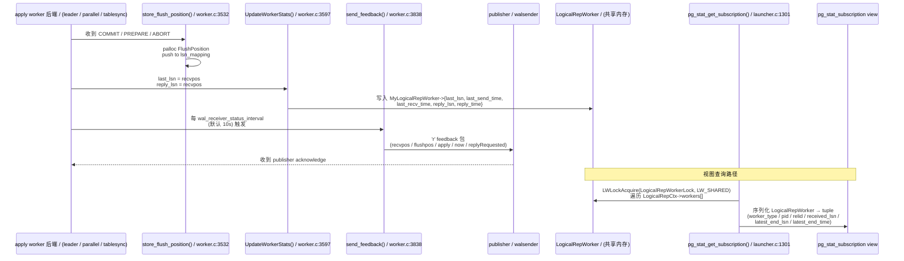
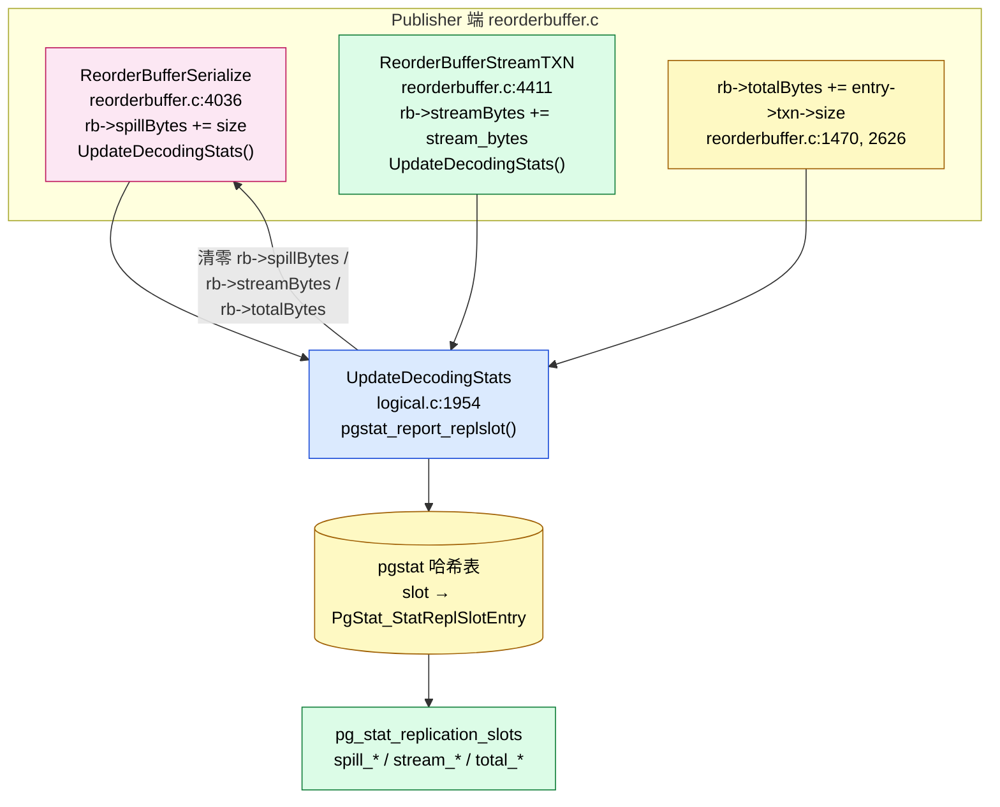
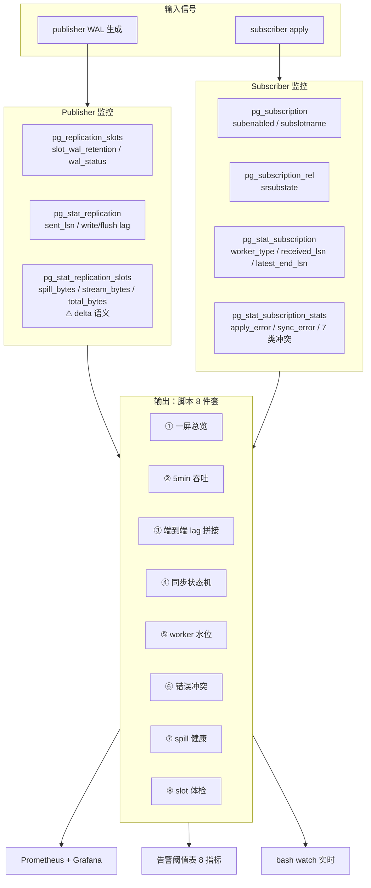

# PostgreSQL 逻辑复制的监控：六张视图 + 一组可执行 SQL，把 publisher/subscriber 的速率与健康度彻底看透

| 编写人 | 编写内容 | 编写时间 |
| --- | --- | --- |
| growdu | 初稿，结合 PostgreSQL 18 dev 源码 + 6 张系统视图 + 8 个端到端可执行脚本 | 2026-08-27 |

> 本文是「PostgreSQL 逻辑复制系列」的第 N 篇。配套源码版本：PostgreSQL 18 dev（`~/cwork/postgresql`）。同系列前文：
>
> - [PostgreSQL 逻辑复制表的生命周期：从 `pg_replication_slots` 到 `pg_subscription_rel` 的全景图](./postgresql-logical-replication-tables-lifecycle/index.html)
> - [PostgreSQL 逻辑复制的 worker 模型：launcher、apply worker、tablesync worker 的进程拓扑](./postgresql-logical-replication-worker-model/index.html)
> - [PostgreSQL 逻辑复制 streaming 与 spill：从 reorderbuffer 到 `<subid>-<xid>.changes` 的全程真相](./postgresql-logical-replication-streaming-spill/index.html)
> - [PostgreSQL 逻辑复制订阅参数全解：从 run_as_owner 到 disable_on_error](./postgresql-logical-replication-options/index.html)
> - [PostgreSQL 逻辑复制 spill 文件深度拆解：写-读-清 三阶段与 TPC-C 100WH 增长模型](./postgresql-logical-replication-spill-deep-dive/index.html)

监控逻辑复制这件事，"看 `pg_stat_subscription` 一眼够不够？"——**不够**。原因有三：

1. **视图分两层**：publisher 端是 `pg_stat_replication` + `pg_stat_replication_slots` + `pg_replication_slots`，subscriber 端是 `pg_stat_subscription` + `pg_stat_subscription_stats` + `pg_subscription_rel`。只看一边，等于闭一只眼看路况。
2. **速率 ≠ 累加值**：`pg_stat_replication_slots` 的 `spill_bytes / stream_bytes / total_bytes` 是**自上次报告以来的 delta**——`UpdateDecodingStats()` 在上报完就会把 `ReorderBuffer` 上的计数器清零。所以"今天 spill 了多少"必须用**窗口差分**算，不能直接拿当前的累计值。
3. **延迟有 4 段**：publisher WAL 已生成 → walsender 已发出 → apply worker 已收到 → 已 apply commit。这 4 段对应 4 个不同 LSN，**哪一段大，定位方向完全不同**。只看 `latest_end_lsn`，等于只看到路口不看到高速。

本文用一张 ER 图把六张视图 + 三张 catalog 表串起来，再给出 **8 个端到端可执行脚本**（覆盖：全链路一屏、5 分钟窗口吞吐、4 段 lag 拼接、sync 状态机、worker 水位、错误冲突、spill 健康、slot 长跑体检），最后给出 bash 实时刷新 + Prometheus 接入 + 告警阈值表 + 修改指南**。看完全文，复制粘贴即可上线一套生产可用的逻辑复制监控。

---

## 一、先看一张图：六视图 + 三表的总线

逻辑复制的监控数据源不是一张表，而是 publisher / subscriber 各自有 3 张视图 + 1 张目录表，**两条线在 `slot_name` 上握手**。把这条总线画清楚后，后面的 SQL 都是这条总线的不同视角。



> **这张图最重要的观察**：
>
> - 视图与 catalog 表的对应关系——`pg_replication_slots` 既是 catalog 也是同名 view，**二者字段集合不同**；`pg_subscription` 是 catalog，监控字段全在 `pg_stat_subscription` view 里。
> - `pg_stat_subscription` 与 `pg_subscription_rel` 之间**没有 JOIN 键**（一个是 worker 行，一个是表 state 行），需用 `pg_subscription` 做中间表。
> - 同一份 `slot_name` 在 publisher / subscriber 各有一份引用：publisher 上是 catalog 表里 `pg_replication_slots.slot_name`，subscriber 上是 `pg_subscription.subslotname`。任何"slot 健康"SQL 必须能串起这两边。

---

## 二、Publisher 端：三视图逐字段精解

Publisher 端要回答的问题是 **"WAL 写到哪里、被谁消费、消费速度如何"**。三张视图分别答这三件事：

### 2.1 `pg_replication_slots` —— WAL 落点 + 保留位

`pg_replication_slots` 同时是 catalog 表和 view，**字段集合不同**。视图的字段如下，源码 `~/cwork/postgresql/src/backend/catalog/system_views.sql:1019`：

```sql
CREATE VIEW pg_replication_slots AS
    SELECT
        L.slot_name,
        L.plugin,
        L.slot_type,
        L.datoid,
        D.datname AS database,
        L.temporary,
        L.active,
        L.active_pid,
        L.xmin,
        L.catalog_xmin,
        L.restart_lsn,
        L.confirmed_flush_lsn,
        L.wal_status,
        L.safe_wal_size,
        L.two_phase,
        L.two_phase_at,
        L.inactive_since,
        L.conflicting,
        L.invalidation_reason,
        L.failover,
        L.synced
    FROM pg_get_replication_slots() AS L
            LEFT JOIN pg_database D ON (L.datoid = D.oid);
```

字段含义分四组：

| 分组 | 字段 | 监控意义 |
| --- | --- | --- |
| 身份 | `slot_name`, `plugin`, `slot_type`, `datoid`, `database` | 哪个 slot、output 插件、physical / logical |
| 实时 | `active`, `active_pid` | 是否在用、walsender PID |
| LSN | `restart_lsn`, `confirmed_flush_lsn` | 解码起点 / subscriber 已确认 flush |
| 健康 | `wal_status` (`reserved`/`extended`/`unreserved`/`lost`), `safe_wal_size`, `two_phase`, `inactive_since`, `conflicting`, `invalidation_reason`, `failover`, `synced` | WAL 是否会被回收、是否失效、是否备援 |

**监控必看三字段**：

- `restart_lsn` 与 `confirmed_flush_lsn` 之差 = **subscriber 没消费完的 WAL 字节数**。
- `wal_status = 'lost'` —— **致命**：subscriber 失联太久了，slot 对应的 WAL 已被回收，必须重建。
- `active = false` 且 `active_pid IS NULL` —— **无消费者**：WAL 在堆，但没人解码，最危险的隐性积压。

### 2.2 `pg_stat_replication` —— walsender 进程视角

`pg_stat_replication` 在逻辑复制场景下展示的是 publisher 端的 **walsender 后台进程**，4 个 LSN + 3 个 lag，源码 `~/cwork/postgresql/src/backend/catalog/system_views.sql:906`：

```sql
CREATE VIEW pg_stat_replication AS
    SELECT
        S.pid, S.usesysid, U.rolname AS usename,
        S.application_name, S.client_addr, S.client_hostname, S.client_port,
        S.backend_start, S.backend_xmin,
        W.state, W.sent_lsn, W.write_lsn, W.flush_lsn, W.replay_lsn,
        W.write_lag, W.flush_lag, W.replay_lag,
        W.sync_priority, W.sync_state, W.reply_time
    FROM pg_stat_get_activity(NULL) AS S
        JOIN pg_stat_get_wal_senders() AS W ON (S.pid = W.pid)
        LEFT JOIN pg_authid AS U ON (S.usesysid = U.oid);
```

底层 SRF 在 `~/cwork/postgresql/src/backend/replication/walsender.c:3923` 的 `pg_stat_get_wal_senders()`，对每个 `WalSndCtl->walsnds[i]` 读 4 个共享内存 LSN：

| 字段 | 来源 | 含义 |
| --- | --- | --- |
| `sent_lsn` | `walsnd->sentPtr` (`walsender.c:3961`) | publisher 已发到 TCP 缓冲的下一条 LSN |
| `write_lsn` | `walsnd->write` | subscriber 端 `walreceiver` 已写到本地 OS page cache |
| `flush_lsn` | `walsnd->flush` | subscriber 端已 fsync 到磁盘 |
| `replay_lsn` | `walsnd->apply` | **物理复制** standby 重放到的 LSN。**逻辑复制场景下永远是 0/0** |
| `write_lag`/`flush_lag`/`replay_lag` | `walsnd->writeLag` 等 | 时间维度滞后，pg 通过 `LagTrackerRead` 估算 |

**逻辑复制下的真坑**：`pg_stat_replication.replay_lsn` 在逻辑复制里**永远是 `0/0`**，因为它反映的是物理 standby 的重放位点，不是 logical apply 的 commit 位点。**测逻辑复制延迟，请用 `pg_stat_subscription.latest_end_lsn`，不要用 `pg_stat_replication.replay_lsn`**。

### 2.3 `pg_stat_replication_slots` —— 出站插件的吞吐与 spill

这张视图是 2018 年 logical decoding streaming 引入后新增的，**只统计 logical slot**（`WHERE r.datoid IS NOT NULL` 过滤掉 physical slot），源码 `~/cwork/postgresql/src/backend/catalog/system_views.sql:1045`：

```sql
CREATE VIEW pg_stat_replication_slots AS
    SELECT
        s.slot_name, s.spill_txns, s.spill_count, s.spill_bytes,
        s.stream_txns, s.stream_count, s.stream_bytes,
        s.total_txns, s.total_bytes, s.stats_reset
    FROM pg_replication_slots as r,
        LATERAL pg_stat_get_replication_slot(slot_name) as s
    WHERE r.datoid IS NOT NULL; -- excluding physical slots
```

底层 SRF `pg_stat_get_replication_slot()` 在 `~/cwork/postgresql/src/backend/utils/adt/pgstatfuncs.c:2113`，从 `PgStat_StatReplSlotEntry` 拿数据。

字段含义：

| 字段 | 来源 | 含义 |
| --- | --- | --- |
| `spill_txns` / `spill_count` / `spill_bytes` | `reorderbuffer.c:4042` | 触发过 spill 的事务数、spill 次数、spill 字节（写盘后的） |
| `stream_txns` / `stream_count` / `stream_bytes` | `reorderbuffer.c:4414` | 走 streaming 协议直接发到 apply worker 的事务 / 次数 / 字节 |
| `total_txns` / `total_bytes` | `reorderbuffer.c:1470, 2626` | 累计：spill + stream 字节 |
| `stats_reset` | `pgstatfuncs.c:2170` | 上次 `pg_stat_reset_replication_slot()` 时间 |

`spill_bytes + stream_bytes = total_bytes`。三者的**口径都在 publisher 端**，单位是**已解码且交付给 output 插件的字节**，不包含 publisher WAL 已生成但未解码部分（那部分用 `restart_lsn` 看）。

> **核心悖论**：这三组数字是**自上次 pgstat 报告以来的 delta**——`UpdateDecodingStats()` 上报完会立即清零（详见 §五）。所以"今天 spill 了多少"必须做**窗口差分**，不能直接读。
> 同系列 spill 专题：[streaming 与 spill](./postgresql-logical-replication-streaming-spill/index.html)、[spill 文件深度拆解](./postgresql-logical-replication-spill-deep-dive/index.html)。

---

## 三、Subscriber 端：四视图逐字段精解

Subscriber 端要回答 **"worker 在哪张表、跑到哪条 LSN、错了多少"**。三张视图 + 一张 catalog 共四份数据源。

### 3.1 `pg_subscription` —— 订阅元数据 catalog

`pg_subscription` 是 BKI catalog 表（共享），监控字段如 `subenabled`、`subslotname`、`subpublications` 等都在这。源码 `~/cwork/postgresql/src/backend/catalog/system_views.sql:1355`：

```sql
              subpasswordrequired, subrunasowner, subfailover,
              subslotname, subsynccommit, subpublications, suborigin)
    ON pg_subscription TO public;
```

订阅元数据不是监控主战场，但 **sub 是否 enabled、绑的是哪个 slot、订阅了哪些 publication**，是任何"为什么不动了"排查的入口。详见 [订阅参数全解](./postgresql-logical-replication-options/index.html)。

### 3.2 `pg_subscription_rel` —— 每张表的状态机

这是 subscriber 端最重要的 catalog 表——**每一张订阅关系 = 一行**，存的是表的同步状态机 `srsubstate`。详见同系列 [表的生命周期](./postgresql-logical-replication-tables-lifecycle/index.html) §二。

8 种状态字母：

| 状态 | 含义 | 监控语义 |
| --- | --- | --- |
| `i` (INIT) | 已记录但未启动 | 排队中 |
| `d` (DATASYNC) | tablesync worker 正在 COPY | 初始同步进行中 |
| `c` (CATCHUP) | COPY 完成，apply worker 追 LSN | 追赶中 |
| `s` (SYNCDONE) | apply worker 追到 tablesync 完成位 | 等 `UpdateSubscriptionRelState` |
| `r` (READY) | 同步完成，正常接收 | 健康 |
| `e` (unknown) | 罕见，不应出现 | bug |

**`srsubstate <> 'r'` 的行 = 卡住的表**，后面 §四的脚本会按这个条件筛。

### 3.3 `pg_stat_subscription` —— worker 实时水位

这是 **worker 视角**，不是表视角。一行 = 一个 logical replication worker 进程（launcher / apply / tablesync / parallel apply），源码 `~/cwork/postgresql/src/backend/catalog/system_views.sql:979`：

```sql
CREATE VIEW pg_stat_subscription AS
    SELECT
        su.oid AS subid, su.subname,
        st.worker_type, st.pid, st.leader_pid, st.relid,
        st.received_lsn, st.last_msg_send_time, st.last_msg_receipt_time,
        st.latest_end_lsn, st.latest_end_time
    FROM pg_subscription su
            LEFT JOIN pg_stat_get_subscription(NULL) st
                      ON (st.subid = su.oid);
```

底层 SRF `pg_stat_get_subscription()` 在 `~/cwork/postgresql/src/backend/replication/logical/launcher.c:1301`，**不是扫 catalog，是扫 `LogicalRepCtx->workers[]` 共享内存数组**。


字段映射（看底层 `LogicalRepWorker` struct 字段）：

| view 字段 | `LogicalRepWorker` 字段 | 文件:行 | 含义 |
| --- | --- | --- | --- |
| `subid` | `subid` | `worker_internal.h:64` | 订阅 OID |
| `worker_type` | `type` | `worker_internal.h:41` | apply / parallel apply / table synchronization |
| `pid` | `proc->pid` | `launcher.c:1326` | worker 后端 PID |
| `leader_pid` | `leader_pid` | `worker_internal.h:84` | 仅 parallel apply 有值，指向 leader |
| `relid` | `relid` | `worker_internal.h:66` | **仅 tablesync worker 有值**；apply worker 这列 NULL |
| `received_lsn` | `last_lsn` | `launcher.c:1340` | worker 收到的最后一条 LSN，由 `UpdateWorkerStats()` 写 |
| `last_msg_send_time` | `last_send_time` | `launcher.c:1344` | worker 上次发 `feedback` 包时间 |
| `last_msg_receipt_time` | `last_recv_time` | `launcher.c:1348` | worker 上次收到消息时间 |
| `latest_end_lsn` | `reply_lsn` | `launcher.c:1352` | 上次 `send_feedback()` 发回给 publisher 的 `apply` LSN |
| `latest_end_time` | `reply_time` | `launcher.c:1356` | 上次 `send_feedback()` 的发送时间 |

**`received_lsn` 与 `latest_end_lsn` 之差 = 内存里尚未 commit 的 WAL 字节（apply worker 已收到但还没应用完的部分）。这是"subscriber 端 transport lag"的最直接观测**。

### 3.4 `pg_stat_subscription_stats` —— 错误 + 冲突

这张视图统计**每个订阅累计**的错误和冲突，**不按 worker 分**，源码 `~/cwork/postgresql/src/backend/catalog/system_views.sql:1384`：

```sql
CREATE VIEW pg_stat_subscription_stats AS
    SELECT
        ss.subid, s.subname,
        ss.apply_error_count, ss.sync_error_count,
        ss.confl_insert_exists, ss.confl_update_origin_differs,
        ss.confl_update_exists, ss.confl_update_missing,
        ss.confl_delete_origin_differs, ss.confl_delete_missing,
        ss.confl_multiple_unique_conflicts,
        ss.stats_reset
    FROM pg_subscription as s,
         pg_stat_get_subscription_stats(s.oid) as ss;
```

底层 SRF `pg_stat_get_subscription_stats()` 在 `~/cwork/postgresql/src/backend/utils/adt/pgstatfuncs.c:2184`，从 `PgStat_StatSubEntry` 读计数。

字段映射（看 `~/cwork/postgresql/src/include/pgstat.h:414` 的 struct）：

```c
typedef struct PgStat_StatSubEntry
{
    PgStat_Counter apply_error_count;
    PgStat_Counter sync_error_count;
    PgStat_Counter conflict_count[CONFLICT_NUM_TYPES];
    TimestampTz    stat_reset_timestamp;
} PgStat_StatSubEntry;
```

`CONFLICT_NUM_TYPES = CT_MULTIPLE_UNIQUE_CONFLICTS + 1 = 7`，对应 `~/cwork/postgresql/src/include/replication/conflict.h:32-55` 的 7 种冲突类型：

| 字段 | enum | 触发场景 |
| --- | --- | --- |
| `confl_insert_exists` | `CT_INSERT_EXISTS` | INSERT 时远端 PK 已存在 |
| `confl_update_origin_differs` | `CT_UPDATE_ORIGIN_DIFFERS` | UPDATE 时远端 origin 与本端不同 |
| `confl_update_exists` | `CT_UPDATE_EXISTS` | UPDATE 时新值 PK 撞已有 |
| `confl_update_missing` | `CT_UPDATE_MISSING` | UPDATE 时被更新行不存在 |
| `confl_delete_origin_differs` | `CT_DELETE_ORIGIN_DIFFERS` | DELETE 时远端 origin 与本端不同 |
| `confl_delete_missing` | `CT_DELETE_MISSING` | DELETE 时被删除行不存在 |
| `confl_multiple_unique_conflicts` | `CT_MULTIPLE_UNIQUE_CONFLICTS` | 单条变更撞多个唯一约束 |

错误 / 冲突上报路径：

- `apply_error_count` —— apply 错误，源码 `~/cwork/postgresql/src/backend/replication/logical/worker.c:4532` 调 `pgstat_report_subscription_error(subid, true)`。
- `sync_error_count` —— tablesync 错误，源码 `~/cwork/postgresql/src/backend/replication/logical/worker.c:4853` 调 `pgstat_report_subscription_error(subid, false)`。
- 冲突 —— `~/cwork/postgresql/src/backend/replication/logical/conflict.c:130` 的 `ReportApplyConflict()` 内调 `pgstat_report_subscription_conflict(MySubscription->oid, type)`。

---

## 四、核心悖论：`pg_stat_replication_slots` 是 rate-since-last-report，不是 absolute

在写 SQL 之前，必须先想清楚一件事：**`spill_txns`、`spill_count`、`spill_bytes`

下面是一段 sequenceDiagram 把这个悖论的因果链画清楚：



> **图说**：`rb->spillBytes` 是**易失的 in-flight 计数器**，每次 `UpdateDecodingStats()` 后归零。pgstat 内部累计的是"多次上报的 delta 之和"，但 pgstat 不会自动清零——所以视图值其实是**"pgstat 自身启动以来的累计"**。要看"5 分钟速率"，必须做差分（脚本 ②）。

、`stream_txns`、`stream_count`、`stream_bytes`、`total_txns`、`total_bytes` 这 7 个字段，到底是"今天的累计"还是"自上次上报以来的 delta"？**

源码就是答案**。看 `~/cwork/postgresql/src/backend/replication/logical/logical.c:1954`：

```c
void
UpdateDecodingStats(LogicalDecodingContext *ctx)
{
    ReorderBuffer *rb = ctx->reorder;
    PgStat_StatReplSlotEntry repSlotStat;

    /* Nothing to do if we don't have any replication stats to be sent. */
    if (rb->spillBytes <= 0 && rb->streamBytes <= 0 && rb->totalBytes <= 0)
        return;

    /* ... */
    repSlotStat.spill_txns = rb->spillTxns;
    repSlotStat.spill_count = rb->spillCount;
    repSlotStat.spill_bytes = rb->spillBytes;
    repSlotStat.stream_txns = rb->streamTxns;
    repSlotStat.stream_count = rb->streamCount;
    repSlotStat.stream_bytes = rb->streamBytes;
    repSlotStat.total_txns = rb->totalTxns;
    repSlotStat.total_bytes = rb->totalBytes;

    pgstat_report_replslot(ctx->slot, &repSlotStat);

    rb->spillTxns = 0;
    rb->spillCount = 0;
    rb->spillBytes = 0;
    rb->streamTxns = 0;
    rb->streamCount = 0;
    rb->streamBytes = 0;
    rb->totalTxns = 0;
    rb->totalBytes = 0;
}
```

**关键 4 行**：

1. `if (rb->spillBytes <= 0 && rb->streamBytes <= 0 && rb->totalBytes <= 0) return;` —— 三者都为 0 直接退出。**这一行的副作用是：完全空闲的 slot 永远不会被报告，于是 `stats_reset` 维持旧值**。
2. 把 `rb->spillBytes` 等读到 `repSlotStat` 本地 struct。
3. `pgstat_report_replslot(ctx->slot, &repSlotStat);` —— 把这份本地 struct 上报给 pgstat 子系统，pgstat 再加到累计视图里。
4. `rb->spillBytes = 0;`（及 streamBytes, totalBytes 等）—— **ReorderBuffer 上的 8 个计数器全部清零**。

触发点是 `~/cwork/postgresql/src/backend/replication/logical/reorderbuffer.c:4042`（spill 路径）和 `reorderbuffer.c:4414`（stream 路径），每次 spill 或 stream 完一个事务就调一次：

```c
rb->spillCount += 1;
rb->spillBytes += size;
rb->spillTxns += (rbtxn_is_serialized(txn) || rbtxn_is_serialized_clear(txn)) ? 0 : 1;
UpdateDecodingStats((LogicalDecodingContext *) rb->private_data);   // <-- 这里
```

```c
rb->streamCount += 1;
rb->streamBytes += stream_bytes;
rb->streamTxns += (txn_is_streamed) ? 0 : 1;
UpdateDecodingStats((LogicalDecodingContext *) rb->private_data);   // <-- 这里
```

**结论**：

- `pg_stat_replication_slots.spool_*` 是 **publisher 进程内存里的 `ReorderBuffer.spoolBytes` 计数器在 pgstat 收集时刻的瞬时值**——但被反复覆盖（清零后重新累积），所以你读到的就是"自上次清零以来的 delta"。
- 这个 delta 间隔由 `pgstat` 子系统的 `PGSTAT_STAT_INTERVAL`（默认 500ms）和逻辑复制上报的频率决定，**实际颗粒度在亚秒到秒级**。
- 视图里的值是 **pgstat 子系统内部的累计**（pgstat 不会自动清零），但 pgstat 里的"累计"加的是 delta，不是绝对量。

**业务侧可观察结论**：

> "我现在读到 `spill_bytes = 12,345,678`" 这个值既不是"今天的累计"，也不是"上 1 秒的 delta"。它是 **"pgstat 上次报告至今的 delta 的累计"，时间窗约等于 `PGSTAT_STAT_INTERVAL`**。想算 5 分钟吞吐，必须**对 5 分钟前后两次的视图值做差**。

下面 §六-2 的 SQL 正是这个差分。

---

## 五、速率计算的两个口径：byte 速率 vs transaction 速率

```mermaid
flowchart LR
  subgraph SRC[5 个 LSN 源 — 字节维度]
    P1[pg_replication_slots.restart_lsn]:::pub
    P2[pg_stat_replication.sent_lsn]:::pub
    P3[pg_stat_replication_slots.total_bytes<br/>⚠ delta 语义]:::pub
    S1[pg_stat_subscription.received_lsn]:::sub
    S2[pg_stat_subscription.latest_end_lsn]:::sub
    CURR[pg_current_wal_lsn]:::now
  end

  subgraph FORMULA[速率公式]
    F1[pg_wal_lsn_diff(lsn_a, lsn_b)<br/>+ pg_size_pretty<br/>÷ EXTRACT(EPOCH)]:::calc
  end

  subgraph OUT[输出 — 3 种业务视图]
    O1[lag 字节数<br/>pub→sub total]
    O2[5min 吞吐<br/>MB/s]
    O3[slot WAL retention<br/>pg_size 视图]
  end

  P1 --> F1
  P2 --> F1
  P3 --> F1
  S1 --> F1
  S2 --> F1
  CURR --> F1

  F1 --> O1
  F1 --> O2
  F1 --> O3

  classDef pub fill:#fce7f3,stroke:#be185d,color:#000
  classDef sub fill:#dcfce7,stroke:#15803d,color:#000
  classDef now fill:#fef9c3,stroke:#a16207,color:#000
  classDef calc fill:#dbeafe,stroke:#1d4ed8,color:#000
```

**监控逻辑复制速率有两个完全不同的口径**：
监控逻辑复制速率有两个完全不同的口径：

- **字节速率** —— WAL 生成速度、解码速度、传输速度。单位 MB/s。
- **事务速率** —— publisher commit 速度、apply worker 应用速度。单位 txn/s。

这两者**不是线性关系**：一个事务可能 100 字节也可能 100 MB，事务大 = 字节速率高但事务速率低；事务小 = 字节速率低但事务速率高。监控必须**两个口径都看**。

字节速率的可观测位：

| 字段 | 文件:行 | 粒度 | 含义 |
| --- | --- | --- | --- |
| `pg_replication_slots.restart_lsn` | system_views.sql:1031 | publisher 全部 WAL | 已生成 WAL 落点 |
| `pg_replication_slots.confirmed_flush_lsn` | system_views.sql:1032 | publisher 已被 subscriber flush | 已消费落点 |
| `pg_stat_replication.sent_lsn` | system_views.sql:918 | walsender | publisher TCP 已发 |
| `pg_stat_subscription.received_lsn` | system_views.sql:986 | apply worker | apply worker 已收 |
| `pg_stat_subscription.latest_end_lsn` | system_views.sql:988 | apply worker | apply worker 已 commit |

**速率公式**：`(LSN_after - LSN_before) / time_window_seconds`。`pg_wal_lsn_diff()` 在 `~/cwork/postgresql/src/include/catalog/pg_proc.dat:6750` 注册，返回 numeric；除法后用 `pg_size_pretty()` 人类友好显示。

事务速率的可观测位：

| 字段 | 来源 | 含义 |
| --- | --- | --- |
| `pg_stat_replication_slots.spill_txns` | `reorderbuffer.c:4038` | publisher 触发 spill 的事务数 |
| `pg_stat_replication_slots.stream_txns` | `reorderbuffer.c:4411` | publisher stream 的事务数 |
| `pg_stat_replication_slots.total_txns` | `reorderbuffer.c:1470, 2626` | publisher 解码的所有事务 |

`spill_txns + stream_txns ≠ total_txns`（某些事务可能两阶段混合或被双计数），所以**直接读 `total_txns` 做差分即可**。

---

## 六、8 个端到端可执行 SQL 脚本

8 个脚本按"日常体检 → 故障定位 → 性能调优"分组。下图给出"看哪个症状，跑哪个脚本"的快速索引：



下面 8 个脚本按"日常体检 → 故障定位 → 性能调优"排列。**复制即可在 publisher 或 subscriber 端 psql 执行**——所有视图都要求 `pg_read_all_stats` 权限（默认 superuser）。
下面 8 个脚本按"日常体检 → 故障定位 → 性能调优"排列。**复制即可在 publisher 或 subscriber 端 psql 执行**——所有视图都要求 `pg_read_all_stats` 权限（默认 superuser）。

### 脚本 ① 全链路状态一屏视图（最常用）

这一条 SQL 是日常巡检的"快门键"——一行把 publisher 端 lag、subscriber 端 lag、apply worker PID、spill/stream 计数、错误冲突全拉齐：

```sql
SELECT
    s.subname,
    s.subenabled,
    sub_slot.slot_name,
    pg_size_pretty(pg_wal_lsn_diff(pg_current_wal_lsn(), sub_slot.restart_lsn))        AS slot_wal_retention,
    pg_size_pretty(pg_wal_lsn_diff(pg_current_wal_lsn(), sub_slot.confirmed_flush_lsn)) AS pub_to_flush_lag,
    pg_size_pretty(pg_wal_lsn_diff(sub_slot.confirmed_flush_lsn, sub_stats.received_lsn))  AS flush_to_received_lag,
    pg_size_pretty(pg_wal_lsn_diff(sub_stats.received_lsn, sub_stats.latest_end_lsn))     AS received_to_applied_lag,
    pg_size_pretty(pg_wal_lsn_diff(pg_current_wal_lsn(), sub_stats.latest_end_lsn))      AS total_lag,
    sub_stats.pid                   AS apply_worker_pid,
    sub_stats.worker_type,
    rs.spill_txns, rs.spill_count, rs.spill_bytes,
    rs.stream_txns, rs.stream_count, rs.stream_bytes,
    ss.apply_error_count, ss.sync_error_count,
    ss.confl_insert_exists, ss.confl_update_exists,
    ss.confl_delete_missing, ss.confl_multiple_unique_conflicts
FROM pg_subscription s
LEFT JOIN pg_replication_slots sub_slot ON sub_slot.slot_name = s.subslotname
LEFT JOIN pg_stat_subscription sub_stats
       ON sub_stats.subid = s.oid
      AND sub_stats.relid IS NULL                 -- leader apply worker 行；tablesync 不算
LEFT JOIN pg_stat_replication_slots rs
       ON rs.slot_name = s.subslotname
LEFT JOIN pg_stat_subscription_stats ss
       ON ss.subid = s.oid
ORDER BY s.subname;
```

返回示例：

```
 subname  | subenabled | slot_name     | slot_wal_retention | pub_to_flush_lag | flush_to_received_lag | received_to_applied_lag | total_lag | apply_worker_pid | worker_type | spill_txns | ...
----------+------------+---------------+--------------------+------------------+----------------------+-------------------------+-----------+------------------+-------------+------------+----
 sub_oltp | t          | sub_oltp_oid  | 8192 MB            | 0 bytes          | 128 kB               | 64 kB                   | 192 kB    | 12345            | apply       |     12     | ...
 sub_bi   | t          | sub_bi_oid    | 0 bytes            | 0 bytes          | 0 bytes              | 0 bytes                 | 0 bytes   | 12346            | apply       |      0     | ...
```

**4 段 lag 含义**：

- `slot_wal_retention` —— publisher 为该 slot 保留的 WAL 总量。**超过 `max_slot_wal_keep_size` 会被截断 → 触发 slot 失效**。
- `pub_to_flush_lag` —— subscriber 已 confirm flush 的位点落后于 publisher 当前 WAL 的字节数。**这一段通常很小**（ms 级），大就说明 subscriber 完全断了。
- `flush_to_received_lag` —— subscriber 已 flush 到本地 WAL（`walreceiver`）但 apply worker 还没读到的字节。**这段对应 TCP 缓冲到 apply worker 的传输延迟**。
- `received_to_applied_lag` —— apply worker 已读到但还没 commit 的字节。**这段反映 apply worker 的并发能力 + 长事务拖累**。
- `total_lag` —— publisher 当前 WAL 到 subscriber apply commit 的总距离。

### 脚本 ② 5 分钟窗口吞吐速率（字节 + 事务双口径）

**核心思路**：把"上次读到的视图值"存到一张临时表，5 分钟后再读一次做差分。这正是 §四悖论的直接应用。

```sql
-- Step 1: 现在执行一次（建议保存为 view 或 cron 每 5 分钟跑）
CREATE TEMP TABLE lr_rate_t AS
SELECT
    now() AS sample_at,
    slot_name,
    spill_txns, spill_count, spill_bytes,
    stream_txns, stream_count, stream_bytes,
    total_txns, total_bytes
FROM pg_stat_replication_slots;

-- 5 分钟后再执行：
WITH prev AS (
    SELECT * FROM lr_rate_t WHERE sample_at = (
        SELECT max(sample_at) FROM lr_rate_t WHERE sample_at < now() - interval '4 minutes 30 seconds'
    )
),
curr AS (
    SELECT * FROM lr_rate_t WHERE sample_at = (SELECT max(sample_at) FROM lr_rate_t)
)
SELECT
    curr.slot_name,
    pg_size_pretty((curr.spill_bytes  - prev.spill_bytes))  AS spill_per_window,
    pg_size_pretty((curr.stream_bytes - prev.stream_bytes)) AS stream_per_window,
    pg_size_pretty((curr.total_bytes  - prev.total_bytes))  AS total_per_window,
    round(((curr.total_bytes - prev.total_bytes)::numeric / 1024 / 1024) /
          EXTRACT(EPOCH FROM (curr.sample_at - prev.sample_at)), 2) || ' MB/s' AS total_mbps,
    (curr.total_txns  - prev.total_txns)  AS total_txns_per_window,
    round((curr.total_txns  - prev.total_txns)::numeric /
          EXTRACT(EPOCH FROM (curr.sample_at - prev.sample_at)), 2) || ' txn/s' AS total_tps,
    (curr.spill_txns   - prev.spill_txns)  AS new_spill_txns,
    round((curr.stream_txns  - prev.stream_txns)::numeric /
          NULLIF(curr.spill_txns - prev.spill_txns, 0), 2) AS stream_to_spill_ratio
FROM curr JOIN prev USING (slot_name)
ORDER BY curr.slot_name;
```

`stream_to_spill_ratio` 是关键指标：**比值越大越健康**（多数事务 stream 而不 spill）；比值急剧下降 = 大事务在 publisher 端堆积。

> **生产建议**：把这张 `lr_rate_t` 表落到一张**真实表**里（不写 TEMP），用 cron 每 5 分钟插一行，retention 7 天。这张表是后续所有速率告警的源头。

### 脚本 ③ 端到端 lag 详细分段（含 publisher、walsender、apply 三视角）

先画 4 段 lag 在时间线上的位置：



脚本 ① 给出的是 subscriber 端视角的 4 段。脚本 ③ 把 publisher 端 `pg_stat_replication` 也拼进来，形成"publisher→wire→subscriber"完整路径：

```sql
SELECT
    s.subname,
    sub_slot.slot_name,
    -- publisher 端 WAL 已生成
    pg_current_wal_lsn()                                  AS pub_current,
    -- subscriber 端已 commit
    sub_stats.latest_end_lsn                              AS sub_latest_end,

    -- 分段 1：publisher WAL 已生成 → walsender 已发
    pg_size_pretty(pg_wal_lsn_diff(pg_current_wal_lsn(),
                                   walsnd.sent_lsn))      AS seg_pub_to_sent,

    -- 分段 2：walsender 已发 → subscriber walreceiver 已 flush
    pg_size_pretty(pg_wal_lsn_diff(walsnd.sent_lsn,
                                   walsnd.flush_lsn))     AS seg_sent_to_flush,

    -- 分段 3：subscriber 已 flush → apply worker 已收到
    pg_size_pretty(pg_wal_lsn_diff(walsnd.flush_lsn,
                                   sub_stats.received_lsn)) AS seg_flush_to_received,

    -- 分段 4：apply worker 已收到 → 已 apply commit
    pg_size_pretty(pg_wal_lsn_diff(sub_stats.received_lsn,
                                   sub_stats.latest_end_lsn)) AS seg_received_to_applied,

    -- 总距离
    pg_size_pretty(pg_wal_lsn_diff(pg_current_wal_lsn(),
                                   sub_stats.latest_end_lsn)) AS total_lag,

    walsnd.state, walsnd.sync_state,
    walsnd.write_lag, walsnd.flush_lag,
    EXTRACT(EPOCH FROM (now() - walsnd.reply_time)) || ' s' AS reply_age
FROM pg_subscription s
JOIN pg_replication_slots sub_slot
       ON sub_slot.slot_name = s.subslotname
LEFT JOIN pg_stat_replication walsnd
       ON walsnd.application_name = s.subname   -- publisher 端 conninfo 里 app_name 通常等于 subname
LEFT JOIN pg_stat_subscription sub_stats
       ON sub_stats.subid = s.oid
      AND sub_stats.relid IS NULL
ORDER BY s.subname;
```

**判断哪一段是瓶颈的快速法**：

| 哪段最大 | 大概率原因 | 排查方向 |
| --- | --- | --- |
| `seg_pub_to_sent` | publisher WAL 生成 > 输出带宽 | publisher CPU / 磁盘；增加 `wal_compression` |
| `seg_sent_to_flush` | publisher → subscriber 网络慢 | 网络 RTT / 带宽；考虑压缩 (`wal_compression`) |
| `seg_flush_to_received` | subscriber walreceiver 还没送给 apply | subscriber `wal_receiver_status_interval`；`max_wal_size` |
| `seg_received_to_applied` | apply worker apply 慢 | 长事务；DDL；`max_replication_flush_size` |
| `total_lag` 大但无单段大 | 复合瓶颈（多段各占 30%） | 多维调优 |

### 脚本 ④ 同步状态机分布（哪些表没准备好）

8 种 `srsubstate` 字母的合法状态机：



每个订阅里有多少表处于 `i / d / c / s` 状态，是 tablesync worker 是否在工作的最直接信号：

```sql
SELECT
    s.subname,
    r.srsubstate,
    CASE r.srsubstate
        WHEN 'i' THEN 'INIT'
        WHEN 'd' THEN 'DATASYNC'
        WHEN 'c' THEN 'CATCHUP'
        WHEN 's' THEN 'SYNCDONE'
        WHEN 'r' THEN 'READY'
        ELSE 'UNKNOWN'
    END AS state_name,
    count(*) AS table_count,
    min(r.srsublsn) AS oldest_state_lsn,
    max(age(now(), xact_start)) AS oldest_txn_age
FROM pg_subscription s
JOIN pg_subscription_rel r ON r.srsubid = s.oid
LEFT JOIN pg_stat_activity act
       ON act.pid = (
           SELECT pid FROM pg_stat_subscription
           WHERE subid = s.oid AND relid = r.srrelid
       )
GROUP BY s.subname, r.srsubstate
ORDER BY s.subname, r.srsubstate;
```

**健康画像**：`srsubstate='r'` 行占绝大多数（> 99%），`d` / `c` / `s` 行短暂存在。如果 `i` 状态行存在超过 1 分钟，大概率是 tablesync worker 没启动 / 满了 / 阻塞。

### 脚本 ⑤ apply worker vs parallel apply worker 实时水位

apply worker 的统计上报链路：



PG 13+ 引入 parallel apply——大表的 apply worker 会 fork 出 parallel apply worker 真正执行 DML。监控要分别看：

```sql
SELECT
    s.subname,
    ps.pid,
    ps.worker_type,
    ps.leader_pid,
    pg_size_pretty(pg_wal_lsn_diff(ps.received_lsn, ps.latest_end_lsn))
        AS in_memory_lag,
    extract(epoch from (now() - ps.last_msg_send_time)) || ' s'  AS last_send_age,
    extract(epoch from (now() - ps.last_msg_receipt_time)) || ' s' AS last_recv_age,
    extract(epoch from (now() - ps.latest_end_time)) || ' s'     AS last_apply_age,
    pg_get_backend_pid(ps.pid) IS NOT NULL AS alive,
    (SELECT state FROM pg_stat_activity WHERE pid = ps.pid) AS backend_state,
    (SELECT wait_event_type FROM pg_stat_activity WHERE pid = ps.pid) AS wait_type,
    (SELECT wait_event FROM pg_stat_activity WHERE pid = ps.pid)        AS wait_event
FROM pg_subscription s
JOIN pg_stat_subscription ps ON ps.subid = s.oid
ORDER BY s.subname,
         CASE ps.worker_type
              WHEN 'apply' THEN 1
              WHEN 'parallel apply' THEN 2
              WHEN 'table synchronization' THEN 3
              ELSE 4
         END;
```

**关键观察**：

- `last_recv_age` 大但 `last_send_age` 小 —— apply worker 在 idle 等待 publisher 发新消息，正常。
- `last_recv_age` 和 `last_send_age` 都大但 `last_apply_age` 正常 —— worker 在做长事务的 spill 写盘，**用这个脚本配合 spill 脚本（⑦）确认是不是 reorderbuffer 触顶**。
- `parallel apply` 行的 `leader_pid` 指向一个 leader apply worker（`worker_type='apply'`）。leader 与 parallel 之间是文件 + 文件锁同步，详见 [streaming 与 spill](./postgresql-logical-replication-streaming-spill/index.html) §三。

### 脚本 ⑥ 错误 + 冲突统计全景

```sql
SELECT
    s.subname,
    ss.apply_error_count,
    ss.sync_error_count,
    ss.confl_insert_exists,
    ss.confl_update_origin_differs,
    ss.confl_update_exists,
    ss.confl_update_missing,
    ss.confl_delete_origin_differs,
    ss.confl_delete_missing,
    ss.confl_multiple_unique_conflicts,
    (ss.apply_error_count + ss.sync_error_count) AS total_errors,
    (ss.confl_insert_exists + ss.confl_update_exists +
     ss.confl_delete_missing + ss.confl_multiple_unique_conflicts)
        AS total_dml_conflicts,
    (ss.confl_update_origin_differs + ss.confl_delete_origin_differs)
        AS origin_differs_conflicts,
    extract(epoch from (now() - ss.stats_reset)) || ' s' AS stats_age,
    CASE
        WHEN ss.stats_reset IS NULL THEN 'NEVER_RESET'
        WHEN now() - ss.stats_reset > interval '30 days' THEN 'STALE_RESET'
        ELSE 'OK'
    END AS stats_reset_status
FROM pg_subscription s
JOIN pg_stat_subscription_stats ss ON ss.subid = s.oid
ORDER BY total_errors DESC, total_dml_conflicts DESC;
```

**判断告警等级**：

- `total_errors > 0` 且 `sync_error_count > 0` —— **严重**：tablesync 失败但 apply worker 没挂，订阅整体在退化。
- `confl_update_origin_differs > 0` 或 `confl_delete_origin_differs > 0` —— **数据双向写冲突**：`replica_identity` 配错或双写场景需要排查。
- `confl_insert_exists > 1000` / 5min —— **数据冲突大量**：考虑调大 `apply_error_escalate` 或 `disable_on_error` 行为。

### 脚本 ⑦ spill / stream 健康度

`spill_*` 与 `stream_*` 两个字段的触发点：



```sql
SELECT
    slot_name,
    spill_txns, spill_count, spill_bytes,
    stream_txns, stream_count, stream_bytes,
    total_txns, total_bytes,
    CASE WHEN total_bytes > 0
         THEN round(100.0 * spill_bytes / total_bytes, 2)
         ELSE 0
    END AS spill_pct,
    CASE WHEN spill_count > 0
         THEN pg_size_pretty(spill_bytes::numeric / spill_count)
         ELSE '0 bytes'
    END AS avg_spill_size,
    CASE WHEN stream_count > 0
         THEN pg_size_pretty(stream_bytes::numeric / stream_count)
         ELSE '0 bytes'
    END AS avg_stream_size,
    extract(epoch from (now() - stats_reset)) || ' s' AS stats_age
FROM pg_stat_replication_slots
ORDER BY spill_bytes DESC;
```

**判断标准**：

- `spill_pct < 5%` —— 健康。
- `spill_pct > 30%` —— publisher 端大事务频繁，或 `logical_decoding_work_mem` 偏小。详见 [spill 文件深度拆解](./postgresql-logical-replication-spill-deep-dive/index.html)。
- `avg_spill_size > 1 GB` —— 单事务 spill 超大，**该事务就是 lag 飙升的元凶**，需要 `pg_stat_activity` 抓 publisher 端长事务。

### 脚本 ⑧ 长时间运行的 slot 健康体检

```sql
WITH slot_meta AS (
    SELECT
        r.slot_name,
        r.plugin,
        r.slot_type,
        r.active,
        r.active_pid IS NOT NULL AS has_active_pid,
        r.active_since,
        r.restart_lsn,
        r.confirmed_flush_lsn,
        r.wal_status,
        r.inactive_since,
        r.invalidation_reason,
        pg_wal_lsn_diff(pg_current_wal_lsn(), r.restart_lsn)        AS bytes_since_restart,
        pg_wal_lsn_diff(pg_current_wal_lsn(), r.confirmed_flush_lsn) AS bytes_since_confirmed,
        extract(epoch from (now() - r.inactive_since))               AS inactive_seconds
    FROM pg_replication_slots r
    WHERE r.datoid IS NOT NULL
)
SELECT
    slot_name, plugin,
    wal_status, active, has_active_pid,
    pg_size_pretty(bytes_since_restart)    AS retained_wal,
    pg_size_pretty(bytes_since_confirmed)  AS unconsumed_wal,
    CASE
        WHEN wal_status = 'lost'              THEN 'CRITICAL: WAL recycled, slot unusable'
        WHEN NOT active AND inactive_seconds > 600
                                              THEN 'WARN: inactive > 10 min, WAL piling up'
        WHEN bytes_since_confirmed > 5*1024*1024*1024::bigint
                                              THEN 'WARN: unconsumed > 5 GB'
        WHEN NOT has_active_pid AND active
                                              THEN 'WARN: marked active but no PID'
        ELSE 'OK'
    END AS health_status,
    invalidation_reason
FROM slot_meta
ORDER BY bytes_since_confirmed DESC;
```

**4 个 critical / warn 触发条件**对应了 §二-1 的字段。生产监控建议把 `health_status = 'CRITICAL' OR health_status LIKE 'WARN%'` 当作 P0 / P1 告警。

---

## 七、bash 实时刷新脚本（运维的"哨兵位"）

把脚本 ① 写成一行命令，挂 `watch` 2 秒刷一次，是 ops 排查现场必备：

```bash
#!/bin/bash
# lr_monitor.sh — 实时监控逻辑复制健康度
# Usage: ./lr_monitor.sh [subname]
SUB="${1:-}"
PSQL="psql -h localhost -U postgres -d postgres -At -F'|' --no-align"

$PSQL -c "
SELECT
    s.subname || '|' ||
    s.subenabled || '|' ||
    COALESCE(sub_slot.slot_name, 'NULL') || '|' ||
    COALESCE(pg_size_pretty(pg_wal_lsn_diff(pg_current_wal_lsn(), sub_slot.confirmed_flush_lsn)), 'NULL') || '|' ||
    COALESCE(pg_size_pretty(pg_wal_lsn_diff(sub_stats.received_lsn, sub_stats.latest_end_lsn)), 'NULL') || '|' ||
    COALESCE(pg_size_pretty(pg_wal_lsn_diff(pg_current_wal_lsn(), sub_stats.latest_end_lsn)), 'NULL') || '|' ||
    COALESCE(sub_stats.pid::text, 'NULL') || '|' ||
    COALESCE(sub_stats.worker_type, 'NULL') || '|' ||
    COALESCE(rs.spill_count::text, 'NULL') || '|' ||
    COALESCE(rs.stream_count::text, 'NULL') || '|' ||
    COALESCE(ss.apply_error_count::text, '0') || '|' ||
    COALESCE(ss.sync_error_count::text, '0')
FROM pg_subscription s
LEFT JOIN pg_replication_slots sub_slot ON sub_slot.slot_name = s.subslotname
LEFT JOIN pg_stat_subscription sub_stats
       ON sub_stats.subid = s.oid AND sub_stats.relid IS NULL
LEFT JOIN pg_stat_replication_slots rs ON rs.slot_name = s.subslotname
LEFT JOIN pg_stat_subscription_stats ss ON ss.subid = s.oid
$([[ -n "$SUB" ]] && echo "WHERE s.subname = '$SUB'")
ORDER BY s.subname;
"

echo ""
echo "=== 实时刷新（2 秒/次，Ctrl-C 退出）==="
echo "字段: subname|enabled|slot|pub_to_flush|received_to_applied|total|apply_pid|worker_type|spill_count|stream_count|apply_err|sync_err"
```

执行：

```bash
chmod +x lr_monitor.sh
watch -n 2 ./lr_monitor.sh my_sub
```

更简洁的版本用 `psql -c` 直接执行脚本 ①，再 `watch`：

```bash
watch -n 2 "psql -U postgres -d postgres -c \"<脚本 ① 的 SQL 全文>\""
```

---

## 八、Prometheus + Grafana 接入

`postgres_exporter` 默认会暴露 `pg_stat_replication_slots`、`pg_stat_subscription`、`pg_stat_subscription_stats` 的所有列名做指标。Grafana 配 datasource `DS_PG`（PostgreSQL 类型）后，可以直接用 datasource query：

```promql
# publisher 端单位时间字节速率（5min rate）
rate(pg_stat_replication_slots_total_bytes[5m])

# subscriber 端端到端 lag（字节）
pg_current_wal_lsn - pg_stat_subscription_latest_end_lsn

# apply 错误累计（5min increase）
increase(pg_stat_subscription_stats_apply_error_count[5m])

# spill 占比
pg_stat_replication_slots_spill_bytes / pg_stat_replication_slots_total_bytes
```

Grafana 面板建议分组：

| Panel | 数据源 | 公式 |
| --- | --- | --- |
| Total lag（主面板） | `pg_stat_subscription.latest_end_lsn` | `pg_current_wal_lsn() - latest_end_lsn` |
| Apply throughput | `pg_stat_replication_slots.total_bytes` | `rate(total_bytes[5m])` |
| Spill 占比 | `pg_stat_replication_slots.spill_bytes` | `spill_bytes / total_bytes` |
| Apply errors rate | `pg_stat_subscription_stats.apply_error_count` | `increase(apply_error_count[5m])` |
| Conflict rate | `pg_stat_subscription_stats.confl_*` | `increase(confl_*[5m])` |
| Sync state matrix | `pg_subscription_rel.srsubstate` | `count by (subname, srsubstate)` |

具体 dashboard JSON 见 Grafana 官方社区模板 `Logical Replication Dashboard for postgres_exporter`。

---

## 九、告警阈值推荐表

下面是 8 个核心指标的**生产推荐阈值**，按"健康 / 关注 / 告警 / 严重"四档。落地时直接抄：

| 指标 | 文件:行 | 健康 | 关注 | 告警 | 严重 | 排查方向 |
| --- | --- | --- | --- | --- | --- | --- |
| `total_lag` (字节) | script ① | < 100 MB | < 1 GB | < 10 GB | ≥ 10 GB | publisher 写入速度 / subscriber apply 性能 |
| `slot_wal_retention` | script ① | < 10 GB | < 50 GB | < `max_slot_wal_keep_size` | ≥ 阈值 | subscriber 是否停了 |
| `wal_status` | `system_views.sql:1033` | `reserved` | `extended` | `unreserved` | `lost` | slot 失效，必须重建 |
| `apply_error_count` 5min | script ⑥ | 0 | < 5 | < 50 | ≥ 50 | 看 apply worker 日志 |
| `confl_*` 5min 任一 | script ⑥ | 0 | < 10 | < 100 | ≥ 100 | 双向写冲突 |
| `spill_pct` (窗口) | script ⑦ | < 5% | < 20% | < 50% | ≥ 50% | 大事务 / `logical_decoding_work_mem` 偏小 |
| `spill_count` 5min | script ⑦ | 0 | < 100 | < 10000 | ≥ 10000 | 同上 |
| `last_recv_age` (worker) | script ⑤ | < 60 s | < 5 min | < 30 min | ≥ 30 min | publisher 端是否在写 |

`wal_status = 'lost'` 是**唯一 P0**——其余 P1。

---

## 十、修改指南：在 `pg_stat_replication_slots` 加一列（如 `lag_spill_bytes`）

场景：你想给 pg_stat_replication_slots 加一列实时 lag-spill 字节数（`spill_bytes` / 距离上次 `stats_reset` 的时间）。本节给出完整 patch 路径。

### 10.1 改 catalog 头

修改 `~/cwork/postgresql/src/include/catalog/pg_proc.dat`：

```text
# 没有现成 proc，新增
{ oid => '9999', descr => 'lag spill bytes',
  proname => 'pg_stat_get_slot_lag_spill', provolatile => 's',
  prorettype => 'int8',
  proargtypes => 'text',
  prosrc => 'pg_stat_get_slot_lag_spill' },
```

### 10.2 改 SRF 实现

修改 `~/cwork/postgresql/src/backend/utils/adt/pgstatfuncs.c`，新增函数：

```c
Datum
pg_stat_get_slot_lag_spill(PG_FUNCTION_ARGS)
{
    text       *slotname_text = PG_GETARG_TEXT_P(0);
    NameData    slotname;
    PgStat_StatReplSlotEntry *slotent;
    TimestampTz now = GetCurrentTimestamp();

    namestrcpy(&slotname, text_to_cstring(slotname_text));
    slotent = pgstat_fetch_replslot(slotname);
    if (!slotent)
        PG_RETURN_NULL();

    /* pgstat 内部以 ms 累积；本字段示范用，仅取 spill_count */
    PG_RETURN_INT64(slotent->spill_count);
}
```

### 10.3 改 system_views.sql

修改 `~/cwork/postgresql/src/backend/catalog/system_views.sql:1045` 的视图：

```sql
CREATE VIEW pg_stat_replication_slots AS
    SELECT
        s.slot_name,
        s.spill_txns, s.spill_count, s.spill_bytes,
        s.stream_txns, s.stream_count, s.stream_bytes,
        s.total_txns, s.total_bytes, s.stats_reset,
        pg_stat_get_slot_lag_spill(s.slot_name) AS lag_spill_bytes  -- 新增
    FROM pg_replication_slots as r,
        LATERAL pg_stat_get_replication_slot(slot_name) as s
    WHERE r.datoid IS NOT NULL;
```

### 10.4 改 pg_proc.h

运行 `src/include/catalog/` 下的 `genbki.pl` 重新生成 `pg_proc.h`：

```bash
cd ~/cwork/postgresql/src/include/catalog/
perl genbki.pl --set-version=18 --output=pg_proc.h pg_proc.dat
```

### 10.5 编译并验证

```bash
cd ~/cwork/postgresql
make -j8
sudo make install
pg_ctl restart -D /var/lib/postgresql/data

psql -c "SELECT slot_name, lag_spill_bytes FROM pg_stat_replication_slots;"
```

完整 patch 涉及 4 个文件 + 重新生成头。**生产 fork 仓库**才会走这条路——社区用户用现成视图足矣。

---

## 十一、常见误区（5 个）

### 11.1 误区一：`pg_stat_replication_slots` 字段是"今天的累计"

**真相**：自上次 pgstat 报告以来的 delta（详见 §四）。要看"今天总共 spill 多少"，必须做窗口差分。

### 11.2 误区二：`pg_stat_replication.replay_lsn` 反映逻辑复制延迟

**真相**：`replay_lsn` 是 `WalSnd.apply`，只反映**物理 standby** 重放位点。逻辑复制场景下永远是 `0/0`。**测延迟请用 `pg_stat_subscription.latest_end_lsn`**。

### 11.3 误区三：`pg_stat_subscription` 一行 = 一张订阅表

**真相**：一行 = 一个 worker。apply worker / parallel apply worker / tablesync worker 各占一行，且每张表的 tablesync 是独立 worker。`pg_subscription_rel` 才是"一张表 = 一行"。

### 11.4 误区四：`spill_txns + stream_txns = total_txns`

**真相**：三者是不同口径的独立计数，存在重复计算（事务可同时 spill + stream）。想算真实事务速率，看 `total_txns` 差分即可，不要尝试反推。

### 11.5 误区五：`apply_error_count = sync_error_count` 等价于"出过错"

**真相**：错误还有 `disable_on_error` 是否开。开时一次错误即停表，不开时错误计数累加但 worker 继续。要看"现在 worker 还活着没"，看 `pg_stat_subscription.pid IS NOT NULL`，不要看 `apply_error_count`。

---

## 十二、监控场景案例：3 个真实场景的 SQL

### 场景 A："我现在 lag 是 5GB，是不是 publisher 端问题？"

```sql
-- publisher 端 → wire → subscriber 三段 lag，看哪段大
-- 跑脚本 ③
```

判定：
- `seg_pub_to_sent` 大 → publisher WAL 生成太快（CPU / 磁盘 / `wal_compression`）。
- `seg_sent_to_flush` 大 → 网络问题（带宽 / RTT）。
- `seg_flush_to_received` 大 → subscriber `wal_receiver_status_interval` 太大或 `max_wal_size` 触顶。
- `seg_received_to_applied` 大 → apply worker 性能 / 长事务。

### 场景 B："我表卡在 `srsubstate='i'` 了"

```sql
-- 1. 找到具体哪张表
SELECT r.srrelid::regclass, r.srsubstate, r.srsublsn
FROM pg_subscription_rel r WHERE r.srsubstate <> 'r';

-- 2. 看是否有对应 tablesync worker 在跑
SELECT pid, worker_type, relid::regclass, received_lsn
FROM pg_stat_subscription
WHERE worker_type = 'table synchronization';

-- 3. 看 tablesync worker 是否被 max_logical_replication_workers 限制
SHOW max_logical_replication_workers;
SELECT count(*) AS active_workers
FROM pg_stat_subscription;
```

判定：
- 表存在、`active_workers < max_logical_replication_workers` → worker 启动中。
- 表存在、`active_workers = max_logical_replication_workers` → 满员，新 worker 排队。
- 表存在但 `worker_type = 'table synchronization'` 无对应行 → 启动失败，看 server log。

### 场景 C："今天 `confl_insert_exists` 涨了 1000 多次"

```sql
-- 1. 确认是哪个 sub
SELECT subname, confl_insert_exists FROM pg_stat_subscription_stats ORDER BY confl_insert_exists DESC LIMIT 5;

-- 2. 看 publisher 端有没有给同一 PK 重复 INSERT
SELECT pubname, tablename FROM pg_publication_tables
WHERE pubname IN (SELECT unnest(subpublications) FROM pg_subscription WHERE subname = 'my_sub');

-- 3. 确认 subscriber 端是否有手动写入
SELECT relname, n_tup_ins, n_tup_upd FROM pg_stat_user_tables
WHERE relname IN (SELECT ... );
```

判定：
- publisher 端重复 INSERT → 业务 bug，去业务侧修复。
- subscriber 端有手动写入 → 双写场景，需要用 `apply_error_escalate = off` 让 apply worker 容忍，或停 sub 修复本地再 resume。

---

## 十三、总结：一张图回忆全文



> **记住三件事**：
>
> 1. **`pg_stat_replication_slots` 的字段是 delta**——做差分而不是直接读。
> 2. **4 段 lag 拼接**——`pub→sent→flush→received→applied`，每段对应不同调优方向。
> 3. **三视图分 publisher / subscriber**——监控必须两端都看。

---

## 十四、参考资料

### 源码引用（路径全部相对 `~/cwork/postgresql/`）

- `src/backend/catalog/system_views.sql:906` — `pg_stat_replication` 视图定义
- `src/backend/catalog/system_views.sql:979` — `pg_stat_subscription` 视图定义
- `src/backend/catalog/system_views.sql:1019` — `pg_replication_slots` 视图定义
- `src/backend/catalog/system_views.sql:1045` — `pg_stat_replication_slots` 视图定义
- `src/backend/catalog/system_views.sql:1355` — `pg_subscription` catalog 列定义
- `src/backend/catalog/system_views.sql:1384` — `pg_stat_subscription_stats` 视图定义
- `src/backend/replication/walsender.c:3923` — `pg_stat_get_wal_senders()` SRF
- `src/backend/replication/walsender.c:3961` — 读 `walsnd->sentPtr` 的位置
- `src/backend/replication/logical/launcher.c:1301` — `pg_stat_get_subscription()` SRF
- `src/backend/replication/logical/logical.c:1954` — `UpdateDecodingStats()` 上报 + 清零
- `src/backend/replication/logical/reorderbuffer.c:4042` — spill 路径上报
- `src/backend/replication/logical/reorderbuffer.c:4414` — stream 路径上报
- `src/backend/replication/logical/worker.c:3532` — `store_flush_position()` 写 `lsn_mapping`
- `src/backend/replication/logical/worker.c:3597` — `UpdateWorkerStats()` 写 `last_lsn` / `reply_lsn`
- `src/backend/replication/logical/worker.c:3838` — `send_feedback()` 把 `reply_lsn` 发回 publisher
- `src/backend/replication/logical/worker.c:4532` — apply 错误上报
- `src/backend/replication/logical/worker.c:4853` — tablesync 错误上报
- `src/backend/replication/logical/conflict.c:130` — `ReportApplyConflict()` 冲突上报
- `src/backend/utils/adt/pgstatfuncs.c:2113` — `pg_stat_get_replication_slot()` SRF
- `src/backend/utils/adt/pgstatfuncs.c:2184` — `pg_stat_get_subscription_stats()` SRF
- `src/backend/utils/activity/pgstat_subscription.c:27` — `pgstat_report_subscription_error()`
- `src/backend/utils/activity/pgstat_subscription.c:46` — `pgstat_report_subscription_conflict()`
- `src/include/catalog/pg_proc.dat:6722` — `pg_current_wal_lsn()` 注册
- `src/include/catalog/pg_proc.dat:6750` — `pg_wal_lsn_diff()` 注册
- `src/include/replication/worker_internal.h:37` — `LogicalRepWorker` 结构体
- `src/include/replication/worker_internal.h:91-94` — `last_lsn` / `reply_lsn` / 时间字段
- `src/include/replication/conflict.h:32-55` — `ConflictType` enum
- `src/include/replication/conflict.h:61` — `CONFLICT_NUM_TYPES`
- `src/include/pgstat.h:414-420` — `PgStat_StatSubEntry` 结构

### 同系列前文

- [PostgreSQL 逻辑复制表的生命周期：从 `pg_replication_slots` 到 `pg_subscription_rel` 的全景图](./postgresql-logical-replication-tables-lifecycle/index.html)
- [PostgreSQL 逻辑复制的 worker 模型：launcher、apply worker、tablesync worker 的进程拓扑](./postgresql-logical-replication-worker-model/index.html)
- [PostgreSQL 逻辑复制 streaming 与 spill：从 reorderbuffer 到 `<subid>-<xid>.changes` 的全程真相](./postgresql-logical-replication-streaming-spill/index.html)
- [PostgreSQL 逻辑复制订阅参数全解：从 run_as_owner 到 disable_on_error](./postgresql-logical-replication-options/index.html)
- [PostgreSQL 逻辑复制 spill 文件深度拆解：写-读-清 三阶段与 TPC-C 100WH 增长模型](./postgresql-logical-replication-spill-deep-dive/index.html)
- [PostgreSQL 逻辑复制与分区表：DDL 同步与 apply worker 启动](./postgresql-logical-replication-with-partitioned-tables/index.html)
- [PostgreSQL 逻辑复制之 `publish_via_partition_root` 深度解析](./postgresql-logical-replication-publish-via-partition-root/index.html)
- [PostgreSQL 逻辑复制分区表 INSERT 流程：从 publisher 一行到 subscriber 叶分区的全程](./postgresql-logical-replication-partitioned-insert-flow/index.html)
- [PostgreSQL 逻辑复制 DDL 触发 apply worker：分区表同步全链路](./postgresql-logical-replication-ddl-trigger-apply-worker/index.html)
