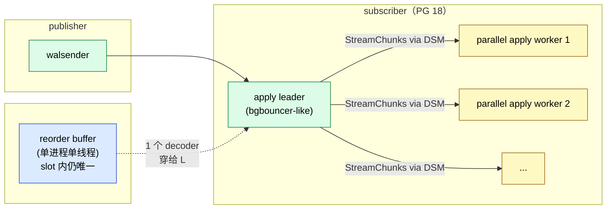
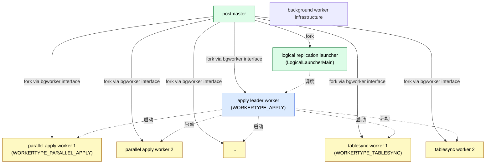
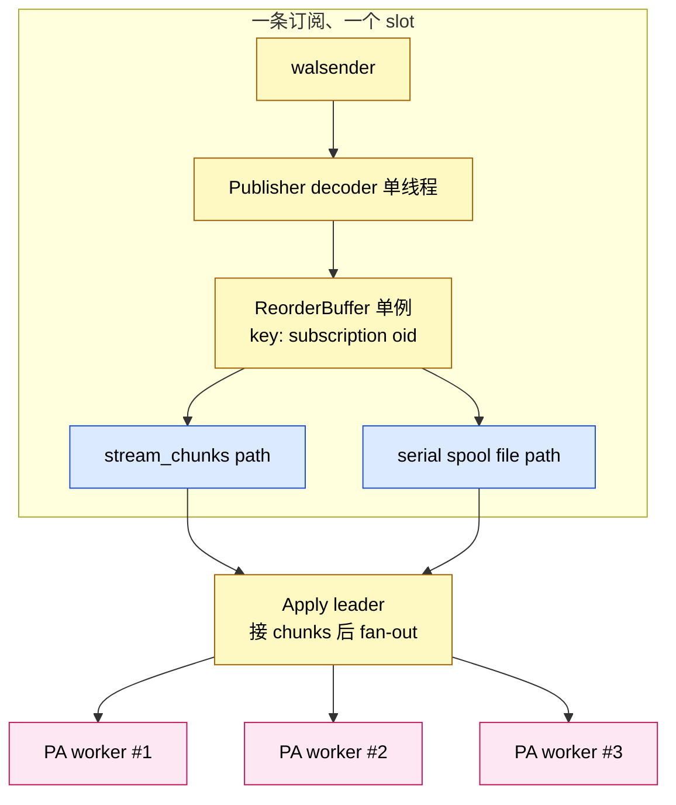
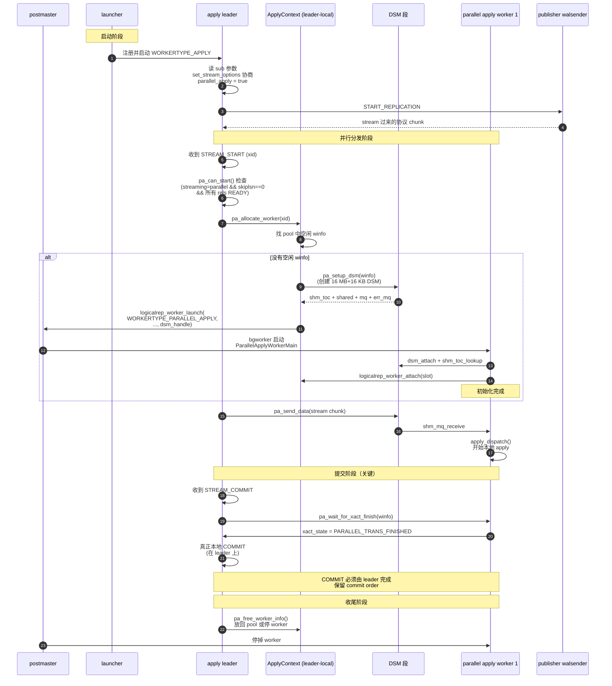
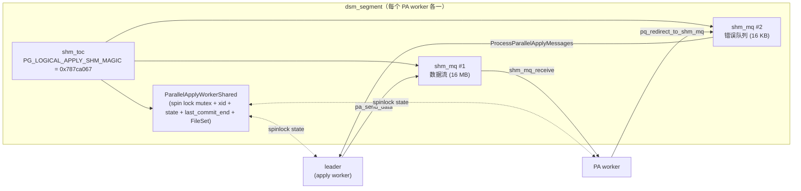
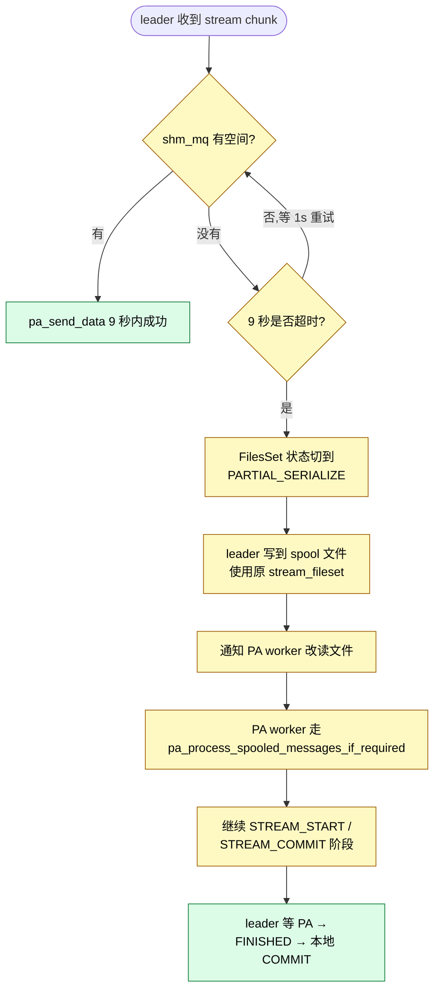
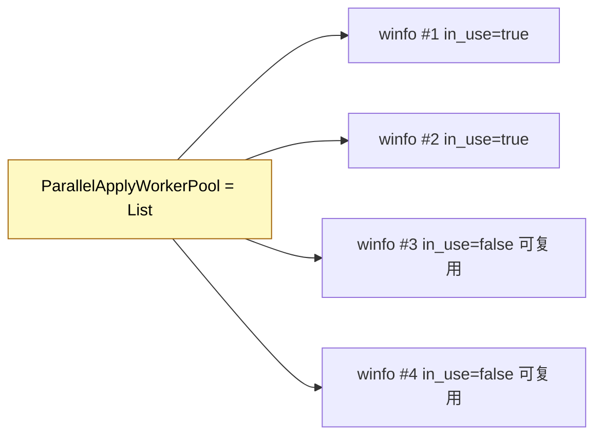

# PostgreSQL 18 逻辑复制的并行解码与并行 Apply：源码全景

| 编写人 | 编写内容 | 编写时间 |
| --- | --- | --- |
| growdu | 初稿，从内核视角详细分析 PG 18 logical replication 的"并行"形态：parallel apply worker 的完整生命周期 + 协议 + DSM 通信 + 死锁防护 + partial-serialize fallback，并澄清"并行解码"在 PG 18 里并不存在这件事 | 2026-09-03 |

> 本文是「PostgreSQL 源码系列」的逻辑复制 worker 模型篇。配套源码版本：PostgreSQL 18 dev（`~/cwork/postgresql`）。同系列前文：
>
> - [PostgreSQL 逻辑复制表的生命周期：从 `pg_replication_slots` 到 `pg_subscription_rel`](./postgresql-logical-replication-tables-lifecycle/index.html)
> - [PostgreSQL 逻辑复制 Worker 模型：从 launcher 到 apply 的 8 种角色](./postgresql-logical-replication-worker-model/index.html)
> - [PostgreSQL 逻辑复制 Streaming 与 Spill：从 WAL 到 500 万 spill 的原理](./postgresql-logical-replication-streaming-spill/index.html)
> - [PostgreSQL 逻辑复制 Spill 深度专题](./postgresql-logical-replication-spill-deep-dive/index.html)
> - [PostgreSQL 逻辑复制 ReorderBuffer 与事务机制：从一行 WAL 到一致性变更流](./postgresql-logical-replication-reorderbuffer-transaction/index.html)
> - [PostgreSQL 逻辑复制选项详解：`run_as_owner` / `disable_on_error`](./postgresql-logical-replication-options/index.html)
> - [PostgreSQL 逻辑复制分区表专题](./postgresql-logical-replication-with-partitioned-tables/index.html)
> - [PostgreSQL 逻辑复制性能与速率测试：3 视图 + 11 个可执行脚本](./postgresql-logical-replication-throughput-benchmark/index.html)
> - [PostgreSQL 从 `postgres` 二进制到生产级守护：最外层模块与启动全流程](./postgresql-module-architecture/index.html)

看到"PG 逻辑复制并行"这几个字，很多人会想到两种东西：

1. **并行解码（parallel decoding）**——一边从 WAL 把 changes 解出来，一边并行投递给多个 apply worker；
2. **并行 apply（parallel apply）**——leader 收到 publisher 推送，把不同 xid / 不同表 fan-out 给多个 worker process。

**PG 18 的真相**：**只有 (2)，没有 (1)**。PG 的 reorder buffer 与 decoder 在源码里始终是单进程单线程——`reorderbuffer.c` / `decode.c` 没有跨进程并行分支。所谓"并行"完全是 apply 层的 fan-out。

我把这件事写清楚：本文 90% 篇幅是**parallel apply worker** 的源码级拆解（基于 PG 18 dev），用 mermaid + 文件:行号 把它从进程模型、worker slot、DSM 三路、shm_mq 消息队列、leader↔PA 协议、partial serialize fallback，到死锁防护，逐段拆开。



副标题不能省略：本文写的是 PG 18，`streaming='parallel'` 是**默认值**（替代了 PG 14/15 的 `'on'` / `'off'`），配套新增的并行 apply worker 模型是 PG 16 落地、PG 18 打磨完的版本。

---

## 一、PG 18 之前：流式复制的三种模式演变

先把"为什么会有今天的 parallel apply worker"放到时间线里：

| 版本 | `streaming` 默认 | 协议 | 单条大事务怎么走 |
| --- | --- | --- | --- |
| 13 之前 | `off` | logical | 大事务先攒齐，再 apply → 占 reorder buffer 大块空间 |
| 14 | `on` | stream | 边解码边 apply：先写 spool 文件，COMMIT 后再 apply |
| 16 | `parallel` | stream + parallel | stream + 并行 worker：边收 stream chunk 边 apply |
| 17 | `parallel` | 同上 |  |
| 18 | `parallel`（**默认值**） | 同上 + 死锁防护 + 文件 partial serialize |  |

关键变化：**`parallel` 模式下的 subscriber 不再"等整个事务攒齐再 apply"**——而是一边收 publisher 推送的 stream chunk，一边在多个 parallel apply worker 里同时 apply 一批"无冲突"的事务。

具体源码标记：

```c
/* src/include/catalog/pg_subscription.h:165-180 */
#define LOGICALREP_STREAM_OFF 'f'      /* 解码完整个事务再投递 */
#define LOGICALREP_STREAM_ON 't'       /* 流式 spool 到文件，COMMIT 后再 apply */
#define LOGICALREP_STREAM_PARALLEL 'p' /* 流式分发到 parallel apply worker */
```

```c
/* src/backend/replication/logical/worker.c:4460-4476 (set_stream_options) */
if (server_version >= 160000 &&
    MySubscription->stream == LOGICALREP_STREAM_PARALLEL)
{
    options->proto.logical.streaming_str = "parallel";
    MyLogicalRepWorker->parallel_apply = true;
}
else if (server_version >= 140000 &&
         MySubscription->stream != LOGICALREP_STREAM_OFF)
{
    options->proto.logical.streaming_str = "on";
    MyLogicalRepWorker->parallel_apply = false;
}
else
{
    options->proto.logical.streaming_str = NULL;
    MyLogicalRepWorker->parallel_apply = false;
}
```

——也就是说 `CREATE SUBSCRIPTION … WITH (streaming = parallel)` 在 publisher 协议层面就是"声称我可以接 stream + parallel"；subscriber 端在 set_stream_options 阶段就把 `MyLogicalRepWorker->parallel_apply = true` 标好。后续整个 leader 进入"并行分发模式"。

---

## 二、一个 subscriber 上的 4 类角色

PG 18 的 logical replication 进程树（一个订阅，工作量高时）：



角色分工：

| 角色 | enum 值 | 入口函数 | 数量上限 | 何时启动 |
| --- | --- | --- | --- | --- |
| launcher | — | `LogicalLauncherMain` | 1 (全局) | postmaster 启动时 |
| apply leader | `WORKERTYPE_APPLY` | `ApplyWorkerMain` | 1 / sub | launcher 检测到 enabled subscription 时 |
| parallel apply | `WORKERTYPE_PARALLEL_APPLY` | `ParallelApplyWorkerMain` | `max_parallel_apply_workers_per_subscription` / sub | leader 收到第一条 STREAM_START 时 |
| tablesync | `WORKERTYPE_TABLESYNC` | `TablesyncWorkerMain` | `max_sync_workers_per_subscription` / sub | leader 启动 subscription 时为每个待同步的表 fork 一个 |

源码出处：

- `src/include/replication/worker_internal.h:29-35` 定义 `LogicalRepWorkerType` 4 个值；
- `src/backend/replication/logical/launcher.c:948` 启动 launcher；
- `src/backend/replication/logical/launcher.c:477/485/495` 三个 `WORKERTYPE_*` 分支在 `logicalrep_worker_launch()` 用 switch 路由到对应入口；
- `src/backend/replication/logical/launcher.c:486` parallel apply worker 是 `ParallelApplyWorkerMain`。

---

## 三、PG 18 的 logical slot 重温：reorder buffer 仍单线程

先强调一句结论：**reorder buffer 与 decoder 是 PG 18 唯一的"单线程组件"**，与并行无关。

- **`LogicalDecodingContext`** 一个 slot 一个；
- **`ReorderBuffer`** 一个 slot 一个，pgstat 上报 `pg_stat_replication_slots.spill_*` 也只认这个；
- **`SnapBuild`** 一个 slot 一个；
- 整个 `logicaldecoding` 路径（`reorderbuffer.c` / `decode.c` / `snapbuild.c` / `proto.c`）里**没有任何** `fork()` / `bgworker_*` 调用，也没有任何 `launch_parallel_decoder()` 之类的入口。

这条结论的源码证据：

```bash
$ grep -rn "parallel_decode\|parallel decoder\|ParallelDecode" \
    src/backend/replication/logical/ 2>/dev/null | wc -l
0
```

——整个 logical 解码侧没有任何"parallel decoder"痕迹。



**所以"并行解码"在 PG 18 上是错位概念**——它是 apply 层 fan-out；解码永远单线程，是顺序的、可观测的 `pg_stat_replication_slots`。

---

## 四、parallel apply worker 的完整生命周期

parallel apply worker 是 PG 16 引入的，最初由 Kuroda Hayato / Sawada Masahiko 等人在 commit `dd2f9b34dec`（PG 16 0 阶段合入）落地为 `applyparallelworker.c`。PG 18 已经打磨得相对成熟。

PG 18 一次完整生命周期是这样的：



下面分 4 个时点把源码钉死。

### 4.1 启 1：launcher fork 出一个 apply leader

入口在 `src/backend/replication/logical/launcher.c:1210`（节选）：

```c
/* launcher.c:1210 */
if (!logicalrep_worker_launch(WORKERTYPE_APPLY,
                              sub->dbid, sub->oid, sub->name,
                              sub->owner, InvalidOid,
                              DSM_HANDLE_INVALID))
{
    wait_time = Min(wait_time, wal_retrieve_retry_interval);
}
```

launcher 总是先拉起 1 个 apply leader（**每个 subscription 一个**），然后这个 leader 自己再去拉 PA worker 和 tablesync worker。

### 4.2 启 2：leader 收到第一条 stream chunk 后再 fork PA worker

关键约束：**不到 stream chunk 不 fork**。parallel apply worker 是 leader **收到 STREAM_START 后按需拉起**，不是订阅一开始就起好。

```c
/* applyparallelworker.c:265 (pa_can_start) */
static bool pa_can_start(void)
{
    /* Only leader apply workers can start parallel apply workers. */
    if (!am_leader_apply_worker())
        return false;
    maybe_reread_subscription();                  /* 跟上最新 streaming=parallel */
    if (!MyLogicalRepWorker->parallel_apply)      /* streaming 必须是 'parallel' */
        return false;
    if (!XLogRecPtrIsInvalid(MySubscription->skiplsn))
        return false;
    /* 必须所有 rels 都 READY */
    if (has_pending_sync_or_non_ready_subscription_table(...))
        return false;
    /* 没启用并行时仍可 spill 到文件，不阻塞 leader */
    return true;
}
```

这就是为什么"订阅刚建、tablesync 还在飞"的时候，**parallel apply worker 不会先起**——leader 等到第一个真正可 stream 的事务上来，才开始分配 worker。

### 4.3 启 3：DSM 段和 shm_mq 三通道

每个 PA worker 拥有自己的 **DSM 段**（`dsm_segment`），里面 layout 是：



源码定位（`src/backend/replication/logical/applyparallelworker.c:319-385`）：

```c
/* 16 MB 数据队列 + 16 KB 错误队列 */
#define DSM_QUEUE_SIZE         (16 * 1024 * 1024)
#define DSM_ERROR_QUEUE_SIZE   (16 * 1024)

static bool pa_setup_dsm(ParallelApplyWorkerInfo *winfo)
{
    shm_toc_estimate_chunk(&e, sizeof(ParallelApplyWorkerShared));
    shm_toc_estimate_chunk(&e, DSM_QUEUE_SIZE);
    shm_toc_estimate_chunk(&e, DSM_ERROR_QUEUE_SIZE);
    ...
    toc = shm_toc_create(PG_LOGICAL_APPLY_SHM_MAGIC, dsm_segment_address(seg));
    shared = shm_toc_allocate(toc, sizeof(ParallelApplyWorkerShared));
    mq    = shm_mq_create(shm_toc_allocate(toc, DSM_QUEUE_SIZE), DSM_QUEUE_SIZE, ...);
    emq   = shm_mq_create(shm_toc_allocate(toc, DSM_ERROR_QUEUE_SIZE), ...);
    shm_toc_attach(toc, PARALLEL_APPLY_KEY_SHARED, shared);
    shm_toc_attach(toc, PARALLEL_APPLY_KEY_MQ,      mq);
    shm_toc_attach(toc, PARALLEL_APPLY_KEY_ERROR_QUEUE, emq);
    ...
}
```

注意：**PG 没选"一次性大 DSM 段预分配 N 个 worker 槽位"**——而是**每个 worker 启动时按需创建自己 DSM 段**（注释 `applyparallelworker.c:46-49` 解释这样可避免浪费）。

### 4.4 启 4：bgworker 接口拉起新 worker

DSM 段准备好后，leader 调 `logicalrep_worker_launch()`：

```c
/* applyparallelworker.c:438 (pa_launch_parallel_worker) */
launched = logicalrep_worker_launch(WORKERTYPE_PARALLEL_APPLY,
                                    MyLogicalRepWorker->dbid,
                                    MySubscription->oid,
                                    MySubscription->name,
                                    MyLogicalRepWorker->userid,
                                    InvalidOid,                       /* relid */
                                    dsm_segment_handle(winfo->dsm_seg)); /* 把 dsm handle 通过
                                                                          bgw_extra 传给 PA */
```

launcher.c 的 `logicalrep_worker_launch` 在 `BGWORKER_SHMEM_ACCESS | BGWORKER_BACKEND_DATABASE_CONNECTION` 标志下，把 `dsm_handle` **塞进 `bgw.bgw_extra` 数组**——PA worker 进程启动后从这个数组里反序列化出 dsm handle，用 `dsm_attach(handle)` attach 到同一段。这就是 PA 进程的"出生证明"。

注意 launcher.c:421-422 处的配额检查：

```c
if (is_parallel_apply_worker &&
    nparallelapplyworkers >= max_parallel_apply_workers_per_subscription)
{
    LWLockRelease(LogicalRepWorkerLock);
    return false;
}
```

——配额耗尽，**直接放弃 fork**。`pa_launch_parallel_worker()` 在 `launched = false` 时**把 winfo 释放**；上层行为是 leader 走"spool 到文件"的路径（见后文）。

---

## 五、leader ↔ PA worker 的协议层

整个协议都是基于 shm_mq 块传输，没有走 TCP，没有走 PG wire protocol。这点极其重要——**它就是一个 share-memory queue**。

### 5.1 leader 发送端：非阻塞 + partial serialize

```c
/* applyparallelworker.c:1149 (pa_send_data) */
#define SHM_SEND_RETRY_INTERVAL_MS 1000
#define SHM_SEND_TIMEOUT_MS        (10000 - SHM_SEND_RETRY_INTERVAL_MS)

bool pa_send_data(ParallelApplyWorkerInfo *winfo, Size nbytes, const void *data)
{
    for (;;)
    {
        result = shm_mq_send(winfo->mq_handle, nbytes, data, true, true);
        if (result == SHM_MQ_SUCCESS)        return true;
        else if (result == SHM_MQ_DETACHED)  ereport(ERROR, ...);
        Assert(result == SHM_MQ_WOULD_BLOCK);
        rc = WaitLatch(MyLatch, WL_LATCH_SET | WL_TIMEOUT | WL_EXIT_ON_PM_DEATH,
                      SHM_SEND_RETRY_INTERVAL_MS, WAIT_EVENT_LOGICAL_APPLY_SEND_DATA);
        if (rc & WL_LATCH_SET) { ResetLatch(MyLatch); CHECK_FOR_INTERRUPTS(); }
    }
}
```

**关键设计**：

- **非阻塞 + 1 秒重试 + 9 秒总超时**——9 秒还没发送成功，leader 走 partial-serialize（把剩余 stream chunk 写文件）。
- SHM_SEND_RETRY_INTERVAL_MS / SHM_SEND_TIMEOUT_MS 这两个魔数**没暴露为 GUC**——见源码 `applyparallelworker.c:1185` 的 `XXX` 注释（"a bit arbitrary"）。

这条机制**避免了一种死法**：leader 等 PA，PA 等 leader，互锁形成不可见死锁。下面 § 7 会讲 lmgr 怎么补。

### 5.2 PA worker 接收端：单线程消息循环

```c
/* applyparallelworker.c:733 (LogicalParallelApplyLoop) */
static void LogicalParallelApplyLoop(shm_mq_handle *mqh)
{
    for (;;)
    {
        ProcessParallelApplyInterrupts();
        MemoryContextSwitchTo(ApplyMessageContext);

        shmq_res = shm_mq_receive(mqh, &len, &data, true);
        if (shmq_res == SHM_MQ_SUCCESS) {
            initReadOnlyStringInfo(&s, data, len);
            c = pq_getmsgbyte(&s);
            /* 永远只收 'w'（wrapped stream-chunked message） */
            if (c != 'w') elog(ERROR, "unexpected message");
            s.cursor += SIZE_STATS_MESSAGE;
            apply_dispatch(&s);
        }
        else if (shmq_res == SHM_MQ_WOULD_BLOCK) {
            if (!pa_process_spooled_messages_if_required()) {
                WaitLatch(MyLatch, WL_LATCH_SET | WL_TIMEOUT | WL_EXIT_ON_PM_DEATH,
                          1000L, WAIT_EVENT_LOGICAL_PARALLEL_APPLY_MAIN);
                if (rc & WL_LATCH_SET) ResetLatch(MyLatch);
            }
        }
        else { /* SHM_MQ_DETACHED */ ereport(ERROR, ...); }
        MemoryContextReset(ApplyMessageContext);
    }
}
```

注意几个细节：

- **必须丢弃 SIZE_STATS_MESSAGE 字节**——leader 已经把 stats 写过，PA 不重新算。
- **空闲时既 wait latch 又 wake 上 spool 文件**——只要 spool 文件还没读完，就不去 wait，直接 replay 文件里的消息。这是 partial-serialize 协议的一部分。
- PA worker 不能走到 `LogicalParallelApplyLoop` 之外——见 `ParallelApplyWorkerMain:977` 末尾的 `Assert(false)`，PA 只能因 SIGTERM / SIGUSR2 / SIGINT / 出错退出。

### 5.3 leader 接收端：读 PA worker 的错误队列

```c
/* applyparallelworker.c:1080 (ProcessParallelApplyMessages) */
void ProcessParallelApplyMessages(void)
{
    foreach(lc, ParallelApplyWorkerPool) {
        winfo = (ParallelApplyWorkerInfo *) lfirst(lc);
        if (!winfo->error_mq_handle) continue;
        res = shm_mq_receive(winfo->error_mq_handle, &nbytes, &data, true);
        if (res == SHM_MQ_WOULD_BLOCK) continue;
        if (res == SHM_MQ_SUCCESS) {
            ProcessParallelApplyMessage(&msg);   /* 分发到 leader 的 ErrorResponse 路径 */
            ...
        }
    }
}
```

这是 **`pq_redirect_to_shm_mq(seg, error_mqh)`**（`ParallelApplyWorkerMain:963` 调）的反向——PA 端把所有 `elog/ereport` 调用通过 `pq_redirect_*` 重定向到 shm_mq，leader 端的 `ProcessParallelApplyMessages` 通过中断路径把这些 log 重新接回 leader 的 client connection，使得最终 `psql` 客户端或日志里能看见。

### 5.4 leader ↔ PA 的事务终结协议：`xact_state`

**这是最关键的"保 commit order"机制**。Streamed 事务的本地 COMMIT 必须由 leader 完成（不能由各 PA worker 自己 COMMIT，否则会乱序）。源码策略：

```mermaid
stateDiagram-v2
    [*] --> PARALLEL_TRANS_UNKNOWN: PA 分配到该 xact 时
    PARALLEL_TRANS_UNKNOWN --> PARALLEL_TRANS_FINISHED: PA 收到 STREAM_COMMIT<br/>且已完成本地 COMMIT
    PARALLEL_TRANS_FINISHED --> [*]: leader 在订阅侧 COMMIT

    Note right of UNKNOWN
        leader 等在 STREAM_COMMIT 的 apply_handle_stream_commit 里
        pa_xact_finish(winfo) 会
        SpinLockAcquire(&shared->mutex) → 等到 FINISHED
        leader 释放 session lock
    end note
```

源码里这个状态字段在 `ParallelApplyWorkerShared.xact_state` 上，PA worker 在 commit 时把它置 `PARALLEL_TRANS_FINISHED`，leader 在 `pa_xact_finish()`（`applyparallelworker.c:1625`）里 spinlock wait。

```c
/* applyparallelworker.c (pa_xact_finish) */
SpinLockAcquire(&winfo->shared->mutex);
while (winfo->shared->xact_state != PARALLEL_TRANS_FINISHED) {
    SpinLockRelease(&winfo->shared->mutex);
    pg_usleep(1000);
    SpinLockAcquire(&winfo->shared->mutex);
}
SpinLockRelease(&winfo->shared->mutex);
```

**这一点是 PG 18 / PG 16+ 的 fan-out 模型的核心保障**：

- **每个 PA 只能跑一个事务**（同一时刻）；
- **本地 COMMIT 必须按 leader 收 stream 的次序**——leadership 在 commit 路径上 spinlock 等 PA。
- 死锁的网状环（`LA ← PA_2 ← PA_1 ← LA`）由下面 § 7 的 session lock 给 lmgr 看到。

---

## 六、partial serialize fallback：shm_mq 满了的优雅降级

这条机制是 PG 18 的**特色保险**——99% 情况下 shm_mq 不满，但 1% 的场景（PA 卡住、PA 网络分区、PA 处理大 record 卡 9 秒）必须不把 leader 拖死。



源码钩子：

```c
/* applyparallelworker.c (pa_send_data) 摘 */
if (result == SHM_MQ_WOULD_BLOCK &&
    /* 累计已经过 9 秒 */)
{
    winfo->serialize_changes = true;
    pa_set_fileset_state(winfo->shared, FS_SERIALIZE_NEEDED);
}
```

这里 **`winfo->stream_fileset` 是个 FileSet**（不是 SharedFileSet），原因写在源码（`applyparallelworker.c:175-185`）：因为我们要让 leader 在 STREAM_COMMIT 后还能复用同一个 fileset 给下一个 stream chunk。FileSet 的内容最终被该 PA worker 释放之后才能回收，所以 PA worker 释放后 leader 才能继续下一个事务。

**partial serialize 状态机**（`PartialFileSetState` 枚举，在 worker_internal.h）：

```c
FS_NO_SERIALIZE,           /* 默认，没走 partial */
FS_SERIALIZE_NEEDED,       /* leader 决定走 */
FS_SERIALIZE_DONE,         /* leader 已经写完文件，PA 准备读 */
FS_READY,                 /* PA 读完，等下一个 partial 状态切换 */
```

state machine 主要在 `pa_get_fileset_state()` / `pa_set_fileset_state()` 上读写。

**这部分实际上把 PG 16+ 的"shm_mq 优先 + 满了写文件"模式做成了一个统一态——这是 PG 18 最打磨的部分**。

---

## 七、lmgr 死锁防护：session lock 在 leader ↔ PA 之间织出 wait-edge

PG 18 的并行 apply 模型里**最容易出现的死锁**是：

```
LA 在等 PA 完成；
PA 在等 LA 释放某个用户表锁（FK、unique 约束）相互等待 → 死锁
```

源码（`applyparallelworker.c:13-150`，节选注释）给出了 3 类死锁场景：

1. **leader ↔ 1 PA**：
   - LA 持 unique 索引的等待，
   - PA 等 LA 的"下一次 stream chunk"（pa_stream 的 session lock）。
2. **leader ↔ 2 PA**：
   - LA 等 PA_2 提交，
   - PA_2 等 PA_1 的 unique 约束锁，
   - PA_1 等 LA 的 stream lock。
   - 这条三节点的死环必须 lmgr 看见。
3. **shm_mq 满**：leader 等发送，PA 等 commit；lmgr 看不见这种 wait。所以用 partial serialize fallback（§ 6）+ session lock 把 leader 阻塞置入 lmgr。

源码为此引入了两把 session lock（注释：`applyparallelworker.c:148-155`）：

| Lock 名 | 谁持 / 谁等 | 用途 |
| --- | --- | --- |
| **stream lock** | LA 在 STREAM_STOP 之前持 AccessExclusive；PA 在 STREAM_STOP/STREAM_ABORT 之后立即持 AccessShare 然后立刻释放 | 让 PA 等下一次 stream 时产生可被 lmgr 看到的 wait-edge |
| **transaction lock** | PA 在 tx 第一条变更之前持 AccessExclusive；LA 在 tx 终结命令期间持 AccessShare | 让 LA 等 PA 提交时产生可被 lmgr 看到的 wait-edge；附带阻止并行 PA 互相锁相同行的死环 |

```c
/* applyparallelworker.c (pa_lock_stream / pa_lock_transaction) 摘 */
static void pa_lock_stream(LogicalRepWorker *w, LOCKMODE mode) {
    LockTransactionCommand();
    WaitForLockers(...., ...);
}

static void pa_lock_transaction(TransactionId xid, LOCKMODE mode);
```

源码引用举例（`worker.c:2033` 注明 `pa_lock_stream`/`pa_unlock_stream` 是 leader 在发完 STREAM_STOP 之后**必须**主动 unlock，让 PA 能 claim）。

---

## 八、worker pool & 复用策略

PG 18 不为每个事务都 fork 一个新 PA——**有 worker pool**：



```c
/* applyparallelworker.c (pa_allocate_worker) */
foreach(lc, ParallelApplyWorkerPool) {
    winfo = lfirst(lc);
    if (!winfo->in_use) return winfo;       /* 命中空闲，直接复用 */
}
```

源码里关键**pool 大小**策略（`applyparallelworker.c:42-44` 注释 + 代码）：

```c
/*
 * A worker pool is used to avoid restarting workers for each streaming
 * transaction. ... we retain a maximum of half the
 * max_parallel_apply_workers_per_subscription workers in the pool and
 * after that, we simply exit the worker after applying the transaction.
 */
```

**这条规则没暴露为 GUC**——`XXX This worker pool threshold is arbitrary and we can provide a GUC variable for this in the future if required.`（`applyparallelworker.c:43-44` 的注释）。

也就是说 pool 大小是 `max_parallel_apply_workers_per_subscription / 2`（floor），其余事务由"flyweight"一次性 worker 处理。

---

## 九、PG 18 的关键 GUC 与默认值

| GUC | 默认值 | 含义 | 来源 |
| --- | --- | --- | --- |
| `max_logical_replication_workers` | 4 | 全局 logical replication worker slot 总数（包含 leader + parallel + tablesync） | `launcher.c:50` |
| `max_sync_workers_per_subscription` | 2 | 单个订阅的 tablesync worker 数 | `launcher.c:51` |
| `max_parallel_apply_workers_per_subscription` | 2 | 单个订阅的 parallel apply worker 数（包含在 pool 里的和 flyweight） | `launcher.c:52` |
| streaming（订阅属性） | `'parallel'` | PG 18 创建订阅时的默认 streaming 模式 | `pg_subscription.h:177` + 文档 `create_subscription.sgml:271` |
| `logical_decoding_work_mem` | 64 MB | 单事务 reorder buffer 上限；超了落盘 | `reorderbuffer.c` |
| `debug_logical_replication_streaming` | — | 测试用：能切到 `'immediate'` 强制 partial serialize | `applyparallelworker.c:1160` |

---

## 十、监控 SQL：看 PA worker 实时在干啥

主要看 `pg_stat_subscription`——这张视图在 PG 18 已经把 worker_type / leader_pid / 各种 lsn 单独成列。

```sql
-- 1. 看订阅上每个 worker 的角色 + LSN
SELECT
    subname,
    pid,
    leader_pid,
    worker_type,
    received_lsn,         -- NULL for parallel apply workers
    last_msg_send_time,   -- NULL for parallel apply workers
    latest_end_lsn,       -- NULL for parallel apply workers
    latest_end_time       -- NULL for parallel apply workers
FROM pg_stat_subscription
WHERE subname = 'my_sub'
ORDER BY worker_type, pid;
```

```sql
-- 2. 看每个订阅"parallel apply 占用了几个 slot"
SELECT
    s.subname,
    count(*) FILTER (WHERE st.worker_type = 'apply')                         AS n_leaders,
    count(*) FILTER (WHERE st.worker_type = 'parallel apply')               AS n_pa_workers,
    count(*) FILTER (WHERE st.worker_type = 'table synchronization')        AS n_ts
FROM pg_subscription s
LEFT JOIN pg_stat_subscription st ON st.subid = s.oid
GROUP BY s.subname;
```

输出可能长这样：

```
 subname | n_leaders | n_pa_workers | n_ts
---------+-----------+--------------+------
 sales   |         1 |            2 |    0
```

```sql
-- 3. 看 PA worker 是否真在 apply，注意 latest_end_lsn 为 NULL 表示没在用
SELECT
    st.worker_type,
    st.pid,
    st.leader_pid,
    pg_postmaster_start_time()                                            AS pg_started,
    extract(epoch from now() - pg_postmaster_start_time())                AS pg_uptime_s,
    st.last_msg_send_time,
    extract(epoch from (now() - st.last_msg_send_time)) AS since_last_msg_s,
    st.last_msg_receipt_time,
    st.latest_end_lsn
FROM pg_stat_subscription st
WHERE st.worker_type IN ('apply','parallel apply')
ORDER BY st.worker_type, st.pid;
```

`pg_stat_subscription.received_lsn` / `latest_end_lsn` 在 parallel apply worker 行是 NULL——这是设计（注释 `monitoring.sgml:2064-2110` 详细说）：这些 LSN 是 leader 的状态指标；PA worker 自己没跟 publisher 直接打交到。

---

## 十一、什么时候会出现 partial serialize fallback

不是一个开关，是个**现象**——以下任一条件齐备都触发：

| 触发条件 | 几率 | 排查点 |
| --- | --- | --- |
| PA worker 在跑大事务 apply 卡住 | 高 | `pg_stat_activity` 看 `wait_event` = `LogicalParallelApplyMain` 时间过长 |
| publisher 推流过快，shm_mq 16 MB 填满 | 中 | `pg_stat_subscription.last_msg_send_time` / `latest_end_time` 时间差 |
| PA worker 跟 leader 的 DSM 信号不通 | 低 | `pg_log` 找 `could not send data to shared-memory queue` |
| Tablesync 后第一次走 parallel | 中 | 是预期行为，多个 workers / 多个 rels 的中途必经 |

监控入口（来自 `pg_stat_activity` + `pg_stat_subscription` 联表）：

```sql
SELECT
    a.pid,
    a.wait_event_type,
    a.wait_event,
    a.state,
    a.query,
    st.worker_type,
    extract(epoch from (now() - a.query_start)) AS run_sec
FROM pg_stat_activity a
LEFT JOIN pg_stat_subscription st ON st.pid = a.pid
WHERE a.application_name LIKE 'logical replication%';
```

当看到 `wait_event = LogicalApplySendData` 且 `run_sec` 大于 10，partial serialize 路径已经触发——查 `pg_log` 应该有 'the leader apply worker will serialize the remaining changes' 这种 DEBUG 行（PG 16+ 0 阶段合入的新行为）。

---

## 十二、把 streaming 关掉会回到旧世界

如果你坚持不理解新协议，可以在 `CREATE SUBSCRIPTION` 或 `ALTER SUBSCRIPTION` 时关掉 streaming：

```sql
ALTER SUBSCRIPTION my_sub SET (streaming = 'on');    -- 流式 spool 文件，等提交再 apply
ALTER SUBSCRIPTION my_sub SET (streaming = 'off');   -- 整事务攒齐再 apply，旧世界
```

这是**简单的 transport 切换**——和 PG 18 的并行 apply 没关系，但和"是否启用 PA worker"有关系：

| streaming | PA worker | spool 文件 | 备注 |
| --- | --- | --- | --- |
| `off` | ❌ 没用 | ❌ 没用 | 整事务全在 reorder buffer 上 |
| `on` | ❌ 没用 | ✅ 必用 | leader 自己 spool + apply |
| `parallel` | ✅ 用 | conditional | 优先 in-memory via shm_mq，满了才 spool |

---

## 十三、调优建议：什么时候该加 `max_parallel_apply_workers_per_subscription`？

PG 18 的默认是 2，通常足够；但以下场景建议上 4-8：

1. **高并发 publisher**：多个事务同时 STREAM_START，PG pool 满了之后的事务只能走 flyweight——增加 pool + flyweight 上限有利于收纳更多并发。
2. **大事务 + 高吞吐**：每个事务的 stream chunk 数量多，单进程要把所有 chunk 串行化排队；更多 worker = 更多 chunk 可并行 dispatch。
3. **subscriber 端 CPU 富余**：并行 apply worker 是 PostgreSQL backend 进程，吃 CPU；PG 16+ 后通常用 parallel apply 把 CPU 撑满。
4. **PG 表锁丰富**：每张表 multiple unique indexes，相互易产生 PA_1 ↔ PA_2 死锁——这种场景**反而要降并行**（因为 partial serialize fallback 会变多）。

反之：

- **subscriber 是单机 4 核、CPU 紧张**：拉到 4 就是极限；
- **事务间 conflict 高**：保持 2。

---

## 十四、源码引用索引（路径全部相对 `~/cwork/postgresql/`）

按出场顺序：

**主循环入口与协议：**
- `src/backend/replication/logical/worker.c:4460 (set_stream_options)` —— 协商 streaming=parallel
- `src/backend/replication/logical/worker.c:4818 (ApplyWorkerMain)` —— leader 入口
- `src/backend/replication/logical/applyparallelworker.c:857 (ParallelApplyWorkerMain)` —— PA worker 入口

**worker slot 与 GUC：**
- `src/include/replication/worker_internal.h:29-35 (LogicalRepWorkerType)` —— 4 个 worker role
- `src/backend/replication/logical/launcher.c:50-52` —— `max_*` 默认值
- `src/backend/replication/logical/launcher.c:310-540 (logicalrep_worker_launch)` —— 真正 fork 路径
- `src/backend/replication/logical/launcher.c:421-422` —— 并行配额检查
- `src/backend/replication/logical/launcher.c:486 (ParallelApplyWorkerMain)` —— bgworker 入口名
- `src/backend/replication/logical/launcher.c:880 (logicalrep_pa_worker_count)` —— PA 计数

**PA worker 协议层：**
- `src/backend/replication/logical/applyparallelworker.c:265 (pa_can_start)` —— 何时启 PA
- `src/backend/replication/logical/applyparallelworker.c:319 (pa_setup_dsm)` —— DSM layout
- `src/backend/replication/logical/applyparallelworker.c:403 (pa_launch_parallel_worker)` —— 启 PA
- `src/backend/replication/logical/applyparallelworker.c:476 (pa_allocate_worker)` —— 分配 PA 给某 xid
- `src/backend/replication/logical/applyparallelworker.c:733 (LogicalParallelApplyLoop)` —— PA 主循环
- `src/backend/replication/logical/applyparallelworker.c:1149 (pa_send_data)` —— 非阻塞发送 + 9 秒超时
- `src/backend/replication/logical/applyparallelworker.c:1080 (ProcessParallelApplyMessages)` —— leader 读 PA 错误队列
- `src/backend/replication/logical/applyparallelworker.c:1625 (pa_xact_finish)` —— 等待 PA 提交

**共享数据结构：**
- `src/include/replication/worker_internal.h:138 (ParallelApplyWorkerShared)` —— shm_toc 共享结构
- `src/include/replication/worker_internal.h:213 (ParallelApplyWorkerInfo)` —— leader 本地 winfo
- `src/include/replication/worker_internal.h:330-344 (isParallelApplyWorker / am_*)` —— 角色判定宏

**streaming 选项：**
- `src/include/catalog/pg_subscription.h:165-180` —— `LOGICALREP_STREAM_OFF/ON/PARALLEL` 字符常量
- `src/backend/commands/subscriptioncmds.c:664/1212` —— CREATE / ALTER 落 catalog
- `src/backend/catalog/pg_subscription.c:100 (sub->stream = subform->substream)` —— 装载

**协议层：**
- `src/backend/replication/logical/proto.c:1064 (LOGICAL_REP_MSG_STREAM_START)` —— STREAM_START
- `src/backend/replication/logical/proto.c:1097 (LOGICAL_REP_MSG_STREAM_STOP)` —— STREAM_STOP
- `src/backend/replication/logical/proto.c:1109 (LOGICAL_REP_MSG_STREAM_COMMIT)` —— STREAM_COMMIT
- `src/backend/replication/logical/proto.c:1162 (LOGICAL_REP_MSG_STREAM_ABORT)` —— STREAM_ABORT
- `src/backend/replication/logical/proto.c:353/365 (logicalrep_write_stream_prepare / read)` —— STREAM_PREPARE

**监控视图：**
- `src/backend/catalog/system_views.sql:979 (CREATE VIEW pg_stat_subscription)` —— 10 字段视图
- `src/backend/replication/logical/launcher.c:1301 (pg_stat_get_subscription)` —— 视图背后函数
- `src/include/catalog/pg_proc.dat:5696` —— 函数注册

**PG 16 引入 parallel apply 的提交参考：** 文档级说明 `doc/src/sgml/release-18.sgml:2735` 已记`Fix mishandling of lock timeout signals in parallel apply workers`——是 PG 18 专门修的 lock 路径优化。

---

## 十五、同系列前文

- [PostgreSQL 逻辑复制表的生命周期：从 `pg_replication_slots` 到 `pg_subscription_rel`](./postgresql-logical-replication-tables-lifecycle/index.html)
- [PostgreSQL 逻辑复制 Worker 模型：从 launcher 到 apply 的 8 种角色](./postgresql-logical-replication-worker-model/index.html)
- [PostgreSQL 逻辑复制 Streaming 与 Spill：从 WAL 到 500 万 spill 的原理](./postgresql-logical-replication-streaming-spill/index.html)
- [PostgreSQL 逻辑复制 Spill 深度专题](./postgresql-logical-replication-spill-deep-dive/index.html)
- [PostgreSQL 逻辑复制 ReorderBuffer 与事务机制：从一行 WAL 到一致性变更流](./postgresql-logical-replication-reorderbuffer-transaction/index.html)
- [PostgreSQL 逻辑复制选项详解：`run_as_owner` / `disable_on_error`](./postgresql-logical-replication-options/index.html)
- [PostgreSQL 逻辑复制分区表专题](./postgresql-logical-replication-with-partitioned-tables/index.html)
- [PostgreSQL 逻辑复制性能与速率测试：3 视图 + 11 个可执行脚本](./postgresql-logical-replication-throughput-benchmark/index.html)
- [PostgreSQL 从 `postgres` 二进制到生产级守护：最外层模块与启动全流程](./postgresql-module-architecture/index.html)
