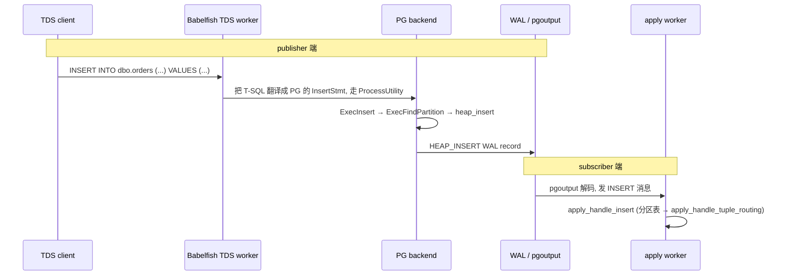

# PostgreSQL 逻辑复制下分区表的 INSERT：从 publisher 到 leaf 的完整时序

| 编写人 | 编写内容 | 编写时间 |
| --- | --- | --- |
| growdu | 初稿，结合 PostgreSQL 17 源码 + Babelfish T-SQL 扩展 | 2026-08-24 |

> 本文是 [PostgreSQL 逻辑复制与分区表：从 publisher 到 partition leaf 的全链路](./postgresql-logical-replication-with-partitioned-tables/index.html) 的**深度细化篇**。
>
> 那一篇讲了 apply worker 大致怎么处理分区表 INSERT。本文把每条 message、每个函数调用、每次 attr map 翻译、每个 relkind 检查全部画到源码级。

主要源码路径：
- `~/cwork/postgresql/src/backend/replication/pgoutput/pgoutput.c`
- `~/cwork/postgresql/src/backend/replication/logical/proto.c`
- `~/cwork/postgresql/src/backend/replication/logical/worker.c`
- `~/cwork/postgresql/src/backend/replication/logical/relation.c`
- `~/cwork/postgresql/src/backend/executor/execPartition.c`
- `~/cwork/postgresql/src/backend/executor/execReplication.c`
- `~/cwork/babelfish_extensions/contrib/babelfishpg_tsql/src/pltsql_partition.c`

---

## 一、整条链路的"分层"

分区表 INSERT 在逻辑复制里要经过**三个进程边界**：

```mermaid
flowchart LR
  subgraph pub["publisher 进程"]
    P1["client INSERT INTO orders_p_2024_h2"]:::pub
    P2["heap_insert 写 heap 页"]:::pub
    P3["WAL: HEAP_INSERT record"]:::pub
    P4["logical decoding<br/>ReorderBuffer 排序"]:::pub
    P5["pgoutput_change<br/>(决定以 leaf OID 还是 root OID 上报)"]:::pub
    P1 --> P2 --> P3 --> P4 --> P5
  end

  subgraph wire["wire protocol"]
    W1["LOGICAL_REP_MSG_RELATION<br/>(schema 缓存)"]
    W2["LOGICAL_REP_MSG_BEGIN"]
    W3["LOGICAL_REP_MSG_INSERT<br/>relid + 新元组"]
    W4["LOGICAL_REP_MSG_COMMIT"]
  end

  subgraph sub["subscriber apply worker 进程"]
    S1["apply_dispatch → apply_handle_insert"]:::sub
    S2["logicalrep_rel_open(remoteid)"]:::sub
    S3["relkind 检查<br/>(partitioned table?)"]:::sub
    S4["apply_handle_tuple_routing"]:::sub
    S5["ExecFindPartition<br/>(FormPartitionKeyDatum + bsearch)"]:::sub
    S6["attr map 翻译<br/>(execute_attr_map_slot)"]:::sub
    S7["CheckSubscriptionRelkind(leaf)"]:::sub
    S8["ExecSimpleRelationInsert<br/>→ heap_insert → WAL"]:::sub
    S1 --> S2 --> S3 --> S4 --> S5 --> S6 --> S7 --> S8
  end

  P5 --> W1 --> W2 --> W3 --> W4 --> S1
```



---

## 二、publisher 端：`pgoutput_change` 怎么发分区表 INSERT

### 2.1 入口：`pgoutput_change`

`src/backend/replication/pgoutput/pgoutput.c:1482`：

```c
static void pgoutput_change(LogicalDecodingContext *ctx, ReorderBufferTXN *txn,
                            Relation relation, ReorderBufferChange *change) {
    ...
    PGOutputData *data = (PGOutputData *) ctx->output_plugin_private;
    ...
    /* 1. 拿到 / 缓存 schema 入口 */
    relentry = get_rel_sync_entry(data, relation);

    /* 2. 如果该 relation / action 在 publication 里没被订阅, 直接返回 */
    if (!relentry->pubactions.pubinsert)
        return;

    /* 3. schema 还没发过 -> 先发 LOGICAL_REP_MSG_RELATION */
    if (!relentry->schema_sent)
        pgoutput_send_relation(ctx, relentry, ...);

    /* 4. 发 INSERT 消息本体 */
    OutputPluginPrepareWrite(ctx, true);
    logicalrep_write_insert(ctx->out, rel);
    OutputPluginWrite(ctx, true);
}
```

### 2.2 关键：`get_rel_sync_entry` 的祖先选择

`pgoutput.c:2052`：

```c
static RelationSyncEntry *
get_rel_sync_entry(PGOutputData *data, Relation relation) {
    ...
    entry->publish_as_relid = publish_as_relid;   /* 重点: 是 leaf 还是 父表 */

    /* 同一 relation 在 schema rename 时会被 invalidate 掉, 这里重建 */
    ...
}
```

`publish_as_relid` 的计算（`pgoutput.c:2200` 一带）：

```c
foreach(lc, publist) {
    Publication *pub = (Publication *) lfirst(lc);
    Oid pub_relid = entry->publish_as_relid;
    int ancestor_level = 0;

    /* 沿 pg_partition_ancestors 找 */
    if (rel_is_partof_partition) {
        foreach(ancestor, ancestors) {
            int level = ...;
            if (level > ancestor_level) {
                pub_relid = ancestor;
                ancestor_level = level;
            }
        }
    }

    /* 关键判断 */
    if (publish &&
        (relkind != RELKIND_PARTITIONED_TABLE || pub->pubviaroot)) {
        ...
        entry->pubactions.pubinsert |= pub->pubactions.pubinsert;
        ...
        entry->publish_as_relid = pub_relid;
    }
}
```

**结论**：

| `pubviaroot` | `publish_as_relid` | INSERT 消息里 `relid` 字段 |
| --- | --- | --- |
| `false`（默认） | leaf OID | leaf OID |
| `true` | 父表 OID | 父表 OID + 后续需 attr map 翻译 |

> 注：`pubviaroot = false` 是默认设置，但 PG 14+ 起对"挂父表到 subscription"的官方推荐是 `pubviaroot = true`。否则 subscriber 端必须事先建好所有 leaf 镜像。

### 2.3 决定 leaf 还是 root 后，调 `logicalrep_write_insert`

`proto.c:408`：

```c
void logicalrep_write_insert(StringInfo out, Relation rel) {
    pq_sendbyte(out, LOGICAL_REP_MSG_INSERT);  /* 'I' */

    /* 1. 写 relation OID (32 bit) */
    pq_sendint32(out, RelationGetRelid(rel));

    /* 2. 写 tuple data: N 列 × (datum OID + data) */
    /*    列顺序按 rel->rd_att (本地 schema) */
}
```

`rel` 是从 `get_rel_sync_entry` 里拿到的 `publish_as_relid`——可能是 leaf 也可能是父表。如果父表，写出的列顺序就是**父表**的列顺序（subscriber 端 `apply_handle_insert` 拿这个 slot 做 attr map 翻译）。

### 2.4 wire 上的消息顺序

同一个事务的多个 change 按 `commit_lsn` 排序：

```text
BEGIN                                (LOGICAL_REP_MSG_BEGIN 'B')
  RELATION <schema>                  (LOGICAL_REP_MSG_RELATION 'R', 仅 schema 变更或首次)
  INSERT <relid=orders> <data>       (LOGICAL_REP_MSG_INSERT 'I')
  INSERT <relid=orders> <data>       (LOGICAL_REP_MSG_INSERT 'I')
  UPDATE <relid=orders> <data>       (LOGICAL_REP_MSG_UPDATE 'U')
  ...
COMMIT <commit_lsn>                 (LOGICAL_REP_MSG_COMMIT 'C')
```

每个 `INSERT` 消息体结构（`proto.c:428` 的 `logicalrep_read_insert` 反序列化）：

```c
typedef struct LogicalRepTupleData {
    char       flags;            /* 'B' = binary, 'N' = null bitmap only */
    TransactionId xid;
    Bitmapset  *inherited_columns;  /* 列被 leaf 继承 */
    int         ntuple_attrs;
    /* 后面跟 ntuple_attrs 个 Datum */
} LogicalRepTupleData;
```

`inherited_columns` 是关键——它标识哪些列是 leaf 从祖先继承的（apply 端做 attr map 时靠这个判断）。

---

## 三、subscriber 端：`apply_handle_insert` 收到 INSERT

### 3.1 主入口：`apply_handle_insert`

`worker.c:2388`：

```c
static void apply_handle_insert(StringInfo s) {
    if (is_skipping_changes() ||                       /* 跳过模式: 出版端 origin 同 sub subid */
        handle_streamed_transaction(LOGICAL_REP_MSG_INSERT, s))  /* 大事务流式事务 */
        return;

    begin_replication_step();    /* 起事务 / 准备 expr context */

    relid = logicalrep_read_insert(s, &newtup);   /* 从 wire 解析 */
    rel = logicalrep_rel_open(relid, RowExclusiveLock);   /* 拿 local relmap */

    if (!should_apply_changes_for_rel(rel)) {    /* state != READY 且未追上 */
        logicalrep_rel_close(rel, RowExclusiveLock);
        end_replication_step();
        return;
    }

    /* run_as_owner = subscription 用户的开关 (run_as_owner) */
    run_as_owner = MySubscription->runasowner;
    if (!run_as_owner)
        SwitchToUntrustedUser(rel->localrel->rd_rel->relowner, &ucxt);

    /* 初始化 ApplyExecutionData + EState + remoteslot */
    edata = create_edata_for_relation(rel);
    estate = edata->estate;
    remoteslot = ExecInitExtraTupleSlot(estate,
                                        RelationGetDescr(rel->localrel),
                                        &TTSOpsVirtual);

    /* 把远程 tuple 落到 slot */
    MemoryContextSwitchTo(GetPerTupleMemoryContext(estate));
    slot_store_data(remoteslot, rel, &newtup);
    slot_fill_defaults(rel, estate, remoteslot);
    MemoryContextSwitchTo(oldcxt);

    /* ★ 关键分支: 父表 vs leaf */
    if (rel->localrel->rd_rel->relkind == RELKIND_PARTITIONED_TABLE)
        apply_handle_tuple_routing(edata, remoteslot, NULL, CMD_INSERT);
    else {
        ResultRelInfo *relinfo = edata->targetRelInfo;
        ExecOpenIndices(relinfo, false);
        apply_handle_insert_internal(edata, relinfo, remoteslot);
        ExecCloseIndices(relinfo);
    }

    finish_edata(edata);
    ...
}
```

注意几个细节：

1. **`should_apply_changes_for_rel`**（`worker.c:461`）：检查 `pg_subscription_rel.srsubstate` 是否允许 apply。状态机里 `READY` 或 `SYNCDONE` 且 `lsn <= remote_final_lsn` 才允许。否则**直接丢弃，不报错**——这是 DML 在 tablesync 阶段不重放的保证。
2. **`slot_store_data`**：把从 wire 解出来的 `LogicalRepTupleData` 转成 `TupleTableSlot`。如果 `rel` 是父表，slot 用的是**父表的 TupleDesc**（列顺序是父表的列顺序，包括列继承的列）。
3. **`slot_fill_defaults`**：补齐订阅端默认值（如果 publisher 用了 DEFAULT column sync）。

### 3.2 `create_edata_for_relation`：构造 `ModifyTableState`

虽然 `apply_handle_insert` 是顺序处理的，但 `apply_handle_tuple_routing` 要求一个 `ModifyTableState`：

```c
static ApplyExecutionData *
create_edata_for_relation(LogicalRepRelMapEntry *rel) {
    ApplyExecutionData *edata;
    edata = (ApplyExecutionData *) palloc0(sizeof(ApplyExecutionData));
    edata->targetRel = rel;
    edata->targetRelInfo = makeNode(ResultRelInfo);

    /* EState */
    edata->estate = CreateExecutorState();
    ExecInitRangeTable(edata->estate, list_make1(rel->localrel));

    /* targetRelInfo 关联 Relation */
    edata->targetRelInfo->ri_RelationDesc = rel->localrel;

    return edata;
}
```

### 3.3 关键代码点：父表 vs leaf 分支

```c
if (rel->localrel->rd_rel->relkind == RELKIND_PARTITIONED_TABLE)
    apply_handle_tuple_routing(edata, remoteslot, NULL, CMD_INSERT);
else {
    ResultRelInfo *relinfo = edata->targetRelInfo;
    ExecOpenIndices(relinfo, false);
    apply_handle_insert_internal(edata, relinfo, remoteslot);
    ExecCloseIndices(relinfo);
}
```

**只有父表**才走 tuple routing。Leaf 走直接 `apply_handle_insert_internal`（普通路径）。

---

## 四、`apply_handle_tuple_routing` 详解

`worker.c:2963`：

```c
static void
apply_handle_tuple_routing(ApplyExecutionData *edata,
                           TupleTableSlot *remoteslot,
                           LogicalRepTupleData *newtup,
                           CmdType operation) {
    EState *estate = edata->estate;
    LogicalRepRelMapEntry *relmapentry = edata->targetRel;
    ResultRelInfo *relinfo = edata->targetRelInfo;
    Relation parentrel = relinfo->ri_RelationDesc;
    ModifyTableState *mtstate;
    PartitionTupleRouting *proute;
    ResultRelInfo *partrelinfo;
    Relation partrel;
    TupleTableSlot *remoteslot_part;
    TupleConversionMap *map;
    AttrMap *attrmap = NULL;

    /* 1. 构造 ModifyTableState (ExecFindPartition 需要) */
    edata->mtstate = mtstate = makeNode(ModifyTableState);
    mtstate->ps.plan = NULL;
    mtstate->ps.state = estate;
    mtstate->operation = operation;
    mtstate->resultRelInfo = relinfo;

    /* 2. 构造 PartitionTupleRouting (建骨架, 递归建每层 PartitionDispatch) */
    edata->proute = proute = ExecSetupPartitionTupleRouting(estate, parentrel);

    /* 3. ExecFindPartition 找到 leaf */
    oldctx = MemoryContextSwitchTo(GetPerTupleMemoryContext(estate));
    partrelinfo = ExecFindPartition(mtstate, relinfo, proute, remoteslot, estate);
    Assert(partrelinfo != NULL);
    partrel = partrelinfo->ri_RelationDesc;

    /* 4. ★ 检查 leaf relkind (apply 时再校验一次) */
    CheckSubscriptionRelkind(partrel->rd_rel->relkind,
                             get_namespace_name(RelationGetNamespace(partrel)),
                             RelationGetRelationName(partrel));

    /* 5. ★ attr map 翻译: 父表 slot → 子表 slot */
    remoteslot_part = partrelinfo->ri_PartitionTupleSlot;
    if (remoteslot_part == NULL)
        remoteslot_part = table_slot_create(partrel, &estate->es_tupleTable);
    map = ExecGetRootToChildMap(partrelinfo, estate);
    if (map != NULL) {
        attrmap = map->attrMap;
        remoteslot_part = execute_attr_map_slot(attrmap, remoteslot,
                                                remoteslot_part);
    } else {
        remoteslot_part = ExecCopySlot(remoteslot_part, remoteslot);
        slot_getallattrs(remoteslot_part);
    }
    MemoryContextSwitchTo(oldctx);

    /* 6. 真正插入 (走 leaf 的 ResultRelInfo) */
    switch (operation) {
        case CMD_INSERT:
            apply_handle_insert_internal(edata, partrelinfo, remoteslot_part);
            break;
        case CMD_DELETE:
            apply_handle_delete_internal(edata, partrelinfo, remoteslot_part, ...);
            break;
        case CMD_UPDATE:
            apply_handle_update_internal(edata, partrelinfo, remoteslot_part, ...);
            break;
    }
}
```

### 4.1 构造 `ModifyTableState` + `PartitionTupleRouting`

```c
edata->mtstate = mtstate = makeNode(ModifyTableState);
mtstate->ps.state = estate;
mtstate->operation = operation;
mtstate->resultRelInfo = relinfo;

edata->proute = proute = ExecSetupPartitionTupleRouting(estate, parentrel);
```

`ExecSetupPartitionTupleRouting` 内部会**递归建好所有层级的 `PartitionDispatch`**：

```c
/* execPartition.c */
proute = palloc0(sizeof(PartitionTupleRouting));
proute->partition_root = rel;
proute->memcxt = CurrentMemoryContext;

/* 递归: 这一层 + 所有中间层都建好 Dispatch */
ExecInitPartitionDispatchInfo(estate, proute, RelationGetRelid(rel),
                              NULL, 0, NULL);
return proute;
```

> **每次 INSERT 到父表都重新构造一次**。这是有意的——`PartitionTupleRouting` 不重用，`proute->partition_root` 指向的 Relation 是当前 `logicalrep_rel_open` 拿到的，跨 message 不能跨事务跨 Relation 复用。

### 4.2 `ExecFindPartition`：复用内核 partition routing

```c
partrelinfo = ExecFindPartition(mtstate, relinfo, proute, remoteslot, estate);
```

这条调用和普通 INSERT（不走逻辑复制）走的是**完全相同**的代码——`FormPartitionKeyDatum` + `get_partition_for_tuple` + `partition_*_bsearch`：

```c
/* 1. 抽 key (支持表达式 key + attr 重映射) */
ecxt->ecxt_scantuple = remoteslot;
FormPartitionKeyDatum(dispatch, remoteslot, estate, values, isnull);

/* 2. 按 strategy 二分 / 哈希 */
switch (key->strategy) {
    case PARTITION_STRATEGY_HASH:
        rowHash = compute_partition_hash_value(...);
        partidx = boundinfo->indexes[rowHash % ndatums];
        break;
    case PARTITION_STRATEGY_LIST:
        partidx = partition_list_bsearch(boundinfo, key->partsupfunc[0],
                                          key->partcollation[0], values[0]);
        break;
    case PARTITION_STRATEGY_RANGE:
        partidx = partition_range_datum_bsearch(boundinfo, key->partnatts,
                                                 values, isnull, key->partsupfunc,
                                                 key->partcollation,
                                                 key->parttyplen, key->parttypbyval);
        break;
}

/* 3. 叶子? 返回 rri; 中间层? 继续下钻 */
```

> 详细算法拆解见 [PostgreSQL 分区表：从一行 `PARTITION BY` 到路由热路径的全链路拆解](./postgresql-partition-handling/index.html)。

### 4.3 `CheckSubscriptionRelkind`：leaf 二次校验

```c
CheckSubscriptionRelkind(partrel->rd_rel->relkind,
                         get_namespace_name(RelationGetNamespace(partrel)),
                         RelationGetRelationName(partrel));
```

`execReplication.c:877`：

```c
void CheckSubscriptionRelkind(char relkind, const char *nspname, const char *relname) {
    if (relkind != RELKIND_RELATION && relkind != RELKIND_PARTITIONED_TABLE)
        ereport(ERROR, ...);
}
```

为什么 apply 时再校验一次？

- DDL 同步到 subscriber 后，leaf 可能被 `ALTER TABLE ... SET LOGICAL REPLICA ...` 改了 relkind，或者变成 VIEW/FOREIGN TABLE。
- 中间层 partition 树可能动态变化，relkind 集合在 CREATE/ALTER SUBSCRIPTION 时不可能完整确认。
- 所以每次落到 leaf 都校验一次——保证 INSERT 永远只写 `RELKIND_RELATION` 或 `RELKIND_PARTITIONED_TABLE`。

### 4.4 attr map 翻译

```c
remoteslot_part = partrelinfo->ri_PartitionTupleSlot;
if (remoteslot_part == NULL)
    remoteslot_part = table_slot_create(partrel, &estate->es_tupleTable);
map = ExecGetRootToChildMap(partrelinfo, estate);
if (map != NULL) {
    attrmap = map->attrMap;
    remoteslot_part = execute_attr_map_slot(attrmap, remoteslot, remoteslot_part);
} else {
    remoteslot_part = ExecCopySlot(remoteslot_part, remoteslot);
    slot_getallattrs(remoteslot_part);
}
```

这一步把"父表 TupleDesc 的 slot"翻译成"子表 TupleDesc 的 slot"。

| 场景 | 是否需要 attr map |
| --- | --- |
| leaf 和父表列定义完全一致 | 否（`map == NULL`，走 `ExecCopySlot`） |
| leaf 删除了某列 | 是（按列名匹配） |
| leaf 重排列顺序 | 是 |
| leaf 是不同 schema | 否（TupleDesc 不变） |
| leaf 有额外列（DEFAULT 填充） | 否（publisher 没发的列在 leaf 由 `slot_fill_defaults` 补） |

`TupleConversionMap` 由 `ExecGetRootToChildMap` 构造——它在 `ExecInitPartitionInfo` 时按 leaf 的 `RelationGetIndexExpressions` / `attisdropped` 等信息计算并缓存。

### 4.5 `apply_handle_insert_internal` 实际落盘

```c
static void apply_handle_insert_internal(ApplyExecutionData *edata,
                                        ResultRelInfo *relinfo,
                                        TupleTableSlot *remoteslot) {
    EState *estate = edata->estate;
    Assert(relinfo->ri_IndexRelationDescs != NULL ||
           !relinfo->ri_RelationDesc->rd_rel->relhasindex ||
           RelationGetIndexList(relinfo->ri_RelationDesc) == NIL);
    Assert(relinfo->ri_onConflictArbiterIndexes == NIL);

    InitConflictIndexes(relinfo);
    TargetPrivilegesCheck(relinfo->ri_RelationDesc, ACL_INSERT);
    ExecSimpleRelationInsert(relinfo, estate, remoteslot);
}
```

`InitConflictIndexes` 一次性 cache 一组索引（用于后续 ON CONFLICT）。`ExecSimpleRelationInsert` 内部：

```text
ExecSimpleRelationInsert
   → heap_insert
      → heap_prepare_insert (生成 xl_heap_insert WAL record)
      → RelationPutHeapTuple
         → PageAddItem (buffer pool 写 + WAL flush)
   → insert indexes (btree, gin, gist, etc.)
   → pgstat_report_heap_insert (更新 stat counters)
```

---

## 五、关键不变量

### 5.1 publisher vs subscriber 的 schema 一致性

`relmapentry->attrmap`（在 `logicalrep_rel_open` 里构建，`relation.c:380` 一带）：

```c
for (i = 0; i < desc->natts; i++) {
    Form_pg_attribute attr = TupleDescAttr(desc, i);
    if (attr->attisdropped) {
        entry->attrmap->attnums[i] = -1;
        continue;
    }
    attnum = logicalrep_rel_att_by_name(remoterel, NameStr(attr->attname));
    entry->attrmap->attnums[i] = attnum;
    ...
}
```

这是**双层 attr map**：

- **第一层**：publisher 的 `remoterel.attrmap` → 把 publisher 列号映射成"实际发的列位置"。
- **第二层**：subscriber 父表的 `relmapentry->attrmap` → 把 subscriber 父表列号映射成"wire 上的列位置"。
- **第三层**（如果 `publish_as_relid = 父表`）：在 `apply_handle_tuple_routing` 内再把父表 slot 翻译成 leaf slot。

### 5.2 pubviaroot 三种场景对比

| 场景 | `pubviaroot` | 消息里 `relid` | subscriber `apply_handle_insert` 路径 | 是否需要 leaf 镜像 | 是否需要 attr map |
| --- | --- | --- | --- | --- | --- |
| **只挂 leaf** | false（默认） | leaf OID | 走 `apply_handle_insert_internal`（直接） | 是（每 leaf 必须存在） | 不需要（slot 就是 leaf） |
| **挂父表 + pubviaroot=true** | true | 父表 OID | 走 `apply_handle_tuple_routing` | 不需要（routing 内部 ExecFindPartition 找 leaf） | 需要（父→leaf slot 翻译） |
| **挂父表 + pubviaroot=false** | false | leaf OID | 走 `apply_handle_insert_internal` | 是 | 不需要 |

PG 14+ 推荐**第二种**——只需要在 subscriber 端建父表，所有 leaf 由 `ExecFindPartition` 在 subscriber 端**动态创建**（前提是 `ALTER SUBSCRIPTION ... REFRESH PUBLICATION` 时 subscriber 的 leaf 也已经建好了；或者 PG 16+ 的 `auto-create partition` 实验功能）。

### 5.3 catch-up 期间的行为

DML 在 tablesync 还没完成时**已经被 publisher 发出来了**——subscriber apply worker 收到怎么办？

```c
/* should_apply_changes_for_rel 在 worker.c:461 */
case WORKERTYPE_APPLY:
    return (rel->state == SUBREL_STATE_READY ||
            (rel->state == SUBREL_STATE_SYNCDONE &&
             rel->statelsn <= remote_final_lsn));
```

- `state != READY` 且 `state != SYNCDONE`（即 `INIT` / `DATASYNC` / `CATCHUP`）：**直接 return，丢弃 change，不报错**。
- `state == SYNCDONE && statelsn <= remote_final_lsn`：允许 apply（catch-up 阶段追上之后）。
- `state == READY`：正常 apply。

这就是为什么 subscriber 端的 leaf 在 tablesync 还没跑完时收到的 DML **不会**写到 leaf——它们直接被丢弃，由 tablesync worker 的 COPY 把基线数据拉过来之后，再从 `remote_lsn` 开始 apply。

### 5.4 `inherited_columns` 标志位

`LogicalRepTupleData.inherited_columns` 告诉 subscriber 端"这一列的 value 是从祖先继承的（不是 publisher 端 INSERT 显式给的）"。这影响 `slot_store_data` 怎么处理：

```c
/* worker.c logicalrep_read_tuple */
for (i = 0; i < ntuple_attrs; i++) {
    if (bms_is_member(i, inherited_columns)) {
        /* 这列没显式发, 让 slot 走 DEFAULT */
        values[i] = (Datum) 0;
        nulls[i] = true;
    }
    ...
}
```

> 这在多级嵌套分区里很重要——只有真正被 INSERT 显式赋值的列才在 wire 上出现，其他列由 subscriber 端默认值补齐。

---

## 六、多层嵌套分区的递归

如果 subscriber 是 `orders → orders_2024 → orders_2024_cn` 的嵌套分区（`publish_via_partition_root = true`）：

```text
apply_handle_tuple_routing
  ├─ edata->proute = ExecSetupPartitionTupleRouting(estate, parentrel = orders)
  │     ├─ pd[0] = PartitionDispatch for orders
  │     │    ├─ pd[0].indexes[0] = 0  (orders_2024 是中间层)
  │     │    ├─ pd[0].indexes[1] = -1 (orders_2024_cn 直接挂在 orders? 不会, 中间层先)
  │     │    └─ 递归: ExecInitPartitionDispatchInfo(orders_2024, ...)
  │     │         └─ pd[1] = PartitionDispatch for orders_2024
  │     │              └─ pd[1].indexes[0] = -1 (orders_2024_cn 是 leaf, 按需建)
  │     └─ 其它 leaf pd[*].indexes[*] 全部 -1
  │
  └─ ExecFindPartition(mtstate, relinfo, proute, remoteslot, estate)
        ├─ dispatch = pd[0] (orders)
        │    ├─ FormPartitionKeyDatum(orders, slot)  → values = [2024-08-15]
        │    ├─ get_partition_for_tuple → partidx = 0 (orders_2024)
        │    └─ is_leaf? 否 → dispatch = pd[pd[0].indexes[0]] = pd[1] (orders_2024)
        │
        ├─ dispatch = pd[1] (orders_2024)
        │    ├─ FormPartitionKeyDatum(orders_2024, slot)  → values = ['CN']
        │    │    (注意: 因为 pd[1].tupmap 处理了父→子的 attr 重映射)
        │    ├─ get_partition_for_tuple → partidx = 0 (orders_2024_cn)
        │    └─ is_leaf? 是 → 拿 leaf rri
        │
        └─ 返回 orders_2024_cn 的 ResultRelInfo
```

> `pd->tupmap` 在每层之间做 slot 翻译，把父表 schema 的 slot 转成子表 schema 的 slot。这对嵌套分区尤其重要——中间层 partition 可能用不同列（如 `region` 列只在 `orders_2024` 中间层存在）。

---

## 七、`LogicalRepRelMap` 缓存层

`src/backend/replication/logical/relation.c:353`：

```c
typedef struct LogicalRepRelMapEntry {
    LogicalRepRelation remoterel;   /* 从 publisher 端拉过来的 schema */
    Relation localrel;              /* subscriber 端的 Relation (可能被 close 后无效) */
    AttrMap *attrmap;               /* publisher 列号 → subscriber 列号 */
    ...
} LogicalRepRelMapEntry;
```

缓存键：`(remoteid, dbid)`，全局 `HTAB *LogicalRepRelMap`。

### 7.1 失效场景

- subscriber 端 `ALTER TABLE` 改了列定义 → `CacheInvalidateRelcache` 触发。
- subscriber 端 relcache flush（任何 DDL）→ 同上。
- `localrel` 被 close 后指针失效 → apply worker 用 `localrelvalid` 标志。

源码 `relation.c:380` 的 `logicalrep_relmap_update`：

```c
/* 该函数在 apply worker / tablesync worker 收到 LOGICAL_REP_MSG_RELATION 时调 */
void logicalrep_relmap_update(LogicalRepRelation *remoterel) {
    /* 如果已有缓存, 释放; 重新构造 */
    entry = ...;
    entry->remoterel = *remoterel;
    /* localrel 暂时为 NULL, 第一次 apply 时 lazy 打开 */
}
```

### 7.2 分区表的 partition map cache

`relation.c:633`：

```c
LogicalRepPartMap = hash_create("logicalrep partition map cache", 64, ...);
```

为每个 leaf OID 缓存一份 `LogicalRepPartMapEntry`：

```c
typedef struct LogicalRepPartMapEntry {
    Oid partoid;
    LogicalRepRelMapEntry relmapentry;  /* 复用 root 的 schema, 只换 attrmap */
} LogicalRepPartMapEntry;
```

`logicalrep_partition_open`（`relation.c:633`）：

```c
LogicalRepRelMapEntry *
logicalrep_partition_open(LogicalRepRelMapEntry *root,
                         Relation partrel, AttrMap *map) {
    /* 1. 在 LogicalRepPartMap 找 partoid */
    part_entry = hash_search(LogicalRepPartMap, &partOid, HASH_ENTER, &found);
    entry = &part_entry->relmapentry;

    /* 2. 首次创建 */
    if (!found) {
        memset(part_entry, 0, sizeof(LogicalRepPartMapEntry));
        part_entry->partoid = partOid;
        /* 3. 复用 root 的 schema 信息 */
        entry->remoterel = root->remoterel;
        /* 4. attrmap 用 leaf 的 */
        entry->attrmap = copy_attrmap(map);
    }
    entry->localrel = partrel;
    return entry;
}
```

注意：

1. **partition map 是 cache**——`localrel` 字段每次调用都会**强制覆盖**（因为旧 `Relation` 可能被 relcache flush）。
2. schema (`remoterel`) 沿用 root 的——因为分区表 schema 来自 publisher 端的父表，所有 leaf 共享同一 schema（列顺序可能不同，但列名一样）。

---

## 八、Babelfish T-SQL 模式下的差异

### 8.1 publisher 端 T-SQL INSERT

```sql
INSERT INTO dbo.orders (region, orderdate, amount)
VALUES (N'CN', '2024-08-15', 100.0);
```

Babelfish 在 TDS 协议层收到 INSERT 请求后，把它翻译成 PG 原生 `InsertStmt`：

```text
T-SQL: INSERT INTO dbo.orders (...) VALUES (...)
     ↓
Babelfish analyzer
     ↓
PG: INSERT INTO dbo.orders (...) VALUES (...)
     ↓
PG executor 跑 INSERT (跟普通分区表 INSERT 完全一样)
```

注意：

- Babelfish 不会因为"T-SQL 是分区表"就在 INSERT 路径上加任何特殊逻辑。
- `dbo.orders` 在 Babelfish 下是一个**普通 PG 分区表**（Babelfish 创建时翻译成 `PARTITION BY`）。
- INSERT 走的是**纯 PG 原生 INSERT 路径**——`ExecInsert` → `ExecFindPartition` → `heap_insert`。
- 这个 INSERT 会触发**普通的 WAL record**，然后 `pgoutput` 在 logical decoding 阶段看到它，按 §2 处理。

### 8.2 subscriber 端 T-SQL INSERT via logical replication



**关键观察**：

- **Babelfish 不参与 subscriber 端 apply 的代码路径**——apply worker 完全跑 PG 原生代码，跟"Babelfish 上有没有分区函数/scheme metadata"无关。
- 唯一跟 Babelfish metadata 相关的点是：`$PARTITION.<func>(col)` 之类的元查询（不会出现在 INSERT 热路径上）。
- 如果 publisher 上 publisher 端插入了 `babelfish_partition_function` 没记录的分区列值（极少但可能），apply worker 仍然按 PG native 逻辑落到正确 leaf——但 `$PARTITION.<func>(col)` 返回值在 subscriber / publisher 之间可能不一致。

### 8.3 Babelfish 测试用例验证

`babelfish_extensions/test/JDBC/replication/partition-replication.mix` 演示的 INSERT 验证：

```sql
-- publisher 端 (TDS):
INSERT INTO partition_replication_t1_int_partition_function (col, val)
VALUES (1000, 'value_in_third_partition');

-- subscriber 端 (TDS): 验证行被同步到对应 leaf
SELECT * FROM partition_replication_t1_int_partition_function WHERE col = 1000;
```

这个测试覆盖了：

- ✅ INSERT 能否在 publisher 端正确路由（Babelfish partition function 找到正确 leaf）。
- ✅ INSERT 能否通过 logical replication 传到 subscriber（pgoutput → apply worker → `apply_handle_tuple_routing` → `ExecFindPartition`）。
- ✅ Subscriber 端 partition function / scheme 是否能"独立路由"同一行到相同 leaf（验证两边 `partition_range_datum_bsearch` 行为一致）。

---

## 九、监控与排错

### 9.1 监控视图

```sql
-- 当前 apply worker 状态
SELECT pid, usesysid, application_name, state, sync_state, sync_priority
  FROM pg_stat_replication
 WHERE application_name LIKE 'sub_%';   -- apply worker

-- apply worker 的当前 message / transaction
SELECT pid, wait_event_type, wait_event, state, query
  FROM pg_stat_activity
 WHERE backend_type = 'logical replication worker';

-- 每个订阅的进度 (LSN)
SELECT subname, received_lsn, latest_end_lsn, last_msg_send_time, last_msg_replay_time
  FROM pg_stat_subscription;

-- 哪个 relation 在 sync / 哪个已经 READY
SELECT srsubid::regclass AS sub,
       srrelid::regclass AS rel,
       srsubstate
  FROM pg_subscription_rel
 ORDER BY srsubid, srrelid;
```

### 9.2 常见错误与定位

| 错误 | 触发点 | 排错 |
| --- | --- | --- |
| `no partition of relation "..." found for row` | `ExecFindPartition` 内部 | subscriber 端的 leaf 与 publisher 端不一致——同步 DDL |
| `cannot use relation "..." as logical replication target` | `CheckSubscriptionRelkind` | leaf 是 VIEW / FOREIGN TABLE 等不支持的类型 |
| `publisher did not send replica identity column expected by ...` | `apply_handle_update` 里的 `check_relation_updatable` | UPDATE/DELETE 没 PK / REPLICA IDENTITY |
| `logical replication target relation "..." does not exist` | `logicalrep_rel_open` | subscriber 端没建表 |
| INSERT 卡住不前进 | `should_apply_changes_for_rel` 返回 false | `pg_subscription_rel.srsubstate` 状态异常 |

### 9.3 强制跳过 stale change（适用于"publisher 已经 INSERT 但 subscriber 不该处理"）

```sql
-- 临时禁用某表
ALTER SUBSCRIPTION sub_orders DISABLE;
ALTER SUBSCRIPTION sub_orders SET (slot_name = NONE);
ALTER SUBSCRIPTION sub_orders ENABLE;
```

或者在 publisher 端：

```sql
ALTER PUBLICATION pub_orders DROP TABLE orders;
ALTER SUBSCRIPTION sub_orders REFRESH PUBLICATION;  -- 把 pg_subscription_rel 那行置 READY
```

---

## 十、修改指南：要让 apply worker 更"分区表友好"时碰哪些文件

### 10.1 让 apply worker 自己创建 leaf（PG 16+ 实验）

`apply_handle_tuple_routing` 现在调用 `ExecFindPartition` 拿到 leaf rri 时，**假设 leaf 已经存在**。如果不存在就报错"no partition found"。

PG 16 引入了实验性的"自动建 leaf"功能：

| 文件 | 改动 |
| --- | --- |
| `src/backend/executor/execPartition.c` | `ExecFindPartition` 拿到 partidx 后，先检查 leaf 是否存在；不存在则调 `DefinePartition` 自动建 |
| `src/backend/catalog/partition.c` | 提供"按 PG partitioned_table 的子树建 leaf"的 helper |
| `src/backend/replication/logical/worker.c` | `apply_handle_tuple_routing` 在路由前 / 路由后通知 apply worker "建 leaf 的策略" |

> 这一改动需要谨慎——会显著增加 apply worker 的写盘量（建 leaf = DDL），且和"DDL 必须订阅端手工同步"的现状冲突。

### 10.2 让 HASH 分区也走 routing 优化

`get_partition_for_tuple` 当前的 HASH 分支是直接索引（O(1)），但 RANGE/LIST 有 `last_found_*` 缓存。HASH 没有缓存的**原因**是"哈希本身已经很快"。但如果 partition key 列很多（PG 支持多列 HASH），`compute_partition_hash_value` 就要逐列算 hash——这时加 last-found 缓存可能反而有效。

### 10.3 给 Babelfish 模式加 `$PARTITION` 路由一致性校验

当前 Babelfish 模式下：

- publisher 端 `INSERT` 走 Babelfish 的 partition function metadata 找到 leaf。
- logical replication 走 PG 原生 routing（PG 的 `pg_partitioned_table` + `partition_range_datum_bsearch`）。
- 两套 metadata 必须**保持一致**——否则 INSERT 在两端落不同 leaf。

改进方向：

- 在 `apply_handle_tuple_routing` 落地后，回调一个 hook 让 Babelfish 校验"这条 INSERT 在 Babelfish metadata 下应该落哪个 leaf，和实际落到的是否一致"。
- 不一致则 `ereport(WARNING, ...)` 或 `pgstat_report_subscription_error`。

涉及文件：

- `~/cwork/babelfish_extensions/contrib/babelfishpg_tsql/src/pltsql_partition.c`
- `~/cwork/postgresql/src/backend/replication/logical/worker.c`

---

## 十一、总结：分区表 INSERT 在逻辑复制下的关键差异点

| 维度 | 普通 INSERT | 分区表 INSERT |
| --- | --- | --- |
| publisher 端 `get_rel_sync_entry` | 简单 | 计算祖先 + `pubviaroot` 决策 `publish_as_relid` |
| wire 上 `relid` | leaf OID（leaf = 普通表） | leaf OID 或 父表 OID（取决于 pubviaroot） |
| subscriber `apply_handle_insert` | 直接 `apply_handle_insert_internal` | `apply_handle_tuple_routing` → `ExecFindPartition` → `apply_handle_insert_internal` |
| 元组 slot | leaf schema | 父表 schema 翻译成 leaf schema |
| relkind 检查 | 一次（`CheckSubscriptionRelkind` 在 `logicalrep_rel_open`） | 两次（父表一次 + leaf 一次） |
| attr map | publisher 列→subscriber 列（一次） | publisher 列→subscriber 父表列→leaf 列（两层） |
| leaf rri 创建 | `tablesync` 时建 | `apply_handle_tuple_routing` 按需建（首次落到该 leaf 时） |
| 嵌套分区 | 不存在 | 多次 `FormPartitionKeyDatum` + `ExecFindPartition`，每层用不同 `PartitionDispatch` |
| 性能 | 单 `bsearch` 或 index insert | 路由 + slot 翻译 + index insert，比普通表多 1–2 μs/tuple |
| `should_apply_changes_for_rel` 检查 | 检查表本身 | 检查表本身（父表），leaf 不在 `pg_subscription_rel` 中 |

PG 17 这一套已经足够成熟——挂法 A（只挂父表 + `pubviaroot = true`）是部署分区表逻辑复制的最佳实践：

- **publisher 端**：1 个 `pg_subscription_rel` 行（父表）。
- **tablesync 阶段**：1 个 tablesync worker。
- **稳态**：1 个 apply worker + 内部按需建 leaf `ResultRelInfo`。

读到这里你应该清楚一件事：分区表 INSERT 在逻辑复制下走的代码路径**比普通表 INSERT 多了 2–3 个步骤**，但**不增加任何 worker**——所有多出来的逻辑都在 apply worker 进程内完成。这就是 PG 逻辑复制能扩展到分区表场景的根本设计。
