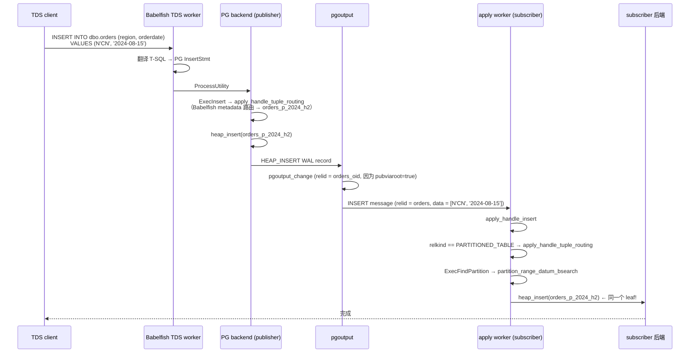

# PostgreSQL 逻辑复制：`publish_via_partition_root` 的完整行为分析

| 编写人 | 编写内容 | 编写时间 |
| --- | --- | --- |
| growdu | 初稿，结合 PostgreSQL 17 源码 + Babelfish T-SQL 扩展 | 2026-08-24 |

> 本文是分区表 + 逻辑复制系列的**第六篇**。
>
> 之前几篇把 `publish_via_partition_root`（PG 内部简称 `pubviaroot`）作为"细节"提了一下，但没有一篇是**专门**讲它的。本文把它单独拎出来，从 catalog、DDL、pgoutput、apply worker、worker 模型、Babelfish 兼容层六个角度讲透。

主要源码路径：
- `~/cwork/postgresql/src/include/catalog/pg_publication.h`
- `~/cwork/postgresql/src/backend/catalog/pg_publication.c`
- `~/cwork/postgresql/src/backend/commands/publicationcmds.c`
- `~/cwork/postgresql/src/backend/replication/pgoutput/pgoutput.c`
- `~/cwork/postgresql/src/backend/replication/logical/worker.c`
- `~/cwork/postgresql/src/backend/replication/logical/relation.c`
- `~/cwork/babelfish_extensions/contrib/babelfishpg_tsql/src/pltsql_partition.c`

---

## 一、一句话回答

> `publish_via_partition_root` 是 **publication 级别的布尔 GUC**（catalog 列），它决定当一个 **partitioned table 的某个 leaf** 发生变更时，pgoutput 发出的 INSERT/UPDATE/DELETE/TRUNCATE 消息里 `relid` 字段是 **leaf OID** 还是 **父表 OID**。

它在分区表 + 逻辑复制这条链路上是**唯一一个会显著改变"事件粒度"**的开关。一旦你 `ALTER PUBLICATION ... SET (publish_via_partition_root = true)`，下游 subscriber 端 apply worker 的整条路径都会跟着变。

---

## 二、它在 catalog 里长什么样

### 2.1 `pg_publication` 系统表

`src/include/catalog/pg_publication.h:56`：

```c
CATALOG(pg_publication,6104,PublicationRelationId)
{
    Oid         oid;
    NameData    pubname;
    Oid         pubowner BKI_DEFAULT(InvalidOid);

    bool        puballtables;
    bool        pubinsert BKI_DEFAULT(t);
    bool        pubupdate BKI_DEFAULT(t);
    bool        pubdelete BKI_DEFAULT(t);
    bool        pubtruncate BKI_DEFAULT(t);
    bool        pubviaroot BKI_DEFAULT(f);     /* ★ 这一列 */

    NameData    pubnamespace;
    ...
} FormData_pg_publication;
```

`pubviaroot` 是 publication 一行的 boolean 列，**默认 false**（从 PG 13 引入）。

### 2.2 设置语法

```sql
-- 创建 publication 时指定
CREATE PUBLICATION pub_orders
    FOR TABLE orders, orders_archive
    WITH (publish_via_partition_root = true);

-- 已有 publication 上修改
ALTER PUBLICATION pub_orders SET (publish_via_partition_root = true);
```

源码 `publicationcmds.c:158`：

```c
else if (strcmp(defel->defname, "publish_via_partition_root") == 0)
{
    if (*publish_via_partition_root_given)
        ereport(ERROR, ...);
    *publish_via_partition_root_given = true;
    *publish_via_partition_root = defGetBoolean(defel);
}
```

> 唯一约束：每个 publication 只能设一次；不能同条 SQL 里"重复设置"。

### 2.3 关联枚举：`PublicationPartOpt`

`pg_publication.h:158`：

```c
typedef enum PublicationPartOpt {
    PUBLICATION_PART_ROOT,     /* 父表 OID */
    PUBLICATION_PART_LEAF,     /* leaf OID */
    PUBLICATION_PART_ALL       /* 父表 + 所有 leaf */
} PublicationPartOpt;
```

这个枚举是**内部辅助**，跟 `pubviaroot` 配合使用：

| `pubviaroot` | `PublicationPartOpt` | 含义 |
| --- | --- | --- |
| `true` | `PUBLICATION_PART_ROOT` | 表 / 祖先 OID |
| `false` | `PUBLICATION_PART_LEAF` | leaf OID |
| `true` 但 FOR ALL TABLES | `PUBLICATION_PART_ALL` | 父表 + leaf 都返回（用于 schema 校验） |

### 2.4 `GetPublicationRelations` 内的转换

`pg_publication.c:1158`（`GetRelationPublications` 或类似函数里）：

```c
if (pub_elem->alltables)
    pub_elem_tables = GetAllTablesPublicationRelations(pub_elem->pubviaroot);
else
{
    List *relids;
    List *schemarelids;
    relids = GetPublicationRelations(pub_elem->oid,
                                     pub_elem->pubviaroot ?
                                     PUBLICATION_PART_ROOT :
                                     PUBLICATION_PART_LEAF);
    schemarelids = GetAllSchemaPublicationRelations(pub_elem->oid,
                                                   pub_elem->pubviaroot ?
                                                   PUBLICATION_PART_ROOT :
                                                   PUBLICATION_PART_LEAF);
    pub_elem_tables = list_concat_unique_oid(relids, schemarelids);
}
```

`GetPubPartitionOptionRelations`（`pg_publication.c:305`）内部：

```c
if (get_rel_relkind(relid) == RELKIND_PARTITIONED_TABLE &&
    pub_partopt != PUBLICATION_PART_ROOT) {
    List *all_parts = find_all_inheritors(relid, NoLock, NULL);
    if (pub_partopt == PUBLICATION_PART_ALL)
        result = list_concat(result, all_parts);
    else if (pub_partopt == PUBLICATION_PART_LEAF) {
        foreach(lc, all_parts) {
            Oid partOid = lfirst_oid(lc);
            if (get_rel_relkind(partOid) != RELKIND_PARTITIONED_TABLE)
                result = lappend_oid(result, partOid);
        }
    }
} else
    result = lappend_oid(result, relid);
```

> **关键不变量**：当 `pubviaroot = true` 且你 `FOR TABLE orders` 时，**只返 `orders` 自己的 OID**——不会返回任何 leaf。当 `pubviaroot = false` 时，**返回所有 leaf OID**，不返回 `orders`。

---

## 三、publisher 端：pgoutput 怎么用这个字段

### 3.1 入口：`get_rel_sync_entry`

`pgoutput.c:2052` 是入口。每当 publisher 的 `pgoutput_change` 收到一条 change，都会调到：

```c
static RelationSyncEntry *
get_rel_sync_entry(PGOutputData *data, Relation relation) {
    ...
    foreach(lc, data->publications) {
        Publication *pub = (Publication *) lfirst(lc);
        Oid pub_relid = relid;
        int ancestor_level = 0;

        if (pub->alltables) {
            publish = true;
            if (pub->pubviaroot && am_partition) {
                List *ancestors = get_partition_ancestors(relid);
                pub_relid = llast_oid(ancestors);   /* 最高层祖先 */
                ancestor_level = list_length(ancestors);
            }
        }

        if (!publish) {
            bool ancestor_published = false;
            if (am_partition) {
                Oid ancestor;
                int level;
                List *ancestors = get_partition_ancestors(relid);
                ancestor = GetTopMostAncestorInPublication(pub->oid,
                                                          ancestors, &level);
                if (ancestor != InvalidOid) {
                    ancestor_published = true;
                    if (pub->pubviaroot) {
                        pub_relid = ancestor;
                        ancestor_level = level;
                    }
                }
            }
            if (list_member_oid(pubids, pub->oid) ||
                list_member_oid(schemaPubids, pub->oid) ||
                ancestor_published)
                publish = true;
        }

        /* ★ 关键判断 */
        if (publish &&
            (relkind != RELKIND_PARTITIONED_TABLE || pub->pubviaroot)) {
            entry->pubactions.pubinsert |= pub->pubactions.pubinsert;
            ...
            entry->publish_as_relid = pub_relid;  /* ★ 决定发出去的 relid */
        }
    }
    return entry;
}
```

两个关键决策点：

#### 决策点 1：是否要 publish

```c
if (publish &&
    (relkind != RELKIND_PARTITIONED_TABLE || pub->pubviaroot))
```

**含义**：

- 如果 relation 是**分区表本身**（不是 partition）→ **只有在 `pubviaroot=true` 时才 publish**。否则跳过——因为分区表自身没有数据。
- 如果 relation 是**普通 leaf**（不是分区表）→ 正常 publish。
- 如果 relation 是**嵌套分区的中间层**（既是分区表也是 partition）→ 视情况而定，但一般也走 `pubviaroot=true` 才 publish。

> 这就是为什么 `pubviaroot=true` 必须配套"挂父表到 publication"——否则父表根本不会被 publish，subscriber 端啥也收不到。

#### 决策点 2：以哪个 relid 上报

```c
entry->publish_as_relid = pub_relid;
```

`pub_relid` 的赋值逻辑：

- 如果是 `FOR ALL TABLES` 且 `pubviaroot=true` 且是 partition → 取 `get_partition_ancestors(relid)` 最后一个（即根）。
- 否则如果是 `FOR TABLE parent` 且 `pubviaroot=true` 且是 partition → 取祖先中"该 publication 包含的最高层"。
- 如果 `pubviaroot=false` → 保持 leaf 自己的 relid。

#### 决策点 3：祖先选择去重

```c
/* We want to publish the changes as the top-most ancestor across all
   publications. */
if (publish_ancestor_level > ancestor_level)
    continue;
if (publish_ancestor_level < ancestor_level) {
    publish_as_relid = pub_relid;
    publish_ancestor_level = ancestor_level;
    /* reset the publication list for this relation */
    rel_publications = NIL;
}
```

如果同一张 leaf 在多个 publication 里都订阅了，pgoutput 取**最高层**的祖先作为上报 relid，避免同一变更在不同 publication 里产生不同事件。

### 3.2 用 `publish_as_relid` 发出 change

`pgoutput_change`（`pgoutput.c:1482`）：

```c
relentry = get_rel_sync_entry(data, relation);   /* 拿到 publish_as_relid */

/* 校验订阅动作是否开启 */
if (relkind == RELKIND_PARTITIONED_TABLE &&
    !relentry->pubactions.pubinsert &&
    relentry->publish_as_relid != RelationGetRelid(relation)) {
    /* partitioned table 但 publish_as_relid 不是它自己 → 检查 root 的 actions */
    ...
}

/* 发 INSERT 消息时 */
rel = RelationIdGetRelation(relentry->publish_as_relid);   /* ★ 用这个 relid */
logicalrep_write_insert(out, rel);
```

注意：relid 是 `publish_as_relid`——可能是 leaf 也可能是 root，**取决于 `pubviaroot`**。

### 3.3 schema 消息：`LOGICAL_REP_MSG_RELATION`

`pgoutput_send_relation` 也会用 `publish_as_relid` 作为 schema 消息的 `relid` 字段。所以 subscriber 端收到的 schema 是"publisher 端以哪个 OID 上报"的那张表的 schema。

---

## 四、subscriber 端：apply worker 怎么对应

### 4.1 `logicalrep_rel_open` 用 `remoteid` 找本地的 rel

`relation.c:380`：

```c
entry = (LogicalRepRelMapEntry *) hash_search(LogicalRepRelMap, ...);
entry->localrel = table_open(relid, NoLock);
CheckSubscriptionRelkind(entry->localrel->rd_rel->relkind, ...);
entry->localreloid = relid;
```

- `remoteid` = publisher 发出来的 `relid`（可能是 leaf 或 root）。
- `relid` = 在 **subscriber 本地 catalog** 用 `remoteid` lookup 出来的 OID。
- 两边 OID 通常**不同**——subscriber 端 OID 是本地分配的。

### 4.2 `apply_handle_insert` 的关键分支

`worker.c:2448`：

```c
if (rel->localrel->rd_rel->relkind == RELKIND_PARTITIONED_TABLE)
    apply_handle_tuple_routing(edata, remoteslot, NULL, CMD_INSERT);
else {
    ResultRelInfo *relinfo = edata->targetRelInfo;
    ExecOpenIndices(relinfo, false);
    apply_handle_insert_internal(edata, relinfo, remoteslot);
    ExecCloseIndices(relinfo);
}
```

这里 `rel->localrel` 是 subscriber 端按 `remoteid` 查到的 relation。

| `pubviaroot` | publisher 端发的 `remoteid` | subscriber 端 `localrel` 的 relkind | apply 走的分支 |
| --- | --- | --- | --- |
| `true` | 父表 OID | `RELKIND_PARTITIONED_TABLE` | `apply_handle_tuple_routing` |
| `false` | leaf OID | `RELKIND_RELATION` | `apply_handle_insert_internal`（直接） |

**核心结论**：

> `pubviaroot = true` → 强制走 `apply_handle_tuple_routing`，必须靠 subscriber 端 `ExecFindPartition` 自己找 leaf。
>
> `pubviaroot = false` → 直接 INSERT 到 leaf，subscriber 必须**事先建好 leaf**。

### 4.3 `apply_handle_tuple_routing` 内部

```c
partrelinfo = ExecFindPartition(mtstate, relinfo, proute, remoteslot, estate);

/* 检查 leaf relkind */
CheckSubscriptionRelkind(partrel->rd_rel->relkind, ...);

/* attr map 翻译: 父表 slot → leaf slot */
remoteslot_part = partrelinfo->ri_PartitionTupleSlot;
if (remoteslot_part == NULL)
    remoteslot_part = table_slot_create(partrel, &estate->es_tupleTable);
map = ExecGetRootToChildMap(partrelinfo, estate);
if (map != NULL)
    remoteslot_part = execute_attr_map_slot(attrmap, remoteslot, remoteslot_part);
else {
    remoteslot_part = ExecCopySlot(remoteslot_part, remoteslot);
    slot_getallattrs(remoteslot_part);
}

/* 落到 leaf */
apply_handle_insert_internal(edata, partrelinfo, remoteslot_part);
```

这条路径**完全不依赖** publisher 端 leaf 的 OID——只依赖 subscriber 端本地 partition tree 的拓扑。

---

## 五、三种挂法详解

### 5.1 挂法 X：`pubviaroot = false` + 挂所有 leaf

```sql
-- publisher:
CREATE TABLE orders ... PARTITION BY RANGE (ts);
CREATE TABLE orders_p1 PARTITION OF orders ...;
...
ALTER PUBLICATION pub_orders ADD TABLE orders_p1;
ALTER PUBLICATION pub_orders ADD TABLE orders_p2;
-- 8 个 leaf → 8 条 ADD TABLE
```

| 阶段 | 行为 |
| --- | --- |
| publisher `pgoutput_change` | `publish_as_relid = leaf OID`（默认） |
| wire `relid` | leaf OID |
| subscriber `apply_handle_insert` | leaf `apply_handle_insert_internal` 直接 |
| subscriber 端 leaf 必须存在 | ✅ **强制** |
| 加新 leaf 的运维 | 必须 `ALTER PUBLICATION ... ADD TABLE` + `ALTER SUBSCRIPTION ... ADD TABLE` |

### 5.2 挂法 Y：`pubviaroot = true` + 只挂父表（PG 14+ 推荐）

```sql
-- publisher:
ALTER PUBLICATION pub_orders ADD TABLE orders;
ALTER PUBLICATION pub_orders SET (publish_via_partition_root = true);
```

| 阶段 | 行为 |
| --- | --- |
| publisher `pgoutput_change` | `publish_as_relid = 父表 OID`（祖先最高层） |
| wire `relid` | 父表 OID |
| subscriber `apply_handle_insert` | `apply_handle_tuple_routing` → `ExecFindPartition` |
| subscriber 端 leaf 必须存在 | ❌ **不强制**（PG 16+ 实验性 auto-create） |
| 加新 leaf 的运维 | publisher 端 `CREATE TABLE ... PARTITION OF ...`，subscriber 端手工建 leaf |

### 5.3 挂法 Z：`pubviaroot = true` + 挂父表 + 也挂部分 leaf

```sql
-- publisher:
ALTER PUBLICATION pub_orders ADD TABLE orders;
ALTER PUBLICATION pub_orders ADD TABLE orders_p1;  /* 这一行会被去重 */
ALTER PUBLICATION pub_orders SET (publish_via_partition_root = true);
```

`pgoutput.c` 的祖先去重逻辑（`pgoutput.c:2207`）：

```c
foreach(lc, data->publications) {
    ...
    if (publish_ancestor_level < ancestor_level) {
        publish_as_relid = pub_relid;
        publish_ancestor_level = ancestor_level;
        /* reset the publication list for this relation */
        rel_publications = NIL;
    }
}
```

> `orders_p1` 被 `orders` "覆盖"——所有 leaf 都会按"祖先最高层"为 `orders` 来发。所以**挂 leaf 那行其实是冗余的**。

### 5.4 完整对比表

| 维度 | X: 挂 leaf | Y: 挂父表 + `pubviaroot=true` | Z: 挂父表 + 部分 leaf + `pubviaroot=true` |
| --- | --- | --- | --- |
| publisher 端 PG 端消息粒度 | leaf OID | 父表 OID | 父表 OID（leaf 被覆盖） |
| subscriber `apply_handle_insert` 走的分支 | 直接 INSERT | `apply_handle_tuple_routing` | `apply_handle_tuple_routing` |
| subscriber 端必须建好 leaf？ | ✅ 强制 | ❌ 不强制（ExecFindPartition 内部靠 partition tree 找） | ❌ |
| subscriber `pg_subscription_rel` 行数 | N（leaf 数） | 1 | 1（leaf 行被去重） |
| 加新 leaf 后要 `ALTER SUBSCRIPTION REFRESH PUBLICATION`？ | **必须** | 否（靠 routing） | 否 |
| 加新 leaf 后要手工同步 DDL？ | 是 | 是 | 是 |
| 性能（INSERT 单 tuple） | 直接 INSERT | routing + attr map（多 1–2 μs） | 同 Y |
| 适用场景 | 老 PG（< 14）/ 跨 schema | PG 14+ 通用 | 过渡期 |

---

## 六、pubviaroot 决定了哪些 subscriber 必须存在

| `pubviaroot` | `ALTER SUBSCRIPTION` 触发 tablesync | tablesync worker 处理 | 必须存在的 subscriber 端对象 |
| --- | --- | --- | --- |
| `false` | `pg_subscription_rel` 多行（每个 leaf） | 多个 tablesync worker（≤ `max_sync_workers_per_subscription`） | 每个 leaf 必须存在，否则 COPY 阶段报错 |
| `true` | `pg_subscription_rel` 只 1 行（父表） | 1 个 tablesync worker | 父表 + 所有 routing 要用的 leaf 必须存在（PG 16+ auto-create 实验） |

> 挂法 X 的"必须存在"是**订阅期**的强制要求；挂法 Y 的"必须存在"是**路由期**的强制要求——`ExecFindPartition` 找不到 leaf 会报"no partition of relation found for row"。

---

## 七、`pubviaroot=true` 的"silent failure"陷阱

`pubviaroot=true` 看起来"省事"，但有几个隐性坑：

### 7.1 subscriber 端 leaf 缺一个就完蛋

```text
publisher: INSERT INTO orders_p3 ...
         ↓ pgoutput: relid = orders (pubviaroot=true)
subscriber: apply_handle_tuple_routing → ExecFindPartition
         ↓ partition tree 里没 orders_p3 → ERROR "no partition found"
```

整个 publisher 的后续 INSERT 全部被 abort——因为 apply worker 抛错后会进入 catch-up 重试，无限循环。

### 7.2 subscriber 端 leaf 多一个没用

subscriber 端 leaf 比 publisher 端多一个没用——不会接收任何变更（pgoutput 不会发"多余 leaf"的 change）。

### 7.3 DDL 同步延迟导致竞态

publisher 上 `CREATE TABLE orders_p3 PARTITION OF orders ...` 之后，subscriber 端如果还没手工建 `orders_p3`，那么：
- publisher 端的 INSERT 到 `orders_p3` 不会立刻报错（pgoutput 还能发父表 OID）。
- subscriber 端 apply 时报"no partition found"。
- 在 subscriber 端手工建好 `orders_p3` 之前，所有 `orders` 上的 INSERT 都阻塞。

### 7.4 row filter 与 `pubviaroot` 交互

`pg_publication_rel.prqual`（row filter）是按 `(publish_as_relid, pubid)` 存的：

```c
/* publicationcmds.c:300 */
if (pubviaroot && relation->rd_rel->relispartition) {
    publish_as_relid = GetTopMostAncestorInPublication(pubid, ancestors, NULL);
    ...
}
rftuple = SearchSysCache2(PUBLICATIONRELMAP,
                          ObjectIdGetDatum(publish_as_relid),
                          ObjectIdGetDatum(pubid));
```

也就是说，如果你给 `orders_p3` 设了 row filter `WHERE amount > 100`，**实际生效的是发布到 `orders` 父表的同一 row filter**——而不是直接挂在 `orders_p3` 上。

`publicationcmds.c:247` 注释：

```c
* If pubviaroot is true, we are validating the row filter of the parent
  (publish_as_relid) and applying it to the child (relation).
```

---

## 八、与 worker 模型的关系

### 8.1 `pubviaroot` 不直接改变 worker 数量

无论 `pubviaroot` 是 true 还是 false，**一个 subscription 永远一个 apply worker**。

但它影响 **tablesync worker 的数量**：

| `pubviaroot` | `pg_subscription_rel` 行数 | tablesync worker 数（初始同步阶段） |
| --- | --- | --- |
| `false` | N（leaf 数） | ≤ `max_sync_workers_per_subscription`，分 N 批 |
| `true` | 1（父表） | 1 |

> 这就是为什么 `pubviaroot=true` 在大分区表（32+ leaf）上**初始同步快得多**——只起 1 个 tablesync worker。

### 8.2 catch-up 阶段行为差异

catch-up 阶段（tablesync 完成 COPY 之后到 `READY` 之间）：

- `pubviaroot=true`：tablesync worker 临时变成 apply worker，从自己 slot 拉 WAL 应用到 subscriber 父表 → `apply_handle_tuple_routing` → 落 leaf。
- `pubviaroot=false`：tablesync worker 直接 apply leaf 的 INSERT。

> 区别仅在"路由 vs 直写"，不影响 catch-up 时序。

### 8.3 add new leaf 后的 worker 行为

```sql
-- publisher: 加新 leaf (假设已经在 pub_orders 里)
CREATE TABLE orders_p_new PARTITION OF orders ...;
```

| `pubviaroot` | apply worker 是否自动开始同步 `orders_p_new`？ | 需要 DDL 同步？ | 需要 `REFRESH PUBLICATION`？ |
| --- | --- | --- | --- |
| `false` | ❌（leaf 不在 `pg_subscription_rel`） | 是 | 是（ADD TABLE） |
| `true` | ✅（`apply_handle_tuple_routing` 自动发现） | 是 | 否（但要建 leaf） |

这就是 `pubviaroot=true` 的**最大运维优势**——加新 leaf 不需要改 subscription。

---

## 九、Babelfish T-SQL 模式下的特殊处理

### 9.1 Babelfish 不直接修改 `pubviaroot`

Babelfish 的 `CREATE PUBLICATION` / `ALTER PUBLICATION` 走 PG 原生路径（T-SQL 包装），所以 `pubviaroot` 完全由 DBA 在 T-SQL 里指定：

```sql
-- publisher TDS 端口:
ALTER PUBLICATION pub_orders SET (publish_via_partition_root = true);
```

这是标准 T-SQL / PG 通用语法，**Babelfish 不做任何特殊处理**。

### 9.2 Babelfish partition metadata 与 `pubviaroot` 的关系

Babelfish 的 `sys.babelfish_partition_function` / `sys.babelfish_partition_scheme` 是 **T-SQL 元数据**，不影响 `pubviaroot`。

具体行为：

| `pubviaroot` | publisher 端 INSERT | publisher 端 $PARTITION | subscriber 端 INSERT | subscriber 端 $PARTITION |
| --- | --- | --- | --- | --- |
| `true` | 走 Babelfish routing（基于 partition function） | 返回 T-SQL 风格 1-based 段号 | 走 PG 原生 routing（基于 pg_partitioned_table） | $PARTITION.<func> 查 babelfish_partition_function |
| `false` | 同上 | 同上 | 直接 INSERT 到 leaf | 同上 |

**关键观察**：

- **`pubviaroot=true` 走 routing 时，subscriber 端的 routing 完全靠 PG 原生的 `pg_partitioned_table` + `partition_range_datum_bsearch`**——不依赖 Babelfish 的 partition function/scheme。
- 所以**`pubviaroot=true` 在 Babelfish 模式下特别好用**：subscriber 不需要"重新"建 partition function/scheme——只要 PG 原生分区表的拓扑存在就行。
- **`pubviaroot=false` 在 Babelfish 模式下也行**：subscriber 必须把所有 leaf 镜像都建好（partitions 全套），但 Babelfish 的 partition function/scheme 仍要建（不然 `$PARTITION` 在 subscriber 端查不到）。

### 9.3 端到端示例（Babelfish + `pubviaroot=true`）



> 注意：publisher 端是 Babelfish routing（`bbf_create_partition_tables` + `ExecFindPartition`），subscriber 端是 PG 原生 routing（`apply_handle_tuple_routing` + `ExecFindPartition`）——**两套 metadata 各自决定 leaf，但 leaf 是同一张表**。

### 9.4 一致性保证

`pubviaroot=true` 假设 publisher 和 subscriber 的 partition tree **结构上等价**：

- partition key 类型、范围、boundary 必须一致。
- leaf 的 column layout 必须一致（attr map 翻译可能补齐列差异）。

**Babelfish 模式下的额外不变量**：

- subscriber 端的 `sys.babelfish_partition_function` 边界值必须和 publisher 端**完全一致**（否则 `$PARTITION.<func>(col)` 在两边返回不同段号）——但这不影响 routing（routing 走 PG 原生）。

---

## 十、`pubviaroot` 与其他参数的关系

### 10.1 `publish_via_partition_root` 是 publication 级别的

不是 subscription 级、不是 table 级。一个 subscription 可以有多个 publication，每个 publication 可以独立设 `pubviaroot`。

### 10.2 与 `publish` 参数（insert/update/delete/truncate）的关系

```sql
ALTER PUBLICATION pub_orders SET (publish_via_partition_root = true,
                                  publish = 'insert, update');
```

`publish` 控制 INSERT/UPDATE/DELETE/TRUNCATE 是否发——与 `pubviaroot` 无关。两者独立。

### 10.3 与 `FOR ALL TABLES` 的关系

```sql
CREATE PUBLICATION pub_all FOR ALL TABLES
    WITH (publish_via_partition_root = true);
```

`FOR ALL TABLES + pubviaroot=true` 的语义是：**所有表（包括分区表的 leaf）都按"祖先最高层"上报**。这意味着 subscriber 端必须为每张 partitioned table 建一个父表——这对跨库迁移很方便。

### 10.4 与 `FOR SCHEMA` 的关系

```sql
CREATE PUBLICATION pub_schema FOR TABLES IN SCHEMA public
    WITH (publish_via_partition_root = true);
```

`FOR TABLES IN SCHEMA` + `pubviaroot=true` 同样按"祖先最高层"。

### 10.5 与 row filter / column list 的关系

row filter 是按 `(publish_as_relid, pubid)` 存的。所以：

- `pubviaroot=true` 时 row filter 写在父表上，apply 时对所有 leaf 生效。
- `pubviaroot=false` 时 row filter 写在 leaf 上，只对该 leaf 生效。

column list 类似：

```sql
ALTER PUBLICATION pub_orders ADD TABLE orders, orders_p1
    WITH (publish_via_partition_root = true);

-- 想限制列:
ALTER PUBLICATION pub_orders SET (publish = 'insert, update');
CREATE PUBLICATION pub_orders_cols FOR TABLE orders (col1, col2)
    WITH (publish_via_partition_root = true);
```

---

## 十一、监控与诊断

### 11.1 查看 publication 的 `pubviaroot`

```sql
SELECT oid, pubname, puballtables, pubviaroot
  FROM pg_publication;
```

### 11.2 查看 publisher 端 pgoutput 实际发出的 relid

没有直接 SQL 视图——但可以通过 `pg_stat_replication` 加上 `application_name` 间接观察：

```sql
SELECT pid, application_name, state, sync_state, sent_lsn
  FROM pg_stat_replication;
```

要严格观察的话，需要打开 `pgoutput` 的 `debug_print_relid = on`（PG 没有这个 GUC，但可以通过 `EXPLAIN (verbose on)` 看 replication plan）。

### 11.3 查看 subscriber 端路由情况

```sql
SELECT srrelid::regclass AS tbl, srsubstate, srsublsn
  FROM pg_subscription_rel
 WHERE srsubid = (SELECT oid FROM pg_subscription WHERE subname = 'sub_orders');
```

如果 `srrelid` 是父表 OID，说明是 `pubviaroot=true` 路径；如果是 leaf OID，说明是 `pubviaroot=false` 路径。

### 11.4 常见错误

| 错误 | 原因 | 解决 |
| --- | --- | --- |
| `no partition of relation "orders" found for row` | subscriber 端 leaf 缺失 | 手工建 leaf DDL |
| `cannot use relation "xxx" as logical replication target` | leaf 是 VIEW / FOREIGN TABLE 等不支持类型 | 改用普通表 |
| apply worker 死循环重试 | `apply_handle_tuple_routing` 永远找不到 leaf | 检查 DDL 同步状态 |
| subscriber 端 `srsublsn` 卡住不动 | catch-up 阶段找不到 leaf | 同上 |

---

## 十二、修改指南

### 12.1 想让 `pubviaroot` 支持 per-table 设置

当前 `pubviaroot` 是 publication 级。要 per-table：

1. `pg_publication.h`：`pg_publication_rel` 加 `pubviaroot_per_table` 列。
2. `pg_publication.c`：`GetPublicationRelations` 接受 `relid` 参数，按 relid 决定 root / leaf。
3. `pgoutput.c:2207`：`get_rel_sync_entry` 改成查 `pg_publication_rel` 而不是 `pg_publication`。
4. catalog bump：触发 `pg_upgrade` 兼容代码。

### 12.2 想让 `pubviaroot` 支持更细的"祖先层选择"

比如"以中间层 partition 节点为 relid"：

1. `GetTopMostAncestorInPublication` 接受 `max_level` 参数。
2. `pgoutput.c` 提供 GUC `publish_via_partition_root_max_level`（`pub` 级）。
3. subscriber 端 apply worker 要支持"对应中间层"的 routing——这会复杂很多。

### 12.3 Babelfish 模式下让 `pubviaroot` 与 partition function 自动绑定

理想：Babelfish 在 publisher 端建 partition function/scheme 时，**自动** `ALTER PUBLICATION ... SET (publish_via_partition_root = true)`。

涉及：

- `pl_exec-2.c:4350` `exec_stmt_partition_function` 后面加一个 hook 检查"该 publication 是否包含 partition table"。
- `pl_exec-2.c:4645` `exec_stmt_partition_scheme` 同步触发。

这是 Babelfish 路线图上的工作，目前没实现。

---

## 十三、总结：为什么之前的分析没有专门讲 `pubviaroot`

之前几篇把 `pubviaroot` 作为"细节"提了一下，但没专门讲，是因为它的语义**横跨多文件、多模块**：

| 模块 | 影响 |
| --- | --- |
| `pg_publication` catalog | `pubviaroot` 列存哪 |
| `pg_publication.c` | `GetPublicationRelations` 用 `PublicationPartOpt` 决定返 root / leaf |
| `publicationcmds.c` | `CREATE/ALTER PUBLICATION` 语法解析 |
| `pgoutput.c` | `get_rel_sync_entry` 决定 `publish_as_relid` |
| `pgoutput.c` | `pgoutput_change` 用 `publish_as_relid` 发 change |
| `worker.c` | `apply_handle_insert` 按 `localrel->relkind` 分支 |
| `worker.c` | `apply_handle_tuple_routing` 决定是否走 routing |
| `execPartition.c` | `ExecFindPartition` 真正找 leaf |
| `relation.c` | `LogicalRepRelMap` 的 `attrmap` 在 root 模式下的翻译 |
| `execReplication.c` | `CheckSubscriptionRelkind` 二次校验 |
| `partcache.c` | `RelationBuildPartitionKey` 提供 routing 用的 key |
| `partbounds.c` | `partition_*_bsearch` 真正算 partidx |

这一篇把它们**整合在一起**，给出一个完整的"pubviaroot = true 之后，所有代码路径都怎么走"的图。

**结论一句话**：

> **挂法 Y（`pubviaroot=true` + 只挂父表）是 PG 14+ 推荐路径**——少 worker、少运维、高内聚。Babelfish 模式下同样推荐。挂法 X 是"老派"路径，需要每 leaf 单独订阅；挂法 Z 是"过渡期"路径，行为上等同于 Y。

如果一定要选，建议：

| 场景 | 推荐挂法 |
| --- | --- |
| 新部署 | Y |
| 跨大版本升级（PG 13 → 14+） | X（兼容性好）→ 慢慢过渡到 Y |
| 跨数据库同步 + 频繁加 leaf | Y |
| 跨 schema（subscriber 端 leaf 在不同 schema） | Y（attr map 自动翻译） |
| row filter 复杂 | Y（filter 写在父表，自动对所有 leaf 生效） |
| 性能极致要求 | X（少一次 attr map 翻译） |

> 详见 [PostgreSQL vs SQL Server 分区表实战](./postgresql-vs-sqlserver-partitioning/index.html) 的对比表。
