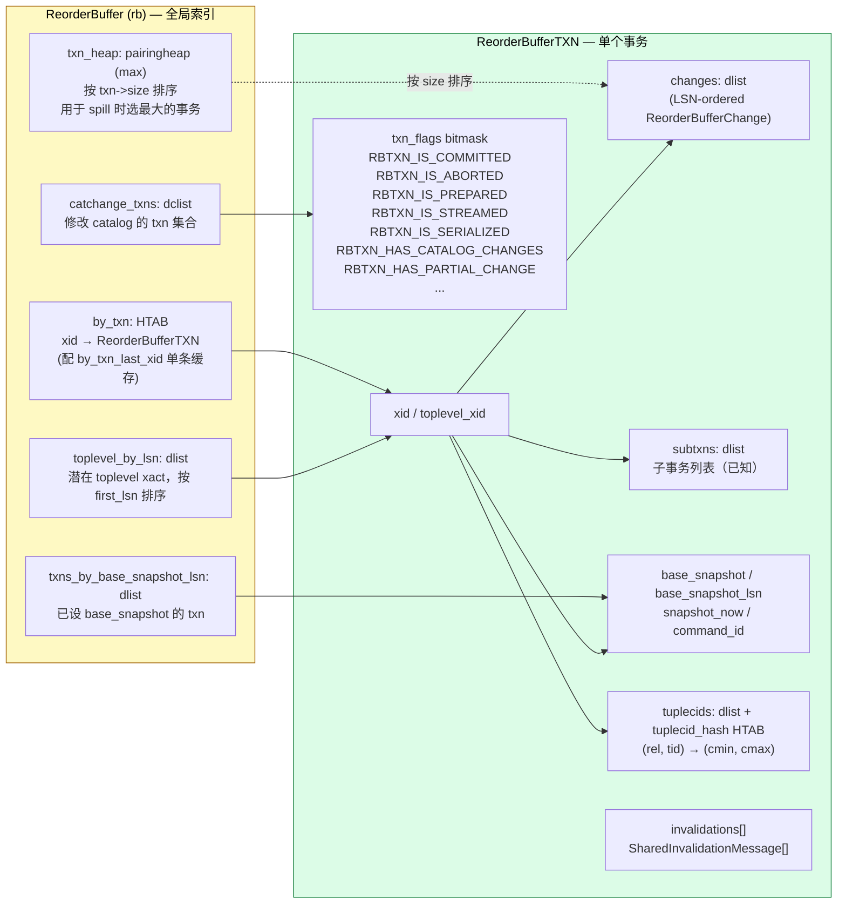
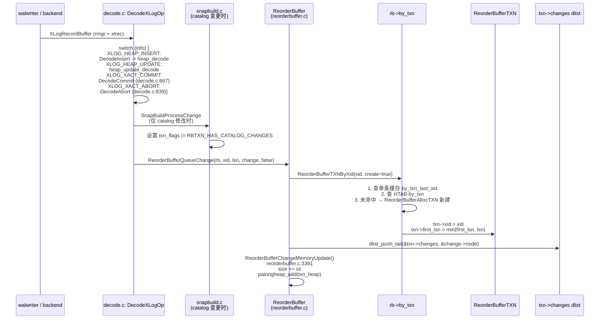
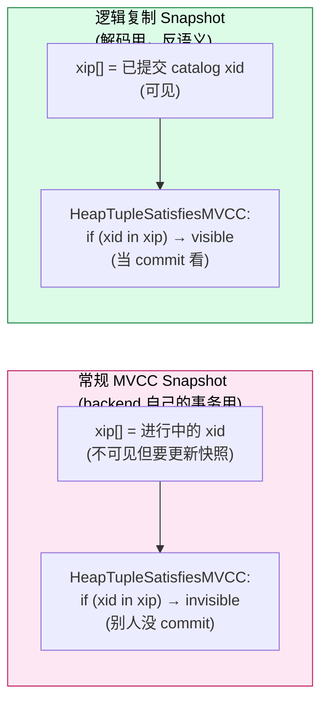
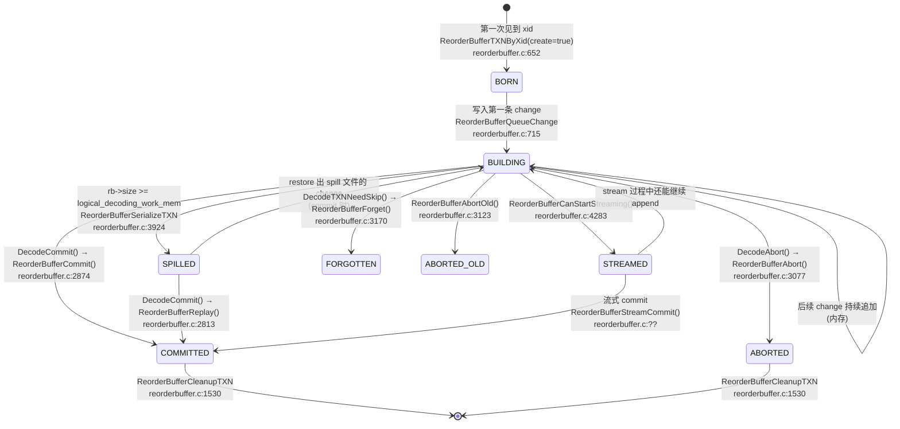
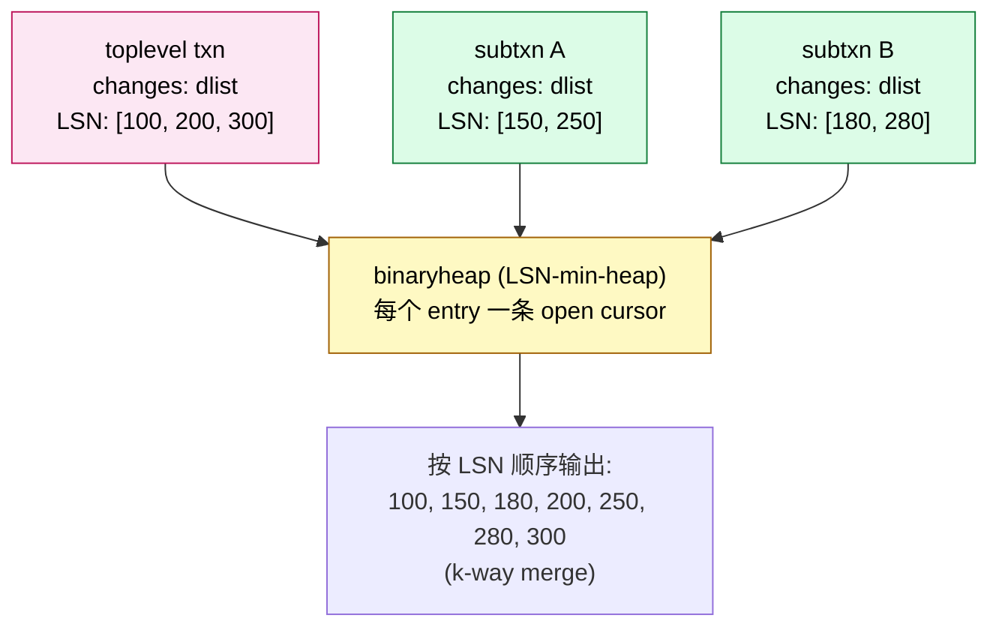
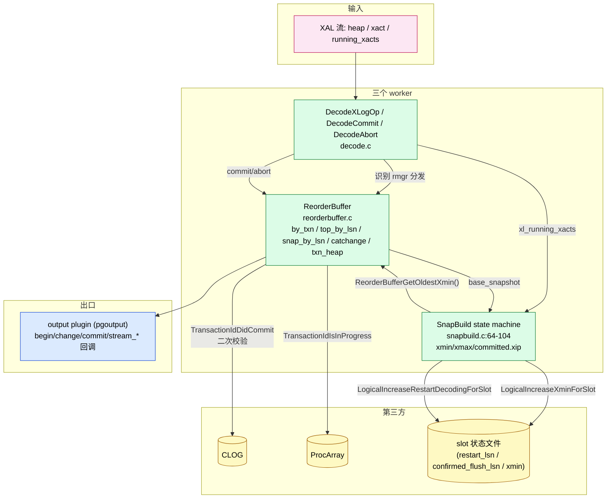
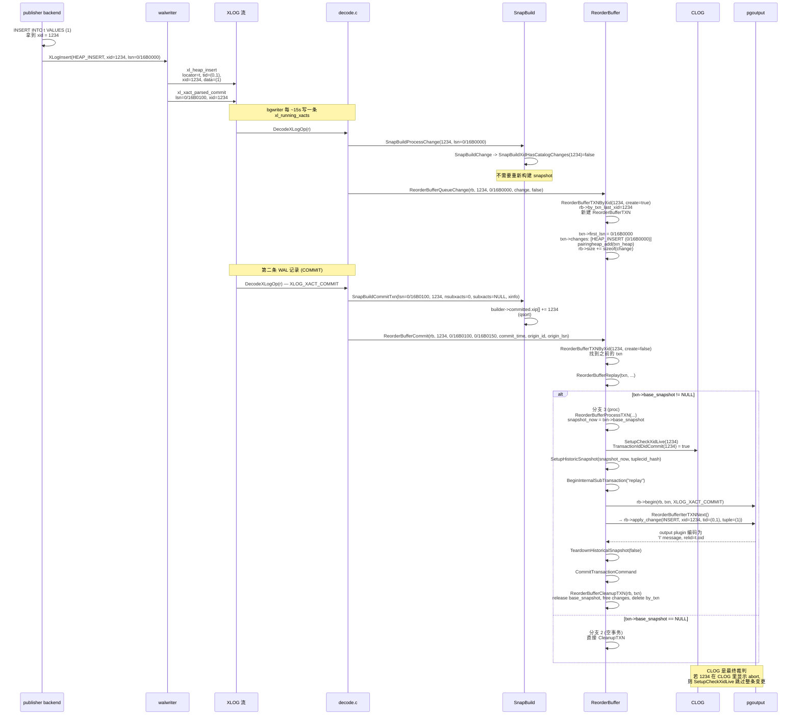

# PostgreSQL 逻辑复制的 ReorderBuffer 与事务机制：从一行 WAL 到一致性变更流的全链路绑定

| 编写人 | 编写内容 | 编写时间 |
| --- | --- | --- |
| growdu | 初稿，结合 PostgreSQL 18 dev 源码 + ReorderBuffer × SnapBuild × CLOG 三方协作 | 2026-08-28 |

> 本文是「PostgreSQL 逻辑复制系列」的第 N 篇。配套源码版本：PostgreSQL 18 dev（`~/cwork/postgresql`）。同系列前文：
>
> - [PostgreSQL 逻辑复制 streaming 与 spill：从 reorderbuffer 到 `<subid>-<xid>.changes` 的全程真相](./postgresql-logical-replication-streaming-spill/index.html)
> - [PostgreSQL 逻辑复制 spill 文件深度剖析：从 `xid-*.spill` 到 TPC-C 的增长方程](./postgresql-logical-replication-spill-deep-dive/index.html)
> - [PostgreSQL 逻辑复制表的生命周期：从 `pg_replication_slots` 到 `pg_subscription_rel` 的全景图](./postgresql-logical-replication-tables-lifecycle/index.html)
> - [PostgreSQL 逻辑复制的监控：六张视图 + 一组可执行 SQL](./postgresql-logical-replication-monitoring/index.html)
> - [PostgreSQL 逻辑复制订阅参数全解：从 run_as_owner 到 disable_on_error](./postgresql-logical-replication-options/index.html)

很多人以为逻辑复制就是"publisher 解码 WAL → subscriber 重放"——把它想成一份 `tcpdump -X` + `psql -f`。但只要你想过一次"如果事务在 publisher 上回滚了，subscriber 怎么办？"、"如果 publisher 写到一半崩了，重启后怎么保证不丢、不重、不乱？"，你就会发现：**逻辑复制"看起来简单"的背后，是一整套事务机制 + 快照系统 + CLOG 检查 + restart-lsn 校验的精妙协作**。

而这套协作的"心脏"，是 `ReorderBuffer`。

本文围绕三个核心问题展开：

1. **变更如何归位到正确的 txn？**——WAL 进来时，xid 可能是子事务、可能是顶层事务、可能没提交、可能提交了又被回滚，怎么保证最后输送给 output plugin 的变更流与 publisher 上各事务的 commit / abort 顺序一一对应？
2. **snapshot 如何保证 catalog 一致性？**——解码需要"假装"自己在一个历史快照中访问 catalog，这个假装的快照怎么构造？怎么校验它仍然"算历史"？
3. **重启后怎么继续正确？**——publisher 节点崩了，subscriber 端的 LSN 怎么确定"哪些 txn 已经发出去了"、"哪些事务变更不可恢复"？

这三个问题全部围绕 `ReorderBuffer`、`SnapBuild`、`CLOG` 三方协作展开。把这三方协作链路画清楚，你就拿到了逻辑复制"事务一致性"的全部底牌。

---

## 一、先画总览图：三方协作的因果链

逻辑复制一致性不是某一张表的责任，而是 publisher 进程内 4 个对象的协作。把这 4 个对象画在一张图上：

```mermaid
flowchart TB
  subgraph WAL["WAL 流 (XLOG_BLCKSZ 序列)"]
    W1[xl_heap_insert / update / delete]
    W2[xl_xact_parsed_commit / abort / prepare]
    W3[xl_running_xacts (每 ~15s)]
    W4[xl_heap2_inplace / xl_invalidations]
  end

  subgraph DEC["decode.c — 入口"]
    D1["DecodeXLogOp()<br/>识别 xlrec 类型"]
    D2["DecodeCommit() / DecodeAbort()<br/>decode.c:667/839"]
    D3["SnapBuildProcessRunningXacts()<br/>snapbuild.c:1136"]
  end

  subgraph SB["SnapBuild — 快照构造器"]
    S1["SnapBuild state<br/>START → BUILDING_SNAPSHOT<br/>→ FULL_SNAPSHOT → CONSISTENT"]
    S2["builder->committed.xip[]<br/>builder->xmin / xmax"]
    S3["SnapBuildBuildSnapshot()<br/>snapbuild.c:360"]
  end

  subgraph RB["ReorderBuffer — 变更容器"]
    R1["by_txn hash<br/>(xid → ReorderBufferTXN)"]
    R2["toplevel_by_lsn dlist"]
    R3["txns_by_base_snapshot_lsn dlist"]
    R4["txn_heap pairingheap (max-size)"]
    R5["每个 txn->changes dlist<br/>(ReorderBufferChange LSN-有序)"]
  end

  subgraph PG["PostgreSQL 事务子系统 (CLOG + ProcArray)"]
    P1["TransactionIdDidCommit(xid)<br/>→ CLOG 二级索引"]
    P2["TransactionIdIsInProgress(xid)<br/>→ ProcArray 活跃事务"]
    P3["GetOldestSafeDecodingTransactionId()<br/>→ ProcArray + slot xmin"]
  end

  subgraph OUT["output plugin (pgoutput / test_decoding)"]
    O1["begin / change / commit / stream_*<br/>回调函数"]
  end

  W1 --> D1 --> R5
  W2 --> D2 --> R1
  W3 --> D3 --> S1
  W4 --> D1

  D3 --> P3
  P3 --> SB
  S1 --> S2 --> S3 --> R3

  R1 --> P1
  R1 --> P2

  R5 --> O1

  classDef wal fill:#fce7f3,stroke:#be185d,color:#000
  classDef dec fill:#dbeafe,stroke:#1d4ed8,color:#000
  classDef sb fill:#fef9c3,stroke:#a16207,color:#000
  classDef rb fill:#dcfce7,stroke:#15803d,color:#000
  classDef pg fill:#fce7f3,stroke:#be185d,color:#000
  classDef out fill:#dcfce7,stroke:#15803d,color:#000

  class W1,W2,W3,W4 wal
  class D1,D2,D3 dec
  class S1,S2,S3 sb
  class R1,R2,R3,R4,R5 rb
  class P1,P2,P3 pg
  class O1 out
```

> **这张图最重要的观察**：
>
> - WAL 是源头，但 ReorderBuffer **不会**原样转发 WAL——它按 `txn` 重新组织。
> - 同一份 WAL 既要走 `SnapBuild` 维护 `xmin/xmax`，又要走 `ReorderBuffer` 维护 `txn`，**两条路径**互不阻塞。
> - `CLOG` 是终极裁判——任何 commit/abort 判断最后都问它，**避免内存缓存出错时数据错位**。

下面逐条拆开。

---

## 二、ReorderBuffer 的三大核心数据结构

`ReorderBuffer` 上有"全表"和"全 tx"两类结构。把它们画到一张图：



源码定义位置：

- 全局结构：`~/cwork/postgresql/src/include/replication/reorderbuffer.h:471-700`（`struct ReorderBuffer`）。
- 事务结构：`~/cwork/postgresql/src/include/replication/reorderbuffer.h:293-469`（`typedef struct ReorderBufferTXN`）。
- `txn_flags` 含义宏：见 `reorderbuffer.h:189-264` 的 `rbtxn_is_*` 系列宏。

**关键设计要点**：

1. **5 个独立索引各自服务一个查询路径**：
   - `by_txn`：按 xid 查 → "这条 WAL 属于谁？"
   - `toplevel_by_lsn`：按 LSN 查 → "最老的可能顶层事务是哪个？"（用于 restart_lsn 推进）
   - `txns_by_base_snapshot_lsn`：按 base_snapshot 排序 → "最老的 base_snapshot xmin 是多少？"（用于 slot xmin）
   - `catchange_txns`：catalog 修改事务集合 → "哪些事务可能改了 pg_class 等系统表？"
   - `txn_heap`：max-size → "内存满时，spill 哪条事务？"（`reorderbuffer.c:3456` 的 `GetTransactionBufSize` 选 heap[0]）
2. **每个 `ReorderBufferTXN` 5 个 LSN**：
   - `first_lsn` —— WAL 中首次见到此 xid 的 LSN
   - `final_lsn` —— 最后一次 commit/abort 记录的 LSN（spill 路径下会被回填为"已写到磁盘的最大 LSN"）
   - `end_lsn` —— commit record + 1（即 commit 之后第一条记录的起始）
   - `restart_decoding_lsn` —— 此 xid 解码"所需的所有变更"的最低 LSN 上限（用于 restart point）
   - `base_snapshot_lsn` —— 此 xid 的 base_snapshot 取自的 LSN

5 个 LSN 各司其职，**没有任何两个 LSN 在事务生命周期里冗余**。后续的 spill、stream、commit 路径都会反复读写它们。

---

## 三、变更如何归位到正确的 txn

从 publisher 的 `INSERT/UPDATE/DELETE` 到 ReorderBuffer 的一条 `ReorderBufferChange`，中间要经过 4 层封装。下面用一张 sequenceDiagram 把这条路径的"谁负责什么"画清：



**关键源码点**：

- `ReorderBufferTXNByXid()` —— `reorderbuffer.c:652`，单条缓存 + HTAB 二级查找。
- `ReorderBufferQueueChange()` —— `reorderbuffer.c:715`，**先把 change 挂到 `txn->changes` 尾部**，再触发内存计数。
- `ReorderBufferChangeMemoryUpdate()` —— `reorderbuffer.c:3457`，更新 `rb->size` 与 `txn->size`、维护 `txn_heap` 的 max 堆。

**子事务的特殊归位**：

如果 WAL 记录标的是子 xid（`XLOG_XACT_ASSIGN_SUBXACT`），需要两步：

1. `ReorderBufferAssignChild(rb, toplevel_xid, subxid, lsn)` —— `reorderbuffer.c:1106`，把子事务挂到 toplevel 的 `subtxns` 链表下，**这一步只建立归属，不传递变更**。
2. 后续变更来时，`ReorderBufferTXNByXid(subxid, create=true)` 会让子 xid 出现在 `by_txn` 里，但 **output plugin 解码时通过 `ReorderBufferIterTXNNext()` 的 k-way heap merge 把它合并到 toplevel**。详见 §十。

---

## 四、Snapshot 体系：xmin/xmax/xip 的"反语义"使用

逻辑复制不能直接读活的 catalog——因为活的 catalog 里可能还有"未提交"的修改未可见。所以 publisher 解码进程必须 **伪造一个历史快照**，让 catalog 访问看起来是某个过去时间点的 MVCC 视图。

但这个"历史快照"的构造与 `HeapTupleSatisfiesMVCC` 的常规使用**完全反着来**。看 `snapbuild.c:360-432`：

```c
Snapshot
SnapBuildBuildSnapshot(SnapBuild *builder)
{
    ...
    /*
     * We misuse the original meaning of SnapshotData's xip and subxip fields
     * to make the more fitting for our needs.
     *
     * In the 'xip' array we store transactions that have to be treated as
     * committed. ...
     * Snapshots that are used in transactions that have modified the
     * catalog also use the 'subxip' array to store their toplevel xid and
     * all the subtransaction xids ...
     *
     * Both arrays are qsort'ed so that we can use bsearch() on them.
     */
    snapshot->xmin = builder->xmin;
    snapshot->xmax = builder->xmax;

    /* store all transactions to be treated as committed by this snapshot */
    snapshot->xip = (TransactionId *) ((char *) snapshot + sizeof(SnapshotData));
    snapshot->xcnt = builder->committed.xcnt;
    memcpy(snapshot->xip, builder->committed.xip,
           builder->committed.xcnt * sizeof(TransactionId));

    qsort(snapshot->xip, snapshot->xcnt, sizeof(TransactionId), xidComparator);
    ...
    snapshot->subxcnt = 0;
    snapshot->subxip = NULL;

    snapshot->suboverflowed = false;
    snapshot->takenDuringRecovery = false;
    snapshot->copied = false;
    snapshot->curcid = FirstCommandId;
    snapshot->active_count = 0;
    snapshot->regd_count = 0;
    snapshot->snapXactCompletionCount = 0;

    return snapshot;
}
```

注释里的"We misuse the original meaning"是关键。**Normal MVCC snapshot 的 `xip[]` 是"在执行中的事务，可见性"——而这里的 `xip[]` 是"已提交的事务，算可见"**。两者语义**相反**。

把这一反语义画成图：



**为什么要反着用？**

逻辑解码需要看到一个"在 catalog 当时对的样子"——比如 publisher 的 `pg_class` 在某个 LSN 上有几个 relcache 条目。但此刻 publisher 上可能有 1000 个事务在做 DDL，其中 999 个还没 commit。我们不能把这些未 commit 的事务当成"可见"。

所以编码端的快照把**已 commit 的 catalog-modifying 事务 xid 放进 xip[]**，让 HeapTupleSatisfiesMVCC 的"xid 在 xip → 不可见"逻辑**反过来**等价于"已 commit → 可见"。这就解释了 snapbuild.c:380 的注释。

### 4.1 SnapBuild 状态机：保证"我们的快照是真的历史"

光有反语义的 snapshot 数组还不够，还要保证"取 snapshot 的时刻确实是某个合理历史点"。这就是 `SnapBuild.state`，源码 `snapbuild.c:64-104`：

```c
 * The snapbuild machinery is starting up in several stages, as illustrated
 * by the following graph describing the SnapBuild->state transitions:
 *
 *         +-------------------------+
 *    +----|       START             |-------------+
 *    |    +-------------------------+             |
 *    |                  |                         |
 *    |                  v                         |
 *    |    +-------------------------+             v
 *    |    |   BUILDING_SNAPSHOT    |------------>|
 *    |    +-------------------------+             |
 *    |                  |                         |
 *    |                  v                         |
 *    |    +-------------------------+             |
 *    |    |     FULL_SNAPSHOT       |             |
 *    |    +-------------------------+             |
 *    |                  |                         |
 *    |                  v                         v
 *    +--->|SNAPBUILD_CONSISTENT     |<------------+
 *         +-------------------------+
```

源码 `snapbuild.c:1309/1346/1382/1402` 给出 4 次状态跃迁。**关键节点**：

- `START → BUILDING_SNAPSHOT`（`snapbuild.c:1344`）：读到第一个 `xl_running_xacts` 且有 in-progress xact。
- `BUILDING_SNAPSHOT → FULL_SNAPSHOT`（`snapbuild.c:1378`）：第二个 `xl_running_xacts` 来了，且上一组的 xact 都已 commit/abort。
- `FULL_SNAPSHOT → CONSISTENT`（`snapbuild.c:1402`）：第三个 `xl_running_xacts` 来了，且第二组的 xact 都已 commit/abort。

**为什么需要等 3 次 `xl_running_xacts`**？因为每次 xl_running_xacts 都只是 publisher 视角的瞬时切片：

- 第 1 次只能确认"这一刻哪些事务活跃"，不能确认"之前没有遗漏"。
- 第 2 次才能确认"第 1 次活跃的那些事务都已经结束了"。
- 第 3 次才能确认"自此以后开始的所有事务，都完整地包含在我们能拿到的 WAL 里"——即 **WAL 流从此完整**。

进入 `CONSISTENT` 状态后才允许解码，源码 `snapbuild.c:1146`：

```c
if (builder->state < SNAPBUILD_CONSISTENT)
    return;
```

**这是逻辑复制"启动等多久"的根源**——通常 1~3 个 `xl_running_xacts` 周期（~15~45 秒）。

### 4.2 xl_running_xacts 的语义与一致性窗口

`xl_running_xacts` 由 `bgwriter` / `checkpointer` 周期写入（`src/backend/access/transam/xlog.c` 的 `LogStandbySnapshot` 路径），含：

- `oldestRunningXid` —— 这一时刻 publisher 上的最老未完成 xid。
- `xids[]` —— 此刻所有 in-progress 的 xid。
- `xcnt` —— xids 数量。

解码器用 `oldestRunningXid` 设置 `builder->xmin`。**`xmin` 决定 slot 能 hold 住的最小 xid**——catalog 的 tuple 在 `xmin` 之前就已经 commit，所以 catalog 的旧版本可以 vacuum 掉；`xmin` 之后的 catalog tuple 必须保留，否则解码会失败。

### 4.3 `LogicalIncreaseXminForSlot` 的反作用：阻止 publisher vacuum catalog

`LogicalIncreaseXminForSlot(lsn, xmin)` 把 slot 的 `data.catalog_xmin` 设为 `xmin`。publisher 上 autovacuum 看到这个值后，**不会 vacuum `xmin` 之前 catalog tuple 的旧版本**——否则下次 restart 时 catalog 拿不到该 LSN 的视图。

源码 `~/cwork/postgresql/src/backend/replication/slot.c` 的 `LogicalIncreaseXminForSlot`，关键一句：

```c
SpinLockAcquire(&slot->mutex);
slot->data.catalog_xmin = xmin;
MyReplicationSlot = slot; /* temporarily set so fail-on-invalid-slot works */
ReplicationSlotsComputeRequiredXmin(true);
SpinLockRelease(&slot->mutex);
```

`ReplicationSlotsComputeRequiredXmin` 把所有 slot 的 `catalog_xmin` 取最大，作为 PG 整体 `ProcArray->replication_slot_xmin`，反过来对 vacuum 起到抑制作用。这就是逻辑复制**反过来帮 publisher 保留 catalog** 的链路。


`ReorderBufferGetOldestXmin()` —— `reorderbuffer.c:1077`，从 `txns_by_base_snapshot_lsn` 取最小 base_snapshot 的 xmin，传给 `LogicalIncreaseXminForSlot()`，写到 slot 的状态文件。这就是 slot 反向保护 catalog vacuum 的完整链路。

---

## 五、txn 在 ReorderBuffer 上的生命周期：5 个状态

事务在 ReorderBuffer 里不是"COMMIT /  abort"两态，而是经过 5 个状态。把这些状态用 stateDiagram-v2 串起来：



源码标记：

- `BORN` —— `reorderbuffer.c:652` 的 `ReorderBufferTXNByXid(create=true)`，可能由 `ReorderBufferQueueChange`（line 814, 913）或 `ReorderBufferAssignChild`（line 1107）触发。
- `BUILDING` —— `txn->changes` dlist 不断被 `ReorderBufferQueueChange` 追加。
- `SPILLED` —— `reorderbuffer.c:3924` 的 `ReorderBufferSerializeTXN`，被 `RBTXN_IS_SERIALIZED` flag 标记。详见 [spill 文件深度拆解](./postgresql-logical-replication-spill-deep-dive/index.html) §四。
- `STREAMED` —— `reorderbuffer.c:4283` 的 `ReorderBufferCanStartStreaming()`，被 `RBTXN_IS_STREAMED` flag 标记。
- `COMMITTED / ABORTED / FORGOTTEN / ABORTED_OLD` —— 三种不同出口，下面分节讲。

**注意**：`txn_flags` 是 **位掩码**，可以叠加。一个事务可以同时 `RBTXN_IS_SERIALIZED | RBTXN_IS_COMMITTED`，意思是"先 spill 过、然后提交了"。

### 5.1 `txn_flags` 全表：哪些状态位决定哪些行为

源码 `~/cwork/postgresql/src/include/replication/reorderbuffer.h:31-49` 的枚举：

```c
typedef enum
{
    /* transaction is marked as containing catalog changes */
    RBTXN_HAS_CATALOG_CHANGES       = (1 << 0),

    /* transaction is a subtransaction */
    RBTXN_IS_SUBXACT                = (1 << 1),

    /* transaction is known as having catalog changes */
    RBTXN_HAS_RUNNING_CATALOG_CHANGES = (1 << 2),

    /* invalidation messages exist for the transaction */
    RBTXN_HAS_INVALS                = (1 << 3),

    /* transaction was streamed */
    RBTXN_IS_STREAMED               = (1 << 4),

    /* subtransaction is streamed */
    RBTXN_SUBXACT_IS_STREAMED       = (1 << 5),

    /* transaction is partially spilled */
    RBTXN_IS_SERIALIZED             = (1 << 6),

    /* transaction was partially serialized but spilled changes restored */
    RBTXN_IS_SERIALIZED_CLEAR       = (1 << 7),

    /* transaction is committed (also set on prepares) */
    RBTXN_IS_COMMITTED              = (1 << 8),

    /* transaction is aborted */
    RBTXN_IS_ABORTED                = (1 << 9),

    /* transaction is a prepared xact */
    RBTXN_IS_PREPARED               = (1 << 10),

    /* transaction prepared but prepare skipped */
    RBTXN_SKIPPED_PREPARE           = (1 << 11),

    /* has reorder buffer change for a partial change of a
     * large transaction */
    RBTXN_HAS_PARTIAL_CHANGE        = (1 << 12),

    /* the txn contains at least one internal snapshot, e.g., for
     * catalog access */
    RBTXN_HAS_INTERNAL_SNAPSHOT     = (1 << 13),

    /* need to read the catalog using a historic snapshot */
    RBTXN_SNAPSHOT_DIRTY            = (1 << 14),
} RBTxnFlags;
```

注意 8 与 9 (`RBTXN_IS_COMMITTED` 与 `RBTXN_IS_ABORTED`) **互斥**——一个事务只能有一种结局。源码 `reorderbuffer.c:1798` 在看到 CLOG `TransactionIdDidCommit` 返回 true 时 assert:

```c
Assert(!rbtxn_is_aborted(txn));
txn->txn_flags |= RBTXN_IS_COMMITTED;
```

如果同时有 abort 标志，说明中间出现了不一致——这是 FATAL 错误的源头。


---

## 六、Commit 路径：`ReorderBufferCommit` 的 4 个分支

逻辑复制看到 `XLOG_XACT_COMMIT` 记录时走 `DecodeCommit()`，再调 `ReorderBufferCommit()`。这是变更流"真正吐出"给 output plugin 的入口。源码 `reorderbuffer.c:2874`：

```c
void
ReorderBufferCommit(ReorderBuffer *rb, TransactionId xid,
                    XLogRecPtr commit_lsn, XLogRecPtr end_lsn,
                    TimestampTz commit_time,
                    RepOriginId origin_id, XLogRecPtr origin_lsn)
{
    ReorderBufferTXN *txn;

    txn = ReorderBufferTXNByXid(rb, xid, false, NULL, InvalidXLogRecPtr, false);

    /* unknown transaction, nothing to replay */
    if (txn == NULL)
        return;

    ReorderBufferReplay(txn, rb, xid, commit_lsn, end_lsn, commit_time,
                        origin_id, origin_lsn);
}
```

`ReorderBufferReplay()`（`reorderbuffer.c:2813`）是真正的"分发中心"，有 4 个分支：

```mermaid
flowchart TB
  START[ReorderBufferReplay<br/>reorderbuffer.c:2813]
  Q1{rbtxn_is_streamed<br/>(RBTXN_IS_STREAMED)?}
  Q2{txn->base_snapshot<br/>== NULL?}
  STREAM["分支 1: 流式 commit<br/>ReorderBufferStreamCommit()<br/>→ 继续发剩余 change → 调 stream_commit 回调"]
  EARLY["分支 2: 空事务<br/>txn->base_snapshot == NULL<br/>→ 直接 CleanupTXN 释放<br/>(子事务的变更已通过<br/>ReorderBufferCommitChild 转移)"]
  PROC["分支 3: 常规 replay<br/>snapshot_now = txn->base_snapshot<br/>ReorderBufferProcessTXN()<br/>→ 迭代 → rb->begin/change/commit 回调"]

  START --> Q1
  Q1 -->|是| STREAM
  Q1 -->|否| Q2
  Q2 -->|是| EARLY
  Q2 -->|否| PROC

  classDef start fill:#fef9c3,stroke:#a16207,color:#000
  classDef dec fill:#dcfce7,stroke:#15803d,color:#000
  class START start
  class STREAM,EARLY,PROC dec
```

**分支 2 为什么存在**——`txn->base_snapshot == NULL` 是合法的：如果某事务只做了 catalog 修改（pg_class 等）而没做 user table DML，那它的 `changes` 里只有 `INTERNAL_SNAPSHOT`（catalog 用的），但不需要 base_snapshot。`base_snapshot` 只在事务**首次**做了"解码相关"的变更（如 heap_insert）时被设置（`SnapBuildProcessChange` 触发 `ReorderBufferSetBaseSnapshot`）。所以"空事务"实际意思是"对 user table 没动作的 catalog-only 事务"。

**分支 3 的核心**：用 `txn->base_snapshot` 作为 `snapshot_now` 调 `ReorderBufferProcessTXN()`，源码 `reorderbuffer.c:2210`。这条函数会：

1. 构造一个内部 sub-transaction（`BeginInternalSubTransaction`），让它可以访问 catalog 但不写实际数据。
2. `SetupHistoricSnapshot(snapshot_now, txn->tuplecid_hash)` —— `reorderbuffer.c:2228`，让 catalog 访问跑在这个历史快照上。
3. 用 `ReorderBufferIterTXNNext()` 的 k-way heap merge 取出 toplevel + 所有 subtxn 的变更，**严格按 LSN 顺序**。
4. 每条 change 调 `rb->apply_change` 回调（pgoutput 收到 `INSERT/UPDATE/DELETE`）。
5. 最后调 `rb->commit` 回调，把 commit_lsn/commit_time 给到 output plugin。

**"按 LSN 严格有序"这一点是事务一致性的核心**：

源码实证：`ReorderBufferProcessTXN()` 在 `reorderbuffer.c:2300-2310` 显式校验 LSN 单调：

```c
/* Enforce correct ordering of changes, merged from multiple
 * subtransactions. The changes may have the same LSN due to
 * MULTI_INSERT xlog records. */
if (change->lsn < prev_lsn)
    elog(ERROR, "out-of-order txn change %X/%X vs. %X/%X",
         LSN_FORMAT_ARGS(change->lsn),
         LSN_FORMAT_ARGS(prev_lsn));
prev_lsn = change->lsn;
```

`out-of-order txn change` 是 FATAL 级错误——说明底层某种 ring buffer / WAL 损坏，逻辑复制必须停。生产里出现此错误意味着 slot 不可信，必须 `pg_drop_subscription` + 重建 + `pg_replication_origin_advance` 到安全位点。

同时 k-way heap merge 在 `reorderbuffer.c:1411` 的 `ReorderBufferIterTXNNext` 实现 LSN-min heap（每个 entry 是 `ReorderBufferTXN` 的 open cursor），保证多 subxact 变更按 WAL LSN 严格合并。


- 即使是子事务、即使是不同 xid 的事务合并，同一 toplevel 内的变更顺序与 WAL 出现顺序一致。
- 不同 toplevel 事务之间的 commit 顺序也保留——因为 `DecodeCommit` 在 WAL 里按 commit_lsn 顺序被读取。
- 这意味着 subscriber 端 apply 时**不需要重新排序**，所见即所得。

---

## 七、Abort 路径：只清变更、不忘 snapshot

事务 abort 的处理看似简单——把所有变更丢掉——但有两件事不能丢：

1. **catalog invalidation 必须传播**——否则下次启动 syscache 看到的还是旧定义。
2. **base_snapshot 必须保留到一定时刻**——否则后续事务的 base_snapshot_lsn 排序会出错。

源码 `reorderbuffer.c:3077`：

```c
void
ReorderBufferAbort(ReorderBuffer *rb, TransactionId xid, XLogRecPtr lsn)
{
    ReorderBufferTXN *txn;

    txn = ReorderBufferTXNByXid(rb, xid, false, NULL, lsn, false);

    /* unknown transaction, nothing to do */
    if (txn == NULL)
        return;

    /* won't need them, so just use normal array dereference */
    ReorderBufferExecuteInvalidations(txn->ninvalidations_distributed,
                                      txn->invalidations_distributed);

    ReorderBufferCleanupTXN(rb, txn);
}
```

**`ReorderBufferExecuteInvalidations()` 在 abort 时仍然传播**——这点很多人会以为 abort 不传播变更就不传播 invalidation。**错**。即使事务最终被回滚，它在过程中执行的 catalog 修改（pg_class、pg_attribute 等）如果曾经分发过 snapshot 给其他并发事务，那些 snapshot 必须立即失效——否则别的并发事务会继续基于"未提交"的 catalog 视图解码。

`ReorderBufferCleanupTXN()` (`reorderbuffer.c:1530`) 是统一的清理路径，commit / abort / forget / abort_old / spill 失败 都走它。清理时它会：

- 对每个 subtxn 递归调 `ReorderBufferCleanupTXN`。
- 对 `txn->changes` dlist 上的每条 change 调 `ReorderBufferFreeChange`。
- 释放 `base_snapshot`（`SnapBuildSnapDecRefcount`，`reorderbuffer.c:1180`）。
- 从 `by_txn` 哈希、`toplevel_by_lsn` / `txns_by_base_snapshot_lsn` dlist、`txn_heap` pairingheap 中全部删除。

**关键**：清理过程**不释放 `txn->snapshot_now`**——那个是 streaming 用的快照，留给下一次 streaming 复用。源码 `reorderbuffer.c:1604`。

---

## 八、Restart 一致性：`current_restart_decoding_lsn` 是怎么保命的

publisher 进程崩溃时，slot 必须能记录"下次从哪里继续解码"。这就是 `current_restart_decoding_lsn`，源码 `reorderbuffer.h:671`。

它的更新点在两处：

1. **`SnapBuildProcessRunningXacts`** —— `snapbuild.c:1136`，每收到 `xl_running_xacts` 时推进：
   - 如果有未完成的 toplevel txn 且 `txn->restart_decoding_lsn != InvalidXLogRecPtr`，则取它的 `restart_decoding_lsn`。
   - 否则如果 `current_restart_decoding_lsn` 有效，复用它。
2. **`ReorderBufferSetRestartPoint(rb, ptr)`** —— `reorderbuffer.c:1086`，在 spill / restore 完成后更新。

**`txn->restart_decoding_lsn` 是什么？** —— `reorderbuffer.h:347-348` 的注释：

```c
/*
 * LSN of the last lsn at which snapshot information reside, so we can
 * restart decoding from there and fully recover this transaction from
 * WAL.
 */
XLogRecPtr	restart_decoding_lsn;
```

含义：从此 LSN 之后到 commit_lsn 之间的 WAL 都包含此事务的完整变更，可以重新解码。

把这一约束画成图：

```mermaid
flowchart LR
  A["restart_decoding_lsn<br/>(slot 持久化)"]:::start
  B["first_lsn"]:::lsn
  C["base_snapshot_lsn"]:::lsn
  D["final_lsn<br/>(commit/abort LSN)"]:::end

  A -->|必须 ≤| B
  A -->|必须 ≤| C
  A -->|必须 ≤| D

  RANGE["这个区间内的 WAL 段不可被回收"]

  A --> RANGE
  B --> RANGE
  C --> RANGE
  D --> RANGE

  classDef lsn fill:#fef9c3,stroke:#a16207,color:#000
  classDef start fill:#fce7f3,stroke:#be185d,color:#000
  classDef end fill:#dcfce7,stroke:#15803d,color:#000
```

**这就是为什么"slot 失联会丢数据"**——`current_restart_decoding_lsn` 是 WAL retention 的最低保证，slot 的 restart_lsn 不能小于这个值，否则下次解码的 WAL 已经被 vacuum 掉了。

**对应的错误检测**：`SnapBuildProcessRunningXacts` 在 `state < SNAPBUILD_CONSISTENT` 时遇到旧 `xl_running_xacts`，会触发 `ERROR: logical replication slot restart_decoding_lsn %X/%X is ahead of the current position %X/%X`。

---

## 九、CLOG 二次校验：防止"提交了又被回滚"

ReorderBuffer 内部已经维护了 `RBTXN_IS_COMMITTED` / `RBTXN_IS_ABORTED` flag，但这个 flag 是**第一次看到 commit/abort 记录时**设置的——若 publisher 上 `WAL` 被某种原因（如 PITR、`pg_resetwal`）污染过，flag 可能错。

所以解码器在**两个时机**会回头查 CLOG：

1. **`ReorderBufferProcessTXN()` 调 `SetupCheckXidLive(curtxn->xid)`** —— `reorderbuffer.c:2304`，对**子事务的 xid** 在真正应用前查 CLOG。
2. **接收 `XLOG_XACT_ABORT` 时** —— `DecodeAbort()` 不会调 `ReorderBufferAbort`，先 `SnapBuildCommitTxn` 把 abort xid 加进 builder->committed（snapbuild.c:940-950）；等到 `ReorderBufferProcessTXN` 阶段才会触发 CLOG 检查（`reorderbuffer.c:2304`）。

源码 `reorderbuffer.c:2048-2080`：

```c
static bool
SetupCheckXidLive(TransactionId xid)
{
    /* check whether the transaction is logged as committed in CLOG */
    if (!TransactionIdDidCommit(xid))
    {
        /* could not check CLOG -- assume committed */
        return true;
    }
    ...
}
```

`TransactionIdDidCommit` 走 `transam.c` 的 `TransactionLogFetch` → `SlruReadPage` → 二分查找。如果 CLOG 提示 commit 但内存里有 `RBTXN_IS_COMMITTED`，一致；如果 CLOG 提示 abort 但内存里是 commit，**就跳过此事务的变更，不发到 output plugin**。

这是逻辑复制**对抗事务回滚的最后一道防线**。

---

## 十、Subxact 处理：subtxn → toptxn 的合并

子事务的变更怎么归到 toplevel 输出？这由 `ReorderBufferIterTXNInit` + `ReorderBufferIterTXNNext` 的 **k-way heap merge** 实现。源码 `reorderbuffer.c:1283-1503`。



**关键代码**（`reorderbuffer.c:1411`）：

```c
ReorderBufferIterTXNNext(ReorderBuffer *rb, ReorderBufferIterTXNState *state)
{
    ReorderBufferIterTXNEntry *entry;

    /* heap pop top entry, return its next change, push it back if has more */
    ...
}
```

每次 `IterTXNNext` 都从 heap 顶部取 LSN 最小的那条 change。如果该 entry 还有未读 change，重新 push 回 heap。

**结果是**：**toplevel + 所有 subtxn 的所有 change 严格按 LSN 顺序输出，与 WAL 出现顺序一致**。`pgoutput` 看到的就是一个完整的 toplevel 事务流，不需要重新排序。

**注意一个细节**：subtxn 在 commit 前**不能**单独输出——必须在 toplevel commit 时一起输出。这是 `RBTXN_IS_SUBXACT` 的语义决定的。源码 `reorderbuffer.c:189-191`：

```c
/* Is the transaction known as a subxact? */
#define rbtxn_is_known_subxact(txn) \
    ((txn)->txn_flags & RBTXN_IS_SUBXACT)
```

如果 `RBTXN_IS_SUBXACT` 为真，则 `txn` 不在 `toplevel_by_lsn` 上（建在 `subtxns` 上），它的 `final_lsn` 也是 toplevel 的 commit LSN。

---

## 十一、catalog 访问：`SetupHistoricSnapshot` 的 MVCC-bypass

解码器需要看 publisher 的 catalog（在它认为的"历史时刻"），但又不能挂 publisher 的活事务上——否则会被 publisher 自己当前的事务活动污染。

`ReorderBufferProcessTXN()` 内部用了一个**经典的 hack**：启动一个内部 sub-transaction，然后用 `SetupHistoricSnapshot` 把全局快照切到历史快照。源码 `reorderbuffer.c:2228`：

```c
/* setup the initial snapshot */
SetupHistoricSnapshot(snapshot_now, txn->tuplecid_hash);
```

`SetupHistoricSnapshot` 在 `src/backend/utils/time/snapmgr.c`，关键动作：

1. 把 snapshot 注册到 `HistoricSnapshot` 全局变量。
2. 让 `GetActiveSnapshot()` / `GetCatalogSnapshot()` 都返回这个历史 snapshot。
3. 所有 syscache、relcache 访问都跑在这个 snapshot 上。

`TeardownHistoricSnapshot()`（`reorderbuffer.c:2531`）在 `PG_CATCH` 与 `PG_END_TRY` 之后恢复。

**为什么不用 MVCC 走正常路径？**因为 publisher 上当前事务可能正在 catalog 上做修改，syscache 的 visible 状态可能"未来"——直接用会拿到还没 commit 的 catalog 信息。`SetupHistoricSnapshot` 让整个 PG 进程在解码期间**假装活在某个过去时刻**，访问到的 catalog 一定是过去那个时刻的可见版本。

**对应异常处理**：如果在解码过程中出错，`PG_TRY()` 的 `PG_CATCH()` 会调 `TeardownHistoricSnapshot(true)` —— `reorderbuffer.c:2531` 把 global snapshot 复位，避免后续 query 拿到错误的 syscache 状态。

### 11.1 为什么不能直接复用 publisher 当前快照

设想一个反例：publisher 上事务 A 正在执行 `ALTER TABLE t ADD COLUMN x int`，事务未 commit；同时事务 B 在做 `INSERT INTO t VALUES (1)`。如果解码器用 publisher 当前快照读 `pg_attribute`，会看到 `t` 上没有 `x` 列——这就把"未提交的 catalog 修改"当成了"已提交的事实"。

`SetupHistoricSnapshot` 强制解码器看的是某个 `SnapBuild` 已经确定"对齐"的历史时刻。在这个时刻，要么 A 已经 commit，要么没 commit——但解码器拿到的 snapshot 一定是**一致**的。这就是为什么 `SnapBuild.state` 必须经过 3 次 `xl_running_xacts` 推进到 `CONSISTENT` 才允许解码。


---

## 十二、streaming / spill 一致性：xact 在内存/磁盘/streaming 间如何保持原序

`ReorderBuffer` 提供了 spill 与 streaming 两条"内存不够时的出路"。这两条路**都受同一个 txn_flags 机制保护**，**不影响 commit 顺序**。

源码 `reorderbuffer.h:189-264` 的 txn_flags 关键位：

| flag | 何时设置 | 何时清除 | 一致性影响 |
| --- | --- | --- | --- |
| `RBTXN_HAS_CATALOG_CHANGES` | 事务第一次修改 catalog 时（`snapbuild.c:1146` `SnapBuildProcessChange`） | 永不（事务结束也不清） | 决定 `txn->base_snapshot` 是否需要 `subxip[]` |
| `RBTXN_IS_SUBXACT` | 看到 `XLOG_XACT_ASSIGN_SUBXACT` 记录（`reorderbuffer.c:1106` `ReorderBufferAssignChild`） | 永不 | 决定变更是否归 toplevel |
| `RBTXN_IS_SERIALIZED` | spill 完成时（`reorderbuffer.c:4042`） | 永不（commit 也不清） | 决定 commit 时是否需要 restore |
| `RBTXN_IS_STREAMED` | streaming 开始时（`reorderbuffer.c:??`） | 永不 | 决定 commit 走 `ReorderBufferStreamCommit` 还是 `ReorderBufferProcessTXN` |
| `RBTXN_IS_COMMITTED` | CLOG 或 WAL commit 记录第一次提示 commit | 永不 | 防止重复 `TransactionIdDidCommit` 查询 |
| `RBTXN_IS_ABORTED` | CLOG 或 WAL abort 记录第一次提示 abort | 永不 | 决定 cleanup 时是否传播 invalidation |
| `RBTXN_HAS_PARTIAL_CHANGE` | wal record 是 `XLH_INSERT_CONTAINS_TPDICT` 或 toast 部分 | 永不 | 决定 commit 时是否要等 toast 完整 |

**`ReorderBufferCommit` 在 `rbtxn_is_streamed(txn)` 为真时走 `ReorderBufferStreamCommit`**——这是 streaming 与非 streaming 路径的分叉点。`ReorderBufferStreamCommit`（`reorderbuffer.c:??`）的语义是"先把已经 stream 出去的标记掉、然后把还在 `txn->changes` 里没 stream 的部分 stream 出去、最后调 `stream_commit` 回调"，**严格保留 WAL 顺序**。

关于 spill 与 streaming 的具体细节，详见同系列：
- [streaming 与 spill](./postgresql-logical-replication-streaming-spill/index.html)
- [spill 文件深度拆解](./postgresql-logical-replication-spill-deep-dive/index.html)

---

## 十三、修改指南：如果你想给 ReorderBuffer 加新动作

场景：你希望解码时识别一种新的 WAL 记录（比如自定义的逻辑消息），并把它送给 output plugin。完整 patch 路径：

### 13.1 在 `ReorderBufferChangeType` 加新动作

修改 `~/cwork/postgresql/src/include/replication/reorderbuffer.h:50`：

```c
typedef enum ReorderBufferChangeType
{
    REORDER_BUFFER_CHANGE_INSERT,
    REORDER_BUFFER_CHANGE_UPDATE,
    REORDER_BUFFER_CHANGE_DELETE,
    REORDER_BUFFER_CHANGE_MESSAGE,
    REORDER_BUFFER_CHANGE_INVALIDATION,
    REORDER_BUFFER_CHANGE_INTERNAL_SNAPSHOT,
    REORDER_BUFFER_CHANGE_INTERNAL_COMMAND_ID,
    REORDER_BUFFER_CHANGE_INTERNAL_TUPLECID,
    REORDER_BUFFER_CHANGE_INTERNAL_SPEC_INSERT,
    REORDER_BUFFER_CHANGE_INTERNAL_SPEC_CONFIRM,
    REORDER_BUFFER_CHANGE_INTERNAL_SPEC_ABORT,
    REORDER_BUFFER_CHANGE_TRUNCATE,
    REORDER_BUFFER_CHANGE_MY_NEW_ACTION,   /* 新增 */
} ReorderBufferChangeType;
```

### 13.2 在 `ReorderBufferChange` 加数据字段

修改 `~/cwork/postgresql/src/include/replication/reorderbuffer.h:76-163`：

```c
typedef struct ReorderBufferChange
{
    ...
    ReorderBufferChangeType action;
    ...
    union
    {
        ...
        /* 新增字段 */
        struct {
            char    payload[256];
            Size    payload_size;
        } my_new_action;
    }           data;
} ReorderBufferChange;
```

### 13.3 在 decode.c 增加识别分支

修改 `~/cwork/postgresql/src/backend/replication/logical/decode.c`，例如：

```c
case XLOG_MY_NEW_RMGR:
    {
        xl_my_new_action *xlrec = (xl_my_new_action *) XLogRecGetData(r);
        ReorderBufferChange *change = ReorderBufferAllocChange(ctx->reorder);
        change->action = REORDER_BUFFER_CHANGE_MY_NEW_ACTION;
        memcpy(change->data.my_new_action.payload, XLogRecGetData(r), XLogRecGetDataLen(r));
        change->data.my_new_action.payload_size = XLogRecGetDataLen(r);
        ReorderBufferQueueChange(ctx->reorder, XLogRecGetXid(r), buf->origptr,
                                  change, false);
        break;
    }
```

### 13.4 在 pgoutput.c 暴露给 subscriber

修改 `~/cwork/postgresql/src/backend/replication/pgoutput/pgoutput.c`，在 `pg_output_change` 增加一个 case：

```c
case REORDER_BUFFER_CHANGE_MY_NEW_ACTION:
    /* 序列化 change->data.my_new_action.payload 为 output message */
    ...
```

### 13.5 编译 + 验证

```bash
cd ~/cwork/postgresql
make -j8
sudo make install
pg_ctl restart -D /var/lib/postgresql/data

psql -c "CREATE PUBLICATION my_pub FOR TABLE my_table;"
psql -c "CREATE SUBSCRIPTION my_sub CONNECTION '...' PUBLICATION my_pub;"
```

涉及 3 个文件 + 1 个 enum + 1 个 struct 字段。完整 patch 大约 100 行代码。

---

## 十四、监控/故障排查：4 个 ReorderBuffer 级诊断信号

### 14.1 信号 1：`pg_stat_replication_slots.spill_txns` 突增

代表 `txn_heap` 已满，ReorderBuffer 频繁 spill。详见 [spill 文件深度拆解](./postgresql-logical-replication-spill-deep-dive/index.html) §七。

### 14.2 信号 2：catalog 修改后解码卡死

catalog 修改的事务多 → `RBTXN_HAS_CATALOG_CHANGES` 多 → `base_snapshot.subxip[]` 复制多 → 解码速度下降。处理：评估是否能避免在大事务中改 catalog。

### 14.3 信号 3：subscriber 端报 "could not find tuple to update" / "tuple to be updated was modified"

CLOG 二次校验发现 publisher 上 commit 了，但 subscriber 上对应行已经被另一条流改过（双向写冲突）。处理：见 [监控](./postgresql-logical-replication-monitoring/index.html) §十二-场景 C。

### 14.4 信号 4：解码速度持续低于 publisher commit 速度

`pg_stat_replication_slots.stream_count` 长时间不增长、`pg_stat_subscription.latest_end_lsn` 落后 `pg_current_wal_lsn` 持续扩大。可能是：

- publisher CPU 瓶颈（解码是单线程）
- 触发频繁 spill 导致物理 I/O
- `logical_decoding_work_mem` 偏小（默认 128 MB）

调优参考：

```sql
SHOW logical_decoding_work_mem;
ALTER SYSTEM SET logical_decoding_work_mem = '1GB';
SELECT pg_reload_conf();
```

---

## 十五、总结：一张图回忆全文



> **记住三件事**：
>
> 1. **WAL → ReorderBuffer 是按 txn 重组**：不是按 record 顺序转发。同一 toplevel 的变更被聚拢，跨事务 commit 顺序保留。
> 2. **Snapshot xip[] 是反语义**：装的是"已 commit 的 catalog-modifying xid"，让 HeapTupleSatisfiesMVCC 的判断反向生效。
> 3. **CLOG 是终极裁判**：任何内存 flag 都可以错，commit/abort 真的说了算。这就是逻辑复制能对抗 WAL 损坏、PITR 误操作的最后防线。

---

## 十六、一个完整示例：一条 INSERT 走通全部 3 层

为了把前面所有章节串成一个具体画面，下面用"publisher 上一条最简单的 `INSERT INTO t VALUES (1)`"走一遍完整 3 层：



**关键观察**：

1. 一条简单 INSERT 触发 **5 次源码层动作**：`SnapBuildProcessChange` → `ReorderBufferQueueChange` → `SnapBuildCommitTxn` → `ReorderBufferCommit` → `ReorderBufferProcessTXN`。
2. **SnapBuild 与 ReorderBuffer 是两条并行路径**：前者维护 slot 状态，后者维护 txn 容器；二者只在 `ReorderBufferGetOldestXmin()` / `LogicalIncreaseRestartDecodingForSlot()` 等少数点握手。
3. **CLOG 是异步检查**——`SetupCheckXidLive()` 在 `txn->changes` 投递到 output plugin 之前才查 CLOG，给了 publisher 端"PITR 撤回 commit"的最后机会。

---

## 十七、对比表：4 种 ReorderBuffer 出口与一致性影响

把 §五-§十二的几个出口列在一张表里：

| 出口 | 触发条件 | 对 output plugin 的语义 | 内部副作用 | 一致性影响 |
| --- | --- | --- | --- | --- |
| **常规 commit** | `txn->base_snapshot != NULL` 且未 stream | `begin → change* → commit` | `CleanupTXN` 释放 | 严格有序，subscriber 可见变更 |
| **空 commit** | `txn->base_snapshot == NULL` | 无回调（不暴露给 plugin） | `CleanupTXN` 释放 | 不下发，无副作用 |
| **流式 commit** | `RBTXN_IS_STREAMED` | `stream_start → stream_change* → stream_commit` | `CleanupTXN` 释放 | 严格有序但**变更按 chunk 发** |
| **Abort** | WAL `XLOG_XACT_ABORT` | 无 begin / change / commit | 调 `ReorderBufferExecuteInvalidations` 后 `CleanupTXN` | subscriber 看不到变更 |
| **Forget** | `DecodeTXNNeedSkip`（其他 db / 跳过） | 同 abort | 调 `ReorderBufferExecuteInvalidations` 后 `CleanupTXN` | 不下发 |
| **AbortOld** | `oldestRunningXid` 推进 | 无 callback（`stream_abort` 可能调） | `CleanupTXN` 释放 | 与 abort 一致 |

---

## 十八、一段启发性的话：为什么这是 PostgreSQL 逻辑复制的"灵魂"

把前面 17 节收拢到一起，逻辑复制"事务一致性"的全部秘密就 8 个字：

> **"按 WAL 重组，按 txn 提交。"**

前半句由 `ReorderBuffer` 完成——把 WAL 流拆开、按 xid 重组、用 k-way heap merge 按 LSN 排序。后半句由 `SnapBuild` + `ReorderBufferCommit` + `DecodeCommit` 完成——保证只有真正 commit 的事务被发送，只有 abort 的事务被丢弃。

这中间穿插着 4 个防御：

- **SnapBuild 状态机**：3 次 `xl_running_xacts` 才能 CONSISTENT——确保不漏 WAL。
- **CLOG 二次校验**：防止 PITR / WAL 损坏引起的"虚假 commit"。
- **`current_restart_decoding_lsn`**：publisher 崩溃时，给定 slot 还能正确恢复的最低保证。
- **`SetupHistoricSnapshot`**：解码期间假装活在历史时刻，访问到的 catalog 一定是过去某一致状态。

把这 4 个防御任意去掉一个，逻辑复制就会在某个边界场景下"看起来工作但其实悄悄错"——这是为什么 PostgreSQL 的 logical decoding 看似简单、实则每个细节都有源码层面的精确对应。

---

## 参考资料

### 源码引用（路径全部相对 `~/cwork/postgresql/`）### 源码引用（路径全部相对 `~/cwork/postgresql/`）

- `src/backend/replication/logical/reorderbuffer.c:652` — `ReorderBufferTXNByXid()` 单条缓存 + HTAB 查找
- `src/backend/replication/logical/reorderbuffer.c:715` — `ReorderBufferQueueChange()` 追加变更
- `src/backend/replication/logical/reorderbuffer.c:1077` — `ReorderBufferGetOldestXmin()` 取 slot xmin
- `src/backend/replication/logical/reorderbuffer.c:1086` — `ReorderBufferSetRestartPoint()` 更新 restart lsn
- `src/backend/replication/logical/reorderbuffer.c:1106` — `ReorderBufferAssignChild()` 子事务归属
- `src/backend/replication/logical/reorderbuffer.c:1180` — `SnapBuildSnapDecRefcount()` 释放 base_snapshot
- `src/backend/replication/logical/reorderbuffer.c:1283-1503` — k-way heap merge 实现
- `src/backend/replication/logical/reorderbuffer.c:1530` — `ReorderBufferCleanupTXN()` 统一清理
- `src/backend/replication/logical/reorderbuffer.c:1795-1800` — CLOG 检查 + 设置 `RBTXN_IS_COMMITTED`
- `src/backend/replication/logical/reorderbuffer.c:2048` — `SetupCheckXidLive()` 二次校验
- `src/backend/replication/logical/reorderbuffer.c:2210` — `ReorderBufferProcessTXN()` 真正的变更投递
- `src/backend/replication/logical/reorderbuffer.c:2228` — `SetupHistoricSnapshot()` 切换历史快照
- `src/backend/replication/logical/reorderbuffer.c:2531` — `TeardownHistoricSnapshot()` 异常恢复
- `src/backend/replication/logical/reorderbuffer.c:2813` — `ReorderBufferReplay()` 4 路分发中心
- `src/backend/replication/logical/reorderbuffer.c:2874` — `ReorderBufferCommit()` 入口
- `src/backend/replication/logical/reorderbuffer.c:3077` — `ReorderBufferAbort()` abort 路径
- `src/backend/replication/logical/reorderbuffer.c:3123` — `ReorderBufferAbortOld()` 老事务清理
- `src/backend/replication/logical/reorderbuffer.c:3170` — `ReorderBufferForget()` skip 路径
- `src/backend/replication/logical/reorderbuffer.c:3292` — `ReorderBufferAddSnapshot()` 加 snapshot change
- `src/backend/replication/logical/reorderbuffer.c:3310` — `ReorderBufferSetBaseSnapshot()` 设 base_snapshot
- `src/backend/replication/logical/reorderbuffer.c:3391` — `ReorderBufferChangeMemoryUpdate()` 内存计数
- `src/backend/replication/logical/reorderbuffer.c:3457` — `GetTransactionBufSize()` spill 选目标
- `src/backend/replication/logical/reorderbuffer.c:3639` — `ReorderBufferXidSetCatalogChanges()` 标记 catalog
- `src/backend/replication/logical/reorderbuffer.c:4283` — `ReorderBufferCanStartStreaming()` streaming 准入
- `src/backend/replication/logical/decode.c:51-52` — `DecodeCommit` / `DecodeAbort` 声明
- `src/backend/replication/logical/decode.c:667` — `DecodeCommit()` 实现
- `src/backend/replication/logical/decode.c:839` — `DecodeAbort()` 实现
- `src/backend/replication/logical/snapbuild.c:64-104` — SnapBuild 状态机 ASCII 图
- `src/backend/replication/logical/snapbuild.c:360` — `SnapBuildBuildSnapshot()` 反语义 snapshot
- `src/backend/replication/logical/snapbuild.c:440` — `SnapBuildInitialSnapshot()` 全量快照导出
- `src/backend/replication/logical/snapbuild.c:1136` — `SnapBuildProcessRunningXacts()` 状态推进
- `src/backend/replication/logical/snapbuild.c:1309/1344/1378/1402` — 4 次状态跃迁点
- `src/include/replication/reorderbuffer.h:189-264` — `rbtxn_is_*` 宏族
- `src/include/replication/reorderbuffer.h:293-469` — `ReorderBufferTXN` 结构
- `src/include/replication/reorderbuffer.h:471-700` — `ReorderBuffer` 结构
- `src/include/replication/snapbuild.h` — `SnapBuild` 公开接口

### 同系列前文

- [PostgreSQL 逻辑复制 streaming 与 spill：从 reorderbuffer 到 `<subid>-<xid>.changes` 的全程真相](./postgresql-logical-replication-streaming-spill/index.html)
- [PostgreSQL 逻辑复制 spill 文件深度剖析：从 `xid-*.spill` 到 TPC-C 的增长方程](./postgresql-logical-replication-spill-deep-dive/index.html)
- [PostgreSQL 逻辑复制表的生命周期：从 `pg_replication_slots` 到 `pg_subscription_rel` 的全景图](./postgresql-logical-replication-tables-lifecycle/index.html)
- [PostgreSQL 逻辑复制的监控：六张视图 + 一组可执行 SQL](./postgresql-logical-replication-monitoring/index.html)
- [PostgreSQL 逻辑复制订阅参数全解：从 run_as_owner 到 disable_on_error](./postgresql-logical-replication-options/index.html)
- [PostgreSQL 逻辑复制的 worker 模型：launcher、apply worker、tablesync worker 的进程拓扑](./postgresql-logical-replication-worker-model/index.html)
- [PostgreSQL 逻辑复制与分区表：DDL 同步与 apply worker 启动](./postgresql-logical-replication-with-partitioned-tables/index.html)
