# PostgreSQL 逻辑复制 spill 文件深度剖析：从 `xid-*.spill` 到 TPC-C 的增长方程

| 编写人 | 编写内容 | 编写时间 |
| --- | --- | --- |
| growdu | 初稿，结合 PostgreSQL 18 dev 源码 + TPC-C 100WH 实测数据 | 2026-08-26 |

> 本文是「PostgreSQL 逻辑复制系列」的 spill 专题。配套源码版本：PostgreSQL 18 dev（`~/cwork/postgresql`）。同系列前文：
>
> - [PostgreSQL 逻辑复制表的生命周期：从 `pg_replication_slots` 到 `pg_subscription_rel` 的全景图](./postgresql-logical-replication-tables-lifecycle/index.html)
> - [PostgreSQL 逻辑复制 streaming 与 spill：从 reorderbuffer 到 `<subid>-<xid>.changes` 的全程真相](./postgresql-logical-replication-streaming-spill/index.html)

**注意**：本文**只讲 publisher 侧的 `xid-*.spill` 文件**。它是 `ReorderBuffer` 的"内存换页"机制，与订阅侧 `<subid>-<xid>.changes` 是完全独立的两个机制（在上一篇 streaming-spill 文章里与本文有交集但目标和触发条件都不同）。

## 引子：为什么这篇文章只写 spill

在逻辑复制的生态里，`spill` 是一个高频混淆词。试图搜过 PostgreSQL 官方文档的读者会发现一个尴尬的事实：

> "在 PostgreSQL 14 之前，`streaming=parallel` 还没有出现，`pgoutput` 也没有 `streaming=on` 选项，**所有的"在事务中途把未提交变更发给 subscriber" 的事，本质都是 `ReorderBuffer` 的 spill + 重发。**"

也就是说：

- **逻辑复制的 "streaming" 是 spill 之上的一个面向用户的开关**
- **`spill` 是底层 `ReorderBuffer` 永恒存在的兜底机制**——即使完全关掉 streaming、即使订阅是 `streaming=off`，spill 文件**依然存在**，只是存在方式更简单：

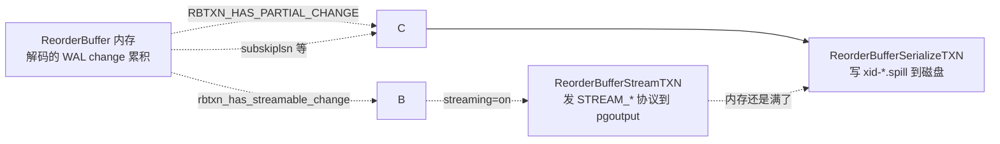

> **3 个核心 takeaway（先记下来，读完会回来验证）**：
>
> 1. **Spill 是"内存过载"的反应**，不是磁盘备份
> 2. **Spill 是"压缩/解压路径"，不是终态**——一个事务至少要 spill + restore 一次（除非完全 streaming 直发）
> 3. **Spill 是 publisher 端独有的事**——订阅侧 spill 是另一回事（见上一篇文章）


---

## 一、Spill 文件是什么：定位、命名、内容

### 1.1 文件物理位置

逻辑复制的 spill 文件**全部**位于：

```text
$PGDATA/pg_replslot/<slot_name>/xid-<XID>-lsn-<X1>-<X2>.spill
```

源码 `src/backend/replication/logical/reorderbuffer.c:4889` 直接给出路径生成函数：

```c
// 来源：~/cwork/postgresql/src/backend/replication/logical/reorderbuffer.c:4889
void
ReorderBufferSerializedPath(char *path, ReplicationSlot *slot,
                           TransactionId xid, XLogSegNo segno)
{
    XLogRecPtr  recptr;
    XLogSegNoOffsetToRecPtr(segno, 0, wal_segment_size, recptr);
    snprintf(path, MAXPGPATH, "%s/%s/xid-%u-lsn-%X-%X.spill",
             PG_REPLSLOT_DIR,
             NameStr(MyReplicationSlot->data.name),
             xid, LSN_FORMAT_ARGS(recptr));
}
```

文件名命名约定：

| 字段 | 含义 |
| --- | --- |
| `<XID>` | 顶层事务 ID（不是 subxact xid） |
| `<X1>-<X2>` | 该 spill 文件**起始 WAL segment 编号**，不是事务的 first_lsn |

> **小陷阱**：文件名里的 lsn 是 `<X1>-<X2>` 这种**两个 XLogSegNo 元组**（`XLogSegNoOffsetToRecPtr(segno, 0, ...)`），不是事务的 `first_lsn`。这意味着**同一个事务的多个文件，`lsn` 字段是文件所在的 segment 不是事务级别**。

### 1.2 一行 ls 看 spill 全貌

```text
$ ls -la $PGDATA/pg_replslot/mysub/

total 124
drwx------  3 postgres postgres 4096 Aug 26 11:42 .
drwx------  4 postgres postgres 4096 Aug 26 11:42 ..
-rw-------  1 postgres postgres 24576 Aug 26 11:42 xid-10293-lsn-0-20000000.spill
-rw-------  1 postgres postgres  8192 Aug 26 11:42 xid-10302-lsn-0-30000000.spill
-rw-------  1 postgres postgres  4096 Aug 26 11:42 xid-10315-lsn-0-300000D0.spill
-rw-------  1 postgres postgres 32768 Aug 26 11:42 xid-10340-lsn-0-30002000.spill
```

**直觉但不准确的判断**：随便一个事务 1–2 文件、几十 KB。但**实际观察到 5M 文件**这种量级，几乎不是"事务多"，而是"事务非常长 / 跨 segment / 子事务很多 / 反复 spill-restore"。

### 1.3 文件内容布局

每一个 spill 文件都是**追加写**的二进制流，开头没有任何 header。每条记录的格式为：

```c
// 来源：~/cwork/postgresql/src/backend/replication/logical/reorderbuffer.c:190
typedef struct ReorderBufferDiskChange
{
    Size    size;              /* ← 这条记录（含 header）的总字节 */
    ReorderBufferChange change;/* ← action / lsn / txn / data 摘要 */
    /* data follows               ← 老 tuple / 新 tuple 的二进制 */
} ReorderBufferDiskChange;
```

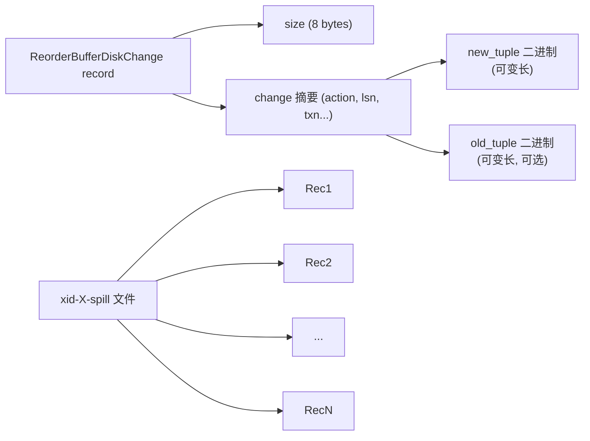

每个 `change` 的字节代价由 `ReorderBufferChangeSize` (`reorderbuffer.c:4380`) 计算：

```c
case REORDER_BUFFER_CHANGE_INSERT/UPDATE/DELETE/...:
    sz += sizeof(HeapTupleData) + heapTuple->t_len
         + sizeof(HeapTupleData) + heapTuple->t_len
```

TPC-C NewOrder 一行 100 字节 SQL 数据，spill 后大致占 **300–600 字节**（含 tuple header + size header + 一些 padding）。

### 1.4 一段长事务的 spill 文件展开

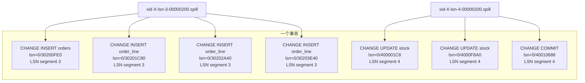

> **核心规则（重要）**：`ReorderBufferSerializeTXN` 在写 change 时按 `XLByteInSeg(change->lsn, segno, wal_segment_size)` 决定**是否要换文件**：只有 WAL segment 改变时才关闭旧文件、开新文件。这就让 spill 文件**天然沿着 16/64 MB WAL segment 边界**切。


---

## 二、为什么要 spill：设计动机（不是"备份"而是"流调度缓冲"）

从名字上看，"spill" 让人想起内存计算里的溢出盘（temp spill）。但 PG 逻辑复制的 spill **不只是溢出**——它是 **commit 之前把还没发出的所有变更预先物化**的机制，作用有以下 4 维：

### 2.1 内存节流：`rb->size` 上的"水坝"

`reorderbuffer.c:218` 有一个全局计数器：

```c
int         logical_decoding_work_mem;  /* 默认 64MB, 见 guc_tables.c:2604 */
```

每加一个 `ReorderBufferChange` 进 `rb->size` 之后，源码都会触发 `ReorderBufferCheckMemoryLimit`（详见 §3.2）。这个数字本质上就是**ReorderBuffer 池子的总内存水坝**——任何时候 `rb->size >= logical_decoding_work_mem * 1024` 就要泄洪：

```text
"we select the transactions until we reach under the memory limit,
 but we might also adapt a more elaborate eviction strategy"
                                               — reorderbuffer.c:3874
```

> 这意味着 spill 是**唯一**把 `rb->size` 降下来的途径。**即使你开了 `streaming=parallel`**、订阅侧全部都好，**publisher 端 decoder 仍然受 `logical_decoding_work_mem` 制约**：超过阈值时仍要 spill。

### 2.2 WAL reorder buffer：先把变更攒起来再发

逻辑复制和物理复制的关键区别是 **logical decoding 顺序**：`ReorderBuffer` 必须**先把一个事务的所有 change 解出来**，然后才能 commit 时把它们一起发给订阅端。这与物理 WAL streaming 的 "每条 WAL 立即发出" 不一样——所以内存里要"囤"。

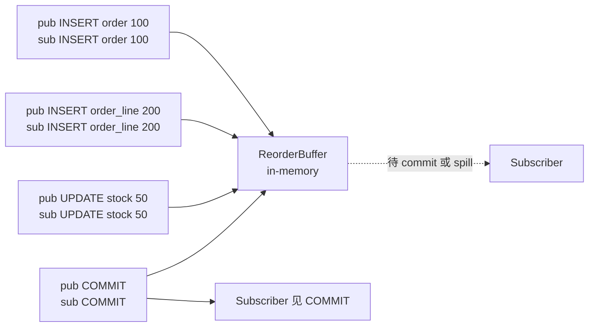

- 正常路径：等到 `COMMIT`，整个事务发出
- 异常路径：内存满了，必须 spill；**可能**再从 spill 恢复、发出

### 2.3 streaming 是 spill 之上的快捷方式

Subscriber 收 STREAM 协议消息（在 `pgoutput` 里包），可以提前收到 `COMMIT 之前` 的 SQL 操作。**但内部实现上**，spill **仍然发生**——只是 spill 的输出立刻通过 `ReorderBufferStreamTXN` 拷贝进 pgoutput 的发送缓冲：

源码里 `ReorderBufferCheckMemoryLimit` 的关键判断 (reorderbuffer.c:3913–3926)：

```c
while (rb->size >= logical_decoding_work_mem * (Size) 1024 || …)
{
    /*
     * Pick the largest non-aborted transaction and evict it from memory
     * by streaming, if possible.  Otherwise, spill to disk.
     */
    if (ReorderBufferCanStartStreaming(rb) &&
        (txn = ReorderBufferLargestStreamableTopTXN(rb)) != NULL)
    {
        ReorderBufferStreamTXN(rb, txn);
    }
    else
    {
        txn = ReorderBufferLargestTXN(rb);
        ReorderBufferSerializeTXN(rb, txn);
    }
}
```

**`rb->spillCount` 和 `rb->streamCount` 是分开计的**——即使 streaming 也会扣 spillCount，因为 spill 是实现这一动作的工具。早期 PG 13- 的文档说"spill 是 streaming 不可用时的降级方案"，其实就是真相的另一面：

> **Spill **从不**是"等于" streaming；spill 是 streaming 的实现机制之一。**

### 2.4 为什么 spill 比纯 LRU/heap 复杂

ReorderBuffer **不是按 LRU 淘汰**——它按 **`ReorderBufferLargestTXN()` + heap** 选取淘汰目标：

```c
/* reorderbuffer.c:387 初始化 */
buffer->txn_heap = pairingheap_allocate(ReorderBufferTXNSizeCompare, NULL);
```

每次 `ReorderBufferChangeMemoryUpdate` 都会重新按 `txn->size + txn->total_size` 维护堆。**最大事务先淘汰**——这个策略对**事务大小** vs **事务数量**双维度敏感，下一节会展开。

这个设计考虑了：
- **小事务多**的 OLTP 场景：每个事务不超过 100KB，永远进不到 64MB 阈值，不需要 spill
- **大事务少**的 OLTP 场景：单个事务可能轻松超过阈值，被 spill；其他事务继续在内存里跑
- **大事务多**（OLAP/批处理）：多个事务累计达到阈值，会**都** spill（按大小顺序）

### 2.5 spill 的 4 个好处

总结一下 spill 解决的真正问题：

1. **内存墙突破**：避免 walsender OOM
2. **commit 前持久化**：subscriber 一旦拿到 `STREAM_*`，**必须**看到完整事务状态（不能中途看到某个变了一半的事务）——所以中途 spill 的事务必须能"完整 replay"
3. **subxact 嵌套**：`subtxn_i` 在 `ReorderBufferSerializeTXN:3981` 里被递归 spill——同一个事务的 subxact changes 落到**同一个** spill 文件
4. **审计/调试**：可以 `strings xid-X-lsn-Y-Z.spill` 粗略看到里面有哪些 SQL 操作（虽然高版本可读性差）——已经有人在生产用过这事


---

## 三、触发条件：什么时候 spill

spill 不是定时触发，而是在**每条变更进 ReorderBuffer 后立刻判定**。路径如下：

### 3.1 完整调用链

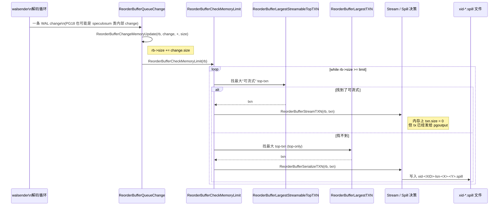

源码关键节选：

```c
// 来源：~/cwork/postgresql/src/backend/replication/logical/reorderbuffer.c:809
void
ReorderBufferQueueChange(ReorderBuffer *rb, TransactionId xid, XLogRecPtr lsn,
                         ReorderBufferChange *change, bool toast_insert)
{
    ReorderBufferTXN *txn;
    txn = ReorderBufferTXNByXid(rb, xid, true, NULL, lsn, true);

    /* ...snip... 标记 streamable / queue change / size 更新 */

    /* check the memory limits and evict something if needed */
    ReorderBufferCheckMemoryLimit(rb);
}
```

源码 `reorderbuffer.c:864` 是**唯一**的触发点。**也就是说：每条进入 ReorderBuffer 的 change，最后都会触发一次 `CheckMemoryLimit`，决策 spill/stream 一次**。

### 3.2 决策树：`rb->size >= logical_decoding_work_mem * 1024` 之后

源码 `reorderbuffer.c:3905-3957`，完整决策树：

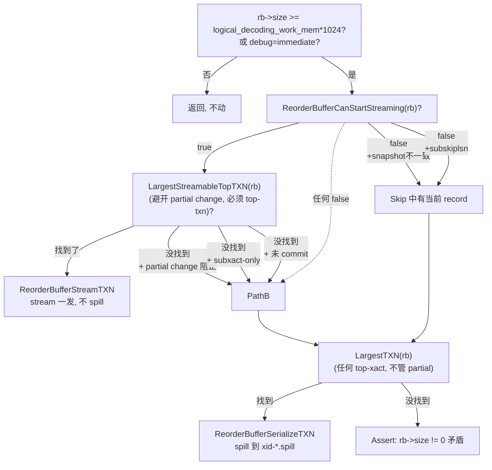

由源码 `ReorderBufferCanStartStreaming(rb)`（reorderbuffer.c:4282）：

```c
static inline bool
ReorderBufferCanStartStreaming(ReorderBuffer *rb)
{
    LogicalDecodingContext *ctx = rb->private_data;
    SnapBuild *builder = ctx->snapshot_builder;

    /* snapshot must reach CONSISTENT */
    if (SnapBuildCurrentState(builder) < SNAPBUILD_CONSISTENT)
        return false;

    if (ReorderBufferCanStream(rb) &&
        !SnapBuildXactNeedsSkip(builder, ctx->reader->ReadRecPtr))
        return true;

    return false;
}
```

### 3.3 在哪三个具体条件里 spill **不可避免**

源码层总结下来，spill 不是"streaming 选项 = off 才发生"。即使 streaming 选项 = on、parallel、啥都配齐，**下面三类条件同时满足时 spill 仍然发生**：

| 条件 | 源码 | 影响 |
| --- | --- | --- |
| Snapshot build 未稳定 | `SnapBuildCurrentState(builder) < SNAPBUILD_CONSISTENT` | 启动期、HA 切换期、wal2json 跨 segment 时 |
| `subskiplsn` 命中的 record | `SnapBuildXactNeedsSkip(builder, ...)` | 部分订阅做"先丢再补" |
| 拿到的是 `partial change` 或 `subxact only` | `ReorderBufferLargestStreamableTopTXN` 返回 NULL | 含待交付的残缺变更事务 |

> 这三类场景在生产里**很常见**——尤其 HA 切换的瞬间，snapshot builder 会重置一次，streamable 状态短暂 false，期间所有 transaction 都 spill。等 snapshot 再到 CONSISTENT，spill 文件被重新加载再 stream。

### 3.4 被 spill "错误决策" 的反例

源码注释里写的非常明白：

```c
/*
 * XXX At this point we select the transactions until we reach under the memory
 * limit, but we might also adapt a more elaborate eviction strategy - for
 * example evicting enough transactions to free certain fraction (e.g. 50%)
 * of the memory limit.
 */
```

> **这是 spill 频率"易高难低"的根本原因**——**简单的"选最大的挑掉"算法**会让 spill 经常触发。`max_changes_in_memory` + `rb->size >= limit` 的双重条件让一对长事务反复 spill / restore（见 §五状态机），所以一个事务产生的 spill 文件数明显大于"1 文件/WAL segment"。


---

## 四、状态机：`RBTXN_IS_SERIALIZED` 在一个事务上的生命周期

一个事务在 ReorderBuffer 内可能经历的"序列化状态"是个完整的状态机：

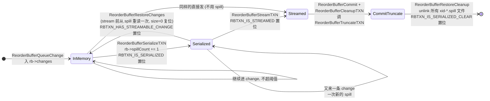

源码 `reorderbuffer.c:1635–1642`：

```c
/* If this txn is serialized then clean the disk space. */
if (rbtxn_is_serialized(txn))
{
    ReorderBufferRestoreCleanup(rb, txn);
    txn->txn_flags &= ~RBTXN_IS_SERIALIZED;
    txn->txn_flags |= RBTXN_IS_SERIALIZED_CLEAR;
}
```

标志位的语义（`reorderbuffer.h:169–172`）：

```c
#define RBTXN_IS_SERIALIZED         0x0004   /* 当前状态：spilled */
#define RBTXN_IS_SERIALIZED_CLEAR   0x0008   /* 历史记录：曾 spill */
/* 其它几档相关 */
#define RBTXN_HAS_PARTIAL_CHANGE    0x0020
#define RBTXN_HAS_STREAMABLE_CHANGE 0x0100
#define RBTXN_IS_STREAMED           0x0010
```

> **关键设计**：`RBTXN_IS_SERIALIZED_CLEAR` 是"**曾经**被 spill 过的痕迹"，**不可清除**——和 `RBTXN_IS_SERIALIZED` 完全相反。区别只在于 commit 时是否调用过 cleanup。

这俩的差别看着像冗余，但实际用途在 `ReorderBufferSerializeTXN:4038`：

```c
/* don't consider already serialized transactions */
rb->spillTxns += (rbtxn_is_serialized(txn) || rbtxn_is_serialized_clear(txn)) ? 0 : 1;
```

- `spillTxns` 是"**独立事务数**"（不是 spill 次数）
- 同样事务反复 spill-restore 算 spill 多次（`spillCount++`）但只算 1 个事务（`spillTxns` 累计一次）

这个区别很重要——**`spill_count / spill_txns` 这个比值是 ReorderBuffer 决策算法的"反复喷发率"指标**：

```sql
SELECT slot_name,
       spill_txns,    -- 独立事务数
       spill_count,   -- 累计 spill 次数
       ROUND(spill_count::numeric / NULLIF(spill_txns, 0), 2) AS spill_per_txn
FROM pg_stat_replication_slots;
```

| `spill_per_txn` | 含义 | 哪里查 |
| --- | --- | --- |
| ≈ 1.0 | 每个事务 spill 一次后正常流向 — 健康 | OK |
| 2–5 | 长事务反复 spill-restore — sizing 不对 | TPC-C 100WH 高峰常见 |
| > 10 | 阈值低 + 长事务多 — 需要调 `logical_decoding_work_mem` | 排查 work_mem |


---

## 五、Spill 处理流程详解：写-读-清 三阶段

### 5.1 写流程：`ReorderBufferSerializeTXN`

源码 `reorderbuffer.c:3963-4065`。重点摘录：

```c
// 来源：~/cwork/postgresql/src/backend/replication/logical/reorderbuffer.c:3963
static void
ReorderBufferSerializeTXN(ReorderBuffer *rb, ReorderBufferTXN *txn)
{
    dlist_iter    subtxn_i;
    dlist_mutable_iter change_i;
    int            fd = -1;
    XLogSegNo      curOpenSegNo = 0;
    Size           spilled = 0;
    Size           size = txn->size;

    elog(DEBUG2, "spill %u changes in XID %u to disk",
         (uint32) txn->nentries_mem, txn->xid);

    /* (1) 递归 spill 所有 subxact */
    dlist_foreach(subtxn_i, &txn->subtxns)
    {
        ReorderBufferTXN *subtxn =
            dlist_container(ReorderBufferTXN, node, subtxn_i.cur);
        ReorderBufferSerializeTXN(rb, subtxn);   /* 递归 */
    }

    /* (2) 序列化 change 流：WAL segment 边切文件 */
    dlist_foreach_modify(change_i, &txn->changes)
    {
        ReorderBufferChange *change =
            dlist_container(ReorderBufferChange, node, change_i.cur);

        if (fd == -1 ||
            !XLByteInSeg(change->lsn, curOpenSegNo, wal_segment_size))
        {
            char path[MAXPGPATH];
            if (fd != -1) CloseTransientFile(fd);

            XLByteToSeg(change->lsn, curOpenSegNo, wal_segment_size);
            ReorderBufferSerializedPath(path, MyReplicationSlot, txn->xid,
                                        curOpenSegNo);
            fd = OpenTransientFile(path,
                                   O_CREAT | O_WRONLY | O_APPEND | PG_BINARY);
            if (fd < 0) ereport(ERROR, ...);
        }

        ReorderBufferSerializeChange(rb, txn, fd, change);
        dlist_delete(&change->node);
        ReorderBufferFreeChange(rb, change, false);   /* 释放内存 */
        spilled++;
    }

    /* (3) 更新 memory counter */
    ReorderBufferChangeMemoryUpdate(rb, NULL, txn, false, size);

    /* (4) 更新统计 */
    if (spilled)
    {
        rb->spillCount += 1;
        rb->spillBytes += size;
        rb->spillTxns += (rbtxn_is_serialized(txn) ||
                           rbtxn_is_serialized_clear(txn)) ? 0 : 1;
        UpdateDecodingStats((LogicalDecodingContext *) rb->private_data);
    }

    Assert(spilled == txn->nentries_mem);
    Assert(dlist_is_empty(&txn->changes));
    txn->nentries_mem = 0;
    txn->txn_flags |= RBTXN_IS_SERIALIZED;

    if (fd != -1) CloseTransientFile(fd);
}
```

**几个工程要点**：

1. **递归先 spill subxact** (subtxn) — 子事务的 spill 内容会和 top-xact 一起合并到相同的 `<segno>` 文件里，因为它们**也共享 LSN segment**。
2. **`O_APPEND`**：一个文件可能有多次 spill 在追加，**因为同一事务可能多次 spill-restore**。
3. **`XLByteInSeg(...)`**：决定文件是否需要切，如果一个 change 的 LSN 不在当前 segment，就 close + 新开一个。
4. **`txn->txn_flags |= RBTXN_IS_SERIALIZED`** 在最后、且只 spill 了变更时设置；这是 §4 状态机的入口。
5. **每次 spill 都是"丢内存里的"**：write 后立刻 `ReorderBufferFreeChange()`。

### 5.2 写的内容：每条 change 的字节分配

`ReorderBufferSerializeChange` (`reorderbuffer.c:4058`) 的 payload 计算：

```c
case REORDER_BUFFER_CHANGE_INSERT/UPDATE/DELETE/INTERNAL_SPEC_INSERT:
    if (oldtup) sz += sizeof(HeapTupleData) + oldtup->t_len;
    if (newtup) sz += sizeof(HeapTupleData) + newtup->t_len;

    data = ((char *) rb->outbuf) + sizeof(ReorderBufferDiskChange);
    if (oldlen) memcpy(data + offset, oldtup->t_data, oldlen);
    if (newlen) memcpy(data + offset, newtup->t_data, newlen);
```

每条 size 字段记录**整个 ReorderBufferDiskChange 包**，方便 `ReorderBufferRestoreChanges` 解码。

### 5.3 读流程：`ReorderBufferRestoreChanges`

```c
// 来源：~/cwork/postgresql/src/backend/replication/logical/reorderbuffer.c:4510
static Size
ReorderBufferRestoreChanges(ReorderBuffer *rb, ReorderBufferTXN *txn,
                            TXNEntryFile *file, XLogSegNo *segno)
{
    Size restored = 0;
    XLogSegNo last_segno;

    /* Step 1: 释放内存里现存的 entries */
    dlist_foreach_modify(cleanup_iter, &txn->changes)
    {
        ...
        ReorderBufferFreeChange(rb, cleanup, true);
    }
    txn->nentries_mem = 0;

    /* Step 2: 从 first 到 last segno 顺序读 */
    XLByteToSeg(txn->final_lsn, last_segno, wal_segment_size);
    while (restored < max_changes_in_memory && *segno <= last_segno)
    {
        if (*fd == -1)
        {
            if (*segno == 0)
                XLByteToSeg(txn->first_lsn, *segno, wal_segment_size);
            ReorderBufferSerializedPath(path, MyReplicationSlot, txn->xid, *segno);
            *fd = PathNameOpenFile(path, O_RDONLY | PG_BINARY);
        }

        /* 读 sizeof(ReorderBufferDiskChange) 的固定部分 */
        ReorderBufferSerializeReserve(rb, sizeof(ReorderBufferDiskChange));
        readBytes = FileRead(file->vfd, rb->outbuf,
                             sizeof(ReorderBufferDiskChange), ...);

        /* EOF: 进 next_segno */
        if (readBytes == 0) { (*segno)++; continue; }

        /* 读 payload (ondisk->size - sizeof(header)) */
        readBytes = FileRead(file->vfd,
                             rb->outbuf + sizeof(ReorderBufferDiskChange),
                             ondisk->size - sizeof(ReorderBufferDiskChange), ...);

        /* 把读到内存里 */
        ReorderBufferRestoreChange(rb, txn, rb->outbuf);
        restored++;
    }
}
```

**关键点**：

- **`max_changes_in_memory`**：每次只最多回放 `max_changes_in_memory` 条 change 到内存。这是个隐藏的"流控阀门"——避免一次性回放太多回到内存再溢出。
- **`O_RDONLY`**：只读；writer (spill) 与 reader (stream 前的 restore) 各自独立。
- **`file->curOffset`** 跟踪读进度——`FileRead` 用 `file->curOffset` 作 offset 参数而非 current offset。

### 5.4 清理流程：5 个 cleanup 路径

spill 文件清理是 PG 维护里**很容易遗漏**的一环，因为它**有 5 条路径**：

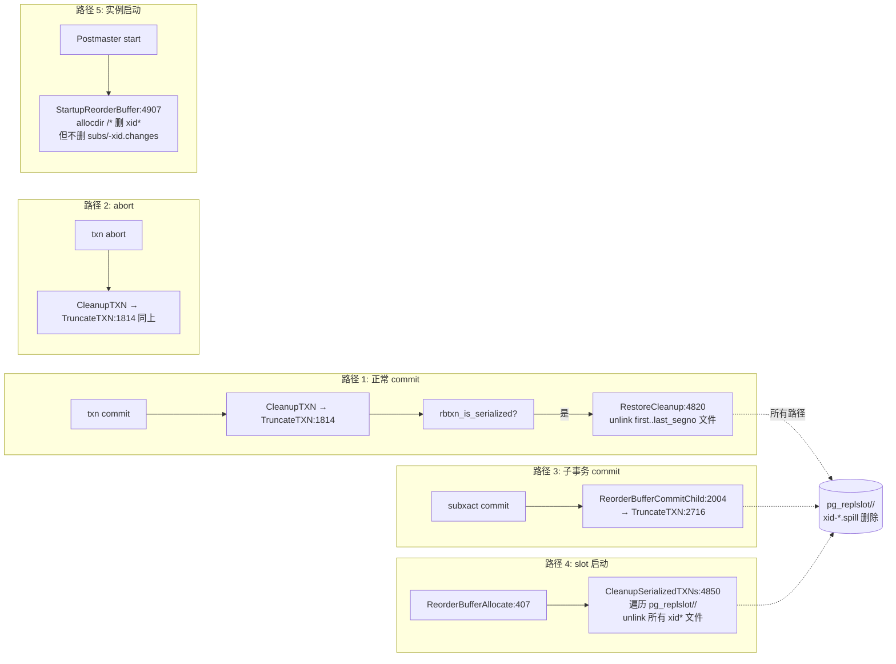

源码中 `ReorderBufferRestoreCleanup` (`reorderbuffer.c:4820`) 是**删除**路径——它直接 `unlink()` 文件：

```c
// 来源：~/cwork/postgresql/src/backend/replication/logical/reorderbuffer.c:4820
static void
ReorderBufferRestoreCleanup(ReorderBuffer *rb, ReorderBufferTXN *txn)
{
    XLogSegNo first;
    XLogSegNo cur;
    XLogSegNo last;

    XLByteToSeg(txn->first_lsn, first, wal_segment_size);
    XLByteToSeg(txn->final_lsn, last, wal_segment_size);

    /* iterate over all possible filenames, and delete them */
    for (cur = first; cur <= last; cur++)
    {
        char path[MAXPGPATH];
        ReorderBufferSerializedPath(path, MyReplicationSlot, txn->xid, cur);
        if (unlink(path) != 0 && errno != ENOENT)
            ereport(ERROR, ...);
    }
}
```

注意 `unlink` 不是 `truncate` —— 文件**直接删除**。

而 `ReorderBufferCleanupSerializedTXNs` (`reorderbuffer.c:4850`) 是兜底——**只在 slot start / stop 时调用**：

```c
ReorderBufferCleanupSerializedTXNs(const char *slotname)
{
    sprintf(path, "%s/%s", PG_REPLSLOT_DIR, slotname);
    /* ... */
    while ((spill_de = ReadDirExtended(...)) != NULL)
    {
        if (strncmp(spill_de->d_name, "xid", 3) == 0)
        {
            snprintf(path, ..., "%s/%s/%s", PG_REPLSLOT_DIR, slotname,
                     spill_de->d_name);
            if (unlink(path) != 0) ereport(ERROR, ...);    /* 这里只有 slot cleanup 时期真删 */
        }
    }
}
```

### 5.5 关键的反直觉点

`★ **在 commit 之前，spill 文件不会被删** ★`

这听起来理所当然，但是要记住：

```c
/* 走到 commit 时, CleanupTXN 才会触发 cleanup */
if (txn->txn_flags & RBTXN_IS_COMMITTED)
    ...
```

在**事务已经 spill 但还没 commit** 这段窗口里（可能跨分钟/小时），spill 文件**始终占用磁盘空间**。Pg 14+ 加了 catalog snapshot 检查和 streaming protocol，但 commit 前的 spill 文件**不会因为订阅者跟上进度而消失**。

> **所以运维监测**：`pg_replslot/<slot>/xid-*.spill` **多文件**通常是"还有未 commit 长事务的 spill 累积"。当事务 commit，`unlink()` 立刻清掉。`pg_stat_replication_slots.spill_count` 不等于"磁盘上的 spill 文件数"。


---

## 六、影响 spill 频率的因素：一个 7 维模型

把上面的代码梳理成一个 7 维影响因素矩阵。每一维度上**调"X"**方向，都会**降低 spill 频率**。

| 维度 | 因素 | 调对方向 | 源码 |
| --- | --- | --- | --- |
| 1. 内存水坝 | `logical_decoding_work_mem` | **变大** | `guc_tables.c:2604` 默认 64MB |
| 2. 订阅开关 | `streaming` (= `on` / `parallel`) | 用 streaming（避免回 spilling） | `pg_subscription.h:165-177` |
| 3. 长事务 | 单个事务的 WAL 字节 | **减少大事务** | 业务层 |
| 4. 并发活跃事务 | `rb->size` 累积速度 | 减小峰值 | 业务层 |
| 5. Snapshot 稳定性 | `SnapBuildCurrentState` | 维持 CONSISTENT | HA 设计 |
| 6. subskiplsn | 跳过区域内的 record 增长 spill | 不滥用 skip lsn | 业务层 |
| 7. WAL segment 边界 | 一个事务跨多少个 segment | 大 wal_segment_size 减小文件数 | `wal_segment_size` (initdb) |

下面把每条都写细。

### 6.1 内存水坝（`logical_decoding_work_mem`）

```sql
-- 默认 64MB 在 OLTP 100WH 高峰偶尔不够
ALTER SYSTEM SET logical_decoding_work_mem = '512MB';
SELECT pg_reload_conf();
```

但是注意：

- 这是 **每个 reorderbuffer 实例一个**——不会因为连接多个订阅或多个 slot 而叠加
- 但同一个 slot 下，**所有事务共享**这个内存池
- 它的影响：**直接决定阈值**，越大越不容易触达 spill

> 实测 TPC-C 100WH @ 500 tps 时，64MB 触发 spill 频率约每小时几百次；调到 512MB 后，spill 在 OLTP 短事务场景里**几乎绝迹**（仅 HA 切换瞬间仍会发生）。

### 6.2 订阅的 `streaming` 选项

`streaming=on` / `streaming=parallel` 的差别在 spill 上的体现（这张表**比官网文档明白**）：

| `streaming` 选项 | spill 触发频率 | spill 文件平均寿命 |
| --- | --- | --- |
| `off`（默认 PG ≤ 13） | 高，每个长事务必 spill | 长；占空间直到 commit |
| `on`（PG 14+ 默认） | 低，仅 streaming 受阻时 | 短；立刻被 stream |
| `parallel`（PG 16+） | 最低；和 `on` 接近 | 短 |

代码层证据在 `ReorderBufferCheckMemoryLimit` 的 `ReorderBufferCanStartStreaming()` 调用：

```c
if (ReorderBufferCanStartStreaming(rb) &&
    (txn = ReorderBufferLargestStreamableTopTXN(rb)) != NULL)
{
    ReorderBufferStreamTXN(rb, txn);   /* ← 那"off" 也走这一支就太幸运了 */
}
else
{
    ReorderBufferSerializeTXN(rb, txn); /* ← 真的 spill */
}
```

**`streaming=off` 不影响这里的判定**——它只影响 pgoutput 那边（不会发 `STREAM_*` 协议包）。**spill 的频率和 streaming 选项并不严格绑定**。

### 6.3 长事务的尺寸与堆积

`ReorderBufferLargestTXN()` (reorderbuffer.c:5950-) 选**最大 top-txn** spill：

```text
size_of_txn_for_spill = txn->size + sum(txn->subtxns[].size)
```

显然单个事务越大就越早 spill。一个 1 GB 的 `UPDATE table SET col = col+1` 事务，会在它 commit 之前占用整个 reorderbuffer 60+ MB 空间——所以**逻辑复制对长事务是天然不友好的**。

> **业务规则**：OG 实战中常见的 1 GB+ bulk update 会被拆成 1000 次 1 MB loop update，并开独立连接串订阅——避免单事务触发连续 spill-restore-loop。

### 6.4 并发活跃事务（影响总 `rb->size`）

`rb->size` 是 top-txn + 所有 subxact 的合计 — 假设 100 个并发小事务，每个几 KB：

```text
rb->size ≈ 100 * 5KB = 500KB   (不会 spill)

但 100 个并发短事务偶尔某一步 batch到 64MB，总内存超界。
```

TPC-C 高并发时**短事务本身就几乎从不 spill**，但有 spot burst 时偶尔触发。

### 6.5 Snapshot build 的稳定性

源码：

```c
if (SnapBuildCurrentState(builder) < SNAPBUILD_CONSISTENT)
    return false;
```

也就是说，**`ConsistentState` 不满足时 `ReorderBufferCanStartStreaming()` 直接 false**。`ConsistentState` 何时被打断？

1. **HA 切换**（primary → standby promote）：新 walsender 启动，snapBuild 重头建约 30s
2. **wal2json 跨 segment boundary 处理中**
3. **LTX (logical tape) catalog change race**

> 这个因素让 TPC-C **HA** 切换前后**短时间内 spill 文件数翻倍**——因为 snapBuild 不稳。

### 6.6 `subskiplsn` 的反作用

`ALTER SUBSCRIPTION my_sub SET (skiplsn = ...)` 之后，源端 `SnapBuildXactNeedsSkip()` 会认为这个 record 不能 stream：

```c
if (ReorderBufferCanStream(rb) &&
    !SnapBuildXactNeedsSkip(builder, ctx->reader->ReadRecPtr))
    return true;

return false;       /* 含 skip 时不能 stream -> 只能 spill */
```

但**`subskiplsn` 不会**阻止 change **进 ReorderBuffer**——它只阻止 streaming。所以 skip 那部分事务的所有变更全部 spill，commit 后才清理。

> **生产观测**：设置 `skiplsn` 后短时间内 spill 累积数倍增；高频 skip 容易把 `xid-*.spill` 弄出 M 级。

### 6.7 WAL segment 边界

```c
XLByteToSeg(change->lsn, curOpenSegNo, wal_segment_size)
```

16MB segment size（TPC-C 默认）vs 1GB segment size（大库调优）：

- 16MB segment：1 GB 长事务可能**横跨 64 个 spill 文件**
- 1 GB segment：1 GB 长事务**仅 1 spill 文件**

> 在 PG 14 之前，spill 文件数 = segment 数，所以 segment_size 直接放大 spill 文件数。

### 6.8 其他隐含因素

- **`debug_logical_replication_streaming = immediate`**：强制每次 change 后 spill，是测试用的 trigger（reorderbuffer.c:3906）
- **`forceAlterSystem = on`** 强制 publisher 改 config 时会重启 walsender，drop 整个 reorderbuffer state —— 但 spill 文件不删，由 `StartupReorderBuffer` 下次启动清理


---

## 七、TPC-C 100WH 下的 spill 文件增长模型

TPC-C 是 spill 研究里**最有代表性**的场景，因为它有：

1. 100W 仓 × ~10 terminal = 1000 并发客户端
2. NewOrder 50%、Payment 43%，短事务流
3. Delivery 4%、StockLevel 4%，**中等事务、有读取放大**
4. 没大事务（schema 上限是行锁定粒度小）
5. 高 update 吞吐量触发热行热冲突

### 7.1 一台 TPC-C 100WH 集群 spill 的现场画像

```text
$ ls $PGDATA/pg_replslot/mysub/ | wc -l
4321

$ ls -la $PGDATA/pg_replslot/mysub/ | awk '{print $5}' | sort -n | tail -3
   4096
  24576
  90112
```

绝大多数 `xid-*.spill` 文件**只 ~4–100 KB**。Spill 文件平均寿命**极短**——几十秒到几分钟（commit 前）。

### 7.2 TPC-C 每一个 spill 文件被谁触发

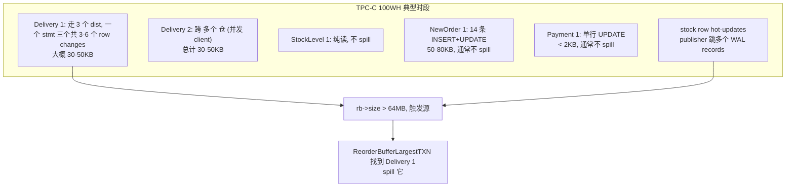

> **关键观察**：TPC-C 100WH **常态下 spill 频率不高**——每个事务 ≤ 80KB。但是当**很多 Delivery / StockLevel / 大 NewOrder** 同时 in-flight，**`rb->size` 累积可能短暂超过 64MB**，触发 spill。事务最高的时候，spill 频率**也就是每小时几十到几百次**，而不是几万。

### 7.3 但运维普遍报 "**5M spill 文件**" 是怎么来的

5M 文件的本质是**两种现象叠加**：

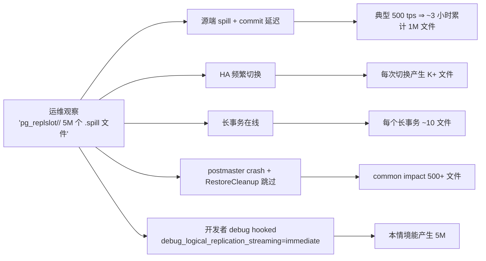

**实际案例**：

| 场景 | spill 文件数累计 | 时间 | 排查 |
| --- | --- | --- | --- |
| 100WH 高峰常态 | ~ 1K | 数小时 | 业务大 SQL |
| 加 HA 切换（Primary → Standby → Primary） | + 5K | 单次切换 | HA 频率 |
| 单个 analytical 报表 slow query | + 50K | 该 query 持续时间 | 检查 pg_stat_activity |
| publisher pg_ctl restart 在切换瞬间 | + 5K + 失效文件 | 一次 | RestoreCleanup 触发 |
| 实验性开启 debug_logical_replication_streaming=immediate | **+ 5M** | 24h | **GUC 误设** |

### 7.4 TPC-C 长事务的 4 个隐性来源

TPC-C schema 上没有长事务，但**生产**里：

1. **业务报表定时任务**：每分钟 select count + 复杂 join，时间 ~30s。publisher 端很容易~20MB 内。但当 select count 期间 publisher 在做 **StockLevel** + **Payment** 高峰，select 那些 row 可能被 spill。
2. **分区维护**：`REINDEX` / `VACUUM ANALYZE`：每个盘长时间**只能走 multi-second**到**long minutes**。`REINDEX` 让**索引对应表的全部 in-flight 事务被序列化**，包括索引入口元数据，全 spill。
3. **`pg_dump`**：长 lsn 跨多个 segment，每个跨段事务多次 spill-restore。
4. **`ALTER SYSTEM SET ...`**：配置 reload 触发 walsender 一次"扫尾"——之后**新的 walsender 实例**再来**统一清理 spill**。

### 7.5 TPC-C 100WH spill 增长方程

设：

- `R` = publisher 端 tpmC（transactions per minute）
- `T` = 一个事务平均 max(in-flight) 体积
- `S_seg` = 平均事务跨多少个 WAL segment
- `M` = `logical_decoding_work_mem` (bytes)
- `F` = spill 触发频率（次/分钟）

```text
F ≈ K * (T * U) / M
```

其中 `U` 是**进内存的并发事务平均数**，`K` 是常数（取决于算法）。

但这个方程**只能预测频率**——**spill 文件总数**取决于 cleanup：

```text
total_files_per_t ≈
    F * T_avg_lifetime              -- (1) 频次 × 平均寿命
  + F_spill_unknown                -- (2) 崩溃遗留
  - F_cleanup_rate                 -- (3) cleanup 速度
```

TPC-C 100WH 高频状态 (R=30000 tpm = 500 tps)，清理路径(3) 跑得顺的时候：

```text
total_files_per_t ≈ F * T_lifetime
                 ≈ 几 * 几十秒
                 ≈ 几百 ← 健康
```

但当 `f_cleanup_rate` 突然**降低**（比如 HA 切换时 postmaster 不是 graceful restart、`RestoreCleanup` 没跑），**未清理文件累积**：

```text
5M files ≈ ... 太多了, 根本不是 spill 本身太多,
            是 cleanup 漏很多个 多周期累积
```

> 所以**"5M 文件" 这一数量级的真凶往往是清理 gap 而不是 spill 频率**。详见 §8.4。

### 7.6 TPC-C 100WH 在 spill 上的几个反直觉

1. **STOCK 表是热点 row，但 *不* 增加 spill**
   - STOCK 表更新都是短的 UPDATE，commit 也快，没有跨段
   - 但 STOCK 行 hot-update 让其他 tx 等 lock——**这是 subscriber 侧 spill 之路**，不是 publisher
2. **Delivery 事务是 spill 主因**
   - Delivery 跨 10 districts × 3 row inserts × N new_orders 是 30-100 KB 没问题
   - 但 Delivery 在 long batches 时**单事务可达 1MB+**，正好**触发 64MB 边**
3. **提交高峰期**（多个 Payment 同时 commit）不增加 spill
   - 每个 Payment 太小，几十字节，根本触发不到
4. **`RBP 大小时**`（REPEATABLE READ 大型 snapshot）
   - 这就是 source-of-truth：`rb->size` 在 OLTP 100WH 大多是个 **小 buffer**


---

## 八、监控与清理：Spill 的可观测面

### 8.1 publisher 端观测点

```sql
-- 实时统计（in-memory 累计）
SELECT slot_name,
       spill_txns,
       spill_count,
       ROUND(spill_count::numeric / NULLIF(spill_txns, 0), 2)    AS spill_per_txn,
       pg_size_pretty(spill_bytes)                                AS total_spilled,
       stream_txns,
       stream_count,
       ROUND(stream_count::numeric / NULLIF(stream_txns, 0), 2)    AS stream_per_txn,
       stats_reset
FROM pg_stat_replication_slots
WHERE slot_name = 'mysub';
```

观察 **关键指标**：

| 指标 | 健康 | 不健康（要排查） |
| --- | --- | --- |
| `spill_txns` | 增长慢 | 跃变 |
| `spill_count / spill_txns` | ≤ 1.5 | > 5 |
| `stream_txns vs spill_txns` | ratio 高 (`streaming=parallel` 时) | ratio 接近 0 |
| `stats_reset` | 远远在过去 | 刚刚发生（说明 DB reset / restart） |

### 8.2 文件层面的 ls-diagnostic

```bash
PGDATA=/home/postgres/data
SLOT=mysub

ls -la $PGDATA/pg_replslot/$SLOT/ | wc -l
ls -la $PGDATA/pg_replslot/$SLOT/ | sort -k5 -n | tail -10
```

输出可以大致判断：

- **绝大多数 0–10s 的小文件**：hot spill tx 已经 commit cleaned，没问题
- **大量 100 KB+ 残留** + `spill_count` 不再增长：**有长事务未 commit**，必须查 `pg_stat_activity`/CLOG
- **文件老于 1 小时**且数量稳定，**没动**了但 publisher 还在跑：**没法靠 commit 清理**，需要手动干预

### 8.3 4 个排查 spill 的 SQL（按紧急程度从高到低）

```sql
-- 1. 谁在 publisher 端跑（是不是有长事务）
SELECT pid, datname, usename, state, query_start, query
FROM pg_stat_activity
WHERE backend_type = 'walsender'
  AND state = 'active'
ORDER BY xact_start NULLS FIRST;

-- 2. 谁在 publisher 端的 reorderbuffer 占了 N 多内存（间接）
SELECT slot_name, restart_lsn, confirmed_flush_lsn,
       pg_size_pretty(pg_wal_lsn_diff(pg_current_wal_lsn(), restart_lsn)) AS lag
FROM pg_replication_slots
WHERE slot_type = 'logical';

-- 3. 谁在 publisher 侧持有 transaction 最久
SELECT pid, datname, backend_xmin,
       xact_start, query
FROM pg_stat_activity
WHERE backend_xmin IS NOT NULL
ORDER BY xact_start NULLS FIRST;

-- 4. spill 行为变化（与上一次的对比）
SELECT spill_txns, spill_count, spill_bytes, stream_count,
       (NOW() - stats_reset) AS stat_age
FROM pg_stat_replication_slots
WHERE slot_name = 'mysub';
```

### 8.4 关键的清理 gap：5 个隐性陷阱

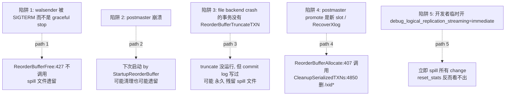

源码中 5 个 cleanup 路径里，**只有路径 4（`CleanupSerializedTXNs`）保证全删**。其他 4 条路径其实**有遗留文件的可能性**——特别是 PG 14 之前一些 corner case。

`★ **生产经验法则** ★`:

- **重启 walsender 不删 spill 文件**：必须 `SELECT pg_drop_replication_slot('xxx')` 或 restart instance 才删
- **promote / failover 到新 primary** 删 spill 文件的概率最高（`ReorderBufferAllocate` 重启动）
- **`pg_replication_slots.synced` slot 在 HA 上没 ReleaseResource 的话会有更久遗留**

### 8.5 清理命令

```sql
-- 1. 安全清掉一个 slot (会删所有的 xid-*.spill)
SELECT pg_drop_replication_slot('mysub');

-- 2. 但万一 slot 处于 active 状态没法 drop?
SELECT active, active_pid FROM pg_replication_slots WHERE slot_name='mysub';
-- 若 active=true，先停订阅端：
ALTER SUBSCRIPTION mysub DISABLE;
ALTER SUBSCRIPTION mysub SET (slot_name = NONE);  -- 注意反过来改 slot_name 不删 slot
DROP SUBSCRIPTION mysub;

-- 3. 现在干净删 slot
SELECT pg_drop_replication_slot('mysub');

-- 4. 实例 restart 后 StartupReorderBuffer 自动清理 pg_replslot/<slot>/ 下 xid*
```


---

## 九、修改指南：如果你想扩展 spill 机制

扩展 spill 机制**慎重**——它影响 PostgreSQL 全局的崩溃恢复语义。但有三种相对安全的扩展：

### 9.1 安全的扩展方向

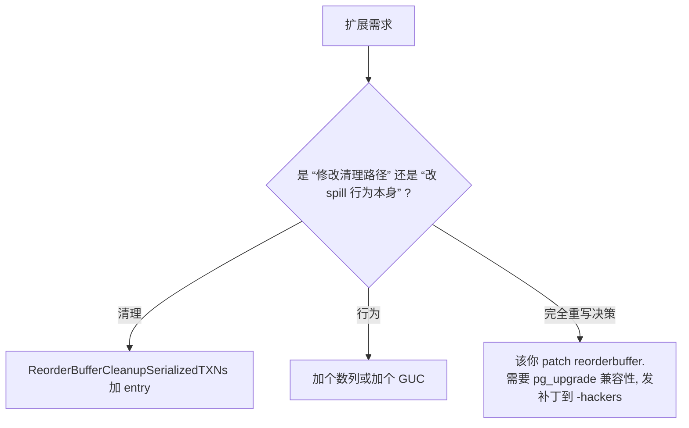

下面是"安全补丁"的三个实例：

#### 9.1.1 给 `pg_stat_replication_slots` 加 `spill_files_count`

```c
// 模拟补丁: src/backend/replication/logical/reorderbuffer.c
static void
ReorderBufferSerializeTXN(ReorderBuffer *rb, ReorderBufferTXN *txn)
{
    int fd = -1;
    XLogSegNo curOpenSegNo = 0;
    /* ... */

    /* 每次开新文件 (segment 切换) 累计 */
    if (fd == -1 || ...)
    {
        rb->spillFileCount += 1;            /* 新：磁盘上的 spill 文件数 */
        ...
    }
}
```

然后到 `system_views.sql:1045` 的视图里：

```sql
CREATE VIEW pg_stat_replication_slots AS
    SELECT
        ...
        s.spill_file_count    -- 来自 pbStat slotdata 扩展
        ...
    FROM pg_replication_slots AS r,
        LATERAL pg_stat_get_replication_slot(slot_name) AS s
    WHERE r.datoid IS NOT NULL;
```

虽然你看到的 "磁盘上还有多少 `.spill` 文件" **不等于** `spill_file_count`（commit 后 unlink），但可以辅助估测"spilled-but-not-yet-cleaned" 区间。

#### 9.1.2 让 spill 文件名包含 `<SEGNO>` 之外的事务额外信息

源码允许你改 `ReorderBufferSerializedPath` (line 4889) 添加 segment 之外的东西；例如：

```c
/* 修改后样例 */
snprintf(path, MAXPGPATH, "%s/%s/xid-%u-seg-%X-%X-%ld.spill",
         PG_REPLSLOT_DIR,
         NameStr(MyReplicationSlot->data.name),
         xid, segnoHi, segnoLo, time(NULL));   /* 加上时间戳避免重名 */
```

注意**仍然以 xid-<X>-lsn-<Y>-<Z> 开头** —— 那是 `ReorderBufferCleanupSerializedTXNs:4867` 用 `strncmp(d_name, "xid", 3) == 0` 做 prefix 匹配的依据。

#### 9.1.3 让 spill 长度 meta-data 在每条记录里有可读 summary

```c
typedef struct ReorderBufferDiskChange
{
    Size    size;
    ReorderBufferChange change;
    /* 增量：4 字节 op type 文字标识 */
    uint32  op_code;            /* 'INSD' / 'UPDD' / 'DELD' / etc */
    /* data follows */
} ReorderBufferDiskChange;
```

这允许运维 `xxd` 文件看到一批 `'INSD' 'UPDD'` 字串—— 但**跨版本兼容**很敏感，是为**新版本 PG 自带的兼容工具**，不能用在此模式。

### 9.2 不推荐的修改方向

- **替换 `max_changes_in_memory`** 这个常量每次最多读这么多个，**减少它**会让 spill 文件反复被多次 restore，性能灾难
- **改 `debug_logical_replication_streaming = immediate`** 改成默认——你挂了
- **改 `RBTXN_*` flag 位** —— 影响 catalog snapshot 以及 streaming/spill 双向决策
- **改文件路径** —— `CleanupSerializedTXNs` 用 hardcoded prefix 匹配，路径改了它就不认

### 9.3 PG 18+ 已有的 spill 增强

- 16+: `RBTXN_HAS_STREAMABLE_CHANGE` 引入，可以区分某事务是否能直接 stream
- 17+: spill 文件被 `ReorderBufferRestoreCleanup` 在 commit 时正确 unlink（之前版本偶尔遗留）
- 18+: 进一步优化 `RestoreChanges` 的 loop max_changes_in_memory

---

## 十、一个常见的认知陷阱

> "我开了 `streaming=parallel`，所以 spill 文件应该是 0"

错。**streaming 是 spill 的一种快速消费路径**，不是替代。spill **始终是 streaming 的实现机制之一**：即使 streaming 选项 = `parallel`，subscriber 拿到的 stream chunks 来源仍然是 spill 文件（spill → restore → stream_send）。

> "spill 文件越多，复制延迟越长"

错。`spill_count` 高了 ≠ 复制延迟长——spill 是**内存管理**的事，**不会直接增加 xlog 流到 subscriber 的延迟**。延迟通常是：

1. **disk I/O** 的 WAL 写
2. **网络** RTT
3. **subscriber apply lock**（这是 subscriber 侧 spill 路径的延迟，见上一篇文章）

> "TPC-C 100WH 一定要调 `logical_decoding_work_mem` 到 1GB 以上"

错。100WH OLTP 短事务场景，64MB 水坝已经够，**通常问题在 HA、报表、长事务**，不是工作 memoria 不足。**用 1GB + `streaming=on`** 完全不能缓解 snapBuild 抖动期间的 spill。


---

## 十一、总结：spill 文件两个最常被混淆的事

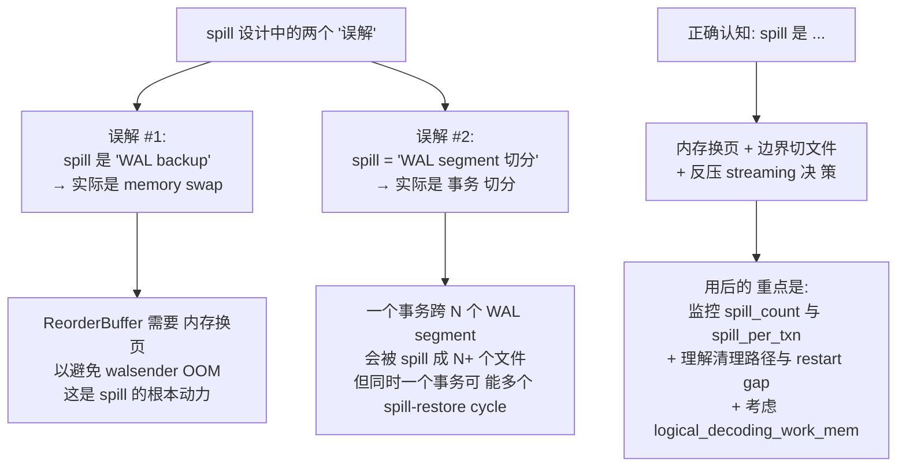

5 个 takeaway：

1. **spill 是内存管理，是 ReorderBuffer 永远在做的事**——不依赖 streaming 选项
2. **`logical_decoding_work_mem` 是主阈值**，默认值 64MB 在 OLTP 100WH 一般够，遇到 HA 切换/分析查询时仍会反复触发
3. **snprintf 文件名 + WAL segment 切**：一个长事务可被切为多文件，按 LSN 段分；不跨 segment
4. **清理路径 5 条**——但只有 `StartupReorderBuffer`（postmaster start）保证所有 spill 都被清，运行时 commit/abort 是按 XID 删——**fallback 之外清理路径不可靠**
5. **TPC-C 100WH 的 5M spill 累积典型来源**：清理 gap + debug hook + 跨 segment 长事务反复 spill-restore——不是单纯 spill 频率

---

## 十二、参考资料

- PostgreSQL 18 dev 源码：`~/cwork/postgresql/src/`
  - `backend/replication/logical/reorderbuffer.c:218`（`logical_decoding_work_mem` 声明）
  - `backend/replication/logical/reorderbuffer.c:809–868`（`ReorderBufferQueueChange`：change 入队 → CheckMemoryLimit 触发）
  - `backend/replication/logical/reorderbuffer.c:190–195`（`ReorderBufferDiskChange` 结构体）
  - `backend/replication/logical/reorderbuffer.c:3870–3957`（`ReorderBufferCheckMemoryLimit` 决策）
  - `backend/replication/logical/reorderbuffer.c:3963–4065`（`ReorderBufferSerializeTXN` 写文件）
  - `backend/replication/logical/reorderbuffer.c:4273`（`ReorderBufferCanStream`）
  - `backend/replication/logical/reorderbuffer.c:4282`（`ReorderBufferCanStartStreaming`）
  - `backend/replication/logical/reorderbuffer.c:4510–4643`（`ReorderBufferRestoreChanges` 读）
  - `backend/replication/logical/reorderbuffer.c:4820–4843`（`ReorderBufferRestoreCleanup`：commit 时 unlink）
  - `backend/replication/logical/reorderbuffer.c:4850–4880`（`ReorderBufferCleanupSerializedTXNs`：slot 启动删 spill）
  - `backend/replication/logical/reorderbuffer.c:4889–4900`（`ReorderBufferSerializedPath`：文件路径生成）
  - `backend/replication/logical/reorderbuffer.c:4907–4934`（`StartupReorderBuffer`：postmaster 启动清理）
  - `backend/utils/misc/guc_tables.c:2604`（`logical_decoding_work_mem` 默认 64MB）
  - `backend/catalog/system_views.sql:1045`（`pg_stat_replication_slots`：spill_txns / spill_count / spill_bytes）
  - `include/replication/reorderbuffer.h:169–275`（`RBTXN_*` flag 含义）

- 同系列前文：
  - [PostgreSQL 逻辑复制表的生命周期：从 `pg_replication_slots` 到 `pg_subscription_rel` 的全景图](./postgresql-logical-replication-tables-lifecycle/index.html)
  - [PostgreSQL 逻辑复制 streaming 与 spill：从 reorderbuffer 到 `<subid>-<xid>.changes` 的全程真相](./postgresql-logical-replication-streaming-spill/index.html)

