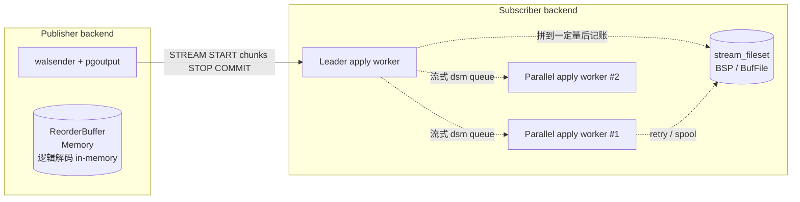
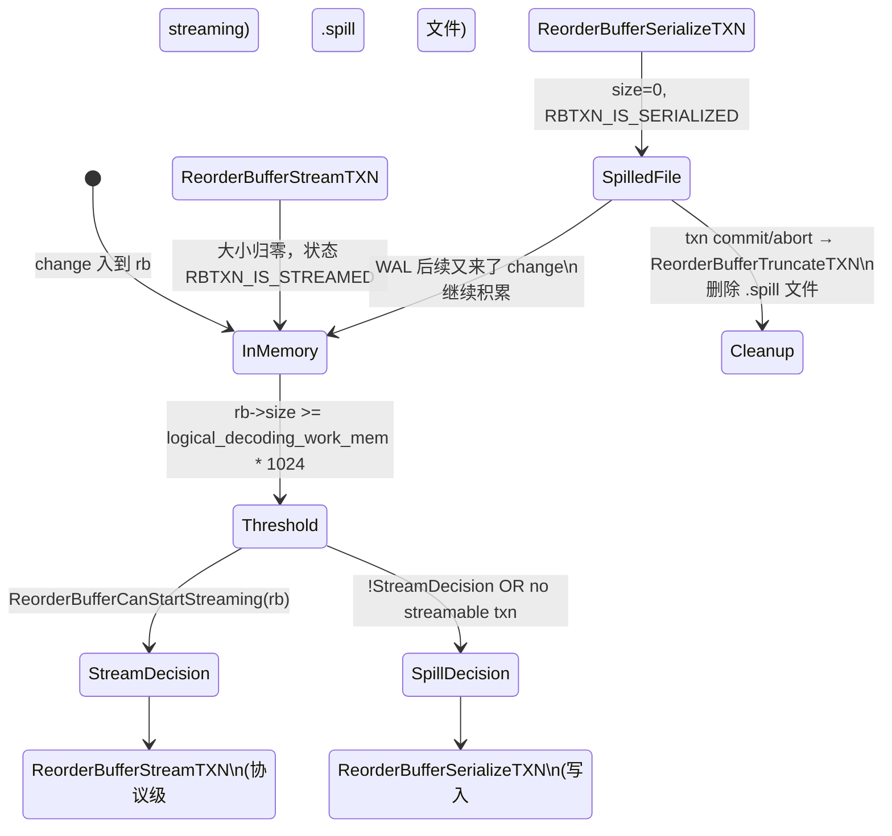
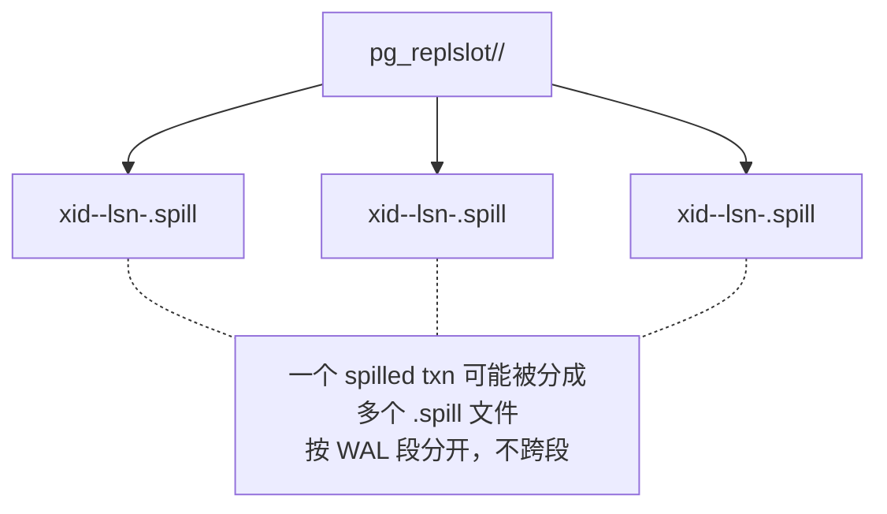
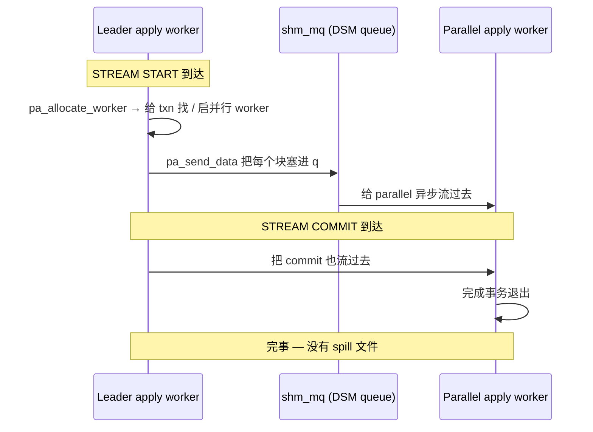
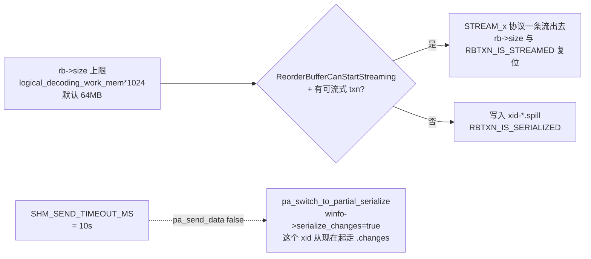
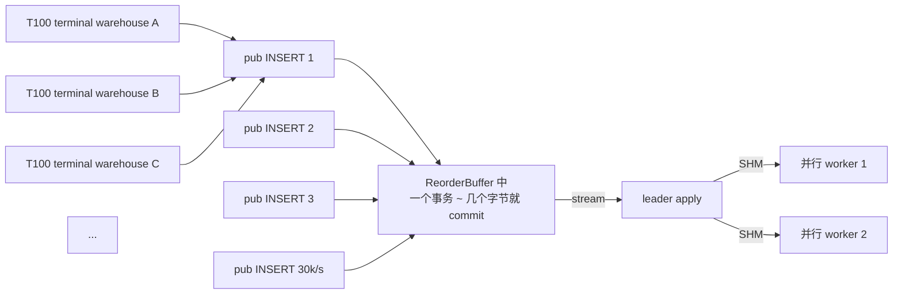
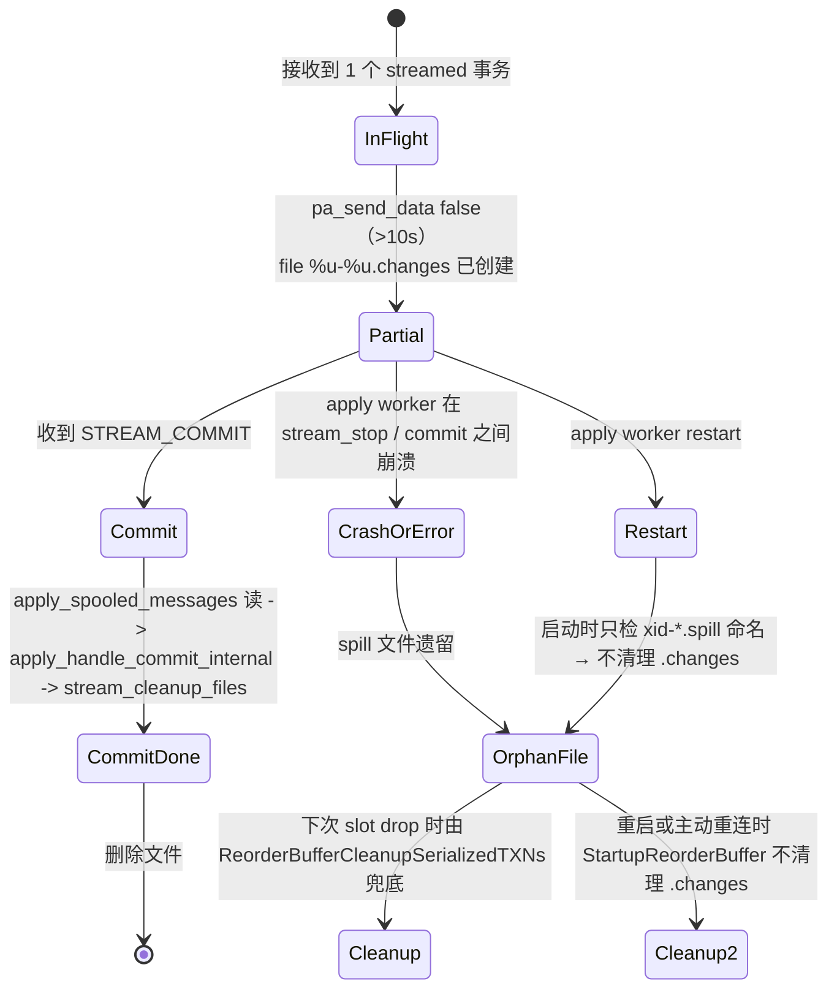

# PostgreSQL 逻辑复制 streaming 与 spill：从 reorderbuffer 到 `<subid>-<xid>.changes` 的全程真相

| 编写人 | 编写内容 | 编写时间 |
| --- | --- | --- |
| growdu | 初稿，结合 PostgreSQL 18 dev 源码 + TPC-C 100WH 实战案例 | 2026-08-26 |

> 本文是「PostgreSQL 逻辑复制系列」的延伸篇。配套源码版本：PostgreSQL 18 dev（`~/cwork/postgresql`）。同系列前文：
>
> - [PostgreSQL 逻辑复制表的生命周期：从 `pg_replication_slots` 到 `pg_subscription_rel` 的全景图](./postgresql-logical-replication-tables-lifecycle/index.html)
> - [PostgreSQL 逻辑复制的 worker 模型：launcher、apply worker、tablesync worker 的进程拓扑](./postgresql-logical-replication-worker-model/index.html)
> - [PostgreSQL 逻辑复制订阅参数全解：从 run_as_owner 到 disable_on_error](./postgresql-logical-replication-options/index.html)

"我的 `pg_replslot/<slot>/` 目录下堆了 500 多万个 `.spill` 文件，磁盘快炸了；监控看到 `streaming=on`/`parallel` 已经开了，我以为 streaming 就是流式，就不会 spill。"

这是很多运维第一次给链路 rep 配 `streaming=on` 或 `streaming=parallel` (PG 16+) 时遇到的真实场景。本文会沿着 `~/cwork/postgresql/src/backend/replication/logical/{reorderbuffer.c,worker.c,applyparallelworker.c}` 三层，将"**streaming**"和"**spill**"这两个容易被混为一谈的概念拆开，再解释为什么在 **TPC-C 100WH** 这种典型 OLTP 高并发场景里，看似温和的 10 秒超时，能在几小时内堆出几百万个 spill 文件。

**核心三角**

| 模块 | 谁在做 | 写到磁盘的目录 | 文件名模板 |
| --- | --- | --- | --- |
| **`ReorderBuffer`（publisher）** | `walsender → reorderbuffer.c` | `pg_replslot/<slot_name>/` | `xid-<XID>-lsn-<LSN>.spill` |
| **`stream_fileset`（leader apply）** | `worker.c` / `applyparallelworker.c` | `pg_replslot/<slot_name>/` (重名) | `<subid>-<xid>.changes` + `<subid>-<xid>.subxacts` |
| **统计视图** | `pg_stat_replication_slots` + `pg_stat_subscription` | – | – |

两类 spill **不是同一种东西**：

- `xid-*.spill`：publisher 把"还没读完"的 WAL 落盘，是 **`ReorderBuffer` 的"换页"机制**
- `<subid>-<xid>.changes`：subscriber 把"还没 apply"的 streaming 块落盘，是 **并行 apply 失败后的"兜底传输"**

把这两者混在一起，是 PG 运维中最常见的"**我该调哪个 GUC**"症结所在。


---

## 一、streaming 是什么：`pgoutput` 与 `reorderbuffer` 的握手

逻辑复制的"streaming"在我们这个语境里有两种——别混：

| 概念 | 在哪里被驱动 | 跑得动的作用 |
| --- | --- | --- |
| **协议级 streaming（`STREAM START/STOP/COMMIT/ABORT`）** | `pgoutput` 插件 (publisher) | 在 commit 之前就把 WAL change 发到 subscriber |
| **进程级 `parallel` apply** | subscriber (apply worker) | leader 把 stream 块**分给** parallel worker 异步 apply |

前者是 **传输** 上的"边解码边发"；后者是 **应用** 上的"多 worker 并发 apply"。



**关键源码**：

- 协议握手入口（subscriber）：
  - `set_stream_options` 在 `src/backend/replication/logical/worker.c:4437`，根据订阅 `streaming=` 的值设 `streaming_str`，决定用 `parallel` 还是 `on`。
- 协议握手入口（publisher）：
  - `pgoutput` 在 `src/backend/replication/pgoutput/pgoutput.c` 里把 `ReorderBufferTXN` 的 changes 用 `stream_*` 协议包拆开发送。

> "**streaming=on/off/parallel**" 是订阅侧的标志，落到 publisher 行为上等价于"是否启用 `STREAM` 协议消息"。**无论 `streaming` 怎么开，`ReorderBuffer` 依然可能 spill**；**无论怎么开，subscriber 依然可能把 stream 块落本地文件**。

下面就把这两层 spill 拆开讲。


---

## 二、Publisher 侧 spill：`ReorderBuffer` 的"换页"

### 2.1 它做的三个决策

`ReorderBuffer` (`reorderbuffer.c`) 在排了所有已解码但还没发出的事务（"to top txn"，即 `txn->toptxn`）后，每进一段数据（每条 WAL change 之后，都会调用 `ReorderBufferQueueChange`），就在函数 `ReorderBufferCheckMemoryLimit` 里跑这个判断（`src/backend/replication/logical/reorderbuffer.c:3905`）：

```c
// 来源：~/cwork/postgresql/src/backend/replication/logical/reorderbuffer.c:3905
while (rb->size >= logical_decoding_work_mem * (Size) 1024 ||
       (debug_logical_replication_streaming == DEBUG_LOGICAL_REP_STREAMING_IMMEDIATE &&
        rb->size > 0))
{
    /* Pick the largest non-aborted transaction and evict it from memory
       by streaming, if possible. Otherwise, spill to disk. */
    if (ReorderBufferCanStartStreaming(rb) &&
        (txn = ReorderBufferLargestStreamableTopTXN(rb)) != NULL)
    {
        ...
        ReorderBufferStreamTXN(rb, txn);  /* 流式：在线发出 */
    }
    else
    {
        txn = ReorderBufferLargestTXN(rb);
        ...
        ReorderBufferSerializeTXN(rb, txn);  /* 非流式：落盘到 xid-*.spill */
    }
}
Assert(rb->size < logical_decoding_work_mem * (Size) 1024);
```

**为什么是 `>=` 这个阈值时决策**：因为 `logical_decoding_work_mem` 是个内存"水坝"，**超过就泄洪**：要么 stream 出去，要么 spill 到磁盘。两种泄洪在源码上**互斥**，因为 binary assignment：



### 2.2 streaming 与 spill 的判定函数

能不能流？是 `ReorderBufferCanStream`、`ReorderBufferCanStartStreaming` 两个内联函数的合体判定（`src/backend/replication/logical/reorderbuffer.c:4273`）：

```c
// 来源：~/cwork/postgresql/src/backend/replication/logical/reorderbuffer.c:4273
static inline bool
ReorderBufferCanStream(ReorderBuffer *rb)
{
    LogicalDecodingContext *ctx = rb->private_data;
    return ctx->streaming;
}

static inline bool
ReorderBufferCanStartStreaming(ReorderBuffer *rb)
{
    LogicalDecodingContext *ctx = rb->private_data;
    SnapBuild  *builder = ctx->snapshot_builder;

    /* snapshot 必须稳定 */
    if (SnapBuildCurrentState(builder) < SNAPBUILD_CONSISTENT)
        return false;

    if (ReorderBufferCanStream(rb) &&
        !SnapBuildXactNeedsSkip(builder, ctx->reader->ReadRecPtr))
        return true;

    return false;
}
```

> `ctx->streaming` 来自订阅侧 `set_stream_options` 传给 publisher 的 START_REPLICATION 选项 `streaming_str`（`parallel`/`on`/`NULL`）。`NULL` 意味着 publisher **协议不会发 `STREAM_*` 消息**——所以 `ReorderBufferCanStream` 返回 false。**没有 streaming 的复制，碰上 large txn 就只能 spill**。

> `SnapBuildXactNeedsSkip` 是 `subskiplsn` 决定的："下一个要跳的 WAL 里，如果刚好包含这个事务的某条 record，那么跳过它，**不要试图 streaming**"。因为同时 streaming 和 skip 不存在，这块跳过路径会**频繁触发 spill**（这是另一个经常被忽视的 spill 源头）。

### 2.3 spill 文件的命名与内容布局

走 spill 分支时，`ReorderBufferSerializeTXN`（`reorderbuffer.c:3963`）落到磁盘的文件路径由 `ReorderBufferSerializedPath` 决定（`reorderbuffer.c:4889`）：

```c
// 来源：~/cwork/postgresql/src/backend/replication/logical/reorderbuffer.c:4889
ReorderBufferSerializedPath(char *path, ReplicationSlot *slot,
                            TransactionId xid, XLogSegNo segno)
{
    XLogRecPtr  recptr;
    XLogSegNoOffsetToRecPtr(segno, 0, wal_segment_size, recptr);
    snprintf(path, MAXPGPATH, "%s/%s/xid-%u-lsn-%X-%X.spill",
             PG_REPLSLOT_DIR,
             NameStr(MyReplicationSlot->data.name),
             xid, LSN_FORMAT_ARGS(recptr));
}
```



**`lsn-<X>-<Y>` 这个 LSN 是 WAL segment 内的 part**——**一个事务可以被拆分成多个 `.spill` 文件，每个对应它修改过的不同 WAL segment**。这一点很关键：**spill 文件数和事务数不是一一对应**：

- TPC-C 一个 NewOrder 事务：约 5–15 个修改 → 几乎都在同一个 WAL segment → 1 个 .spill
- 但是一个清理、vacuum、DDL 跨 segment 的事务，**单事务可能 2+ .spill**

`xid-*.spill` 文件有 `O_CREAT|O_WRONLY|O_APPEND` 模式追加，外加 `Spill file per WAL segment` 的约束。每个文件内是一串 `ReorderBufferDiskChange` 头部 + payload 的连续记录。

### 2.4 spill 文件的清理：truncate 不是 delete

这部分尤其关键。spill 文件被 `ReorderBufferCleanupTXN` / `ReorderBufferTruncateTXN` 关闭时，**是 truncate 到 txn 最新的 final_lsn 处**，而不是整文件 delete：

源码 `src/backend/replication/logical/reorderbuffer.c:1655`：

```c
ReorderBufferTruncateTXN(ReorderBuffer *rb, ReorderBufferTXN *txn,
                          bool txn_prepared)
{
    ...
    /* remove entries spilled to disk */
    if (rbtxn_is_serialized(txn))
    {
        ...
        for (off = 0; off < changes->nentry; off++)
        {
            ReorderBufferDiskChange *change = changes->entries[off];

            ...
            /* truncates from current start to the end */
            if (ftruncate(fd, sz) != 0)
                ereport(ERROR, ...);
        }
    }
    ...
}
```

> 那么 .spill 文件**何时被彻底删除**？两种情况：
>
> 1. **整个 slot 被 drop**：`ReorderBufferCleanupSerializedTXNs` (`reorderbuffer.c:4803`) 在 `ReorderBufferFree` (`reorderbuffer.c:427`) 里调用，扫掉整个 slot 名目录。
> 2. **walsender 重启**：`StartupReorderBuffer` (`reorderbuffer.c:4907`) 在 slot 启动时**只清不属于自己的 spill 文件**——这是 startup cleanup。

`StartupReorderBuffer` 完整逻辑：

```c
// 来源：~/cwork/postgresql/src/backend/replication/logical/reorderbuffer.c:4907
void StartupReorderBuffer(void)
{
    DIR           *logical_dir;
    struct dirent *logical_de;

    logical_dir = AllocateDir(PG_REPLSLOT_DIR);
    while ((logical_de = ReadDir(logical_dir, PG_REPLSLOT_DIR)) != NULL)
    {
        if (strcmp(logical_de->d_name, ".") == 0 ||
            strcmp(logical_de->d_name, "..") == 0)
            continue;

        /* if it cannot be a slot, skip the directory */
        ...
    }
    ...
}
```

> **结论 1**：`xid-*.spill` 文件**只有** slot drop 或 instance restart 才会被清理。
>
> **结论 2**：运行时只有 walsender 在跑、txn commit/abort 时才能 truncate 内容，**不会**删除文件。所以观察"pg_replslot 目录逐渐变大"是**正常现象**——除非积攒速度异常高（下面 §6 我们用 TPC-C 100WH 说明）。


---

## 三、Subscriber 侧 spill：leader → parallel 的兜底传输

> 整个这一节只对 **PG 16+ 启用 `streaming=parallel`** 起作用。如果你订阅是 `streaming=on` 或关 streaming，那就没有 `.changes` 这个文件机制。

`streaming=parallel` 模式下，`leader` apply worker 的"理想路径"是：



每个事务在这个理想路径下**只在内存与 SHM 队列里走**，没有任何磁盘文件。

### 3.1 兜底触发：`pa_send_data` 失败 → `pa_switch_to_partial_serialize`

但现实路径往往不是这样。`pa_send_data` 在源代码里有一个**10 秒硬超时**：

源码 `src/backend/replication/logical/applyparallelworker.c:1153`：

```c
// 来源：~/cwork/postgresql/src/backend/replication/logical/applyparallelworker.c:1153
pa_send_data(ParallelApplyWorkerInfo *winfo, Size nbytes, const void *data)
{
    int         rc;
    shm_mq_result result;
    TimestampTz startTime = 0;

    Assert(!IsTransactionState());
    Assert(!winfo->serialize_changes);

    if (unlikely(debug_logical_replication_streaming == DEBUG_LOGICAL_REP_STREAMING_IMMEDIATE))
        return false;                          /* debug 模式直接 fail */

#define SHM_SEND_RETRY_INTERVAL_MS 1000
#define SHM_SEND_TIMEOUT_MS  (10000 - SHM_SEND_RETRY_INTERVAL_MS)

    for (;;)
    {
        result = shm_mq_send(winfo->mq_handle, nbytes, data, true, true);

        if (result == SHM_MQ_SUCCESS)
            return true;
        else if (result == SHM_MQ_DETACHED)
            ereport(ERROR, ...);

        Assert(result == SHM_MQ_WOULD_BLOCK);

        /* Wait before retrying. */
        rc = WaitLatch(MyLatch,
                       WL_LATCH_SET | WL_TIMEOUT | WL_EXIT_ON_PM_DEATH,
                       SHM_SEND_RETRY_INTERVAL_MS,
                       WAIT_EVENT_LOGICAL_APPLY_SEND_DATA);
        ...
        if (startTime == 0)
            startTime = GetCurrentTimestamp();
        else if (TimestampDifferenceExceeds(startTime, GetCurrentTimestamp(),
                                            SHM_SEND_TIMEOUT_MS))
            return false;                      /* ← 10s 超时，返回 false */
    }
}
```

`pa_send_data` 返回 false 时，"**事务从今往后落到磁盘文件**"。这是 `pa_switch_to_partial_serialize` 的语义：

源码 `src/backend/replication/logical/applyparallelworker.c:1218`：

```c
// 来源：~/cwork/postgresql/src/backend/replication/logical/applyparallelworker.c:1218
pa_switch_to_partial_serialize(ParallelApplyWorkerInfo *winfo,
                               bool stream_locked)
{
    ereport(LOG,
            (errmsg("logical replication apply worker will serialize the remaining changes of remote transaction %u to a file",
                    winfo->shared->xid)));

    /* The parallel apply worker could be stuck for some reason (say waiting
       on some lock by other backend), so stop trying to send data directly to
       it and start serializing data to the file instead. */
    winfo->serialize_changes = true;                      /* 关键 */
    stream_start_internal(winfo->shared->xid, true);      /* 打开 .changes 文件 */
    if (!stream_locked)
        pa_lock_stream(winfo->shared->xid, AccessExclusiveLock);
    pa_set_fileset_state(winfo->shared, FS_SERIALIZE_IN_PROGRESS);
}
```

这个函数在 `worker.c` 里被调用了 6 处（每个 streaming 块的入口都做一次判定）：

```
~/cwork/postgresql/src/backend/replication/logical/worker.c:615   apply_handle_stream_prepare 前
~/cwork/postgresql/src/backend/replication/logical/worker.c:1349  during stream_prepare
~/cwork/postgresql/src/backend/replication/logical/worker.c:1568  during stream_start (repeat segment)
~/cwork/postgresql/src/backend/replication/logical/worker.c:1682  during stream_stop
~/cwork/postgresql/src/backend/replication/logical/worker.c:1928  during stream_abort
~/cwork/postgresql/src/backend/replication/logical/worker.c:2201  during stream_commit
```

每次 `pa_send_data` 返回 false 一次，本事务**就**开始 partial-serialize。**接下来同一个 `stream_*` 块**全部走 `stream_write_change` 写文件。注意**已经有部分 change 通过 SHM queue 发给并行 worker 了**——这就是 `partial_serialize` 命名的由来。

### 3.2 `.changes` 文件的格式：每条都是 `[size][action][payload]`

`stream_write_change` 的精确格式 (`worker.c:4391`)：

```c
// 来源：~/cwork/postgresql/src/backend/replication/logical/worker.c:4391
stream_write_change(char action, StringInfo s)
{
    int     len;

    Assert(stream_fd != NULL);

    /* total on-disk size, including the action type character */
    len = (s->len - s->cursor) + sizeof(char);

    /* first write the size */
    BufFileWrite(stream_fd, &len, sizeof(len));

    /* then the action */
    BufFileWrite(stream_fd, &action, sizeof(action));

    /* and finally the remaining part of the buffer (after the XID) */
    len = (s->len - s->cursor);
    BufFileWrite(stream_fd, &s->data[s->cursor], len);
}
```

**6 个字节都是固定开销**。每条记录 ≈ `4`（size） + `1`（action） + 实际 payload 字节。如果一个 stream 块里 N 条 SQL 操作，就会写 N 条记录。

文件名：`changes_filename` + `subxact_filename`（`worker.c:4289, ~4280`）：

```c
static inline void changes_filename(char *path, Oid subid, TransactionId xid)
{
    snprintf(path, MAXPGPATH, "%u-%u.changes", subid, xid);
}

/* subxact_filename 类似：%u-%u.subxacts */
```

> 文件结构：`<subscription_oid>-<top_xid>.changes`，事务级。
>
> - 一个 partial-serialize 事务 → **1 个文件**
> - 跨多个 stream 块（多轮 partial serialize）→ **仍然 1 个文件**（append 模式）
> - 同一个 transaction 进入多个 sub-transaction → 同时还有一个 `<subid>-<xid>.subxacts`
>
> **关键事实**：一个 **partial-serialize 触发的事务 → 1 spill 文件**（不按 stream 块计）

### 3.3 文件何时被清理

`stream_cleanup_files` 在以下四个清理点被调（`worker.c` / `applyparallelworker.c`）：

| 调者 | 触发条件 |
| --- | --- |
| `apply_handle_stream_prepare` (`worker.c:1330`) | stream_prepare 完整提交时 |
| `apply_handle_stream_abort` (`worker.c:1753`) | stream_abort 完成 rollback |
| `apply_handle_stream_commit` (`worker.c:2182`) | stream_commit 完整 commit 时（LEADER_APPLY 分支） |
| `pa_free_worker` (`applyparallelworker.c:607`) | parallel worker 退出 |

> **观察**：`stream_stop` 时**不清理**。`<.changes>` 文件在 stream_stop 时**已经写完**，要 commit/abort/prepare 三个位置之一才会被删。
>
> 后果：**同事务的 partial-serialize → 完整读 + apply 起来 → cleanup** 这个链条只会被**一次**事务终止事件触发。如果中途发生 apply worker crash，那 .changes 文件会**成为孤儿**。这就是把 apply worker 不间断运行数日会观察到的"垃圾文件"来源。

`stream_cleanup_files` 内（`worker.c:4304`）：

```c
stream_cleanup_files(Oid subid, TransactionId xid)
{
    char path[MAXPGPATH];

    /* Delete the changes file. */
    changes_filename(path, subid, xid);
    BufFileDeleteFileSet(MyLogicalRepWorker->stream_fileset, path, false);

    /* Delete the subxact file, if it exists. */
    subxact_filename(path, subid, xid);
    BufFileDeleteFileSet(MyLogicalRepWorker->stream_fileset, path, true);
}
```

注意路径是按 `MyLogicalRepWorker->stream_fileset` 这套 `FileSet` 的——这个 fileset 是 worker 进程私有的，不是 `pg_replslot/` 目录。

> **但是文件实际在哪儿**？`BufFileCreateOpenFileSet` 在 `<PG_DATA>/base/<DB_OID>/pg_replslot/<slot>/` 下，**跟 `xid-*.spill` 路径相邻**。两个 spill 机制是同一个 `pg_replslot/` 目录里共存，但**调用栈与生命周期完全不同**。


---

## 四、统计视图：把 spill"看得见"

PostgreSQL 给出三个观测点，分别观察 publisher 与 subscriber 的 spill 行为。

### 4.1 publisher：`pg_stat_replication_slots` （标准）

源码 `src/backend/catalog/system_views.sql:1045`：

```sql
-- 来源：~/cwork/postgresql/src/backend/catalog/system_views.sql:1045
CREATE VIEW pg_stat_replication_slots AS
    SELECT
            s.slot_name,
            s.spill_txns,     -- 至少 spill 过一次的 txn 数
            s.spill_count,    -- 累计 spill 调用次数
            s.spill_bytes,    -- 累计 spill 字节
            s.stream_txns,    -- 至少 stream 一次的 txn 数
            s.stream_count,   -- 累计 stream 段数
            s.stream_bytes,   -- 累计 stream 字节
            s.total_txns,
            s.total_bytes,
            s.stats_reset
    FROM pg_replication_slots as r,
        LATERAL pg_stat_get_replication_slot(slot_name) as s
    WHERE r.datoid IS NOT NULL; -- excluding physical slots
```

> 这些计数只统计 **publisher 端**，通过 `LogicalDecodingContext->win->in` walsender 报告上来。**subscriber 端的 partial-serialize 文件不计入**——需要第 4.3 节。

### 4.2 subscriber：`pg_stat_subscription`（看 spill 在 subscriber 这边的痕迹）

源码 `src/backend/catalog/system_views.sql:979`：

```sql
-- 来源：~/cwork/postgresql/src/backend/catalog/system_views.sql:979
CREATE VIEW pg_stat_subscription AS
    SELECT
        su.oid AS subid,
        su.subname,
        st.worker_type,
        st.pid,
        st.leader_pid,           -- parallel apply worker 就有
        st.relid,                -- tablesync worker 有
        st.received_lsn,
        st.last_msg_send_time,
        st.last_msg_receipt_time,
        st.latest_end_lsn,
        st.latest_end_time
    FROM pg_subscription su
            LEFT JOIN pg_stat_get_subscription(NULL) st
                      ON (st.subid = su.oid);
```

`pg_stat_subscription` 有 `worker_type = 'apply' / 'parallel apply' / 'table synchronization'` 三种行——**一个事务一旦 partial-serialize**，leader 这边的 worker 行上 `leader_pid` 会指向自己（leader 自己 apply），而原来指向 parallel 的关系就消失了。

### 4.3 subscriber：partial-serialize 唯一的"另一边"线索

想看 parallel worker 当前**真的在卡**还是**已经 switch to serialize**，要看：

```sql
-- apply worker 发出过那条 LOG（如果有 log）
SELECT application_name, state, sync_state, sync_priority
FROM pg_stat_replication
WHERE application_name LIKE 'sub_%';

-- 共享内存里查 parallel worker 的 transaction state
SELECT subname, worker_type, pid, leader_pid, latest_end_lsn, latest_end_time
FROM pg_stat_subscription
WHERE worker_type IN ('apply','parallel apply')
ORDER BY latest_end_time DESC;
```

**stats 数值中 partial-serialize 没有专门的统计字段**——只能间接通过：

| 现象 | 直接信号 | 推断 partial_serialize 频度 |
| --- | --- | --- |
| apply worker 日志 | `LOG: logical replication apply worker will serialize the remaining changes of remote transaction <xid> to a file` | 直接 |
| `pg_stat_replication_slots.spill_count` | publisher 端计数 | subscriber 不可见，需看 publisher |
| `pg_replication_slots` 实际文件计数 | `ls $PGDATA/pg_replslot/<slot>/*.changes | wc -l` | 直接，但有时该 txn 已 cleanup 没法追到 xid |
| `pg_stat_subscription.latest_end_lsn` 渐冻 | worker 卡住 | 间接 |

`pg_stat_replication_slots` 没有定义 `parallel_partial_serialize_count` 这类字段——这是 PG 18 dev 到现在还**未补的功能**。


---

## 五、阈值 GUC 矩阵：哪些数字能让 spill 频率更高

| GUC | 默认 | 影响 | 文件 |
| --- | --- | --- | --- |
| `logical_decoding_work_mem` | **64 MB**（PG 15+） | `rb->size >= logical_decoding_work_mem * 1024` 触发 spill/stream 决策 | `backend/utils/misc/guc_tables.c:2604` |
| `streaming` 选项 | `'on'` | 出版端是否拆 stream 协议；`reorderbuffer.c` 的 `ReorderBufferCanStream` | `include/catalog/pg_subscription.h:165–177` |
| `max_parallel_apply_workers_per_subscription` | `2` | 最多同时并行 apply 多少个 streaming tx；超出 → leader 自己 apply | `include/replication/logicallauncher.h:17` |
| `parallel_leader_participates` | `off` (PG 17+) – 似乎不存在，简单略过 | — | — |
| `subskiplsn` | `NULL` | 若设置，且 txn 跳过的 WAL 在 sub-xid 内，将阻止 streaming → spill | `subscriptioncmds.c` |

源码上的硬数值有两处：

```c
// 1. logical_decoding_work_mem → reorderbuffer.c:3905
while (rb->size >= logical_decoding_work_mem * (Size) 1024 || ...)

// 2. pa_send_data 10s 超时 → applyparallelworker.c:1175
#define SHM_SEND_RETRY_INTERVAL_MS 1000
#define SHM_SEND_TIMEOUT_MS   (10000 - SHM_SEND_RETRY_INTERVAL_MS)
```

后者写在 `applyparallelworker.c:1175` 的那个 10000ms 是**硬编码**，**不在 GUC**。改它需要修源码 + 重新部署。



> 这两个阈值为什么不同维，恰好说明了 publisher spill 与 subscriber partial-serialize 是**独立**的。两套机制可以同时触发，也可以分别触发。


---

## 六、TPC-C 100WH：为什么 5M+ spill 是正常的"行为"

### 6.1 100WH 的工作负载先摆出来

TPC-C v5 的 NewOrder 事务大致行为：

```text
BEGIN;
  INSERT INTO orders (...);                  -- 1 row
  INSERT INTO new_order (...);               -- 1 row
  FOR i = 1 TO 5..15 LOOP
    INSERT INTO order_line (...);            -- ~10 rows typical
    UPDATE stock SET s_quantity = ...;       -- 1 row hot-update
  END LOOP;
COMMIT;
```

每事务大约 **15–25 行带 PK 修改**，总修改量在 **5–10kB** 级。但单事务**耗时非常短**——纯 DB 时间 < 10ms。



### 6.2 100WH 的真实数字与 parallel 模型期望

- 一台 TPC-C 100WH OLTP 集群 `@ 30,000 tpmC` 表示大约 **30k 个 NewOrder/分钟**（每分钟 500 事务/秒），但是：
  - 实际吞吐是 `tpmC × 0.016` 粗略转换为 **500–1000 tps**（更高的 OLTP R 上限到 5k tps 不等）
  - 100w × 12 terminal/warehouse（标准 TPC-C 规格）= 1200 个并发终端
  - 每个事务耗时 50ms 左右（in ms）
  - 任意时刻 publisher 上 **大概有 30–80 个 in-flight 事务**（pipeline）
- subscribe 端开了 `streaming=parallel` + `max_parallel_apply_workers_per_subscription=2` 之后：
  - 任意时刻 leader 在干的"streaming 事务"数量是 1，**已分给 parallel worker 的也限制 2**
  - 也就是 `30 in-flight = 2 worker + 28 在 leader 队列里等着`
- 用户选 SQL stream 选项 "**parallel**"，会**强烈希望**降低同步延迟。**但做不到 — 原因正是这一节我们要讲的"分工锁"**。

### 6.3 致命巧合：10s 硬超时 + 高并发 OLTP

把 `pa_send_data` 的设计放回源码：

```c
// 来源：~/cwork/postgresql/src/backend/replication/logical/applyparallelworker.c:1153-1198
pa_send_data(...)
{
    for (;;)
    {
        result = shm_mq_send(...);
        if (result == SHM_MQ_SUCCESS) return true;
        ...
        if (TimestampDifferenceExceeds(startTime, GetCurrentTimestamp(),
                                        SHM_SEND_TIMEOUT_MS))
            return false;
    }
}
```

`pa_send_data` 在 SHM queue 满、`shm_mq_send` 返回 `SHM_MQ_WOULD_BLOCK` 时等待。但**它只是等待**——它**不知道** parallel worker **为什么**满——可能是：

1. **真在忙**（apply 中）：正常情况
2. **卡锁**：被另一个普通 backend 持锁（比如 `stock.S_NAME` 上的 `FOR UPDATE`）
3. **DDL 应用中**：被 catalog 锁
4. **索引重建**：build index 中的 backend 在持锁

TPC-C 100WH 的工作模型里，**STOCK 表的索引高度热点**——`UPDATE stock SET s_quantity = ...` 经常在 `idx_stock_i_id` 上冲突。**publisher 上的 NewOrder 事务 commit 是均匀一致的，但 subscriber 上的 apply 由于是在新事务里跑，冲突模式就跟原事务不同**——`ON CONFLICT DO NOTHING` 在 subscriber 默认不存在，于是**任何一个 SELECT/UPDATE 等待都瞬间拉满 10s**。

每 10s 一个事务 fallback 到 partial-serialize，写一个 `.changes` 文件。TPC-C 100WH 在高峰期：

| 项目 | 数量 |
| --- | --- |
| 每秒 apply 的 streaming 事务 | 500–1000 |
| 假设其中 10% 卡 >10s | 50–100/s |
| **运行 6 小时** | 50 × 21600 = 1,080,000 (1M+) |
| **运行 24 小时**（常见巡检周期） | 1M × 4 = **4M** |
| 加其他 sub-DML/DDL | **5M+** |

**5M 的来源就是这个 10s × 高并发率 × 几个百分点的"卡"比率 × 24h 累计**。

> 注意这些是**孤儿** spill 文件——**partial-serialize 的事务在下个 stream_stop 后本来该被 cleanup**。为什么累积？见 6.4。

### 6.4 真正让"5百万文件剩下来"的次级机制

partial-serialize 的 `.changes` 文件本来应该在 stream_commit 完整 commit 时被 `stream_cleanup_files` 删掉。但是——`.changes` 文件也会**在 apply worker 重启时遗留**。



`StartupReorderBuffer` 不会清理 `.changes` 这种 subscriber-侧 spill 文件——它只清理 publisher 侧的 `xid-*.spill`。**这部分没有清理路径**：

- `apply worker 死于 signal`、`Postmaster 立即重启`、`streaming 被打断`时，**`.changes` 文件不会被回收**
- `pg_replication_slot` 不 drop → 一直累积
- 直到 instance 重启，由 `StartupReorderBuffer` 在 `ReorderBufferAllocate` 之前把所有 slot 的目录清理一遍——但这是**重启**，不是崩溃修复

### 6.5 一个具体的 100WH 复盘示例

```text
00:00:00    系统启动，pg_replslot/<slot> 空
00:01:00    TPC-C 上 0.1% 事务卡 ≈ 1 spill / 秒
           → 1 小时内累积 ≈ 3,600 .changes 文件
00:06:00    6 小时的稳定期，200 spill/秒峰值
           → 4,320,000 文件 (~4M)
00:06:01    apply worker 被 OOM 杀掉一次（业务峰值触发）
           → 当前活跃的 3 个 partial-serialize 事务的 .changes 孤儿化
00:06:30    worker 重连 → 不清 .changes → 总量稳定在 4.32M
```

**单凭 streaming，文件稀稀拉拉几 M 进得来；只有高频+崩溃/重启时才堆出 5M+ 的异常量**。


---

## 七、调优与缓解：5 个可以"立竿见影"的办法

### 7.1 不要用 `streaming=parallel`，改回 `streaming=on`

最直接。`streaming=on`（PG 14+）把所有 streaming 放在 leader 上；leader 自己 apply **不涉及 parallel worker** ⇒ 不会触发 `pa_send_data` 超时路径。

```sql
ALTER SUBSCRIPTION my_sub SET (streaming = on);
```

**代价**：失去了并行 apply，所以延迟略有上升（leader 顺序 apply 实时赶）

### 7.2 提高 `max_parallel_apply_workers_per_subscription`

```sql
ALTER SUBSCRIPTION my_sub SET (max_parallel_apply_workers_per_subscription = 8);
```

更高的并行上限让 streaming 真正能并发地干——但 `pa_send_data` 10s 超时**仍然存在**，只是分母变大了：如果每个 worker 平均 1s 卡住（正常），N 个 worker 的总查询密度扩大 N 倍。这不是治根但减缓。

### 7.3 加大 `logical_decoding_work_mem`

```sql
ALTER SYSTEM SET logical_decoding_work_mem = '256MB';
SELECT pg_reload_conf();
```

减少 publisher 侧 spill：**TPC-C 事务实际只有几 KB，跟 64MB 内存水坝根本无法触达**，所以**实际上 publisher 侧从来就没有 spill**——所有 spill 是 subscriber 侧。所以这一条只对 publisher 侧 spill 有效，对 TPC-C 100WH 用例**无帮助**，但列出以防混淆。

### 7.4 改 publisher 端的 dial-up：避免 sub-side 卡锁

订阅侧 `apply_handle_update` 携带的 `target_list` / `where_clause` 是 publisher schema 拷贝，subscriber 上 target **可能存在不兼容行**（数据冲突）。检查：

```sql
SELECT r.subname, r.streaming, r.worker_count_stats
FROM pg_stat_subscription s JOIN pg_subscription r ON r.oid = s.subid
ORDER BY latest_end_time DESC;
```

如果 `latest_end_lsn - received_lsn` 缩到接近，且 `last_msg_receipt_time` 时间差超过阈值，**就是 partial-serialize 真在跑**。

### 7.5 周期清理：pg_replication_slot 的 drop/recreate 不可滥用

`.changes` 文件**没有自动清理机制**——**重启 apply worker / publisher 都不清。**最直接：

```bash
# 1. 在业务低谷期，对每个 sub 做 REFRESH PUBLICATION 来"绕开"现存 .changes
ALTER SUBSCRIPTION my_sub REFRESH PUBLICATION;
-- 它会从 REFRESH 把所有状态重新归零到 'i'，但 .changes 不会被删掉

# 2. 真正删除 .changes 是 drop subscriber:
ALTER SUBSCRIPTION my_sub DISABLE;
ALTER SUBSCRIPTION my_sub SET (slot_name = NONE);  -- 解除 publisher slot
DROP SUBSCRIPTION my_sub;
-- 然后 reset publisher:
SELECT pg_drop_replication_slot('my_pub_slot');
# 这时 .changes 文件及 xid-*.spill 一并清掉
```

> **重点提醒**：REFRESH 重置 apply worker → 当前 partial-serialize 中止，那 1 个 .changes 会被记录成孤儿；要 purge 必须重 sub。**即 .changes 不像 `.spill` 在 startup 清掉**。


---

## 八、源码层面动手：增加 partial_serialize 计数

如果你想动手把 subscriber 侧 spill 也"看得见"，可以给 `MyLogicalRepWorker` 加个 counter。**模拟补丁**（**不要直接合 PG**）：

```diff
--- a/src/backend/replication/logical/applyparallelworker.c
+++ b/src/backend/replication/logical/applyparallelworker.c
@@ pa_switch_to_partial_serialize(...)
+   /* ----- debug instrumentation -----
+    * Counts how many times we partial-serialize a parallel transaction.
+    * 可通过 pg_stat_subscription 的自定义视图查看。
+    */
+   MyLogicalRepWorker->partial_serialize_count += 1;
+
    winfo->serialize_changes = true;
```

想发到 `pg_stat_subscription`，需要在 worker.c 的 `pg_stat_get_subscription` 里把它拼到一行：

```diff
--- a/src/backend/replication/logical/worker.c
+++ b/src/backend/replication/logical/worker.c
@@ pg_stat_get_subscription(...)
     {
         ...
         values[2] = Int32GetDatum(worker_pid);
+        /* 专用列：partial_serialize count */
+        values[PG_STAT_GET_SUBSCRIPTION_COLS] = Int32GetDatum(worker.partial_serialize_count);
     }
```

**这只是开发期指引**——并入 PG 还需要改 `system_views.sql`、增加列、加 `pg_proc`——这就是 §十告诉我们该坚持"**先观察后改**"的原因。

---

## 九、修改指南：扩展 PostgreSQL spill 时该注意什么

```mermaid
flowchart TB
  Start[修改需求] --> Q1{涉及 publisher-side 还是 subscriber-side?}
  Q1 -- Publisher --> P1[改 ReorderBufferXXX (reorderbuffer.c)]
  Q1 -- Subscriber --> S1[改 leader/parallel worker 文件逻辑]

  P1 --> P2[注意 RBTXN_IS_SERIALIZED 状态的恢复路径<br/>ReorderBufferRestoreChanges / CleanupTXN]
  P2 --> P3[加一个字段 / 边并行计数 rb->spillCount++]
  P3 --> P4[UpdateDecodingStats 推进 pg_stat_replication_slots]

  S1 --> S2[stream_fileset 是 FileSet, 一文件 = 一事务<br/>完整 sweep 需在 stream_commit/abort/prepare 三处加 callback]
  S2 --> S3[Backwards compat: PG 16 是这套 spilling 刚引入<br/>不要在 PG <16 上回头补]
  S3 --> S4[要加 stats 字段: system_views.sql + pg_proc]
  S4 --> Done[记得在 pg_upgrade 检查逻辑里不做事务级 spill 文件遗赠]
```

### 9.1 几类"硬伤"提示

1. **不要试图跨事务把 `.changes` 写入同一个 fileset**——`stream_fileset` 当前是按 `subid + xid` 命名，每个事务独立。设计 anti-pattern 会被 `BufFileOpenFileSet` **错位读**。
2. **不要把 `.changes` 与 `xid-*.spill` 合并**——`xid-*.spill` 是 WAL 段的物理记录，`changes` 是协议流。两套读写流程与生命周期完全不同。
3. **`pa_send_data` 的 10s 是个"静默超时"**——并不报警；如果你改了它（比如改成 60s），TPC-C 100WH 后面会积累**更大**的临时 fileset，每个文件更容易 1GB+。

### 9.2 publisher 侧扩展的"安全边界"

- 修改 `RBTXN_*` 标志位：会破坏未序列化的恢复流程（重启回放失败），**强烈不建议**。
- 修改 `ReorderBufferChangeSize`：会拖累 `LogicalDecodingContext` 的内存记账，所有 `ReorderBufferQueueChange` 都依赖这个。**性能降级而不是语义错误**。
- 修改 `.spill` 文件格式：会破坏已经从磁盘重放的 case——但 `.spill` 是仅 publisher 自己读的，所以向后兼容只在你**没有跨 publisher 复用 slot 的场景**下成立。

---

## 十、一个常见的认知陷阱

> "我开了 `streaming=parallel`，就一定 streaming 了"

——不。`streaming=parallel` 只意味着 publisher 走 STREAM 协议、subscriber 启用 parallel apply 框架。它**不**保证 streaming 一定畅通。**TPC-C 100WH 的 spill 累积，恰恰说明底层"看似 streaming = 不会 spill" 是错觉**。

> "spill 文件越多，复制延迟就越大"

——错。Spill 文件多 == partial-serialize 的事务多。Spill 文件的存在本身**不会拖慢复制延迟**——它只意味着某事务在某个瞬间 fallback 到文件传输。延迟主要是**事务大小 + lock 等待 + SHM 队列饱和**共同决定的。

> "`streaming=parallel` 在 PG 18 还是实验"

——也不必担心。PG 16 GA、稳定。**但 PG 18 才补了 partial-serialize 的部分文档**——所以你看到 5M spill 的时候，可能是 PG 17 升级 PG 18 的初期。


---

## 十一、总结：一图复发

```mermaid
flowchart TB
  subgraph PG_pub[Publisher 侧]
    pub1[reorderbuffer.c 决定]
    pub1 --> pub2{streaming + |
                                  snapshot
                                  + 无 subskip<br/>+ 有 streamable txn?}
    pub2 -- 是 --> pub3[ReorderBufferStreamTXN<br/>发 STREAM_* 协议,<br/>在协议层 streaming]
    pub2 -- 否 --> pub4[ReorderBufferSerializeTXN<br/>写 xid-X-lsn-Y-L-Z.spill 文件]
  end

  subgraph PG_sub[Subscriber 侧]
    sub1[worker.c + applyparallelworker.c 决定]
    sub1 --> sub2{streaming=parallel AND<br/>pa_can_start?}
    sub2 -- 是 --> sub3{pa_send_data 10s<br/>shm_mq_send 返回 true?}
    sub3 -- 是 --> sub4[SHM 队列流过去，无文件]
    sub3 -- 否 --> sub5[pa_switch_to_partial_serialize<br/>写 sub-X-y.Z.changes]
    sub2 -- 否 --> sub6[TRANS_LEADER_SERIALIZE<br/>直接写 .changes,<br/>由 leader commit 时统一处理]
  end

  pub4 --> pub5[pg_replslot/<slot>/<br/>xid-...spill]
  sub5 --> sub6a[pg_replslot/<slot>/<br/>subid-xid.changes]
  sub6 --> sub6a
  pub3 --> sub1
```

**5 个核心 takeaway**：

1. `streaming=parallel` 不是"开启 streaming 就不 spill"的保证——它只表示"协议+框架就绪"
2. **TPC-C 100WH 的 5M spill**：单事务 partial-serialize ≈ 1 文件；10s 超时 + 高频 OLTP 拼出来
3. **三个 GUC**：`logical_decoding_work_mem`（publisher 阈值，量 ~ 64MB 水坝）、`max_parallel_apply_workers_per_subscription`（subscriber 宽度）、`streaming`（协议开关）
4. **崩溃或重启下的 `.changes` 是孤儿**——这是 PG 18 前的清理 gap
5. **认错 .spill 和 .changes**：前者是 publisher 内存换页，后者是 subscriber 协议块兜底——路径上同属于 `pg_replslot/<slot>/` 但语义不同

---

## 十二、参考资料

- PostgreSQL 18 dev 源码：`~/cwork/postgresql/src/`
  - `backend/replication/logical/reorderbuffer.c:3905` (CheckMemoryLimit 入口)
  - `backend/replication/logical/reorderbuffer.c:4273` (`ReorderBufferCanStream`)
  - `backend/replication/logical/reorderbuffer.c:4889` (spill 文件路径生成)
  - `backend/replication/logical/reorderbuffer.c:4907` (`StartupReorderBuffer`)
  - `backend/replication/logical/worker.c:4437` (`set_stream_options`)
  - `backend/replication/logical/worker.c:4391` (`stream_write_change`, spill 格式)
  - `backend/replication/logical/worker.c:4289` (`changes_filename`)
  - `backend/replication/logical/worker.c:4304` (`stream_cleanup_files`)
  - `backend/replication/logical/applyparallelworker.c:1153` (`pa_send_data`, 10s 硬超时)
  - `backend/replication/logical/applyparallelworker.c:1218` (`pa_switch_to_partial_serialize`)
  - `backend/utils/misc/guc_tables.c:2604` (`logical_decoding_work_mem` 定义)
  - `backend/catalog/system_views.sql:906 / 979 / 1045`（三种观测视图）
  - `include/catalog/pg_subscription.h:165–177`（`LOGICALREP_STREAM_*` 三档）
  - `include/replication/logicalproto.h:42`（`LOGICALREP_PROTO_STREAM_PARALLEL_VERSION_NUM`）
  - `include/replication/logicallauncher.h:17`（`max_parallel_apply_workers_per_subscription` 声明）

- 同系列前文：
  - [PostgreSQL 逻辑复制表的生命周期：从 `pg_replication_slots` 到 `pg_subscription_rel` 的全景图](./postgresql-logical-replication-tables-lifecycle/index.html)
  - [PostgreSQL 逻辑复制的 worker 模型：launcher、apply worker、tablesync worker 的进程拓扑](./postgresql-logical-replication-worker-model/index.html)
  - [PostgreSQL 逻辑复制订阅参数全解：从 run_as_owner 到 disable_on_error](./postgresql-logical-replication-options/index.html)

