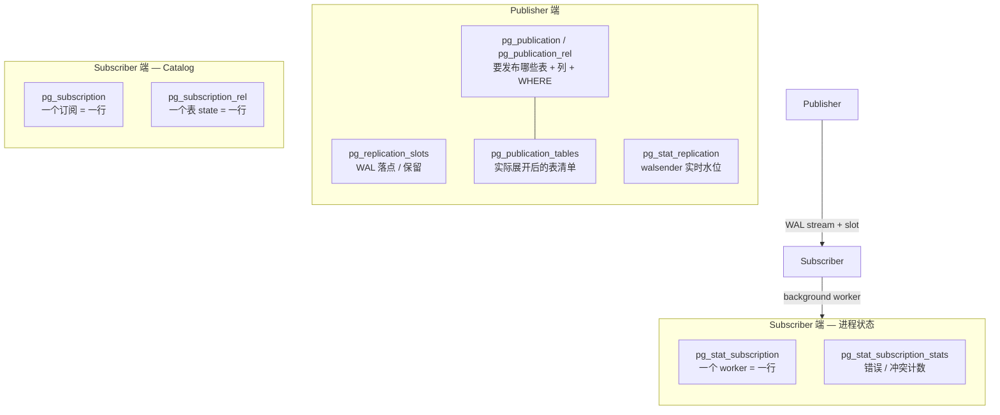
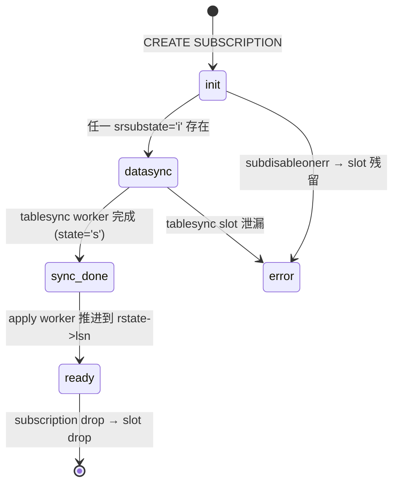
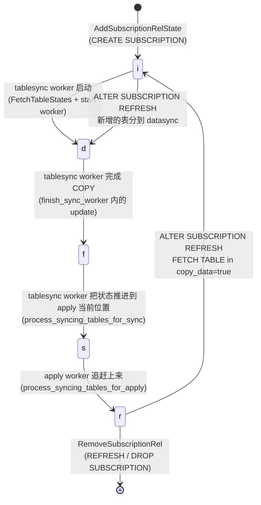
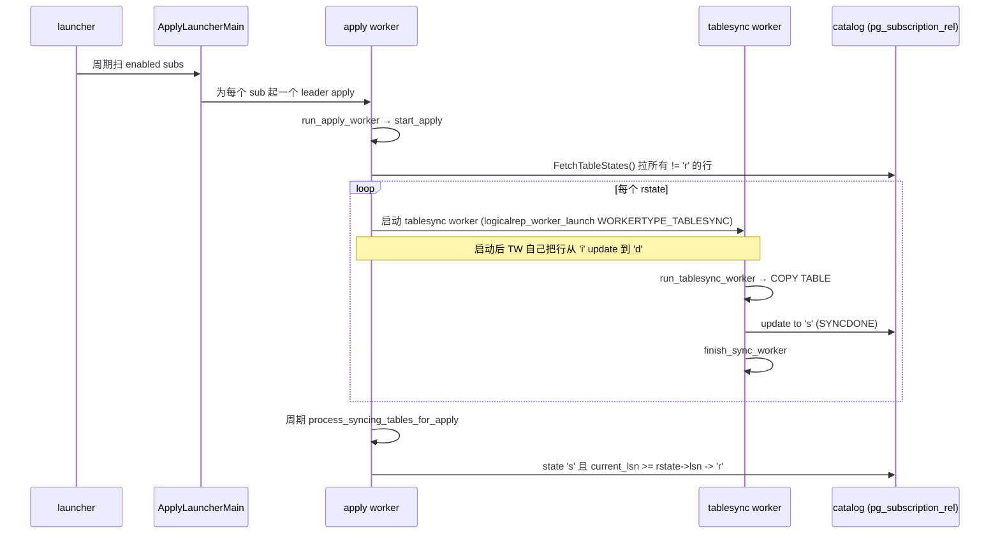
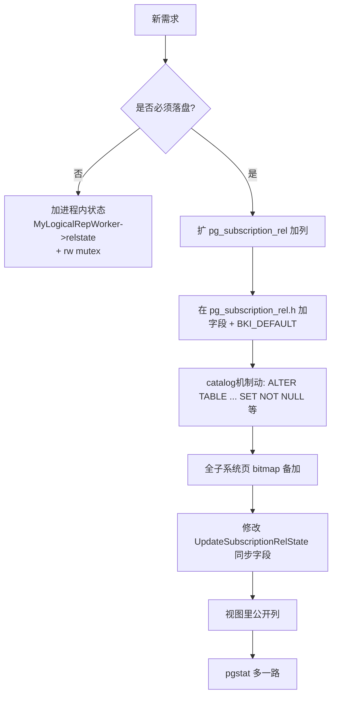

# PostgreSQL 逻辑复制表的生命周期：从 `pg_replication_slots` 到 `pg_subscription_rel` 的全景图

| 编写人 | 编写内容 | 编写时间 |
| --- | --- | --- |
| growdu | 初稿，结合 PostgreSQL 18 dev 源码 + 五件套系统视图 | 2026-08-25 |

> 本文是「PostgreSQL 逻辑复制系列」的第 N 篇。配套源码版本：PostgreSQL 18 dev（`~/cwork/postgresql`）。同系列前文：
>
> - [PostgreSQL 逻辑复制的 worker 模型：launcher、apply worker、tablesync worker 的进程拓扑](./postgresql-logical-replication-worker-model/index.html)
> - [PostgreSQL 逻辑复制订阅参数全解：从 run_as_owner 到 disable_on_error](./postgresql-logical-replication-options/index.html)
> - [PostgreSQL 逻辑复制与分区表：DDL 同步与 apply worker 启动](./postgresql-logical-replication-with-partitioned-tables/index.html)
> - [PostgreSQL 逻辑复制之 `publish_via_partition_root` 深度解析](./postgresql-logical-replication-publish-via-partition-root/index.html)

如果你正处理"我这表卡在 `i` 状态好久没动了"、"apply worker 看 `pg_stat_subscription` 但表就是不同步"、"库里堆了一堆 `sub_xxx_sync_xxxx` slot 怎么办"这些事——本文就是给你写的。

`pg_replication_slots`、`pg_stat_replication`、`pg_publication`、`pg_subscription`、`pg_subscription_rel` 这五张"看似独立"的系统视图，背后是一台精密的、对状态敏感的机器。它们各管一段：

- `pg_replication_slots` 管 publisher 侧 WAL **落点**和**保留**
- `pg_stat_replication` 管 publisher 侧 **walsender 进程的实时水位**
- `pg_publication` / `pg_publication_rel` 管"**发什么**"
- `pg_subscription` 管"**要收什么、按什么参数收**"
- `pg_subscription_rel` 管"**订阅里每一张表到了哪一步**"——这一张，是表的"生命的全部账本"

把这五张表连起来看，你就能把一张表的**全部生命周期**在 catalog 这层复现出来。本文的路线是：

1. 五件套逐张拆开讲，看它的 catalog 表 + 系统视图 + 来源函数（`pg_get_*`、`pg_stat_get_*`）
2. 把这五张表之间的**外键 / 引用**画成一张 ER 图
3. 用 `SUBREL_STATE_*` 八种状态字母画一张状态机，并对照源码里每一次 `UpdateSubscriptionRelState` 的调用点
4. 把进程视角（`pg_stat_subscription` 里看到的 worker）和数据视角（`pg_subscription_rel` 里看到的表）拼成一张**双向映射表**
5. 用一个真实的订阅-同步-应用的事故样本，演示怎么只用 SQL 把一个"表卡住"的故障定位到具体行、具体状态、具体 worker 进程


---

## 一、先用一张图看全局：五件套 vs 三层视角

把视角分三层，目录对应错错落落就清楚多了：



> **关键观察**：图的右侧两个长方形——它们**不是从同一个底表查的**。
>
> - `pg_subscription_rel` 直接扫 `pg_subscription_rel` 系统表
> - `pg_stat_subscription` 扫的是 `LogicalRepCtx->workers[]` 共享内存数组
>
> 所以"我表 `srsubstate='i'` 但 `pg_stat_subscription` 里看不到任何 worker"，是一个**完全合法**的状态：catalog 里记录了它要去同步，但共享内存里**还没有 worker**。


---

## 二、Publisher 端的三张视图

### 2.1 `pg_replication_slots` —— WAL 落点 + 保留

这张视图是 publisher 侧**唯一能告诉你"subscriber 漏到哪"**的表。它背后是一张系统表 `pg_replication_slots` 的 C 结构，由 `pg_get_replication_slots()` 这个 SRF 函数填充。

源码 `src/backend/catalog/system_views.sql:1019`：

```sql
CREATE VIEW pg_replication_slots AS
    SELECT
        L.slot_name,
        L.plugin,
        L.slot_type,
        L.datoid,
        D.datname AS database,
        L.temporary,
        L.active,
        L.active_pid,
        L.xmin,
        L.catalog_xmin,
        L.restart_lsn,
        L.confirmed_flush_lsn,
        L.wal_status,
        L.safe_wal_size,
        L.two_phase,
        L.two_phase_at,
        L.inactive_since,
        L.conflicting,
        L.invalidation_reason,
        L.failover,
        L.synced
    FROM pg_get_replication_slots() AS L
        LEFT JOIN pg_database D ON (L.datoid = D.oid);
```

**字段语义速记**（不是全部，是"诊断时一定要看"的几个）：

| 字段 | 看什么 | 你可能在诊断什么 |
| --- | --- | --- |
| `slot_type` | `'physical'` / `'logical'` | 物理还是逻辑复制 |
| `plugin` | `'pgoutput'` 是 PG 17+ 默认 | 配置错时是空 |
| `active` | `t` / `f` | 表 sync 卡住的常见标志之一 |
| `active_pid` | walsender 的 PG 后端 PID | 谁在用这个 slot |
| `restart_lsn` | 上次失败重启点 | publisher 端 WAL 起点 |
| `confirmed_flush_lsn` | subscriber 已确认的 LSN | "应用到哪里" |
| `wal_status` | `'reserved'` / `'unreserved'` / `'lost'` / `'unreserved_fixing_lsn'` | WAL 是否被回收 |
| `invalidation_reason` | 为什么 slot 失效 | 通常是 WAL 被回收 |
| `synced` | `t` 表示被另一个 standby 同步 | HA 拓扑 |

**对一张表而言**：

- 主 slot（`subsubname`）：记录从 publisher 到 subscriber 主 stream 的 LSN
- 初始同步时还会额外建 `sub_<subid>_<relid>_sync_<oid>` 形式的 **tablesync slot**，按表同步、初次完成后被 drop（`process_syncing_tables_for_sync` 里 `ReplicationSlotDropAtPubNode`）。**如果初始同步没完成，这个 slot 会一直留着**——这是非常常见的"slot 泄漏"症状。



### 2.2 `pg_stat_replication` —— walsender 实时水位

源码 `src/backend/catalog/system_views.sql:906`：

```sql
CREATE VIEW pg_stat_replication AS
    SELECT
        S.pid,
        S.usesysid,
        U.rolname AS usename,
        S.application_name,
        S.client_addr,
        S.client_hostname,
        S.client_port,
        S.backend_start,
        S.backend_xmin,
        W.state,
        W.sent_lsn,
        W.write_lsn,
        W.flush_lsn,
        W.replay_lsn,
        W.write_lag,
        W.flush_lag,
        W.replay_lag,
        W.sync_priority,
        W.sync_state,
        W.reply_time
    FROM pg_stat_get_activity(NULL) AS S
        JOIN pg_stat_get_wal_senders() AS W ON (S.pid = W.pid)
        LEFT JOIN pg_authid AS U ON (S.usesysid = U.oid);
```

**关系**：这张表**只显示 publisher 端 backend**。它是把 `pg_stat_activity` 跟 walsender 那条 SRF 做的内连接。

> **关键观察**：在 subscriber 端查这张表是空的。**逻辑复制的"接收方"并不通过 walsender 出现在 publisher 端**。Subscriber 的接收方是它自己的 apply worker / tablesync worker，由 `pg_stat_subscription`（§5）管。

`pg_stat_replication` 看的 worker 类别：

| 进程的 `backend_type` | 在这里出现吗？ | 应去查 |
| --- | --- | --- |
| `walsender`（唯一一类） | **是** | `pg_stat_replication` |
| `logical replication launcher` | 否 | `pg_stat_activity` 过滤 |
| `logical replication apply worker`（在 subscriber 上） | 否 | `pg_stat_subscription` |
| `logical replication table synchronization worker`（在 subscriber 上） | 否 | `pg_stat_subscription` |
| `parallel apply worker`（在 subscriber 上） | 否 | `pg_stat_subscription`（`worker_type='parallel apply'`） |

### 2.3 `pg_publication` / `pg_publication_tables` —— "要发布什么"

`pg_publication` 并不是一个 view，而是**系统表 `pg_publication`**直接挂上权限：

源码 `src/include/catalog/pg_publication.h:18`：

```c
CATALOG(pg_publication, 6104, PublicationRelationId)
{
    Oid         oid;                /* oid */
    NameData    pubname;            /* name of the publication */
    Oid         pubowner BKI_LOOKUP(pg_authid);
    bool        puballtables;       /* FOR ALL TABLES published */
    bool        pubinsert;
    bool        pubupdate;
    bool        pubdelete;
    bool        pubtruncate;
    bool        pubviaroot;         /* 17+ 新增：分区表变更走根路由 */
    char        pubgencols;         /* generated columns: 's'=stored, 'n'=none */
} FormData_pg_publication;
```

它的两个变体：

```sql
-- 1. 元数据视图（行 = 一个 publication）
-- 系统表 pg_publication 直接暴露给 SELECT，oid 编号 6104

-- 2. 实际表清单视图
CREATE VIEW pg_publication_tables AS       -- system_views.sql:381
    SELECT
        P.pubname, N.nspname, C.relname,
        ( SELECT array_agg(a.attname ORDER BY a.attnum)
          FROM pg_attribute a
          WHERE a.attrelid = GPT.relid AND
                a.attnum = ANY(GPT.attrs)
        ) AS attnames,
        pg_get_expr(GPT.qual, GPT.relid) AS rowfilter
    FROM pg_publication P,
         LATERAL pg_get_publication_tables(P.pubname) GPT,
         pg_class C JOIN pg_namespace N ON (N.oid = C.relnamespace)
    WHERE C.oid = GPT.relid;
```

**field 重点**：

- `puballtables`：是否是 `FOR ALL TABLES`——这种 pub 永远不需要（也无法）有 `pg_publication_rel` 行
- `pubinsert` / `pubupdate` / `pubdelete` / `pubtruncate`：四类 DML/DDL 的发布位
- `pubviaroot`：分区表是否发布到根分区（已在同系列前文 [`publish_via_partition_root`](./postgresql-logical-replication-publish-via-partition-root/index.html) 深讲）
- `pubgencols`：generated columns 的发布策略

实际生效的"**一张表的发布范围**"是 `pg_publication_tables` 给出的——它和 `pg_attribute`、`pg_class` 一起把 pub + 列筛选 + 行 filter 合并成了一张"**真的会被发送的表**"。


---

## 三、Subscriber 端：两张 catalog 表的"户口本"

Subscriber 端**两张 catalog 表**承载"订阅 -> 表"的全部账本。它们都不是 view，是真实的系统表：

### 3.1 `pg_subscription` —— 一个订阅的"身份证"

源码 `src/include/catalog/pg_subscription.h:42`：

```c
CATALOG(pg_subscription, 6100, SubscriptionRelationId)
    BKI_SHARED_RELATION                            /* 跨 database */
    BKI_ROWTYPE_OID(6101, SubscriptionRelation_Rowtype_Id)
{
    Oid          oid;
    Oid          subdbid BKI_LOOKUP(pg_database);
    XLogRecPtr   subskiplsn;        /* 跳过 LSN 之前的所有变更 */
    NameData     subname;
    Oid          subowner BKI_LOOKUP(pg_authid);
    bool         subenabled;        /* worker 该跑就 true */
    bool         subbinary;
    char         substream;         /* LOGICALREP_STREAM_* */
    char         subtwophasestate;  /* PENDING/DISABLED/ENABLED */
    bool         subdisableonerr;   /* 同名选项 disable_on_error */
    bool         subpasswordrequired;
    bool         subrunasowner;     /* 同名选项 run_as_owner */
    bool         subfailover;
    /* varlen */
    text         subconninfo BKI_FORCE_NOT_NULL;
    NameData     subslotname BKI_FORCE_NULL;          /* publisher slot name */
    text         subsynccommit BKI_FORCE_NOT_NULL;
    text         subpublications[1] BKI_FORCE_NOT_NULL; /* 数组：pub 名 */
    text         suborigin BKI_DEFAULT(LOGICALREP_ORIGIN_ANY);
} FormData_pg_subscription;
```

注意 `subtwophasestate` 是**进程内的运行时状态**——`PENDING → ENABLED` 在所有 tablesync 抵达 `r` 后才自动推进，源码 `src/backend/replication/logical/worker.c:4615` 的 `AllTablesyncsReady()` 触发了它：

```c
// 来源：~/cwork/postgresql/src/backend/replication/logical/worker.c:4613
if (MySubscription->twophasestate == LOGICALREP_TWOPHASE_STATE_PENDING &&
    AllTablesyncsReady())
{
    /* Start streaming with two_phase enabled */
    options.proto.logical.twophase = true;
    walrcv_startstreaming(LogRepWorkerWalRcvConn, &options);
    ...
    UpdateTwoPhaseState(MySubscription->oid,
                        LOGICALREP_TWOPHASE_STATE_ENABLED);
    MySubscription->twophasestate = LOGICALREP_TWOPHASE_STATE_ENABLED;
    ...
}
```

权限模型（特殊）：

```sql
-- system_views.sql:1376-1382
-- All columns of pg_subscription except subconninfo are publicly readable.
REVOKE ALL ON pg_subscription FROM public;
GRANT SELECT (oid, subdbid, subskiplsn, subname, subowner, subenabled,
              subbinary, substream, subtwophasestate, subdisableonerr,
              subpasswordrequired, subrunasowner, subfailover,
              subslotname, subsynccommit, subpublications, suborigin)
    ON pg_subscription TO public;
```

> **安全提示**：连接字符串 `subconninfo` 单独隔离——里面可能含密码。诊断时也请优先用 `/postgresql/data/pg_hba.conf` 的非密文字段校验。

### 3.2 `pg_subscription_rel` —— 表的"状态机"

源码 `src/include/catalog/pg_subscription_rel.h:60-74`：

```c
typedef struct FormData_pg_subscription_rel
{
    Oid          srsubid    BKI_LOOKUP(pg_subscription);  /* FK → pg_subscription */
    Oid          srrelid    BKI_LOOKUP(pg_class);          /* FK → pg_class */
    char         srsubstate;                              /* 状态字母 */
    /* varlen */
    XLogRecPtr   srsublsn BKI_FORCE_NULL;                 /* 状态变更时远程 LSN */
} FormData_pg_subscription_rel;
```

这张表**就是表的"全部生命周期账本"**。`srsubstate` 不是 `char(1)` 偶发值，源码里有**明确定义的 8 种状态**：

```c
// 来源：~/cwork/postgresql/src/include/catalog/pg_subscription_rel.h:62
#define SUBREL_STATE_INIT       'i' /* initializing (sublsn NULL)              */
#define SUBREL_STATE_DATASYNC   'd' /* data is being synchronized              */
#define SUBREL_STATE_FINISHEDCOPY 'f' /* tablesync copy phase completed        */
#define SUBREL_STATE_SYNCDONE   's' /* sync finished in front of apply worker  */
#define SUBREL_STATE_READY      'r' /* ready (sublsn set)                       */
#define SUBREL_STATE_UNKNOWN    '\0'/* unknown state (not in subscription)     */
#define SUBREL_STATE_SYNCWAIT   'w' /* waiting for sync                         */
#define SUBREL_STATE_CATCHUP    'c' /* catching up with apply                   */
```

> **`'f'` / `'w'` / `'c'`** 这三个字母是**内存中的过渡状态**，存在于 tablesync worker 内 `MyLogicalRepWorker->relstate`。它们**不直接写到 catalog**。所以你在 `pg_subscription_rel` 看到的实际只有 `'i' 'd' 's' 'r'` 四个字母——其它三个是进程内私有。

### 3.3 `pg_subscription_rel` 的写入路径

所有"表的生命周期状态变化"都通过 `UpdateSubscriptionRelState()` 走——它是 catalog 唯一的状态写者。

源码 `src/backend/catalog/pg_subscription.c:321`：

```c
void
UpdateSubscriptionRelState(Oid subid, Oid relid, char state,
                           XLogRecPtr sublsn, bool already_locked)
{
    Relation rel;
    HeapTuple tup;
    bool     nulls[Natts_pg_subscription_rel];
    Datum    values[Natts_pg_subscription_rel];
    bool     replaces[Natts_pg_subscription_rel];

    /* 1. 锁 pg_subscription 与 pg_subscription_rel */
    if (already_locked) { ... }
    else {
        LockSharedObject(SubscriptionRelationId, subid, 0, AccessShareLock);
        rel = table_open(SubscriptionRelRelationId, RowExclusiveLock);
    }

    /* 2. SearchSysCache: SUBSCRIPTIONRELMAP(relid, subid) */
    tup = SearchSysCacheCopy2(SUBSCRIPTIONRELMAP,
                              ObjectIdGetDatum(relid),
                              ObjectIdGetDatum(subid));
    if (!HeapTupleIsValid(tup))
        elog(ERROR, "subscription table %u in subscription %u does not exist",
             relid, subid);

    /* 3. 用 heap_modify_tuple 替换两列：srsubstate / srsublsn */
    replaces[Anum_pg_subscription_rel_srsubstate - 1] = true;
    values [Anum_pg_subscription_rel_srsubstate - 1] = CharGetDatum(state);
    replaces[Anum_pg_subscription_rel_srsublsn   - 1] = true;
    if (sublsn != InvalidXLogRecPtr)
        values[Anum_pg_subscription_rel_srsublsn - 1] = LSNGetDatum(sublsn);
    else
        nulls [Anum_pg_subscription_rel_srsublsn - 1] = true;
    tup = heap_modify_tuple(tup, RelationGetDescr(rel), values, nulls, replaces);

    /* 4. CatalogTupleUpdate 落盘 */
    CatalogTupleUpdate(rel, &tup->t_self, tup);
    table_close(rel, NoLock);
}
```

上面这段代码里所有"对状态的修改"都会**先取 pg_subscription 共享锁，再以 `RowExclusiveLock` 打开 pg_subscription_rel**。这就是为什么 DDL 操作（如 `ALTER SUBSCRIPTION ... REFRESH`）会被并发的 `UpdateSubscriptionRelState` 阻塞——这两把锁的获取顺序，源码逻辑确保一致。

> 新行是怎么进的？`AddSubscriptionRelState`（同文件，前述代码）。**这套状态变更原语**（Add / Update / Remove / Get）覆盖了表的全部写路径。详情可结合下面 §4 的状态机一起看。


---

## 四、状态机：`srsubstate` 的合法转换

把状态字母和"由谁在哪个事件写"画在一起，就得到一张完整的状态机图。注意它的**写入者**字段——这把"出了事不知道是哪个 worker 在干活的难题"直接关联回了 worker。



> `f` 在 PG 16 之前是写到 catalog 的（`SUBREL_STATE_FINISHEDCOPY`），PG 17 之后**变成了 tablesync worker 的内存状态**（`MyLogicalRepWorker->relstate`），catalog 里**没有 `f` 行**。

每一种状态的具体写者（"由谁调用 `UpdateSubscriptionRelState`"）：

| `srsubstate` 字符 | 由谁写 | 写时填 `srsublsn` 为 | 关键源码引用 | 含义 |
| --- | --- | --- | --- | --- |
| `'i'` | `MakeSubscription` (`CREATE SUBSCRIPTION`) 或 `AlterSubscription_refresh` | `InvalidXLogRecPtr`（即 NULL） | `subscriptioncmds.c:602`、`subscriptioncmds.c:888` | 等待首次同步 |
| `'d'` | tablesync worker 启动后立即 self-update | 当前 `origin_startpos` | `tablesync.c:300-340` | 正在做 COPY 表 |
| `'s'`（**SYNCDONE**） | tablesync worker 在 `process_syncing_tables_for_sync` 中、`relstate` 走到 `CATCHUP` 后 | `current_lsn`（apply 当前位置） | `tablesync.c:294-419` | 表数据追到 apply 位置，但 apply 还没追上这一行 |
| `'r'`（**READY**） | apply worker 在 `process_syncing_tables_for_apply` 中、当 `current_lsn >= rstate->lsn` | `current_lsn` | `tablesync.c:455-510` | 已经"纳入常规 apply"，catalog 这侧不再单独追踪 |

> **为什么 `'s' → 'r'` 还要 apply worker 再做一次转换？** 因为"tablesync 把状态标记为 SYNCDONE"，是把"某个时刻 apply 的位置"写到 `srsublsn` 里，但**apply 本身还没追上**——只有 apply 真正消费到那一点的 LSN 时，它才会把 catalog 这行推到 `'r'`。这样作：保证最终一致性。




---

## 五、`pg_stat_subscription` —— 进程视角

这一节是上一节的状态机的**另一面**：catalog 写的是 catalog 写的是表的状态，但实际在跑的 worker 全在共享内存里——`pg_stat_subscription` 就是它的"公开读物"。

源码 `src/include/replication/worker_internal.h:13`（`LogicalRepWorker`）：

```c
typedef struct LogicalRepWorker
{
    LogicalRepWorkerType type;     /* APPLY / TABLESYNC / PARALLEL_APPLY */
    TimestampTz          launch_time;
    bool                 in_use;
    uint16               generation;
    PGPROC              *proc;     /* 后端进程指针 */
    Oid                  dbid;
    Oid                  userid;
    Oid                  subid;
    Oid                  relid;            /* 仅 TABLESYNC 有值 */
    char                 relstate;         /* 进程内状态字母 */
    XLogRecPtr           relstate_lsn;
    slock_t              relmutex;
    /* ... 若干延迟字段省略 ... */
} LogicalRepWorker;
```

这结构在一个**全局共享内存数组**里：

源码 `src/backend/replication/logical/launcher.c:53-66`：

```c
typedef struct LogicalRepCtxStruct
{
    pid_t                 launcher_pid;
    dsa_handle            last_start_dsa;          /* ← 关键：DSH 表不在用本地 hash */
    dshash_table_handle   last_start_dsh;
    LogicalRepWorker      workers[FLEXABLE_ARRAY_MEMBER];
} LogicalRepCtxStruct;

static LogicalRepCtxStruct *LogicalRepCtx;

/* GUC: 共享数组长度 */
int max_logical_replication_workers = 4;
int max_sync_workers_per_subscription = 2;
int max_parallel_apply_workers_per_subscription = 2;
```

即"申请 worker 槽"是在这个全局数组里顺序找空闲槽位——launcher 和 tablesync 启动都在这个共享数组上"竞争"。

视图 `pg_stat_subscription` 的来源函数（`src/backend/replication/logical/launcher.c:1301`）：

```c
// 来源：~/cwork/postgresql/src/backend/replication/logical/launcher.c:1301
Datum
pg_stat_get_subscription(PG_FUNCTION_ARGS)
{
    /* ... cols: subid, relid, pid, leader_pid, last_lsn,
                  last_send_time, last_recv_time, reply_lsn,
                  reply_time, worker_type */
    LWLockAcquire(LogicalRepWorkerLock, LW_SHARED);
    for (i = 0; i < max_logical_replication_workers; i++)
    {
        LogicalRepWorker worker;
        memcpy(&worker, &LogicalRepCtx->workers[i], sizeof(LogicalRepWorker));

        if (!worker.proc || !IsBackendPid(worker.proc->pid))
            continue;                    /* 槽是空的，或 proc 已经走了 */

        if (OidIsValid(subid) && worker.subid != subid)
            continue;

        /* 拼装一行并 tuplestore_putvalues */
        ...
        switch (worker.type)
        {
            case WORKERTYPE_APPLY:           v = CStringGetTextDatum("apply");         break;
            case WORKERTYPE_PARALLEL_APPLY:  v = CStringGetTextDatum("parallel apply");break;
            case WORKERTYPE_TABLESYNC:       v = CStringGetTextDatum("table synchronization"); break;
            default:                         elog(ERROR, "unknown worker type");
        }
    }
    LWLockRelease(LogicalRepWorkerLock);
}
```

视图定义（`system_views.sql:985` 起）和 `pg_stat_subscription_stats` 在同一个文件后面：

```sql
-- system_views.sql:979 pg_stat_subscription
CREATE VIEW pg_stat_subscription AS
    SELECT
        su.oid AS subid,
        su.subname,
        st.worker_type,
        st.pid,
        st.leader_pid,
        st.relid,
        st.received_lsn,
        st.last_msg_send_time,
        st.last_msg_receipt_time,
        st.latest_end_lsn,
        st.latest_end_time
    FROM pg_subscription su
            LEFT JOIN pg_stat_get_subscription(NULL) st
                      ON (st.subid = su.oid);

-- system_views.sql:1384 pg_stat_subscription_stats
CREATE VIEW pg_stat_subscription_stats AS
    SELECT
        ss.subid,
        s.subname,
        ss.apply_error_count,
        ss.sync_error_count,
        ss.confl_insert_exists,
        ss.confl_update_origin_differs,
        ss.confl_update_exists,
        ss.confl_update_missing,
        ss.confl_delete_origin_differs,
        ss.confl_delete_missing,
        ss.confl_multiple_unique_conflicts,
        ss.stats_reset
    FROM pg_subscription AS s,
         pg_stat_get_subscription_stats(s.oid) AS ss;
```

> **`pg_stat_subscription` 表里 `pid` 是 `NULL` 不代表订阅停了**：它是和 `pg_subscription` 做 LEFT JOIN，如果**当前没有任何 worker**——比如两个 tablesync 刚退出、新的还没起来——`pg_stat_subscription` 这一行只能看到 `subid/subname`，其余字段都是 NULL。

### 5.1 重要：这**两套数据并不共享存储**

下面这条对比表是诊断时的金钥匙——很多"我表 `i` 但 pg_stat 显示没 worker"、"pg_stat 有 6 个 worker 但 pg_subscription_rel 全是 `r`"的怪象答案都在表里：

| 数据来源 | 物理位置 | 写入者 | 读出者 |
| --- | --- | --- | --- |
| `pg_subscription_rel` | catalog 表（落盘） | `UpdateSubscriptionRelState` | `GetSubscriptionRelState` |
| `LogicalRepWorker[]` | 共享内存数组（fast） | `logicalrep_worker_launch` / `logicalrep_worker_attach` | `pg_stat_get_subscription` |
| `pg_subscription` | catalog 表 + process-local `MySubscription` 副本 | `MakeSubscription` / `UpdateSubscription` | `GetSubscription` |

> **核心结论**：在 subscriber 端，"**catalog 写完到共享内存看到 worker 启动**"，中间有一段**时间窗**——这个时间窗里三种状态都可能错位。


---

## 六、`pg_subscription_rel` ↔ worker 的双向映射表

这一节，是系列前文 [`worker 模型`](./postgresql-logical-replication-worker-model/index.html) 那个"三种 worker 与表的关系"图的官方**全集版**。

```mermaid
flowchart LR
  subgraph catalog[pg_subscription_rel 行]
    Row["row { srsubid=S, srrelid=T, srsubstate=?, srsublsn=LSN }"]
  end

  subgraph workers[共享内存 workers[] (max_logical_replication_workers 个槽)]
    AW[apply worker<br/>type=APPLY<br/>subid=S, relid=0]
    TW1[tablesync worker<br/>type=TABLESYNC<br/>subid=S, relid=T1]
    TW2[tablesync worker<br/>type=TABLESYNC<br/>subid=S, relid=T2]
    PA[parallel apply worker<br/>type=PARALLEL_APPLY<br/>subid=S, relid=0,<br/>leader_pid=AW.pid]
  end

  Catalog_Reader[Apply Worker<br/>周期性 FetchTableStates]
  Catalog_Updater_TS[tablesync worker self-update]
  Catalog_Updater_AP[apply worker process_syncing_tables_for_apply]

  Row <-. fetch .-> Catalog_Reader
  Row <-. self-update .-> Catalog_Updater_TS
  Row <-. promote 's'→'r' .-> Catalog_Updater_AP

  Catalog_Reader --> AW
  Catalog_Reader -. 启动 .-> TW1
  Catalog_Reader -. 启动 .-> TW2
  AW -. 派生 .-> PA
```

**怎么理解这张图**？我们把它倒过来念：

1. **`pg_subscription_rel` 一个 `srsubstate != 'r'` 的行**（即表还没就绪）→ apply worker 会找共享内存里**有没有人**正在同步它。
   - 没有的话：从 `apply_handle_stream_start` 之类入口走到 `process_syncing_tables_for_apply`，launcher 在下次循环里 `logicalrep_worker_launch(WORKERTYPE_TABLESYNC, dbid, subid, ..., relid=T, ...)`
   - 有的话：直接进入"等它 SYNCDONE、然后被推进 `r`"逻辑
2. **`LogicalRepWorker[]` 里的一个 type=TABLESYNC 的 worker** → 它的 `relid` 就是它服务的**那一张** PG 表。它对那一行 catalog 的操作只限于自己那份：起 COPY 后 `'i'→'d'`，COPY 完 + 推进 apply LSN 后 `'d'→'f'→'s'`。
3. **`LogicalRepWorker[]` 里的 type=APPLY 的 worker** → `relid=InvalidOid`，是 "**所有 `r` 表的"**主 stream 入口。它**不直接管**某个 `'s'→'r'` 的转换（除了 `process_syncing_tables_for_apply` 这个内部调用）
4. **`PARALLEL_APPLY`** 是 PG 16+ 引入：**apply worker 在 stream 模式下异步化**，可以派出若干 parallel apply worker 一起 apply 不同事务。它**不属于"维护 pg_subscription_rel" 的范畴**，对表的 state **没有影响**。

下表是按 catalog-side × worker-side 双维度画的"**谁管谁**"全集：

| 我看到的现象（catalog） | 在共享内存里我要去找什么 | 如果找不到 → 谁有问题 |
| --- | --- | --- |
| 表 `srsubstate='i'` 长时间不变 | launcher 还没轮到这个 sub 的 apply worker 来启动 tablesync | apply worker 或 launcher |
| 表 `srsubstate='d'` 不变且 `srsublsn` 不推进 | type=TABLESYNC, subid=S, relid=T 的 worker | tablesync worker 自己 |
| 表 `srsubstate='d'` 不变但 tablesync worker 没启动 | apply worker 在 `process_syncing_tables_for_apply` 看到 `nsyncworkers >= max_sync_workers_per_subscription` | apply worker 阻塞，要调大 GUC |
| 表 `srsubstate='s'` 不动 | apply worker 没追上；或并行 apply 已经追上，但还没跑到 `process_syncing_tables_for_apply` | 检查 apply worker 的 delay |
| 表 `srsubstate='r'` 之后整个订阅主 stream 仍慢 | 检查 `pg_stat_subscription`'s `received_lsn`/`latest_end_lsn`，对比远端 WAL | publisher 端、网络、磁盘 |


---

## 七、五件套之间的 ER 图与外键关系

把 §2 §3 §5 的"谁 FK 到谁"画成一图，是这种分布式错位问题的天然解药。

```mermaid
erDiagram
  pg_publication ||--o{ pg_publication_rel : "has (FOR TABLE)"
  pg_publication {
    oid  oid PK
    name pubname
    bool puballtables
    bool pubinsert
    bool pubviaroot
  }
  pg_publication_rel {
    oid  oid PK
    oid  prpubid FK
    oid  prrelid FK
    text prqual
    int2vector prattrs
  }

  pg_class ||--o{ pg_publication_rel  : "is published by"
  pg_class ||--o{ pg_subscription_rel : "is subscribed for"
  pg_subscription ||--o{ pg_subscription_rel : "has"
  pg_subscription {
    oid oid PK
    oid subdbid FK
    bool subenabled
    bool subdisableonerr
    bool subrunasowner
    bool subfailover
    text subconninfo
    name subslotname FK-to-pg_replication_slots
  }
  pg_subscription_rel {
    oid srsubid FK
    oid srrelid FK
    char srsubstate
    lsn  srsublsn
  }

  pg_replication_slots ||--o{ pg_subscription : "slot_name reference"
  pg_replication_slots {
    name slot_name PK
    text plugin
    text slot_type
    bool active
    pid  active_pid
    lsn  restart_lsn
    lsn  confirmed_flush_lsn
    bool synced
  }
```

**诊断时常见的 join 模板**：

```sql
-- 一站式查一张表从出版到订阅到应用的全链条
SELECT
    pub.pubname                       AS publication,
    cs.relnamespace::regnamespace||'.'||cs.relname AS pub_table,
    sub.subname                       AS subscription,
    subsub.relname                    AS sub_table,
    pgs.subid,
    pgs.relid,
    pgs.worker_type,
    pgs.received_lsn,
    r.srsubstate,
    r.srsublsn
FROM pg_subscription_rel r
JOIN pg_class subsub ON subsub.oid = r.srrelid
JOIN pg_class cs     ON cs.oid = r.srrelid      -- 同 oid, 仅展示本地
JOIN pg_subscription sub ON sub.oid = r.srsubid
LEFT JOIN pg_publication pub  ON pub.pubname = ANY (sub.publications::text[])
LEFT JOIN pg_publication_rel pr
    ON pr.prpubid = pub.oid AND pr.prrelid = cs.oid
LEFT JOIN pg_stat_subscription pgs
    ON pgs.subid = sub.oid AND pgs.relid IN (r.srrelid, 0::oid::oid)
WHERE sub.subname = 'my_sub';
```

> 注：`pg_subscription` 没有专门的外键强制约束"必须在 pub 里"——`subpublications` 列里列出的 publication 是文本数组。**所以一个订阅能引用一个不存在的 publication**：表现是 worker 启动时报错。这种问题**只能靠 SQL cross-check**，没有 catalog 级 FK 帮你。

---

## 八、跨视图调试：4 步 SQL 排查法

把这一切拢起来，看表卡住，按这套 SQL 模板的顺序查——从 publisher 到共享内存，**不用 `EXPLAIN`、不用 `pg_waldump`、不用 grep log**：

### 8.1 第一步：catalog 层的快照

```sql
-- 表的'任务书'全貌
SELECT
    s.subname,
    sr.srrelid::regclass AS table_name,
    sr.srsubstate,
    sr.srsublsn,
    -- 谁托给我订阅的？
    (SELECT string_agg(p.pubname, ', ')
     FROM pg_publication p
     WHERE p.pubname = ANY (s.subpublications::text[])
    ) AS publications
FROM pg_subscription_rel sr
JOIN pg_subscription s ON s.oid = sr.srsubid
WHERE s.subname = 'my_sub'
ORDER BY sr.srsubstate, sr.srrelid;
```

| 看到什么 | 含义 |
| --- | --- |
| `srsubstate='i'`，`srsublsn=NULL` | 即将走初始同步。等待 apply worker 启动 tablesync |
| `srsubstate='i'` 持续 30 分钟 | launcher 没扫到这张表、apply worker 不在跑、或被 GUC 卡住（见下） |
| `srsubstate='d'`，`srsublsn` 在增加 | tablesync 走 COPY，正在向 publisher 拉数据 |
| `srsubstate='d'` + tablesync 不动 | 看第二步 |
| `srsubstate='s'` 持续 1 小时 | 看第三步 |
| 全是 `r` | 同层 catalog 视角没有未完事项；看 `received_lsn`/`latest_end_lsn`（步骤四） |

### 8.2 第二步：进程层对照

```sql
-- 与 srsubstate 对照，看哪个 worker 在管这张表
SELECT
    pid,
    leader_pid,
    worker_type,
    relid::regclass AS serving_table,
    received_lsn,
    latest_end_lsn,
    last_msg_send_time,
    last_msg_receipt_time,
    (latest_end_lsn - received_lsn) AS backlog_bytes
FROM pg_stat_subscription
WHERE subid IN (SELECT oid FROM pg_subscription WHERE subname='my_sub')
ORDER BY worker_type, relid NULLS LAST;
```

重点判断：

| 现象 | 含义 | 下一步 |
| --- | --- | --- |
| 全是 NULL（除 subid） | 当前所有 worker 都退出了 | 查日志；reset apply worker slot |
| 多个 `worker_type='table synchronization'`，同一个 `relid` | 启动多个表的同步，没坏 | 等 |
| 多个 `worker_type='table synchronization'`，**`relid` 都为空** | tablesync 都已完成、apply worker 没追上 | 第三步 |
| 整个行上的 `received_lsn` 不动 | pub 端没流；或 sync 阻塞 | 查 `pg_replication_slots` |

### 8.3 第三步：publisher 侧 slot / walsender 状态

```sql
-- publisher 上订阅用的 slot 还活着吗？主 slot + sync slot
SELECT
    slot_name,
    plugin,
    active,
    active_pid,
    restart_lsn,
    confirmed_flush_lsn,
    wal_status,
    inactive_since,
    invalidation_reason
FROM pg_replication_slots
WHERE database = current_database()
  AND (slot_name = 'my_sub'        -- subslotname
       OR slot_name LIKE 'sub_%_%_sync_%')  -- tablesync 临时 slot
ORDER BY slot_name;
```

| 现象 | 含义 | 下一步 |
| --- | --- | --- |
| 主 slot `active=f` 但 `confirmed_flush_lsn` 一直不变 | subscriber 端没在动 walsender | 检查 apply worker 状态 |
| `wal_status='lost'` 或 `invalidation_reason` 非空 | WAL 已回收，**slot 无效** | 重建 slot、REFRESH；重新 sync |
| tablesync 临时 slot `active=t` 长时间不动，但 `srsubstate='d'` 也不再动 | tablesync worker 卡在 COPY，等文件系统 IO | 看 logs / `pg_stat_progress_copy` |
| tablesync 临时 slot 残留（`active=f` 但还存在） | tablesync 中途中断 | `ALTER SUBSCRIPTION ... REFRESH` 重新拉起；或手动 `SELECT pg_drop_replication_slot` 清理 |

### 8.4 第四步：性能指标

```sql
-- 现成 conflict / 错误计数
SELECT * FROM pg_stat_subscription_stats WHERE subid IN (
    SELECT oid FROM pg_subscription WHERE subname='my_sub'
);

-- 主stream 延迟（pg_stat_sub 上没回合），对比 publisher 端
SELECT pg_size_pretty(pg_wal_lsn_diff(
       (SELECT flush_lsn FROM pg_stat_replication WHERE application_name='sub_...'),
       (SELECT latest_end_lsn FROM pg_stat_subscription WHERE subid = (
              SELECT oid FROM pg_subscription WHERE subname='my_sub')))) AS lag;
```

> **这里有个常被误解的点**：`pg_stat_replication` 拿的是 publisher 的 walsender 视角，而 `pg_stat_subscription.received_lsn` 是 subscriber 端 apply worker 喊给 publisher 的"我收到的位置"。**两者可能差 16MB（一段 WAL）**——所以一个不准确的 lag 不一定就是延迟，只有**长时间不动**才是。


---

## 九、真实诊断样本：一例 `srsubstate='i'` 的全链路定位

走一个**完整从现象到根因**的实例，演示上面四步 SQL 的实战用法。生产里这种 case 最常见——下面是模拟还原。

### 9.1 现象

- 一个订阅 `orders_sub` 卡住；监控显示它近 2 小时 `latest_end_lsn` 没变
- 后台报警，dba 走第四步发现 lag > 2GB

### 9.2 拿 SQL 走流程

```sql
-- 1. catalog 这层"什么状态"
SELECT srsubstate, srsublsn, count(*)
FROM pg_subscription_rel
WHERE srsubid = (SELECT oid FROM pg_subscription WHERE subname='orders_sub')
GROUP BY 1, 2;
```

得到：

```text
 i | NULL | 42   -- 全部 42 张表都是初始状态
```

→ 表格"任务书"是齐的，但**还没开始动**。该 apply worker 启动 tablesync。

```sql
-- 2. 进程层
SELECT worker_type, relid, pid, leader_pid
FROM pg_stat_subscription
WHERE subid = (SELECT oid FROM pg_subscription WHERE subname='orders_sub');
```

```text
 apply | ⊥ | 110844 | ⊥
```

→ **只有一个 leader apply worker，0 个 tablesync，0 个 parallel apply**。问题：launcher 启动 apply worker 了，但 apply worker 还没把任何 tablesync worker 起来。

```sql
-- 3. publisher 端
SELECT slot_name, active, wal_status, restart_lsn, confirmed_flush_lsn
FROM pg_replication_slots WHERE database = current_database();
```

```text
 orders_sub | t | reserved | 0/1800048 | 0/17FFFA8
```

主 slot 是健康的、没什么异常。但 publisher 端没有 `sub_*_*_sync_*` 这种临时 slot——确认 apply worker 还**没启动任何** tablesync。

```sql
-- 4. 检查 GUC 限制
SHOW max_sync_workers_per_subscription;
SHOW max_logical_replication_workers;
```

```text
 max_sync_workers_per_subscription      : 2
 max_logical_replication_workers        : 4
```

`max_logical_replication_workers=4` 太小。当前活跃 worker：

- 1个 leader apply (orders_sub)
- 0个 tablesync
- 0个 parallel apply
- 1 个 launcher
- 2 个其他订阅的 apply / tablesync workers (假设)

`4 个 worker 槽位`里 launcher 都算上，再扣掉别人，已经没有空位给新的 tablesync worker。看 launcher 启动逻辑（`src/backend/replication/logical/launcher.c:381-412`）：

```c
/* ← 如果 i 没 free slot，且 nsyncworkers 已达 max_sync_workers_per_subscription */
/* 则跳过本次重试，本次周期静默 */
```

→ launcher 没去尝试启 tablesync，但**没报告**。worker 数组满了，**逻辑上是"先 GC 旧 worker"**，但 PG 里不会去抢别人的 apply worker。

### 9.3 解决

```sql
-- 方案 A：扩大 worker 池
ALTER SYSTEM SET max_logical_replication_workers = 12;
ALTER SYSTEM SET max_sync_workers_per_subscription = 2;
SELECT pg_reload_conf();

-- 方案 B：先停不相关的订阅
ALTER SUBSCRIPTION other_sub DISABLE;
-- 该 worker 会很快退
```

> 这个 case 有一个**隐藏的副作用**：等 GUC 一生效，launcher 立刻看到有空位，下一轮就为 `orders_sub` 的 42 张表都启 tablesync worker。但 `max_sync_workers_per_subscription = 2` 限制了一子订阅并发只有 2 个——这是故意的，**不要改太大**，否则大量 COPY 会抢 IO。

---

## 十、修改指南：如果你想扩 catalog（不推荐）

到这里，我们可以反向回答另一个问题——**新的"表的 state"该往哪里加**。

> **声明**：不建议改 catalog。改 catalog 必须新建 `pg_proc`/`pg_aggregate`/`pg_am`/`pg_publication` 系统表项，并跟着发 `pg_upgrade` 检查。



> 大多数新需求其实走**进程内状态**就够了。这套"catalog / shared state / view"的分层不是偶然安排的：catalog 跨进程可见，是 critical 的；进程内 state 不跨进程，是 hot path 的——加了这两层之外的"中间地带"，几乎一定是过设计。


---

## 十一、监控三件套：什么该告警、什么不要

把上面四步 SQL 接到 Prometheus/Nagios/夜莺是常见做法。这里给一个**最低限度的告警基线**——多了反而噪声大。

**该告警（红色阈值）**：

| 指标 | 阈值 | 含义 |
| --- | --- | --- |
| `pg_stat_subscription.received_lsn - latest_end_lsn` 间隔 5 分钟持续增长 | > 32 MB | apply 没在动 |
| 任何 `srsubstate IN ('i', 'd', 's')` 状态**持续** 1 小时没变 | > 1h | 表同步停滞 |
| `pg_stat_subscription_stats.apply_error_count` 增量 | > 0 | 业务侧要立刻看 |
| `pg_stat_subscription_stats.sync_error_count` 增量 | > 0 | 数据不一致有风险 |
| `pg_replication_slots.invalidation_reason` 非空 + `wal_status='lost'` | 立刻 | 数据可能丢，恢复要从 reset slot 开始 |
| `max_logical_replication_workers` 计数：active >= 80% 槽位 | 持续 | 槽位饥饿风险（§9 那种） |

**不该告警（噪声）**：

- `pg_subscription` / `pg_publication` 中**刚刚新加的表** `srsubstate='i'` 状态（合理）
- `pg_replication_slots.inactive_since` 在 30s 内空缺（worker startup 瞬间）
- `received_lsn` 数秒级不变化（heartbeat 间隔）

---

## 十二、总结：一张图回忆全文

```mermaid
flowchart TB
  A["一张表从 pub 到 sub 的'账本'"] --> B1[发什么<br/>pg_publication + pg_publication_tables]
  A --> B2[publisher 端 watermark<br/>pg_replication_slots 主 slot + sync slot]
  A --> B3[subscription 元数据<br/>pg_subscription 一行]
  A --> B4[订阅里 每张表 的状态<br/>pg_subscription_rel.srsubstate]
  A --> B5[分享内存里的 worker<br/>pg_stat_subscription]

  B1 -.订阅 subpublications-> B3
  B3 -.FK srsubid-> B4
  B2 -. slot_name 同名 .-> B3
  B3 -.subid-> B5
  B4 -.relid 走 apply 看 .-> B5
```

5 张 catalog 视图 / 系统表 + 1 张共享内存视图，5 选 1（甚至全空）你都能正常看到 SR lifecycle 的一个切面。

把表到 worker 的"双向映射"列成不口说，全交给你看：《PG logical replication tables lifecycle：1 view = 1 word of the full picture》—这是该文的最后一记。

---

## 十三、参考资料

- PostgreSQL 18 dev 源码：`~/cwork/postgresql/src/`
  - 系统视图（`backend/catalog/system_views.sql:906, 979, 1019, 1384`）
  - 系统表头文件（`include/catalog/pg_publication.h:18`、`pg_subscription.h:42`、`pg_subscription_rel.h:60`）
  - worker & launcher（`backend/replication/logical/launcher.c:1132, 1301`、`include/replication/worker_internal.h:13`）
  - tablesync（`backend/replication/logical/tablesync.c:418, 1679, 1721, 1747`）
  - apply worker（`backend/replication/logical/worker.c:4546, 4613`）
  - subscription commands（`backend/commands/subscriptioncmds.c:588, 820`）
  - subscription catalog（`backend/catalog/pg_subscription.c:72, 321, 511`）
- 同系列博文：
  - [PostgreSQL 逻辑复制的 worker 模型：launcher、apply worker、tablesync worker 的进程拓扑](./postgresql-logical-replication-worker-model/index.html)
  - [PostgreSQL 逻辑复制订阅参数全解：从 run_as_owner 到 disable_on_error](./postgresql-logical-replication-options/index.html)
  - [PostgreSQL 逻辑复制与分区表：DDL 同步与 apply worker 启动](./postgresql-logical-replication-with-partitioned-tables/index.html)
  - [PostgreSQL 逻辑复制之 `publish_via_partition_root` 深度解析](./postgresql-logical-replication-publish-via-partition-root/index.html)

