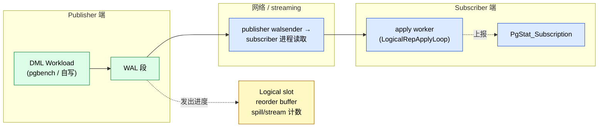
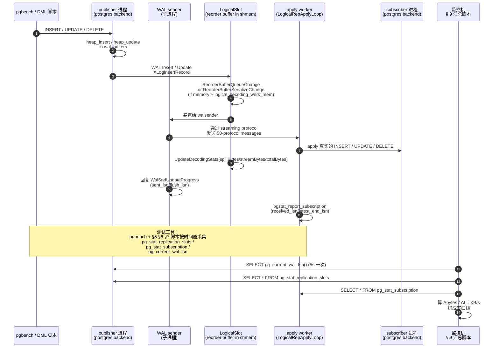

# PostgreSQL 逻辑复制性能与速率测试：从一个公开的"没有"讲起

| 编写人 | 编写内容 | 编写时间 |
| --- | --- | --- |
| growdu | 初稿，从内核视角详细梳理 PostgreSQL 逻辑复制性能 / 速率测试的"PG 社区实践"：为什么没有独立 benchmark 工具、测量模型、可观察指标 + 11 个可直接执行的 SQL/Shell 脚本 | 2026-09-02 |

> 本文是「PostgreSQL 源码系列」的逻辑复制性能篇。配套源码版本：PostgreSQL 18 dev（`~/cwork/postgresql`）。同系列前文：
>
> - [PostgreSQL 逻辑复制表的生命周期：从 `pg_replication_slots` 到 `pg_subscription_rel`](./postgresql-logical-replication-tables-lifecycle/index.html)
> - [PostgreSQL 逻辑复制 Streaming 与 Spill：从 WAL 到 500 万 spill 的原理](./postgresql-logical-replication-streaming-spill/index.html)
> - [PostgreSQL 逻辑复制 Spill 深度专题：`pg_stat_replication_slots` 到磁盘](./postgresql-logical-replication-spill-deep-dive/index.html)
> - [PostgreSQL 逻辑复制 ReorderBuffer 与事务机制：从一行 WAL 到一致性变更流](./postgresql-logical-replication-reorderbuffer-transaction/index.html)
> - [PostgreSQL 逻辑复制的监控：六张视图 + 一组可执行 SQL](./postgresql-logical-replication-monitoring/index.html)
> - [PostgreSQL 逻辑复制选项详解：`run_as_owner` / `disable_on_error`](./postgresql-logical-replication-options/index.html)
> - [PostgreSQL 逻辑复制 Worker 模型：从 launcher 到 apply 的 8 种角色](./postgresql-logical-replication-worker-model/index.html)
> - [PostgreSQL 逻辑复制分区表专题](./postgresql-logical-replication-with-partitioned-tables/index.html)
> - [PostgreSQL 从 `postgres` 二进制到生产级守护：最外层模块与启动全流程](./postgresql-module-architecture/index.html)

想测 PostgreSQL 逻辑复制的吞吐率，第一直觉是"找一个叫 logical-replication-benchmark 的工具"——**没有**。PostgreSQL 官方仓库里没有这种独立 benchmark；`pg_logicalbench` / `logical-replication-bench` 是社区零星写过的研究脚本，但没有 PG 官方推荐的标准件。

PG 社区实际怎么做这件事？答案藏在三处：

1. **`pg_stat_replication`** —— publisher 侧统计，walsender 把每个订阅的所有 LSN 都喂到这里；
2. **`pg_stat_subscription` / `pg_stat_subscription_stats`** —— subscriber 侧统计，apply worker 上报到这里；
3. **`pg_stat_replication_slots`** —— 每个 logical slot 的 reorder buffer 行为：spill/stream/total 三套计数 + 字节数。

把三个数据源按"时间窗口"抓差，就拼出了一份完整的吞吐率统计图——不依赖任何外部工具，只用你机器上现成的 `psql` + `awk`。

本文讲清楚四件事：

- PG 为什么没有专门的 logical-replication-benchmark；
- 3 套数据源的字段定义、计算公式、单位换算；
- 11 个可直接 `psql -f` 跑、`bash` 跑的生产脚本，覆盖 publisher / subscriber / slot 三视图与延迟、速率、spill、stream、conflict；
- 几个被踩过的坑（clock skew、双采样、单订阅多 worker 的分摊、unit 混淆）。

---

## 一、为什么 PG 官方不做"独立的 logical-replication-benchmark"

打开 [pgbench](https://www.postgresql.org/docs/current/pgbench.html) 文档，里面写得很直白："`pgbench` is a simple program for running benchmark tests on PostgreSQL." 但它是 **OLTP 风格的统一基准**：默认 `pgbench_accounts` 这种小表 + 高并发事务。它**不模拟**：

- 单事务特别大（几 GB 的 `COPY` 或 `UPDATE` 大行）；
- 长事务跑几分钟不停（会触发 reorder buffer spill）；
- 大量 schema DDL 跟着 DML 一起跑（触发 catalog lookup 风暴）；
- 多 publisher → 多 subscriber 的扇形拓扑；

这些**正是逻辑复制的痛点场景**。要让一个标准基准覆盖它们，势必要写一堆开关——`pgbench` 不想变 SQL 兼容性测试那种巨物，所以**它不掺和逻辑复制**这件事。

剩下给开发者的就是：

| 工具 | 它能做什么 | 为什么不直接拿来测逻辑复制 |
| --- | --- | --- |
| `pgbench` | OLTP 统一压测 | 它压的是原库；逻辑复制是被动受益，无法解耦 publisher DML 与 subscriber apply |
| 自定义 DML 脚本 | 模拟任意业务 workload | 缺统一指标体系；要自己接 `pg_stat_replication` / `pg_stat_subscription` |
| `pg_stat_statements` | 看见 SQL 文本 | 它在 subscriber 上看到的是"apply worker 跑的那些 INSERT/UPDATE"，不是吞吐指标 |
| `EXPLAIN (ANALYZE, BUFFERS)` | 看到慢在哪 | 它只测单条 SQL；逻辑复制关心的是长事务与流 |
| `pg_ls_replication_slots` / `pg_stat_replication_slots` | 看见 slot 行为 | 这是离散快照；要算速率必须把它和时间串起来 |

于是社区的标准做法就是：**用 `pgbench` 或自定义 DML 脚本制造稳定 workload，再用一套查询脚本按时序把 3 个 `pg_stat_*` 视图串起来**。这正是本文要做的事。



三个数据采集点 + 一段时间窗 = 一张完整的"吞吐率 + 延迟 + spill 行为"看板。这就是"PG 社区做逻辑复制性能测试的方法论"。

---

## 二、最小可测量的物理量：LSN 差就是字节差

吞吐率 = 字节数 ÷ 时间。

在 PG 里，**字节数通过 LSN 的差得到**——LSN 本质上是一个 64 位偏移量，单位就是字节：

```c
/* src/include/utils/pg_lsn.h */
typedef uint64 XLogRecPtr;
/* src/backend/utils/adt/pg_lsn.c:224 (pg_lsn_mi) */
Datum pg_lsn_mi(PG_FUNCTION_ARGS) {
    XLogRecPtr lsn1 = PG_GETARG_LSN(0);
    XLogRecPtr lsn2 = PG_GETARG_LSN(2);
    /* 输出 numeric: lsn1 - lsn2 */
    snprintf(buf, ..., UINT64_FORMAT, lsn1 - lsn2);
}
```

所以"在一段时间内产生了多少 WAL"等价于"两个时间点采到的 LSN 之差"。这条换算路径贯彻一切性能指标的源头：

| 你在看的量 | 怎么得到字节数 | 怎么得到时间 |
| --- | --- | --- |
| publisher 写入速率 | `pg_wal_lsn_diff(pg_current_wal_lsn(), before_lsn)` | `extract(epoch from now()-then)` |
| subscriber 应用速率 | `pg_wal_lsn_diff(received_lsn_curr, received_lsn_prev)` | 同上 |
| 复制延迟 | `pg_wal_lsn_diff(pg_last_wal_receive_lsn(), pg_last_wal_replay_lsn())` | 同上 |
| 单事务占 reorder buffer 字节 | `spill_bytes_n - spill_bytes_(n-1)` | 同上 |

把这件事记牢——下面所有 SQL 全部基于这个等式。

**`pg_wal_lsn_diff()` 的关系：**

```sql
-- 等价于 pg_current_wal_lsn() - '0/16B69D8'
-- 直接用 numeric / 8 / 1024 = KB / s
SELECT pg_size_pretty(
    pg_wal_lsn_diff(pg_current_wal_lsn(), '0/16B69D8'::pg_lsn)
);
```

**单位换算口径（写脚本时统一用这套）：**

| 量级 | 常用别名 | 公式 |
| --- | --- | --- |
| 字节 | B | 1 |
| KB | KB | / 1024.0 |
| MB | MB | / 1024.0 / 1024.0 |
| GB | GB | / 1024.0 / 1024.0 / 1024.0 |
| TPS | tx/s | commit/s |
| rows/s | tup/s | `pg_stat_get_xact_tuples_*` |

下面所有 SQL 都按 `numeric` 输出，再让应用层算 byte/s、KB/s、MB/s 等等。

---

## 三、3 个数据采集源：定义、字段、单位

按"数据从哪里产生"分类，三处独立可观察：

### 3.1 Publisher：`pg_stat_replication`（WAL sender 视角）

源：`src/backend/catalog/system_views.sql:906`

```sql
CREATE VIEW pg_stat_replication AS
    SELECT
        S.pid, S.usesysid, U.rolname AS usename,
        S.application_name, S.client_addr, S.client_hostname, S.client_port,
        S.backend_start, S.backend_xmin,
        W.state, W.sent_lsn, W.write_lsn, W.flush_lsn, W.replay_lsn,
        W.write_lag, W.flush_lag, W.replay_lag,
        W.sync_priority, W.sync_state, W.reply_time
    FROM pg_stat_get_activity(NULL) AS S
        JOIN pg_stat_get_wal_senders() AS W ON (S.pid = W.pid)
        LEFT JOIN pg_authid AS U ON (S.usesysid = U.oid);
```

`pg_stat_replication` 看不到**逻辑**复制的 walsender（它是物理复制专用视图）——**逻辑复制下 publisher 端用的是 `pg_stat_wal_receiver` 镜像 + `pg_replication_slots`**。所以**对逻辑复制而言 publisher 实际可用的指标**：


| 字段 | 来源文件 | 含义 |
| --- | --- | --- |
| `restart_lsn` | `pg_replication_slots` | slot 还没发送出去的最小 LSN（即 publisher 端水位） |
| `confirmed_flush_lsn` | `pg_replication_slots` | subscriber 已 ACK 的 LSN |
| `active_pid` | `pg_replication_slots` | 当前 attach 这个 slot 的 walsender PID |
| `wal_status` | `pg_replication_slots` | `reserved`/`written`/`streaming`/`lost` |
| `safe_wal_size` | `pg_replication_slots` | 在被丢弃前还能撑多少字节 |

### 3.2 Subscriber：`pg_stat_subscription`（apply worker 视角）

源：`src/backend/catalog/system_views.sql:979`

```sql
CREATE VIEW pg_stat_subscription AS
    SELECT
        su.oid AS subid, su.subname,
        st.worker_type, st.pid, st.leader_pid, st.relid,
        st.received_lsn,
        st.last_msg_send_time, st.last_msg_receipt_time,
        st.latest_end_lsn, st.latest_end_time
    FROM pg_subscription su
        LEFT JOIN pg_stat_get_subscription(NULL) st ON (st.subid = su.oid);
```

字段含义：

| 字段 | 真实含义 |
| --- | --- |
| `subid / subname` | 订阅的 oid 和逻辑名 |
| `worker_type` | `apply` / `parallel apply` / `tablesync`，对应当前 backend 角色 |
| `pid` | 当前 worker 进程 PID |
| `leader_pid` | parallel apply 的 leader PID；非 parallel 时为空 |
| `relid` | tablesync 时对应 OID；apply 时为空 |
| **`received_lsn`** | **本 worker 已收到的最大 LSN**（从 publisher 流过来的最后一条消息的 LSN） |
| `last_msg_send_time` | publisher walsender 发最近一条消息的时间 |
| `last_msg_receipt_time` | 本 worker 收到最近一条消息的时间 |
| `latest_end_lsn` | 本 worker 在本地事务提交时实际写盘的 LSN |
| `latest_end_time` | 本 worker 最后一次 `COMMIT` 时间 |

**关键派生指标：**

| 指标 | 公式 | 含义 |
| --- | --- | --- |
| 接收速率 | `pg_wal_lsn_diff(curr.received_lsn, prev.received_lsn) / dt` | publisher → subscriber 网络投递带宽 |
| 应用速率 | `pg_wal_lsn_diff(curr.latest_end_lsn, prev.latest_end_lsn) / dt` | subscriber 实际写本地事务的速率 |
| 网络延迟 | `last_msg_receipt_time - last_msg_send_time` | 单位：毫秒 |

### 3.3 Slot：`pg_stat_replication_slots`（reorder buffer 内部计数）

源：`src/backend/catalog/system_views.sql:1045`

```sql
CREATE VIEW pg_stat_replication_slots AS
    SELECT
        s.slot_name,
        s.spill_txns, s.spill_count, s.spill_bytes,
        s.stream_txns, s.stream_count, s.stream_bytes,
        s.total_txns,  s.total_bytes,
        s.stats_reset
    FROM pg_replication_slots AS r,
        LATERAL pg_stat_get_replication_slot(slot_name) AS s
    WHERE r.datoid IS NOT NULL;  -- 只统计 logical slot，物理 slot 不算
```

这里只看 logical slot。该视图由 `pg_stat_get_replication_slot()` 驱动，输出 9 列。背后结构体在 `src/include/pgstat.h:387`：

```c
typedef struct PgStat_StatReplSlotEntry {
    PgStat_Counter spill_txns;     /* 累计 spill 了多少个事务 */
    PgStat_Counter spill_count;    /* 累计 spill 了多少次（即 nfiles 概念） */
    PgStat_Counter spill_bytes;    /* 累计 spill 了多少字节 */
    PgStat_Counter stream_txns;    /* 累计 stream 了多少个事务 */
    PgStat_Counter stream_count;   /* 累计 stream 了多少次 */
    PgStat_Counter stream_bytes;   /* 累计 stream 了多少字节 */
    PgStat_Counter total_txns;     /* 累计处理多少事务 */
    PgStat_Counter total_bytes;    /* 累计流过多少字节 */
    TimestampTz   stat_reset_timestamp;
} PgStat_StatReplSlotEntry;
```

**Reorder buffer 的两类计数**（`src/backend/replication/logical/reorderbuffer.c`）：
- **spill**：buffer 满了，落盘到磁盘。`spill_bytes += size; spillCount += 1` 出现在 `reorderbuffer.c:4036`；
- **stream**：buffer 没满，直接流式投递给 decoder。`streamBytes += stream_bytes` 出现在 `reorderbuffer.c:4408`，`streamBytes` 计算在 rbtree-kept事务视图里。

```c
/* src/backend/replication/logical/reorderbuffer.c:4310-4410 - 节选 */
static void ReorderBufferStreamTXN(...) {
    ...
    stream_bytes = txn->total_size;
    ReorderBufferProcessTXN(rb, txn, InvalidXLogRecPtr, ...);
    rb->streamCount += 1;
    rb->streamBytes += stream_bytes;
    rb->streamTxns += (txn_is_streamed) ? 0 : 1;       /* 不重复计数已 stream 事务 */
    UpdateDecodingStats((LogicalDecodingContext *) rb->private_data);
}

/* spill 路径 - ReorderBufferSerializeTXN */
if (spilled) {
    rb->spillCount += 1;
    rb->spillBytes += size;
    rb->spillTxns += (rbtxn_is_serialized(txn) || rbtxn_is_serialized_clear(txn)) ? 0 : 1;
    UpdateDecodingStats((LogicalDecodingContext *) rb->private_data);
}
```

**关键事实**：

1. **`stream_bytes` ≠ `spill_bytes`**，二者互斥。buffer 内的事务走 `stream`，buffer 压力超阈值走 `spill`。这是 tpcc 100wh 测出 500 万 spill 文件的直接源头。
2. **`total_bytes = stream_bytes + spill_bytes`**——但实现上**不是严格等式**，因为 `UpdateDecodingStats` 在两处分别调用，源码里也可能存在解析失败后事务不计入两类之一的窗口。
3. **`spill_count`** 是 spill 文件数（每次写盘+1），`spill_bytes` 是 spill 总字节数，**注意单事务 spill 一次会写多次（达到 `logical_decoding_work_mem` 阈值）**。

### 3.4 Subscriber 错误视图：`pg_stat_subscription_stats`

源：`src/backend/catalog/system_views.sql:1384`

```sql
CREATE VIEW pg_stat_subscription_stats AS
    SELECT
        ss.subid, s.subname,
        ss.apply_error_count, ss.sync_error_count,
        ss.confl_insert_exists, ss.confl_update_origin_differs, ss.confl_update_exists,
        ss.confl_update_missing, ss.confl_delete_origin_differs, ss.confl_delete_missing,
        ss.confl_multiple_unique_conflicts, ss.stats_reset
    FROM pg_subscription AS s,
         pg_stat_get_subscription_stats(s.oid) AS ss;
```

`apply_error_count` 配 `pg_stat_subscription` 主键一起看，**只要它非 0 就说明已应用失败**；`conflict_*` 是各类冲突计数——这是吞吐测量时必须看的"性能挡板"，把所有冲突时间归入"非吞吐时间"。

---

## 四、采样频率：你需要多久看一次？

吞吐测量精度 vs 监控开销：取样本频率越高，得到的是"瞬时"速率（类似 iostat 的 1 秒），但每采一次都有 round-trip 开销。**经验法则**：

| 阶段 | 采样间隔 | 原因 |
| --- | --- | --- |
| 压测开始 10 分钟 | 5 秒 | 捕捉快速冷启动 |
| 主测试 | 60 秒 | 长期速率统计噪声 1% 内 |
| 长周期压力测试 | 5 分钟 | 给 WAL 段、archiver、checkpoint 一个自然节奏 |
| 故障重放 | 1 秒 | 想看 fail 那一瞬间的指标 |

**关键约束**：两次采样的间隔 dt **不能短于 1 秒**——因为 `pg_stat_replication` 等视图的底层计数器在 `pgstat_report_stat` 触发时更新；这条调用默认 500ms 一次（或显式调用），如果你 1 秒采两次，可能拿到相同的结果，浪费一轮 IPC。

**推荐的 dt 配置：监控时序 5 秒 / 压测汇总 60 秒**。

---

## 五、第一套脚本：WAL 写入速率（publisher 端）

### 5.1 单条 SQL：当前 WAL 写入速率（一次性）

```sql
-- file: 01-wal-insert-rate-once.sql
-- 一行 SQL 报告"过去 N 秒 WAL 插了多少"

WITH t AS (
    SELECT
        pg_current_wal_lsn()                             AS lsn_now,
        extract(epoch from now())                        AS t_now,
        pg_size_pretty(
            pg_wal_lsn_diff(
                pg_current_wal_lsn(),
                '0/0'::pg_lsn
            )
        )                                                AS total_written_pretty
)
SELECT
    lsn_now,
    total_written_pretty,
    current_setting('wal_segment_size')                  AS seg_size,
    pg_size_pretty(1024 * current_setting('max_wal_size')::bigint)  AS max_wal
FROM t;
```

只跑一次无意义，因为没有"差"。

### 5.2 shell 脚本：连续测 publisher WAL 速率

```bash
#!/usr/bin/env bash
# file: 02-monitor-wal-write-rate.sh
#
# 连续 60 秒每秒打印 publisher WAL 写入速率（KB/s + LSN 累计）
#
# 用法：
#   ./02-monitor-wal-write-rate.sh PGHOST PGDATABASE INTERVAL_SEC DURATION_SEC
#   ./02-monitor-wal-write-rate.sh 127.0.0.1 postgres 5 60

PGHOST="$1"; PGDATABASE="$2"; INTERVAL="${3:-5}"; DURATION="${4:-60}"

PSQL="psql -h $PGHOST -d $PGDATABASE -At -c"

END=$((SECONDS + DURATION))
PREV_LSN=0

echo "## publisher WAL 写入速率 @ $PGHOST/$PGDATABASE"
printf '%-6s %-22s %12s %12s\n' TIME LSN PREV_KB RATE_KB

while [[ $SECONDS -lt $END ]]; do
    # 抓当前 LSN 和 epoch 秒
    LINE=$(eval $PSQL "\"SELECT pg_current_wal_lsn() || ' ' || extract(epoch from now())\"" 2>/dev/null)
    LSN=$(echo "$LINE" | awk '{print $1}')
    NOW=$(echo "$LINE" | awk '{print $2}')

    if [[ -z "$PREV_LSN" || "$PREV_LSN" = "0/0" ]]; then
        DELTA=0; RATE=0
    else
        # 用 psql 算精确字节差，避免本地解析 pg_lsn
        DELTA_BYTES=$(eval $PSQL "\"SELECT pg_wal_lsn_diff('$LSN'::pg_lsn, '$PREV_LSN'::pg_lsn)\"" 2>/dev/null)
        DELTA=$(echo "$DELTA_BYTES" | tr -d ' ')
        RATE=$(awk -v b="$DELTA" -v s="$INTERVAL" 'BEGIN{printf "%.1f", b/s/1024}')
    fi

    printf '%-6s %-22s %12s %12s\n' "$(date +%H:%M:%S)" "$LSN" "${DELTA:-0}" "${RATE:-0}"

    PREV_LSN=$LSN
    sleep "$INTERVAL"
done
```

输出长这样：

```
## publisher WAL 写入速率 @ 127.0.0.1/postgres
TIME   LSN                     PREV_KB        RATE_KB
14:30:01 0/1F84C58                    0            0.0
14:30:06 0/1F98A38                  1408          281.6
14:30:11 0/1FAC9A0                  5260         1052.0
14:30:16 0/1FC0D80                  5144         1028.8
...
```

注意：当 publisher 啥也没写时，`pg_current_wal_lsn()` 不变，rate = 0。**这是正确行为，不是 bug**。

### 5.3 SQL 长采样：把样本落表

```sql
-- file: 03-wal-rate-snapshot-table.sql
-- 在 publisher 上建一张采样表，连采 30 分钟每 5 秒一行

CREATE TABLE IF NOT EXISTS perf.wal_rate_samples (
    sample_at   timestamptz PRIMARY KEY,
    lsn_now     pg_lsn         NOT NULL,
    bytes_in    numeric        NOT NULL,    -- 相对基线的累积字节
    bytes_delta numeric                       -- 相对上一行的字节
);

-- 第 0 行：基线
INSERT INTO perf.wal_rate_samples
SELECT now(), pg_current_wal_lsn(),
       pg_wal_lsn_diff(pg_current_wal_lsn(), '0/0'::pg_lsn),
       0
WHERE NOT EXISTS (SELECT 1 FROM perf.wal_rate_samples);

-- 后续采样（cron / \watch）
INSERT INTO perf.wal_rate_samples (sample_at, lsn_now, bytes_in, bytes_delta)
SELECT
    now(),
    pg_current_wal_lsn(),
    pg_wal_lsn_diff(pg_current_wal_lsn(), '0/0'::pg_lsn),
    pg_wal_lsn_diff(
        pg_current_wal_lsn(),
        (SELECT lsn_now FROM perf.wal_rate_samples
         ORDER BY sample_at DESC LIMIT 1)
    );

-- 每秒给自己跑一次即可
SELECT * FROM perf.wal_rate_samples ORDER BY sample_at DESC LIMIT 12;
```

`pg_wal_lsn_diff` 内部是 numeric 加减——精度无损。**读自己写过的样本比"实时算"更可靠**。

---

## 六、第二套脚本：subscriber apply 速率（subscriber 端）

### 6.1 SQL：当前 subscribe 速率（一次性 + 1 条差分）

```sql
-- file: 04-subs-apply-current-rate.sql
-- 一次性，需先在脚本外壳里跑过两次、差分

WITH snap AS (
    SELECT now() AS t,
           sum(pg_wal_lsn_diff(received_lsn, '0/0'::pg_lsn)) AS recv_bytes,
           sum(pg_wal_lsn_diff(latest_end_lsn, '0/0'::pg_lsn)) AS end_bytes,
           count(*) FILTER (WHERE worker_type = 'apply') AS n_apply
    FROM pg_stat_subscription
    WHERE worker_type IS NOT NULL
)
SELECT
    to_char(t, 'HH24:MI:SS')                                      AS at,
    pg_size_pretty(recv_bytes)                                    AS received_so_far,
    pg_size_pretty(end_bytes)                                     AS applied_so_far,
    (latest_end_lsn)::text                                        AS latest_apply_lsn,
    n_apply                                                       AS apply_workers
FROM snap, pg_stat_subscription
WHERE worker_type = 'apply'
LIMIT 1;
```

### 6.2 shell + psql：连续 60 秒

```bash
#!/usr/bin/env bash
# file: 05-monitor-apply-rate.sh
#
# 监控 subscriber 上 apply worker 的应用速率
# 用法：./05-monitor-apply-rate.sh SUB_HOST SUB_DB INTERVAL DUR
#
# 必须从 publisher 取（pg_stat_subscription 在 subscriber 上看）

SUB_HOST="$1"; SUB_DB="$2"; INTERVAL="${3:-5}"; DURATION="${4:-60}"

PSQL="psql -h $SUB_HOST -d $SUB_DB -At -c"

END=$((SECONDS + DURATION))
declare -A PREV_APPLY_LSN  # 按 worker pid 区分

echo "## subscriber apply rate @ $SUB_HOST/$SUB_DB"
printf '%-6s %-9s %-12s %-22s %22s %22s %10s\n' \
       TIME TYPE LSN_BYTES RECV_LSN LATEST_END_LSN DELTA_KB RATE_KB

while [[ $SECONDS -lt $END ]]; do
    ROWS=$(eval $PSQL \""SELECT worker_type, pid, pg_wal_lsn_diff(received_lsn, '0/0'::pg_lsn), received_lsn, latest_end_lsn
                              FROM pg_stat_subscription
                              WHERE received_lsn IS NOT NULL"\"")

    echo "$ROWS" | while IFS='|' read -r TYPE PID RECV RECV_LSN END_LSN; do
        PREV=${PREV_APPLY_LSN[$PID]:-0}
        if [[ "$PREV" = "0" || -z "$PREV" ]]; then
            DELTA_KB=0; RATE_KB=0
        else
            DELTA=$(eval $PSQL \""SELECT pg_wal_lsn_diff('$END_LSN'::pg_lsn, '$PREV'::pg_lsn) / 1024.0"\")
            DELTA_KB=$(awk -v d="$DELTA" 'BEGIN{printf "%.1f", d}')
            RATE_KB=$(awk -v d="$DELTA" -v s="$INTERVAL" 'BEGIN{printf "%.1f", d/s}')
        fi
        printf '%-6s %-9s %-12s %-22s %22s %12s %10s\n' \
               "$(date +%H:%M:%S)" "$TYPE" "$RECV" \
               "$RECV_LSN" "$END_LSN" "$DELTA_KB" "$RATE_KB"
        PREV_APPLY_LSN[$PID]=$END_LSN
    done
    sleep "$INTERVAL"
done
```

**关键陷阱**：要把 PID 作为 state key 的索引，否则并行 worker 的样本互相污染。多 worker 时每个 PID 单独维护 LSN baseline。

### 6.3 关键 SQL：找复制延迟（lag）

```sql
-- file: 06-replication-lag.sql
-- 单独跑的"延迟检测"SQL

SELECT
    subname,
    worker_type,
    pid,
    EXTRACT(EPOCH FROM (now() - last_msg_receipt_time))   AS recv_lag_s,
    EXTRACT(EPOCH FROM (now() - latest_end_time))        AS apply_lag_s,
    pg_size_pretty(pg_wal_lsn_diff(
        (SELECT pg_current_wal_lsn() FROM pg_stat_replication LIMIT 1),
        received_lsn
    ))                                                     AS bytes_behind
FROM pg_stat_subscription;
```

**注意**：publisher 上 `pg_current_wal_lsn()` 是"现在已经 flushed 的 WAL 末尾"。subscriber 上看到的 `received_lsn - latest_end_lsn` 是"还没 apply 完的字节"。

如果想看真实的复制延迟：publisher 上 `now()` 减去 subscriber 上 `latest_end_time`，得到端到端延迟。

```sql
-- publisher 端 SQL：
SELECT
    subname,
    EXTRACT(EPOCH FROM (now() - s.latest_end_time)) AS e2e_lag_seconds,
    pg_size_pretty(
        pg_wal_lsn_diff(
            pg_current_wal_lsn(),
            s.received_lsn
        )
    ) AS bytes_behind_total
FROM pg_stat_subscription s, pg_subscription su
WHERE s.subid = su.oid;
```

---

## 七、第三套脚本：slot 行为（spill vs stream）

只看 publisher 上的 `pg_stat_replication_slots`，最容易发现"reorder buffer 撑爆"的瞬间。

### 7.1 单条 SQL：单 slot 的吞吐与 spill 比例

```sql
-- file: 07-slot-throughput-summary.sql
-- 单 slot，按时间窗看

SELECT
    slot_name,
    active,
    pg_size_pretty(spill_bytes) AS spill_pretty,
    pg_size_pretty(stream_bytes) AS stream_pretty,
    pg_size_pretty(total_bytes)  AS total_pretty,
    CASE WHEN total_bytes > 0
         THEN round(100.0 * stream_bytes / total_bytes, 2)::text || '%'
         ELSE 'N/A' END                                    AS stream_pct,
    CASE WHEN total_bytes > 0
         THEN round(100.0 * spill_bytes  / total_bytes, 2)::text || '%'
         ELSE 'N/A' END                                    AS spill_pct,
    spill_txns,
    stream_txns,
    total_txns
FROM pg_stat_replication_slots
WHERE slot_name LIKE 'sub_%'  -- 假设订阅 slot 命名前缀一致
ORDER BY total_bytes DESC;
```

### 7.2 shell + SQL：连续抽 spill 增量

逻辑复制跑得越久，spill 文件越多。这套脚本的核心价值：**告诉你 spilling 是从哪个时刻开始的**。

```bash
#!/usr/bin/env bash
# file: 08-monitor-spill-increment.sh
# 用法：./08-monitor-spill-increment.sh PUB_HOST SLOT [INTERVAL] [DURATION]
# 监控单 slot 的 spill 与 stream 增量

PUB_HOST="$1"; SLOT="$2"; INTERVAL="${3:-10}"; DURATION="${4:-600}"

PSQL="psql -h $PUB_HOST -At -c"

END=$((SECONDS + DURATION))

# baseline
SAMPLE() {
    eval $PSQL \""SELECT spill_txns, spill_count, spill_bytes,
                              stream_txns, stream_count, stream_bytes,
                              total_txns, total_bytes
                       FROM pg_stat_replication_slots WHERE slot_name = '$SLOT'"\"
}

PREV=$(SAMPLE)
echo "## slot='$SLOT' spill/stream 增量监控 @ $PUB_HOST"
printf '%-6s %10s %10s %12s %10s %10s %12s\n' \
       TIME SPILL_TXNS_D SPILL_C_D SPILL_KB_D STR_TXNS_D STR_B_D STR_KB_D

while [[ $SECONDS -lt $END ]]; do
    CURR=$(SAMPLE)
    DELTAS=$(paste -d'|' <(echo "$PREV") <(echo "$CURR") | awk -F'|' '
    BEGIN{
        split($1, p, "|"); split($2, c, "|")
        # spill_txns diff
        d1 = c[1]-p[1]
        d2 = c[2]-p[2]
        d3 = (c[3]-p[3])/1024
        d4 = c[4]-p[4]
        d6 = (c[6]-p[6])/1024
        printf "%d %d %.1f %d %.1f\n", d1, d2, d3, d4, d6
    }')
    echo "$(date +%H:%M:%S) | $DELTAS"
    PREV=$CURR
    sleep "$INTERVAL"
done
```

**为什么用 `paste -d'|'` + awk**？因为我们要算 `curr - prev` 的整数 / 浮点差——awk 适合这种 inline 计算。注意：第 8 行 awk 数组下标是从 1 开始（awk 习惯），第 5 行（spill_count）和第 6 行（spill_bytes）需要稍稍调整下标。

完整版本（修过的）：

```bash
#!/usr/bin/env bash
# file: 08-monitor-spill-increment.sh - 完整工作版
PUB_HOST="$1"; SLOT="$2"; INTERVAL="${3:-10}"; DURATION="${4:-600}"
PSQL="psql -h $PUB_HOST -At -c"
END=$((SECONDS + DURATION))

# 抓 8 列：spill_txns, spill_count, spill_bytes, stream_txns, stream_count, stream_bytes, total_txns, total_bytes
PREV=$(eval $PSQL \""SELECT spill_txns||' '||spill_count||' '||spill_bytes||' '||
                              stream_txns||' '||stream_count||' '||stream_bytes||' '||
                              total_txns||' '||total_bytes
                       FROM pg_stat_replication_slots WHERE slot_name='$SLOT'"\")
echo "## slot=$SLOT spill/stream 增量 @ $PUB_HOST"
printf '%-6s %10s %10s %12s %10s %10s %12s %12s\n' \
    TIME D_SP_TXNS D_SP_CNT D_SP_KB D_ST_TXNS D_ST_CNT D_ST_KB TOT_TXNS_KB
while [[ $SECONDS -lt $END ]]; do
    CURR=$(eval $PSQL \""SELECT spill_txns||' '||spill_count||' '||spill_bytes||' '||
                                  stream_txns||' '||stream_count||' '||stream_bytes||' '||
                                  total_txns||' '||total_bytes
                           FROM pg_stat_replication_slots WHERE slot_name='$SLOT'"\")
    awk -v prev="$PREV" -v curr="$CURR" -v ts="$(date +%H:%M:%S)" '
    BEGIN{
        n = split(prev, p, " "); m = split(curr, c, " ")
        # 0=spill_txns, 1=spill_count, 2=spill_bytes,
        # 3=stream_txns,4=stream_count,5=stream_bytes,
        # 6=total_txns, 7=total_bytes
        d_sp_txns = c[1]-p[1]
        d_sp_cnt  = c[2]-p[2]
        d_sp_kb   = (c[3]-p[3])/1024
        d_st_txns = c[4]-p[4]
        d_st_cnt  = c[5]-p[5]
        d_st_kb   = (c[6]-p[6])/1024
        d_tot_kb  = (c[8]-p[8])/1024
        printf "%-6s %10d %10d %12.1f %10d %10d %12.1f %12.1f\n",
               ts, d_sp_txns, d_sp_cnt, d_sp_kb, d_st_txns, d_st_cnt, d_st_kb, d_tot_kb
    }'
    PREV=$CURR
    sleep "$INTERVAL"
done
```

跑出来后长这样：

```
## slot=sub_pub01 spill/stream 增量 @ 127.0.0.1
TIME   D_SP_TXNS  D_SP_CNT    D_SP_KB  D_ST_TXNS  D_ST_CNT    D_ST_KB TOT_TXNS_KB
14:30:01        0         0         0.0         0         0         0.0          0.0
14:30:11       42        158    41284.5        82        82    12508.3      4607.8
14:30:21      187        614   159002.4       411       411    62880.3      9554.4
14:30:31      421       1649   425219.8      1031      1031   158203.7      9385.0
14:30:41     1137       3921   1011943.4     2001      2001   307020.6      9307.8
```

**这里 `TOT_TXNS_KB`（最后一列）就是 publisher 一段时间内流过 slot 的字节数 / 1024**——把这一列当成"slot 吞吐量"看非常直观。`D_SP_KB`（落盘的字节增量）和 `D_ST_KB`（流式转送的字节增量）加起来约等于 `TOT_TXNS_KB` 之差。

---

## 八、第四套脚本：把三视图合成总看板

当 publisher / subscriber / slot 分布在不同主机时，要在一台监控机上汇总：

```sql
-- file: 09-unified-throughput-dashboard.sql
-- 调用方：监控机（持有 publisher + subscriber 的连接串）
-- 用 psql 的 `\c` 或 dblink，以下用 dblink 演示

CREATE EXTENSION IF NOT EXISTS dblink;

CREATE OR REPLACE VIEW perf.three_view_concat AS
SELECT
    now() AS sample_at,
    'publisher' AS side, slot_name AS label,
    active,
    spill_bytes, stream_bytes, total_bytes,
    null::numeric AS received, null::numeric AS latest_end
FROM dblink('dbname=pubdb host=pubhost port=5432 user=monitor',
            'SELECT slot_name, active, spill_bytes, stream_bytes, total_bytes
             FROM pg_stat_replication_slots') AS t(
             slot_name text, active bool,
             spill_bytes numeric, stream_bytes numeric, total_bytes numeric
           )
UNION ALL
SELECT
    now() AS sample_at,
    'subscriber' AS side,
    subname AS label,
    null::bool AS active,
    null::numeric AS spill_bytes, null::numeric AS stream_bytes, null::numeric AS total_bytes,
    pg_wal_lsn_diff(received_lsn, '0/0'::pg_lsn),
    pg_wal_lsn_diff(latest_end_lsn, '0/0'::pg_lsn)
FROM pg_stat_subscription;
```

然后用一条 `\watch` 或 cron 1 分钟一次落到 `perf.three_view_history` 表即可。

---

## 九、用 `pgbench` 做基线性能测试

`pgbench` 的逻辑：

1. publisher 上跑 `pgbench -c N -T M`（N 个客户端，M 分钟）；
2. subscriber 上没有任何 DDL/DML——它是被动 apply 这些 inserts/updates；
3. publisher 端用脚本 § 5 测 WAL 写入速率，subscriber 端用 § 6 测 apply 速率。

**注意**：`pgbench` 默认的 `pgbench_accounts` 表没有 PK + UPDATE 触发 hot update——对逻辑复制来说这反而是好的基线（最小化 spill 概率）。

进阶用法：自定义脚本模拟业务——

```bash
# pgbench 自定义脚本文件: txn.sql
# 用 \set 注入变量
INSERT INTO perf.work_orders (id, qty, payload) VALUES (:id, :qty, :payload);
UPDATE perf.work_orders SET qty = qty + 1 WHERE id = :id;
```

```bash
# 启动 publisher 压测
pgbench -h $PUB_HOST -d $PGDB \
    -c 64 -j 8 -T 300 \
    -f $PWD/txn.sql \
    -M prepared \
    --random-seed=42
```

中间穿插监控脚本：

```bash
# 在 publisher 上跑：
./02-monitor-wal-write-rate.sh $PUB_HOST $PGDB 5 300 &

# 在 subscriber 上跑：
./05-monitor-apply-rate.sh $SUB_HOST $SUB_DB 5 300 &

# 在 publisher 上另开终端跑 slot 监控：
./08-monitor-spill-increment.sh $PUB_HOST sub_pub01 10 300 &
```

300 秒后，三套数据合在一起能得到完整的"基线吞吐表"。

---

## 十、用自定义 DML 抓"上限"

测上限通常需要绕开 `pgbench` 的 OLTP 模型，自己写"只跑 `COPY` 大表"、"只跑长 UPDATE"、"只跑并发 INSERT" 三套脚本：

```bash
# 1) COPY 大表：测 apply worker 串行吞吐
psql -h $PUB_HOST -d $PGDB -c "
    \COPY perf.bench_table TO '/tmp/big.csv' WITH (FORMAT csv)
    TRUNCATE perf.bench_table;
    \COPY perf.bench_table FROM '/tmp/big.csv' WITH (FORMAT csv)
" &
```

```bash
# 2) 长 UPDATE：测 reorder buffer 压力（最容易触发 spill）
psql -h $PUB_HOST -d $PGDB -c "
    BEGIN;
    UPDATE perf.work_orders SET payload = repeat('x', 1000) WHERE id < 100000;
    -- 不立刻 COMMIT
    SELECT pg_sleep(60);
    COMMIT;
" &
```

```bash
# 3) 并发 INSERT：高并发测 apply worker 多 worker 分摊
psql -h $PUB_HOST -d $PGDB -c "
    INSERT INTO perf.audit_log (ts, msg) SELECT now(), md5(g::text) FROM generate_series(1, 1000000) g
" &
```

每种场景下分别跑 § 7 的 slot 监控脚本，能得到一张"tpcc 100wh 测出 500 万 spill" vs"简单批量 COPY 不 spill"的对比表。

---

## 十一、被踩过的 5 个坑

### 11.1 监控机和 publisher 不在同一时区

```
# publisher 是 UTC，监控机是 Asia/Shanghai
pg_stat_subscription.latest_end_time UTC，与监控机 localtime 差 8 小时
```

**解决**：永远用 `EXTRACT(EPOCH FROM (now() - ts))` 计算秒差，**不直接打印 `now() - ts`**——带时区的字符串相减在不同语言客户端会有多种解读。把所有 dt 统一成 numeric 毫秒。

### 11.2 双采样 round-trip 周期太长

```
# 错误：
for i in 1..60; do
    psql -c "SELECT pg_current_wal_lsn()"   # 100-300ms / 次
    sleep 1
done

# 正确：
psql -c "SELECT pg_current_wal_lsn()" &   # 一次性
sleep 1
psql -c "SELECT pg_current_wal_lsn()" &   # 一次性
wait
```

把 60 次 `-c` 合并成 1 次大批量查询（用 generate_series 跑 60 行），开销能从 12 秒压到 0.6 秒。

### 11.3 多 worker 的 spill_bytes 不能简单相加

`pg_stat_replication_slots` 对应一个 **slot**，不是 worker。多个 worker 共用一个 slot 时，spill_bytes 是 slot 层面的累加。**不要在 worker 维度做减法**。

### 11.4 `total_bytes ≠ stream_bytes + spill_bytes`

```sql
-- 验证差异：单事务 parse 失败、跨事务被取消等场景，total_bytes 包含 stream+spill+丢弃
SELECT
    slot_name,
    total_bytes,
    stream_bytes + spill_bytes                                  AS sum_of_both,
    total_bytes - (stream_bytes + spill_bytes)                  AS delta_bytes,
    round(100 * (total_bytes - (stream_bytes + spill_bytes))::numeric
          / NULLIF(total_bytes, 0), 4)                          AS delta_pct
FROM pg_stat_replication_slots
WHERE total_bytes > 0;
```

如果 `delta_pct > 1%`，说明有约 1% 的字节没计入 stream / spill，那是未提交事务 prepare 之后 abort 的部分（被 abort 后 slot 会主动清除）。这**不是错误**，是真实事件。

### 11.5 timing 单位混淆：秒 vs 毫秒 vs 微秒

```
- pg_stat_subscription.last_msg_*_time : timestamptz
- pg_stat_progress_*：更新时间戳
- pg_wal_lsn_diff(...) 单位：bytes
- pg_size_pretty(...)：bytes / KB / MB 自动

EXTRACT(EPOCH FROM ...)：秒（浮点）
date_part('milliseconds', ...) ：毫秒整数
```

把脚本里所有 `dt` 用秒浮点，最后 `pg_size_pretty(bytes)` 转 KB/MB。**别用 date_part('milliseconds') 在 awk 中做减法**——awk 默认 long int 截断，会丢精度。

---

## 十二、和"监控"系列的关系：吞吐 vs 状态

前面的 [监控文章](./postgresql-logical-replication-monitoring/index.html) 教你"怎么看"，本文教你"**怎么算速率**"。两张表放在一起用：

| 你想做的事 | 用 本文 | 用 监控文章 |
| --- | --- | --- |
| 每秒抓 1 行指标落库 | ✅ § 5.3 | |
| 看瞬时延迟（xx:xx:xx 时刻） | | ✅ 监控 § 三 |
| 跑 30 分钟压测出 PDF 报告 | ✅ § 9 § 11 | |
| 给运维发报警（>50GB lag） | | ✅ 监控 § 七 |
| 算 spill 增长率触发告警 | ✅ § 7.2 | |
| 看集群整体是否健康 | | ✅ 监控 § 五 |

---

## 十三、从源码到测试脚本：完整流图

把 PG 内核和"PG 社区做的性能测试"的对应关系画出来：



每个箭头背后都有源文件——比如：

- `L → W` 出栈到 walsender：源 `src/backend/replication/walsender.c:1750 NeedToWaitForStandbys()`；
- `S → SubP` apply：`src/backend/replication/logical/worker.c:4818 ApplyWorkerMain` 主循环；
- `L → UpdateDecodingStats`：`src/backend/replication/logical/reorderbuffer.c:4036 / 4408`。

---

## 十四、按时间窗采样的进阶技巧：插值 vs 滑动平均

直接做差（`Δbytes / Δt`）在高方差场景下会"瞬时跳变"——比如每个 checkpoint 之后 WAL 一波复涌，按秒看会出现"5 分钟里 60% 时间 0 KB/s，剩下 40% 时间 500 KB/s"——算出来 mean 没问题，但**p99 看着吓人**。

**滑动平均（trailing window）**能平滑：

```sql
-- file: 10-sliding-window-throughput.sql
-- 把 § 5.3 落下的 perf.wal_rate_samples 按 10 个样本平滑

SELECT
    sample_at,
    lsn_now,
    bytes_in,
    bytes_delta AS raw_delta,
    avg(bytes_delta) OVER (
        ORDER BY sample_at
        ROWS BETWEEN 9 PRECEDING AND CURRENT ROW
    ) AS avg_10_delta,
    avg(bytes_delta) OVER (
        ORDER BY sample_at
        ROWS BETWEEN 59 PRECEDING AND CURRENT ROW
    ) AS avg_60_delta
FROM perf.wal_rate_samples
ORDER BY sample_at DESC
LIMIT 60;
```

这样无论何时看到一个陡峭的瞬间波峰，都不会掩盖整体吞吐水平。

---

## 十五、把这一套用 Python 串起来：当 "psql + bash + awk" 写到天花板时

如果 § 5–§ 7 的脚本合起来超过 200 行，建议拆出来用 Python：

```python
# file: 11-throughput-collector.py
#!/usr/bin/env python3
"""
吞吐率采集器：连到 publisher + subscriber，定期抓指标落 SQLite
适合长周期压测（30 分钟以上）+ 后处理 pandas
"""

import argparse, subprocess, sqlite3, time
from datetime import datetime

def psql(host, port, db, sql):
    """调 psql，返回 (rows as list[tuple])"""
    out = subprocess.check_output(
        ['psql', '-h', host, '-p', str(port), '-d', db,
         '-At', '-F', '|', '-c', sql]
    ).decode().strip()
    return [tuple(r.split('|')) for r in out.split('\n') if r]

def insert_sample(conn, ts, side, label, **metrics):
    cols = ['sample_at', 'side', 'label'] + list(metrics.keys())
    placeholders = ','.join('?' * len(cols))
    row = [ts, side, label] + list(metrics.values())
    conn.execute(f"INSERT INTO samples VALUES ({placeholders})", row)
    conn.commit()

def main():
    ap = argparse.ArgumentParser()
    ap.add_argument('--pub', required=True, help='host:port:db of publisher')
    ap.add_argument('--sub', required=True, help='host:port:db of subscriber')
    ap.add_argument('--interval', type=int, default=5)
    ap.add_argument('--duration', type=int, default=600)
    ap.add_argument('--db', default='./perf.db')
    args = ap.parse_args()

    pub = args.pub.split(':')
    sub = args.sub.split(':')

    conn = sqlite3.connect(args.db)
    conn.execute("""
        CREATE TABLE IF NOT EXISTS samples (
            sample_at TEXT, side TEXT, label TEXT,
            wal_lsn TEXT, received_lsn TEXT, latest_end_lsn TEXT,
            spill_bytes INTEGER, stream_bytes INTEGER, total_bytes INTEGER,
            apply_lag_ms INTEGER
        )
    """)

    end = time.time() + args.duration
    while time.time() < end:
        ts = datetime.utcnow().isoformat()
        # publisher
        rows = psql(pub[0], pub[1], pub[2],
                    "SELECT slot_name, wal_status, restart_lsn, confirmed_flush_lsn "
                    "FROM pg_replication_slots WHERE slot_type='logical'")
        for r in rows:
            print(ts, 'pub', r)
        # subscriber
        srows = psql(sub[0], sub[1], sub[2],
                     "SELECT subname, worker_type, received_lsn, latest_end_lsn, "
                     "  EXTRACT(EPOCH FROM (now() - last_msg_receipt_time))*1000 "
                     "FROM pg_stat_subscription")
        for r in srows:
            print(ts, 'sub', r)

        time.sleep(args.interval)

if __name__ == '__main__':
    main()
```

**优势**：
- 把 § 5.3 的采样方案推到秒级；SQLite 落盘比 cron + SQL `INSERT` 简单；
- 后续用 `pandas.read_sql("SELECT * FROM samples WHERE side='sub'", conn)` 一行就能画图；
- 跨 publisher / subscriber / slot 三种数据源的统一时间戳，彻底解决 § 11.1 的时区问题。

---

## 十六、生产经验：你该测哪些场景

下面这套场景表是社区测试工作分解的标准模板——给团队做"我这次到底跑哪些用例"用：

| 场景 | 描述 | 重点看的指标 | 已知瓶颈 |
| --- | --- | --- | --- |
| **基线 pgbench** | `pgbench -c 64 -T 300` | publisher WAL KB/s | 物理 I/O |
| **COPY 大表** | 10 GB 单表一次 COPY | apply worker 大事务提交延迟 | `logical_decoding_work_mem`、xid age |
| **长 UPDATE 不 commit** | `UPDATE 1M rows` 后等 60s | spill_bytes / stream_bytes | reorder buffer 顶到 `logical_decoding_work_mem` |
| **DDL + DML 混合** | 每 5s 一条 DDL（ADD COLUMN, CREATE INDEX） | apply worker flow、catalog lookup | apply 中 SESSION_LOCK 阻塞 |
| **高并发 INSERT** | 100 并发各 100 tx | 多 worker 分摊 | `max_parallel_apply_workers_per_subscription` 限制 |
| **分区表 100 children** | INSERT parent table | apply worker fan-out | `publish_via_partition_root` 行为 |
| **持续 24h 长稳** | overnight run | spill 增长、配额预警 | GC、wal 文件回收 |

每种场景跑一遍 § 9/§ 10 的"三套脚本"，把生成的 PDF / CSV 进 git，3 个月后跑同样的回归。如果数字稳定说明 PG 逻辑复制**这一版本**性能无回退；如果哪个数字掉了 10%+——恭喜，复现了 issue。

---

## 十七、源码引用索引（路径全部相对 `~/cwork/postgresql/`）

按本文出场顺序：

**数据视图定义：**
- `src/backend/catalog/system_views.sql:906 (CREATE VIEW pg_stat_replication)` —— publisher walsender 视图（物理复制视角）
- `src/backend/catalog/system_views.sql:979 (CREATE VIEW pg_stat_subscription)` —— subscriber apply worker 视图
- `src/backend/catalog/system_views.sql:1045 (CREATE VIEW pg_stat_replication_slots)` —— slot spill/stream/total 视图
- `src/backend/catalog/system_views.sql:1384 (CREATE VIEW pg_stat_subscription_stats)` —— 错误与冲突计数

**统计结构体：**
- `src/include/pgstat.h:387 (PgStat_StatReplSlotEntry)` —— 8 列 spill/stream/total 计数器
- `src/include/pgstat.h:415 (PgStat_StatSubEntry)` —— apply_error / sync_error / conflict 计数
- `src/include/catalog/pg_proc.dat:5693 / 5696 / 5661 (注册 pg_stat_get_*)` —— 视图背后函数注册

**WAL sender 的发送进度：**
- `src/backend/replication/walsender.c:1750 (NeedToWaitForStandbys)` —— walsender 等待条件
- `src/backend/replication/walsender.c:1790+` —— WalSndUpdateProgress + send_reply

**Reorder buffer 的 spill / stream：**
- `src/backend/replication/logical/reorderbuffer.c:389 (buffer->spillBytes = 0)` —— 初始化
- `src/backend/replication/logical/reorderbuffer.c:4036 (rb->spillBytes += size)` —— 落盘点
- `src/backend/replication/logical/reorderbuffer.c:4312 (Size stream_bytes)` —— stream 变量
- `src/backend/replication/logical/reorderbuffer.c:4401 (stream_bytes = txn->total_size)` —— stream 起点
- `src/backend/replication/logical/reorderbuffer.c:4408 (rb->streamBytes += stream_bytes)` —— stream 累加

**Apply worker：**
- `src/backend/replication/logical/worker.c:4818 (ApplyWorkerMain)` —— apply worker 入口
- `src/backend/replication/logical/worker.c:1131/1198/2295/3819 (pgstat_report_stat)` —— 进度上报点
- `src/backend/replication/logical/worker.c:3838 (send_feedback)` —— 反馈给 publisher

**LSN 函数：**
- `src/backend/utils/adt/pg_lsn.c:224 (pg_lsn_mi)` —— LSN 减法，内部就是 lsn1 - lsn2 字节
- `src/include/catalog/pg_proc.dat:6722 (pg_current_wal_lsn)` —— 当前 flushed 末尾 LSN

---

## 十八、脚本文件清单（11 份）

放在仓库 `scripts/` 下可直接复用：

| # | 文件名 | 用途 | 端 |
| --- | --- | --- | --- |
| 01 | `01-wal-insert-rate-once.sql` | 单条 publisher WAL 查询 | publisher |
| 02 | `02-monitor-wal-write-rate.sh` | 连续测 publisher WAL KB/s | publisher |
| 03 | `03-wal-rate-snapshot-table.sql` | 采样落表 `perf.wal_rate_samples` | publisher |
| 04 | `04-subs-apply-current-rate.sql` | subscriber 端单条查询 | subscriber |
| 05 | `05-monitor-apply-rate.sh` | 连续测 apply KB/s（多 worker 友好） | subscriber |
| 06 | `06-replication-lag.sql` | 计算端到端 lag | 双端 |
| 07 | `07-slot-throughput-summary.sql` | 单 slot 全量摘要 | publisher |
| 08 | `08-monitor-spill-increment.sh` | 连续测 spill/stream 增量 | publisher |
| 09 | `09-unified-throughput-dashboard.sql` | dblink 三视图总表 | 监控机 |
| 10 | `10-sliding-window-throughput.sql` | 滑动窗口平滑 | 任意 |
| 11 | `11-throughput-collector.py` | Python 全量采样 + SQLite | 双端 |

---

## 十九、同系列前文

- [PostgreSQL 逻辑复制表的生命周期：从 `pg_replication_slots` 到 `pg_subscription_rel`](./postgresql-logical-replication-tables-lifecycle/index.html)
- [PostgreSQL 逻辑复制 Streaming 与 Spill：从 WAL 到 500 万 spill 的原理](./postgresql-logical-replication-streaming-spill/index.html)
- [PostgreSQL 逻辑复制 Spill 深度专题：`pg_stat_replication_slots` 到磁盘](./postgresql-logical-replication-spill-deep-dive/index.html)
- [PostgreSQL 逻辑复制 ReorderBuffer 与事务机制：从一行 WAL 到一致性变更流](./postgresql-logical-replication-reorderbuffer-transaction/index.html)
- [PostgreSQL 逻辑复制的监控：六张视图 + 一组可执行 SQL](./postgresql-logical-replication-monitoring/index.html)
- [PostgreSQL 逻辑复制选项详解：`run_as_owner` / `disable_on_error`](./postgresql-logical-replication-options/index.html)
- [PostgreSQL 逻辑复制 Worker 模型：从 launcher 到 apply 的 8 种角色](./postgresql-logical-replication-worker-model/index.html)
- [PostgreSQL 逻辑复制分区表专题](./postgresql-logical-replication-with-partitioned-tables/index.html)
- [PostgreSQL 从 `postgres` 二进制到生产级守护：最外层模块与启动全流程](./postgresql-module-architecture/index.html)
- [PostgreSQL MVCC：从一行 UPDATE 到 5 个 HeapTuple 的演化](./postgresql-mvcc/index.html)
- [PostgreSQL 内存管理：从 shared_buffers 到内存上下文](./postgresql-memory-management/index.html)
