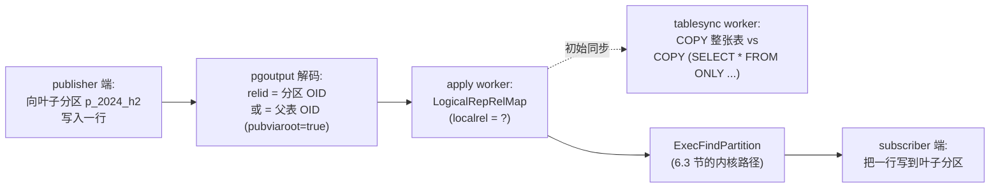
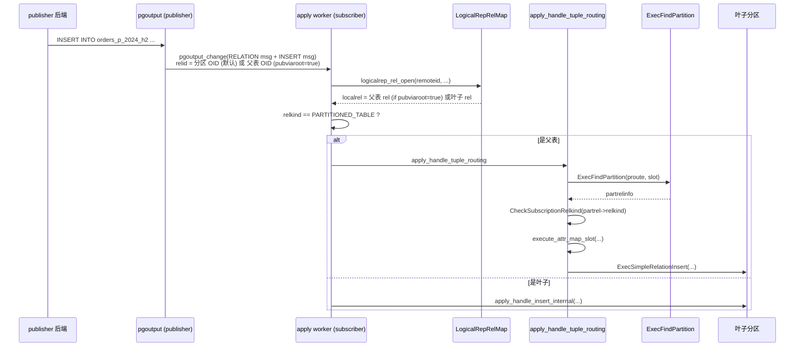
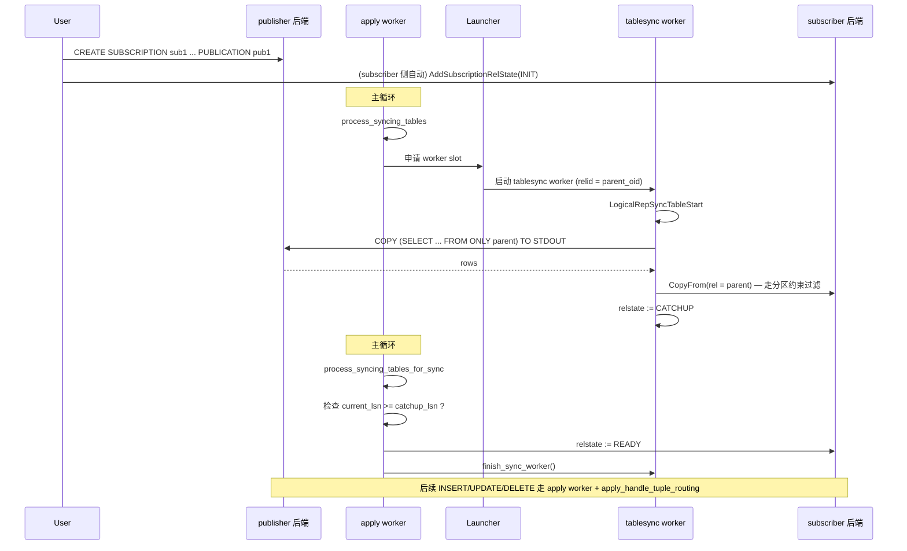
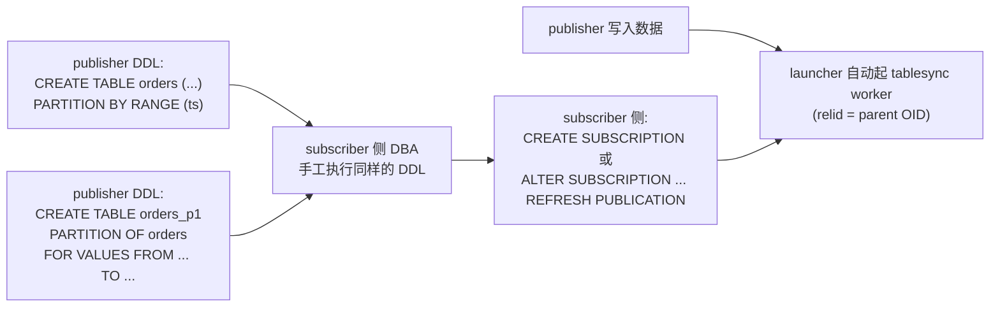
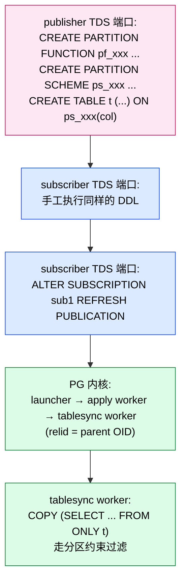
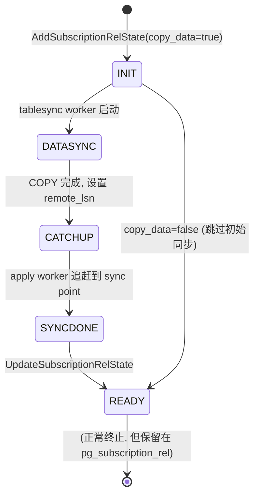

# PostgreSQL 逻辑复制与分区表：从 publisher 到 partition leaf 的全链路

| 编写人 | 编写内容 | 编写时间 |
| --- | --- | --- |
| growdu | 初稿，结合 PostgreSQL 17 源码 + Babelfish T-SQL 扩展 | 2026-08-24 |

> 本文是 [PostgreSQL 分区表：从一行 `PARTITION BY` 到路由热路径的全链路拆解](./postgresql-partition-handling/index.html) 的姊妹篇。
>
> 上一篇讲的是单点内核机制——`PartitionBoundInfo` 怎么排、`get_partition_for_tuple` 怎么二分、`PartitionTupleRouting` 怎么搭骨架。
>
> 这一篇把所有这些机制放到**逻辑复制**的语境里再走一遍。三个核心问题：
> 1. **增量同步路径**：publisher 写入一行 → apply worker 怎么知道把它路由到 subscriber 的哪个叶子分区？
> 2. **初始同步**：tablesync worker 怎么把 publisher 的"分区表 + 全部 leaf 分区"拷到 subscriber？是按父表 COPY 还是按叶子分区 COPY？
> 3. **DDL 同步之后**：partition function/scheme 这类 DDL 同步过来后，subscriber 应该如何触发分区表的 table sync？两种模式下（PG 原生 / Babelfish T-SQL）答案不同。

主要源码路径：
- `~/cwork/postgresql/src/backend/replication/logical/worker.c`
- `~/cwork/postgresql/src/backend/replication/logical/tablesync.c`
- `~/cwork/postgresql/src/backend/replication/logical/relation.c`
- `~/cwork/postgresql/src/backend/replication/logical/launcher.c`
- `~/cwork/postgresql/src/backend/replication/pgoutput/pgoutput.c`
- `~/cwork/postgresql/src/backend/commands/subscriptioncmds.c`
- `~/cwork/postgresql/src/backend/executor/execReplication.c`
- `~/cwork/babelfish_extensions/contrib/babelfishpg_tsql/src/pltsql_partition.c`
- `~/cwork/babelfish_extensions/test/JDBC/replication/partition-replication.mix`

---

## 一、引子：分区表让逻辑复制多了两层

普通表的逻辑复制可以一句话讲完：

> publisher 端 `INSERT` 一行 → `pgoutput` 解码 → `apply worker` 收到 `INSERT` → 写到 subscriber 的对应表。

分区表让这条链路多了两层抽象：



两件关键事实：

1. **运行时**：apply worker 在处理 INSERT/UPDATE/DELETE/TRUNCATE 时，**总是对分区表的"父表"入口**做接收，然后用 `apply_handle_tuple_routing` 在 subscriber 端再走一次 `ExecFindPartition`，把行落到正确的叶子分区。
2. **初始同步**：tablesync worker 走 `copy_table`，**对每个非 READY 的 `pg_subscription_rel` 单独跑一次 COPY**。如果订阅里只挂"父表"，那就只 COPY 父表（PG 14+ 会自动处理成 `COPY ... FROM ONLY` 排除继承子表）。

下面我们一层层拆开看。

---

## 二、运行时：apply worker 收到一个 INSERT 之后

### 2.1 入口：`apply_handle_insert`

`src/backend/replication/logical/worker.c:2448`：

```c
/* For a partitioned table, insert the tuple into a partition. */
if (rel->localrel->rd_rel->relkind == RELKIND_PARTITIONED_TABLE)
    apply_handle_tuple_routing(edata,
                               remoteslot, NULL, CMD_INSERT);
else
{
    ResultRelInfo *relinfo = edata->targetRelInfo;
    ExecOpenIndices(relinfo, false);
    apply_handle_insert_internal(edata, relinfo, remoteslot);
    ExecCloseIndices(relinfo);
}
```

逻辑很简洁：

- 目标表是普通表 → 直接 `apply_handle_insert_internal`。
- 目标表是分区表 → 调 `apply_handle_tuple_routing`，把"找分区"的工作委派给 6.3 节那条 `ExecFindPartition` 链路。

`UPDATE` / `DELETE` / `TRUNCATE` 都是同一思路（`worker.c:2636`、`2815`、`3292`）。

### 2.2 `apply_handle_tuple_routing`：复用内核路由逻辑

`src/backend/replication/logical/worker.c:2963`：

```c
static void
apply_handle_tuple_routing(ApplyExecutionData *edata,
                           TupleTableSlot *remoteslot,
                           LogicalRepTupleData *newtup,
                           CmdType operation)
{
    EState       *estate = edata->estate;
    LogicalRepRelMapEntry *relmapentry = edata->targetRel;
    ResultRelInfo *relinfo = edata->targetRelInfo;
    Relation      parentrel = relinfo->ri_RelationDesc;
    ModifyTableState *mtstate;
    PartitionTupleRouting *proute;
    ResultRelInfo *partrelinfo;
    Relation      partrel;

    /* ModifyTableState is needed for ExecFindPartition(). */
    edata->mtstate = mtstate = makeNode(ModifyTableState);
    mtstate->ps.plan = NULL;
    mtstate->ps.state = estate;
    mtstate->operation = operation;
    mtstate->resultRelInfo = relinfo;

    /* ... as is PartitionTupleRouting. */
    edata->proute = proute = ExecSetupPartitionTupleRouting(estate, parentrel);

    /* Find the partition to which the "search tuple" belongs. */
    oldctx = MemoryContextSwitchTo(GetPerTupleMemoryContext(estate));
    partrelinfo = ExecFindPartition(mtstate, relinfo, proute,
                                    remoteslot, estate);
    Assert(partrelinfo != NULL);
    partrel = partrelinfo->ri_RelationDesc;

    /*
     * Check for supported relkind.  We need this since partitions might be of
     * unsupported relkinds; and the set of partitions can change, so checking
     * at CREATE/ALTER SUBSCRIPTION would be insufficient.
     */
    CheckSubscriptionRelkind(partrel->rd_rel->relkind, ...);
    ...
}
```

注意它做了什么：

1. 临时构造一个 `ModifyTableState` + `PartitionTupleRouting`。
2. 调**上一篇**讲的 `ExecFindPartition`（`src/backend/executor/execPartition.c`）拿到叶子分区的 `ResultRelInfo`。
3. **再校验一次** `CheckSubscriptionRelkind`——这是因为分区可能是 `RELKIND_FOREIGN_TABLE`（PG 14 起允许 FDW 父表）或者其他不支持的类型，不能在 `CREATE SUBSCRIPTION` 阶段就一锤定音。

### 2.3 叶子分区的 `attrmap`：跨分区列重排

叶子分区和父表在 `pg_attribute` 上可能不一样（分区可以删列、加列、改列顺序）。`apply_handle_tuple_routing` 之后还需要：

```c
remoteslot_part = partrelinfo->ri_PartitionTupleSlot;
if (remoteslot_part == NULL)
    remoteslot_part = table_slot_create(partrel, &estate->es_tupleTable);
map = ExecGetRootToChildMap(partrelinfo, estate);
if (map != NULL) {
    remoteslot_part = execute_attr_map_slot(attrmap, remoteslot,
                                            remoteslot_part);
}
```

这一步翻译列号，确保从父表 slot 转成子分区 slot 时不丢数据。

### 2.4 UPDATE / DELETE 的额外校验：`check_relation_updatable`

UPDATE/DELETE 在拿到叶子分区后，会调：

```c
part_entry = logicalrep_partition_open(relmapentry, partrel, attrmap);
check_relation_updatable(part_entry);
```

`check_relation_updatable`（`worker.c:2507`）：

```c
void
check_relation_updatable(LogicalRepRelMapEntry *rel)
{
    /* For partitioned tables, we only need to care if the target partition is
       updatable (aka has PK or RI defined for it). */
    if (rel->localrel->rd_rel->relkind == RELKIND_PARTITIONED_TABLE)
        return;
    if (rel->updatable) return;
    ...
}
```

**父表不要求 PK**——这是 PG 12 引入的行为：只要叶子分区有 PK/RI，UPDATE/DELETE 就能跑（用 leaf 的索引定位行）。

### 2.5 完整的 apply 路径图



### 2.6 publisher 端的 `pubviaroot`：`pubactions` 的额外逻辑

publisher 端走 `pgoutput_change` 时，会先在 `get_rel_sync_entry`（`pgoutput.c:2052`）里查 `entry->publish_as_relid`——这就是 `publish_via_partition_root` 控制的行为：

- `pubviaroot = false`（默认）：分区 row 直接以**叶子 OID** 上报，subscriber 收到一个 INSERT 到 leaf 的事件。**前提**：subscriber 的 leaf 必须存在（PG 16+ 会自动建 leaf 镜像，否则要求手工建）。
- `pubviaroot = true`：分区 row 以**父表 OID** 上报（带 attrmap 翻译），subscriber 收到一个 INSERT 到父表的事件——这正是 `apply_handle_tuple_routing` 的入口。

源码在 `pgoutput.c:2262`：

```c
/* Don't publish changes for partitioned tables, because
   publishing those of its partitions suffices, unless partition
   changes won't be published due to pubviaroot being set. */
if (publish &&
    (relkind != RELKIND_PARTITIONED_TABLE || pub->pubviaroot))
{
    /* 计算 publish_as_relid = 最高层的祖先 (根) */
    ...
}
```

> **简而言之**：如果你 `CREATE SUBSCRIPTION` 时只指定了"父表"，就把 `publish_via_partition_root = true` 设到 publisher 端的 publication 上——这样所有 leaf 事件都被改写成"父表 + attrmap"，subscriber 不用维护 leaf 镜像。这是 PG 13 引入的简化路径。

---

## 三、初始同步：tablesync worker 怎么 COPY 分区表

### 3.1 入口：`LogicalRepSyncTableStart` → `copy_table`

`src/backend/replication/logical/tablesync.c:1318`：

```c
static char *
LogicalRepSyncTableStart(XLogRecPtr *origin_startpos)
{
    ...
    rel = table_open(MyLogicalRepWorker->relid, RowExclusiveLock);

    /* 检查权限 + 选同步方法 */
    /* 把 publish 端的表 schema 拉到本地, build relmap */
    copy_table(rel);
    ...
}
```

`copy_table`（`tablesync.c:1143`）会按 `relkind` 区分：

```c
if (lrel.relkind == RELKIND_RELATION && qual == NIL && !gencol_published) {
    /* 普通表: COPY t(col1, col2, ...) TO STDOUT */
    appendStringInfo(&cmd, "COPY %s ...", ...);
} else {
    /* 非普通表 / 有 row filter / 有生成列 */
    appendStringInfoString(&cmd, "COPY (SELECT col1, col2 FROM ");
    if (lrel.relkind == RELKIND_RELATION)
        appendStringInfoString(&cmd, "ONLY ");  /* 排除继承子表 */
    appendStringInfoString(&cmd, quote_qualified_identifier(nspname, relname));
    ...
    appendStringInfoString(&cmd, ") TO STDOUT");
}
```

注意关键一点：

> tablesync worker 只 COPY **一个目标 relation**——`MyLogicalRepWorker->relid` 对应的那个 relation。

也就是说，如果你订阅里只挂父表（PG 14+ 默认推荐做法），tablesync 就 COPY 父表本身——`COPY (SELECT ... FROM ONLY parent)` 会自动排除所有继承子表。这意味着 tablesync 把"父表的所有直接行"搬过来（带分区约束过滤后）。

### 3.2 哪些关系会被同步？`pg_subscription_rel` 的生成

`pg_subscription_rel` 是 subscriber 侧"要同步哪些表"的清单。它有三种生成路径：

#### 路径 A：`CREATE SUBSCRIPTION` 同步指定表

`subscriptioncmds.c:737`：

```c
tables = fetch_table_list(wrconn, publications);
foreach(lc, tables) {
    RangeVar *rv = (RangeVar *) lfirst(lc);
    Oid relid = RangeVarGetRelid(rv, AccessShareLock, false);
    CheckSubscriptionRelkind(get_rel_relkind(relid), ...);
    AddSubscriptionRelState(subid, relid, copy_data ? SUBREL_STATE_INIT : SUBREL_STATE_READY, ...);
}
```

这里 `fetch_table_list` 拉的是 publisher 端 publication 的"成员表"清单（`pg_get_publication_tables` 的输出）。**它就是父表本身**——不会自动展开所有 leaf。

#### 路径 B：`ALTER SUBSCRIPTION ... REFRESH PUBLICATION`

`subscriptioncmds.c:861`：

```c
pubrel_names = fetch_table_list(wrconn, sub->publications);
subrel_states = GetSubscriptionRelations(sub->oid, false);
...
foreach(lc, pubrel_names) {
    RangeVar *rv = (RangeVar *) lfirst(lc);
    Oid relid = RangeVarGetRelid(rv, AccessShareLock, false);
    CheckSubscriptionRelkind(get_rel_relkind(relid), ...);
    pubrel_local_oids[off++] = relid;

    /* 如果是新表 -> AddSubscriptionRelState(SUBREL_STATE_INIT / READY) */
    if (!bsearch(&relid, subrel_local_oids, ...)) {
        AddSubscriptionRelState(sub->oid, relid, copy_data ? SUBREL_STATE_INIT : SUBREL_STATE_READY, ...);
    }
}
```

REFRESH 把 publisher 端的新成员表加进 subscriber 的 `pg_subscription_rel`。

#### 路径 C：`ALTER SUBSCRIPTION ... ADD/DROP TABLE`（直接改本地）

不依赖 publisher 端的清单，直接 INSERT/DELETE `pg_subscription_rel` 行。

### 3.3 状态机：`SUBREL_STATE_*` 转换

每条 `pg_subscription_rel` 都有一个状态字段：

| 状态 | 含义 |
| --- | --- |
| `INIT` | 等待 tablesync worker 启动初始同步 |
| `DATASYNC` | 正在 COPY 数据 |
| `CATCHUP` | COPY 完成，等待 apply worker 追赶到同步点 |
| `SYNCDONE` | 同步完成，准备切到 READY |
| `READY` | 已同步，后续变更由 apply worker 直接应用 |

转换由 `process_syncing_tables_for_sync`（`tablesync.c:294`，在 tablesync worker 里）和 `process_syncing_tables_for_apply`（`tablesync.c:418`，在 apply worker 里）共同驱动。

### 3.4 launcher 怎么起 tablesync worker

`apply worker` 每隔一会儿走 `process_syncing_tables_for_apply`：

```c
/* 在 apply worker 主循环里 */
process_syncing_tables(current_lsn);
→ process_syncing_tables_for_apply(current_lsn)
   → 遍历 table_states_not_ready
      → 如果某个 relation 的状态是 INIT/DATASYNC
         → 还没有对应 tablesync worker
            → 调用 ApplyLauncherMain → wait_for_worker_slot → 启动一个 tablesync worker
```

启动入口 `run_tablesync_worker()`（`tablesync.c:1719`）：

```c
static void run_tablesync_worker() {
    ...
    start_table_sync(&origin_startpos, &slotname);
    /* 设置 streaming options, 切换到 streaming catchup */
    ...
}
```

`start_table_sync` → `LogicalRepSyncTableStart` → `copy_table`。

### 3.5 完整时序图



### 3.6 父表 vs 叶子分区：一个关键选择

| 同步方式 | 优点 | 缺点 |
| --- | --- | --- |
| 父表 OID 进 `pg_subscription_rel` | 一条 `pg_subscription_rel` 覆盖全部分区；COPY 用 `ONLY parent` 自动排除子表 | 必须 `publish_via_partition_root = true`，否则增量事件以 leaf 上报 |
| 叶子分区 OID 进 `pg_subscription_rel` | 每片分区单独 COPY，独立控制 | N 个叶子 → N 条 `pg_subscription_rel` 行 + N 个 tablesync worker |

> PG 14 起官方推荐**父表 OID** 路径——参见 `apply_handle_tuple_routing` 的存在意义。

---

## 四、DDL 同步之后：怎么启动分区表的 table sync

### 4.1 PG 原生模式：**没有 DDL replication**

这一点必须先讲清楚：

> **PostgreSQL 原生逻辑复制只复制 DML + TRUNCATE，不复制 DDL。**

`pgoutput` 插件只解码 `pgoutput_change` / `pgoutput_truncate`，从来不发 `CREATE TABLE` / `CREATE PARTITION FUNCTION` 这种 DDL。所以 publisher 端的分区表结构变化不会自动传到 subscriber。

实际 DBA 流程：



注意几个**踩坑点**：

1. **DDL 必须手工同步**。如果在 publisher 上加了新分区，subscriber 不加的话，**增量同步不会自动建 leaf**（除非开了 `publish_via_partition_root` + apply worker 自己创建 leaf，但这是 PG 16+ 的实验行为，PG 17 之前也不稳定）。
2. **`ALTER SUBSCRIPTION ... REFRESH PUBLICATION`** 才会触发新成员表的初始同步。如果你只加了 DDL 没刷 publication，subscriber 还是看不到新表。
3. **`pg_subscription_rel` 里的 OID** 必须和 subscriber 本地的 OID 对得上——所以通常建议 subscriber 端手工建表时用同样的 SQL，OID 由本地 catalog 自己分配。

### 4.2 `ALTER SUBSCRIPTION ... REFRESH` 完整流程

```sql
-- publisher 端：新建一张分区表
CREATE TABLE orders_new (...) PARTITION BY RANGE (ts);
CREATE TABLE orders_new_p1 PARTITION OF orders_new ...;

ALTER PUBLICATION pub1 ADD TABLE orders_new;

-- subscriber 端：手工建表 + refresh
-- (假设 DDL 已经在 subscriber 上同步建好)
ALTER SUBSCRIPTION sub1 REFRESH PUBLICATION;
```

执行流程（`subscriptioncmds.c:1481` 一带）：

```text
ALTER SUBSCRIPTION ... REFRESH PUBLICATION
   ↓
fetch_table_list (publisher 端跑 SQL 拉成员)
   ↓
对每个新成员:
   relid = RangeVarGetRelid (在 subscriber 上 lookup)
   CheckSubscriptionRelkind
   AddSubscriptionRelState(SUBREL_STATE_INIT)  -- copy_data=true 默认
   ↓
ApplyLauncherWakeupAtCommit
   ↓
launcher → apply worker → process_syncing_tables_for_apply
   ↓
launch tablesync worker for 每个 INIT 状态的 relation
   ↓
copy_table 走分区约束
   ↓
CATCHUP → SYNCDONE → READY
```

### 4.3 Babelfish T-SQL 模式：手动预先同步 DDL

Babelfish 不重新发明逻辑复制引擎——它**复用 PG 原生的 logical replication**。所以从引擎视角看，TDS 端口走订阅 + REFRESH 的步骤和 PG 端口一模一样。

但 T-SQL 这一层多了一个 metadata：`sys.babelfish_partition_function` 和 `sys.babelfish_partition_scheme`。**这些不会被自动复制**——subscriber 必须自己手工建。

参考 Babelfish 自带的 `partition-replication.mix` 测试（`~/cwork/babelfish_extensions/test/JDBC/replication/partition-replication.mix`）：

```sql
-- publisher 端口
USE mydb;
CREATE PARTITION FUNCTION pf_orders_date (date)
AS RANGE RIGHT FOR VALUES ('2024-01-01', '2024-07-01');
CREATE PARTITION SCHEME ps_orders_date
AS PARTITION pf_orders_date ALL TO ([PRIMARY]);
CREATE TABLE dbo.orders (
    id bigint IDENTITY PRIMARY KEY,
    orderdate date NOT NULL
) ON ps_orders_date(orderdate);

-- subscriber 端口 (T-SQL)
USE mydb;
CREATE PARTITION FUNCTION pf_orders_date (date)
AS RANGE RIGHT FOR VALUES ('2024-01-01', '2024-07-01');
CREATE PARTITION SCHEME ps_orders_date
AS PARTITION pf_orders_date ALL TO ([PRIMARY]);
CREATE TABLE dbo.orders (
    id bigint IDENTITY PRIMARY KEY,
    orderdate date NOT NULL
) ON ps_orders_date(orderdate);

-- 然后才配置 replication
```

每个 datatype、每个 partition scheme 都要在两端各跑一遍，**这是 Babelfish 当前的强制要求**。

### 4.4 partition function / scheme DDL 同步后的 table sync 启动

**Babelfish 当前没有自动 trigger**——这一切都靠手工 + `ALTER SUBSCRIPTION ... REFRESH PUBLICATION`：



具体来说，TDS 端口用户必须这样做：

```sql
-- 在 publisher TDS 端口执行
USE mydb;
CREATE PARTITION FUNCTION pf_orders_date (date)
AS RANGE RIGHT FOR VALUES ('2024-01-01', '2024-07-01');
CREATE PARTITION SCHEME ps_orders_date
AS PARTITION pf_orders_date ALL TO ([PRIMARY]);
CREATE TABLE dbo.orders (
    id bigint IDENTITY PRIMARY KEY,
    orderdate date NOT NULL
) ON ps_orders_date(orderdate);
ALTER PUBLICATION pub1 ADD TABLE dbo.orders;

-- 在 subscriber TDS 端口执行（手工同步 DDL）
USE mydb;
CREATE PARTITION FUNCTION pf_orders_date (date)
AS RANGE RIGHT FOR VALUES ('2024-01-01', '2024-07-01');
CREATE PARTITION SCHEME ps_orders_date
AS PARTITION pf_orders_date ALL TO ([PRIMARY]);
CREATE TABLE dbo.orders (
    id bigint IDENTITY PRIMARY KEY,
    orderdate date NOT NULL
) ON ps_orders_date(orderdate);

-- 触发初始同步
ALTER SUBSCRIPTION sub1 REFRESH PUBLICATION;

-- 或者用 psql 端口（5432）执行等价的 PG 原生 DDL + REFRESH:
-- psql 端:
-- CREATE TABLE dbo.orders (... orderdate date NOT NULL) PARTITION BY RANGE (orderdate);
-- CREATE TABLE orders_p1 PARTITION OF dbo.orders FOR VALUES FROM ('2024-01-01') TO ('2024-07-01');
-- CREATE TABLE orders_p2 PARTITION OF dbo.orders FOR VALUES FROM ('2024-07-01') TO ('2025-01-01');
-- ALTER SUBSCRIPTION sub1 REFRESH PUBLICATION;
```

### 4.5 partition function 同步后的几种"应该怎么启动 sync"的考量

我们已经看到，当前 PG + Babelfish 是**完全人工**的 DDL 同步 + `REFRESH`。但从架构上看，partition function / scheme DDL 同步过来后，启动分区表 table sync 在逻辑上有几个不同层级：

#### 选项 ① 手工 REFRESH（当前 PG/Babelfish 现状）

```sql
-- 1. 手工同步 partition function/scheme DDL
-- 2. 手工同步分区表 DDL（可以是 PG 原生或 T-SQL）
-- 3. ALTER SUBSCRIPTION ... REFRESH PUBLICATION
```

优点：可预期、易排错、不依赖工具。
缺点：DBA 工作量大、易遗漏。

#### 选项 ② 用 `ALTER SUBSCRIPTION ... REFRESH` 替代手工

如果 publisher 端已经在 publication 里加好了分区表，那么 REFRESH 就够了——`fetch_table_list` 拉回来的"父表 OID"会让 subscriber 自动建 `pg_subscription_rel` 行 + 启动 tablesync。

**前提**：subscriber 端的 DDL 已经手工同步了（PG 不复制 DDL）。

#### 选项 ③ 用 pglogical / 自研工具复制 DDL

`pglogical` 是第三方扩展，支持 DDL replication。它的"分区表 DDL replication"行为：

- 在 publisher 上执行 `CREATE TABLE ... PARTITION OF ...` → 在 subscriber 上自动执行。
- 在 publisher 上执行 `ALTER TABLE ... DETACH PARTITION ...` → 在 subscriber 上自动执行。
- 自动 `REFRESH` subscription。

但 pglogical 在 Babelfish 模式下**不直接兼容**——T-SQL 的 `CREATE PARTITION FUNCTION` 不在它的解析范围里。

#### 选项 ④ 改造内核让 PG 支持 DDL replication（理论）

理论上可以扩展 `pgoutput` 让它识别 DDL、发出特殊 message 给 subscriber，subscriber 在 `apply worker` 里收到后翻译执行。但这要做的事太多：

- 解析 publisher 端的 DDL（已经是 parse tree 形式，但要打包成 wire protocol）。
- 解析 subscriber 端的依赖（外键、视图、约束）。
- 处理 Babelfish 的 T-SQL DDL（`CREATE PARTITION FUNCTION`）。
- 处理冲突（两边都加了分区、两边都 ATTACH 了 leaf）。

这是 [PostgreSQL logical replication 的 open feature request](https://www.postgresql.org/message-id/flat/CAMsr%2BYGvp%2B3iPU7c8_%2BzcX9AOc%3DHdRD2VQ_A0V-%3DOoDBN3sqQ%40mail.gmail.com)，但 PG 17 仍然没有实现。

### 4.6 实操检查清单：DDL 同步后启动 sync 之前要确认的事

| 确认项 | PG 模式 | Babelfish T-SQL 模式 |
| --- | --- | --- |
| partition function 是否一致 | （PG 没有这个概念） | `SELECT * FROM sys.partition_functions WHERE name = 'xxx'` 在两端对齐 |
| partition scheme 是否一致 | （PG 没有） | `SELECT * FROM sys.partition_schemes WHERE name = 'xxx'` 对齐 |
| 分区表是否建好 | `\d+ orders` 看 `relkind = 'p'` | `EXEC sp_help 'orders'` 看 status |
| 叶子分区是否都建好 | `SELECT * FROM pg_inherits WHERE inhparent = 'orders'::regclass` | `SELECT * FROM sys.destination_data_spaces WHERE ...` |
| `publish_via_partition_root` 设置 | `SELECT pubviaroot FROM pg_publication WHERE pubname = 'xxx'` | （PG 原生 publication 控制） |
| publication 包含父表 | `SELECT * FROM pg_publication_tables WHERE pubname = 'xxx'` | 同 PG 模式 |
| subscription 已经 CREATE | `SELECT * FROM pg_subscription WHERE subname = 'sub1'` | 同 PG 模式 |
| OID 对齐 | N/A（subscriber 端 OID 是本地分配的） | N/A（同样本地分配，但 `function_id` / `scheme_id` 必须通过 `REFRESH` 或手工同步） |
| 触发 sync | `ALTER SUBSCRIPTION sub1 REFRESH PUBLICATION` | 同 PG 模式 |

---

## 五、深入：`pgoutput` 视角下分区表的事件形态

### 5.1 事件粒度

`pgoutput.c` 发出一个 change message 时，关键字段：

- `relid`：远程 relation OID
- `pubactions`：来自 publication 的掩码（insert/update/delete/truncate）

针对分区表的"事件粒度"取决于 publication 的 `pubviaroot`：

| publication 设置 | `relid` 是 | subscriber 收到的形态 |
| --- | --- | --- |
| `pubviaroot = false`（默认） | 叶子分区 OID | INSERT 到 leaf（如果 subscriber leaf 存在） |
| `pubviaroot = true` | 父表 OID（带 attrmap） | INSERT 到父表 → `apply_handle_tuple_routing` |

### 5.2 `get_rel_sync_entry` 里的祖先选择

`pgoutput.c:2052` 的关键逻辑：

```c
/* 如果当前 relation 是分区, 找到它的最高层祖先 */
if (rel_is_partof_partition) {
    /* 沿 pg_partition_ancestors 向上找 */
    foreach(lc, ancestors) {
        ...
        /* 记录最高层祖先 */
        if (level > ancestor_level) {
            pub_relid = ancestor;
            ancestor_level = level;
        }
    }
}
```

配合 `pub->pubviaroot` 判断是否要"以祖先 OID 上报"。

### 5.3 schema change 后 `RelationSyncCache` 失效

`pgoutput.c:438` 维护一个 `RelationSyncCache` HTAB，schema rename 会触发：

```c
if (RelationSyncCache)
    hash_destroy(RelationSyncCache);
RelationSyncCache = NULL;
```

所以 publisher 端 `ALTER TABLE ... ATTACH PARTITION` 之后，下次 `pgoutput_change` 会重新 fetch schema——subscriber 侧的 apply worker 不需要重启。

---

## 六、`pg_subscription_rel` 的生命周期追踪

### 6.1 状态机图



### 6.2 出错时的回滚

如果 tablesync worker 中途失败：

- `disable_on_error = true`：`DisableSubscriptionAndExit()` 整体禁用订阅。
- `disable_on_error = false`：抛错退出 worker，下一轮 launcher 重启 worker。

### 6.3 detached / dropped 分区的 sync

如果 publisher 上一个分区被 `DETACH PARTITION` 或 `DROP`，subscriber 端会怎样？

- 如果 subscriber 端这张分区表**没有**单独的 `pg_subscription_rel` 行（PG 14+ 推荐做法）→ apply worker 收到 `TRUNCATE` / 不再发该分区的行事件——无感。
- 如果 subscriber 端**有**对应的 `pg_subscription_rel` 行 → 那行不会被自动清理，需要手工 `ALTER SUBSCRIPTION ... DROP TABLE`（PG 18 之前），或者等未来的 PG 版本自动清理。

---

## 七、完整端到端示例（PG 原生分区表）

### 7.1 publisher

```sql
CREATE PUBLICATION pub_orders FOR TABLE orders;
```

### 7.2 subscriber：手工建表

```sql
CREATE TABLE orders (
    id          bigserial,
    region      text NOT NULL,
    order_date  date NOT NULL,
    amount      numeric(12, 2),
    PRIMARY KEY (id, order_date)
) PARTITION BY RANGE (order_date);

CREATE TABLE orders_2024_h1 PARTITION OF orders
    FOR VALUES FROM ('2024-01-01') TO ('2024-07-01');

CREATE TABLE orders_2024_h2 PARTITION OF orders
    FOR VALUES FROM ('2024-07-01') TO ('2025-01-01');

CREATE PUBLICATION pub_orders FOR TABLE orders WITH (publish_via_partition_root = true);
```

> 注意：subscriber 端的 publication 是**给 subscriber 自己**看的（其实 subscriber 不需要 publication；这里写出来只是为了强调 publisher 那一侧的 publication 设了 `publish_via_partition_root`）。

### 7.3 创建订阅

```sql
CREATE SUBSCRIPTION sub_orders
    CONNECTION 'host=pub_host port=5432 dbname=mydb user=repl_user password=xxx'
    PUBLICATION pub_orders
    WITH (copy_data = true, binary = true);
```

### 7.4 验证同步

```sql
SELECT relid::regclass, srsubstate, srsublsn
  FROM pg_subscription_rel
 WHERE srsubid = (SELECT oid FROM pg_subscription WHERE subname = 'sub_orders');
-- relid   | srsubstate | srsublsn
-- --------+------------+----------
-- orders  | r          | 0/1ABCDEF   -- 'r' = READY
```

### 7.5 publisher 上加新分区后的标准操作

```sql
-- publisher:
CREATE TABLE orders_2025_h1 PARTITION OF orders
    FOR VALUES FROM ('2025-01-01') TO ('2025-07-01');

-- subscriber (手工同步 DDL):
CREATE TABLE orders_2025_h1 PARTITION OF orders
    FOR VALUES FROM ('2025-01-01') TO ('2025-07-01');

-- 不需要 ALTER SUBSCRIPTION REFRESH, 因为父表已经订阅了
-- apply worker 收到新分区的 INSERT 时, apply_handle_tuple_routing 会用
-- subscriber 本地的 orders_2025_h1 路由
```

---

## 八、完整端到端示例（Babelfish T-SQL 分区表）

### 8.1 publisher（TDS 端口）

```sql
USE mydb;

-- 1. 创建 partition function / scheme
CREATE PARTITION FUNCTION pf_orders_date (date)
AS RANGE RIGHT FOR VALUES ('2024-01-01', '2024-07-01', '2025-01-01');

CREATE PARTITION SCHEME ps_orders_date
AS PARTITION pf_orders_date ALL TO ([PRIMARY]);

-- 2. 创建分区表
CREATE TABLE dbo.orders (
    id bigint IDENTITY(1,1) NOT NULL,
    region nvarchar(20) NOT NULL,
    order_date date NOT NULL,
    amount decimal(12,2),
    CONSTRAINT PK_orders PRIMARY KEY CLUSTERED (id, order_date)
) ON ps_orders_date(order_date);

-- 3. 加入 publication
--    (注: publication 是 PG 原生, 但 dbo.orders 通过 Babelfish 的视图层仍可识别为 PG 表)
ALTER PUBLICATION pub_orders ADD TABLE dbo.orders;
```

### 8.2 subscriber（TDS 端口）：手工同步所有 DDL

```sql
USE mydb;

-- 1. 同名 partition function (Babelfish 会校验 name+type 一致)
CREATE PARTITION FUNCTION pf_orders_date (date)
AS RANGE RIGHT FOR VALUES ('2024-01-01', '2024-07-01', '2025-01-01');

-- 2. 同名 partition scheme
CREATE PARTITION SCHEME ps_orders_date
AS PARTITION pf_orders_date ALL TO ([PRIMARY]);

-- 3. 同结构分区表 (Babelfish 翻译成 PG PARTITION BY RANGE)
CREATE TABLE dbo.orders (
    id bigint IDENTITY(1,1) NOT NULL,
    region nvarchar(20) NOT NULL,
    order_date date NOT NULL,
    amount decimal(12,2),
    CONSTRAINT PK_orders PRIMARY KEY CLUSTERED (id, order_date)
) ON ps_orders_date(order_date);
```

### 8.3 subscriber 创建订阅

```sql
-- 用 psql 端口 (PG 原生 CREATE SUBSCRIPTION), 因为 Babelfish 不直接包装这条命令
-- 在 psql 里:
CREATE SUBSCRIPTION sub_orders
    CONNECTION 'host=pub_host port=1433 dbname=mydb user=repl_user password=xxx'
    PUBLICATION pub_orders
    WITH (copy_data = true);
```

### 8.4 触发初始同步

```sql
-- psql 端口:
ALTER SUBSCRIPTION sub_orders REFRESH PUBLICATION;
-- 或: 如果一开始就指定了 copy_data=true, 创建订阅时已经自动 REFRESH
```

### 8.5 publisher 上加新分区

```sql
-- publisher TDS 端口:
ALTER PARTITION SCHEME ps_orders_date NEXT USED [PRIMARY];
ALTER PARTITION FUNCTION pf_orders_date() SPLIT RANGE ('2025-07-01');

-- subscriber TDS 端口 (手工同步):
ALTER PARTITION SCHEME ps_orders_date NEXT USED [PRIMARY];
ALTER PARTITION FUNCTION pf_orders_date() SPLIT RANGE ('2025-07-01');
```

> 注意：Babelfish 的 `SPLIT RANGE` 实际上翻译成 `CREATE TABLE ... PARTITION OF ... FOR VALUES FROM ... TO ...`，所以 subscriber 端会拿到一个新的 PG 分区表 row。

### 8.6 验证

```sql
-- psql 端口: 看 partition 是否同步
SELECT inhrelid::regclass, pg_get_expr(c.relpartbound, c.oid) AS bound
  FROM pg_inherits i
  JOIN pg_class c ON c.oid = i.inhrelid
 WHERE inhparent = 'dbo.orders'::regclass;

-- TDS 端口: 看 partition function/scheme 是否一致
SELECT name, fanout, boundary_value_on_right FROM sys.partition_functions WHERE name = 'pf_orders_date';
SELECT name, data_space_id FROM sys.partition_schemes WHERE name = 'ps_orders_date';
```

---

## 九、坑点速查

### 9.1 PG 模式

| 坑 | 表现 | 解决方案 |
| --- | --- | --- |
| subscriber 端没手工建分区 | apply worker 报错 `relation "xxx" does not exist` | 同步 DDL |
| 没设 `publish_via_partition_root = true` 但订阅了父表 | apply worker 找不到 leaf 镜像 | 加 `WITH (publish_via_partition_root)` 重做 |
| subscriber 上父表的列号跟 publisher 不一致 | `apply_handle_tuple_routing` 用 attrmap 翻译，OK | 列名要一致，列顺序无所谓 |
| publisher 上 detached 一个分区但 subscriber 同步 DDL 失败 | 增量同步继续（该 leaf 已不再发事件），subscriber 的 leaf 表残留 | 手工 `DROP TABLE` |
| partition 表有外键引用 | `CheckSubscriptionRelkind` 会拒绝 | 把外键改成 PG 12+ 的"跨继承树外键"或解除引用 |
| `binary = true` 但 publisher 是 v15 或更低 | COPY 走 text 格式 | `binary = false` 或升级 publisher |

### 9.2 Babelfish 模式

| 坑 | 表现 | 解决方案 |
| --- | --- | --- |
| 两端 partition function 的边界值不一致 | `$PARTITION.<func>(value)` 返回值错位，apply 时落到错的 leaf | 严格 1:1 同步 DDL |
| 两端 partition scheme 的 filegroup 数不一致 | Babelfish 不真用 filegroup，但 OID/内部一致性可能出错 | 始终 `ALL TO ([PRIMARY])` |
| Babelfish 不支持的 partition function input type | `CREATE` 直接报错 | 只用 Babelfish 支持的类型（int/bigint/date/datetime/varchar 等） |
| partition 列忘记 NOT NULL | `CREATE TABLE` 报错 | PG 原生分区要求 NOT NULL |
| publisher 上 `SPLIT RANGE` 但 subscriber 没手动同步 | apply worker 找不到新 leaf | 手工同步 |
| subscriber 的 `babelfish_partition_function.function_id` 不一致 | `$PARTITION.<func>` 路由错位 | `bbf_partition_depend` 视图层 + REFRESH 重建 |

### 9.3 DDL 同步遗漏的"静默"陷阱

最隐蔽的坑是 publisher 改了分区函数 / scheme 但 subscriber 没跟改：

- publisher 上 `ALTER PARTITION FUNCTION ... SPLIT RANGE ('2025-07-01')` 之后，新插入的行落在新 leaf `orders_p4`。
- subscriber 端的 `babelfish_partition_function` 还是 3 段（fanout=3），新行的 `$PARTITION.<func>` 返回 4——但 PG 侧的 `partition_range_datum_bsearch` 还是按 3 段查找，可能落到错 leaf 或者报"no partition found"。

**检测方法**：

```sql
-- 两端对比
publisher:  SELECT name, fanout, boundary_value_on_right FROM sys.partition_functions;
subscriber: SELECT name, fanout, boundary_value_on_right FROM sys.partition_functions;

-- 两端对比 segment count
publisher:  SELECT count(*) FROM pg_inherits WHERE inhparent = 'orders'::regclass;
subscriber: SELECT count(*) FROM pg_inherits WHERE inhparent = 'orders'::regclass;
```

---

## 十、修改指南：在内核里加新行为时该碰哪些文件

### 10.1 加 `publish_via_partition_root` 的新策略（比如"先祖先后自己"）

- `pg_publication.h`：`pg_publication` 加新 boolean 列。
- `pg_publication.c`：`GetPublication` / `GetPublications` 加字段读取。
- `pgoutput.c`：`get_rel_sync_entry` 加新分支（决定用祖先 vs 自己的 OID）。
- `pg_publication.h` 已经有 `pubviaroot`，照搬即可。

### 10.2 让 partition 表能"自动建 leaf"

PG 16/17 实验性支持 `REPLICA IDENTITY` + `CREATE TABLE ... ATTACH PARTITION` 由 apply worker 触发。但生产不推荐。

### 10.3 让 PG 支持 DDL replication

需要在 `pgoutput.c` 里加一个 `pgoutput_ddl` callback，把 publisher 端 `ProcessUtility` 拦截到的 DDL 用 `LogicalRepMsgType` 发出去。subscriber 端 `apply worker` 加一个新处理路径。**巨大工作量**，建议用 pglogical。

### 10.4 在 Babelfish 里给 partition function DDL 加"自动 replication"

- `pltsql_partition.c`：在 `exec_stmt_partition_function` / `exec_stmt_partition_scheme` 之后，调一个 hook 把 DDL 发给 subscriber 的 PG 端口。
- subscriber 端的 `apply worker` 增加对 Babelfish partition DDL 的解析（直接调 `add_entry_to_bbf_partition_function` / `add_entry_to_bbf_partition_scheme`）。

这是 Babelfish 路线图上的工作，目前没有实现。

---

## 十一、结语：分区表让逻辑复制的"心智模型"多了两层

| 维度 | 普通表 | 分区表 |
| --- | --- | --- |
| 同步入口 | 一条 `pg_subscription_rel` | 一条（推荐父表）或 N 条（叶子） |
| publisher 端事件粒度 | 表 OID | leaf OID 或 root OID（pubviaroot） |
| apply worker 主路径 | `apply_handle_insert_internal` | `apply_handle_tuple_routing` → `ExecFindPartition` |
| 初始同步 | `COPY table` | `COPY (SELECT ... FROM ONLY parent)` 自动排除继承 |
| DDL 同步 | 手工 | 手工（partition function/scheme + 分区表 DDL + leaf） |
| 跨叶子列重排 | 不需要 | 需要 `execute_attr_map_slot` |
| detach 分区后行为 | 不适用 | leaf 不再发事件；订阅里的 leaf `pg_subscription_rel` 残留 |
| `check_relation_updatable` | 必须 PK | 父表不要求 PK，叶子有 PK 即可 |

PG 原生模式靠"手工 DDL + REFRESH"凑齐；Babelfish T-SQL 模式多一层"partition function / scheme metadata"手工同步。这两层手工让分区表的逻辑复制部署**比普通表繁琐得多**——但只要 publisher 设好 `publish_via_partition_root`，subscriber 端一次性把 DDL 同步好，后续增量复制就是纯 PG 原生的 `ExecFindPartition` 路径，跟 INSERT 到一个普通分区表没区别。

> 想看 `ExecFindPartition` 的内部算法，参考 [PostgreSQL 分区表：从一行 `PARTITION BY` 到路由热路径的全链路拆解](./postgresql-partition-handling/index.html)。
> 想看 PG vs SQL Server 分区表的全景对比，参考 [PostgreSQL vs SQL Server 分区表实战：步骤、场景与差异对比](./postgresql-vs-sqlserver-partitioning/index.html)。
