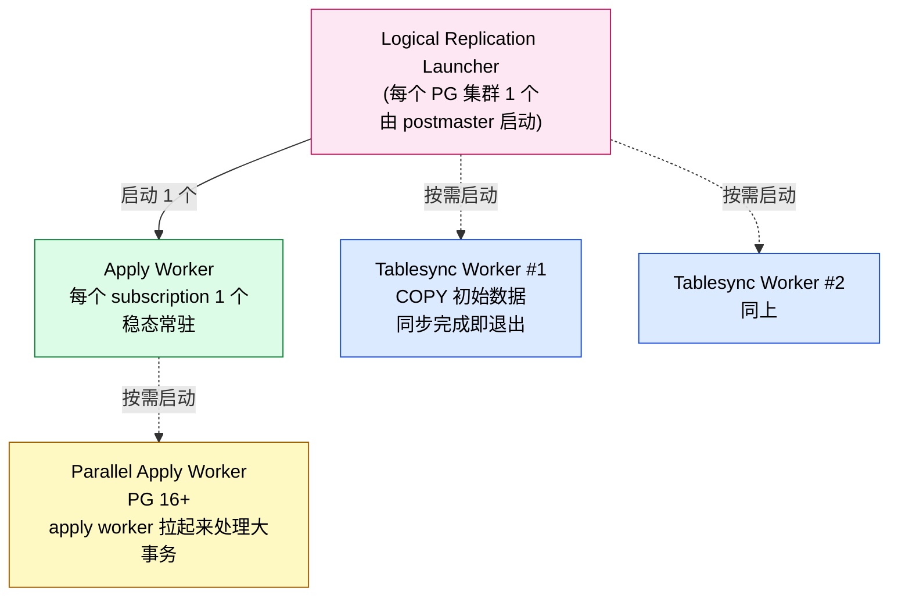
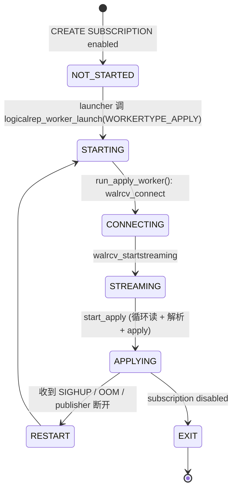
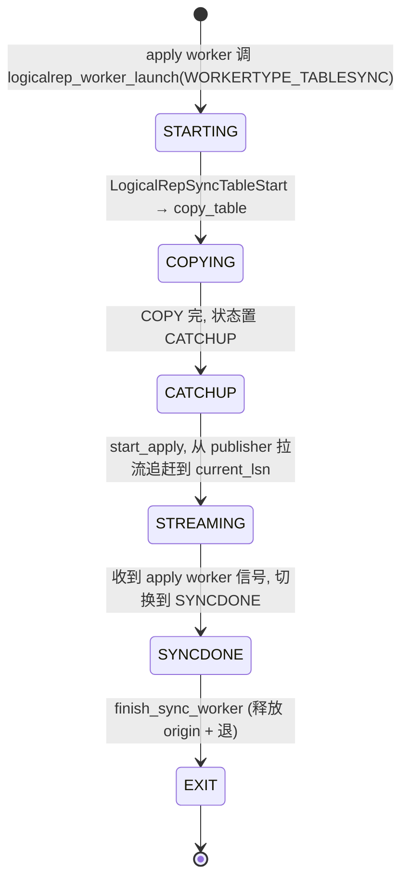
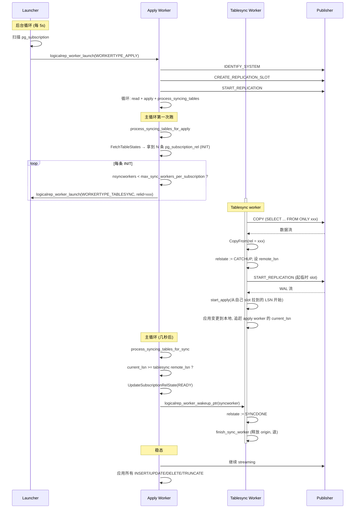
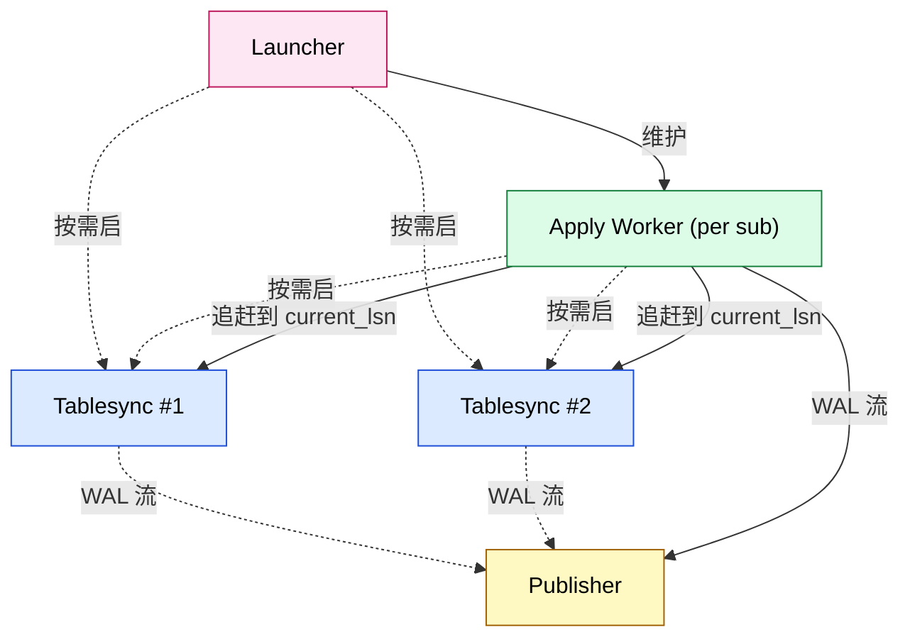
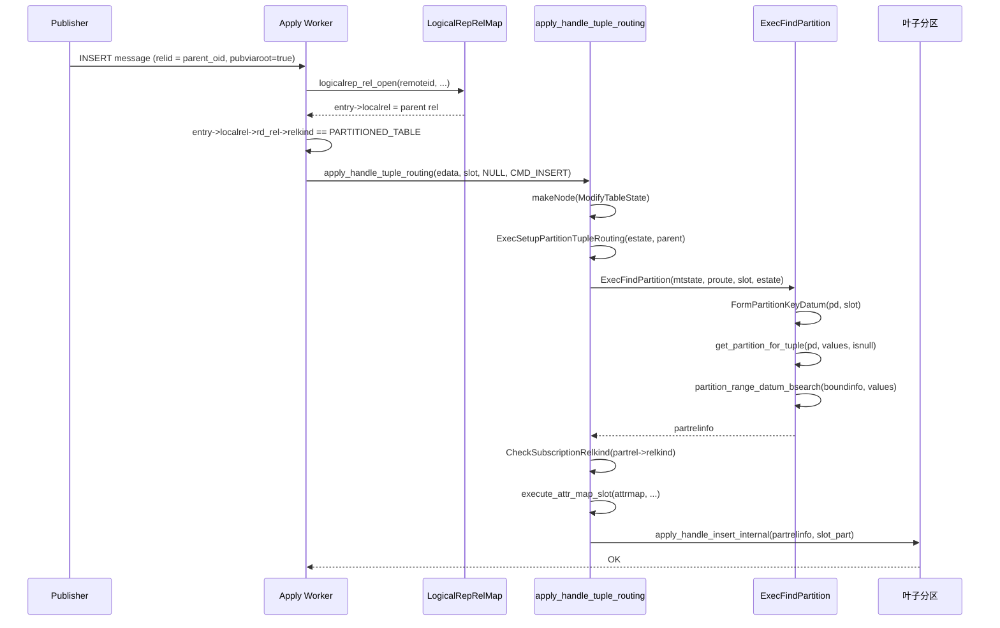
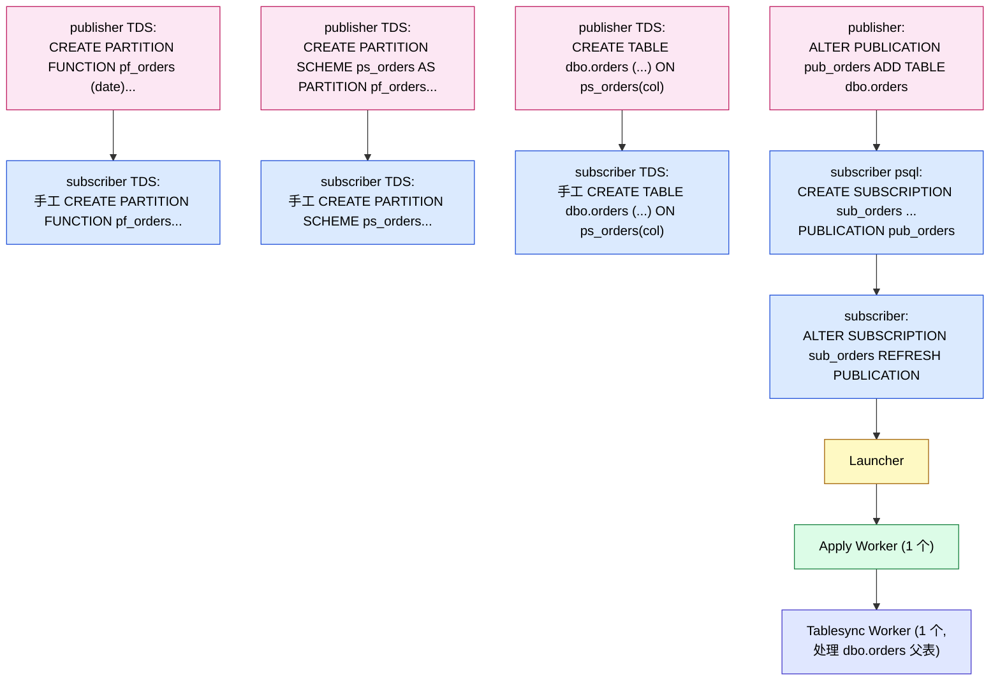

# PostgreSQL 逻辑复制的 Worker 模型：一个 apply worker 撑全场，分区表也一样

| 编写人 | 编写内容 | 编写时间 |
| --- | --- | --- |
| growdu | 初稿，结合 PostgreSQL 17 源码 + Babelfish T-SQL 兼容层 | 2026-08-24 |

> 本文是 [PostgreSQL 逻辑复制与分区表：从 publisher 到 partition leaf 的全链路](./postgresql-logical-replication-with-partitioned-tables/index.html) 的**姊妹篇**。
>
> 上一篇讲"DML 怎么落到叶子分区"。这一篇专门讲**worker 进程**——一个订阅要起几个 worker、分区表多了不会多 worker、worker 之间怎么协调。重点回答：**"分区表的每一个子表都需要对应启动一个 apply worker 吗？"**

主要源码路径：
- `~/cwork/postgresql/src/backend/replication/logical/launcher.c`
- `~/cwork/postgresql/src/backend/replication/logical/worker.c`
- `~/cwork/postgresql/src/backend/replication/logical/tablesync.c`
- `~/cwork/postgresql/src/backend/replication/logical/applyparallelworker.c`
- `~/cwork/postgresql/src/include/replication/worker_internal.h`

---

## 一、一句话答案

> **不需要**。一个 subscription 永远**只有一个 apply worker**。分区表再加多少叶子，都不增加 apply worker。
>
> 真正能"摊到 N 个 worker"的是**初始同步阶段**的 tablesync worker——但每个 tablesync worker 只对应当前 `pg_subscription_rel` 里的一行。同步完就退出，**不会常驻**。

下面我们把 PG 的 worker 类型、资源限制、状态机、分区表的依赖关系一步步拆给你看。

---

## 二、三种 worker 类型

`src/include/replication/worker_internal.h:31`：

```c
typedef enum
{
    WORKERTYPE_UNKNOWN = 0,
    WORKERTYPE_TABLESYNC,        /* 初始同步：COPY 数据 */
    WORKERTYPE_APPLY,            /* 稳态：应用增量变更 */
    WORKERTYPE_PARALLEL_APPLY    /* 大事务并行应用（PG 16+） */
} LogicalRepWorkerType;
```



四种 worker 的分工：

| 类型 | 数量 | 寿命 | 任务 |
| --- | --- | --- | --- |
| Launcher | 1 个/集群 | 常驻 | 监控 `pg_subscription`，按需拉起 apply worker |
| Apply worker | 1 个/订阅 | 订阅 enabled 时常驻 | streaming WAL、应用 INSERT/UPDATE/DELETE/TRUNCATE 到本地 |
| Tablesync worker | ≤ `max_sync_workers_per_subscription` 个/订阅 | **短命**：COPY 完即退出 | 对单张 `pg_subscription_rel` 行做初始 COPY |
| Parallel apply worker | ≤ `max_parallel_apply_workers_per_subscription` 个/订阅 | 处理单条大事务时临时存在 | 把一个事务内的多个 change 分担给多个 worker 并行 apply |

> 关键事实：**apply worker 是唯一的"稳态常驻" worker**，其它都是按需起、任务完即退。

---

## 三、worker 的全局资源限制

`src/backend/replication/logical/launcher.c:50`：

```c
int         max_logical_replication_workers = 4;
int         max_sync_workers_per_subscription = 2;
```

这两个 GUC **共同**决定了 worker 池子的形状：

```text
total worker slots = max_logical_replication_workers (默认 4)
  ├── 所有 subscription 的 apply worker 共用这个池
  ├── 所有 subscription 的 tablesync worker 共用这个池
  └── 所有 subscription 的 parallel apply worker 共用这个池
```

```text
每个 subscription 的 tablesync worker 数 ≤ max_sync_workers_per_subscription (默认 2)
```

源码 `launcher.c:354`：

```c
for (i = 0; i < max_logical_replication_workers; i++) {
    LogicalRepWorker *w = &LogicalRepCtx->workers[i];
    if (!w->in_use) {
        worker = w;
        slot = i;
        break;
    }
}
nsyncworkers = logicalrep_sync_worker_count(subid);

if (worker == NULL || nsyncworkers >= max_sync_workers_per_subscription) {
    /* 触发 GC + retry */
    ...
}
```

如果你订阅很多张大表，又都是初始同步，那 `max_logical_replication_workers = 4` 一定会爆——这个坑在分区表场景会被放大（见第六节）。

---

## 四、worker 进程的生命周期

### 4.1 apply worker 的生命周期



关键点：

- 启动入口 `run_apply_worker`（`worker.c:4546`）：**先做 replication origin 初始化**、**连接 publisher**、**起 replication slot**、**进入 streaming**。
- 主循环在 `start_apply` 里，不断从 `walreceiver` 拿 change，应用到本地。
- 主循环里**关键回调**是 `process_syncing_tables_for_apply`（`tablesync.c:418`）——这是 apply worker 决定要不要拉起 tablesync worker 的地方。

### 4.2 tablesync worker 的生命周期



启动入口 `run_tablesync_worker`（`tablesync.c:1721`）：

```c
static void run_tablesync_worker() {
    char originname[NAMEDATALEN];
    XLogRecPtr origin_startpos = InvalidXLogRecPtr;
    char *slotname = NULL;
    WalRcvStreamOptions options;

    start_table_sync(&origin_startpos, &slotname);   /* 关键: copy_table 走 COPY */

    ReplicationOriginNameForLogicalRep(MySubscription->oid,
                                       MyLogicalRepWorker->relid,
                                       originname, sizeof(originname));
    set_apply_error_context_origin(originname);
    set_stream_options(&options, slotname, &origin_startpos);
    walrcv_startstreaming(LogRepWorkerWalRcvConn, &options);

    /* Apply the changes till we catchup with the apply worker. */
    start_apply(origin_startpos);
}
```

**关键点**：

1. **每个 tablesync worker 只对一张 `pg_subscription_rel` 行做事**——`MyLogicalRepWorker->relid` 就是那张表的 OID。
2. tablesync worker 自己也调 `start_apply`，相当于在 COPY 完成后变成一个**临时 apply worker**，把 publisher 流过来的增量补到自己这边——直到追上 apply worker 的 `current_lsn`。
3. 一旦追上，apply worker 把状态置 `SYNCDONE`，tablesync worker 退出。

### 4.3 launcher 的工作循环

`launcher.c:1185` 一带：

```c
w = logicalrep_worker_find(sub->oid, InvalidOid, false);
if (!w) {
    /* 该订阅还没有 apply worker */
    if (!logicalrep_worker_launch(WORKERTYPE_APPLY, ...))
        ApplyLauncherWakeupAtCommit();
}
```

Launcher 每 `wal_retrieve_retry_interval`（默认 5s）跑一次，主要任务：

1. 遍历 `pg_subscription` 找出 enabled 的。
2. 检查每个 subscription 是否已经有 apply worker，没有就拉起一个。
3. 已经在跑的就跳过。
4. 处理崩溃残留的 worker slot（GC）。

### 4.4 完整时序图



---

## 五、worker 之间的依赖关系（关键）

### 5.1 依赖方向



三条硬性依赖：

1. **launcher → apply worker**：launcher 是 apply worker 的"接生婆"。apply worker 死了 launcher 会拉起新的。
2. **apply worker → tablesync worker**：apply worker 在主循环里**主动决定**要不要拉 tablesync worker。tablesync worker 死了 apply worker 也会再拉（带 `wal_retrieve_retry_interval` 节流）。
3. **apply worker ↔ tablesync worker（catch-up 协议）**：tablesync 完成后进入 catch-up 阶段；apply worker 检查自己的 `current_lsn` 是否追上 tablesync 的 `remote_lsn`，追上了就把 tablesync 状态置 `SYNCDONE`，tablesync worker 自己退出。

### 5.2 `pg_subscription_rel` 行的"归属"

每行 `pg_subscription_rel`（`srrelid` + `srsubid`）有独立的"sync worker slot"——但 slot 是从全局池子里取的：

```c
/* 同一个订阅的 sync worker 数受 max_sync_workers_per_subscription 约束 */
nsyncworkers = logicalrep_sync_worker_count(MyLogicalRepWorker->subid);
if (nsyncworkers < max_sync_workers_per_subscription)
    logicalrep_worker_launch(WORKERTYPE_TABLESYNC, ..., rstate->relid, ...);
```

如果某个订阅有 100 张表，而 `max_sync_workers_per_subscription = 2`，那只有 2 个 tablesync worker 在跑；剩下的 98 张表等前面 2 张同步完（slot 释放）才能拉下一个。

### 5.3 apply worker 和 tablesync worker 之间的同步原语

`tablesync.c:518` 一带：

```c
if (syncworker->relstate == SUBREL_STATE_SYNCWAIT) {
    /* tablesync 端在等 apply worker 给它 CATCHUP 信号 */
    syncworker->relstate = SUBREL_STATE_CATCHUP;
    syncworker->relstate_lsn = Max(syncworker->relstate_lsn, current_lsn);
}
/* 然后调 logicalrep_worker_wakeup_ptr 把 tablesync worker 从 latch 上唤醒 */
if (syncworker->proc)
    logicalrep_worker_wakeup_ptr(syncworker);

/* apply worker 这边进入 wait_for_relation_state_change 忙等 */
wait_for_relation_state_change(rstate->relid, SUBREL_STATE_SYNCDONE);
```

`wait_for_relation_state_change` 是一个 spin + latch 等待，**没有用 sleep**，避免和持锁事务冲突。

### 5.4 并行 apply worker（PG 16+）：apply worker 的"分身"

`src/backend/replication/logical/applyparallelworker.c` 处理 PG 16 引入的"大事务并行应用"。这块和分区表关系不大，但值得一提：

- 触发条件：`streaming = parallel` + 单个事务内的 change 多到阈值。
- 关系：parallel apply worker 由 apply worker 在 `apply_handle_stream_abort` / `apply_spooled_messages` 时拉起。
- 数量限制：`max_parallel_apply_workers_per_subscription`（默认 2）。

对分区表来说，parallel apply worker 不会因为表是分区的就多拉——它只看单条事务的负载。

---

## 六、分区表到底多 worker 多少？

### 6.1 核心：`pg_subscription_rel` 里挂几行

分区表让 worker 数量变化的**唯一**渠道是 `pg_subscription_rel`。三种挂法：

#### 挂法 A：只挂父表（PG 14+ 推荐）

```sql
-- publication 端
ALTER PUBLICATION pub_orders ADD TABLE orders;  -- 父表

-- subscription 端（默认自动 REFRESH）
-- pg_subscription_rel 会出现一行 (subid, relid = orders_oid)
```

worker 数量：

| 阶段 | worker 类型 | 数量 |
| --- | --- | --- |
| 初始同步 | tablesync worker | **1**（处理 `relid = orders_oid`） |
| 稳态 | apply worker | **1** |

增量同步靠 `apply_handle_tuple_routing` 在 apply worker 内部分发到 leaf——**不增加 worker**。

#### 挂法 B：挂所有叶子（不推荐，但 PG 早期是这么做的）

```sql
-- 需手工 ADD TABLE 每个 leaf
ALTER SUBSCRIPTION sub_orders ADD TABLE orders_2024_h1;
ALTER SUBSCRIPTION sub_orders ADD TABLE orders_2024_h2;
ALTER SUBSCRIPTION sub_orders ADD TABLE orders_2025_h1;
...
```

worker 数量：

| 阶段 | worker 类型 | 数量 |
| --- | --- | --- |
| 初始同步 | tablesync worker | ≤ `max_sync_workers_per_subscription`（默认 2）并发；N 个 leaf 分 N 批 |
| 稳态 | apply worker | **仍然只有 1** |

增量同步靠每行 leaf 的 `pg_subscription_rel` 行直接 apply——**不调 `apply_handle_tuple_routing`**。

#### 挂法 C：父表 + 部分叶子（混合，常见于"老订阅 + 新加 leaf"）

```sql
ALTER SUBSCRIPTION sub_orders ADD TABLE orders;        -- 父表
ALTER SUBSCRIPTION sub_orders ADD TABLE orders_legacy; -- 老的非分区表
```

worker 数量等于 `pg_subscription_rel` 行数对应的 batch 数。

### 6.2 对比表

| 维度 | 挂法 A（仅父表） | 挂法 B（所有叶子） | 挂法 C（混合） |
| --- | --- | --- | --- |
| `pg_subscription_rel` 行数 | 1 | N（leaf 数） | K |
| 初始同步 tablesync worker 数 | 1 | ≤ `max_sync_workers_per_subscription` | 介于两者之间 |
| 稳态 apply worker 数 | 1 | 1 | 1 |
| 增量同步路径 | `apply_handle_tuple_routing` | 直接 apply 到 leaf | 视 relkind 而定 |
| 加新叶子后需要 REFRESH？ | **不需要**（leaf 走 routing） | **必须**（每个新 leaf 都要 ADD TABLE） | 部分需要 |
| 必须 `publish_via_partition_root = true`？ | 是 | 否 | 部分是 |
| 何时会爆 `max_logical_replication_workers`？ | 不会 | 极易（leaf 多时初始同步阶段） | 中等 |

### 6.3 PG 14 之后的官方推荐路径

PG 14 起，**官方推荐挂法 A**：只挂父表，设 `publish_via_partition_root = true`。

源码 `pgoutput.c:2262`：

```c
/* Don't publish changes for partitioned tables, because
   publishing those of its partitions suffices, unless partition
   changes won't be published due to pubviaroot being set. */
if (publish &&
    (relkind != RELKIND_PARTITIONED_TABLE || pub->pubviaroot))
{
    entry->pubactions.pubinsert |= pub->pubactions.pubinsert;
    ...
}
```

PG 17/18 又做了改进：apply worker 在 routing 时如果发现 subscriber 没有对应的 leaf，**会自动建 leaf**（`auto-create partition` 模式，仍需 DDL 同步支持）。

### 6.4 资源紧张的真实案例

假设你有：

- 1 个订阅 `sub_orders`
- 1 张分区表 `orders`，32 个 leaf
- 挂法 B（每个 leaf 一行）

初始同步阶段：

```text
max_logical_replication_workers = 4 (默认)
  ├── launcher slot 1
  ├── apply worker slot 1  → 1 个
  └── tablesync worker slots ≤ 2 (max_sync_workers_per_subscription)

→ 32 个 leaf 要分 16 批，每批 2 个 tablesync worker
→ 每张 leaf 的初始 COPY 数据量 100GB
→ 单 leaf COPY 时间假设 30 分钟
→ 全部完成: 16 × 30min = 8 小时
```

改成挂法 A：

```text
max_logical_replication_workers = 4
  ├── launcher slot 1
  ├── apply worker slot 1
  └── tablesync worker 1 个（处理父表）

→ 父表 COPY 时间取决于 leaf 总和（用 ONLY parent 自动排除继承）≈ 30 分钟
→ 全部完成: 30 分钟
```

资源占用对比：

| 资源 | 挂法 B | 挂法 A |
| --- | --- | --- |
| 初始同步 worker 数 | 2 | 1 |
| 总耗时 | 8h | 30min |
| `pg_subscription_rel` 行数 | 32 | 1 |
| 加新 leaf 的运维成本 | 高（ADD TABLE） | 低（DDL 同步 + 自动 routing） |

---

## 七、apply worker 处理分区表 INSERT 的完整路径

把 apply worker 在收到一条 INSERT 后的代码路径画清楚（已经在上一篇讲过，这里侧重 worker 视角）：



全程**只在 apply worker 进程内**，**没有任何额外进程**——这是 PG 分区表逻辑复制能扩展的关键设计。

---

## 八、Babelfish T-SQL 模式下 worker 关系有何不同

### 8.1 T-SQL 层没有自带的 replication engine

Babelfish **不重新发明**逻辑复制——它**完全复用 PG 原生的 apply worker / tablesync worker / launcher**。所以：

- worker 数量完全一样（一个 sub 一个 apply worker）。
- T-SQL 端的 `CREATE SUBSCRIPTION` / `ALTER SUBSCRIPTION` 是 PG 原生命令，只是从 TDS 端口解析。
- Babelfish 的 partition function / scheme metadata 落进 `sys.babelfish_partition_function` / `sys.babelfish_partition_scheme`——**这些是 DDL，不是 replication 数据**。它们必须手工同步。

### 8.2 Babelfish 测试用例的真实场景

`~/cwork/babelfish_extensions/test/JDBC/replication/partition-replication.mix` 演示的流程：



worker 数量结论和 PG 模式**完全一致**：

| 阶段 | worker 类型 | 数量 |
| --- | --- | --- |
| 初始同步 | tablesync worker | **1**（处理 `dbo.orders` 父表） |
| 稳态 | apply worker | **1** |

Babelfish 不引入任何额外 worker。分区表 leaf 的 INSERT 增量同步走 `apply_handle_tuple_routing` + `ExecFindPartition`，和 PG 原生一模一样。

### 8.3 Babelfish 模式下"看起来多 worker"的假象

因为 T-SQL 测试脚本里**两端的 partition function / scheme 各运行一次**，你可能会误以为每个 partition 都对应一个 worker。事实是：

- `sys.partition_functions` 里的每一行只是 metadata，不是 worker 单位。
- `sys.destination_data_spaces` 里的每一行只是 filegroup 槽位。
- worker 单位永远是 `pg_subscription_rel` 行——和 partition metadata 无关。

---

## 九、调优建议（针对分区表场景）

### 9.1 worker pool 必须够大

```sql
-- postgresql.conf
max_logical_replication_workers = 32         -- 集群总 worker 数（含所有订阅的 apply+tablesync+parallel）
max_sync_workers_per_subscription = 4         -- 单个订阅并发 tablesync 数
max_parallel_apply_workers_per_subscription = 4  -- 单个订阅并行 apply 数（PG 16+）
```

> 经验值：如果你有 K 个订阅同时在跑，每个订阅里又有 P 张分区表做挂法 B 初始同步，建议 `max_logical_replication_workers ≥ 2 * K + K * P * 0.5`（保留冗余）。挂法 A 只需要 `2 * K + K * 0.5`。

### 9.2 监控命令

```sql
-- 当前活的 worker
SELECT pid, type, subid, relid, state
  FROM pg_stat_activity
 WHERE backend_type LIKE '%logical%'
   OR query LIKE '%logical%'
 ORDER BY pid;

-- worker slot 使用情况（共享内存）
SELECT count(*) FILTER (WHERE in_use) AS used,
       count(*) FILTER (WHERE NOT in_use) AS free
  FROM (SELECT (logicalrep_worker_launch(...))::text) ss;  -- 不能直接 SELECT, 用 EXPLAIN 间接看

-- 实际监控方法: pg_stat_replication + pg_stat_subscription
SELECT subname, pid, type, state, sync_state
  FROM pg_stat_subscription
 ORDER BY pid;
```

### 9.3 资源竞争时的取舍

`max_logical_replication_workers = 4`（默认）+ `max_sync_workers_per_subscription = 2` 真的太少。生产实践：

| 订阅数 | 单订阅表数 | 推荐 `max_logical_replication_workers` | 推荐 `max_sync_workers_per_subscription` |
| --- | --- | --- | --- |
| 1 | 1 张分区表（挂法 A） | 4 | 2 |
| 1 | 32 张分区表（挂法 B） | 8–16 | 2 |
| 10 | 各 1 张分区表（挂法 A） | 8 | 2 |
| 10 | 各 32 张 leaf（挂法 B） | 64+ | 4 |

### 9.4 死锁与"等不到 worker"的诊断

```sql
-- worker slot 耗尽的告警
SHOW max_logical_replication_workers;  -- 调整
-- 等待中的 relation 数
SELECT count(*) FROM pg_subscription_rel WHERE srsubstate IN ('i', 'd');
```

`pg_subscription_rel.srsubstate` 的合法值：

```c
#define SUBREL_STATE_INIT     'i'
#define SUBREL_STATE_DATASYNC 'd'
#define SUBREL_STATE_CATCHUP  'c'
#define SUBREL_STATE_SYNCDONE 's'
#define SUBREL_STATE_READY    'r'
```

如果 `INIT` 或 `DATASYNC` 卡了很久不前进，说明 tablesync worker 起不来或同步失败，常见原因：

- `disable_on_error = true` 触发 DisableSubscriptionAndExit。
- COPY 阶段 publisher 端数据超大、超时。
- subscriber 端磁盘满、WAL 堆积。

---

## 十、修改指南：要加新 worker 类型 / 改变 worker 关系时碰哪些文件

### 10.1 加一种新 worker 类型（比如 per-leaf apply worker）

理论上"每个 leaf 一个 apply worker"会让分区表的并行度更高，但**目前 PG 没有**。

如果要改：

1. `src/include/replication/worker_internal.h`：在 `LogicalRepWorkerType` 枚举加新值（如 `WORKERTYPE_LEAF_APPLY`）。
2. `src/backend/replication/logical/launcher.c`：
   - `logicalrep_worker_launch` 加新分支。
   - `max_logical_replication_workers` 资源限制（加新 GUC）。
3. `src/backend/replication/logical/worker.c`：
   - `apply_handle_tuple_routing` 改成"分发到 leaf worker"而不是本地 routing。
4. `src/backend/executor/execPartition.c`：可能需要给 leaf worker 共享 `PartitionTupleRouting`（用 DSM）。

> 这是 PG 邮件列表上被反复讨论的 feature，但一直没合进来——主要是**正确性**问题：跨 worker 的事务一致性难以保证。

### 10.2 让 partitions 共享一个 apply worker 的现有"作弊"

PG 16 引入 `streaming = parallel` + parallel apply worker，已经在某种程度上"摊到了多 worker"——但每个 worker 处理的是**单事务的不同 change**，不是不同 leaf。所以分区表的 cross-partition 事务还是单线程处理。

### 10.3 让 tablesync worker 并行 COPY 多张 leaf

目前 `copy_table` 一次只 COPY 一张表（在 `LogicalRepSyncTableStart` 里依次处理）。如果改成"同一 tablesync worker 内 fork 多个 worker 并行 COPY 不同 leaf"，需要：

1. tablesync worker 内置 background worker 拉起逻辑。
2. 共享 DSM 持有 origin / replication progress。
3. 错误处理：单个 leaf COPY 失败不影响其它 leaf。

目前没实现。挂法 A 已经通过 `COPY (SELECT FROM ONLY parent)` 在**单表上**拿到了并行度（分区裁剪 + 并行 scan），所以这个优化空间不大。

### 10.4 在 Babelfish 里加 T-SQL 风格的 per-leaf sync 状态

Babelfish 当前 `sys.dm_repl_schemas` / `MSreplication_objects` 等视图是空壳。如果要补：

1. 新建 Babelfish metadata 表记录"每个 leaf 的 sync 状态"。
2. 在 `run_tablesync_worker` 完成后插入状态。
3. 在 `apply_handle_tuple_routing` 内每 routing 一次也更新一下"这个 leaf 被 used 了多少次"。

这是个大工作，建议作为 Babelfish 4.x 路线图。

---

## 十一、结语

| 维度 | 结论 |
| --- | --- |
| 一个 subscription 几个 apply worker？ | **1 个**（稳态常驻） |
| 分区表让 apply worker 数变多吗？ | **不变**（靠 `apply_handle_tuple_routing` 内部分发） |
| 一个 subscription 几个 tablesync worker？ | ≤ `max_sync_workers_per_subscription`（默认 2），按 `pg_subscription_rel` 行分批 |
| tablesync worker 寿命？ | COPY 完 + 追赶到 current_lsn 后即退 |
| 挂法 A vs 挂法 B 的 worker 差异？ | A 永远 1 个 tablesync，B 可能 N 个分 N 批 |
| `max_logical_replication_workers` 是 apply 还是 tablesync 还是 sum？ | **sum**——所有 worker 类型共用一个池 |
| Babelfish 模式下 worker 关系有何不同？ | **没有不同**——完全复用 PG 原生 worker 模型 |

如果你正在为一张 N 个 leaf 的分区表规划逻辑复制，记住这个黄金公式：

```text
worker 数 = 1 (apply) + min(N, max_sync_workers_per_subscription) (tablesync, 初始同步期间)
```

加新 leaf 不会增加稳态 worker 数，只会在初始同步阶段触发一次性的额外 tablesync worker。这就是 PG 逻辑复制能"在分区表上线性扩展"的根本原因——它把分区表的并行化问题**留给了内核的 partition routing**，而不是堆 worker。
