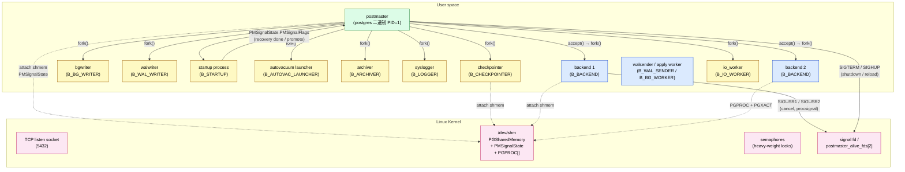
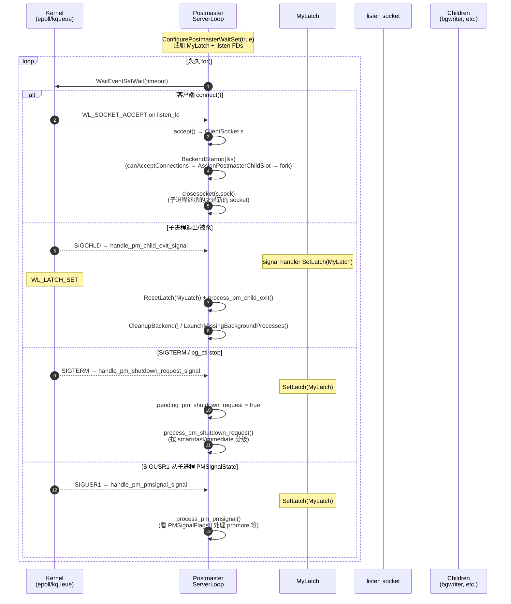
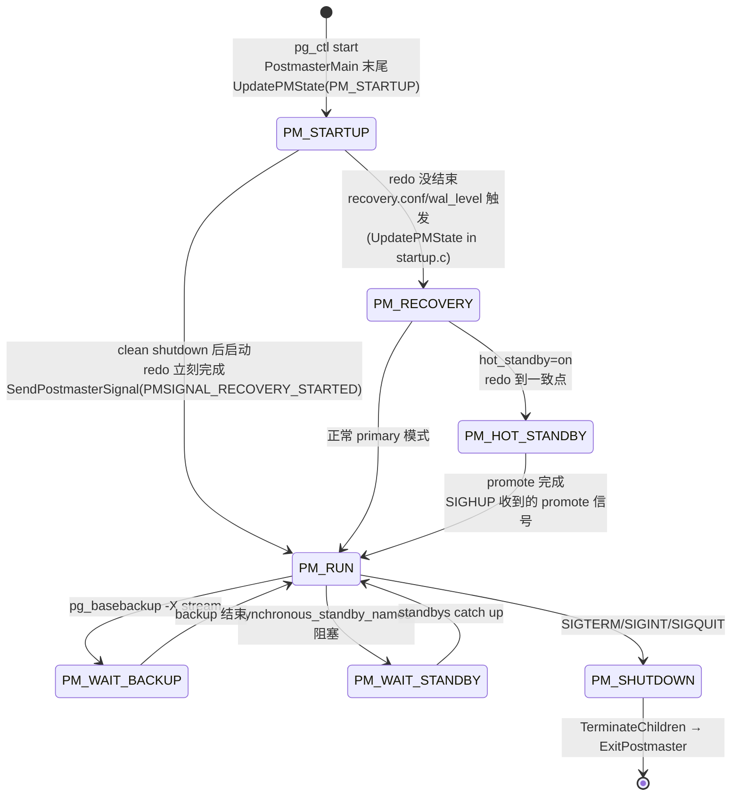
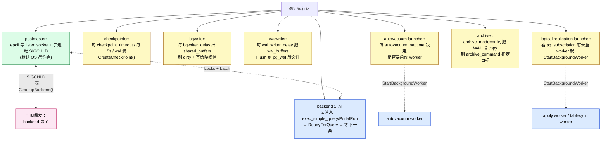
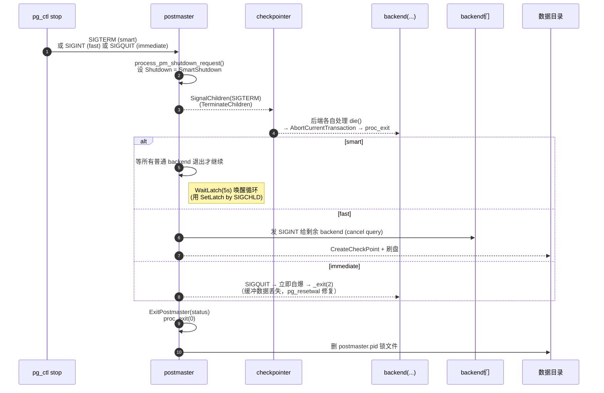
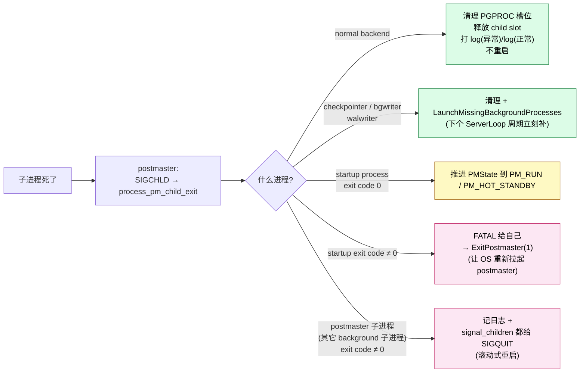

# 从 `postgres` 二进制到生产级守护 —— PostgreSQL 最外层模块与启动全流程拆解

| 编写人 | 编写内容 | 编写时间 |
| --- | --- | --- |
| growdu | 初稿，从开发者视角拆解 PostgreSQL 最外层模块（dispatch、postmaster、ServerLoop、子进程家族、IPC）的接口、通信方向与启动顺序 | 2026-09-02 |

> 本文是「PostgreSQL 源码系列」的总览篇。配套源码版本：PostgreSQL 18 dev（`~/cwork/postgresql`）。同系列前文：
>
> - [PostgreSQL 事务：一次 BEGIN 与 COMMIT 背后的双层世界](./postgresql-transaction-lifecycle/index.html)
> - [PostgreSQL MVCC：从一行 UPDATE 到 5 个 HeapTuple 的演化](./postgresql-mvcc/index.html)
> - [PostgreSQL 内存管理：从 shared_buffers 到内存上下文](./postgresql-memory-management/index.html)
> - [PostgreSQL 分区表：从一行 `PARTITION BY` 到路由热路径](./postgresql-partition-handling/index.html)
> - [PostgreSQL 逻辑复制表的生命周期：从 `pg_replication_slots` 到 `pg_subscription_rel`](./postgresql-logical-replication-tables-lifecycle/index.html)

打开终端敲一行 `pg_ctl start`，几秒后看到 `database system is ready to accept connections`。这几秒钟里，一台进程工厂刚刚开业：

- 一个 **`postgres` 可执行文件**决定自己到底扮演哪个角色（postmaster 还是 bootstrap 还是单用户后端）；
- 一个 **postmaster 守护进程**做完自检、起好共享内存、fork 出第一批子进程；
- 一群 **后台进程**各就各位：checkpointer、bgwriter、walwriter、startup process、syslogger、autovacuum launcher……开始无休止地转；
- 第一个 **客户端连接**进来，postmaster 立刻 fork 一个普通 backend 出来接客；
- 这台 backend 进入 **PostgresMain 消息循环**，从此只服务这条连接，直到连接断开、进程退出。

30 篇文章里讲了很多 PG 子系统（MVCC、事务、内存、分区、逻辑复制……）。但所有这些子系统都装在上面的"进程壳"里运行。这一篇只讲壳——**最外层模块怎么组装、子进程如何派生、信号怎么传、共享内存怎么共用、PMState 怎么推进**。只看外壳，不进厨房。

---

## 一、先建立直觉：PG 在 OS 里长什么样

一张 `ps -ef | grep postgres` 在生产时段拍下来的快照（精心挑选的版本）：

```text
postgres  2161   1  0 Sep01 ?  00:00:00 /usr/lib/postgresql/18/bin/postgres                 ← postmaster
postgres  2167 2161  0 Sep01 ?  00:00:00 postgres: checkpointer                                  ← checkpointer 子进程
postgres  2168 2161  0 Sep01 ?  00:00:00 postgres: background writer                              ← bgwriter
postgres  2169 2161  0 Sep01 ?  00:00:00 postgres: walwriter                                      ← walwriter
postgres  2170 2161  0 Sep01 ?  00:00:00 postgres: autovacuum launcher                            ← autovac launcher
postgres  2171 2161  0 Sep01 ?  00:00:00 postgres: logical replication launcher                   ← logical rep launcher
postgres  2172 2161  0 Sep01 ?  00:00:00 postgres: archiver                                       ← archiver
postgres  2450 2161  0 09:14 ?  00:00:00 postgres: user1 192.168.1.5(54321) idle                  ← 用户 backend
postgres  2451 2161  0 09:14 ?  00:00:00 postgres: user1 192.168.1.5(54322) SELECT                ← 用户 backend
postgres  2501 2161  0 09:16 ?  00:00:00 postgres: walsender repuser 192.168.2.3(54333) streaming ← walsender
postgres  2510 2161  0 09:17 ?  00:00:00 postgres: logical replication worker for subscription 6192 ← apply worker
```

每一行都是一个 **独立的操作系统进程**，有独立 PID、独立栈、独立文件描述符。但它们共享一块 **System V 共享内存**（`/proc/<pm_pid>/maps` 里能看到那一段 `rw-s-` 的 `PGSharedMemory`）。postmaster 是其它所有进程的父进程——树形结构清晰可见。

把这棵进程树背后的"电路图"画出来，就是本文的工作。



只看一眼就能记三件事：

1. **一个进程统领全局**。所有进程都是 postmaster 的子孙；postmaster 是唯一对外监听 5432 端口的家伙。
2. **子进程按"职能"分桶**。`B_*` 这些 enum 值就是桶号；同一桶里的进程功能完全同构（都是 backup 进程、都是 bgwriter……）。
3. **进程间通信只走三条路**：共享内存（PMSignalState、PGPROC、Latch）、POSIX 信号（SIGTERM/SIGHUP/SIGUSR1/SIGUSR2）、socket（远程客户端）。这三条路，下面会挨条走一遍。

下面剥洋葱，从最外层往里走。

---

## 二、一个 `postgres` 二进制，五种身份 + 两种"立刻退出"

很多人不知道： **`/usr/lib/postgresql/18/bin/postgres` 这个可执行文件同时扮演至少 5 个角色**。

打开 `src/backend/main/main.c`，看完头 230 行就明白了：

- `src/backend/main/main.c:71 (main)` —— 整个 PG 的 C 进程入口；唯一一个 main() 函数
- `src/backend/main/main.c:206 (switch dispatch_option)` —— 根据第一个 `--xxx` 参数分流

```mermaid
flowchart LR
    IN[/"postgres &lt;args&gt;"/]:::in

    IN -->|"默认 · 无 --xxx"| MAIN["PostmasterMain&lt;br&gt;主路径 · 生产服务器"]:::main
    IN -->|"--boot"| BOOT["BootstrapModeMain(false)&lt;br&gt;initdb 内部调用"]:::aux
    IN -->|"--check"| CHK["BootstrapModeMain(check=true)&lt;br&gt;pg_controldata / pg_resetwal"]:::aux
    IN -->|"--single"| SING["PostgresSingleUserMain()&lt;br&gt;单机调试 / 恢复"]:::aux
    IN -->|"--describe-config"| DC["GucInfoMain()&lt;br&gt;postgres -C guc"]:::aux
    IN -->|"--forkchild=&lt;i&gt;"| FK["SubPostmasterMain()&lt;br&gt;EXEC_BACKEND 专用"]:::execk

    IN -.->|"-V" / "--version"| V[/"打印 PG_VERSION&lt;br&gt;exit(0)"/]:::exit
    IN -.->|"--help"| H[/"打印 help 文本&lt;br&gt;exit(0)"/]:::exit

    classDef in fill:#dcfce7,stroke:#15803d,color:#000
    classDef main fill:#fce7f3,stroke:#be185d,color:#000
    classDef aux fill:#dbeafe,stroke:#1d4ed8,color:#000
    classDef execk fill:#fef9c3,stroke:#a16207,color:#000
    classDef exit fill:#f3f4f6,stroke:#6b7280,color:#000
```

**常用身份的对应关系（开发者背下来即拿即用）：**

| argv 第一参数 | DispatchOption | 入口函数 | 何时使用 |
| --- | --- | --- | --- |
| 无 | `DISPATCH_POSTMASTER` | `PostmasterMain` | `pg_ctl start` 或 `pg_ctl -D $PGDATA` |
| `--boot` | `DISPATCH_BOOT` | `BootstrapModeMain` | `initdb` 第一次建库时 |
| `--check` | `DISPATCH_CHECK` | `BootstrapModeMain(check=true)` | `pg_controldata`、`pg_resetwal` |
| `--single` | `DISPATCH_SINGLE` | `PostgresSingleUserMain` | `postgres --single -D /var/lib/postgresql/data` |
| `--describe-config` | `DISPATCH_DESCRIBE_CONFIG` | `GucInfoMain` | `postgres -C shared_buffers` |
| `--forkchild=BACKEND` | `DISPATCH_FORKCHILD` | `SubPostmasterMain` | Windows / fork-exec 模式 |

```c
/* src/backend/main/main.c:201 */
if (argc > 1 && argv[1][0] == '-' && argv[1][1] == '-')
    dispatch_option = parse_dispatch_option(&argv[1][2]);

switch (dispatch_option)
{
    case DISPATCH_CHECK:        BootstrapModeMain(argc, argv, true);  break;
    case DISPATCH_BOOT:         BootstrapModeMain(argc, argv, false); break;
    case DISPATCH_FORKCHILD:    SubPostmasterMain(argc, argv);        break;  /* EXEC_BACKEND */
    case DISPATCH_DESCRIBE_CONFIG: GucInfoMain();                     break;
    case DISPATCH_SINGLE:       PostgresSingleUserMain(argc, argv, ...); break;
    case DISPATCH_POSTMASTER:   PostmasterMain(argc, argv);           break;  /* 默认 */
}
```

注意几个关键事实：

1. **没有任何分支会 `return`**。`main.c` 在分流后只在末尾 `abort()`；所有 5 个入口都 `pg_noreturn`。这意味着你看到的 PG 进程必定一辈子跑在某一身份上，绝不串号。
2. **唯一复用 main 的"主路径"是 postmaster**。`--boot` / `--check` / `--single` 都只是 `initdb` / 调试 / 紧急恢复场景的边路。
3. **`--forkchild` 只在 `EXEC_BACKEND` 平台出现**。Windows 上没有 fork，只能 fork+exec；其余 Unix 平台 `fork()` 后子进程直接跑专用的 `*Main` 即可，所以 `DISPATCH_FORKCHILD` 永远是 unreachable（`Assert(false)`）。

**开发视角小贴士**：如果哪天你在源码里搜索启动路径却找不着 postmaster 的某个分支，记得先看是不是走的是 `--single` 或 `--boot`。

---

## 三、PostmasterMain：开机自检的 8 个阶段

`PostmasterMain(argc, argv)` 是 postmaster 的"开机八段"。源文件 `src/backend/postmaster/postmaster.c`，从 `493` 行开始执行，到 `1400` 行进入 `ServerLoop()` 之前分以下阶段：

| 阶段 | 关键动作 | 核心文件:行 |
| --- | --- | --- |
| ① 信号屏蔽 | `pqinitmask()` + `sigprocmask(SIG_SETMASK, &BlockSig, NULL)` | `postmaster.c:548` |
| ② 安装信号处理器 | SIGHUP→reload，SIGINT/SIGTERM/SIGQUIT→shutdown，SIGUSR1→pmsignal，SIGCHLD→子进程退出 | `postmaster.c:552` |
| ③ GUC 解析 | `InitializeGUCOptions()` + `getopt("B:bC:c:D:d:EeFf:h:ijk:lN:OPp:r:S:sTt:W:-:")` | `postmaster.c:619` |
| ④ 数据目录与 pg_control 校验 | `checkDataDir()` + `checkControlFile()` | `postmaster.c:1097,1515` |
| ⑤ 装载 HBA / IDENT | `load_hba()` / `load_ident()` | `postmaster.c:1340,1352` |
| ⑥ 提交 `postmaster.pid` 锁文件 | `CreateDataDirLockFile()` + `AddToDataDirLockFile(LOCK_FILE_LINE_PM_STATUS, PM_STATUS_STARTING)` | `postmaster.c:1390` |
| ⑦ 创建共享内存 + 信号量 | `CreateSharedMemoryAndSemaphores()` | `ipci.c:200` |
| ⑧ fork 后台进程 + 进入 ServerLoop | `StartChildProcess(B_*)` + `ServerLoop()` | `postmaster.c:1386,1400` |

最具决定性的是第 ⑦ 步。我们单独挖出来看一下（`src/backend/storage/ipc/ipci.c`）：

```c
/* src/backend/storage/ipc/ipci.c:200 */
void CreateSharedMemoryAndSemaphores(void) {
    PGShmemHeader *seghdr;
    Size size; int numSemas;
    Assert(!IsUnderPostmaster);

    size = CalculateShmemSize(&numSemas);        /* 按 GUC 计算容量 */
    seghdr = PGSharedMemoryCreate(size, &shim);  /* 真正向内核申请 shm */

    InitShmemAccess(seghdr);                     /* 全局指针挂上去 */
    PGReserveSemaphores(numSemas);               /* 申请 SYSV/POSIX 信号量 */
    InitShmemAllocation();                       /* 分配器建立 */
    CreateOrAttachShmemStructs();                /* 装入 PGPROC、LOCK、BufferDesc 等 */
    dsm_postmaster_startup(shim);                /* 动态共享内存基础设施 */
    if (shmem_startup_hook) shmem_startup_hook(); /* 扩展 hook */
}
```

这一段如果失败，postmaster 会 `ereport(FATAL, ...)` 直接退出（绝不会半残地运行）。下面的后台进程要么 attach、要么 fail——这是 PG 的"单点信任"。

第 ⑧ 步的子进程次序：

```c
/* src/backend/postmaster/postmaster.c:1386 */
if (CheckpointerPMChild == NULL)
    CheckpointerPMChild = StartChildProcess(B_CHECKPOINTER);  /* 1. 先起来，能帮 recovery */
if (BgWriterPMChild == NULL)
    BgWriterPMChild = StartChildProcess(B_BG_WRITER);          /* 2. 同上 */
StartupPMChild = StartChildProcess(B_STARTUP);                /* 3. 真正干活 */
StartupStatus = STARTUP_RUNNING;
```

**注意这里非常巧妙的次序**：checkpointer 和 bgwriter 必须在 startup process **之前** 起得来。原因：

- 如果是 crash recovery 启动，startup process 在重放 WAL 时会需要写脏页；
- checkpointer 同步脏页到磁盘；
- bgwriter 持续做 clean buffer 写入；
- 三者必须在 startup process 开始恢复之前一起就绪。

启动完后，postmaster 才进入 `ServerLoop()` 事件循环。

---

## 四、ServerLoop：24/7 的 accept 大堂经理

`ServerLoop()` 是 postmaster 的主循环——一个永不返回的 `for(;;)`。核心逻辑在 `src/backend/postmaster/postmaster.c:1652-1810`。

```c
/* src/backend/postmaster/postmaster.c:1652 - 节选 */
void ServerLoop(void) {
    ConfigurePostmasterWaitSet(true);
    for (;;) {
        nevents = WaitEventSetWait(pm_wait_set,
                                   DetermineSleepTime(),
                                   events, lengthof(events), 0);

        for (int i = 0; i < nevents; i++) {
            if (events[i].events & WL_LATCH_SET) ResetLatch(MyLatch);

            if (pending_pm_shutdown_request) process_pm_shutdown_request();
            if (pending_pm_reload_request)   process_pm_reload_request();
            if (pending_pm_child_exit)       process_pm_child_exit();
            if (pending_pm_pmsignal)         process_pm_pmsignal();

            if (events[i].events & WL_SOCKET_ACCEPT) {
                ClientSocket s;
                if (AcceptConnection(events[i].fd, &s) == STATUS_OK)
                    BackendStartup(&s);     /* ★ 关键：一旦有新连接 → fork */
                closesocket(s.sock);
            }
        }

        LaunchMissingBackgroundProcesses();    /* 缺啥补啥 */
        if (avlauncher_needs_signal) {...}
        /* 长循环任务：每分钟 recheck PID 锁，每 58 分钟 touch socket 文件 */
    }
}
```

核心数据结构是 `WaitEventSet`（libpq/wait_event.c），由 `ConfigurePostmasterWaitSet(true)` 一次性装好两类 watcher：

| watcher | 来源 | 触发动作 |
| --- | --- | --- |
| listen socket | `WL_SOCKET_ACCEPT` on 5432 TCP / Unix socket | `BackendStartup()` |
| self latch `MyLatch` | `WL_LATCH_SET` | 各类信号处理函数 `SetLatch()` 后重新检查 |

`WaitEventSetWait()` 是阻塞的——一旦某个 fd / latch 上来，立刻醒来。这是一台"睡了等铃响、醒了立刻分流"的机器。

把 ServerLoop 的多路复用画出来：



**关键设计点**：

1. **postmaster 不直接处理请求**。它只做"分配和收割"——fork 子进程、监听子进程退出。不接 SQL、不进事务、连 buffer cache 都不碰。
2. **三类事件都在一个 wait set 里混等**。listen 套接字（accept 事件）+ latch（内部信号）+ SIGCHLD（通过 latch 转发）。单一 epoll/kqueue 调用，挂起时间由 `DetermineSleepTime()` 决定（最坏 1 分钟——定期 recheck PID 锁）。
3. **accept 后立刻关父进程的 socket fd**。"父子必有一方持有"，父进程 close 完就把所有权彻底交给子进程。这是"无状态"转交，没有"我先到、它后到"这种竞态。
4. **关闭是 graceful 的**。`determineSleepTime()` 根据下一个最近超时（cleanup lock file / check logical rep / etc.）计算——避免"卡死不动"又不会 CPU 空转。

---

## 五、子进程家族：从 spawn 到死，谁是谁

PG 维护一个 `BackendType` 枚举加上一个 `child_process_kinds[]` 数组（`src/backend/postmaster/launch_backend.c:154`），把子进程按"职能"分桶：

```c
/* src/backend/postmaster/launch_backend.c:154 - 节选 */
static child_process_kind child_process_kinds[] = {
    [B_INVALID] = {"invalid", NULL, false},
    [B_BACKEND] = {"backend", BackendMain, true},
    [B_DEAD_END_BACKEND] = {"dead-end backend", BackendMain, true},
    [B_AUTOVAC_LAUNCHER] = {"autovacuum launcher", AutoVacLauncherMain, true},
    [B_AUTOVAC_WORKER] = {"autovacuum worker", AutoVacWorkerMain, true},
    [B_BG_WORKER] = {"bgworker", BackgroundWorkerMain, true},
    /* B_WAL_SENDER 由 B_BACKEND 认证后改类型而来 */
    [B_SLOTSYNC_WORKER] = {"slot sync worker", ReplSlotSyncWorkerMain, true},
    [B_STANDALONE_BACKEND] = {"standalone backend", NULL, false},
    [B_ARCHIVER] = {"archiver", PgArchiverMain, true},
    [B_BG_WRITER] = {"bgwriter", BackgroundWriterMain, true},
    [B_CHECKPOINTER] = {"checkpointer", CheckpointerMain, true},
    [B_IO_WORKER] = {"io_worker", IoWorkerMain, true},
    [B_STARTUP] = {"startup", StartupProcessMain, true},
    [B_WAL_RECEIVER] = {"wal_receiver", WalReceiverMain, true},
    [B_WAL_SUMMARIZER] = {"wal_summarizer", WalSummarizerMain, true},
    [B_WAL_WRITER] = {"wal_writer", WalWriterMain, true},
    [B_LOGGER] = {"syslogger", SysLoggerMain, false},
};
```

每个桶对应一个 Main 函数，挂上 shmem 标志位。`postmaster_child_launch()`（`launch_backend.c:229`）做了所有 fork 后子进程的开始动作：

```mermaid
flowchart TB
    PM["postmaster:<br/>ServerLoop → BackendStartup()"]
    PM -->|fork_process| F["1. fork()"]
    F -->|child_branch| C1["2. ClosePostmasterPorts()<br/>(关 listen socket)"]
    C1 --> C2["3. InitPostmasterChild()<br/>(删 PostmasterContext，<br/>重置信号掩码为 UnBlockSig)"]
    C2 --> C3{"4. shmem_attach?"}
    C3 -->|true| C4["保持 shmem 连接"]
    C3 -->|false| C5["dsm_detach_all() +<br/>PGSharedMemoryDetach()"]
    C4 --> C6["5. child_process_kinds[type].main_fn(...)"]
    C5 --> C6
    C6 --> R["永不返回<br/>(pg_noreturn)"]

    classDef pm fill:#dcfce7,stroke:#15803d,color:#000
    classDef ify fill:#fef9c3,stroke:#a16207,color:#000
    classDef end fill:#dbeafe,stroke:#1d4ed8,color:#000

    class PM pm
    class F,C1,C2,C6 ify
    class C3,C4,C5,R end
```

**`postmaster_child_launch()` 的 Unix 分支**（`launch_backend.c:244-291`）做了这么几件事：

1. `pid = fork_process();` —— 真正的 fork 起点
2. 子进程里：
   - `ClosePostmasterPorts(child_type == B_LOGGER)` —— 关闭 listen socket
   - `InitPostmasterChild()` —— 删掉 PostmasterContext、把 BlockSig 重置成 UnBlockSig
   - 视 `shmem_attach` 决定 detach shmem 还是保留
   - 拷贝 `client_sock`、`MyPMChildSlot` 设置好
   - 调用 `child_process_kinds[type].main_fn(startup_data, startup_data_len)` —— 一头扎进对应 Main

下面挨个看看三类子进程最具代表性的 Main。

### 5.1 启动进程（startup）—— 一生只跑一件事

```c
/* src/backend/postmaster/startup.c:216 */
void StartupProcessMain(const void *startup_data, size_t startup_data_len) {
    MyBackendType = B_STARTUP;
    AuxiliaryProcessMainCommon();          /* PGPROC + BaseInit + ProcSignalInit + 资源所有者 */
    pqsignal(SIGHUP, StartupProcSigHupHandler);
    pqsignal(SIGINT, SIG_IGN);
    pqsignal(SIGTERM, StartupProcShutdownHandler);
    pqsignal(SIGUSR2, StartupProcTriggerHandler);
    /* ... 时间注册 ... */
    sigprocmask(SIG_SETMASK, &UnBlockSig, NULL);
    StartupXLOG();                        /* 重头戏：要么 crash recovery，要么升级读到一致点 */
    proc_exit(0);                         /* 退出码 0 = 恢复成功，postmaster 据此推进 PMState */
}
```

- 它的"main loop"就是 `StartupXLOG()` 内部的事——recovery 时连续重放 WAL；正常起来时几乎瞬秒退出。
- 退出码 = **健康信号**。postmaster 看到 `proc_exit(0)` 才会推进到 `PM_RECOVERY` → `PM_HOT_STANDBY` → `PM_RUN`。
- `AuxiliaryProcessMainCommon()` 在 `postmaster/auxprocess.c:39`，所有 B_* 类进程（除 user backend）的初始化都走这条共享代码——`InitAuxiliaryProcess`、`BaseInit`、`ProcSignalInit`、建资源所有者、`pgstat_beinit()`。

### 5.2 后台 writer —— 三个"永远不睡"的内勤

| 桶 | 入口函数 | 文件 | 一生职责 |
| --- | --- | --- | --- |
| `B_BG_WRITER` | `BackgroundWriterMain` | `postmaster/bgwriter.c:88` | 扫干净 buffer + 在 checkpoint 时刻刷盘 + 产生活跃表项 |
| `B_CHECKPOINTER` | `CheckpointerMain` | `postmaster/checkpointer.c:182` | 每 `checkpoint_timeout` / WAL 达到 `max_wal_size` 触发一次 checkpoint |
| `B_WAL_WRITER` | `WalWriterMain` | `postmaster/walwriter.c:88` | 周期把 `wal_buffers` 刷到 WAL 段文件，避免 backend 自己刷 |

三者的结构几乎相同：**AuxiliaryProcessMainCommon + sigsetjmp + for-loop + 各自业务**。让我挑最长的 checkpointer 看看：

```c
/* postmaster/checkpointer.c:182 节选 */
void CheckpointerMain(const void *startup_data, size_t startup_data_len) {
    sigjmp_buf local_sigjmp_buf;
    CheckpointerShmem->avlauncher_pid = 0;

    pqsignal(SIGHUP, SignalHandlerForConfigReload);
    pqsignal(SIGTERM, die);
    pqsignal(SIGUSR2, SignalBacklogProcess);
    InitPostmasterChildHooks();
    InitProcess();                   /* 创建 PGPROC */
    AuxiliaryProcessMainCommon();
    ...
    if (sigsetjmp(local_sigjmp_buf, 1) != 0) {
        ProcessInterrupts();
    }

    for (;;) {
        CheckArchiveTimeout();      /* 检查 archive_timeout 是否到 */
        MaybeCreateRedoRecPtr();    /* 维护 checkpoint 红点 */
        /* 看 checkpoint 触发条件 */
        if (ckpt_flags != CKPT_NORMAL) {
            CreateCheckPoint(ckpt_flags, ...);
        }
        pgstat_send_bgwriter();
        WaitLatch(MyLatch, ...);
        CHECK_FOR_INTERRUPTS();
    }
}
```

它的循环是经典"**等 5 秒醒来看看活**"模式。`WaitLatch(MyLatch, WL_LATCH_OR_TIMEOUT, 5000ms)`——若 5 秒内没有任何信号就超时返回，再检查一遍 checkpoint 触发条件。

### 5.3 用户 backend —— 一个连接一个进程

用户连接进来时的实际入口是 `BackendMain`（`src/backend/tcop/backend_startup.c:76`）：

```c
void BackendMain(const void *startup_data, size_t startup_data_len) {
    const BackendStartupData *bsdata = startup_data;
    Assert(MyClientSocket != NULL);
    BackendInitialize(MyClientSocket, bsdata->canAcceptConnections);
    InitProcess();                                  /* 在 shmem 里建 PGPROC + PGXACT */
    MemoryContextSwitchTo(TopMemoryContext);
    PostgresMain(MyProcPort->database_name, MyProcPort->user_name);  /* ★ 真正的循环 */
}
```

`PostgresMain`（`src/backend/tcop/postgres.c:4188`）长这样——做装订之前先把活儿干完：

```mermaid
sequenceDiagram
    autonumber
    participant FE as 前端<br/>(psql)
    participant BM as BackendMain
    participant BI as BackendInitialize
    participant PM as PostgresMain
    participant IP as InitPostgres
    participant PG as PGPROC(shmem)

    Note over BM: fork 出来后到这
    BM->>BI: BackendInitialize(MyClientSocket, cac)<br/>libpq 初始化 + 收集 startup packet<br/>SSL/GSS 协商 + HBA 认证
    BI->>PM: 注册信号处理 (SIGHUP / SIGINT / SIGTERM / SIGQUIT / procsignal)
    PM->>PM: BaseInit()<br/>(relcache / catcache / 错误处理 / 内存上下文)
    PM->>IP: InitPostgres(dbname, username)
    IP->>PG: 拿 MyDatabaseId + 在 PROC_ARRAY 里占位
    IP->>IP: 读 pg_database → 选 tablespace → 加载配置
    PM->>FE: BackendKeyData (pid + cancel key)
    PM->>PM: MessageContext / RowDescriptionContext 建好
    PM->>PM: 进入 for(;;) 主循环<br/>PQ 中读取消息，分发到 exec_simple_query<br/>或执行 prepared statement / COPY / 大消息

    loop 每个客户端消息
        FE->>PM: Q / Parse / Bind / Execute / Sync / Close / Describe...
        alt 简单查询 (Q)
            PM->>PM: exec_simple_query()<br/>(parse → plan → exec → ReadyForQuery)
        else 扩展查询 (Parse/Bind/Execute)
            PM->>PM: PortalRun()
        end
        PM->>FE: DataRow / CommandComplete / ReadyForQuery (Z)
    end

    Note over PM: 客户端断开 → ReadyForQuery 后跳出循环
    PM-->>FE: exit
```

`BackendInitialize` 阶段还没碰 shmem（"intentionally"——这样 SIGTERM 才能干净退出，见 `backend_startup.c:188` 注释）。`InitPostgres` 之后才算"真正的 PG 实例就绪"——它做了 catcache 装载、关系缓存重建、`MyDatabaseId` 设定、`MyProc->databaseId` 写好、`xact_workspace` 初始化……

到了 `for(;;)` 循环就是日常了：libpq 读消息 → 分发到 `exec_simple_query` / 扩展查询协议路径 / `ProcessUtility` → 回复 message → 落盘 → `ReadyForQuery` → 等待下一条消息。任何异常都通过 `sigsetjmp` 跳回循环顶部、清空 in-progress 事务、回到 ReadyForQuery。

---

## 六、进程之间怎么说话：3 条通信路径

PG 没有 RPC、没有 dbus、没有 zeromq。所有跨进程通信严格走三条路：

| 通信路径 | 用途 | 代码地址 | 方向 |
| --- | --- | --- | --- |
| ① 共享内存 | 跨进程可见的状态 | `storage/ipc/shmem.c` | 双向 |
| ② 信号 | 异步通知 | `storage/ipc/pmsignal.c`、`storage/ipc/procsignal.c` | 单向 |
| ③ Latch | "我醒了，请看我" | libpq 的 `WaitEventSet` + `MyLatch` | 单向（轻量级信号） |

### 6.1 共享内存：跨进程的"全局对象池"

`shmem` 给所有子进程一个"看得到、改得到同一份数据"的能力。`postmaster` 在 `ipci.c:200` 用 `mmap(MAP_SHARED | MAP_ANONYMOUS)` 或 `shmget(SHMEM_KEY)` 创建一段（实现按平台走），子进程 fork 后继承指针。

主要用户：

- **PGPROC[]** / **PGXACT[]** —— 每 PG 进程占一格，存事务状态、xmin、pgprocno 等
- **PMSignalState** —— "postmaster, 你要做的事" 队列；`PMSignalFlags[]` 是一个位图
- **XLogCtl** —— WAL 写入共享状态
- **BufferDesc[]** / **BufHash** —— shared buffers 元数据
- **LOCK** 表（heavy-weight lock manager）
- **每个 LWLock**（buffer mapping、lock manager、proc array……）
- **动态共享内存**（`dsm_*` API）—— 比如 parallel hash join、逻辑复制 reorder buffer

子进程进入 `AuxiliaryProcessMainCommon()` 后会立即 `InitAuxiliaryProcess()`/`InitProcess()`——这俩函数从 shmem 把自己的 PGPROC 拿出来、注册到 ProcArray。

### 6.2 信号：postmaster ↔ 子进程的唯一"提醒铃"

信号机制本身是 Unix 老古董，PG 在它上面叠了两层封装：

**A. PMSignal —— 子 → postmaster**

文件：`storage/ipc/pmsignal.c`

```c
/* storage/ipc/pmsignal.c:165 */
void SendPostmasterSignal(PMSignalReason reason) {
    PMSignalState->PMSignalFlags[reason] = true;    /* 在 shmem 打标记 */
}
```

真正"唤醒 postmaster"靠的是 `kill(PostmasterPid, SIGUSR1)`。postmaster 装的是：

```c
pqsignal(SIGUSR1, handle_pm_pmsignal_signal);
```

handler 函数 `SetLatch(MyLatch)`，等到 ServerLoop 醒来后调 `process_pm_pmsignal()`，读 `PMSignalFlags[]` 各决定做什么事情（"recovery 完了请去 PM_RUN"、"bgworker 准备好请调度"、"promote 请转 primary"……）

**B. ProcSignal —— postmaster → 指定子进程**

文件：`storage/ipc/procsignal.c`

```c
/* proc.c + procsignal.c */
SendProcSignal(pid_t pid, ProcSignalReason reason);   /* postmaster → backend 1 */
```

比如 `pg_cancel_backend(pid)` —— 在 libpq 客户端通过 cancel key 找到目标 PGPROC 的 slot，向其 PGPROC 发信号 `QueryCancel`；目标 backend 的 `procsignal_sigusr1_handler` 在 SIGUSR1 中断时检查 `MyProc->queryCancelPending`，到查询间隙抛出 `ERROR`。

**C. 传统 Unix 信号**

只用在"彻底要死"的层：

| 信号 | 谁发 | 谁收 | 含义 |
| --- | --- | --- | --- |
| SIGTERM | `pg_ctl stop` | postmaster | smart shutdown 请求 |
| SIGINT | Ctrl-C / `pg_ctl -m fast stop` | postmaster | fast shutdown |
| SIGQUIT | `pg_ctl -m immediate stop` | postmaster / 子进程 | 立即自爆 |
| SIGHUP | `pg_ctl reload` | postmaster | 重新读配置 |
| SIGCHLD | 内核 | postmaster | 子进程退出，等收割 |
| SIGPIPE | 内核 | 子进程 | socket 端掉，可写会失败 |

**绝不在 SQL 业务里发信号**——一旦信号送达可能正好在 longjmp 中未结束点上，PG 的策略是"信号只负责标记，事务回滚/清理由 main loop 自行完成"。

### 6.3 Latch —— 进程内的"轻量级事件"

Latch 就是一个进程内的 `bool`+线程同步原语。每个进程有自己的 `MyLatch`。

- `SetLatch(target_latch)`：把 `is_set = true` 并触发 `eventfd`/pipe 写一字节；
- `ResetLatch(MyLatch)`：清零，重置状态；
- `WaitLatch(MyLatch, ..., timeout)`：等 `is_set=true` 或超时。

`ServerLoop` 用 Latch 接收"信号处理已经标记了某事件"的提醒。`WaitLatch` 在后端进程里也无处不在——比如 `pgstat_report_activity()`、`LockBufferForCleanup()`、`ProcessInterrupts()` 都会用。

最妙的是 latch 把"事件到达"和"事件是什么"解耦——信号 handler 只 `SetLatch`，具体的 PMSignalFlags/ProcSignalFlags 由 main loop 自己看。这是 Unix 信号模型做不到的"线程安全 + 上下文可恢复"。

把三条路画到一张图上：

```mermaid
flowchart LR
    subgraph K["Kernel"]
      SIG[("signals:<br/>SIGTERM / SIGHUP<br/>SIGUSR1 / SIGUSR2<br/>SIGCHLD")]
      SHM["PGSharedMemory"]
    end

    subgraph PM["postmaster"]
      PMMAIN["PostmasterMain<br/>ServerLoop<br/>for(;;)"]
      PML["MyLatch"]
    end

    subgraph CH["backend / startup"]
      CHMAIN["BackendMain<br/>PostgresMain for(;;)"]
      CHL["MyLatch"]
      PGPROC["PGPROC slot<br/>PMSignalFlags<br/>queryCancelPending"]
    end

    SIG -->|kill| PMMAIN
    SIG -->|kill| CHMAIN

    PMMAIN -->|kill(SIGUSR1)| CHMAIN
    CHMAIN -->|kill(SIGUSR1)| PMMAIN

    PMMAIN <-->|set MyLatch| PML
    CHMAIN <-->|set MyLatch| CHL

    PMMAIN <-->|read/write| SHM
    CHMAIN <-->|read/write MyProc /<br/>PMSignalState / XLogCtl| SHM

    CHMAIN -->|SendPostmasterSignal| PGPROC

    classDef kernel fill:#fce7f3,stroke:#be185d,color:#000
    classDef pm fill:#dcfce7,stroke:#15803d,color:#000
    classDef be fill:#dbeafe,stroke:#1d4ed8,color:#000

    class SIG,SHM kernel
    class PMMAIN,PML pm
    class CHMAIN,CHL,PGPROC be
```

---

## 七、PostmasterState 状态机：从启动到正常服务

postmaster 不是一起跑就稳了。它有一个**严格有限状态机**——只有走完所有阶段才接收客户端连接。

```c
/* src/backend/postmaster/postmaster.c:336 */
typedef enum {
    PM_STARTUP,                /* 等待 startup 子进程把 PG 推到一致点 */
    PM_RECOVERY,               /* 处于 archive_recovery / crash_recovery */
    PM_HOT_STANDBY,            /* hot_standby=on 且 redo 跑完，可读不写 */
    PM_RUN,                    /* 正常服务，接收新连接 */
    PM_WAIT_BACKUP,            /* 等待 pg_basebackup ... */
    PM_WAIT_STANDBY,           /* 在 primary 上，但等待 standby 注册 */
    PM_WAIT_XLOG_SHUTDOWN,
    PM_WAIT_XLOG_ARCHIVAL,
    PM_SHUTDOWN,               /* 已经走到关库流程 */
} PMState;
```



**谁来推这个状态机？**

- postmaster 自己设置 `PM_STARTUP`（开机自检完）
- startup process 依据 redo 进度，通过 `SendPostmasterSignal(PMSIGNAL_RECOVERY_STARTED)` 推到 `PM_RUN`
- 或者 hot_standby 模式下推到 `PM_HOT_STANDBY`
- promote 触发把 `PM_HOT_STANDBY` 推到 `PM_RUN`
- 用户连接请求触发 `canAcceptConnections(B_BACKEND)`（`postmaster.c:1811`）会根据当前 `pmState` 决定 CAC_OK / CAC_RECOVERY / CAC_SHUTDOWN / CAC_TOOMANY

```c
/* src/backend/postmaster/postmaster.c:1811 - 节选 CAC 决断 */
static CAC_state canAcceptConnections(BackendType backend_type) {
    if (pmState != PM_RUN && pmState != PM_HOT_STANDBY) {
        if (Shutdown >= NoShutdown) return CAC_SHUTDOWN;
        if (!FatalError && pmState == PM_STARTUP) return CAC_STARTUP;  /* 启动中可建 dead-end */
        if (!FatalError && pmState == PM_RECOVERY) return CAC_RECOVERY;
    }
    if (CountChildren(...) >= MaxConnections) return CAC_TOOMANY;
    return CAC_OK;
}
```

客户端连不上却又不敢直接 RESET—— 它背后其实是 postmaster 在 `PM_RECOVERY` 中礼貌地返回 "数据库正在启动中，请重试"。

---

## 八、一台 PG 是怎么"稳定运行"的

服务器启动只是十分钟的开场戏。下面才是日常：



把这一切的"协作闭环"摊开看：

1. **客户端发来 SELECT** → libpq 收字节 → backend 的 PostgresMain 调 `exec_simple_query` → 调 planner 找 plan → executor 走 buffer cache（命中）或 disk page（miss） → 拿元组 → 每批 64 行发回 → ReadyForQuery。
2. **checkpointer 周期唤醒** → `CreateCheckPoint()` 触发 fsync，写全页给 bgwriter & walwriter 协同。
3. **Buffer cache 太脏** → bgwriter 主动写盘释放。
4. **WAL 段积压** → walwriter 刷盘。
5. **表数据很烂**（膨胀）→ autovacuum launcher 看到维护窗口，fork 出 autovacuum worker，逐一清理。
6. **新建了 subscription** → launcher 看到 `pg_subscription` 状态字段需要 worker，调 `StartBackgroundWorker` 启动 tablesync worker / apply worker。
7. **backend 崩溃**（segfault / 触 OOM）→ SIGCHLD 到 postmaster → `process_pm_child_exit` → `CleanupBackend` 删除 PGPROC → 重启 / 不重启（看 backend 是不是要"待修"）。

这套结构让 PG 看起来像一个"自维护的小工厂"——不是阻塞在某个组件，而是每个进程都有自己的小循环，相互通过 latch + shmem + 浅浅的信号握手。

---

## 九、Shutdown 路径：从 SIGTERM 到所有进程退场

关掉 PG 不是"主进程 exit、其它也一起完事"。它是分级、协商、逐步的。下面是经典路径（`postmaster.c` + `pg_ctl`）：



`pg_ctl stop -m smart` 等价于发 SIGTERM：postmaster 把 `Shutdown = SmartShutdown` 设上，之后不再 fork 新后端；用户断开连接，backend 自然退出；当 `CountChildren(B_BACKEND) == 0` 时 postmaster 自己也退出。**`smart` 是最干净的停机，但前提是用户必须主动断开连接**。

`pg_ctl stop -m fast` 走 fast shutdown：发 SIGTERM 给现存 backend；backend 收到 `die()` 信号 → 当前事务 abort → 不再 ReadyForQuery → 退出。postmaster 等所有 backend 退到仅剩它自己，之后跑一次 checkpoint，关机。

`pg_ctl stop -m immediate` 最粗暴：postmaster 直接 SIGQUIT 全部子进程；所有 backend 立即 `_exit(2)`，不写 abort 事务的日志、不发 cancel 消息给客户端。然后 postmaster 自己退出，数据一致性靠**重启时的 crash recovery** 弥补。

**生产环境 99% 用 fast**——保证主进程能退，且数据是干净的。

---

## 十、各子进程死亡协议：postmaster 的"招魂术"

任何一个子进程死了，postmaster 必须做这几件事：

1. **SIGCHLD → SetLatch(MyLatch) → 醒来后 process_pm_child_exit()**
2. 调 `waitpid(pid, &exitstatus, WNOHANG)` 拿退出码
3. 看下 `exitsignal`：是 segfault 还是正常 exit
4. 调 `CleanupBackend(pmchild, exitstatus)` 清场（释放 PMChild slot、从 ProcArray 移除 PGPROC、补 worker 数）
5. 调 `LogChildExit(lev, name, pid, exitstatus)` 写日志
6. 如果是 crash，调 `HandleChildCrash(pid, exitstatus, name)`——多数情况让整个 postmaster 自爆（FATAL），启动后再起一份新 postmaster

```c
/* postmaster.c:Reaper/cleanup 路径节选 */
static void CleanupBackend(PMChild *bp, int exitstatus) {
    ...
    /* 从共享内存 PGPROC 表里注销 */
    ProcReleaseForProcKill(bp->proc, 0);
    /* 释放 child slot */
    (void) ReleasePostmasterChildSlot(bp);
}
```

**为什么不自动重启普通 backend？**

原因是 PG 区分"普通 backend"和"系统级子进程"：

- 普通 backend（`B_BACKEND`）崩溃 → postmaster 只释放 slot。如果这个崩溃是触发 shared buffer corruption 等"可能反复引发更多问题"的情况，会设置 `FatalError = true` 等 last resort kill。
- 启动进程（`B_STARTUP`）退码 0 → 推进 PMState。退码非 0 → 严重错误，发 FATAL 给 postmaster，全库自爆（重启 OS 级服务）。
- checkpointer / bgwriter / walwriter 死了 → `BackgroundWriterPID == 0`，postmaster 下一个 `LaunchMissingBackgroundProcesses()` 自动补上（"缺啥补啥"）。



这是 PG 长期保持稳定的"自愈"机制——所有子进程都是精兵 + 自带循环 + 父级自动补；主干一行命令、一个守护，干掉一半的进程也会自然恢复。

---

## 十一、EXEC_BACKEND 模式：Linux 上罕见但 Windows 上必须

到这里讲的都是 fork-based 模式——子进程通过 `fork()` 继承 postmaster 的整个进程状态（堆、栈、变量、shmem 指针）。但 Windows 没有 fork，所以 PG 提供了一个 fork+exec 的兼容路径：

```c
/* launch_backend.c:242 - 分流 */
#ifdef EXEC_BACKEND
    pid = internal_forkexec(...);          /* Windows 走这条 */
#else
    pid = fork_process();
    if (pid == 0) {                        /* 走我们前面讲的那条 */
        ClosePostmasterPorts();
        InitPostmasterChild();
        ...
    }
#endif
```

fork+exec 模式下，子进程不再继承 postmaster 的内存布局，必须通过 `BackendParameters` 结构 + 共享内存反向重连。这就是 `--forkchild=BACKEND` 的来历——postmaster 通过管道（`postmaster_alive_fds[2]`、`syslogPipe[2]`）把参数表喂给子进程，子进程在 `SubPostmasterMain()`（`launch_backend.c:598`）里反向解析。

不在 Windows 平台上你也几乎用不到 `EXEC_BACKEND`。但是因为 `fork()` 在 macOS 某些 race 条件下不再"瞬间"，PG 18 让它变成了**可选**：你可以 `meson configure -Dfork_process_emulation=true` 强制 EXEC_BACKEND 路径来验证你的 GUC/DSM 修改在 fork+exec 模式下是否仍工作。

---

## 十二、开发者视角的"为什么这样设计"

读了 6 个文件后，我整理出几条 PG 源里"不那么显眼但很重要"的设计哲学：

### 12.1 postmaster 是**永不死**的

`PostmasterMain()`、`ServerLoop()` 都是 pg_noreturn。postmaster 一旦死亡，就只剩"OS 端 kill -9 / 9 个 SIGKILL 强杀"才会发生。即使崩了它启动的某个 backend，它也不会 panic——它只是"养"着一堆子进程并清理 slot。

`ExitPostmaster` (`postmaster.c:417`) 是唯一一个合法出口，调用 `proc_exit()`（这个函数会跑所有 `on_proc_exit` 的回调，包括 `unlink_external_pid_file` 删 PID 文件）。

### 12.2 子进程类型严格 enumerator 化

**BackendType 是 PG 整个进程模型的核心 enum**。所有"如何开机、如何 dead, 如何清理"的逻辑都按它来分流。后加一个新类型就是加一个 enum 值 + 加一个 `child_process_kinds[]` 条目 + 写一个 `*Main` 函数——这是一份 4 步的友好指南，**也是开发者审查 PG 新"设施"是否合理的第一道关**。

### 12.3 PMChild slot 是"共享内存里的结构，而不是全局变量"

进程不在全局 `&Backends[N]` 里建表，而是用共享内存（`postmaster/pgchild.c`）。目的：让 postmaster 死掉后即使 backend / 子进程还能短时查看自己 slot 信息（比如决定要不要快速自毁）。

### 12.4 信号只是"标记"，活自己干

凡是进入 postmaster/PG 进程的信号 handler，**100% 不做实质工作**——它们只 `SetLatch(MyLatch)`、`pmsignal` 设标志、`exit`。

为什么？因为 longjmp 上下文不安全的代码在信号 handler 里跑会爆栈，事务会被割裂。原则：**信号安全 = 几乎全程 `volatile sig_atomic_t` 设位**，等 main loop 在 `CHECK_FOR_INTERRUPTS()`/`ProcessInterrupts()` 这些"事务安全点"再真正处理。

### 12.5 dispatch 一层一层的"剥洋葱"结构

从 main.c 的 7 个 dispatches，到 `PostmasterMain` 的 8 个开机阶段，到 ServerLoop 的 4 个事件分支，到 child_process_kinds[] 的 N 个桶型进程——PG 把"开服务"的设计全部模型化。**开发者对每一层的接口都有单一入口函数**——比方说你想加一个新后台进程类型，加到枚举 + 加到数组 + 写 Main，比"在 fork() 中加 if-else"好得多，也方便测试。

### 12.6 共享内存"存放的是状态，不是事件"

所有 PG 进程交互状态都通过 **共享内存里某结构某字段** 表达（例如 `proc->queryCancelPending`）。事件流则用 **信号 + latch** 表达。这是一种很 OOP 的"state 对象 + signal of state change"——也是 PG 18 引入的 prom signal 能 work 的根本原因。

---

## 十三、修改指南：加一个新子进程类型的 4 步流程

假设你要给 PG 加一种新的后台进程，叫 `b_looper`：

```mermaid
flowchart LR
    A["第 1 步<br/>src/include/.../pgproc.h + postmaster.h<br/>enum BackendType 加 B_LOOPER"]

    B["第 2 步<br/>src/backend/postmaster/launch_backend.c<br/>child_process_kinds[] 加条目<br/>{ \"looper\", LooperMain, true }"]

    C["第 3 步<br/>src/backend/postmaster/looper.c<br/># LooperMain()<br/>AuxiliaryProcessMainCommon + for(;;)"]

    D["第 4 步<br/>src/backend/postmaster/postmaster.c<br/>StartChildProcess(B_LOOPER)<br/>LaunchMissingBackgroundProcesses 加注册"]

    A --> B --> C --> D

    classDef step fill:#dcfce7,stroke:#15803d,color:#000
    class A,B,C,D step
```

接着：

```c
/* postmaster/postmaster.h - LOO */
#define B_LOOPER FIRST_AUX_PROCESS_TYPE + N  /* 按需注册 */

/* postmaster/looper.c - 新建 */
#include "postgres.h"
#include "postmaster/looper.h"

void LooperMain(const void *startup_data, size_t startup_data_len) {
    MyBackendType = B_LOOPER;
    AuxiliaryProcessMainCommon();
    /* 自定义 pgproc 字段、统计、共享内存装载可在此 */

    pqsignal(SIGHUP, SignalHandlerForConfigReload);
    pqsignal(SIGTERM, die);
    pqsignal(SIGUSR2, SignalBacklogProcess);
    InitPostmasterChildHooks();
    InitProcess();

    pgstat_report_activity(STATE_RUNNING, "looper");

    while (!got_sigterm) {
        /* 你要干的事 */
    }
    proc_exit(0);
}
```

**开发期检查清单**（不可遗漏）：

- [ ] `child_process_kinds[]` 数组里是否加了一行？漏了会 silently skip
- [ ] `B_LOOPER` 是否在 `BackendType` enum 里、且不在 `B_INVALID` 之前
- [ ] `PMChildTypeMask` 相关宏是否包含此类型（否则 `SignalChildren` 不会发它）
- [ ] `pmchild.c` 中是否需要新字段（比如给新进程单独记 pid）
- [ ] postmaster 重启时是否要先起 `B_LOOPER`？还是懒启动？
- [ ] 是否需要 latch / pmsignal 通道？漏信号会导致进程"挂死无响应"
- [ ] `pgstat` 是否需要新 `BackendStatus` 字段？

---

## 十四、坑点速查

| 现象 | 实际原因 | 排查点 |
| --- | --- | --- |
| `could not bind socket: Address already in use` | 旧 postmaster 未完全退，TCP 端口仍占 | `pg_ctl status`、`netstat -lnp \| grep 5432`，或 `pg_ctl stop -m immediate` |
| `FATAL: could not create shared memory segment` | shmmax/shmall 不够、kernel 参数小 | `sysctl kernel.shmmax kernel.shmall`、或 `postgres --describe-config \| grep shared_buffers` |
| `FATAL: pre-existing shared memory block (key XXX) is still in use` | 上次 postmaster 异常退出 / kill -9 | 改 `huge_pages_status`/`port`/key 或 `ipcrm -M <key>`，并修 postmaster 的清理逻辑 |
| `pg_ctl start` 等半天不出 `ready to accept connections` | startup 进程卡在 network arch / recovery | `pg_log` 看 startup process 输出 / `pg_stat_replication` 看流复制状态 |
| `too many clients already` | `max_connections` 不够 + long idle | `pg_stat_activity` 看 sleep 多少，调高 / 配 pgbouncer |
| backend 跑 SIGSEGV 一次重启一次 | 子进程崩了，postmaster 默认杀全家 | `log_min_messages = debug2` 看 stack、`ulimit -c unlimited` 拉 coredump |
| `xxx is not a recognized background worker` | 注册 bgworker 但 `bgworker.h` 未 include / 命名错 | 查 bgworker.c / `process_shared_preload_libraries` 装载顺序 |
| `connection to server: socket operation timed out` | listen_addresses 错 / HBA 拒绝 / postmaster 未启动 | `pg_isready`、`select pg_is_in_recovery()`、`%s/pg_hba.conf` |

---

## 十五、和"产品接口"层的衔接：user-capabilities 系列再看一下

回顾 user-capabilities 系列文章里讲到的能力——`SELECT`、事务、`LISTEN/NOTIFY`、复制订阅、扩展——任何一种能力最终都"回到"外壳上来：

| 你看到的能力 | 在外壳里表现为 |
| --- | --- |
| `SELECT * FROM t` | 一次发 Q → backend exec_simple_query → 走 PGSharedMemory 的 buffer cache |
| `BEGIN` ... `COMMIT` | 同一个 backend 一辈子，事务上下文在 backend-local 的 TopMemoryContext |
| `LISTEN` / `NOTIFY` | 通知消息通过 `asyncQueueLock` 这条 LWLock 在 shmem 排队，所有 backend 共享同一队列 |
| 复制订阅 | launcher 后台 process + tablesync worker + apply worker，全是 bgworker |
| `pg_basebackup` | 流复制协议——walsender（从 backend 改造） + 发 WAL 段，发完 postmaster 自动退到 `PM_BACKUP` |
| 扩展 (`CREATE EXTENSION xxx`) | `shared_preload_libraries` 装载期间注册 bgworker：postmaster 子进程家族扩了 1 位 |
| `pg_terminate_backend(pid)` | `pg_terminate_backend` → `SendProcSignal(pid, PROCSIG_QUERY_CANCEL)` → SIGUSR1 |

所以"产品"和"外壳"实际上是同一种关系的两个面——你任何一个用户级 API 操作都映射成外壳里的一次状态变迁：你用 SQL，外壳的 backend 进程陪你跑；你用订阅，外壳家族多了 N 个 worker；你重启服务，外壳的状态机从 PM_STARTUP 一路推到 PM_RUN——整个系列 readme 都把"模块机制"放在第一位。

---

## 十六、源码引用索引（路径全部相对 `~/cwork/postgresql/`）

按本文出场顺序：

**进程入口与 dispatch：**
- `src/backend/main/main.c:71 (main)` —— 入口点
- `src/backend/main/main.c:201 (parse_dispatch_option)` —— 6 种身份分流
- `src/backend/main/main.c:206 (switch dispatch_option)` —— 路由器

**PostmasterMain 八阶段：**
- `src/backend/postmaster/postmaster.c:493 (PostmasterMain)` —— 主入口
- `src/backend/postmaster/postmaster.c:548 (signal setup)` —— 信号屏蔽块
- `src/backend/postmaster/postmaster.c:1097 (checkDataDir)` —— 数据目录校验
- `src/backend/postmaster/postmaster.c:1386 (StartChildProcess 三连发)` —— 后台进程拉起
- `src/backend/storage/ipc/ipci.c:200 (CreateSharedMemoryAndSemaphores)` —— shmem 一次性申请

**ServerLoop 与事件：**
- `src/backend/postmaster/postmaster.c:1652 (ServerLoop)` —— 主事件循环
- `src/backend/postmaster/postmaster.c:1811 (canAcceptConnections)` —— CAC 决策
- `src/backend/postmaster/postmaster.c:1629 (ConfigurePostmasterWaitSet)` —— 注册 wait set

**子进程家族：**
- `src/backend/postmaster/launch_backend.c:154 (child_process_kinds[])` —— 进程分桶
- `src/backend/postmaster/launch_backend.c:229 (postmaster_child_launch)` —— fork 触发器
- `src/backend/postmaster/auxprocess.c:39 (AuxiliaryProcessMainCommon)` —— 后台进程共用 init
- `src/backend/postmaster/startup.c:216 (StartupProcessMain)` —— startup 进程
- `src/backend/postmaster/checkpointer.c:182 (CheckpointerMain)` —— checkpointer
- `src/backend/postmaster/bgwriter.c:88 (BackgroundWriterMain)` —— bgwriter
- `src/backend/postmaster/walwriter.c:88 (WalWriterMain)` —— walwriter

**子进程进入后端：**
- `src/backend/tcop/backend_startup.c:76 (BackendMain)` —— user backend 入口
- `src/backend/tcop/backend_startup.c:188 (about signals before shmem)` —— 注释：为什么 BackendInitialize 不碰 shmem
- `src/backend/tcop/postgres.c:4188 (PostgresMain)` —— 主消息循环
- `src/backend/utils/init/postinit.c:712 (InitPostgres)` —— 数据库身份初始化
- `src/backend/utils/init/postinit.c:612 (BaseInit)` —— 内存/catcache/错误系统

**通信路径：**
- `src/backend/storage/ipc/shmem.c:283 (InitShmemIndex)` —— shmem 索引表
- `src/backend/storage/ipc/pmsignal.c:165 (SendPostmasterSignal)` —— 后 → postmaster 信号
- `src/backend/storage/ipc/procsignal.c` —— postmaster → 指定 backend

**状态机：**
- `src/backend/postmaster/postmaster.c:336 (typedef enum ... PMState)` —— 状态枚举
- `src/backend/postmaster/postmaster.c` -- 内嵌注释 `PostmasterStateMachine` 的状态转移表

**关停 + cleanup：**
- `src/backend/postmaster/postmaster.c:4000+ (CleanupBackend/HandleChildCrash)` —— 子进程死亡协议
- `src/backend/postmaster/postmaster.c:ExitPostmaster` —— 唯一合法退出

---

## 十七、同系列前文

- [PostgreSQL 事务：一次 BEGIN 与 COMMIT 背后的双层世界](./postgresql-transaction-lifecycle/index.html)
- [PostgreSQL MVCC：从一行 UPDATE 到 5 个 HeapTuple 的演化](./postgresql-mvcc/index.html)
- [PostgreSQL 内存管理：从 shared_buffers 到内存上下文](./postgresql-memory-management/index.html)
- [PostgreSQL 分区表：从一行 `PARTITION BY` 到路由热路径](./postgresql-partition-handling/index.html)
- [PostgreSQL 逻辑复制表的生命周期：从 `pg_replication_slots` 到 `pg_subscription_rel`](./postgresql-logical-replication-tables-lifecycle/index.html)
- [PostgreSQL 逻辑复制的监控：六张视图 + 一组可执行 SQL](./postgresql-logical-replication-monitoring/index.html)
- [PostgreSQL 逻辑复制 ReorderBuffer 与事务机制：从一行 WAL 到一致性变更流](./postgresql-logical-replication-reorderbuffer-transaction/index.html)
- [PostgreSQL 当我们在说"数据库"的时候，我们到底在说什么](./postgresql-user-capabilities/index.html)
- [PostgreSQL 数据库种类细分全景：RDBMS、TSDB、Graph……](./database-specialization-taxonomy/index.html)
- [PostgreSQL 选数据库时，我们究竟在选什么](./database-selection-dimensions/index.html)
