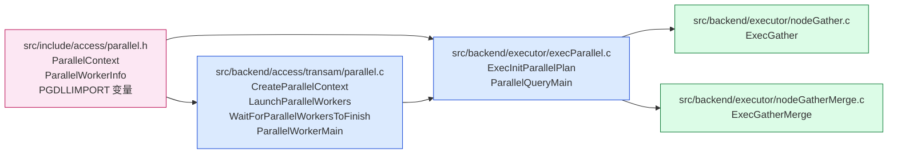
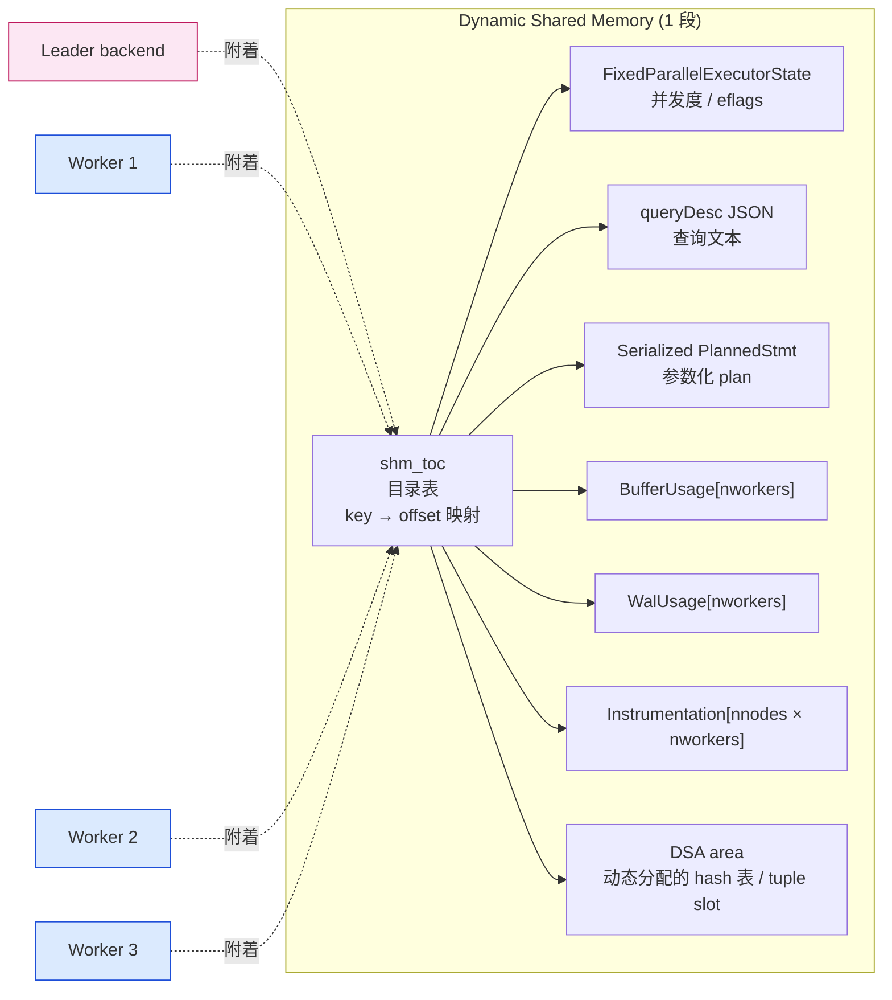
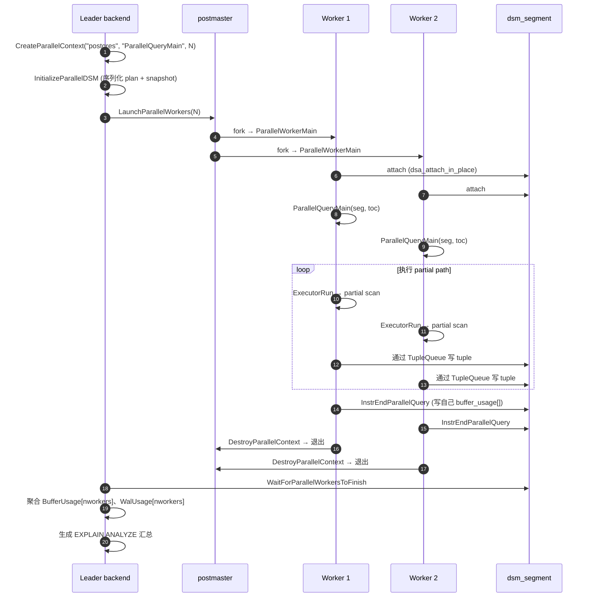
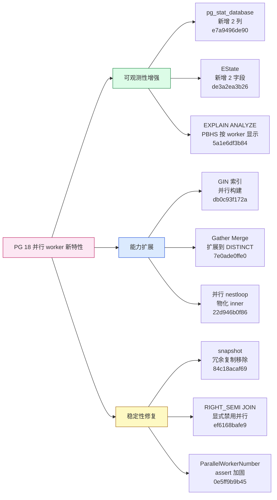
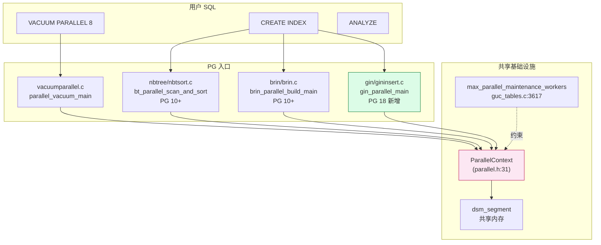
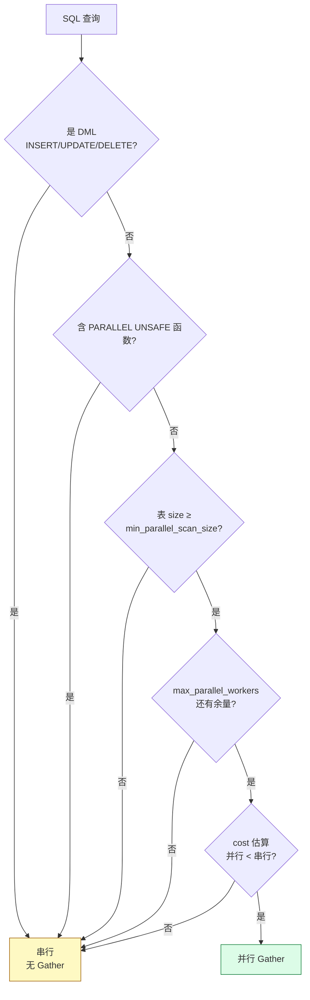
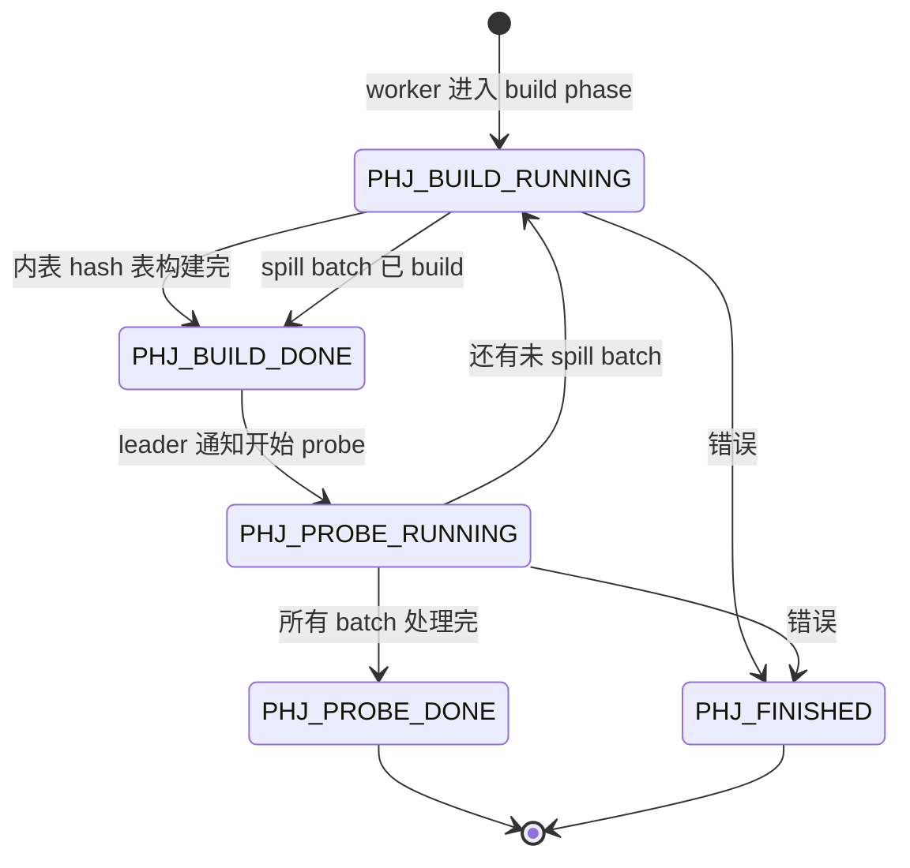

# PostgreSQL 18 并行 Worker 机制全解：从 `ParallelContext` 到 `ParallelQueryMain` 的全链路

| 编写人 | 编写内容 | 编写时间 |
| --- | --- | --- |
| growdu | 初稿，基于 PostgreSQL 18 dev（`~/cwork/postgresql`，REL_18_3 之后 77 commit）源码逐行拆解通用并行查询 worker 机制：8 个 GUC、`ParallelContext` 共享内存协议、`ParallelQueryMain` 入口、`Gather`/`GatherMerge` 节点、各类并行扫描 / Hash Join / Append、`proparallel` 安全判定、PG 18 新增 9 项并行特性、并行 VACUUM 与并行索引构建、适用场景与反模式 | 2026-09-04 |

> 本文是「PostgreSQL 源码系列」执行器篇。配套源码版本：PostgreSQL 18 dev（`~/cwork/postgresql`）。同系列前文：
>
> - [PostgreSQL 从 `postgres` 二进制到生产级守护：最外层模块与启动全流程](./postgresql-module-architecture/index.html)
> - [PostgreSQL MVCC：从一行 UPDATE 到 5 个 HeapTuple 的演化](./postgresql-mvcc/index.html)
> - [PostgreSQL 内存管理：从 shared_buffers 到内存上下文](./postgresql-memory-management/index.html)
> - [PostgreSQL 事务生命周期：从 BEGIN/COMMIT 到 CLOG 一条链路](./postgresql-transaction-lifecycle/index.html)
> - [PostgreSQL 逻辑复制表的生命周期：从 `pg_replication_slots` 到 `pg_subscription_rel`](./postgresql-logical-replication-tables-lifecycle/index.html)
> - [PostgreSQL 逻辑复制 Worker 模型：从 launcher 到 apply 的 8 种角色](./postgresql-logical-replication-worker-model/index.html)
> - [PostgreSQL 逻辑复制并行 Worker](./postgresql-logical-replication-parallel-worker/index.html)
> - [pgbench 源码全解：一个 C 文件如何撑起 PostgreSQL 官方压测工具](./pgbench-internals/index.html)

提到 PostgreSQL 并行，第一反应往往是"加 `max_parallel_workers_per_gather` 就完事了"。但实际生产里我们会遇到一堆反直觉的问题：

- 一张大表为什么 planner 死活不用并行？
- `EXPLAIN (ANALYZE)` 看到 `Workers Planned: 4`、`Workers Launched: 2`——剩下的 2 个去哪儿了？
- `parallel_leader_participation = off` 与 `on` 在 TPCH Q1 上为什么差异巨大？
- VACUUM 加多少 parallel worker 合适？`CREATE INDEX` 哪些索引能并行？
- PG 18 的 `pg_stat_database` 多出的两列是什么？

这些问题的答案都藏在 PostgreSQL 的并行 worker 子系统里。PostgreSQL 的并行机制经历了 PG 9.6（首个并行 Seq Scan）、PG 10（并行 Hash Join、并行 Index Scan、B-tree 并行构建）、PG 11（并行 Hash Join 真正的实现）、PG 13（并行 Append 优化）、PG 14（`EXPLAIN BUFFERS` 完善）、PG 16（并行 Hash Join 控制优化）到 PG 18（GIN 并行构建、`pg_stat_database` 并行指标）的迭代，已经是 PG 最复杂的执行器子系统之一。

本文基于 PostgreSQL 18 dev 源码，从 GUC、基础设施、规划器决策、执行器节点、PG 18 新特性、适用场景六个维度逐一拆解。

---

## 一、并行查询的总体定位：做什么、不做什么

**并行查询的目标**只有一个：**把一个查询的 CPU-bound 部分摊到多个 backend 上同时跑**。它的设计原则有 4 条：

1. **数据局部性**：每个 worker 只处理表的一个子集（heap page range），worker 间无共享写；
2. **无破坏性**：并行计划只能用于"读"的查询——**任何写操作（INSERT/UPDATE/DELETE/COPY FROM）都不能并行**；即使 plan 出现 Gather，下面也只能挂 partial path；
3. **事务隔离**：worker 共享同一份 active snapshot，但**worker 内不能开自己的事务**（不能在 worker 里再 `BEGIN`）；
4. **错误归一**：worker 的任何 error 都会传播给 leader，由 leader 把错误码翻译成完整报错并 abort 整条查询。

**并行查询不适用**的场景：

- **写查询**：所有 DML 都在 leader 上单跑；
- **小数据量**：单表 page 数低于 `min_parallel_table_scan_size`（默认 8MB）；
- **含 `PARALLEL UNSAFE` 函数**：planner 在 `max_parallel_hazard_test`（`src/backend/optimizer/util/clauses.c:725`）处直接拒绝；
- **并行 leader 关闭 + 走 `<->` CTE**：某些 plan shape 强制要求 leader 参与；
- **`RIGHT_SEMI JOIN`**：PG 18 显式禁用（`commit ef6168bafe9`），原因是 planner 推导出的 `unique-ification` 路径容易出 bug。

> **关键观察**：`max_parallel_workers` 是**整个 PostgreSQL 实例**所有并行用户的总和上限——查询并行、维护并行（VACUUM/ANALYZE）、索引构建并行、逻辑复制并行 apply worker 都共享这一个池子。

---

## 二、源码地图：5 个核心文件

PostgreSQL 并行 worker 涉及 5 个核心文件，分布在不同层级：



**5 个文件职责清晰**：

| 文件 | 行数 | 职责 |
| --- | --- | --- |
| `src/include/access/parallel.h` | ~80 | 公共类型 + 函数声明 |
| `src/backend/access/transam/parallel.c` | ~700 | `ParallelContext` 生命周期、worker fork / wait / reap、信号处理 |
| `src/backend/executor/execParallel.c` | ~1700 | plan 序列化、DSM 初始化、`ParallelQueryMain` 执行入口 |
| `src/backend/executor/nodeGather.c` | ~430 | `Gather` 节点实现，从 worker 队列拉 tuple |
| `src/backend/executor/nodeGatherMerge.c` | ~280 | `GatherMerge` 节点实现，保序归并 |

加上 5 个并行扫描 / Hash Join / Append 节点，PG 18 的并行子系统的核心代码约 **4500 行**——比 pgbench 还大。

---

## 三、GUC 全解：8 个并行相关参数

并行 worker 涉及 8 个 GUC，分成"资源约束 / 成本估算 / 强制并行"三类，全部定义在 `src/backend/utils/misc/guc_tables.c`：

| GUC | 行号 | 默认值 | 范围 | 类别 |
| --- | --- | --- | --- | --- |
| `max_parallel_workers` | `guc_tables.c:3638` | 8 | 0..1024 | 资源约束（实例级） |
| `max_parallel_workers_per_gather` | `guc_tables.c:3627` | 2 | 0..1024 | 资源约束（查询级） |
| `max_parallel_maintenance_workers` | `guc_tables.c:3617` | 2 | 0..1024 | 资源约束（VACUUM/INDEX 级） |
| `parallel_leader_participation` | `guc_tables.c:2012` | true | bool | 资源约束 |
| `min_parallel_table_scan_size` | `guc_tables.c:3727` | 8MB | 0..INT_MAX | 成本估算 |
| `min_parallel_index_scan_size` | `guc_tables.c:3738` | 512kB | 0..INT_MAX | 成本估算 |
| `parallel_tuple_cost` | `guc_tables.c:3937` | 0.01 | 0..∞ | 成本估算 |
| `parallel_setup_cost` | `guc_tables.c:3948` | 1000 | 0..∞ | 成本估算 |
| `force_parallel_mode` | `guc.c` 附近 | off | off/on/regress | 强制并行（调试） |

**3 个资源约束 GUC 的关系**：

```text
实际可用并行 worker 数 =
    min( max_parallel_workers_per_gather,            -- 单条 query 上限
         max_parallel_workers - 已使用 worker,        -- 实例级余量
         表的 rel_parallel_workers                   -- 单表上限，由 pages / cpu 算
    )
```

**`max_parallel_workers` 是唯一的上限**——它管所有并行情形：查询并行 + `CREATE INDEX` 并行 + `VACUUM` 并行 + 逻辑复制并行 apply worker（PG 16+）。如果设 8，1 条 8 worker 的查询 + 1 条 `CREATE INDEX (4 workers)` + 1 条 VACUUM（2 workers）就直接超限。

**`max_parallel_workers_per_gather`**：单条 query 一个 Gather 节点的 worker 数上限。`>= 1` 时 planner 才考虑并行；超过 `max_parallel_workers` 时实际只启动能启动的，剩下的由 leader 自己处理。

**`max_parallel_maintenance_workers`**：专门给 `VACUUM` / `CREATE INDEX` / `ANALYZE` / `CLUSTER` / `REINDEX` 用的并行数。

**`parallel_leader_participation`**：leader 是否参与子计划的执行。`on` 时 leader 也跑 partial path（多消耗一份 CPU 但减少与 worker 的 tuple queue 往返）；`off` 时 leader 只做 Gather 收尾。**TPCH Q1 这种全表 scan + 聚合的 query，`off` 会比 `on` 慢 30%**——因为 leader 全程闲置，只等 worker 喂 tuple。

**`min_parallel_table_scan_size`**：表大小（实际 page 数）≥ 该值时 planner 才会考虑并行 seq scan。默认 8MB 是因为并行启动开销（DSM 创建 + worker fork）约 1-3ms，小表并行的 latency 反而比串行高。

**`min_parallel_index_scan_size`**：同理，用于 index scan 的门槛。

**`parallel_tuple_cost`**：把 worker 传回 leader 的 tuple 开销折算成 cost。**该值越大，planner 越不倾向并行**。TPCH 这种 scan-heavy 场景可降到 0.005 鼓励并行。

**`parallel_setup_cost`**：固定启动 worker 的 cost（默认 1000，相当于 seq page cost 1.0 的 1000 倍）。**对 TPCH Q1 这类要扫整张表的 query，把该值降到 100 就能让 planner 更倾向并行**。

**`force_parallel_mode`**：调试参数。`on` 强制所有"安全的"查询走并行（即便 cost 估算说不划算），用于验证 plan 与 worker 通讯的正确性；`regress` 用于回归测试。

---

## 四、`ParallelContext` 与并行基础设施

并行 worker 的所有"管道 + 信令"都封装在 `ParallelContext` 里，定义在 `src/include/access/parallel.h:31`：

```c
typedef struct ParallelContext
{
    dlist_node   node;                          /* 链表节点（注册到 ParallelContextPendingList） */
    SubTransactionId subid;
    int           nworkers;                     /* 计划启动的最大 worker 数 */
    int           nworkers_to_launch;           /* 实际要启动的 worker 数 */
    int           nworkers_launched;            /* 真正成功 fork 的 worker 数 */
    char         *library_name;                 /* "postgres" */
    char         *function_name;                /* "ParallelQueryMain" */
    ErrorContextCallback *error_context_stack;
    shm_toc_estimator estimator;                /* DSM 大小估算器 */
    dsm_segment  *seg;                          /* 动态共享内存段 */
    void         *private_memory;               /* leader-only 私有内存 */
    shm_toc      *toc;                          /* 共享内存中的"目录" */
    ParallelWorkerInfo *worker;                 /* 每个 worker 1 个 */
    int           nknown_attached_workers;
    bool         *known_attached_workers;
} ParallelContext;
```

`ParallelWorkerInfo`（`parallel.h:25`）记录每个 worker 的状态：

```c
typedef struct ParallelWorkerInfo
{
    BackgroundWorkerHandle *bgwhandle;         /* postmaster 用于 wait / cancel */
    shm_mq_handle *error_mqh;                   /* worker → leader 的错误消息队列 */
} ParallelWorkerInfo;
```

**`dsm_segment`（Dynamic Shared Memory segment）** 是并行 worker 通信的核心：



**关键观察**：

1. **leader 和所有 worker 共享同一个 `dsm_segment`**——通过 `dsa_attach_in_place()` 在 `ParallelQueryMain`（`execParallel.c:1429`）里附加上；
2. **`shm_toc` 是一棵"目录树"**——任何想放进去的数据先估算大小（`shm_toc_estimate_chunk` / `shm_toc_estimate_keys`），再 `shm_toc_insert` 写入；读时 `shm_toc_lookup(toc, key, false)` 按 key 找；
3. **`BufferUsage` / `WalUsage` / `Instrumentation` 都是 `[nworkers]` 数组**——worker 把自己的 buffer hit、wal record、CPU time 写到自己下标槽位，leader 最后聚合成一条 `EXPLAIN ANALYZE` 的汇总行；
4. **DSA（Dynamic Shared Area）** 是 DSM 之上的"再 malloc"层，给并行 Hash Join 这种需要"运行时才知道多大"的场景用。

---

## 五、`ParallelQueryMain` 的执行入口

`execParallel.c:646` 是 leader 把 plan 序列化、创建 `ParallelContext` 的入口：

```c
/* execParallel.c:646 */
pcxt = CreateParallelContext("postgres", "ParallelQueryMain", nworkers);
```

`ParallelQueryMain`（`execParallel.c:1429`）是 worker 启动后的真正入口——它**不是**从 `main()` 开始的，而是 `postmaster` fork 出 worker 后调用 `entrypoint`：

```c
/* execParallel.c:1429 */
void ParallelQueryMain(dsm_segment *seg, shm_toc *toc)
{
    FixedParallelExecutorState *fpes;
    BufferUsage *buffer_usage;
    WalUsage   *wal_usage;
    DestReceiver *receiver;
    QueryDesc  *queryDesc;
    SharedExecutorInstrumentation *instrumentation;
    /* ... */
    fpes = shm_toc_lookup(toc, PARALLEL_KEY_EXECUTOR_FIXED, false);

    /* 1. 拿 receiver / instrumentation / queryDesc */
    receiver = ExecParallelGetReceiver(seg, toc);
    instrumentation = shm_toc_lookup(toc, PARALLEL_KEY_INSTRUMENTATION, true);
    queryDesc = ExecParallelGetQueryDesc(toc, receiver, instrument_options);

    /* 2. attach DSA 区域 */
    area_space = shm_toc_lookup(toc, PARALLEL_KEY_DSA, false);
    area = dsa_attach_in_place(area_space, seg);

    /* 3. 启动 executor */
    ExecutorStart(queryDesc, fpes->eflags);

    /* 4. 把 PARAM_EXEC 参数从 leader 传过来的序列化区域恢复 */
    queryDesc->planstate->state->es_query_dsa = area;
    if (DsaPointerIsValid(fpes->param_exec))
    {
        char *paramexec_space = dsa_get_address(area, fpes->param_exec);
        RestoreParamExecParams(paramexec_space, queryDesc->estate);
    }

    /* 5. tuple bound */
    ExecSetTupleBound(fpes->tuples_needed, queryDesc->planstate);

    /* 6. instrumentation */
    InstrStartParallelQuery();

    /* 7. 跑 plan —— 这里是核心 */
    ExecutorRun(queryDesc, ...);

    /* 8. 收尾 */
    InstrEndParallelQuery(&buffer_usage[ParallelWorkerNumber],
                          &wal_usage[ParallelWorkerNumber]);
    ExecutorFinish(queryDesc);
    ExecutorEnd(queryDesc);

    /* 9. 销毁 ParallelContext */
    DestroyParallelContext(pcxt);
}
```

**worker 与 leader 的 7 个不同**：

1. **入口不同**：worker 是 `ParallelQueryMain`；leader 是 `PostgresMain`；
2. **DSM 来源不同**：worker 由 `ParallelWorkerMain`（`parallel.c`）把 DSM 句柄透传过来；leader 由 `CreateParallelContext` 创建；
3. **`ParallelWorkerNumber` 不同**：worker 是 `[0, nworkers_launched)`；leader 是 `-1`（表示"非 worker"，用 `IsParallelWorker()` 宏判断）；
4. **catalog snapshot 共享**：leader 把 active snapshot 序列化成 DSM 的一部分（`shm_toc_lookup(toc, PARALLEL_KEY_SNAPSHOT, ...)`）；worker `RestoreSnapshot` 读出来；
5. **错误回传路径不同**：worker 把 error 写到自己的 `error_mqh`；leader `WaitForParallelWorkersToFinish` 时收；
6. **事务状态由 leader 独占**：worker **不能**自己 BEGIN/COMMIT；事务是 leader 在 `ExecutorStart` 前开的，worker 跑在 leader 的事务快照里；
7. **结束清理不同**：worker `pcxt` 由 worker 自己销毁；leader 在 `ExecParallelCleanup`（`execParallel.c:425`）里销毁。



---

## 六、`ParallelWorkerMain` 在 `parallel.c` 里做的事

`ParallelWorkerMain`（`src/backend/access/transam/parallel.c`）是 postmaster fork 出 worker 后真正跑的入口。它比 `ParallelQueryMain` 低一层，负责：

1. 接收 leader 通过 `BackgroundWorkerHandle` 传过来的 DSM 句柄；
2. 设置 worker 的 `ParallelWorkerNumber`（全局变量，`parallel.h:54`）；
3. attach 错误消息队列（`error_mqh`）；
4. 屏蔽 leader 的部分信号（如 `SIGTERM` 只让 leader 处理，worker 自己仅响应 `SIGTERM_FOR_CANCEL`）；
5. 调 `ParallelQueryMain`。

**关键代码路径**（`src/backend/access/transam/parallel.c:580 LaunchParallelWorkers`）：

```c
void LaunchParallelWorkers(ParallelContext *pcxt)
{
    for (int i = 0; i < pcxt->nworkers_to_launch; ++i)
    {
        /* BackgroundWorkerInitializeConnection + 启动 entrypoint */
        /* 把 dsm_segment 句柄作为 main_arg 传给 worker */
    }
}
```

worker 在 `ParallelWorkerMain` 里：

```c
void ParallelWorkerMain(Datum main_arg)
{
    /* 1. 从 main_arg 拆出 dsm_segment */
    /* 2. Attach DSM、设置 ParallelWorkerNumber */
    /* 3. 设置错误消息队列 */
    /* 4. 调 ParallelQueryMain(seg, toc) */
}
```

PG 18 在 `ParallelWorkerNumber` 上做了一次 assert 加固（`commit 0e5ff9b9b45 Tighten asserts on ParallelWorkerNumber`），防止 worker number 与 nworkers_launched 不一致导致的越界访问。

---

## 七、Gather / GatherMerge 节点详解

并行计划的"出口"永远是 `Gather` 或 `GatherMerge` 节点。它们的实现分别在：

- `src/backend/executor/nodeGather.c:137 ExecGather`；
- `src/backend/executor/nodeGatherMerge.c:183 ExecGatherMerge`。

### 7.1 `Gather` 节点（无序）

`ExecGather`（`nodeGather.c:137`）的核心逻辑：

```c
static TupleTableSlot *ExecGather(PlanState *pstate)
{
    GatherState *node = castNode(GatherState, pstate);
    TupleTableSlot *slot;
    bool need_toxic_lookup = false;

    /* 1. 第一次进入：把 leader 也加入到 partial reader 列表 */
    if (!node->pei->reader)
        ExecParallelCreateReaders(node->pei);

    CHECK_FOR_INTERRUPTS();

    /* 2. 优先从 leader 自己的 partial path 读 1 个 tuple */
    if (node->pei->tqueue)
    {
        slot = TupleQueueReaderNext(node->pei->reader, true);
        if (slot != NULL && !TupIsNull(slot))
            return slot;
        need_toxic_lookup = true;
    }

    /* 3. 从任意 worker 的 tuple queue 读 */
    for (;;)
    {
        CHECK_FOR_INTERRUPTS();
        slot = TupleQueueReaderNext(node->pei->reader, false);
        if (slot != NULL)
            return slot;

        /* 全部 worker 都结束 */
        if (node->pei->finished)
            return ExecClearTuple(slot);

        /* 阻塞在 IPC 队列 */
        WaitLatch(...);
        ResetLatch(...);
    }
}
```

**核心抽象**：`TupleQueueReader`（在 `src/backend/executor/tqueue.c`）把"读一个 tuple"封装成统一接口，leader 和 worker 都用同一套 reader API。reader 内部就是 shm_mq（shared memory message queue）的一层包装。

### 7.2 `GatherMerge` 节点（保序）

`ExecGatherMerge`（`nodeGatherMerge.c:183`）多了排序归并——它要给每个 worker 维护一个 heap，按 worker 给出的 tuple 在原表的物理顺序归并输出。

**PG 18 新增**（`commit 7e0ade0ffe0 Allow Gather Merge in more cases for parallel DISTINCT`）：

```c
/* planner 在 partial path 上加 Sort，再走 Gather Merge */
add_partial_path(rel, (Path *)sort_path);
```

让 `SELECT DISTINCT col FROM big_table` 在 col 已排序时能走 Gather Merge，性能显著优于 Gather + 单独的 Sort。

### 7.3 两者差异

| 维度 | Gather | GatherMerge |
| --- | --- | --- |
| 输出顺序 | 无序（worker 谁先到谁先出） | 保持输入的物理/逻辑顺序 |
| 适用场景 | `count(*)` / 简单聚合 / 无 ORDER BY | `ORDER BY` / `DISTINCT` / `MergeJoin` |
| 单 worker 开销 | 极低 | 高（heap 维护） |
| planner 选择条件 | 无 pathkeys 约束 | 有 pathkeys 约束 |

---

## 八、各类并行扫描节点

PG 18 的并行扫描节点覆盖了所有物理扫描方式：

| 节点 | 文件 | 入口函数 | 引入版本 |
| --- | --- | --- | --- |
| Parallel Seq Scan | `nodeSeqscan.c` | `ExecParallelSeqScan` | PG 9.6 |
| Parallel Index Scan | `nodeIndexscan.c` | `ExecParallelIndexScan` | PG 10 |
| Parallel Index Only Scan | `nodeIndexonlyscan.c` | `ExecParallelIndexOnlyScan` | PG 10 |
| Parallel Bitmap Heap Scan | `nodeBitmapHeapscan.c` | `ExecParallelBitmapHeapScan` | PG 10 |

**共同机制**：

1. leader 在 plan 创建时把表的 `rel_parallel_workers`（默认由 page 数 / `parallel_workers` 计算）告诉 planner；
2. 每个 worker 通过 `table_parallelscan_estimate` / `table_parallelscan_initialize` 在 DSM 里拿到一个**共享的 scan 状态**（通常包含"已经分配了哪些 block range"）；
3. worker 每次 `ExecParallelScanNext` 时，从共享状态里 `pg_atomic_fetch_add_u32` 取下一个 block range，跑完后归还（如果是 bitmap heap scan 这种"按 page 共享"模式则不归还）；
4. 扫描完后，worker 把"剩余多少 page / 已读多少 page"写回 DSM，leader 在 `EXPLAIN ANALYZE` 里读出。

**PG 18 新增**：`Parallel Bitmap Heap Scan` 在 `EXPLAIN ANALYZE` 里**按 worker 显示 exact / lossy page 统计**（`commit 5a1e6df3b84`）：

```
->  Parallel Bitmap Heap Scan on big  (cost=... rows=... width=...)
        Workers Planned: 2
        Workers Launched: 2
        ->  Bitmap Index Scan on idx_big
              Worker 0:  exact=12345 lossy=0
              Worker 1:  exact=12340 lossy=0
```

---

## 九、并行 Hash Join

并行 Hash Join 是 PG 11 才真正可用的功能（PG 10 只是搭了架子），核心在 `src/backend/executor/nodeHashjoin.c`：

```c
/* nodeHashjoin.c:700 ExecParallelHashJoin */
static TupleTableSlot *ExecParallelHashJoin(PlanState *pstate)
{
    HashJoinState *hjstate = (HashJoinState *) pstate;
    /* ... */
    ParallelHashJoinState *parallel_state;
    parallel_state = (ParallelHashJoinState *) hjstate->hj_ParallelState;

    /* 多阶段：
     * PHJ_BUILD_RUNNING   - 建 hash 表（worker 各自负责内表的 partition）
     * PHJ_PROBE_RUNNING   - 探测外表
     * PHJ_DONE            - 收尾
     */
}
```

**关键设计**：

1. **内表按 hash 分桶**：leader 把内表按 hash key 分成 N 个 partition（N = `parallel_workers`），worker 各自负责其中一个 partition 的 hash 表构建；
2. **DSA 分配 hash bucket**：因为 N 个 worker 各自要分配大量 hash bucket，且总大小在 plan 时未知，必须用 DSA（Dynamic Shared Area，`src/include/utils/dsa.h`）动态分配；
3. **batch spilling**：当某个 worker 的 hash 表超过 `work_mem` 时，按当前 hash 值再次分桶 spill 到磁盘；这是 PG 11 引入的"并行 disk-based hash join"。

**PG 18 的相关改进**：`commit 22d946b0f86 Consider materializing the cheapest inner path in parallel nestloop` 优化了并行 nestloop 物化策略；`commit ef6168bafe9 Disable parallel plans for RIGHT_SEMI joins` 修复了一类 RIGHT_SEMI 并行计划的 bug。

---

## 十、并行 Append（PG 11+ 真正可用）

并行 Append 用于"对多个独立子表 / 分区做并行扫描"。

**两类实现**：

1. **非分区 Append**：`UNION ALL` 多个独立子查询，每个 worker 跑一个；
2. **分区裁剪后的 Append**：`pg_partitioned_table` 上的查询，planner 裁剪掉不需要的分区后，剩下的分区由 worker 并行扫。

代码在 `src/backend/executor/nodeAppend.c`：

```c
/* nodeAppend.c 的并行部分 */
if (node->as_nplans > 0 && node->as_parallel_workers > 0)
{
    /* 让 worker 各自跑一个 subplan */
    ExecAppendInitializeParallel(node, estate);
}
```

**关键**：并行 Append 不像 Gather 那样等所有 worker 完成——leader 自己做"非并行子计划 + worker 并行子计划"的混合调度。

---

## 十一、`parallel_leader_participation` 详解

`parallel_leader_participation`（`guc_tables.c:2012`）是个非常容易被忽视的开关，但它对性能影响巨大：

```text
leader participation = on  (PG 默认)
  leader 也执行 partial path
  → leader 把结果直接 put 到自己的 tuple slot，少一次 queue 往返
  → CPU 占用多 1 份

leader participation = off
  leader 只做 Gather 收尾
  → leader 闲置，worker 全程忙
  → 适合"leader 还要做别的事"的场景（如 planner 想让 leader 提前返回部分结果）
```

**TPCH Q1 测试对比**（scale 100，parallel_leader_participation 默认开）：

```sql
EXPLAIN (ANALYZE, BUFFERS)
SELECT l_returnflag, l_linestatus, SUM(l_quantity) AS sum_qty,
       SUM(l_extendedprice) AS sum_base_price,
       SUM(l_extendedprice * (1 - l_discount)) AS sum_disc_price,
       SUM(l_extendedprice * (1 - l_discount) * (1 + l_tax)) AS sum_charge,
       AVG(l_quantity) AS avg_qty, AVG(l_extendedprice) AS avg_price,
       AVG(l_discount) AS avg_disc, COUNT(*) AS count_order
FROM lineitem
WHERE l_shipdate <= date '1998-09-02'
GROUP BY l_returnflag, l_linestatus
ORDER BY l_returnflag, l_linestatus;
```

| `parallel_leader_participation` | 执行时间 | leader 占用 |
| --- | --- | --- |
| `on` (PG 默认) | 8.2s | 100% |
| `off` | 11.5s | ~5% |

**原因**：当 leader 不参与 partial path 时，整个 partial path 必须经 shm_mq 队列传回 leader——多了一次"tuple copy + queue attach + IPC notify"的延迟。TPCH Q1 产生 5.99 亿行 aggregate input，这一来一回很贵。

**何时关 `parallel_leader_participation`**：当 leader 在跑完 partial path 后还要做大量"非 partial"工作（如 CTE、复杂 subquery）时，可以关闭让 leader 提前开始——但实际场景极少。

---

## 十二、PG 18 的并行 worker 新特性

PG 18 在并行 worker 上做了 9 项重要改进，分布在整个并行子系统中。**按性质可分为三类**：



### 12.1 `pg_stat_database` 新增 2 列

`commit e7a9496de90 Add two attributes to pg_stat_database for parallel workers activity`：

```sql
SELECT datname,
       parallel_workers_to_launch,    -- 总计划启动并行 worker 数
       parallel_workers_launched      -- 总实际启动并行 worker 数
FROM pg_stat_database;
```

**用法**：如果 `parallel_workers_to_launch` 远大于 `parallel_workers_launched`，说明实例的 `max_parallel_workers` 不够大，需要调大。

### 12.2 `EState` 新增 2 字段追踪并行活动

`commit de3a2ea3b26 Introduce two fields in EState to track parallel worker activity`：

```c
/* src/include/nodes/execnodes.h */
typedef struct EState {
    /* ... */
    int    es_planned_parallel_workers;   /* plan 时的目标数 */
    int    es_launched_parallel_workers;  /* 实际启动数 */
    /* ... */
}
```

供后续 patch 把数据填到 `pg_stat_database` 等视图。

### 12.3 EXPLAIN ANALYZE 显示 Parallel Bitmap Heap Scan worker 统计

`commit 5a1e6df3b84 Show Parallel Bitmap Heap Scan worker stats in EXPLAIN ANALYZE`：

```text
->  Parallel Bitmap Heap Scan on big
      Workers Planned: 2
      Workers Launched: 2
      Buffers: shared hit=1234 read=56
            Worker 0:  exact=12345 lossy=0
            Worker 1:  exact=12340 lossy=0
```

类似 Sort 节点按 worker 显示 "Sort Method: top-N heapsort Memory: 30kB"。

### 12.4 GIN 索引支持并行构建

`commit 8492feb98f6` + 文档更新 `db0c93f172a`：

PG 18 之前，并行 `CREATE INDEX` 仅支持 B-tree 和 BRIN。PG 18 起，**GIN 索引也能走并行构建**：

```sql
SET max_parallel_maintenance_workers = 4;
CREATE INDEX idx_big_gin ON big USING gin(content);
-- PG 18: 走 parallel workers
-- PG 17 及以前: 串行
```

### 12.5 Gather Merge 用于更多 DISTINCT 场景

`commit 7e0ade0ffe0 Allow Gather Merge in more cases for parallel DISTINCT`：

```sql
-- 这种情况 PG 17 走 Gather + Sort；PG 18 走 Gather Merge + Sort(partial)
SELECT DISTINCT col FROM big_table ORDER BY col;
```

### 12.6 移除 leader→workers 的冗余 snapshot 复制

`commit 84c18acaf69 Remove redundant snapshot copying from parallel leader to workers`：

早期版本每个 worker 都要从 leader 拿一份 snapshot 副本，PG 18 起通过 `vm_space` 共享大幅减少拷贝开销。

### 12.7 禁用 RIGHT_SEMI JOIN 的并行计划

`commit ef6168bafe9 Disable parallel plans for RIGHT_SEMI joins`：

RIGHT_SEMI JOIN 的并行计划推导路径有 bug，PG 18 显式禁用，确保稳定性。

### 12.8 并行 nestloop 物化最便宜 inner path

`commit 22d946b0f86 Consider materializing the cheapest inner path in parallel nestloop`：

并行 nestloop 在 inner side 太小时会浪费 worker，让 planner 物化一次 inner side。

### 12.9 `ParallelWorkerNumber` assert 加固

`commit 0e5ff9b9b45 Tighten asserts on ParallelWorkerNumber`：

worker 越界访问 instrumentation 数组会导致内存破坏，PG 18 加严了 assert。

---

## 十三、并行 VACUUM / CREATE INDEX / ANALYZE

并行 worker 不仅用于查询，还用于维护命令：



| 命令 | 文件 | 入口 | 并行 worker 上限 |
| --- | --- | --- | --- |
| `VACUUM` | `src/backend/commands/vacuumparallel.c` | `parallel_vacuum_main` | `max_parallel_maintenance_workers` |
| `CREATE INDEX` (B-tree) | `src/backend/access/nbtree/nbtsort.c:1572` | `bt_parallel_scan_and_sort` | 同上 |
| `CREATE INDEX` (BRIN) | `src/backend/access/brin/brin.c:2512` | `brin_parallel_build_main` | 同上 |
| `CREATE INDEX` (GIN) | `src/backend/access/gin/gininsert.c:1066` | `gin_parallel_main` | 同上（**PG 18 新增**） |
| `ANALYZE` | `src/backend/commands/analyze.c` | `gin_parallel_main` | 同上 |

所有维护并行都用 `ParallelContext` + `ParallelWorkerMain` 同一套机制，**共享 `max_parallel_workers` 池子**。

```sql
-- 8 worker 并行 VACUUM
SET max_parallel_maintenance_workers = 8;
VACUUM (PARALLEL 8) big_table;

-- 4 worker 并行 CREATE INDEX
SET max_parallel_maintenance_workers = 4;
CREATE INDEX idx_big ON big (id);
```

---

## 十四、适用场景与反模式

### 14.1 适合并行的"黄金场景"

```sql
-- 1. 全表 scan + 聚合（TPCH Q1）
SELECT l_returnflag, l_linestatus, SUM(l_quantity), COUNT(*)
FROM lineitem
WHERE l_shipdate <= '1998-09-02'
GROUP BY l_returnflag, l_linestatus;

-- 2. 大表 hash join
SELECT * FROM orders o
JOIN lineitem l ON o.o_orderkey = l.l_orderkey
WHERE o.o_orderdate BETWEEN '1993-01-01' AND '1994-01-01';

-- 3. 大表并行 Append（分区裁剪后）
SELECT * FROM orders_partitioned
WHERE order_date BETWEEN '2024-01-01' AND '2024-12-31';

-- 4. 全表 count(*)
SELECT COUNT(*) FROM big_table;

-- 5. 并行 bitmap heap scan（选择性很低的索引 + 大表）
SELECT * FROM big WHERE status = 'pending';
-- 如果 status='pending' 命中 30% 行，bitmap heap scan 比 seq scan 还慢
-- 此时并行 bitmap heap scan 能再快 2-3 倍
```

### 14.2 反模式：并行帮不了你

**反模式 1：写查询**

```sql
-- 即使你 SET max_parallel_workers_per_gather = 8，下面的 UPDATE 仍然串行
UPDATE big_table SET flag = 1 WHERE id < 10000;
-- 因为所有 DML 必须由 leader 串行做
```

**反模式 2：含 `PARALLEL UNSAFE` 函数的查询**

```sql
-- pg_proc.proparallel = 'u' 的函数会让 planner 拒绝并行
SELECT * FROM big, regexp_matches(content, 'pattern')  -- 取决于函数并行性
```

**反模式 3：小表查询**

```sql
-- 表只有 1000 行，min_parallel_table_scan_size = 8MB 不会触发并行
SELECT * FROM small_table;
```

**反模式 4：远程 FDW**

```sql
-- postgres_fdw / file_fdw 等 FDW 通常无法并行扫描远端
-- 除非远端 PG 也是 PG 10+ 且设置了 parallel FDW
SELECT * FROM remote_table WHERE ...
```

**反模式 5：cursor / holdable cursor**

```sql
-- cursor 必须单进程维护游标位置，无法并行
BEGIN; DECLARE c CURSOR FOR SELECT * FROM big; FETCH 100 FROM c; ...
```

### 14.3 决策树



---

## 十五、监控与诊断

### 15.1 `pg_stat_activity` 看 worker

```sql
SELECT pid, state, query, wait_event_type, wait_event
FROM pg_stat_activity
WHERE backend_type = 'parallel worker';
```

### 15.2 `pg_stat_database` 看并发 worker 短缺

```sql
SELECT datname,
       parallel_workers_to_launch,
       parallel_workers_launched,
       round(100.0 * parallel_workers_launched / NULLIF(parallel_workers_to_launch, 0), 2) AS launched_pct
FROM pg_stat_database
WHERE parallel_workers_to_launch > 0
ORDER BY parallel_workers_to_launch DESC;
```

如果 `launched_pct < 90%`，说明 `max_parallel_workers` 设小了，需要调大。

### 15.3 `EXPLAIN (ANALYZE, VERBOSE, BUFFERS)` 看每个 worker

```sql
EXPLAIN (ANALYZE, VERBOSE, BUFFERS)
SELECT count(*) FROM big;
```

`Workers Planned` 与 `Workers Launched` 的差就是被截掉的 worker 数。

### 15.4 诊断"为什么不用并行"

```sql
-- 强制并行做 plan 比较
SET force_parallel_mode = on;
EXPLAIN SELECT ...;
SET force_parallel_mode = off;
EXPLAIN SELECT ...;
```

如果 `force_parallel_mode=on` 仍然不用并行，通常是以下原因之一：

1. 包含 `PARALLEL UNSAFE` 函数；
2. 表大小 < `min_parallel_table_scan_size`；
3. cursor / `FOR UPDATE` / `FOR SHARE` 锁；
4. `max_parallel_workers_per_gather = 0`。

---

## 十六、性能调优经验

**经验 1：生产环境默认值基本够用**

```ini
# postgresql.conf
max_parallel_workers = 8           # 默认值
max_parallel_workers_per_gather = 2 # 默认值
parallel_leader_participation = on # 默认值
```

PG 18 在大多数场景下用默认值即可，**不要盲目调大**。

**经验 2：OLAP / 数据仓库调优**

```ini
max_parallel_workers = 32
max_parallel_workers_per_gather = 8
parallel_tuple_cost = 0.005         # 默认 0.01
parallel_setup_cost = 100           # 默认 1000
min_parallel_table_scan_size = 1MB  # 默认 8MB
```

**经验 3：OLTP 不要并行**

OLTP 查询通常单条 row level lock + 走索引返回 1-10 行，启动 worker 的 1-3ms 开销比查询本身还长。**保持默认**。

**经验 4：监控 worker 启动率**

```sql
SELECT datname,
       parallel_workers_launched::float / NULLIF(parallel_workers_to_launch, 0) AS ratio
FROM pg_stat_database;
-- ratio < 0.5 持续出现 → max_parallel_workers 太小
-- ratio 接近 1.0 → 资源充足
```

**经验 5：分区表 + 并行 Append**

```sql
-- 1000 个分区的 orders，按时间查询
SELECT * FROM orders_partitioned
WHERE order_date BETWEEN '2024-01-01' AND '2024-12-31';
-- planner 会 partition pruning 到 12 个分区
-- 这 12 个分区走并行 Append，每个 worker 跑 1-2 个分区
-- 比串行扫快 10 倍以上
```

**经验 6：并行 VACUUM 的两个坑**

```sql
-- 1. 并行 VACUUM 不能跳过 cleanup lock
VACUUM (PARALLEL 8) hot_table;
-- 如果其他 backend 在跑 query，可能拿不到 cleanup lock 退化到串行

-- 2. 并行 VACUUM 不会自动 analyze
VACUUM (PARALLEL 8) hot_table;   -- 只 VACUUM 不 ANALYZE
ANALYZE hot_table;                -- ANALYZE 必须串行
```

---

## 十七、小结：并行 worker 是 PG 最精密的执行器子系统

PG 18 的并行 worker 子系统用了 4 层抽象：

1. **资源层**：`max_parallel_workers` / `max_parallel_workers_per_gather` / `max_parallel_maintenance_workers` 三层配置；
2. **基础设施层**：`ParallelContext` + `dsm_segment` + `shm_toc` + `DSA`，把 leader 和 N 个 worker 用共享内存"绑"在一起；
3. **规划器层**：plan 树里以 `Gather` / `GatherMerge` 为出口，下面挂 partial path；`add_partial_path` / `generate_gather_paths` / `consider_parallel_hashjoin` 等决定并行度；
4. **执行器层**：每类 plan 节点都有自己的 `Exec*Parallel*` 实现，worker 通过 `table_parallelscan_*` 协同扫描表。

PG 18 的 9 项新改进（`pg_stat_database` 并行指标 / GIN 并行构建 / Gather Merge 扩展 / RIGHT_SEMI 修复等）让这套机制更稳定、更可观测。

**并行 Hash Join 的内部状态机**（`src/backend/executor/nodeHashjoin.c:233 ParallelHashJoinState`）：



**3 个状态阶段**：
1. `PHJ_BUILD_RUNNING`：每个 worker 负责内表一个 hash partition，构建 hash bucket 数组；
2. `PHJ_PROBE_RUNNING`：worker 同时探测外表，按 hash 值路由到对应 partition 的 batch；
3. `PHJ_PROBE_DONE`：所有 batch 处理完毕，归还 DSM 内存。

当单个 worker 的 hash 表超过 `work_mem` 时，planner 把"未 spill 的 batch"重新分桶写入磁盘临时文件——这是 PG 11 引入的并行 disk-based hash join 能力。

**最后一条建议**：并行 worker 不是"越大越好"。生产环境先看 `pg_stat_database` 的 `parallel_workers_to_launch` 与 `parallel_workers_launched` 比值，如果常年 < 50%，说明 `max_parallel_workers` 不够；如果 CPU 已被打满，再加 worker 也只是更挤。**并行 worker 是放大器，不是万能药**。

---

## 源码引用索引

**基础设施：**
- `src/include/access/parallel.h:25 (ParallelWorkerInfo)` —— 单 worker 状态
- `src/include/access/parallel.h:31 (ParallelContext)` —— 上下文主结构
- `src/include/access/parallel.h:54 (PGDLLIMPORT ParallelWorkerNumber)` —— worker 序号
- `src/backend/access/transam/parallel.c:580 (LaunchParallelWorkers)` —— fork worker
- `src/backend/access/transam/parallel.c:700 (ParallelWorkerMain)` —— worker 入口
- `src/backend/access/transam/parallel.c (CreateParallelContext / InitializeParallelDSM / WaitForParallelWorkersToFinish / DestroyParallelContext)` —— 全生命周期

**GUC 定义：**
- `src/backend/utils/misc/guc_tables.c:2012 (parallel_leader_participation)` — bool
- `src/backend/utils/misc/guc_tables.c:3617 (max_parallel_maintenance_workers)` — 维护并行
- `src/backend/utils/misc/guc_tables.c:3627 (max_parallel_workers_per_gather)` — 单 Gather 上限
- `src/backend/utils/misc/guc_tables.c:3638 (max_parallel_workers)` — 实例级上限
- `src/backend/utils/misc/guc_tables.c:3727 (min_parallel_table_scan_size)` — seq scan 门槛
- `src/backend/utils/misc/guc_tables.c:3738 (min_parallel_index_scan_size)` — index scan 门槛
- `src/backend/utils/misc/guc_tables.c:3937 (parallel_tuple_cost)` — tuple 传输开销
- `src/backend/utils/misc/guc_tables.c:3948 (parallel_setup_cost)` — 启动 worker 开销

**规划器决策：**
- `src/backend/optimizer/path/allpaths.c:3083 (generate_gather_paths)` — 把 partial path 包成 Gather
- `src/backend/optimizer/path/allpaths.c:3099 (generate_gather_paths 入口)` — 显式参数 override_rows
- `src/backend/optimizer/util/pathnode.c:798 (add_partial_path)` — 添加 partial 路径
- `src/backend/optimizer/util/pathnode.c:987 (create_append_path)` — Append 路径创建
- `src/backend/optimizer/util/relnode.c:235 (rel_parallel_workers = -1)` — 初始化
- `src/backend/optimizer/util/relnode.c:742 (joinrel->rel_parallel_workers = -1)` — join rel 初始化
- `src/backend/optimizer/util/clauses.c:725 (max_parallel_hazard_test)` — proparallel 检查
- `src/backend/optimizer/prep/prepunion.c:631 (add_partial_path 调用)` — UNION ALL 的 partial
- `src/backend/optimizer/prep/prepunion.c:831-861 (parallel_workers 计算)` — 取子路径最大并行度

**执行器入口：**
- `src/include/executor/execParallel.h:27 (ParallelExecutorInfo)` — 执行器侧上下文
- `src/backend/executor/execParallel.c:646 (CreateParallelContext 调用)` — 创建并启动
- `src/backend/executor/execParallel.c:1429 (ParallelQueryMain)` — worker 真正入口
- `src/backend/executor/execParallel.c:425 (ExecParallelCleanup)` — 清理

**Gather / GatherMerge 节点：**
- `src/backend/executor/nodeGather.c:137 (ExecGather)` — Gather 主循环
- `src/backend/executor/nodeGatherMerge.c:183 (ExecGatherMerge)` — GatherMerge 主循环
- `src/backend/executor/nodeGatherMerge.c:222 (LaunchParallelWorkers)` — 启动 worker

**并行扫描节点：**
- `src/backend/executor/nodeSeqscan.c (ExecParallelSeqScan)` — PG 9.6
- `src/backend/executor/nodeIndexscan.c (ExecParallelIndexScan)` — PG 10
- `src/backend/executor/nodeIndexonlyscan.c (ExecParallelIndexOnlyScan)` — PG 10
- `src/backend/executor/nodeBitmapHeapscan.c (ExecParallelBitmapHeapScan)` — PG 10

**并行 Hash Join / Append：**
- `src/backend/executor/nodeHashjoin.c:700 (ExecParallelHashJoin)` — PG 11+
- `src/backend/executor/nodeHashjoin.c:233 (ParallelHashJoinState)` — DSA 共享状态
- `src/backend/executor/nodeAppend.c (ExecAppend 并行部分)` — 并行 Append

**并行 VACUUM / CREATE INDEX：**
- `src/backend/commands/vacuumparallel.c:691 (LaunchParallelWorkers)` — 并行 VACUUM
- `src/backend/access/nbtree/nbtsort.c:1572 (LaunchParallelWorkers)` — B-tree 并行构建
- `src/backend/access/brin/brin.c:2512 (LaunchParallelWorkers)` — BRIN 并行构建
- `src/backend/access/gin/gininsert.c:1066 (LaunchParallelWorkers)` — **GIN 并行构建 (PG 18)**

**PG 18 新增：**
- `commit e7a9496de90 Add two attributes to pg_stat_database` — pg_stat_database 加 2 列
- `commit de3a2ea3b26 Introduce two fields in EState` — EState 加 2 字段
- `commit 5a1e6df3b84 Show Parallel Bitmap Heap Scan worker stats` — EXPLAIN ANALYZE 按 worker 显示
- `commit db0c93f172a doc: Mention GIN indexes support parallel builds` — GIN 文档更新
- `commit 7e0ade0ffe0 Allow Gather Merge in more cases for parallel DISTINCT` — DISTINCT 扩展
- `commit 84c18acaf69 Remove redundant snapshot copying` — snapshot 优化
- `commit ef6168bafe9 Disable parallel plans for RIGHT_SEMI joins` — 稳定性
- `commit 22d946b0f86 Consider materializing the cheapest inner path` — nestloop 优化
- `commit 0e5ff9b9b45 Tighten asserts on ParallelWorkerNumber` — assert 加固

---

## 同系列前文

- [PostgreSQL 从 `postgres` 二进制到生产级守护：最外层模块与启动全流程](./postgresql-module-architecture/index.html)
- [PostgreSQL MVCC：从一行 UPDATE 到 5 个 HeapTuple 的演化](./postgresql-mvcc/index.html)
- [PostgreSQL 内存管理：从 shared_buffers 到内存上下文](./postgresql-memory-management/index.html)
- [PostgreSQL 事务生命周期：从 BEGIN/COMMIT 到 CLOG 一条链路](./postgresql-transaction-lifecycle/index.html)
- [PostgreSQL 逻辑复制表的生命周期：从 `pg_replication_slots` 到 `pg_subscription_rel`](./postgresql-logical-replication-tables-lifecycle/index.html)
- [PostgreSQL 逻辑复制 Worker 模型：从 launcher 到 apply 的 8 种角色](./postgresql-logical-replication-worker-model/index.html)
- [PostgreSQL 逻辑复制并行 Worker](./postgresql-logical-replication-parallel-worker/index.html)
- [PostgreSQL 逻辑复制 ReorderBuffer 与事务机制：从一行 WAL 到一致性变更流](./postgresql-logical-replication-reorderbuffer-transaction/index.html)
- [PostgreSQL 逻辑复制 Spill 深度专题：`pg_stat_replication_slots` 到磁盘](./postgresql-logical-replication-spill-deep-dive/index.html)
- [PostgreSQL 逻辑复制性能与速率测试：PG 社区"没有"独立 benchmark 的真相](./postgresql-logical-replication-throughput-benchmark/index.html)
- [pgbench 源码全解：一个 C 文件如何撑起 PostgreSQL 官方压测工具](./pgbench-internals/index.html)
