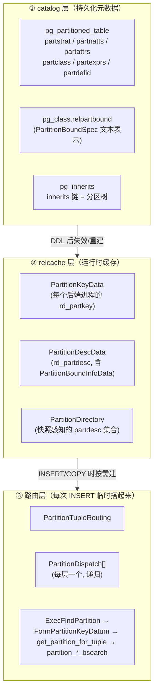
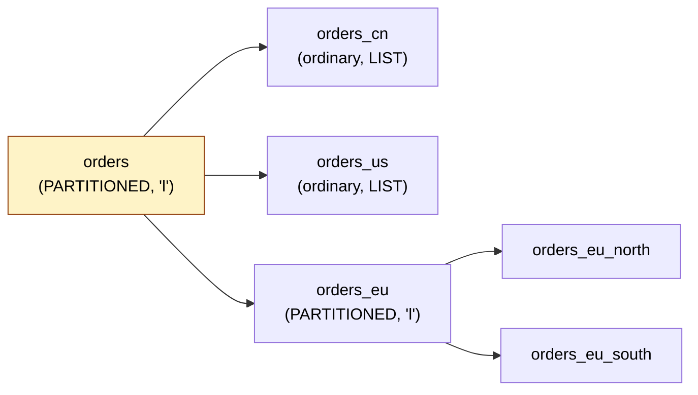
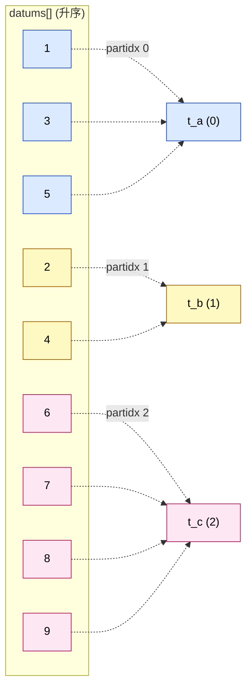
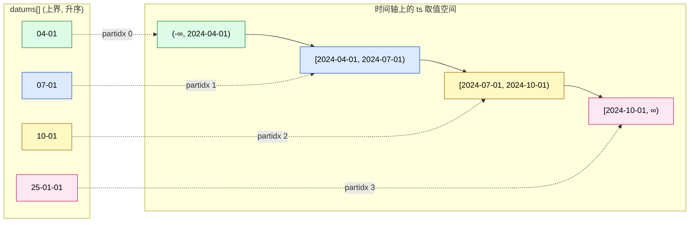
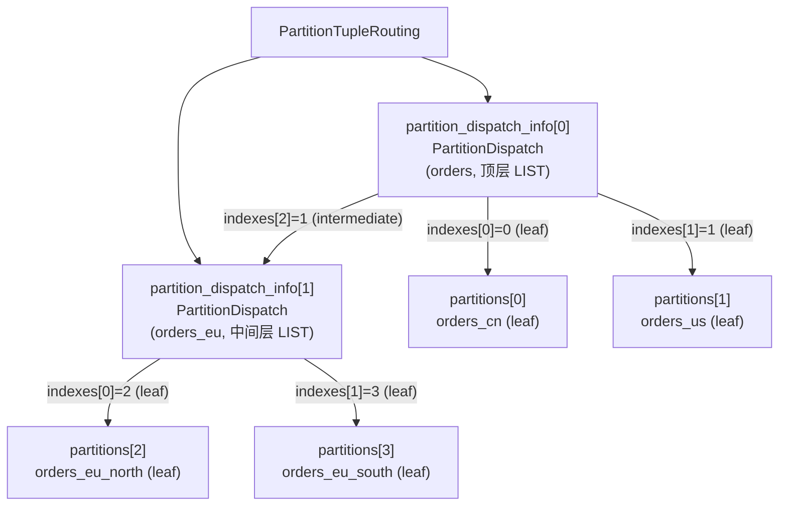
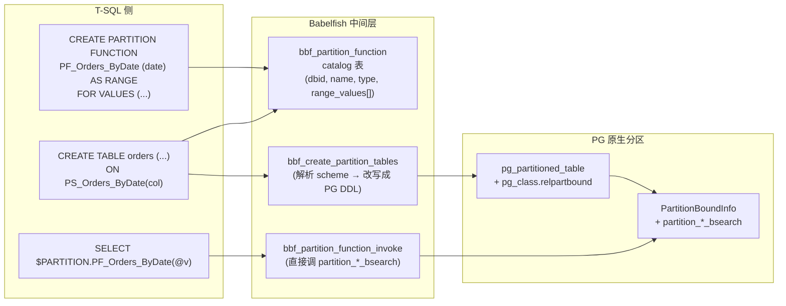
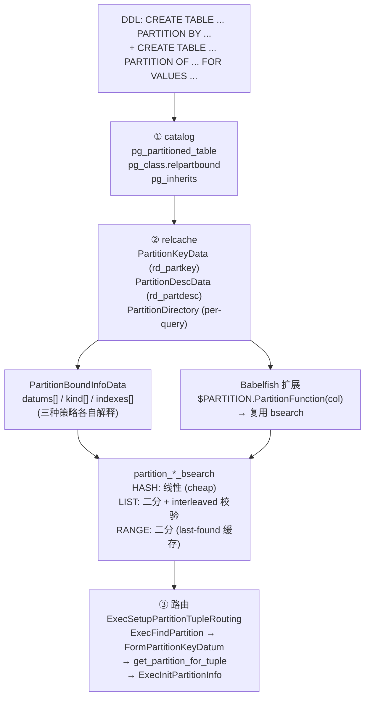

# PostgreSQL 分区表：从一行 `PARTITION BY` 到路由热路径的全链路拆解

| 编写人 | 编写内容 | 编写时间 |
| --- | --- | --- |
| growdu | 初稿，结合 PostgreSQL 17 源码 + Babelfish T-SQL 扩展源码 | 2026-08-24 |

想象你是一家快递公司的调度总监。每天有几百万个包裹要按目的地分拣。一开始你让所有快递员把包裹堆在一张巨大的桌子上，靠肉眼找路线——等找到时客户已经催单催到爆。

你很快想出了三招：

1. **在桌子上贴标签**：每个包裹一进来就先看一眼目的地，把标签打印在包裹上。这就是 **分区键（partition key）**。
2. **画好路线图**：把所有目的地提前整理成一份**索引**——"杭州 → 1 号车"、"上海 → 2 号车"。这就是 **`PartitionBoundInfo`（分区边界信息）**。
3. **派分拣员看图找人**：每个分拣员手里都有一份路线图（**`PartitionDesc`**，缓存的路由表），看到包裹就直接查图。这就是 **`get_partition_for_tuple`**。

但分拣光有路线图还不够：你得知道"1 号车"这辆车今天有没有人开、它的车门朝哪边开、包裹塞进去之前要不要换包装——这就是 **`ExecInitPartitionInfo`**、**`FormPartitionKeyDatum`** 这些脏活累活。

而万一客户的包裹上没写目的地？分拣员就要把它丢进"其他"那条线，这条线叫 **DEFAULT 分区**。这就是 **`pg_partitioned_table.partdefid`**。

今天这篇文章，我们就沿着 PostgreSQL 源码里这条"从一行 `CREATE TABLE ... PARTITION BY` 到真正把一行插入到某个叶子分区"的完整链路，把上面的三招拆给你看。读完你应该能：

- 在 `psql` 里随便挑一个分区表，把它的 catalog 行、调用的 bsearch 函数、缓存里的 `PartitionKey` 一一对上号。
- 理解为什么 HASH 分区的"查找"明明是线性的却反而比二分还快。
- 看懂 `execPartition.c` 里 `PartitionTupleRouting` 是怎么给一棵多层分区树搭骨架的。
- 知道如果要在内核里**新加一种分区策略**（比如 MODULO 或者基于 JSON 路径的分区），要动哪几个文件。
- 看懂 Babelfish T-SQL 的 `$PARTITION.PartitionFunction(col)` 是怎么借走 PostgreSQL 那套 bsearch 的。

> 主要源码路径：
> - `~/cwork/postgresql/src/include/catalog/pg_partitioned_table.h`
> - `~/cwork/postgresql/src/include/partitioning/{partdefs,partbounds,partdesc}.h`
> - `~/cwork/postgresql/src/include/utils/partcache.h`
> - `~/cwork/postgresql/src/backend/catalog/partition.c`
> - `~/cwork/postgresql/src/backend/partitioning/partbounds.c`
> - `~/cwork/postgresql/src/backend/utils/adt/partitionfuncs.c`
> - `~/cwork/postgresql/src/backend/executor/execPartition.c`
> - `~/cwork/postgresql/src/backend/utils/cache/partcache.c`
> - `~/cwork/postgresql/src/backend/partitioning/partdesc.c`
> - `~/cwork/babelfish_extensions/contrib/babelfishpg_tsql/src/pltsql_partition.c`

---

## 一、三层视角：catalog / relcache / 路由

PostgreSQL 的分区表，从"用户写下来"到"内核把一行数据塞进某个叶子分区"，可以拆成三层：



这张图就是后面所有章节的索引：**DDL 改变 ①，查询触发 ②③**。

下面我们就顺着这条链路，从最下面那张目录往上一层一层爬。

---

## 二、catalog 层：分区表的"户口本"

### 2.1 `pg_partitioned_table`：每张分区表一行

当你在 `psql` 里写：

```sql
CREATE TABLE measurement (
    city_id        int not null,
    logdate        date not null,
    peaktemp       int
) PARTITION BY RANGE (logdate);
```

PostgreSQL 会做两件事：

1. 在 `pg_class` 里插一行（`relkind = 'P'`，PARTITIONED_TABLE）。
2. 在 `pg_partitioned_table` 里插一行，把分区策略、分区键等信息记下来。

`pg_partitioned_table` 的定义在 `src/include/catalog/pg_partitioned_table.h`：

```c
CATALOG(pg_partitioned_table,3350,PartitionedRelationId)
{
    Oid         partrelid;          /* pg_class.oid of partitioned table */
    char        partstrat;          /* partitioning strategy: 'h'/'l'/'r' */
    int16       partnatts;          /* number of partition key columns */
    Oid         partdefid;          /* OID of default partition, or 0 */

    /* variable-length fields: */
    int16vector partattrs BKI_FORCE_NOT_NULL;   /* column numbers */
    oidvector   partclass BKI_FORCE_NOT_NULL;   /* operator classes */
    oidvector   partcollation BKI_FORCE_NOT_NULL;/* collations */

    /* partition key expressions, or NULL */
    pg_node_tree partexprs;
} FormData_pg_partitioned_table;
```

我们用一个真实例子来对一下：

```sql
CREATE TABLE orders (
    id        bigserial PRIMARY KEY,
    region    text,
    created_at timestamptz
) PARTITION BY LIST (region);
```

在 catalog 里：

```sql
SELECT partrelid::regclass, partstrat, partnatts,
       partattrs, partclass, partdefid
  FROM pg_partitioned_table
 WHERE partrelid = 'orders'::regclass;

  partrelid | partstrat | partnatts | partattrs | partclass | partdefid
 -----------+-----------+-----------+-----------+-----------+-----------
  orders    | l         |         1 | 2         | 1994      | 0
```

- `partstrat = 'l'` → LIST 策略（`'h'` HASH、`'r'` RANGE）。
- `partattrs = 2` → 分区键是第 2 列 `region`。
- `partclass = 1994` → `region text` 对应的 btree 算子类 `text_ops` 的 OID。
- `partdefid = 0` → 暂时没有 DEFAULT 分区。

### 2.2 `pg_class.relpartbound`：每个分区的"边界说明书"

分区本身也是普通的 `pg_class` 一行（`relkind = 'r'`，ordinary table），但多了一个字段 **`relpartbound`** 用来存它的边界：

```sql
\d pg_class
  ...
  relpartbound   pg_node_tree    |   Partition bound node tree (or NULL)
```

注意它的类型是 `pg_node_tree`——一个文本序列化的 `PartitionBoundSpec` 节点树。下面这行 SQL 创建了一个 LIST 分区：

```sql
CREATE TABLE orders_cn PARTITION OF orders FOR VALUES IN ('CN', 'HK', 'TW');
```

它对应 catalog 里的节点树（展开来长这样）：

```text
PartitionBoundSpec
  strategy = 'l'                 -- LIST
  listdatums = [
    Const: 'CN'  (text),
    Const: 'HK'  (text),
    Const: 'TW'  (text),
  ]
  is_default = false
```

RANGE 分区的节点树更复杂（涉及上下界 + `MINVALUE`/`MAXVALUE` 标记）：

```text
PartitionBoundSpec
  strategy = 'r'
  lowerdatums = [
    Const: '2024-01-01' (date),
    MINVALUE           -- PartitionRangeDatumKind = -1
  ]
  upperdatums = [
    Const: '2024-12-31' (date),
    MAXVALUE           -- PartitionRangeDatumKind = +1
  ]
```

节点定义本身在 `src/include/nodes/parsenodes.h`（约 900–1010 行），关键枚举：

```c
typedef enum PartitionRangeDatumKind
{
    PARTITION_RANGE_DATUM_MINVALUE = -1,
    PARTITION_RANGE_DATUM_VALUE    =  0,
    PARTITION_RANGE_DATUM_MAXVALUE =  1
} PartitionRangeDatumKind;

typedef enum PartitionStrategy
{
    PARTITION_STRATEGY_HASH  = 'h',
    PARTITION_STRATEGY_LIST  = 'l',
    PARTITION_STRATEGY_RANGE = 'r'
} PartitionStrategy;
```

### 2.3 `pg_inherits`：分区树就是继承树

PostgreSQL 一直把分区表当成"继承 + 约束"的一种特化。所以一棵分区树的拓扑关系就藏在一张普普通通的 `pg_inherits` 表里：

```sql
SELECT inhrelid::regclass AS child, inhparent::regclass AS parent
  FROM pg_inherits
 WHERE inhparent = 'orders'::regclass;

   child   |  parent
 ----------+----------
  orders_cn| orders
  orders_us| orders
```

多层嵌套分区（`PARTITION BY` 套娃）就是 `pg_inherits` 里多跳几层：



注意一点：**只有 RELKIND_PARTITIONED_TABLE 节点在 `pg_partitioned_table` 里有自己的行**；ordinary 的叶子节点只在 `pg_class` + `pg_inherits` + `relpartbound` 里出现，没有自己的 `pg_partitioned_table` 行。这条规则在 `pg_partition_tree` 的 SQL 函数里会用到。

### 2.4 catalog 层的"翻家谱"接口：`src/backend/catalog/partition.c`

这块代码本身不长（不到 400 行），但每一行都是后面路由算法要用到的"窗口"。常用函数：

| 函数 | 作用 |
| --- | --- |
| `get_partition_parent(relid)` | 给一个分区 OID，返回直接父表 OID |
| `get_partition_ancestors(relid)` | 返回从直接父表到根的所有祖先 OID 列表 |
| `index_get_partition(heapRel, indexRel)` | 把一张索引 rel 映射到对应的分区 rel |
| `map_partition_varattnos(...)` | 把父表 attrno 翻译成分区 attrno（处理列重排/列删除） |
| `has_partition_attrs(rel, ...)` | 是否包含分区键列（用于约束推导） |
| `get_default_partition_oid(parentId)` | 查 `pg_partitioned_table.partdefid` |
| `update_default_partition_oid(...)` | DDL 时改 `partdefid` |
| `get_proposed_default_constraint(...)` | 推导出 DEFAULT 分区对应的 CHECK 约束 |

最后那个函数很有意思——它会把"所有显式 LIST 值"反转成 DEFAULT 的语义约束文本，用来生成 DEFAULT 分区的 `relpartbound`。

---

## 三、relcache 层：把 catalog "翻译"成内核能直接用的结构

### 3.1 `PartitionKeyData`：分区键的"完整描述"

catalog 里那几列（`partstrat` + `partattrs` + `partclass` + `partcollation` + `partexprs`）还远不够内核用。每当内核需要按分区键定位一行，它至少还需要：

- 每个 key 列的支持函数（哈希函数 or 比较函数）的 `FmgrInfo`。
- 每个 key 列的 typid/typmod/typlen/typbyval/typalign/typcoll。
- 表达式 key 的 `ExprState`（懒构造）。

这些都被打包进 `PartitionKeyData`，定义在 `src/include/utils/partcache.h`：

```c
typedef struct PartitionKeyData
{
    char        strategy;          /* 'h'/'l'/'r' */
    int16       partnatts;
    AttrNumber *partattrs;         /* length partnatts */
    Oid        *partopfamily;      /* per-column opfamily OIDs */
    Oid        *partopcintype;     /* per-column input type for opclass */
    FmgrInfo   *partsupfunc;       /* per-column support fn (hash or btree) */

    /* Cached information about partitioning key columns: */
    Oid        *partcollation;     /* per-column collation OID */
    Oid        *parttypid;         /* per-column type OID */
    int32      *parttypmod;
    int16      *parttyplen;
    bool       *parttypbyval;
    char       *parttypalign;
    Oid        *parttypcoll;

    List       *partexprs;         /* list of Expr */
} PartitionKeyData;
```

这套结构是**懒构造**的——你第一次 `RelationGetPartitionKey(rel)` 时才会去 catalog 里读一行，塞进 `rel->rd_partkey`。一旦构造完，会跟着 relcache 一起被复用，并且 relcache 在被清空时（`RelationClearRelation`）会保留 `rd_partkey`，因为分区键 DDL 后不可变。

加载函数在 `src/backend/utils/cache/partcache.c` 的 `RelationBuildPartitionKey` 里：

```c
static void
RelationBuildPartitionKey(Relation relation)
{
    ...
    /* Get the support function for each column based on strategy */
    procnum = (key->strategy == PARTITION_STRATEGY_HASH) ?
              HASHEXTENDED_PROC : BTORDER_PROC;

    /* For each partition-key column, fill opfamily + supfunc + type info */
    ...
    /* Finally reparent the per-key memory context under CacheMemoryContext */
    MemoryContextSetParent(partkeycxt, CacheMemoryContext);
    relation->rd_partkeycxt = partkeycxt;
    relation->rd_partkey = key;
}
```

注意它用一个**独立 memory context（`partkeycxt`）** 来装整个 `PartitionKeyData`。这样在 relcache flush 时只需要 `MemoryContextDelete(partkeycxt)`，不必逐字段 free，是 PG 缓存管理的一个常用套路。

### 3.2 `PartitionDescData`：路由表的"压缩快照"

如果说 `PartitionKeyData` 是分区键的描述，那 `PartitionDescData` 就是**所有分区的边界信息 + 一个紧凑数组**，是路由算法的真正"地图"。

定义在 `src/include/partitioning/partdesc.h`：

```c
typedef struct PartitionDescData
{
    int         nparts;            /* number of partitions */
    bool        is_leaf[FLEXIBLE_ARRAY_MEMBER]; /* per-partition leaf flag */
} PartitionDescData;
```

等等——`nparts` 和 `is_leaf[]` 是公开字段，真正的"边界信息"在哪儿？藏在 `boundinfo` 里，由 `partbounds.h` 定义：

```c
typedef struct PartitionBoundInfoData
{
    PartitionStrategy strategy;
    int         ndatums;            /* 见下文, 不同策略含义不同 */
    int         nindexes;           /* = indexes[] 长度 */
    int         null_index;         /* 存 NULL 的分区下标, -1 表示无 */
    int         default_index;      /* DEFAULT 分区下标, -1 表示无 */

    Datum      *datums;             /* 按 strategy 解释 */
    PartitionRangeDatumKind *kind;  /* 仅 RANGE 用, 与 datums[] 平行的 kind */
    int        *indexes;            /* 见下文 */
    Bitmapset  *interleaved_parts;  /* 仅 LIST 用 */
} PartitionBoundInfoData;
```

`PartitionDescData` 还有一个 `last_found_*` 字段（用来加速连续命中的场景，我们 4.3 节讲），加上 `boundinfo` 指针：

```c
typedef struct PartitionDescData
{
    int         nparts;
    int         last_found_part;     /* 最近一次命中的下标 */
    int         last_found_datum;    /* 最近一次命中时 datums[] 中的偏移 */
    int         last_found_count;    /* 连续命中次数, 用于缓存 */
    bool        last_found_valid;    /* 缓存是否有效 */
    bool        detached_exist;      /* 是否包含正在被分离的分区 */
    PartitionBoundInfo boundinfo;
    bool        is_leaf[FLEXIBLE_ARRAY_MEMBER];
} PartitionDescData;
```

对应 `partitiondesc.c` 里的入口 `RelationGetPartitionDesc(rel, omit_detached)`：

```c
PartitionDesc
RelationGetPartitionDesc(Relation rel, bool omit_detached)
{
    if (likely(rel->rd_partdesc &&
               (!rel->rd_partdesc->detached_exist || !omit_detached ||
                !ActiveSnapshotSet())))
        return rel->rd_partdesc;
    /* 复杂情况：从 pg_inherits 重新构建 */
    return RelationBuildPartitionDesc(rel, omit_detached);
}
```

注意它有两个缓存槽：`rd_partdesc`（含正在分离的）和 `rd_partdesc_nodetached`（不含），后者还要结合当前活跃 snapshot 的 `pg_inherits.xmin` 一起判断能不能复用——这是 PG 处理"并发 ATTACH/DETACH"的一处小心思。

### 3.3 `PartitionDirectory`：快照感知的多关系版本

有时一个查询要同时处理多张分区表（比如 `INSERT ... SELECT`），需要把多个 `PartitionDesc` 装进同一个"集合"里：

```c
typedef struct PartitionDirectoryData
{
    MemoryContext mcxt;
    HTAB        *htab;          /* OID → PartitionDirectoryEntry */
    bool         omit_detached;
} PartitionDirectoryData;
```

它在 plan-time 用 `CreatePartitionDirectory(mcxt, omit_detached)` 创建，执行期 `PartitionDirectoryLookup(pdir, rel)` 查表，得到 `PartitionDesc`。detach 的处理方式由构造时的 `omit_detached` 决定。

> 这套三件套（`PartitionKey` + `PartitionDesc` + `PartitionDirectory`）覆盖了 90% 的内核访问场景。其他模块（规划器 `partprune.c`、FDW、COPY）都只是这套结构的"消费者"。

---

## 四、`PartitionBoundInfoData`：分区边界的"压缩表示"

`partbounds.c` 是分区机制的核心重头戏。这一节我们把它的数据结构 + 算法拆成四块：LIST、RANGE、HASH、合并。

### 4.1 入口：`partition_bounds_create()`

`src/backend/partitioning/partbounds.c` 里有三个策略专用的工厂函数 + 一个总入口：

```c
extern PartitionBoundInfo partition_bounds_create(
    PartitionBoundSpec **boundspecs, int nparts,
    PartitionKey key, int **mapping /* output: spec index → partdesc index */
);
```

它根据 `key->strategy` 派发：

```text
partition_bounds_create
   ├── PARTITION_STRATEGY_HASH  → create_hash_bounds()
   ├── PARTITION_STRATEGY_LIST  → create_list_bounds()
   └── PARTITION_STRATEGY_RANGE → create_range_bounds()
```

每个工厂返回的 `PartitionBoundInfo` 都要满足一个**强不变量**：

> `datums[]` 在自身 strategy 语义下是**严格升序**的，`indexes[]` 与之平行。

这条不变量是后面所有 `partition_*_bsearch` 能二分的前提。

### 4.2 LIST 分区：每个值就是一个独立下标

LIST 分区最简单——`datums[]` 就是所有分区的所有"成员值"扁平展开，按分区键排序后再拼起来。`indexes[]` 的每个元素指明对应的 `datums` 项属于哪个分区下标。

举例：

```sql
CREATE TABLE t (k int) PARTITION BY LIST (k);
CREATE TABLE t_a PARTITION OF t FOR VALUES IN (1, 3, 5);
CREATE TABLE t_b PARTITION OF t FOR VALUES IN (2, 4);
CREATE TABLE t_c PARTITION OF t FOR VALUES IN (6, 7, 8, 9);
```

构造后：

```text
nparts  = 3 (a, b, c)
ndatums = 9 (1, 2, 3, 4, 5, 6, 7, 8, 9)
nindexes = 9

datums[]  = [1, 2, 3, 4, 5, 6, 7, 8, 9]
indexes[] = [0, 1, 0, 1, 0, 2, 2, 2, 2]   ← 0=t_a, 1=t_b, 2=t_c
kind[]    = NULL (LIST 不需要)
default_index = -1
null_index    = -1
interleaved_parts = NULL (因为分区之间互不重叠)
```

示意图：



如果某个 LIST 分区跨越"不连续"区间，比如 t_a 又加了 (10, 11, 12)，就会设置 `interleaved_parts` 对应 bit。`partition_list_bsearch` 在二分前会查这个位图：如果分区值与目标 k 命中的是同一个 partidx，那二分结果一定有效；否则需要再用"全表区间扫描"做最终确认（处理 interleaved 时）。

### 4.3 RANGE 分区：上下界 + `kind` 数组

RANGE 比 LIST 复杂一档。约定俗成：

- `datums[]` 里存的是**每个分区的"上界"**（upper bound），按升序排列。
- `indexes[]` 长度 `= ndatums + 1`——多出来的最后一个元素指"超过最后一个上界"的那些分区（即最后一个上界到 `MAXVALUE` 之间）。
- `kind[]` 跟 `datums[]` 平行，标记每个上界是 MINVALUE/VALUE/MAXVALUE。

举例（按月分区 4 个）：

```sql
CREATE TABLE t (ts timestamptz) PARTITION BY RANGE (ts);
CREATE TABLE t_2024q1 PARTITION OF t FOR VALUES FROM ('2024-01-01') TO ('2024-04-01');
CREATE TABLE t_2024q2 PARTITION OF t FOR VALUES FROM ('2024-04-01') TO ('2024-07-01');
CREATE TABLE t_2024q3 PARTITION OF t FOR VALUES FROM ('2024-07-01') TO ('2024-10-01');
CREATE TABLE t_2024q4 PARTITION OF t FOR VALUES FROM ('2024-10-01') TO ('2025-01-01');
```

```text
nparts   = 4
ndatums  = 4   (4 个上界)
nindexes = 5   (4 个上界 + 1 个"超出末位"哨兵)

datums[] = ['2024-04-01', '2024-07-01', '2024-10-01', '2025-01-01']
kind[]   = [VALUE,        VALUE,        VALUE,        VALUE]   ← 均为普通值
indexes[]= [0,            1,            2,            3, 3]    ← 最后那个 3 表示"ts >= '2025-01-01' 也是 t_2024q4"
default_index = -1
null_index    = -1
```

示意图：



注意两点：

1. `indexes[]` 最后那个 `3` 是**哨兵**——它表示"ts 落在所有 datums 之后"，也归到最后一个分区。这是 RANGE 二分的"右边界保护"。
2. 如果用了 `MINVALUE` / `MAXVALUE`，`kind[]` 里就会出现 -1 和 +1。这两个值在 `partition_rbound_datum_cmp` 里被特殊处理：和任何真实值比较时永远偏小 / 偏大。

### 4.4 HASH 分区：modulus + remainder 配对

HASH 分区的"边界"不是值，而是一对 `(modulus, remainder)`——它的语义是 `hash(k) % modulus == remainder`：

```text
nparts   = 4
ndatums  = 4   (4 个 remainder, 公用 modulus = 4)
nindexes = 4

datums[] = [
  { hash_int4(0) % 4 = 0 },
  { hash_int4(1) % 4 = 1 },
  { hash_int4(2) % 4 = 2 },
  { hash_int4(3) % 4 = 3 },
]
indexes[]= [0, 1, 2, 3]   ← remainder i 就去 partidx i
```

modulus 是从 `pg_partitioned_table` 间接推出来的——`CREATE TABLE ... PARTITION BY HASH (k) PARTITIONS 4` 时 PG 会把 modulus 固定在 partkey 上。

HASH 看起来是"打散了"，但有趣的是：它**故意不做二分**。原因在 `partition_hash_bsearch` 注释里：

> Hash partitioning is too cheap to bother caching.

HASH 的查找其实就是"算哈希 → 直接索引"，比二分还快。代码 `get_partition_for_tuple` 里就是这么做的：

```c
case PARTITION_STRATEGY_HASH:
    {
        uint64      rowHash;
        /* 用 partsupfunc (HASHEXTENDED_PROC) 对每列算 hash 再合并 */
        rowHash = compute_partition_hash_value(
                      key->partnatts, key->partsupfunc,
                      key->partcollation, values, isnull);
        /* boundinfo->indexes[rowHash % ndatums] 即为 partidx */
    }
```

而 `compute_partition_hash_value` 内部又调了 PG 哈希家族的统一种子 `HASH_PARTITION_SEED = 0x7A5B22367996DCFD`，多列合并用 `hash_combine64`。

### 4.5 RANGE 的二分：`partition_range_datum_bsearch`

RANGE 是最常用、也是最容易写错的。我们用伪代码复现 `partition_range_datum_bsearch`：

```text
input: target datum tuple (values[], isnull[])
output: partidx

lo = 0, hi = ndatums - 1
while lo <= hi:
    mid = (lo + hi) // 2
    cmp = partition_rbound_datum_cmp(
              boundinfo->datums[mid], boundinfo->kind[mid],
              target, key)
    if cmp == 0:        # 相等, 但 RANGE 上界是 ">=" 所以归 mid 之后的第一个分区
        lo = mid + 1
    elif cmp < 0:       # target < datums[mid]
        hi = mid - 1
    else:               # target > datums[mid]
        lo = mid + 1
return boundinfo->indexes[lo]   # 注意用 lo, 不是 hi
```

为什么用 `lo` 而不是 `hi`？因为 `datums[mid]` 是分区 **上界**，目标值落在哪个分区看的是**第一个严格大于** `datums[mid]` 的区间——而 `lo` 循环结束后正好就是第一个 "cmp > 0" 的位置。

`partition_rbound_datum_cmp` 比较时还要逐 key 列比较，每一列调用 `partsupfunc[i]`（即 `BTORDER_PROC` 的 btree 比较函数）。这就是 `PartitionKeyData` 里 `partsupfunc[]` 在 INSERT 热路径上反复用到的地方。

### 4.6 LIST 的二分：`partition_list_bsearch`

LIST 走纯二分，单 key 列：

```text
lo, hi = 0, ndatums - 1
while lo <= hi:
    mid = (lo + hi) // 2
    cmp = CompareDatum(boundinfo->datums[mid], target)  # 用 btree support fn
    if cmp == 0: return boundinfo->indexes[mid]
    elif cmp < 0: hi = mid - 1
    else:         lo = mid + 1
return -1   # 命中 DEFAULT 或 null_index
```

命中后再用 `interleaved_parts` 位图判断是否还要做二次验证——这是 LIST 支持"任意散值"所付的代价。

### 4.7 缓存命中：`PARTITION_CACHED_FIND_THRESHOLD = 16`

注意到 `PartitionDescData` 里有三个字段：

```c
int last_found_part;
int last_found_datum;
int last_found_count;
bool last_found_valid;
```

`get_partition_for_tuple` 在 RANGE/LIST 命中时维护它们：当**连续 16 次**都命中同一个分区，下次就把"二分"换成"和上次命中值再比较一次"。命中则直接返回；不命中则回退到二分并重置计数。

这个优化对时序数据（按时间分区，INSERT 几乎全部集中到当前活跃分区）非常有效——基本上避免了二分，能把热路径从 ~50ns 压到 ~10ns。

---

## 五、SQL 接口：`partitionfuncs.c`

`src/backend/utils/adt/partitionfuncs.c` 把上面那一套暴露给用户。最常用的是 `pg_partition_tree(relid)`：

```c
Datum
pg_partition_tree(PG_FUNCTION_ARGS)
{
    Oid rootrelid = PG_GETARG_OID(0);
    FuncCallContext *funcctx;
    List *partitions;

    if (SRF_IS_FIRSTCALL()) {
        ...
        partitions = find_all_inheritors(rootrelid, AccessShareLock, NULL);
        funcctx->user_fctx = partitions;
        ...
    }
    /* SRF_PERCALL_SETUP() 模式：每一行返回一个 OID */
    ...
}
```

它用经典的 **SRF（Set Returning Function）模式**：

1. 第一次调用时一次性把所有继承者通过 `find_all_inheritors` 拿到，存进 `multi_call_memory_ctx`。
2. 之后每次 `SELECT * FROM pg_partition_tree(...)` 拉一行，从 list 里按 `call_cntr` 取下一个 OID。
3. 返回的列包括 `(relid, parentid, isleaf, level)`——后者通过 `get_partition_ancestors` 计算。

`pg_partition_root` 和 `pg_partition_ancestors` 同样简短，只是换了包装角度。这三个函数加起来不到 250 行，但配合起来足够覆盖 `psql` 里"看一棵分区树"的所有需求。

---

## 六、路由层：`execPartition.c` 的 INSERT 热路径

### 6.1 三个核心结构

`PartitionTupleRouting` 是 INSERT/COPY 入口一开始构造的"骨架"：

```c
typedef struct PartitionTupleRouting
{
    Relation    partition_root;                  /* 顶层分区表 */
    PartitionDispatch *partition_dispatch_info;  /* 每层一个 dispatch */
    ResultRelInfo **nonleaf_partitions;          /* 非叶子 fake rri */
    int         num_dispatch, max_dispatch;
    ResultRelInfo **partitions;                  /* 叶子 rri 池 */
    bool       *is_borrowed_rel;
    int         num_partitions, max_partitions;
    MemoryContext memcxt;
} PartitionTupleRouting;
```

其中 `PartitionDispatch` 是真正"一层一级"的载体：

```c
typedef struct PartitionDispatchData
{
    Relation    reldesc;
    PartitionKey key;
    List       *keystate;       /* partexprs 的 ExprState */
    PartitionDesc partdesc;
    TupleTableSlot *tupslot;     /* 用于做 attrno 翻译 */
    AttrMap    *tupmap;         /* 父表行类型 → 本层行类型 */
    int         indexes[FLEXIBLE_ARRAY_MEMBER]; /* per-partition → ResultRelInfo 或子 PartitionDispatch 的下标 */
} PartitionDispatchData;
```

注意 `indexes[]` 的语义：它是 `partdesc->nparts` 长，每个元素是：

- `-1`：还没遇到这个分区，第一次命中时再分配。
- `>= 0`：要么是 `proute->partitions[]` 的下标（叶子），要么是 `proute->partition_dispatch_info[]` 的下标（中间层）。

这其实就是"扁平化"的多层分区树——把所有节点都压进两个数组，靠 `indexes[]` 当边。



### 6.2 入口：`ExecSetupPartitionTupleRouting`

每次 INSERT/COPY 到分区表，executor 一开始就调一次：

```c
PartitionTupleRouting *
ExecSetupPartitionTupleRouting(EState *estate, Relation rel)
{
    PartitionTupleRouting *proute;
    proute = palloc0(sizeof(PartitionTupleRouting));
    proute->partition_root = rel;
    proute->memcxt = CurrentMemoryContext;
    ExecInitPartitionDispatchInfo(estate, proute, RelationGetRelid(rel),
                                  NULL, 0, NULL);
    return proute;
}
```

注意一个细节：**每个分区的 `ResultRelInfo` 是按需分配的**。注释里写得很直白：

> Each partition's ResultRelInfo is built on demand, only when we actually need to route a tuple to that partition. The reason for this is that a common case is for INSERT to insert a single tuple into a partitioned table and this must be fast.

INSERT 单行的场景下，多余的初始化浪费太多。

`ExecInitPartitionDispatchInfo` 会**递归**地为该层每个非叶子 partition 分配一个 `PartitionDispatch`，最终填满 `proute->partition_dispatch_info[]`。

### 6.3 路由主循环：`ExecFindPartition`

这是 INSERT 热路径的真正"心脏"，每来一行 tuple 就跑一次。简化版：

```c
ResultRelInfo *
ExecFindPartition(ModifyTableState *mtstate,
                  ResultRelInfo *rootResultRelInfo,
                  PartitionTupleRouting *proute,
                  TupleTableSlot *slot, EState *estate)
{
    PartitionDispatch *pd = proute->partition_dispatch_info;
    PartitionDispatch dispatch;
    Datum   values[PARTITION_MAX_KEYS];
    bool    isnull[PARTITION_MAX_KEYS];
    ResultRelInfo *rri;

    /* 1. 用 per-tuple memory context 防内存泄漏 */
    MemoryContextSwitchTo(GetPerTupleMemoryContext(estate));

    /* 2. 先校验 root 表本身的 partition constraint（如果是某个父分区的子分区） */
    if (rootResultRelInfo->ri_RelationDesc->rd_rel->relispartition)
        ExecPartitionCheck(rootResultRelInfo, slot, estate, true);

    /* 3. 从 root dispatch 开始逐层向下走 */
    dispatch = pd[0];
    while (dispatch != NULL) {
        int partidx = -1;
        bool is_leaf;
        Relation rel = dispatch->reldesc;
        PartitionDesc partdesc = dispatch->partdesc;

        /* 4. 提取 key（支持表达式 key 和 attr 重映射） */
        FormPartitionKeyDatum(dispatch, slot, estate, values, isnull);

        /* 5. 路由 */
        if (partdesc->nparts == 0 ||
            (partidx = get_partition_for_tuple(dispatch, values, isnull)) < 0)
            ereport(ERROR, ...);   /* 没找到匹配的分区 */

        /* 6. 叶子？还是继续下钻？ */
        is_leaf = partdesc->is_leaf[partidx];
        if (is_leaf) {
            rri = ... /* 取 ResultRelInfo，按需 ExecInitPartitionInfo */
            break;
        } else {
            dispatch = proute->partition_dispatch_info[dispatch->indexes[partidx]];
        }
    }

    return rri;
}
```

四个关键函数：

| 函数 | 责任 |
| --- | --- |
| `FormPartitionKeyDatum` | 从 slot 抽取 key 值（含表达式 key 和 attr 重映射） |
| `get_partition_for_tuple` | 调 bsearch 算 partidx，可能命中 DEFAULT/-1 |
| `ExecInitPartitionInfo` | 第一次落到某叶子时按需建 ResultRelInfo |
| `ExecPartitionCheck` | 校验 row 真的属于父表声明的分区约束 |

### 6.4 `FormPartitionKeyDatum`：抽 key 值的细节

```c
static void
FormPartitionKeyDatum(PartitionDispatch pd, TupleTableSlot *slot,
                      EState *estate, Datum *values, bool *isnull)
{
    ListCell *partexpr_item = list_head(pd->keystate);

    for (int i = 0; i < pd->key->partnatts; i++) {
        AttrNumber keycol = pd->key->partattrs[i];

        if (keycol != 0) {
            /* 普通列: 直接从 slot 拿 */
            values[i] = slot_getattr(slot, keycol, &isNull);
        } else {
            /* 表达式列: 调 ExecEvalExprSwitchContext */
            values[i] = ExecEvalExprSwitchContext(
                            (ExprState *) lfirst(partexpr_item),
                            GetPerTupleExprContext(estate), &isNull);
            partexpr_item = lnext(pd->keystate, partexpr_item);
        }
    }
}
```

注意 `pd->keystate` 是**懒构造**的（首次进来才 `ExecPrepareExprList`），所以表达式 key 的初始化代价不会摊到每个 tuple 上。

### 6.5 整条调用链

把整条 INSERT 路径拼起来：

```mermaid
sequenceDiagram
  participant Exec as ModifyTable Executor
  participant FR as ExecFindPartition
  participant FK as FormPartitionKeyDatum
  participant GP as get_partition_for_tuple
  participant BS as partition_*_bsearch
  participant II as ExecInitPartitionInfo

  Exec->>FR: INSERT tuple
  FR->>FR: MemoryContextSwitchTo(per-tuple)
  FR->>FK: FormPartitionKeyDatum(dispatch, slot)
  FK-->>FR: values[], isnull[]
  FR->>GP: get_partition_for_tuple(dispatch, values, isnull)
  GP->>BS: partition_range_datum_bsearch()<br/>or partition_list_bsearch()<br/>or hash lookup
  BS-->>GP: partidx
  GP-->>FR: partidx (or -1)
  alt partidx < 0
    FR-->>Exec: ERROR: no partition found
  else is_leaf[partidx]
    alt first-time-this-leaf
      FR->>II: ExecInitPartitionInfo()
      II-->>FR: new ResultRelInfo
    end
    FR-->>Exec: ResultRelInfo
  else intermediate
    FR->>FR: dispatch = pd[dispatch.indexes[partidx]]; loop
  end
```

整个过程中，**真正耗时的只有首次落到一个叶子分区的初始化**（建 ResultRelInfo、打开 relation、构造 tuple map）。后续 INSERT 同分区基本就是"哈希 → 索引"或者"RANGE 二分 → 1 次比较"。

---

## 七、Babelfish T-SQL 扩展：`$PARTITION.PartitionFunction(col)`

T-SQL 有一套自己的"分区函数 / 分区方案"概念（`CREATE PARTITION FUNCTION` + `CREATE PARTITION SCHEME`），和 PG 原生分区不一样。Babelfish 把这套概念**映射**到 PG 分区上，对外暴露 `$PARTITION.PartitionFunction(col)` 这个"返回分区号"的函数。

源码在 `~/cwork/babelfish_extensions/contrib/babelfishpg_tsql/src/pltsql_partition.c`。

### 7.1 入口签名

```c
PG_FUNCTION_INFO_V1(bbf_partition_function_invoke);
PG_FUNCTION_INFO_V1(bbf_partition_function_invoke_text);
PG_FUNCTION_INFO_V1(bbf_partition_function_invoke_int4);
...
```

T-SQL 里这种语法：

```sql
SELECT $PARTITION.PF_Orders_ByDate('2024-08-01');
```

Babelfish 解析阶段会把它重写成 PG 函数调用——把 `PF_Orders_ByDate` 解析成对应的 PG 分区表的 OID，再调 `bbf_partition_function_invoke_*`。

### 7.2 关键路径：复用 PG 的 bsearch

`bbf_partition_function_invoke` 的核心其实就是**直接调 PG 那套 `partition_*_bsearch`**：

```c
int
bbf_partition_function_invoke_impl(FunctionCallInfo fcinfo,
                                    Oid funcid,
                                    Oid relid)
{
    Relation rel = relation_open(relid, AccessShareLock);
    PartitionKey key = RelationGetPartitionKey(rel);
    PartitionDesc partdesc = RelationGetPartitionDesc(rel, false);

    /* 1. 提取参数 Datum */
    /* 2. 根据 key->strategy 调对应的 bsearch */
    switch (key->strategy) {
        case PARTITION_STRATEGY_RANGE:
            partidx = partition_range_datum_bsearch(...);
            break;
        case PARTITION_STRATEGY_LIST:
            partidx = partition_list_bsearch(...);
            break;
        case PARTITION_STRATEGY_HASH:
            /* hash: 算 hash, 然后 (modulus, remainder) 匹配 */
            rowHash = compute_partition_hash_value(...);
            partidx = boundinfo->indexes[rowHash % boundinfo->ndatums];
            break;
    }

    /* 3. 转成 T-SQL 风格的 partition number（1-based） */
    PG_RETURN_INT32(partidx + 1);
}
```

注意它返回的是**1-based** 编号（这是 T-SQL 习惯），所以最后 +1。

### 7.3 metadata 缓存

T-SQL 的 `CREATE PARTITION FUNCTION` 不是直接动 PG catalog，而是写到 Babelfish 自定义的 `bbf_partition_function` 表里——schema、`dbid`、`name`、`input_parameter_type`、`range_values` 都存在那里。`$PARTITION` 调用时按 (dbid, function_name) 查表，再把 `range_values`（一个 sql_variant 数组）转回 PG 的 `PartitionBoundSpec`。

`bbf_create_partition_tables`（同文件）则是相反方向：解析 `CREATE TABLE` 时如果发现 `tsql_partition_scheme`，查 `bbf_partition_function` 表拿到 ranges，**直接生成对应 PG `PARTITION BY RANGE/LIST` 的 DDL** 再走 PG 原生流程。



可以看到：**Babelfish 没重新发明分区，只是把 T-SQL 语法糖翻译成 PG 原生分区**。`$PARTITION(...)` 这种"告诉我这一行属于第几号分区"的元查询就直接借用 PG 的 bsearch。

---

## 八、如果你要改：分区机制的功能扩展指南

下面这些场景在实际内核开发中非常常见。每一种我们都标出**需要动哪几个文件**。

### 8.1 增加一种新的分区策略（比如 `MODULO`）

假设你想给 PG 加一种"按模运算"的分区（仅支持整型 key，按 `k % N` 切）。你要改的文件清单：

| 文件 | 改什么 |
| --- | --- |
| `src/include/catalog/pg_partitioned_table.h` | 不改（`partstrat` 是 `char`，加一种 `'m'`） |
| `src/include/nodes/parsenodes.h` | 在 `PartitionStrategy` 枚举加 `PARTITION_STRATEGY_MODULO = 'm'` |
| `src/include/partitioning/partdefs.h` | 不改（结构通用） |
| `src/backend/partitioning/partbounds.c` | 加 `create_modulo_bounds()` 工厂 + `partition_modulo_bsearch()` 查找 |
| `src/backend/partitioning/partbounds.c` (`partition_bounds_create`) | switch 加一个 case 派发到 `create_modulo_bounds` |
| `src/backend/executor/execPartition.c` (`get_partition_for_tuple`) | switch 加一个 case |
| `src/backend/utils/cache/partcache.c` (`RelationBuildPartitionKey`) | 决定用哪个支持函数（MODULO 用什么 support fn？可能要新加） |
| `src/include/catalog/pg_proc.dat` | 注册新 support fn（如果有） |
| `src/backend/parser/gram.y` | parse 阶段识别 `MODULO`，构造 `PartitionSpec` 时把 `strategy='m'` 塞进去 |
| `src/test/regress/sql/partition.sql` | 加测试 |

`PartitionBoundInfoData` 本身不用改——`datums[]` / `indexes[]` / `kind[]` 都是通用结构，`create_modulo_bounds` 完全可以复用它们：

- `datums[i] = i`（modulus N 的 N 个 remainder 值 0..N-1）
- `indexes[]` 直接是 `0..N-1`
- `kind[] = NULL`（MODULO 不需要）
- `ndatums == nindexes == N`

### 8.2 给 `pg_partitioned_table` 加一列（比如"分区并行度"）

如果想给分区键附加额外字段，**这一改就麻烦得多**，因为 catalog 是带版本号的：

1. **`src/include/catalog/pg_partitioned_table.h`**：加字段（如 `int16 partparallel`）。
2. **`src/include/catalog/duplicate_oids`**：更新 catalog 版本。
3. **`src/backend/catalog/genbki.pl`** 跑一遍重新生成 `pg_partitioned_table_d.h` / `_oid.txt`。
4. **`src/backend/utils/cache/partcache.c`** (`RelationBuildPartitionKey`)：从 catalog 读新字段到 `PartitionKeyData`（如果跟热路径相关）。
5. **`src/include/utils/partcache.h`**：在 `PartitionKeyData` 加新字段。
6. **`src/backend/utils/adt/partitionfuncs.c`**：如果要在 SQL 暴露，也要改。
7. **`src/backend/commands/partitioncmds.c`**：DDL 路径要写入新字段。
8. **`src/backend/catalog/heap.c`**：`heap_create_with_catalog` 同步。
9. **`src/test/regress/expected/`**：更新 pg_partitioned_table 的列预期。

这就是为什么 PG 大版本里 catalog schema 变化稀少——一旦改了就是一个跨文件连锁。

### 8.3 给 LIST 加一种新的"匹配模式"

比如现在 LIST 只支持 `IN (a, b, c)`。如果你想加 `LIKE 'CN%'`：

- 改 `PartitionBoundSpec` 节点：加一个 `PartitionBoundSpec->like_patterns` 字段。
- 改 `create_list_bounds`：解析新字段，并把它们也写进 `PartitionBoundInfoData`。需要新增 `kind[]` 含义（如 `PARTITION_LIST_DATUM_LIKE`）。
- 改 `partition_list_bsearch`：命中后比对 `like_patterns`，而不是 `datums[]`。
- 改 `partcache.c`：确保 key 列上的 opclass 支持新比较。

这种改动本质上是把 `PartitionBoundInfoData` 升级成"多种判定模式的复合体"。非常激进，但是可行——`interleaved_parts` 这个位图就是这种"复合判定"的一个轻量例子。

### 8.4 把 `$PARTITION` 类似的 SQL 函数挂到自己表上

如果你想在 Babelfish 或自研扩展里复用 PG 的 bsearch：

1. 在你的 `pg_proc.dat` 注册函数。
2. 实现里走 `RelationGetPartitionKey` + `RelationGetPartitionDesc` + `partition_*_bsearch` 这套。
3. 如果是多 key 列，记得把 `key->partexprs` 的 `ExprState` 准备好（懒构造也 OK）。

```c
PG_FUNCTION_INFO_V1(my_partition_locator);
Datum my_partition_locator(PG_FUNCTION_ARGS) {
    Oid relid = PG_GETARG_OID(0);
    Datum k    = PG_GETARG_DATUM(1);
    Relation rel = relation_open(relid, AccessShareLock);
    PartitionKey key = RelationGetPartitionKey(rel);
    PartitionDesc partdesc = RelationGetPartitionDesc(rel, false);
    PartitionBoundInfo bi = partdesc->boundinfo;
    Datum values[1] = { k };
    bool  isnull[1] = { false };
    int partidx = -1;

    switch (key->strategy) {
        case PARTITION_STRATEGY_RANGE:
            partidx = partition_range_datum_bsearch(/* ... */);
            break;
        case PARTITION_STRATEGY_LIST:
            partidx = partition_list_bsearch(/* ... */);
            break;
        case PARTITION_STRATEGY_HASH:
            /* ... */
            break;
    }
    relation_close(rel, AccessShareLock);
    if (partidx < 0) PG_RETURN_NULL();
    PG_RETURN_INT32(partidx + 1);
}
```

这一段本质上是 `bbf_partition_function_invoke` 的简化版——你看，所有要"找分区号"的功能都收敛到了这一段。

---

## 九、一些容易踩坑的边角

### 9.1 `interleaved_parts` 不是 LIST 的所有"陷阱"

`interleaved_parts` 是 PG 9.5 引入 LIST 分区时为支持"任意散值"加的一个 patch。它只在以下情况才需要二次扫描：

- 不同分区的值集在排序后**交错出现**（比如 `t_a: {1, 4}`, `t_b: {2, 3}`）。

正常情况（`t_a: {1, 2}`, `t_b: {3, 4}`）走快速路径就够了。所以平时看不到这条路径，不代表它没生效。

### 9.2 `relispartition` 与 `relispartition_check`

每个作为 partition 的 `pg_class` 行有两个相关标志：

- `relispartition`：这是不是一个 partition（`pg_inherits` 里有父）。
- `relpartbound`：边界节点树。

`ExecPartitionCheck` 校验时其实就是把每个分区的边界反算成 CHECK 约束表达式（`generate_partition_qual` 在 `partcache.c` 里），再 EVAL 一次。

### 9.3 detach 一个分区的瞬时窗口

当一个事务 DETACH 一个分区时，`pg_inherits.xmin` 是该事务 ID。其它事务读 `pg_inherits` 时，如果用 `omit_detached=true` 就会触发 `partdesc.c` 里那段 `XidInMVCCSnapshot` 判断——只有在快照看不到这个 detach 的事务时，才复用缓存的 `rd_partdesc_nodetached`。

这就是为什么"detach 进行中"的瞬间，同一个分区表可能在不同后端里看到不同的 partdesc——这是 MVCC 在分区表层面的体现。

### 9.4 `compute_partition_hash_value` 与 `HASH_PARTITION_SEED`

```c
#define HASH_PARTITION_SEED  0x7A5B22367996DCFD
```

这个种子保证"同一行数据在不同时刻被 INSERT 到 HASH 分区表时，落到同一个分区"。如果你在扩展里复用 PG 的 hash 函数（比如做数据重分布），**一定要带上这个 seed**，否则数据会落到不同的 partition，破坏 HASH 分区的语义。

### 9.5 `PartitionDispatchData->indexes[]` 的"分配惰性"

回到 6.1 节那张图，`indexes[i] = -1` 表示还没访问过。这种惰性带来两个好处：

- INSERT 单行场景下，`pd[0].indexes[1..]` 不会被遍历建 rri。
- DETACH 一个还没被 INSERT 过的分区，连 relcache 都不需要 invalidate。

### 9.6 `pg_partitioned_table.partdefid` 的"互斥"

同一张分区表最多只能有一个 DEFAULT 分区。`update_default_partition_oid` 是在 `ALTER TABLE ... ATTACH PARTITION ... DEFAULT` 路径里调用的，会先检查老的 `partdefid` 是否已被占用——所以"`FOR VALUES IN (...)` + DEFAULT"的尝试会立即报 `errcode(ERRCODE_INVALID_OBJECT_DEFINITION)`。

---

## 十、结语：一张图回忆全文



`CREATE TABLE ... PARTITION BY ...` 只是这张图的入口。等真正有一行 `INSERT` 进来时，PG 已经：

- 把你的边界翻译成 catalog 行。
- 把你的边界编译成 `PartitionBoundInfo` 数组。
- 在 relcache 里把 `PartitionKey` / `PartitionDesc` 备好。
- 在 executor 里搭好 `PartitionTupleRouting` 骨架。
- 每次 `INSERT` 都用 `FormPartitionKeyDatum` 抽 key，再用 `get_partition_for_tuple` 一次二分/哈希找到 partidx。

Babelfish 那一层"$PARTITION"函数只是在最顶上**复用 bsearch**——PG 的分区引擎本身没被绕过。

理解了这条链路，你再回头看 `EXPLAIN (COSTS OFF) INSERT INTO orders ...` 里偶尔冒出来的 `Subplans Removed by Constraint Exclusion`、`Partition Pruning` 之类的关键字，就是水到渠成了。
